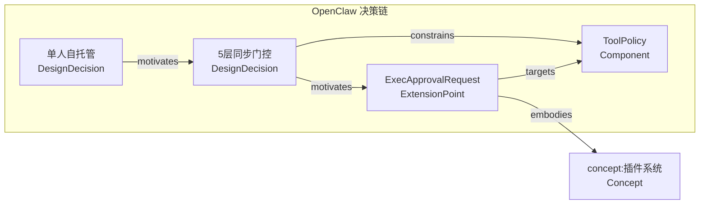

# Codebase 知识图谱设计：节点、边、架构与增量归一化

## 一、背景与问题

### 当前 codebase-wiki 的结构

codebase-wiki 通过 5 个维度（Architecture / Extension Points / Performance Tradeoffs / Dependency Strategy / Testing Philosophy）对目标代码仓库进行结构化知识提取，产出 Obsidian 兼容的 wiki 页面。分析流程为：

```
代码仓库 → delta.py(文件变更检测) → /analyze(5维度提取)
  → wiki/repos/<name>/dimensions/*.md (维度叙事页)
  → 行文中标注 [[entity wikilink]] → wiki/entities/*.md (概念页)
  → /compare 跨仓库对比矩阵 → wiki/views/ (对比视图)
```

已覆盖 2 个仓库（openclaw、hermes-agent），17 个 entity 概念页，8 条程序化 lint 规则。

### 核心问题：图谱无意义

当前 entity wikilink 系统存在三个结构性问题：

1. **Entity 扁平化。** `[[插件系统]]`（L3 架构能力）和 `[[单例模式]]`（L1 实现技法）在同一 namespace 中是平等节点。所有 entity 被分为"架构模式/技术栈/领域概念"三种表面标签，但没有层级定位。

2. **无边类型。** `[[openclaw/dimensions/architecture]]` → `[[插件系统]]` 是一条 wikilink，但它不表达方向（谁实现了谁？）、不表达语义（是 embodies 还是 realizes？）、不表达置信度。

3. **Entity 不一致不可避。** Agent A 在 architecture 维度标了 `[[插件系统]]`，Agent B 在 extension-points 维度可能标了 `[[扩展注册机制]]` 也可能不标。没有约束，没有归一化锚点。

根本原因：**一个 dimension 页不是图谱中的一个节点——它是几十个节点的叙事容器。** Dimension 页和 graph 节点是多对多关系。把 entity wikilink 散布在叙事行文中，等于把结构化图谱数据溶解在了自由文本里。

---

## 二、节点类型定义

### 抽象层级金字塔

代码本体的抽象层级决定了归一化的可行性：

```
归一化可行性
    ↑
    │  L4: System（系统）
    │      "一个自托管的 AI 助手运行时"
    │      ← 同类的 N 个 repo 在这里归一化成一个 Category
    │
    │  L3: Capability（功能/能力）← 归一化的主战场
    │      "插件系统" "上下文引擎" "权限管理" "任务调度"
    │      ← 跨仓库可比的锚点层
    │
    │  L2: Module（模块）
    │      "src/channels/plugins/" "src/context-engine/"
    │      ← 同仓库可比的中间层，跨仓库开始出现差异
    │
    │  L1: Function/Class（函数/类）
    │      "ChannelPlugin<T>" "selectAgentHarness()" "ManagedRun"
    │      ← 仓库特有，几乎不可比
    │
    └── 归一化可行性 → 越低越不可比

跨仓库可比性：L1 << L2 < L3 << L4
```

关键规则：**语义边只能连接同层节点。** L2 和 L3 之间的连接用组合边（`composes`），不是语义边。

### 四类节点

一个实体在特定仓库上下文中，有且仅有一个节点类型：

#### 1. Component（组件/子系统）— "这是什么"

系统中可定位的结构单元，在代码中有明确的目录/文件/类边界。

| 子类 | 示例（OpenClaw） | 提取信号 | 允许层级 |
|------|-----------------|---------|---------|
| 子系统 | Gateway、ContextEngine、MemoryProvider、CronScheduler | 独立目录 + 入口文件 + 独立职责 | L3 |
| 核心抽象 | ToolPolicy、Session、Channel、AgentHarness | 被多处 import 的核心类型/接口 | L2-L3 |
| 数据/状态 | ManagedRun、RunState、ExecApprovalRequest | 状态枚举/状态机/关键数据结构 | L2 |
| 模块 | `src/channels/plugins/`、`src/context-engine/` | 独立目录 | L2 |

提取方式：**可自动**。代码结构（目录/类层次）+ 文档关键词。

#### 2. ExtensionPoint（扩展点）— "怎么改"

二开可操作的定制入口，存在明确的接口、注册机制、配置项或钩子。

| 子类 | 示例（OpenClaw） | 提取信号 | 允许层级 |
|------|-----------------|---------|---------|
| 接口契约 | `AgentHarness` 接口、`ChannelPlugin<ResolvedAccount>` | `interface`/`abstract class` + 多实现 | L3 |
| 注册机制 | `OpenClawPluginApi.register*()` 25 个方法 | `register*` / `add*` / `use*` 方法 | L3 |
| 生命周期钩子 | `before_prompt_build`、`llm_input`、`llm_output` 等 28 个 hook | hook/callback/event listener 注册 | L3 |
| 配置入口 | `openclaw.plugin.json` manifest、环境变量 | config schema / env var 声明 | L2-L3 |

提取方式：**中自动化**。模式匹配（接口+多实现、注册方法、hook 签名）出候选，人工确认。

#### 3. DesignDecision（设计决策）— "为什么这样"

存在明确的"X 不选 Y 因为 Z"的因果链，且这个选择影响了后续架构。

| 子类 | 示例 | 提取信号 | 允许层级 |
|------|------|---------|---------|
| 架构取舍 | "5 层同步门控 pipeline 而非异步审计"、"Memory 在 prompt 组装时注入而非实时查询" | 设计文档 + "为什么选 A 不选 B" 句式 | L3-L4 |
| 技术选型 | "TypeScript monorepo 而非 Python 单体"、"sqlite-vec 而非 pgvector" | package.json / go.mod + 对比文档 | L3-L4 |
| 约束规则 | "全局只有一个活跃 ContextEngine"、"只有 owner 能审批 exec 类工具" | 验证逻辑 + 权限检查 + 单例模式 | L3 |

提取方式：**低自动化**。主要从设计文档、ADR、注释、高质量 commit message 提取 + LLM 推理。

#### 4. Concept（跨仓库概念）— "跨仓库可复用的抽象知识"

不绑定任何一个仓库，是可在不同仓库间映射的通用模式、范式或技术。**这是连接不同仓库图谱的锚点。**

| 子类 | 示例 | 提取信号 | 允许层级 |
|------|------|---------|---------|
| 架构模式 | 插件系统、事件驱动、分层架构、管道-过滤器 | 跨仓库结构相似度 | L3-L4 |
| 性能范式 | Prompt Caching、Context 压缩、懒加载、指数退避 | 跨仓库同名模式 | L3 |
| 技术/协议 | OpenTelemetry、MCP、TypeScript monorepo | 外部标准/协议名 | L3-L4 |

提取方式：**中自动化**。跨仓库 entity 归并 + 人工确认去重。

> **关键区分：** Concept 是**类型**（type），Component/ExtensionPoint 是**实例**（instance）。`[[插件系统]]` 作为 Concept 描述了"什么是插件系统"——OpenClaw 的 `ChannelPlugin` 是一个 ExtensionPoint 实例，它 **embodies** `[[插件系统]]` 这个 Concept。这就是当前 entity 页面扁平化的根本问题：实例和类型被放进同一个 namespace。

---

## 三、边类型定义

### 六种语义边

| # | 边类型 | 方向 | 语义 | 遍历问题 | 提取难度 |
|---|--------|------|------|---------|---------|
| 1 | **embodies** | ExtensionPoint → Concept | 这个扩展点是该概念的实例化 | "哪些仓库实现了插件系统？" | **低** — 自动 |
| 2 | **realizes** | Component → Concept | 这个组件体现了该模式/范式 | "哪些组件用了事件驱动？" | **低** — 自动 |
| 3 | **targets** | ExtensionPoint → Component | 这个扩展点作用于该组件 | "改这个 hook 会影响哪个子系统？" | **低** — 代码结构 |
| 4 | **motivates** | DesignDecision → ExtensionPoint | 这个决策催生了这个扩展点 | "这个扩展点为什么存在？" | **高** — 需因果推理 |
| 5 | **constrains** | DesignDecision → Component | 这个决策限制了该组件的行为边界 | "为什么这个子系统不能做 X？" | **中** — 文档+代码 |
| 6 | **alternative_to** | DesignDecision ↔ DesignDecision | 这是同一问题下的备选方案 | "当时还考虑了哪些方案？" | **高** — 设计文档 |

### 边的类型约束

每条边对源/目标节点类型有严格约束：

```
embodies:      ExtensionPoint ──────→ Concept
realizes:      Component ───────────→ Concept
targets:       ExtensionPoint ──────→ Component
motivates:     DesignDecision ──────→ ExtensionPoint
constrains:    DesignDecision ──────→ Component
alternative_to: DesignDecision ↔ DesignDecision
```

不允许的边（自动校验）：
- `Concept → Component`（❌ 概念不能"实现"组件，方向反了）
- `ExtensionPoint → ExtensionPoint`（❌ 扩展点之间没有直接关系，需通过 DesignDecision 或 Component 中转）
- `constrains Component → Component`（❌ 只有决策能产生约束，组件之间是依赖不是约束）
- 跨层级语义边（❌ L2 节点和 L3 节点之间不建语义边，用 `composes` 组合边连接）

### 四种知识发现（受众驱动）

| 受众 | 核心问题 | 图谱遍历 | 依赖的边 |
|------|---------|---------|---------|
| 二开人员 | 改这里会波及什么？ | Component → 沿 constrains 找到决策 → 沿 constrains 找到受影响的其他 Component | constrains + targets |
| 二开人员 | 这里怎么扩展？ | ExtensionPoint → 沿 motivates 找到产生它的决策 → 理解设计意图 | motivates |
| 架构师 | 为什么这样设计？ | DesignDecision → 沿 motivates 看到后果 → 沿 alternative_to 看到备选 | motivates + alternative_to |
| 架构师 | 不同 repo 同一问题怎么做？ | ExtensionPoint(A) → embodies → Concept ← embodies ← ExtensionPoint(B)，在 Concept 节点汇合 | embodies + realizes |

---

## 四、三层图谱架构

```
┌─────────────────────────────────────────────────────────────┐
│  L3: Shared Graph（共享图谱 — 跨仓库归一化层）                 │
│                                                             │
│  wiki/graph/concepts.yaml                                   │
│  ┌─────────────────────────────────────────────────────────┐│
│  │  nodes:                                                 ││
│  │    - id: "concept:插件系统"  type: Concept  layer: L3   ││
│  │    - id: "concept:事件驱动"  type: Concept  layer: L3   ││
│  │    - id: "concept:Context压缩" type: Concept layer: L3  ││
│  │                                                         ││
│  │  edges:  ← 只存跨 repo 边（embodies / realizes）         ││
│  │    - { embodies, from: openclaw:channel-plugin,          ││
│  │                      to: concept:插件系统 }              ││
│  │    - { embodies, from: hermes:tool-registry,             ││
│  │                      to: concept:插件系统 }              ││
│  └─────────────────────────────────────────────────────────┘│
│                                                             │
│  职责：Concept 节点增删改；embodies/realizes 跨 repo 边；     │
│        Concept 之间的同层关联；跨 repo 遍历入口               │
└──────────────────────────┬──────────────────────────────────┘
                           │ 引用
    ┌──────────────────────┼──────────────────────┐
    │                      │                      │
┌───▼──────────────┐  ┌───▼──────────────┐  
│  L2: Repo Graph   │  │  L2: Repo Graph   │  ... 更多 repo
│  openclaw         │  │  hermes-agent     │
│  ┌──────────────┐ │  │  ┌──────────────┐ │
│  │ nodes:       │ │  │  │ nodes:       │ │
│  │  Component   │ │  │  │  Component   │ │
│  │  ExtensionPt │ │  │  │  ExtensionPt │ │
│  │  DesignDec   │ │  │  │  DesignDec   │ │
│  │              │ │  │  │              │ │
│  │ edges:       │ │  │  │ edges:       │ │
│  │  targets     │ │  │  │  targets     │ │
│  │  motivates   │ │  │  │  motivates   │ │
│  │  constrains  │ │  │  │  constrains  │ │
│  │  alt_to      │ │  │  │  alt_to      │ │
│  └──────────────┘ │  │  └──────────────┘ │
│                    │  │                    │
│  wiki/repos/       │  │  wiki/repos/       │
│  openclaw/         │  │  hermes-agent/     │
│  graph.yaml        │  │  graph.yaml        │
└────────────────────┘  └────────────────────┘ 

  职责：repo 内部 4 种边；          职责：repo 内部 4 种边；
        不感知其他 repo                 不感知其他 repo
        不感知 Concept                  不感知 Concept

L1: Dimension 页（叙事层）
  wiki/repos/openclaw/dimensions/*.md
  职责：人类阅读的结构化叙事；保持现有自由叙事风格
        不承担图谱功能
```

### 三层职责分离

| 层 | 存什么 | 谁产出 | 谁消费 |
|----|--------|--------|--------|
| L1 Dimension 页 | 面向人类的叙事分析 | /analyze | 人类阅读、LLM 上下文 |
| L2 Repo Graph | 单 repo 内部的节点 + 4 种内部边 | /analyze（并行产出） | 图遍历、lint 校验 |
| L3 Shared Graph | 跨 repo Concept 节点 + 2 种跨 repo 边 | 归一化流程 | 跨 repo 对比、查询 |

**L2 和 L3 之间不直接连接——两个 repo 的同类节点通过共同指向的 Concept 实现间接关联。**

```
openclaw:channel-plugin  ──embodies──→  concept:插件系统  ←──embodies──  hermes:tool-registry
(具体实例, L3)                          (抽象模式, L3)                     (另一个具体实例, L3)
```

---

## 五、Ingest 管线：Dimension 页与 Graph 并行产出

```
                     ┌── 代码结构扫描 ──→ Component 节点
                     │    (目录、类层次、import)
                     │
                     ├── 接口/注册机制检测 ──→ ExtensionPoint 节点
                     │    (interface + 多实现、
  源码仓库 ──→ ingest │     register*/use* 方法、hook 签名)
                     │
                     ├── 文档/注释/commit msg ──→ DesignDecision 节点
                     │    + LLM 因果关系推理
                     │
                     ├── 跨节点关系推理 ──→ 4种内部语义边
                     │    targets     (程序化: AST 类型解析)
                     │    motivates   (LLM 因果推理)
                     │    constrains  (程序化+LLM)
                     │    alternative_to (LLM 推理)
                     │
                     └── 叙事组织 ──→ 5篇 dimension 页
                          (给人读的 markdown, 保留 entity wikilink 做交叉引用)
```

**维度页和图谱节点是 ingest 的两路并行产出，不是串行关系。** Dimension 页不承担图谱功能，图谱数据不溶解在叙事里。

---

## 六、增量归一化：五阶段管线

### 学术基础

增量归一化在学术界对应四个有标准解法的子问题：

| 问题 | 学术名称 | 工业参考 |
|------|---------|---------|
| 新节点归并到存量 Concept | Entity Linking / Entity Resolution | Apple Saga (SIGMOD 2022) |
| Concept 库随新 repo 演进 | Ontology Evolution | Wikidata 社区实践 |
| 存量 repo 代码变更后边失效 | Incremental KG Maintenance | Saga 的 Delta Computation |
| 存量 repo 回溯建立新边 | Backward Entity Linking | Wikontic (EACL 2026) |

**Apple Saga** 是目前最完整的工业实践：处理数十亿事实的持续增量集成，核心是四阶段管线——In-Source Dedup → Subject Linking → Object Resolution → Fusion。

**Wikontic (EACL 2026)** 是学术前沿：LLM 嵌入增量 KG 构建管线，通过 Ontology 验证 + Alias-Aware Dedup + Dense Retrieval + LLM Disambiguation，图比 GraphRAG 小 20 倍但信息保留 86%。

### 五阶段归一化管线

```
新 repo ingest 后，L2 graph.yaml 产出
    │
    ├── 阶段 1: Blocking（确定性，零成本）
    │     node_type 分桶: Component ≠ ExtensionPoint ≠ DesignDecision
    │     layer 分桶:     L1 ≠ L2 ≠ L3 ≠ L4
    │     跨 repo 归并只发生在 shared graph 层
    │
    ├── 阶段 2: Signature Rule Matching（确定性，最快路径）
    │     matchers.yaml:
    │       concept:插件系统:
    │         - 接口后缀: ["Plugin", "Adapter"]
    │         - 方法前缀: ["register", "add", "use"]
    │         - 多实现: true
    │     命中 → 直接建 embodies/realizes 边 → 结束
    │     未命中 ↓
    │
    ├── 阶段 3: Dense Retrieval 预筛（规则未命中时）
    │     embedding(节点名 + 方法签名 + 1-hop 图谱邻居)
    │       → 在 Concept embedding 索引中做 ANN 搜索
    │       → 召回 top-k 候选（cosine > 阈值）
    │       → 候选为空 → 标记为候选新 Concept → 人工确认
    │       → 候选 ≥ 1 → 进入阶段 4
    │
    ├── 阶段 4: LLM 终判（模糊案例）
    │     LLM 阅读:
    │       - 新节点的完整描述（dimension 页对应段落 + 源码提取）
    │       - 每个候选 Concept 的定义 + 已有实例
    │     LLM 输出: { match, concept_id, confidence, reasoning }
    │
    └── 阶段 5: Batch Canonicalization（周期性修正）
          每 N 个新 repo 或每月触发:
            - 重跑所有活跃节点的 embedding
            - 检测: Concept 合并/拆分/边失效
            - 生成变更提案 → 人工确认
```

### 三个关键技术选择

1. **Blocking 是核心。** 没有 blocking，每次新增一个节点就要和所有存量节点做比较——复杂度 $O(n \times m)$。Blocking 通过节点类型+层级硬分桶，降到常数级。代码 KG 的类型系统就是天然 blocking key。

2. **Embedding 不是全部。** 它是 L2 预筛层。完整的归一化需要三层组合：规则做确定性匹配 → embedding 做候选发现 → LLM 做终判。单一方式都有盲区。

3. **周期批量重规范化不可省略。** Saga 论文明确指出：早期链接错误在稀疏图中难以检测，传播后可能放大。需要定期重新聚类、检测 Concept 合并/拆分、修正错误边。

---

## 七、增量更新的四个方向

### 方向 A：新节点 → 存量 Concept（正向匹配）

上面五阶段管线覆盖。

### 方向 B：存量节点变更 → 已有边失效

```
repo 源码更新后，delta.py 检测到变更
    │
    ├── 变更文件属于哪个 Component/ExtensionPoint 的 sources 范围？
    │     → 标记该节点为 "需重新验证"
    │
    ├── 重新提取变更节点的特征
    │     → 与已有 embodies/realizes 边的目标 Concept 重新匹配
    │     → 匹配通过 → 保留边
    │     → 匹配失败 → 标记为 "边可能失效" → LLM 确认
    │
    └── 如果节点被删除或重构
          → 对应边标记为 "orphan" → lint 报警
```

### 方向 C：新 Concept 被发现 → 回溯存量 repo

```
新 repo ingest 后，LLM 发现新模式：
  "Memory 在 prompt 组装阶段注入而非实时查询" → 候选新 Concept: Prompt注入式记忆

回溯：
  1. 在已有 Concept 库中找不到匹配 (漏斗 L1+L2 都空)
  2. 标记为候选新 Concept
  3. 用这个候选的特征，反向扫所有存量 repo 的 L2 图谱
     → "openclaw 有没有类似的节点？"
  4. 如果找到了 → 新建 Concept + 为多个 repo 同时建 embodies 边
     如果只有当前 repo 有 → 新建 Concept 但只连一个 repo
```

### 方向 D：Concept 本身需要演进

```
concept:插件系统 最初定义时只有 openclaw 和 hermes 两个实例
后来 ingest 了第 5 个 repo，发现它的插件机制和前两个都不一样

  1. Concept 的 signature 是否需要放宽？
  2. 还是需要拆分为两个子 Concept？
     concept:插件系统
       ├── concept:接口契约式插件 (openclaw, vue)
       └── concept:约定目录式插件 (hermes, python项目)
  3. 拆分后，已有的 embodies 边需要重新分配
```

方向 C 和 D 需要**双向索引**：Concept 能查到哪些 repo 节点指向它（embodies 入边），repo 节点能查到它指向哪些 Concept（embodies 出边）。两边都要可遍历。

---

## 八、与现有方案的对比

| 维度 | codebase-wiki (当前) | codebase-wiki (本设计) | Apple Saga | Wikontic |
|------|---------------------|----------------------|------------|----------|
| 节点类型 | 无（entity 扁平标签） | 4 类 + 层级约束 | 实体类型 + 属性 | Wikidata 对齐 |
| 边类型 | wikilink（无类型、无方向） | 6 种语义边 + 类型约束 | 事实三元组 + 出处 | Schema 约束三元组 |
| 跨仓库连接 | ❌ 无 | 通过 Concept 节点 + embodies/realizes 边 | Subject Linking + OBR | Entity Normalization |
| 增量更新 | delta.py 文件级 | 五阶段归一化 + 四个更新方向 | Delta Computation + Fusion | — |
| 归一化机制 | ❌ 无 | 规则 + Embedding + LLM 三级漏斗 | Blocking + ML Matching | Dense Retrieval + LLM |
| 质量保证 | lint.py 8 条规则 | lint.py + 图结构校验 + 周期重规范化 | Provenance + Trust Score | Ontology 验证 |
| 受众 | 开发者 | 二开人员 + 架构师 | Apple 内部服务 | 通用 QA |

---

## 九、Obsidian 在架构中的角色：叙事浏览器，不是图谱可视化器

### 为什么 Obsidian 的 Graph View 不适合展示这个语义图谱

Obsidian 的 Graph View 本质是**无类型的共现图**：

```
Obsidian Graph View 能表达的：
  openclaw-architecture.md ──── [[插件系统]] ──── entities/插件系统.md

  含义：openclaw-architecture.md "提到了" 插件系统
  边类型：无（所有链接看起来一模一样）
  方向：  无（提到和被提到不可区分）
  层级：  无（[[单例模式]] 和 [[插件系统]] 是同等大小和颜色的节点）
```

而我们定义的语义图谱要表达的是类型化、有向、分层级的关系：

```
语义图谱：
  openclaw:channel-plugin ──embodies──→ concept:插件系统
                          ↑
                      motivates
                          │
  openclaw:多平台支持决策

  含义：ChannelPlugin 是插件系统的一个实例化，
        它是因为 "20+ IM 平台需要统一接口" 这个决策而存在的
  边类型：embodies / motivates —— 有明确的遍历语义
  方向：  有向 —— 从决策到扩展点、从扩展点到概念
  层级：  全在 L3 —— L1 的实现技法不出现在这张图上
```

Obsidian 的图只能画"谁提到谁"，语义图要画"谁为什么和谁是什么关系"。

如果硬把类型化边塞进 Obsidian Graph View，会怎么样？一条 `constrains 边` 和一条 `embodies 边` 在 Obsidian 里看起来一模一样——都是同一条线。读者无法区分"这个扩展点是因为那个决策而存在的"和"这两个东西在同一页被提到了"——这正是当前 entity wikilink 的问题被复现到了可视化层。

### Obsidian 的正确用法：叙事层的三个界面

Obsidian 不被替换，而是被**定位为叙事层浏览器**。它负责三个消费界面：

#### 界面 1：Dimension 叙事页 — wikilink 做导航

Dimension 页保持现有风格，entity wikilink 继续存在——**但角色从"图谱边"降级为"交叉引用导航"**。

```
读者在 openclaw-architecture.md 中看到：
  "Channel Plugin 定义了 13+ Adapter，每个 IM 平台实现 [[插件系统]] 的
  具体变体..."

点了 [[插件系统]] → 跳到 entities/插件系统.md，读到概念定义
点了 [[hermes-agent/dimensions/architecture]] → 跳到 Hermes 的架构页

这是导航，不是图谱遍历。
```

#### 界面 2：Mermaid 决策链图 — 嵌入维度页的结构化关系

在每个 dimension 页底部，新增一个 `## 决策链` 节，用 Mermaid 画该维度相关的**局部子图**。Mermaid 块在 Obsidian 中原生渲染：



**这个 Mermaid 图的数据来源是 L2 图谱**（graph.yaml），但以可视化的形式内嵌在叙事页中。读者在 Obisidian 里既能看到叙事文字，也能看到结构化的决策链——不需要切到另一个工具。

#### 界面 3：查询输出 — 图遍历结果以叙事形式呈现

`/query "改 tool policy 会波及什么"` 的输出不是全文检索结果，而是一条遍历路径的文本展开：

```
## 影响发现：ToolPolicy 变更波及范围

1. **直接影响**：ToolPolicy 受 "5层同步门控" 决策约束
   → 修改 ToolPolicy 必须保持同步门控的语义（不能改为异步）
   ^[src/agents/tool-policy-pipeline.ts:56-90]

2. **级联影响**：ExecApprovalRequest 是 "5层同步门控" 催生的扩展点
   → ToolPolicy 变更可能使 ExecApprovalRequest 的阻塞等待逻辑失效
   ^[src/agents/bash-tools.exec-approval-request.ts:89-126]

3. **跨平台影响**：所有 20+ Channel Plugin 依赖 ToolPolicy 做权限门控
   → 修改 pipeline 层数或过滤逻辑会影响所有 IM 平台的消息处理

遍历路径：
  ToolPolicy ←constrains─ "5层同步门控" ─motivates→ ExecApprovalRequest
            ←targets── ChannelPlugin × 20
```

这种输出可以从 Obsidian 的 `/query` slash command 触发——读者看到的是叙事文字，但背后的遍历依据是 L2 图谱的边。

### 三层各司其职

```
┌─────────────────────────────────────────────────────────┐
│  L3: Shared Graph（graph.yaml + concepts.yaml）          │
│      → 程序遍历、影响发现、决策溯源                        │
│      → 不可视化在 Obsidian 中                             │
├─────────────────────────────────────────────────────────┤
│  L2: Mermaid 决策链（内嵌在 dimension 页中）               │
│      → Obsidian 原生渲染                                  │
│      → 展示该维度相关的局部子图                             │
│      → 数据来源：L3 图谱，但只渲染 k-hop 邻居               │
├─────────────────────────────────────────────────────────┤
│  L1: Dimension 叙事页 + Entity 定义页                     │
│      → Obsidian 全功能：wikilink 导航 + 阅读 + 编辑        │
│      → entity wikilink 做交叉引用，不强求类型化              │
└─────────────────────────────────────────────────────────┘
```

| 层 | 存储 | 消费方式 | 在 Obsidian 中？ |
|----|------|---------|-----------------|
| L3 图谱数据 | `graph.yaml` + `concepts.yaml` | 程序遍历、/query、lint | ❌ 不直接打开 |
| L2 决策链图 | Mermaid 代码块（在 dimension 页内） | 可视化阅读 | ✅ 原生渲染 |
| L1 叙事 | dimension 页 markdown | 人类阅读、导航 | ✅ 全功能 |

### 与现有方案的边界

Obsidian Graph View 适合的场景：笔记间共现关系、"这个概念被哪些页面提到了"——这是**横向发现**。

语义图谱适合的场景：决策→扩展点→组件的因果链、"改这里会波及哪里"——这是**纵向推理**。

两者不是竞争关系。一个 Obsidian vault 里可以同时存在两种图——Graph View 看共现，Mermaid 看因果。用户不需要知道 `graph.yaml` 的存在，他们在 Obsidian 里看到的叙事页、定义页、Mermaid 图，以及 /query 返回的影响链——这些就是图谱的消费界面。

---

## 十、实施路径

### Phase 1：Schema 落地
- `schema/graph-schema.md` — 节点类型、边类型、层级约束的正式定义
- `scripts/lint.py` 新增图结构校验规则（边类型约束、悬空节点、层级错位）

### Phase 2：单 repo 图谱产出
- `/analyze` 改造：并行产出 dimension 页 + L2 graph.yaml
- 节点提取：Component（程序化）+ ExtensionPoint（规则+人工）+ DesignDecision（LLM）
- 边提取：targets（程序化）+ constrains（程序化+LLM）+ motivates（LLM）+ alternative_to（LLM）

### Phase 3：跨 repo 归一化
- `wiki/graph/concepts.yaml` — 共享 Concept 库
- 规则匹配器（`matchers.yaml`）+ Embedding 索引 + LLM 消歧
- `/normalize` 命令：触发新 repo 的归一化流程

### Phase 4：增量更新
- delta 检测 → 节点变更 → 边重新验证
- 新 Concept 回溯存量 repo
- 周期批量重规范化（cron job）

### Phase 5：查询与遍历
- `/query` 改造：从全文检索升级为图遍历
- 影响发现、决策溯源、同模式发现、盲区发现 — 四种遍历模式

---

## 十一、核心设计原则

1. **Dimension 页不承担图谱功能。** 叙事是给人读的，图谱是给程序遍历的。两者同源但不同产出。

2. **两个具体实例永远不直接连接。** 它们通过共同指向的 Concept 节点实现间接关联。Concept 是它们相遇的锚点。

3. **语义边只连接同层节点。** 层级不对齐时不建语义边，用 `composes` 组合边连接不同层级。

4. **Blocking 是归一化的第一性原理。** 没有 blocking，实体链接是 $O(n \times m)$。节点类型 + 层级是最好的免费 blocking key。

5. **单一方式都有盲区。** 规则做确定性匹配、Embedding 做候选发现、LLM 做终判、周期批量重规范化兜底。缺一不可。
