# Page: Overview

# Overview

<details>
<summary>Relevant source files</summary>

The following files were used as context for generating this wiki page:

- [.gitignore](.gitignore)
- [CHANGELOG.md](CHANGELOG.md)
- [README.md](README.md)
- [cliff.toml](cliff.toml)
- [codex-cli/package.json](codex-cli/package.json)
- [codex-rs/Cargo.lock](codex-rs/Cargo.lock)
- [codex-rs/Cargo.toml](codex-rs/Cargo.toml)
- [codex-rs/README.md](codex-rs/README.md)
- [codex-rs/cli/Cargo.toml](codex-rs/cli/Cargo.toml)
- [codex-rs/cli/src/lib.rs](codex-rs/cli/src/lib.rs)
- [codex-rs/cli/src/main.rs](codex-rs/cli/src/main.rs)
- [codex-rs/core/Cargo.toml](codex-rs/core/Cargo.toml)
- [codex-rs/core/src/lib.rs](codex-rs/core/src/lib.rs)
- [codex-rs/default.nix](codex-rs/default.nix)
- [codex-rs/exec/Cargo.toml](codex-rs/exec/Cargo.toml)
- [codex-rs/exec/src/cli.rs](codex-rs/exec/src/cli.rs)
- [codex-rs/exec/src/event_processor.rs](codex-rs/exec/src/event_processor.rs)
- [codex-rs/exec/src/lib.rs](codex-rs/exec/src/lib.rs)
- [codex-rs/responses-api-proxy/npm/package.json](codex-rs/responses-api-proxy/npm/package.json)
- [codex-rs/tui/Cargo.toml](codex-rs/tui/Cargo.toml)
- [codex-rs/tui/src/cli.rs](codex-rs/tui/src/cli.rs)
- [codex-rs/tui/src/lib.rs](codex-rs/tui/src/lib.rs)
- [flake.lock](flake.lock)
- [flake.nix](flake.nix)
- [package.json](package.json)
- [pnpm-lock.yaml](pnpm-lock.yaml)
- [pnpm-workspace.yaml](pnpm-workspace.yaml)
- [sdk/typescript/jest.config.cjs](sdk/typescript/jest.config.cjs)
- [sdk/typescript/package.json](sdk/typescript/package.json)
- [sdk/typescript/tsconfig.json](sdk/typescript/tsconfig.json)

</details>


Codex CLI is an AI coding agent from OpenAI that runs locally on your computer. It provides an interactive terminal interface, non-interactive automation modes, and IDE integration capabilities for executing coding tasks with AI assistance. The system is implemented in Rust as a Cargo workspace and supports multiple execution modes, configurable sandboxing, tool extensibility via the Model Context Protocol (MCP), and multi-agent workflows.

For detailed information about installation procedures, see [Installation and Setup](#1.1). For configuration options, see [Configuration System](#2.2). For IDE integration details, see [App Server and IDE Integration](#4.5).

## Project Purpose and Architecture

Codex is designed as a zero-dependency native executable that coordinates AI model interactions, executes tools in sandboxed environments, and manages conversation state across multiple sessions. The codebase is organized as a Rust workspace with clear separation between core business logic, user interfaces, and integration points.

### High-Level System Architecture

The diagram below maps high-level system components to their specific implementation crates and modules within the `codex-rs` workspace.

```mermaid
graph TB
    subgraph "Entry Points"
        [codex_bin] --> ["codex binary<br/>(cli/src/main.rs)"]
        [tui_entry] --> ["Interactive TUI<br/>(tui/src/lib.rs)"]
        [exec_entry] --> ["Non-Interactive Exec<br/>(exec/src/lib.rs)"]
        [app_server_entry] --> ["App Server (IDE)<br/>(app-server/src/lib.rs)"]
        [mcp_server_entry] --> ["MCP Server<br/>(mcp-server/src/lib.rs)"]
    end
    
    subgraph "Core Engine (codex-core)"
        [ThreadManager] --> ["ThreadManager<br/>(core/src/lib.rs)"]
        [CodexThread] --> ["CodexThread<br/>(core/src/lib.rs)"]
        [Session] --> ["Session (internal)<br/>(core/src/session.rs)"]
        [ContextManager] --> ["ContextManager<br/>(core/src/lib.rs)"]
        [ModelClient] --> ["ModelClient<br/>(core/src/lib.rs)"]
    end
    
    subgraph "Tool Execution"
        [ToolRouter] --> ["ToolRouter<br/>(core/src/lib.rs)"]
        [UnifiedExec] --> ["UnifiedExecProcessManager<br/>(core/src/lib.rs)"]
        [McpManager] --> ["McpManager<br/>(core/src/lib.rs)"]
        [Sandbox] --> ["Platform Sandboxes<br/>(core/src/sandboxing/)"]
    end
    
    subgraph "Configuration & State"
        [ConfigBuilder] --> ["ConfigBuilder<br/>(core/src/lib.rs)"]
        [RolloutRecorder] --> ["RolloutRecorder<br/>(core/src/lib.rs)"]
        [StateDb] --> ["SQLite StateDb<br/>(core/src/lib.rs)"]
    end
    
    [codex_bin] --> [tui_entry]
    [codex_bin] --> [exec_entry]
    [codex_bin] --> [app_server_entry]
    [codex_bin] --> [mcp_server_entry]
    
    [tui_entry] --> [ThreadManager]
    [exec_entry] --> [ThreadManager]
    [app_server_entry] --> [ThreadManager]
    
    [ThreadManager] --> [CodexThread]
    [CodexThread] --> [Session]
    [Session] --> [ContextManager]
    [Session] --> [ModelClient]
    [Session] --> [ToolRouter]
    [Session] --> [ConfigBuilder]
    
    [ToolRouter] --> [UnifiedExec]
    [ToolRouter] --> [McpManager]
    [ToolRouter] --> [Sandbox]
    
    [CodexThread] --> [RolloutRecorder]
    [ThreadManager] --> [StateDb]
```

**Sources:** [codex-rs/cli/src/main.rs:103-209](), [codex-rs/core/src/lib.rs:1-198](), [README.md:1-10]()

## Execution Modes

Codex supports several primary execution modes, each serving different use cases. All modes converge on the same core `ThreadManager` [codex-rs/core/src/lib.rs:115]() infrastructure but differ in how they present events and handle user interaction.

### Execution Mode Comparison

| Mode | Entry Point | Use Case | Session Persistence | User Interaction |
|------|-------------|----------|---------------------|------------------|
| **TUI** | `codex` (default) | Interactive development | Yes (rollout files) | Full interactive UI [codex-rs/cli/src/main.rs:114]() |
| **Exec** | `codex exec` | Automation/CI | Yes (unless ephemeral) | Non-interactive [codex-rs/cli/src/main.rs:124]() |
| **App Server** | `codex app-server` | IDE integration | Yes | JSON-RPC protocol [codex-rs/cli/src/main.rs:145]() |
| **MCP Server** | `codex mcp-server` | Tool delegation | Yes | MCP protocol (stdio) [codex-rs/cli/src/main.rs:142]() |
| **Cloud** | `codex cloud` | Remote task management | Remote | TUI/CLI for Cloud [codex-rs/cli/src/main.rs:194]() |

### Command Dispatch and Runtime Initialization

The `MultitoolCli` [codex-rs/cli/src/main.rs:103]() struct handles the routing of subcommands to their respective crates and logic.

```mermaid
graph LR
    subgraph "Installation"
        [npm] --> ["npm install -g<br/>@openai/codex"]
        [brew] --> ["brew install<br/>--cask codex"]
        [binary] --> ["GitHub Releases<br/>Platform Binaries"]
    end
    
    subgraph "Commands (cli/src/main.rs)"
        [interactive] --> ["codex<br/>(TUI)"]
        [exec] --> ["codex exec 'task'<br/>(Non-interactive)"]
        [app_server] --> ["codex app-server<br/>(JSON-RPC)"]
        [mcp_server] --> ["codex mcp-server<br/>(MCP stdio)"]
        [review] --> ["codex review<br/>(Code Review)"]
        [cloud] --> ["codex cloud<br/>(Cloud Tasks)"]
    end
    
    subgraph "Core Runtime (core/src/lib.rs)"
        [thread_mgr] --> ["ThreadManager"]
        [config_load] --> ["ConfigBuilder"]
        [auth_mgr] --> ["AuthManager"]
    end
    
    [npm] --> [interactive]
    [brew] --> [interactive]
    [binary] --> [interactive]
    
    [interactive] --> [config_load]
    [exec] --> [config_load]
    [app_server] --> [config_load]
    [mcp_server] --> [config_load]
    [review] --> [config_load]
    [cloud] --> [config_load]
    
    [config_load] --> [auth_mgr]
    [auth_mgr] --> [thread_mgr]
```

**Sources:** [codex-rs/cli/src/main.rs:120-209](), [README.md:14-40](), [codex-rs/core/src/lib.rs:115-118]()

## Core Crate Organization

The Codex workspace is organized into focused crates. The `codex-rs/Cargo.toml` [codex-rs/Cargo.toml:1-121]() file defines the workspace members.

| Crate | Path | Purpose |
|-------|------|---------|
| `codex-core` | `core/` | Core agent logic, session management, model client, tool orchestration [codex-rs/Cargo.toml:36]() |
| `codex-tui` | `tui/` | Interactive terminal UI built with Ratatui [codex-rs/Cargo.toml:83]() |
| `codex-exec` | `exec/` | Non-interactive headless CLI [codex-rs/Cargo.toml:42]() |
| `codex-cli` | `cli/` | Multitool dispatcher, subcommand routing, feature toggles [codex-rs/Cargo.toml:28]() |
| `codex-app-server` | `app-server/` | JSON-RPC server for VS Code and other IDE clients [codex-rs/Cargo.toml:11]() |
| `codex-mcp-server` | `mcp-server/` | MCP server implementation exposing Codex as tools [codex-rs/Cargo.toml:64]() |
| `codex-config` | `config/` | Configuration parsing, validation, layer merging [codex-rs/Cargo.toml:31]() |
| `codex-cloud-tasks` | `cloud-tasks/` | Interface for interacting with Codex Cloud environments [codex-rs/Cargo.toml:25]() |

**Sources:** [codex-rs/Cargo.toml:1-121]()

## Core Architecture Components

The core engine implements a layered architecture where the `ThreadManager` manages thread lifecycles, `CodexThread` coordinates session execution, and internal `Session` modules handle turn-by-turn model interactions.

### Thread and Session Lifecycle

The interaction between frontends and the core is governed by the submission of `UserInput` [codex-rs/cli/src/main.rs:85]() and the streaming of `ResponseEvent` [codex-rs/core/src/lib.rs:184]() objects.

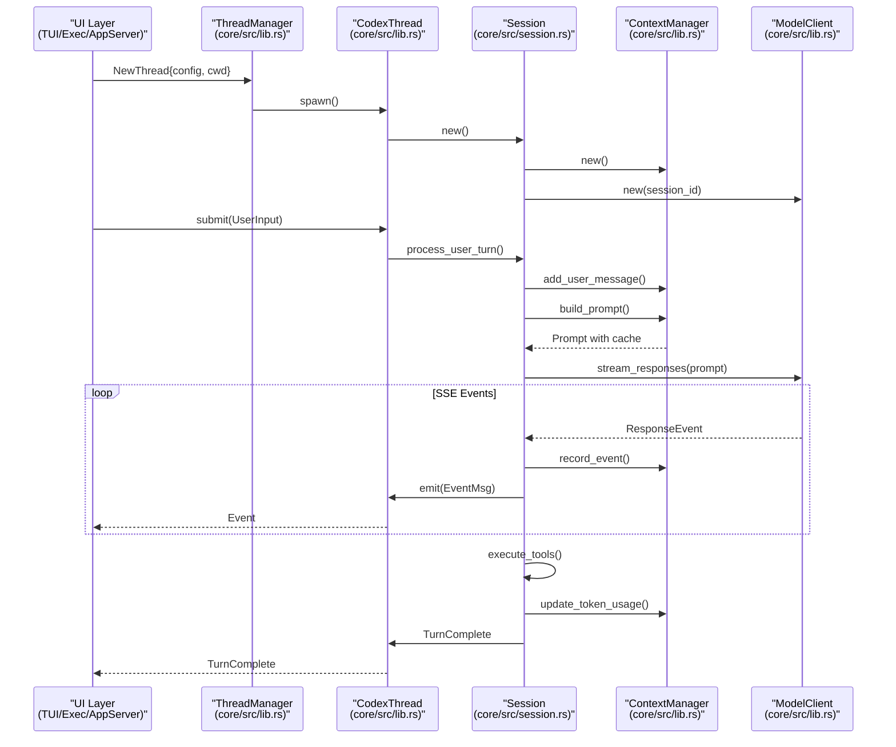

**Sources:** [codex-rs/core/src/lib.rs:16-115](), [codex-rs/core/src/session.rs:16]()

### Key Component Responsibilities

| Component | File | Primary Responsibilities |
|-----------|------|-------------------------|
| `ThreadManager` | `core/src/lib.rs` | Thread spawning/resuming, state database interaction [codex-rs/core/src/lib.rs:115]() |
| `CodexThread` | `core/src/lib.rs` | Submission queue, event emission, task management [codex-rs/core/src/lib.rs:23]() |
| `Session` (internal) | `core/src/session.rs` | Turn orchestration, prompt building, model streaming [codex-rs/core/src/session.rs:16]() |
| `ContextManager` | `core/src/lib.rs` | Message history, token tracking, compaction triggers [codex-rs/core/src/lib.rs:36]() |
| `ModelClient` | `core/src/lib.rs` | HTTP/WebSocket transport, SSE parsing, retry logic [codex-rs/core/src/lib.rs:179]() |
| `RolloutRecorder` | `core/src/lib.rs` | Session persistence, event filtering [codex-rs/core/src/lib.rs:150]() |

**Sources:** [codex-rs/core/src/lib.rs:1-198]()

## Configuration System

Configuration is assembled from multiple layers with CLI arguments taking highest priority. The `ConfigEditsBuilder` [codex-rs/cli/src/main.rs:72]() is used to modify settings programmatically. Codex supports a layered configuration system starting from defaults up to CLI overrides.

```mermaid
graph TB
    subgraph "Configuration Sources (Priority Order)"
        [cli] --> ["CLI Arguments<br/>(codex-utils-cli)"]
        [features] --> ["Feature Toggles<br/>(codex-features)"]
        [profile] --> ["Profile Selection<br/>--profile name"]
        [env] --> ["Environment Variables<br/>(CODEX_*, OPENAI_*)"]
        [project] --> [".codex/config.toml<br/>(Project)"]
        [global] --> ["~/.codex/config.toml<br/>(Global)"]
        [defaults] --> ["Built-in Defaults<br/>(hardcoded)"]
    end
    
    subgraph "Configuration Builder"
        [builder] --> ["ConfigBuilder::build()<br/>(core/src/lib.rs)"]
    end
    
    subgraph "Final Configuration"
        [config] --> ["Config struct<br/>(core/src/lib.rs)"]
        [model_provider] --> ["ModelProviderInfo<br/>(core/src/lib.rs)"]
    end
    
    [cli] --> [builder]
    [features] --> [builder]
    [profile] --> [builder]
    [env] --> [builder]
    [project] --> [builder]
    [global] --> [builder]
    [defaults] --> [builder]
    
    [builder] --> [config]
    [config] --> [model_provider]
```

**Sources:** [codex-rs/cli/src/main.rs:105-108](), [codex-rs/core/src/lib.rs:33](), [codex-rs/core/src/lib.rs:105]()

## Session Persistence and Replay

Sessions are persisted as rollout files containing event streams. The `RolloutRecorder` [codex-rs/core/src/lib.rs:150]() manages this process. Files are stored in directories defined by `SESSIONS_SUBDIR` [codex-rs/core/src/lib.rs:152]() and `ARCHIVED_SESSIONS_SUBDIR` [codex-rs/core/src/lib.rs:147]().

**Sources:** [codex-rs/core/src/lib.rs:147-170]()

---

# Page: Installation and Setup

# Installation and Setup

<details>
<summary>Relevant source files</summary>

The following files were used as context for generating this wiki page:

- [.github/actions/linux-code-sign/action.yml](.github/actions/linux-code-sign/action.yml)
- [.github/actions/windows-code-sign/action.yml](.github/actions/windows-code-sign/action.yml)
- [.github/scripts/archive-release-symbols-and-strip-binaries.sh](.github/scripts/archive-release-symbols-and-strip-binaries.sh)
- [.github/workflows/ci.yml](.github/workflows/ci.yml)
- [.github/workflows/rust-ci-full.yml](.github/workflows/rust-ci-full.yml)
- [.github/workflows/rust-ci.yml](.github/workflows/rust-ci.yml)
- [.github/workflows/rust-release-argument-comment-lint.yml](.github/workflows/rust-release-argument-comment-lint.yml)
- [.github/workflows/rust-release-windows.yml](.github/workflows/rust-release-windows.yml)
- [.github/workflows/rust-release.yml](.github/workflows/rust-release.yml)
- [.github/workflows/sdk.yml](.github/workflows/sdk.yml)
- [.gitignore](.gitignore)
- [CHANGELOG.md](CHANGELOG.md)
- [README.md](README.md)
- [cliff.toml](cliff.toml)
- [codex-cli/.gitignore](codex-cli/.gitignore)
- [codex-cli/bin/codex.js](codex-cli/bin/codex.js)
- [codex-cli/package.json](codex-cli/package.json)
- [codex-cli/scripts/README.md](codex-cli/scripts/README.md)
- [codex-cli/scripts/build_npm_package.py](codex-cli/scripts/build_npm_package.py)
- [codex-rs/cli/src/login.rs](codex-rs/cli/src/login.rs)
- [codex-rs/default.nix](codex-rs/default.nix)
- [codex-rs/login/BUILD.bazel](codex-rs/login/BUILD.bazel)
- [codex-rs/login/Cargo.toml](codex-rs/login/Cargo.toml)
- [codex-rs/login/src/assets/error.html](codex-rs/login/src/assets/error.html)
- [codex-rs/login/src/lib.rs](codex-rs/login/src/lib.rs)
- [codex-rs/login/src/server.rs](codex-rs/login/src/server.rs)
- [codex-rs/login/tests/suite/login_server_e2e.rs](codex-rs/login/tests/suite/login_server_e2e.rs)
- [codex-rs/responses-api-proxy/npm/package.json](codex-rs/responses-api-proxy/npm/package.json)
- [codex-rs/tui/src/config_update.rs](codex-rs/tui/src/config_update.rs)
- [codex-rs/tui/src/onboarding/auth.rs](codex-rs/tui/src/onboarding/auth.rs)
- [codex-rs/tui/src/onboarding/mod.rs](codex-rs/tui/src/onboarding/mod.rs)
- [codex-rs/tui/src/onboarding/onboarding_screen.rs](codex-rs/tui/src/onboarding/onboarding_screen.rs)
- [codex-rs/tui/src/onboarding/trust_directory.rs](codex-rs/tui/src/onboarding/trust_directory.rs)
- [codex-rs/tui/src/onboarding/welcome.rs](codex-rs/tui/src/onboarding/welcome.rs)
- [flake.lock](flake.lock)
- [flake.nix](flake.nix)
- [package.json](package.json)
- [pnpm-lock.yaml](pnpm-lock.yaml)
- [pnpm-workspace.yaml](pnpm-workspace.yaml)
- [scripts/stage_npm_packages.py](scripts/stage_npm_packages.py)
- [sdk/typescript/jest.config.cjs](sdk/typescript/jest.config.cjs)
- [sdk/typescript/package.json](sdk/typescript/package.json)
- [sdk/typescript/tsconfig.json](sdk/typescript/tsconfig.json)

</details>


This page covers installing Codex CLI, authenticating, and performing initial configuration. Codex is a coding agent that runs locally on your computer [README.md:1](). It is distributed as a native binary through npm, Homebrew, direct download, or shell installation scripts. After installation, you must authenticate using either ChatGPT OAuth or an API key [README.md:58-62]().

## System Requirements

**Supported Platforms:**

| Operating System | Details |
|-----------------|---------|
| **macOS** | macOS 12+ (Apple Silicon/arm64 and x86_64) [README.md:47-49]() |
| **Linux** | Ubuntu 20.04+/Debian 10+ (x86_64 and arm64 via musl) [README.md:50-52]() |
| **Windows** | Windows 11 (native via PowerShell or via WSL2) [README.md:22-26]() |

**Tooling Requirements:**
* **Node.js:** >= 16 (for npm-based installation) [codex-cli/package.json:10-12]()
* **pnpm:** >= 10.33.0 (for monorepo development) [codex-cli/package.json:21]()
* **Rust:** 1.95.0 (recommended for building from source) [.github/workflows/rust-release.yml:28]()

Sources: [README.md:47-52](), [codex-cli/package.json:10-21](), [.github/workflows/rust-release.yml:28]()

## Installation Methods

### Quick Install (Mac, Linux, Windows)

Official installation scripts detect your platform and fetch the appropriate binary:

*   **Mac/Linux:** `curl -fsSL https://chatgpt.com/codex/install.sh | sh` [README.md:18-20]()
*   **Windows:** `powershell -ExecutionPolicy ByPass -c "irm https://chatgpt.com/codex/install.ps1 | iex"` [README.md:22-26]()

### npm (Recommended for JS Environments)

Install the CLI globally using npm. The `@openai/codex` package acts as a wrapper for the native binaries [codex-cli/package.json:2-8]():

```shell
npm install -g @openai/codex
```

The package defines a `codex` binary entry point that points to `bin/codex.js` [codex-cli/package.json:6-8]().

Sources: [README.md:30-33](), [codex-cli/package.json:1-9]()

### Homebrew (macOS)

On macOS, Codex is available as a Homebrew Cask:

```shell
brew install --cask codex
```

Sources: [README.md:35-38]()

### Direct Binary Download

Pre-compiled binaries are available from GitHub Releases [README.md:42-43](). Release artifacts are built for multiple targets including `aarch64-apple-darwin`, `x86_64-apple-darwin`, `x86_64-unknown-linux-musl`, and `aarch64-unknown-linux-musl` [.github/workflows/rust-release.yml:79-127]().

| Platform | Binary Name (in Archive) |
|----------|--------------------------|
| macOS Apple Silicon | `codex-aarch64-apple-darwin` [README.md:48]() |
| macOS Intel | `codex-x86_64-apple-darwin` [README.md:49]() |
| Linux x86_64 (musl) | `codex-x86_64-unknown-linux-musl` [README.md:51]() |
| Linux arm64 (musl) | `codex-aarch64-unknown-linux-musl` [README.md:52]() |

Sources: [README.md:42-56](), [.github/workflows/rust-release.yml:79-127]()

## Authentication Setup

Codex supports multiple authentication modes managed by the `AuthManager` [codex-rs/login/src/auth.rs:22]().

### Sign in with ChatGPT (OAuth)

This is the recommended method for personal use [README.md:60](). It uses a local callback server to handle the OAuth flow.

1.  **Local Server**: Running `codex login` starts a short-lived `tiny_http` server on `localhost:1455` (or `1457`) [codex-rs/login/src/server.rs:54-57]().
2.  **PKCE Flow**: The system generates PKCE codes (`generate_pkce`) and a state parameter for secure authorization [codex-rs/login/src/server.rs:141-142]().
3.  **Browser Authorization**: The CLI opens the system browser to the OpenAI issuer URL [codex-rs/login/src/server.rs:167]().
4.  **Token Storage**: Upon success, tokens are persisted to `auth.json` via `save_auth` [codex-rs/login/src/auth.rs:30]().

### API Key Authentication

For headless environments, Codex supports API keys via environment variables:
*   `OPENAI_API_KEY`: Standard OpenAI key [codex-rs/login/src/lib.rs:33]().
*   `CODEX_API_KEY`: Specific Codex override [codex-rs/login/src/lib.rs:26]().

Sources: [codex-rs/login/src/server.rs:54-167](), [codex-rs/login/src/auth.rs:22-30](), [codex-rs/login/src/lib.rs:26-33]()

## Process and Entity Mapping

**Installation Space to Code Mapping:**

```mermaid
graph LR
    subgraph "Natural Language Space"
        ["NPM Package"]
        ["Binary Archive"]
        ["Homebrew Cask"]
    end

    subgraph "Code Entity Space"
        PackageJson["codex-cli/package.json"]
        BinJS["codex-cli/bin/codex.js"]
        RustRelease["workflow: rust-release"]
        LoginServer["codex-rs/login/src/server.rs"]
    end

    ["NPM Package"] --- PackageJson
    PackageJson --- BinJS
    ["Binary Archive"] --- RustRelease
    ["Homebrew Cask"] --- RustRelease
    BinJS -- "invokes" --> LoginServer
```

Sources: [codex-cli/package.json:2-8](), [.github/workflows/rust-release.yml:11-15](), [codex-rs/login/src/server.rs:1-7]()

**Authentication Flow Logic:**

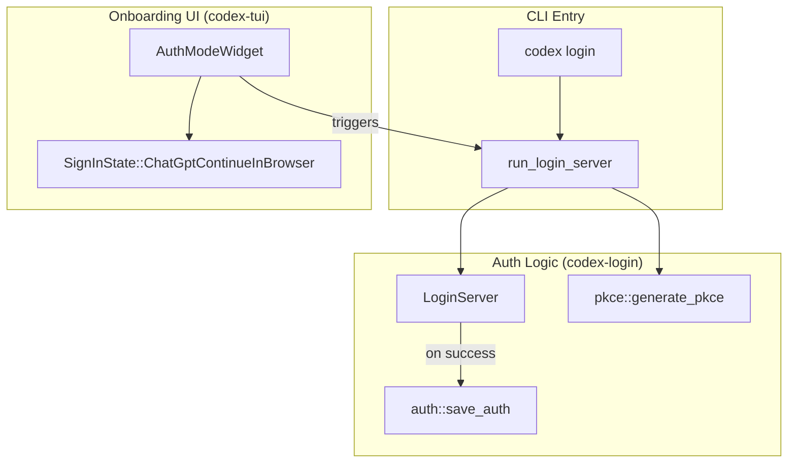

Sources: [codex-rs/login/src/server.rs:140-155](), [codex-rs/login/src/auth.rs:30](), [codex-rs/tui/src/onboarding/auth.rs:78-87](), [codex-rs/cli/src/login.rs:116-132]()

## Key Installation Takeaways

1.  **Local OAuth Server**: The `run_login_server` function binds to a local port to capture the redirect URI `http://localhost:{port}/auth/callback` [codex-rs/login/src/server.rs:140-156]().
2.  **Headless Support**: For remote machines where a browser cannot be opened, `codex login --device-auth` uses the Device Code flow [codex-rs/cli/src/login.rs:111-113]().
3.  **Multi-Platform Releases**: The release pipeline uses a matrix strategy to build for Linux (musl), macOS (Darwin), and Windows (MSVC) [.github/workflows/rust-release.yml:77-128]().
4.  **Onboarding Orchestration**: The TUI includes an `OnboardingScreen` that guides new users through `WelcomeWidget`, `AuthModeWidget`, and `TrustDirectoryWidget` [codex-rs/tui/src/onboarding/onboarding_screen.rs:56-60]().
5.  **Secure Token Storage**: Authentication data is handled by `AuthDotJson` and can be configured to use different storage modes via `AuthCredentialsStoreMode` [codex-rs/login/src/server.rs:27-41]().

---

# Page: Repository Structure

# Repository Structure

<details>
<summary>Relevant source files</summary>

The following files were used as context for generating this wiki page:

- [.bazelrc](.bazelrc)
- [.github/scripts/run-bazel-ci.sh](.github/scripts/run-bazel-ci.sh)
- [.github/scripts/run-bazel-query-ci.sh](.github/scripts/run-bazel-query-ci.sh)
- [.github/scripts/run_bazel_with_buildbuddy.py](.github/scripts/run_bazel_with_buildbuddy.py)
- [.github/scripts/rusty_v8_bazel.py](.github/scripts/rusty_v8_bazel.py)
- [.github/scripts/test_run_bazel_with_buildbuddy.py](.github/scripts/test_run_bazel_with_buildbuddy.py)
- [.github/scripts/test_rusty_v8_bazel.py](.github/scripts/test_rusty_v8_bazel.py)
- [.github/workflows/bazel.yml](.github/workflows/bazel.yml)
- [.github/workflows/rusty-v8-release.yml](.github/workflows/rusty-v8-release.yml)
- [.github/workflows/v8-canary.yml](.github/workflows/v8-canary.yml)
- [.gitignore](.gitignore)
- [AGENTS.md](AGENTS.md)
- [CHANGELOG.md](CHANGELOG.md)
- [README.md](README.md)
- [cliff.toml](cliff.toml)
- [codex-cli/package.json](codex-cli/package.json)
- [codex-rs/Cargo.lock](codex-rs/Cargo.lock)
- [codex-rs/Cargo.toml](codex-rs/Cargo.toml)
- [codex-rs/cli/Cargo.toml](codex-rs/cli/Cargo.toml)
- [codex-rs/cli/src/lib.rs](codex-rs/cli/src/lib.rs)
- [codex-rs/cli/src/main.rs](codex-rs/cli/src/main.rs)
- [codex-rs/core/Cargo.toml](codex-rs/core/Cargo.toml)
- [codex-rs/core/src/lib.rs](codex-rs/core/src/lib.rs)
- [codex-rs/default.nix](codex-rs/default.nix)
- [codex-rs/docs/bazel.md](codex-rs/docs/bazel.md)
- [codex-rs/exec/Cargo.toml](codex-rs/exec/Cargo.toml)
- [codex-rs/exec/src/cli.rs](codex-rs/exec/src/cli.rs)
- [codex-rs/exec/src/event_processor.rs](codex-rs/exec/src/event_processor.rs)
- [codex-rs/exec/src/lib.rs](codex-rs/exec/src/lib.rs)
- [codex-rs/responses-api-proxy/npm/package.json](codex-rs/responses-api-proxy/npm/package.json)
- [codex-rs/tui/Cargo.toml](codex-rs/tui/Cargo.toml)
- [codex-rs/tui/src/cli.rs](codex-rs/tui/src/cli.rs)
- [codex-rs/tui/src/lib.rs](codex-rs/tui/src/lib.rs)
- [docs/authentication.md](docs/authentication.md)
- [docs/contributing.md](docs/contributing.md)
- [docs/install.md](docs/install.md)
- [flake.lock](flake.lock)
- [flake.nix](flake.nix)
- [justfile](justfile)
- [package.json](package.json)
- [pnpm-lock.yaml](pnpm-lock.yaml)
- [pnpm-workspace.yaml](pnpm-workspace.yaml)
- [scripts/list-bazel-clippy-targets.sh](scripts/list-bazel-clippy-targets.sh)
- [sdk/typescript/jest.config.cjs](sdk/typescript/jest.config.cjs)
- [sdk/typescript/package.json](sdk/typescript/package.json)
- [sdk/typescript/tsconfig.json](sdk/typescript/tsconfig.json)

</details>


This page documents the Cargo workspace organization, key crates, and dependency relationships in the `codex-rs` repository. It also covers the top-level TypeScript/Python SDKs and the distribution infrastructure.

## Scope and Organization

The `codex-rs` repository is organized as a Cargo workspace containing over 120 member crates [codex-rs/Cargo.toml:2-121](). The workspace uses a monorepo structure where all crates share common tooling, dependencies, and build configuration through the root `Cargo.toml` manifest [codex-rs/Cargo.toml:133-218]().

The project utilizes **Bazel** for hermetic builds and testing across multiple platforms (Linux, macOS, Windows) [.github/workflows/bazel.yml:1-52](). This is supported by platform-specific patches for complex dependencies like V8 and cross-compilation toolchains [.github/workflows/bazel.yml:141-157]().

**Sources:** [codex-rs/Cargo.toml:1-218](), [.github/workflows/bazel.yml:1-157]()

---

## Workspace Structure

The workspace is defined in [codex-rs/Cargo.toml:1-121]() with a `[workspace]` section. It enforces a unified edition (2024) and license (Apache-2.0) across all members via the `[workspace.package]` section [codex-rs/Cargo.toml:124-132]().

### Workspace Component Map

The following diagram illustrates the relationship between the primary functional groups in the workspace.

**System Component Diagram**
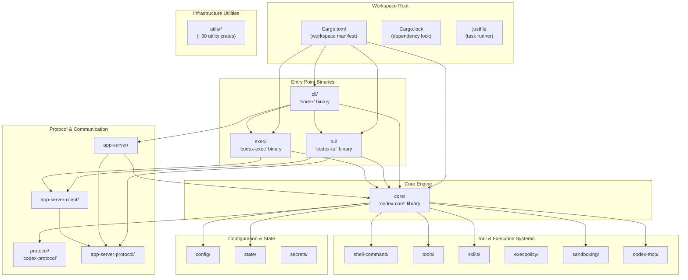

**Sources:** [codex-rs/Cargo.toml:2-121](), [codex-rs/Cargo.toml:133-218](), [justfile:1-10]()

---

## Entry Point Crates

### CLI Multitool (`cli/`)

The `codex` binary serves as the unified entry point, routing to different execution modes via subcommands. The `MultitoolCli` struct defines the command structure [codex-rs/cli/src/main.rs:103-118]().

| Binary Name | Crate | Primary Function |
|-------------|-------|------------------|
| `codex` | `codex-cli` | Multitool dispatcher with subcommand routing [codex-rs/cli/src/main.rs:88-102]() |
| `codex-tui` | `codex-tui` | Interactive terminal UI (launched via `codex` or standalone) [codex-rs/tui/Cargo.toml:8-10]() |
| `codex-exec` | `codex-exec` | Non-interactive/headless execution [codex-rs/exec/Cargo.toml:1-5]() |

**Subcommand Dispatching:**
The CLI dispatches to subcommands such as `Exec`, `Review`, `Mcp`, `Cloud`, and `AppServer` [codex-rs/cli/src/main.rs:120-209]().

**CLI Routing Diagram**
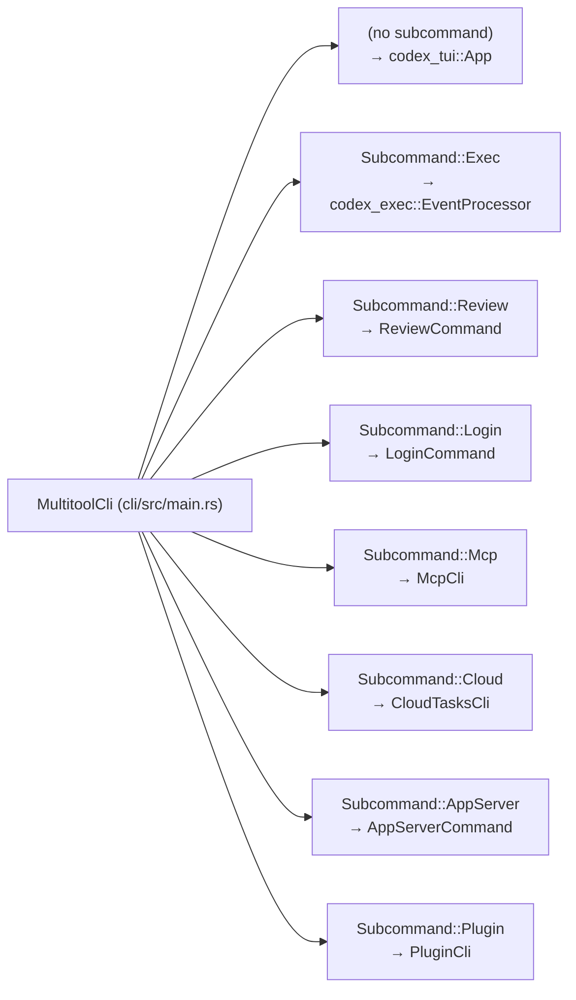

**Sources:** [codex-rs/cli/src/main.rs:103-209](), [codex-rs/cli/Cargo.toml:1-10]()

### Interactive TUI (`tui/`)

The `codex-tui` crate provides a fullscreen terminal interface built with [Ratatui](https://ratatui.rs/) [codex-rs/tui/Cargo.toml:82-87](). 

- **Binary:** `codex-tui` ([codex-rs/tui/Cargo.toml:9]())
- **Protocol Integration:** It relies on `codex-app-server-protocol` and `codex-app-server-client` for structured communication with the agent engine [codex-rs/tui/src/lib.rs:25-31]().
- **Component Architecture:** The TUI is organized into modules such as `chatwidget`, `bottom_pane`, and `status_indicator_widget` [codex-rs/tui/src/lib.rs:115-187]().

**Sources:** [codex-rs/tui/Cargo.toml:1-167](), [codex-rs/tui/src/lib.rs:115-187]()

---

## Core Engine (`codex-core`)

The `codex-core` crate is the central library containing the business logic for sessions, model interactions, and tool orchestration.

**Core Engine Class Diagram**
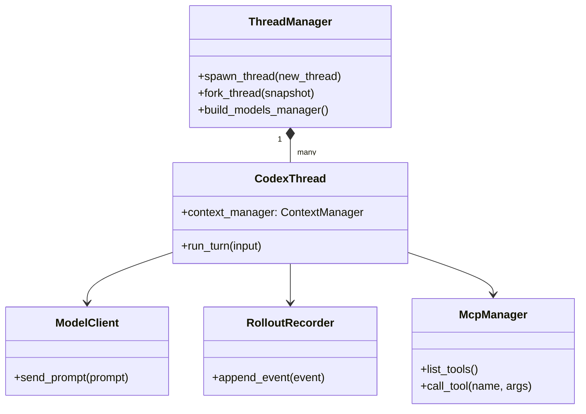

### Key Modules and Exports

The root module [codex-rs/core/src/lib.rs:1-197]() re-exports primary types for workspace consumers:

| Export | Source Module | Purpose |
|--------|---------------|---------|
| `CodexThread` | [codex-rs/core/src/lib.rs:23]() | Manages a single conversation thread/turn state |
| `ThreadManager` | [codex-rs/core/src/lib.rs:115]() | Orchestrates thread lifecycle (spawn/fork/resume) |
| `ModelClient` | [codex-rs/core/src/lib.rs:179]() | Handles LLM API communication and retries |
| `RolloutRecorder` | [codex-rs/core/src/lib.rs:150]() | Handles session persistence and event logging |
| `McpManager` | [codex-rs/core/src/lib.rs:55]() | Manages Model Context Protocol server connections |
| `SkillsManager` | [codex-rs/core/src/lib.rs:89]() | Agent skill discovery and injection |

**Sources:** [codex-rs/core/src/lib.rs:1-197](), [codex-rs/core/Cargo.toml:18-120]()

---

## SDKs and External Packages

Beyond the Rust workspace, the repository contains packages for external integration:

- **TypeScript SDK (`@openai/codex-sdk`)**: Located in `sdk/typescript/`, providing a programmatic interface for Node.js environments [sdk/typescript/package.json:2]().
- **Codex CLI NPM Package (`@openai/codex`)**: Located in `codex-cli/`, this package wraps the compiled Rust binaries for distribution via npm [codex-cli/package.json:2-8]().
- **Python SDK**: Located in `sdk/python/`, containing client abstractions for Python users [codex-rs/Cargo.toml:157-158]().

**Sources:** [sdk/typescript/package.json:1-10](), [codex-cli/package.json:1-22](), [codex-rs/Cargo.toml:157-158]()

---

## Build and Distribution

The repository uses **Bazel** for high-performance, hermetic builds, particularly for cross-platform support and managing complex dependencies like V8 [.github/workflows/bazel.yml:1-18]().

- **Platform Support**: Explicitly supports `aarch64-apple-darwin`, `x86_64-unknown-linux-musl`, and `x86_64-pc-windows-gnullvm` [README.md:47-52]().
- **NPM Distribution**: The `codex-cli` package provides the `codex` command via a Node.js wrapper [codex-cli/package.json:6-8]().
- **Installation Scripts**: Official installation is handled via shell and PowerShell scripts [README.md:18-26]().
- **Development Tooling**: A root `justfile` provides standardized commands for formatting, testing, and schema generation [justfile:1-10]().

**Sources:** [.github/workflows/bazel.yml:1-157](), [README.md:14-63](), [codex-cli/package.json:1-22](), [justfile:1-10]()

---

# Page: Architecture Overview

# Architecture Overview

<details>
<summary>Relevant source files</summary>

The following files were used as context for generating this wiki page:

- [codex-rs/Cargo.lock](codex-rs/Cargo.lock)
- [codex-rs/Cargo.toml](codex-rs/Cargo.toml)
- [codex-rs/app-server-protocol/schema/json/ClientRequest.json](codex-rs/app-server-protocol/schema/json/ClientRequest.json)
- [codex-rs/app-server-protocol/schema/json/ServerNotification.json](codex-rs/app-server-protocol/schema/json/ServerNotification.json)
- [codex-rs/app-server-protocol/schema/json/codex_app_server_protocol.schemas.json](codex-rs/app-server-protocol/schema/json/codex_app_server_protocol.schemas.json)
- [codex-rs/app-server-protocol/schema/json/codex_app_server_protocol.v2.schemas.json](codex-rs/app-server-protocol/schema/json/codex_app_server_protocol.v2.schemas.json)
- [codex-rs/app-server-protocol/schema/typescript/ClientRequest.ts](codex-rs/app-server-protocol/schema/typescript/ClientRequest.ts)
- [codex-rs/app-server-protocol/schema/typescript/ServerNotification.ts](codex-rs/app-server-protocol/schema/typescript/ServerNotification.ts)
- [codex-rs/app-server-protocol/schema/typescript/v2/index.ts](codex-rs/app-server-protocol/schema/typescript/v2/index.ts)
- [codex-rs/app-server-protocol/src/protocol/common.rs](codex-rs/app-server-protocol/src/protocol/common.rs)
- [codex-rs/app-server/README.md](codex-rs/app-server/README.md)
- [codex-rs/app-server/src/bespoke_event_handling.rs](codex-rs/app-server/src/bespoke_event_handling.rs)
- [codex-rs/cli/Cargo.toml](codex-rs/cli/Cargo.toml)
- [codex-rs/cli/src/lib.rs](codex-rs/cli/src/lib.rs)
- [codex-rs/cli/src/main.rs](codex-rs/cli/src/main.rs)
- [codex-rs/core/Cargo.toml](codex-rs/core/Cargo.toml)
- [codex-rs/core/src/codex_thread.rs](codex-rs/core/src/codex_thread.rs)
- [codex-rs/core/src/lib.rs](codex-rs/core/src/lib.rs)
- [codex-rs/core/src/session/handlers.rs](codex-rs/core/src/session/handlers.rs)
- [codex-rs/core/src/session/mod.rs](codex-rs/core/src/session/mod.rs)
- [codex-rs/core/src/session/review.rs](codex-rs/core/src/session/review.rs)
- [codex-rs/core/src/session/session.rs](codex-rs/core/src/session/session.rs)
- [codex-rs/core/src/session/tests.rs](codex-rs/core/src/session/tests.rs)
- [codex-rs/core/src/session/turn.rs](codex-rs/core/src/session/turn.rs)
- [codex-rs/core/src/session/turn_context.rs](codex-rs/core/src/session/turn_context.rs)
- [codex-rs/core/src/state/mod.rs](codex-rs/core/src/state/mod.rs)
- [codex-rs/core/src/state/turn.rs](codex-rs/core/src/state/turn.rs)
- [codex-rs/core/src/tasks/compact.rs](codex-rs/core/src/tasks/compact.rs)
- [codex-rs/core/src/tasks/mod.rs](codex-rs/core/src/tasks/mod.rs)
- [codex-rs/core/src/tasks/regular.rs](codex-rs/core/src/tasks/regular.rs)
- [codex-rs/core/src/tasks/review.rs](codex-rs/core/src/tasks/review.rs)
- [codex-rs/core/tests/suite/codex_delegate.rs](codex-rs/core/tests/suite/codex_delegate.rs)
- [codex-rs/exec/Cargo.toml](codex-rs/exec/Cargo.toml)
- [codex-rs/exec/src/cli.rs](codex-rs/exec/src/cli.rs)
- [codex-rs/exec/src/event_processor.rs](codex-rs/exec/src/event_processor.rs)
- [codex-rs/exec/src/lib.rs](codex-rs/exec/src/lib.rs)
- [codex-rs/tools/src/tool_config.rs](codex-rs/tools/src/tool_config.rs)
- [codex-rs/tools/src/tool_config_tests.rs](codex-rs/tools/src/tool_config_tests.rs)
- [codex-rs/tui/Cargo.toml](codex-rs/tui/Cargo.toml)
- [codex-rs/tui/src/cli.rs](codex-rs/tui/src/cli.rs)
- [codex-rs/tui/src/lib.rs](codex-rs/tui/src/lib.rs)

</details>


Codex is an AI coding agent that supports multiple execution modes (TUI, CLI, IDE integrations, web interface) all powered by a shared core engine. The system uses a queue-based submission/event protocol to enable asynchronous, interruptible workflows.

## System Organization

The architecture is organized into several major functional areas:

1.  **User Interfaces** – TUI (`codex-rs/tui`), CLI exec mode (`codex-rs/exec`), IDE app-server (`codex-rs/app-server`), and cloud task interfaces (`codex-rs/cloud-tasks`).
2.  **Core Engine** – Session management, turn execution, and event processing (`codex-rs/core`).
3.  **Execution & Tools** – Built-in and MCP tools with approval workflows and sandboxing (`codex-rs/tools`, `codex-rs/codex-mcp`).
4.  **Configuration & Model Management** – Hierarchical config, profiles, model metadata, and authentication (`codex-rs/config`, `codex-rs/models-manager`, `codex-rs/login`).
5.  **External Services** – Model provider APIs, MCP servers, and cloud backend.
6.  **App Server** – JSON-RPC protocol for IDE integrations (`codex-rs/app-server-protocol`).

The core design pattern is an **asynchronous submission/event queue**: user operations are submitted as `Submission` messages [codex-rs/core/src/session/tests.rs:127-127]() containing an `Op`, the agent processes them, and results stream back as `ResponseEvent` items [codex-rs/core/src/lib.rs:184-184](). This enables cancellation, interruption, and streaming UX across all interfaces.

Sources: [codex-rs/core/src/lib.rs:1-198](), [codex-rs/Cargo.toml:1-121](), [codex-rs/app-server/README.md:20-30](), [codex-rs/core/src/session/tests.rs:127-127]()

---

## Complete System Overview

The diagram below shows how all major subsystems connect. User interfaces submit operations to the core engine, which coordinates model API calls, tool execution, and state persistence.

**Diagram: Complete System Architecture**

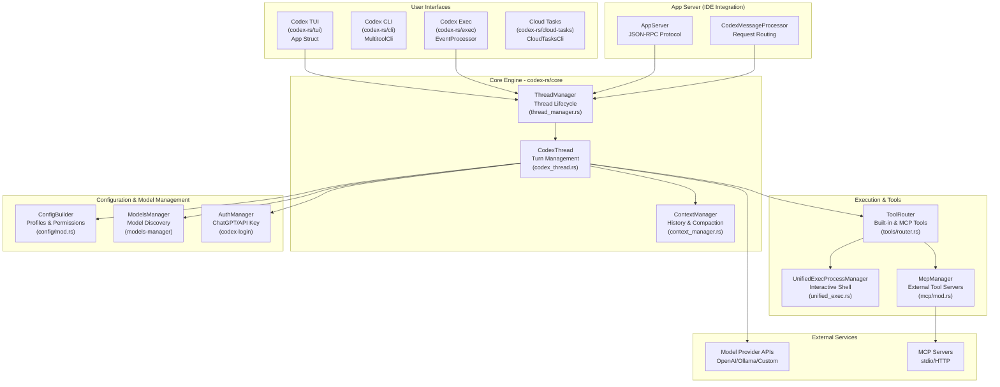

**Analysis**: The system supports multiple entry points (TUI, CLI, AppServer), all converging on the `ThreadManager` [codex-rs/core/src/lib.rs:115-115](). The `ThreadManager` coordinates multiple active `CodexThread` instances [codex-rs/core/src/lib.rs:23-23](). Turn execution logic is encapsulated in `CodexThread` [codex-rs/core/src/codex_thread.rs:1-50](). Tools are routed via `ToolRouter` [codex-rs/core/src/session/tests.rs:71-71]() to either built-in implementations or external `McpServers` via the `McpManager` [codex-rs/core/src/lib.rs:55-55]().

Sources: [codex-rs/core/src/lib.rs:23-23](), [codex-rs/core/src/lib.rs:115-115](), [codex-rs/core/src/lib.rs:55-55](), [codex-rs/app-server/README.md:66-73](), [codex-rs/core/src/session/tests.rs:71-71]()

---

## Submission/Event Queue Pattern

The core engine uses an asynchronous queue-based protocol. Clients submit operations and receive events.

**Diagram: Submission and Event Flow**

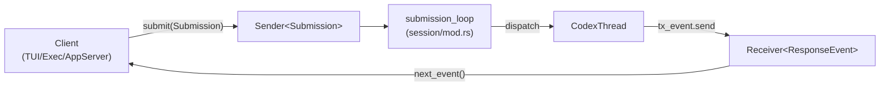

**Key Protocol Types**:

*   **`Submission`**: Wraps an operation with unique IDs and trace context [codex-rs/core/src/session/tests.rs:127-127]().
*   **`Op`**: Operation variants including `UserInput`, `Interrupt`, and `SteerInput` [codex-rs/core/src/session/mod.rs:1-100]().
*   **`ResponseEvent`**: The primary event type emitted during turn execution, capturing model deltas and tool lifecycle [codex-rs/core/src/lib.rs:184-184]().
*   **`ServerNotification`**: The notification type for the JSON-RPC app-server [codex-rs/app-server-protocol/src/protocol/common.rs:1-100]().

The `ThreadManager` manages the lifecycle of these sessions and their underlying communication channels [codex-rs/core/src/lib.rs:115-116]().

Sources: [codex-rs/core/src/lib.rs:184-184](), [codex-rs/core/src/session/tests.rs:127-127](), [codex-rs/core/src/lib.rs:115-116]()

---

## Request/Response Flow

The turn execution logic manages the transition from natural language input to code-level tool execution and model response streaming.

**Diagram: User Turn Execution Flow**

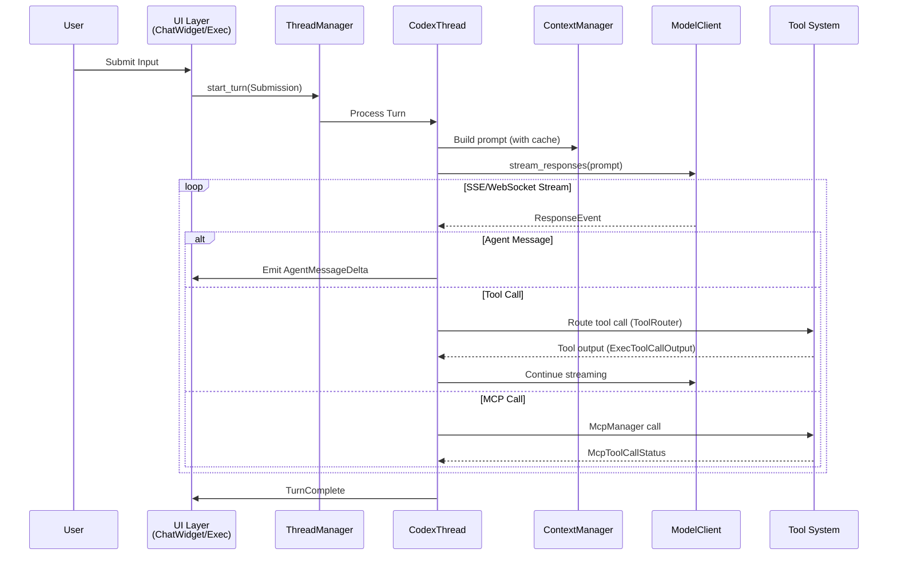

**Analysis**: The `CodexThread` manages the lifecycle of a single turn [codex-rs/core/src/lib.rs:23-25](). It interacts with `ContextManager` [codex-rs/core/src/lib.rs:36-36]() to build the `Prompt` [codex-rs/core/src/lib.rs:183-183](), which is then sent to the `ModelClient` [codex-rs/core/src/lib.rs:179-179](). As chunks arrive from the model API, they are translated into `ResponseEvent` items [codex-rs/core/src/lib.rs:184-184](). Tool calls are handled by the tool system, often returning `ExecToolCallOutput` [codex-rs/core/src/session/tests.rs:40-40]().

Sources: [codex-rs/core/src/lib.rs:23-25](), [codex-rs/core/src/lib.rs:179-184](), [codex-rs/core/src/session/tests.rs:40-40](), [codex-rs/app-server/README.md:79-82]()

---

## Execution Modes and Entry Points

Codex supports multiple execution modes, each with different entry points. All modes converge on the `ThreadManager` for thread lifecycle management.

**Diagram: Execution Modes and Entry Points**

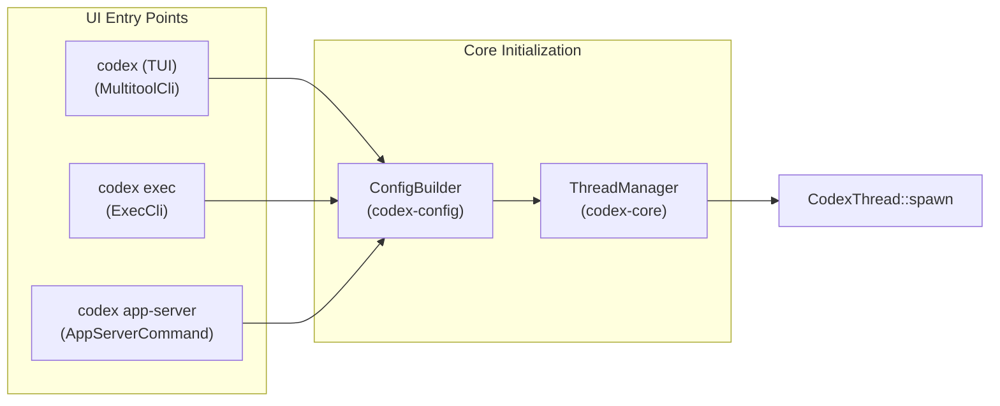

### Execution Mode Summary

| Mode | Entry Point | Primary Use Case | Event Processing |
| :--- | :--- | :--- | :--- |
| **TUI** | `MultitoolCli` [codex-rs/cli/src/main.rs:103]() | Interactive terminal sessions | `App` struct handles UI loop [codex-rs/tui/src/lib.rs:20-20]() |
| **Exec** | `ExecCli` [codex-rs/cli/src/main.rs:124]() | CI/CD, scripts, non-interactive | `EventProcessor` handles output [codex-rs/exec/src/lib.rs:157-157]() |
| **App Server** | `AppServerCommand` [codex-rs/cli/src/main.rs:145]() | IDE extensions (VS Code, Cursor) | `codex-app-server` JSON-RPC bridge [codex-rs/app-server/README.md:1-3]() |
| **MCP Server** | `McpServerCommand` [codex-rs/cli/src/main.rs:142]() | Codex as a tool for other agents | Exposes Codex as tools [codex-rs/cli/src/main.rs:142-142]() |

Sources: [codex-rs/cli/src/main.rs:103-145](), [codex-rs/tui/src/lib.rs:20-20](), [codex-rs/exec/src/lib.rs:157-157](), [codex-rs/app-server/README.md:1-3]()

---

## Multi-Agent and Persistence

Codex supports multi-agent workflows through thread management and ensures durability via a rollout persistence system.

**Diagram: Multi-Agent Thread Architecture**

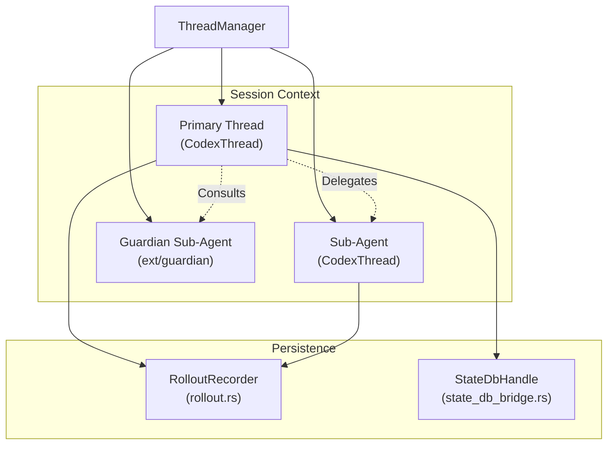

**Analysis**: The `ThreadManager` maintains active threads [codex-rs/core/src/lib.rs:115-115](). Each thread is a `CodexThread` instance [codex-rs/core/src/lib.rs:23-23](). Guardian sub-agents (referenced in `codex-rs/core/src/guardian.rs`) are used for internal analysis and tool approval [codex-rs/core/src/lib.rs:43-43](). All thread events are persisted via the `RolloutRecorder` to JSONL files [codex-rs/core/src/lib.rs:150-150](), while metadata is managed through a `StateDbHandle` [codex-rs/core/src/lib.rs:140-140]().

Sources: [codex-rs/core/src/lib.rs:23-23](), [codex-rs/core/src/lib.rs:115-115](), [codex-rs/core/src/lib.rs:140-150](), [codex-rs/core/src/lib.rs:43-43]()

---

## Tool Ecosystem and MCP Integration

The tool system is extensible, supporting both built-in shell/patch tools and external servers via the Model Context Protocol (MCP).

**Diagram: Tool System Architecture**

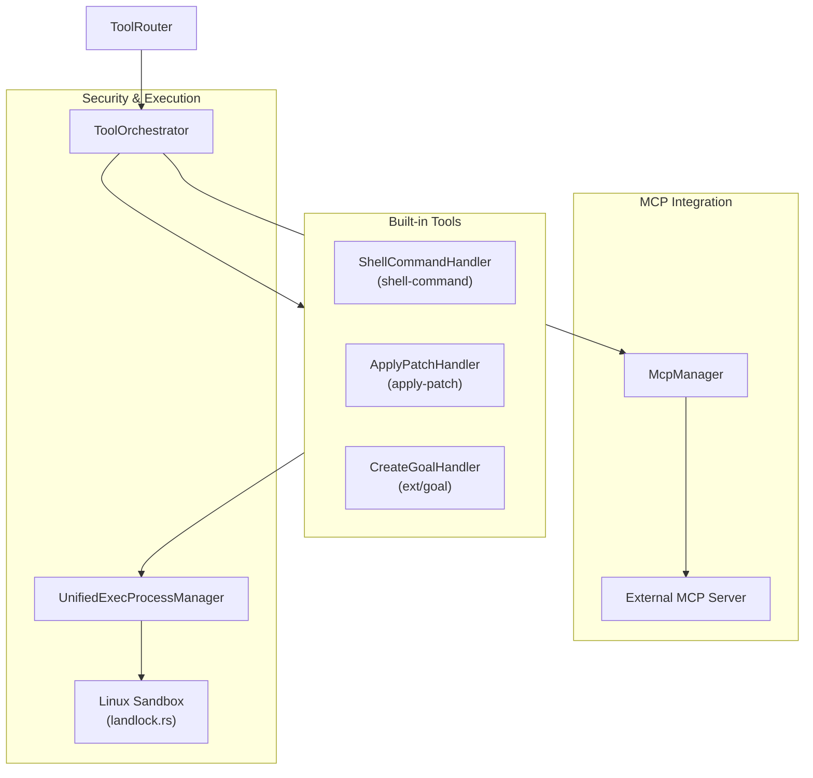

**Analysis**: The `ToolRouter` [codex-rs/core/src/session/tests.rs:71-71]() dispatches tool calls. Built-in shell tools use the `UnifiedExecProcessManager` [codex-rs/core/src/lib.rs:102-102](). External tools are accessed via the `McpManager`, which handles the lifecycle of external MCP servers [codex-rs/core/src/lib.rs:55-55](). Security is enforced via sandboxing, such as `spawn_command_under_linux_sandbox` [codex-rs/core/src/lib.rs:48-48]().

Sources: [codex-rs/core/src/lib.rs:48-55](), [codex-rs/core/src/lib.rs:102-102](), [codex-rs/core/src/session/tests.rs:71-71](), [codex-rs/app-server/README.md:22-23]()

---

# Page: Core Concepts

# Core Concepts

<details>
<summary>Relevant source files</summary>

The following files were used as context for generating this wiki page:

- [codex-rs/app-server-protocol/schema/json/ClientRequest.json](codex-rs/app-server-protocol/schema/json/ClientRequest.json)
- [codex-rs/app-server-protocol/schema/json/ServerNotification.json](codex-rs/app-server-protocol/schema/json/ServerNotification.json)
- [codex-rs/app-server-protocol/schema/json/codex_app_server_protocol.schemas.json](codex-rs/app-server-protocol/schema/json/codex_app_server_protocol.schemas.json)
- [codex-rs/app-server-protocol/schema/json/codex_app_server_protocol.v2.schemas.json](codex-rs/app-server-protocol/schema/json/codex_app_server_protocol.v2.schemas.json)
- [codex-rs/app-server-protocol/schema/json/v2/RawResponseItemCompletedNotification.json](codex-rs/app-server-protocol/schema/json/v2/RawResponseItemCompletedNotification.json)
- [codex-rs/app-server-protocol/schema/json/v2/ThreadForkParams.json](codex-rs/app-server-protocol/schema/json/v2/ThreadForkParams.json)
- [codex-rs/app-server-protocol/schema/json/v2/ThreadResumeParams.json](codex-rs/app-server-protocol/schema/json/v2/ThreadResumeParams.json)
- [codex-rs/app-server-protocol/schema/json/v2/ThreadStartParams.json](codex-rs/app-server-protocol/schema/json/v2/ThreadStartParams.json)
- [codex-rs/app-server-protocol/schema/json/v2/TurnStartParams.json](codex-rs/app-server-protocol/schema/json/v2/TurnStartParams.json)
- [codex-rs/app-server-protocol/schema/typescript/ClientRequest.ts](codex-rs/app-server-protocol/schema/typescript/ClientRequest.ts)
- [codex-rs/app-server-protocol/schema/typescript/ResponseItem.ts](codex-rs/app-server-protocol/schema/typescript/ResponseItem.ts)
- [codex-rs/app-server-protocol/schema/typescript/ServerNotification.ts](codex-rs/app-server-protocol/schema/typescript/ServerNotification.ts)
- [codex-rs/app-server-protocol/schema/typescript/v2/ThreadForkParams.ts](codex-rs/app-server-protocol/schema/typescript/v2/ThreadForkParams.ts)
- [codex-rs/app-server-protocol/schema/typescript/v2/ThreadResumeParams.ts](codex-rs/app-server-protocol/schema/typescript/v2/ThreadResumeParams.ts)
- [codex-rs/app-server-protocol/schema/typescript/v2/ThreadStartParams.ts](codex-rs/app-server-protocol/schema/typescript/v2/ThreadStartParams.ts)
- [codex-rs/app-server-protocol/schema/typescript/v2/index.ts](codex-rs/app-server-protocol/schema/typescript/v2/index.ts)
- [codex-rs/app-server-protocol/src/protocol/common.rs](codex-rs/app-server-protocol/src/protocol/common.rs)
- [codex-rs/app-server/README.md](codex-rs/app-server/README.md)
- [codex-rs/app-server/src/bespoke_event_handling.rs](codex-rs/app-server/src/bespoke_event_handling.rs)
- [codex-rs/config/src/config_toml.rs](codex-rs/config/src/config_toml.rs)
- [codex-rs/config/src/profile_toml.rs](codex-rs/config/src/profile_toml.rs)
- [codex-rs/config/src/schema.rs](codex-rs/config/src/schema.rs)
- [codex-rs/core-api/src/lib.rs](codex-rs/core-api/src/lib.rs)
- [codex-rs/core/config.schema.json](codex-rs/core/config.schema.json)
- [codex-rs/core/src/config/config_tests.rs](codex-rs/core/src/config/config_tests.rs)
- [codex-rs/core/src/config/mod.rs](codex-rs/core/src/config/mod.rs)
- [codex-rs/core/src/session/config_lock.rs](codex-rs/core/src/session/config_lock.rs)
- [codex-rs/features/src/feature_configs.rs](codex-rs/features/src/feature_configs.rs)
- [codex-rs/features/src/lib.rs](codex-rs/features/src/lib.rs)
- [codex-rs/features/src/tests.rs](codex-rs/features/src/tests.rs)
- [codex-rs/protocol/src/models.rs](codex-rs/protocol/src/models.rs)
- [codex-rs/thread-manager-sample/src/main.rs](codex-rs/thread-manager-sample/src/main.rs)
- [codex-rs/utils/image/src/error.rs](codex-rs/utils/image/src/error.rs)
- [codex-rs/utils/image/src/image_tests.rs](codex-rs/utils/image/src/image_tests.rs)
- [codex-rs/utils/image/src/lib.rs](codex-rs/utils/image/src/lib.rs)

</details>


This page documents the fundamental architectural patterns and systems that form the foundation of the Codex codebase. These concepts are invariant across all execution modes (TUI, CLI, IDE integration, or MCP server) and provide the core abstractions for session management, configuration, and security.

For detailed information about specific subsystems built on these concepts, see:
- [Protocol Layer (Submission/Event System)](#2.1) — Document the `Op` submission queue and `Event` stream pattern that coordinates async communication between the core and all frontends.
- [Configuration System](#2.2) — Explain the layered configuration system (CLI args → env vars → `config.toml` → defaults) and `ConfigBuilder`.
- [Feature Flags](#2.3) — Document the feature flag system, lifecycle stages (`UnderDevelopment`/`Experimental`/`Stable`/`Deprecated`), and runtime toggles.
- [Sandbox and Approval Policies](#2.4) — Explain sandbox modes (`ReadOnly`/`WorkspaceWrite`/`DangerFullAccess`), approval policies, and permission profiles.

---

## The Submission/Event Protocol

Codex uses a **Submission Queue (SQ) / Event Queue (EQ)** pattern to asynchronously communicate between user interfaces (frontends) and the agent engine (core). This architecture ensures that the core can process long-running model turns and tool executions without blocking the UI.

### Architecture Overview

Frontends interact with a session by submitting operations (`Op`), which are then processed. Events flow back to the UI via the `Event` stream, containing an `EventMsg` payload. In the `app-server`, these are translated via `apply_bespoke_event_handling` [codex-rs/app-server/src/bespoke_event_handling.rs:1-1]() into JSON-RPC notifications like `TurnStartedNotification` [codex-rs/app-server/src/bespoke_event_handling.rs:81-81]().

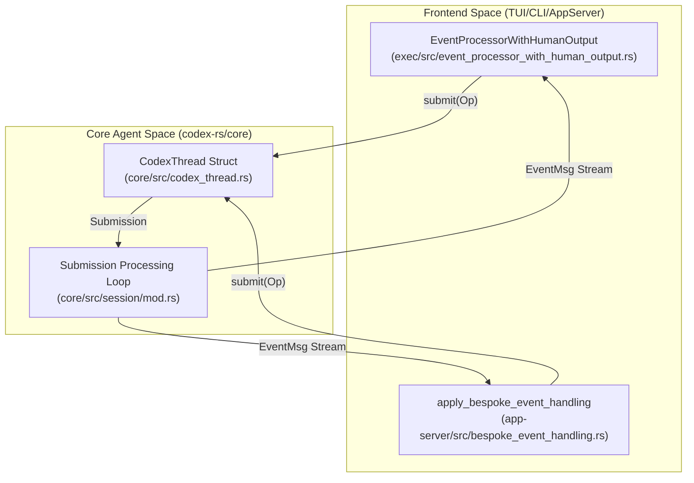
**Sources:** [codex-rs/app-server/src/bespoke_event_handling.rs:95-98](), [codex-rs/features/src/lib.rs:7-8]()

### Submission and Event Types

| Symbol | Type | Purpose |
|--------|------|---------|
| `Op` | `enum` | Operations like `UserInput`, `Interrupt`, or `OverrideTurnContext` [codex-rs/app-server/src/bespoke_event_handling.rs:99-99](). |
| `EventMsg` | `enum` | Payloads like `TurnStarted`, `AgentMessageDelta`, or `SessionConfigured` [codex-rs/protocol/src/protocol.rs:97-97](). |
| `Event` | `struct` | Wraps an `EventMsg` with metadata [codex-rs/protocol/src/protocol.rs:96-96](). |

**Sources:** [codex-rs/app-server/src/bespoke_event_handling.rs:95-98](), [codex-rs/features/src/lib.rs:7-9]()

---

## Configuration System

Codex uses a **layered configuration system** where settings from multiple sources are merged. The system supports local project overrides and organizational requirements.

### Configuration Layer Hierarchy

Configuration is built from several sources managed by `ConfigLayerStack` [codex-rs/core/src/config/mod.rs:13-13](). The system supports profiles via `ProfileV2Name` [codex-rs/core/src/config/mod.rs:22-22]() and pins values using `Constrained<T>` [codex-rs/core/src/config/mod.rs:149-149]().

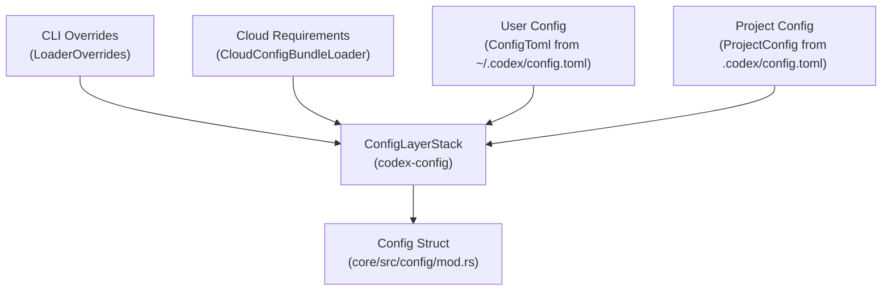
**Sources:** [codex-rs/core/src/config/mod.rs:11-15](), [codex-rs/core/src/config/mod.rs:25-30](), [codex-rs/core/src/config/mod.rs:148-152]()

### Constraint Validation and Locking
Organizational policies are enforced via `ConfigRequirements` [codex-rs/core/src/config/mod.rs:15-15](). The system tracks whether a value is pinned by policy or overridable using `ConstrainedWithSource` [codex-rs/core/src/config/mod.rs:17-17](). Codex supports a `ConfigLockfileToml` [codex-rs/core/src/config/mod.rs:27-27]() to ensure session reproducibility.

**Sources:** [codex-rs/core/src/config/mod.rs:14-16](), [codex-rs/core/src/config/mod.rs:26-27](), [codex-rs/core/src/config/mod.rs:145-148]()

---

## Feature Flag System

Codex uses a **staged feature flag system** defined in `codex-features` to manage experimental functionality.

### Feature Definition and Lifecycle

Features progress through lifecycle stages defined in the `Stage` enum [codex-rs/features/src/lib.rs:31-46]().

| Stage | Visibility | Description |
|-------|-----------|-------------|
| `UnderDevelopment` | Hidden | Not ready for external use [codex-rs/features/src/lib.rs:33-33](). |
| `Experimental` | Opt-in | Available via `/experimental` menu [codex-rs/features/src/lib.rs:35-39](). |
| `Stable` | Default | General availability [codex-rs/features/src/lib.rs:41-41](). |
| `Deprecated` | Opt-out | Scheduled for removal [codex-rs/features/src/lib.rs:43-43](). |

**Sources:** [codex-rs/features/src/lib.rs:28-45](), [codex-rs/features/src/lib.rs:77-184]()

### Runtime Toggles
The `Feature` enum [codex-rs/features/src/lib.rs:78-78]() defines specific flags like `CodeMode` [codex-rs/features/src/lib.rs:87-87](), `UnifiedExec` [codex-rs/features/src/lib.rs:91-91](), and `NetworkProxy` [codex-rs/features/src/lib.rs:135-135](). These are resolved into an effective feature set at runtime.

**Sources:** [codex-rs/features/src/lib.rs:77-184]()

---

## Sandbox and Approval Policies

Codex provides **layered security controls** to protect the host environment during tool execution.

### Approval Policy
The `ApprovalsReviewer` [codex-rs/core/src/config/mod.rs:39-39]() determines who approval requests are routed to.
- `user`: Human operator [codex-rs/core/config.schema.json:186-186]().
- `auto_review`: Risk-based decision framework using a sub-agent [codex-rs/core/config.schema.json:187-187]().

**Sources:** [codex-rs/core/config.schema.json:183-191](), [codex-rs/core/src/config/mod.rs:39-39]()

### Sandbox Policy
The `SandboxPolicy` [codex-rs/core/src/config/mod.rs:104-104]() defines filesystem and network restrictions, derived from a `PermissionProfile` [codex-rs/core/src/config/mod.rs:96-96]().

| Policy Component | Type | Purpose |
|------------------|------|---------|
| `FileSystemSandboxPolicy` | `struct` | Defines paths and access modes [codex-rs/core/src/config/mod.rs:100-100](). |
| `NetworkSandboxPolicy` | `struct` | Controls network access [codex-rs/core/src/config/mod.rs:101-101](). |
| `SandboxMode` | `enum` | High-level modes like `ReadOnly` [codex-rs/core/src/config/mod.rs:87-87](). |

**Sources:** [codex-rs/core/src/config/mod.rs:86-104](), [codex-rs/core/src/config/config_tests.rs:164-178]()

### Tool Execution Flow

Tools are checked against the `PermissionProfile`. The `app-server` handles these requests via `CommandExecutionRequestApprovalParams` [codex-rs/app-server/src/bespoke_event_handling.rs:19-19]().

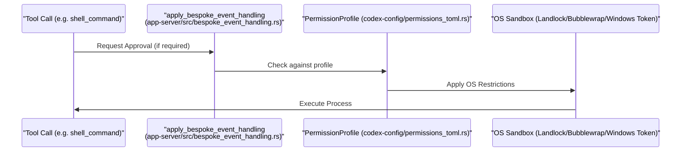
**Sources:** [codex-rs/app-server/src/bespoke_event_handling.rs:124-135](), [codex-rs/core/src/config/mod.rs:154-155](), [codex-rs/core/src/config/config_tests.rs:171-180]()

---

## Core Data Structures

| Symbol | Location | Role |
|--------|----------|------|
| `ConfigToml` | [codex-rs/core/src/config/mod.rs:28-28]() | Primary schema for `config.toml`. |
| `ConfigEditsBuilder` | [codex-rs/core/src/config/mod.rs:4-4]() | Helper for configuration mutations. |
| `PermissionProfile` | [codex-rs/core/src/config/mod.rs:96-96]() | Collection of sandbox and network permissions. |
| `Feature` | [codex-rs/features/src/lib.rs:78-78]() | Enum defining system feature flags. |
| `AuthMode` | [codex-rs/app-server-protocol/src/protocol/common.rs:21-49]() | Defines authentication methods (ApiKey, Chatgpt, etc). |

**Sources:** [codex-rs/core/src/config/mod.rs](), [codex-rs/features/src/lib.rs](), [codex-rs/app-server-protocol/src/protocol/common.rs]()

---

# Page: Protocol Layer (Submission/Event System)

# Protocol Layer (Submission/Event System)

<details>
<summary>Relevant source files</summary>

The following files were used as context for generating this wiki page:

- [codex-rs/app-server-protocol/Cargo.toml](codex-rs/app-server-protocol/Cargo.toml)
- [codex-rs/app-server-protocol/schema/json/ClientRequest.json](codex-rs/app-server-protocol/schema/json/ClientRequest.json)
- [codex-rs/app-server-protocol/schema/json/ServerNotification.json](codex-rs/app-server-protocol/schema/json/ServerNotification.json)
- [codex-rs/app-server-protocol/schema/json/codex_app_server_protocol.schemas.json](codex-rs/app-server-protocol/schema/json/codex_app_server_protocol.schemas.json)
- [codex-rs/app-server-protocol/schema/json/codex_app_server_protocol.v2.schemas.json](codex-rs/app-server-protocol/schema/json/codex_app_server_protocol.v2.schemas.json)
- [codex-rs/app-server-protocol/schema/json/v2/CommandExecParams.json](codex-rs/app-server-protocol/schema/json/v2/CommandExecParams.json)
- [codex-rs/app-server-protocol/schema/json/v2/RawResponseItemCompletedNotification.json](codex-rs/app-server-protocol/schema/json/v2/RawResponseItemCompletedNotification.json)
- [codex-rs/app-server-protocol/schema/json/v2/ThreadForkParams.json](codex-rs/app-server-protocol/schema/json/v2/ThreadForkParams.json)
- [codex-rs/app-server-protocol/schema/json/v2/ThreadResumeParams.json](codex-rs/app-server-protocol/schema/json/v2/ThreadResumeParams.json)
- [codex-rs/app-server-protocol/schema/json/v2/ThreadStartParams.json](codex-rs/app-server-protocol/schema/json/v2/ThreadStartParams.json)
- [codex-rs/app-server-protocol/schema/json/v2/TurnStartParams.json](codex-rs/app-server-protocol/schema/json/v2/TurnStartParams.json)
- [codex-rs/app-server-protocol/schema/typescript/ClientRequest.ts](codex-rs/app-server-protocol/schema/typescript/ClientRequest.ts)
- [codex-rs/app-server-protocol/schema/typescript/ResponseItem.ts](codex-rs/app-server-protocol/schema/typescript/ResponseItem.ts)
- [codex-rs/app-server-protocol/schema/typescript/ServerNotification.ts](codex-rs/app-server-protocol/schema/typescript/ServerNotification.ts)
- [codex-rs/app-server-protocol/schema/typescript/v2/CommandExecParams.ts](codex-rs/app-server-protocol/schema/typescript/v2/CommandExecParams.ts)
- [codex-rs/app-server-protocol/schema/typescript/v2/ThreadForkParams.ts](codex-rs/app-server-protocol/schema/typescript/v2/ThreadForkParams.ts)
- [codex-rs/app-server-protocol/schema/typescript/v2/ThreadResumeParams.ts](codex-rs/app-server-protocol/schema/typescript/v2/ThreadResumeParams.ts)
- [codex-rs/app-server-protocol/schema/typescript/v2/ThreadStartParams.ts](codex-rs/app-server-protocol/schema/typescript/v2/ThreadStartParams.ts)
- [codex-rs/app-server-protocol/schema/typescript/v2/index.ts](codex-rs/app-server-protocol/schema/typescript/v2/index.ts)
- [codex-rs/app-server-protocol/src/lib.rs](codex-rs/app-server-protocol/src/lib.rs)
- [codex-rs/app-server-protocol/src/protocol/common.rs](codex-rs/app-server-protocol/src/protocol/common.rs)
- [codex-rs/app-server-protocol/src/protocol/mappers.rs](codex-rs/app-server-protocol/src/protocol/mappers.rs)
- [codex-rs/app-server-protocol/src/protocol/mod.rs](codex-rs/app-server-protocol/src/protocol/mod.rs)
- [codex-rs/app-server-protocol/src/protocol/v1.rs](codex-rs/app-server-protocol/src/protocol/v1.rs)
- [codex-rs/app-server/README.md](codex-rs/app-server/README.md)
- [codex-rs/app-server/src/bespoke_event_handling.rs](codex-rs/app-server/src/bespoke_event_handling.rs)
- [codex-rs/app-server/src/request_processors/initialize_processor.rs](codex-rs/app-server/src/request_processors/initialize_processor.rs)
- [codex-rs/app-server/tests/suite/v2/command_exec.rs](codex-rs/app-server/tests/suite/v2/command_exec.rs)
- [codex-rs/app-server/tests/suite/v2/connection_handling_websocket_unix.rs](codex-rs/app-server/tests/suite/v2/connection_handling_websocket_unix.rs)
- [codex-rs/app-server/tests/suite/v2/initialize.rs](codex-rs/app-server/tests/suite/v2/initialize.rs)
- [codex-rs/app-server/tests/suite/v2/thread_name_websocket.rs](codex-rs/app-server/tests/suite/v2/thread_name_websocket.rs)
- [codex-rs/protocol/src/models.rs](codex-rs/protocol/src/models.rs)
- [codex-rs/utils/image/src/error.rs](codex-rs/utils/image/src/error.rs)
- [codex-rs/utils/image/src/image_tests.rs](codex-rs/utils/image/src/image_tests.rs)
- [codex-rs/utils/image/src/lib.rs](codex-rs/utils/image/src/lib.rs)

</details>


## Purpose and Scope

This page documents the core communication protocol used between all user-facing interfaces and the `codex-core` agent: the `Submission`/`Event` queue pair, the `Op` and `EventMsg` enums that define every operation and notification, and the `Codex` struct's `submit`/`next_event` interface.

The protocol is defined in the `codex-protocol` crate ([codex-rs/protocol/src/protocol.rs]()) and implemented by the `Codex` struct in `codex-core`. Every client—the TUI, the headless exec mode, the app server, and the MCP server—talks to the agent exclusively through this interface.

- For how the agent uses this protocol internally to manage turns and session state, see **3.1 Codex Interface and Session Lifecycle**.
- For sandbox and approval policy types (`SandboxPolicy`, `AskForApproval`) that appear as `Op` fields, see **2.4 Sandbox and Approval Policies**.
- For how the TUI translates `EventMsg` into rendered history cells, see **4.1.2 ChatWidget and Conversation Display**.
- For how the app server translates `EventMsg` into JSON-RPC notifications, see **4.5.3 Event Translation and Streaming**.

Sources: [codex-rs/protocol/src/protocol.rs:1-5]()

---

## Core Abstractions

### `Submission` and `Op`

A `Submission` is the envelope placed on the submission queue. It pairs a unique correlation ID with an operation and optional distributed trace context [codex-rs/protocol/src/protocol.rs:125-133]().

```rust
pub struct Submission {
    /// Unique id for this Submission to correlate with Events
    pub id: String,
    /// Payload
    pub op: Op,
    /// Optional W3C trace carrier propagated across async submission handoffs.
    pub trace: Option<W3cTraceContext>,
}
```

The `trace` field enables distributed tracing across async submission handoffs. When present, it carries `traceparent` and `tracestate` headers for OpenTelemetry integration [codex-rs/protocol/src/protocol.rs:135-143]().

Sources: [codex-rs/protocol/src/protocol.rs:125-143]()

`Op` is a non-exhaustive enum covering every action a client can request, such as starting a turn, approving a tool call, or requesting a code review [codex-rs/protocol/src/protocol.rs:181-479]().

### `Event` and `EventMsg`

An `Event` is the envelope placed on the event queue. The `id` field echoes the `Submission.id` that triggered the event (where applicable) [codex-rs/protocol/src/protocol.rs:555-560]().

```rust
pub struct Event {
    pub id: String,
    pub msg: EventMsg,
}
```

`EventMsg` is the tagged union of every notification the agent can emit, including streaming message deltas, tool execution status, and approval requests [codex-rs/protocol/src/protocol.rs:563-1081]().

---

## The Async Queue Model

The protocol is implemented as a **Submission Queue / Event Queue** (SQ/EQ) pattern [codex-rs/protocol/src/protocol.rs:3-4]() backed by `async-channel` channels. This decouples callers from the agent's internal execution model.

**Queue Architecture: `Codex` struct, channels, and background task**

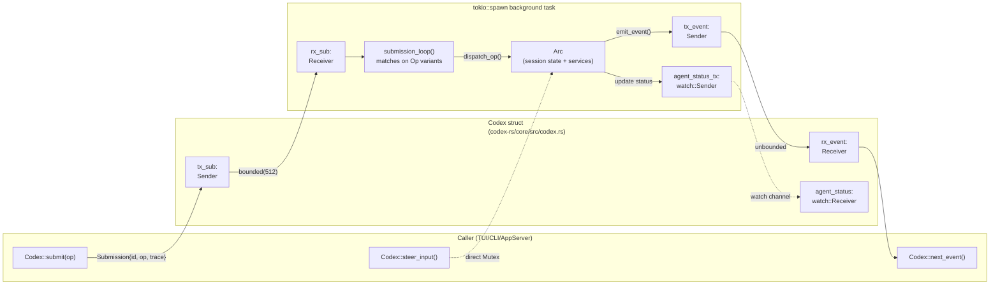

Sources: [codex-rs/protocol/src/protocol.rs:3-4](), [codex-rs/protocol/src/protocol.rs:125-133]()

| Channel | Type | Capacity | Direction | Purpose |
|---|---|---|---|---|
| Submission queue | `async_channel::bounded` | 512 | Caller → Session | Bounded to prevent memory pressure |
| Event queue | `async_channel::unbounded` | Unlimited | Session → Caller | Unbounded to never block agent execution |
| Agent status | `tokio::sync::watch` | 1 (latest value) | Session → Caller | Broadcast current agent status |

---

## `Codex` Interface

The `Codex` struct is the primary handle to a live agent session. 

| Method | Signature | Description |
|---|---|---|
| `spawn` | `async fn spawn(...)` | Creates the session, spawns `submission_loop`. |
| `submit` | `async fn submit(&self, op: Op)` | Wraps `op` in a `Submission` with a UUID v7 ID, sends it to the queue. |
| `submit_with_id` | `async fn submit_with_id(&self, submission: Submission)` | Submits a pre-formed `Submission`, allowing custom IDs for correlation [codex-rs/protocol/src/protocol.rs:125](). |
| `next_event` | `async fn next_event(&self)` | Awaits and returns the next event from the agent [codex-rs/protocol/src/protocol.rs:555](). |

Sources: [codex-rs/protocol/src/protocol.rs:125-133](), [codex-rs/protocol/src/protocol.rs:555-560]()

---

## Op Variants Reference

**`Op` enum taxonomy**

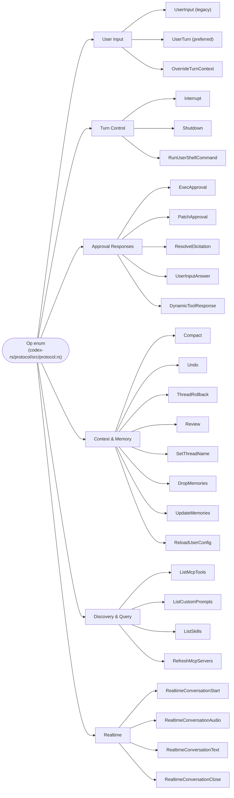

Sources: [codex-rs/protocol/src/protocol.rs:181-479]()

### Key Op Variants

| Variant | Key Fields | Notes |
|---|---|---|
| `UserInput` | `items`, `environments` | Legacy input variant used for session initialization [codex-rs/protocol/src/protocol.rs:185-196](). |
| `UserTurn` | `items`, `cwd`, `sandbox_policy`, `model` | Primary entry point for starting an agent turn [codex-rs/protocol/src/protocol.rs:198-216](). |
| `Interrupt` | — | Aborts the current turn [codex-rs/protocol/src/protocol.rs:242](). |
| `ExecApproval` | `id`, `decision` | Responds to a shell command approval request [codex-rs/protocol/src/protocol.rs:260-264](). |
| `PatchApproval` | `id`, `decision` | Responds to a file patch approval request [codex-rs/protocol/src/protocol.rs:266-270](). |

---

## EventMsg Variants Reference

**`EventMsg` enum taxonomy**

```mermaid
graph LR
    EventMsg(["EventMsg enum\n(codex-rs/protocol/src/protocol.rs)"])

    EventMsg --> SessionOps["Session Lifecycle"]
    EventMsg --> AgentOutputOps["Agent Output"]
    EventMsg --> ToolOps["Tool Execution"]
    EventMsg --> ApprovalReqOps["Approval Requests"]
    EventMsg --> StatusOps["Status & Errors"]
    EventMsg --> RealtimeEvOps["Realtime"]

    SessionOps --> SessionConfigured["SessionConfigured"]
    SessionOps --> TurnStarted["TurnStarted"]
    SessionOps --> TurnComplete["TurnComplete"]
    SessionOps --> TurnAborted["TurnAborted"]

    AgentOutputOps --> AgentMessageDelta["AgentMessageDelta"]
    AgentOutputOps --> AgentReasoningDelta["AgentReasoningDelta"]
    AgentOutputOps --> PlanDelta["PlanDelta"]
    AgentOutputOps --> ItemCompleted["ItemCompleted"]

    ToolOps --> ExecCommandBegin["ExecCommandBegin"]
    ToolOps --> ExecCommandEnd["ExecCommandEnd"]
    ToolOps --> PatchApplyBegin["PatchApplyBegin"]
    ToolOps --> PatchApplyEnd["PatchApplyEnd"]
    ToolOps --> McpToolCallBegin["McpToolCallBegin"]

    ApprovalReqOps --> ExecApprovalRequest["ExecApprovalRequest"]
    ApprovalReqOps --> ApplyPatchApprovalRequest["ApplyPatchApprovalRequest"]
    ApprovalReqOps --> ElicitationRequest["ElicitationRequest"]

    StatusOps --> Error["Error"]
    StatusOps --> Warning["Warning"]
    StatusOps --> TokenCount["TokenCount"]
```

Sources: [codex-rs/protocol/src/protocol.rs:563-1081]()

### Key EventMsg Variants

| Variant | Key Fields | Notes |
|---|---|---|
| `TurnStarted` | `TurnStartedEvent` | Signals the beginning of a turn [codex-rs/protocol/src/protocol.rs:577](). |
| `AgentMessageDelta` | `AgentMessageDeltaEvent` | Streaming assistant text chunk [codex-rs/protocol/src/protocol.rs:608](). |
| `ExecCommandBegin` | `ExecCommandBeginEvent` | Shell command execution started [codex-rs/protocol/src/protocol.rs:664](). |
| `ExecApprovalRequest` | `ExecApprovalRequestEvent` | Agent is waiting for user approval to run a command [codex-rs/protocol/src/protocol.rs:821](). |
| `TurnComplete` | `TurnCompleteEvent` | Turn finished; contains final usage and text [codex-rs/protocol/src/protocol.rs:589](). |

---

## App Server Protocol (v2)

The `codex-app-server` exposes this protocol via JSON-RPC 2.0 messages [codex-rs/app-server/README.md:22](). It translates core `EventMsg` variants into bespoke server notifications [codex-rs/app-server/src/bespoke_event_handling.rs:135-150]().

### Request/Response Mapping

The app server defines a `ClientRequest` enum that wraps core operations into a JSON-RPC compatible structure [codex-rs/app-server-protocol/src/protocol/common.rs:176-189](). This is generated using `client_request_definitions!` macro [codex-rs/app-server-protocol/src/protocol/common.rs:181-189]().

**App-Server Request Routing Architecture**

```mermaid
flowchart TD
    subgraph Client["External Client (VSCode/SDK)"]
        json_rpc["JSON-RPC Message"]
    end

    subgraph AppServer["codex-app-server"]
        transport["Transport (stdio/unix/ws)"]
        deser["Serde Deserialization"]
        req_enum["ClientRequest Enum\n(app-server-protocol/src/protocol/common.rs)"]
        proc["Request Processor"]
    end

    subgraph Core["codex-core"]
        codex_struct["Codex Struct"]
        op_enum["Op Enum\n(protocol/src/protocol.rs)"]
    end

    json_rpc --> transport
    transport --> deser
    deser --> req_enum
    req_enum --> proc
    proc -->|"Codex::submit(Op)"| codex_struct
    codex_struct --> op_enum
```

Sources: [codex-rs/app-server/README.md:22-30](), [codex-rs/app-server-protocol/src/protocol/common.rs:176-189](), [codex-rs/app-server/src/bespoke_event_handling.rs:87-99]()

| App Server Method | Core Op | Notes |
|---|---|---|
| `thread/start` | `UserInput` | Initializes a new thread session [codex-rs/app-server/README.md:77](). |
| `turn/start` | `UserTurn` | Starts a conversation turn [codex-rs/app-server/README.md:79](). |
| `turn/interrupt` | `Interrupt` | Aborts the active turn [codex-rs/app-server/README.md:81](). |

### Event Translation

The `apply_bespoke_event_handling` function in `codex-app-server` coordinates the conversion of core events into `ServerNotification` payloads [codex-rs/app-server/src/bespoke_event_handling.rs:135-150]().

- **Streaming:** `AgentMessageDelta` is converted to `AgentMessageDeltaNotification` [codex-rs/app-server-protocol/schema/json/codex_app_server_protocol.v2.schemas.json:243-267]().
- **Approvals:** `ExecApprovalRequest` is translated into `CommandExecutionRequestApprovalParams` to prompt the user in the UI [codex-rs/app-server/src/bespoke_event_handling.rs:18-22]().
- **Rate Limits:** The server broadcasts `AccountRateLimitsUpdatedNotification` when usage limits change [codex-rs/app-server-protocol/src/protocol/v2.rs:14-16]().

Sources: [codex-rs/app-server/src/bespoke_event_handling.rs:1-150](), [codex-rs/app-server-protocol/src/protocol/common.rs:161-189](), [codex-rs/app-server/README.md:64-82]()

---

## TUI Event Coordination

The TUI uses an internal `AppEvent` bus to coordinate actions between the `ChatWidget`, `ChatComposer`, and the top-level `App` loop.

```mermaid
sequenceDiagram
    participant Composer as "ChatComposer"
    participant Widget as "ChatWidget"
    participant App as "App Loop"
    participant Core as "Codex Core"

    Composer->>Widget: Submit Text
    Widget->>App: AppEvent::SubmitThreadOp(Op::UserTurn)
    App->>Core: Codex::submit(Op::UserTurn)
    Core-->>App: EventMsg::TurnStarted
    App->>Widget: update_task_running_state(true)
    Core-->>App: EventMsg::AgentMessageDelta
    App->>Widget: apply_event(delta)
    Widget->>Widget: Update Active HistoryCell
```

- **Submission:** When a user submits text, the `ChatComposer` handles the input buffer and triggers submission through the `ChatWidget`.
- **Status Tracking:** The TUI tracks `agent_turn_running` state to drive spinners and interrupt hints.
- **History Sync:** Slash commands are staged in local history before being dispatched as core `Op` variants.

Sources: [codex-rs/app-server/README.md:79-81](), [codex-rs/app-server/src/bespoke_event_handling.rs:135-150]()

---

# Page: Configuration System

# Configuration System

<details>
<summary>Relevant source files</summary>

The following files were used as context for generating this wiki page:

- [codex-rs/app-server-protocol/schema/json/v2/ConfigRequirementsReadResponse.json](codex-rs/app-server-protocol/schema/json/v2/ConfigRequirementsReadResponse.json)
- [codex-rs/app-server-protocol/schema/typescript/v2/ConfigRequirements.ts](codex-rs/app-server-protocol/schema/typescript/v2/ConfigRequirements.ts)
- [codex-rs/app-server-protocol/src/protocol/v2/config.rs](codex-rs/app-server-protocol/src/protocol/v2/config.rs)
- [codex-rs/app-server-protocol/src/protocol/v2/tests.rs](codex-rs/app-server-protocol/src/protocol/v2/tests.rs)
- [codex-rs/app-server/src/config_manager.rs](codex-rs/app-server/src/config_manager.rs)
- [codex-rs/app-server/src/config_manager_service.rs](codex-rs/app-server/src/config_manager_service.rs)
- [codex-rs/app-server/src/config_manager_service_tests.rs](codex-rs/app-server/src/config_manager_service_tests.rs)
- [codex-rs/app-server/src/request_processors/config_processor.rs](codex-rs/app-server/src/request_processors/config_processor.rs)
- [codex-rs/cli/src/mcp_cmd.rs](codex-rs/cli/src/mcp_cmd.rs)
- [codex-rs/cli/tests/mcp_add_remove.rs](codex-rs/cli/tests/mcp_add_remove.rs)
- [codex-rs/cli/tests/mcp_list.rs](codex-rs/cli/tests/mcp_list.rs)
- [codex-rs/config/src/config_requirements.rs](codex-rs/config/src/config_requirements.rs)
- [codex-rs/config/src/config_toml.rs](codex-rs/config/src/config_toml.rs)
- [codex-rs/config/src/lib.rs](codex-rs/config/src/lib.rs)
- [codex-rs/config/src/loader/mod.rs](codex-rs/config/src/loader/mod.rs)
- [codex-rs/config/src/loader/tests.rs](codex-rs/config/src/loader/tests.rs)
- [codex-rs/config/src/profile_toml.rs](codex-rs/config/src/profile_toml.rs)
- [codex-rs/config/src/schema.rs](codex-rs/config/src/schema.rs)
- [codex-rs/config/src/state.rs](codex-rs/config/src/state.rs)
- [codex-rs/config/src/types.rs](codex-rs/config/src/types.rs)
- [codex-rs/config/src/types_tests.rs](codex-rs/config/src/types_tests.rs)
- [codex-rs/core-api/src/lib.rs](codex-rs/core-api/src/lib.rs)
- [codex-rs/core/config.schema.json](codex-rs/core/config.schema.json)
- [codex-rs/core/src/config/config_loader_tests.rs](codex-rs/core/src/config/config_loader_tests.rs)
- [codex-rs/core/src/config/config_tests.rs](codex-rs/core/src/config/config_tests.rs)
- [codex-rs/core/src/config/mod.rs](codex-rs/core/src/config/mod.rs)
- [codex-rs/core/src/session/config_lock.rs](codex-rs/core/src/session/config_lock.rs)
- [codex-rs/core/tests/suite/remote_env.rs](codex-rs/core/tests/suite/remote_env.rs)
- [codex-rs/exec-server/src/environment_path.rs](codex-rs/exec-server/src/environment_path.rs)
- [codex-rs/exec-server/src/fs_helper.rs](codex-rs/exec-server/src/fs_helper.rs)
- [codex-rs/exec-server/src/fs_sandbox.rs](codex-rs/exec-server/src/fs_sandbox.rs)
- [codex-rs/exec-server/src/local_file_system.rs](codex-rs/exec-server/src/local_file_system.rs)
- [codex-rs/exec-server/src/remote_file_system.rs](codex-rs/exec-server/src/remote_file_system.rs)
- [codex-rs/exec-server/src/sandboxed_file_system.rs](codex-rs/exec-server/src/sandboxed_file_system.rs)
- [codex-rs/exec-server/src/server/file_system_handler.rs](codex-rs/exec-server/src/server/file_system_handler.rs)
- [codex-rs/exec-server/tests/file_system.rs](codex-rs/exec-server/tests/file_system.rs)
- [codex-rs/features/src/feature_configs.rs](codex-rs/features/src/feature_configs.rs)
- [codex-rs/features/src/lib.rs](codex-rs/features/src/lib.rs)
- [codex-rs/features/src/tests.rs](codex-rs/features/src/tests.rs)
- [codex-rs/thread-manager-sample/src/main.rs](codex-rs/thread-manager-sample/src/main.rs)
- [codex-rs/tui/src/debug_config.rs](codex-rs/tui/src/debug_config.rs)
- [docs/config.md](docs/config.md)
- [docs/example-config.md](docs/example-config.md)
- [docs/skills.md](docs/skills.md)
- [docs/slash_commands.md](docs/slash_commands.md)

</details>


## Purpose and Scope

The Configuration System manages all runtime settings for Codex, including model selection, sandbox policies, feature flags, MCP server connections, and permission profiles. It implements a layered configuration model where settings from multiple sources (CLI arguments, environment variables, project files, global files, and built-in defaults) are merged with well-defined precedence rules.

For feature flag management specifically, see [Feature Flags](2.3). For sandbox execution policies, see [Sandbox and Approval Policies](2.4).

---

## Configuration Architecture

### Configuration Sources and Precedence

Configuration is assembled from multiple layers, each with decreasing precedence. The system resolves these layers to form a single effective configuration at runtime.

| Priority | Layer | Source | Scope |
|----------|-------|--------|-------|
| 1 | Runtime/CLI | `--config` flags, model selector in UI, CLI overrides | Per-invocation [codex-rs/core/src/config/mod.rs:145-149]() |
| 2 | Repo | `$(git rev-parse --show-toplevel)/.codex/config.toml` | Repository [codex-rs/core/src/config/mod.rs:11-13]() |
| 3 | Tree | Parent directories searching for `./.codex/config.toml` | Directory Tree [codex-rs/core/src/config/mod.rs:11-13]() |
| 4 | CWD | `${PWD}/config.toml` | Local [codex-rs/core/src/config/mod.rs:11-13]() |
| 5 | User | `${CODEX_HOME}/config.toml` | User Global [codex-rs/core/src/config/mod.rs:11-13]() |
| 6 | System | `/etc/codex/config.toml` (Unix) or `%ProgramData%` | Machine [codex-rs/core/src/config/mod.rs:11-13]() |
| 7 | Admin | Managed preferences (macOS profiles) | Managed [codex-rs/core/src/config/mod.rs:11-13]() |

Sources: [codex-rs/core/src/config/mod.rs:11-18](), [codex-rs/core/src/config/config_tests.rs:171-186]()

### Configuration Layer Merging

The `ConfigLayerStack` merges TOML values from all sources where higher-priority layers override lower-priority ones.

```mermaid
flowchart TB
    CLI["CLI Overrides<br/>CliConfigOverrides"]
    Runtime["Runtime Settings<br/>(Model Selector, etc)"]
    RepoConfig[".codex/config.toml<br/>(Git Root)"]
    UserConfig["CODEX_HOME/config.toml"]
    SystemConfig["/etc/codex/config.toml"]
    CloudReq["CloudConfigBundleLoader<br/>(Enterprise Constraints)"]
    
    Merge["ConfigLayerStack<br/>load_config_layers_state"]
    Validate["ConfigToml::derive_permission_profile<br/>Merge + Constraint Check"]
    FinalConfig["Config Struct<br/>(Runtime Entity)"]
    
    CLI --> Merge
    Runtime --> Merge
    RepoConfig --> Merge
    UserConfig --> Merge
    SystemConfig --> Merge
    
    Merge --> Validate
    CloudReq --> Validate
    Validate --> FinalConfig
```

**Diagram: Configuration Layer Merging Flow**

The system validates the merged configuration against `requirements.toml` or cloud-hosted requirements (for Enterprise/Business users) using `CloudConfigBundleLoader` [codex-rs/core/src/config/mod.rs:10-15](). Cloud requirements ensure workspace-managed policies are enforced by constraining allowed values for sandbox modes, approval policies, and features [codex-rs/config/src/config_requirements.rs:144-165]().

Sources: [codex-rs/core/src/config/mod.rs:10-18](), [codex-rs/core/src/config/config_tests.rs:171-186](), [codex-rs/config/src/config_requirements.rs:144-165]()

---

## Config Loading Process

### Data Flow and Entities

The configuration process transforms raw TOML data into structured, validated Rust entities used by the core agent.

```mermaid
classDiagram
    class ConfigToml {
        +Option~String~ model
        +Option~SandboxMode~ sandbox_mode
        +Option~PermissionsToml~ permissions
        +Option~BTreeMap~ mcp_servers
        +derive_permission_profile()
    }
    
    class Config {
        +ConfigLayerStack config_layer_stack
        +ManagedFeatures features
        +PermissionProfileSnapshot permissions
        +HashMap~String, McpServerConfig~ mcp_servers
    }
    
    class ConfigLayerStack {
        +requirements() ConfigRequirements
        +get_layers(ConfigLayerStackOrdering, bool) Vec~ConfigLayerEntry~
    }
    
    ConfigToml --> Config : "deserialized and resolved into"
    Config --> ConfigLayerStack : "contains"
```

**Diagram: Config Entities Relationship**

### Build Process

The configuration loading orchestrates several steps:

1.  **Resolve Paths**: Determine `codex_home` and `cwd`. Relative paths in overrides are resolved against the `cwd` [codex-rs/core/src/config/config_tests.rs:177-187]().
2.  **Load Layers**: Call `load_config_layers_state()` to read all configuration files into a `ConfigLayerStack` [codex-rs/core/src/config/mod.rs:34-34]().
3.  **Deserialize**: Convert merged TOML into `ConfigToml`. The system uses `AbsolutePathBuf` to ensure paths in TOML (like `AgentRoleToml.config_file`) are resolved correctly [codex-rs/core/config.schema.json:12-19]().
4.  **Apply Constraints**: Validate against `ConfigRequirements` (e.g., `allowed_sandbox_modes` or `allowed_web_search_modes`) [codex-rs/core/src/config/mod.rs:14-15](), [codex-rs/tui/src/debug_config.rs:120-148]().
5.  **Construct Config**: Build the final `Config` object, including initialized `ManagedFeatures` and `ModelsManagerConfig` [codex-rs/core/src/config/mod.rs:79-141]().

Sources: [codex-rs/core/src/config/mod.rs:10-36](), [codex-rs/core/src/config/config_tests.rs:171-186](), [codex-rs/core/config.schema.json:1-100](), [codex-rs/tui/src/debug_config.rs:60-202]()

---

## The Config Struct

### Primary Fields

The `Config` struct (often referred to via the `codex_core::config` module) is the source of truth for all components at runtime.

| Field Category | Key Fields | Description |
|----------------|-----------|-------------|
| **Provenance** | `config_layer_stack` | The full stack of sources used to build the config [codex-rs/core/src/config/mod.rs:12](). |
| **Model** | `model`, `model_provider` | Primary LLM selection and provider info [codex-rs/config/src/config_toml.rs:140-146](). |
| **Permissions** | `permissions` | Sandbox policies and approval requirements resolved into a `PermissionProfileSnapshot` [codex-rs/core/src/config/mod.rs:159](). |
| **Features** | `features` | Centralized feature flag state (`ManagedFeatures`) [codex-rs/core/src/config/mod.rs:153](). |
| **Tools** | `mcp_servers` | External tool configuration and MCP server registry [codex-rs/config/src/config_toml.rs:17-17](). |
| **Memories** | `memories` | Configuration for the memory system [codex-rs/config/src/config_toml.rs:18-18](). |

Sources: [codex-rs/core/src/config/mod.rs:10-159](), [codex-rs/config/src/config_toml.rs:17-200]()

---

## Configuration Profiles

### Profile Definition

Configuration profiles group related settings that can be activated together via the `profiles` table in `config.toml`.

```mermaid
classDiagram
    class ConfigToml {
        +Option~String~ default_profile
        +Option~HashMap~String, ConfigProfile~~ profiles
    }
    
    class ConfigProfile {
        +Option~String~ model
        +Option~SandboxMode~ sandbox_mode
        +Option~FeaturesToml~ features
    }
    
    ConfigToml --> ConfigProfile : "contains"
```

**Diagram: Configuration Profile Structure**

Profile settings allow switching between different environments (e.g., a "dev" profile with local models vs a "prod" profile with cloud models) [codex-rs/config/src/config_toml.rs:9-9](). Profiles are resolved using `ProfileV2Name` [codex-rs/core/src/config/mod.rs:21]().

Sources: [codex-rs/config/src/config_toml.rs:9-10](), [codex-rs/config/src/profile_toml.rs:1-36](), [codex-rs/core/src/config/mod.rs:21]()

---

## MCP Server Configuration

### MCP Server Definition

MCP servers are defined in the `[mcp_servers]` table. Each entry specifies a transport (Stdio or StreamableHttp) and tool-specific settings [codex-rs/config/src/config_toml.rs:17-17]().

```toml
[mcp_servers.docs]
transport = { type = "stdio", command = "docs-server", args = [] }
supports_parallel_tool_calls = true
default_tools_approval_mode = "approve"

[mcp_servers.docs.tools.search]
approval_mode = "prompt"
```

Sources: [codex-rs/core/src/config/config_tests.rs:113-162](), [codex-rs/cli/src/mcp_cmd.rs:9-12]()

### MCP CLI and Editing

The `McpCli` (accessible via `codex mcp`) manages MCP servers. Subcommands like `add`, `remove`, `login`, and `logout` use `ConfigEditsBuilder` to persist changes to the global `config.toml` [codex-rs/cli/src/mcp_cmd.rs:34-41]().

Sources: [codex-rs/cli/src/mcp_cmd.rs:34-41](), [codex-rs/core/src/config/mod.rs:3-3]()

---

## Configuration Editing and Persistence

### ConfigEdit Operations

The `ConfigEditsBuilder` handles programmatic updates to `config.toml`, ensuring that formatting is preserved using `toml_edit` [codex-rs/core/src/config/edit.rs:19-23]().

```mermaid
classDiagram
    class ConfigEditsBuilder {
        +with_edit(ConfigEdit) Self
        +apply(DocumentMut) Result
    }
    
    class ConfigEdit {
        <<enumeration>>
        SetModel
        ReplaceMcpServers
        SetPath
        ClearPath
        SetProjectTrustLevel
    }
    
    ConfigEditsBuilder --> ConfigEdit : "applies"
```

**Diagram: Configuration Editing Architecture**

Discrete mutations include updating the model, service tier, personality, and acknowledging various system notices [codex-rs/core/src/config/edit.rs:31-77](). Atomic writes are performed via `write_atomically` to prevent file corruption [codex-rs/core/src/config/edit.rs:2-2]().

Sources: [codex-rs/core/src/config/edit.rs:1-77](), [codex-rs/core/src/config/config_tests.rs:3-6]()

---

## Cloud Requirements

For Business and Enterprise users, Codex can fetch requirements from a cloud-managed bundle [codex-rs/core/src/config/mod.rs:10-10]().

*   **Requirements Stack**: Admins can enforce top-level constraints in `requirements.toml` that override user-level `config.toml` [docs/config.md:9-15]().
*   **Lifecycle Hooks**: Managed hooks can be enforced by setting `allow_managed_hooks_only = true` in requirements [docs/config.md:11-13]().
*   **Constraint Logic**: Values are validated using `ConstrainedWithSource<T>`, which tracks both the allowed value range and the `RequirementSource` (e.g., `SystemRequirementsToml` or `EnterpriseManaged`) [codex-rs/config/src/config_requirements.rs:26-50]().

Sources: [codex-rs/core/src/config/mod.rs:10-15](), [docs/config.md:9-15](), [codex-rs/config/src/config_requirements.rs:26-165]()

---

## Configuration File Locations

| File | Purpose |
|------|---------|
| `~/.codex/config.toml` | Global user configuration [codex-rs/config/src/config_toml.rs:136-139](). |
| `.codex/config.toml` | Project-specific overrides [codex-rs/core/src/config/config_tests.rs:7-14](). |
| `config.schema.json` | JSON Schema for validation and IDE support [codex-rs/core/config.schema.json:1-10](). |
| `requirements.toml` | Admin-enforced constraints and managed hooks [docs/config.md:11-15](). |

Sources: [codex-rs/config/src/config_toml.rs:136-139](), [codex-rs/core/src/config/config_tests.rs:7-14](), [codex-rs/core/config.schema.json:1-10](), [docs/config.md:11-15]()

---

# Page: Feature Flags

# Feature Flags

<details>
<summary>Relevant source files</summary>

The following files were used as context for generating this wiki page:

- [codex-rs/config/src/config_toml.rs](codex-rs/config/src/config_toml.rs)
- [codex-rs/config/src/profile_toml.rs](codex-rs/config/src/profile_toml.rs)
- [codex-rs/config/src/schema.rs](codex-rs/config/src/schema.rs)
- [codex-rs/core-api/src/lib.rs](codex-rs/core-api/src/lib.rs)
- [codex-rs/core/config.schema.json](codex-rs/core/config.schema.json)
- [codex-rs/core/src/config/config_tests.rs](codex-rs/core/src/config/config_tests.rs)
- [codex-rs/core/src/config/mod.rs](codex-rs/core/src/config/mod.rs)
- [codex-rs/core/src/session/config_lock.rs](codex-rs/core/src/session/config_lock.rs)
- [codex-rs/features/src/feature_configs.rs](codex-rs/features/src/feature_configs.rs)
- [codex-rs/features/src/lib.rs](codex-rs/features/src/lib.rs)
- [codex-rs/features/src/tests.rs](codex-rs/features/src/tests.rs)
- [codex-rs/thread-manager-sample/src/main.rs](codex-rs/thread-manager-sample/src/main.rs)

</details>


This document describes the feature flag system used throughout Codex to gate experimental, optional, and platform-specific functionality. Feature flags enable progressive feature rollout through well-defined lifecycle stages and provide users with fine-grained control over which capabilities are active in their sessions.

For information about configuring individual features, see the [Configuration System (2.2)]().

---

## Overview

The feature flag system centralizes toggles for experimental and optional behavior across the codebase. Instead of scattering boolean configuration fields throughout multiple modules, Codex defines features in a centralized registry with consistent metadata including lifecycle stage, default state, and canonical key.

Features are managed through the `Features` struct [codex-rs/features/src/lib.rs:66-66](), which maintains an enabled set and tracks legacy usage patterns for deprecation warnings. The system supports multiple configuration sources with well-defined precedence, automatic dependency resolution, and graceful handling of deprecated feature keys via `LegacyFeatureToggles` [codex-rs/features/src/lib.rs:26-26]().

**Sources:** [codex-rs/features/src/lib.rs:1-76]()

---

## Feature Lifecycle Stages

Each feature progresses through a defined lifecycle, represented by the `Stage` enum [codex-rs/features/src/lib.rs:31-46](). The stage determines visibility, stability guarantees, and user-facing presentation.

### Feature Lifecycle State Machine
Title: Feature Flag Lifecycle Stages
```mermaid
stateDiagram-v2
    [*] --> UnderDevelopment: "New feature"
    UnderDevelopment --> Experimental: "Ready for users"
    Experimental --> Stable: "Production ready"
    Stable --> Deprecated: "Superseded"
    Deprecated --> Removed: "Cleanup complete"
    Removed --> [*]: "Flag retired"
    
    note right of UnderDevelopment
        "Hidden from users"
        "Triggers warnings"
    end note
    
    note right of Experimental
        "Appears in /experimental menu"
        "Opt-in usage"
    end note
    
    note right of Stable
        "Default behavior"
        "Production quality"
    end note
    
    note right of Deprecated
        "Warns users"
        "Still functional"
    end note
    
    note right of Removed
        "No-op flag"
        "Config compat only"
    end note
```

### Stage Definitions

| Stage | Visibility | Default State | Purpose |
|-------|-----------|---------------|---------|
| `UnderDevelopment` | Internal only | `false` | Features still under development, not ready for external use [codex-rs/features/src/lib.rs:33-33](). |
| `Experimental` | `/experimental` menu | `false` | Experimental features made available through the UI [codex-rs/features/src/lib.rs:35-39](). |
| `Stable` | Standard config | Varies | Stable features; flag kept for ad-hoc toggling [codex-rs/features/src/lib.rs:41-41](). |
| `Deprecated` | Standard config | `false` | Feature should no longer be used [codex-rs/features/src/lib.rs:43-43](). |
| `Removed` | Config compat | `false` | Useless flag kept for backward compatibility [codex-rs/features/src/lib.rs:45-45](). |

**Sources:** [codex-rs/features/src/lib.rs:29-74]()

---

## Feature Registry

All features are defined in the `Feature` enum [codex-rs/features/src/lib.rs:78-223](). This registry maps internal logic to user-facing keys.

### Code Entity Mapping: Feature Registry
Title: Mapping Feature Enums to Registry Metadata
```mermaid
graph TB
    subgraph "Code Space: codex-rs/features/src/lib.rs"
        FeatureEnum["enum Feature"]
        
        Variant1["Feature::ShellTool"]
        Variant2["Feature::CodeMode"]
        Variant3["Feature::UnifiedExec"]
        Variant4["Feature::NetworkProxy"]
        Variant5["Feature::MultiAgentV2"]
        
        FeatureEnum --> Variant1
        FeatureEnum --> Variant2
        FeatureEnum --> Variant3
        FeatureEnum --> Variant4
        FeatureEnum --> Variant5
    end
    
    subgraph "Natural Language / UI Space"
        UI1["'shell_tool': Default shell tool"]
        UI2["'code_mode': V8 JS runtime"]
        UI3["'unified_exec': PTY-backed exec"]
        UI4["'network_proxy': Sandboxed proxy"]
        UI5["'multi_agent_v2': Path-based routing"]
    end
    
    Variant1 -.-> UI1
    Variant2 -.-> UI2
    Variant3 -.-> UI3
    Variant4 -.-> UI4
    Variant5 -.-> UI5
```

### Feature Definitions

The registry includes a wide variety of capabilities:
- **Stable Tools**: `ShellTool` [codex-rs/features/src/lib.rs:81-81](), `CodexHooks` [codex-rs/features/src/lib.rs:83-83]().
- **Execution & Sandboxing**: `CodeMode` [codex-rs/features/src/lib.rs:87-87](), `UnifiedExec` [codex-rs/features/src/lib.rs:91-91](), `NetworkProxy` [codex-rs/features/src/lib.rs:135-135](), `UseLegacyLandlock` [codex-rs/features/src/lib.rs:117-119]().
- **Agent Orchestration**: `MultiAgentV2` [codex-rs/features/src/lib.rs:139-139](), `GuardianApproval` [codex-rs/features/src/tests.rs:128-133]().
- **External Connectors**: `Apps` [codex-rs/features/src/lib.rs:143-143](), `EnableMcpApps` [codex-rs/features/src/lib.rs:145-145](), `Plugins` [codex-rs/features/src/lib.rs:157-157]().

**Sources:** [codex-rs/features/src/lib.rs:76-223](), [codex-rs/features/src/tests.rs:128-133]()

---

## Configuration Sources and Precedence

Features are integrated into the primary configuration system. The `ConfigToml` struct includes a `features` field which holds a `FeaturesToml` [codex-rs/config/src/config_toml.rs:201-201]().

### Data Flow: Feature Toggle Merging
Title: Feature Flag Configuration Precedence
```mermaid
graph LR
    subgraph "Input Sources (High to Low Priority)"
        CLI["CLI: --enable / --disable"]
        Profile["Config: [profiles.X.features]"]
        Base["Config: [features] in config.toml"]
        Defaults["Code Defaults"]
    end
    
    subgraph "Code Entities"
        ConfigToml["struct ConfigToml"]
        FeaturesToml["struct FeaturesToml"]
        ManagedFeatures["struct ManagedFeatures"]
        Config["struct Config"]
    end
    
    Base --> ConfigToml
    Profile --> ConfigToml
    ConfigToml --> FeaturesToml
    FeaturesToml --> Config
    Config --> ManagedFeatures
```

### Configuration Examples

**Features table in `config.toml`:**
The `FeaturesToml` struct [codex-rs/features/src/lib.rs:67-67]() allows users to enable/disable specific keys. It also supports complex feature-specific configuration blocks via `FeatureToml::Config` [codex-rs/core/src/session/config_lock.rs:150-150]().

**Cloud-Managed Requirements:**
The system can load `FeatureRequirementsToml` [codex-rs/core/src/config/mod.rs:18-18]() which enforces specific feature states regardless of user preference, often used for enterprise security policies like forcing `NetworkProxy`.

**Sources:** [codex-rs/config/src/config_toml.rs:139-201](), [codex-rs/core/src/config/mod.rs:10-27](), [codex-rs/core/src/session/config_lock.rs:144-155]()

---

## Runtime Feature Detection

During a session, feature state is materialized into the `Config` and accessed via the `features.enabled(Feature::...)` pattern [codex-rs/core/src/session/config_lock.rs:149-149]().

### Dependency Resolution
The system handles dependencies between flags. For instance, `CodeModeOnly` automatically requires `CodeMode` during normalization [codex-rs/features/src/tests.rs:118-125]().

### Feature-Specific Configurations
Some features require complex structured data defined in `feature_configs.rs`:
- **`NetworkProxyConfigToml`**: Configures domain permissions, proxy URLs, and SOCKS5 modes [codex-rs/features/src/feature_configs.rs:82-107]().
- **`MultiAgentV2ConfigToml`**: Configures routing, timeouts, and usage hints for sub-agents [codex-rs/features/src/feature_configs.rs:29-59]().
- **`CodeModeConfigToml`**: Configures the V8 execution environment and tool exclusions [codex-rs/features/src/feature_configs.rs:9-15]().

**Sources:** [codex-rs/features/src/feature_configs.rs:9-117](), [codex-rs/features/src/tests.rs:118-125](), [codex-rs/core/src/session/config_lock.rs:148-155]()

---

## Legacy Feature Support

The feature system maintains backwards compatibility for renamed or restructured feature keys.

### Common Legacy Aliases
| Legacy Key | Current Feature | Context |
|-----------|-----------------|---------|
| `apply_patch_freeform` | `Feature::ApplyPatchFreeform` | Removed/Deprecated [codex-rs/features/src/tests.rs:70-77](). |
| `use_legacy_landlock` | `Feature::UseLegacyLandlock` | Deprecated Linux sandbox fallback [codex-rs/features/src/tests.rs:46-49](). |
| `terminal_resize_reflow` | `Feature::TerminalResizeReflow` | Experimental but enabled by default [codex-rs/features/src/tests.rs:164-174](). |
| `tool_search` | `Feature::ToolSearch` | Removed compatibility flag; now always enabled [codex-rs/features/src/lib.rs:149-149](). |

**Sources:** [codex-rs/features/src/tests.rs:46-77, 164-174](), [codex-rs/features/src/lib.rs:149-149]()

---

## Experimental Menu Integration

Features in the `Experimental` stage are surfaced to users via the `/experimental` menu in the TUI.

- **`experimental_menu_name()`**: Returns the display name for the UI [codex-rs/features/src/lib.rs:49-54]().
- **`experimental_menu_description()`**: Returns help text for the user [codex-rs/features/src/lib.rs:56-63]().
- **`experimental_announcement()`**: Optional text shown when the feature is first toggled [codex-rs/features/src/lib.rs:65-73]().

**Sources:** [codex-rs/features/src/lib.rs:48-74]()

---

## Config Locking and Replay

Feature states are a critical part of the session contract and are persisted in the `ConfigLockfileToml` [codex-rs/core/src/session/config_lock.rs:72-77]().

When a session is replayed or validated, the `materialize_resolved_enabled` function [codex-rs/core/src/session/config_lock.rs:146-146]() ensures that the features active during the original run are restored, preventing drift when legacy keys or defaults change.

**Sources:** [codex-rs/core/src/session/config_lock.rs:71-167]()

---

# Page: Sandbox and Approval Policies

# Sandbox and Approval Policies

<details>
<summary>Relevant source files</summary>

The following files were used as context for generating this wiki page:

- [codex-rs/config/Cargo.toml](codex-rs/config/Cargo.toml)
- [codex-rs/config/src/config_toml.rs](codex-rs/config/src/config_toml.rs)
- [codex-rs/config/src/permissions_toml.rs](codex-rs/config/src/permissions_toml.rs)
- [codex-rs/config/src/profile_toml.rs](codex-rs/config/src/profile_toml.rs)
- [codex-rs/config/src/schema.rs](codex-rs/config/src/schema.rs)
- [codex-rs/core-api/src/lib.rs](codex-rs/core-api/src/lib.rs)
- [codex-rs/core/config.schema.json](codex-rs/core/config.schema.json)
- [codex-rs/core/src/config/config_tests.rs](codex-rs/core/src/config/config_tests.rs)
- [codex-rs/core/src/config/mod.rs](codex-rs/core/src/config/mod.rs)
- [codex-rs/core/src/config/permissions.rs](codex-rs/core/src/config/permissions.rs)
- [codex-rs/core/src/config/permissions_tests.rs](codex-rs/core/src/config/permissions_tests.rs)
- [codex-rs/core/src/exec_policy.rs](codex-rs/core/src/exec_policy.rs)
- [codex-rs/core/src/exec_policy_tests.rs](codex-rs/core/src/exec_policy_tests.rs)
- [codex-rs/core/src/exec_policy_windows_tests.rs](codex-rs/core/src/exec_policy_windows_tests.rs)
- [codex-rs/core/src/network_proxy_loader.rs](codex-rs/core/src/network_proxy_loader.rs)
- [codex-rs/core/src/session/config_lock.rs](codex-rs/core/src/session/config_lock.rs)
- [codex-rs/core/src/tools/runtimes/shell/unix_escalation.rs](codex-rs/core/src/tools/runtimes/shell/unix_escalation.rs)
- [codex-rs/core/src/tools/runtimes/shell/unix_escalation_tests.rs](codex-rs/core/src/tools/runtimes/shell/unix_escalation_tests.rs)
- [codex-rs/core/tests/common/zsh_fork.rs](codex-rs/core/tests/common/zsh_fork.rs)
- [codex-rs/core/tests/suite/approvals.rs](codex-rs/core/tests/suite/approvals.rs)
- [codex-rs/core/tests/suite/exec_policy.rs](codex-rs/core/tests/suite/exec_policy.rs)
- [codex-rs/core/tests/suite/skill_approval.rs](codex-rs/core/tests/suite/skill_approval.rs)
- [codex-rs/core/tests/suite/unified_exec_zsh_fork_approvals.rs](codex-rs/core/tests/suite/unified_exec_zsh_fork_approvals.rs)
- [codex-rs/features/src/feature_configs.rs](codex-rs/features/src/feature_configs.rs)
- [codex-rs/features/src/lib.rs](codex-rs/features/src/lib.rs)
- [codex-rs/features/src/tests.rs](codex-rs/features/src/tests.rs)
- [codex-rs/protocol/src/permissions.rs](codex-rs/protocol/src/permissions.rs)
- [codex-rs/thread-manager-sample/src/main.rs](codex-rs/thread-manager-sample/src/main.rs)

</details>


This document explains the security mechanisms that control tool execution in Codex. **Sandbox Policies** determine filesystem and network access restrictions for shell commands and other tools, while **Approval Policies** determine when the user must explicitly authorize an action before execution. These systems work together to provide graduated trust levels from fully sandboxed read-only access to unrestricted execution.

## Overview of Security Policies

Codex uses two orthogonal policy systems that are set per-turn and control different aspects of tool execution:

| Policy Type | Purpose | Code Entity |
|------------|---------|----------------|
| `PermissionProfile` | Controls filesystem write access, network access, and execution environment | `codex_protocol::models::PermissionProfile` [codex-rs/core/src/config/mod.rs:96]() |
| `AskForApproval` | Controls when user approval is required before executing commands | `codex_protocol::protocol::AskForApproval` [codex-rs/core/src/config/mod.rs:102]() |

The `TurnContext` struct (and its corresponding `Permissions` container) encapsulates the effective security state for a single turn of an agent thread.

**Sources:** [codex-rs/core/src/config/mod.rs:87-104](), [codex-rs/core/config.schema.json:101-148](), [codex-rs/thread-manager-sample/src/main.rs:177-180]()

## Sandbox Policy System

### Policy Variants and Profiles

The system utilizes a granular `PermissionProfile` system. Built-in profiles provide standardized security levels that map to legacy sandbox modes:

| Profile Name | Mode | Description |
|--------------|-----------------|-------------|
| `BUILT_IN_READ_ONLY_PROFILE` | `ReadOnly` | Full disk read, no writes, no network [codex-rs/core/src/config/mod.rs:122]() |
| `BUILT_IN_WORKSPACE_PROFILE` | `WorkspaceWrite` | Full disk read, writes restricted to workspace/temp, optional network [codex-rs/core/src/config/mod.rs:123]() |
| `DANGER_FULL_ACCESS` | `DangerFullAccess` | No restrictions; full disk and network access [codex-rs/core/src/config/config_tests.rs:76]() |

```mermaid
graph TB
    subgraph "PermissionProfile Composition [codex-rs/core/src/config/mod.rs]"
        PP["PermissionProfile Struct"]
        FS["FileSystemSandboxPolicy"]
        Net["NetworkSandboxPolicy"]
        
        PP --> FS
        PP --> Net
    end
    
    subgraph "FileSystem Policies [codex-rs/protocol/src/permissions.rs]"
        FS --> Unrestricted["Unrestricted"]
        FS --> Restricted["Restricted (Entries list)"]
    end
```

**Sources:** [codex-rs/core/src/config/mod.rs:122-130](), [codex-rs/core/src/config/config_tests.rs:75-87](), [codex-rs/core/src/config/permissions.rs:119-125]()

### Managed Network and Proxy
For sandboxed sessions, Codex can start a managed network proxy. This is controlled by the `NetworkProxy` feature flag and configured via `NetworkProxyConfigToml` [codex-rs/features/src/lib.rs:135](). The system supports both HTTP and SOCKS5 proxy modes to enforce domain-based allow/deny lists for tools.

**Sources:** [codex-rs/features/src/lib.rs:134-135](), [codex-rs/features/src/feature_configs.rs:21-24](), [codex-rs/core/src/config/mod.rs:124-135]()

## Approval Policy System

### Policy Variants

The `AskForApproval` enum determines when user intervention is required. It supports a `Granular` mode to independently toggle different categories of prompts [codex-rs/core/src/exec_policy.rs:175-198]().

```mermaid
graph TB
    subgraph "AskForApproval Evaluation [codex-rs/core/src/exec_policy.rs]"
        Input["Command / Tool Call"]
        Policy{AskForApproval variant?}
        
        Granular["GranularApprovalConfig"]
        RulesCheck{"allows_rules_approval?"}
        SandboxCheck{"allows_sandbox_approval?"}
        
        Never["Never"]
        Reject["Reject with PROMPT_CONFLICT_REASON"]
        
        AskUser["Ask user / Auto-Review"]
    end
    
    Input --> Policy
    Policy -->|Granular| Granular
    Granular --> RulesCheck
    Granular --> SandboxCheck
    
    RulesCheck -->|False| Reject
    SandboxCheck -->|False| Reject
    
    Policy -->|Never| Never
    Never --> Reject
    
    RulesCheck -->|True| AskUser
end
```

**Sources:** [codex-rs/core/src/exec_policy.rs:174-197](), [codex-rs/core/src/tools/runtimes/shell/unix_escalation.rs:80-85]()

### Execution Policy Rules
Codex supports a rule-based execution policy defined in `.rules` files. The system checks if a command matches any prefix rules or heuristics before execution [codex-rs/core/src/exec_policy.rs:161-166]().

*   **Banned Prefixes:** The system maintains a list of `BANNED_PREFIX_SUGGESTIONS` (e.g., `sudo`, `python -c`, `bash -lc`) that are flagged for review if they attempt to bypass the shell bridge [codex-rs/core/src/exec_policy.rs:52-99]().
*   **Command Origin:** `ExecPolicyCommandOrigin` distinguishes between generic heuristics and PowerShell-specific heuristics for Windows command tokens [codex-rs/core/src/exec_policy.rs:109-118]().

**Sources:** [codex-rs/core/src/exec_policy.rs:43-136](), [codex-rs/core/src/exec_policy_tests.rs:194-213]()

## Implementation Details

### Multi-Layered Configuration
Security policies are resolved through a layered configuration stack (`ConfigLayerStack`). This includes user settings (`config.toml`), project-specific rules, and cloud-enforced requirements [codex-rs/core/src/config/mod.rs:12-18]().

### Approval Reviewers
When an approval is required, the `ApprovalsReviewer` setting determines the routing [codex-rs/config/src/config_toml.rs:164]():
- `user`: Traditional interactive prompt in the TUI or IDE.
- `auto_review` (formerly `guardian_subagent`): Uses a sub-agent to gather context and apply a risk-based decision framework [codex-rs/core/config.schema.json:183-191]().

**Sources:** [codex-rs/core/src/config/mod.rs:39](), [codex-rs/config/src/config_toml.rs:161-168](), [codex-rs/core/config.schema.json:183-191]()

### Mapping Natural Language to Code Entities

This diagram maps high-level security concepts to specific code entities and data structures used during policy resolution.

```mermaid
graph TD
    subgraph "Natural Language Concept"
        UserReq["'Run this command'"]
        TrustLvl["'I trust this project'"]
        EnvIso["'Keep it sandboxed'"]
    end

    subgraph "Code Entity Space"
        UserReq --> Op["Op::UserInput [codex-rs/thread-manager-sample/src/main.rs:36]"]
        Op --> TurnCtx["TurnContext [codex-rs/core/src/session/turn_context.rs:51]"]
        
        TrustLvl --> ProjCfg["ProjectConfig [codex-rs/config/src/config_toml.rs:30]"]
        ProjCfg --> TrustEnum["TrustLevel [codex-rs/protocol/src/config_types.rs:43]"]
        
        EnvIso --> ModeReq["SandboxModeRequirement [codex-rs/core/src/config/mod.rs:24]"]
        ModeReq --> PP["PermissionProfile [codex-rs/core/src/config/mod.rs:96]"]
    end
```

**Sources:** [codex-rs/core/src/config/mod.rs:22-43](), [codex-rs/config/src/config_toml.rs:135-194](), [codex-rs/thread-manager-sample/src/main.rs:11-64]()

## Platform-Specific Implementation

### Linux (Bubblewrap & Landlock)
On Linux, Codex defaults to **Bubblewrap** (`bwrap`) for isolation. 
- **Filesystem**: Read-only by default, with explicit writable roots provided via the `PermissionProfile`.
- **Network**: Isolated via network namespaces unless explicitly permitted.
- **Fallback**: The `UseLegacyLandlock` feature flag allows falling back to the Landlock-based sandbox if Bubblewrap is unavailable or unsupported on the host kernel [codex-rs/features/src/lib.rs:114-119]().

### Windows (Restricted Tokens)
On Windows, sandboxing uses restricted access tokens and private desktops [codex-rs/core/src/config/mod.rs:8-10]().
- **Sandbox Levels**: Configured via `WindowsSandboxLevel` (e.g., `None`, `Low`, `Medium`) [codex-rs/protocol/src/config_types.rs:94]().
- **Private Desktops**: Optional isolation of UI elements and window handles via `resolve_windows_sandbox_private_desktop` [codex-rs/core/src/config/mod.rs:10]().

**Sources:** [codex-rs/core/src/config/mod.rs:7-10](), [codex-rs/features/src/lib.rs:114-119](), [codex-rs/core/src/exec_policy.rs:113-118]()

---

# Page: Core Agent System (codex-core)

# Core Agent System (codex-core)

<details>
<summary>Relevant source files</summary>

The following files were used as context for generating this wiki page:

- [codex-rs/Cargo.lock](codex-rs/Cargo.lock)
- [codex-rs/Cargo.toml](codex-rs/Cargo.toml)
- [codex-rs/cli/Cargo.toml](codex-rs/cli/Cargo.toml)
- [codex-rs/cli/src/lib.rs](codex-rs/cli/src/lib.rs)
- [codex-rs/cli/src/main.rs](codex-rs/cli/src/main.rs)
- [codex-rs/core/Cargo.toml](codex-rs/core/Cargo.toml)
- [codex-rs/core/src/codex_thread.rs](codex-rs/core/src/codex_thread.rs)
- [codex-rs/core/src/lib.rs](codex-rs/core/src/lib.rs)
- [codex-rs/core/src/session/handlers.rs](codex-rs/core/src/session/handlers.rs)
- [codex-rs/core/src/session/mod.rs](codex-rs/core/src/session/mod.rs)
- [codex-rs/core/src/session/review.rs](codex-rs/core/src/session/review.rs)
- [codex-rs/core/src/session/session.rs](codex-rs/core/src/session/session.rs)
- [codex-rs/core/src/session/tests.rs](codex-rs/core/src/session/tests.rs)
- [codex-rs/core/src/session/turn.rs](codex-rs/core/src/session/turn.rs)
- [codex-rs/core/src/session/turn_context.rs](codex-rs/core/src/session/turn_context.rs)
- [codex-rs/core/src/state/mod.rs](codex-rs/core/src/state/mod.rs)
- [codex-rs/core/src/state/turn.rs](codex-rs/core/src/state/turn.rs)
- [codex-rs/core/src/tasks/compact.rs](codex-rs/core/src/tasks/compact.rs)
- [codex-rs/core/src/tasks/mod.rs](codex-rs/core/src/tasks/mod.rs)
- [codex-rs/core/src/tasks/regular.rs](codex-rs/core/src/tasks/regular.rs)
- [codex-rs/core/src/tasks/review.rs](codex-rs/core/src/tasks/review.rs)
- [codex-rs/core/tests/suite/codex_delegate.rs](codex-rs/core/tests/suite/codex_delegate.rs)
- [codex-rs/exec/Cargo.toml](codex-rs/exec/Cargo.toml)
- [codex-rs/exec/src/cli.rs](codex-rs/exec/src/cli.rs)
- [codex-rs/exec/src/event_processor.rs](codex-rs/exec/src/event_processor.rs)
- [codex-rs/exec/src/lib.rs](codex-rs/exec/src/lib.rs)
- [codex-rs/tools/src/tool_config.rs](codex-rs/tools/src/tool_config.rs)
- [codex-rs/tools/src/tool_config_tests.rs](codex-rs/tools/src/tool_config_tests.rs)
- [codex-rs/tui/Cargo.toml](codex-rs/tui/Cargo.toml)
- [codex-rs/tui/src/cli.rs](codex-rs/tui/src/cli.rs)
- [codex-rs/tui/src/lib.rs](codex-rs/tui/src/lib.rs)

</details>


The Core Agent System is the central orchestration layer of Codex, responsible for managing conversation turns, coordinating model API interactions, and maintaining session state. This document covers the fundamental architecture, execution flow, and key abstractions that power the Codex agent.

For information about specific user interfaces that interact with this system, see [User Interfaces](#4). For details about tool execution and approval workflows, see [Tool System](#5). For configuration and permissions, see [Sandbox and Approval Policies](#2.4).

## Architecture Overview

The Core Agent System implements a **Submission Queue / Event Queue** pattern for asynchronous communication between user interfaces and the agent. Users submit operations (such as user prompts or approval answers) through the `Codex` interface, and the agent emits events through a stream as work progresses.

### Submission/Event Pattern

```mermaid
graph TB
    subgraph "Client Layer (codex-cli / codex-tui)"
        UI["User Interface"]
    end
    
    subgraph "Core Agent (codex-core)"
        CodexHandle["Codex Struct (Handle)"]
        ThreadMgr["ThreadManager (Registry)"]
        Session["Session Struct (Orchestrator)"]
        SessionServices["SessionServices (Dependency Container)"]
    end
    
    subgraph "Model Communication"
        ModelClient["ModelClient (API Client)"]
        API["Model Provider API"]
    end
    
    UI -->|"submit(Op)"| CodexHandle
    CodexHandle -->|"tx_sub channel"| Session
    Session -->|"Uses"| SessionServices
    Session -->|"Request"| ModelClient
    ModelClient -->|"Stream"| API
    API -->|"ResponseEvent"| Session
    Session -->|"tx_event channel"| CodexHandle
    CodexHandle -->|"rx_event"| UI
```

**Sources:** [codex-rs/core/src/session/mod.rs:148-154](), [codex-rs/core/src/session/session.rs:21-41](), [codex-rs/core/src/state/mod.rs:1-10]()

### Key Components

| Component | Purpose | Location |
|-----------|---------|----------|
| `Codex` | Public API handle for a thread, holding IO channels (`tx_sub`, `rx_event`) and status. | [codex-rs/core/src/session/mod.rs:148-154]() |
| `Session` | Internal orchestrator that manages the state machine, active turns, and tool execution. | [codex-rs/core/src/session/mod.rs:42-42]() |
| `TurnContext` | Immutable context required for a single turn, including auth, model info, and features. | [codex-rs/core/src/session/turn_context.rs:55-106]() |
| `SessionTask` | Trait for async tasks driving a session turn (Regular, Review, Compact). | [codex-rs/core/src/tasks/mod.rs:208-224]() |
| `ThreadManager` | Responsible for creating threads and maintaining them in memory. | [codex-rs/core/src/core/src/lib.rs:109-118]() |
| `CodexThread` | Representation of a conversation thread within the core. | [codex-rs/core/src/codex_thread.rs:23-23]() |

**Sources:** [codex-rs/core/src/session/mod.rs:42-154](), [codex-rs/core/src/session/turn_context.rs:55-106](), [codex-rs/core/src/tasks/mod.rs:208-224](), [codex-rs/core/src/lib.rs:109-118]()

## Session Lifecycle

The `Codex` handle represents a single conversation thread. Sessions are managed via the `ThreadManager`, which handles spawning new threads or resuming from persistent rollouts.

```mermaid
stateDiagram-v2
    [*] --> StartThread: ThreadManager::start_thread()
    StartThread --> SessionInit: Session::new()
    SessionInit --> Idle: Session loop starts
    Idle --> ActiveTurn: Submission::UserInput
    ActiveTurn --> RunningTask: SessionTask::run()
    RunningTask --> ToolExecution: ToolRouter::handle()
    ToolExecution --> RunningTask: ToolOutput
    RunningTask --> Idle: TurnCompleteEvent
    Idle --> Terminated: CancellationToken triggered
    Terminated --> [*]
```

**Sources:** [codex-rs/core/src/session/session.rs:21-41](), [codex-rs/core/src/tasks/mod.rs:208-224](), [codex-rs/core/src/lib.rs:112-115]()

### Multi-Agent Coordination

Codex supports a multi-agent architecture where a primary session can delegate work to specialized sub-agents via `AgentControl`.

- **ReviewTask**: Specialized task that spawns a sub-agent conversation to analyze findings or perform safety reviews [codex-rs/core/src/tasks/review.rs:41-92]().
- **AgentControl**: Provides the capability to spawn new agents and manages the inter-agent communication layer [codex-rs/core/src/session/mod.rs:13-16]().
- **Sub-Agent Configuration**: Sub-agents can be notified using specific message formats to maintain context [codex-rs/core/src/session/mod.rs:38-38]().

**Sources:** [codex-rs/core/src/tasks/review.rs:41-92](), [codex-rs/core/src/session/mod.rs:13-38]()

## Model Client and API Communication

The `ModelClient` manages the lifecycle of model provider interactions. It creates a `ModelClientSession` per turn to stream responses.

- **Pre-Sampling Compaction**: Before a turn starts, the system checks if the thread exceeds token limits and runs `run_pre_sampling_compact` if necessary [codex-rs/core/src/session/turn.rs:149-155]().
- **Model Discovery**: `SharedModelsManager` handles fetching and caching available model information [codex-rs/core/src/tasks/mod.rs:39-39]().

**Sources:** [codex-rs/core/src/session/turn.rs:149-155](), [codex-rs/core/src/tasks/mod.rs:39-39]()

## Turn Execution and Prompt Construction

Every interaction in Codex is processed within a turn loop driven by a `SessionTask`.

### Turn Execution Flow
1. **Input Handling**: The session receives a `TurnInput` and initializes a `TurnContext` [codex-rs/core/src/session/turn.rs:135-142]().
2. **Context Injection**: Skills and plugins are injected into the prompt based on the current configuration and user mentions [codex-rs/core/src/session/turn.rs:7-37]().
3. **Sampling Loop**: `run_turn` enters a loop where the model emits `ResponseEvent` items (text or tool calls) [codex-rs/core/src/session/turn.rs:135-142]().
4. **Tool Execution**: Function calls are routed through the `ToolRouter` and results are fed back into the next sampling request [codex-rs/core/src/session/turn.rs:54-58]().

**Sources:** [codex-rs/core/src/session/turn.rs:7-142]()

### State and Persistence
- **Session State**: Tracks conversation history and active tasks like `ActiveTurn` [codex-rs/core/src/tasks/mod.rs:31-35]().
- **Rollout Persistence**: Sessions are backed by a `RolloutRecorder` which ensures that items are persisted to the state database [codex-rs/core/src/lib.rs:147-158]().
- **Token Usage**: Token counts are tracked per turn and recorded in telemetry via `TURN_TOKEN_USAGE_METRIC` [codex-rs/core/src/tasks/mod.rs:44-49]().

**Sources:** [codex-rs/core/src/tasks/mod.rs:31-49](), [codex-rs/core/src/lib.rs:147-158]()

## Core Subsystems

The following child pages cover major subsystems in detail:

- **[Codex Interface and Session Lifecycle](#3.1)**: Explains the `Codex` struct, submission loop, and thread management [codex-rs/core/src/session/mod.rs]().
- **[Model Client and API Communication](#3.2)**: Documents `ModelClient`, transport selection, and communication logic [codex-rs/core/src/lib.rs:179-180]().
- **[Turn Execution and Prompt Construction](#3.3)**: Explains turn context and prompt building [codex-rs/core/src/session/turn_context.rs]().
- **[Event Processing and State Management](#3.4)**: Documents `SessionState` and event emission [codex-rs/core/src/state/mod.rs]().
- **[Conversation History Management](#3.5)**: Explains history lifecycle and `ResponseItem` storage [codex-rs/core/src/session/mod.rs:107]().
- **[Thread Management and Multi-Agent](#3.6)**: Documents `ThreadManager` and sub-agent spawning [codex-rs/core/src/lib.rs:109-118]().
- **[Session Tasks and Turn State](#3.7)**: Explains the `SessionTask` trait and `TurnState` [codex-rs/core/src/tasks/mod.rs]().
- **[Models Manager](#3.8)**: Documents model discovery via `SharedModelsManager` [codex-rs/core/src/tasks/mod.rs:39]().
- **[Memories System](#3.9)**: Documents conversation memory extraction and injection [codex-rs/core/src/tasks/mod.rs:133-150]().
- **[Realtime Conversation](#3.10)**: Explains low-latency WebSocket/WebRTC interactions [codex-rs/core/src/session/mod.rs:37]().
- **[Hooks System](#3.11)**: Documents the Claude-style hooks engine for pre/post-tool execution [codex-rs/core/src/session/mod.rs:61-62]().
- **[Network Proxy](#3.12)**: Documents the `NetworkProxy` for sandboxed sessions [codex-rs/core/src/session/mod.rs:72-74]().
- **[Goal Extension and State Runtime](#3.13)**: Documents the goal tracking system and SQLite-backed runtime [codex-rs/core/src/lib.rs:139-141]().

**Sources:** [codex-rs/core/src/session/mod.rs](), [codex-rs/core/src/tasks/mod.rs](), [codex-rs/core/src/lib.rs]()

---

# Page: Codex Interface and Session Lifecycle

# Codex Interface and Session Lifecycle

<details>
<summary>Relevant source files</summary>

The following files were used as context for generating this wiki page:

- [codex-rs/core/src/agent/control.rs](codex-rs/core/src/agent/control.rs)
- [codex-rs/core/src/agent/control_tests.rs](codex-rs/core/src/agent/control_tests.rs)
- [codex-rs/core/src/codex_delegate.rs](codex-rs/core/src/codex_delegate.rs)
- [codex-rs/core/src/codex_thread.rs](codex-rs/core/src/codex_thread.rs)
- [codex-rs/core/src/prompt_debug.rs](codex-rs/core/src/prompt_debug.rs)
- [codex-rs/core/src/session/handlers.rs](codex-rs/core/src/session/handlers.rs)
- [codex-rs/core/src/session/mod.rs](codex-rs/core/src/session/mod.rs)
- [codex-rs/core/src/session/review.rs](codex-rs/core/src/session/review.rs)
- [codex-rs/core/src/session/session.rs](codex-rs/core/src/session/session.rs)
- [codex-rs/core/src/session/tests.rs](codex-rs/core/src/session/tests.rs)
- [codex-rs/core/src/session/tests/guardian_tests.rs](codex-rs/core/src/session/tests/guardian_tests.rs)
- [codex-rs/core/src/session/turn.rs](codex-rs/core/src/session/turn.rs)
- [codex-rs/core/src/session/turn_context.rs](codex-rs/core/src/session/turn_context.rs)
- [codex-rs/core/src/state/mod.rs](codex-rs/core/src/state/mod.rs)
- [codex-rs/core/src/state/service.rs](codex-rs/core/src/state/service.rs)
- [codex-rs/core/src/state/turn.rs](codex-rs/core/src/state/turn.rs)
- [codex-rs/core/src/tasks/compact.rs](codex-rs/core/src/tasks/compact.rs)
- [codex-rs/core/src/tasks/mod.rs](codex-rs/core/src/tasks/mod.rs)
- [codex-rs/core/src/tasks/regular.rs](codex-rs/core/src/tasks/regular.rs)
- [codex-rs/core/src/tasks/review.rs](codex-rs/core/src/tasks/review.rs)
- [codex-rs/core/src/thread_manager.rs](codex-rs/core/src/thread_manager.rs)
- [codex-rs/core/src/thread_manager_tests.rs](codex-rs/core/src/thread_manager_tests.rs)
- [codex-rs/core/src/tools/handlers/multi_agents_spec.rs](codex-rs/core/src/tools/handlers/multi_agents_spec.rs)
- [codex-rs/core/src/tools/handlers/multi_agents_spec_tests.rs](codex-rs/core/src/tools/handlers/multi_agents_spec_tests.rs)
- [codex-rs/core/src/tools/handlers/multi_agents_tests.rs](codex-rs/core/src/tools/handlers/multi_agents_tests.rs)
- [codex-rs/core/src/tools/handlers/multi_agents_v2.rs](codex-rs/core/src/tools/handlers/multi_agents_v2.rs)
- [codex-rs/core/src/tools/handlers/multi_agents_v2/message_tool.rs](codex-rs/core/src/tools/handlers/multi_agents_v2/message_tool.rs)
- [codex-rs/core/tests/suite/codex_delegate.rs](codex-rs/core/tests/suite/codex_delegate.rs)
- [codex-rs/rollout-trace/README.md](codex-rs/rollout-trace/README.md)
- [codex-rs/rollout-trace/src/tool_dispatch.rs](codex-rs/rollout-trace/src/tool_dispatch.rs)
- [codex-rs/tools/src/tool_config.rs](codex-rs/tools/src/tool_config.rs)
- [codex-rs/tools/src/tool_config_tests.rs](codex-rs/tools/src/tool_config_tests.rs)

</details>


This document describes the core interface for interacting with the Codex agent system and the complete lifecycle of a session from initialization through execution to shutdown. The `Codex` struct provides the public API for all user interfaces, while the `Session` manages the agent's execution context, state, and services.

## Core Components

### The Codex Public API

The `Codex` struct serves as the high-level interface to the Codex system, implementing a queue-pair pattern where clients submit operations and receive events asynchronously. It encapsulates the communication channels and the shared session state.

### Codex Public API Structure

```mermaid
graph TB
    subgraph "Codex Struct [codex-rs/core/src/session/mod.rs]"
        Codex["Codex<br/>tx_sub: Sender&lt;Submission&gt;<br/>rx_event: Receiver&lt;Event&gt;<br/>agent_status: watch::Receiver&lt;AgentStatus&gt;<br/>session: Arc&lt;Session&gt;"]
    end
    
    subgraph "Client Methods"
        Submit["submit(op: Op)<br/>→ Result&lt;String&gt;"]
        SubmitWithId["submit_with_id(sub: Submission)<br/>→ Result&lt;()&gt;"]
        NextEvent["next_event()<br/>→ Result&lt;Event&gt;"]
        SteerInput["steer_input(input, expected_turn_id)<br/>→ Result&lt;String, SteerInputError&gt;"]
        AgentStatus["agent_status()<br/>→ AgentStatus"]
    end
    
    subgraph "Channel Architecture"
        SubQueue["tx_sub / rx_sub<br/>async_channel::bounded(512)"]
        EventQueue["tx_event / rx_event<br/>async_channel::unbounded()"]
    end
    
    subgraph "Background Processing"
        Session["Session"]
        SubmissionLoop["submission_loop(session, config, rx_sub)"]
    end
    
    Codex --> Submit
    Codex --> NextEvent
    Codex --> SteerInput
    
    Submit -.enqueues.-> SubQueue
    SubQueue -.feeds.-> SubmissionLoop
    SubmissionLoop -.processes via.-> Session
    Session -.emits to.-> EventQueue
    EventQueue -.consumed by.-> NextEvent
    
    Codex -.owns.-> Session
```

**Key Responsibilities:**
- **Operation Submission**: `submit()` generates a unique submission ID and enqueues a `Submission` to the `tx_sub` channel [codex-rs/core/src/session/mod.rs:1044-1065]().
- **Event Consumption**: `next_event()` retrieves processed `Event` items from the `rx_event` receiver, blocking until available [codex-rs/core/src/session/mod.rs:1003-1005]().
- **Status Tracking**: The `agent_status` field is a `watch::Receiver<AgentStatus>` that provides real-time updates on whether the agent is idle, working, or stalled [codex-rs/core/src/session/mod.rs:983-985]().
- **Steer Input**: `steer_input()` allows users to provide feedback or corrections while a turn is still in progress [codex-rs/core/src/session/mod.rs:1067-1097]().

Sources: [codex-rs/core/src/session/mod.rs:967-1110](), [codex-rs/core/src/session/session.rs:21-43]()

### Session Architecture

The `Session` struct represents the core agent context, managing all state, services, and execution resources required for a single conversation thread.

### Session Structure

```mermaid
graph TB
    subgraph "Session (Arc Shared) [codex-rs/core/src/session/session.rs]"
        Session["Session<br/>thread_id: ThreadId<br/>tx_event: Sender&lt;Event&gt;<br/>agent_status: watch::Sender&lt;AgentStatus&gt;<br/>state: Mutex&lt;SessionState&gt;<br/>services: SessionServices"]
        
        State["SessionState [codex-rs/core/src/state/mod.rs]<br/>session_configuration: SessionConfiguration<br/>history: ContextManager<br/>granted_permissions: AdditionalPermissionProfile"]
        
        Config["SessionConfiguration [codex-rs/core/src/session/session.rs]<br/>provider: ModelProviderInfo<br/>collaboration_mode: CollaborationMode<br/>approval_policy: Constrained&lt;AskForApproval&gt;<br/>cwd: AbsolutePathBuf"]
        
        Services["SessionServices [codex-rs/core/src/session/mod.rs]<br/>mcp_manager: McpManager<br/>unified_exec_manager: UnifiedExecProcessManager<br/>analytics_events_client: AnalyticsEventsClient<br/>exec_policy: ExecPolicyManager<br/>models_manager: SharedModelsManager<br/>skills_manager: SkillsManager<br/>agent_control: AgentControl"]
    end
    
    Session --> State
    Session --> Services
    State --> Config
```

The `Session` coordinates all agent activities:
- **Mutable State**: `Mutex<SessionState>` protects the conversation history managed by `ContextManager`, token usage tracking, and granted permissions [codex-rs/core/src/session/session.rs:29-29]().
- **Session Configuration**: A snapshot of settings including model provider, sandbox policies, and working directory captured at initialization [codex-rs/core/src/session/session.rs:46-110]().
- **Session Services**: Shared infrastructure components defined in `SessionServices` like the `McpConnectionManager` for tool discovery, `UnifiedExecProcessManager` for process management, and `AgentControl` for multi-agent coordination [codex-rs/core/src/session/session.rs:42-42]().

Sources: [codex-rs/core/src/session/session.rs:21-43](), [codex-rs/core/src/session/session.rs:46-110]()

## Session Lifecycle Management

### Spawn, Resume, and Fork

The lifecycle of a thread begins with one of three entry points managed by the `ThreadManager` [codex-rs/core/src/thread_manager.rs:171-172]():

1.  **Spawn**: Creates a new `Codex` instance from scratch using `Codex::spawn` [codex-rs/core/src/session/mod.rs:1450-1455]().
2.  **Resume**: Restores a thread from persisted history in `ThreadStore` [codex-rs/core/src/thread_manager.rs:45-45]().
3.  **Fork**: Creates a new thread by cloning a specific point in an existing thread's history, often used for sub-agents or "what-if" scenarios [codex-rs/core/src/thread_manager.rs:128-147]().

### Initialization Sequence

```mermaid
sequenceDiagram
    participant Client
    participant CodexSpawn as "Codex::spawn()"
    participant SkillsManager
    participant ModelsManager
    participant SessionNew as "Session::new()"
    participant McpSetup as "MCP Setup"
    participant SubmissionLoop as "submission_loop"
    
    Client->>CodexSpawn: spawn(args: CodexSpawnArgs)
    
    CodexSpawn->>CodexSpawn: Create channels (bounded submission, unbounded event)
    
    CodexSpawn->>SkillsManager: build_available_skills(...)
    SkillsManager-->>CodexSpawn: LoadedSkills
    
    CodexSpawn->>ModelsManager: get_model_info(model, &config)
    ModelsManager-->>CodexSpawn: ModelInfo
    
    CodexSpawn->>CodexSpawn: Build SessionConfiguration
    
    CodexSpawn->>SessionNew: new(session_configuration, ...)
    
    SessionNew->>McpSetup: McpConnectionManager::new()
    SessionNew->>SessionNew: Initialize UnifiedExecProcessManager
    
    SessionNew-->>CodexSpawn: Arc<Session>
    
    CodexSpawn->>SubmissionLoop: tokio::spawn(submission_loop)
    
    CodexSpawn-->>Client: CodexSpawnOk { codex, thread_id }
```

**Initialization Stages:**
1.  **Skills Loading**: `SkillsManager` loads enabled skills for the working directory using `build_available_skills` [codex-rs/core/src/session/mod.rs:18-18]().
2.  **Model Resolution**: Retrieves model metadata (context window, capabilities) via `SharedModelsManager` [codex-rs/core/src/session/mod.rs:71-71]().
3.  **Rollout Persistence**: The session initializes a `RolloutRecorder` or connects to a `ThreadStore` to persist events [codex-rs/core/src/session/mod.rs:132-142]().
4.  **Submission Loop**: An asynchronous task is spawned to process `Submission` items from the queue [codex-rs/core/src/session/mod.rs:158-158]().

Sources: [codex-rs/core/src/session/mod.rs:1450-1700](), [codex-rs/core/src/session/session.rs:46-110](), [codex-rs/core/src/thread_manager.rs:171-172]()

## The Op/Event Communication Pattern

Codex uses a submission queue (SQ) / event queue (EQ) pattern to asynchronously communicate between the user interface and the agent.

### Submission Operations (`Op`)
Operations are requests from the user to the agent [codex-rs/core/src/codex_thread.rs:26-26]():
-   `UserInput`: Submit a new message or instruction with specific turn context [codex-rs/core/src/session/handlers.rs:129-144]().
-   `InterAgentCommunication`: Send messages between agents in a multi-agent session [codex-rs/core/src/agent/control.rs:166-170]().
-   `ExecApproval` / `ApplyPatchApproval`: Respond to permission requests [codex-rs/core/src/codex_delegate.rs:8-11]().
-   `Review`: Submit a request for a code review sub-agent [codex-rs/core/src/tasks/review.rs:58-58]().

### Event Messages (`EventMsg`)
Events are emitted by the agent to notify the client of state changes or model output [codex-rs/core/src/session/turn.rs:90-95]():
-   `AgentMessageContentDelta`: Streaming chunks of assistant text [codex-rs/core/src/session/turn.rs:90-90]().
-   `TurnStarted`: Notification that a new turn has begun [codex-rs/core/src/session/turn.rs:135-135]().
-   `TurnComplete`: Final event for a turn, including token usage [codex-rs/core/src/tasks/mod.rs:52-52]().

Sources: [codex-rs/core/src/session/handlers.rs:112-200](), [codex-rs/core/src/tasks/mod.rs:1-60](), [codex-rs/core/src/codex_delegate.rs:1-50]()

## Session Execution Runtime

### The Submission Loop
The `submission_loop` processes operations sequentially to ensure state consistency. It manages `ActiveTurn` state, which tracks currently running `SessionTask` instances [codex-rs/core/src/session/session.rs:39-39]().

```mermaid
graph TB
    Start["submission_loop"]
    Receive["rx_sub.recv().await"]
    MatchOp{"Match Op"}
    
    UserInput["Op::UserInput<br/>→ spawn_task(RegularTask)"]
    Interrupt["Op::Interrupt<br/>→ session.interrupt_task()"]
    Approval["Op::ExecApproval<br/>→ turn_state.remove_pending_approval()"]
    Review["Op::Review<br/>→ spawn_task(ReviewTask)"]
    
    Emit["session.send_event(event)"]
    
    Start --> Receive
    Receive --> MatchOp
    MatchOp --> UserInput
    MatchOp --> Interrupt
    MatchOp --> Approval
    MatchOp --> Review
    
    UserInput --> Emit
    Interrupt --> Emit
    Approval --> Emit
    Review --> Emit
    Emit --> Receive
```

### Task Management and Sub-Agents
Codex uses `SessionTask` to encapsulate different workflows like regular chat, reviews, or history compaction [codex-rs/core/src/tasks/mod.rs:208-220]().

-   **Regular Tasks**: Managed by `RegularTask`, which drives the main model interaction loop [codex-rs/core/src/tasks/regular.rs:58-58]().
-   **Review Tasks**: Managed by `ReviewTask`, which spawns a "one-shot" sub-agent with specialized instructions and captures its output [codex-rs/core/src/tasks/review.rs:42-50]().
-   **Compact Tasks**: Managed by `CompactTask`, used for summarizing history to fit within context windows [codex-rs/core/src/tasks/compact.rs:57-57]().
-   **Task Lifecycle**: Tasks are executed in `SessionTask::run` and can be aborted via `SessionTask::abort` [codex-rs/core/src/tasks/mod.rs:216-222]().
-   **Multi-Agent Delegation**: Sub-agents are launched via `run_codex_thread_interactive`, which creates a temporary execution context and handles parent-child event forwarding [codex-rs/core/src/codex_delegate.rs:68-77]().

Sources: [codex-rs/core/src/tasks/mod.rs:199-222](), [codex-rs/core/src/tasks/review.rs:33-50](), [codex-rs/core/src/codex_delegate.rs:68-156]()

---

# Page: Model Client and API Communication

# Model Client and API Communication

<details>
<summary>Relevant source files</summary>

The following files were used as context for generating this wiki page:

- [codex-rs/app-server/tests/common/models_cache.rs](codex-rs/app-server/tests/common/models_cache.rs)
- [codex-rs/app-server/tests/suite/v2/client_metadata.rs](codex-rs/app-server/tests/suite/v2/client_metadata.rs)
- [codex-rs/codex-api/src/common.rs](codex-rs/codex-api/src/common.rs)
- [codex-rs/codex-api/src/endpoint/responses_websocket.rs](codex-rs/codex-api/src/endpoint/responses_websocket.rs)
- [codex-rs/codex-api/src/lib.rs](codex-rs/codex-api/src/lib.rs)
- [codex-rs/codex-api/src/sse/responses.rs](codex-rs/codex-api/src/sse/responses.rs)
- [codex-rs/codex-api/tests/models_integration.rs](codex-rs/codex-api/tests/models_integration.rs)
- [codex-rs/core/src/client.rs](codex-rs/core/src/client.rs)
- [codex-rs/core/src/client_common.rs](codex-rs/core/src/client_common.rs)
- [codex-rs/core/src/sandbox_tags.rs](codex-rs/core/src/sandbox_tags.rs)
- [codex-rs/core/src/sandbox_tags_tests.rs](codex-rs/core/src/sandbox_tags_tests.rs)
- [codex-rs/core/src/turn_metadata.rs](codex-rs/core/src/turn_metadata.rs)
- [codex-rs/core/src/turn_metadata_tests.rs](codex-rs/core/src/turn_metadata_tests.rs)
- [codex-rs/core/tests/common/responses.rs](codex-rs/core/tests/common/responses.rs)
- [codex-rs/core/tests/responses_headers.rs](codex-rs/core/tests/responses_headers.rs)
- [codex-rs/core/tests/suite/client.rs](codex-rs/core/tests/suite/client.rs)
- [codex-rs/core/tests/suite/client_websockets.rs](codex-rs/core/tests/suite/client_websockets.rs)
- [codex-rs/core/tests/suite/model_switching.rs](codex-rs/core/tests/suite/model_switching.rs)
- [codex-rs/core/tests/suite/models_cache_ttl.rs](codex-rs/core/tests/suite/models_cache_ttl.rs)
- [codex-rs/core/tests/suite/personality.rs](codex-rs/core/tests/suite/personality.rs)
- [codex-rs/core/tests/suite/remote_models.rs](codex-rs/core/tests/suite/remote_models.rs)
- [codex-rs/core/tests/suite/rmcp_client.rs](codex-rs/core/tests/suite/rmcp_client.rs)
- [codex-rs/core/tests/suite/spawn_agent_description.rs](codex-rs/core/tests/suite/spawn_agent_description.rs)
- [codex-rs/core/tests/suite/truncation.rs](codex-rs/core/tests/suite/truncation.rs)
- [codex-rs/core/tests/suite/user_shell_cmd.rs](codex-rs/core/tests/suite/user_shell_cmd.rs)
- [codex-rs/core/tests/suite/view_image.rs](codex-rs/core/tests/suite/view_image.rs)
- [codex-rs/models-manager/src/model_info.rs](codex-rs/models-manager/src/model_info.rs)
- [codex-rs/protocol/src/openai_models.rs](codex-rs/protocol/src/openai_models.rs)

</details>


This page documents how the `codex-core` crate constructs and sends requests to model provider APIs. It covers the design and implementation of `ModelClient` (session-scoped) and `ModelClientSession` (turn-scoped), discusses transport selection between WebSocket and HTTP SSE, connection reuse strategies, sticky-routing tokens, prewarm mechanisms, and fallback retry logic.

For complementary information on prompt construction and event processing, see the pages [Turn Execution and Prompt Construction (3.3)]() and [Event Processing and State Management (3.4)]().

---

## Key Types

| Type                   | Scope             | File                          | Role                                                                |
|------------------------|-------------------|-------------------------------|-------------------------------------------------------------------|
| `ModelClient`          | Session           | `core/src/client.rs`           | Shared config, auth, transport fallback state                      |
| `ModelClientState`     | Session (inner)   | `core/src/client.rs`           | `Arc`-shared internal state behind `ModelClient`                  |
| `ModelClientSession`   | Turn              | `core/src/client.rs`           | Streaming client per turn, manages WS connection and sticky token  |
| `WebsocketSession`     | Turn (inner)      | `core/src/client.rs`           | Live WS connection state and last request for append operations    |
| `Prompt`               | Turn              | `core/src/client_common.rs`    | API request payload assembled each turn                            |
| `ResponsesApiRequest`  | Wire (HTTP/WS)    | `codex-api/src/common.rs` | Serialized JSON request format for Responses API                  |
| `ResponseEvent`        | Stream item       | `codex-api/src/common.rs` | Parsed incremental events from SSE or WS stream                   |
| `ResponseStream`       | Stream            | `core/src/client_common.rs`    | Wrapped asynchronous stream of `ResponseEvent`                     |

Sources: [codex-rs/core/src/client.rs:146-212](), [codex-rs/core/src/client_common.rs:17-38](), [codex-rs/core/src/client_common.rs:128-133](), [codex-rs/codex-api/src/common.rs:1-2]()

---

## Ownership and Lifetime Diagram

**Type lifetimes and ownership relationships**

```mermaid
graph TD
  Session["Codex\n(codex.rs)"]
  ModelClient["ModelClient\n(session-scoped)"]
  ModelClientState["Arc<ModelClientState>\n(auth_manager, provider, disable_websockets,\ncached_websocket_session)"]
  ModelClientSession["ModelClientSession\n(turn-scoped)"]
  WebsocketSession["WebsocketSession\n(connection, last_request,\nlast_response_rx)"]
  TurnState["Arc<OnceLock<String>>\n(x-codex-turn-state token)"]
  RegularTask["RegularTask\n(tasks/regular.rs)"]

  Session -->|"creates once"| ModelClient
  ModelClient -->|"Arc clone"| ModelClientState
  ModelClient -->|"new_session()"| ModelClientSession
  ModelClientSession -->|"owns"| WebsocketSession
  ModelClientSession -->|"owns"| TurnState
  RegularTask -->|"prewarm_websocket()"| ModelClientSession
  ModelClientSession -->|"drop -> store_cached_websocket_session()"| ModelClientState
```

This diagram shows that the `ModelClient` is created once per Codex session and internally shares `ModelClientState` via an `Arc`. Each turn creates a `ModelClientSession`, which has ownership over both the active WebSocket session and turn-scoped sticky-routing state. The session drop returns the WebSocket connection back to the shared cache for reuse in later turns.

Sources: [codex-rs/core/src/client.rs:146-212](), [codex-rs/core/src/client.rs:499-505]()

---

## `ModelClient`: Session-Scoped State

`ModelClient` is the top-level API client holding configuration and state stable across the entire Codex session. It is cheap to clone because it internally wraps `Arc<ModelClientState>` [codex-rs/core/src/client.rs:169-173]().

Key fields inside `ModelClientState`:

- **`auth_manager: Option<Arc<AuthManager>>`**  
  Handles authentication flow and token management for the selected model provider, e.g., OpenAI or custom providers [codex-rs/core/src/client.rs:162]().

- **`conversation_id: ThreadId`**  
  Uniquely identifies the conversation, included in the `session_id` header and other metadata headers on API requests [codex-rs/core/src/client.rs:152]().

- **`provider: SharedModelProvider`**  
  Contains provider metadata such as base URL, supported wire API (Responses API), retry limits, and headers [codex-rs/core/src/client.rs:155]().

- **`session_source: SessionSource`**  
  Encodes the source of the session (e.g., "review" subagent), used for the `x-openai-subagent` HTTP header [codex-rs/core/src/client.rs:157]().

- **`disable_websockets: AtomicBool`**  
  Controls permanent fallback to HTTP SSE transport when WebSocket fails or is disabled [codex-rs/core/src/client.rs:164]().

- **`cached_websocket_session: StdMutex<Option<WebsocketSession>>`**  
  A pool of size 1 caching an open WebSocket connection to be reused across turns and reduce handshake overhead [codex-rs/core/src/client.rs:165]().

The constructor `ModelClient::new()` creates `ModelClientState` by assembling these fields from session configuration and authentication [codex-rs/core/src/client.rs:222-258]().

`ModelClient::new_session()` creates a fresh per-turn scoped `ModelClientSession`. It atomically takes ownership of the cached WebSocket connection if one exists. Otherwise, the session starts without a preexisting WS connection [codex-rs/core/src/client.rs:260-288]().

Sources: [codex-rs/core/src/client.rs:146-288]()

---

## `ModelClientSession`: Turn-Scoped State

A `ModelClientSession` lives exactly for the duration of a single Codex turn. It is responsible for streaming one or more payloads for that turn over HTTP or WebSocket.

**Fields:**

| Field           | Type                    | Purpose                                                        |
|-----------------|-------------------------|----------------------------------------------------------------|
| `client`        | `ModelClient`            | Shared session-scoped client with persistent state             |
| `websocket_session` | `Option<WebsocketSession>` | Optional live WS connection, last request, and completion token |
| `turn_state`    | `Arc<OnceLock<String>>`  | Sticky routing token stored in the `x-codex-turn-state` header  |

The `WebsocketSession` struct holds:

- `connection: ApiWebSocketConnection` — the active WS stream [codex-rs/core/src/client.rs:205]().
- `last_request: Option<ResponsesApiRequest>` — last full request sent to calculate incremental updates [codex-rs/core/src/client.rs:206]().
- `last_response_rx: Option<oneshot::Receiver<LastResponse>>` — the completion token receiver channel for the last response [codex-rs/core/src/client.rs:207]().

The `ModelClientSession`’s key lifecycle responsibility is to save the `WebsocketSession` back into the shared cache on drop, enabling efficient reuse of existing WebSocket connections [codex-rs/core/src/client.rs:499-505]().

Sources: [codex-rs/core/src/client.rs:191-212](), [codex-rs/core/src/client.rs:499-505]()

---

## Transport Selection Logic

The transport method for streaming requests depends on the provider capabilities, feature flags, and client-side configuration. This is encapsulated in `ModelClient::active_ws_version()` which returns an enum indicating the transport to use [codex-rs/core/src/client.rs:401-413]().

**Transport decision flow:**

```mermaid
flowchart TD
  A["active_ws_version(model_info)"]
  B{"provider.supports_websockets\n&& !disable_websockets"}
  C{"Feature::ResponsesWebsocketsV2\nenabled?"}
  D["WebSocket V2"]
  E{"model_info.prefer_websockets?"}
  F["WebSocket V2"]
  G["HTTP SSE"]

  A --> B
  B -->|"No"| G
  B -->|"Yes"| C
  C -->|"Yes"| D
  C -->|"No"| E
  E -->|"true"| F
  E -->|"false"| G
```

- If the model provider does not support WebSocket, or WebSockets are disabled by the client fallback state, fallback to HTTP SSE transport [codex-rs/core/src/client.rs:403]().
- If the Codex feature flag `ResponsesWebsocketsV2` is enabled, use the v2 WebSocket transport [codex-rs/core/src/client.rs:408]().
- Otherwise, respect the model’s own preference (`model_info.prefer_websockets`) for WebSocket or HTTP [codex-rs/core/src/client.rs:410]().

Sources: [codex-rs/core/src/client.rs:401-413](), [codex-rs/core/src/client.rs:149-164]()

---

## WebSocket Connection Lifecycle Across Turns

**Sequence: Opening, reusing, and closing the WebSocket connection**

```mermaid
sequenceDiagram
  participant RT as "RegularTask"
  participant MC as "ModelClient"
  participant MCS as "ModelClientSession"
  participant WS as "ApiWebSocketConnection"
  participant API as "OpenAI Responses API"

  Note over RT: "Turn N starts"
  RT->>MC: "new_session()\n(takes cached_websocket_session)"
  MC-->>MCS: "ModelClientSession"
  MCS->>WS: "preconnect_websocket()\nor prewarm_websocket()"
  WS->>API: "WebSocket handshake (101 Switching Protocols)"
  RT->>MCS: "stream(prompt, model_info, ...)"
  MCS->>WS: "response.create (or response.append)"
  WS-->>MCS: "SSE-like events over WS"
  Note over MCS: "Turn N completes"
  Note over MCS: "Drop -> store_cached_websocket_session()"
  MC->>MC: "cached_websocket_session = session.websocket_session"

  Note over RT: "Turn N+1 starts"
  RT->>MC: "new_session()\n(takes cached connection)"
  MC-->>MCS: "ModelClientSession with live connection"
```

- The `RegularTask` (the Codex turn runner) starts a new turn by calling `ModelClient::new_session()`.
- This call grabs the cached open WS connection if available [codex-rs/core/src/client.rs:271]().
- The session optionally preconnects or prewarms the WS connection before streaming the prompt [codex-rs/core/src/client.rs:735]().
- During streaming, the session sends either a full `response.create` or an incremental update `response.append` [codex-rs/core/src/client.rs:658]().
- When the turn completes, dropping the session saves the WS connection back to the cache for reuse in the next turn [codex-rs/core/src/client.rs:499-505]().

Sources: [codex-rs/core/src/client.rs:260-290](), [codex-rs/core/src/client.rs:499-505](), [codex-rs/core/src/client.rs:735-777]()

---

## Sticky Routing with `x-codex-turn-state`

Codex implements sticky routing on a per-turn basis using the `x-codex-turn-state` header.

- The server returns a sticky token in the `x-codex-turn-state` response header during the stream response [codex-rs/codex-api/src/endpoint/responses_websocket.rs:155]().
- The client caches this token in a `Arc<OnceLock<String>>` (`turn_state` in `ModelClientSession`) [codex-rs/core/src/client.rs:194]().
- Subsequent requests within the same turn send this token back in the `x-codex-turn-state` request header to enable backend affinity [codex-rs/core/src/client.rs:596]().

**Relevant header constants:**

| Constant                     | Header value                     | Definition location                  |
|------------------------------|---------------------------------|------------------------------------|
| `X_CODEX_TURN_STATE_HEADER`  | `"x-codex-turn-state"`           | `core/src/client.rs:135`            |
| `X_CODEX_TURN_METADATA_HEADER`| `"x-codex-turn-metadata"`       | `core/src/client.rs:136`            |
| `OPENAI_BETA_HEADER`          | `"OpenAI-Beta"`                  | `core/src/client.rs:133`            |
| `RESPONSES_WEBSOCKETS_V2_BETA_HEADER_VALUE` | `"responses_websockets=2026-02-06"` | `core/src/client.rs:147`  |

Sources: [codex-rs/core/src/client.rs:133-147](), [codex-rs/codex-api/src/endpoint/responses_websocket.rs:155]()

---

## Request Construction

`ModelClientSession::build_responses_request()` builds the `ResponsesApiRequest` struct used for all Requests API calls [codex-rs/core/src/client.rs:517-582]().

Request components:

| Field              | Populated from                                   | Notes                                                             |
|--------------------|-------------------------------------------------|------------------------------------------------------------------|
| `model`            | `model_info.slug`                                | Model identifier used in all requests                            |
| `instructions`     | `prompt.base_instructions`                       | Base instructions and system context                            |
| `input`            | `prompt.get_formatted_input()`                    | Flattened, reformatted input items including previous output    |
| `tools`            | `create_tools_json_for_responses_api(&prompt.tools)` | Serialized tool specs to model                                |
| `parallel_tool_calls` | `prompt.parallel_tool_calls`                    | Whether parallel invocation of tools is allowed                  |
| `reasoning`        | Composed from reasoning config (`effort` and `summary`) | Optional reasoning parameters                                    |
| `stream`           | `true`                                            | Request streaming mode                                           |
| `text`             | `TextControls` with verbosity or response schema| Controls verbosity or JSON schema output                         |

Sources: [codex-rs/core/src/client.rs:517-582](), [codex-rs/core/src/client_common.rs:57-87]()

---

## Prewarm Mechanics

To reduce latency caused by WebSocket handshake and backend cold starts, Codex implements two distinct types of WebSocket connection prewarm:

### 1. Connection Prewarm

- `ModelClientSession::preconnect_websocket()` opens a WebSocket handshake and holds the connection open, without sending any request payload [codex-rs/core/src/client.rs:735-777]().

### 2. Request Prewarm (v2 only)

- `ModelClientSession::prewarm_websocket()` sends a `response.create` request with `generate=false` flag [codex-rs/core/src/client.rs:700-734]().

The server responds with an initial `response_id` but no content generation. This primes backend caches for faster subsequent streaming on the same connection by reusing the `previous_response_id`.

Sources: [codex-rs/core/src/client.rs:700-777]()

---

## Incremental Append of Input Items

Within a single Codex turn, tool call outputs are returned incrementally to the model by sending only the delta input items using the HTTP/WS Requests API’s `previous_response_id` field.

`ModelClientSession::prepare_websocket_request()` handles building either:

- A full `response.create` request for the first chunk, or
- An incremental update `response.create` specifying `previous_response_id` and the delta `input` for subsequent chunks within the turn [codex-rs/core/src/client.rs:658-698]().

The function `get_incremental_items(last_request, new_request)` computes the delta input items by verifying that the new request’s input is a proper extension of the old input [codex-rs/core/src/client.rs:610-646]().

Sources: [codex-rs/core/src/client.rs:610-698]()

---

## HTTP SSE Fallback and Retry Logic

WebSocket fallback is a *session-scoped* permanent state.

When WebSocket usage fails critically (e.g., handshake error, stream retries exhausted), `ModelClientSession::activate_http_fallback()` sets `disable_websockets` to `true` atomically on the shared `ModelClientState` [codex-rs/core/src/client.rs:508-515]().

- This suppresses all subsequent WebSocket attempts by switching transport to HTTP SSE.
- WebSocket fallback is *sticky* for the entire Codex session.

Fallback triggers:

- Failed WebSocket handshake or transport error during connect [codex-rs/core/src/client.rs:428-435]().

Sources: [codex-rs/core/src/client.rs:508-515](), [codex-rs/core/src/client.rs:428-435]()

---

## Unary API Calls (Non-Streaming)

Besides streaming responses, `ModelClient` supports unary API calls used by background tasks such as conversation history compaction and memory summarization:

| Method                        | Purpose                                                | Uses API Client          | Endpoint                         |
|-------------------------------|-------------------------------------------------------|-------------------------|---------------------------------|
| `compact_conversation_history` | Invoked by compaction subsystem to trim conversation history | `ApiCompactClient`      | `/responses/compact`          |
| `summarize_memories`           | Invoked by memory pipeline to summarize collected memories | `ApiMemoriesClient`      | `/memories/trace_summarize`  |

These methods use an HTTP-based `ReqwestTransport` client, build the appropriate request struct, and handle API errors via `map_api_error` [codex-rs/core/src/client.rs:289-393]().

Sources: [codex-rs/core/src/client.rs:289-393]()

---

## Bridging Natural Language Space to Code Entity Space

### Model Client and Turn Interaction Mapping

```mermaid
graph TD
  NLSession["Codex Session (Natural Language)"]
  NLTurn["Agent Turn / Interaction"]

  MC["ModelClient\n(core/src/client.rs)"]
  MCS["ModelClientSession\n(core/src/client.rs)"]
  WSConn["WebsocketSession\n(core/src/client.rs)"]
  Prompt["Prompt object\n(core/src/client_common.rs)"]
  ResponseStream["ResponseStream\n(core/src/client_common.rs)"]

  NLSession --> MC
  MC -->|new_session()| MCS
  MCS -->|owns| WSConn
  MCS -->|build_responses_request(prompt)| Prompt
  MCS -->|stream(...)| ResponseStream

  Note[Note: ModelClient is session-scoped;\nModelClientSession is per turn.]
```

Sources: [codex-rs/core/src/client.rs:146-212](), [codex-rs/core/src/client_common.rs:17-38]()

### Transport Layer and API Wire Format Mapping

```mermaid
flowchart TD
  API["OpenAI Responses API\n(HTTP / WebSocket)"]
  HTTP["ResponsesStreamEvent\n(codex-api/src/endpoint/responses_websocket.rs)"]
  WS["WsStream\n(codex-api/src/endpoint/responses_websocket.rs)"]
  Req["ResponsesApiRequest\n(codex-api/src/common.rs)"]
  RespEv["ResponseEvent\n(codex-api/src/common.rs)"]
  Client["ModelClientSession\n(core/src/client.rs)"]

  Client --> Req
  Client -->|Sends via HTTP SSE| HTTP
  Client -->|Sends via WS| WS
  HTTP --> RespEv
  WS --> RespEv
  RespEv -->|Streamed events to UI| Client

  subgraph "WebSocket client lifecycle"
    WSConn["ResponsesWebsocketConnection\n(codex-api/src/endpoint/responses_websocket.rs)"]
    Client --> WSConn
    WSConn --> WS
  end
```

Sources: [codex-rs/codex-api/src/endpoint/responses_websocket.rs:51-148](), [codex-rs/core/src/client.rs:191-212]()

---

# Page: Turn Execution and Prompt Construction

# Turn Execution and Prompt Construction

<details>
<summary>Relevant source files</summary>

The following files were used as context for generating this wiki page:

- [codex-rs/app-server/tests/suite/v2/client_metadata.rs](codex-rs/app-server/tests/suite/v2/client_metadata.rs)
- [codex-rs/codex-api/src/common.rs](codex-rs/codex-api/src/common.rs)
- [codex-rs/codex-api/src/endpoint/responses_websocket.rs](codex-rs/codex-api/src/endpoint/responses_websocket.rs)
- [codex-rs/codex-api/src/lib.rs](codex-rs/codex-api/src/lib.rs)
- [codex-rs/codex-api/src/sse/responses.rs](codex-rs/codex-api/src/sse/responses.rs)
- [codex-rs/core/src/client.rs](codex-rs/core/src/client.rs)
- [codex-rs/core/src/client_common.rs](codex-rs/core/src/client_common.rs)
- [codex-rs/core/src/codex_thread.rs](codex-rs/core/src/codex_thread.rs)
- [codex-rs/core/src/context_manager/updates.rs](codex-rs/core/src/context_manager/updates.rs)
- [codex-rs/core/src/sandbox_tags.rs](codex-rs/core/src/sandbox_tags.rs)
- [codex-rs/core/src/sandbox_tags_tests.rs](codex-rs/core/src/sandbox_tags_tests.rs)
- [codex-rs/core/src/session/handlers.rs](codex-rs/core/src/session/handlers.rs)
- [codex-rs/core/src/session/mod.rs](codex-rs/core/src/session/mod.rs)
- [codex-rs/core/src/session/review.rs](codex-rs/core/src/session/review.rs)
- [codex-rs/core/src/session/session.rs](codex-rs/core/src/session/session.rs)
- [codex-rs/core/src/session/tests.rs](codex-rs/core/src/session/tests.rs)
- [codex-rs/core/src/session/turn.rs](codex-rs/core/src/session/turn.rs)
- [codex-rs/core/src/session/turn_context.rs](codex-rs/core/src/session/turn_context.rs)
- [codex-rs/core/src/state/mod.rs](codex-rs/core/src/state/mod.rs)
- [codex-rs/core/src/state/turn.rs](codex-rs/core/src/state/turn.rs)
- [codex-rs/core/src/tasks/compact.rs](codex-rs/core/src/tasks/compact.rs)
- [codex-rs/core/src/tasks/mod.rs](codex-rs/core/src/tasks/mod.rs)
- [codex-rs/core/src/tasks/regular.rs](codex-rs/core/src/tasks/regular.rs)
- [codex-rs/core/src/tasks/review.rs](codex-rs/core/src/tasks/review.rs)
- [codex-rs/core/src/turn_metadata.rs](codex-rs/core/src/turn_metadata.rs)
- [codex-rs/core/src/turn_metadata_tests.rs](codex-rs/core/src/turn_metadata_tests.rs)
- [codex-rs/core/tests/common/Cargo.toml](codex-rs/core/tests/common/Cargo.toml)
- [codex-rs/core/tests/common/lib.rs](codex-rs/core/tests/common/lib.rs)
- [codex-rs/core/tests/common/responses.rs](codex-rs/core/tests/common/responses.rs)
- [codex-rs/core/tests/responses_headers.rs](codex-rs/core/tests/responses_headers.rs)
- [codex-rs/core/tests/suite/client.rs](codex-rs/core/tests/suite/client.rs)
- [codex-rs/core/tests/suite/client_websockets.rs](codex-rs/core/tests/suite/client_websockets.rs)
- [codex-rs/core/tests/suite/codex_delegate.rs](codex-rs/core/tests/suite/codex_delegate.rs)
- [codex-rs/core/tests/suite/collaboration_instructions.rs](codex-rs/core/tests/suite/collaboration_instructions.rs)
- [codex-rs/core/tests/suite/fork_thread.rs](codex-rs/core/tests/suite/fork_thread.rs)
- [codex-rs/core/tests/suite/override_updates.rs](codex-rs/core/tests/suite/override_updates.rs)
- [codex-rs/core/tests/suite/permissions_messages.rs](codex-rs/core/tests/suite/permissions_messages.rs)
- [codex-rs/core/tests/suite/prompt_caching.rs](codex-rs/core/tests/suite/prompt_caching.rs)
- [codex-rs/core/tests/suite/stream_error_allows_next_turn.rs](codex-rs/core/tests/suite/stream_error_allows_next_turn.rs)
- [codex-rs/core/tests/suite/stream_no_completed.rs](codex-rs/core/tests/suite/stream_no_completed.rs)
- [codex-rs/mcp-server/tests/common/Cargo.toml](codex-rs/mcp-server/tests/common/Cargo.toml)
- [codex-rs/mcp-server/tests/common/lib.rs](codex-rs/mcp-server/tests/common/lib.rs)
- [codex-rs/tools/src/tool_config.rs](codex-rs/tools/src/tool_config.rs)
- [codex-rs/tools/src/tool_config_tests.rs](codex-rs/tools/src/tool_config_tests.rs)

</details>


This document describes how Codex constructs and executes a single conversational turn. It covers the construction and use of the `TurnContext` struct, the assembly of prompt inputs including cached prefixes and instructions, and how API request options and authentication headers are built. The page also outlines mechanisms for turn execution via specific tasks, history management, and sub-agent executions.

For broader lifecycle understanding, see [3.1 Codex Interface and Session Lifecycle](), [3.2 Model Client and API Communication](), and [3.4 Event Processing and State Management]().

---

## TurnContext: Per-Turn Configuration

Each conversational turn in Codex is represented by a `TurnContext` object, which encapsulates all turn-scoped configuration, policies, metadata, and state. This isolation ensures that per-turn settings (e.g., model parameters, sandbox policies, approval rules) do not leak or interfere with adjacent turns, facilitating concurrency, retries, and consistent prompt construction.

### Key Fields and Roles

| Field Category | Key Fields | Description |
| ----------- | -------- | ----------- |
| **Identity and Routing** | `sub_id`, `session_source`, `trace_id` | Unique turn identifier, source (e.g. CLI, TUI), and W3C trace context [codex-rs/core/src/session/turn_context.rs:58-70](). |
| **Model and Provider** | `model_info`, `provider`, `reasoning_effort`, `reasoning_summary` | Model capability and provider-specific configuration, reasoning controls [codex-rs/core/src/session/turn_context.rs:63-69](). |
| **Approval and Security** | `approval_policy`, `sandbox_policy`, `permission_profile`, `network` | Policies for execution approval and sandbox access control [codex-rs/core/src/session/turn_context.rs:88-90](). |
| **Instructions and Personality** | `developer_instructions`, `user_instructions`, `compact_prompt`, `personality` | System prompts, developer/user instructions, personality schemas [codex-rs/core/src/session/turn_context.rs:82-87](). |
| **Environment** | `environments`, `timezone`, `current_date` | Multi-environment selections (e.g. SSH vs Local) and temporal context [codex-rs/core/src/session/turn_context.rs:73-80](). |
| **Tools** | `dynamic_tools` | Dynamic tool additions from MCP servers [codex-rs/core/src/session/turn_context.rs:101](). |
| **Metadata and State** | `turn_metadata_state`, `turn_timing_state`, `turn_skills` | Background git metadata, timing metrics, and turn-scoped skill context [codex-rs/core/src/session/turn_context.rs:102-105](). |

### TurnContext Data Flow

Title: TurnContext Construction and Dependencies
```mermaid
graph TB
    Session["Session (codex_rs::core::session::session::Session)"]
    Config["Config (codex_rs::core::config::Config)"]
    ModelsManager["ModelsManager (codex_models_manager::manager::ModelsManager)"]

    Session -->|calls| BuildContext["TurnContext::new()"]
    Config -->|provides| BuildContext
    ModelsManager -->|provides ModelInfo| BuildContext

    BuildContext -->|Creates| TurnContext["TurnContext (codex_rs::core::session::turn_context::TurnContext)"]

    TurnContext --> approval_policy["approval_policy: Constrained<AskForApproval>"]
    TurnContext --> permission_profile["permission_profile: PermissionProfile"]
    TurnContext --> model_info["model_info: ModelInfo"]
    TurnContext --> turn_skills["turn_skills: TurnSkillsContext"]
    TurnContext --> turn_metadata["turn_metadata_state: TurnMetadataState"]
```

**Sources:** [codex-rs/core/src/session/turn_context.rs:57-108](), [codex-rs/core/src/session/session.rs:23-44]()

---

## Turn Execution via SessionTasks

Turn execution is abstracted into `SessionTask` implementations. Each task encapsulates a specific workflow (e.g., a regular chat turn, a review, or history compaction).

### SessionTask Lifecycle
1.  **Kind Identification:** The task identifies its type via `kind()` (e.g., `TaskKind::Regular`, `TaskKind::Review`, `TaskKind::Compact`) [codex-rs/core/src/tasks/mod.rs:211]().
2.  **Execution:** The `run()` method drives the core logic, streaming events via the `SessionTaskContext` and `TurnContext` [codex-rs/core/src/tasks/mod.rs:216-224]().
3.  **Cancellation:** Tasks monitor a `CancellationToken` to handle graceful interruptions and model aborts [codex-rs/core/src/tasks/mod.rs:216]().

### Task Variants and Logic
-   **RegularTask:** The standard loop for user interaction, handling tool calls and model responses [codex-rs/core/src/tasks/mod.rs:58]().
-   **ReviewTask:** Spawns a sub-agent conversation with a specialized review prompt to analyze code changes or PRs [codex-rs/core/src/tasks/mod.rs:59]().
-   **CompactTask:** Triggers a summarization turn to reduce history size when context limits are approached [codex-rs/core/src/tasks/mod.rs:57]().
-   **UserShellCommandTask:** Handles direct execution of user shell commands within the agent's environment [codex-rs/core/src/tasks/mod.rs:61]().

**Sources:** [codex-rs/core/src/tasks/mod.rs:208-224](), [codex-rs/core/src/tasks/mod.rs:57-62]()

---

## Prompt Construction and History Management

The `Prompt` struct manages the transcript of thread history and prepares it for model consumption by aggregating instructions, tools, and conversation items.

### History Preparation
-   **Normalization:** History items are formatted to ensure consistency, such as handling encrypted inter-agent communication [codex-rs/core/src/client_common.rs:58-75]().
-   **Image Detail Stripping:** For "lite" requests, image detail levels are stripped to reduce token usage [codex-rs/core/src/client_common.rs:77-86]().
-   **Token Usage Tracking:** Codex tracks token usage facts (input, output, reasoning) to determine when compaction is necessary [codex-rs/core/src/tasks/mod.rs:37-49]().

### Prompt Structure
The `Prompt` struct encapsulates the final payload:
-   **Input:** Conversation context input items [codex-rs/core/src/client_common.rs:22]().
-   **Tools:** Model-visible `ToolSpec` objects, including MCP tools [codex-rs/core/src/client_common.rs:26]().
-   **Base Instructions:** Core system instructions [codex-rs/core/src/client_common.rs:31]().
-   **Personality:** Optionally specify the model's persona (e.g. from `Personality` config) [codex-rs/core/src/client_common.rs:34]().
-   **Output Schema:** JSON schema constraints for structured output [codex-rs/core/src/client_common.rs:37-40]().

**Sources:** [codex-rs/core/src/client_common.rs:19-55](), [codex-rs/core/src/session/turn.rs:135-160](), [codex-rs/core/src/tasks/mod.rs:37-49]()

---

## Compaction Mechanisms

Codex employs strategies for history compaction when the context window is saturated.

### Pre-Sampling Compaction
Before a turn begins, `run_pre_sampling_compact` checks if history needs summarization [codex-rs/core/src/session/turn.rs:149]().

### Local vs Remote Compaction
-   **Inline/Local:** Uses the model itself to summarize history via a specialized task [codex-rs/core/src/session/turn.rs:14]().
-   **Remote:** For supported providers, Codex delegates compaction to a remote endpoint (`/responses/compact`) [codex-rs/core/src/client.rs:151](). Implementation is selected via `should_use_remote_compact_task` [codex-rs/core/src/session/turn.rs:15]().

**Sources:** [codex-rs/core/src/session/turn.rs:13-17](), [codex-rs/core/src/session/turn.rs:149-155](), [codex-rs/core/src/client.rs:150-154]()

---

## Request Options and Authentication

The `ModelClient` and `ModelClientSession` manage the physical construction of the API request, including headers and affinity.

### Affinity and Headers
-   **Sticky Routing:** The `x-codex-turn-state` header is used for sticky routing across turns to ensure consistent backend affinity [codex-rs/core/src/client.rs:13-14](), [codex-rs/core/src/client.rs:135]().
-   **Sub-agent Identification:** Requests from sub-agents (like Review or Guardian) include the `x-openai-subagent` header [codex-rs/core/src/client.rs:140]().
-   **Trace Context:** W3C trace context is propagated via headers for observability [codex-rs/core/src/client.rs:71-72](), [codex-rs/core/src/client.rs:137-138]().
-   **Beta Features:** Versioning headers like `OpenAI-Beta` enable specific features such as WebSocket-based responses (`responses_websockets=2026-02-06`) [codex-rs/core/src/client.rs:133](), [codex-rs/core/src/client.rs:147]().

### Request Construction Diagram

Title: API Request Assembly from Prompt and TurnContext
```mermaid
graph LR
    ModelClient["ModelClient (codex_rs::core::client::ModelClient)"]
    Prompt["Prompt (codex_rs::core::client_common::Prompt)"]
    TurnContext["TurnContext (codex_rs::core::session::turn_context::TurnContext)"]

    ModelClient -->|new_session| Session["ModelClientSession (codex_rs::core::client::ModelClientSession)"]
    Session -->|stream| Req["ResponsesApiRequest (codex_api::ResponsesApiRequest)"]

    Prompt --> Req
    TurnContext -->|provides metadata| Req

    Req -->|headers| Auth["Headers (x-codex-turn-state, x-openai-subagent, OpenAI-Beta)"]
    Req -->|body| Body["JSON Body (model, input, tools, reasoning_effort)"]
```

**Sources:** [codex-rs/core/src/client.rs:1-24](), [codex-rs/core/src/client.rs:133-149](), [codex-rs/core/src/session/turn_context.rs:57-108]()

---

# Page: Event Processing and State Management

# Event Processing and State Management

<details>
<summary>Relevant source files</summary>

The following files were used as context for generating this wiki page:

- [codex-rs/app-server/tests/suite/v2/imagegen_extension.rs](codex-rs/app-server/tests/suite/v2/imagegen_extension.rs)
- [codex-rs/core/src/codex_thread.rs](codex-rs/core/src/codex_thread.rs)
- [codex-rs/core/src/context/contextual_user_message.rs](codex-rs/core/src/context/contextual_user_message.rs)
- [codex-rs/core/src/context/contextual_user_message_tests.rs](codex-rs/core/src/context/contextual_user_message_tests.rs)
- [codex-rs/core/src/context/internal_model_context.rs](codex-rs/core/src/context/internal_model_context.rs)
- [codex-rs/core/src/context/mod.rs](codex-rs/core/src/context/mod.rs)
- [codex-rs/core/src/event_mapping.rs](codex-rs/core/src/event_mapping.rs)
- [codex-rs/core/src/event_mapping_tests.rs](codex-rs/core/src/event_mapping_tests.rs)
- [codex-rs/core/src/session/handlers.rs](codex-rs/core/src/session/handlers.rs)
- [codex-rs/core/src/session/mod.rs](codex-rs/core/src/session/mod.rs)
- [codex-rs/core/src/session/review.rs](codex-rs/core/src/session/review.rs)
- [codex-rs/core/src/session/session.rs](codex-rs/core/src/session/session.rs)
- [codex-rs/core/src/session/tests.rs](codex-rs/core/src/session/tests.rs)
- [codex-rs/core/src/session/turn.rs](codex-rs/core/src/session/turn.rs)
- [codex-rs/core/src/session/turn_context.rs](codex-rs/core/src/session/turn_context.rs)
- [codex-rs/core/src/session/turn_tests.rs](codex-rs/core/src/session/turn_tests.rs)
- [codex-rs/core/src/state/mod.rs](codex-rs/core/src/state/mod.rs)
- [codex-rs/core/src/state/turn.rs](codex-rs/core/src/state/turn.rs)
- [codex-rs/core/src/stream_events_utils.rs](codex-rs/core/src/stream_events_utils.rs)
- [codex-rs/core/src/stream_events_utils_tests.rs](codex-rs/core/src/stream_events_utils_tests.rs)
- [codex-rs/core/src/tasks/compact.rs](codex-rs/core/src/tasks/compact.rs)
- [codex-rs/core/src/tasks/mod.rs](codex-rs/core/src/tasks/mod.rs)
- [codex-rs/core/src/tasks/regular.rs](codex-rs/core/src/tasks/regular.rs)
- [codex-rs/core/src/tasks/review.rs](codex-rs/core/src/tasks/review.rs)
- [codex-rs/core/tests/suite/codex_delegate.rs](codex-rs/core/tests/suite/codex_delegate.rs)
- [codex-rs/core/tests/suite/image_rollout.rs](codex-rs/core/tests/suite/image_rollout.rs)
- [codex-rs/core/tests/suite/json_result.rs](codex-rs/core/tests/suite/json_result.rs)
- [codex-rs/core/tests/suite/skills.rs](codex-rs/core/tests/suite/skills.rs)
- [codex-rs/core/tests/suite/tool_parallelism.rs](codex-rs/core/tests/suite/tool_parallelism.rs)
- [codex-rs/ext/image-generation/Cargo.toml](codex-rs/ext/image-generation/Cargo.toml)
- [codex-rs/ext/image-generation/imagegen_description.md](codex-rs/ext/image-generation/imagegen_description.md)
- [codex-rs/ext/image-generation/src/extension.rs](codex-rs/ext/image-generation/src/extension.rs)
- [codex-rs/ext/image-generation/src/tests.rs](codex-rs/ext/image-generation/src/tests.rs)
- [codex-rs/ext/image-generation/src/tool.rs](codex-rs/ext/image-generation/src/tool.rs)
- [codex-rs/tools/src/tool_config.rs](codex-rs/tools/src/tool_config.rs)
- [codex-rs/tools/src/tool_config_tests.rs](codex-rs/tools/src/tool_config_tests.rs)

</details>


This page documents how the core agent system maps raw API streaming events into protocol-level `EventMsg` variants, how session state accumulates and updates per-turn data (token usage, rate limits, MCP tool selection, conversation history), and how those updates flow from the end of each turn back into the session for subsequent turns.

For the `Op` submission side of the protocol (how messages get *into* the session), see **2.1 Protocol Layer (Submission/Event System)**. For conversation history representation and truncation, see **3.5 Conversation History Management**. For how `RegularTask` assembles the prompt before streaming begins, see **3.3 Turn Execution and Prompt Construction**.

---

## Event Processing Pipeline

When a turn runs, the model provider streams raw deltas. The turn runner—primarily implementations of the `SessionTask` trait—consumes these events and maps them to protocol-level outputs. The `Codex` struct manages the submission loop and event emission via `tx_event` [codex-rs/core/src/session/session.rs:26-26]().

**API Response-to-EventMsg Pipeline**

```mermaid
flowchart TD
    API["Model Provider API"] --> MC["ModelClientSession\ncodex-rs/core/src/session/turn.rs"]
    MC --> ST["SessionTask::run\ncodex-rs/core/src/tasks/mod.rs"]
    ST --> SEU["stream_events_utils.rs\nrecord_completed_response_item"]
    SEU --> RI["ResponseItem\ncodex-rs/protocol/src/models.rs"]
    ST -->|"streaming deltas"| Delta["EventMsg::AgentMessageContentDelta\nEventMsg::ReasoningContentDelta"]
    RI -->|"item complete"| IC["EventMsg::ItemCompleted"]
    Delta --> TXE["Session::tx_event\ncodex-rs/core/src/session/session.rs"]
    IC --> TXE
    TXE --> CT["CodexThread::submit\ncodex-rs/core/src/codex_thread.rs"]
```
Sources: [codex-rs/core/src/session/session.rs:26-26](), [codex-rs/core/src/codex_thread.rs:188-190](), [codex-rs/core/src/stream_events_utils.rs:191-203](), [codex-rs/core/src/session/turn.rs:143-144]()

### Turn Item Processing and Persistence

Finalization of model output items occurs through utilities that bridge the streaming turn state and persistent session history.
*   **History Recording**: `record_completed_response_item` persists items into the session's conversation history via `record_conversation_items` [codex-rs/core/src/stream_events_utils.rs:191-212]().
*   **Image Generation**: If the model produces an image, `persist_image_generation_item` handles saving the artifact to the `codex_home` directory and updating the item with the saved path [codex-rs/core/src/stream_events_utils.rs:130-166]().
*   **Citations**: The system parses assistant output for memory citations using `strip_hidden_assistant_markup_and_parse_memory_citation` [codex-rs/core/src/stream_events_utils.rs:79-93]().

Sources: [codex-rs/core/src/stream_events_utils.rs:79-212]()

---

## EventMsg Variant Taxonomy

`EventMsg` is the main discriminated union representing all observable state changes. It is defined in the protocol crate and translated from internal `ResponseEvent` types during turn execution.

**EventMsg Variant Groups**

```mermaid
mindmap
  root("EventMsg\ncodex-rs/protocol/src/protocol.rs")
    ("Turn Lifecycle")
      ("TurnStartedEvent\ncodex-rs/core/src/session/tests.rs:135")
      ("TurnCompleteEvent\ncodex-rs/core/src/session/tests.rs:134")
      ("TurnAbortedEvent\ncodex-rs/core/src/session/tests.rs:133")
    ("Agent Output")
      ("AgentMessageContentDelta")
      ("ReasoningContentDelta")
      ("ItemCompletedEvent\ncodex-rs/core/src/session/mod.rs:109")
    ("Tool & Approval")
      ("ExecApprovalRequestEvent")
      ("RequestPermissionsEvent\ncodex-rs/core/src/session/mod.rs:127")
      ("ElicitationRequestEvent\ncodex-rs/core/src/session/mod.rs:80")
    ("System Info")
      ("ErrorEvent\ncodex-rs/core/src/session/turn.rs:93")
      ("TokenCountEvent\ncodex-rs/core/src/session/tests.rs:130")
```
Sources: [codex-rs/core/src/session/tests.rs:130-135](), [codex-rs/core/src/session/mod.rs:80-127](), [codex-rs/core/src/session/turn.rs:93-99]()

Key event payloads defined in the session management logic:

| Event | Payload Context |
| :--- | :--- |
| `TurnStartedEvent` | Signals the beginning of a model interaction turn [codex-rs/core/src/session/tests.rs:135](). |
| `TurnCompleteEvent` | Contains final status and token usage for the turn [codex-rs/core/src/session/tests.rs:134](). |
| `TurnAbortedEvent` | Includes a `TurnAbortReason` (e.g., UserInterrupt, Error) [codex-rs/core/src/session/mod.rs:118](). |
| `TokenCountEvent` | Reports incremental token consumption for the session [codex-rs/core/src/session/tests.rs:130](). |

Sources: [codex-rs/core/src/session/tests.rs:130-135](), [codex-rs/core/src/session/mod.rs:109-127]()

---

## Session State and Lifecycle Management

The `Session` struct acts as the primary container for agent state during its lifetime.

### Session Configuration and State
`Session` tracks persistent and ephemeral data [codex-rs/core/src/session/session.rs:23-44]():
*   **`agent_status`**: A `watch::Sender` that broadcasts the current status (e.g., Idle, Running, Thinking) [codex-rs/core/src/session/session.rs:27-27]().
*   **`active_turn`**: A `Mutex<Option<ActiveTurn>>` protecting the state of the currently executing task and turn metadata [codex-rs/core/src/session/session.rs:39-39]().
*   **`input_queue`**: Buffers incoming `Op` submissions to be processed by the session loop [codex-rs/core/src/session/session.rs:40-40]().
*   **`state`**: A `Mutex<SessionState>` containing the core `SessionConfiguration` [codex-rs/core/src/session/session.rs:29-29]().

### ActiveTurn and TurnState
The `ActiveTurn` struct manages the lifecycle of a single model turn [codex-rs/core/src/state/turn.rs:30-33]():
*   **`RunningTask`**: Encapsulates the async task handle and cancellation token for the active workflow [codex-rs/core/src/state/turn.rs:72-83]().
*   **`TurnState`**: Holds mutable turn-scoped state such as `pending_approvals`, `pending_request_permissions`, and `token_usage_at_turn_start` [codex-rs/core/src/state/turn.rs:87-100]().

Sources: [codex-rs/core/src/session/session.rs:23-44](), [codex-rs/core/src/state/turn.rs:30-100]()

---

## State Synchronization and Multi-Agent Flow

The system coordinates sub-agents (like Reviewers) by spawning independent threads that report back to the parent session.

**Sub-Agent Spawn and Event Routing (Reviewer Example)**

```mermaid
sequenceDiagram
    participant P as "Parent Session\ncodex-rs/core/src/session/session.rs"
    participant RT as "ReviewTask\ncodex-rs/core/src/tasks/review.rs"
    participant CD as "codex_delegate\ncodex-rs/core/src/codex_delegate.rs"
    participant S as "Sub-Agent Session\ncodex-rs/core/src/session/session.rs"

    P->>RT: "SessionTask::run"
    RT->>CD: "run_codex_thread_one_shot"
    CD->>S: "Session::spawn"
    S-->>RT: "Event stream (AgentMessage, etc)"
    RT->>P: "Forward filtered events / exit_review_mode"
```
Sources: [codex-rs/core/src/tasks/review.rs:51-88](), [codex-rs/core/src/tasks/review.rs:124-139](), [codex-rs/core/src/session/session.rs:23-44]()

### Thread Settings Synchronization
When thread settings are updated (e.g., changing models or approval policies), the `update_thread_settings` handler applies the changes to the `SessionState` and emits a `ThreadSettingsApplied` event [codex-rs/core/src/session/handlers.rs:91-105](). This ensures that the model and UI are synchronized regarding the current execution constraints.

### Turn Environment Management
Turn-specific context, including the working directory (`cwd`) and environment selection, is managed via `TurnContext` [codex-rs/core/src/session/turn_context.rs:57-108](). The `TurnEnvironment` struct tracks the specific `Environment` and path used for a turn, which is critical for resolving relative paths in tool calls [codex-rs/core/src/session/turn_context.rs:39-44]().

Sources: [codex-rs/core/src/session/handlers.rs:91-180](), [codex-rs/core/src/session/turn_context.rs:39-108]()

---

# Page: Conversation History Management

# Conversation History Management

<details>
<summary>Relevant source files</summary>

The following files were used as context for generating this wiki page:

- [codex-rs/analytics/Cargo.toml](codex-rs/analytics/Cargo.toml)
- [codex-rs/analytics/src/analytics_client_tests.rs](codex-rs/analytics/src/analytics_client_tests.rs)
- [codex-rs/analytics/src/client.rs](codex-rs/analytics/src/client.rs)
- [codex-rs/analytics/src/events.rs](codex-rs/analytics/src/events.rs)
- [codex-rs/analytics/src/facts.rs](codex-rs/analytics/src/facts.rs)
- [codex-rs/analytics/src/lib.rs](codex-rs/analytics/src/lib.rs)
- [codex-rs/analytics/src/reducer.rs](codex-rs/analytics/src/reducer.rs)
- [codex-rs/core/src/compact.rs](codex-rs/core/src/compact.rs)
- [codex-rs/core/src/compact_remote.rs](codex-rs/core/src/compact_remote.rs)
- [codex-rs/core/src/compact_remote_v2.rs](codex-rs/core/src/compact_remote_v2.rs)
- [codex-rs/core/src/context/environment_context.rs](codex-rs/core/src/context/environment_context.rs)
- [codex-rs/core/src/context/environment_context_tests.rs](codex-rs/core/src/context/environment_context_tests.rs)
- [codex-rs/core/src/context_manager/history.rs](codex-rs/core/src/context_manager/history.rs)
- [codex-rs/core/src/context_manager/history_tests.rs](codex-rs/core/src/context_manager/history_tests.rs)
- [codex-rs/core/src/context_manager/mod.rs](codex-rs/core/src/context_manager/mod.rs)
- [codex-rs/core/src/context_manager/normalize.rs](codex-rs/core/src/context_manager/normalize.rs)
- [codex-rs/core/src/session/rollout_reconstruction_tests.rs](codex-rs/core/src/session/rollout_reconstruction_tests.rs)
- [codex-rs/core/tests/suite/compact.rs](codex-rs/core/tests/suite/compact.rs)
- [codex-rs/core/tests/suite/compact_remote.rs](codex-rs/core/tests/suite/compact_remote.rs)
- [codex-rs/core/tests/suite/compact_resume_fork.rs](codex-rs/core/tests/suite/compact_resume_fork.rs)
- [codex-rs/core/tests/suite/resume_warning.rs](codex-rs/core/tests/suite/resume_warning.rs)
- [codex-rs/core/tests/suite/review.rs](codex-rs/core/tests/suite/review.rs)
- [codex-rs/rollout-trace/src/protocol_event.rs](codex-rs/rollout-trace/src/protocol_event.rs)
- [codex-rs/rollout/src/list.rs](codex-rs/rollout/src/list.rs)
- [codex-rs/rollout/src/policy.rs](codex-rs/rollout/src/policy.rs)
- [codex-rs/rollout/src/recorder.rs](codex-rs/rollout/src/recorder.rs)
- [codex-rs/rollout/src/recorder_tests.rs](codex-rs/rollout/src/recorder_tests.rs)
- [codex-rs/state/src/extract.rs](codex-rs/state/src/extract.rs)
- [codex-rs/thread-store/src/local/archive_thread.rs](codex-rs/thread-store/src/local/archive_thread.rs)
- [codex-rs/thread-store/src/local/list_threads.rs](codex-rs/thread-store/src/local/list_threads.rs)
- [codex-rs/thread-store/src/local/test_support.rs](codex-rs/thread-store/src/local/test_support.rs)
- [codex-rs/thread-store/src/local/unarchive_thread.rs](codex-rs/thread-store/src/local/unarchive_thread.rs)
- [codex-rs/tui/src/chatwidget/snapshots/codex_tui__chatwidget__tests__image_generation_call_history_snapshot.snap](codex-rs/tui/src/chatwidget/snapshots/codex_tui__chatwidget__tests__image_generation_call_history_snapshot.snap)

</details>


This document explains how Codex maintains and manipulates the conversation history that forms the model's context window. It covers the `ContextManager` data structure, item recording and normalization, token estimation, and history lifecycle management.

For details on **summarizing and compacting** conversation history when context limits are approached, see [History Compaction System](#3.5.1). For information on **persisting history to disk** and replaying it during session resumption, see [Rollout Persistence and Replay](#3.5.2).

---

## Overview

The conversation history manager is responsible for:

- Storing `ResponseItem` entries (user messages, assistant messages, tool calls, tool outputs, reasoning items) [codex-rs/core/src/context_manager/history.rs:33-36]().
- Normalizing history to maintain invariants, such as ensuring every tool call has a corresponding output [codex-rs/core/src/context_manager/history.rs:111-114]().
- Tracking token usage from API responses and estimating tokens for locally-added items [codex-rs/core/src/context_manager/history.rs:39-39]().
- Preparing history for prompt construction by filtering and transforming items [codex-rs/core/src/context_manager/history.rs:111-114]().
- Supporting history modification operations like removal, replacement, and compaction [codex-rs/core/src/context_manager/history.rs:157-172]().

The primary entry point is the `ContextManager` struct, which is utilized by the `Session` to manage the transcript of a thread [codex-rs/core/src/context_manager/history.rs:34-34]().

**Sources:** [codex-rs/core/src/context_manager/history.rs:33-51](), [codex-rs/core/src/context_manager/history.rs:111-114]()

---

## ContextManager Structure

The `ContextManager` serves as the bridge between high-level session state and the low-level `ResponseItem` storage used for API communication.

```mermaid
graph TB
    subgraph "ContextManager [codex-rs/core/src/context_manager/history.rs]"
        Items["items: Vec<ResponseItem><br/>(oldest to newest)"]
        TokenInfo["token_info: Option<TokenUsageInfo><br/>API-reported usage"]
        RefContext["reference_context_item:<br/>Option<TurnContextItem><br/>Baseline for settings diffs"]
    end
    
    subgraph "Core Operations"
        Record["record_items()<br/>Add items with truncation"]
        Normalize["normalize_history()<br/>Ensure invariants"]
        ForPrompt["for_prompt()<br/>Prepare for API"]
        Estimate["estimate_token_count()<br/>Local estimation"]
    end
    
    subgraph "Modification Operations"
        RemoveFirst["remove_first_item()"]
        Replace["replace()"]
    end
    
    Items --> Record
    Items --> Normalize
    Items --> ForPrompt
    Items --> Estimate
    Items --> RemoveFirst
    Items --> Replace
    
    TokenInfo --> Estimate
    RefContext -.-> "Used for<br/>settings diffing"
```

**ContextManager Fields**

| Field | Type | Purpose |
|-------|------|---------|
| `items` | `Vec<ResponseItem>` | Ordered history from oldest to newest [codex-rs/core/src/context_manager/history.rs:36-36]() |
| `token_info` | `Option<TokenUsageInfo>` | Last API-reported token usage [codex-rs/core/src/context_manager/history.rs:39-39]() |
| `reference_context_item` | `Option<TurnContextItem>` | Baseline for detecting settings changes [codex-rs/core/src/context_manager/history.rs:50-50]() |

The `items` vector maintains chronological order. Items at index 0 are oldest; items at the end are most recent [codex-rs/core/src/context_manager/history.rs:35-36]().

**Sources:** [codex-rs/core/src/context_manager/history.rs:33-51](), [codex-rs/core/src/context_manager/history.rs:157-172]()

---

## Recording Items into History

Items flow into the history manager through the `record_items` method, which accepts an iterator of items and a `TruncationPolicy` [codex-rs/core/src/context_manager/history.rs:91-95]().

### Item Filtering and Truncation

Only items that contribute to model context are recorded. Messages with roles `"user"`, `"assistant"`, and `"developer"` are typically retained. The recording logic skips items that are not suitable for the API via `is_api_message` [codex-rs/core/src/context_manager/history.rs:98-100]().

Tool outputs are processed during recording using `truncate_function_output_items_with_policy` to prevent excessive context usage [codex-rs/core/src/context_manager/history.rs:26-27]().

```mermaid
sequenceDiagram
    participant Session
    participant ContextManager
    participant Truncation
    
    Session->>ContextManager: record_items(items, policy)
    loop For each item
        ContextManager->>ContextManager: Filter non-API items [is_api_message]
        alt Is API message
            ContextManager->>Truncation: process_item(item, policy)
            Truncation-->>ContextManager: Truncated ResponseItem
            ContextManager->>ContextManager: items.push(processed)
        else Not recordable
            ContextManager->>ContextManager: Skip item
        end
    end
```

**Sources:** [codex-rs/core/src/context_manager/history.rs:91-105](), [codex-rs/core/src/context_manager/history.rs:111-114]()

---

## History Normalization

Before history is sent to the model API, `normalize_history` enforces several invariants to ensure the model receives a valid sequence of messages [codex-rs/core/src/context_manager/history.rs:112-112]().

```mermaid
graph TB
    Input["Raw items vector [ResponseItem]"]
    
    subgraph "Normalization [codex-rs/core/src/context_manager/normalize.rs]"
        Step1["ensure_call_outputs_present()<br/>Inject synthetic outputs<br/>for orphaned calls"]
        Step2["remove_orphan_outputs()<br/>Drop outputs without<br/>corresponding calls"]
        Step3["strip_images_when_unsupported<br/>Remove images if model<br/>lacks image support"]
    end
    
    Output["Normalized items vector"]
    
    Input --> Step1
    Step1 --> Step2
    Step2 --> Step3
    Step3 --> Output
```

### Invariant: Call/Output Pairing

Every tool call must have a corresponding output. If a call is missing its output, synthetic items may be inserted to maintain the protocol's structure. Conversely, orphaned outputs without calls are removed via `remove_orphan_outputs`.

When removing items from history, the system uses `normalize::remove_corresponding_for` to ensure that removing a tool call also removes its output to keep invariants intact [codex-rs/core/src/context_manager/history.rs:165-165]().

**Sources:** [codex-rs/core/src/context_manager/history.rs:157-167](), [codex-rs/core/src/context_manager/normalize.rs:1-150]()

---

## Preparing History for Prompts

The `for_prompt` method transforms the internal history representation into the final vector sent to the model API [codex-rs/core/src/context_manager/history.rs:111-114]():

1. **Normalization**: Runs `normalize_history` to enforce invariants [codex-rs/core/src/context_manager/history.rs:112-112]().
2. **Modality Handling**: Images are stripped if the target model's `input_modalities` do not include `InputModality::Image` [codex-rs/core/src/context_manager/history.rs:111-113]().

This ensures the model receives a clean, valid transcript matching its capabilities.

**Sources:** [codex-rs/core/src/context_manager/history.rs:111-114]()

---

## Token Usage Tracking

Token usage is tracked using a combination of API-reported usage and local estimation to provide real-time feedback before a turn completes [codex-rs/core/src/context_manager/history.rs:39-39]().

### Local Token Estimation

Token estimation uses byte-based heuristics from truncation helpers [codex-rs/core/src/context_manager/history.rs:132-132](). This provides a coarse lower bound for items added since the last successful API response.

The `estimate_token_count` method calculates the sum of base instructions and individual item tokens [codex-rs/core/src/context_manager/history.rs:132-140]().

**Sources:** [codex-rs/core/src/context_manager/history.rs:132-156](), [codex-rs/core/src/context_manager/history.rs:39-39]()

---

## History Modification Operations

### Removing Items

| Method | Description |
|--------|-------------|
| `remove_first_item()` | Removes the oldest item and its paired counterpart [codex-rs/core/src/context_manager/history.rs:157-167]() |

The `remove_first_item` method removes the oldest entry (index 0) and uses `normalize::remove_corresponding_for` to ensure data integrity [codex-rs/core/src/context_manager/history.rs:161-165]().

**Sources:** [codex-rs/core/src/context_manager/history.rs:157-167]()

### Reference Context Item

The `reference_context_item` stores a snapshot of `TurnContextItem` used for diffing and producing model-visible settings update items [codex-rs/core/src/context_manager/history.rs:40-51]().

- **Baseline**: It acts as the baseline for the next regular model turn [codex-rs/core/src/context_manager/history.rs:43-44]().
- **Reinjection**: When this is `None`, the system treats the next turn as having no baseline and emits a full reinjection of context state [codex-rs/core/src/context_manager/history.rs:46-47]().

**Sources:** [codex-rs/core/src/context_manager/history.rs:40-51](), [codex-rs/core/src/context_manager/history.rs:73-79]()

---

# Page: History Compaction System

# History Compaction System

<details>
<summary>Relevant source files</summary>

The following files were used as context for generating this wiki page:

- [codex-rs/analytics/Cargo.toml](codex-rs/analytics/Cargo.toml)
- [codex-rs/analytics/src/analytics_client_tests.rs](codex-rs/analytics/src/analytics_client_tests.rs)
- [codex-rs/analytics/src/client.rs](codex-rs/analytics/src/client.rs)
- [codex-rs/analytics/src/events.rs](codex-rs/analytics/src/events.rs)
- [codex-rs/analytics/src/facts.rs](codex-rs/analytics/src/facts.rs)
- [codex-rs/analytics/src/lib.rs](codex-rs/analytics/src/lib.rs)
- [codex-rs/analytics/src/reducer.rs](codex-rs/analytics/src/reducer.rs)
- [codex-rs/core/src/compact.rs](codex-rs/core/src/compact.rs)
- [codex-rs/core/src/compact_remote.rs](codex-rs/core/src/compact_remote.rs)
- [codex-rs/core/src/compact_remote_v2.rs](codex-rs/core/src/compact_remote_v2.rs)
- [codex-rs/core/src/context/environment_context.rs](codex-rs/core/src/context/environment_context.rs)
- [codex-rs/core/src/context/environment_context_tests.rs](codex-rs/core/src/context/environment_context_tests.rs)
- [codex-rs/core/src/context_manager/history.rs](codex-rs/core/src/context_manager/history.rs)
- [codex-rs/core/src/context_manager/history_tests.rs](codex-rs/core/src/context_manager/history_tests.rs)
- [codex-rs/core/src/context_manager/mod.rs](codex-rs/core/src/context_manager/mod.rs)
- [codex-rs/core/src/context_manager/normalize.rs](codex-rs/core/src/context_manager/normalize.rs)
- [codex-rs/core/src/session/rollout_reconstruction_tests.rs](codex-rs/core/src/session/rollout_reconstruction_tests.rs)
- [codex-rs/core/tests/suite/compact.rs](codex-rs/core/tests/suite/compact.rs)
- [codex-rs/core/tests/suite/compact_remote.rs](codex-rs/core/tests/suite/compact_remote.rs)
- [codex-rs/core/tests/suite/compact_resume_fork.rs](codex-rs/core/tests/suite/compact_resume_fork.rs)
- [codex-rs/core/tests/suite/resume_warning.rs](codex-rs/core/tests/suite/resume_warning.rs)
- [codex-rs/core/tests/suite/review.rs](codex-rs/core/tests/suite/review.rs)
- [codex-rs/rollout-trace/src/protocol_event.rs](codex-rs/rollout-trace/src/protocol_event.rs)
- [codex-rs/rollout/src/list.rs](codex-rs/rollout/src/list.rs)
- [codex-rs/rollout/src/policy.rs](codex-rs/rollout/src/policy.rs)
- [codex-rs/rollout/src/recorder.rs](codex-rs/rollout/src/recorder.rs)
- [codex-rs/rollout/src/recorder_tests.rs](codex-rs/rollout/src/recorder_tests.rs)
- [codex-rs/state/src/extract.rs](codex-rs/state/src/extract.rs)
- [codex-rs/thread-store/src/local/archive_thread.rs](codex-rs/thread-store/src/local/archive_thread.rs)
- [codex-rs/thread-store/src/local/list_threads.rs](codex-rs/thread-store/src/local/list_threads.rs)
- [codex-rs/thread-store/src/local/test_support.rs](codex-rs/thread-store/src/local/test_support.rs)
- [codex-rs/thread-store/src/local/unarchive_thread.rs](codex-rs/thread-store/src/local/unarchive_thread.rs)
- [codex-rs/tui/src/chatwidget/snapshots/codex_tui__chatwidget__tests__image_generation_call_history_snapshot.snap](codex-rs/tui/src/chatwidget/snapshots/codex_tui__chatwidget__tests__image_generation_call_history_snapshot.snap)

</details>


## Purpose and Scope

The History Compaction System manages conversation history size by replacing older messages with summaries when context limits approach. It supports both manual user-triggered compaction (`Op::Compact`) and automatic compaction triggered by token usage thresholds. [codex-rs/core/src/compact.rs:69-94](), [codex-rs/core/src/compact.rs:96-119]()

The system features three primary implementations:
- **Local compaction:** Uses a predefined summarization prompt and runs within the client session, generating a summary assistant message via a standard inference turn. [codex-rs/core/src/compact.rs:170-225]()
- **Remote compaction (v1):** Utilizes a specialized model provider endpoint that returns a pre-compacted history directly. [codex-rs/core/src/compact_remote.rs:138-197]()
- **Remote compaction (v2):** An optimized version supporting streaming responses and enhanced retry logic for large context windows. [codex-rs/core/src/compact_remote_v2.rs:160-220]()

This page details the compaction workflows, summarization prompts, and strategies for reinjecting initial context after history has been truncated.

**Sources:** [codex-rs/core/src/compact.rs:1-48](), [codex-rs/core/src/compact_remote_v2.rs:48-53]()

---

## Compaction Types

### Local vs Remote Compaction

| Aspect               | Local Compaction                          | Remote Compaction (v1 & v2)                        |
|----------------------|------------------------------------------|----------------------------------------|
| **Provider support**  | Standard providers                      | Providers where `supports_remote_compaction()` is true [codex-rs/core/src/compact.rs:65-67]() |
| **Implementation**   | `compact.rs::run_compact_task()` [codex-rs/core/src/compact.rs:96-119]() | `compact_remote_v2.rs::run_remote_compact_task()` [codex-rs/core/src/compact_remote_v2.rs:75-98]() |
| **Mechanism**        | Injects `SUMMARIZATION_PROMPT` as a user-message input [codex-rs/core/src/compact.rs:76-81]() | Calls `compact_conversation_history()` on the model client [codex-rs/core/src/compact_remote.rs:188-197]() |
| **Output**           | Assistant reply used as the summary [codex-rs/core/src/compact.rs:222-225]() | Server returns a `ResponseItem::Compaction` [codex-rs/core/src/compact_remote.rs:31-32]() |
| **Retry Logic**      | Manual retry with backoff on failure [codex-rs/core/src/compact.rs:194-208]() | V2 uses `MAX_REMOTE_COMPACTION_V2_STREAM_RETRIES` (2) [codex-rs/core/src/compact_remote_v2.rs:53]() |

**Sources:** [codex-rs/core/src/compact.rs:65-119](), [codex-rs/core/src/compact_remote.rs:41-82](), [codex-rs/core/src/compact_remote_v2.rs:48-53]()

---

## Compaction Decision Flow

The system routes compaction based on model provider capabilities and the trigger context (auto vs manual).

### Execution Logic Diagram

```mermaid
flowchart TB
    Start["Trigger: Op::Compact OR Token limit exceeded"]
    CheckProvider["should_use_remote_compact_task()"]
    CheckV2["Feature::RemoteCompactionV2 enabled?"]
    LocalPath["run_compact_task_inner_impl()<br/>(Local)"]
    RemoteV1["run_remote_compact_task_inner_impl()<br/>(Remote V1)"]
    RemoteV2["run_remote_compact_task_inner_impl()<br/>(Remote V2)"]

    Start --> CheckProvider
    CheckProvider -->|"false"| LocalPath
    CheckProvider -->|"true"| CheckV2
    CheckV2 -->|"false"| RemoteV1
    CheckV2 -->|"true"| RemoteV2

    LocalPath --> LocalBuild["Synthesize UserInput from<br/>SUMMARIZATION_PROMPT"]
    RemoteV1 --> RemoteTrim["trim_function_call_history_to_fit_context_window()"]
    RemoteV2 --> RemoteTrim

    LocalBuild --> LocalLoop["Loop: drain_to_completed()"]
    LocalLoop -->|"Context Window Error"| RemoveOldest["ContextManager::remove_first_item()"]
    RemoveOldest --> LocalLoop

    RemoteTrim --> RemoteCall["ModelClient::compact_conversation_history()"]

    LocalLoop --> BuildHistory["build_compacted_history()"]
    RemoteCall --> BuildHistory

    BuildHistory --> InjContext{"InitialContextInjection mode?"}
    InjContext -->|"BeforeLastUserMessage"| InsertContext["insert_initial_context_before_last_real_user_or_summary()"]
    InjContext -->|"DoNotInject"| SkipContext["Clear reference_context_item"]

    InsertContext --> Replace["Session::replace_history()"]
    SkipContext --> Replace

    Replace --> Persist["Emit EventMsg::ContextCompacted"]
    Persist --> End["Compaction complete"]
```

**Sources:** [codex-rs/core/src/compact.rs:170-225](), [codex-rs/core/src/compact_remote.rs:138-197](), [codex-rs/core/src/compact_remote_v2.rs:100-158](), [codex-rs/core/src/compact.rs:365-380](), [codex-rs/core/src/context_manager/history.rs:165-175]()

---

## Trigger Conditions

### Manual Compaction
Triggered when a user explicitly submits an `Op::Compact` (e.g., via a slash command in the TUI).
- **Workflow:** Calls `run_compact_task` which emits a `TurnStarted` event and proceeds with `run_compact_task_inner`. [codex-rs/core/src/compact.rs:96-119]()
- **Warning:** A standard warning message notifies the user that multiple compactions can degrade model accuracy. [codex-rs/core/tests/suite/compact.rs:93-94]()
- **Injection:** Uses `InitialContextInjection::DoNotInject`. [codex-rs/core/src/compact.rs:113]()

### Automatic Compaction (Mid-Turn)
Triggered when token usage exceeds limits during a regular turn execution.
- **Trigger:** `run_inline_auto_compact_task` or `run_inline_remote_auto_compact_task`. [codex-rs/core/src/compact.rs:69-75](), [codex-rs/core/src/compact_remote_v2.rs:55-62]()
- **Mode:** Typically uses `InitialContextInjection::BeforeLastUserMessage` to ensure the model sees the summary immediately followed by the pending user request. [codex-rs/core/src/compact.rs:61]()

**Sources:** [codex-rs/core/src/compact.rs:60-119](), [codex-rs/core/tests/suite/compact.rs:93-94]()

---

## Local Compaction Process

### Summarization Prompt
Local compaction relies on templates to instruct the model to summarize the preceding conversation.
- `SUMMARIZATION_PROMPT`: The core instructions for the summarization turn. [codex-rs/core/src/compact.rs:47]()
- `SUMMARY_PREFIX`: A standardized header added to the summary to signal its nature to the model in future turns. [codex-rs/core/src/compact.rs:48]()

### Execution Loop
The local task executes within `run_compact_task_inner_impl`. It initializes a `ModelClientSession` and enters a retry loop. If the summarization request fails due to the context window being full, it calls `history.remove_first_item()` to discard the oldest message and retries until the summarization prompt fits. [codex-rs/core/src/compact.rs:170-208]()

**Sources:** [codex-rs/core/src/compact.rs:47-48](), [codex-rs/core/src/compact.rs:170-208](), [codex-rs/core/src/context_manager/history.rs:157-167]()

---

## Remote Compaction Process

### History Trimming
Remote endpoints often have strict input limits. Before calling the remote API, the system trims tool calls and reasoning items using `trim_function_call_history_to_fit_context_window`. [codex-rs/core/src/compact_remote.rs:183-188]()

This function removes "Codex-generated" items (tool calls, reasoning) from the oldest part of the history until the estimated token count is within the model's context window. [codex-rs/core/src/compact_remote.rs:293-323]()

### Retained Message Budget (V2)
The V2 implementation mirrors server-side logic by maintaining a `RETAINED_MESSAGE_TOKEN_BUDGET` of 64,000 tokens for messages kept alongside the summary. [codex-rs/core/src/compact_remote_v2.rs:49]()

**Sources:** [codex-rs/core/src/compact_remote.rs:183-188](), [codex-rs/core/src/compact_remote.rs:293-323](), [codex-rs/core/src/compact_remote_v2.rs:49-53]()

---

## Context Reinjection Strategies

The `InitialContextInjection` enum determines how the "Initial Context" (system instructions, environment state, settings) is restored after the history is rewritten. [codex-rs/core/src/compact.rs:60-64]()

| Mode | Behavior | Use Case |
| :--- | :--- | :--- |
| `BeforeLastUserMessage` | Injects context immediately before the last user message in the new history via `insert_initial_context_before_last_real_user_or_summary`. [codex-rs/core/src/compact.rs:62](), [codex-rs/core/src/compact.rs:472-497]() | Mid-turn auto-compaction where the current user prompt must follow the summary. |
| `DoNotInject` | Clears `reference_context_item` in `ContextManager`. [codex-rs/core/src/compact.rs:63]() | Standalone manual compaction; the next regular turn will reinject context as a fresh baseline. |

**Sources:** [codex-rs/core/src/compact.rs:60-64](), [codex-rs/core/src/compact.rs:472-497](), [codex-rs/core/src/context_manager/history.rs:73-75]()

---

## Bridging Natural Language to Code Entities

### Local Compaction Data Flow

```mermaid
graph LR
    User["Natural Language Prompt / Token Limit"] --> Session["Session::run_turn()"]
    Session --> CompactRS["compact.rs::run_compact_task_inner_impl()"]
    CompactRS --> ContextMgr["ContextManager::record_items(SUMMARIZATION_PROMPT)"]
    ContextMgr --> Client["ModelClientSession::drain_to_completed()"]
    Client --> LLM["LLM Generates Summary Text"]
    LLM --> Build["compact.rs::build_compacted_history()"]
    Build --> History["Session::replace_history()"]
```
**Sources:** [codex-rs/core/src/compact.rs:170-225](), [codex-rs/core/src/context_manager/history.rs:91-105]()

### Remote Compaction Data Flow

```mermaid
graph TD
    Trigger["Token Limit Trigger"] --> RemoteRS["compact_remote_v2.rs::run_remote_compact_task_inner_impl()"]
    RemoteRS --> Trimmer["compact_remote.rs::trim_function_call_history_to_fit_context_window()"]
    Trimmer --> ContextMgr["ContextManager::for_prompt()"]
    ContextMgr --> ModelClient["ModelClient::compact_conversation_history()"]
    ModelClient --> API["Remote Provider API"]
    API --> CompactedItem["ResponseItem::Compaction"]
    CompactedItem --> SessionState["Session::replace_history()"]
```
**Sources:** [codex-rs/core/src/compact_remote.rs:162-221](), [codex-rs/core/src/compact_remote_v2.rs:177-237](), [codex-rs/core/src/context_manager/history.rs:111-114]()

---

## History Replacement Logic

When compaction concludes, the session history is updated to reflect the new, smaller history.
1. `build_compacted_history` constructs a new vector of `ResponseItem`. [codex-rs/core/src/compact.rs:392-402]()
2. It preserves recent user messages (up to `COMPACT_USER_MESSAGE_MAX_TOKENS`, which is 20,000 tokens) to maintain immediate conversational context. [codex-rs/core/src/compact.rs:49](), [codex-rs/core/src/compact.rs:415-437]()
3. The summary is inserted as a `ResponseItem::Compaction` (for remote) or a prefixed assistant message (for local). [codex-rs/core/src/compact.rs:442-452]()
4. `Session::replace_history` updates the internal `ContextManager`, incrementing the `history_version` and resetting the `reference_context_item` if required. [codex-rs/core/src/context_manager/history.rs:38](), [codex-rs/core/src/context_manager/history.rs:73-75]()

**Sources:** [codex-rs/core/src/compact.rs:49](), [codex-rs/core/src/compact.rs:392-464](), [codex-rs/core/src/context_manager/history.rs:33-51]()

---

# Page: Rollout Persistence and Replay

# Rollout Persistence and Replay

<details>
<summary>Relevant source files</summary>

The following files were used as context for generating this wiki page:

- [codex-rs/app-server/src/request_processors/thread_processor_tests.rs](codex-rs/app-server/src/request_processors/thread_processor_tests.rs)
- [codex-rs/app-server/tests/suite/conversation_summary.rs](codex-rs/app-server/tests/suite/conversation_summary.rs)
- [codex-rs/app-server/tests/suite/v2/remote_thread_store.rs](codex-rs/app-server/tests/suite/v2/remote_thread_store.rs)
- [codex-rs/app-server/tests/suite/v2/thread_read.rs](codex-rs/app-server/tests/suite/v2/thread_read.rs)
- [codex-rs/app-server/tests/suite/v2/thread_unarchive.rs](codex-rs/app-server/tests/suite/v2/thread_unarchive.rs)
- [codex-rs/core/src/context/environment_context.rs](codex-rs/core/src/context/environment_context.rs)
- [codex-rs/core/src/context/environment_context_tests.rs](codex-rs/core/src/context/environment_context_tests.rs)
- [codex-rs/core/src/context_manager/history.rs](codex-rs/core/src/context_manager/history.rs)
- [codex-rs/core/src/context_manager/history_tests.rs](codex-rs/core/src/context_manager/history_tests.rs)
- [codex-rs/core/src/context_manager/mod.rs](codex-rs/core/src/context_manager/mod.rs)
- [codex-rs/core/src/context_manager/normalize.rs](codex-rs/core/src/context_manager/normalize.rs)
- [codex-rs/core/src/session/rollout_reconstruction_tests.rs](codex-rs/core/src/session/rollout_reconstruction_tests.rs)
- [codex-rs/core/tests/suite/resume_warning.rs](codex-rs/core/tests/suite/resume_warning.rs)
- [codex-rs/rollout-trace/src/protocol_event.rs](codex-rs/rollout-trace/src/protocol_event.rs)
- [codex-rs/rollout/Cargo.toml](codex-rs/rollout/Cargo.toml)
- [codex-rs/rollout/src/compression.rs](codex-rs/rollout/src/compression.rs)
- [codex-rs/rollout/src/compression_tests.rs](codex-rs/rollout/src/compression_tests.rs)
- [codex-rs/rollout/src/lib.rs](codex-rs/rollout/src/lib.rs)
- [codex-rs/rollout/src/list.rs](codex-rs/rollout/src/list.rs)
- [codex-rs/rollout/src/policy.rs](codex-rs/rollout/src/policy.rs)
- [codex-rs/rollout/src/recorder.rs](codex-rs/rollout/src/recorder.rs)
- [codex-rs/rollout/src/recorder_tests.rs](codex-rs/rollout/src/recorder_tests.rs)
- [codex-rs/rollout/src/search.rs](codex-rs/rollout/src/search.rs)
- [codex-rs/state/src/extract.rs](codex-rs/state/src/extract.rs)
- [codex-rs/thread-store/src/in_memory.rs](codex-rs/thread-store/src/in_memory.rs)
- [codex-rs/thread-store/src/lib.rs](codex-rs/thread-store/src/lib.rs)
- [codex-rs/thread-store/src/local/archive_thread.rs](codex-rs/thread-store/src/local/archive_thread.rs)
- [codex-rs/thread-store/src/local/helpers.rs](codex-rs/thread-store/src/local/helpers.rs)
- [codex-rs/thread-store/src/local/list_threads.rs](codex-rs/thread-store/src/local/list_threads.rs)
- [codex-rs/thread-store/src/local/mod.rs](codex-rs/thread-store/src/local/mod.rs)
- [codex-rs/thread-store/src/local/read_thread.rs](codex-rs/thread-store/src/local/read_thread.rs)
- [codex-rs/thread-store/src/local/search_threads.rs](codex-rs/thread-store/src/local/search_threads.rs)
- [codex-rs/thread-store/src/local/test_support.rs](codex-rs/thread-store/src/local/test_support.rs)
- [codex-rs/thread-store/src/local/unarchive_thread.rs](codex-rs/thread-store/src/local/unarchive_thread.rs)
- [codex-rs/thread-store/src/store.rs](codex-rs/thread-store/src/store.rs)
- [codex-rs/thread-store/src/types.rs](codex-rs/thread-store/src/types.rs)
- [codex-rs/tui/src/chatwidget/snapshots/codex_tui__chatwidget__tests__image_generation_call_history_snapshot.snap](codex-rs/tui/src/chatwidget/snapshots/codex_tui__chatwidget__tests__image_generation_call_history_snapshot.snap)

</details>


## Purpose and Scope

This document describes Codex's rollout persistence system, which records conversation history and session metadata to disk in JSONL format. Rollout files enable thread resumption, allow inspection of conversation state for debugging, and provide a durable audit trail of agent interactions. The system uses a background recorder for asynchronous filesystem writes and a SQLite-backed index for fast thread discovery and rich metadata querying.

The rollout crate (`codex-rs/rollout/`) provides the core recording logic, while `codex-rs/state/` handles metadata extraction and SQLite integration. This page also covers the `rollout-trace` crate, which provides diagnostic bundles for offline session analysis.

---

## Rollout File Format

Codex persists conversation state to **rollout files**: newline-delimited JSON files where each line contains a `RolloutLine` wrapping a `RolloutItem`. These files are stored in a hierarchical date-based structure under the sessions directory, typically `~/.codex/sessions/YYYY/MM/DD/rollout-TIMESTAMP-UUID.jsonl` [[codex-rs/rollout/src/recorder.rs:66-73]]().

### RolloutLine Structure

Each line in a rollout file follows this structure:

```rust
pub struct RolloutLine {
    pub timestamp: String, // RFC3339 formatted
    pub item: RolloutItem,
}
```
The `RolloutLine` type wraps a `RolloutItem` and adds a UTC timestamp for each persisted event [[codex-rs/rollout/src/recorder.rs:58-60]]().

### Compression and Materialization
To save space, cold rollout files are compressed using Zstandard (`.zst`) by a background worker [[codex-rs/rollout/src/compression.rs:24-31]](). The system provides transparent access through `open_rollout_line_reader`, which handles both plain and compressed formats [[codex-rs/rollout/src/compression.rs:47-58]](). If a session is resumed, a compressed rollout is automatically materialized back to plain `.jsonl` to allow for appends [[codex-rs/rollout/src/compression.rs:67-72]]().

---

## RolloutItem Types

The `RolloutItem` enum defines the high-level categories of data persisted to rollout files:

| Item Type | Description | Key Behavior |
|-----------|-------------|--------------|
| `ResponseItem` | Raw model responses and tool calls | Contains `role`, `content` (text/tool calls), and tool outputs [[codex-rs/rollout/src/policy.rs:30-45]](). |
| `EventMsg` | Protocol-level events | Includes `UserMessage`, `AgentMessage`, `TokenCount`, and lifecycle events [[codex-rs/rollout/src/policy.rs:76-95]](). |
| `SessionMeta` | Session-level metadata | `id`, `source`, `cwd`, `model_provider`, and `cli_version` [[codex-rs/state/src/extract.rs:45-71]](). |
| `TurnContext` | Snapshot of turn settings | Captures `model`, `approval_policy`, and `sandbox_policy` for that specific turn [[codex-rs/state/src/extract.rs:73-82]](). |
| `Compacted` | Summary items | Stores items from history compaction tasks [[codex-rs/state/src/extract.rs:25-25]](). |

**Sources:** [[codex-rs/state/src/extract.rs:20-26]](), [[codex-rs/rollout/src/policy.rs:5-15]]()

---

## Rollout Persistence Filters

Not all events generated during a session are persisted to disk. Persistence is controlled by logic in `policy.rs` [[codex-rs/rollout/src/policy.rs:6-15]]().

*   **Persisted Items**: Essential conversation markers such as `UserMessage`, `AgentMessage`, `AgentReasoning`, `TokenCount`, and `TurnComplete` are always recorded [[codex-rs/rollout/src/policy.rs:77-95]]().
*   **Filtered Items**: Transient UI events or internal streaming deltas (e.g., `AgentMessageContentDelta`, `PlanDelta`, `ReasoningContentDelta`) are excluded to prevent rollout bloat [[codex-rs/rollout/src/policy.rs:149-152]]().
*   **Memory Filters**: A specialized filter `should_persist_response_item_for_memories` excludes `developer` messages from the memory extraction pipeline [[codex-rs/rollout/src/policy.rs:53-55]]().

The `is_persisted_rollout_item` function acts as the gatekeeper for live session recording [[codex-rs/rollout/src/policy.rs:6-15]]().

---

## RolloutRecorder Architecture

The `RolloutRecorder` manages the asynchronous writing of items to the filesystem. It uses a background `RolloutWriterTask` to handle I/O, ensuring that the main agent loop is not blocked by disk latency [[codex-rs/rollout/src/recorder.rs:75-79]]().

### Background Writing and Commands
The recorder communicates with the background task via a `RolloutCmd` channel [[codex-rs/rollout/src/recorder.rs:76-76]](). Supported commands include:
- `AddItems(Vec<RolloutItem>)`: Buffers new items for writing [[codex-rs/rollout/src/recorder.rs:99-99]]().
- `Persist`: Forces immediate write and returns an acknowledgement [[codex-rs/rollout/src/recorder.rs:100-102]]().
- `Flush`: Ensures all prior writes are processed [[codex-rs/rollout/src/recorder.rs:104-106]]().
- `Shutdown`: Gracefully closes the writer task [[codex-rs/rollout/src/recorder.rs:107-109]]().

### Diagram: Rollout Writing Data Flow
```mermaid
graph TB
    subgraph "Core Agent Space"
        ContextManager["ContextManager"]
        CodexCore["codex_core"]
    end

    subgraph "Rollout Crate (codex-rs/rollout)"
        Recorder["RolloutRecorder"]
        CmdChannel["mpsc::Sender<RolloutCmd>"]
        WriterTask["RolloutWriterTask (tokio::task)"]
    end

    subgraph "Disk Storage"
        Disk[("sessions/YYYY/MM/DD/*.jsonl")]
    end

    CodexCore -->|record_items()| ContextManager
    CodexCore -->|persist| Recorder
    Recorder -->|AddItems| CmdChannel
    CmdChannel --> WriterTask
    WriterTask -->|write_all()| Disk
```
**Sources:** [[codex-rs/rollout/src/recorder.rs:75-110]](), [[codex-rs/core/src/context_manager/history.rs:91-105]]()

---

## Session Metadata and Indexing

Codex uses a SQLite database as the primary query layer for session history and discovery.

### Metadata Extraction
The `apply_rollout_item` function extracts searchable attributes from rollout items to populate `ThreadMetadata` [[codex-rs/state/src/extract.rs:15-30]]().
- **Title**: Derived from the first `UserMessage` [[codex-rs/state/src/extract.rs:97-101]]().
- **Token Usage**: Updated from `TokenCount` events [[codex-rs/state/src/extract.rs:86-90]]().
- **Git Context**: Captures `git_sha`, `git_branch`, and `git_origin_url` from `SessionMeta` [[codex-rs/state/src/extract.rs:66-70]]().
- **Goals**: Thread objectives are extracted from `ThreadGoalUpdated` events [[codex-rs/state/src/extract.rs:104-109]]().

### StateRuntime and Backfill
The `state_db::init` function performs a backfill by scanning rollout files to ensure the SQLite index is consistent with the filesystem [[codex-rs/rollout/src/recorder_tests.rs:130-142]](). `RolloutRecorder::list_threads` provides the logic for querying these sessions with keyset pagination and filtering by `cwd_filters` or `search_term` [[codex-rs/rollout/src/recorder.rs:215-227]]().

### Diagram: Metadata Discovery and Storage
```mermaid
graph LR
    subgraph "Discovery Logic"
        ListThreads["RolloutRecorder::list_threads()"]
    end

    subgraph "Storage Entities"
        StateDB["state.sqlite (StateDbHandle)"]
        Filesystem["/sessions/YYYY/MM/DD/"]
    end

    subgraph "Metadata Mapping (codex-rs/state)"
        ApplyItem["apply_rollout_item()"]
        ThreadMeta["ThreadMetadata"]
    end

    ListThreads -->|query| StateDB
    StateDB -->|contains| ThreadMeta
    Filesystem -->|RolloutItem| ApplyItem
    ApplyItem -->|updates| ThreadMeta
    ThreadMeta -->|persisted in| StateDB
```
**Sources:** [[codex-rs/state/src/extract.rs:15-112]](), [[codex-rs/rollout/src/recorder.rs:215-227]](), [[codex-rs/rollout/src/recorder_tests.rs:130-142]]()

---

## Session Resumption and Replay

Session resumption (via `thread/resume` or `thread/fork`) allows the agent to continue a previous conversation by replaying its history.

### Replay Logic
The `RolloutRecorder::load_rollout_items` function reads a rollout file and returns a vector of `RolloutItem`s [[codex-rs/rollout/src/recorder_tests.rs:207-208]](). During replay:
- Legacy items like `ghost_snapshot` are skipped [[codex-rs/rollout/src/recorder_tests.rs:148-187]]().
- `SessionMeta` and `TurnContext` are used to restore the agent's environment (CWD, model, sandbox policy) [[codex-rs/state/src/extract.rs:45-81]]().
- A warning is emitted if the resumed model differs from the current configuration [[codex-rs/core/tests/suite/resume_warning.rs:82-134]]().

### Context Reconstruction
The `ContextManager` maintains the transcript of thread history in memory [[codex-rs/core/src/context_manager/history.rs:34-51]](). When resuming, `record_items` is used to populate the manager from the loaded rollout items [[codex-rs/core/src/context_manager/history.rs:91-105]](). It performs normalization to drop unsuitable items and applies truncation policies to fit within model context windows [[codex-rs/core/src/context_manager/history.rs:111-114]]().

**Sources:** [[codex-rs/rollout/src/recorder_tests.rs:207-220]](), [[codex-rs/core/src/context_manager/history.rs:34-114]](), [[codex-rs/core/tests/suite/resume_warning.rs:82-134]](), [[codex-rs/state/src/extract.rs:45-81]]()

---

# Page: Thread Management and Multi-Agent

# Thread Management and Multi-Agent

<details>
<summary>Relevant source files</summary>

The following files were used as context for generating this wiki page:

- [codex-rs/core/src/agent/builtins/explorer.toml](codex-rs/core/src/agent/builtins/explorer.toml)
- [codex-rs/core/src/agent/control.rs](codex-rs/core/src/agent/control.rs)
- [codex-rs/core/src/agent/control_tests.rs](codex-rs/core/src/agent/control_tests.rs)
- [codex-rs/core/src/agent/role.rs](codex-rs/core/src/agent/role.rs)
- [codex-rs/core/src/agent/role_tests.rs](codex-rs/core/src/agent/role_tests.rs)
- [codex-rs/core/src/codex_delegate.rs](codex-rs/core/src/codex_delegate.rs)
- [codex-rs/core/src/prompt_debug.rs](codex-rs/core/src/prompt_debug.rs)
- [codex-rs/core/src/session/tests/guardian_tests.rs](codex-rs/core/src/session/tests/guardian_tests.rs)
- [codex-rs/core/src/state/service.rs](codex-rs/core/src/state/service.rs)
- [codex-rs/core/src/thread_manager.rs](codex-rs/core/src/thread_manager.rs)
- [codex-rs/core/src/thread_manager_tests.rs](codex-rs/core/src/thread_manager_tests.rs)
- [codex-rs/core/src/tools/handlers/multi_agents.rs](codex-rs/core/src/tools/handlers/multi_agents.rs)
- [codex-rs/core/src/tools/handlers/multi_agents/close_agent.rs](codex-rs/core/src/tools/handlers/multi_agents/close_agent.rs)
- [codex-rs/core/src/tools/handlers/multi_agents/resume_agent.rs](codex-rs/core/src/tools/handlers/multi_agents/resume_agent.rs)
- [codex-rs/core/src/tools/handlers/multi_agents/send_input.rs](codex-rs/core/src/tools/handlers/multi_agents/send_input.rs)
- [codex-rs/core/src/tools/handlers/multi_agents/spawn.rs](codex-rs/core/src/tools/handlers/multi_agents/spawn.rs)
- [codex-rs/core/src/tools/handlers/multi_agents/wait.rs](codex-rs/core/src/tools/handlers/multi_agents/wait.rs)
- [codex-rs/core/src/tools/handlers/multi_agents_common.rs](codex-rs/core/src/tools/handlers/multi_agents_common.rs)
- [codex-rs/core/src/tools/handlers/multi_agents_spec.rs](codex-rs/core/src/tools/handlers/multi_agents_spec.rs)
- [codex-rs/core/src/tools/handlers/multi_agents_spec_tests.rs](codex-rs/core/src/tools/handlers/multi_agents_spec_tests.rs)
- [codex-rs/core/src/tools/handlers/multi_agents_tests.rs](codex-rs/core/src/tools/handlers/multi_agents_tests.rs)
- [codex-rs/core/src/tools/handlers/multi_agents_v2.rs](codex-rs/core/src/tools/handlers/multi_agents_v2.rs)
- [codex-rs/core/src/tools/handlers/multi_agents_v2/message_tool.rs](codex-rs/core/src/tools/handlers/multi_agents_v2/message_tool.rs)
- [codex-rs/core/src/tools/handlers/multi_agents_v2/spawn.rs](codex-rs/core/src/tools/handlers/multi_agents_v2/spawn.rs)
- [codex-rs/core/tests/suite/subagent_notifications.rs](codex-rs/core/tests/suite/subagent_notifications.rs)
- [codex-rs/rollout-trace/README.md](codex-rs/rollout-trace/README.md)
- [codex-rs/rollout-trace/src/tool_dispatch.rs](codex-rs/rollout-trace/src/tool_dispatch.rs)

</details>


## Purpose and Scope

This document describes how Codex manages conversation threads and orchestrates multi-agent workflows. Thread management encompasses lifecycle operations (spawn, resume, fork) coordinated by `ThreadManager` and `ThreadManagerState`, while multi-agent support enables spawning specialized sub-agents for tasks like code review, history compaction, and collaborative problem solving. Each thread maintains independent state, and inter-agent communication is handled via `AgentControl` and specialized tool handlers.

## Thread Lifecycle and ThreadManager

The `ThreadManager` is the top-level owner of all active `CodexThread` instances. It manages their creation, persistence, and provides access to shared services like `AuthManager`, `ModelsManager`, and `McpManager`. [codex-rs/core/src/thread_manager.rs:172-175]()

### ThreadManager Architecture

The `ThreadManager` uses an internal `ThreadManagerState` wrapped in an `Arc` to allow safe sharing across threads and with `AgentControl`. [codex-rs/core/src/thread_manager.rs:172-173]()

Title: Thread Management Class Structure
```mermaid
classDiagram
    class ThreadManager {
        -state: Arc["ThreadManagerState"]
        +start_thread(options) NewThread
        +fork_thread(snapshot, config, rollout_path)
        +list_thread_ids() Vec~ThreadId~
    }
    class ThreadManagerState {
        -threads: Arc["RwLock<HashMap<ThreadId, Arc<CodexThread>>>"]
        -auth_manager: Arc["AuthManager"]
        -models_manager: Arc["ModelsManager"]
        -mcp_manager: Arc["McpManager"]
        -agent_control: AgentControl
        -thread_store: Arc["dyn ThreadStore"]
    }
    class NewThread {
        +thread_id: ThreadId
        +thread: Arc["CodexThread"]
        +session_configured: SessionConfiguredEvent
    }
    ThreadManager *-- ThreadManagerState
    ThreadManagerState o-- CodexThread
    ThreadManager ..> NewThread : "creates"
```
Sources: [codex-rs/core/src/thread_manager.rs:112-116](), [codex-rs/core/src/thread_manager.rs:172-173]()

### Core Operations

| Operation | Implementation | Description |
| :--- | :--- | :--- |
| **Spawn** | `Codex::spawn` | Creates a fresh session from `CodexSpawnArgs`. [codex-rs/core/src/codex_delegate.rs:82-111]() |
| **Resume** | `InitialHistory::Resume` | Replays events from a rollout to reconstruct state. [codex-rs/core/src/thread_manager.rs:45-45]() |
| **Fork** | `InitialHistory::Forked` | Assigns a new `ThreadId` while inheriting parent history. [codex-rs/core/src/thread_manager.rs:46-46]() |

## Multi-Agent Architecture

Codex implements a hierarchical multi-agent system where a "parent" session can spawn "sub-agents" via `AgentControl`. This is primarily driven by the `multi_agents` tool handlers. [codex-rs/core/src/agent/control.rs:84-102]()

### AgentControl and Registry

`AgentControl` is the control-plane handle for multi-agent operations. It is held by each `Session` (via `SessionServices`) and provides the capability to spawn new agents and facilitate inter-agent communication. It is shared with every sub-agent spawned from a root to keep the registry scoped to that session tree. [codex-rs/core/src/agent/control.rs:84-102]()

Title: Multi-Agent Spawn Flow
```mermaid
graph TD
    subgraph "Natural_Language_Space"
        USER["User Prompt: 'Spawn an explorer to review code'"]
    end

    subgraph "Code_Entity_Space"
        SESS["Session (codex-rs/core/src/session/session.rs)"]
        AC["AgentControl (codex-rs/core/src/agent/control.rs)"]
        REG["AgentRegistry (codex-rs/core/src/agent/registry.rs)"]
        TH["SpawnAgentHandler (codex-rs/core/src/tools/handlers/multi_agents/spawn.rs)"]
        TM["ThreadManager (codex-rs/core/src/thread_manager.rs)"]
    end

    USER -->|"Triggers Tool Call"| TH
    TH -->|"calls spawn_agent_with_metadata()"| AC
    AC -->|"manages metadata"| REG
    AC -->|"calls start_thread()"| TM
    TM -->|"returns"| SESS
```
Sources: [codex-rs/core/src/agent/control.rs:84-102](), [codex-rs/core/src/tools/handlers/multi_agents/spawn.rs:15-43]()

### Sub-Agent Roles and Configuration

When an agent is spawned, it can be assigned a specific "role" (e.g., `explorer`, `reviewer`). The `apply_role_to_config` function loads role-specific configurations and overlays them on the session config. [codex-rs/core/src/agent/role.rs:38-41]()

- **Role Resolution**: Uses `resolve_role_config` to find `AgentRoleConfig` from `config.toml` or built-in defaults. [codex-rs/core/src/agent/role.rs:119-127]()
- **Preservation Policy**: Ensures that the parent's `model_provider` and `service_tier` are preserved unless the role explicitly overrides them. [codex-rs/core/src/agent/role.rs:72-73]()
- **Layering**: Roles are inserted as high-precedence layers in the `ConfigLayerStack` via `build_next_config`. [codex-rs/core/src/agent/role.rs:132-154]()

## Inter-Agent Communication (Collab Tools)

Communication between agents is handled through a set of specialized tools. Modern "v2" implementations focus on task-based naming and improved turn management. [codex-rs/core/src/tools/handlers/multi_agents_v2.rs:1-12]()

| Tool | Handler | Description |
| :--- | :--- | :--- |
| `spawn_agent` | `SpawnAgentHandlerV2` | Spawns a sub-agent with a `task_name` and `message`. [codex-rs/core/src/tools/handlers/multi_agents_v2/spawn.rs:15-37]() |
| `send_message` | `SendMessageHandlerV2` | Queues a message on a target agent without triggering a turn. [codex-rs/core/src/tools/handlers/multi_agents_v2/message_tool.rs:1-15]() |
| `followup_task` | `FollowupTaskHandlerV2` | Sends a message and triggers a turn. [codex-rs/core/src/tools/handlers/multi_agents_v2/message_tool.rs:1-16]() |
| `wait_agent` | `WaitAgentHandlerV2` | Pauses parent execution until sub-agents reach a final state. [codex-rs/core/src/tools/handlers/multi_agents/wait.rs:15-23]() |
| `list_agents` | `ListAgentsHandlerV2` | Lists active sub-agents in the session tree. [codex-rs/core/src/tools/handlers/multi_agents_v2.rs:14-14]() |

### Sub-Agent Event Forwarding

When a sub-agent is running interactively, the `codex_delegate` module manages the bidirectional flow of operations and events, including filtering approvals to the parent. [codex-rs/core/src/codex_delegate.rs:68-77]()

Title: Sub-Agent Delegation Sequence
```mermaid
sequenceDiagram
    participant P as "Parent Session"
    participant D as "codex_delegate.rs"
    participant S as "Sub-Agent Session"

    P->>D: run_codex_thread_interactive()
    D->>S: Codex::spawn(CodexSpawnArgs)
    
    loop Event Forwarding
        S->>D: EventMsg (via forward_events)
        D->>D: Filter/Process (forward_events)
        D->>P: Forwarded Event (tx_sub)
    end

    loop Op Forwarding
        P->>D: Op (via rx_ops)
        D->>S: Forwarded Op (forward_ops)
    end
```
Sources: [codex-rs/core/src/codex_delegate.rs:82-111](), [codex-rs/core/src/codex_delegate.rs:141-150](), [codex-rs/core/src/codex_delegate.rs:154-156]()

## Thread State and Task Management

To support switching between threads and session resumption, Codex uses structured state storage and rollout tracking.

- **SessionServices**: Manages session-scoped state including `agent_control` and `thread_store`. [codex-rs/core/src/state/service.rs:41-85]()
- **Forking Snapshots**: Supports `TruncateBeforeNthUserMessage` or `Interrupted` modes to create coherent history forks. [codex-rs/core/src/thread_manager.rs:128-147]()
- **LiveAgent Registry**: Tracks the `LiveAgent` status and metadata (e.g., `thread_id`, `AgentStatus`) for all agents in a session tree. [codex-rs/core/src/agent/control.rs:71-75]()
- **Agent Graph Persistence**: Persistence of parent/child thread topology is supported by recording `DirectionalThreadSpawnEdgeStatus`. [codex-rs/core/src/agent/control.rs:35-35]()

Sources: [codex-rs/core/src/state/service.rs:41-85](), [codex-rs/core/src/thread_manager.rs:128-147](), [codex-rs/core/src/agent/control.rs:71-75](), [codex-rs/core/src/agent/control.rs:35-35]()

---

# Page: Session Tasks and Turn State

# Session Tasks and Turn State

<details>
<summary>Relevant source files</summary>

The following files were used as context for generating this wiki page:

- [codex-rs/app-server/tests/suite/v2/request_user_input.rs](codex-rs/app-server/tests/suite/v2/request_user_input.rs)
- [codex-rs/core/src/codex_thread.rs](codex-rs/core/src/codex_thread.rs)
- [codex-rs/core/src/session/handlers.rs](codex-rs/core/src/session/handlers.rs)
- [codex-rs/core/src/session/mod.rs](codex-rs/core/src/session/mod.rs)
- [codex-rs/core/src/session/review.rs](codex-rs/core/src/session/review.rs)
- [codex-rs/core/src/session/session.rs](codex-rs/core/src/session/session.rs)
- [codex-rs/core/src/session/tests.rs](codex-rs/core/src/session/tests.rs)
- [codex-rs/core/src/session/turn.rs](codex-rs/core/src/session/turn.rs)
- [codex-rs/core/src/session/turn_context.rs](codex-rs/core/src/session/turn_context.rs)
- [codex-rs/core/src/state/mod.rs](codex-rs/core/src/state/mod.rs)
- [codex-rs/core/src/state/turn.rs](codex-rs/core/src/state/turn.rs)
- [codex-rs/core/src/tasks/compact.rs](codex-rs/core/src/tasks/compact.rs)
- [codex-rs/core/src/tasks/mod.rs](codex-rs/core/src/tasks/mod.rs)
- [codex-rs/core/src/tasks/regular.rs](codex-rs/core/src/tasks/regular.rs)
- [codex-rs/core/src/tasks/review.rs](codex-rs/core/src/tasks/review.rs)
- [codex-rs/core/src/tools/handlers/plan.rs](codex-rs/core/src/tools/handlers/plan.rs)
- [codex-rs/core/src/tools/handlers/request_permissions.rs](codex-rs/core/src/tools/handlers/request_permissions.rs)
- [codex-rs/core/src/tools/handlers/request_user_input.rs](codex-rs/core/src/tools/handlers/request_user_input.rs)
- [codex-rs/core/src/tools/handlers/shell/shell_command.rs](codex-rs/core/src/tools/handlers/shell/shell_command.rs)
- [codex-rs/core/src/tools/handlers/test_sync.rs](codex-rs/core/src/tools/handlers/test_sync.rs)
- [codex-rs/core/src/tools/handlers/unified_exec/exec_command.rs](codex-rs/core/src/tools/handlers/unified_exec/exec_command.rs)
- [codex-rs/core/src/tools/handlers/unified_exec/write_stdin.rs](codex-rs/core/src/tools/handlers/unified_exec/write_stdin.rs)
- [codex-rs/core/tests/suite/agent_websocket.rs](codex-rs/core/tests/suite/agent_websocket.rs)
- [codex-rs/core/tests/suite/codex_delegate.rs](codex-rs/core/tests/suite/codex_delegate.rs)
- [codex-rs/core/tests/suite/request_user_input.rs](codex-rs/core/tests/suite/request_user_input.rs)
- [codex-rs/core/tests/suite/turn_state.rs](codex-rs/core/tests/suite/turn_state.rs)
- [codex-rs/core/tests/suite/websocket_fallback.rs](codex-rs/core/tests/suite/websocket_fallback.rs)
- [codex-rs/tools/src/tool_config.rs](codex-rs/tools/src/tool_config.rs)
- [codex-rs/tools/src/tool_config_tests.rs](codex-rs/tools/src/tool_config_tests.rs)

</details>


This page explains the `SessionTask` trait for defining asynchronous session tasks, the lifecycle of these tasks including spawning and aborting, the `TurnState` struct used to manage pending operations during a turn, and how token usage is tracked and exposed for telemetry and UI.

---

## Overview

In the Codex system, every AI interaction or complex workflow—such as a chat turn, a code review, or terminal command execution—is represented as a **Session Task**. These tasks are executed asynchronously on background Tokio tasks managed by the session. This design enables Codex to support multitasking, long-running operations, interruption, and cancellation while preserving a smooth user experience. [codex-rs/core/src/tasks/mod.rs:199-206]()

---

## SessionTask Trait and Lifecycle

The `SessionTask` trait offers a minimal interface to implement a unit of work driving a session turn. Each task instance is owned by a `Session` and runs asynchronously on background Tokio tasks. [codex-rs/core/src/tasks/mod.rs:199-206]()

### `SessionTask` Trait Definition

```rust
pub(crate) trait SessionTask: Send + Sync + 'static {
    /// Describes the type of work the task performs so the session can
    /// surface it in telemetry and UI.
    fn kind(&self) -> TaskKind;

    /// Returns the tracing name for a spawned task span.
    fn span_name(&self) -> &'static str;

    /// Executes the task until completion or cancellation.
    fn run(
        self: Arc<Self>,
        session: Arc<SessionTaskContext>,
        ctx: Arc<TurnContext>,
        input: Vec<TurnInput>,
        cancellation_token: CancellationToken,
    ) -> BoxFuture<'static, Option<String>>;

    /// Gives the task a chance to perform cleanup after an abort.
    fn abort(
        &self,
        _session: Arc<SessionTaskContext>,
        _ctx: Arc<TurnContext>,
    ) -> BoxFuture<'static, ()> {
        Box::pin(async {})
    }
}
```

- `kind()` identifies the task's purpose using the `TaskKind` enum (e.g., `Regular`, `Review`, `Compact`). [codex-rs/core/src/tasks/mod.rs:210-212]()
- `run(...)` executes the task asynchronously with full access to the `SessionTaskContext`, `TurnContext`, input, and a `CancellationToken`. [codex-rs/core/src/tasks/mod.rs:215-221]()
- `abort(...)` is called when the session requests cancellation, allowing for task-specific cleanup. [codex-rs/core/src/tasks/mod.rs:223-228]()

**Sources:** [codex-rs/core/src/tasks/mod.rs:207-230](), [codex-rs/core/src/state/turn.rs:65-70]() (for `TaskKind`)

---

### Task Lifecycle (Spawn and Abort)

Tasks are managed within the `Session`. When a new task is spawned (e.g., for a new user prompt), existing tasks are typically drained and aborted to maintain the session's state. [codex-rs/core/src/session/handlers.rs:62-64]()

The `ActiveTurn` struct manages the currently running `RunningTask` handle and its associated `TurnState`. [codex-rs/core/src/state/turn.rs:29-33]()

**Lifecycle Sequence:**

```mermaid
sequenceDiagram
    participant S as "Session (codex-rs/core/src/session/session.rs)"
    participant AT as "ActiveTurn (codex-rs/core/src/state/turn.rs)"
    participant ST as "SessionTask Impl (e.g. RegularTask)"
    participant CT as "CancellationToken"
    participant TM as "Telemetry (codex-otel)"

    Note over S, AT: New Op submitted via user_input_or_turn
    S->>S: "interrupt_task()"
    S->>AT: "Drops previous RunningTask"
    AT->>CT: "cancel()" (via AbortOnDropHandle)
    S->>TM: "start TURN_E2E_DURATION_METRIC"
    S->>CT: "create new CancellationToken for current task"
    S->>ST: "tokio::spawn(task.run(...))"
    
    alt Task completes normally
        ST-->>S: "returns Option<String> (final agent response)"
        S->>TM: "emit TurnCompleteEvent"
    else Task cancelled / user interrupted
        S->>CT: "cancel token fired"
        S->>ST: "abort(session_ctx, turn_ctx)"
        S->>TM: "emit TurnAbortedEvent (reason: Interrupted)"
    end
```

- When a new turn starts, any running tasks are cancelled by triggering their associated `CancellationToken`. [codex-rs/core/src/tasks/mod.rs:219-221]()
- The new task is spawned on Tokio with a fresh cancellation token and wrapped in an `AbortOnDropHandle`. [codex-rs/core/src/state/turn.rs:72-83]()
- Upon normal completion, the session emits a `TurnCompleteEvent`. [codex-rs/core/src/tasks/mod.rs:52]()
- If aborted (e.g., user interrupt), the task performs cleanup via `abort()`, and a `TurnAbortedEvent` is emitted. [codex-rs/core/src/tasks/mod.rs:50-51]()

**Sources:** [codex-rs/core/src/tasks/mod.rs:199-230](), [codex-rs/core/src/session/session.rs:39-40](), [codex-rs/core/src/state/turn.rs:72-83](), [codex-rs/core/src/session/handlers.rs:62-64]()

---

## Turn State and Pending Operations

### TurnContext and SessionTaskContext

- **`TurnContext`**: Encapsulates immutable parameters and environment for a specific agent turn, such as the unique `sub_id`, model details, and sandbox policies. [codex-rs/core/src/session/turn_context.rs:56-108]()
- **`SessionTaskContext`**: A thin wrapper that exposes parts of the `Session` that task runners need, such as the `AuthManager` and `SharedModelsManager`. [codex-rs/core/src/tasks/mod.rs:169-197]()

**Sources:** [codex-rs/core/src/tasks/mod.rs:169-197](), [codex-rs/core/src/session/turn_context.rs:56-108]()

---

### TurnState: Managing Pending Operations

The `TurnState` struct holds mutable state for the active turn, tracking asynchronous interactions that require external input or approval. It uses `oneshot` channels to bridge the gap between protocol events and the awaiting task logic. [codex-rs/core/src/state/turn.rs:86-100]()

| Component | Code Entity | Description |
|---|---|---|
| **Pending Approvals** | `pending_approvals` | Maps tool call IDs to `ReviewDecision` responders. [codex-rs/core/src/state/turn.rs:88]() |
| **Pending Permissions** | `pending_request_permissions` | Tracks requests for new sandbox permissions via `RequestPermissionsResponse`. [codex-rs/core/src/state/turn.rs:89]() |
| **Pending User Input** | `pending_user_input` | Tracks requests for user clarification. [codex-rs/core/src/state/turn.rs:90]() |
| **Pending Elicitations** | `pending_elicitations` | Tracks MCP server elicitation requests. [codex-rs/core/src/state/turn.rs:91]() |
| **Mailbox Phase** | `mailbox_delivery_phase` | Determines if new messages join the current or next turn. [codex-rs/core/src/state/turn.rs:94]() |

**Sources:** [codex-rs/core/src/state/turn.rs:86-100](), [codex-rs/core/src/state/turn.rs:35-54]()

---

## Token Usage Tracking

Codex tracks token consumption during turns to provide accurate usage counts for UI display, internal rate limits, and telemetry.

### Data Flow for Token Metrics

```mermaid
flowchart LR
    subgraph "Code Entity Space"
        MC["ModelClientSession (codex-rs/core/src/session/turn.rs)"]
        S["Session (codex-rs/core/src/session/session.rs)"]
        ST["SessionTelemetry (codex-otel)"]
        TS["TurnState (codex-rs/core/src/state/turn.rs)"]
    end

    MC -- "ResponseEvent::TokenUsage" --> S
    S -- "update token_usage_at_turn_start" --> TS
    S -- "Emit TokenCountEvent" --> UI["Frontend UI"]
    S -- "Emit TURN_TOKEN_USAGE_METRIC" --> ST
```

- `ModelClientSession` returns `TokenUsage` within response events during `run_turn`. [codex-rs/core/src/session/turn.rs:135-144]()
- `TurnState` initializes `token_usage_at_turn_start` to calculate delta usage for the specific turn. [codex-rs/core/src/state/turn.rs:99]()
- Telemetry emits the `TURN_TOKEN_USAGE_METRIC` counter, tagged with model and provider info. [codex-rs/core/src/tasks/mod.rs:44]()

**Sources:** [codex-rs/core/src/session/turn.rs:135-155](), [codex-rs/core/src/tasks/mod.rs:36-44](), [codex-rs/core/src/state/turn.rs:97-100]()

---

## Specialized Task Implementations

Codex provides several `SessionTask` implementations for different workflows:

| Task Type | Implementation | Role |
|---|---|---|
| `RegularTask` | [codex-rs/core/src/tasks/regular.rs]() | Standard chat turn with model interaction and tool execution. [codex-rs/core/src/tasks/mod.rs:58]() |
| `ReviewTask` | [codex-rs/core/src/tasks/review.rs]() | Sub-agent workflow for code review and analysis. [codex-rs/core/src/tasks/mod.rs:59]() |
| `UserShellCommandTask` | [codex-rs/core/src/tasks/user_shell.rs]() | Executes interactive shell commands directly for the user. [codex-rs/core/src/tasks/mod.rs:61]() |
| `CompactTask` | [codex-rs/core/src/tasks/compact.rs]() | Triggers history compaction and summarization. [codex-rs/core/src/tasks/mod.rs:57]() |

**Sources:** [codex-rs/core/src/tasks/mod.rs:56-62]()

### Example: RegularTask Implementation

`RegularTask` is the primary driver for standard agent turns. It manages the transition from session initialization to the main execution loop via `run_turn`. [codex-rs/core/src/tasks/regular.rs:18-89]()

```mermaid
flowchart TD
    subgraph "Natural Language Space"
        User["User sends Prompt"]
    end

    subgraph "Code Entity Space"
        Start["RegularTask::run (codex-rs/core/src/tasks/regular.rs)"]
        RunTurn["run_turn (codex-rs/core/src/session/turn.rs)"]
        Sess["Session (codex-rs/core/src/session/session.rs)"]
    end

    User --> Start
    Start --> RunTurn
    RunTurn -- "Emits Events" --> Sess
    RunTurn -- "Finished" --> End["Task Complete"]
```

**Sources:** [codex-rs/core/src/tasks/regular.rs:18-89](), [codex-rs/core/src/session/turn.rs:135-142]()

### Example: ReviewTask Implementation

`ReviewTask` triggers a specialized sub-agent workflow. It creates a `sub_agent_config` with restricted features (e.g., disabling web search) and delegates the analysis to a one-shot Codex thread. [codex-rs/core/src/tasks/review.rs:95-139]()

```mermaid
flowchart TD
    subgraph "Natural Language Space"
        Req["User requests Code Review"]
    end

    subgraph "Code Entity Space"
        RT["ReviewTask::run (codex-rs/core/src/tasks/review.rs)"]
        Delegate["run_codex_thread_one_shot (codex-rs/core/src/codex_delegate.rs)"]
        Parse["parse_review_output_event (codex-rs/core/src/tasks/review.rs)"]
    end

    Req --> RT
    RT --> Delegate
    Delegate -- "EventStream" --> RT
    RT -- "TurnComplete" --> Parse
```

**Sources:** [codex-rs/core/src/tasks/review.rs:51-88](), [codex-rs/core/src/tasks/review.rs:195-203]()

---

### Sources
- [codex-rs/core/src/tasks/mod.rs:1-230]()
- [codex-rs/core/src/session/session.rs:23-44]()
- [codex-rs/core/src/session/turn.rs:135-160]()
- [codex-rs/core/src/session/turn_context.rs:56-108]()
- [codex-rs/core/src/state/turn.rs:1-100]()
- [codex-rs/core/src/tasks/regular.rs:18-89]()
- [codex-rs/core/src/tasks/review.rs:42-93]()
- [codex-rs/core/src/tasks/review.rs:95-139]()
- [codex-rs/core/src/session/handlers.rs:62-64]()

---

# Page: Models Manager

# Models Manager

<details>
<summary>Relevant source files</summary>

The following files were used as context for generating this wiki page:

- [codex-rs/app-server-protocol/schema/json/v2/ModelListResponse.json](codex-rs/app-server-protocol/schema/json/v2/ModelListResponse.json)
- [codex-rs/app-server-protocol/schema/typescript/v2/Model.ts](codex-rs/app-server-protocol/schema/typescript/v2/Model.ts)
- [codex-rs/app-server/src/models.rs](codex-rs/app-server/src/models.rs)
- [codex-rs/app-server/tests/common/models_cache.rs](codex-rs/app-server/tests/common/models_cache.rs)
- [codex-rs/app-server/tests/suite/v2/model_list.rs](codex-rs/app-server/tests/suite/v2/model_list.rs)
- [codex-rs/codex-api/tests/models_integration.rs](codex-rs/codex-api/tests/models_integration.rs)
- [codex-rs/core/tests/suite/model_switching.rs](codex-rs/core/tests/suite/model_switching.rs)
- [codex-rs/core/tests/suite/models_cache_ttl.rs](codex-rs/core/tests/suite/models_cache_ttl.rs)
- [codex-rs/core/tests/suite/personality.rs](codex-rs/core/tests/suite/personality.rs)
- [codex-rs/core/tests/suite/remote_models.rs](codex-rs/core/tests/suite/remote_models.rs)
- [codex-rs/core/tests/suite/rmcp_client.rs](codex-rs/core/tests/suite/rmcp_client.rs)
- [codex-rs/core/tests/suite/spawn_agent_description.rs](codex-rs/core/tests/suite/spawn_agent_description.rs)
- [codex-rs/core/tests/suite/truncation.rs](codex-rs/core/tests/suite/truncation.rs)
- [codex-rs/core/tests/suite/user_shell_cmd.rs](codex-rs/core/tests/suite/user_shell_cmd.rs)
- [codex-rs/core/tests/suite/view_image.rs](codex-rs/core/tests/suite/view_image.rs)
- [codex-rs/memories/write/Cargo.toml](codex-rs/memories/write/Cargo.toml)
- [codex-rs/memories/write/src/lib.rs](codex-rs/memories/write/src/lib.rs)
- [codex-rs/memories/write/src/phase1.rs](codex-rs/memories/write/src/phase1.rs)
- [codex-rs/memories/write/src/phase2.rs](codex-rs/memories/write/src/phase2.rs)
- [codex-rs/memories/write/src/runtime.rs](codex-rs/memories/write/src/runtime.rs)
- [codex-rs/memories/write/src/start.rs](codex-rs/memories/write/src/start.rs)
- [codex-rs/memories/write/src/startup_tests.rs](codex-rs/memories/write/src/startup_tests.rs)
- [codex-rs/model-provider-info/src/lib.rs](codex-rs/model-provider-info/src/lib.rs)
- [codex-rs/model-provider-info/src/model_provider_info_tests.rs](codex-rs/model-provider-info/src/model_provider_info_tests.rs)
- [codex-rs/model-provider/src/amazon_bedrock/catalog.rs](codex-rs/model-provider/src/amazon_bedrock/catalog.rs)
- [codex-rs/model-provider/src/amazon_bedrock/mod.rs](codex-rs/model-provider/src/amazon_bedrock/mod.rs)
- [codex-rs/model-provider/src/provider.rs](codex-rs/model-provider/src/provider.rs)
- [codex-rs/models-manager/src/model_info.rs](codex-rs/models-manager/src/model_info.rs)
- [codex-rs/protocol/src/openai_models.rs](codex-rs/protocol/src/openai_models.rs)
- [codex-rs/tui/src/chatwidget/snapshots/codex_tui__chatwidget__tests__model_selection_popup.snap](codex-rs/tui/src/chatwidget/snapshots/codex_tui__chatwidget__tests__model_selection_popup.snap)

</details>


The Models Manager is the subsystem within `codex-core` responsible for discovering, fetching remotely, caching with TTL, and resolving model metadata. It bridges the remote `/models` endpoint with caching layers and the rest of the agent system, making model capabilities available to prompt construction, tool configuration, and UI pickers. It also supports configuration overrides and collaboration mode presets.

This page documents the `ModelsManager` struct, refresh strategies for cache and remote fetch, slug resolution logic for matching model requests to `ModelInfo` entries, the caching mechanism including cache invalidation by TTL and client version, and collaboration mode presets used by the TUI and core agent system.

---

## Core Types

Model metadata types are defined primarily in [codex-rs/protocol/src/openai_models.rs:1-287](). These types are serialized across core, TUI, app-server, and SDK boundaries, so field defaults are used to preserve compatibility when older payloads omit newly introduced attributes [codex-rs/protocol/src/openai_models.rs:3-5]().

| Type | Purpose |
|-------|---------|
| `ModelInfo` | Full model metadata as returned by the `/models` endpoint, containing model name, description, reasoning levels, shell execution type, truncation policy, base instructions, and optional personality message templates [codex-rs/protocol/src/openai_models.rs:249-287](). |
| `ModelPreset` | A UI-friendly summary derived from model metadata, used for presenting models in pickers [codex-rs/protocol/src/openai_models.rs:196-234]().|
| `ModelsResponse` | Wrapper around a vector of `ModelInfo` for deserialization from model list endpoints [codex-rs/protocol/src/openai_models.rs:290-293](). |
| `ReasoningEffort` | Enum representing reasoning complexity levels: `None`, `Minimal`, `Low`, `Medium`, `High`, `XHigh` [codex-rs/protocol/src/openai_models.rs:40-50](). |
| `ReasoningEffortPreset` | Associates each reasoning effort level with a display description [codex-rs/protocol/src/openai_models.rs:165-171](). |
| `ConfigShellToolType` | Shell execution modes, such as `Default`, `Local`, `UnifiedExec`, `Disabled`, and `ShellCommand` [codex-rs/protocol/src/openai_models.rs:237-243](). |
| `ModelVisibility` | Model visibility control: `List` (visible in picker), `Hide`, or `None` [codex-rs/protocol/src/openai_models.rs:173-177](). |
| `TruncationPolicyConfig` | Defines token or byte limits to truncate tool outputs [codex-rs/protocol/src/openai_models.rs:221-226](). |
| `ModelUpgrade` | Recommended upgrade information for a model [codex-rs/protocol/src/openai_models.rs:174-180](). |

### Key `ModelInfo` Fields

| Field | Type | Description |
|-------|------|-------------|
| `slug` | `String` | Stable model identifier used in configuration and API requests. |
| `shell_type` | `ConfigShellToolType` | Determines the shell tool execution strategy the model supports [codex-rs/protocol/src/openai_models.rs:237-243](). |
| `truncation_policy` | `TruncationPolicyConfig` | Limits controlling the truncation behavior for tool outputs [codex-rs/protocol/src/openai_models.rs:221-226](). |
| `base_instructions` | `String` | System prompt or base instruction string for the model. |
| `context_window` | `Option<i64>` | Maximum token window supported by the model [codex-rs/protocol/src/openai_models.rs:279](). |
| `max_context_window` | `Option<i64>` | The absolute maximum context window the model can handle, used for clamping overrides [codex-rs/core/tests/suite/remote_models.rs:132](). |
| `input_modalities` | `Vec<InputModality>` | Input types supported, e.g., Text, Image [codex-rs/protocol/src/openai_models.rs:149-154](). |

Sources: [codex-rs/protocol/src/openai_models.rs:1-287](), [codex-rs/protocol/src/openai_models.rs:40-50](), [codex-rs/protocol/src/openai_models.rs:221-226](), [codex-rs/core/tests/suite/remote_models.rs:132]()

---

## Key Code Entities and Their Roles

### `ModelsManager` (`codex-models-manager`)
- Maintains an in-memory list of remote models fetched.
- Handles model list refresh based on a configurable `RefreshStrategy` [codex-rs/models-manager/src/manager.rs:33]().
- Performs longest prefix matching to resolve requested model slugs to `ModelInfo` [codex-rs/core/tests/suite/remote_models.rs:58-117]().
- Applies configuration overrides on resolved models (e.g. instructions, visibility).
- Triggers updates to the cache file on disk.

### `ModelsCacheManager`
- Responsible for reading/writing the `models_cache.json` file in the local Codex home directory [codex-rs/app-server/tests/common/models_cache.rs:67]().
- Validates cache freshness based on TTL and client version compatibility [codex-rs/app-server/tests/common/models_cache.rs:95-101]().
- Stores the last successful fetch time (`fetched_at`) and associated HTTP ETag [codex-rs/app-server/tests/common/models_cache.rs:97-100]().

### `ModelsClient` (`codex-api`)
- Handles network requests to the configured remote model provider API base URL [codex-rs/codex-api/tests/models_integration.rs:31-46]().
- Fetches model list from the `/api/codex/models` endpoint [codex-rs/codex-api/tests/models_integration.rs:109-117]().
- Supports `list_models` with client version headers [codex-rs/codex-api/tests/models_integration.rs:122-125]().

### `bundled_models_response()`
- Returns a fallback, stable instance of bundled model presets for offline/initial use [codex-rs/models-manager/src/manager.rs:7]().
- Used when network fetch or cache is unavailable or stale.

---

## ModelsManager Architecture and Data Flow

### Diagram: System Component Integration
This diagram bridges the "Natural Language Space" (where users select models by name) to the "Code Entity Space" (where `ModelInfo` is resolved and used by the agent).

```mermaid
graph TD
    subgraph "Natural Language Space"
        USER_SEL["User Selects 'gpt-5.3-codex-test'"]
        CONF_MODEL["config.toml [model = 'gpt-5']"]
    end

    subgraph "Code Entity Space"
        MM["SharedModelsManager\n(codex-models-manager)"]
        API["ModelsClient\n(codex-api)"]
        CACHE["models_cache.json\n(Local Disk)"]
        INFO["ModelInfo Struct\n(codex-protocol)"]
        OP["Op::UserInput\n(codex-protocol)"]
    end

    USER_SEL --> OP
    CONF_MODEL --> MM
    OP -- "model slug" --> MM
    MM -- "get_model_info()" --> INFO
    MM -- "RefreshStrategy" --> API
    API -- "GET /api/codex/models" --> MM
    MM -- "persist" --> CACHE
    CACHE -- "load" --> MM
```
Sources: [codex-rs/core/tests/suite/remote_models.rs:101-111](), [codex-rs/codex-api/tests/models_integration.rs:109-117](), [codex-rs/app-server/tests/common/models_cache.rs:67-105](), [codex-rs/protocol/src/openai_models.rs:196-197]()

---

## Refresh Strategies and Cache TTL

The model list refresh behavior is controlled by the `RefreshStrategy` enum [codex-rs/models-manager/src/manager.rs:33]():

| Strategy | Behavior |
|----------|----------|
| `Online` | Always perform network fetch, ignoring local cache. |
| `Offline` | Use only the local cache; never perform network requests. |
| `OnlineIfUncached` | Use local cached models if present and fresh; otherwise fetch online [codex-rs/core/tests/suite/remote_models.rs:107](). |

### Cache Freshness Rules
- The cache file `models_cache.json` contains a timestamp `fetched_at` which determines TTL freshness [codex-rs/app-server/tests/common/models_cache.rs:96-99]().
- The cache includes a `client_version` field storing the API client version that wrote the cache [codex-rs/app-server/tests/common/models_cache.rs:97-101]().
- When `ModelsManager` loads the cache, it verifies that the cache version matches the running binary's client version [codex-rs/app-server/tests/common/models_cache.rs:101]().
- ETag-based renewal allows the system to extend cache TTL if the server returns a `304 Not Modified` or provides a matching `X-Models-Etag` header [codex-rs/core/tests/suite/models_cache_ttl.rs:81-128]().

---

## Model Slug Resolution

When a model slug is requested, `ModelsManager` resolves it by searching the cached list for the best matching `ModelInfo` based on **longest matching slug prefix**.

### Diagram: Longest Prefix Resolution
This diagram shows how a specific user request maps to a concrete code entity (`ModelInfo`) even when an exact match is missing.

```mermaid
flowchart TD
    subgraph "Input Space"
        REQ["Requested: 'gpt-5.3-codex-test'"]
    end

    subgraph "Resolution Logic (ModelsManager)"
        MATCH["get_model_info()"]
        PREFIX["Longest Matching Prefix Matching"]
    end

    subgraph "Entity Space (ModelInfo)"
        M1["slug: 'gpt-5.3'"]
        M2["slug: 'gpt-5.3-codex'"]
        M3["slug: 'gpt-4'"]
    end

    REQ --> MATCH
    MATCH --> PREFIX
    PREFIX -- "Matches 'gpt-5.3'" --> M1
    PREFIX -- "Matches 'gpt-5.3-codex'" --> M2
    M2 -- "Winner (Longest)" --> INFO_OUT["Resolved ModelInfo"]
```
Sources: [codex-rs/core/tests/suite/remote_models.rs:58-117](), [codex-rs/core/tests/suite/remote_models.rs:109-113]()

---

## ModelInfo Resolution with Overrides

After resolving the base `ModelInfo`, the system applies runtime overrides and clamps values to safety limits:

1.  **Context Window Clamping**: If a user configures a `model_context_window` override, the system clamps this value to the `max_context_window` advertised by the model [codex-rs/core/tests/suite/remote_models.rs:123-184]().
2.  **Base Instructions**: If `config.base_instructions` is provided, it replaces the model's default instructions verbatim and disables personality templates [codex-rs/core/tests/suite/personality.rs:109-127]().
3.  **Personality**: If the `Personality` feature is enabled [codex-rs/core/tests/suite/personality.rs:96-98](), the manager uses `get_model_instructions(personality)` to inject personality-specific strings into the prompt [codex-rs/core/tests/suite/personality.rs:103-104](). This often involves replacing placeholders like `{{ personality }}` [codex-rs/protocol/src/openai_models.rs:34]().
4.  **Input Modalities**: Components check the resolved `ModelInfo.input_modalities` to ensure the model supports required types like `InputModality::Image` [codex-rs/protocol/src/openai_models.rs:149-154]().

Sources: [codex-rs/core/tests/suite/remote_models.rs:189-191](), [codex-rs/core/tests/suite/personality.rs:109-127](), [codex-rs/protocol/src/openai_models.rs:34](), [codex-rs/protocol/src/openai_models.rs:149-154]()

---

## Truncation Policies

`ModelsManager` provides models with `TruncationPolicyConfig` which determines how large tool outputs are handled. 

- **Modes**: Policies can be based on `Bytes` or `Tokens` [codex-rs/protocol/src/openai_models.rs:223-226]().
- **Enforcement**: If a tool output (e.g., from `shell_command`) exceeds these limits, it is truncated before being sent back to the model [codex-rs/core/tests/suite/truncation.rs:45-119]().
- **Formatting**: Truncated output typically includes a marker such as `…X chars truncated…` [codex-rs/core/tests/suite/truncation.rs:185]().

Sources: [codex-rs/protocol/src/openai_models.rs:223-226](), [codex-rs/core/tests/suite/truncation.rs:45-119](), [codex-rs/core/tests/suite/truncation.rs:185]()

---

# Page: Memories System

# Memories System

<details>
<summary>Relevant source files</summary>

The following files were used as context for generating this wiki page:

- [codex-rs/cli/src/state_db_recovery.rs](codex-rs/cli/src/state_db_recovery.rs)
- [codex-rs/core/tests/suite/sqlite_state.rs](codex-rs/core/tests/suite/sqlite_state.rs)
- [codex-rs/ext/memories/Cargo.toml](codex-rs/ext/memories/Cargo.toml)
- [codex-rs/ext/memories/src/backend.rs](codex-rs/ext/memories/src/backend.rs)
- [codex-rs/ext/memories/src/extension.rs](codex-rs/ext/memories/src/extension.rs)
- [codex-rs/ext/memories/src/lib.rs](codex-rs/ext/memories/src/lib.rs)
- [codex-rs/ext/memories/src/local.rs](codex-rs/ext/memories/src/local.rs)
- [codex-rs/ext/memories/src/local/ad_hoc_note.rs](codex-rs/ext/memories/src/local/ad_hoc_note.rs)
- [codex-rs/ext/memories/src/metrics.rs](codex-rs/ext/memories/src/metrics.rs)
- [codex-rs/ext/memories/src/tests.rs](codex-rs/ext/memories/src/tests.rs)
- [codex-rs/ext/memories/src/tools/ad_hoc_note.rs](codex-rs/ext/memories/src/tools/ad_hoc_note.rs)
- [codex-rs/ext/memories/src/tools/list.rs](codex-rs/ext/memories/src/tools/list.rs)
- [codex-rs/ext/memories/src/tools/mod.rs](codex-rs/ext/memories/src/tools/mod.rs)
- [codex-rs/ext/memories/src/tools/read.rs](codex-rs/ext/memories/src/tools/read.rs)
- [codex-rs/ext/memories/src/tools/search.rs](codex-rs/ext/memories/src/tools/search.rs)
- [codex-rs/memories/write/Cargo.toml](codex-rs/memories/write/Cargo.toml)
- [codex-rs/memories/write/src/lib.rs](codex-rs/memories/write/src/lib.rs)
- [codex-rs/memories/write/src/phase1.rs](codex-rs/memories/write/src/phase1.rs)
- [codex-rs/memories/write/src/phase2.rs](codex-rs/memories/write/src/phase2.rs)
- [codex-rs/memories/write/src/runtime.rs](codex-rs/memories/write/src/runtime.rs)
- [codex-rs/memories/write/src/start.rs](codex-rs/memories/write/src/start.rs)
- [codex-rs/memories/write/src/startup_tests.rs](codex-rs/memories/write/src/startup_tests.rs)
- [codex-rs/model-provider-info/src/lib.rs](codex-rs/model-provider-info/src/lib.rs)
- [codex-rs/model-provider-info/src/model_provider_info_tests.rs](codex-rs/model-provider-info/src/model_provider_info_tests.rs)
- [codex-rs/model-provider/src/amazon_bedrock/catalog.rs](codex-rs/model-provider/src/amazon_bedrock/catalog.rs)
- [codex-rs/model-provider/src/amazon_bedrock/mod.rs](codex-rs/model-provider/src/amazon_bedrock/mod.rs)
- [codex-rs/model-provider/src/provider.rs](codex-rs/model-provider/src/provider.rs)
- [codex-rs/rollout/src/metadata.rs](codex-rs/rollout/src/metadata.rs)
- [codex-rs/rollout/src/state_db.rs](codex-rs/rollout/src/state_db.rs)
- [codex-rs/rollout/src/state_db_tests.rs](codex-rs/rollout/src/state_db_tests.rs)
- [codex-rs/state/Cargo.toml](codex-rs/state/Cargo.toml)
- [codex-rs/state/migrations/0002_logs.sql](codex-rs/state/migrations/0002_logs.sql)
- [codex-rs/state/migrations/0010_logs_process_id.sql](codex-rs/state/migrations/0010_logs_process_id.sql)
- [codex-rs/state/migrations/0023_drop_logs.sql](codex-rs/state/migrations/0023_drop_logs.sql)
- [codex-rs/state/src/bin/logs_client.rs](codex-rs/state/src/bin/logs_client.rs)
- [codex-rs/state/src/lib.rs](codex-rs/state/src/lib.rs)
- [codex-rs/state/src/log_db.rs](codex-rs/state/src/log_db.rs)
- [codex-rs/state/src/log_db_filter_tests.rs](codex-rs/state/src/log_db_filter_tests.rs)
- [codex-rs/state/src/model/log.rs](codex-rs/state/src/model/log.rs)
- [codex-rs/state/src/model/memories.rs](codex-rs/state/src/model/memories.rs)
- [codex-rs/state/src/model/mod.rs](codex-rs/state/src/model/mod.rs)
- [codex-rs/state/src/model/thread_metadata.rs](codex-rs/state/src/model/thread_metadata.rs)
- [codex-rs/state/src/runtime.rs](codex-rs/state/src/runtime.rs)
- [codex-rs/state/src/runtime/agent_jobs.rs](codex-rs/state/src/runtime/agent_jobs.rs)
- [codex-rs/state/src/runtime/backfill.rs](codex-rs/state/src/runtime/backfill.rs)
- [codex-rs/state/src/runtime/goals.rs](codex-rs/state/src/runtime/goals.rs)
- [codex-rs/state/src/runtime/logs.rs](codex-rs/state/src/runtime/logs.rs)
- [codex-rs/state/src/runtime/memories.rs](codex-rs/state/src/runtime/memories.rs)
- [codex-rs/state/src/runtime/threads.rs](codex-rs/state/src/runtime/threads.rs)
- [codex-rs/thread-store/src/local/update_thread_metadata.rs](codex-rs/thread-store/src/local/update_thread_metadata.rs)
- [codex-rs/thread-store/src/thread_metadata_sync.rs](codex-rs/thread-store/src/thread_metadata_sync.rs)
- [codex-rs/tui/src/startup_error.rs](codex-rs/tui/src/startup_error.rs)

</details>


The Memories System is a multi-phase pipeline designed to extract, consolidate, and inject persistent knowledge from past conversation rollouts into the current agent context. It allows the agent to maintain long-term continuity, remember user preferences, and reuse proven workflows across different sessions.

## Architecture Overview

The system operates in two primary phases: **Startup Extraction (Phase 1)** and **Global Consolidation (Phase 2)**. These phases transition data from raw execution logs (rollouts) into a structured, searchable memory folder managed via the `MemoriesExtension`.

### Memory Pipeline Data Flow

The following diagram illustrates the flow from a completed rollout to injected context in a new session, highlighting the interaction between the core agent logic and the `StateRuntime` storage.

**Diagram: Memory Extraction and Consolidation Pipeline**
```mermaid
graph TD
    subgraph "codex-state (SQLite Storage)"
        [StateRuntime] --> [threads_table]
        [StateRuntime] --> [stage1_outputs_table]
        [StateRuntime] --> [jobs_table]
    end

    subgraph "Phase 1: Extraction (codex-core / memories-write)"
        [phase1::run] --> [claim_stage1_jobs_for_startup]
        [claim_stage1_jobs_for_startup] --> [Extraction_Agent]
        [Extraction_Agent] -- "GPT Summarization" --> [Stage1Output]
    end

    subgraph "Phase 2: Consolidation (codex-core / memories-write)"
        [phase2::run] --> [job::claim]
        [job::claim] --> [Consolidation_SubAgent]
        [Consolidation_SubAgent] -- "Markdown Generation" --> [FS_Sync]
    end

    subgraph "File System (codex_home/memories)"
        [rollout_jsonl] --> [phase1::run]
        [FS_Sync] --> [memory_summary.md]
        [FS_Sync] --> [skills_dir]
        [FS_Sync] --> [rollout_summaries_dir]
    end

    [Stage1Output] --> [stage1_outputs_table]
    [stage1_outputs_table] --> [phase2::run]
```
Sources: [codex-rs/state/src/runtime/memories.rs:18-22](), [codex-rs/state/src/runtime/memories.rs:144-148](), [codex-rs/state/src/runtime.rs:126-132]()

---

## Phase 1: Startup Extraction

Phase 1 identifies "stale" threads (those updated since their last memory extraction) and runs a lightweight agent to summarize them.

### Key Logic
1.  **Job Selection**: The system scans the `threads` table for active threads within an age window (`max_age_days`) that have been idle for a minimum duration (`min_rollout_idle_hours`) [codex-rs/state/src/runtime/memories.rs:163-165]().
2.  **Concurrency**: Extraction jobs are typically run in parallel, using the `claim_stage1_jobs_for_startup` method to obtain a batch of `Stage1JobClaim` objects [codex-rs/state/src/runtime/memories.rs:144-148]().
3.  **Staleness Check**: A thread is considered stale if `threads.updated_at_ms` is greater than the watermark in `stage1_outputs` or `jobs` [codex-rs/state/src/runtime/memories.rs:84-127]().
4.  **Extraction Output**: The result is a `Stage1Output` struct containing `raw_memory` (detailed markdown) and `rollout_summary` (compact recap) [codex-rs/state/src/lib.rs:45-47]().
5.  **Claim Outcomes**: Attempts to claim a job return a `Stage1JobClaimOutcome`, which handles states like `Claimed`, `SkippedUpToDate`, or `SkippedRunning` [codex-rs/state/src/lib.rs:46-46]().
6.  **Preferred Models**: Model selection for extraction defaults to `gpt-5.4-mini` unless overridden by the provider [codex-rs/model-provider/src/provider.rs:86-86](). For example, the Amazon Bedrock provider overrides this to `AMAZON_BEDROCK_GPT_5_4_MODEL_ID` [codex-rs/model-provider/src/amazon_bedrock/mod.rs:71-73]().

Sources: [codex-rs/state/src/runtime/memories.rs:144-218](), [codex-rs/state/src/runtime/memories.rs:84-127](), [codex-rs/state/src/lib.rs:45-47](), [codex-rs/model-provider/src/provider.rs:86-86](), [codex-rs/model-provider/src/amazon_bedrock/mod.rs:71-73]()

---

## Phase 2: Global Consolidation

Phase 2 merges individual stage-1 outputs into the global memory structure. This phase is governed by a global lock to prevent write contention.

### Implementation Details
*   **Global Lock**: Only one consolidation process can run at a time per `codex_home`, identified by the job kind `memory_consolidate_global` and the key `global` [codex-rs/state/src/runtime/memories.rs:19-20]().
*   **Cooldown Period**: Successful global consolidations trigger a cooldown (default 6 hours) during which subsequent claims will return `Phase2JobClaimOutcome::SkippedCooldown` [codex-rs/state/src/runtime/memories.rs:21-21]().
*   **Watermarking**: The system tracks `last_success_watermark` in the `jobs` table to ensure incremental processing of stage-1 outputs [codex-rs/state/src/runtime/memories.rs:109-124]().
*   **Consolidation Model**: Defaults to `gpt-5.4` [codex-rs/model-provider/src/provider.rs:90-90]().

**Diagram: Memory State Transitions**
```mermaid
stateDiagram-v2
    [*] --> Stage1_Pending : Thread Updated
    Stage1_Pending --> Stage1_Running : claim_stage1_jobs_for_startup
    Stage1_Running --> Stage1_Output : Extraction Success
    Stage1_Output --> Phase2_Pending : New Output Row
    Phase2_Pending --> Phase2_Running : JOB_KIND_MEMORY_CONSOLIDATE_GLOBAL
    Phase2_Running --> Global_Memory : Consolidation Success
    Global_Memory --> Phase2_Cooldown : 6h Cooldown
    Phase2_Cooldown --> Phase2_Pending : Cooldown Expired
```
Sources: [codex-rs/state/src/runtime/memories.rs:18-22](), [codex-rs/state/src/runtime/memories.rs:144-157](), [codex-rs/model-provider/src/provider.rs:90-90]()

---

## Storage and Persistence

The `StateRuntime` manages the SQLite persistence for metadata, goals, and the logs that inform memory extraction.

### Database Tables
The system utilizes primary SQLite databases located in `codex_home`.

| Table | Purpose |
| :--- | :--- |
| `threads` | Tracks thread lifecycle, `memory_mode`, and `updated_at_ms` [codex-rs/state/src/runtime/memories.rs:194-210](). |
| `stage1_outputs` | Stores `raw_memory` and `rollout_summary` for individual threads [codex-rs/state/src/runtime/memories.rs:66-74](). |
| `jobs` | Manages leases and retry state for `memory_stage1` and `memory_consolidate_global` [codex-rs/state/src/runtime/memories.rs:108-124](). |
| `logs` | Stores high-volume feedback and trace logs with per-thread partition caps [codex-rs/state/src/runtime/logs.rs:17-43](). |
| `thread_goals` | Persists agent objectives, status, and token usage [codex-rs/state/src/runtime/goals.rs:45-60](). |

### Runtime Initialization
The `StateRuntime` initializes the `memories_1.sqlite` database and applies migrations via the `runtime_memories_migrator` [codex-rs/state/src/runtime.rs:126-132](), [codex-rs/state/src/runtime.rs:186-190](). It also manages `state_5.sqlite`, `logs_2.sqlite`, and `goals_1.sqlite` [codex-rs/state/src/lib.rs:87-90]().

Sources: [codex-rs/state/src/runtime.rs:126-217](), [codex-rs/state/src/runtime/memories.rs:18-21](), [codex-rs/state/src/runtime/logs.rs:17-43](), [codex-rs/state/src/lib.rs:87-90](), [codex-rs/state/src/runtime/goals.rs:45-60]()

---

## Memories Extension and Tools

The system exposes consolidated memories and ad-hoc note-taking capabilities to the agent via the `MemoriesExtension` in the `codex-rs/ext/memories` crate.

### Tool Interface
The extension contributes several tools to the agent's environment when `dedicated_tools` is enabled in `MemoriesExtensionConfig` [codex-rs/ext/memories/src/extension.rs:93-111]():
*   **`add_ad_hoc_note`**: Allows the agent to create new markdown notes in the memory store [codex-rs/ext/memories/src/lib.rs:19-19]().
*   **`list`**: Lists available memory files [codex-rs/ext/memories/src/lib.rs:20-20]().
*   **`read`**: Reads specific memory content with token-limited output [codex-rs/ext/memories/src/lib.rs:21-21]().
*   **`search`**: Searches memory files for relevant content [codex-rs/ext/memories/src/lib.rs:22-22]().

### Context Injection
The `MemoriesExtension` also acts as a `ContextContributor`. It reads the `memory_summary.md` file from the `memories` directory and injects it into the prompt context [codex-rs/ext/memories/src/extension.rs:49-69]().

**Diagram: Extension Tool to Code Entity Mapping**
```mermaid
graph LR
    subgraph "Extension Registry"
        [MemoriesExtension] --> [ToolContributor]
        [MemoriesExtension] --> [ContextContributor]
    end

    subgraph "MemoriesExtension (extension.rs)"
        [ToolContributor] --> [tools::memory_tools]
        [ContextContributor] --> [build_memory_tool_developer_instructions]
    end

    subgraph "Tools (tools/mod.rs)"
        [tools::memory_tools] --> [ADD_AD_HOC_NOTE_TOOL_NAME]
        [tools::memory_tools] --> [LIST_TOOL_NAME]
        [tools::memory_tools] --> [READ_TOOL_NAME]
        [tools::memory_tools] --> [SEARCH_TOOL_NAME]
    end

    subgraph "Backend (local.rs)"
        [ADD_AD_HOC_NOTE_TOOL_NAME] --> [LocalMemoriesBackend::add_ad_hoc_note]
        [READ_TOOL_NAME] --> [LocalMemoriesBackend::read]
    end
```
Sources: [codex-rs/ext/memories/src/extension.rs:49-111](), [codex-rs/ext/memories/src/lib.rs:18-22](), [codex-rs/ext/memories/src/local.rs:24-27]()

---

## Context Usage and Citations

Memories are prioritized and tracked based on their utility in active conversations.

### Usage Tracking
When the agent utilizes a specific memory during a turn, the system records this usage to influence future prioritization:
*   **`record_stage1_output_usage`**: Increments the `usage_count` and updates the `last_usage` timestamp for the specified `thread_ids` in the `stage1_outputs` table [codex-rs/state/src/runtime/memories.rs:51-82]().
*   **Cleanup**: Users can reset the entire memory pipeline using `clear_memory_data`, which wipes all rows from `stage1_outputs` and resets associated `jobs` [codex-rs/state/src/runtime/memories.rs:43-45]().

### Logging and Debugging
Codex maintains a dedicated `logs_2.sqlite` database for tracing and feedback logs [codex-rs/state/src/lib.rs:87-87]().
*   **`LogDbLayer`**: A tracing subscriber layer that batches logs and sends them to a background queue [codex-rs/state/src/log_db.rs:94-110]().
*   **`insert_logs`**: The batch insertion function that persists `LogEntry` objects [codex-rs/state/src/runtime/logs.rs:11-47]().
*   **Partitioning**: Logs are pruned per-thread or per-process to a 10 MiB / 1,000 row limit to prevent unbounded database growth [codex-rs/state/src/runtime/logs.rs:49-141](), [codex-rs/state/src/runtime.rs:91-92]().
*   **CLI Tool**: The `codex-state-logs` binary allows developers to tail and filter these logs from the command line [codex-rs/state/src/bin/logs_client.rs:14-69]().

Sources: [codex-rs/state/src/runtime/memories.rs:43-82](), [codex-rs/state/src/runtime/logs.rs:11-141](), [codex-rs/state/src/log_db.rs:94-110](), [codex-rs/state/src/bin/logs_client.rs:14-69](), [codex-rs/state/src/lib.rs:87-87]()

---

# Page: Realtime Conversation

# Realtime Conversation

<details>
<summary>Relevant source files</summary>

The following files were used as context for generating this wiki page:

- [codex-rs/app-server/tests/suite/v2/experimental_api.rs](codex-rs/app-server/tests/suite/v2/experimental_api.rs)
- [codex-rs/app-server/tests/suite/v2/realtime_conversation.rs](codex-rs/app-server/tests/suite/v2/realtime_conversation.rs)
- [codex-rs/codex-api/src/endpoint/realtime_websocket/methods.rs](codex-rs/codex-api/src/endpoint/realtime_websocket/methods.rs)
- [codex-rs/codex-api/src/endpoint/realtime_websocket/methods_common.rs](codex-rs/codex-api/src/endpoint/realtime_websocket/methods_common.rs)
- [codex-rs/codex-api/src/endpoint/realtime_websocket/methods_v1.rs](codex-rs/codex-api/src/endpoint/realtime_websocket/methods_v1.rs)
- [codex-rs/codex-api/src/endpoint/realtime_websocket/methods_v2.rs](codex-rs/codex-api/src/endpoint/realtime_websocket/methods_v2.rs)
- [codex-rs/codex-api/src/endpoint/realtime_websocket/mod.rs](codex-rs/codex-api/src/endpoint/realtime_websocket/mod.rs)
- [codex-rs/codex-api/src/endpoint/realtime_websocket/protocol.rs](codex-rs/codex-api/src/endpoint/realtime_websocket/protocol.rs)
- [codex-rs/codex-api/src/endpoint/realtime_websocket/protocol_v1.rs](codex-rs/codex-api/src/endpoint/realtime_websocket/protocol_v1.rs)
- [codex-rs/codex-api/src/endpoint/realtime_websocket/protocol_v2.rs](codex-rs/codex-api/src/endpoint/realtime_websocket/protocol_v2.rs)
- [codex-rs/codex-api/tests/realtime_websocket_e2e.rs](codex-rs/codex-api/tests/realtime_websocket_e2e.rs)
- [codex-rs/core/src/realtime_conversation.rs](codex-rs/core/src/realtime_conversation.rs)
- [codex-rs/core/src/realtime_conversation_tests.rs](codex-rs/core/src/realtime_conversation_tests.rs)
- [codex-rs/core/tests/suite/realtime_conversation.rs](codex-rs/core/tests/suite/realtime_conversation.rs)
- [codex-rs/tui/src/audio_device.rs](codex-rs/tui/src/audio_device.rs)
- [codex-rs/tui/src/chatwidget/realtime.rs](codex-rs/tui/src/chatwidget/realtime.rs)
- [codex-rs/tui/src/voice.rs](codex-rs/tui/src/voice.rs)

</details>


The Realtime Conversation system provides a low-latency, bidirectional interface for audio and text interactions. It enables the Codex AI agent to participate in interactive voice-based sessions with streaming audio input/output, server-side voice activity detection (VAD), and coordinated handoffs between the realtime voice model and the core agent reasoning system. The system supports both WebSocket-based communication and WebRTC for macOS-native low-latency audio/text interaction.

---

## System Architecture

The realtime conversation subsystem is architected as an asynchronous producer-consumer model bridging the WebSocket/WebRTC transports with internal session logic.

### Data Flow and Task Management

At the core is the `RealtimeConversationManager` struct, which manages the session state and spawns principal async tasks [codex-rs/core/src/realtime_conversation.rs:92-94]():

- **Input Task (`RealtimeInputTask`)**: Maintains the WebSocket connection lifecycle, reads server events, and writes outbound messages including audio frames, user text, and session control events [codex-rs/core/src/realtime_conversation.rs:193-203]().
- **Fanout Task**: Broadcasts incoming events from the websocket to internal subscribers and translates events into protocol-level messages consumed by the core session system.

These components coordinate through async channels for message passing and use an event parser selectable by protocol version (V1 or V2).

```mermaid
graph TD
    subgraph "codex-core (Code Entity Space)"
        RCM["RealtimeConversationManager (core/src/realtime_conversation.rs:92)"]
        RIT["RealtimeInputTask (core/src/realtime_conversation.rs:193)"]
        SESSION["Session (core/src/session/session.rs)"]
    end

    subgraph "codex-api (Protocol Layer)"
        RWClient["RealtimeWebsocketClient (codex-api/src/endpoint/realtime_websocket/methods.rs)"]
        RWWriter["RealtimeWebsocketWriter (codex-api/src/endpoint/realtime_websocket/methods.rs)"]
        RWEvents["RealtimeWebsocketEvents (codex-api/src/endpoint/realtime_websocket/methods.rs)"]
    end

    SESSION -->|Op::RealtimeConversationStart| RCM
    RCM -->|connect()| RWClient
    RWClient -->|returns| RWWriter
    RWClient -->|returns| RWEvents
    RIT -->|send()| RWWriter
    RWEvents -->|receive()| RIT
    RIT -->|EventMsg| SESSION
```

**Sources:** [codex-rs/core/src/realtime_conversation.rs:92-94](), [codex-rs/core/src/realtime_conversation.rs:193-203](), [codex-rs/codex-api/src/endpoint/realtime_websocket/methods.rs:1-46]()

---

## Protocol Versions

Codex supports multiple realtime protocol versions, abstracted by the `RealtimeEventParser` enum [codex-rs/codex-api/src/endpoint/realtime_websocket/protocol.rs:12-15](). The two primary versions are:

| Feature                   | V1 (Quicksilver)                               | V2 (Realtime)                                           |
|---------------------------|------------------------------------------------|--------------------------------------------------------|
| **Session Type**          | `Quicksilver`                                  | `Realtime`                                             |
| **Default Model**         | `gpt-realtime-1.5`                             | `gpt-realtime-1.5`                                     |
| **Turn Detection**        | None (Client-side)                             | `ServerVad` (server-side VAD)                          |
| **Tools Support**         | Not supported                                  | `background_agent` tool for asynchronous handoff       |
| **Output Modality**       | Audio only                                     | Audio and Text                                         |

- **V1 (Quicksilver)** uses a simpler protocol suited for quick audio interactions without turn detection or tool handoff. It is selected via `RealtimeEventParser::V1` [codex-rs/codex-api/src/endpoint/realtime_websocket/protocol.rs:13]().
- **V2 (Realtime)** extends support with server-side turn detection (`ServerVad`), bidirectional audio and text modalities, and tool-based handoffs to delegate complex tasks to background agents [codex-rs/codex-api/src/endpoint/realtime_websocket/methods_v2.rs:71-133]().

**Sources:** [codex-rs/codex-api/src/endpoint/realtime_websocket/protocol.rs:12-15](), [codex-rs/codex-api/src/endpoint/realtime_websocket/protocol.rs:73-77](), [codex-rs/codex-api/src/endpoint/realtime_websocket/methods_v2.rs:33-37](), [codex-rs/codex-api/src/endpoint/realtime_websocket/protocol_v2.rs:24-79]()

---

## Session Lifecycle

The realtime session lifecycle consists of the following stages:

### 1. Initialization
A realtime session starts when `ConversationStartParams` is submitted. The system prepares a "startup context" via `build_realtime_startup_context` [codex-rs/core/src/realtime_conversation.rs:2](). This context is capped by `REALTIME_STARTUP_CONTEXT_TOKEN_BUDGET` (5,300 tokens) to avoid overloading the model [codex-rs/core/src/realtime_conversation.rs:67]().

### 2. Connection Handling
- The `RealtimeWebsocketClient` opens a connection to the provider.
- `WsStream` manages the low-level `WebSocketStream`, handling `Ping`/`Pong` frames to keep the connection alive [codex-rs/codex-api/src/endpoint/realtime_websocket/methods.rs:109-117]().
- Incoming textual messages are parsed into `RealtimeEvent` structs using version-specific logic in `parse_realtime_event_v1` or `parse_realtime_event_v2` [codex-rs/codex-api/src/endpoint/realtime_websocket/protocol.rs:220-228]().

### 3. Audio Streaming
- **Client to Server**: Audio is transmitted as Base64-encoded PCM samples via `InputAudioBufferAppend` messages [codex-rs/codex-api/src/endpoint/realtime_websocket/protocol.rs:37-38]().
- **Server to Client**: Audio output is received as `AudioOut` events [codex-rs/codex-api/src/endpoint/realtime_websocket/protocol_v2.rs:96-125](). The system defaults to a 24kHz sample rate [codex-rs/tui/src/voice.rs:15]().

### 4. Interactive Handoff
In V2, complex user requests can be delegated to a background agent via the `background_agent` tool [codex-rs/codex-api/src/endpoint/realtime_websocket/methods_v2.rs:33-34]().
- The server signals delegation through `HandoffRequested` events [codex-rs/codex-api/src/endpoint/realtime_websocket/protocol_v2.rs:142-166]().
- When a handoff is complete, the background agent provides the result, acknowledged with a standard completion message [codex-rs/core/src/realtime_conversation.rs:73-74]().

---

## Event Translation Map

The following sequence diagram describes the translation of incoming WebSocket events into internal protocol messages:

```mermaid
sequenceDiagram
    participant S as Remote API Server
    participant WS as RealtimeWebsocketWriter/Events (codex-api)
    participant RIT as RealtimeInputTask (core)
    participant CORE as Session (core)

    S->>WS: Message::Text("session.updated")
    WS->>RIT: RealtimeEvent::SessionUpdated
    RIT->>CORE: EventMsg::RealtimeConversationRealtime

    S->>WS: Message::Text("response.audio.delta")
    WS->>RIT: RealtimeEvent::AudioOut
    RIT->>CORE: EventMsg::RealtimeConversationRealtime (Audio)

    S->>WS: Message::Text("conversation.item.done" with name: background_agent)
    WS->>RIT: RealtimeEvent::HandoffRequested
    RIT->>CORE: EventMsg::RealtimeHandoffRequested
```

**Sources:** [codex-rs/codex-api/src/endpoint/realtime_websocket/protocol_v2.rs:24-79](), [codex-rs/core/src/realtime_conversation.rs:193-203]()

---

## WebRTC Integration

To support macOS-native realtime audio/text interaction with lower latency, Codex integrates a WebRTC transport via the `codex-realtime-webrtc` crate [codex-rs/tui/src/chatwidget/realtime.rs:10-12]().

- The `ChatWidget` manages WebRTC sessions through `RealtimeConversationUiTransport::Webrtc` [codex-rs/tui/src/chatwidget/realtime.rs:47-49]().
- When starting a WebRTC session, the TUI triggers an SDP offer task via `start_realtime_webrtc_offer_task` [codex-rs/tui/src/chatwidget/realtime.rs:103]().
- Audio is handled locally via `VoiceCapture` for input and `RealtimeAudioPlayer` for output [codex-rs/tui/src/chatwidget/realtime.rs:38-40]().

**Sources:** [codex-rs/tui/src/chatwidget/realtime.rs:43-50](), [codex-rs/tui/src/chatwidget/realtime.rs:100-105]()

---

## Implementation Details

### RealtimeInputTask
The `RealtimeInputTask` multiplexes over multiple channels using `tokio::select!`:
- `user_text_rx`: Sends user text as `conversation.item.create` [codex-rs/core/src/realtime_conversation.rs:196]().
- `audio_rx`: Sends raw audio as `input_audio_buffer.append` [codex-rs/core/src/realtime_conversation.rs:198]().
- `events`: Receives parsed events from the WebSocket [codex-rs/core/src/realtime_conversation.rs:195]().

### RealtimeResponseCreateQueue
This helper manages the creation of model response streams [codex-rs/core/src/realtime_conversation.rs:132](). It prevents overlapping responses by deferring `response.create` requests if `active_default_response` is true [codex-rs/core/src/realtime_conversation.rs:144-147]().

### UI State and Voice Capture
- `RealtimeConversationUiState`: Tracks phases like `Inactive`, `Starting`, `Active`, and `Stopping` [codex-rs/tui/src/chatwidget/realtime.rs:19-25]().
- `VoiceCapture`: Uses `cpal` to capture microphone input, resample to 24kHz, and encode to Base64 [codex-rs/tui/src/voice.rs:18-50]().
- `RecordingMeterState`: Computes a Braille-based level meter for visual feedback [codex-rs/tui/src/voice.rs:68-125]().

**Sources:** [codex-rs/core/src/realtime_conversation.rs:132-191](), [codex-rs/tui/src/chatwidget/realtime.rs:19-41](), [codex-rs/tui/src/voice.rs:87-125]()

---

## Glossary of Key Code Entities

```mermaid
graph TD
  subgraph Realtime_Conversation_System
    RCM["RealtimeConversationManager (core/src/realtime_conversation.rs:92)"]
    RIT["RealtimeInputTask (core/src/realtime_conversation.rs:193)"]
    RRCQ["RealtimeResponseCreateQueue (core/src/realtime_conversation.rs:132)"]
    SESSION["Session (core/src/session/session.rs)"]
  end

  subgraph API_Layer_WebSocket
    RWClient["RealtimeWebsocketClient (codex-api/src/endpoint/realtime_websocket/methods.rs)"]
    RWWriter["RealtimeWebsocketWriter (codex-api/src/endpoint/realtime_websocket/methods.rs)"]
    RWEvents["RealtimeWebsocketEvents (codex-api/src/endpoint/realtime_websocket/methods.rs)"]
    PROT["RealtimeEventParser (codex-api/src/endpoint/realtime_websocket/protocol.rs:12)"]
  end

  subgraph UI_Layer_Terminal
    CHATW["ChatWidget (tui/src/chatwidget/realtime.rs:68)"]
    UISTATE["RealtimeConversationUiState (tui/src/chatwidget/realtime.rs:28)"]
    VOICECAP["VoiceCapture (tui/src/voice.rs:18)"]
    METERMETER["RecordingMeterState (tui/src/voice.rs:68)"]
    WEBRTC["RealtimeWebrtcSessionHandle (tui/src/chatwidget/realtime.rs:48)"]
  end

  RCM --> RIT
  RIT --> RWWriter
  RWEvents --> RIT
  RIT --> SESSION

  CHATW --> UISTATE
  UISTATE --> VOICECAP
  UISTATE --> WEBRTC
  VOICECAP --> METERMETER

  RWClient -. negotiates .-> PROT
  PROT --> RIT
```

**Sources:** [codex-rs/core/src/realtime_conversation.rs:92](), [codex-rs/codex-api/src/endpoint/realtime_websocket/methods.rs:1-46](), [codex-rs/tui/src/chatwidget/realtime.rs:28](), [codex-rs/tui/src/voice.rs:18]()

---

# Page: Hooks System

# Hooks System

<details>
<summary>Relevant source files</summary>

The following files were used as context for generating this wiki page:

- [codex-rs/app-server-protocol/schema/json/v2/HookCompletedNotification.json](codex-rs/app-server-protocol/schema/json/v2/HookCompletedNotification.json)
- [codex-rs/app-server-protocol/schema/json/v2/HookStartedNotification.json](codex-rs/app-server-protocol/schema/json/v2/HookStartedNotification.json)
- [codex-rs/core/src/hook_runtime.rs](codex-rs/core/src/hook_runtime.rs)
- [codex-rs/core/tests/suite/hooks.rs](codex-rs/core/tests/suite/hooks.rs)
- [codex-rs/hooks/schema/generated/permission-request.command.input.schema.json](codex-rs/hooks/schema/generated/permission-request.command.input.schema.json)
- [codex-rs/hooks/schema/generated/permission-request.command.output.schema.json](codex-rs/hooks/schema/generated/permission-request.command.output.schema.json)
- [codex-rs/hooks/schema/generated/post-compact.command.input.schema.json](codex-rs/hooks/schema/generated/post-compact.command.input.schema.json)
- [codex-rs/hooks/schema/generated/post-tool-use.command.input.schema.json](codex-rs/hooks/schema/generated/post-tool-use.command.input.schema.json)
- [codex-rs/hooks/schema/generated/post-tool-use.command.output.schema.json](codex-rs/hooks/schema/generated/post-tool-use.command.output.schema.json)
- [codex-rs/hooks/schema/generated/pre-compact.command.input.schema.json](codex-rs/hooks/schema/generated/pre-compact.command.input.schema.json)
- [codex-rs/hooks/schema/generated/pre-tool-use.command.input.schema.json](codex-rs/hooks/schema/generated/pre-tool-use.command.input.schema.json)
- [codex-rs/hooks/schema/generated/pre-tool-use.command.output.schema.json](codex-rs/hooks/schema/generated/pre-tool-use.command.output.schema.json)
- [codex-rs/hooks/schema/generated/session-start.command.output.schema.json](codex-rs/hooks/schema/generated/session-start.command.output.schema.json)
- [codex-rs/hooks/schema/generated/subagent-start.command.output.schema.json](codex-rs/hooks/schema/generated/subagent-start.command.output.schema.json)
- [codex-rs/hooks/schema/generated/user-prompt-submit.command.input.schema.json](codex-rs/hooks/schema/generated/user-prompt-submit.command.input.schema.json)
- [codex-rs/hooks/schema/generated/user-prompt-submit.command.output.schema.json](codex-rs/hooks/schema/generated/user-prompt-submit.command.output.schema.json)
- [codex-rs/hooks/src/engine/discovery.rs](codex-rs/hooks/src/engine/discovery.rs)
- [codex-rs/hooks/src/engine/dispatcher.rs](codex-rs/hooks/src/engine/dispatcher.rs)
- [codex-rs/hooks/src/engine/mod.rs](codex-rs/hooks/src/engine/mod.rs)
- [codex-rs/hooks/src/engine/mod_tests.rs](codex-rs/hooks/src/engine/mod_tests.rs)
- [codex-rs/hooks/src/engine/output_parser.rs](codex-rs/hooks/src/engine/output_parser.rs)
- [codex-rs/hooks/src/events/common.rs](codex-rs/hooks/src/events/common.rs)
- [codex-rs/hooks/src/events/compact.rs](codex-rs/hooks/src/events/compact.rs)
- [codex-rs/hooks/src/events/permission_request.rs](codex-rs/hooks/src/events/permission_request.rs)
- [codex-rs/hooks/src/events/post_tool_use.rs](codex-rs/hooks/src/events/post_tool_use.rs)
- [codex-rs/hooks/src/events/pre_tool_use.rs](codex-rs/hooks/src/events/pre_tool_use.rs)
- [codex-rs/hooks/src/events/session_start.rs](codex-rs/hooks/src/events/session_start.rs)
- [codex-rs/hooks/src/events/stop.rs](codex-rs/hooks/src/events/stop.rs)
- [codex-rs/hooks/src/events/user_prompt_submit.rs](codex-rs/hooks/src/events/user_prompt_submit.rs)
- [codex-rs/hooks/src/legacy_notify.rs](codex-rs/hooks/src/legacy_notify.rs)
- [codex-rs/hooks/src/lib.rs](codex-rs/hooks/src/lib.rs)
- [codex-rs/hooks/src/registry.rs](codex-rs/hooks/src/registry.rs)
- [codex-rs/hooks/src/schema.rs](codex-rs/hooks/src/schema.rs)
- [codex-rs/hooks/src/types.rs](codex-rs/hooks/src/types.rs)

</details>


The Hooks System is a Claude-style engine designed to intercept and augment the agent's lifecycle. It provides a structured way to execute custom logic at critical boundaries, such as before/after tool use, at the start/stop of a session, or upon user prompt submission. While the hooks engine handles lifecycle interception, it works in tandem with the core agent system to enforce safety and provide contextual feedback.

## Overview and Purpose

The system allows the Codex core to decouple side-effects and external notifications from the primary execution loop. Hooks can be used for logging, auditing, notifying external systems, or injecting additional context into the model's history. The implementation is centered in the `codex-hooks` crate and integrated into the `codex-core` tool execution and session lifecycle.

### Key Capabilities
*   **Interception**: Hooks can inspect operations before they are executed, such as `run_pre_tool_use` which runs before tool dispatch [codex-rs/hooks/src/engine/mod.rs:183-189]().
*   **Augmentation**: Hooks can return `additional_contexts` that are recorded into the session history [codex-rs/hooks/src/engine/mod.rs:177-179]().
*   **Decision Making**: Hooks can block operations (e.g., `PreToolUseOutcome` can signal a block) or provide specific permission decisions [codex-rs/hooks/src/engine/mod.rs:11-12](), [codex-rs/hooks/src/engine/mod.rs:193-198]().
*   **Discovery**: The system automatically discovers hooks from local configuration, project-level `.codex` folders, and installed plugins [codex-rs/hooks/src/engine/discovery.rs:62-67]().

Sources: [codex-rs/hooks/src/engine/mod.rs:107-206](), [codex-rs/hooks/src/engine/discovery.rs:62-67]().

---

## Hook Event Types

The system defines several event names that appear in configuration and JSON payloads [codex-rs/hooks/src/lib.rs:19-30]().

| Event Type | Description |
| :--- | :--- |
| `SessionStart` | Triggered when a new session or thread is initialized [codex-rs/hooks/src/lib.rs:25](). |
| `UserPromptSubmit` | Triggered immediately after a user submits a prompt but before model processing [codex-rs/hooks/src/lib.rs:26](). |
| `PreToolUse` | Triggered before a tool is executed; can block execution or rewrite input [codex-rs/hooks/src/lib.rs:20](). |
| `PostToolUse` | Triggered after a tool execution has completed; can provide feedback [codex-rs/hooks/src/lib.rs:22](). |
| `PermissionRequest`| Triggered when a tool requires explicit user or system approval [codex-rs/hooks/src/lib.rs:21](). |
| `Stop` | Triggered when the agent finishes a turn or is interrupted [codex-rs/hooks/src/lib.rs:29](). |
| `PreCompact` / `PostCompact` | Triggered during conversation history compaction [codex-rs/hooks/src/lib.rs:23-24](). |
| `SubagentStart` / `SubagentStop` | Triggered when sub-agents (like Reviewers) are created or destroyed [codex-rs/hooks/src/lib.rs:27-28](). |

Sources: [codex-rs/hooks/src/lib.rs:19-30](), [codex-rs/hooks/src/engine/mod.rs:64-77]().

---

## Architecture and Discovery

The `ClaudeHooksEngine` serves as the central dispatcher for hook logic. It is initialized via `HooksConfig` which contains feature flags, config layers, and plugin sources [codex-rs/hooks/src/registry.rs:30-39](), [codex-rs/hooks/src/engine/mod.rs:100-105]().

### Discovery Pipeline
The `discovery::discover_handlers` function scans the configuration stack (User, Project, System layers) and plugin sources to identify available hook scripts [codex-rs/hooks/src/engine/discovery.rs:62-82](). These are converted into `ConfiguredHandler` instances which include the command to run, timeouts, and regex matchers [codex-rs/hooks/src/engine/mod.rs:42-52]().

### Hook Execution Sequence
The following diagram illustrates how a tool execution event flows through the core and interacts with the hook engine.

**Hook Dispatch Sequence**
```mermaid
sequenceDiagram
    participant C as "codex_core::hook_runtime"
    participant H as "codex_hooks::registry::Hooks"
    participant CHE as "codex_hooks::engine::ClaudeHooksEngine"
    participant DISP as "codex_hooks::engine::dispatcher"
    participant CMD as "External Hook Process"

    C->>H: "run_pre_tool_use(PreToolUseRequest)"
    H->>CHE: "run_pre_tool_use(PreToolUseRequest)"
    CHE->>DISP: "execute_handlers"
    DISP->>CMD: "Execute command (JSON via stdin)"
    CMD-->>DISP: "Return JSON (stdout)"
    DISP-->>CHE: "ParsedHandler<PreToolUseHandlerData>"
    CHE->>CHE: "process outcomes & additional_contexts"
    CHE-->>H: "PreToolUseOutcome"
    H-->>C: "PreToolUseHookResult"
```
Sources: [codex-rs/hooks/src/registry.rs:145-147](), [codex-rs/hooks/src/engine/mod.rs:183-191](), [codex-rs/hooks/src/engine/dispatcher.rs:1-20](), [codex-rs/core/src/hook_runtime.rs:162-194]().

### Code Entity Mapping: Discovery to Dispatch
This diagram maps the natural language concepts of "Discovery" and "Dispatch" to the specific Rust entities in the `codex-hooks` crate.

**Discovery and Dispatch Mapping**
```mermaid
graph TD
    subgraph "codex-rs/hooks/src/registry.rs"
        Config["HooksConfig"]
        Hooks["Hooks"]
    end

    subgraph "codex-rs/hooks/src/engine"
        CHE["ClaudeHooksEngine"]
        CHandler["ConfiguredHandler"]
        Discovery["discovery::discover_handlers"]
        Dispatcher["dispatcher::execute_handlers"]
    end

    subgraph "codex-rs/hooks/src/types.rs"
        HPayload["HookPayload"]
        HResponse["HookResponse"]
        HResult["HookResult"]
    end

    Config -- "initializes" --> Hooks
    Hooks -- "wraps" --> CHE
    Discovery -- "populates" --> CHE
    CHE -- "contains" --> CHandler
    Hooks -- "dispatch" --> HPayload
    CHE -- "executes via" --> Dispatcher
    HPayload -- "produces" --> HResponse
    HResponse -- "contains" --> HResult
```
Sources: [codex-rs/hooks/src/registry.rs:30-82](), [codex-rs/hooks/src/engine/mod.rs:100-138](), [codex-rs/hooks/src/types.rs:62-81]().

---

## Configuration and Trust

Hooks are defined in `config.toml` or `hooks.json` files. Each handler can specify a `matcher` (regex) to limit its execution to specific tools or events [codex-rs/hooks/src/engine/mod.rs:44]().

### Matcher Logic
The `matches_matcher` function determines if a hook should run based on the `tool_name` or `matcher_aliases` [codex-rs/hooks/src/events/common.rs:129-144]().
*   **Exact Match**: `Bash` matches only the Bash tool [codex-rs/hooks/src/events/common.rs:206]().
*   **Pipe Alternatives**: `Edit|Write` matches either tool [codex-rs/hooks/src/events/common.rs:197-202]().
*   **Regex**: `^mcp__.*` matches all MCP tools [codex-rs/hooks/src/events/common.rs:220]().

### Trust System
Hooks must be "trusted" to execute unless `bypass_hook_trust` is enabled [codex-rs/hooks/src/engine/mod.rs:110](). The trust status is tracked via `HookTrustStatus` [codex-rs/hooks/src/engine/mod.rs:96]().
*   **Managed Hooks**: Hooks delivered via system-level requirements or MDM are automatically trusted if configured in `managed_hooks` [codex-rs/hooks/src/engine/discovery.rs:178-200]().
*   **User Hooks**: Require explicit trust markers in the configuration [codex-rs/hooks/src/engine/discovery.rs:114]().

Sources: [codex-rs/hooks/src/engine/mod.rs:42-97](), [codex-rs/hooks/src/engine/discovery.rs:51-210](), [codex-rs/hooks/src/events/common.rs:129-165]().

---

## Implementation Details

### Handling Hook Outcomes
Each hook event has a corresponding `Outcome` struct (e.g., `PreToolUseOutcome`, `SessionStartOutcome`). These structs aggregate:
*   **Decision**: Whether to block, allow, or continue [codex-rs/hooks/src/engine/mod.rs:15-22]().
*   **Additional Contexts**: Text fragments to be injected into the agent's prompt [codex-rs/hooks/src/engine/mod.rs:177-180]().
*   **Input Rewriting**: `PreToolUse` hooks can return `updated_input` to modify the arguments passed to a tool [codex-rs/hooks/src/events/pre_tool_use.rs:43](). If multiple hooks provide updates, the one that finished last wins [codex-rs/hooks/src/events/pre_tool_use.rs:148-162]().

### Runtime Integration (codex-core)
The `hook_runtime.rs` module in `codex-core` bridges the agent's turn execution with the hooks engine.
*   **Session Start**: `run_pending_session_start_hooks` executes hooks when a thread is initialized or a sub-agent is spawned [codex-rs/core/src/hook_runtime.rs:102-155]().
*   **Pre-Tool Use**: `run_pre_tool_use_hooks` is called before every tool execution. If a hook blocks, the tool is not run, and the block reason is returned to the model [codex-rs/core/src/hook_runtime.rs:162-205]().

### Output Spilling
If a hook returns large amounts of text in `additional_contexts`, the `HookOutputSpiller` may move this data to temporary files to avoid bloating memory or protocol messages [codex-rs/hooks/src/engine/mod.rs:104](), [codex-rs/hooks/src/engine/mod.rs:177-179]().

### Hooks Discovery from Configuration
The discovery pipeline respects the `ConfigLayerStack` and specifically checks for `ManagedHooksRequirementsToml` within the requirements layer [codex-rs/hooks/src/engine/discovery.rs:178-180](). This ensures that enterprise-managed hooks take precedence and can enforce `allow_managed_hooks_only` policies [codex-rs/hooks/src/engine/discovery.rs:73-82]().

Sources: [codex-rs/hooks/src/engine/mod.rs:104-180](), [codex-rs/core/src/hook_runtime.rs:102-205](), [codex-rs/hooks/src/events/pre_tool_use.rs:148-162](), [codex-rs/hooks/src/engine/discovery.rs:73-180]().

---

# Page: Network Proxy

# Network Proxy

<details>
<summary>Relevant source files</summary>

The following files were used as context for generating this wiki page:

- [codex-rs/config/Cargo.toml](codex-rs/config/Cargo.toml)
- [codex-rs/config/src/permissions_toml.rs](codex-rs/config/src/permissions_toml.rs)
- [codex-rs/core/src/config/network_proxy_spec.rs](codex-rs/core/src/config/network_proxy_spec.rs)
- [codex-rs/core/src/config/permissions.rs](codex-rs/core/src/config/permissions.rs)
- [codex-rs/core/src/config/permissions_tests.rs](codex-rs/core/src/config/permissions_tests.rs)
- [codex-rs/core/src/network_proxy_loader.rs](codex-rs/core/src/network_proxy_loader.rs)
- [codex-rs/network-proxy/Cargo.toml](codex-rs/network-proxy/Cargo.toml)
- [codex-rs/network-proxy/README.md](codex-rs/network-proxy/README.md)
- [codex-rs/network-proxy/src/config.rs](codex-rs/network-proxy/src/config.rs)
- [codex-rs/network-proxy/src/http_proxy.rs](codex-rs/network-proxy/src/http_proxy.rs)
- [codex-rs/network-proxy/src/lib.rs](codex-rs/network-proxy/src/lib.rs)
- [codex-rs/network-proxy/src/mitm.rs](codex-rs/network-proxy/src/mitm.rs)
- [codex-rs/network-proxy/src/mitm_tests.rs](codex-rs/network-proxy/src/mitm_tests.rs)
- [codex-rs/network-proxy/src/network_policy.rs](codex-rs/network-proxy/src/network_policy.rs)
- [codex-rs/network-proxy/src/policy.rs](codex-rs/network-proxy/src/policy.rs)
- [codex-rs/network-proxy/src/proxy.rs](codex-rs/network-proxy/src/proxy.rs)
- [codex-rs/network-proxy/src/reasons.rs](codex-rs/network-proxy/src/reasons.rs)
- [codex-rs/network-proxy/src/responses.rs](codex-rs/network-proxy/src/responses.rs)
- [codex-rs/network-proxy/src/runtime.rs](codex-rs/network-proxy/src/runtime.rs)
- [codex-rs/network-proxy/src/socks5.rs](codex-rs/network-proxy/src/socks5.rs)
- [codex-rs/network-proxy/src/state.rs](codex-rs/network-proxy/src/state.rs)
- [codex-rs/protocol/src/permissions.rs](codex-rs/protocol/src/permissions.rs)

</details>


The `codex-network-proxy` crate is a local network policy enforcement engine designed to sandbox agent processes. It acts as a gatekeeper for all outbound network traffic initiated by tools or shell commands within the Codex environment. By providing both HTTP and SOCKS5 proxy interfaces, it ensures that sandboxed processes comply with the security constraints defined in the active [Permissions Profile](2.4. Sandbox and Approval Policies).

## Overview and Purpose

The proxy serves three primary functions:
1.  **Policy Enforcement**: Implements an allow/deny model for hostnames and IP addresses [codex-rs/network-proxy/README.md:50-53]().
2.  **Traffic Isolation**: Clamps network listeners to loopback by default to prevent unauthorized external access to the proxy itself [codex-rs/network-proxy/README.md:32-34]().
3.  **Auditing**: Emits structured OpenTelemetry (OTEL) events for every policy decision and tracks violations in a `BlockedRequest` buffer [codex-rs/network-proxy/src/runtime.rs:90-104]().

### Key Capabilities
*   **Proxy Modes**: Supports `Full` (read/write) and `Limited` (read-only) network modes [codex-rs/network-proxy/src/runtime.rs:60-65]().
*   **MITM Termination**: Optional Man-in-the-Middle (MITM) capability to inspect HTTPS `CONNECT` tunnels and enforce method-level policies (e.g., blocking `POST` in limited mode) [codex-rs/network-proxy/README.md:36-37]().
*   **MITM Hooks**: Allows fine-grained manipulation of HTTPS traffic, such as stripping or injecting headers (e.g., adding authentication tokens) based on host and path matches [codex-rs/network-proxy/src/lib.rs:29-33]().
*   **Unix Socket Proxying**: (macOS-only) Supports proxying to local unix sockets via the `x-unix-socket` header [codex-rs/network-proxy/README.md:72-75]().

---

## Architecture and Data Flow

The proxy is typically managed by `codex-core`, which initializes the proxy using `NetworkProxySpec` derived from the session's configuration [codex-rs/core/src/config/network_proxy_spec.rs:24-30]().

### System Architecture Diagram
This diagram shows how a sandboxed process interacts with the proxy and how the proxy validates requests against the `ConfigState`.

Title: Network Proxy Data Flow
```mermaid
graph TD
    subgraph "SandboxedProcessSpace"
        AgentProcess["Agent Subprocess (Shell/Tool)"]
        EnvVars["HTTP_PROXY / ALL_PROXY"]
    end

    subgraph "codex-network-proxy"
        HTTPListener["run_http_proxy (http_proxy.rs)"]
        SOCKSListener["run_socks5 (socks5.rs)"]
        Decider["NetworkPolicyDecider (network_policy.rs)"]
        State["ConfigState (runtime.rs)"]
        Audit["BlockedRequestObserver (runtime.rs)"]
        MITM["MitmState (mitm.rs)"]
    end

    AgentProcess -->|Request| EnvVars
    EnvVars -->|TCP| HTTPListener
    EnvVars -->|TCP| SOCKSListener

    HTTPListener --> Decider
    SOCKSListener --> Decider
    Decider -->|Check| State
    
    HTTPListener -.->|If HTTPS & Limited/Hooked| MITM
    MITM --> Decider
    
    State -->|Decision| Audit
    Decider -->|Allow| RemoteHost["Remote Internet / Local Service"]
    Decider -->|Block| BlockResponse["403 Forbidden / Connection Reset"]
```
Sources: [codex-rs/network-proxy/src/proxy.rs:167-210](), [codex-rs/network-proxy/src/http_proxy.rs:86-103](), [codex-rs/network-proxy/src/runtime.rs:206-211](), [codex-rs/network-proxy/src/socks5.rs:63-78]()

---

## Configuration and Policy

The proxy configuration is nested within the `permissions` table of `config.toml`. Policies are compiled into `GlobSet` structures for high-performance matching during initialization in `build_config_state` [codex-rs/network-proxy/src/state.rs:64-94]().

### Policy Configuration Example
```toml
[permissions.workspace.network]
enabled = true
mode = "limited"  # Only GET/HEAD/OPTIONS allowed
mitm = true       # Required for method enforcement on HTTPS
allow_local_binding = false

[permissions.workspace.network.domains]
"*.openai.com" = "allow"
"github.com" = "allow"
"malicious.site" = "deny"

[[permissions.workspace.network.mitm_hooks]]
host = "api.github.com"
matcher = { methods = ["POST"], path_prefixes = ["/repos/openai/"] }
actions = { strip_request_headers = ["authorization"] }
```
Sources: [codex-rs/network-proxy/README.md:18-75](), [codex-rs/network-proxy/src/config.rs:121-146]()

### Policy Logic
The policy evaluation determines the fate of a request based on the following hierarchy:
1.  **Denylist**: If the host matches a pattern in the `deny_set`, it is immediately blocked with `HostBlockReason::Denied` [codex-rs/network-proxy/src/runtime.rs:61-65]().
2.  **Allowlist**: If the host matches the `allow_set`, it is allowed [codex-rs/network-proxy/src/runtime.rs:84-87]().
3.  **Local Protection**: If `allow_local_binding` is false, any request resolving to a non-public IP is blocked even if allowlisted by hostname [codex-rs/network-proxy/README.md:41-44]().
4.  **Method Guard**: In `Limited` mode, non-safe methods (POST, PUT, DELETE) are blocked unless a MITM hook explicitly allows them [codex-rs/network-proxy/src/socks5.rs:104-108]().

---

## Implementation Details

### Core Entities and Classes

| Entity | File Path | Role |
| :--- | :--- | :--- |
| `NetworkProxy` | [codex-rs/network-proxy/src/proxy.rs:219]() | Main handle for the proxy server; manages listener lifecycles. |
| `ConfigState` | [codex-rs/network-proxy/src/runtime.rs:160]() | Contains the compiled `GlobSet` for allow/deny rules, MITM state, and hook configs. |
| `NetworkPolicyDecider` | [codex-rs/network-proxy/src/lib.rs:36]() | Trait for custom logic to override allowlist misses (used for approval flows). |
| `NetworkProxyBuilder` | [codex-rs/network-proxy/src/proxy.rs:95]() | Builder for initializing `NetworkProxy` with specific listeners and policies. |
| `BlockedRequest` | [codex-rs/network-proxy/src/runtime.rs:90]() | Struct representing a policy violation, used for auditing and UI notifications. |
| `NetworkProxyState` | [codex-rs/network-proxy/src/runtime.rs:206]() | Thread-safe shared state holding the `ConfigState` and `ConfigReloader`. |

### Integration with Core System
`codex-core` uses `NetworkProxySpec` to initialize the proxy based on the layered configuration system [codex-rs/core/src/config/network_proxy_spec.rs:24-30](). This includes enforcing trusted constraints from system/managed layers [codex-rs/core/src/config/network_proxy_spec.rs:111-120]().

Title: Code Entity Relationship: Core to Proxy
```mermaid
classDiagram
    class StaticNetworkProxyReloader {
        +maybe_reload()
        +reload_now()
    }
    class NetworkProxy {
        +run()
        +replace_config_state(state: ConfigState)
    }
    class ConfigState {
        +allow_set: GlobSet
        +deny_set: GlobSet
        +mitm: Option~Arc~MitmState~~
        +mitm_hooks: MitmHooksByHost
    }
    class NetworkPolicyDecider {
        <<interface>>
        +decide(request: NetworkPolicyRequest)
    }
    class NetworkProxyState {
        +state: Arc~RwLock~ConfigState~~
        +reloader: Arc~ConfigReloader~
        +record_blocked(req: BlockedRequest)
    }

    StaticNetworkProxyReloader ..|> ConfigReloader
    NetworkProxy --> NetworkProxyState : holds
    NetworkProxyState --> ConfigState : guards
    NetworkProxy --> NetworkPolicyDecider : uses for escapes
    ConfigState --> MitmState : manages
```
Sources: [codex-rs/core/src/config/network_proxy_spec.rs:51-74](), [codex-rs/network-proxy/src/proxy.rs:219-230](), [codex-rs/network-proxy/src/runtime.rs:160-169](), [codex-rs/network-proxy/src/runtime.rs:206-211]()

---

## Proxy Modes and MITM

### Limited Mode
In `NetworkMode::Limited`, the proxy enforces a read-only policy. Only `GET`, `HEAD`, and `OPTIONS` methods are permitted [codex-rs/network-proxy/README.md:110-112](). SOCKS5 UDP and non-HTTPS SOCKS5 TCP are blocked in limited mode [codex-rs/network-proxy/src/socks5.rs:104-107](). For HTTPS traffic, this requires `mitm = true` because the proxy cannot see the HTTP method inside an encrypted `CONNECT` tunnel without terminating the TLS connection [codex-rs/network-proxy/src/http_proxy.rs:130-141]().

### MITM Implementation
The MITM system uses `rustls` via the `codex-utils-rustls-provider` crate to ensure a valid crypto provider is present [codex-rs/network-proxy/src/http_proxy.rs:120]().
*   **Termination**: The proxy terminates upgraded CONNECT streams when MITM is enabled or hooks are configured [codex-rs/network-proxy/src/http_proxy.rs:130-141]().
*   **Hook Evaluation**: Before forwarding a request, the proxy evaluates `mitm_hooks` to determine if headers should be injected or the request modified [codex-rs/network-proxy/src/runtime.rs:165]().

---

## Runtime Management

### Startup Sequence
1.  **Resolution**: `NetworkProxySpec::from_config_and_constraints` merges the user's configuration with constraints [codex-rs/core/src/config/network_proxy_spec.rs:89-121]().
2.  **Binding**: `NetworkProxyBuilder::build()` reserves loopback ports. On Windows, it clamps to specific loopback addresses [codex-rs/network-proxy/src/proxy.rs:181-192](); on other platforms, it uses ephemeral ports [codex-rs/network-proxy/src/proxy.rs:194-195]().
3.  **Execution**: `run_http_proxy` and `run_socks5` begin serving traffic on the reserved listeners [codex-rs/network-proxy/src/http_proxy.rs:86-103](), [codex-rs/network-proxy/src/socks5.rs:63-78]().

### Dynamic Reloading
The proxy supports dynamic policy updates without restarting the listeners via `NetworkProxy::replace_config_state` [codex-rs/network-proxy/src/proxy.rs:263](). The `NetworkProxySpec` in `codex-core` can trigger these updates when sandbox policies or exec policies change [codex-rs/core/src/config/network_proxy_spec.rs:180-192]().

Sources: [codex-rs/core/src/config/network_proxy_spec.rs:123-152](), [codex-rs/network-proxy/src/proxy.rs:263-270](), [codex-rs/network-proxy/src/runtime.rs:172-181]()

---

# Page: Goal Extension and State Runtime

# Goal Extension and State Runtime

<details>
<summary>Relevant source files</summary>

The following files were used as context for generating this wiki page:

- [codex-rs/cli/src/state_db_recovery.rs](codex-rs/cli/src/state_db_recovery.rs)
- [codex-rs/core/tests/suite/sqlite_state.rs](codex-rs/core/tests/suite/sqlite_state.rs)
- [codex-rs/ext/goal/BUILD.bazel](codex-rs/ext/goal/BUILD.bazel)
- [codex-rs/ext/goal/Cargo.toml](codex-rs/ext/goal/Cargo.toml)
- [codex-rs/ext/goal/src/accounting.rs](codex-rs/ext/goal/src/accounting.rs)
- [codex-rs/ext/goal/src/api.rs](codex-rs/ext/goal/src/api.rs)
- [codex-rs/ext/goal/src/extension.rs](codex-rs/ext/goal/src/extension.rs)
- [codex-rs/ext/goal/src/lib.rs](codex-rs/ext/goal/src/lib.rs)
- [codex-rs/ext/goal/src/runtime.rs](codex-rs/ext/goal/src/runtime.rs)
- [codex-rs/ext/goal/src/spec.rs](codex-rs/ext/goal/src/spec.rs)
- [codex-rs/ext/goal/src/steering.rs](codex-rs/ext/goal/src/steering.rs)
- [codex-rs/ext/goal/src/tool.rs](codex-rs/ext/goal/src/tool.rs)
- [codex-rs/ext/goal/templates/goals/budget_limit.md](codex-rs/ext/goal/templates/goals/budget_limit.md)
- [codex-rs/ext/goal/templates/goals/continuation.md](codex-rs/ext/goal/templates/goals/continuation.md)
- [codex-rs/ext/goal/templates/goals/objective_updated.md](codex-rs/ext/goal/templates/goals/objective_updated.md)
- [codex-rs/ext/goal/tests/goal_extension_backend.rs](codex-rs/ext/goal/tests/goal_extension_backend.rs)
- [codex-rs/rollout/src/metadata.rs](codex-rs/rollout/src/metadata.rs)
- [codex-rs/rollout/src/state_db.rs](codex-rs/rollout/src/state_db.rs)
- [codex-rs/rollout/src/state_db_tests.rs](codex-rs/rollout/src/state_db_tests.rs)
- [codex-rs/state/Cargo.toml](codex-rs/state/Cargo.toml)
- [codex-rs/state/migrations/0002_logs.sql](codex-rs/state/migrations/0002_logs.sql)
- [codex-rs/state/migrations/0010_logs_process_id.sql](codex-rs/state/migrations/0010_logs_process_id.sql)
- [codex-rs/state/migrations/0023_drop_logs.sql](codex-rs/state/migrations/0023_drop_logs.sql)
- [codex-rs/state/src/bin/logs_client.rs](codex-rs/state/src/bin/logs_client.rs)
- [codex-rs/state/src/lib.rs](codex-rs/state/src/lib.rs)
- [codex-rs/state/src/log_db.rs](codex-rs/state/src/log_db.rs)
- [codex-rs/state/src/log_db_filter_tests.rs](codex-rs/state/src/log_db_filter_tests.rs)
- [codex-rs/state/src/model/log.rs](codex-rs/state/src/model/log.rs)
- [codex-rs/state/src/model/memories.rs](codex-rs/state/src/model/memories.rs)
- [codex-rs/state/src/model/mod.rs](codex-rs/state/src/model/mod.rs)
- [codex-rs/state/src/model/thread_metadata.rs](codex-rs/state/src/model/thread_metadata.rs)
- [codex-rs/state/src/runtime.rs](codex-rs/state/src/runtime.rs)
- [codex-rs/state/src/runtime/agent_jobs.rs](codex-rs/state/src/runtime/agent_jobs.rs)
- [codex-rs/state/src/runtime/backfill.rs](codex-rs/state/src/runtime/backfill.rs)
- [codex-rs/state/src/runtime/goals.rs](codex-rs/state/src/runtime/goals.rs)
- [codex-rs/state/src/runtime/logs.rs](codex-rs/state/src/runtime/logs.rs)
- [codex-rs/state/src/runtime/memories.rs](codex-rs/state/src/runtime/memories.rs)
- [codex-rs/state/src/runtime/threads.rs](codex-rs/state/src/runtime/threads.rs)
- [codex-rs/thread-store/src/local/update_thread_metadata.rs](codex-rs/thread-store/src/local/update_thread_metadata.rs)
- [codex-rs/thread-store/src/thread_metadata_sync.rs](codex-rs/thread-store/src/thread_metadata_sync.rs)
- [codex-rs/tui/src/startup_error.rs](codex-rs/tui/src/startup_error.rs)

</details>


The Goal Extension and State Runtime systems provide a persistent mechanism for tracking high-level objectives, token budgets, and long-term state across Codex sessions. The `ext/goal` crate manages the logic for goal steering and accounting, while `codex-state` provides the SQLite-backed storage layer for goals, logs, memories, agent jobs, and remote control enrollment.

## State Runtime (codex-state)

The `StateRuntime` is the primary entry point for interacting with the system's persistent storage. It manages four distinct SQLite database files to minimize lock contention and organize data by lifecycle and purpose [codex-rs/state/src/runtime.rs:109-141]().

### Database Architecture
| Database | Filename | Purpose |
| :--- | :--- | :--- |
| **State DB** | `state_5.sqlite` | Thread metadata, agent jobs, and rollout tracking [codex-rs/state/src/runtime.rs:109-115](). |
| **Logs DB** | `logs_2.sqlite` | Tracing events and process-level logs [codex-rs/state/src/runtime.rs:117-123](). |
| **Goals DB** | `goals_1.sqlite` | Persistent thread goals and accounting data [codex-rs/state/src/runtime.rs:125-131](). |
| **Memories DB** | `memories_1.sqlite` | Extracted memory fragments and consolidation state [codex-rs/state/src/runtime.rs:133-139](). |

### State Storage and Lifecycle
The runtime is initialized via `StateRuntime::init`, which opens the pools and applies migrations for all four databases [codex-rs/state/src/runtime.rs:160-173]().

*   **Log Management**: The `LogsDB` uses a partitioning strategy to cap log storage at 10 MiB or 1,000 rows per thread (or per process for threadless logs) [codex-rs/state/src/runtime.rs:91-92](). Pruning occurs automatically after batch inserts via `prune_logs_after_insert` [codex-rs/state/src/runtime/logs.rs:44-46]().
*   **Memory Store**: Manages two-stage memory extraction. `MemoryStore` claims "stale" threads for stage-1 extraction based on `updated_at_ms` and `memory_mode` [codex-rs/state/src/runtime/memories.rs:133-152]().
*   **Agent Jobs**: Tracks background tasks (like memory consolidation) via `AgentJob` and `AgentJobItem` records [codex-rs/state/src/runtime.rs:1-7]().
*   **Remote Control**: Stores `RemoteControlEnrollmentRecord` for managing enrollment state [codex-rs/state/src/runtime.rs:82]().

**Sources:** [codex-rs/state/src/runtime.rs:1-160](), [codex-rs/state/src/runtime/logs.rs:1-100](), [codex-rs/state/src/runtime/memories.rs:1-166](), [codex-rs/state/src/lib.rs:87-90]()

---

## Goal Extension (ext/goal)

The `GoalExtension` implements the `ThreadLifecycleContributor` and `TurnLifecycleContributor` traits to hook into the core agent's execution loop [codex-rs/ext/goal/src/extension.rs:98-176](). It provides "steering" by injecting prompts when goals are updated, resumed, or near budget limits.

### Goal Accounting and Steering
Goals track `tokens_used` and `time_used_seconds` against a `token_budget` [codex-rs/state/src/runtime/goals.rs:52-54]().

1.  **Thread Initialization**: During `on_thread_start`, the extension initializes `GoalAccountingState` and registers a `GoalRuntimeHandle` [codex-rs/ext/goal/src/extension.rs:113-135]().
2.  **Turn Start**: During `on_turn_start`, it captures the baseline token usage and marks the turn ID in the accounting state [codex-rs/ext/goal/src/extension.rs:197-210]().
3.  **Steering Injection**: If a goal is active, it may inject a `continuation_steering_item` or `objective_updated_steering_item` into the model's context to keep the agent focused [codex-rs/ext/goal/src/steering.rs:37-47]().
4.  **Budget Enforcement**: When a budget is reached, the goal status transitions to `BudgetLimited`, and a `budget_limit_steering_item` prompt is injected to inform the model [codex-rs/ext/goal/src/steering.rs:80-99]().

### Goal Tools
The extension exposes tools to the model for managing its own objectives:
*   `create_goal`: Initializes a new objective and budget for the thread [codex-rs/ext/goal/tests/goal_extension_backend.rs:54-62]().
*   `update_goal`: Modifies the current objective or status (e.g., marking as `complete`) [codex-rs/ext/goal/src/extension.rs:44]().

**Sources:** [codex-rs/ext/goal/src/extension.rs:1-210](), [codex-rs/ext/goal/src/runtime.rs:1-100](), [codex-rs/ext/goal/src/steering.rs:1-54](), [codex-rs/state/src/runtime/goals.rs:183-211]()

---

## Data Flow: Natural Language to Code Entity Space

The following diagrams illustrate how user actions and system events translate into code entities and database persistence.

### Goal Creation Flow
```mermaid
graph TD
    User["User Prompt: 'Set a goal to refactor the UI'"] 
    Model["LLM (Model Client)"]
    ToolCall["ToolCall: 'create_goal'"]
    GoalToolExecutor["GoalToolExecutor [ext/goal/src/tool.rs]"]
    GoalRuntimeHandle["GoalRuntimeHandle [ext/goal/src/runtime.rs]"]
    GoalStore["GoalStore [state/src/runtime/goals.rs]"]
    SQLite["GOALS_DB (goals_1.sqlite)"]

    User --> Model
    Model --> ToolCall
    ToolCall --> GoalToolExecutor
    GoalToolExecutor --> GoalRuntimeHandle
    GoalRuntimeHandle --> GoalStore
    GoalStore -->|"INSERT INTO thread_goals"| SQLite
```
**Sources:** [codex-rs/ext/goal/src/tool.rs:1-50](), [codex-rs/ext/goal/src/runtime.rs:81-104](), [codex-rs/state/src/runtime/goals.rs:125-147]()

### Log Ingestion Flow
This diagram shows how system logs move from code-level tracing events to the SQLite runtime.

```mermaid
graph TD
    TraceEvent["tracing::event! (Code Entity)"]
    LogDbLayer["LogDbLayer [state/src/log_db.rs]"]
    LogSinkQueue["mpsc::Sender<LogDbCommand>"]
    RunInserter["run_inserter [state/src/log_db.rs]"]
    StateRuntime["StateRuntime::insert_logs [state/src/runtime/logs.rs]"]
    LogsDB["LOGS_DB (logs_2.sqlite)"]

    TraceEvent --> LogDbLayer
    LogDbLayer -->|"try_send"| LogSinkQueue
    LogSinkQueue -->|"LogDbCommand::Entry"| RunInserter
    RunInserter --> StateRuntime
    StateRuntime -->|"INSERT INTO logs + prune"| LogsDB
```
**Sources:** [codex-rs/state/src/log_db.rs:112-140](), [codex-rs/state/src/runtime/logs.rs:11-47]()

---

## Key Structures and Functions

### Goal Management (ext/goal)
| Entity | Location | Role |
| :--- | :--- | :--- |
| `GoalAccountingState` | [codex-rs/ext/goal/src/accounting.rs]() | In-memory state tracking current turn ID and token baselines. |
| `GoalRuntimeHandle` | [codex-rs/ext/goal/src/runtime.rs:24-26]() | Extension-side handle for managing goal lifecycle, steering, and accounting. |
| `GoalService` | [codex-rs/ext/goal/src/api.rs]() | Global service for registering and looking up `GoalRuntimeHandle` instances. |
| `GoalUpdate` | [codex-rs/state/src/runtime/goals.rs:20-25]() | Structure defining updates to objective, status, or budget. |

### Storage Models (codex-state)
| Struct | Location | Description |
| :--- | :--- | :--- |
| `ThreadGoal` | [codex-rs/state/src/lib.rs:49]() | The protocol representation of a goal (objective, status, budget). |
| `LogEntry` | [codex-rs/state/src/model/log.rs:5-17]() | In-memory log record before persistence. |
| `LogRow` | [codex-rs/state/src/model/log.rs:20-31]() | Database row representation for queried logs. |
| `Stage1Output` | [codex-rs/state/src/model/memories.rs]() | Results of the first phase of memory extraction. |

### Core Logic Functions
*   **`StateRuntime::init`**: Opens and migrates `STATE_DB`, `LOGS_DB`, `GOALS_DB`, and `MEMORIES_DB` [codex-rs/state/src/runtime.rs:184-230]().
*   **`GoalStore::update_thread_goal`**: Executes the SQL logic for updating goal status and enforcing budget limits [codex-rs/state/src/runtime/goals.rs:183-211]().
*   **`MemoryStore::claim_stage1_jobs_for_startup`**: Identifies threads requiring memory extraction during system boot based on age and activity [codex-rs/state/src/runtime/memories.rs:148-170]().
*   **`LogDbLayer::start`**: Initializes the background inserter and returns a tracing `Layer` [codex-rs/state/src/log_db.rs:113-128]().

**Sources:** [codex-rs/state/src/runtime.rs:1-160](), [codex-rs/ext/goal/src/runtime.rs:1-150](), [codex-rs/state/src/runtime/goals.rs:1-200]()

---

# Page: User Interfaces

# User Interfaces

<details>
<summary>Relevant source files</summary>

The following files were used as context for generating this wiki page:

- [codex-rs/Cargo.lock](codex-rs/Cargo.lock)
- [codex-rs/Cargo.toml](codex-rs/Cargo.toml)
- [codex-rs/cli/Cargo.toml](codex-rs/cli/Cargo.toml)
- [codex-rs/cli/src/lib.rs](codex-rs/cli/src/lib.rs)
- [codex-rs/cli/src/main.rs](codex-rs/cli/src/main.rs)
- [codex-rs/core/Cargo.toml](codex-rs/core/Cargo.toml)
- [codex-rs/core/src/lib.rs](codex-rs/core/src/lib.rs)
- [codex-rs/exec/Cargo.toml](codex-rs/exec/Cargo.toml)
- [codex-rs/exec/src/cli.rs](codex-rs/exec/src/cli.rs)
- [codex-rs/exec/src/event_processor.rs](codex-rs/exec/src/event_processor.rs)
- [codex-rs/exec/src/event_processor_with_human_output.rs](codex-rs/exec/src/event_processor_with_human_output.rs)
- [codex-rs/exec/src/lib.rs](codex-rs/exec/src/lib.rs)
- [codex-rs/mcp-server/src/codex_tool_runner.rs](codex-rs/mcp-server/src/codex_tool_runner.rs)
- [codex-rs/protocol/src/protocol.rs](codex-rs/protocol/src/protocol.rs)
- [codex-rs/tui/Cargo.toml](codex-rs/tui/Cargo.toml)
- [codex-rs/tui/src/app.rs](codex-rs/tui/src/app.rs)
- [codex-rs/tui/src/app_event.rs](codex-rs/tui/src/app_event.rs)
- [codex-rs/tui/src/bottom_pane/chat_composer.rs](codex-rs/tui/src/bottom_pane/chat_composer.rs)
- [codex-rs/tui/src/bottom_pane/mod.rs](codex-rs/tui/src/bottom_pane/mod.rs)
- [codex-rs/tui/src/chatwidget.rs](codex-rs/tui/src/chatwidget.rs)
- [codex-rs/tui/src/chatwidget/slash_dispatch.rs](codex-rs/tui/src/chatwidget/slash_dispatch.rs)
- [codex-rs/tui/src/chatwidget/tests.rs](codex-rs/tui/src/chatwidget/tests.rs)
- [codex-rs/tui/src/chatwidget/tests/slash_commands.rs](codex-rs/tui/src/chatwidget/tests/slash_commands.rs)
- [codex-rs/tui/src/cli.rs](codex-rs/tui/src/cli.rs)
- [codex-rs/tui/src/lib.rs](codex-rs/tui/src/lib.rs)
- [codex-rs/tui/src/slash_command.rs](codex-rs/tui/src/slash_command.rs)

</details>


## Purpose and Scope

This document describes the user-facing interfaces through which users interact with Codex: the **Terminal User Interface (TUI)** for interactive sessions, **headless execution mode** (`codex exec`) for non-interactive automation, the **CLI entry point** that dispatches to different modes, and the **App Server** for IDE integrations. Each interface provides a different interaction model while sharing the same underlying core engine and protocol.

For configuration of these interfaces, see [Configuration System](#2.2). For the protocol layer that coordinates async communication across all interfaces, see [Protocol Layer (Submission/Event System)](#2.1).

---

## Execution Modes Overview

Codex supports several distinct execution modes, each optimized for different use cases. These modes bridge the "Natural Language Space" (user prompts) to the "Code Entity Space" (tool executions and file changes) via the `codex-protocol`.

### System Interface Mapping

The following diagram maps high-level user interfaces to the internal code entities that handle their execution.

```mermaid
graph TB
    subgraph "NaturalLanguageSpace (User Input)"
        Prompt["User Prompt / Stdin"]
        TUI_Input["TUI ChatComposer<br/>(codex-rs/tui/src/bottom_pane/chat_composer.rs)"]
        RPC_Request["JSON-RPC ClientRequest<br/>(codex-app-server-protocol)"]
    end
    
    subgraph "Interface Controllers (Code Entities)"
        MultitoolCli["MultitoolCli<br/>(codex-rs/cli/src/main.rs)"]
        App["App Struct<br/>(codex-rs/tui/src/app.rs)"]
        ExecRun["EventProcessor<br/>(codex-rs/exec/src/event_processor.rs)"]
        AppServer["AppServerClient<br/>(codex-rs/tui/src/lib.rs)"]
    end
    
    subgraph "CodeEntitySpace (Core Agent)"
        Submission["Submission Struct<br/>(codex-rs/protocol/src/protocol.rs)"]
        ServerNotification["ServerNotification<br/>(codex-app-server-protocol)"]
    end
    
    Prompt --> MultitoolCli
    TUI_Input --> App
    RPC_Request --> AppServer
    
    MultitoolCli --> ExecRun
    ExecRun --> Submission
    App --> Submission
    AppServer --> Submission
    
    Submission --> ServerNotification
```

**Execution Mode Characteristics:**

| Mode | Interactive | Output Format | Primary Use Case |
|------|-------------|---------------|------------------|
| TUI | Yes | Rich terminal UI | Human-driven development sessions |
| Exec | No | Plain text or JSONL | CI/CD, scripting, automation |
| Review | No | Plain text | Code review workflows |
| App Server | Yes (via IDE) | JSON-RPC | IDE integrations (VS Code, Cursor) |
| Cloud Tasks| Yes | TUI/CLI | Remote environment execution |

Sources: [codex-rs/cli/src/main.rs:103-118](), [codex-rs/tui/src/app.rs:1-4](), [codex-rs/protocol/src/protocol.rs:155-165]()

---

## Terminal User Interface (TUI)

The TUI is the primary interactive interface for Codex. It is built using `ratatui` and follows an event-driven architecture where the `App` struct coordinates between the UI widgets and the background agent threads.

### Component Hierarchy and Data Flow

The TUI maps user interactions to `Submission` entries and renders `ServerNotification` streams into `HistoryCell` units.

```mermaid
graph TD
    subgraph "TUI UI Components"
        ChatWidget["ChatWidget<br/>(codex-rs/tui/src/chatwidget.rs)"]
        BottomPane["BottomPane<br/>(codex-rs/tui/src/bottom_pane/mod.rs)"]
        ChatComposer["ChatComposer<br/>(codex-rs/tui/src/bottom_pane/chat_composer.rs)"]
    end

    subgraph "Protocol Bridge"
        HistoryCell["HistoryCell Trait<br/>(codex-rs/tui/src/history_cell.rs)"]
        AppEvent["AppEvent Enum<br/>(codex-rs/tui/src/app_event.rs)"]
    end

    subgraph "Core Agent"
        ServerNotification["ServerNotification<br/>(codex-app-server-protocol)"]
        Submission["Submission<br/>(codex-rs/protocol/src/protocol.rs)"]
    end

    ChatComposer -->|KeyEvents| AppEvent
    AppEvent -->|Submit| Submission
    Submission -->|Core Processing| ServerNotification
    ServerNotification -->|Stream| ChatWidget
    ChatWidget -->|Render| HistoryCell
    BottomPane --> ChatComposer
```

**Key TUI Components:**

| Component | File | Responsibility |
|-----------|------|----------------|
| `App` | [codex-rs/tui/src/app.rs:1-4]() | Top-level application state and high-level run loop coordination. |
| `ChatWidget` | [codex-rs/tui/src/chatwidget.rs:1-10]() | Consumes protocol events, manages `HistoryCell` units, and handles streaming active cells. |
| `BottomPane` | [codex-rs/tui/src/bottom_pane/mod.rs:1-12]() | Manages the interactive footer, input routing, and transient popup views. |
| `ChatComposer` | [codex-rs/tui/src/bottom_pane/chat_composer.rs:1-11]() | State machine for text input, slash command promotion, and large paste handling. |
| `HistoryCell` | [codex-rs/tui/src/app.rs:43-43]() | Trait defining how committed conversation items are rendered in the transcript. |

For details, see [Terminal User Interface (TUI)](#4.1).

---

## Headless Execution Mode (codex exec)

Headless mode allows running Codex commands from the CLI without a persistent UI. It is invoked via `codex exec` or `codex review`. It uses specialized processors to format agent progress for standard streams.

- **Non-interactive**: Primarily reads from CLI arguments or `stdin`. [codex-rs/cli/src/main.rs:122-124]()
- **Event Processing**: Uses `EventProcessorWithHumanOutput` to handle terminal output formatting for non-interactive users. [codex-rs/exec/src/lib.rs:101-101]()
- **Review Command**: Specifically tailored for code review delegation to sub-agents. [codex-rs/cli/src/main.rs:127-127]()

Sources: [codex-rs/cli/src/main.rs:121-127](), [codex-rs/exec/src/lib.rs:156-170]()

For details, see [Headless Execution Mode (codex exec)](#4.2).

---

## CLI Entry Points and Multitool Dispatch

The `codex` binary acts as a multitool that dispatches to different execution modes based on subcommands defined in the `MultitoolCli` struct. The entry point handles configuration loading, feature flag processing, and environment setup.

Sources: [codex-rs/cli/src/main.rs:103-118](), [codex-rs/cli/src/main.rs:120-209]()

For details, see [CLI Entry Points and Multitool Dispatch](#4.3).

---

## Session Resumption and Forking

Codex supports resuming existing threads or forking them to create independent conversation paths. The TUI manages this via specialized resumption logic.

- **Resume**: Restores a thread by ID or name, often using the `ResumeCommand`. [codex-rs/cli/src/main.rs:178-178]()
- **Fork**: Creates a new thread based on the current session state via `ForkCommand`. [codex-rs/cli/src/main.rs:189-190]()
- **State DB**: Uses `StateDbHandle` to manage persistent session state and history across the workspace. [codex-rs/tui/src/lib.rs:57-58]()

Sources: [codex-rs/cli/src/main.rs:178-191](), [codex-rs/tui/src/lib.rs:16-17]()

For details, see [Session Resumption and Forking](#4.4).

---

## App Server and IDE Integration

The App Server exposes Codex functionality to IDE clients via a JSON-RPC protocol. It facilitates communication through specialized clients like `InProcessAppServerClient` or `RemoteAppServerClient`.

Sources: [codex-rs/tui/src/lib.rs:23-31](), [codex-rs/tui/src/app.rs:86-90]()

For details, see [App Server and IDE Integration](#4.5).

---

## Cloud Tasks (codex cloud)

The `codex-cloud-tasks` crate provides a specialized interface for interacting with Codex Cloud. It allows users to submit tasks to remote environments and manage them via a dedicated CLI subcommand.

Sources: [codex-rs/cli/src/main.rs:192-194](), [codex-rs/Cargo.toml:25-27]()

For details, see [Cloud Tasks (codex cloud)](#4.6).

---

## Exec Server

The `codex-exec-server` crate provides a standalone JSON-RPC WebSocket server for spawning and controlling subprocesses. This allows Codex to manage remote or sandboxed execution environments via a standard wire protocol, managed by the `EnvironmentManager`.

Sources: [codex-rs/tui/src/lib.rs:46-47](), [codex-rs/tui/src/app.rs:141-141]()

For details, see [Exec Server](#4.7).

---

## Sources Summary

- **App Orchestration**: [codex-rs/tui/src/app.rs:1-4]()
- **TUI Core**: [codex-rs/tui/src/chatwidget.rs:1-10](), [codex-rs/tui/src/lib.rs:115-117]()
- **Input System**: [codex-rs/tui/src/bottom_pane/mod.rs:1-12](), [codex-rs/tui/src/bottom_pane/chat_composer.rs:1-11]()
- **CLI Dispatch**: [codex-rs/cli/src/main.rs:103-118](), [codex-rs/cli/src/main.rs:120-209]()
- **Session Persistence**: [codex-rs/tui/src/lib.rs:57-58](), [codex-rs/tui/src/lib.rs:170-180]()
- **App Server**: [codex-rs/tui/src/lib.rs:23-31]()
- **Protocol Submission**: [codex-rs/protocol/src/protocol.rs:155-165]()

---

# Page: Terminal User Interface (TUI)

# Terminal User Interface (TUI)

<details>
<summary>Relevant source files</summary>

The following files were used as context for generating this wiki page:

- [codex-rs/exec/src/event_processor_with_human_output.rs](codex-rs/exec/src/event_processor_with_human_output.rs)
- [codex-rs/mcp-server/src/codex_tool_runner.rs](codex-rs/mcp-server/src/codex_tool_runner.rs)
- [codex-rs/protocol/src/protocol.rs](codex-rs/protocol/src/protocol.rs)
- [codex-rs/tui/src/app.rs](codex-rs/tui/src/app.rs)
- [codex-rs/tui/src/app/background_requests.rs](codex-rs/tui/src/app/background_requests.rs)
- [codex-rs/tui/src/app/config_persistence.rs](codex-rs/tui/src/app/config_persistence.rs)
- [codex-rs/tui/src/app/event_dispatch.rs](codex-rs/tui/src/app/event_dispatch.rs)
- [codex-rs/tui/src/app/session_lifecycle.rs](codex-rs/tui/src/app/session_lifecycle.rs)
- [codex-rs/tui/src/app/test_support.rs](codex-rs/tui/src/app/test_support.rs)
- [codex-rs/tui/src/app/tests.rs](codex-rs/tui/src/app/tests.rs)
- [codex-rs/tui/src/app/thread_events.rs](codex-rs/tui/src/app/thread_events.rs)
- [codex-rs/tui/src/app/thread_routing.rs](codex-rs/tui/src/app/thread_routing.rs)
- [codex-rs/tui/src/app/thread_session_state.rs](codex-rs/tui/src/app/thread_session_state.rs)
- [codex-rs/tui/src/app_event.rs](codex-rs/tui/src/app_event.rs)
- [codex-rs/tui/src/app_server_session.rs](codex-rs/tui/src/app_server_session.rs)
- [codex-rs/tui/src/bottom_pane/chat_composer.rs](codex-rs/tui/src/bottom_pane/chat_composer.rs)
- [codex-rs/tui/src/bottom_pane/mod.rs](codex-rs/tui/src/bottom_pane/mod.rs)
- [codex-rs/tui/src/chatwidget.rs](codex-rs/tui/src/chatwidget.rs)
- [codex-rs/tui/src/chatwidget/plugins.rs](codex-rs/tui/src/chatwidget/plugins.rs)
- [codex-rs/tui/src/chatwidget/slash_dispatch.rs](codex-rs/tui/src/chatwidget/slash_dispatch.rs)
- [codex-rs/tui/src/chatwidget/snapshots/codex_tui__chatwidget__tests__plugins_popup_curated_marketplace.snap](codex-rs/tui/src/chatwidget/snapshots/codex_tui__chatwidget__tests__plugins_popup_curated_marketplace.snap)
- [codex-rs/tui/src/chatwidget/snapshots/codex_tui__chatwidget__tests__plugins_popup_search_filtered.snap](codex-rs/tui/src/chatwidget/snapshots/codex_tui__chatwidget__tests__plugins_popup_search_filtered.snap)
- [codex-rs/tui/src/chatwidget/tests.rs](codex-rs/tui/src/chatwidget/tests.rs)
- [codex-rs/tui/src/chatwidget/tests/composer_submission.rs](codex-rs/tui/src/chatwidget/tests/composer_submission.rs)
- [codex-rs/tui/src/chatwidget/tests/exec_flow.rs](codex-rs/tui/src/chatwidget/tests/exec_flow.rs)
- [codex-rs/tui/src/chatwidget/tests/helpers.rs](codex-rs/tui/src/chatwidget/tests/helpers.rs)
- [codex-rs/tui/src/chatwidget/tests/history_replay.rs](codex-rs/tui/src/chatwidget/tests/history_replay.rs)
- [codex-rs/tui/src/chatwidget/tests/permissions.rs](codex-rs/tui/src/chatwidget/tests/permissions.rs)
- [codex-rs/tui/src/chatwidget/tests/plan_mode.rs](codex-rs/tui/src/chatwidget/tests/plan_mode.rs)
- [codex-rs/tui/src/chatwidget/tests/popups_and_settings.rs](codex-rs/tui/src/chatwidget/tests/popups_and_settings.rs)
- [codex-rs/tui/src/chatwidget/tests/review_mode.rs](codex-rs/tui/src/chatwidget/tests/review_mode.rs)
- [codex-rs/tui/src/chatwidget/tests/slash_commands.rs](codex-rs/tui/src/chatwidget/tests/slash_commands.rs)
- [codex-rs/tui/src/chatwidget/tests/status_and_layout.rs](codex-rs/tui/src/chatwidget/tests/status_and_layout.rs)
- [codex-rs/tui/src/custom_terminal.rs](codex-rs/tui/src/custom_terminal.rs)
- [codex-rs/tui/src/insert_history.rs](codex-rs/tui/src/insert_history.rs)
- [codex-rs/tui/src/render/highlight.rs](codex-rs/tui/src/render/highlight.rs)
- [codex-rs/tui/src/render/snapshots/codex_tui__render__highlight__tests__ansi_family_foreground_palette.snap](codex-rs/tui/src/render/snapshots/codex_tui__render__highlight__tests__ansi_family_foreground_palette.snap)
- [codex-rs/tui/src/shimmer.rs](codex-rs/tui/src/shimmer.rs)
- [codex-rs/tui/src/slash_command.rs](codex-rs/tui/src/slash_command.rs)
- [codex-rs/tui/src/snapshots/codex_tui__diff_render__tests__theme_scope_background_resolution.snap](codex-rs/tui/src/snapshots/codex_tui__diff_render__tests__theme_scope_background_resolution.snap)
- [codex-rs/tui/src/style.rs](codex-rs/tui/src/style.rs)
- [codex-rs/tui/src/terminal_palette.rs](codex-rs/tui/src/terminal_palette.rs)
- [codex-rs/tui/src/terminal_probe.rs](codex-rs/tui/src/terminal_probe.rs)
- [codex-rs/tui/src/theme_picker.rs](codex-rs/tui/src/theme_picker.rs)
- [codex-rs/tui/src/tui.rs](codex-rs/tui/src/tui.rs)

</details>


## Purpose and Scope

The Terminal User Interface (TUI) is the primary interactive component of Codex, implemented as a full-featured terminal application leveraging the `ratatui` rendering library [codex-rs/tui/src/tui.rs:68](). It provides users with real-time conversational display, input composition, approval workflows, multi-agent thread management, and various UI overlays.

This page offers a high-level overview of the TUI's architecture, component hierarchy, and its event-driven design. For deep dives into individual subsystems, consult the linked child pages:

- **[App Event Loop and Initialization](#4.1.1)** — Covers the `App` struct, main event loop, in-process app server client, and overall startup sequence.
- **[ChatWidget and Conversation Display](#4.1.2)** — Details `ChatWidget` rendering, the `HistoryCell` trait, handling of streaming active cells, and the transcript overlay.
- **[BottomPane and Input System](#4.1.3)** — Documents the bottom pane UI stack, `ChatComposer` text input, input event processing, and slash command mechanisms.
- **[Status Line and Footer Rendering](#4.1.4)** — Explains the `StatusIndicatorWidget`, task running animations, and interrupt hints.
- **[Interactive Overlays and Popups](#4.1.5)** — Describes approval overlays, selection popups, user input requests, and MCP elicitation forms.

The TUI integrates tightly with the Codex core backend through an event stream and command submission channel but maintains UI state independently to deliver a responsive user experience [codex-rs/tui/src/chatwidget.rs:1-10]().

---

## Component Hierarchy

### TUI Structural Overview

At its core, the TUI employs a layered widget architecture orchestrated by the top-level `App` struct [codex-rs/tui/src/app.rs:1-5](). The UI consists of conversational transcript display, input areas, status footers, and interactive overlays, all coordinated through an internal event bus.

Title: TUI Component Hierarchy
```mermaid
graph TB
    subgraph "MainEventLoop"
        [App] --> [TuiFramework]
        [App] --> [AppEventChannel]
        [App] -- "app.rs" --> [AppCoordinator]
    end
    
    subgraph "PrimaryUISurface"
        [ChatWidget] -- "chatwidget.rs" --> [TranscriptCells]
        [ChatWidget] --> [ActiveCell]
        [TranscriptCells] -- "Vec<Arc<dyn HistoryCell>>" --> [HistoryCells]
    end
    
    subgraph "BottomPaneStack"
        [BottomPane] -- "bottom_pane/mod.rs" --> [ChatComposer]
        [BottomPane] --> [ViewStack]
        [BottomPane] --> [StatusWidget]
        [ViewStack] -- "Vec<Box<dyn BottomPaneView>>" --> [Popups]
    end
    
    subgraph "HistoryCellImplementations"
        [HistoryCell] -- "trait" --> [UserHistoryCell]
        [HistoryCell] --> [AgentMessageCell]
        [HistoryCell] --> [ExecCell]
        [HistoryCell] --> [McpToolCallCell]
    end
    
    subgraph "ProtocolIntegration"
        [AppServerSession] -- "app_server_session.rs" --> [EventStream]
        [ChatWidget] --> [AppCommand]
    end
```

- **App (`app.rs`)** serves as the central coordinator, managing rendering, input routing, multi-threading, and the app-wide event bus [codex-rs/tui/src/app.rs:1-5]().
- **ChatWidget (`chatwidget.rs`)** holds the conversation history, including finalized transcript cells and the currently streaming cell [codex-rs/tui/src/chatwidget.rs:3-7](). It converts protocol events into incremental UI updates.
- **BottomPane (`bottom_pane/mod.rs`)** handles the interactive footer area containing the text input (via `ChatComposer`) and an overlay stack for transient popups or modals [codex-rs/tui/src/bottom_pane/mod.rs:1-5]().
- **HistoryCell (`history_cell.rs`)** defines the rendering interface for all transcript entries, supporting specialized display modes for different types of conversation content.

**Sources:** [codex-rs/tui/src/app.rs:1-5](), [codex-rs/tui/src/chatwidget.rs:1-22](), [codex-rs/tui/src/bottom_pane/mod.rs:1-15]()

---

## Event-Driven Architecture

The TUI is architected around two complementary event flows: user input and core protocol events. These converge in the main application loop, enabling responsive UI updates without blocking.

### Event Flow Sequence

Title: TUI Event Flow
```mermaid
sequenceDiagram
    participant User
    participant Tui as "Tui Framework (crossterm)"
    participant App as "App (app.rs)"
    participant ChatWidget as "ChatWidget (chatwidget.rs)"
    participant BottomPane as "BottomPane (bottom_pane/mod.rs)"
    participant Core as "AppServerSession (app_server_session.rs)"
    
    User->>Tui: "KeyEvent"
    Tui->>App: "TuiEvent::Input(KeyEvent)"
    
    App->>BottomPane: "handle_key_event"
    BottomPane->>App: "InputResult::Submitted"
    
    App->>ChatWidget: "handle_user_submission"
    ChatWidget->>Core: "app_server.start_turn"
    
    Core->>App: "ServerNotification::ItemStarted"
    App->>ChatWidget: "handle_codex_event"
    ChatWidget->>ChatWidget: "Update active_cell"
    
    Core->>App: "ServerNotification::TurnCompleted"
    App->>ChatWidget: "handle_codex_event"
    ChatWidget->>ChatWidget: "Flush active_cell to transcript_cells"
```

- **Input Path:** User keyboard events are captured by the TUI framework (`crossterm`), propagated as `TuiEvent`s to `App`, and routed into the widget tree [codex-rs/tui/src/tui.rs:49-50](). The bottom pane and `ChatComposer` handle most input for text editing and slash commands [codex-rs/tui/src/bottom_pane/chat_composer.rs:12-18]().
- **Protocol Path:** Core backend events flow from `AppServerSession` to the `App`, which dispatches them to `ChatWidget` [codex-rs/tui/src/chatwidget.rs:3-4](). `ChatWidget` updates the conversation display, buffering output into active or committed cells.
- **AppEvent Bus:** Components broadcast `AppEvent`s as an internal coordination mechanism for actions like popup opening, configuration persistence, or quitting [codex-rs/tui/src/app_event.rs:1-9]().
- **Streaming Animation:** Output streaming is coordinated via specialized events and cache keys in `ChatWidget` to ensure the UI can refresh its cached tail without rebuilding on every draw [codex-rs/tui/src/chatwidget.rs:12-16]().

**Sources:** [codex-rs/tui/src/app_event.rs:1-10](), [codex-rs/tui/src/chatwidget.rs:1-20](), [codex-rs/tui/src/bottom_pane/chat_composer.rs:12-18](), [codex-rs/tui/src/tui.rs:49-50]()

---

## Main Components

### App

The main controller struct `App` orchestrates the entire terminal UI lifecycle [codex-rs/tui/src/app.rs:1-4]().

- Manages high-level run loops and coordinates focused app submodules [codex-rs/tui/src/app.rs:1-4]().
- Handles global application state, including thread management via `AppServerSession` [codex-rs/tui/src/app.rs:19-20]().
- Routes key events to the appropriate UI surfaces like `BottomPane` or `ChatWidget` [codex-rs/tui/src/bottom_pane/mod.rs:7-12]().

See **[App Event Loop and Initialization](#4.1.1)** for detailed descriptions.

**Sources:** [codex-rs/tui/src/app.rs:1-4](), [codex-rs/tui/src/bottom_pane/mod.rs:7-12]()

### ChatWidget

`ChatWidget` acts as the conversation view and state machine [codex-rs/tui/src/chatwidget.rs:3-4]().

- Consumes protocol events and builds/updates history cells [codex-rs/tui/src/chatwidget.rs:3-4]().
- Manages an `active_cell` that can mutate in place while streaming [codex-rs/tui/src/chatwidget.rs:6-8]().
- Handles slash-command acceptance after dispatch from the composer [codex-rs/tui/src/chatwidget.rs:29-31]().

See **[ChatWidget and Conversation Display](#4.1.2)** for detailed explanations.

**Sources:** [codex-rs/tui/src/chatwidget.rs:1-31]()

### BottomPane

The `BottomPane` manages the interactive footer beneath the main chat viewport [codex-rs/tui/src/bottom_pane/mod.rs:1-5]().

- Owns the `ChatComposer` for editable prompt input [codex-rs/tui/src/bottom_pane/mod.rs:3-4]().
- Maintains a stack of `BottomPaneView`s (popups/modals) that temporarily replace the composer [codex-rs/tui/src/bottom_pane/mod.rs:4-5]().
- Handles specific input routing, such as letting active views consume `Ctrl+C` to dismiss themselves [codex-rs/tui/src/bottom_pane/mod.rs:9-12]().

For details about input routing, composer's state machine, and popup management, refer to **[BottomPane and Input System](#4.1.3)**.

**Sources:** [codex-rs/tui/src/bottom_pane/mod.rs:1-15](), [codex-rs/tui/src/bottom_pane/chat_composer.rs:1-10]()

### HistoryCell System

The `HistoryCell` trait defines an abstraction for any displayable chunk of conversation history.

| Cell Type           | Description                                          | Location                               |
|---------------------|------------------------------------------------------|--------------------------------------|
| `UserHistoryCell`    | Displays user messages including attachments and mentions | [codex-rs/tui/src/chatwidget/tests.rs:21]() |
| `AgentMessageCell`   | Displays assistant messages with assistant markdown    | [codex-rs/tui/src/chatwidget.rs:100]() |
| `HistoryCell` trait  | Base trait for all history display items             | [codex-rs/tui/src/app.rs:43]() |

The overlay transcript display (`Ctrl+T`) appends a live tail from the `active_cell` to committed history [codex-rs/tui/src/chatwidget.rs:8-10]().

**Sources:** [codex-rs/tui/src/chatwidget.rs:1-10](), [codex-rs/tui/src/chatwidget/tests.rs:21](), [codex-rs/tui/src/app.rs:43]()

---

## Slash Commands

Slash commands provide quick access to common operations initiated by typing a `/` prefix in the input [codex-rs/tui/src/slash_command.rs:7-12]().

- Commands are enumerated in the `SlashCommand` enum [codex-rs/tui/src/slash_command.rs:12]().
- Examples include `/model` for selection, `/review` for diff analysis, and `/mcp` for tool inspection [codex-rs/tui/src/slash_command.rs:80-137]().
- Certain commands support inline arguments (e.g., `/review ...`, `/plan ...`) [codex-rs/tui/src/slash_command.rs:157-174]().
- Availability can be restricted during active tasks [codex-rs/tui/src/slash_command.rs:182-185]().

**Sources:** [codex-rs/tui/src/slash_command.rs:1-185]()

---

## Status and Footer

The bottom footer provides dynamic visual feedback about the system state.

- Displays a single "task running" indicator that drives spinners and interrupt hints [codex-rs/tui/src/chatwidget.rs:18-19]().
- Tracks lifecycles independently for agent turns and MCP server startup [codex-rs/tui/src/chatwidget.rs:20-22]().
- For preamble-capable models, it manages visibility of the status row to avoid duplicate progress indicators during commentary streaming [codex-rs/tui/src/chatwidget.rs:24-27]().

Refer to **[Status Line and Footer Rendering](#4.1.4)** for specific rendering details.

**Sources:** [codex-rs/tui/src/chatwidget.rs:18-28]()

---

## Bridging Natural Language to Code Entity Space

### Diagram: User Interaction to Code Entity Mapping

Title: User Interaction to Code Mapping
```mermaid
graph LR
    [UserInput] -- "Natural Language / Commands" --> [KeyEvent]
    [KeyEvent] -- "crossterm event" --> [AppStruct]
    [AppStruct] -- "codex-rs/tui/src/app.rs" --> [BottomPane]
    [BottomPane] -- "codex-rs/tui/src/bottom_pane/mod.rs" --> [ChatComposer]
    [ChatComposer] -- "codex-rs/tui/src/bottom_pane/chat_composer.rs" --> [SlashCommandEnum]
    [ChatComposer] -- "Submit Turn" --> [AppStruct]
    [AppStruct] --> [ChatWidget]
    [ChatWidget] -- "codex-rs/tui/src/chatwidget.rs" --> [AppServerSession]
    [AppServerSession] -- "codex-rs/tui/src/app_server_session.rs" --> [AppServer]
```

### Diagram: UI Component-Protocol Integration Detail

Title: UI-Protocol Integration
```mermaid
graph TD
    [UserInput] --> [AppMainLoop]
    [AppMainLoop] -- "app.rs" --> [BottomPane]
    [BottomPane] --> [AppEventBus]
    [AppMainLoop] --> [ChatWidget]
    [ChatWidget] --> [AppServerSession]
    [AppServerSession] -- "app_server_session.rs" --> [ServerNotification]
    [ServerNotification] -- "app-server-protocol" --> [AppMainLoop]
    [AppMainLoop] --> [ChatWidget]
    [ChatWidget] --> [HistoryCells]
    [ChatWidget] --> [ActiveCell]
    [AppEventBus] -- "app_event.rs" --> [AppMainLoop]
```

**Sources:** [codex-rs/tui/src/app.rs:1-10](), [codex-rs/tui/src/chatwidget.rs:1-30](), [codex-rs/tui/src/bottom_pane/mod.rs:1-15]()

---

# Page: App Event Loop and Initialization

# App Event Loop and Initialization

<details>
<summary>Relevant source files</summary>

The following files were used as context for generating this wiki page:

- [codex-rs/exec/src/event_processor_with_human_output.rs](codex-rs/exec/src/event_processor_with_human_output.rs)
- [codex-rs/mcp-server/src/codex_tool_runner.rs](codex-rs/mcp-server/src/codex_tool_runner.rs)
- [codex-rs/protocol/src/protocol.rs](codex-rs/protocol/src/protocol.rs)
- [codex-rs/tui/src/app.rs](codex-rs/tui/src/app.rs)
- [codex-rs/tui/src/app/background_requests.rs](codex-rs/tui/src/app/background_requests.rs)
- [codex-rs/tui/src/app/config_persistence.rs](codex-rs/tui/src/app/config_persistence.rs)
- [codex-rs/tui/src/app/event_dispatch.rs](codex-rs/tui/src/app/event_dispatch.rs)
- [codex-rs/tui/src/app/session_lifecycle.rs](codex-rs/tui/src/app/session_lifecycle.rs)
- [codex-rs/tui/src/app/test_support.rs](codex-rs/tui/src/app/test_support.rs)
- [codex-rs/tui/src/app/tests.rs](codex-rs/tui/src/app/tests.rs)
- [codex-rs/tui/src/app/thread_events.rs](codex-rs/tui/src/app/thread_events.rs)
- [codex-rs/tui/src/app/thread_routing.rs](codex-rs/tui/src/app/thread_routing.rs)
- [codex-rs/tui/src/app/thread_session_state.rs](codex-rs/tui/src/app/thread_session_state.rs)
- [codex-rs/tui/src/app_event.rs](codex-rs/tui/src/app_event.rs)
- [codex-rs/tui/src/app_server_session.rs](codex-rs/tui/src/app_server_session.rs)
- [codex-rs/tui/src/bottom_pane/chat_composer.rs](codex-rs/tui/src/bottom_pane/chat_composer.rs)
- [codex-rs/tui/src/bottom_pane/mod.rs](codex-rs/tui/src/bottom_pane/mod.rs)
- [codex-rs/tui/src/chatwidget.rs](codex-rs/tui/src/chatwidget.rs)
- [codex-rs/tui/src/chatwidget/plugins.rs](codex-rs/tui/src/chatwidget/plugins.rs)
- [codex-rs/tui/src/chatwidget/slash_dispatch.rs](codex-rs/tui/src/chatwidget/slash_dispatch.rs)
- [codex-rs/tui/src/chatwidget/snapshots/codex_tui__chatwidget__tests__plugins_popup_curated_marketplace.snap](codex-rs/tui/src/chatwidget/snapshots/codex_tui__chatwidget__tests__plugins_popup_curated_marketplace.snap)
- [codex-rs/tui/src/chatwidget/snapshots/codex_tui__chatwidget__tests__plugins_popup_search_filtered.snap](codex-rs/tui/src/chatwidget/snapshots/codex_tui__chatwidget__tests__plugins_popup_search_filtered.snap)
- [codex-rs/tui/src/chatwidget/tests.rs](codex-rs/tui/src/chatwidget/tests.rs)
- [codex-rs/tui/src/chatwidget/tests/composer_submission.rs](codex-rs/tui/src/chatwidget/tests/composer_submission.rs)
- [codex-rs/tui/src/chatwidget/tests/exec_flow.rs](codex-rs/tui/src/chatwidget/tests/exec_flow.rs)
- [codex-rs/tui/src/chatwidget/tests/helpers.rs](codex-rs/tui/src/chatwidget/tests/helpers.rs)
- [codex-rs/tui/src/chatwidget/tests/history_replay.rs](codex-rs/tui/src/chatwidget/tests/history_replay.rs)
- [codex-rs/tui/src/chatwidget/tests/permissions.rs](codex-rs/tui/src/chatwidget/tests/permissions.rs)
- [codex-rs/tui/src/chatwidget/tests/plan_mode.rs](codex-rs/tui/src/chatwidget/tests/plan_mode.rs)
- [codex-rs/tui/src/chatwidget/tests/popups_and_settings.rs](codex-rs/tui/src/chatwidget/tests/popups_and_settings.rs)
- [codex-rs/tui/src/chatwidget/tests/review_mode.rs](codex-rs/tui/src/chatwidget/tests/review_mode.rs)
- [codex-rs/tui/src/chatwidget/tests/slash_commands.rs](codex-rs/tui/src/chatwidget/tests/slash_commands.rs)
- [codex-rs/tui/src/chatwidget/tests/status_and_layout.rs](codex-rs/tui/src/chatwidget/tests/status_and_layout.rs)
- [codex-rs/tui/src/slash_command.rs](codex-rs/tui/src/slash_command.rs)

</details>


## Purpose and Scope

This page documents the `App` struct's main event loop, initialization sequence, event dispatch mechanism, the `AppServerSession` facade used for UI-server communication, and the startup flow within the Terminal User Interface (TUI). The `App` is the top-level orchestrator managing the terminal UI, multiple conversation threads, and routing events between UI components and the agent core.

Details on chat surface rendering and protocol event handling are in [4.1.2 ChatWidget and Conversation Display](), and input handling and composer state are documented in [4.1.3 Bottom Pane and Input System]().

---

## The App Struct

The `App` struct serves as the core owner of the TUI state. It orchestrates rendering, manages multiple conversation threads, buffers and dispatches events, and routes all inter-component messages.

### Key Fields

| Field | Type | Role |
|-------|------|------|
| `server` | `Arc<dyn AppServerClient>` | Handles communication with the App Server backend; often implemented as an in-process client. [codex-rs/tui/src/app.rs:642-642]() |
| `app_event_tx` | `AppEventSender` | Unbounded async sender for internal UI-to-App communication. [codex-rs/tui/src/app.rs:645-645]() |
| `chat_widget` | `ChatWidget` | The main chat surface rendering the conversation UI for the active thread. [codex-rs/tui/src/app.rs:646-646]() |
| `config` | `Config` | Current resolved configuration state from layered sources. [codex-rs/tui/src/app.rs:647-647]() |
| `transcript_cells` | `Vec<Arc<dyn HistoryCell>>` | Collection of committed history cells displayed in transcript overlay. [codex-rs/tui/src/app.rs:652-652]() |
| `thread_event_channels` | `HashMap<ThreadId, ThreadEventChannel>` | Maps conversation threads to buffered event channels. [codex-rs/tui/src/app.rs:654-654]() |
| `active_thread_id` | `Option<ThreadId>` | Currently active/displayed conversation thread identifier. [codex-rs/tui/src/app.rs:655-655]() |

### Component Relationships Diagram

Title: "App Component Ownership and Data Flow"
```mermaid
graph TB
    subgraph "App_struct [codex-rs/tui/src/app.rs]"
        S["server: Arc<dyn AppServerClient>"]
        AETX["app_event_tx: AppEventSender"]
        CW["chat_widget: ChatWidget"]
        CFG["config: Config"]
        TC["transcript_cells: Vec<Arc<dyn HistoryCell>>"]
        TEC["thread_event_channels: HashMap<ThreadId, ThreadEventChannel>"]
        ATID["active_thread_id: Option<ThreadId>"]
    end

    S --> TEC
    TEC --> CW
    CW --> TC
    AETX --> CW
```

Sources: [codex-rs/tui/src/app.rs:641-709](), [codex-rs/tui/src/app_event.rs:1-30]()

---

## AppEventSender and the AppEvent Message Bus

`AppEventSender` is a lightweight, cloneable wrapper around a Tokio unbounded sender channel used by UI components to asynchronously send messages to the `App` main loop.

### Key `AppEvent` Variants

The `AppEvent` enum is defined in `codex-rs/tui/src/app_event.rs`. Core variants include:

| Variant | Description | Typical Usage |
|---------|-------------|--------------|
| `SubmitThreadOp` | Forward an `AppCommand` to the agent core. | User input causes a request (e.g. send message). [codex-rs/tui/src/app_event.rs:166-169]() |
| `NewSession` | Request to shut down current session and start fresh. | Reset chat from UI command. [codex-rs/tui/src/app_event.rs:197-197]() |
| `Exit(ExitMode)` | Application exit request. | UI shutdown triggered by user or error. [codex-rs/tui/src/app_event.rs:315-315]() |
| `InsertHistoryCell` | Append a rendered history cell to the transcript. | Display finalized chat content. [codex-rs/tui/src/app_event.rs:275-275]() |
| `SelectAgentThread` | Switch focus to a different conversation thread. | Multi-agent/multi-thread navigation. [codex-rs/tui/src/app_event.rs:157-157]() |

Sources: [codex-rs/tui/src/app_event.rs:153-315](), [codex-rs/tui/src/app/event_dispatch.rs:12-18]()

---

## Initialization and Startup Flow

The TUI initialization includes loading configuration, handling startup warnings, and session selection.

### Startup Warnings and Prompts
Before the main loop, the app handles several diagnostic checks:
- **Model Migration**: If a model is deprecated, `run_model_migration_prompt` determines if a NUX or migration prompt is needed. [codex-rs/tui/src/app.rs:59-59]()
- **External Agent Config**: The system checks for legacy agent configs to import from other tools. [codex-rs/tui/src/app_server_session.rs:25-29]()
- **Startup Thread**: The app initializes a `StartupThreadStarted` event once the core is ready. [codex-rs/tui/src/app_event.rs:200-202]()

### Initialization Sequence Diagram

Title: "TUI Bootstrap and Startup Sequence"
```mermaid
graph TD
    Start["tui::run"] --> LoadConfig["ConfigBuilder::build"]
    LoadConfig --> Bootstrap["AppServerSession::bootstrap [codex-rs/tui/src/app_server_session.rs:146]"]
    Bootstrap --> CreateApp["App::new [codex-rs/tui/src/app.rs:737]"]
    CreateApp --> MainLoop["App::run_event_loop [codex-rs/tui/src/app.rs:1484]"]
```

Sources: [codex-rs/tui/src/app.rs:737-750](), [codex-rs/tui/src/app_server_session.rs:136-146]()

---

## Event Loop Architecture

The `App` drives the TUI with an asynchronous loop using `tokio::select!`.

### Event Sources

1. **Tui Input Events**: Terminal input events (keys, resize) from `crossterm`. [codex-rs/tui/src/app.rs:79-80]()
2. **Internal Application Events**: `AppEvent` messages from widgets. [codex-rs/tui/src/app.rs:9-10]()
3. **Protocol Events**: Stream of `ServerNotification` or `ServerRequest` messages from the `AppServerSession`. [codex-rs/tui/src/app.rs:119-120]()

### Event Loop Diagram: `run_event_loop`

Title: "Main Event Loop Dispatch Logic"
```mermaid
graph LR
    TerminalEvents["tui_event_rx: Receiver<TuiEvent>"]
    InternalEvents["app_event_rx: UnboundedReceiver<AppEvent>"]
    ProtocolEvents["active_thread_rx: Receiver<ThreadBufferedEvent>"]

    subgraph "App_run_event_loop [codex-rs/tui/src/app.rs:1484]"
        Select["tokio::select!"]
    end
    
    TerminalEvents --> Select
    InternalEvents --> Select
    ProtocolEvents --> Select

    Select -->|TuiEvent| HandleTui["handle_tui_event"]
    Select -->|AppEvent| HandleApp["handle_event [codex-rs/tui/src/app/event_dispatch.rs:12]"]
    Select -->|Protocol_Event| ForwardWidget["chat_widget.handle_codex_event() [codex-rs/tui/src/chatwidget.rs:500]"]
```

Sources: [codex-rs/tui/src/app.rs:1484-1520](), [codex-rs/tui/src/app/event_dispatch.rs:12-18]()

---

## InProcessAppServerClient and Session Facade

Communication with the agent core is abstracted through `AppServerSession`. [codex-rs/tui/src/app_server_session.rs:1-5]()

- **Typed RPC**: It wraps the `AppServerClient` to provide typed methods like `thread_start`, `thread_resume`, and `turn_start`. [codex-rs/tui/src/app_server_session.rs:100-111]()
- **In-Process Bridge**: In standard TUI usage, this often uses an `InProcessAppServerClient` which routes JSON-RPC calls directly to the embedded core via channels. [codex-rs/tui/src/app_server_session.rs:15-17]()
- **Event Translation**: The session facade handles the conversion of raw server notifications into UI-ready updates. [codex-rs/tui/src/app_server_session.rs:1-4]()

Sources: [codex-rs/tui/src/app_server_session.rs:1-130](), [codex-rs/tui/src/app.rs:19-22]()

---

# Summary Diagrams: Bridging Natural Language to Code Entities

### 1. Event Dispatch Pipeline

Title: "Natural Language to Code: Event Flow"
```mermaid
graph LR
    User["User Keypress"]
    TuiEv["TuiEvent [codex-rs/tui/src/tui.rs]"]
    AppLoop["App::run_event_loop [codex-rs/tui/src/app.rs]"]
    AppEv["AppEvent [codex-rs/tui/src/app_event.rs]"]
    Dispatch["App::handle_event [codex-rs/tui/src/app/event_dispatch.rs]"]
    ChatW["ChatWidget [codex-rs/tui/src/chatwidget.rs]"]
    Session["AppServerSession [codex-rs/tui/src/app_server_session.rs]"]

    User --> TuiEv
    TuiEv --> AppLoop
    AppLoop --> AppEv
    AppEv --> Dispatch
    Dispatch --> ChatW
    Dispatch --> Session
```

### 2. Startup and Configuration Loading

Title: "Natural Language to Code: Startup Flow"
```mermaid
graph TB
    subgraph "Initialization"
        CB["ConfigBuilder [codex-rs/tui/src/app.rs:50]"]
        ASB["AppServerSession::bootstrap [codex-rs/tui/src/app_server_session.rs:146]"]
        AN["App::new [codex-rs/tui/src/app.rs:737]"]
    end

    subgraph "Startup_UI_Elements"
        MMP["run_model_migration_prompt [codex-rs/tui/src/app.rs:59]"]
        EAC["ExternalAgentConfigDetectParams [codex-rs/tui/src/app_server_session.rs:25]"]
    end

    CB --> ASB
    ASB --> AN
    AN --> MMP
    AN --> EAC
```

Sources: [codex-rs/tui/src/app.rs:50-750](), [codex-rs/tui/src/app_server_session.rs:25-150]()

---

# Page: ChatWidget and Conversation Display

# ChatWidget and Conversation Display

<details>
<summary>Relevant source files</summary>

The following files were used as context for generating this wiki page:

- [codex-rs/exec/src/event_processor_with_human_output.rs](codex-rs/exec/src/event_processor_with_human_output.rs)
- [codex-rs/mcp-server/src/codex_tool_runner.rs](codex-rs/mcp-server/src/codex_tool_runner.rs)
- [codex-rs/protocol/src/protocol.rs](codex-rs/protocol/src/protocol.rs)
- [codex-rs/tui/src/app.rs](codex-rs/tui/src/app.rs)
- [codex-rs/tui/src/app_backtrack.rs](codex-rs/tui/src/app_backtrack.rs)
- [codex-rs/tui/src/app_event.rs](codex-rs/tui/src/app_event.rs)
- [codex-rs/tui/src/bottom_pane/chat_composer.rs](codex-rs/tui/src/bottom_pane/chat_composer.rs)
- [codex-rs/tui/src/bottom_pane/mod.rs](codex-rs/tui/src/bottom_pane/mod.rs)
- [codex-rs/tui/src/chatwidget.rs](codex-rs/tui/src/chatwidget.rs)
- [codex-rs/tui/src/chatwidget/slash_dispatch.rs](codex-rs/tui/src/chatwidget/slash_dispatch.rs)
- [codex-rs/tui/src/chatwidget/snapshots/codex_tui__chatwidget__tests__binary_size_ideal_response.snap](codex-rs/tui/src/chatwidget/snapshots/codex_tui__chatwidget__tests__binary_size_ideal_response.snap)
- [codex-rs/tui/src/chatwidget/snapshots/codex_tui__chatwidget__tests__unified_exec_unknown_end_with_active_exploring_cell.snap](codex-rs/tui/src/chatwidget/snapshots/codex_tui__chatwidget__tests__unified_exec_unknown_end_with_active_exploring_cell.snap)
- [codex-rs/tui/src/chatwidget/snapshots/codex_tui__chatwidget__tests__user_shell_ls_output.snap](codex-rs/tui/src/chatwidget/snapshots/codex_tui__chatwidget__tests__user_shell_ls_output.snap)
- [codex-rs/tui/src/chatwidget/tests.rs](codex-rs/tui/src/chatwidget/tests.rs)
- [codex-rs/tui/src/chatwidget/tests/slash_commands.rs](codex-rs/tui/src/chatwidget/tests/slash_commands.rs)
- [codex-rs/tui/src/exec_cell/model.rs](codex-rs/tui/src/exec_cell/model.rs)
- [codex-rs/tui/src/exec_cell/render.rs](codex-rs/tui/src/exec_cell/render.rs)
- [codex-rs/tui/src/history_cell/snapshots/codex_tui__history_cell__tests__raw_mode_toggle_transcript.snap](codex-rs/tui/src/history_cell/snapshots/codex_tui__history_cell__tests__raw_mode_toggle_transcript.snap)
- [codex-rs/tui/src/markdown.rs](codex-rs/tui/src/markdown.rs)
- [codex-rs/tui/src/markdown_render.rs](codex-rs/tui/src/markdown_render.rs)
- [codex-rs/tui/src/markdown_render_tests.rs](codex-rs/tui/src/markdown_render_tests.rs)
- [codex-rs/tui/src/markdown_stream.rs](codex-rs/tui/src/markdown_stream.rs)
- [codex-rs/tui/src/pager_overlay.rs](codex-rs/tui/src/pager_overlay.rs)
- [codex-rs/tui/src/slash_command.rs](codex-rs/tui/src/slash_command.rs)
- [codex-rs/tui/src/snapshots/codex_tui__markdown_render__markdown_render_tests__markdown_render_complex_snapshot.snap](codex-rs/tui/src/snapshots/codex_tui__markdown_render__markdown_render_tests__markdown_render_complex_snapshot.snap)
- [codex-rs/tui/src/snapshots/codex_tui__markdown_render__markdown_render_tests__markdown_render_file_link_snapshot.snap](codex-rs/tui/src/snapshots/codex_tui__markdown_render__markdown_render_tests__markdown_render_file_link_snapshot.snap)
- [codex-rs/tui/src/snapshots/codex_tui__markdown_render__markdown_render_tests__table_wraps_file_paths_before_collapsing_narrative_columns_snapshot.snap](codex-rs/tui/src/snapshots/codex_tui__markdown_render__markdown_render_tests__table_wraps_file_paths_before_collapsing_narrative_columns_snapshot.snap)
- [codex-rs/tui/src/snapshots/codex_tui__pager_overlay__tests__static_overlay_snapshot_basic.snap](codex-rs/tui/src/snapshots/codex_tui__pager_overlay__tests__static_overlay_snapshot_basic.snap)
- [codex-rs/tui/src/snapshots/codex_tui__pager_overlay__tests__transcript_overlay_snapshot_basic.snap](codex-rs/tui/src/snapshots/codex_tui__pager_overlay__tests__transcript_overlay_snapshot_basic.snap)
- [codex-rs/tui/src/status_indicator_widget.rs](codex-rs/tui/src/status_indicator_widget.rs)
- [codex-rs/tui/src/streaming/controller.rs](codex-rs/tui/src/streaming/controller.rs)
- [codex-rs/tui/src/streaming/mod.rs](codex-rs/tui/src/streaming/mod.rs)

</details>


## Purpose and Scope

This page documents the `ChatWidget` component within the Codex TUI. `ChatWidget` owns the conversation history display, manages rendering of committed and active cells, and orchestrates interaction with conversation events from the app server. It also coordinates the main chat viewport and the transcript overlay UI. Input and prompt editing are handled separately by the bottom pane, described in [BottomPane and Input System (4.1.3)](). The overall event loop and app initialization are covered in [App Event Loop and Initialization (4.1.1)]().

---

## ChatWidget Architecture

### Core Structure

`ChatWidget` encapsulates the comprehensive state and logic for displaying the chat conversation in the terminal UI. It processes incoming protocol events and updates both the committed history and the in-flight active cell, which is used to show streaming outputs such as partial agent responses or ongoing tool calls [codex-rs/tui/src/chatwidget.rs:1-10]().

Key responsibilities include:

- Maintaining **committed transcript cells** as finalized `HistoryCell`s. Each cell corresponds to a discrete transcript entry in the conversation [codex-rs/tui/src/chatwidget.rs:6-8]().
- Tracking the **active cell** during streaming output – a mutable `Box<dyn HistoryCell>` representing the currently in-progress turn or tool execution [codex-rs/tui/src/chatwidget.rs:6-10]().
- Processing incoming `ServerNotification` and `ServerRequest` events and updating UI state accordingly [codex-rs/tui/src/chatwidget.rs:113-115]().
- Managing synchronization of task running indicators for the bottom pane based on agent turn activity and MCP (Model Context Protocol) server startup status [codex-rs/tui/src/chatwidget.rs:18-23]().

#### Component Interaction Diagram

```mermaid
graph TB
    subgraph "ChatWidget [codex-rs/tui/src/chatwidget.rs]"
        ActiveCell["active_cell: Option[Box[dyn HistoryCell]]"]
        ActiveCellRevision["active_cell_revision: u64"]
        BottomPane["bottom_pane: BottomPane"]
        AgentTurnRunning["agent_turn_running: bool"]
        McpStartup["mcp_startup_status: McpServerStartupState"]
    end

    subgraph "App [codex-rs/tui/src/app.rs]"
        TranscriptCells["transcript_cells: Vec[Arc[dyn HistoryCell]]"]
        OverlayForward["overlay_forward_event()"]
    end

    subgraph "Event Sources"
        ServerNotif["codex_app_server_protocol::ServerNotification"]
        ServerReq["codex_app_server_protocol::ServerRequest"]
        KeyEvents["crossterm::event::KeyEvent"]
        AppEvents["AppEvent channel"]
    end

    ServerNotif -->|handle_server_notification| ChatWidget
    ServerReq -->|handle_server_request| ChatWidget
    KeyEvents -->|handle_key_event| ChatWidget

    ChatWidget -->|updates| ActiveCell
    ChatWidget -->|updates| TranscriptCells
    ChatWidget -->|updates| BottomPane
    ChatWidget -->|sync| AgentTurnRunning
    ChatWidget -->|sync| McpStartup

    ChatWidget -->|active_cell_transcript_key/lines| OverlayForward
```

**Sources:** [codex-rs/tui/src/chatwidget.rs:1-23](), [codex-rs/tui/src/app.rs:1-10](), [codex-rs/tui/src/app.rs:30-33]()

### State Management

`ChatWidget` organizes its state into several concerns related to rendering and conversation management:

| Category           | Fields                                                  | Purpose                                                        |
|--------------------|---------------------------------------------------------|----------------------------------------------------------------|
| **Active Cell**    | `active_cell: Option<Box<dyn HistoryCell>>`, `active_cell_revision: u64` | Mutable in-flight transcript cell and cache invalidation revision for overlays [codex-rs/tui/src/chatwidget.rs:6-16](). |
| **Committed History** | `App.transcript_cells: Vec<Arc<dyn HistoryCell>>`      | Stored and rendered past conversation turns [codex-rs/tui/src/app.rs:124](). |
| **Input & Views**  | `bottom_pane: BottomPane`                                | Manages prompt input, slash commands, and transient view stack (popups/modals) [codex-rs/tui/src/bottom_pane/mod.rs:1-5](). |
| **Turn Lifecycle** | `agent_turn_running: bool`, `mcp_startup_status: McpServerStartupState` | Tracks whether an agent turn or MCP startup is active to drive UI indicators [codex-rs/tui/src/chatwidget.rs:18-23](). |

This separation supports clear lifecycle handling between streaming output, committed conversation history, and input interactions.

**Sources:** [codex-rs/tui/src/chatwidget.rs:1-27](), [codex-rs/tui/src/app.rs:124](), [codex-rs/tui/src/bottom_pane/mod.rs:1-5]()

---

## History Cell Management

### `HistoryCell` Trait

`HistoryCell` is the core abstraction representing a single renderable unit in the conversation display, whether a full committed message or a streaming in-progress cell. It exposes methods to generate display lines and height information for both the main chat viewport and the transcript overlay window.

```mermaid
classDiagram
    class HistoryCell {
        <<trait>>
        +display_lines(width: u16) Vec~Line~
        +raw_lines() Vec~Line~
        +desired_height(width: u16) u16
        +is_stream_continuation() bool
        +transcript_animation_tick() Option~u64~
    }

    class UserHistoryCell {
        +message: String
        +text_elements: Vec~TextElement~
    }

    class AgentMessageCell {
        +lines: Vec~Line~
    }

    class ExecCell {
        +calls: Vec~ExecCallState~
    }

    HistoryCell <|.. UserHistoryCell
    HistoryCell <|.. AgentMessageCell
    HistoryCell <|.. ExecCell
```

**Key Methods:**

- `display_lines(width)`: Returns the logical viewport lines for the main chat area, handling text wrapping and formatting [codex-rs/tui/src/chatwidget.rs:3-10]().
- `raw_lines()`: Returns copy-friendly plain logical lines for raw scrollback mode.
- `desired_height(width)`: Calculates the view height in terminal rows after character wrapping.
- `is_stream_continuation()`: Indicates if the cell is still streaming and not final, affecting UI update behavior [codex-rs/tui/src/chatwidget.rs:14-16]().
- `transcript_animation_tick()`: Returns a tick count upon which time-dependent visual effects (like spinners) animate, used by the overlay cache logic [codex-rs/tui/src/chatwidget.rs:14-17]().

**Sources:** [codex-rs/tui/src/chatwidget.rs:1-17](), [codex-rs/tui/src/app.rs:43]()

### Cell Lifecycle

Cells progress through this lifecycle:

1. **Streaming Active Cell**: The active transcript cell is mutable, representing partial content during events such as continuous agent message generation or ongoing tool execution [codex-rs/tui/src/chatwidget.rs:6-10]().
2. **Committed History**: Once a turn or item finishes (`TurnCompletedNotification` or `ItemCompletedNotification`), the active cell is committed to the transcript as a finalized immutable history entry (`Arc<dyn HistoryCell>`) [codex-rs/tui/src/chatwidget.rs:6-10, 101, 125]().
3. **Transcript Overlay**: The overlay UI renders both committed history and a cached live tail derived from the active cell to show in-flight output in real time [codex-rs/tui/src/chatwidget.rs:8-17]().

```mermaid
sequenceDiagram
    participant CodexCore as codex_core::Codex
    participant ChatWidget as ChatWidget
    participant App as App
    participant TranscriptOverlay as TranscriptOverlay

    CodexCore->>ChatWidget: AgentMessageDelta (partial updates)
    ChatWidget->>ChatWidget: Mutate active_cell
    ChatWidget->>ChatWidget: Increment active_cell_revision (cache invalidation)

    Note over ChatWidget: Streaming output ongoing

    CodexCore->>ChatWidget: TurnCompletedNotification
    ChatWidget->>App: AppEvent::InsertHistoryCell(active_cell)
    ChatWidget->>ChatWidget: Set active_cell = None
    App->>App: transcript_cells.push(active_cell)

    Note over App, TranscriptOverlay: Committed transcript updated

    TranscriptOverlay->>ChatWidget: Request active_cell_transcript_key()
    ChatWidget-->>TranscriptOverlay: {revision, is_stream_continuation, animation_tick}

    TranscriptOverlay->>ChatWidget: Request active_cell_transcript_lines(width)
    ChatWidget-->>TranscriptOverlay: Live tail lines
```

**Sources:** [codex-rs/tui/src/chatwidget.rs:6-17](), [codex-rs/tui/src/app_event.rs:153-154]()

---

## Active Cell Streaming

### Streaming Model

The central concept for streaming is the `active_cell`, which is an optional boxed trait object representing the currently streaming content in the conversation viewport. This design enables:

- **In-place Mutation** of the active cell during streaming output, especially for complex constructs like `ExecCell` which aggregates multiple tool call outputs in a single UI block [codex-rs/tui/src/chatwidget.rs:6-10]().
- **Revision Tracking** through an internal counter `active_cell_revision` incremented with each mutation to trigger cache refreshes and overlay redraws [codex-rs/tui/src/chatwidget.rs:12-17]().
- **Integration with Commentary Output**: For models supporting preamble commentary, assistant output can include commentary before the final answer. Status rows are hidden during commentary streams to avoid duplicate progress indicators [codex-rs/tui/src/chatwidget.rs:25-28]().

**Sources:** [codex-rs/tui/src/chatwidget.rs:6-28]()

### Streaming and Cache Invalidation

The transcript overlay (`Ctrl+T`) leverages a **cached live tail** derived from the active cell for efficient incremental redraw without reprocessing the full cell text on every frame [codex-rs/tui/src/chatwidget.rs:8-17]().

An internal cache key tracks these parameters from the active cell:

- `revision`: Bumped each time the active cell mutates [codex-rs/tui/src/chatwidget.rs:14-15]().
- `is_stream_continuation`: Whether the cell is still streaming output.
- `animation_tick`: A time-dependent tick value for animations (e.g. spinner frames) [codex-rs/tui/src/chatwidget.rs:15-17]().

When an active cell's output includes dynamic visuals that change with time but not protocol events, the overlay detects these animation ticks to refresh its cached tail automatically, enabling smooth UI effects without protocol updates [codex-rs/tui/src/chatwidget.rs:14-17]().

**Sources:** [codex-rs/tui/src/chatwidget.rs:8-17]()

---

## Event Processing

### `handle_server_notification`

`ChatWidget` processes `ServerNotification` events, reflecting core protocol events conveying conversation and task state from the backend server. These events drive the lifecycle of history cells and the UI status indicators [codex-rs/tui/src/chatwidget.rs:113-115]().

Highlights of key notification types and their UI effects:

| Notification Variant                  | Handler Action                                                      |
|-------------------------------------|-------------------------------------------------------------------|
| `ItemStartedNotification`            | Creates/initializes a new `HistoryCell` for the item (message, tool call, etc.) [codex-rs/tui/src/chatwidget.rs:101]() |
| `ItemCompletedNotification`          | Marks current active cell as committed and finalizes it [codex-rs/tui/src/chatwidget.rs:100]() |
| `TurnCompletedNotification`          | Commits the turn result, resets running state [codex-rs/tui/src/chatwidget.rs:122]() |
| `McpServerStatusUpdatedNotification`| Updates MCP startup status affecting spinner and busy indicators [codex-rs/tui/src/chatwidget.rs:104]() |

This processing forms the basis of the UI's reactive updates to conversation progress, streaming output, and status indicators.

**Sources:** [codex-rs/tui/src/chatwidget.rs:100-125]()

---

## Transcript Overlay

The transcript overlay (`Ctrl+T`) shows a scrollable, combined view of the committed conversation history plus the live streaming tail of the active cell [codex-rs/tui/src/chatwidget.rs:8-10]().

Synchronization works as follows:

1. The overlay requests the **active cell's cached key** via `active_cell_transcript_key()` [codex-rs/tui/src/chatwidget.rs:12-14]().
2. If the key changes (revision, streaming status, animation tick), the overlay regenerates and caches the transcript tail lines from `active_cell_transcript_lines()` [codex-rs/tui/src/chatwidget.rs:14-17]().
3. The overlay renders these tail lines appended after the committed transcript history `HistoryCell`s.
4. This approach reduces costly full redraws and enables performant streaming display with dynamic animations (e.g., spinner) [codex-rs/tui/src/chatwidget.rs:15-17]().

Cells with time-dependent output, like `ExecCell` which shows tool execution spinners, provide animation ticks to support timed refresh of the overlay [codex-rs/tui/src/chatwidget.rs:14-17]().

**Sources:** [codex-rs/tui/src/chatwidget.rs:8-17]()

---

## Key Event Handling

`ChatWidget` arbitrates user keyboard input and coordinates command routing mainly as follows:

- **High-Level Actions:** Interrupt and Quit logic are handled here:
  - Interrupt keys (e.g., `Esc` or `Ctrl+C`) cause dispatch of `AppEvent::SubmitThreadOp` with `AppCommand::Interrupt` if an agent turn is running [codex-rs/tui/src/chatwidget.rs:18-23, 45](), [codex-rs/tui/src/app_event.rs:153-169](), [codex-rs/tui/src/status_indicator_widget.rs:103-106]().
  - Quit logic manages a `QUIT_SHORTCUT_TIMEOUT` hint, disabling single keys for accidental exits [codex-rs/tui/src/bottom_pane/mod.rs:153-160]().

- **Input Delegation:** All standard prompt and popup input routing is delegated to the `BottomPane`, which owns the `ChatComposer` input editor and manages transient view stack overlays [codex-rs/tui/src/bottom_pane/mod.rs:1-5]().

```mermaid
flowchart TD
    KeyEvent["User KeyEvent"] --> ChatWidget: handle_key_event()
    ChatWidget -->|Interrupt Command| AppEvent: SubmitThreadOp(::Interrupt)
    ChatWidget -->|Quit Command| QuitHintLifecycle
    ChatWidget -->|Delegates| BottomPane: Input routing & editing
```

**Sources:** [codex-rs/tui/src/chatwidget.rs:18-23](), [codex-rs/tui/src/bottom_pane/mod.rs:1-5, 153-160](), [codex-rs/tui/src/app_event.rs:153-169](), [codex-rs/tui/src/status_indicator_widget.rs:103-106]()

---

## Summary Diagram Bridging Natural Language to Code Entities

```mermaid
graph LR
    UserInput["User input (keyboard, mouse)"]
    AppLoop["App main event loop (`App` in codex-rs/tui/src/app.rs)"]
    ChatWidget["ChatWidget (codex-rs/tui/src/chatwidget.rs)"]
    HistoryCellTrait["HistoryCell trait (codex-rs/tui/src/history_cell.rs)"]
    ActiveCell["active_cell: Option<Box<dyn HistoryCell>>"]
    TranscriptCells["transcript_cells: Vec[Arc[dyn HistoryCell]]"]
    BottomPaneComponent["BottomPane (codex-rs/tui/src/bottom_pane/mod.rs)"]
    ServerNotification["ServerNotification events (codex_app_server_protocol)"]
    Overlay["Transcript overlay (Ctrl+T)"]
    AppEventSender["AppEvent channel (input/output messaging)"]

    UserInput --> AppLoop
    AppLoop --> ChatWidget
    ChatWidget --> ActiveCell
    ChatWidget --> TranscriptCells
    ChatWidget --> BottomPaneComponent
    ChatWidget --> AppEventSender
    ChatWidget -->|handles| ServerNotification
    ChatWidget --> Overlay
    Overlay -->|requests lines/key| ActiveCell
    ActiveCell --> HistoryCellTrait
    TranscriptCells --> HistoryCellTrait
    BottomPaneComponent -->|routes input| UserInput
```

**Sources:** [codex-rs/tui/src/chatwidget.rs:1-23](), [codex-rs/tui/src/app.rs:1-10](), [codex-rs/tui/src/bottom_pane/mod.rs:1-5]()

---

## Detailed Data Flow for Active Cell Streaming and Overlay Updates

```mermaid
sequenceDiagram
    participant Core as codex_core::Codex
    participant ChatWidget as ChatWidget
    participant App as App
    participant TranscriptOverlay as Overlay

    Core->>ChatWidget: Sends streaming updates (AgentMessageDelta)
    ChatWidget->>ChatWidget: Mutates active_cell (HistoryCell)
    ChatWidget->>ChatWidget: Increments active_cell_revision
    ChatWidget->>TranscriptOverlay: Sends AppEvent with updated active cell info
    ChatWidget-->>TranscriptOverlay: active_cell_transcript_key/revision
    TranscriptOverlay->>ChatWidget: Requests active_cell_transcript_lines(width)
    ChatWidget-->>TranscriptOverlay: Returns live transcript tail lines

    Core->>ChatWidget: Sends TurnCompletedNotification
    ChatWidget->>App: Emits AppEvent::InsertHistoryCell with finalized cell (Arc<dyn HistoryCell>)
    ChatWidget->>ChatWidget: Clears active_cell (sets to None)
    App->>App: Adds committed cell to transcript_cells
```

**Sources:** [codex-rs/tui/src/chatwidget.rs:6-23](), [codex-rs/tui/src/app.rs:124](), [codex-rs/tui/src/app_event.rs:153-169]()

---

# References and Sources

- [codex-rs/tui/src/chatwidget.rs:1-28, 100-125]()
- [codex-rs/tui/src/app.rs:1-10, 30-33, 43, 124]()
- [codex-rs/tui/src/bottom_pane/mod.rs:1-5, 153-160]()
- [codex-rs/tui/src/app_event.rs:153-169]()
- [codex-rs/tui/src/status_indicator_widget.rs:103-106]()

---

# Page: BottomPane and Input System

# BottomPane and Input System

<details>
<summary>Relevant source files</summary>

The following files were used as context for generating this wiki page:

- [codex-rs/config/src/tui_keymap.rs](codex-rs/config/src/tui_keymap.rs)
- [codex-rs/exec/src/event_processor_with_human_output.rs](codex-rs/exec/src/event_processor_with_human_output.rs)
- [codex-rs/mcp-server/src/codex_tool_runner.rs](codex-rs/mcp-server/src/codex_tool_runner.rs)
- [codex-rs/protocol/src/protocol.rs](codex-rs/protocol/src/protocol.rs)
- [codex-rs/tui/src/app.rs](codex-rs/tui/src/app.rs)
- [codex-rs/tui/src/app_event.rs](codex-rs/tui/src/app_event.rs)
- [codex-rs/tui/src/bottom_pane/bottom_pane_view.rs](codex-rs/tui/src/bottom_pane/bottom_pane_view.rs)
- [codex-rs/tui/src/bottom_pane/chat_composer.rs](codex-rs/tui/src/bottom_pane/chat_composer.rs)
- [codex-rs/tui/src/bottom_pane/command_popup.rs](codex-rs/tui/src/bottom_pane/command_popup.rs)
- [codex-rs/tui/src/bottom_pane/file_search_popup.rs](codex-rs/tui/src/bottom_pane/file_search_popup.rs)
- [codex-rs/tui/src/bottom_pane/list_selection_view.rs](codex-rs/tui/src/bottom_pane/list_selection_view.rs)
- [codex-rs/tui/src/bottom_pane/mod.rs](codex-rs/tui/src/bottom_pane/mod.rs)
- [codex-rs/tui/src/bottom_pane/selection_popup_common.rs](codex-rs/tui/src/bottom_pane/selection_popup_common.rs)
- [codex-rs/tui/src/bottom_pane/skill_popup.rs](codex-rs/tui/src/bottom_pane/skill_popup.rs)
- [codex-rs/tui/src/bottom_pane/snapshots/codex_tui__bottom_pane__chat_composer__tests__mention_popup_type_prefixes.snap](codex-rs/tui/src/bottom_pane/snapshots/codex_tui__bottom_pane__chat_composer__tests__mention_popup_type_prefixes.snap)
- [codex-rs/tui/src/bottom_pane/snapshots/codex_tui__bottom_pane__chat_composer__tests__plugin_mention_popup.snap](codex-rs/tui/src/bottom_pane/snapshots/codex_tui__bottom_pane__chat_composer__tests__plugin_mention_popup.snap)
- [codex-rs/tui/src/bottom_pane/textarea.rs](codex-rs/tui/src/bottom_pane/textarea.rs)
- [codex-rs/tui/src/chatwidget.rs](codex-rs/tui/src/chatwidget.rs)
- [codex-rs/tui/src/chatwidget/skills.rs](codex-rs/tui/src/chatwidget/skills.rs)
- [codex-rs/tui/src/chatwidget/slash_dispatch.rs](codex-rs/tui/src/chatwidget/slash_dispatch.rs)
- [codex-rs/tui/src/chatwidget/tests.rs](codex-rs/tui/src/chatwidget/tests.rs)
- [codex-rs/tui/src/chatwidget/tests/slash_commands.rs](codex-rs/tui/src/chatwidget/tests/slash_commands.rs)
- [codex-rs/tui/src/keymap.rs](codex-rs/tui/src/keymap.rs)
- [codex-rs/tui/src/keymap_setup.rs](codex-rs/tui/src/keymap_setup.rs)
- [codex-rs/tui/src/keymap_setup/actions.rs](codex-rs/tui/src/keymap_setup/actions.rs)
- [codex-rs/tui/src/keymap_setup/picker.rs](codex-rs/tui/src/keymap_setup/picker.rs)
- [codex-rs/tui/src/skills_helpers.rs](codex-rs/tui/src/skills_helpers.rs)
- [codex-rs/tui/src/slash_command.rs](codex-rs/tui/src/slash_command.rs)
- [codex-rs/tui/src/snapshots/codex_tui__keymap_setup__tests__keymap_action_menu.snap](codex-rs/tui/src/snapshots/codex_tui__keymap_setup__tests__keymap_action_menu.snap)
- [codex-rs/tui/src/snapshots/codex_tui__keymap_setup__tests__keymap_picker_custom.snap](codex-rs/tui/src/snapshots/codex_tui__keymap_setup__tests__keymap_picker_custom.snap)
- [codex-rs/tui/src/snapshots/codex_tui__keymap_setup__tests__keymap_picker_fast_mode_enabled.snap](codex-rs/tui/src/snapshots/codex_tui__keymap_setup__tests__keymap_picker_fast_mode_enabled.snap)
- [codex-rs/tui/src/snapshots/codex_tui__keymap_setup__tests__keymap_picker_first_actions.snap](codex-rs/tui/src/snapshots/codex_tui__keymap_setup__tests__keymap_picker_first_actions.snap)
- [codex-rs/tui/src/snapshots/codex_tui__keymap_setup__tests__keymap_picker_narrow.snap](codex-rs/tui/src/snapshots/codex_tui__keymap_setup__tests__keymap_picker_narrow.snap)
- [codex-rs/tui/src/snapshots/codex_tui__keymap_setup__tests__keymap_picker_wide.snap](codex-rs/tui/src/snapshots/codex_tui__keymap_setup__tests__keymap_picker_wide.snap)

</details>


This page covers the interactive input layer at the bottom of the Codex TUI: the `BottomPane` container, the `ChatComposer` text-input state machine, the `TextArea` editing buffer, the slash command handling system, and the `BottomPaneView` overlay stack. It documents how user intent is captured, processed through a sophisticated input pipeline (including paste-burst detection), and dispatched as operations to the agent.

---

## Component Hierarchy

The bottom pane is a composable stack. The `ChatWidget` owns one `BottomPane`, which in turn owns the `ChatComposer` and a view stack of transient overlays.

**Component ownership and key types diagram:**

```mermaid
graph TD
    CW["ChatWidget\ncodex-rs/tui/src/chatwidget.rs"]
    BP["BottomPane\ncodex-rs/tui/src/bottom_pane/mod.rs"]
    CC["ChatComposer\ncodex-rs/tui/src/bottom_pane/chat_composer.rs"]
    TA["TextArea\ncodex-rs/tui/src/bottom_pane/textarea.rs"]
    CCH["ChatComposerHistory\ncodex-rs/tui/src/bottom_pane/chat_composer_history.rs"]
    PB["PasteBurst\ncodex-rs/tui/src/bottom_pane/paste_burst.rs"]
    VS["VoiceState\ncodex-rs/tui/src/bottom_pane/chat_composer.rs"]
    AP["ActivePopup\ncodex-rs/tui/src/bottom_pane/chat_composer.rs"]
    VP["view_stack\nVec[Box[dyn BottomPaneView]]"]
    SIW["StatusIndicatorWidget\ncodex-rs/tui/src/status_indicator_widget.rs"]
    UEF["UnifiedExecFooter\ncodex-rs/tui/src/bottom_pane/unified_exec_footer.rs"]

    CW --> BP
    BP --> CC
    BP --> VP
    BP --> SIW
    BP --> UEF
    CC --> TA
    CC --> CCH
    CC --> PB
    CC --> VS
    CC --> AP
    AP -->|"None | Command | File | Skill"| Popups["CommandPopup / FileSearchPopup / SkillPopup"]
```

Sources: [codex-rs/tui/src/bottom_pane/mod.rs:1-15](), [codex-rs/tui/src/bottom_pane/chat_composer.rs:1-133]()

---

## BottomPane

`BottomPane` is the primary container responsible for all footer-level interactions. It manages the lifecycle of the `ChatComposer` and coordinates the display of transient modal views via a stack-based architecture [codex-rs/tui/src/bottom_pane/mod.rs:1-5]().

### Core Fields

| Field | Type | Purpose |
| :--- | :--- | :--- |
| `composer` | `ChatComposer` | Persistent composer input area, retains draft even when other views overlay it [codex-rs/tui/src/bottom_pane/mod.rs:3-5](). |
| `view_stack` | `Vec<Box<dyn BottomPaneView>>` | Stack of transient overlay views (popups, modals) temporarily replacing the composer [codex-rs/tui/src/bottom_pane/mod.rs:4-5](). |
| `status` | `Option<StatusIndicatorWidget>` | Optional inline row for task running progress/status [codex-rs/tui/src/chatwidget.rs:19-23](). |
| `unified_exec_footer` | `UnifiedExecFooter` | Displays session-wide exec process summary and status [codex-rs/tui/src/bottom_pane/mod.rs:25-25](). |

### Input Key Routing in BottomPane

When a key event is received, `BottomPane` routes the event based on the following priority. It gives the active view the first chance to consume keys like `Ctrl+C` to dismiss itself [codex-rs/tui/src/bottom_pane/mod.rs:7-12]().

```mermaid
flowchart TD
    K["KeyEvent received"]
    K --> R{"Voice recording active?"}
    R -->|"Yes"| Rec["Route to ChatComposer\n(stop recording)"]
    R -->|"No"| VS{"Is view_stack empty?"}
    VS -->|"No"| VH["Route to top view\nBottomPaneView::handle_key_event"]
    VH --> VC{"View indicates completion?"}
    VC -->|"Yes"| Pop["Pop view from stack"]
    VC -->|"No"| Done["Handled; done"]
    VS -->|"Yes"| CH["Route to ChatComposer\nhandle_key_event"]
    CH --> IR["Return InputResult to ChatWidget"]
```

Sources: [codex-rs/tui/src/bottom_pane/mod.rs:7-15](), [codex-rs/tui/src/bottom_pane/mod.rs:153-160]()

---

## ChatComposer

The `ChatComposer` is the main input text state machine. Its responsibilities include editing the `TextArea` buffer, routing keys to active popups, and promoting typed slash commands into atomic elements [codex-rs/tui/src/bottom_pane/chat_composer.rs:1-10]().

### Key Event Routing and Paste Burst Detection

On some terminals (especially on Windows), pastes arrive as a rapid sequence of `KeyCode::Char` events rather than a single paste event. `ChatComposer` uses the `PasteBurst` state machine to buffer these sequences and prevent them from being misinterpreted as fast typing [codex-rs/tui/src/bottom_pane/chat_composer.rs:92-100]().

```mermaid
flowchart LR
    K["handle_key_event"]
    K --> PBF["Flush PasteBurst if due"]
    PBF --> AP{"Is an ActivePopup visible?"}
    AP -->|"Yes"| PPH["Route to popup handler\n(Command/File/Skill)"]
    AP -->|"No"| WP["ChatComposer::handle_key_event_without_popup"]
    PPH --> SP["sync_popups"]
    WP --> SP
    SP --> IR["Return InputResult"]
```

### ActivePopup State Machine

The composer manages the lifecycle of inline popups that appear as the user types special triggers [codex-rs/tui/src/bottom_pane/chat_composer.rs:6-7]():

| Trigger | Popup Type | Implementation |
| :--- | :--- | :--- |
| `/` | `Command` | `CommandPopup` [codex-rs/tui/src/bottom_pane/command_popup.rs:73-77]() |
| `@` | `File` | `FileSearchPopup` [codex-rs/tui/src/bottom_pane/file_search_popup.rs:1-5]() |
| `$` | `Skill` | `SkillPopup` [codex-rs/tui/src/bottom_pane/skill_popup.rs:1-5]() |

Sources: [codex-rs/tui/src/bottom_pane/chat_composer.rs:12-18](), [codex-rs/tui/src/bottom_pane/chat_composer.rs:92-114](), [codex-rs/tui/src/bottom_pane/command_popup.rs:36-40]()

---

## TextArea and Element System

The `TextArea` is the core editable buffer behind the TUI composer [codex-rs/tui/src/bottom_pane/textarea.rs:92-101](). It supports raw text and atomic `TextElement` placeholders (like `[Image #1]` or slash command tokens).

### Text Elements and Cursor Invariants

- **Atomic Movement**: Placeholder "elements" for attachments must move atomically with edits [codex-rs/tui/src/bottom_pane/textarea.rs:94-95]().
- **Range Tracking**: As text is inserted or deleted, the editor adjusts the byte ranges of all existing `TextElement`s to maintain alignment [codex-rs/tui/src/bottom_pane/textarea.rs:189-191]().
- **Kill Buffer**: `Ctrl+K` kills text to the end of the line, storing it in a single-entry kill buffer. This buffer is preserved even if the draft is cleared by a submission, allowing `Ctrl+Y` to restore it [codex-rs/tui/src/bottom_pane/textarea.rs:1-11]().

Sources: [codex-rs/tui/src/bottom_pane/textarea.rs:1-12](), [codex-rs/tui/src/bottom_pane/textarea.rs:174-182](), [codex-rs/tui/src/bottom_pane/textarea.rs:189-191]()

---

## Slash Command System

### SlashCommand Handling

The `SlashCommand` enum [codex-rs/tui/src/slash_command.rs:12-80]() defines the available commands. The `ChatComposer` promotes typed text into a `SlashCommand` element once the name is completed [codex-rs/tui/src/bottom_pane/chat_composer.rs:6-7]().

| Command | Description | Supports Args |
| :--- | :--- | :--- |
| `/model` | Choose model and reasoning effort | No [codex-rs/tui/src/slash_command.rs:157-174]() |
| `/review` | Review current changes | Yes [codex-rs/tui/src/slash_command.rs:159-159]() |
| `/plan` | Switch to Plan mode | Yes [codex-rs/tui/src/slash_command.rs:162-162]() |
| `/resume` | Resume a saved chat | Yes [codex-rs/tui/src/slash_command.rs:171-171]() |
| `/side` | Start ephemeral side conversation | Yes [codex-rs/tui/src/slash_command.rs:169-169]() |

### InputResult Dispatch

When a user submits input, `ChatComposer` returns an `InputResult` to the `ChatWidget` which then dispatches the appropriate `AppCommand` or `Op` [codex-rs/tui/src/bottom_pane/chat_composer.rs:39-44]().

```mermaid
graph LR
    IR["InputResult"]
    IR --> S["Submitted { text, elements }"]
    IR --> Q["Queued { text, elements }"]
    IR --> C["Command(SlashCommand)"]
    IR --> CA["CommandWithArgs(SlashCommand, String, Vec[TextElement])"]
```

Sources: [codex-rs/tui/src/slash_command.rs:84-147](), [codex-rs/tui/src/slash_command.rs:157-174](), [codex-rs/tui/src/bottom_pane/chat_composer.rs:30-44]()

---

## BottomPaneView Overlay Stack

`BottomPaneView` is a trait for transient overlays that temporarily replace the composer [codex-rs/tui/src/bottom_pane/mod.rs:3-5]().

### Common View Implementations

| View | Purpose | Source |
| :--- | :--- | :--- |
| `ApprovalOverlay` | Prompts for tool execution or patch application approval. | [codex-rs/tui/src/bottom_pane/mod.rs:69-70]() |
| `RequestUserInputOverlay` | Handles agent requests for specific user input. | [codex-rs/tui/src/bottom_pane/mod.rs:74-74]() |
| `McpServerElicitationOverlay` | Forms for MCP server OAuth or configuration. | [codex-rs/tui/src/bottom_pane/mod.rs:72-73]() |
| `SkillsToggleView` | Interface for enabling/disabling skills. | [codex-rs/tui/src/bottom_pane/mod.rs:131-131]() |
| `ListSelectionView` | Generic list picker used for themes, models, and history. | [codex-rs/tui/src/bottom_pane/mod.rs:112-112]() |

Sources: [codex-rs/tui/src/bottom_pane/mod.rs:65-76](), [codex-rs/tui/src/bottom_pane/mod.rs:112-137]()

---

## Bridging Natural Language Space to Code Entity Space

### UI-to-Code Association: Input Surface

```mermaid
graph TD
    NL_InputArea["Natural Language: Interactive Footer"]
    NL_Prompt["Natural Language: Prompt Text Box"]
    NL_SlashCmd["Natural Language: /command"]
    NL_Popup["Natural Language: Selection List"]

    NL_InputArea --- code_BP["code: BottomPane\n(codex-rs/tui/src/bottom_pane/mod.rs)"]
    NL_Prompt --- code_CC["code: ChatComposer\n(codex-rs/tui/src/bottom_pane/chat_composer.rs)"]
    NL_SlashCmd --- code_SC["code: SlashCommand\n(codex-rs/tui/src/slash_command.rs)"]
    NL_Popup --- code_LSV["code: ListSelectionView\n(codex-rs/tui/src/bottom_pane/list_selection_view.rs)"]

    code_BP --> code_CC
    code_CC --> code_SC
    code_BP --> code_LSV
```

### UI-to-Code Association: Input Pipeline

```mermaid
flowchart LR
    K["User Key Event"]
    PB["code: PasteBurst\n(codex-rs/tui/src/bottom_pane/paste_burst.rs)"]
    TA["code: TextArea\n(codex-rs/tui/src/bottom_pane/textarea.rs)"]
    IR["code: InputResult\n(codex-rs/tui/src/bottom_pane/chat_composer.rs)"]
    AE["code: AppEvent::SubmitThreadOp\n(codex-rs/tui/src/app_event.rs)"]

    K --> PB
    PB --> TA
    TA --> IR
    IR --> AE
```

Sources: [codex-rs/tui/src/bottom_pane/chat_composer.rs:1-114](), [codex-rs/tui/src/app_event.rs:153-170]()

---

# Page: Status Line and Footer Rendering

# Status Line and Footer Rendering

<details>
<summary>Relevant source files</summary>

The following files were used as context for generating this wiki page:

- [codex-rs/tui/src/app_backtrack.rs](codex-rs/tui/src/app_backtrack.rs)
- [codex-rs/tui/src/bottom_pane/chat_composer/footer_state.rs](codex-rs/tui/src/bottom_pane/chat_composer/footer_state.rs)
- [codex-rs/tui/src/bottom_pane/chat_composer/history_search.rs](codex-rs/tui/src/bottom_pane/chat_composer/history_search.rs)
- [codex-rs/tui/src/bottom_pane/footer.rs](codex-rs/tui/src/bottom_pane/footer.rs)
- [codex-rs/tui/src/bottom_pane/snapshots/codex_tui__bottom_pane__chat_composer__tests__footer_mode_ctrl_c_interrupt.snap](codex-rs/tui/src/bottom_pane/snapshots/codex_tui__bottom_pane__chat_composer__tests__footer_mode_ctrl_c_interrupt.snap)
- [codex-rs/tui/src/bottom_pane/snapshots/codex_tui__bottom_pane__chat_composer__tests__footer_mode_ctrl_c_quit.snap](codex-rs/tui/src/bottom_pane/snapshots/codex_tui__bottom_pane__chat_composer__tests__footer_mode_ctrl_c_quit.snap)
- [codex-rs/tui/src/bottom_pane/snapshots/codex_tui__bottom_pane__chat_composer__tests__footer_mode_ctrl_c_then_esc_hint.snap](codex-rs/tui/src/bottom_pane/snapshots/codex_tui__bottom_pane__chat_composer__tests__footer_mode_ctrl_c_then_esc_hint.snap)
- [codex-rs/tui/src/bottom_pane/snapshots/codex_tui__bottom_pane__chat_composer__tests__footer_mode_esc_hint_backtrack.snap](codex-rs/tui/src/bottom_pane/snapshots/codex_tui__bottom_pane__chat_composer__tests__footer_mode_esc_hint_backtrack.snap)
- [codex-rs/tui/src/bottom_pane/snapshots/codex_tui__bottom_pane__chat_composer__tests__footer_mode_esc_hint_from_overlay.snap](codex-rs/tui/src/bottom_pane/snapshots/codex_tui__bottom_pane__chat_composer__tests__footer_mode_esc_hint_from_overlay.snap)
- [codex-rs/tui/src/bottom_pane/snapshots/codex_tui__bottom_pane__chat_composer__tests__footer_mode_overlay_then_external_esc_hint.snap](codex-rs/tui/src/bottom_pane/snapshots/codex_tui__bottom_pane__chat_composer__tests__footer_mode_overlay_then_external_esc_hint.snap)
- [codex-rs/tui/src/bottom_pane/snapshots/codex_tui__bottom_pane__chat_composer__tests__footer_mode_shortcut_overlay.snap](codex-rs/tui/src/bottom_pane/snapshots/codex_tui__bottom_pane__chat_composer__tests__footer_mode_shortcut_overlay.snap)
- [codex-rs/tui/src/bottom_pane/snapshots/codex_tui__bottom_pane__chat_composer__tests__footer_mode_shortcut_overlay_queue_submissions.snap](codex-rs/tui/src/bottom_pane/snapshots/codex_tui__bottom_pane__chat_composer__tests__footer_mode_shortcut_overlay_queue_submissions.snap)
- [codex-rs/tui/src/bottom_pane/snapshots/codex_tui__bottom_pane__footer__tests__footer_ctrl_c_quit_idle.snap](codex-rs/tui/src/bottom_pane/snapshots/codex_tui__bottom_pane__footer__tests__footer_ctrl_c_quit_idle.snap)
- [codex-rs/tui/src/bottom_pane/snapshots/codex_tui__bottom_pane__footer__tests__footer_ctrl_c_quit_running.snap](codex-rs/tui/src/bottom_pane/snapshots/codex_tui__bottom_pane__footer__tests__footer_ctrl_c_quit_running.snap)
- [codex-rs/tui/src/bottom_pane/snapshots/codex_tui__bottom_pane__footer__tests__footer_shortcuts_collaboration_modes_enabled.snap](codex-rs/tui/src/bottom_pane/snapshots/codex_tui__bottom_pane__footer__tests__footer_shortcuts_collaboration_modes_enabled.snap)
- [codex-rs/tui/src/bottom_pane/snapshots/codex_tui__bottom_pane__footer__tests__footer_shortcuts_default.snap](codex-rs/tui/src/bottom_pane/snapshots/codex_tui__bottom_pane__footer__tests__footer_shortcuts_default.snap)
- [codex-rs/tui/src/bottom_pane/snapshots/codex_tui__bottom_pane__footer__tests__footer_shortcuts_running.snap](codex-rs/tui/src/bottom_pane/snapshots/codex_tui__bottom_pane__footer__tests__footer_shortcuts_running.snap)
- [codex-rs/tui/src/bottom_pane/snapshots/codex_tui__bottom_pane__footer__tests__footer_shortcuts_shift_and_esc.snap](codex-rs/tui/src/bottom_pane/snapshots/codex_tui__bottom_pane__footer__tests__footer_shortcuts_shift_and_esc.snap)
- [codex-rs/tui/src/chatwidget/input_flow.rs](codex-rs/tui/src/chatwidget/input_flow.rs)
- [codex-rs/tui/src/chatwidget/input_restore.rs](codex-rs/tui/src/chatwidget/input_restore.rs)
- [codex-rs/tui/src/chatwidget/input_submission.rs](codex-rs/tui/src/chatwidget/input_submission.rs)
- [codex-rs/tui/src/chatwidget/snapshots/codex_tui__chatwidget__tests__binary_size_ideal_response.snap](codex-rs/tui/src/chatwidget/snapshots/codex_tui__chatwidget__tests__binary_size_ideal_response.snap)
- [codex-rs/tui/src/chatwidget/snapshots/codex_tui__chatwidget__tests__unified_exec_unknown_end_with_active_exploring_cell.snap](codex-rs/tui/src/chatwidget/snapshots/codex_tui__chatwidget__tests__unified_exec_unknown_end_with_active_exploring_cell.snap)
- [codex-rs/tui/src/chatwidget/snapshots/codex_tui__chatwidget__tests__user_shell_ls_output.snap](codex-rs/tui/src/chatwidget/snapshots/codex_tui__chatwidget__tests__user_shell_ls_output.snap)
- [codex-rs/tui/src/exec_cell/model.rs](codex-rs/tui/src/exec_cell/model.rs)
- [codex-rs/tui/src/exec_cell/render.rs](codex-rs/tui/src/exec_cell/render.rs)
- [codex-rs/tui/src/pager_overlay.rs](codex-rs/tui/src/pager_overlay.rs)
- [codex-rs/tui/src/snapshots/codex_tui__pager_overlay__tests__static_overlay_snapshot_basic.snap](codex-rs/tui/src/snapshots/codex_tui__pager_overlay__tests__static_overlay_snapshot_basic.snap)
- [codex-rs/tui/src/snapshots/codex_tui__pager_overlay__tests__transcript_overlay_snapshot_basic.snap](codex-rs/tui/src/snapshots/codex_tui__pager_overlay__tests__transcript_overlay_snapshot_basic.snap)
- [codex-rs/tui/src/status/card.rs](codex-rs/tui/src/status/card.rs)
- [codex-rs/tui/src/status/rate_limits.rs](codex-rs/tui/src/status/rate_limits.rs)
- [codex-rs/tui/src/status/snapshots/codex_tui__status__tests__status_snapshot_includes_monthly_limit.snap](codex-rs/tui/src/status/snapshots/codex_tui__status__tests__status_snapshot_includes_monthly_limit.snap)
- [codex-rs/tui/src/status/snapshots/codex_tui__status__tests__status_snapshot_includes_reasoning_details.snap](codex-rs/tui/src/status/snapshots/codex_tui__status__tests__status_snapshot_includes_reasoning_details.snap)
- [codex-rs/tui/src/status/snapshots/codex_tui__status__tests__status_snapshot_shows_missing_limits_message.snap](codex-rs/tui/src/status/snapshots/codex_tui__status__tests__status_snapshot_shows_missing_limits_message.snap)
- [codex-rs/tui/src/status/snapshots/codex_tui__status__tests__status_snapshot_shows_stale_limits_message.snap](codex-rs/tui/src/status/snapshots/codex_tui__status__tests__status_snapshot_shows_stale_limits_message.snap)
- [codex-rs/tui/src/status/snapshots/codex_tui__status__tests__status_snapshot_truncates_in_narrow_terminal.snap](codex-rs/tui/src/status/snapshots/codex_tui__status__tests__status_snapshot_truncates_in_narrow_terminal.snap)
- [codex-rs/tui/src/status/tests.rs](codex-rs/tui/src/status/tests.rs)
- [codex-rs/tui/src/status_indicator_widget.rs](codex-rs/tui/src/status_indicator_widget.rs)

</details>


This page documents how the Codex terminal user interface (TUI) renders the status line—a configurable information strip—and the footer that shows contextual hints and shortcuts. It covers the implementation details of the `StatusIndicatorWidget`, which manages the live task status display, including spinner animations and interrupt hints, as well as the `/status` command output rendered by the `StatusHistoryCell`. The layout and data flow of these components within the bottom pane are also explained.

## Component Architecture

The status and footer rendering system in Codex TUI integrates several components and widgets working together:

```mermaid
graph TB
    App["App [app.rs]"]
    ChatWidget["ChatWidget [chatwidget.rs]"]
    BottomPane["BottomPane [bottom_pane/mod.rs]"]
    StatusIndicator["StatusIndicatorWidget [status_indicator_widget.rs]"]
    StatusCard["StatusHistoryCell [status/card.rs]"]
    ChatComposer["ChatComposer [bottom_pane/chat_composer.rs]"]
    Footer["Footer Rendering [bottom_pane/footer.rs]"]

    App --> ChatWidget
    App --> BottomPane

    ChatWidget -- "Renders /status" --> StatusCard
    BottomPane -- "Renders live progress" --> StatusIndicator
    BottomPane -- "Renders user input" --> ChatComposer
    ChatComposer -- "Formats footer hints" --> Footer

    StatusIndicator --> SpinnerState["elapsed_running<br/>last_resume_at<br/>is_paused"]
    StatusIndicator --> InterruptHint["show_interrupt_hint"]

    ChatComposer --> FooterProps["FooterProps [bottom_pane/footer.rs]"]
    FooterProps --> FooterMode["FooterMode [bottom_pane/footer.rs]"]
```

**Explanation:**

- `App` serves as the main UI orchestrator.
- `ChatWidget` displays the primary chat transcript and handles rendering the multi-line `/status` output card through `StatusHistoryCell` [codex-rs/tui/src/status/card.rs:106-122]().
- `BottomPane` manages layered widgets below the transcript, including the live `StatusIndicatorWidget` shown above the text input composer [codex-rs/tui/src/status_indicator_widget.rs:1-5]().
- `StatusIndicatorWidget` shows ephemeral task status with animated spinner, elapsed timer, interrupt hint, and optional inline details [codex-rs/tui/src/status_indicator_widget.rs:45-61]().
- `ChatComposer` handles text input and user interaction, providing configuration for footer hints and modes.
- Footer rendering widgets consume `FooterProps` and a `FooterMode` selection to render instructional or contextual hints below the composer [codex-rs/tui/src/bottom_pane/footer.rs:1-20]().

**Sources:**
[codex-rs/tui/src/status_indicator_widget.rs:1-61](),
[codex-rs/tui/src/status/card.rs:106-122](),
[codex-rs/tui/src/bottom_pane/footer.rs:1-20]()

---

## StatusIndicatorWidget

The `StatusIndicatorWidget` provides the live status line displayed above the composer text input when an agent or tool task is running. It manages elapsed timing, spinner animations, interrupt hints, and optional detail lines [codex-rs/tui/src/status_indicator_widget.rs:45-61]().

### Key Fields and Responsibilities

| Field / Responsibility | Description |
| :--- | :--- |
| `header: String` | Animated header text left of elapsed time, defaults to `"Working"` [codex-rs/tui/src/status_indicator_widget.rs:47-48](). |
| `details: Option<String>` | Optional wrapped detail text shown below the header, prefixed with `"  └ "` [codex-rs/tui/src/status_indicator_widget.rs:35-36, 48](). |
| `inline_message: Option<String>` | Optional inline suffix rendered after elapsed time and interrupt hint [codex-rs/tui/src/status_indicator_widget.rs:50-51](). |
| `show_interrupt_hint: bool` | Whether to display the interrupt hint `(esc to interrupt)` [codex-rs/tui/src/status_indicator_widget.rs:52](). |
| `elapsed_running: Duration` | Accumulated active elapsed time tracking [codex-rs/tui/src/status_indicator_widget.rs:55](). |
| `last_resume_at: Instant` | Instant when the timer was last resumed [codex-rs/tui/src/status_indicator_widget.rs:56](). |
| `is_paused: bool` | Paused state to freeze elapsed tracking [codex-rs/tui/src/status_indicator_widget.rs:57](). |
| `app_event_tx: AppEventSender` | Used to send interrupt events to the app event loop [codex-rs/tui/src/status_indicator_widget.rs:58, 103-106](). |
| `frame_requester: FrameRequester` | Requests redraw frames for animation [codex-rs/tui/src/status_indicator_widget.rs:59](). |
| `animations_enabled: bool` | Whether to enable animated spinners and shimmer [codex-rs/tui/src/status_indicator_widget.rs:60](). |

### Elapsed Time Formatting

Elapsed seconds are formatted into a compact, human-friendly string by the function `fmt_elapsed_compact` [codex-rs/tui/src/status_indicator_widget.rs:65-78]():

- **Under 1 minute**: `"47s"`
- **Under 1 hour**: `"4m 07s"`
- **1 hour or more**: `"1h 02m 09s"`

### Timer State Machine

The widget manages a timer that accounts only for active working periods, pausing and resuming as needed. It uses `elapsed_running` to store accumulated running duration and `last_resume_at` to mark the last time it resumed.

```mermaid
stateDiagram-v2
    [*] --> Running
    Running --> Paused: "pause_timer_at(now)"
    Paused --> Running: "resume_timer_at(now)"
    Running --> [*]: "Task Complete"

    note right of Running
        "is_paused = false"
        "Elapsed = elapsed_running + (now - last_resume_at)"
    end note

    note right of Paused
        "is_paused = true"
        "Elapsed frozen at elapsed_running"
    end note
```

- **Pause**: When `pause_timer_at` is called, it adds the duration since `last_resume_at` to `elapsed_running` and sets `is_paused = true` [codex-rs/tui/src/status_indicator_widget.rs:169-175]().
- **Resume**: When `resume_timer_at` is called, it updates `last_resume_at` to the current instant and sets `is_paused = false` [codex-rs/tui/src/status_indicator_widget.rs:177-184]().

### Interrupt and Details

- **Interrupt**: The widget exposes an `interrupt()` method that calls `self.app_event_tx.interrupt_and_restore_prompt_if_no_output()` to signal the core agent to stop [codex-rs/tui/src/status_indicator_widget.rs:103-106]().
- **Details**: The `update_details` method applies capitalization rules (via `StatusDetailsCapitalization`) and wraps the text to a configured `max_lines` (default 3) [codex-rs/tui/src/status_indicator_widget.rs:114-130, 35]().

**Sources:**
[codex-rs/tui/src/status_indicator_widget.rs:45-61, 65-78, 103-106, 114-130, 169-184]()

---

## The `/status` Command Output (`StatusHistoryCell`)

The chat UI supports a multi-line `/status` card rendered as a history cell. The `StatusHistoryCell` aggregates status data like model info, working directory, token usage, permissions, and rate limits for display [codex-rs/tui/src/status/card.rs:106-122]().

### Data Aggregation and Display

Fields in `StatusHistoryCell` include:
- `model_name` & `model_details`: Current model label and reasoning level [codex-rs/tui/src/status/card.rs:107-108]().
- `directory`: The current working directory path [codex-rs/tui/src/status/card.rs:109]().
- `permissions`: Human-readable summary of the active permission profile [codex-rs/tui/src/status/card.rs:110]().
- `token_usage`: Counts of total/input/output tokens consumed [codex-rs/tui/src/status/card.rs:120]().
- `rate_limit_state`: Snapshot data for usage limits [codex-rs/tui/src/status/card.rs:121]().

### Rate Limit Display

Rate limit information is presented as progress bars with labels such as `"5h limit"` or `"Weekly limit"`.

```mermaid
graph LR
    Protocol["RateLimitSnapshot (Protocol)"]
    Snapshot["RateLimitSnapshotDisplay [status/rate_limits.rs]"]
    Rows["StatusRateLimitRow [status/rate_limits.rs]"]
    UI["StatusHistoryCell Render [status/card.rs]"]

    Protocol -- "rate_limit_snapshot_display_for_limit()" --> Snapshot
    Snapshot -- "compose_rate_limit_data_many()" --> Rows
    Rows -- "render_status_limit_progress_bar()" --> UI
```

- **Staleness**: Snapshot data is considered stale if older than 15 minutes (`RATE_LIMIT_STALE_THRESHOLD_MINUTES`) [codex-rs/tui/src/status/rate_limits.rs:65]().
- **Progress Bars**: Rendered using 20 segments (`STATUS_LIMIT_BAR_SEGMENTS`) with `█` for filled and `░` for empty portions [codex-rs/tui/src/status/rate_limits.rs:23-25]().

**Sources:**
[codex-rs/tui/src/status/card.rs:106-122](),
[codex-rs/tui/src/status/rate_limits.rs:23-25, 65, 144-166]()

---

## Footer Rendering and Hints

The footer area below the composer renders transient hints, shortcut help, and context indicators using `FooterProps` [codex-rs/tui/src/bottom_pane/footer.rs:1-11]().

### Footer Layout and Collapse Rules
The footer applies width-based fallback rules via `single_line_footer_layout` to ensure the most critical information is visible on smaller terminals [codex-rs/tui/src/bottom_pane/footer.rs:21-36]():
1. **Fullest Hint**: Start with the fullest left-side hint + right-side context.
2. **Queue Priority**: If `queue_submissions` is active, the queue hint is prioritized over right-side context [codex-rs/tui/src/bottom_pane/footer.rs:28-30, 71]().
3. **Mode Cycle**: If space is tight, `? for shortcuts` is dropped before `(shift+tab to cycle)` [codex-rs/tui/src/bottom_pane/footer.rs:31-32]().
4. **Context Hiding**: If the mode cycle hint cannot fit, right-side context is also hidden to prevent layout churn [codex-rs/tui/src/bottom_pane/footer.rs:33-34]().

### Footer Modes
The footer transitions between several modes depending on user state [codex-rs/tui/src/bottom_pane/footer.rs:67]():
- `QuitShortcutReminder`: Renders when the user needs to press a key again to exit [codex-rs/tui/src/bottom_pane/footer.rs:74-77]().
- `StatusLine`: Renders the configured contextual row [codex-rs/tui/src/bottom_pane/footer.rs:13-14]().
- `ActiveAgentLabel`: Shows the active agent/thread label [codex-rs/tui/src/bottom_pane/footer.rs:81-86]().

**Sources:**
[codex-rs/tui/src/bottom_pane/footer.rs:1-86]()

---

# Diagrams Bridging Natural Language Concepts to Code Entities

```mermaid
graph LR
    "Live Task Status Display" --> "StatusIndicatorWidget [status_indicator_widget.rs]"
    "Spinner Animations" --> "StatusIndicatorWidget::elapsed_running,last_resume_at,is_paused [status_indicator_widget.rs]"
    "Interrupt Hint (esc to interrupt)" --> "StatusIndicatorWidget::show_interrupt_hint [status_indicator_widget.rs]"
    "Elapsed Time Formatting" --> "fmt_elapsed_compact() [status_indicator_widget.rs]"

    "Detailed /status Command Output" --> "StatusHistoryCell struct [status/card.rs]"
    "Rate Limit Bars" --> "StatusRateLimitRow, compose_rate_limit_data_many() [status/rate_limits.rs]"
    "RateLimitSnapshotDisplay" --> "rate_limit_snapshot_display_for_limit() [status/rate_limits.rs]"
```

```mermaid
flowchart TD
    App["App [app.rs]"] --> ChatWidget["ChatWidget [chatwidget.rs]"]
    App --> BottomPane["BottomPane [bottom_pane/mod.rs]"]
    BottomPane --> StatusIndicatorWidget["StatusIndicatorWidget [status_indicator_widget.rs]"]
    BottomPane --> ChatComposer["ChatComposer [bottom_pane/chat_composer.rs]"]
    ChatWidget --> StatusHistoryCell["StatusHistoryCell (/status) [status/card.rs]"]
    
    StatusIndicatorWidget --> AnimationState["Animation State (elapsed_running, last_resume_at, is_paused)"]
    StatusIndicatorWidget --> InterruptHint["Interrupt Hint Flag [status_indicator_widget.rs:52]"]
    StatusHistoryCell --> RateLimits["Rate Limit Conversion & Rows [status/rate_limits.rs]"]
    ChatComposer --> FooterProps["FooterProps [bottom_pane/footer.rs:66]"]
    FooterProps --> FooterMode["FooterMode Enum [bottom_pane/footer.rs:67]"]
```

**Sources:**
[codex-rs/tui/src/status_indicator_widget.rs:45-61](),
[codex-rs/tui/src/status/card.rs:106-122](),
[codex-rs/tui/src/status/rate_limits.rs:28-52](),
[codex-rs/tui/src/bottom_pane/footer.rs:66-67]()

---

# Page: Interactive Overlays and Popups

# Interactive Overlays and Popups

<details>
<summary>Relevant source files</summary>

The following files were used as context for generating this wiki page:

- [codex-rs/tui/src/bottom_pane/approval_overlay.rs](codex-rs/tui/src/bottom_pane/approval_overlay.rs)
- [codex-rs/tui/src/bottom_pane/multi_select_picker.rs](codex-rs/tui/src/bottom_pane/multi_select_picker.rs)
- [codex-rs/tui/src/bottom_pane/request_user_input/layout.rs](codex-rs/tui/src/bottom_pane/request_user_input/layout.rs)
- [codex-rs/tui/src/bottom_pane/request_user_input/mod.rs](codex-rs/tui/src/bottom_pane/request_user_input/mod.rs)
- [codex-rs/tui/src/bottom_pane/request_user_input/render.rs](codex-rs/tui/src/bottom_pane/request_user_input/render.rs)
- [codex-rs/tui/src/bottom_pane/request_user_input/snapshots/codex_tui__bottom_pane__request_user_input__tests__request_user_input_footer_wrap.snap](codex-rs/tui/src/bottom_pane/request_user_input/snapshots/codex_tui__bottom_pane__request_user_input__tests__request_user_input_footer_wrap.snap)
- [codex-rs/tui/src/bottom_pane/request_user_input/snapshots/codex_tui__bottom_pane__request_user_input__tests__request_user_input_freeform.snap](codex-rs/tui/src/bottom_pane/request_user_input/snapshots/codex_tui__bottom_pane__request_user_input__tests__request_user_input_freeform.snap)
- [codex-rs/tui/src/bottom_pane/request_user_input/snapshots/codex_tui__bottom_pane__request_user_input__tests__request_user_input_multi_question_first.snap](codex-rs/tui/src/bottom_pane/request_user_input/snapshots/codex_tui__bottom_pane__request_user_input__tests__request_user_input_multi_question_first.snap)
- [codex-rs/tui/src/bottom_pane/request_user_input/snapshots/codex_tui__bottom_pane__request_user_input__tests__request_user_input_multi_question_last.snap](codex-rs/tui/src/bottom_pane/request_user_input/snapshots/codex_tui__bottom_pane__request_user_input__tests__request_user_input_multi_question_last.snap)
- [codex-rs/tui/src/bottom_pane/request_user_input/snapshots/codex_tui__bottom_pane__request_user_input__tests__request_user_input_options.snap](codex-rs/tui/src/bottom_pane/request_user_input/snapshots/codex_tui__bottom_pane__request_user_input__tests__request_user_input_options.snap)
- [codex-rs/tui/src/bottom_pane/request_user_input/snapshots/codex_tui__bottom_pane__request_user_input__tests__request_user_input_options_notes_visible.snap](codex-rs/tui/src/bottom_pane/request_user_input/snapshots/codex_tui__bottom_pane__request_user_input__tests__request_user_input_options_notes_visible.snap)
- [codex-rs/tui/src/bottom_pane/request_user_input/snapshots/codex_tui__bottom_pane__request_user_input__tests__request_user_input_scrolling_options.snap](codex-rs/tui/src/bottom_pane/request_user_input/snapshots/codex_tui__bottom_pane__request_user_input__tests__request_user_input_scrolling_options.snap)
- [codex-rs/tui/src/bottom_pane/request_user_input/snapshots/codex_tui__bottom_pane__request_user_input__tests__request_user_input_tight_height.snap](codex-rs/tui/src/bottom_pane/request_user_input/snapshots/codex_tui__bottom_pane__request_user_input__tests__request_user_input_tight_height.snap)
- [codex-rs/tui/src/bottom_pane/request_user_input/snapshots/codex_tui__bottom_pane__request_user_input__tests__request_user_input_wrapped_options.snap](codex-rs/tui/src/bottom_pane/request_user_input/snapshots/codex_tui__bottom_pane__request_user_input__tests__request_user_input_wrapped_options.snap)
- [codex-rs/tui/src/bottom_pane/snapshots/codex_tui__bottom_pane__chat_composer__tests__slash_popup_res.snap](codex-rs/tui/src/bottom_pane/snapshots/codex_tui__bottom_pane__chat_composer__tests__slash_popup_res.snap)
- [codex-rs/tui/src/bottom_pane/snapshots/codex_tui__bottom_pane__tests__status_and_composer_fill_height_without_bottom_padding.snap](codex-rs/tui/src/bottom_pane/snapshots/codex_tui__bottom_pane__tests__status_and_composer_fill_height_without_bottom_padding.snap)
- [codex-rs/tui/src/chatwidget/snapshots/codex_tui__chatwidget__tests__approval_modal_exec.snap](codex-rs/tui/src/chatwidget/snapshots/codex_tui__chatwidget__tests__approval_modal_exec.snap)
- [codex-rs/tui/src/chatwidget/snapshots/codex_tui__chatwidget__tests__approval_modal_exec_no_reason.snap](codex-rs/tui/src/chatwidget/snapshots/codex_tui__chatwidget__tests__approval_modal_exec_no_reason.snap)
- [codex-rs/tui/src/chatwidget/snapshots/codex_tui__chatwidget__tests__approval_modal_patch.snap](codex-rs/tui/src/chatwidget/snapshots/codex_tui__chatwidget__tests__approval_modal_patch.snap)
- [codex-rs/tui/src/chatwidget/snapshots/codex_tui__chatwidget__tests__chat_small_idle_h3.snap](codex-rs/tui/src/chatwidget/snapshots/codex_tui__chatwidget__tests__chat_small_idle_h3.snap)
- [codex-rs/tui/src/chatwidget/snapshots/codex_tui__chatwidget__tests__chat_small_running_h2.snap](codex-rs/tui/src/chatwidget/snapshots/codex_tui__chatwidget__tests__chat_small_running_h2.snap)
- [codex-rs/tui/src/chatwidget/snapshots/codex_tui__chatwidget__tests__chat_small_running_h3.snap](codex-rs/tui/src/chatwidget/snapshots/codex_tui__chatwidget__tests__chat_small_running_h3.snap)
- [codex-rs/tui/src/chatwidget/snapshots/codex_tui__chatwidget__tests__exec_approval_modal_exec.snap](codex-rs/tui/src/chatwidget/snapshots/codex_tui__chatwidget__tests__exec_approval_modal_exec.snap)
- [codex-rs/tui/src/chatwidget/snapshots/codex_tui__chatwidget__tests__status_widget_and_approval_modal.snap](codex-rs/tui/src/chatwidget/snapshots/codex_tui__chatwidget__tests__status_widget_and_approval_modal.snap)
- [codex-rs/tui/src/chatwidget/snapshots/codex_tui__chatwidget__tests__unified_exec_begin_restores_working_status.snap](codex-rs/tui/src/chatwidget/snapshots/codex_tui__chatwidget__tests__unified_exec_begin_restores_working_status.snap)
- [codex-rs/tui/src/line_truncation.rs](codex-rs/tui/src/line_truncation.rs)
- [codex-rs/tui/src/resume_picker.rs](codex-rs/tui/src/resume_picker.rs)
- [codex-rs/tui/src/snapshots/codex_tui__resume_picker__tests__resume_picker_screen.snap](codex-rs/tui/src/snapshots/codex_tui__resume_picker__tests__resume_picker_screen.snap)
- [codex-rs/tui/src/snapshots/codex_tui__resume_picker__tests__resume_picker_table.snap](codex-rs/tui/src/snapshots/codex_tui__resume_picker__tests__resume_picker_table.snap)
- [codex-rs/tui/src/snapshots/codex_tui__resume_picker__tests__resume_picker_thread_names.snap](codex-rs/tui/src/snapshots/codex_tui__resume_picker__tests__resume_picker_thread_names.snap)
- [codex-rs/tui/src/snapshots/codex_tui__status_indicator_widget__tests__renders_truncated.snap](codex-rs/tui/src/snapshots/codex_tui__status_indicator_widget__tests__renders_truncated.snap)
- [codex-rs/tui/src/snapshots/codex_tui__status_indicator_widget__tests__renders_with_queued_messages.snap](codex-rs/tui/src/snapshots/codex_tui__status_indicator_widget__tests__renders_with_queued_messages.snap)
- [codex-rs/tui/src/snapshots/codex_tui__status_indicator_widget__tests__renders_with_working_header.snap](codex-rs/tui/src/snapshots/codex_tui__status_indicator_widget__tests__renders_with_working_header.snap)

</details>


This page documents the overlay and popup system in the Codex TUI: how each overlay type is structured, how keyboard input is intercepted and routed, and how overlays dispatch actions through the `AppEvent` message bus.

For general TUI layout and widget hierarchy, see [4.1](). For the `BottomPane` and input system that hosts many of these overlays, see [4.1.3](). For the `AppEvent` bus itself, see [4.1.1]().

---

## Overlay Architecture

The TUI has **three distinct overlay layers**, each at a different scope in the widget hierarchy:

**TUI Overlay Layers and Code Entities**

```mermaid
graph TD
    A["App (app/mod.rs)"]
    B["ChatWidget (chatwidget/mod.rs)"]
    C["BottomPane (bottom_pane/mod.rs)"]
    D["ChatComposer (bottom_pane/chat_composer.rs)"]

    A -- "overlay: Option<Overlay>" --> PG["TranscriptOverlay / StaticOverlay"]
    B --> C
    C -- "view_stack: Vec<Box<dyn BottomPaneView>>" --> VS["Bottom-Pane View Stack"]
    D -- "active_popup: ActivePopup" --> CP["CommandPopup / FileSearchPopup / SkillPopup"]
    C --> D
    
    VS -- "Impls" --> LSV["ListSelectionView"]
    VS -- "Impls" --> AO["ApprovalOverlay"]
    VS -- "Impls" --> RUIO["RequestUserInputOverlay"]
```

| Layer | Owner | Scope | Examples |
|---|---|---|---|
| Composer popups | `ChatComposer.active_popup` | Above text input | `CommandPopup`, `FileSearchPopup`, `SkillPopup` |
| Bottom-pane view stack | `BottomPane.view_stack` | Replaces composer | `ListSelectionView`, `ApprovalOverlay`, `RequestUserInputOverlay` |
| Full-screen overlay | `App.overlay` | Replaces entire screen | `TranscriptOverlay`, `StaticOverlay` |

Sources: [codex-rs/tui/src/bottom_pane/mod.rs:150-181](), [codex-rs/tui/src/bottom_pane/chat_composer.rs:349-409]()

---

## The `BottomPaneView` Trait

All bottom-pane views implement a common trait (`bottom_pane_view::BottomPaneView`) that enables the `BottomPane` to manage a polymorphic stack.

Key methods on the trait:
- `handle_key_event(key_event)` — processes input [codex-rs/tui/src/bottom_pane/bottom_pane_view.rs:21-21]().
- `on_ctrl_c() -> CancellationEvent` — returns `Handled` to dismiss the view on Ctrl+C [codex-rs/tui/src/bottom_pane/bottom_pane_view.rs:59-61]().
- `is_complete() -> bool` — signals the view should be popped off the stack [codex-rs/tui/src/bottom_pane/bottom_pane_view.rs:24-26]().
- `is_in_paste_burst() -> bool` — used to schedule deferred paste-burst timers [codex-rs/tui/src/bottom_pane/bottom_pane_view.rs:87-89]().
- `prefer_esc_to_handle_key_event() -> bool` — routes Esc to `handle_key_event` instead of `on_ctrl_c` [codex-rs/tui/src/bottom_pane/bottom_pane_view.rs:65-67]().
- `try_consume_approval_request()` — allows a view to intercept incoming agent requests [codex-rs/tui/src/bottom_pane/bottom_pane_view.rs:93-98]().

`BottomPane` routes every key event through its view stack:

1. If the view stack is non-empty, the top view gets the key first.
2. Esc may call `on_ctrl_c()` or `handle_key_event()` based on `prefer_esc_to_handle_key_event()`.
3. When `is_complete()` returns true, the view is popped from the stack.
4. If the stack is empty, input falls through to `ChatComposer`.

**View stack input routing**

```mermaid
flowchart TD
    K["KeyEvent received\nby BottomPane"]
    E{"view_stack\nempty?"}
    V["Top BottomPaneView\nhandle_key_event()"]
    C{"is_complete()?"}
    POP["Pop view from stack"]
    COMP["ChatComposer\nhandle_key_event()"]

    K --> E
    E -- "no" --> V
    V --> C
    C -- "yes" --> POP
    C -- "no" --> DONE["Done"]
    E -- "yes" --> COMP
```

Sources: [codex-rs/tui/src/bottom_pane/bottom_pane_view.rs:18-138]()

---

## Composer-Level Popups

These popups are managed inside `ChatComposer` and are rendered overlaid directly above the text input area. At most one can be active at a time, tracked by the `ActivePopup` enum.

### `CommandPopup`

File: [codex-rs/tui/src/bottom_pane/command_popup.rs]()

Shown when the user types `/` in the composer. Lists built-in slash commands and custom user prompts.

**Key types:**

| Type | Purpose |
|---|---|
| `CommandPopup` | Manages filtered list state and scroll [codex-rs/tui/src/bottom_pane/command_popup.rs:35-39]() |
| `CommandItem` | `Builtin(SlashCommand)` or `ServiceTier(ServiceTierCommand)` [codex-rs/tui/src/bottom_pane/command_popup.rs:30-34]() |
| `CommandPopupFlags` | Feature gates (collaboration, connectors, etc.) [codex-rs/tui/src/bottom_pane/command_popup.rs:42-54]() |

**Filtering logic**:
- `on_composer_text_change(text)` updates `command_filter` from the first token after `/` [codex-rs/tui/src/bottom_pane/command_popup.rs:99-117]().
- `filtered()` runs prefix and exact matching over builtins, returning `(CommandItem, Option<Vec<usize>>)` pairs where the `Vec<usize>` contains character positions to bold [codex-rs/tui/src/bottom_pane/command_popup.rs:143-164]().

Sources: [codex-rs/tui/src/bottom_pane/command_popup.rs:73-164]()

### `FileSearchPopup`

File: [codex-rs/tui/src/bottom_pane/file_search_popup.rs]()

Shown when the user types `@` in the composer. Displays file search results asynchronously.

State machine:
- `set_query(query)` puts the popup into `waiting = true` [codex-rs/tui/src/bottom_pane/file_search_popup.rs:43-52]().
- When results arrive, `set_matches(query, matches)` updates the visible list (only if `query == pending_query` to discard stale results) [codex-rs/tui/src/bottom_pane/file_search_popup.rs:67-78]().

Sources: [codex-rs/tui/src/bottom_pane/file_search_popup.rs:17-29]()

### `SkillPopup`

File: [codex-rs/tui/src/bottom_pane/skill_popup.rs]()

Shown when the user types `$` in the composer. Lists available skills and app connectors as `MentionItem`s.

`MentionItem` fields [codex-rs/tui/src/bottom_pane/skill_popup.rs:21-29]():

| Field | Purpose |
|---|---|
| `display_name` | Text shown in the popup row |
| `description` | Optional grey subtitle |
| `insert_text` | Text inserted into the composer on selection |
| `category_tag` | Right-side label (e.g. `skill`, `app`) |

Fuzzy matching is performed by `codex_utils_fuzzy_match::fuzzy_match` [codex-rs/tui/src/bottom_pane/skill_popup.rs:130-156]().

---

## Bottom-Pane View Stack

These overlays replace the `ChatComposer` entirely and are managed by `BottomPane.view_stack`.

### `ListSelectionView`

File: [codex-rs/tui/src/bottom_pane/list_selection_view.rs]()

The generic selection popup used for model pickers, theme selection, and many other interactive choices.

**`SelectionViewParams`** (construction-time config) [codex-rs/tui/src/bottom_pane/list_selection_view.rs:160-180]():

| Field | Purpose |
|---|---|
| `title` / `subtitle` | Header text |
| `items: Vec<SelectionItem>` | Row data |
| `is_searchable` | Enables a search/filter text input |
| `col_width_mode: ColumnWidthMode` | `AutoVisible`, `AutoAllRows`, or `Fixed` column widths |
| `row_display` | `Wrapped` or `SingleLine` [codex-rs/tui/src/bottom_pane/list_selection_view.rs:173]() |

**`SelectionItem`** (per-row model) [codex-rs/tui/src/bottom_pane/list_selection_view.rs:131-147]():

| Field | Purpose |
|---|---|
| `name` | Display text |
| `display_shortcut` | Key binding shown on the right |
| `actions: Vec<SelectionAction>` | Closures called on `AppEventSender` when item is accepted |

Sources: [codex-rs/tui/src/bottom_pane/list_selection_view.rs:130-180]()

### `ApprovalOverlay`

File: [codex-rs/tui/src/bottom_pane/approval_overlay.rs]()

The `ApprovalOverlay` is the primary mechanism for human-in-the-loop safety. It intercepts critical operations that require explicit user consent.

**`ApprovalRequest` variants** [codex-rs/tui/src/bottom_pane/approval_overlay.rs:72-105]():
- `Exec`: Requests permission to run a shell command [codex-rs/tui/src/bottom_pane/approval_overlay.rs:73-82]().
- `Permissions`: Requests access to specific system capabilities via `RequestPermissionProfile` [codex-rs/tui/src/bottom_pane/approval_overlay.rs:83-89]().
- `ApplyPatch`: Requests approval to apply file changes (diffs) [codex-rs/tui/src/bottom_pane/approval_overlay.rs:90-97]().
- `McpElicitation`: For external MCP servers that need user confirmation [codex-rs/tui/src/bottom_pane/approval_overlay.rs:98-104]().

The overlay renders details (like the command string or a unified diff) and a selection list of options. It manages a queue of pending requests [codex-rs/tui/src/bottom_pane/approval_overlay.rs:158-159]().

### `RequestUserInputOverlay`

File: [codex-rs/tui/src/bottom_pane/request_user_input/mod.rs]()

A multi-question state machine for complex elicitation, typically triggered by the `ToolRequestUserInput` server request.

- **Answer State**: Each question can have a selected option and/or freeform notes [codex-rs/tui/src/bottom_pane/request_user_input/mod.rs:97-106]().
- **Focus Switching**: Users can toggle focus between `Options` and `Notes` [codex-rs/tui/src/bottom_pane/request_user_input/mod.rs:66-69]().
- **Composer Integration**: Uses an internal `ChatComposer` configured for plain text to capture freeform input [codex-rs/tui/src/bottom_pane/request_user_input/mod.rs:178-185]().
- **Layout Management**: Implements `layout_sections` to compute areas for progress, questions, options, and notes, collapsing sections as space shrinks [codex-rs/tui/src/bottom_pane/request_user_input/layout.rs:19-60]().

Sources: [codex-rs/tui/src/bottom_pane/request_user_input/mod.rs:130-203](), [codex-rs/tui/src/bottom_pane/request_user_input/layout.rs:19-60]()

---

## Session Resumption Picker

The `SessionPicker` is a full-screen interactive view used at startup or during session switching to resume or fork previous threads.

**Session Picker Data Flow**

```mermaid
sequenceDiagram
    participant T as "Tui (tui.rs)"
    participant RP as "SessionPicker (resume_picker.rs)"
    participant S as "AppServerSession (app_server_session.rs)"
    
    T->>RP: "new(action, launch_context)"
    RP->>S: "list_threads(ThreadListParams)"
    S-->>RP: "Vec<ThreadItem>"
    Note over RP: User selects Thread
    RP->>T: "TuiEvent::SessionSelected(SessionSelection)"
```

**Key Features**:
- **Filtering**: Supports filtering by Current Working Directory (CWD) or showing all sessions [codex-rs/tui/src/resume_picker.rs:163-184]().
- **Pagination**: Implements lazy pagination with `PAGE_SIZE = 25` [codex-rs/tui/src/resume_picker.rs:66-67]().
- **Visual Density**: Supports `Comfortable` and `Dense` view modes [codex-rs/tui/src/resume_picker.rs:209-240]().

Sources: [codex-rs/tui/src/resume_picker.rs:66-241]()

---

## MCP Elicitation Views

When an MCP server requires additional information from the user, it issues an elicitation request. The TUI handles this via the `ApprovalOverlay`.

**MCP Elicitation Flow and Protocol Mapping**

```mermaid
sequenceDiagram
    participant S as "AppServerSession (app/mod.rs)"
    participant T as "App (app/app_server_requests.rs)"
    participant O as "ApprovalOverlay (bottom_pane/approval_overlay.rs)"
    
    S->>T: "ServerRequest::McpServerElicitationRequest"
    T->>O: "ApprovalRequest::McpElicitation [approval_overlay.rs:98]"
    Note over O: User selects McpServerElicitationAction
    O->>T: "AppEvent::McpElicitationLoaded"
    T->>S: "McpServerElicitationRequestResponse [app_server_requests.rs:11]"
```

Sources: [codex-rs/tui/src/bottom_pane/approval_overlay.rs:98-104](), [codex-rs/tui/src/app/app_server_requests.rs:120-129]()

---

## Skills and Manage Skills Overlays

Skills are managed via specialized views or selection lists.

**Skills Management Lifecycle**:
1. **Trigger**: `open_manage_skills_popup()` initializes the skill state [codex-rs/tui/src/chatwidget/skills.rs:66-76]().
2. **Display**: `SkillsToggleView` is shown in the bottom pane [codex-rs/tui/src/chatwidget/skills.rs:97-102]().
3. **Toggle**: Selecting a skill updates its state via `update_skill_enabled()` [codex-rs/tui/src/chatwidget/skills.rs:105-112]().
4. **Closing**: When the view is closed, `handle_manage_skills_closed()` summarizes changes [codex-rs/tui/src/chatwidget/skills.rs:114-145]().

| Component | Role |
|---|---|
| `SkillsToggleView` | The bottom-pane view for enabling/disabling skills [codex-rs/tui/src/chatwidget/skills.rs:97](). |
| `SkillsToggleItem` | Data model for a single skill in the toggle list [codex-rs/tui/src/chatwidget/skills.rs:87-93](). |
| `MentionItem` | Used in the `SkillPopup` for inserting skill references via `$` [codex-rs/tui/src/bottom_pane/skill_popup.rs:21](). |

Sources: [codex-rs/tui/src/chatwidget/skills.rs:66-145](), [codex-rs/tui/src/bottom_pane/skill_popup.rs:21-37]()

---

## Rendering Primitives Shared by Popups

Most popups delegate row rendering to helpers in `bottom_pane/selection_popup_common.rs`.

| Helper | Purpose |
|---|---|
| `render_menu_surface(area, buf)` | Paints shared background; returns inset content rect [codex-rs/tui/src/bottom_pane/selection_popup_common.rs:99-107]() |
| `render_rows_with_col_width_mode(...)` | Renders `Vec<GenericDisplayRow>` with specific column layout [codex-rs/tui/src/bottom_pane/selection_popup_common.rs:218-228](). |
| `measure_rows_height_with_col_width_mode(...)` | Calculates required height given viewport and scroll state [codex-rs/tui/src/bottom_pane/selection_popup_common.rs:288-296](). |

Sources: [codex-rs/tui/src/bottom_pane/selection_popup_common.rs:29-296]()

---

# Page: Headless Execution Mode (codex exec)

# Headless Execution Mode (codex exec)

<details>
<summary>Relevant source files</summary>

The following files were used as context for generating this wiki page:

- [codex-rs/Cargo.lock](codex-rs/Cargo.lock)
- [codex-rs/Cargo.toml](codex-rs/Cargo.toml)
- [codex-rs/cli/Cargo.toml](codex-rs/cli/Cargo.toml)
- [codex-rs/cli/src/lib.rs](codex-rs/cli/src/lib.rs)
- [codex-rs/cli/src/main.rs](codex-rs/cli/src/main.rs)
- [codex-rs/core/Cargo.toml](codex-rs/core/Cargo.toml)
- [codex-rs/core/src/lib.rs](codex-rs/core/src/lib.rs)
- [codex-rs/exec/Cargo.toml](codex-rs/exec/Cargo.toml)
- [codex-rs/exec/src/cli.rs](codex-rs/exec/src/cli.rs)
- [codex-rs/exec/src/event_processor.rs](codex-rs/exec/src/event_processor.rs)
- [codex-rs/exec/src/event_processor_with_jsonl_output.rs](codex-rs/exec/src/event_processor_with_jsonl_output.rs)
- [codex-rs/exec/src/exec_events.rs](codex-rs/exec/src/exec_events.rs)
- [codex-rs/exec/src/lib.rs](codex-rs/exec/src/lib.rs)
- [codex-rs/exec/tests/event_processor_with_json_output.rs](codex-rs/exec/tests/event_processor_with_json_output.rs)
- [codex-rs/exec/tests/suite/add_dir.rs](codex-rs/exec/tests/suite/add_dir.rs)
- [codex-rs/tui/Cargo.toml](codex-rs/tui/Cargo.toml)
- [codex-rs/tui/src/cli.rs](codex-rs/tui/src/cli.rs)
- [codex-rs/tui/src/lib.rs](codex-rs/tui/src/lib.rs)
- [sdk/typescript/README.md](sdk/typescript/README.md)
- [sdk/typescript/eslint.config.js](sdk/typescript/eslint.config.js)
- [sdk/typescript/samples/basic_streaming.ts](sdk/typescript/samples/basic_streaming.ts)
- [sdk/typescript/src/codex.ts](sdk/typescript/src/codex.ts)
- [sdk/typescript/src/codexOptions.ts](sdk/typescript/src/codexOptions.ts)
- [sdk/typescript/src/events.ts](sdk/typescript/src/events.ts)
- [sdk/typescript/src/exec.ts](sdk/typescript/src/exec.ts)
- [sdk/typescript/src/index.ts](sdk/typescript/src/index.ts)
- [sdk/typescript/src/items.ts](sdk/typescript/src/items.ts)
- [sdk/typescript/src/thread.ts](sdk/typescript/src/thread.ts)
- [sdk/typescript/src/threadOptions.ts](sdk/typescript/src/threadOptions.ts)
- [sdk/typescript/src/turnOptions.ts](sdk/typescript/src/turnOptions.ts)
- [sdk/typescript/tests/abort.test.ts](sdk/typescript/tests/abort.test.ts)
- [sdk/typescript/tests/codexExecSpy.ts](sdk/typescript/tests/codexExecSpy.ts)
- [sdk/typescript/tests/exec.test.ts](sdk/typescript/tests/exec.test.ts)
- [sdk/typescript/tests/responsesProxy.ts](sdk/typescript/tests/responsesProxy.ts)
- [sdk/typescript/tests/run.test.ts](sdk/typescript/tests/run.test.ts)
- [sdk/typescript/tests/runStreamed.test.ts](sdk/typescript/tests/runStreamed.test.ts)

</details>


The headless execution mode (`codex exec`) is a non-interactive command-line interface for running Codex programmatically or in automation workflows. Unlike the interactive TUI (see [Terminal User Interface (TUI)](#4.1)), exec mode runs a single session to completion without user interaction, emits events to stdout/stderr, and exits when the agent determines the task is complete. It also supports resuming previous sessions and running code reviews non-interactively.

For information about the interactive terminal UI, see [Terminal User Interface (TUI)](#4.1). For app server integration with IDEs, see [App Server and IDE Integration](#4.5).

---

## Architecture Overview

The exec mode uses the same core engine as the TUI and app server but wraps it in a non-interactive event processor. The execution logic initializes an `InProcessAppServerClient` (which manages a `ThreadManager` internally) and processes events in a loop until the session completes.

### Execution Mode Architecture

```mermaid
graph TB
    CLI["codex_exec::Cli<br/>(codex-rs/exec/src/cli.rs)"]
    RunMain["run_main()<br/>(codex-rs/exec/src/lib.rs)"]
    ConfigLoad["ConfigBuilder<br/>(codex-rs/core/src/config/mod.rs)"]
    InProcessClient["InProcessAppServerClient<br/>(codex-rs/app-server-client/src/lib.rs)"]
    ThreadOps["Thread Operations<br/>thread/start or thread/resume"]
    EventLoop["Event Processing Loop<br/>(codex-rs/exec/src/lib.rs)"]
    EventProcessor["EventProcessor Trait<br/>(codex-rs/exec/src/event_processor.rs)"]
    Output["Terminal Output<br/>stderr or stdout"]

    CLI --> RunMain
    RunMain --> ConfigLoad
    ConfigLoad --> InProcessClient
    InProcessClient --> ThreadOps
    ThreadOps --> EventLoop
    EventLoop --> EventProcessor
    EventProcessor --> Output
```

**Sources**: [codex-rs/exec/src/lib.rs:13-21](), [codex-rs/exec/src/cli.rs:14-17](), [codex-rs/exec/src/event_processor.rs:13-29]()

---

## Command-Line Interface

### Basic Usage

The `Cli` struct in `codex-rs/exec/src/cli.rs` defines the non-interactive interface using `clap`.

| Argument | Type | Description |
|----------|------|-------------|
| `prompt` | `Option<String>` | Task instructions (positional or `-` for stdin) [codex-rs/exec/src/cli.rs:81-86]() |
| `--image, -i` | `Vec<PathBuf>` | Image attachments for prompt (in `ResumeArgs`) [codex-rs/exec/src/cli.rs:192-200]() |
| `--model` | `Option<String>` | Override model selection (global) [codex-rs/exec/src/cli.rs:158]() |
| `--output-schema` | `Option<PathBuf>` | JSON Schema for model response shape [codex-rs/exec/src/cli.rs:52-54]() |
| `--json` | `bool` | Print events to stdout as JSONL [codex-rs/exec/src/cli.rs:63-70]() |
| `--output-last-message, -o` | `Option<PathBuf>` | Write final agent message to file [codex-rs/exec/src/cli.rs:72-79]() |
| `--ephemeral` | `bool` | Run without persisting session files to disk [codex-rs/exec/src/cli.rs:30-32]() |

**Sources**: [codex-rs/exec/src/cli.rs:14-86]()

### Subcommands

The exec mode supports subcommands defined in the `Command` enum:

```mermaid
graph TB
    Exec["codex exec<br/>(codex_exec::Cli)"]
    Resume["Resume<br/>(codex_exec::ResumeArgs)"]
    Review["Review<br/>(codex_exec::ReviewArgs)"]

    Exec --> Resume
    Exec --> Review

    Resume --> SessionID["session_id: Option&lt;String&gt;"]
    Resume --> Last["--last: bool"]
    Resume --> ResumePrompt["prompt: Option&lt;String&gt;"]

    Review --> ReviewArgs["ReviewArgs<br/>(codex-rs/exec/src/cli.rs)"]
```

**Sources**: [codex-rs/exec/src/cli.rs:166-172](), [codex-rs/exec/src/cli.rs:207-227]()

---

## Execution Flow

The `run_main` function (invoked via `codex-rs/exec/src/lib.rs`) orchestrates the following steps:

1.  **Parse CLI arguments**: Extract `Cli` struct from command line using `Parser` [codex-rs/exec/src/cli.rs:14]().
2.  **Load configuration**: Merge `config.toml`, environment variables, and CLI overrides [codex-rs/exec/src/lib.rs:62-66]().
3.  **Validate exec policy**: Check for policy warnings with `check_execpolicy_for_warnings` [codex-rs/exec/src/lib.rs:61]().
4.  **Enforce login restrictions**: Verify authentication requirements via `enforce_login_restrictions` [codex-rs/exec/src/lib.rs:77]().
5.  **Initialize client**: Create `InProcessAppServerClient` with `DEFAULT_IN_PROCESS_CHANNEL_CAPACITY` [codex-rs/exec/src/lib.rs:16-21]().

### Session Initialization

The initialization logic determines the session type (New, Resume, or Review) and makes the corresponding API call to the in-process server.

```mermaid
graph TD
    Start["Session Initialization"]
    Command{"Command Type"}
    Resume["Resume Subcommand"]
    Review["Review Subcommand"]
    NewSession["New Session"]

    ThreadResume["ThreadResumeParams<br/>(codex-rs/app-server-protocol)"]

    BuildReview["ReviewStartParams<br/>(codex-rs/app-server-protocol)"]

    BuildPrompt["UserInput<br/>(codex-rs/protocol/src/user_input.rs)"]
    ThreadStart["ThreadStartParams<br/>(codex-rs/app-server-protocol)"]

    Start --> Command
    Command -->|Resume| Resume
    Command -->|Review| Review
    Command -->|None| NewSession

    Resume --> ThreadResume
    Review --> BuildReview
    NewSession --> BuildPrompt
    BuildPrompt --> ThreadStart
```

**Sources**: [codex-rs/exec/src/lib.rs:162-170](), [codex-rs/exec/src/lib.rs:28-45]()

---

## Event Processing

### Event Processor Trait

The `EventProcessor` trait in `codex-rs/exec/src/event_processor.rs` defines the interface for handling events emitted by the in-process app server [codex-rs/exec/src/event_processor.rs:13-29]().

```mermaid
classDiagram
    class EventProcessor {
        <<trait>>
        +print_config_summary()
        +process_server_notification()
        +process_warning()
        +print_final_output()
    }

    class EventProcessorWithHumanOutput {
        +process_server_notification()
    }

    class EventProcessorWithJsonOutput {
        -collected_events: CollectedThreadEvents
        +process_server_notification()
    }

    EventProcessor <|-- EventProcessorWithHumanOutput
    EventProcessor <|-- EventProcessorWithJsonOutput
```

**Sources**: [codex-rs/exec/src/event_processor.rs:13-29](), [codex-rs/exec/src/event_processor_with_human_output.rs:9](), [codex-rs/exec/src/event_processor_with_jsonl_output.rs:104]()

### Output Modes

1.  **`EventProcessorWithHumanOutput`**: Formats output for terminal users. It writes message deltas and tool results to stderr to keep stdout clean for final messages [codex-rs/exec/src/lib.rs:1-5](). For details, see [Exec Mode Event Processing](#4.2.1).
2.  **`EventProcessorWithJsonOutput`**: Serializes `ThreadEvent` objects as JSONL to stdout [codex-rs/exec/src/lib.rs:3](). It maps internal `ServerNotification` types to public `ThreadEvent` schemas like `ThreadStarted`, `TurnStarted`, and `TurnCompleted` [codex-rs/exec/src/exec_events.rs:127-135]().

### Approval Handling

Because exec mode is non-interactive, **approval requests cause immediate failure** unless policies are set to auto-approve. If a `ServerRequest::NeedApprovalRequest` is received, the processor handles the elicitation response. For details, see [Exec Mode Event Processing](#4.2.1).

---

## Session Management

### Resuming and Reviewing

- **Resuming**: Uses `ResumeArgs` to restart the session based on a session ID or the `--last` flag [codex-rs/exec/src/cli.rs:207-227](). Resuming appends to existing rollout files.
- **Reviewing**: Constructs a `ReviewStartParams` which triggers a sub-agent specialized for code analysis [codex-rs/exec/src/lib.rs:28-30]().

For details on session persistence and sub-agent delegation, see [Resume and Review Commands](#4.2.2).

### Core Event Mapping

The `EventProcessorWithJsonOutput` maps `ServerNotification` variants to `ThreadEvent` variants.

| Core Event (`ServerNotification`) | Exec Event (`ThreadEvent`) |
|-------------------------|---------------------------|
| `TurnStarted`           | `TurnStarted`             |
| `TurnCompleted`         | `TurnCompleted`           |
| `TurnFailed`            | `TurnFailed`              |

**Sources**: [codex-rs/exec/src/exec_events.rs:127-135](), [codex-rs/exec/src/event_processor_with_jsonl_output.rs:144-200]()

---

# Page: Exec Mode Event Processing

# Exec Mode Event Processing

<details>
<summary>Relevant source files</summary>

The following files were used as context for generating this wiki page:

- [codex-rs/Cargo.lock](codex-rs/Cargo.lock)
- [codex-rs/Cargo.toml](codex-rs/Cargo.toml)
- [codex-rs/cli/Cargo.toml](codex-rs/cli/Cargo.toml)
- [codex-rs/cli/src/lib.rs](codex-rs/cli/src/lib.rs)
- [codex-rs/cli/src/main.rs](codex-rs/cli/src/main.rs)
- [codex-rs/core/Cargo.toml](codex-rs/core/Cargo.toml)
- [codex-rs/core/src/lib.rs](codex-rs/core/src/lib.rs)
- [codex-rs/exec/Cargo.toml](codex-rs/exec/Cargo.toml)
- [codex-rs/exec/src/cli.rs](codex-rs/exec/src/cli.rs)
- [codex-rs/exec/src/event_processor.rs](codex-rs/exec/src/event_processor.rs)
- [codex-rs/exec/src/event_processor_with_jsonl_output.rs](codex-rs/exec/src/event_processor_with_jsonl_output.rs)
- [codex-rs/exec/src/exec_events.rs](codex-rs/exec/src/exec_events.rs)
- [codex-rs/exec/src/lib.rs](codex-rs/exec/src/lib.rs)
- [codex-rs/exec/tests/event_processor_with_json_output.rs](codex-rs/exec/tests/event_processor_with_json_output.rs)
- [codex-rs/exec/tests/suite/add_dir.rs](codex-rs/exec/tests/suite/add_dir.rs)
- [codex-rs/tui/Cargo.toml](codex-rs/tui/Cargo.toml)
- [codex-rs/tui/src/cli.rs](codex-rs/tui/src/cli.rs)
- [codex-rs/tui/src/lib.rs](codex-rs/tui/src/lib.rs)
- [sdk/typescript/README.md](sdk/typescript/README.md)
- [sdk/typescript/eslint.config.js](sdk/typescript/eslint.config.js)
- [sdk/typescript/samples/basic_streaming.ts](sdk/typescript/samples/basic_streaming.ts)
- [sdk/typescript/src/codex.ts](sdk/typescript/src/codex.ts)
- [sdk/typescript/src/codexOptions.ts](sdk/typescript/src/codexOptions.ts)
- [sdk/typescript/src/events.ts](sdk/typescript/src/events.ts)
- [sdk/typescript/src/exec.ts](sdk/typescript/src/exec.ts)
- [sdk/typescript/src/index.ts](sdk/typescript/src/index.ts)
- [sdk/typescript/src/items.ts](sdk/typescript/src/items.ts)
- [sdk/typescript/src/thread.ts](sdk/typescript/src/thread.ts)
- [sdk/typescript/src/threadOptions.ts](sdk/typescript/src/threadOptions.ts)
- [sdk/typescript/src/turnOptions.ts](sdk/typescript/src/turnOptions.ts)
- [sdk/typescript/tests/abort.test.ts](sdk/typescript/tests/abort.test.ts)
- [sdk/typescript/tests/codexExecSpy.ts](sdk/typescript/tests/codexExecSpy.ts)
- [sdk/typescript/tests/exec.test.ts](sdk/typescript/tests/exec.test.ts)
- [sdk/typescript/tests/responsesProxy.ts](sdk/typescript/tests/responsesProxy.ts)
- [sdk/typescript/tests/run.test.ts](sdk/typescript/tests/run.test.ts)
- [sdk/typescript/tests/runStreamed.test.ts](sdk/typescript/tests/runStreamed.test.ts)

</details>


## Purpose and Scope

This page documents the `Exec Mode` event processing within the Codex codebase, focusing on the `EventProcessorWithHumanOutput` struct, terminal output formatting, and approval handling. Exec Mode supports running Codex non-interactive sessions via `codex exec`, providing formatted output for terminal displays or machine-readable JSON/JSONL output streams.

The event processor translates internal protocol events emitted by the core engine into human-readable terminal output or structured JSON events. It also manages session lifecycle notifications and final message persistence.

**Sources:**
[codex-rs/exec/src/event_processor_with_human_output.rs:23-65]()
[codex-rs/exec/src/event_processor_with_human_output.rs:67-212]()
[codex-rs/exec/src/event_processor.rs:1-40]()

---

## EventProcessor Architecture

The exec mode event processing system uses a trait-based design pattern supporting multiple output formats. The core processing trait is `EventProcessor` [codex-rs/exec/src/event_processor.rs:13-29](), which requires implementations to process server notifications and optionally emit formatted output.

### Core Trait and Implementations

```mermaid
classDiagram
    class EventProcessor {
        <<trait>>
        +print_config_summary(config, prompt, session_configured)
        +process_server_notification(notification) CodexStatus
        +process_warning(message) CodexStatus
        +print_final_output()
    }
    
    class CodexStatus {
        <<enumeration>>
        Running
        InitiateShutdown
    }
    
    class EventProcessorWithHumanOutput {
        -bold: Style
        -cyan: Style
        -dimmed: Style
        -green: Style
        -italic: Style
        -magenta: Style
        -red: Style
        -yellow: Style
        -show_agent_reasoning: bool
        -show_raw_agent_reasoning: bool
        -last_message_path: Option~PathBuf~
        -final_message: Option~String~
        -last_total_token_usage: Option~ThreadTokenUsage~
        +create_with_ansi(with_ansi, config, last_message_path)
    }
    
    class EventProcessorWithJsonOutput {
        -last_message_path: Option~PathBuf~
        +new(last_message_path)
    }
    
    EventProcessor <|.. EventProcessorWithHumanOutput
    EventProcessor <|.. EventProcessorWithJsonOutput
    EventProcessor --> CodexStatus
```

- **EventProcessorWithHumanOutput**: Implements terminal-oriented event rendering with ANSI styles [codex-rs/exec/src/event_processor_with_human_output.rs:23-65]().
- **EventProcessorWithJsonOutput**: Provides machine-readable JSON event serialization, typically used for integration with other tools [codex-rs/exec/src/event_processor_with_jsonl_output.rs:17-40]().
- **CodexStatus**: An enum returned by the processor to signal whether the main loop should continue (`Running`) or stop (`InitiateShutdown`) [codex-rs/exec/src/event_processor.rs:8-11]().

**Sources:**
[codex-rs/exec/src/event_processor_with_human_output.rs:23-65]()
[codex-rs/exec/src/event_processor.rs:8-21]()
[codex-rs/exec/src/event_processor_with_jsonl_output.rs:17-40]()

---

### Event Data Flow in Exec Mode

This diagram illustrates how user prompts progress through the core engine and event processor layers, producing output in either human-readable or JSON formats.

```mermaid
graph TB
    subgraph "Natural Language Space"
        UserPrompt["User Prompt String"]
    end

    subgraph "Code Entity Space"
        Core["codex-core::CodexThread (Agent Engine)"]
        ServerNotification["ServerNotification (codex-app-server-protocol)"]
        HumanProc["EventProcessorWithHumanOutput (exec/src/event_processor_with_human_output.rs)"]
        JsonProc["EventProcessorWithJsonOutput (exec/src/event_processor_with_jsonl_output.rs)"]
        Status["CodexStatus (exec/src/event_processor.rs)"]
    end
    
    UserPrompt --> Core
    Core -->|Emits| ServerNotification
    ServerNotification --> HumanProc
    ServerNotification --> JsonProc
    HumanProc -->|Returns| Status
    JsonProc -->|Returns| Status
```

- The core engine executes the prompt and emits a stream of `ServerNotification`s [codex-rs/exec/src/lib.rs:31-32]().
- These notifications are dispatched to an event processor instance via `process_server_notification` [codex-rs/exec/src/event_processor.rs:23-23]().
- The processors return a `CodexStatus` indicating if execution continues or shutdown is initiated [codex-rs/exec/src/event_processor.rs:8-11]().

**Sources:**
[codex-rs/exec/src/event_processor_with_human_output.rs:67-101]()
[codex-rs/exec/src/event_processor_with_jsonl_output.rs:42-70]()
[codex-rs/exec/src/lib.rs:31-32]()
[codex-rs/exec/src/event_processor.rs:8-23]()

---

## EventProcessorWithHumanOutput — Terminal Formatting

`EventProcessorWithHumanOutput` is the default processor for CLI runs. It uses the `owo-colors` crate to provide conditional ANSI escape codes [codex-rs/exec/src/event_processor_with_human_output.rs:47-56]().

### ANSI Styling and Configuration

Styles are applied to differentiate roles and operation statuses [codex-rs/exec/src/event_processor_with_human_output.rs:49-56]():

| Style Field | Usage in Terminal |
| :--- | :--- |
| `bold` | Command strings, MCP tool names, and headers. |
| `italic` | Source labels like "exec" and "codex". |
| `dimmed` | Reasoning text, file paths, and "started" status labels. |
| `magenta` | Role headers (Codex/Exec labels). |
| `red` | Exit codes for failed commands. |
| `green` | Success indicators for completed items. |
| `cyan` | MCP server and tool identifiers. |
| `yellow` | Declined operation statuses. |

**Sources:**
[codex-rs/exec/src/event_processor_with_human_output.rs:42-65]()
[codex-rs/exec/src/event_processor_with_human_output.rs:67-95]()

---

### Event Rendering Details

The processor maps each `ThreadItem` notification from `codex-app-server-protocol` to a terminal display format.

#### Item Started Rendering
When an item (command, tool call, search) starts, the processor prints a header describing the action and its context [codex-rs/exec/src/event_processor_with_human_output.rs:67-96]().

- **Command Execution**: Prints "exec" in magenta followed by the command string and working directory [codex-rs/exec/src/event_processor_with_human_output.rs:69-76]().
- **MCP Tool Call**: Prints "mcp:" in bold with the server/tool name in cyan [codex-rs/exec/src/event_processor_with_human_output.rs:77-84]().

#### Item Completed Rendering
Upon completion, the processor outputs the final status, including exit codes, durations, and any aggregated output [codex-rs/exec/src/event_processor_with_human_output.rs:98-212]().

- **Agent Message**: Renders the final text response from the model [codex-rs/exec/src/event_processor_with_human_output.rs:100-108]().
- **Command Execution**: Displays "succeeded" (green) or "exited [code]" (red) along with the execution duration [codex-rs/exec/src/event_processor_with_human_output.rs:120-163]().
- **File Changes**: Summarizes the status of patch applications (completed, failed, or declined) and lists affected file paths [codex-rs/exec/src/event_processor_with_human_output.rs:164-177]().

**Sources:**
[codex-rs/exec/src/event_processor_with_human_output.rs:67-212]()

---

## Approval Handling in Exec Mode

While the TUI provides interactive overlays for approvals [codex-rs/tui/src/lib.rs:33-33](), Exec Mode handles approvals via the `EventProcessor` logic and core session configuration.

- **Approval Presets**: The system uses `codex-utils-approval-presets` to determine how much friction to apply to tool calls [codex-rs/tui/src/lib.rs:58-58]().
- **Sync with Protocol**: Exec mode responds to `AskForApproval` requests emitted by the core engine [codex-rs/exec/src/lib.rs:88-88]().
- **MCP Tool Approvals**: Approvals for MCP tool calls are managed within the tool execution loop, ensuring the agent pauses if user consent is required via `McpServerElicitationAction` [codex-rs/exec/src/lib.rs:25-26]().

**Sources:**
[codex-rs/tui/src/lib.rs:33-58]()
[codex-rs/exec/src/lib.rs:25-88]()

---

## Last Message Persistence

The `EventProcessor` can optionally persist the last full agent message to a file path [codex-rs/exec/src/event_processor.rs:31-40](). This is handled by `handle_last_message`, which writes the raw text to a specified `output_file` [codex-rs/exec/src/event_processor.rs:31-40]().

This mechanism allows external automation to capture the result of a `codex exec` run without parsing stdout/stderr. The implementation uses `std::fs::write` to commit the message to disk [codex-rs/exec/src/event_processor.rs:44-44]().

**Sources:**
[codex-rs/exec/src/event_processor.rs:31-48]()
[codex-rs/exec/src/event_processor_with_human_output.rs:34-36]()

---

## Bridging Natural Language to Code Entities

This diagram connects common system components between natural language prompts and internal code representations relevant to exec mode event processing:

```mermaid
graph TD
    UserInput["Natural Language User Input"]
    AgentEngine["codex-core::CodexThread (Agent Engine)"]
    Protocol["codex_app_server_protocol::ServerNotification (Event Stream)"]
    HumanProcessor["exec::EventProcessorWithHumanOutput (exec/src/event_processor_with_human_output.rs)"]
    JsonProcessor["exec::EventProcessorWithJsonOutput (exec/src/event_processor_with_jsonl_output.rs)"]
    LastMsgPersist["exec::handle_last_message (exec/src/event_processor.rs)"]

    UserInput --> AgentEngine
    AgentEngine --> Protocol
    Protocol --> HumanProcessor
    Protocol --> JsonProcessor
    HumanProcessor --> LastMsgPersist
    JsonProcessor --> LastMsgPersist
```

**Sources:**
[codex-rs/exec/src/event_processor.rs:1-40]()
[codex-rs/exec/src/event_processor_with_human_output.rs:23-65]()
[codex-rs/exec/src/event_processor_with_jsonl_output.rs:17-40]()

---

# Page: Resume and Review Commands

# Resume and Review Commands

<details>
<summary>Relevant source files</summary>

The following files were used as context for generating this wiki page:

- [.bazelignore](.bazelignore)
- [codex-cli/scripts/init_firewall.sh](codex-cli/scripts/init_firewall.sh)
- [codex-cli/scripts/run_in_container.sh](codex-cli/scripts/run_in_container.sh)
- [codex-rs/cli/tests/features.rs](codex-rs/cli/tests/features.rs)
- [codex-rs/core/src/codex_thread.rs](codex-rs/core/src/codex_thread.rs)
- [codex-rs/core/src/session/handlers.rs](codex-rs/core/src/session/handlers.rs)
- [codex-rs/core/src/session/mod.rs](codex-rs/core/src/session/mod.rs)
- [codex-rs/core/src/session/review.rs](codex-rs/core/src/session/review.rs)
- [codex-rs/core/src/session/session.rs](codex-rs/core/src/session/session.rs)
- [codex-rs/core/src/session/tests.rs](codex-rs/core/src/session/tests.rs)
- [codex-rs/core/src/session/turn.rs](codex-rs/core/src/session/turn.rs)
- [codex-rs/core/src/session/turn_context.rs](codex-rs/core/src/session/turn_context.rs)
- [codex-rs/core/src/state/mod.rs](codex-rs/core/src/state/mod.rs)
- [codex-rs/core/src/state/turn.rs](codex-rs/core/src/state/turn.rs)
- [codex-rs/core/src/tasks/compact.rs](codex-rs/core/src/tasks/compact.rs)
- [codex-rs/core/src/tasks/mod.rs](codex-rs/core/src/tasks/mod.rs)
- [codex-rs/core/src/tasks/regular.rs](codex-rs/core/src/tasks/regular.rs)
- [codex-rs/core/src/tasks/review.rs](codex-rs/core/src/tasks/review.rs)
- [codex-rs/core/tests/suite/codex_delegate.rs](codex-rs/core/tests/suite/codex_delegate.rs)
- [codex-rs/exec/src/cli_tests.rs](codex-rs/exec/src/cli_tests.rs)
- [codex-rs/exec/tests/suite/auth_env.rs](codex-rs/exec/tests/suite/auth_env.rs)
- [codex-rs/exec/tests/suite/resume.rs](codex-rs/exec/tests/suite/resume.rs)
- [codex-rs/tools/src/tool_config.rs](codex-rs/tools/src/tool_config.rs)
- [codex-rs/tools/src/tool_config_tests.rs](codex-rs/tools/src/tool_config_tests.rs)
- [codex-rs/utils/cargo-bin/Cargo.toml](codex-rs/utils/cargo-bin/Cargo.toml)
- [codex-rs/utils/cargo-bin/src/lib.rs](codex-rs/utils/cargo-bin/src/lib.rs)

</details>


This page documents the technical implementation of the non-interactive `resume` and `review` commands within the `codex exec` subsystem. These commands facilitate headless session restoration and specialized task delegation to sub-agents.

---

## Overview

The `codex exec` mode provides two primary specialized workflows beyond standard one-shot prompt execution:

- **Resume**: Restores a previously persisted session state from the `ThreadStore` or `StateDbHandle`. [codex-rs/core/src/session/mod.rs:144-146]()
- **Review**: Spawns a restricted sub-agent to perform code analysis, utilizing structured output for findings via the `ReviewTask`. [codex-rs/core/src/tasks/review.rs:34-45]()

---

## Resume Command Implementation

### Session Resolution and Replay
Resumption is managed by the `Session` and `CodexThread` components. When a session is resumed, the system utilizes the `ThreadStore` to recover the historical context. [codex-rs/core/src/session/mod.rs:142-146]()

The resumption process involves:
1. **Event Replay**: The `RolloutRecorder` and `state_db` provide the historical event sequence to reconstruct the conversation history. [codex-rs/core/src/session/mod.rs:132-132](), [codex-rs/core/src/session/tests.rs:64-64]()
2. **State Restoration**: `ResumeThreadParams` are used to initialize the `LiveThread`, restoring configuration, permissions, and environment selections. [codex-rs/core/src/session/mod.rs:141-144]()
3. **Context Injection**: During the first turn after resumption, `run_pre_sampling_compact` ensures the history is within model limits, potentially triggering a compaction task. [codex-rs/core/src/session/turn.rs:149-155]()

### Resumption Data Flow

```mermaid
graph TD
    ["Op::UserInput"] -- "ThreadSettingsOverrides" --> ["thread_settings_update"]
    ["thread_settings_update"] -- "SessionSettingsUpdate" --> ["Session::update_settings"]
    ["Session::update_settings"] -- "Persistence" --> ["ThreadStore::resume_thread"]
    ["ThreadStore::resume_thread"] -- "Rollout Replay" --> ["LiveThread"]
    ["LiveThread"] -- "History" --> ["run_turn"]
    ["run_turn"] -- "Compact if needed" --> ["run_pre_sampling_compact"]

    subgraph "codex-core (Session Layer)"
        ["Session::update_settings"]
        ["thread_settings_update"]
    end
    subgraph "codex-core (Persistence)"
        ["ThreadStore::resume_thread"]
        ["LiveThread"]
    end
```

**Diagram: Session restoration and history replay logic**

**Sources:** [codex-rs/core/src/session/handlers.rs:91-105](), [codex-rs/core/src/session/mod.rs:144-146](), [codex-rs/core/src/session/turn.rs:149-155](), [codex-rs/core/src/session/session.rs:142-147]()

---

## Review Command Architecture

### Sub-Agent Delegation
The `review` command leverages the `ReviewTask`, which implements the `SessionTask` trait. [codex-rs/core/src/tasks/review.rs:42-45]() It delegates execution to a sub-agent by spawning a new one-shot thread via `run_codex_thread_one_shot`. [codex-rs/core/src/tasks/review.rs:124-135]()

Key architectural features of the review sub-agent:
- **Capability Restriction**: The sub-agent's configuration is stripped of dangerous features like `Collab`, `WebSearchRequest`, and `Goals`. [codex-rs/core/src/tasks/review.rs:105-113](), [codex-rs/core/src/session/review.rs:24-28]()
- **Instruction Injection**: The agent is provided with a specialized `REVIEW_PROMPT` as its base instructions. [codex-rs/core/src/tasks/review.rs:116-116]()
- **Structured Output**: The sub-agent's output is parsed into a `ReviewOutputEvent` using `parse_review_output_event`, which attempts to extract JSON findings from the model's text response. [codex-rs/core/src/tasks/review.rs:167-173](), [codex-rs/core/src/tasks/review.rs:195-200]()

### Review Task Execution Loop
The `ReviewTask::run` method orchestrates the lifecycle:
1. **Start Conversation**: Calls `start_review_conversation` to initialize the sub-agent with the review rubric and input. [codex-rs/core/src/tasks/review.rs:73-79]()
2. **Event Processing**: `process_review_events` filters the sub-agent's event stream, suppressing raw assistant messages in favor of the final structured review output. [codex-rs/core/src/tasks/review.rs:141-165]()
3. **Exit/Abort**: Finalizes the mode by calling `exit_review_mode`, which renders the final findings or an interruption message. [codex-rs/core/src/tasks/review.rs:84-86](), [codex-rs/core/src/tasks/review.rs:90-92]()

```mermaid
graph TB
    subgraph "Primary Session (ReviewTask)"
        ["ReviewTask::run"] --> ["start_review_conversation"]
        ["start_review_conversation"] --> ["process_review_events"]
        ["process_review_events"] --> ["exit_review_mode"]
    end
    
    subgraph "Sub-Agent (Delegate)"
        ["run_codex_thread_one_shot"] --> ["Model Sampling"]
        ["Model Sampling"] --> ["EventMsg::AgentMessage"]
    end
    
    ["start_review_conversation"] -- "Config + REVIEW_PROMPT" --> ["run_codex_thread_one_shot"]
    ["EventMsg::AgentMessage"] -- "Stream" --> ["process_review_events"]
    ["process_review_events"] -- "parse_review_output_event" --> ["ReviewOutputEvent"]
```

**Diagram: Delegation flow between the primary session and the review sub-agent**

**Sources:** [codex-rs/core/src/tasks/review.rs:51-88](), [codex-rs/core/src/tasks/review.rs:95-139](), [codex-rs/core/src/tasks/review.rs:141-188](), [codex-rs/core/src/session/review.rs:7-13]()

---

## Code Entity Mapping

### Execution Entities and Tasks

| Entity | Purpose | Source |
| :--- | :--- | :--- |
| `RegularTask` | Standard turn processing loop. | [codex-rs/core/src/tasks/mod.rs:58-58]() |
| `ReviewTask` | Analysis delegation using a sub-agent. | [codex-rs/core/src/tasks/review.rs:34-45]() |
| `CompactTask` | Background history summarization and token reduction. | [codex-rs/core/src/tasks/mod.rs:57-57]() |
| `UserShellCommandTask` | Direct execution of shell commands within the session. | [codex-rs/core/src/tasks/mod.rs:61-61]() |

### Session and Thread State

| Entity | Role | Source |
| :--- | :--- | :--- |
| `Session` | Root container for agent state, input queues, and active tasks. | [codex-rs/core/src/session/session.rs:23-44]() |
| `TurnContext` | Immutable context for a single turn (config, model info, features). | [codex-rs/core/src/session/turn_context.rs:57-108]() |
| `ActiveTurn` | Metadata and state for the currently running turn. | [codex-rs/core/src/state/turn.rs:30-33]() |
| `TurnState` | Mutable turn-scoped state (pending approvals, permissions, tool counts). | [codex-rs/core/src/state/turn.rs:87-100]() |

```mermaid
graph LR
    ["Session"] -- "owns" --> ["ActiveTurn"]
    ["ActiveTurn"] -- "contains" --> ["RunningTask"]
    ["RunningTask"] -- "executes" --> ["SessionTask"]
    ["SessionTask"] -- "uses" --> ["TurnContext"]
    ["ActiveTurn"] -- "manages" --> ["TurnState"]
    
    subgraph "codex-core (State Management)"
        ["Session"]
        ["ActiveTurn"]
        ["TurnState"]
    end
    
    subgraph "codex-core (Task Execution)"
        ["RunningTask"]
        ["SessionTask"]
        ["TurnContext"]
    end
```

**Diagram: Mapping of session state to execution entities**

**Sources:** [codex-rs/core/src/session/session.rs:39-40](), [codex-rs/core/src/state/turn.rs:30-33](), [codex-rs/core/src/state/turn.rs:72-83](), [codex-rs/core/src/tasks/mod.rs:208-212]()

---

## Implementation Details

### Thread Settings Overrides
During resumption or at the start of a turn, `CodexThreadSettingsOverrides` allow dynamic modification of the session. [codex-rs/core/src/codex_thread.rs:136-152]() These overrides are processed by `thread_settings_update` and applied to the `SessionConfiguration`. [codex-rs/core/src/session/handlers.rs:107-156]()

### Task Lifecycle
Every command execution in `exec` mode eventually spawns a `SessionTask`. The `Session` ensures that only one task runs at a time. [codex-rs/core/src/session/session.rs:23-23]() If a new command or interruption arrives, the `ActiveTurn` can be aborted via its `cancellation_token`. [codex-rs/core/src/state/turn.rs:76-77]()

**Sources:** [codex-rs/core/src/session/session.rs:23-44](), [codex-rs/core/src/codex_thread.rs:136-152](), [codex-rs/core/src/session/handlers.rs:91-105](), [codex-rs/core/src/state/turn.rs:72-83]()

---

# Page: CLI Entry Points and Multitool Dispatch

# CLI Entry Points and Multitool Dispatch

<details>
<summary>Relevant source files</summary>

The following files were used as context for generating this wiki page:

- [codex-rs/Cargo.lock](codex-rs/Cargo.lock)
- [codex-rs/Cargo.toml](codex-rs/Cargo.toml)
- [codex-rs/cli/Cargo.toml](codex-rs/cli/Cargo.toml)
- [codex-rs/cli/src/lib.rs](codex-rs/cli/src/lib.rs)
- [codex-rs/cli/src/main.rs](codex-rs/cli/src/main.rs)
- [codex-rs/core/Cargo.toml](codex-rs/core/Cargo.toml)
- [codex-rs/core/src/lib.rs](codex-rs/core/src/lib.rs)
- [codex-rs/exec/Cargo.toml](codex-rs/exec/Cargo.toml)
- [codex-rs/exec/src/cli.rs](codex-rs/exec/src/cli.rs)
- [codex-rs/exec/src/event_processor.rs](codex-rs/exec/src/event_processor.rs)
- [codex-rs/exec/src/lib.rs](codex-rs/exec/src/lib.rs)
- [codex-rs/exec/src/main.rs](codex-rs/exec/src/main.rs)
- [codex-rs/mcp-server/Cargo.toml](codex-rs/mcp-server/Cargo.toml)
- [codex-rs/mcp-server/src/codex_tool_config.rs](codex-rs/mcp-server/src/codex_tool_config.rs)
- [codex-rs/mcp-server/src/lib.rs](codex-rs/mcp-server/src/lib.rs)
- [codex-rs/mcp-server/src/main.rs](codex-rs/mcp-server/src/main.rs)
- [codex-rs/mcp-server/src/message_processor.rs](codex-rs/mcp-server/src/message_processor.rs)
- [codex-rs/mcp-server/src/outgoing_message.rs](codex-rs/mcp-server/src/outgoing_message.rs)
- [codex-rs/mcp-server/tests/common/mcp_process.rs](codex-rs/mcp-server/tests/common/mcp_process.rs)
- [codex-rs/mcp-server/tests/suite/mod.rs](codex-rs/mcp-server/tests/suite/mod.rs)
- [codex-rs/tui/Cargo.toml](codex-rs/tui/Cargo.toml)
- [codex-rs/tui/src/cli.rs](codex-rs/tui/src/cli.rs)
- [codex-rs/tui/src/lib.rs](codex-rs/tui/src/lib.rs)
- [codex-rs/tui/src/main.rs](codex-rs/tui/src/main.rs)

</details>


## Purpose and Scope

This page documents the **CLI entry point architecture** in the Codex binary, specifically how the `codex` executable acts as a **multitool dispatcher** that routes invocations to different execution modes (TUI, Exec, App Server, etc.) based on command-line arguments and binary name. The dispatch mechanism uses a `clap`-based parser with subcommand routing and an **arg0 dispatch** system for specialized binary invocations.

For details on the **TUI mode** itself, see [4.1](). For **Exec mode** implementation, see [4.2](). For **App Server** protocol handling, see [4.5](). This page focuses solely on the routing layer that selects which mode to invoke.

---

## MultitoolCli Structure and Subcommand Hierarchy

The `codex` binary uses a single `MultitoolCli` parser that defines the top-level command structure. When no subcommand is provided, the CLI defaults to **interactive TUI mode**. The parser structure is defined in [codex-rs/cli/src/main.rs:90-117]().

**Diagram: MultitoolCli Structure and Field Composition**

```mermaid
graph TB
    Binary["codex binary"]
    MultitoolCli["struct MultitoolCli"]
    
    ConfigOverrides["config_overrides:<br/>CliConfigOverrides"]
    FeatureToggles["feature_toggles:<br/>FeatureToggles"]
    InteractiveRemoteOptions["remote:<br/>InteractiveRemoteOptions"]
    Interactive["interactive:<br/>TuiCli"]
    SubcommandField["subcommand:<br/>Option&lt;Subcommand&gt;"]
    
    Binary --> MultitoolCli
    MultitoolCli --> ConfigOverrides
    MultitoolCli --> FeatureToggles
    MultitoolCli --> InteractiveRemoteOptions
    MultitoolCli --> Interactive
    MultitoolCli --> SubcommandField
    
    SubcommandField --> NoneVariant["None → codex_tui::run_main()"]
    SubcommandField --> SomeVariant["Some(variant)"]
    
    SomeVariant --> ExecVariant["Subcommand::Exec(ExecCli)"]
    SomeVariant --> ReviewVariant["Subcommand::Review(ReviewCommand)"]
    SomeVariant --> LoginVariant["Subcommand::Login(LoginCommand)"]
    SomeVariant --> AppServerVariant["Subcommand::AppServer(AppServerCommand)"]
    SomeVariant --> McpVariant["Subcommand::Mcp(McpCli)"]
    SomeVariant --> OthersVariant["Subcommand::Resume,<br/>Fork, Apply, etc."]
```

**Sources**: [codex-rs/cli/src/main.rs:90-117](), [codex-rs/cli/src/main.rs:119-209]()

The `#[clap(subcommand_negates_reqs = true)]` attribute on `MultitoolCli` [codex-rs/cli/src/main.rs:95-95]() means that when a subcommand is present, top-level interactive arguments are not validated, allowing different argument requirements depending on invocation mode. The `interactive: TuiCli` field is flattened via `#[clap(flatten)]` [codex-rs/cli/src/main.rs:113-113](), making TUI-specific flags available at the top level when no subcommand is specified.

---

## Subcommand Routing Table

The following table maps each subcommand to its implementation crate and primary use case:

| Subcommand | Enum Variant | Struct | Crate | Purpose |
|------------|--------------|--------|-------|---------|
| *(none)* | N/A | `TuiCli` | `codex-tui` | Interactive terminal UI (default mode) |
| `exec` | `Subcommand::Exec` | `ExecCli` | `codex-exec` | Headless, non-interactive execution |
| `review` | `Subcommand::Review` | `ReviewCommand` | `codex-cli` | Code review mode (delegates to exec) |
| `login` | `Subcommand::Login` | `LoginCommand` | `codex-cli` | Authenticate with ChatGPT or API key |
| `logout` | `Subcommand::Logout` | `LogoutCommand` | `codex-cli` | Remove stored credentials |
| `mcp` | `Subcommand::Mcp` | `McpCli` | `codex-cli` | Manage external MCP servers |
| `mcp-server` | `Subcommand::McpServer` | `McpServerCommand` | `codex-cli` | Run Codex as an MCP server (stdio) |
| `app-server` | `Subcommand::AppServer` | `AppServerCommand` | `codex-cli` | JSON-RPC 2.0 server for IDE integration |
| `app` | `Subcommand::App` | `app_cmd::AppCommand` | `codex-cli` | Launch Codex desktop app (macOS/Windows) |
| `apply` | `Subcommand::Apply` | `ApplyCommand` | `codex-chatgpt` | Apply agent-generated diffs to working tree |
| `resume` | `Subcommand::Resume` | `ResumeCommand` | `codex-cli` | Resume a previous session (TUI picker) |
| `fork` | `Subcommand::Fork` | `ForkCommand` | `codex-cli` | Fork a previous session |
| `sandbox` | `Subcommand::Sandbox` | `HostSandboxArgs` | `codex-cli` | Test sandbox execution directly |
| `completion` | `Subcommand::Completion` | `CompletionCommand` | `codex-cli` | Generate shell completion scripts |
| `features` | `Subcommand::Features` | `FeaturesCli` | `codex-cli` | Inspect feature flags |
| `cloud` | `Subcommand::Cloud` | `CloudTasksCli` | `codex-cloud-tasks` | Browse and apply Codex Cloud tasks |
| `debug` | `Subcommand::Debug` | `DebugCommand` | `codex-cli` | Debugging utilities |
| `exec-server` | `Subcommand::ExecServer` | `ExecServerCommand` | `codex-cli` | Run the standalone exec-server service |
| `stdio-to-uds` | `Subcommand::StdioToUds` | `StdioToUdsCommand` | `codex-cli` | Relay stdio to a Unix domain socket |
| `responses-api-proxy` | `Subcommand::ResponsesApiProxy` | `ResponsesApiProxyArgs` | `codex-cli` | Run the responses API proxy |

**Sources**: [codex-rs/cli/src/main.rs:121-209]()

---

## Dispatch Flow and Main Function

The `main` function orchestrates the dispatch logic. The entry point uses the `#[tokio::main]` attribute to provide async runtime support for all modes.

**Diagram: Main Function Dispatch Flow**

```mermaid
graph TB
    Start["async fn main()"]
    Arg0Check["arg0_dispatch_or_else(|| { ... })"]
    
    Start --> Arg0Check
    
    Arg0Check -->|"name ends with<br/>-apply-patch"| ApplyPatchBin["codex_apply_patch::main()"]
    Arg0Check -->|"name ends with<br/>-linux-sandbox"| SandboxBin["codex_linux_sandbox::main()"]
    Arg0Check -->|"else callback"| ParseCli["MultitoolCli::parse()"]
    
    ParseCli --> ExpandToggles["feature_toggles.to_overrides()"]
    ExpandToggles --> MatchSubcommand{"match cli.subcommand"}
    
    MatchSubcommand -->|"None"| TuiMode["codex_tui::run_main()"]
    MatchSubcommand -->|"Some(Subcommand::Exec(args))"| ExecMode["codex_exec::run_main()"]
    MatchSubcommand -->|"Some(Subcommand::Login(cmd))"| LoginFlow["run_login_with_api_key() etc."]
    MatchSubcommand -->|"Some(Subcommand::McpServer(cmd))"| McpServerMode["codex_mcp_server::main()"]
    MatchSubcommand -->|"Some(Subcommand::Apply(cmd))"| ApplyFlow["run_apply_command(cmd)"]
    MatchSubcommand -->|"Some(Subcommand::ExecServer(cmd))"| ExecServerMode["codex_exec_server::main()"]
    
    TuiMode --> Exit["handle_app_exit(exit_info)"]
    Exit --> CheckUpdate{"exit_info.update_action?"}
    CheckUpdate -->|"Some(action)"| RunUpdate["run_update_action(action)"]
```

**Sources**: [codex-rs/cli/src/main.rs:9-10](), [codex-rs/cli/src/main.rs:90-117]()

### Key Dispatch Points

1.  **Arg0 dispatch**: The `arg0_dispatch_or_else()` function from `codex-arg0` checks the binary name (`std::env::args().next()`) before parsing CLI args. If it matches a specialized pattern (e.g., ending in `-apply-patch` or `-linux-sandbox`), the handler runs immediately and exits [codex-rs/cli/src/main.rs:9-10]().

2.  **MultitoolCli parsing**: If not arg0-dispatched, `MultitoolCli::parse()` uses `clap` to parse all arguments and flags [codex-rs/cli/src/main.rs:3-3]().

3.  **Subcommand match**: A large `match` statement on `cli.subcommand` routes execution to the appropriate handler function or crate entry point [codex-rs/cli/src/main.rs:115-117]().

---

## Arg0 Dispatch for Specialized Binaries

The **arg0 dispatch** mechanism allows the same binary to be invoked under different names to trigger specialized behavior. This is implemented in the `codex-arg0` crate via the `arg0_dispatch_or_else` function [codex-rs/cli/src/main.rs:9-10]().

### Specialized Binary Names

| Binary Name Pattern | Handler Function | Crate | Purpose |
|---------------------|-----------------|-------|---------|
| `*-apply-patch` | `codex_apply_patch::main()` | `codex-apply-patch` | Apply patches from stdin to filesystem |
| `*-linux-sandbox` | `codex_linux_sandbox::main()` | `codex-linux-sandbox` | Run commands under Landlock+seccomp on Linux |

The pattern matching is **suffix-based**: any binary name ending with `-apply-patch` or `-linux-sandbox` triggers the respective handler [codex-rs/arg0/src/lib.rs]().

### Arg0 Dispatch Flow

```mermaid
graph TB
    EntryPoint["CLI entry point<br/>main()"]
    GetArg0["std::env::args()<br/>.next()"]
    
    EntryPoint --> GetArg0
    
    GetArg0 --> CheckName{"Binary name check"}
    
    CheckName -->|"Ends with<br/>-apply-patch"| ApplyPatch["codex_apply_patch::main()"]
    CheckName -->|"Ends with<br/>-linux-sandbox"| LinuxSandbox["codex_linux_sandbox::main()"]
    CheckName -->|"Other name"| ElseCallback["Callback:<br/>parse MultitoolCli"]
    
    ApplyPatch --> Exit1["std::process::exit()"]
    LinuxSandbox --> Exit2["std::process::exit()"]
```

**Sources**: [codex-rs/cli/src/main.rs:9-10]()

---

## Default Mode Selection: TUI When No Subcommand

When no subcommand is provided, the CLI defaults to **TUI mode**. The `TuiCli` struct is flattened into `MultitoolCli` via `#[clap(flatten)]` [codex-rs/cli/src/main.rs:113-113](), so TUI-specific arguments are available at the top level.

### Resume and Fork as TUI Variants

The `resume` [codex-rs/cli/src/main.rs:177-177]() and `fork` [codex-rs/cli/src/main.rs:185-185]() subcommands are specialized TUI invocations. The main function maps these subcommands into a `TuiCli` struct with specific flags set and then launches the TUI.

**Sources**: [codex-rs/cli/src/main.rs:177-186](), [codex-rs/tui/src/cli.rs:1-76]()

---

## Common CLI Infrastructure

### CliConfigOverrides

All modes share the `CliConfigOverrides` struct from `codex-utils-cli`, which provides the `-c key=value` syntax for overriding `config.toml` values at runtime [codex-rs/cli/src/main.rs:103-104]().

### FeatureToggles

The `FeatureToggles` struct [codex-rs/cli/src/main.rs:106-107]() provides flags to enable or disable features. These are validated against known features defined in `codex-features` [codex-rs/cli/src/main.rs:74-76]().

**Sources**: [codex-rs/cli/src/main.rs:74-76](), [codex-rs/cli/src/main.rs:103-107]()

---

## Exit Handling and Update Actions

After TUI or Exec mode completes, control returns to the main function. In the TUI, exit info is returned as `AppExitInfo` [codex-rs/tui/src/lib.rs:21-21](). This structure includes:

1.  **ExitReason**: Why the app closed (e.g., user quit, fatal error) [codex-rs/tui/src/lib.rs:22-22]().
2.  **UpdateAction**: If the user requested an update during the session, this contains the version/action to perform [codex-rs/tui/src/lib.rs:203-204]().
3.  **Token usage summary**: Tracking how many tokens were consumed via `TokenUsage` [codex-rs/tui/src/lib.rs:76-76]().

**Sources**: [codex-rs/tui/src/lib.rs:21-22](), [codex-rs/tui/src/lib.rs:76-76](), [codex-rs/tui/src/lib.rs:203-204]()

---

## Summary of Entry Point Responsibilities

The CLI entry point layer provides:

1.  **Unified binary interface**: Single `codex` executable with subcommand-based mode selection [codex-rs/cli/src/main.rs:115-117]().
2.  **Arg0 dispatch**: Specialized behavior when invoked under different names [codex-rs/cli/src/main.rs:9-10]().
3.  **Default to TUI**: Interactive mode is the default experience [codex-rs/cli/src/main.rs:113-113]().
4.  **Config override propagation**: `-c` and feature flags are forwarded to all modes [codex-rs/cli/src/main.rs:103-107]().
5.  **Resume Hinting**: Logic to suggest previous sessions via `resume_hint` [codex-rs/cli/src/main.rs:39-39]().

**Sources**: [codex-rs/cli/src/main.rs:9-10](), [codex-rs/cli/src/main.rs:113-117]()

---

# Page: Session Resumption and Forking

# Session Resumption and Forking

<details>
<summary>Relevant source files</summary>

The following files were used as context for generating this wiki page:

- [codex-rs/app-server-protocol/src/protocol/v2/thread.rs](codex-rs/app-server-protocol/src/protocol/v2/thread.rs)
- [codex-rs/app-server/src/request_processors.rs](codex-rs/app-server/src/request_processors.rs)
- [codex-rs/app-server/src/request_processors/thread_lifecycle.rs](codex-rs/app-server/src/request_processors/thread_lifecycle.rs)
- [codex-rs/app-server/src/request_processors/thread_processor.rs](codex-rs/app-server/src/request_processors/thread_processor.rs)
- [codex-rs/app-server/src/request_processors/turn_processor.rs](codex-rs/app-server/src/request_processors/turn_processor.rs)
- [codex-rs/app-server/tests/suite/v2/thread_fork.rs](codex-rs/app-server/tests/suite/v2/thread_fork.rs)
- [codex-rs/app-server/tests/suite/v2/thread_resume.rs](codex-rs/app-server/tests/suite/v2/thread_resume.rs)
- [codex-rs/app-server/tests/suite/v2/thread_start.rs](codex-rs/app-server/tests/suite/v2/thread_start.rs)
- [codex-rs/app-server/tests/suite/v2/turn_start.rs](codex-rs/app-server/tests/suite/v2/turn_start.rs)
- [codex-rs/core/src/context/environment_context.rs](codex-rs/core/src/context/environment_context.rs)
- [codex-rs/core/src/context/environment_context_tests.rs](codex-rs/core/src/context/environment_context_tests.rs)
- [codex-rs/core/src/context_manager/history.rs](codex-rs/core/src/context_manager/history.rs)
- [codex-rs/core/src/context_manager/history_tests.rs](codex-rs/core/src/context_manager/history_tests.rs)
- [codex-rs/core/src/context_manager/mod.rs](codex-rs/core/src/context_manager/mod.rs)
- [codex-rs/core/src/context_manager/normalize.rs](codex-rs/core/src/context_manager/normalize.rs)
- [codex-rs/core/src/session/rollout_reconstruction_tests.rs](codex-rs/core/src/session/rollout_reconstruction_tests.rs)
- [codex-rs/core/tests/suite/resume_warning.rs](codex-rs/core/tests/suite/resume_warning.rs)
- [codex-rs/rollout-trace/src/protocol_event.rs](codex-rs/rollout-trace/src/protocol_event.rs)
- [codex-rs/rollout/Cargo.toml](codex-rs/rollout/Cargo.toml)
- [codex-rs/rollout/src/compression.rs](codex-rs/rollout/src/compression.rs)
- [codex-rs/rollout/src/compression_tests.rs](codex-rs/rollout/src/compression_tests.rs)
- [codex-rs/rollout/src/lib.rs](codex-rs/rollout/src/lib.rs)
- [codex-rs/rollout/src/list.rs](codex-rs/rollout/src/list.rs)
- [codex-rs/rollout/src/policy.rs](codex-rs/rollout/src/policy.rs)
- [codex-rs/rollout/src/recorder.rs](codex-rs/rollout/src/recorder.rs)
- [codex-rs/rollout/src/recorder_tests.rs](codex-rs/rollout/src/recorder_tests.rs)
- [codex-rs/rollout/src/search.rs](codex-rs/rollout/src/search.rs)
- [codex-rs/state/src/extract.rs](codex-rs/state/src/extract.rs)
- [codex-rs/thread-store/src/local/archive_thread.rs](codex-rs/thread-store/src/local/archive_thread.rs)
- [codex-rs/thread-store/src/local/list_threads.rs](codex-rs/thread-store/src/local/list_threads.rs)
- [codex-rs/thread-store/src/local/search_threads.rs](codex-rs/thread-store/src/local/search_threads.rs)
- [codex-rs/thread-store/src/local/test_support.rs](codex-rs/thread-store/src/local/test_support.rs)
- [codex-rs/thread-store/src/local/unarchive_thread.rs](codex-rs/thread-store/src/local/unarchive_thread.rs)
- [codex-rs/tui/src/chatwidget/snapshots/codex_tui__chatwidget__tests__image_generation_call_history_snapshot.snap](codex-rs/tui/src/chatwidget/snapshots/codex_tui__chatwidget__tests__image_generation_call_history_snapshot.snap)

</details>


## Purpose and Scope

This document describes how Codex manages session continuity through resumption and forking. **Resumption** allows users to continue a previous conversation thread by replaying persisted events from disk. **Forking** creates a new thread branching from a parent thread's history, enabling divergent exploration without mutating the original session. These mechanisms rely on the **Rollout System**, which persists session events as JSONL files and indexes them via a local SQLite database for efficient retrieval and state restoration.

---

## Core Data Structures

### Session Identification and Metadata
The `ThreadId` uniquely identifies each session. Metadata for these threads is managed and indexed for fast retrieval via the `codex-state` and `codex-rollout` crates.

| Component | Code Entity | Purpose |
|-----------|--------------|---------|
| `ThreadId` | `codex_protocol::ThreadId` | Unique identifier used for file naming and database keys [codex-rs/app-server/tests/suite/v2/thread_resume.rs:56](). |
| `SessionMeta` | `codex_protocol::protocol::SessionMeta` | Contains core metadata like `cwd`, `originator`, and `model_provider` [codex-rs/rollout/src/recorder.rs:59](). |
| `RolloutItem` | `codex_protocol::protocol::RolloutItem` | The fundamental unit of persistence in the rollout file [codex-rs/rollout/src/recorder.rs:57](). |
| `ThreadMetadata` | `codex_state::model::ThreadMetadata` | SQLite-backed record of thread state, including git info and token usage [codex-rs/state/src/extract.rs:1](). |

**Sources:** [codex-rs/app-server/tests/suite/v2/thread_resume.rs:56-76](), [codex-rs/rollout/src/recorder.rs:57-62](), [codex-rs/state/src/extract.rs:1-10]()

---

## Thread Storage and Persistence

```mermaid
graph TB
    subgraph "Filesystem Space (~/.codex/)"
        CODEX_HOME["CODEX_HOME"]
        STATE_DB["state.db (SQLite)"]
        SESSIONS_DIR["sessions/ (Rollout JSONL)"]
        COMPRESSED_DIR["rollout-*.jsonl.zst"]
    end
    
    subgraph "Code Entity Space"
        THREAD_PROCESSOR["codex_app_server::request_processors::thread_processor"]
        STATE_RUNTIME["codex_state::StateRuntime"]
        ROLLOUT_RECORDER["codex_rollout::RolloutRecorder"]
        EXTRACTOR["codex_state::extract::apply_rollout_item"]
    end
    
    THREAD_PROCESSOR -->|Calls| STATE_RUNTIME
    STATE_RUNTIME -->|Reads/Writes| STATE_DB
    THREAD_PROCESSOR -->|Initializes| ROLLOUT_RECORDER
    ROLLOUT_RECORDER -->|Writes JSONL| SESSIONS_DIR
    ROLLOUT_RECORDER -->|Updates Metadata| EXTRACTOR
    EXTRACTOR -->|Syncs| STATE_DB
```

**Diagram: Thread Storage and Metadata Synchronization**

Threads are stored in two coordinated layers:
1. **Rollout Files**: JSONL files containing the full sequence of `RolloutItem` entries. These are materialized only after the first user message [codex-rs/app-server/tests/suite/v2/thread_start.rs:110-112](). The `RolloutRecorder` manages background writes to these files [codex-rs/rollout/src/recorder.rs:75-79]().
2. **State DB**: A SQLite database managed by `StateRuntime` that tracks thread metadata (e.g., `git_sha`, `title`, `model`) to provide a high-level index [codex-rs/state/src/extract.rs:45-71](). The `apply_rollout_item` function extracts searchable information from raw rollout items into the database [codex-rs/state/src/extract.rs:15-30]().

**Sources:** [codex-rs/app-server/tests/suite/v2/thread_start.rs:110-112](), [codex-rs/rollout/src/recorder.rs:75-110](), [codex-rs/state/src/extract.rs:15-112]()

---

## Resumption and Event Replay

Session resumption allows a user to pick up an existing thread. The system locates the rollout file on disk and replays it to restore the agent's state.

### App Server Resume (v2 Protocol)
The App Server handles resumption via the `thread/resume` endpoint. The server validates that the requested `thread_id` has a materialized rollout file before proceeding [codex-rs/app-server/tests/suite/v2/thread_resume.rs:148-174]().

```mermaid
sequenceDiagram
    participant Client as "App Server Client"
    participant Processor as "thread_processor.rs"
    participant Recorder as "RolloutRecorder"
    participant History as "ContextManager"

    Client->>Processor: thread/resume(thread_id)
    Processor->>Recorder: load_rollout_items(path)
    Recorder-->>Processor: Vec<RolloutItem>
    Processor->>History: record_items(history)
    Note over History: Reconstructs conversation state
    Processor-->>Client: thread/resume response
```

**Diagram: Resumption and State Restoration**

### History Restoration and Mismatch Detection
During resumption, the system verifies that any configuration overrides (model, personality, etc.) match the active session state. Mismatches are logged via `collect_resume_override_mismatches` [codex-rs/app-server/src/request_processors/thread_processor.rs:20-59](). If the resumed model differs from the current configuration, a `WarningEvent` is emitted [codex-rs/core/tests/suite/resume_warning.rs:117-125]().

### Context Reconstruction
The `ContextManager` handles the ingestion of resumed history, applying `TruncationPolicy` to ensure the restored state fits within the model's context window [codex-rs/core/src/context_manager/history.rs:91-105]().

**Sources:** [codex-rs/app-server/tests/suite/v2/thread_resume.rs:148-174](), [codex-rs/app-server/src/request_processors/thread_processor.rs:20-59](), [codex-rs/core/tests/suite/resume_warning.rs:117-125](), [codex-rs/core/src/context_manager/history.rs:91-105]()

---

## Forking and Snapshots

Forking creates a new thread branching from a parent thread. This is useful for exploring alternative solutions without modifying the original conversation.

### Forking Implementation
When `thread/fork` is called, the system:
1. Generates a new `ThreadId` and `sessionId` [codex-rs/app-server/tests/suite/v2/thread_fork.rs:164-165]().
2. Sets the `forked_from_id` metadata to the parent's ID [codex-rs/app-server/tests/suite/v2/thread_fork.rs:166]().
3. Ensures the parent rollout remains unmutated [codex-rs/app-server/tests/suite/v2/thread_fork.rs:159-162]().
4. The forked thread includes the turns from the parent but is initialized as a distinct entity with its own rollout path [codex-rs/app-server/tests/suite/v2/thread_fork.rs:170-172]().

### State Metadata Persistence
When a thread is forked, the `RolloutRecorder` is initialized with `RolloutRecorderParams::Create`, explicitly passing the `forked_from_id` to the new `SessionMeta` [codex-rs/rollout/src/recorder.rs:85-92]().

**Sources:** [codex-rs/app-server/tests/suite/v2/thread_fork.rs:159-172](), [codex-rs/rollout/src/recorder.rs:83-92]()

---

## External Agent Session Migration

Codex supports importing histories and state from external environments and ensuring consistency across sessions.

### Personality Migration
The system includes logic for `personality_migration`, using the `PERSONALITY_MIGRATION_FILENAME` to handle agent persona transitions [codex-rs/app-server/tests/suite/v2/turn_start.rs:66]().

### Rollout Backfilling
When the system starts, it may perform a "backfill" operation to sync the SQLite `StateDb` with existing rollout files found in the `sessions/` directory [codex-rs/rollout/src/recorder_tests.rs:72-132](). This ensures that threads migrated from other instances or external tools are correctly indexed for search and resumption [codex-rs/rollout/src/recorder_tests.rs:134-143]().

### Legacy Support
The `RolloutRecorder` includes logic to handle legacy rollout formats, such as skipping `ghost_snapshot` lines while preserving critical audit trails like `guardian_assessment` entries during replay [codex-rs/rollout/src/recorder_tests.rs:148-223]().

**Sources:** [codex-rs/app-server/tests/suite/v2/turn_start.rs:66](), [codex-rs/rollout/src/recorder_tests.rs:72-223]()

---

# Page: App Server and IDE Integration

# App Server and IDE Integration

<details>
<summary>Relevant source files</summary>

The following files were used as context for generating this wiki page:

- [codex-rs/app-server-client/Cargo.toml](codex-rs/app-server-client/Cargo.toml)
- [codex-rs/app-server-client/src/lib.rs](codex-rs/app-server-client/src/lib.rs)
- [codex-rs/app-server-client/src/remote.rs](codex-rs/app-server-client/src/remote.rs)
- [codex-rs/app-server-protocol/schema/json/ClientRequest.json](codex-rs/app-server-protocol/schema/json/ClientRequest.json)
- [codex-rs/app-server-protocol/schema/json/ServerNotification.json](codex-rs/app-server-protocol/schema/json/ServerNotification.json)
- [codex-rs/app-server-protocol/schema/json/codex_app_server_protocol.schemas.json](codex-rs/app-server-protocol/schema/json/codex_app_server_protocol.schemas.json)
- [codex-rs/app-server-protocol/schema/json/codex_app_server_protocol.v2.schemas.json](codex-rs/app-server-protocol/schema/json/codex_app_server_protocol.v2.schemas.json)
- [codex-rs/app-server-protocol/schema/typescript/ClientRequest.ts](codex-rs/app-server-protocol/schema/typescript/ClientRequest.ts)
- [codex-rs/app-server-protocol/schema/typescript/ServerNotification.ts](codex-rs/app-server-protocol/schema/typescript/ServerNotification.ts)
- [codex-rs/app-server-protocol/schema/typescript/v2/index.ts](codex-rs/app-server-protocol/schema/typescript/v2/index.ts)
- [codex-rs/app-server-protocol/src/protocol/common.rs](codex-rs/app-server-protocol/src/protocol/common.rs)
- [codex-rs/app-server/Cargo.toml](codex-rs/app-server/Cargo.toml)
- [codex-rs/app-server/README.md](codex-rs/app-server/README.md)
- [codex-rs/app-server/src/bespoke_event_handling.rs](codex-rs/app-server/src/bespoke_event_handling.rs)
- [codex-rs/app-server/src/extensions.rs](codex-rs/app-server/src/extensions.rs)
- [codex-rs/app-server/src/in_process.rs](codex-rs/app-server/src/in_process.rs)
- [codex-rs/app-server/src/lib.rs](codex-rs/app-server/src/lib.rs)
- [codex-rs/app-server/src/main.rs](codex-rs/app-server/src/main.rs)
- [codex-rs/app-server/src/mcp_refresh.rs](codex-rs/app-server/src/mcp_refresh.rs)
- [codex-rs/app-server/src/message_processor.rs](codex-rs/app-server/src/message_processor.rs)
- [codex-rs/app-server/src/outgoing_message.rs](codex-rs/app-server/src/outgoing_message.rs)
- [codex-rs/app-server/src/transport.rs](codex-rs/app-server/src/transport.rs)
- [codex-rs/app-server/tests/suite/v2/connection_handling_websocket.rs](codex-rs/app-server/tests/suite/v2/connection_handling_websocket.rs)

</details>


The `codex-app-server` crate ([codex-rs/app-server/src/lib.rs]()) is the interface Codex exposes for rich external clients such as the VS Code extension. It runs as a subprocess that communicates over a JSON-RPC 2.0 channel, providing access to all Codex agent capabilities without requiring consumers to embed Rust directly. This page covers the server binary, its transport layer, the JSON-RPC message protocol, and the runtime pipeline that translates client requests into `codex-core` operations and streams events back.

For information about the core Op/Event system that the app server delegates to, see page 2.1 (Protocol Layer). For the `ThreadManager` and session lifecycle that back these APIs, see page 3.1 (Codex Interface and Session Lifecycle). Detailed sub-pages cover specific subsystems:
- [CodexMessageProcessor and Request Handling](#4.5.1) — Document request routing, initialization handshake, and OutgoingMessageSender bidirectional communication.
- [Thread and Turn Management API](#4.5.2) — Explain thread/* and turn/* endpoints, thread status tracking, and subscription management.
- [Event Translation and Streaming](#4.5.3) — Document apply_bespoke_event_handling, event-to-notification translation, and server request patterns.
- [Config API and Layer System](#4.5.4) — Explain config/read and config/write endpoints, profile scoping, and ConfigEditsBuilder.
- [Authentication Modes and Account Management](#4.5.5) — Document auth modes (API key, ChatGPT, custom), login/logout flows, and account info retrieval.

---

## Architecture Overview

**High-level component diagram**

```mermaid
flowchart TD
    VSCode["VS Code Extension\nor other IDE client"]
    AppServer["codex-app-server\nbinary"]
    MP["MessageProcessor"]
    CMP["TurnRequestProcessor\nThreadRequestProcessor"]
    CA["ConfigRequestProcessor"]
    TM["ThreadManager\n(codex-core)"]
    AM["AuthManager\n(codex-login)"]
    Core["codex-core\nCodexThread"]
    Outgoing["OutgoingMessageSender"]
    BEH["apply_bespoke_event_handling()"]

    VSCode -- "stdio JSONL\nor WebSocket" --> AppServer
    AppServer --> MP
    MP --> CMP
    MP --> CA
    CMP --> TM
    CMP --> AM
    TM --> Core
    Core -- "EventMsg stream" --> BEH
    BEH --> Outgoing
    CA --> Outgoing
    Outgoing -- "JSON-RPC responses\n& notifications" --> VSCode
```

Sources: [codex-rs/app-server/src/lib.rs:23-27](), [codex-rs/app-server/src/message_processor.rs:165-177](), [codex-rs/app-server/src/bespoke_event_handling.rs:135-145]()

---

## Transport Layer

The server supports several transport modes, configured with `--listen <url>` [codex-rs/app-server/README.md:24-29]():

| Transport | Listen URL | Format | Status |
|---|---|---|---|
| stdio | `stdio://` (default) | Newline-delimited JSON (JSONL) | Stable |
| WebSocket | `ws://IP:PORT` | One JSON-RPC message per text frame | Experimental |
| Unix Socket | `unix://` | WebSocket frames over `.sock` | Stable |

The transport implementation handles bidirectional communication using JSON-RPC 2.0 messages [codex-rs/app-server/README.md:20-23](). While stdio is the standard for IDE subprocesses, the unix socket transport is used for local control-plane clients via `codex app-server proxy` [codex-rs/app-server/README.md:39-42]().

**Transport dispatch diagram**

```mermaid
flowchart LR
    CLI["CLI arg\n--listen URL"]
    Parse["AppServerTransport::from_listen_url()"]
    Stdio["start_stdio_connection()"]
    WS["start_websocket_acceptor()"]
    Unix["start_control_socket_acceptor()"]
    TEvent["TransportEvent channel\nmpsc::channel"]
    Processor["MessageProcessor\nprocess_request()"]

    CLI --> Parse
    Parse -- "stdio://" --> Stdio
    Parse -- "ws://" --> WS
    Parse -- "unix://" --> Unix
    TEvent --> Processor
    Stdio --> TEvent
    WS --> TEvent
    Unix --> TEvent
```

Sources: [codex-rs/app-server/src/lib.rs:34-42](), [codex-rs/app-server/src/transport.rs:1-100](), [codex-rs/app-server/README.md:24-30]()

Backpressure is enforced with bounded queues. When ingress is saturated, new requests are rejected with JSON-RPC error code `-32001` [codex-rs/app-server/README.md:49-54]().

The outbound path uses a dedicated router task. Messages are placed in an `OutgoingEnvelope` and routed per-connection via `OutgoingMessageSender` [codex-rs/app-server/src/outgoing_message.rs:84-93]().

---

## Protocol

The protocol follows JSON-RPC 2.0 with the `"jsonrpc":"2.0"` header typically omitted on the wire [codex-rs/app-server/README.md:22-23]().

| Direction | Kind | Description |
|---|---|---|
| Client → Server | `ClientRequest` | Method call with `id`, `method`, `params` |
| Client → Server | `ClientNotification` | Client notification with `method` (e.g., `initialized`) |
| Server → Client | `JSONRPCResponse` / `JSONRPCError` | Reply to a `ClientRequest` |
| Server → Client | `ServerNotification` | Push event (e.g., `item/started`) |
| Server → Client | `ServerRequest` | Server-initiated call (e.g., `chatgpt/authTokens/refresh`) |

`ClientRequest` is a discriminated union tagged on `method` defined via the `client_request_definitions!` macro [codex-rs/app-server-protocol/src/protocol/common.rs:181-201]().

**Key protocol types diagram**

```mermaid
flowchart TD
    ClientRequest["ClientRequest\n(tagged union on method)"]
    Initialize["Initialize"]
    ThreadStart["Thread/start => 'thread/start'"]
    TurnStart["Turn/start => 'turn/start'"]
    ConfigRead["Config/read => 'config/read'"]
    
    ServerNotification["ServerNotification"]
    TurnStartedNotif["TurnStarted"]
    ItemStartedNotif["ItemStarted"]
    ItemCompletedNotif["ItemCompleted"]
    TurnCompletedNotif["TurnCompleted"]
    
    ServerRequest["ServerRequestPayload"]
    AuthRefresh["ChatgptAuthTokensRefresh"]
    CmdApproval["CommandExecutionRequestApproval"]
    
    ClientRequest --> Initialize
    ClientRequest --> ThreadStart
    ClientRequest --> TurnStart
    ClientRequest --> ConfigRead
    
    ServerNotification --> TurnStartedNotif
    ServerNotification --> ItemStartedNotif
    ServerNotification --> ItemCompletedNotif
    ServerNotification --> TurnCompletedNotif
    
    ServerRequest --> AuthRefresh
    ServerRequest --> CmdApproval
```

Sources: [codex-rs/app-server-protocol/src/protocol/common.rs:181-201](), [codex-rs/app-server/src/message_processor.rs:165-177](), [codex-rs/app-server/src/bespoke_event_handling.rs:51-82]()

**Schema generation**: Clients can extract TypeScript types with `codex app-server generate-ts` and JSON Schema with `codex app-server generate-json-schema` [codex-rs/app-server/README.md:57-62]().

---

## Initialization Handshake

Every connection must complete a handshake before sending other requests [codex-rs/app-server/README.md:76-85]().

```mermaid
sequenceDiagram
    participant "Client" as C
    participant "MessageProcessor" as MP
    C->>MP: initialize {clientInfo, capabilities}
    MP->>MP: "set session.initialized = true"
    MP->>MP: "set_default_originator(clientInfo.name)"
    MP-->>C: InitializeResponse {userAgent, codexHome}
    C->>MP: initialized (notification)
    Note over C,MP: "Now any ClientRequest is accepted"
```

Sources: [codex-rs/app-server/src/message_processor.rs:165-177](), [codex-rs/app-server/README.md:83-89]()

Key fields in `InitializeParams`:
- `clientInfo.name`: Used to identify the client for upstream services [codex-rs/app-server/README.md:91-94]().
- `capabilities.optOutNotificationMethods`: Suppress specific notification types for this connection [codex-rs/app-server/README.md:86-88]().

---

## Message Processing Pipeline

**Request routing through layers**

```mermaid
flowchart TD
    Raw["Raw JSON bytes\n(stdin or WebSocket frame)"]
    Deser["serde_json::from_value::<ClientRequest>()"]
    Session["ConnectionRpcGate check\n(initialized? experimental gate?)"]
    Initialize["InitializeRequestProcessor"]
    ConfigRead["ConfigRequestProcessor"]
    CMP["TurnRequestProcessor\nThreadRequestProcessor"]
    Outgoing["OutgoingMessageSender\n(response or notification)"]

    Raw --> Deser
    Deser --> Session
    Session -- "Initialize" --> Initialize
    Session -- "ConfigRead" --> ConfigRead
    Session -- "ThreadStart, TurnStart" --> CMP
    Initialize --> Outgoing
    ConfigRead --> Outgoing
    CMP --> Outgoing
```

Sources: [codex-rs/app-server/src/message_processor.rs:165-177](), [codex-rs/app-server/src/message_processor.rs:19-38](), [codex-rs/app-server/src/lib.rs:81-102]()

The `MessageProcessor` struct owns specialized API handlers including `ThreadRequestProcessor`, `ConfigRequestProcessor`, `FsRequestProcessor`, and `McpRequestProcessor` [codex-rs/app-server/src/message_processor.rs:165-177]().

---

## Core Primitives

The API exposes three top-level primitives for user interaction [codex-rs/app-server/README.md:64-73]():

| Entity | Description | Key Code Reference |
|---|---|---|
| **Thread** | A conversation session containing multiple turns | `codex_app_server_protocol::v2::ThreadId` [codex-rs/app-server-protocol/schema/json/codex_app_server_protocol.schemas.json:42]() |
| **Turn** | One interaction (User prompt → Agent response) | `codex_app_server_protocol::Turn` [codex-rs/app-server/src/bespoke_event_handling.rs:72]() |
| **Item** | Atomic units (messages, tool calls, reasoning) | `codex_app_server_protocol::ThreadItem` [codex-rs/app-server/src/bespoke_event_handling.rs:54]() |

---

## Event Translation and Streaming

The `apply_bespoke_event_handling` function in [codex-rs/app-server/src/bespoke_event_handling.rs:135]() translates `codex-core` events into JSON-RPC notifications.

**EventMsg → ServerNotification mapping**

```mermaid
flowchart LR
    TurnStarted["EventMsg::TurnStarted"]
    TurnComplete["EventMsg::TurnComplete"]
    ExecApproval["EventMsg::ExecApprovalRequest"]
    AgentMsg["EventMsg::AgentMessage*"]

    TurnStartedN["ServerNotification::TurnStarted"]
    TurnCompletedN["ServerNotification::TurnCompleted"]
    CmdApprovalReq["ServerRequest::CommandExecutionRequestApproval"]
    AgentDelta["ServerNotification::AgentMessageDelta"]

    TurnStarted --> TurnStartedN
    TurnComplete --> TurnCompletedN
    ExecApproval --> CmdApprovalReq
    AgentMsg --> AgentDelta
```

Sources: [codex-rs/app-server/src/bespoke_event_handling.rs:51-82](), [codex-rs/app-server/src/bespoke_event_handling.rs:135-145]()

---

## Graceful Restart

The server implements a graceful shutdown mechanism to ensure active turns finish before the process exits [codex-rs/app-server/src/lib.rs:161-166]().

1. **Signal Received**: `ShutdownState` transitions to `requested = true` [codex-rs/app-server/src/lib.rs:212]().
2. **Drain Phase**: The server stops accepting new connections but waits for `running_turn_count == 0` [codex-rs/app-server/src/lib.rs:224-230]().
3. **Forced Exit**: A second signal or a timeout forces immediate termination [codex-rs/app-server/src/lib.rs:213-215]().

Sources: [codex-rs/app-server/src/lib.rs:161-240]()

---

# Page: CodexMessageProcessor and Request Handling

# CodexMessageProcessor and Request Handling

<details>
<summary>Relevant source files</summary>

The following files were used as context for generating this wiki page:

- [codex-rs/app-server-client/Cargo.toml](codex-rs/app-server-client/Cargo.toml)
- [codex-rs/app-server-client/src/lib.rs](codex-rs/app-server-client/src/lib.rs)
- [codex-rs/app-server-client/src/remote.rs](codex-rs/app-server-client/src/remote.rs)
- [codex-rs/app-server/Cargo.toml](codex-rs/app-server/Cargo.toml)
- [codex-rs/app-server/src/extensions.rs](codex-rs/app-server/src/extensions.rs)
- [codex-rs/app-server/src/in_process.rs](codex-rs/app-server/src/in_process.rs)
- [codex-rs/app-server/src/lib.rs](codex-rs/app-server/src/lib.rs)
- [codex-rs/app-server/src/main.rs](codex-rs/app-server/src/main.rs)
- [codex-rs/app-server/src/mcp_refresh.rs](codex-rs/app-server/src/mcp_refresh.rs)
- [codex-rs/app-server/src/message_processor.rs](codex-rs/app-server/src/message_processor.rs)
- [codex-rs/app-server/src/outgoing_message.rs](codex-rs/app-server/src/outgoing_message.rs)
- [codex-rs/app-server/src/transport.rs](codex-rs/app-server/src/transport.rs)
- [codex-rs/app-server/tests/suite/v2/connection_handling_websocket.rs](codex-rs/app-server/tests/suite/v2/connection_handling_websocket.rs)

</details>


This page documents the request handling architecture of the Codex app-server, centered around the `MessageProcessor`. It covers the full pipeline from incoming JSON-RPC bytes to domain handler invocation, including initialization handshakes, bidirectional communication via `OutgoingMessageSender`, and event translation.

## Request Pipeline and Architecture

Incoming requests pass through a multi-layered processing architecture. The `MessageProcessor` acts as the primary connection-scoped entry point, while domain-specific logic is delegated to specialized request processors.

**Diagram: Request Routing and Component Association**

```mermaid
flowchart TD
    subgraph "Transport Layer"
        T["AppServerTransport\n(stdio/WebSocket/Unix)"]
    end

    subgraph "Routing Layer"
        MP["MessageProcessor\nmessage_processor.rs"]
    end

    subgraph "Request Processors"
        IRP["InitializeRequestProcessor"]
        TRP["ThreadRequestProcessor"]
        TURN["TurnRequestProcessor"]
        CRP["ConfigRequestProcessor"]
        ERP["EnvironmentRequestProcessor"]
        ARP["AccountRequestProcessor"]
        APP["AppsRequestProcessor"]
        CAT["CatalogRequestProcessor"]
        CMD["CommandExecRequestProcessor"]
        EXT["ExternalAgentConfigRequestProcessor"]
        FB["FeedbackRequestProcessor"]
        FS["FsRequestProcessor"]
        GIT["GitRequestProcessor"]
        MCP["McpRequestProcessor"]
        MPL["MarketplaceRequestProcessor"]
        PLG["PluginRequestProcessor"]
        PROC["ProcessExecRequestProcessor"]
        REM["RemoteControlRequestProcessor"]
        SRCH["SearchRequestProcessor"]
        THG["ThreadGoalRequestProcessor"]
        WIN["WindowsSandboxRequestProcessor"]
    end

    T --> |"JSONRPCRequest"| MP
    MP --> |"initialize"| IRP
    MP --> |"thread/*"| TRP
    MP --> |"turn/*"| TURN
    MP --> |"config/*"| CRP
    MP --> |"environment/*"| ERP
    MP --> |"account/*"| ARP
    MP --> |"apps/*"| APP
    MP --> |"catalog/*"| CAT
    MP --> |"command_exec/*"| CMD
    MP --> |"external_agent_config/*"| EXT
    MP --> |"feedback/*"| FB
    MP --> |"fs/*"| FS
    MP --> |"git/*"| GIT
    MP --> |"mcp/*"| MCP
    MP --> |"marketplace/*"| MPL
    MP --> |"plugin/*"| PLG
    MP --> |"process_exec/*"| PROC
    MP --> |"remote_control/*"| REM
    MP --> |"search/*"| SRCH
    MP --> |"thread_goal/*"| THG
    MP --> |"windows_sandbox/*"| WIN

    IRP -.-> OMS["OutgoingMessageSender\noutgoing_message.rs"]
    TRP -.-> TM["ThreadManager\ncodex-core"]
    TURN -.-> TM
    CRP -.-> CM["ConfigManager\nconfig_manager.rs"]
    ERP -.-> EM["EnvironmentManager\ncodex-exec-server"]
```
Sources: [codex-rs/app-server/src/message_processor.rs:165-219](), [codex-rs/app-server/src/lib.rs:25-26]()

---

## `MessageProcessor` and Initialization

`MessageProcessor` is the per-connection entry point. It manages the lifecycle of a single client session, enforcing a strict initialization handshake before allowing other operations.

### Initialization Handshake
Clients must send an `initialize` request immediately upon connecting. The server enforces the following state machine:
1.  **Handshake Requirement**: Any request sent before `initialize` results in a `Not initialized` error. The `MessageProcessor` checks the `ConnectionSessionState` to ensure the connection is initialized before processing most requests [codex-rs/app-server/src/message_processor.rs:165-219]().
2.  **Capability Negotiation**: The client provides `InitializeParams`, which includes `ClientInfo` and `InitializeCapabilities` (e.g., experimental API opt-in, notification filters) [codex-rs/app-server-protocol/src/lib.rs:35-40]().
3.  **State Tracking**: Connection state, including whether the client is initialized and which experimental APIs are enabled, is tracked via `Arc<AtomicBool>` flags [codex-rs/app-server/src/transport.rs:35-56]().

**Key Initialization Fields:**
| Field | Purpose |
| :--- | :--- |
| `experimental_api` | Opts into features marked as experimental [codex-rs/app-server-protocol/src/lib.rs:39-39](). |
| `opt_out_notification_methods` | Suppresses specific notification types for this connection [codex-rs/app-server/src/transport.rs:38-38](). |

Sources: [codex-rs/app-server/src/message_processor.rs:165-219](), [codex-rs/app-server/src/transport.rs:35-56](), [codex-rs/app-server-protocol/src/lib.rs:35-40]()

---

## Bidirectional Communication

The app-server uses a bidirectional communication model. While the client initiates requests, the server can send asynchronous notifications or requests (e.g., for authentication refresh) back to the client.

### `OutgoingMessageSender`
The `OutgoingMessageSender` is responsible for routing messages from the server to one or more client connections. It manages pending requests and their associated callbacks [codex-rs/app-server/src/outgoing_message.rs:96-105]().

*   **Request/Response**: Supports sending `ServerRequestPayload` and waiting for a `ClientRequestResult` via a `oneshot` channel [codex-rs/app-server/src/outgoing_message.rs:133-144]().
*   **Notifications**: Dispatches `ServerNotification` messages to clients [codex-rs/app-server/src/outgoing_message.rs:160-170]().
*   **Scoping**: `ThreadScopedOutgoingMessageSender` wraps the global sender to filter messages to only those connections associated with a specific `ThreadId` [codex-rs/app-server/src/outgoing_message.rs:108-112]().

### External Auth Refresh Bridge
A concrete example of server-to-client requests is the `ExternalAuthRefreshBridge`. This struct implements the `ExternalAuth` trait from `codex-login` [codex-rs/app-server/src/message_processor.rs:111-163](). When `codex-core` requires a fresh token (e.g., for ChatGPT auth), it calls `refresh`, which triggers a `ChatgptAuthTokensRefresh` request to the client via the app-server protocol [codex-rs/app-server/src/message_processor.rs:120-128](). The `OutgoingMessageSender` then sends this request and waits for a response from the client, with a timeout [codex-rs/app-server/src/message_processor.rs:130-152]().

Sources: [codex-rs/app-server/src/outgoing_message.rs:96-105](), [codex-rs/app-server/src/message_processor.rs:94-163]()

---

## In-Process vs. Remote Handling

Codex supports both a remote app-server (via WebSocket/Unix sockets) and an in-process host for local embedders like the CLI and TUI.

**Diagram: Transport and Routing Logic**

```mermaid
flowchart TD
    subgraph "In-Process (CLI/TUI)"
        IPA["InProcessStartArgs"] --> START["in_process::start"]
        START --> IPCH["InProcessClientHandle"]
    end

    subgraph "Remote (WebSocket/UDS)"
        RAC["RemoteAppServerClient"] --> CONN["RemoteAppServerClient::connect"]
        CONN --> WS["WebSocketStream"]
    end

    subgraph "Core Dispatch"
        MP["MessageProcessor"]
        OMS["OutgoingMessageSender"]
    end

    IPCH <--> |"InProcessServerEvent"| MP
    WS <--> |"JSONRPCMessage"| MP
    MP -.-> OMS
```
Sources: [codex-rs/app-server/src/in_process.rs:118-151](), [codex-rs/app-server-client/src/remote.rs:163-182]()

### `InProcessClientHandle`
The in-process runtime host avoids process boundaries while preserving protocol semantics. It uses bounded in-memory channels instead of sockets [codex-rs/app-server/src/in_process.rs:1-40](). It allows for:
*   Sending typed `ClientRequest` values [codex-rs/app-server/src/in_process.rs:71-71]().
*   Consuming `InProcessServerEvent` which includes notifications and server requests [codex-rs/app-server/src/in_process.rs:158-167]().

---

## Concurrency and Backpressure

The app-server implements several mechanisms to handle high load and slow clients:

1.  **Bounded Channels**: Internal communication uses bounded `mpsc` channels with a default `CHANNEL_CAPACITY` (typically 1024) [codex-rs/app-server/src/transport.rs:16-16]().
2.  **Slow Client Disconnection**: If a connection's outbound queue fills up, the server automatically disconnects the client to prevent backpressure from affecting other connections [codex-rs/app-server/src/transport.rs:153-158]().
3.  **Lossless Event Tier**: Certain notifications (e.g., `TurnCompleted`, `AgentMessageDelta`, `ItemCompleted`) form a "lossless tier". These must be delivered to prevent state corruption in the UI [codex-rs/app-server-client/src/lib.rs:165-174]().
4.  **Shutdown Logic**: During graceful shutdown, the server uses a `CancellationToken` to signal disconnection and waits for a drain period [codex-rs/app-server/src/lib.rs:144-158](). The `ShutdownState` struct manages the transition between requested and forced shutdown [codex-rs/app-server/src/lib.rs:160-165]().

Sources: [codex-rs/app-server/src/lib.rs:144-165](), [codex-rs/app-server/src/transport.rs:130-168](), [codex-rs/app-server/src/in_process.rs:104-111](), [codex-rs/app-server-client/src/lib.rs:165-174]()

---

# Page: Thread and Turn Management API

# Thread and Turn Management API

<details>
<summary>Relevant source files</summary>

The following files were used as context for generating this wiki page:

- [codex-rs/app-server-protocol/src/protocol/v2/thread.rs](codex-rs/app-server-protocol/src/protocol/v2/thread.rs)
- [codex-rs/app-server/src/request_processors.rs](codex-rs/app-server/src/request_processors.rs)
- [codex-rs/app-server/src/request_processors/thread_lifecycle.rs](codex-rs/app-server/src/request_processors/thread_lifecycle.rs)
- [codex-rs/app-server/src/request_processors/thread_processor.rs](codex-rs/app-server/src/request_processors/thread_processor.rs)
- [codex-rs/app-server/src/request_processors/thread_processor_tests.rs](codex-rs/app-server/src/request_processors/thread_processor_tests.rs)
- [codex-rs/app-server/src/request_processors/turn_processor.rs](codex-rs/app-server/src/request_processors/turn_processor.rs)
- [codex-rs/app-server/tests/suite/conversation_summary.rs](codex-rs/app-server/tests/suite/conversation_summary.rs)
- [codex-rs/app-server/tests/suite/v2/remote_thread_store.rs](codex-rs/app-server/tests/suite/v2/remote_thread_store.rs)
- [codex-rs/app-server/tests/suite/v2/thread_fork.rs](codex-rs/app-server/tests/suite/v2/thread_fork.rs)
- [codex-rs/app-server/tests/suite/v2/thread_read.rs](codex-rs/app-server/tests/suite/v2/thread_read.rs)
- [codex-rs/app-server/tests/suite/v2/thread_resume.rs](codex-rs/app-server/tests/suite/v2/thread_resume.rs)
- [codex-rs/app-server/tests/suite/v2/thread_start.rs](codex-rs/app-server/tests/suite/v2/thread_start.rs)
- [codex-rs/app-server/tests/suite/v2/thread_unarchive.rs](codex-rs/app-server/tests/suite/v2/thread_unarchive.rs)
- [codex-rs/app-server/tests/suite/v2/turn_start.rs](codex-rs/app-server/tests/suite/v2/turn_start.rs)
- [codex-rs/thread-store/src/in_memory.rs](codex-rs/thread-store/src/in_memory.rs)
- [codex-rs/thread-store/src/lib.rs](codex-rs/thread-store/src/lib.rs)
- [codex-rs/thread-store/src/local/helpers.rs](codex-rs/thread-store/src/local/helpers.rs)
- [codex-rs/thread-store/src/local/mod.rs](codex-rs/thread-store/src/local/mod.rs)
- [codex-rs/thread-store/src/local/read_thread.rs](codex-rs/thread-store/src/local/read_thread.rs)
- [codex-rs/thread-store/src/store.rs](codex-rs/thread-store/src/store.rs)
- [codex-rs/thread-store/src/types.rs](codex-rs/thread-store/src/types.rs)

</details>


This page documents the full lifecycle API for threads and turns exposed by the `codex-app-server` JSON-RPC 2.0 interface. It covers the request/call routing for `thread/*` and `turn/*` methods, the notifications they emit, thread status tracking, and subscription management.

---

## Core Data Model

The API exposes three top-level primitives representing an interaction between a user and Codex:

| Object | Description |
|--------|-------------|
| **Thread** | A conversation between a user and the Codex agent. Each thread contains multiple turns [codex-rs/app-server-protocol/src/protocol/v2/thread.rs:6-9](). |
| **Turn** | One turn of the conversation, typically starting with a user message and finishing with an agent message [codex-rs/app-server-protocol/src/protocol/v2/thread.rs:9-9](). |
| **Item** | Represents user inputs and agent outputs (e.g., message, reasoning, shell command, file edit) persisted as context [codex-rs/app-server-protocol/src/protocol/v2/thread.rs:7-7](). |

### Thread and Turn Status Tracking
Threads and turns are tracked via status enums defined in the protocol layer.

**Thread Status Variants (`ThreadStatus`):**
- `idle`: The thread is loaded and ready for new turns [codex-rs/app-server/tests/suite/v2/thread_start.rs:105-105]().
- `active`: The thread is currently executing a turn [codex-rs/app-server/src/request_processors/thread_lifecycle.rs:42-42]().
- `notLoaded`: The thread exists on disk but is not currently active in memory [codex-rs/app-server/tests/suite/v2/thread_read.rs:132-132]().

**Turn Status Variants (`TurnStatus`):**
- `inProgress`: The model or tools are currently executing [codex-rs/app-server/tests/suite/v2/thread_fork.rs:29-29]().
- `completed`: The turn finished successfully [codex-rs/app-server/tests/suite/v2/turn_start.rs:48-48]().
- `interrupted`: The turn was stopped, often during a fork or manual interrupt [codex-rs/app-server/tests/suite/v2/thread_fork.rs:184-184]().

Sources: [codex-rs/app-server/tests/suite/v2/thread_start.rs:105-105](), [codex-rs/app-server/tests/suite/v2/thread_fork.rs:184-184](), [codex-rs/app-server/src/request_processors/thread_lifecycle.rs:42-42](), [codex-rs/app-server/tests/suite/v2/thread_fork.rs:29-29](), [codex-rs/app-server/tests/suite/v2/turn_start.rs:48-48](), [codex-rs/app-server/tests/suite/v2/thread_read.rs:132-132]()

---

## Request/Response Architecture

The app server uses a central processor to route incoming JSON-RPC requests to specific thread and turn handlers.

**CodexMessageProcessor Dispatch Flow:**

```mermaid
graph TD
    [ClientConnection] -->|"JSON-RPC Request"| [MessageProcessor]
    [MessageProcessor] -->|"Dispatch"| [CodexMessageProcessor]
    
    subgraph "Thread Lifecycle Endpoints"
        [thread/start]
        [thread/resume]
        [thread/fork]
        [thread/list]
        [thread/read]
    end
    
    subgraph "Turn Lifecycle Endpoints"
        [turn/start]
        [turn/steer]
        [turn/interrupt]
    end
    
    [CodexMessageProcessor] --> [thread/start]
    [CodexMessageProcessor] --> [thread/resume]
    [CodexMessageProcessor] --> [thread/fork]
    [CodexMessageProcessor] --> [thread/list]
    [CodexMessageProcessor] --> [turn/start]
    [CodexMessageProcessor] --> [turn/steer]
```

Sources: [codex-rs/app-server/src/request_processors.rs:39-45](), [codex-rs/app-server/src/request_processors/thread_processor.rs:1-5](), [codex-rs/app-server/src/request_processors/turn_processor.rs:98-150]()

**Data Flow (Natural Language Space to Code Entity Space):**

```mermaid
graph LR
    subgraph "App Server Protocol (v2)"
        REQ["TurnStartParams"]
        RESP["TurnStartResponse"]
        ITEM["ThreadItem"]
    end
    
    subgraph "Core Agent Logic (codex-core)"
        TC["ThreadConfigSnapshot"]
        EV["EventMsg"]
        RM["ResponseItem"]
    end
    
    subgraph "Persistence Layer"
        ST["StoredThread"]
        RL["RolloutItem"]
    end
    
    REQ -- "validated against" --> TC
    TC -- "configures turn" --> EV
    EV -- "mapped to" --> ITEM
    ITEM -- "part of" --> RESP
    RESP -- "persisted as" --> RL
    RL -- "read back as" --> ST
```

Sources: [codex-rs/app-server/src/request_processors/thread_processor.rs:20-21](), [codex-rs/app-server/src/request_processors/turn_processor.rs:105-121](), [codex-rs/app-server/src/request_processors.rs:1-2](), [codex-rs/thread-store/src/local/read_thread.rs:21-25]()

---

## Thread Lifecycle

### `thread/start`
Creates a fresh conversation. It initializes thread metadata but does not materialize a rollout file on disk until the first user message is sent [codex-rs/app-server/tests/suite/v2/thread_start.rs:109-112]().

**Key Params (`ThreadStartParams`):**
- `model`: Optional model override (e.g., "gpt-5.2") [codex-rs/app-server/tests/suite/v2/thread_start.rs:69-69]().
- `thread_source`: Identifies the originator (e.g., `User`) [codex-rs/app-server/tests/suite/v2/thread_start.rs:70-70]().
- `cwd`: The working directory for the thread [codex-rs/app-server-protocol/src/protocol/v2/thread.rs:111-111]().

### `thread/resume`
Continues an existing conversation. It requires a valid `thread_id` and an existing rollout file; otherwise, it returns an error [codex-rs/app-server/tests/suite/v2/thread_resume.rs:148-170](). The system checks for configuration mismatches (model, cwd, sandbox policy) between the request and the active thread state [codex-rs/app-server/src/request_processors/thread_processor.rs:24-117]().

### `thread/fork`
Creates a new thread branched from an existing one. The original rollout file remains immutable [codex-rs/app-server/tests/suite/v2/thread_fork.rs:158-162](). The forked thread inherits history but receives a new unique ID [codex-rs/app-server/tests/suite/v2/thread_fork.rs:164-165]().

### `thread/list` and `thread/read`
- `thread/list`: Retrieves a paginated list of threads, supporting filters for `archived` status, `cwd`, and `search_term` [codex-rs/app-server/src/request_processors/thread_processor.rs:11-18]().
- `thread/read`: Returns a summary of a single thread, with an option to include the full turn history [codex-rs/app-server/tests/suite/v2/thread_read.rs:110-112]().

Sources: [codex-rs/app-server/tests/suite/v2/thread_start.rs:66-112](), [codex-rs/app-server/tests/suite/v2/thread_resume.rs:148-170](), [codex-rs/app-server/src/request_processors/thread_processor.rs:11-147](), [codex-rs/app-server/tests/suite/v2/thread_read.rs:83-135]()

---

## Turn and Rollback Management

### `turn/start`
Submits user input to a specific thread. Inputs can include `text` and `LocalImage` content [codex-rs/app-server/tests/suite/v2/turn_start.rs:154-157](). The `TurnRequestProcessor` handles normalization of collaboration modes and workspace roots [codex-rs/app-server/src/request_processors/turn_processor.rs:27-48]().

### `turn/steer`
Allows the user to steer an active turn by providing feedback or additional instructions while the agent is executing [codex-rs/app-server/src/request_processors/turn_processor.rs:134-142]().

### `turn/interrupt`
Aborts the current execution of a turn [codex-rs/app-server/src/request_processors/turn_processor.rs:144-152]().

### History Replay and Injection
- **History Replay**: Reconstruction of thread state during resume or fork is handled by replaying persisted items. For forked threads, the system ensures the inherited context is preserved [codex-rs/app-server/tests/suite/v2/thread_fork.rs:178-185]().
- **Item Injection**: The `thread/injectItems` endpoint allows programmatic insertion of items (like system notifications or tool results) directly into the thread history [codex-rs/app-server/src/request_processors/turn_processor.rs:115-122]().

Sources: [codex-rs/app-server/src/request_processors/turn_processor.rs:27-152](), [codex-rs/app-server/tests/suite/v2/turn_start.rs:154-157](), [codex-rs/app-server/tests/suite/v2/thread_fork.rs:178-185]()

---

## State and Subscription Management

### Thread Status Tracking
The server maintains per-conversation state to track active turns and handle interrupts.

- **`resolve_thread_status`**: Determines the current status of a thread (Idle, Active, NotLoaded) [codex-rs/app-server/src/request_processors.rs:16-16]().
- **`ThreadWatchManager`**: Manages the broadcasting of thread status changes to connected clients [codex-rs/app-server/src/request_processors.rs:15-15]().

### Thread Lifecycle Management
Threads are automatically managed by the lifecycle processors to ensure resources are released when no longer needed.

- **`ensure_conversation_listener`**: Ensures a background listener task is attached to a thread when a client interacts with it [codex-rs/app-server/src/request_processors/thread_lifecycle.rs:137-137]().
- **`SkillsWatcher`**: Monitors skill directories and emits notifications when local `.codex/skills` are modified [codex-rs/app-server/src/request_processors.rs:14-14]().

### Event Translation
The `apply_bespoke_event_handling` function handles the translation of core agent events (from `codex-core`) into protocol-specific notifications like `item/started` and `item/completed` [codex-rs/app-server/src/request_processors.rs:1-2]().

Sources: [codex-rs/app-server/src/request_processors.rs:1-16](), [codex-rs/app-server/src/request_processors/thread_lifecycle.rs:137-137](), [codex-rs/app-server/src/request_processors/turn_processor.rs:105-121]()

---

# Page: Event Translation and Streaming

# Event Translation and Streaming

<details>
<summary>Relevant source files</summary>

The following files were used as context for generating this wiki page:

- [codex-rs/app-server-client/Cargo.toml](codex-rs/app-server-client/Cargo.toml)
- [codex-rs/app-server-client/src/lib.rs](codex-rs/app-server-client/src/lib.rs)
- [codex-rs/app-server-client/src/remote.rs](codex-rs/app-server-client/src/remote.rs)
- [codex-rs/app-server-protocol/schema/json/ClientRequest.json](codex-rs/app-server-protocol/schema/json/ClientRequest.json)
- [codex-rs/app-server-protocol/schema/json/ServerNotification.json](codex-rs/app-server-protocol/schema/json/ServerNotification.json)
- [codex-rs/app-server-protocol/schema/json/codex_app_server_protocol.schemas.json](codex-rs/app-server-protocol/schema/json/codex_app_server_protocol.schemas.json)
- [codex-rs/app-server-protocol/schema/json/codex_app_server_protocol.v2.schemas.json](codex-rs/app-server-protocol/schema/json/codex_app_server_protocol.v2.schemas.json)
- [codex-rs/app-server-protocol/schema/typescript/ClientRequest.ts](codex-rs/app-server-protocol/schema/typescript/ClientRequest.ts)
- [codex-rs/app-server-protocol/schema/typescript/ServerNotification.ts](codex-rs/app-server-protocol/schema/typescript/ServerNotification.ts)
- [codex-rs/app-server-protocol/schema/typescript/v2/index.ts](codex-rs/app-server-protocol/schema/typescript/v2/index.ts)
- [codex-rs/app-server-protocol/src/protocol/common.rs](codex-rs/app-server-protocol/src/protocol/common.rs)
- [codex-rs/app-server/Cargo.toml](codex-rs/app-server/Cargo.toml)
- [codex-rs/app-server/README.md](codex-rs/app-server/README.md)
- [codex-rs/app-server/src/bespoke_event_handling.rs](codex-rs/app-server/src/bespoke_event_handling.rs)
- [codex-rs/app-server/src/extensions.rs](codex-rs/app-server/src/extensions.rs)
- [codex-rs/app-server/src/in_process.rs](codex-rs/app-server/src/in_process.rs)
- [codex-rs/app-server/src/lib.rs](codex-rs/app-server/src/lib.rs)
- [codex-rs/app-server/src/main.rs](codex-rs/app-server/src/main.rs)
- [codex-rs/app-server/src/mcp_refresh.rs](codex-rs/app-server/src/mcp_refresh.rs)
- [codex-rs/app-server/src/message_processor.rs](codex-rs/app-server/src/message_processor.rs)
- [codex-rs/app-server/src/outgoing_message.rs](codex-rs/app-server/src/outgoing_message.rs)
- [codex-rs/app-server/src/transport.rs](codex-rs/app-server/src/transport.rs)
- [codex-rs/app-server/tests/suite/v2/connection_handling_websocket.rs](codex-rs/app-server/tests/suite/v2/connection_handling_websocket.rs)

</details>


## Purpose and Scope

This page documents the event translation system within `codex-app-server`. This system bridges the internal event model of the core agent (`codex-protocol`) with the client-facing JSON-RPC protocol (`codex-app-server-protocol`). During conversation threads—comprising model calls, tool executions, and other side-effects—the core emits various events. The app server translates these core events into structured notifications and requests suitable for IDE clients such as the Codex VS Code extension.

For complementary documentation on request handling and thread management, see [Thread and Turn Management API (4.5.2)](). For the architectural overview of message processing, see [CodexMessageProcessor and Request Handling (4.5.1)]().

---

## Overview of Event Translation Flow

The event translation layer acts as a pipeline between the core agent thread (`CodexThread`) and outgoing messages to clients. It listens for events emitted by the thread, processes them via bespoke handlers, updates internal server-side thread state, and emits JSON-RPC notifications or server-requests.

```mermaid
graph TB
    subgraph "Code Entity Space"
        Core["CodexThread<br/>(codex-core)"]
        EventStream["Event Stream<br/>EventMsg variants"]
        Listener["Event Listener Task<br/>spawn_event_listener()"]
        BespokeHandler["apply_bespoke_event_handling()<br/>(bespoke_event_handling.rs)"]
        ThreadState["ThreadState<br/>(thread_state.rs)"]
        Outgoing["ThreadScopedOutgoingMessageSender"]
        Client["IDE Client<br/>(VS Code / JSON-RPC)"]
    end
    
    Core -->|"next_event()"| EventStream
    EventStream -->|"Event { id, msg }"| Listener
    Listener -->|"dispatch"| BespokeHandler
    BespokeHandler -->|"update"| ThreadState
    BespokeHandler -->|"send_server_notification()"| Outgoing
    Outgoing -->|"ServerNotification"| Client
    
    BespokeHandler -.->|"approval requests"| ApprovalFlow["Approval Request Flow<br/>send_request()"]
    ApprovalFlow -.->|"user decision"| Core
```

**Explanation:**

- The `CodexThread` [codex-rs/app-server/src/bespoke_event_handling.rs:87]() produces an asynchronous stream of `Event` objects [codex-rs/app-server/src/bespoke_event_handling.rs:96]().
- The event listener task pulls each event and dispatches it to `apply_bespoke_event_handling` [codex-rs/app-server/src/bespoke_event_handling.rs:135-138]().
- This function interprets event messages (`EventMsg`), performs state updates with `ThreadState`, and sends corresponding notifications or requests via the `ThreadScopedOutgoingMessageSender` [codex-rs/app-server/src/bespoke_event_handling.rs:141-145]().
- For events requiring user intervention (e.g., command approval), the system initiates an approval request cycle [codex-rs/app-server/src/bespoke_event_handling.rs:390-435]().

**Sources:** [codex-rs/app-server/src/bespoke_event_handling.rs:133-145](), [codex-rs/app-server/README.md:79-82]()

---

## Core Translation Function: `apply_bespoke_event_handling`

The `apply_bespoke_event_handling` async function in `bespoke_event_handling.rs` is the central dispatch point for translating core events into app-server protocol messages. It performs pattern matching on the `EventMsg` enum to generate structured notifications and, where necessary, issue server requests awaiting user input.

```mermaid
graph LR
    subgraph "Natural Language Space"
        ev["Event {id, msg: EventMsg}"]
    end

    subgraph "Code Entity Space"
        fn["apply_bespoke_event_handling()"]
        ts["EventMsg::TurnStarted"]
        tc["EventMsg::TurnComplete"]
        mr["EventMsg::ModelReroute"]
        paa["EventMsg::ApplyPatchApprovalRequest"]
        ear["EventMsg::ExecApprovalRequest"]
        mtcb["EventMsg::McpToolCallBegin"]
        mtce["EventMsg::McpToolCallEnd"]
        dtcr["EventMsg::DynamicToolCallRequest"]
        rui["EventMsg::RequestUserInput"]

        tsn["ServerNotification::TurnStarted"]
        tcn["ServerNotification::TurnCompleted"]
        mrn["ServerNotification::ModelRerouted"]
        istn["ServerNotification::ItemStarted"]
        ictn["ServerNotification::ItemCompleted"]
        sreq["ServerRequest (approval/input)"]
    end

    ev --> fn
    fn --> ts --> tsn
    fn --> tc --> tcn
    fn --> mr --> mrn
    fn --> paa --> istn
    fn --> paa --> sreq
    fn --> ear --> istn
    fn --> ear --> sreq
    fn --> mtcb --> istn
    fn --> mtce --> ictn
    fn --> dtcr --> sreq
    fn --> rui --> sreq
```

**Key `EventMsg` to Server Message Mappings:**

| `EventMsg` Variant                | Server Message(s)                  | Protocol Version | Notes                                               |
|---------------------------------|----------------------------------|------------------|-----------------------------------------------------|
| `TurnStarted`                   | `TurnStartedNotification`         | V2               | Emits snapshot of turn start [codex-rs/app-server/src/bespoke_event_handling.rs:351-365]() |
| `TurnComplete`                  | `TurnCompletedNotification`       | V1/V2            | Finalizes turn [codex-rs/app-server/src/bespoke_event_handling.rs:366-382]() |
| `ModelReroute`                  | `ModelReroutedNotification`       | V2               | Notifies client about model switching [codex-rs/app-server/src/bespoke_event_handling.rs:307-314]() |
| `ApplyPatchApprovalRequest`     | `ItemStartedNotification` + Server Request | V1/V2            | Triggers UI for file change approval [codex-rs/app-server/src/bespoke_event_handling.rs:182-205]() |
| `ExecApprovalRequest`           | `ItemStartedNotification` + Server Request | V1/V2            | Triggers command execution approval [codex-rs/app-server/src/bespoke_event_handling.rs:141-181]() |
| `McpToolCallBegin`              | `ItemStartedNotification`         | V2               | Represents start of MCP tool call [codex-rs/app-server/src/bespoke_event_handling.rs:271-282]() |
| `McpToolCallEnd`                | `ItemCompletedNotification`       | V2               | Marks MCP tool call completion [codex-rs/app-server/src/bespoke_event_handling.rs:283-293]() |
| `DynamicToolCallRequest`        | Server Request                    | V2               | Client tool execution negotiation [codex-rs/app-server/src/bespoke_event_handling.rs:315-349]() |
| `RequestUserInput`              | Server Request                    | V2               | For interactive user input [codex-rs/app-server/src/bespoke_event_handling.rs:436-449]() |

**Sources:** [codex-rs/app-server/src/bespoke_event_handling.rs:133-450](), [codex-rs/app-server-protocol/src/protocol/common.rs:181-201]()

---

## API Version Handling and Item Lifecycle Differences

The app server supports two protocol versions for client communication. Version 2 introduces an explicit Item lifecycle (Started -> Delta* -> Completed) which allows for more granular UI updates in the client [codex-rs/app-server/README.md:80-81]().

### V1 vs V2 Translation Example for File Changes

```mermaid
graph TB
    subgraph "Core Event"
        CoreEvent["ApplyPatchApprovalRequestEvent<br/>(codex-protocol)"]
    end
    
    subgraph "V1 Translation"
        V1Approval["ApplyPatchApprovalParams<br/>(v1 legacy)"]
    end
    
    subgraph "V2 Translation"
        V2Started["ItemStartedNotification<br/>{item: FileChange}"]
        V2Approval["FileChangeRequestApprovalParams<br/>{item_id}"]
        V2Completed["ItemCompletedNotification"]
    end
    
    CoreEvent -->|"api_version=V1"| V1Approval
    CoreEvent -->|"api_version=V2"| V2Started
    V2Started --> V2Approval
```

The V2 API decouples item lifecycle events from approvals, which are associated with explicit item IDs, enabling richer client-side streaming and UI affordances [codex-rs/app-server/src/bespoke_event_handling.rs:182-205]().

**Sources:** [codex-rs/app-server/src/bespoke_event_handling.rs:133-199](), [codex-rs/app-server-protocol/schema/json/codex_app_server_protocol.schemas.json:34-72]()

---

## Item Lifecycle Pattern (V2 Protocol)

In V2, each conceptual "Item" (such as agent messages, commands, or file changes) follows a well-defined lifecycle, allowing clients to render progress incrementally.

```mermaid
stateDiagram-v2
    [*] --> Started: ItemStartedNotification
    Started --> Delta: item/agentMessage/delta<br/>item/commandExecution/outputDelta
    Delta --> Delta: More streamed data
    Delta --> Completed: ItemCompletedNotification
    Completed --> [*]
```

| Item Type        | Started Event (`item/started`) | Delta Events (streaming intermediate data)         | Completed Event (`item/completed`)   |
|------------------|-------------------------------|----------------------------------------------------|-------------------------------------|
| AgentMessage     | `item/started` [codex-rs/app-server/src/bespoke_event_handling.rs:36]() | `item/agentMessage/delta` [codex-rs/app-server-protocol/schema/json/codex_app_server_protocol.v2.schemas.json:141-162]() | `item/completed` [codex-rs/app-server/src/bespoke_event_handling.rs:35]() |
| CommandExecution | `item/started` [codex-rs/app-server/src/bespoke_event_handling.rs:36]() | `item/commandExecution/outputDelta` [codex-rs/app-server-protocol/schema/typescript/v2/index.ts:66]() | `item/completed` [codex-rs/app-server/src/bespoke_event_handling.rs:35]() |

**Sources:** [codex-rs/app-server/src/bespoke_event_handling.rs:35-36](), [codex-rs/app-server-protocol/schema/json/codex_app_server_protocol.v2.schemas.json:141-162]()

---

## Approval Request and Server Request Patterns

Certain events require explicit human approval before proceeding. These generate `ServerRequestPayload` objects sent to the client [codex-rs/app-server/src/bespoke_event_handling.rs:390-435]().

### Approval Cycle

```mermaid
sequenceDiagram
    participant Core as CodexThread (codex-core)
    participant Handler as apply_bespoke_event_handling
    participant Outgoing as ThreadScopedOutgoingMessageSender
    participant Client as IDE Client

    Core->>Handler: EventMsg::ExecApprovalRequest
    Handler->>Outgoing: send_request(CommandExecutionRequestApprovalParams)
    Outgoing->>Client: JSON-RPC Request (request id)
    Note over Handler,Client: wait for oneshot::Receiver to resolve
    Client-->>Outgoing: JSON-RPC Response with decision
    Outgoing->>Handler: Decision received
    Handler->>Core: Submit Op::ExecApproval with mapped decision
```

Approval decisions use the `CommandExecutionApprovalDecision` enum [codex-rs/app-server/src/bespoke_event_handling.rs:18](), mapped by the server into core `ReviewDecision` [codex-rs/app-server/src/bespoke_event_handling.rs:410-430]():

| Client Decision             | Core `ReviewDecision`            |
|----------------------------|---------------------------------|
| `Accept`                   | `Approved` [codex-rs/app-server/src/bespoke_event_handling.rs:101]() |
| `AcceptForSession`          | `ApprovedForSession`            |
| `Decline`                  | `Denied`                       |
| `Cancel`                   | `Abort`                        |

**Sources:** [codex-rs/app-server/src/bespoke_event_handling.rs:390-435](), [codex-rs/app-server-protocol/schema/json/codex_app_server_protocol.schemas.json:18-85]()

---

## Dynamic Tool Call Handling

Dynamic tool calls allow the agent to trigger tool execution hosted outside the core, typically on the client side. The core emits a `DynamicToolCallRequest` event which the server translates into a `ServerRequestPayload::DynamicToolCall` [codex-rs/app-server/src/bespoke_event_handling.rs:315-349]().

```mermaid
graph TB
    subgraph "codex-core Space"
        DTCR["EventMsg::DynamicToolCallRequest"]
    end
    
    subgraph "app-server Translation Layer"
        ST_REQ["ServerRequestPayload::DynamicToolCall"]
        ST_RES["DynamicToolCallResponse"]
    end
    
    subgraph "IDE / Client Space"
        EXEC["Client Tool Execution & UI"]
    end
    
    DTCR --> ST_REQ
    ST_REQ --> EXEC
    EXEC --> ST_RES
    ST_RES -->|"Op::DynamicToolResponse"| DTCR
```

**Sources:** [codex-rs/app-server/src/bespoke_event_handling.rs:315-349](), [codex-rs/app-server-protocol/schema/json/codex_app_server_protocol.schemas.json:24-25]()

---

## Thread State and Item Deduplication

To prevent duplicate `ItemStartedNotification` events, the app server maintains per-thread state tracking which items have already been announced via `TurnSummary` [codex-rs/app-server/src/bespoke_event_handling.rs:153-159]().

```mermaid
classDiagram
    class ThreadState {
        +Arc~Mutex~TurnSummary~~ turn_summary
    }
    class TurnSummary {
        +HashSet~String~ command_started
        +HashSet~String~ file_change_started
        +insert_and_check(String item_id) bool
    }
    ThreadState --> TurnSummary
```

- `TurnSummary` [codex-rs/app-server/src/thread_state.rs:10]() keeps track of item IDs that have already emitted a "started" notification.
- The deduplication logic is essential for handling event replays during session resumption [codex-rs/app-server/src/bespoke_event_handling.rs:155-160]().

**Sources:** [codex-rs/app-server/src/thread_state.rs:9-11](), [codex-rs/app-server/src/bespoke_event_handling.rs:153-159]()

---

## Realtime Conversation Streaming

The app server supports low-latency realtime conversation streams via `RealtimeEvent` types [codex-rs/app-server/src/bespoke_event_handling.rs:206-261]().

| Core Event Subtype             | Server Notification                     |
|-------------------------------|---------------------------------------|
| `Started`                     | `ThreadRealtimeStartedNotification` [codex-rs/app-server/src/bespoke_event_handling.rs:60]() |
| `OutputAudioDelta`            | `ThreadRealtimeOutputAudioDeltaNotification` [codex-rs/app-server/src/bespoke_event_handling.rs:58]() |
| `ItemAdded`                   | `ThreadRealtimeItemAddedNotification` [codex-rs/app-server/src/bespoke_event_handling.rs:57]() |
| `Error`                      | `ThreadRealtimeErrorNotification` [codex-rs/app-server/src/bespoke_event_handling.rs:56]() |
| `Closed`                     | `ThreadRealtimeClosedNotification` [codex-rs/app-server/src/bespoke_event_handling.rs:55]() |

**Sources:** [codex-rs/app-server/src/bespoke_event_handling.rs:206-261](), [codex-rs/app-server/src/bespoke_event_handling.rs:55-62]()

---

# Summary Diagram: Natural Language to Code Entity Bridging

```mermaid
graph TB
    subgraph "Natural Language/Domain"
        UserInteraction["User Inputs & Model Outputs"]
        Approvals["Approval Requests (File change, exec)"]
        DynamicTools["Dynamic Tool Invocation Requests"]
        RealtimeStreaming["Low-latency Audio/Text Streams"]
    end

    subgraph "Codex App Server Event Translation (Implementation)"
        applyHandler["apply_bespoke_event_handling()"]
        ThreadState["ThreadState (Item Deduplication)"]
        OutgoingSender["ThreadScopedOutgoingMessageSender"]
        ApprovalRequestFlow["Approval Request & Response Handling"]
    end

    subgraph "Codex Core / Protocol Entities"
        CodexThread["CodexThread (codex-core)"]
        CoreEvents["Event (EventMsg variants)"]
        Ops["Op (Client Ops/Decisions)"]
    end

    UserInteraction --> CoreEvents
    Approvals --> CoreEvents
    DynamicTools --> CoreEvents
    RealtimeStreaming --> CoreEvents

    CoreEvents --> applyHandler
    applyHandler --> ThreadState
    applyHandler --> OutgoingSender

    applyHandler -.-> ApprovalRequestFlow
    ApprovalRequestFlow -->|User Decision| Ops
    Ops --> CodexThread
```

---

# Key Implementation Artifacts

| Artifact                        | Description                                         | Location & Lines                             |
|--------------------------------|-----------------------------------------------------|----------------------------------------------|
| `apply_bespoke_event_handling` | Main core event dispatcher converting events to notifications/requests | [codex-rs/app-server/src/bespoke_event_handling.rs:135-450]() |
| `ThreadState`                  | Tracks per-thread event state for item deduplication | [codex-rs/app-server/src/thread_state.rs:9-11]() |
| `ThreadScopedOutgoingMessageSender` | Outbound stream for sending notifications/requests to clients | [codex-rs/app-server/src/outgoing_message.rs:108-112]() |
| `EventMsg`                     | Enum defining core event variants to be translated | [codex-rs/app-server/src/bespoke_event_handling.rs:97]() |

**Sources:**

- [codex-rs/app-server/src/bespoke_event_handling.rs:1-450]()  
- [codex-rs/app-server/src/thread_state.rs:1-11]()  
- [codex-rs/app-server/src/outgoing_message.rs:108-208]()
- [codex-rs/app-server-protocol/schema/json/codex_app_server_protocol.v2.schemas.json:141-162]()

---

# Page: Config API and Layer System

# Config API and Layer System

<details>
<summary>Relevant source files</summary>

The following files were used as context for generating this wiki page:

- [codex-rs/app-server-protocol/schema/json/v2/ConfigRequirementsReadResponse.json](codex-rs/app-server-protocol/schema/json/v2/ConfigRequirementsReadResponse.json)
- [codex-rs/app-server-protocol/schema/typescript/v2/ConfigRequirements.ts](codex-rs/app-server-protocol/schema/typescript/v2/ConfigRequirements.ts)
- [codex-rs/app-server-protocol/src/protocol/v2/config.rs](codex-rs/app-server-protocol/src/protocol/v2/config.rs)
- [codex-rs/app-server-protocol/src/protocol/v2/tests.rs](codex-rs/app-server-protocol/src/protocol/v2/tests.rs)
- [codex-rs/app-server/src/request_processors/config_processor.rs](codex-rs/app-server/src/request_processors/config_processor.rs)
- [codex-rs/config/src/config_requirements.rs](codex-rs/config/src/config_requirements.rs)
- [codex-rs/config/src/lib.rs](codex-rs/config/src/lib.rs)
- [codex-rs/config/src/types.rs](codex-rs/config/src/types.rs)
- [codex-rs/config/src/types_tests.rs](codex-rs/config/src/types_tests.rs)
- [codex-rs/core/src/config/config_loader_tests.rs](codex-rs/core/src/config/config_loader_tests.rs)
- [codex-rs/core/src/config/edit.rs](codex-rs/core/src/config/edit.rs)
- [codex-rs/tui/src/debug_config.rs](codex-rs/tui/src/debug_config.rs)

</details>


## Purpose and Scope

This page documents the configuration API exposed by the app-server and the layered configuration system that underpins Codex's runtime behavior. The Config API provides JSON-RPC endpoints for reading and writing configuration values, while the layer system determines how settings from multiple sources (MDM, system files, user files, project files, and session flags) are merged with precedence rules.

Sources: [codex-rs/app-server-protocol/src/protocol/v2/config.rs:26-82](), [codex-rs/config/src/loader/mod.rs:92-112]()

---

## System Overview

The Codex configuration system operates on two distinct planes:

1.  **Layer System (Load-time)**: Merges configuration from multiple sources. Each source is assigned a precedence level; higher precedence layers override lower ones (e.g., `SessionFlags` override `User` config) [codex-rs/app-server-protocol/src/protocol/v2/config.rs:103-120](). The core logic is managed by `ConfigLayerStack` and `ConfigLayerSource` [codex-rs/config/src/lib.rs:139-141]().
2.  **Config API (Runtime)**: Provides JSON-RPC endpoints (`config/read`, `config/write`) for inspecting effective configuration and persisting changes to the user's `config.toml` via the `ConfigEditsBuilder` engine [codex-rs/app-server/src/request_processors/config_processor.rs:80-138]().

### Configuration Data Flow

The following diagram bridges the Natural Language Space (User Config) to the Code Entity Space (structs and enums).

```mermaid
graph TD
    subgraph "Natural Language Space"
        UserAction["User edits config via UI/IDE"]
        EffectiveSettings["Effective Agent Behavior"]
    end

    subgraph "Code Entity Space"
        subgraph "Sources & Loading"
            CLS["ConfigLayerSource (Enum)"]
            CStack["ConfigLayerStack (Struct)"]
            CToml["ConfigToml (Struct)"]
            CLoader["load_config_layers_state (Function)"]
        end

        subgraph "Mutation & Persistence"
            CEB["ConfigEditsBuilder (Struct)"]
            DocMut["toml_edit::DocumentMut"]
            CEdit["ConfigEdit (Enum)"]
        end

        subgraph "API Endpoints"
            ReadEP["config/read (ConfigRequestProcessor::read)"]
            WriteEP["config/batch_write (ConfigRequestProcessor::batch_write)"]
        end
    end

    UserAction --> WriteEP
    WriteEP --> CEdit
    CEdit --> CEB
    CEB --> DocMut
    DocMut -- "Surgical TOML Update" --> CToml
    
    CToml --> CLoader
    CLoader --> CStack
    CStack --> ReadEP
    ReadEP --> EffectiveSettings
```

Sources: [codex-rs/config/src/lib.rs:109-141](), [codex-rs/app-server/src/request_processors/config_processor.rs:80-138](), [codex-rs/app-server-protocol/src/protocol/v2/config.rs:26-104](), [codex-rs/core/src/config/edit.rs:31-77]()

---

## Configuration Layer System

### Layer Sources and Precedence

The `ConfigLayerSource` enum defines the origin of configuration data. Precedence is critical for resolving conflicts when the same key exists in multiple layers [codex-rs/app-server-protocol/src/protocol/v2/config.rs:28-97]().

| Source Type | Precedence | Description |
| :--- | :--- | :--- |
| `Mdm` | 0 | Managed preferences delivered by MDM (macOS only) [codex-rs/app-server-protocol/src/protocol/v2/config.rs:104](). |
| `System` | 10 | Managed config file (e.g., `managed_config.toml`) [codex-rs/app-server-protocol/src/protocol/v2/config.rs:105](). |
| `EnterpriseManaged` | 15 | Cloud-delivered enterprise configuration bundle [codex-rs/app-server-protocol/src/protocol/v2/config.rs:106](). |
| `User` | 20 | The user's primary config at `$CODEX_HOME/config.toml` [codex-rs/app-server-protocol/src/protocol/v2/config.rs:111](). |
| `User (Profile)` | 21 | A specific profile-v2 layered on top of base user config [codex-rs/app-server-protocol/src/protocol/v2/config.rs:108-109](). |
| `Project` | 25 | Config found in `.codex/` folders within the workspace tree [codex-rs/app-server-protocol/src/protocol/v2/config.rs:114](). |
| `SessionFlags` | 30 | Runtime overrides supplied via CLI arguments (`-c`) [codex-rs/app-server-protocol/src/protocol/v2/config.rs:115](). |
| `LegacyManaged...` | 40-50 | Legacy compatibility layers [codex-rs/app-server-protocol/src/protocol/v2/config.rs:116-117](). |

Sources: [codex-rs/app-server-protocol/src/protocol/v2/config.rs:99-120]()

### Requirements System
Codex enforces **Requirements** (e.g., `ConfigRequirements`), which are mandatory policies that cannot be overridden by user or project config [codex-rs/config/src/config_requirements.rs:144-165](). These include allowed sandbox modes, approval policies, and network constraints [codex-rs/config/src/config_requirements.rs:145-165]().

Requirements are composed from sources like `RequirementSource::MdmManagedPreferences`, `RequirementSource::SystemRequirementsToml`, or `RequirementSource::EnterpriseManaged` [codex-rs/config/src/config_requirements.rs:26-50]().

Sources: [codex-rs/config/src/config_requirements.rs:26-165](), [codex-rs/config/src/lib.rs:57-79]()

---

## Config API Endpoints

### config/read Implementation

The `config/read` endpoint, handled by `ConfigRequestProcessor::read`, returns the effective merged configuration along with metadata about origins and layers [codex-rs/app-server/src/request_processors/config_processor.rs:80-107]().

*   **Experimental Features**: The processor injects enablement status for features like `memories`, `tool_suggest`, and `remote_control` by checking the `codex_features` registry against the current config [codex-rs/app-server/src/request_processors/config_processor.rs:87-106]().
*   **Requirements**: The `config_requirements_read` endpoint returns the mandatory `ConfigRequirements` currently in effect [codex-rs/app-server/src/request_processors/config_processor.rs:109-120]().

Sources: [codex-rs/app-server/src/request_processors/config_processor.rs:80-120](), [codex-rs/app-server/src/request_processors/config_processor.rs:48-55]()

### config/write and ConfigEditsBuilder

Configuration persistence is managed by `ConfigEditsBuilder` and the `ConfigEdit` enum. These mutations are applied surgically to the TOML document to preserve user formatting [codex-rs/config/src/lib.rs:109](), [codex-rs/core/src/config/edit.rs:29-31]().

**Common Mutations (`ConfigEdit` variants):**
*   **`SetModel`**: Updates model selection and reasoning effort [codex-rs/core/src/config/edit.rs:33-36]().
*   **`ReplaceMcpServers`**: Replaces the entire `[mcp_servers]` table [codex-rs/core/src/config/edit.rs:59-60]().
*   **`SetPath` / `ClearPath`**: Generic dotted-path mutations for keys like `[tui].theme` [codex-rs/core/src/config/edit.rs:71-77]().
*   **`SetProjectTrustLevel`**: Configures the trust level for a specific project path [codex-rs/core/src/config/edit.rs:67-69]().

Sources: [codex-rs/core/src/config/edit.rs:31-77](), [codex-rs/app-server/src/request_processors/config_processor.rs:122-138]()

---

## Debugging and TUI Integration

The TUI provides a `/debug-config` command to visualize the current configuration stack and active requirements.

```mermaid
sequenceDiagram
    participant TUI as "TUI (debug_config.rs)"
    participant CStack as "ConfigLayerStack"
    participant Requirements as "ConfigRequirements"

    TUI->>CStack: get_layers(LowestPrecedenceFirst, true)
    CStack-->>TUI: Vec<ConfigLayerEntry>
    TUI->>CStack: requirements()
    CStack-->>TUI: ConfigRequirements (Effective)
    Note over TUI: Renders layers with source and (enabled/disabled) status
    Note over TUI: Renders effective requirements (e.g. allowed_approval_policies)
```

Sources: [codex-rs/tui/src/debug_config.rs:83-116](), [codex-rs/tui/src/debug_config.rs:120-160]()

---

## Key Structures

| Structure | Role |
| :--- | :--- |
| `ConfigLayerStack` | Manages the ordered list of configuration layers and their requirements [codex-rs/config/src/state.rs:140-141](). |
| `ConfigRequirements` | Normalized mandatory policies (sandbox, network, feature requirements) derived from requirements layers [codex-rs/config/src/config_requirements.rs:144-165](). |
| `ConfigLayerSource` | Identifies the origin and precedence of a configuration layer [codex-rs/app-server-protocol/src/protocol/v2/config.rs:28-97](). |
| `ConfigEdit` | Discrete mutations supported by the persistence engine (e.g., `SetModel`, `SetPath`) [codex-rs/core/src/config/edit.rs:31-77](). |
| `ConstrainedWithSource<T>` | Wraps a value with its mandatory constraint status and the `RequirementSource` that enforced it [codex-rs/config/src/config_requirements.rs:116-119](). |

Sources: [codex-rs/config/src/config_requirements.rs:116-165](), [codex-rs/app-server-protocol/src/protocol/v2/config.rs:28-97](), [codex-rs/config/src/lib.rs:109-141](), [codex-rs/core/src/config/edit.rs:31-77]()

---

# Page: Authentication Modes and Account Management

# Authentication Modes and Account Management

<details>
<summary>Relevant source files</summary>

The following files were used as context for generating this wiki page:

- [codex-rs/agent-identity/Cargo.toml](codex-rs/agent-identity/Cargo.toml)
- [codex-rs/agent-identity/src/lib.rs](codex-rs/agent-identity/src/lib.rs)
- [codex-rs/app-server-protocol/schema/json/v2/GetAccountTokenUsageResponse.json](codex-rs/app-server-protocol/schema/json/v2/GetAccountTokenUsageResponse.json)
- [codex-rs/app-server-protocol/schema/typescript/v2/AccountTokenUsageDailyBucket.ts](codex-rs/app-server-protocol/schema/typescript/v2/AccountTokenUsageDailyBucket.ts)
- [codex-rs/app-server-protocol/schema/typescript/v2/AccountTokenUsageSummary.ts](codex-rs/app-server-protocol/schema/typescript/v2/AccountTokenUsageSummary.ts)
- [codex-rs/app-server-protocol/schema/typescript/v2/GetAccountTokenUsageResponse.ts](codex-rs/app-server-protocol/schema/typescript/v2/GetAccountTokenUsageResponse.ts)
- [codex-rs/app-server-protocol/src/protocol/v2/account.rs](codex-rs/app-server-protocol/src/protocol/v2/account.rs)
- [codex-rs/app-server/tests/common/auth_fixtures.rs](codex-rs/app-server/tests/common/auth_fixtures.rs)
- [codex-rs/app-server/tests/suite/v2/rate_limits.rs](codex-rs/app-server/tests/suite/v2/rate_limits.rs)
- [codex-rs/backend-client/src/client.rs](codex-rs/backend-client/src/client.rs)
- [codex-rs/backend-client/src/lib.rs](codex-rs/backend-client/src/lib.rs)
- [codex-rs/backend-client/src/types.rs](codex-rs/backend-client/src/types.rs)
- [codex-rs/cli/src/login.rs](codex-rs/cli/src/login.rs)
- [codex-rs/cli/tests/login.rs](codex-rs/cli/tests/login.rs)
- [codex-rs/login/BUILD.bazel](codex-rs/login/BUILD.bazel)
- [codex-rs/login/Cargo.toml](codex-rs/login/Cargo.toml)
- [codex-rs/login/src/assets/error.html](codex-rs/login/src/assets/error.html)
- [codex-rs/login/src/auth/agent_identity.rs](codex-rs/login/src/auth/agent_identity.rs)
- [codex-rs/login/src/auth/auth_tests.rs](codex-rs/login/src/auth/auth_tests.rs)
- [codex-rs/login/src/auth/manager.rs](codex-rs/login/src/auth/manager.rs)
- [codex-rs/login/src/auth/mod.rs](codex-rs/login/src/auth/mod.rs)
- [codex-rs/login/src/auth/revoke.rs](codex-rs/login/src/auth/revoke.rs)
- [codex-rs/login/src/auth/storage.rs](codex-rs/login/src/auth/storage.rs)
- [codex-rs/login/src/auth/storage_tests.rs](codex-rs/login/src/auth/storage_tests.rs)
- [codex-rs/login/src/lib.rs](codex-rs/login/src/lib.rs)
- [codex-rs/login/src/server.rs](codex-rs/login/src/server.rs)
- [codex-rs/login/tests/suite/auth_refresh.rs](codex-rs/login/tests/suite/auth_refresh.rs)
- [codex-rs/login/tests/suite/login_server_e2e.rs](codex-rs/login/tests/suite/login_server_e2e.rs)
- [codex-rs/login/tests/suite/logout.rs](codex-rs/login/tests/suite/logout.rs)
- [codex-rs/login/tests/suite/mod.rs](codex-rs/login/tests/suite/mod.rs)
- [codex-rs/model-provider/src/auth.rs](codex-rs/model-provider/src/auth.rs)
- [codex-rs/models-manager/src/manager.rs](codex-rs/models-manager/src/manager.rs)
- [codex-rs/models-manager/src/manager_tests.rs](codex-rs/models-manager/src/manager_tests.rs)
- [codex-rs/tui/src/config_update.rs](codex-rs/tui/src/config_update.rs)
- [codex-rs/tui/src/local_chatgpt_auth.rs](codex-rs/tui/src/local_chatgpt_auth.rs)
- [codex-rs/tui/src/onboarding/auth.rs](codex-rs/tui/src/onboarding/auth.rs)
- [codex-rs/tui/src/onboarding/mod.rs](codex-rs/tui/src/onboarding/mod.rs)
- [codex-rs/tui/src/onboarding/onboarding_screen.rs](codex-rs/tui/src/onboarding/onboarding_screen.rs)
- [codex-rs/tui/src/onboarding/trust_directory.rs](codex-rs/tui/src/onboarding/trust_directory.rs)
- [codex-rs/tui/src/onboarding/welcome.rs](codex-rs/tui/src/onboarding/welcome.rs)

</details>


This page documents how Codex authenticates users, stores credentials, refreshes tokens, and manages login state at runtime. It covers the `CodexAuth` and `AuthManager` types in `codex-login`, the OAuth/PKCE browser login server, the device-code flow, API key auth, and the TUI onboarding screen that guides first-time users through sign-in.

---

## Auth Modes

Codex supports several authentication modes, represented by the `AuthMode` enum in the app-server protocol:

[codex-rs/login/src/server.rs:39-39]()

| `AuthMode` variant | Description |
|---|---|
| `ApiKey` | A raw OpenAI API key is used. Usage is typically billed per-token. |
| `Chatgpt` | An OAuth access token obtained from a ChatGPT account is used. Rate limits and billing follow the user's ChatGPT plan. |
| `AgentIdentity` | Uses a machine-to-machine identity for automated or enterprise environments. |
| `PersonalAccessToken` | Uses a long-lived personal access token for authentication. |
| `BedrockApiKey` | Uses AWS Bedrock API keys for model access. |

The `CodexAuth` enum (defined in `codex-login`) holds the concrete auth payload for these modes:

[codex-rs/login/src/auth/manager.rs:55-62]()

| `CodexAuth` variant | Description |
|---|---|
| `ApiKey(ApiKeyAuth)` | Holds the raw API key string. |
| `Chatgpt(ChatgptAuth)` | Holds OAuth tokens and a reference to the storage backend for stateful persistence. |
| `ChatgptAuthTokens` | Specifically holds token state for the ChatGPT flow without a direct storage reference. |
| `AgentIdentity(AgentIdentityAuth)` | Holds credentials for the Agent Identity flow. |
| `PersonalAccessToken(...)` | Holds a Personal Access Token. |
| `BedrockApiKey(...)` | Holds Bedrock-specific API credentials. |

**Auth Mode and Entity Mapping**

The following diagram bridges the natural language concepts of "Login" to the specific code entities in the `codex-login` crate.

```mermaid
flowchart LR
    subgraph "Natural Language Space"
        UserLogin["User Login"]
        SessionAuth["Session Authentication"]
        AccountInfo["Account Metadata"]
    end

    subgraph "Code Entity Space (codex-login)"
        AuthManager["struct: AuthManager"]
        CodexAuth["enum: CodexAuth"]
        TokenData["struct: TokenData"]
        AuthDotJson["struct: AuthDotJson"]
        AuthStorage["trait: AuthStorageBackend"]
        IdTokenInfo["struct: IdTokenInfo"]
    end

    UserLogin -- "triggers" --> AuthManager
    AuthManager -- "manages" --> CodexAuth
    CodexAuth -- "persisted in" --> AuthDotJson
    CodexAuth -- "contains" --> TokenData
    TokenData -- "parses JWT into" --> IdTokenInfo
    AuthDotJson -- "persisted via" --> AuthStorage
    AccountInfo -- "represented by" --> IdTokenInfo
```
Sources: [codex-rs/login/src/auth/manager.rs:55-62](), [codex-rs/login/src/auth/manager.rs:31-33](), [codex-rs/login/src/token_data.rs:11-25]()

---

## Token Storage: `AuthDotJson` and `TokenData`

Credentials are serialized to an `AuthDotJson` struct and persisted. The default location is typically `auth.json` within the `codex_home` directory.

### `TokenData` Structure
The `TokenData` struct handles the flat info parsed from JWTs:
[codex-rs/login/src/token_data.rs:11-25]()

| Field | Type | Purpose |
|---|---|---|
| `id_token` | `IdTokenInfo` | Parsed subset of claims (email, plan type, user ID). |
| `access_token` | `String` | The active JWT used for API requests. |
| `refresh_token` | `String` | Token used to obtain a new access token when expired. |
| `account_id` | `Option<String>` | The ChatGPT organization/workspace identifier. |

### `AuthCredentialsStoreMode`
Controls the persistence strategy for these credentials:
[codex-rs/login/src/lib.rs:10-10]()

| Mode | Behavior |
|---|---|
| `File` | Reads/writes `auth.json` on disk via `FileAuthStorage`. [codex-rs/login/src/auth/auth_tests.rs:82-88]() |
| `Ephemeral` | Stores credentials in process memory only. |
| `Keyring` | Uses platform-specific secure storage via `codex-keyring-store`. [codex-rs/login/Cargo.toml:18-18]() |

Sources: [codex-rs/login/src/token_data.rs:11-25](), [codex-rs/login/src/auth/manager.rs:35-37](), [codex-rs/login/src/auth/auth_tests.rs:82-88]()

---

## ChatGPT Browser Login Flow (PKCE)

The browser-based ChatGPT login lives in `codex-rs/login/src/server.rs`. It is used both from the CLI (`codex login`) and from the TUI onboarding screen.

**Sequence: Browser Login Implementation**

```mermaid
sequenceDiagram
    participant "User" as user
    participant "run_login_server()" as srv
    participant "IDP (auth.openai.com)" as idp
    participant "save_auth()" as storage

    user->>srv: "Invoke login via CLI/TUI"
    srv->>srv: "generate_pkce() [server.rs:141]"
    srv->>user: "Open browser via webbrowser::open() [server.rs:167]"
    user->>idp: "Authenticate"
    idp->>srv: "GET /auth/callback?code=... [server.rs:156]"
    srv->>idp: "process_request() [server.rs:205]"
    idp-->>srv: "{id_token, access_token, refresh_token}"
    srv->>storage: "save_auth() [server.rs:30]"
    srv->>user: "Respond with error.html or success [server.rs:58]"
```

Key implementation details:
- **Port**: Defaults to `1455` [codex-rs/login/src/server.rs:55-55]().
- **PKCE**: Uses `generate_pkce()` to create a code challenge and verifier [codex-rs/login/src/server.rs:141-141]().
- **Server**: Uses `tiny_http::Server` to listen for the local callback [codex-rs/login/src/server.rs:48-48]().
- **Shutdown**: A `ShutdownHandle` is provided to signal the loop to exit [codex-rs/login/src/server.rs:128-137]().

Sources: [codex-rs/login/src/server.rs:1-206]()

---

## Device Code Login

For headless or remote environments, Codex supports the OAuth device code flow.

### Flow Steps:
1. **Request Code**: `request_device_code()` contacts the issuer to get a `user_code` and `verification_url` [codex-rs/login/src/lib.rs:13-13]().
2. **User Interaction**: The user is prompted with the URL and code. The TUI displays this in `ContinueWithDeviceCodeState` [codex-rs/tui/src/onboarding/auth.rs:128-133]().
3. **Completion**: `complete_device_code_login()` exchanges the resulting authorization code for tokens and persists them [codex-rs/login/src/lib.rs:12-12]().

Sources: [codex-rs/login/src/lib.rs:11-14](), [codex-rs/tui/src/onboarding/auth.rs:128-172]()

---

## TUI Onboarding Screen

The `OnboardingScreen` guides users through initial setup, including authentication and directory trust.

[codex-rs/tui/src/onboarding/onboarding_screen.rs:77-82]()

### `AuthModeWidget` State Machine
The `AuthModeWidget` manages the interactive sign-in UI using the `SignInState` enum:
[codex-rs/tui/src/onboarding/auth.rs:77-86]()

```mermaid
stateDiagram-v2
    [*] --> PickMode
    PickMode --> ChatGptContinueInBrowser: "User selects ChatGPT"
    PickMode --> ApiKeyEntry: "User selects API Key"
    ChatGptContinueInBrowser --> ChatGptSuccessMessage: "Login Server callback success"
    ApiKeyEntry --> ApiKeyConfigured: "Key validated and saved"
    ChatGptSuccessMessage --> ChatGptSuccess: "User acknowledges"
```

### Keyboard Handling
- **Navigation**: `MOVE_UP`/`MOVE_DOWN` to move between options [codex-rs/tui/src/onboarding/auth.rs:180-187]().
- **Selection**: `CONFIRM` to confirm the highlighted mode [codex-rs/tui/src/onboarding/auth.rs:200-212]().
- **Direct Input**: `SELECT_FIRST`, `SELECT_SECOND`, `SELECT_THIRD` keys for quick selection of auth modes [codex-rs/tui/src/onboarding/auth.rs:188-199]().

### Directory Trust
Before proceeding, users must decide whether to trust the current working directory. Trusting a directory allows Codex to load project-local config, hooks, and execution policies.
[codex-rs/tui/src/onboarding/trust_directory.rs:69-79]()

Sources: [codex-rs/tui/src/onboarding/auth.rs:77-212](), [codex-rs/tui/src/onboarding/onboarding_screen.rs:55-59](), [codex-rs/tui/src/onboarding/trust_directory.rs:165-179]()

---

## CLI Entry Points

The `codex-cli` provides direct commands for account management:

| Command | Function | Description |
|---|---|---|
| `codex login` | `run_login_with_chatgpt()` | Initiates the local browser server flow [codex-rs/cli/src/login.rs:134-162](). |
| `codex login --device-auth` | `run_device_code_login()` | Initiates the headless device code flow [codex-rs/cli/src/login.rs:19-19](). |
| `codex login --with-api-key` | `run_login_with_api_key()` | Reads an API key from stdin and saves it [codex-rs/cli/src/login.rs:164-191](). |
| `codex logout` | `logout()` | Removes stored credentials from `auth.json` [codex-rs/login/src/lib.rs:43-43](). |

### Logging and Observability
Direct CLI login flows use `init_login_file_logging()` to create a `codex-login.log` artifact. This is separate from the TUI logging to ensure one-shot commands remain lightweight while still being diagnosable.
[codex-rs/cli/src/login.rs:49-108]()

Sources: [codex-rs/cli/src/login.rs:1-191](), [codex-rs/login/src/lib.rs:41-47]()

---

# Page: Cloud Tasks (codex cloud)

# Cloud Tasks (codex cloud)

<details>
<summary>Relevant source files</summary>

The following files were used as context for generating this wiki page:

- [codex-rs/cloud-tasks-client/BUILD.bazel](codex-rs/cloud-tasks-client/BUILD.bazel)
- [codex-rs/cloud-tasks-client/Cargo.toml](codex-rs/cloud-tasks-client/Cargo.toml)
- [codex-rs/cloud-tasks-client/src/api.rs](codex-rs/cloud-tasks-client/src/api.rs)
- [codex-rs/cloud-tasks-client/src/http.rs](codex-rs/cloud-tasks-client/src/http.rs)
- [codex-rs/cloud-tasks-client/src/lib.rs](codex-rs/cloud-tasks-client/src/lib.rs)
- [codex-rs/cloud-tasks-mock-client/BUILD.bazel](codex-rs/cloud-tasks-mock-client/BUILD.bazel)
- [codex-rs/cloud-tasks-mock-client/Cargo.toml](codex-rs/cloud-tasks-mock-client/Cargo.toml)
- [codex-rs/cloud-tasks-mock-client/src/lib.rs](codex-rs/cloud-tasks-mock-client/src/lib.rs)
- [codex-rs/cloud-tasks-mock-client/src/mock.rs](codex-rs/cloud-tasks-mock-client/src/mock.rs)
- [codex-rs/cloud-tasks/Cargo.toml](codex-rs/cloud-tasks/Cargo.toml)
- [codex-rs/cloud-tasks/src/app.rs](codex-rs/cloud-tasks/src/app.rs)
- [codex-rs/cloud-tasks/src/cli.rs](codex-rs/cloud-tasks/src/cli.rs)
- [codex-rs/cloud-tasks/src/lib.rs](codex-rs/cloud-tasks/src/lib.rs)
- [codex-rs/cloud-tasks/src/ui.rs](codex-rs/cloud-tasks/src/ui.rs)
- [codex-rs/cloud-tasks/src/util.rs](codex-rs/cloud-tasks/src/util.rs)
- [codex-rs/cloud-tasks/tests/env_filter.rs](codex-rs/cloud-tasks/tests/env_filter.rs)
- [codex-rs/tui/src/chatwidget/snapshots/codex_tui__chatwidget__tests__exploring_step1_start_ls.snap](codex-rs/tui/src/chatwidget/snapshots/codex_tui__chatwidget__tests__exploring_step1_start_ls.snap)
- [codex-rs/tui/src/chatwidget/snapshots/codex_tui__chatwidget__tests__exploring_step3_start_cat_foo.snap](codex-rs/tui/src/chatwidget/snapshots/codex_tui__chatwidget__tests__exploring_step3_start_cat_foo.snap)

</details>


The `codex-cloud-tasks` crate provides the implementation for the `codex cloud` subcommand, offering a Terminal User Interface (TUI) and Command Line Interface (CLI) for interacting with Codex Cloud. It enables users to submit tasks to remote environments, browse task history, monitor execution status, and apply generated diffs to their local workspace [codex-rs/cloud-tasks/src/lib.rs:1-8]().

## Architecture and Data Flow

The system is built around a `CloudBackend` abstraction, allowing the application to switch between a live `HttpClient` and a `MockClient` for testing [codex-rs/cloud-tasks/src/lib.rs:38-60]().

### Cloud Task Interaction Diagram
This diagram illustrates the flow from a user command through the backend client to the Codex Cloud API.

```mermaid
graph TD
    subgraph "Local Environment (codex-cloud-tasks)"
        CLI["Cli (cli.rs)"] -- "Subcommand" --> Runner["run_exec_command (lib.rs)"]
        App["App (app.rs)"] -- "Action" --> Client["HttpClient (http.rs)"]
        UI["draw (ui.rs)"] -- "Render" --> App
    end

    subgraph "Cloud Backend Client (codex-cloud-tasks-client)"
        Client -- "Trait Impl" --> CB["CloudBackend Trait (api.rs)"]
        CB -- "REST/JSON" --> API["Tasks API (http.rs)"]
    end

    subgraph "External Integration"
        API -- "Auth" --> Login["codex-login"]
        App -- "Apply Patch" --> GitUtils["codex-git-utils"]
    end
```
Sources: [codex-rs/cloud-tasks/src/lib.rs:157-180](), [codex-rs/cloud-tasks-client/src/http.rs:64-127](), [codex-rs/cloud-tasks/src/cli.rs:15-27](), [codex-rs/cloud-tasks-client/src/api.rs:133-170]()

### Component Mapping: Natural Language to Code Entities
This diagram maps user-facing concepts to the internal Rust structs and traits used for cloud task management.

```mermaid
graph LR
    subgraph "User Concepts"
        N1["Remote Environment"]
        N2["AI Attempt (Best-of-N)"]
        N3["Task Lifecycle"]
        N4["Local Diff Application"]
    end

    subgraph "Code Entity Space"
        C1["BackendContext (lib.rs)"]
        C2["TurnAttempt (api.rs)"]
        C3["TaskStatus (api.rs)"]
        C4["ApplyOutcome (api.rs)"]
    end

    N1 --> C1
    N2 --> C2
    N3 --> C3
    N4 --> C4
```
Sources: [codex-rs/cloud-tasks/src/lib.rs:38-41](), [codex-rs/cloud-tasks-client/src/api.rs:64-71](), [codex-rs/cloud-tasks-client/src/api.rs:26-31](), [codex-rs/cloud-tasks-client/src/api.rs:82-90]()

## Backend Abstraction (CloudBackend)

The `CloudBackend` trait (defined in `codex-cloud-tasks-client`) decouples the UI and CLI from the network implementation [codex-rs/cloud-tasks-client/src/api.rs:133-170]().

### HttpClient Implementation
The `HttpClient` handles authentication and request routing to the ChatGPT backend [codex-rs/cloud-tasks-client/src/http.rs:24-27]().
*   **Authentication**: It uses `codex-login` to load credentials [codex-rs/cloud-tasks/src/lib.rs:71-75](). It extracts ChatGPT account IDs to inject them into headers via `with_chatgpt_account_id` [codex-rs/cloud-tasks-client/src/http.rs:46-49]().
*   **Path Normalization**: The `normalize_base_url` utility ensures that ChatGPT hostnames include the `/backend-api` suffix for routing to internal "WHAM" paths [codex-rs/cloud-tasks/src/util.rs:30-42]().
*   **API Organization**: Internally organized into specialized sub-clients for `Tasks`, `Attempts`, and `Apply` logic [codex-rs/cloud-tasks-client/src/http.rs:51-61]().

### Mock Backend
For development and testing, setting `CODEX_CLOUD_TASKS_MODE=mock` swaps the implementation for a `MockClient` [codex-rs/cloud-tasks/src/lib.rs:44-60](). This allows testing the TUI without active network credentials or cloud environment availability. The mock backend can simulate different task lists based on environment filters [codex-rs/cloud-tasks/tests/env_filter.rs:5-39]().

Sources: [codex-rs/cloud-tasks/src/lib.rs:43-107](), [codex-rs/cloud-tasks-client/src/http.rs:24-62](), [codex-rs/cloud-tasks/src/util.rs:30-42](), [codex-rs/cloud-tasks/tests/env_filter.rs:5-39]()

## CLI Commands

The `codex cloud` command supports several non-interactive subcommands via the `Cli` struct [codex-rs/cloud-tasks/src/cli.rs:5-13]().

| Command | Struct | Description |
| :--- | :--- | :--- |
| `exec` | `ExecCommand` | Submits a new task to the cloud and returns the browser-friendly task URL [codex-rs/cloud-tasks/src/cli.rs:30-50](). |
| `list` | `ListCommand` | Lists tasks with optional environment filtering, pagination support, and JSON output [codex-rs/cloud-tasks/src/cli.rs:82-98](). |
| `status`| `StatusCommand` | Checks the current execution status (e.g., Pending, Ready, Applied) of a task [codex-rs/cloud-tasks/src/cli.rs:75-79](). |
| `apply` | `ApplyCommand` | Fetches the diff for a task and applies it locally to the current workspace [codex-rs/cloud-tasks/src/cli.rs:101-109](). |
| `diff`  | `DiffCommand`  | Displays the unified diff for a cloud task directly in the terminal [codex-rs/cloud-tasks/src/cli.rs:112-120](). |

### Execution Logic
The `run_exec_command` function orchestrates the submission flow:
1.  **Backend Init**: Initializes the `BackendContext` with a user-agent suffix [codex-rs/cloud-tasks/src/lib.rs:164]().
2.  **Environment Resolution**: Resolves the target environment ID using `resolve_environment_id`, which lists available environments for the workspace [codex-rs/cloud-tasks/src/lib.rs:182-225]().
3.  **Git Ref Resolution**: Determines the branch to use in the cloud. It defaults to the current local branch or "main" if Git info is unavailable [codex-rs/cloud-tasks/src/lib.rs:129-155]().
4.  **Task Creation**: Calls `CloudBackend::create_task` and prints the task URL generated by `util::task_url` [codex-rs/cloud-tasks/src/lib.rs:168-178]().

Sources: [codex-rs/cloud-tasks/src/cli.rs:15-27](), [codex-rs/cloud-tasks/src/lib.rs:157-180](), [codex-rs/cloud-tasks/src/util.rs:81-93]()

## Terminal User Interface (TUI)

The TUI provides a rich interface for browsing tasks, viewing diffs, and submitting new requests. It is managed by the `App` struct [codex-rs/cloud-tasks/src/app.rs:47-75]().

### UI Components and Rendering
The `draw` function in `ui.rs` manages the main layout and modal overlays [codex-rs/cloud-tasks/src/ui.rs:28-57]().
*   **Task List**: Renders a list of `TaskSummary` items with status indicators and relative timestamps [codex-rs/cloud-tasks/src/ui.rs:176-214]().
*   **New Task Page**: A specialized view for composing prompts, selecting environments, and configuring "Best-of-N" attempts [codex-rs/cloud-tasks/src/ui.rs:104-174]().
*   **Diff Overlay**: A full-screen overlay for inspecting task diffs and assistant messages [codex-rs/cloud-tasks/src/ui.rs:45-47]().
*   **Modals**: Support for environment selection (`EnvModalState`), attempt selection (`BestOfModalState`), and application results (`ApplyModalState`) [codex-rs/cloud-tasks/src/app.rs:14-40]().

### Best-of-N and Attempts
Codex Cloud supports multiple assistant attempts for a single task [codex-rs/cloud-tasks/src/cli.rs:39-45]().
*   The TUI allows users to cycle through attempts using `step_attempt` within the `DiffOverlay` [codex-rs/cloud-tasks/src/app.rs:229-243]().
*   The `AttemptView` struct stores specific data for each attempt, including status, diff lines, and text output [codex-rs/cloud-tasks/src/app.rs:153-161]().

Sources: [codex-rs/cloud-tasks/src/ui.rs:28-57](), [codex-rs/cloud-tasks/src/app.rs:47-101](), [codex-rs/cloud-tasks/src/app.rs:136-150]()

## Local Patch Application

Applying a cloud task diff involves fetching the patch data and utilizing `codex-git-utils` for filesystem modification [codex-rs/cloud-tasks-client/src/http.rs:19-21]().

1.  **Backend Interaction**: The `HttpClient` implements `apply_task` and `apply_task_preflight` [codex-rs/cloud-tasks-client/src/http.rs:99-113]().
2.  **Git Integration**: The actual application logic delegates to `codex_git_utils::apply_git_patch` using an `ApplyGitRequest` [codex-rs/cloud-tasks-client/src/http.rs:20-21]().
3.  **Attempt Selection**: Users can specify which attempt (1-based index) to apply locally via the `--attempt` flag in CLI or via the TUI apply modal [codex-rs/cloud-tasks/src/cli.rs:107-108](), [codex-rs/cloud-tasks/src/app.rs:32-40]().

Sources: [codex-rs/cloud-tasks-client/src/http.rs:99-113](), [codex-rs/cloud-tasks/src/cli.rs:101-109](), [codex-rs/cloud-tasks-client/src/http.rs:19-21]()

---

# Page: Exec Server

# Exec Server

<details>
<summary>Relevant source files</summary>

The following files were used as context for generating this wiki page:

- [codex-rs/app-server/src/config_manager.rs](codex-rs/app-server/src/config_manager.rs)
- [codex-rs/app-server/src/config_manager_service.rs](codex-rs/app-server/src/config_manager_service.rs)
- [codex-rs/app-server/src/config_manager_service_tests.rs](codex-rs/app-server/src/config_manager_service_tests.rs)
- [codex-rs/config/src/loader/mod.rs](codex-rs/config/src/loader/mod.rs)
- [codex-rs/config/src/loader/tests.rs](codex-rs/config/src/loader/tests.rs)
- [codex-rs/config/src/state.rs](codex-rs/config/src/state.rs)
- [codex-rs/core/src/environment_selection.rs](codex-rs/core/src/environment_selection.rs)
- [codex-rs/core/src/unified_exec/mod_tests.rs](codex-rs/core/src/unified_exec/mod_tests.rs)
- [codex-rs/core/src/unified_exec/process_tests.rs](codex-rs/core/src/unified_exec/process_tests.rs)
- [codex-rs/core/tests/suite/remote_env.rs](codex-rs/core/tests/suite/remote_env.rs)
- [codex-rs/exec-server/Cargo.toml](codex-rs/exec-server/Cargo.toml)
- [codex-rs/exec-server/README.md](codex-rs/exec-server/README.md)
- [codex-rs/exec-server/src/client.rs](codex-rs/exec-server/src/client.rs)
- [codex-rs/exec-server/src/client_api.rs](codex-rs/exec-server/src/client_api.rs)
- [codex-rs/exec-server/src/client_transport.rs](codex-rs/exec-server/src/client_transport.rs)
- [codex-rs/exec-server/src/connection.rs](codex-rs/exec-server/src/connection.rs)
- [codex-rs/exec-server/src/environment.rs](codex-rs/exec-server/src/environment.rs)
- [codex-rs/exec-server/src/environment_path.rs](codex-rs/exec-server/src/environment_path.rs)
- [codex-rs/exec-server/src/environment_provider.rs](codex-rs/exec-server/src/environment_provider.rs)
- [codex-rs/exec-server/src/environment_toml.rs](codex-rs/exec-server/src/environment_toml.rs)
- [codex-rs/exec-server/src/fs_helper.rs](codex-rs/exec-server/src/fs_helper.rs)
- [codex-rs/exec-server/src/fs_sandbox.rs](codex-rs/exec-server/src/fs_sandbox.rs)
- [codex-rs/exec-server/src/lib.rs](codex-rs/exec-server/src/lib.rs)
- [codex-rs/exec-server/src/local_file_system.rs](codex-rs/exec-server/src/local_file_system.rs)
- [codex-rs/exec-server/src/local_process.rs](codex-rs/exec-server/src/local_process.rs)
- [codex-rs/exec-server/src/process.rs](codex-rs/exec-server/src/process.rs)
- [codex-rs/exec-server/src/protocol.rs](codex-rs/exec-server/src/protocol.rs)
- [codex-rs/exec-server/src/relay.rs](codex-rs/exec-server/src/relay.rs)
- [codex-rs/exec-server/src/remote.rs](codex-rs/exec-server/src/remote.rs)
- [codex-rs/exec-server/src/remote_file_system.rs](codex-rs/exec-server/src/remote_file_system.rs)
- [codex-rs/exec-server/src/remote_process.rs](codex-rs/exec-server/src/remote_process.rs)
- [codex-rs/exec-server/src/rpc.rs](codex-rs/exec-server/src/rpc.rs)
- [codex-rs/exec-server/src/sandboxed_file_system.rs](codex-rs/exec-server/src/sandboxed_file_system.rs)
- [codex-rs/exec-server/src/server.rs](codex-rs/exec-server/src/server.rs)
- [codex-rs/exec-server/src/server/file_system_handler.rs](codex-rs/exec-server/src/server/file_system_handler.rs)
- [codex-rs/exec-server/src/server/handler.rs](codex-rs/exec-server/src/server/handler.rs)
- [codex-rs/exec-server/src/server/handler/tests.rs](codex-rs/exec-server/src/server/handler/tests.rs)
- [codex-rs/exec-server/src/server/process_handler.rs](codex-rs/exec-server/src/server/process_handler.rs)
- [codex-rs/exec-server/src/server/processor.rs](codex-rs/exec-server/src/server/processor.rs)
- [codex-rs/exec-server/src/server/registry.rs](codex-rs/exec-server/src/server/registry.rs)
- [codex-rs/exec-server/src/server/transport.rs](codex-rs/exec-server/src/server/transport.rs)
- [codex-rs/exec-server/src/server/transport_tests.rs](codex-rs/exec-server/src/server/transport_tests.rs)
- [codex-rs/exec-server/tests/common/exec_server.rs](codex-rs/exec-server/tests/common/exec_server.rs)
- [codex-rs/exec-server/tests/common/mod.rs](codex-rs/exec-server/tests/common/mod.rs)
- [codex-rs/exec-server/tests/exec_process.rs](codex-rs/exec-server/tests/exec_process.rs)
- [codex-rs/exec-server/tests/file_system.rs](codex-rs/exec-server/tests/file_system.rs)
- [codex-rs/exec-server/tests/initialize.rs](codex-rs/exec-server/tests/initialize.rs)
- [codex-rs/exec-server/tests/process.rs](codex-rs/exec-server/tests/process.rs)
- [codex-rs/exec-server/tests/relay.rs](codex-rs/exec-server/tests/relay.rs)
- [codex-rs/exec-server/tests/websocket.rs](codex-rs/exec-server/tests/websocket.rs)

</details>


The `codex-exec-server` crate provides a standalone JSON-RPC WebSocket server designed to manage subprocess execution and filesystem operations. It acts as a bridge between a Codex session and a potentially remote or sandboxed execution environment. By leveraging `codex-utils-pty`, it supports both interactive PTY-based sessions and non-interactive piped execution across different operating systems [codex-rs/exec-server/Cargo.toml:21-26]().

## Overview and Architecture

The Exec Server decouples the Codex agent's logic from the environment where code is executed. This is essential for supporting remote execution environments (e.g., cloud-based sandboxes) or local execution with strict security boundaries.

### Key Components
- **`ExecServerClient`**: The primary interface for clients to interact with a remote execution server via WebSockets [codex-rs/exec-server/src/lib.rs:27-27]().
- **`EnvironmentManager`**: A shared registry that manages the lifecycle of execution environments, creating local or remote `Environment` instances based on `CODEX_EXEC_SERVER_URL` or an `environments.toml` configuration [codex-rs/exec-server/src/environment.rs:41-46]().
- **`ExecBackend`**: A trait that abstracts the process of spawning and managing subprocesses, implemented by `LocalProcess` and `RemoteProcess` [codex-rs/exec-server/src/lib.rs:54-55]().
- **`ExecutorFileSystem`**: A trait providing filesystem operations (read, write, metadata), implemented locally or via RPC for remote servers [codex-rs/exec-server/src/lib.rs:36-36]().

### Natural Language to Code Entity Mapping: Execution Flow
The following diagram maps the conceptual "Run Command" request to the specific code entities involved in the dispatch and execution.

**Execution Dispatch Path**
```mermaid
graph TD
    subgraph "Client Space (codex-core)"
        A["User/Agent Request"] --> B["EnvironmentManager"]
        B --> C["Environment"]
        C --> D["RemoteProcess / RemoteFileSystem"]
        D --> E["ExecServerClient"]
    end

    subgraph "Network Layer"
        E -- "JSON-RPC (ws)" --> F["JsonRpcConnection"]
    end

    subgraph "Server Space (codex-exec-server)"
        F --> G["ExecServerHandler::exec"]
        G --> H["LocalProcess::start_process"]
        H --> I["codex-utils-pty"]
    end

    style A stroke-dasharray: 5 5
```
**Sources:** [codex-rs/exec-server/src/environment.rs:148-156](), [codex-rs/exec-server/src/client.rs:163-172](), [codex-rs/exec-server/src/local_process.rs:149-152]().

## Wire Protocol and Handshake

Communication with the server occurs over WebSockets using a JSON-RPC 2.0 compatible protocol managed by `JsonRpcConnection` [codex-rs/exec-server/src/connection.rs:222-228]().

### 1. Initialize Handshake
Before any commands are executed, the client must send an `initialize` request. This establishes client identity and allows for session resumption [codex-rs/exec-server/src/protocol.rs:13-14]().
- **Request**: `InitializeParams` containing `client_name` and optional `resume_session_id` [codex-rs/exec-server/src/protocol.rs:55-61]().
- **Response**: `InitializeResponse` containing a unique `session_id` [codex-rs/exec-server/src/protocol.rs:63-67]().

### 2. Process Management RPCs
| Method | Params | Description |
| :--- | :--- | :--- |
| `process/start` | `ExecParams` | Spawns a new process (PTY or Pipe) [codex-rs/exec-server/src/protocol.rs:15-15](). |
| `process/read` | `ReadParams` | Long-polls for output from a specific process [codex-rs/exec-server/src/protocol.rs:16-16](). |
| `process/write` | `WriteParams` | Writes data to the `stdin` of a running process [codex-rs/exec-server/src/protocol.rs:17-17](). |
| `process/terminate` | `TerminateParams` | Kills a running process [codex-rs/exec-server/src/protocol.rs:19-19](). |

### 3. Notifications (Server to Client)
The server can stream process events back to the client:
- `process/output`: Contains `ExecOutputDeltaNotification` with raw bytes from `stdout` or `stderr` [codex-rs/exec-server/src/protocol.rs:20-20]().
- `process/exited`: Sent when the process terminates, including the exit code [codex-rs/exec-server/src/protocol.rs:21-21]().
- `process/closed`: Sent when the output streams are fully drained [codex-rs/exec-server/src/protocol.rs:22-22]().

**Sources:** [codex-rs/exec-server/src/protocol.rs:13-35](), [codex-rs/exec-server/src/local_process.rs:28-33]().

## Subprocess Execution (codex-utils-pty)

The `codex-exec-server` relies on `codex-utils-pty` for the low-level heavy lifting of process spawning.

### Execution Modes
1. **PTY Mode**: Used for interactive tools. Provides a full terminal environment via `codex-utils-pty` [codex-rs/exec-server/src/protocol.rs:97-97]().
2. **Pipe Mode**: Used for non-interactive commands. Captures `stdout` and `stderr` via standard OS pipes [codex-rs/exec-server/src/protocol.rs:99-100]().

**Entity Mapping: PTY Lifecycle**
```mermaid
graph LR
    subgraph "codex-exec-server"
        LP["LocalProcess"]
        RP["RunningProcess"]
    end

    subgraph "codex-utils-pty"
        LP --> SPP["spawn_pty_process"]
        SPP --> ECS["ExecCommandSession"]
        ECS --> TH["TerminalHandle"]
    end

    subgraph "OS Kernel"
        TH --> CP["Child Process (via PTY)"]
    end
```
**Sources:** [codex-rs/exec-server/src/local_process.rs:170-179](), [codex-rs/exec-server/src/connection.rs:145-150]().

## Filesystem RPCs

The server provides a comprehensive set of filesystem operations via the `ExecutorFileSystem` trait, allowing the Codex agent to manipulate the workspace even if it is running on a different machine.

| RPC Method | Parameters | Description |
| :--- | :--- | :--- |
| `fs/readFile` | `FsReadFileParams` | Reads file contents [codex-rs/exec-server/src/protocol.rs:24-24](). |
| `fs/writeFile` | `FsWriteFileParams` | Writes data to a file [codex-rs/exec-server/src/protocol.rs:25-25](). |
| `fs/createDirectory` | `FsCreateDirectoryParams` | Creates directories [codex-rs/exec-server/src/protocol.rs:26-26](). |
| `fs/getMetadata` | `FsGetMetadataParams` | Retrieves file metadata [codex-rs/exec-server/src/protocol.rs:27-27](). |
| `fs/readDirectory` | `FsReadDirectoryParams` | Lists directory contents [codex-rs/exec-server/src/protocol.rs:31-31](). |
| `fs/remove` | `FsRemoveParams` | Deletes files or directories [codex-rs/exec-server/src/protocol.rs:32-32](). |

**Sources:** [codex-rs/exec-server/src/protocol.rs:24-33](), [codex-rs/exec-server/src/client.rs:47-56]().

## Implementation Details

### Environment Selection
The `EnvironmentManager` determines the available backends by checking the `CODEX_EXEC_SERVER_URL` environment variable or `environments.toml` [codex-rs/exec-server/src/environment.rs:30-35]().
- **Local**: Uses `LocalProcess` and `LocalFileSystem` [codex-rs/exec-server/src/environment.rs:154-159]().
- **Remote**: Uses `RemoteProcess` and `RemoteFileSystem` which communicate via an `ExecServerClient` [codex-rs/exec-server/src/environment.rs:43-45]().

### Sandboxing Integration
The `FileSystemSandboxRunner` manages the execution of filesystem operations within a restricted environment [codex-rs/exec-server/src/fs_sandbox.rs:43-46](). It uses a `SandboxManager` to select and transform the execution request based on the `FileSystemSandboxContext` [codex-rs/exec-server/src/fs_sandbox.rs:88-96](). This context includes the `PermissionProfile` (e.g., `ReadOnly` or `Restricted`) and the target `WindowsSandboxLevel` [codex-rs/exec-server/src/fs_sandbox.rs:114-115]().

### ExecServerClient Implementation
The `ExecServerClient` uses an internal `RpcClient` to manage the JSON-RPC request-response lifecycle over a WebSocket [codex-rs/exec-server/src/client.rs:169-171](). It maintains a registry of active `sessions` (using `ArcSwap` for thread-safe access) to route incoming `process/output` notifications to the correct process-specific event log [codex-rs/exec-server/src/client.rs:175-178]().

### Remote Relay and Reliability
The server supports a relay mechanism for communication over unreliable networks or through rendezvous points.
- **Relay Protocols**: Implemented in `relay` and `relay_proto` modules [codex-rs/exec-server/src/lib.rs:17-18]().
- **Reliability**: The client implementation includes ordering logic in `OrderedSessionEvents` to handle out-of-order notifications (output, exit, closed) that might arrive from different server tasks [codex-rs/exec-server/src/client.rs:153-160]().

**Sources:** [codex-rs/exec-server/src/environment.rs:89-166](), [codex-rs/exec-server/src/fs_sandbox.rs:43-118](), [codex-rs/exec-server/src/client.rs:163-190]().

---

# Page: Tool System

# Tool System

<details>
<summary>Relevant source files</summary>

The following files were used as context for generating this wiki page:

- [codex-rs/core/src/tools/events.rs](codex-rs/core/src/tools/events.rs)
- [codex-rs/core/src/tools/handlers/apply_patch.rs](codex-rs/core/src/tools/handlers/apply_patch.rs)
- [codex-rs/core/src/tools/handlers/shell.rs](codex-rs/core/src/tools/handlers/shell.rs)
- [codex-rs/core/src/tools/handlers/unified_exec.rs](codex-rs/core/src/tools/handlers/unified_exec.rs)
- [codex-rs/core/src/tools/handlers/view_image.rs](codex-rs/core/src/tools/handlers/view_image.rs)
- [codex-rs/core/src/tools/network_approval.rs](codex-rs/core/src/tools/network_approval.rs)
- [codex-rs/core/src/tools/orchestrator.rs](codex-rs/core/src/tools/orchestrator.rs)
- [codex-rs/core/src/tools/runtimes/apply_patch.rs](codex-rs/core/src/tools/runtimes/apply_patch.rs)
- [codex-rs/core/src/tools/runtimes/mod.rs](codex-rs/core/src/tools/runtimes/mod.rs)
- [codex-rs/core/src/tools/runtimes/mod_tests.rs](codex-rs/core/src/tools/runtimes/mod_tests.rs)
- [codex-rs/core/src/tools/runtimes/shell.rs](codex-rs/core/src/tools/runtimes/shell.rs)
- [codex-rs/core/src/tools/runtimes/unified_exec.rs](codex-rs/core/src/tools/runtimes/unified_exec.rs)
- [codex-rs/core/src/tools/sandboxing.rs](codex-rs/core/src/tools/sandboxing.rs)
- [codex-rs/core/src/turn_diff_tracker.rs](codex-rs/core/src/turn_diff_tracker.rs)
- [codex-rs/core/src/turn_diff_tracker_tests.rs](codex-rs/core/src/turn_diff_tracker_tests.rs)
- [codex-rs/core/src/unified_exec/mod.rs](codex-rs/core/src/unified_exec/mod.rs)
- [codex-rs/core/src/unified_exec/process_manager.rs](codex-rs/core/src/unified_exec/process_manager.rs)
- [codex-rs/core/tests/suite/unified_exec.rs](codex-rs/core/tests/suite/unified_exec.rs)
- [codex-rs/tools/Cargo.toml](codex-rs/tools/Cargo.toml)
- [codex-rs/tools/README.md](codex-rs/tools/README.md)
- [codex-rs/tools/src/dynamic_tool.rs](codex-rs/tools/src/dynamic_tool.rs)
- [codex-rs/tools/src/dynamic_tool_tests.rs](codex-rs/tools/src/dynamic_tool_tests.rs)
- [codex-rs/tools/src/json_schema.rs](codex-rs/tools/src/json_schema.rs)
- [codex-rs/tools/src/json_schema_tests.rs](codex-rs/tools/src/json_schema_tests.rs)
- [codex-rs/tools/src/lib.rs](codex-rs/tools/src/lib.rs)
- [codex-rs/tools/src/mcp_tool.rs](codex-rs/tools/src/mcp_tool.rs)
- [codex-rs/tools/src/mcp_tool_tests.rs](codex-rs/tools/src/mcp_tool_tests.rs)
- [codex-rs/tools/src/tool_definition.rs](codex-rs/tools/src/tool_definition.rs)
- [codex-rs/tools/src/tool_definition_tests.rs](codex-rs/tools/src/tool_definition_tests.rs)
- [codex-rs/tools/tests/fixtures/json_schema_policy/google_calendar.json](codex-rs/tools/tests/fixtures/json_schema_policy/google_calendar.json)
- [codex-rs/tools/tests/fixtures/json_schema_policy/google_drive.json](codex-rs/tools/tests/fixtures/json_schema_policy/google_drive.json)
- [codex-rs/tools/tests/fixtures/json_schema_policy/microsoft_outlook_email.json](codex-rs/tools/tests/fixtures/json_schema_policy/microsoft_outlook_email.json)
- [codex-rs/tools/tests/fixtures/json_schema_policy/notion.json](codex-rs/tools/tests/fixtures/json_schema_policy/notion.json)
- [codex-rs/tools/tests/fixtures/json_schema_policy/oversized_notion_create_page_input_schema.json](codex-rs/tools/tests/fixtures/json_schema_policy/oversized_notion_create_page_input_schema.json)
- [codex-rs/tools/tests/fixtures/json_schema_policy/slack.json](codex-rs/tools/tests/fixtures/json_schema_policy/slack.json)
- [codex-rs/tools/tests/json_schema_policy_fixtures.rs](codex-rs/tools/tests/json_schema_policy_fixtures.rs)

</details>


## Purpose and Scope

The Tool System manages the registration, configuration, orchestration, and execution of tools that the model can invoke during a conversation turn. It provides a unified framework for:

- **Tool registration and routing** based on feature flags and model capabilities via `ToolRouter` [codex-rs/core/src/tools/router.rs:34-37]() and `ToolRegistry` [codex-rs/core/src/tools/registry.rs:21748]().
- **Tool specification** using `ToolSpec` and `JsonSchema` for function parameters [codex-rs/tools/src/lib.rs:105-106]().
- **Tool orchestration** including parallel execution management and cancellation via `ToolCallRuntime` [codex-rs/core/src/tools/parallel.rs:31-37]().
- **Tool execution** through various handlers (Shell, Unified Exec, `apply_patch`, MCP, etc.) implementing the `CoreToolRuntime` trait [codex-rs/core/src/tools/registry.rs:48-51]().
- **Discovery and Dynamic Loading** of tools from MCP servers and plugin marketplaces via `ToolSearchHandler` [codex-rs/core/src/tools/handlers/tool_search.rs:23-27]() and `DynamicToolHandler` [codex-rs/core/src/tools/spec_plan.rs:10]().
- **Hook Integration** for intercepting tool lifecycles (Pre/Post tool use) to allow input rewriting or additional context injection [codex-rs/core/src/tools/registry.rs:69-112]().

For details on the tool registry, see [Tool Registry and Configuration](#5.1). For details on the PTY-backed interactive process system, see [Unified Exec Process Management](#5.3).

---

## Tool Registry and Configuration

The `ToolRouter` serves as the primary entry point for tool dispatch. It is constructed from `ToolRouterParams` which determines tool availability based on session parameters, MCP tools, and dynamic tools [codex-rs/core/src/tools/router.rs:39-45](). The `ToolRegistry` stores the mapping of `ToolName` to `CoreToolRuntime` executors [codex-rs/core/src/tools/registry.rs:48-51]().

**Diagram: Tool Configuration and Dispatch Flow**

```mermaid
graph TB
    subgraph "Natural Language Space (Input)"
        TurnContext["TurnContext<br/>(Feature Flags & Policy)"]
        ToolRouterParams["ToolRouterParams<br/>(MCP & Dynamic Tools)"]
    end
    
    TurnContext --> RouterBuilder["build_tool_router()"]
    ToolRouterParams --> RouterBuilder
    
    subgraph "Code Entity Space (System State)"
        RouterBuilder --> ToolRouter["ToolRouter"]
        ToolRouter --> ToolRegistry["ToolRegistry"]
        ToolRegistry --> CoreToolRuntime["CoreToolRuntime Trait"]
    end
    
    ToolRouter --> ToolSpecs["Vec&lt;ToolSpec&gt;<br/>(Model-visible schemas)"]
```

Sources: [codex-rs/core/src/tools/router.rs:34-57](), [codex-rs/core/src/tools/spec_plan.rs:153-159](), [codex-rs/core/src/tools/registry.rs:48-51]()

### Parallel Execution
The system supports parallel tool calls. The `ToolRouter` checks if a tool supports parallelism via `tool_supports_parallel` [codex-rs/core/src/tools/router.rs:83-87](). Execution is managed by `ToolCallRuntime`, which uses a `RwLock` to coordinate access between parallel and sequential tools [codex-rs/core/src/tools/parallel.rs:115-119]().

For details, see [Tool Registry and Configuration](#5.1).

---

## Shell Execution Tools

Codex supports multiple shell execution backends. The `ShellCommandHandler` manages standard command execution [codex-rs/core/src/tools/handlers/shell.rs:32](), while `ExecCommandHandler` handles interactive sessions via the Unified Exec system [codex-rs/core/src/tools/handlers/unified_exec.rs:23](). Selection is influenced by `ShellCommandBackendConfig` [codex-rs/tools/src/lib.rs:71]().

**Diagram: Shell Tool Selection Logic**

```mermaid
graph TB
    subgraph "Natural Language Space (Model Intent)"
        ToolCall["Model calls 'shell_command' or 'exec_command'"]
    end

    subgraph "Code Entity Space (Backend Selection)"
        ToolCall --> Handler["ShellCommandHandler / ExecCommandHandler"]
        Handler --> ShellMode["UnifiedExecShellMode"]
        
        ShellMode --> ZshFork["UnifiedExecShellMode::ZshFork"]
        ShellMode --> Direct["UnifiedExecShellMode::Direct"]
        
        Handler --> ShellRuntime["ShellRuntime"]
        ShellRuntime --> ShellRuntimeBackend["ShellRuntimeBackend<br/>(ShellCommandClassic / ShellCommandZshFork)"]
    end
```

Sources: [codex-rs/core/src/tools/handlers/shell.rs:32-58](), [codex-rs/core/src/tools/runtimes/shell.rs:74-86](), [codex-rs/tools/src/lib.rs:71-80]()

For details, see [Shell Execution Tools](#5.2).

---

## Unified Exec Process Management

The `UnifiedExecProcessManager` orchestrates interactive PTY (Pseudo-Terminal) sessions. This system allows the model to start a process and subsequently interact with it via `write_stdin` [codex-rs/core/src/unified_exec/mod.rs:133-136]().

### Process Management
- **Lifecycle**: Managed via `UnifiedExecProcessManager` and a `ProcessStore` which tracks active `UnifiedExecProcess` entries [codex-rs/core/src/unified_exec/mod.rs:121-131]().
- **Orchestration**: Uses the `ToolOrchestrator` to handle approvals and platform-specific sandboxing before spawning [codex-rs/core/src/unified_exec/mod.rs:5-10]().
- **Pruning**: Implements LRU pruning via `MAX_UNIFIED_EXEC_PROCESSES` to maintain system resources [codex-rs/core/src/unified_exec/mod.rs:72]().

Sources: [codex-rs/core/src/unified_exec/mod.rs:1-165](), [codex-rs/core/src/unified_exec/process_manager.rs:169-183](), [codex-rs/core/src/tools/runtimes/unified_exec.rs:96-100]()

For details, see [Unified Exec Process Management](#5.3).

---

## Apply Patch System

The `apply_patch` system is a specialized tool for file modifications.
- **Handlers**: Managed by `ApplyPatchHandler` which processes both freeform and structured patches [codex-rs/core/src/tools/handlers/apply_patch.rs:60-62]().
- **Streaming**: Supports `ApplyPatchArgumentDiffConsumer` to emit `PatchApplyUpdated` protocol events while the model is still streaming the patch content [codex-rs/core/src/tools/handlers/apply_patch.rs:71-83]().
- **Runtime**: The `ApplyPatchRuntime` executes verified patches under the orchestrator, ensuring sandboxing is enforced via `FileSystemSandboxContext` [codex-rs/core/src/tools/runtimes/apply_patch.rs:58-60]().

Sources: [codex-rs/core/src/tools/handlers/apply_patch.rs:1-135](), [codex-rs/core/src/tools/runtimes/apply_patch.rs:89-106]()

For details, see [Apply Patch System](#5.4).

---

## Tool Orchestration and Approval

The tool system centralizes logic for safety, specifically handling permissions and lifecycle hooks.

1. **Orchestration**: `ToolOrchestrator` handles the complex flow of checking approvals, selecting sandboxes, and retrying on denial [codex-rs/core/src/unified_exec/mod.rs:5-10]().
2. **Approvals**: The `Approvable` trait allows runtimes like `ShellRuntime` and `UnifiedExecRuntime` to define `ApprovalKey`s and trigger async approval requests [codex-rs/core/src/tools/runtimes/shell.rs:123-149]().
3. **Guardian Integration**: Runtimes can delegate review to the `Guardian` sub-agent via `review_approval_request` [codex-rs/core/src/tools/runtimes/unified_exec.rs:163-178]().

Sources: [codex-rs/core/src/tools/runtimes/shell.rs:123-187](), [codex-rs/core/src/tools/runtimes/unified_exec.rs:134-180](), [codex-rs/core/src/tools/orchestrator.rs:1-20]()

For details, see [Tool Orchestration and Approval](#5.5).

---

## Tool Event Emission and Output

Tool execution progress and results are communicated back to the session via the `ToolEmitter` [codex-rs/core/src/tools/events.rs:122]().

- **Event Lifecycle**: Emitters handle `Begin`, `Success`, and `Failure` stages [codex-rs/core/src/tools/events.rs:54-61]().
- **Unified Exec Watcher**: Uses `async_watcher` to monitor PTY output and process exit, emitting events like `ExecCommandEnd` [codex-rs/core/src/unified_exec/process_manager.rs:42-45]().
- **Output Truncation**: Policies like `TruncationPolicy` ensure that massive tool outputs do not exceed token budgets [codex-rs/core/src/unified_exec/mod.rs:69-71]().

Sources: [codex-rs/core/src/tools/events.rs:1-200](), [codex-rs/core/src/unified_exec/process_manager.rs:42-52](), [codex-rs/core/src/unified_exec/mod.rs:69-71]()

For details, see [Tool Event Emission and Output](#5.7).

---

## Skills and Plugins

The tool system is extensible via external protocols and discovery:
- **MCP**: External tools are integrated via the Model Context Protocol, using `mcp_tool_to_responses_api_tool` to bridge model calls [codex-rs/tools/src/lib.rs:63]().
- **Tool Search**: The `TOOL_SEARCH_TOOL_NAME` allows the model to find relevant tools from a large registry [codex-rs/tools/src/lib.rs:91]().
- **Plugins**: Managed via `REQUEST_PLUGIN_INSTALL_TOOL_NAME` and `LIST_AVAILABLE_PLUGINS_TO_INSTALL_TOOL_NAME` [codex-rs/tools/src/lib.rs:86-88]().

Sources: [codex-rs/tools/src/lib.rs:1-107](), [codex-rs/core/src/tools/handlers/view_image.rs:70-76]()

For details, see [Skills System](#5.9), [Plugins System](#5.11), and [Model Context Protocol (MCP)](#6).

---

# Page: Tool Registry and Configuration

# Tool Registry and Configuration

<details>
<summary>Relevant source files</summary>

The following files were used as context for generating this wiki page:

- [codex-rs/core/src/state/session.rs](codex-rs/core/src/state/session.rs)
- [codex-rs/core/src/tools/code_mode/execute_handler.rs](codex-rs/core/src/tools/code_mode/execute_handler.rs)
- [codex-rs/core/src/tools/code_mode/mod.rs](codex-rs/core/src/tools/code_mode/mod.rs)
- [codex-rs/core/src/tools/code_mode/wait_handler.rs](codex-rs/core/src/tools/code_mode/wait_handler.rs)
- [codex-rs/core/src/tools/context.rs](codex-rs/core/src/tools/context.rs)
- [codex-rs/core/src/tools/context_tests.rs](codex-rs/core/src/tools/context_tests.rs)
- [codex-rs/core/src/tools/handlers/dynamic.rs](codex-rs/core/src/tools/handlers/dynamic.rs)
- [codex-rs/core/src/tools/handlers/extension_tools.rs](codex-rs/core/src/tools/handlers/extension_tools.rs)
- [codex-rs/core/src/tools/handlers/mcp.rs](codex-rs/core/src/tools/handlers/mcp.rs)
- [codex-rs/core/src/tools/handlers/mod.rs](codex-rs/core/src/tools/handlers/mod.rs)
- [codex-rs/core/src/tools/handlers/tool_search.rs](codex-rs/core/src/tools/handlers/tool_search.rs)
- [codex-rs/core/src/tools/parallel.rs](codex-rs/core/src/tools/parallel.rs)
- [codex-rs/core/src/tools/registry.rs](codex-rs/core/src/tools/registry.rs)
- [codex-rs/core/src/tools/registry_tests.rs](codex-rs/core/src/tools/registry_tests.rs)
- [codex-rs/core/src/tools/router.rs](codex-rs/core/src/tools/router.rs)
- [codex-rs/core/src/tools/router_tests.rs](codex-rs/core/src/tools/router_tests.rs)
- [codex-rs/core/src/tools/spec_plan.rs](codex-rs/core/src/tools/spec_plan.rs)
- [codex-rs/core/src/tools/spec_plan_tests.rs](codex-rs/core/src/tools/spec_plan_tests.rs)
- [codex-rs/core/tests/suite/code_mode.rs](codex-rs/core/tests/suite/code_mode.rs)
- [codex-rs/tools/Cargo.toml](codex-rs/tools/Cargo.toml)
- [codex-rs/tools/README.md](codex-rs/tools/README.md)
- [codex-rs/tools/src/dynamic_tool.rs](codex-rs/tools/src/dynamic_tool.rs)
- [codex-rs/tools/src/dynamic_tool_tests.rs](codex-rs/tools/src/dynamic_tool_tests.rs)
- [codex-rs/tools/src/json_schema.rs](codex-rs/tools/src/json_schema.rs)
- [codex-rs/tools/src/json_schema_tests.rs](codex-rs/tools/src/json_schema_tests.rs)
- [codex-rs/tools/src/lib.rs](codex-rs/tools/src/lib.rs)
- [codex-rs/tools/src/mcp_tool.rs](codex-rs/tools/src/mcp_tool.rs)
- [codex-rs/tools/src/mcp_tool_tests.rs](codex-rs/tools/src/mcp_tool_tests.rs)
- [codex-rs/tools/src/tool_call.rs](codex-rs/tools/src/tool_call.rs)
- [codex-rs/tools/src/tool_definition.rs](codex-rs/tools/src/tool_definition.rs)
- [codex-rs/tools/src/tool_definition_tests.rs](codex-rs/tools/src/tool_definition_tests.rs)
- [codex-rs/tools/tests/fixtures/json_schema_policy/google_calendar.json](codex-rs/tools/tests/fixtures/json_schema_policy/google_calendar.json)
- [codex-rs/tools/tests/fixtures/json_schema_policy/google_drive.json](codex-rs/tools/tests/fixtures/json_schema_policy/google_drive.json)
- [codex-rs/tools/tests/fixtures/json_schema_policy/microsoft_outlook_email.json](codex-rs/tools/tests/fixtures/json_schema_policy/microsoft_outlook_email.json)
- [codex-rs/tools/tests/fixtures/json_schema_policy/notion.json](codex-rs/tools/tests/fixtures/json_schema_policy/notion.json)
- [codex-rs/tools/tests/fixtures/json_schema_policy/oversized_notion_create_page_input_schema.json](codex-rs/tools/tests/fixtures/json_schema_policy/oversized_notion_create_page_input_schema.json)
- [codex-rs/tools/tests/fixtures/json_schema_policy/slack.json](codex-rs/tools/tests/fixtures/json_schema_policy/slack.json)
- [codex-rs/tools/tests/json_schema_policy_fixtures.rs](codex-rs/tools/tests/json_schema_policy_fixtures.rs)

</details>


This page documents how Codex decides which tools are made available to the model in a given session. It covers `ToolSpec` definitions, `ToolRegistry`, `ToolRouter`, and the `CoreToolRuntime` and `ToolExecutor` traits.

For how the tools themselves *execute* (e.g., shell, apply_patch, unified exec) see pages **5.2**–**5.8**. For MCP-specific tool configuration and delegation, see **6.1** and **6.2**. For the overall sandbox and approval system, see **2.4** and **5.5**.

---

## Overview

Every agent session computes a set of tools before the first API request. Tool planning is driven by the `TurnContext` [codex-rs/core/src/tools/router.rs:48-50](), which incorporates model capabilities, enabled feature flags (like `CodeMode` or `UnifiedExec`), and the session source.

These inputs are combined to build a `ToolRegistry` and a `ToolRouter`:

- **`ToolRegistry`**: Holds the concrete runtime tool handlers (`CoreToolRuntime`) and manages dispatch of tool calls [codex-rs/core/src/tools/registry.rs:48-143]().
- **`ToolRouter`**: Provides a session-scoped interface combining the registry and the filtered set of `ToolSpec`s sent to the model [codex-rs/core/src/tools/router.rs:34-37]().

The data flow from context to router is as follows:

### Natural Language Space to Code Entity Space: Tool Planning
Title: Tool Planning Data Flow
```mermaid
flowchart TD
    TC["TurnContext\n(codex_core::session::turn_context)"] --> BTR["build_tool_router()"]
    TRP["ToolRouterParams"] --> BTR
    BTR --> BSR["build_tool_specs_and_registry()"]
    BSR --> TRG["ToolRegistry\n(codex_core::tools::registry)"]
    BSR --> TS["Vec(ToolSpec)\n(codex_tools)"]
    TRG --> RT["ToolRouter\n(codex_core::tools::router)"]
    TS --> RT
```

**Legend:**
- `ToolSpec` represents the model-visible description of a tool.
- `ToolRegistry` assembles tool handlers keyed by `ToolName`.
- `ToolRouter` routes runtime tool calls using the registry.

Sources: [codex-rs/core/src/tools/router.rs:34-57](), [codex-rs/core/src/tools/spec_plan.rs:153-156](), [codex-rs/core/src/tools/registry.rs:48-143]()

---

## Tool Planning and `ToolSpec`

The planning phase determines which tools are exposed to the model. This is handled by `build_tool_specs_and_registry` in `spec_plan.rs` [codex-rs/core/src/tools/spec_plan.rs:161-164]().

### Tool Sources
The system aggregates tools from multiple sources:
1.  **Built-in Handlers**: Core tools like `shell_command`, `exec_command`, and `apply_patch` [codex-rs/core/src/tools/spec_plan.rs:6-29]().
2.  **MCP Tools**: Tools provided by external Model Context Protocol servers [codex-rs/core/src/tools/handlers/mcp.rs:32-35]().
3.  **Dynamic Tools**: User-defined or runtime-injected tools [codex-rs/core/src/tools/handlers/dynamic.rs:1-10]().
4.  **Extension Tools**: Tools provided by plugins or external extensions [codex-rs/core/src/tools/handlers/extension_tools.rs:1-10]().

### Tool Exposure
Tools can have different exposure levels [codex-rs/core/src/tools/registry.rs:42-42]():
-   **Model-Visible**: Included in the `ToolSpec` list sent to the LLM [codex-rs/core/src/tools/router.rs:59-61]().
-   **Hidden/Dispatch-Only**: Registered in the `ToolRegistry` for execution (e.g., via Code Mode) but not advertised to the model [codex-rs/core/src/tools/spec_plan.rs:125-130]().

Sources: [codex-rs/core/src/tools/spec_plan.rs:99-139](), [codex-rs/core/src/tools/router.rs:59-61](), [codex-rs/tools/src/lib.rs:105-105]()

---

## Tool Registry and `CoreToolRuntime`

### `CoreToolRuntime` Trait
The `CoreToolRuntime` trait is the typed runtime contract for locally executed tools [codex-rs/core/src/tools/registry.rs:48-48](). It extends `ToolExecutor<ToolInvocation>` and provides:

-   **Hook Payloads**: `pre_tool_use_payload` and `post_tool_use_payload` for the Hooks System [codex-rs/core/src/tools/registry.rs:69-112]().
-   **Input Rewriting**: `with_updated_hook_input` allows hooks to modify tool arguments before execution [codex-rs/core/src/tools/registry.rs:118-140]().
-   **Telemetry**: `telemetry_tags` for observability [codex-rs/core/src/tools/registry.rs:62-67]().
-   **Diff Consumers**: `create_diff_consumer` for handling streamed tool arguments [codex-rs/core/src/tools/registry.rs:142-144]().

### Key Handlers

| Handler Class | Tool Name | Implementation Module |
| :--- | :--- | :--- |
| `ShellCommandHandler` | `shell_command` | [codex-rs/core/src/tools/handlers/shell/mod.rs]() |
| `ExecCommandHandler` | `exec_command` | [codex-rs/core/src/tools/handlers/unified_exec/mod.rs]() |
| `ApplyPatchHandler` | `apply_patch` | [codex-rs/core/src/tools/handlers/apply_patch/mod.rs]() |
| `McpHandler` | (Dynamic) | [codex-rs/core/src/tools/handlers/mcp.rs:32-35]() |
| `ToolSearchHandler` | `tool_search` | [codex-rs/core/src/tools/handlers/tool_search.rs]() |

### Code Entity Space — Registry Mapping
Title: Tool Handler Registry Mapping
```mermaid
flowchart LR
    subgraph "codex_core::tools::registry"
        TRG["ToolRegistry"] -- "contains" --> CTR["CoreToolRuntime Handlers"]
    end

    subgraph "codex_core::tools::handlers"
        TSH["ToolSearchHandler"] --> CTR
        APH["ApplyPatchHandler"] --> CTR
        UEH["ExecCommandHandler"] --> CTR
        MCP["McpHandler"] --> CTR
    end

    subgraph "Tool Names (Code Symbols)"
        N1["'tool_search'"] -.-> TSH
        N2["'apply_patch'"] -.-> APH
        N3["'exec_command'"] -.-> UEH
        N4["'mcp_server::tool'"] -.-> MCP
    end
```

Sources: [codex-rs/core/src/tools/registry.rs:48-145](), [codex-rs/core/src/tools/spec_plan.rs:4-29](), [codex-rs/core/src/tools/handlers/mod.rs:52-76]()

---

## `ToolRouter` and Dispatch

The `ToolRouter` is the primary interface for the `Session` to interact with tools. It handles the translation from model responses to tool execution.

### Tool Call Construction
The `build_tool_call` function converts a `ResponseItem` (from the LLM) into a `ToolCall` object [codex-rs/core/src/tools/router.rs:96-143](). This supports:
-   **Function Calls**: Standard namespaced function calls [codex-rs/core/src/tools/router.rs:98-111]().
-   **Tool Search**: Specific parsing for `tool_search` parameters [codex-rs/core/src/tools/router.rs:112-130]().
-   **Custom Tool Calls**: Generic input for dynamic tools [codex-rs/core/src/tools/router.rs:131-140]().

### Execution Dispatch
`ToolRouter` dispatches calls via the `ToolRegistry`. The `ToolCallRuntime` (used in parallel execution) uses the router to handle individual calls [codex-rs/core/src/tools/parallel.rs:31-37]().

```mermaid
flowchart TD
    RI["ResponseItem\n(codex_protocol::models)"] --> BTC["ToolRouter::build_tool_call()"]
    BTC --> TC["ToolCall\n(codex_core::tools::router)"]
    TC --> DTM["ToolRouter::dispatch_tool_call_with_terminal_outcome()"]
    DTM --> TRG["ToolRegistry::dispatch_any_with_terminal_outcome()"]
    TRG --> HND["Handler::handle()\n(CoreToolRuntime)"]
    HND --> ATR["AnyToolResult\n(codex_core::tools::registry)"]
```

### Parallel Execution
The router checks `tool_supports_parallel` [codex-rs/core/src/tools/router.rs:83-87]() to determine if a tool can run concurrently. If so, `ToolCallRuntime` acquires a read lock; otherwise, it acquires a write lock to ensure exclusive access [codex-rs/core/src/tools/parallel.rs:115-119]().

Sources: [codex-rs/core/src/tools/router.rs:96-143](), [codex-rs/core/src/tools/parallel.rs:82-133](), [codex-rs/core/src/tools/registry.rs:48-60]()

---

## Tool Outputs and Context Injection

Tools return an `AnyToolResult` [codex-rs/core/src/tools/registry.rs:160-165](), which contains the `ToolOutput`.

### `ToolOutput` Trait
Implementers of `ToolOutput` define how the result is presented:
-   **`to_response_item()`**: Converts the result into a `ResponseInputItem` for the model's conversation history [codex-rs/core/src/tools/context.rs:88-93]().
-   **`code_mode_result()`**: Provides a JSON value for JavaScript REPL consumption [codex-rs/core/src/tools/context.rs:95-99]().
-   **`log_preview()`**: Returns a truncated string for telemetry and logging [codex-rs/core/src/tools/context.rs:75-82]().

### Code Mode Integration
In Code Mode, `CodeModeService` starts a `CodeModeDispatchWorker` [codex-rs/core/src/tools/code_mode/mod.rs:112-118](). This worker bridges the JavaScript runtime back to the `ToolRouter` for nested tool calls [codex-rs/core/src/tools/code_mode/mod.rs:131-132]().

Sources: [codex-rs/core/src/tools/context.rs:28-108](), [codex-rs/core/src/tools/registry.rs:160-184](), [codex-rs/core/src/tools/code_mode/mod.rs:60-140]()

---

## Summary of Key Classes and Traits

| Type | Description | Defined In |
| :--- | :--- | :--- |
| `ToolSpec` | Specification of a tool's schema and metadata for the LLM. | [codex-rs/tools/src/lib.rs:105-105]() |
| `CoreToolRuntime` | Internal trait for Codex-native tool execution logic. | [codex-rs/core/src/tools/registry.rs:48-145]() |
| `ToolRegistry` | Registry of all active tool handlers for a turn. | [codex-rs/core/src/tools/registry.rs:1-10]() |
| `ToolRouter` | High-level interface for building and dispatching tool calls. | [codex-rs/core/src/tools/router.rs:34-37]() |
| `ToolInvocation` | Contextual information for a specific tool execution attempt. | [codex-rs/core/src/tools/context.rs:54-63]() |
| `ToolCallRuntime` | Manages the lifecycle and concurrency of tool calls during a turn. | [codex-rs/core/src/tools/parallel.rs:31-37]() |

Sources: [codex-rs/core/src/tools/registry.rs:48-48](), [codex-rs/core/src/tools/router.rs:34-37](), [codex-rs/core/src/tools/context.rs:54-63](), [codex-rs/core/src/tools/parallel.rs:31-37]()

---

# Page: Shell Execution Tools

# Shell Execution Tools

<details>
<summary>Relevant source files</summary>

The following files were used as context for generating this wiki page:

- [codex-rs/core/src/exec_policy.rs](codex-rs/core/src/exec_policy.rs)
- [codex-rs/core/src/exec_policy_tests.rs](codex-rs/core/src/exec_policy_tests.rs)
- [codex-rs/core/src/exec_policy_windows_tests.rs](codex-rs/core/src/exec_policy_windows_tests.rs)
- [codex-rs/core/src/tools/events.rs](codex-rs/core/src/tools/events.rs)
- [codex-rs/core/src/tools/handlers/apply_patch.rs](codex-rs/core/src/tools/handlers/apply_patch.rs)
- [codex-rs/core/src/tools/handlers/shell.rs](codex-rs/core/src/tools/handlers/shell.rs)
- [codex-rs/core/src/tools/handlers/unified_exec.rs](codex-rs/core/src/tools/handlers/unified_exec.rs)
- [codex-rs/core/src/tools/handlers/view_image.rs](codex-rs/core/src/tools/handlers/view_image.rs)
- [codex-rs/core/src/tools/network_approval.rs](codex-rs/core/src/tools/network_approval.rs)
- [codex-rs/core/src/tools/orchestrator.rs](codex-rs/core/src/tools/orchestrator.rs)
- [codex-rs/core/src/tools/runtimes/apply_patch.rs](codex-rs/core/src/tools/runtimes/apply_patch.rs)
- [codex-rs/core/src/tools/runtimes/mod.rs](codex-rs/core/src/tools/runtimes/mod.rs)
- [codex-rs/core/src/tools/runtimes/mod_tests.rs](codex-rs/core/src/tools/runtimes/mod_tests.rs)
- [codex-rs/core/src/tools/runtimes/shell.rs](codex-rs/core/src/tools/runtimes/shell.rs)
- [codex-rs/core/src/tools/runtimes/shell/unix_escalation.rs](codex-rs/core/src/tools/runtimes/shell/unix_escalation.rs)
- [codex-rs/core/src/tools/runtimes/shell/unix_escalation_tests.rs](codex-rs/core/src/tools/runtimes/shell/unix_escalation_tests.rs)
- [codex-rs/core/src/tools/runtimes/unified_exec.rs](codex-rs/core/src/tools/runtimes/unified_exec.rs)
- [codex-rs/core/src/tools/sandboxing.rs](codex-rs/core/src/tools/sandboxing.rs)
- [codex-rs/core/src/turn_diff_tracker.rs](codex-rs/core/src/turn_diff_tracker.rs)
- [codex-rs/core/src/turn_diff_tracker_tests.rs](codex-rs/core/src/turn_diff_tracker_tests.rs)
- [codex-rs/core/src/unified_exec/mod.rs](codex-rs/core/src/unified_exec/mod.rs)
- [codex-rs/core/src/unified_exec/process_manager.rs](codex-rs/core/src/unified_exec/process_manager.rs)
- [codex-rs/core/tests/common/zsh_fork.rs](codex-rs/core/tests/common/zsh_fork.rs)
- [codex-rs/core/tests/suite/approvals.rs](codex-rs/core/tests/suite/approvals.rs)
- [codex-rs/core/tests/suite/exec_policy.rs](codex-rs/core/tests/suite/exec_policy.rs)
- [codex-rs/core/tests/suite/skill_approval.rs](codex-rs/core/tests/suite/skill_approval.rs)
- [codex-rs/core/tests/suite/unified_exec.rs](codex-rs/core/tests/suite/unified_exec.rs)
- [codex-rs/core/tests/suite/unified_exec_zsh_fork_approvals.rs](codex-rs/core/tests/suite/unified_exec_zsh_fork_approvals.rs)
- [codex-rs/shell-command/src/command_safety/is_dangerous_command.rs](codex-rs/shell-command/src/command_safety/is_dangerous_command.rs)
- [codex-rs/shell-command/src/command_safety/is_safe_command.rs](codex-rs/shell-command/src/command_safety/is_safe_command.rs)
- [codex-rs/shell-command/src/command_safety/mod.rs](codex-rs/shell-command/src/command_safety/mod.rs)
- [codex-rs/shell-command/src/command_safety/powershell_parser.ps1](codex-rs/shell-command/src/command_safety/powershell_parser.ps1)
- [codex-rs/shell-command/src/command_safety/powershell_parser.rs](codex-rs/shell-command/src/command_safety/powershell_parser.rs)
- [codex-rs/shell-command/src/command_safety/windows_dangerous_commands.rs](codex-rs/shell-command/src/command_safety/windows_dangerous_commands.rs)
- [codex-rs/shell-command/src/command_safety/windows_safe_commands.rs](codex-rs/shell-command/src/command_safety/windows_safe_commands.rs)
- [codex-rs/shell-command/src/powershell.rs](codex-rs/shell-command/src/powershell.rs)

</details>


This page documents the shell execution tools that enable Codex to run commands on the user's system. These tools are the primary interface for executing shell commands, managing interactive processes, and handling multi-turn command interactions. It covers the core `shell` abstraction, the specialized `unix_escalation` protocol for Zsh, and the unified interactive execution system.

## Overview

Codex provides shell execution capabilities through tools that handle both non-interactive script execution and interactive PTY sessions. The system supports multiple backends, including a standard process spawner and a specialized `zsh` fork for enhanced control and safety.

| Tool Name | Purpose | Implementation Runtime | Backend Options |
|-----------|---------|------------------------|-----------------|
| `shell_command` | Execute script-style commands | `ShellRuntime` [codex-rs/core/src/tools/runtimes/shell.rs:88]() | Classic, ZshFork |
| `exec_command` | Interactive PTY sessions | `UnifiedExecRuntime` [codex-rs/core/src/tools/runtimes/unified_exec.rs:96]() | Direct or ZshFork |
| `write_stdin` | Send input to running PTY | `WriteStdinHandler` [codex-rs/core/src/tools/handlers/unified_exec.rs:25]() | `UnifiedExecProcessManager` |

The execution environment is governed by `ExecParams` [codex-rs/core/src/exec.rs:85-97]() and `ExecRequest` [codex-rs/core/src/sandboxing/mod.rs:45-63](), which encapsulate command arguments, working directories, environment variables, and sandbox policies.

**Sources:** [codex-rs/core/src/exec.rs:85-97](), [codex-rs/core/src/sandboxing/mod.rs:45-63](), [codex-rs/core/src/tools/runtimes/shell.rs:54-70]()

## Backend Selection and Execution Flow

The system selects a backend based on configuration and the user's environment. On Unix systems, the `zsh` fork is preferred for its ability to intercept `execve` calls and apply granular security policies.

```mermaid
graph TD
    subgraph "Natural Language Space"
        UserCmd["'Run echo hello'"]
    end

    subgraph "Code Entity Space"
        Tool["ShellRuntime (ToolRuntime)"]
        Request["ShellRequest"]
        BackendSel["ShellRuntimeBackend Selection"]
        
        ZshFork["unix_escalation::try_run_zsh_fork"]
        Generic["execute_env (Standard Spawn)"]
        
        ExecReq["ExecRequest"]
        Spawn["execute_exec_request"]
    end

    UserCmd --> Tool
    Tool --> Request
    Request --> BackendSel
    
    BackendSel -->|ShellCommandZshFork| ZshFork
    BackendSel -->|Generic / ShellCommandClassic| Generic
    
    ZshFork --> ExecReq
    Generic --> ExecReq
    ExecReq --> Spawn
```
**Diagram: Shell Execution Backend Routing**

**Implementation Details:**
- **ZshFork**: If `Feature::ShellZshFork` is enabled and the user shell is Zsh [codex-rs/core/src/tools/runtimes/shell/unix_escalation.rs:113-120](), the system uses a patched `zsh` binary and `codex-shell-escalation` server [codex-rs/core/src/tools/runtimes/shell/unix_escalation.rs:54-65]().
- **Standard Execution**: Falls back to `execute_env` which calls `execute_exec_request` [codex-rs/core/src/sandboxing/mod.rs:169-174]().

**Sources:** [codex-rs/core/src/tools/runtimes/shell/unix_escalation.rs:102-120](), [codex-rs/core/src/sandboxing/mod.rs:169-174](), [codex-rs/core/src/tools/runtimes/shell.rs:74-86]()

## Unified Exec: Interactive Process Management

The Unified Exec system manages long-running interactive processes (PTYs) that persist across multiple model turns. It is orchestrated by the `UnifiedExecProcessManager` [codex-rs/core/src/unified_exec/mod.rs:133-136]().

### Process Lifecycle
1. **Orchestration**: The `UnifiedExecRuntime` [codex-rs/core/src/tools/runtimes/unified_exec.rs:96]() handles approvals and sandbox selection via the `ToolOrchestrator`.
2. **Execution**: `ExecCommandRequest` [codex-rs/core/src/unified_exec/mod.rs:91-109]() encapsulates the resolved parameters for the process manager.
3. **Capture Policy**: Uses `ExecCapturePolicy::ShellTool` to maintain historical output caps and timeout behavior [codex-rs/core/src/exec.rs:128-131]().
4. **Pruning**: The `ProcessStore` [codex-rs/core/src/unified_exec/mod.rs:121-124]() manages active handles and prunes them using an LRU policy if the `MAX_UNIFIED_EXEC_PROCESSES` limit (64) is reached [codex-rs/core/src/unified_exec/mod.rs:72]().

### Output Streaming
Live output is streamed back to the session via `EventMsg::ExecCommandOutputDelta` [codex-rs/core/src/exec.rs:39](). The system enforces a limit of 10,000 delta events per call to prevent flooding [codex-rs/core/src/exec.rs:73](). Output is buffered in a `HeadTailBuffer` [codex-rs/core/src/unified_exec/head_tail_buffer.rs:1]() to handle large streams while preserving critical exit context. Hard caps are enforced by `UNIFIED_EXEC_OUTPUT_MAX_BYTES` (1 MiB) [codex-rs/core/src/unified_exec/mod.rs:70]().

**Sources:** [codex-rs/core/src/unified_exec/mod.rs:1-180](), [codex-rs/core/src/exec.rs:39-73](), [codex-rs/core/src/exec.rs:128-131](), [codex-rs/core/src/unified_exec/process_manager.rs:1-205]()

## Unix Escalation Protocol (Zsh Fork)

The `unix_escalation` module [codex-rs/core/src/tools/runtimes/shell/unix_escalation.rs:1]() implements a protocol for managing shell execution through a patched Zsh process. This allows Codex to intercept sub-commands and apply "Just-in-Time" (JIT) approvals.

### Key Components
- **CoreShellCommandExecutor**: Implements the `ShellCommandExecutor` trait to handle the actual spawning of commands under the escalation server [codex-rs/core/src/tools/runtimes/shell/unix_escalation.rs:172-185]().
- **EscalateServer**: A communication bridge between the core agent and the patched shell [codex-rs/core/src/tools/runtimes/shell/unix_escalation.rs:54]().
- **codex-execve-wrapper**: A wrapper binary used to intercept execution attempts via the `EXEC_WRAPPER` environment variable.

### Approval Logic
If a command requires approval (based on `AskForApproval` settings), the system can pause execution and request user intervention. It specifically handles:
- **Sandbox Approval**: Required when a command attempts to break out of default sandbox constraints [codex-rs/core/src/tools/runtimes/shell/unix_escalation.rs:82-83]().
- **Rule-Based Approval**: Triggered by specific `exec_policy` matches [codex-rs/core/src/tools/runtimes/shell/unix_escalation.rs:84-85]().

**Sources:** [codex-rs/core/src/tools/runtimes/shell/unix_escalation.rs:54-185](), [codex-rs/core/src/tools/runtimes/shell/unix_escalation.rs:80-85]()

## Command Safety and Policy

Execution is governed by an `exec_policy` [codex-rs/core/src/exec_policy.rs:17]() which evaluates commands against a set of rules.

### Safe and Dangerous Command Detection
Codex uses a heuristic-based safety checker to auto-approve benign commands and flag risky ones.
- **Safe Commands**: The `is_known_safe_command` function [codex-rs/shell-command/src/command_safety/is_safe_command.rs:12]() identifies read-only or harmless commands like `ls`, `cat`, or `pwd` [codex-rs/shell-command/src/command_safety/is_safe_command.rs:76-102]().
- **Dangerous Commands**: The `command_might_be_dangerous` function [codex-rs/shell-command/src/command_safety/is_dangerous_command.rs:7]() identifies risky patterns such as `rm -rf` [codex-rs/shell-command/src/command_safety/is_dangerous_command.rs:149]().
- **Script Inspection**: Both checkers support parsing `bash -lc` or `zsh -lc` scripts to inspect inner commands [codex-rs/shell-command/src/command_safety/is_safe_command.rs:41-48](), [codex-rs/shell-command/src/command_safety/is_dangerous_command.rs:20-26]().

### Windows Safety
On Windows, safety is restricted to a small allow-list of PowerShell cmdlets [codex-rs/shell-command/src/command_safety/windows_safe_commands.rs:8-17](). The system uses `parse_with_powershell_ast` [codex-rs/shell-command/src/command_safety/windows_safe_commands.rs:98]() to tokenize and validate scripts. It specifically rejects nested unsafe cmdlets like `Set-Content` or `Remove-Item` [codex-rs/shell-command/src/command_safety/windows_safe_commands.rs:152-173]().

**Sources:** [codex-rs/shell-command/src/command_safety/is_safe_command.rs:12-102](), [codex-rs/shell-command/src/command_safety/is_dangerous_command.rs:7-149](), [codex-rs/shell-command/src/command_safety/windows_safe_commands.rs:8-173]()

## Environment and Context Management

Before execution, Codex constructs a sanitized environment to prevent leaking sensitive information while ensuring the shell functions correctly.

### Environment Variable Policy
The `exec_env_for_sandbox_permissions` function [codex-rs/core/src/tools/runtimes/mod.rs:54-65]() strips managed proxy environment variables if escalated permissions are required [codex-rs/core/src/tools/runtimes/mod.rs:59-63](). This is implemented via `strip_managed_proxy_env` [codex-rs/core/src/tools/runtimes/mod.rs:67-87](), which removes keys like `PROXY_ENV_KEYS` and `CUSTOM_CA_ENV_KEYS`.

### Snapshot Integration
For POSIX shells (Bash/Zsh/sh), Codex can wrap commands to source a shell snapshot before execution [codex-rs/core/src/tools/runtimes/mod.rs:175-220](). This ensures that aliases, functions, and exported variables from the user's interactive session are available to the agent.

```mermaid
graph LR
    subgraph "Natural Language Space"
        Context["'Shell Environment'"]
    end

    subgraph "Code Entity Space"
        ShellSnapshot["ShellSnapshot"]
        WrapFn["maybe_wrap_shell_lc_with_snapshot"]
        FinalArgs["Vec<String> (Rewritten argv)"]
    end

    Context --> ShellSnapshot
    ShellSnapshot --> WrapFn
    WrapFn --> FinalArgs
```
**Diagram: Environment Context to Rewritten Shell Command Mapping**

**Sources:** [codex-rs/core/src/tools/runtimes/mod.rs:54-87](), [codex-rs/core/src/tools/runtimes/mod.rs:175-220]()

## User Shell Commands

The `/shell` command in the UI allows users to execute commands directly. This is handled by the `UserShellCommandTask` [codex-rs/core/src/tasks/user_shell.rs:53-61]().

- **Permissions**: Runs with `PermissionProfile::Disabled` (full-access escape hatch) [codex-rs/core/src/tasks/user_shell.rs:166-179]().
- **Mode**: Can run as a `StandaloneTurn` (new turn lifecycle) or `ActiveTurnAuxiliary` (within an existing turn) [codex-rs/core/src/tasks/user_shell.rs:43-50]().
- **Timeout**: Defaults to 1 hour (`USER_SHELL_TIMEOUT_MS`) for user-initiated commands [codex-rs/core/src/tasks/user_shell.rs:40]().

**Sources:** [codex-rs/core/src/tasks/user_shell.rs:40-61](), [codex-rs/core/src/tasks/user_shell.rs:166-179]()

---

# Page: Unified Exec Process Management

# Unified Exec Process Management

<details>
<summary>Relevant source files</summary>

The following files were used as context for generating this wiki page:

- [codex-rs/core/src/environment_selection.rs](codex-rs/core/src/environment_selection.rs)
- [codex-rs/core/src/tools/events.rs](codex-rs/core/src/tools/events.rs)
- [codex-rs/core/src/tools/handlers/apply_patch.rs](codex-rs/core/src/tools/handlers/apply_patch.rs)
- [codex-rs/core/src/tools/handlers/shell.rs](codex-rs/core/src/tools/handlers/shell.rs)
- [codex-rs/core/src/tools/handlers/unified_exec.rs](codex-rs/core/src/tools/handlers/unified_exec.rs)
- [codex-rs/core/src/tools/handlers/view_image.rs](codex-rs/core/src/tools/handlers/view_image.rs)
- [codex-rs/core/src/tools/network_approval.rs](codex-rs/core/src/tools/network_approval.rs)
- [codex-rs/core/src/tools/orchestrator.rs](codex-rs/core/src/tools/orchestrator.rs)
- [codex-rs/core/src/tools/runtimes/apply_patch.rs](codex-rs/core/src/tools/runtimes/apply_patch.rs)
- [codex-rs/core/src/tools/runtimes/mod.rs](codex-rs/core/src/tools/runtimes/mod.rs)
- [codex-rs/core/src/tools/runtimes/mod_tests.rs](codex-rs/core/src/tools/runtimes/mod_tests.rs)
- [codex-rs/core/src/tools/runtimes/shell.rs](codex-rs/core/src/tools/runtimes/shell.rs)
- [codex-rs/core/src/tools/runtimes/unified_exec.rs](codex-rs/core/src/tools/runtimes/unified_exec.rs)
- [codex-rs/core/src/tools/sandboxing.rs](codex-rs/core/src/tools/sandboxing.rs)
- [codex-rs/core/src/turn_diff_tracker.rs](codex-rs/core/src/turn_diff_tracker.rs)
- [codex-rs/core/src/turn_diff_tracker_tests.rs](codex-rs/core/src/turn_diff_tracker_tests.rs)
- [codex-rs/core/src/unified_exec/mod.rs](codex-rs/core/src/unified_exec/mod.rs)
- [codex-rs/core/src/unified_exec/mod_tests.rs](codex-rs/core/src/unified_exec/mod_tests.rs)
- [codex-rs/core/src/unified_exec/process.rs](codex-rs/core/src/unified_exec/process.rs)
- [codex-rs/core/src/unified_exec/process_manager.rs](codex-rs/core/src/unified_exec/process_manager.rs)
- [codex-rs/core/src/unified_exec/process_tests.rs](codex-rs/core/src/unified_exec/process_tests.rs)
- [codex-rs/core/tests/suite/unified_exec.rs](codex-rs/core/tests/suite/unified_exec.rs)
- [codex-rs/exec-server/Cargo.toml](codex-rs/exec-server/Cargo.toml)
- [codex-rs/exec-server/src/client.rs](codex-rs/exec-server/src/client.rs)
- [codex-rs/exec-server/src/environment.rs](codex-rs/exec-server/src/environment.rs)
- [codex-rs/exec-server/src/environment_provider.rs](codex-rs/exec-server/src/environment_provider.rs)
- [codex-rs/exec-server/src/environment_toml.rs](codex-rs/exec-server/src/environment_toml.rs)
- [codex-rs/exec-server/src/lib.rs](codex-rs/exec-server/src/lib.rs)
- [codex-rs/exec-server/src/local_process.rs](codex-rs/exec-server/src/local_process.rs)
- [codex-rs/exec-server/src/process.rs](codex-rs/exec-server/src/process.rs)
- [codex-rs/exec-server/src/protocol.rs](codex-rs/exec-server/src/protocol.rs)
- [codex-rs/exec-server/src/remote_process.rs](codex-rs/exec-server/src/remote_process.rs)
- [codex-rs/exec-server/src/server/handler.rs](codex-rs/exec-server/src/server/handler.rs)
- [codex-rs/exec-server/src/server/process_handler.rs](codex-rs/exec-server/src/server/process_handler.rs)
- [codex-rs/exec-server/src/server/registry.rs](codex-rs/exec-server/src/server/registry.rs)
- [codex-rs/exec-server/tests/exec_process.rs](codex-rs/exec-server/tests/exec_process.rs)
- [codex-rs/utils/pty/Cargo.toml](codex-rs/utils/pty/Cargo.toml)
- [codex-rs/utils/pty/README.md](codex-rs/utils/pty/README.md)
- [codex-rs/utils/pty/src/lib.rs](codex-rs/utils/pty/src/lib.rs)
- [codex-rs/utils/pty/src/pipe.rs](codex-rs/utils/pty/src/pipe.rs)
- [codex-rs/utils/pty/src/process.rs](codex-rs/utils/pty/src/process.rs)
- [codex-rs/utils/pty/src/process_group.rs](codex-rs/utils/pty/src/process_group.rs)
- [codex-rs/utils/pty/src/pty.rs](codex-rs/utils/pty/src/pty.rs)
- [codex-rs/utils/pty/src/tests.rs](codex-rs/utils/pty/src/tests.rs)
- [codex-rs/utils/pty/src/win/conpty.rs](codex-rs/utils/pty/src/win/conpty.rs)
- [codex-rs/utils/pty/src/win/mod.rs](codex-rs/utils/pty/src/win/mod.rs)
- [codex-rs/utils/pty/src/win/procthreadattr.rs](codex-rs/utils/pty/src/win/procthreadattr.rs)
- [codex-rs/utils/pty/src/win/psuedocon.rs](codex-rs/utils/pty/src/win/psuedocon.rs)
- [codex-rs/windows-sandbox-rs/src/conpty/mod.rs](codex-rs/windows-sandbox-rs/src/conpty/mod.rs)
- [codex-rs/windows-sandbox-rs/src/elevated/ipc_framed.rs](codex-rs/windows-sandbox-rs/src/elevated/ipc_framed.rs)
- [third_party/wezterm/LICENSE](third_party/wezterm/LICENSE)

</details>


## Purpose and Scope

The Unified Exec system provides **interactive PTY-based process execution** orchestrated with approvals and sandboxing, enabling persistent shell sessions that can maintain state across multiple tool calls. It manages PTY-backed subprocesses, their lifecycle, output buffering with caps, and enforces centralized approval and sandboxing policies using a shared orchestrator.

This page details the implementation of the Unified Exec process management layer, core tools `exec_command` and `write_stdin`, the `ProcessStore` for tracking active processes, and the LRU pruning mechanism for resource control.

Sources: [codex-rs/core/src/unified_exec/mod.rs:1-23]()

---

## Architecture Overview

The Unified Exec architecture connects high-level tool invocation with underlying PTY process management and asynchronous event streaming.

Title: Unified Exec Component Interaction
```mermaid
graph TB
    subgraph "Natural Language / Tool Space"
        HANDLER["ExecCommandHandler<br/>(handlers/unified_exec.rs)"]
        EXEC_COMMAND_TOOL["exec_command Tool"]
        WRITE_STDIN_TOOL["write_stdin Tool"]
    end
    
    subgraph "Process Management Layer"
        MANAGER["UnifiedExecProcessManager<br/>(process_manager.rs)"]
        STORE["ProcessStore & ProcessEntry<br/>(mod.rs)"]
    end
    
    subgraph "Low-level Execution & I/O"
        PTY_PROCESS["UnifiedExecProcess<br/>(process.rs)"]
        OUTPUT_BUFFER["HeadTailBuffer<br/>(head_tail_buffer.rs)"]
        OUTPUT_STREAMER["start_streaming_output<br/>(async_watcher.rs)"]
        EXIT_WATCHER["spawn_exit_watcher<br/>(async_watcher.rs)"]
    end
    
    HANDLER -->|calls| MANAGER
    EXEC_COMMAND_TOOL -.-> HANDLER
    WRITE_STDIN_TOOL -.-> HANDLER

    MANAGER -->|manages| STORE
    STORE -->|contains| ProcessEntry

    ProcessEntry -->|owns| PTY_PROCESS
    PTY_PROCESS -->|buffers output into| OUTPUT_BUFFER
    PTY_PROCESS -->|monitored by| OUTPUT_STREAMER
    PTY_PROCESS -->|monitored by| EXIT_WATCHER

    OUTPUT_STREAMER -->|emits| OutputDelta["ExecCommandOutputDelta Events"]
    EXIT_WATCHER -->|emits| ProcessExit["ExecCommandEnd Event"]
```

**Key Components:**

- **UnifiedExecProcessManager**: Central coordinator handling process creation, reuse, lifecycle, and pruning [codex-rs/core/src/unified_exec/mod.rs:133-136]().
- **ProcessStore**: Thread-safe store tracking active process entries and reserved IDs [codex-rs/core/src/unified_exec/mod.rs:121-124]().
- **ProcessEntry**: Metadata for each process including process handle, call ID, last used timestamp for LRU, and associated session info [codex-rs/core/src/unified_exec/mod.rs:154-165]().
- **UnifiedExecProcess**: The PTY-backed process handle implementing I/O and exit status tracking [codex-rs/core/src/unified_exec/mod.rs:62-62]().
- **HeadTailBuffer**: Efficient output buffer that retains leading and trailing output with a fixed max size, dropping middle output as needed for memory control [codex-rs/core/src/unified_exec/process_manager.rs:48-48]().
- **Async watchers**: Background tasks that monitor `UnifiedExecProcess` for incremental output and process exit, emitting structured events to the Codex session/event stream [codex-rs/core/src/unified_exec/process_manager.rs:42-45]().

Sources: [codex-rs/core/src/unified_exec/mod.rs:25-165](), [codex-rs/core/src/unified_exec/process_manager.rs:1-51]()

---

## UnifiedExecProcessManager and ProcessStore

### UnifiedExecProcessManager

The `UnifiedExecProcessManager` is the high-level interface managing the lifecycle of Unified Exec processes. It encapsulates a `ProcessStore` protected by an asynchronous `Mutex` to coordinate concurrent access.

```rust
pub(crate) struct UnifiedExecProcessManager {
    process_store: Mutex<ProcessStore>,
    max_write_stdin_yield_time_ms: u64,
}
```

- `max_write_stdin_yield_time_ms` defines the clamp on max wait time for output after writing stdin input [codex-rs/core/src/unified_exec/mod.rs:135-135]().
- Provides methods to spawn new processes (for `exec_command` calls) or write input to existing ones (`write_stdin`).
- Implements LRU pruning logic to maintain a maximum number of active processes, currently capped at 64 [codex-rs/core/src/unified_exec/mod.rs:72-72]().

Sources: [codex-rs/core/src/unified_exec/mod.rs:133-146](), [codex-rs/core/src/unified_exec/process_manager.rs:39-40]()

### ProcessStore

The `ProcessStore` holds the active processes keyed by their integer process IDs and maintains a reservation set for allocated IDs.

```rust
pub(crate) struct ProcessStore {
    processes: HashMap<i32, ProcessEntry>,
    reserved_process_ids: HashSet<i32>,
}
```

- Provides safe removal of processes via `remove` [codex-rs/core/src/unified_exec/mod.rs:127-130]().
- Prunes the least recently used processes when capacity is exceeded using timestamps stored in `ProcessEntry` [codex-rs/core/src/unified_exec/mod.rs:164-164]().

Sources: [codex-rs/core/src/unified_exec/mod.rs:121-131]()

### ProcessEntry

Each stored process includes metadata necessary for management, LRU tracking, and context association:

```rust
struct ProcessEntry {
    process: Arc<UnifiedExecProcess>,
    call_id: String,
    process_id: i32,
    cwd: AbsolutePathBuf,
    initial_exec_command_active: Arc<std::sync::atomic::AtomicBool>,
    hook_command: String,
    tty: bool,
    network_approval: Option<DeferredNetworkApproval>,
    session: Weak<Session>,
    last_used: tokio::time::Instant,
}
```

- References the actual process handle (`UnifiedExecProcess`) [codex-rs/core/src/unified_exec/mod.rs:155-155]().
- Includes session linkage via a weak reference to prevent reference cycles [codex-rs/core/src/unified_exec/mod.rs:163-163]().
- Tracks `last_used` instant for LRU pruning [codex-rs/core/src/unified_exec/mod.rs:164-164]().
- Holds optional `DeferredNetworkApproval` for network access tracking [codex-rs/core/src/unified_exec/mod.rs:162-162]().

Sources: [codex-rs/core/src/unified_exec/mod.rs:154-165]()

---

## Tools: exec_command and write_stdin

### exec_command Tool

The `exec_command` tool starts a new process or reuses an existing one by spawning a PTY-backed process.

- Handled by `ExecCommandHandler` [codex-rs/core/src/tools/handlers/unified_exec.rs:23-24]().
- Parses arguments like `cmd`, `workdir`, `shell`, and options such as `tty`, `login`, and `max_output_tokens` [codex-rs/core/src/tools/handlers/unified_exec.rs:28-50]().
- Resolves the effective shell command invocation considering session shell and shell modes (`Direct` or `ZshFork`) [codex-rs/core/src/tools/handlers/unified_exec.rs:99-145]().
- Delegates protocol-level approval and sandboxing orchestration to `ToolOrchestrator` and `UnifiedExecRuntime` [codex-rs/core/src/tools/runtimes/unified_exec.rs:147-180]().

Title: exec_command tool execution flow
```mermaid
sequenceDiagram
    participant ExecCmdHandler as ExecCommandHandler
    participant ExecProcessManager as UnifiedExecProcessManager
    participant Runtime as UnifiedExecRuntime
    participant Orchestrator as ToolOrchestrator
    participant UnifiedExecProcessHandle as UnifiedExecProcess

    ExecCmdHandler->>ExecProcessManager: Submit spawn request
    ExecProcessManager->>Runtime: Create exec request
    Runtime->>Orchestrator: Approvals and sandbox selection
    Orchestrator->>Runtime: Run attempt
    Runtime->>ExecProcessManager: Spawn PTY process
    ExecProcessManager->>UnifiedExecProcessHandle: Spawn PTY subprocess
    ExecProcessManager->>ExecProcessManager: start_streaming_output()
    ExecProcessManager->>ExecProcessManager: spawn_exit_watcher()
    ExecProcessManager-->>ExecCmdHandler: Returns process_id
```

Sources: [codex-rs/core/src/tools/handlers/unified_exec.rs:20-145](), [codex-rs/core/src/tools/runtimes/unified_exec.rs:95-121](), [codex-rs/core/src/tools/orchestrator.rs:25-25]()

### write_stdin Tool

The `write_stdin` tool sends input to an existing process via its `process_id`.

- Managed by `WriteStdinHandler` [codex-rs/core/src/tools/handlers/unified_exec.rs:25-25]().
- Looks up the process entry in the `ProcessStore` with the requested ID.
- Uses a yield time to pause for output generation, clamping defaults to 250ms minimum [codex-rs/core/src/unified_exec/mod.rs:64-64](), and 5s minimum if input is empty [codex-rs/core/src/unified_exec/mod.rs:66-66]().

Sources: [codex-rs/core/src/unified_exec/mod.rs:112-118](), [codex-rs/core/src/unified_exec/process_manager.rs:41-41]()

---

## Output Buffering and Streaming

### HeadTailBuffer

Output from processes is buffered in a `HeadTailBuffer`, which stores the leading and trailing output segments, dropping intermediate content if the output grows beyond a configured limit [codex-rs/core/src/unified_exec/process_manager.rs:48-48]().

### Async Output Streaming

Upon spawning a process, `start_streaming_output` is called:

- Runs asynchronously, reading output chunks from the `UnifiedExecProcess` [codex-rs/core/src/unified_exec/process_manager.rs:45-45]().
- Emits output delta events incrementally to the session event stream.
- Respects maximum output token limits (default 10,000 tokens) [codex-rs/core/src/unified_exec/mod.rs:69-69]() and total byte cap (1 MiB) [codex-rs/core/src/unified_exec/mod.rs:70-70]().

An exit watcher spawned by `spawn_exit_watcher` waits for the process termination and emits a final `ExecCommandEnd` event [codex-rs/core/src/unified_exec/process_manager.rs:44-44]().

Sources: [codex-rs/core/src/unified_exec/process_manager.rs:41-45](), [codex-rs/core/src/unified_exec/mod.rs:68-71]()

---

## Process ID and Yield Time Controls

### Process ID Generation

Process IDs are generated using a random range in production, but can be forced to deterministic values for testing [codex-rs/core/src/unified_exec/process_manager.rs:82-92]().

```rust
pub(crate) fn generate_chunk_id() -> String {
    let mut rng = rng();
    (0..6)
        .map(|_| format!("{:x}", rng.random_range(0..16)))
        .collect()
}
```

Sources: [codex-rs/core/src/unified_exec/mod.rs:175-180](), [codex-rs/core/src/unified_exec/process_manager.rs:82-92]()

### Yield Time Clamping

Output wait times after commands or input writes are clamped:

| Constant                   | Value (ms) | Description                           |
|----------------------------|------------|------------------------------------|
| `MIN_YIELD_TIME_MS`           | 250        | Min normal yield time for output [codex-rs/core/src/unified_exec/mod.rs:64-64]() |
| `MIN_EMPTY_YIELD_TIME_MS`     | 5,000      | Min wait time if input is empty [codex-rs/core/src/unified_exec/mod.rs:66-66]() |
| `MAX_YIELD_TIME_MS`           | 30,000     | Max allowed yield time [codex-rs/core/src/unified_exec/mod.rs:67-67]() |

Sources: [codex-rs/core/src/unified_exec/mod.rs:64-67](), [codex-rs/core/src/unified_exec/process_manager.rs:33-35]()

---

## LRU Pruning and Resource Limits

The `UnifiedExecProcessManager` enforces an upper bound on concurrently active processes:

| Constant                 | Value | Description                                |
|-------------------------|-------|--------------------------------------------|
| `MAX_UNIFIED_EXEC_PROCESSES` | 64    | Maximum concurrent PTY processes allowed [codex-rs/core/src/unified_exec/mod.rs:72-72]() |

When spawning a new process while capacity is reached, the manager prunes the least recently used (LRU) process by sorting entries by their `last_used` timestamp [codex-rs/core/src/unified_exec/mod.rs:164-164]().

Sources: [codex-rs/core/src/unified_exec/mod.rs:72-72](), [codex-rs/core/src/unified_exec/process_manager.rs:32-32]()

---

## Summary Table: Responsibilities of Core Entities

| Component/Entity              | Responsibility / Role                                          | File and Location                           |
|------------------------------|---------------------------------------------------------------|---------------------------------------------|
| `UnifiedExecProcessManager`  | Guard process lifecycle: spawn, reuse, prune; manage IDs      | [codex-rs/core/src/unified_exec/mod.rs:133-146]() |
| `ProcessStore`               | Storage and bookkeeping of active processes                    | [codex-rs/core/src/unified_exec/mod.rs:121-124]() |
| `ProcessEntry`               | Metadata per active process: call_id, timestamps, session refs| [codex-rs/core/src/unified_exec/mod.rs:154-165]() |
| `UnifiedExecProcess`          | Low-level PTY and OS process handle                            | [codex-rs/core/src/unified_exec/mod.rs:62-62]() |
| `ExecCommandHandler`          | Tool handler entrypoint for `exec_command`                     | [codex-rs/core/src/tools/handlers/unified_exec.rs:23-24]() |
| `WriteStdinHandler`           | Tool handler entrypoint for `write_stdin`                      | [codex-rs/core/src/tools/handlers/unified_exec.rs:25-25]() |
| `ToolOrchestrator`            | Central approval and sandbox orchestration                     | [codex-rs/core/src/tools/orchestrator.rs:25-25]() |
| `UnifiedExecRuntime`          | ToolRuntime implementation integrating manager and orchestrator| [codex-rs/core/src/tools/runtimes/unified_exec.rs:96-99]() |

---

# Diagrams Bridging Natural Language to Code Entities

### Diagram 1: From user prompt through exec_command tool to managed process lifecycle

Title: User Intent to Managed Process
```mermaid
graph TB
    UserPrompt["User Input (Natural Language)"]
    Model["Model Response / Tool Use Request"]
    ExecCommandHandler["ExecCommandHandler<br/>(handlers/unified_exec.rs)"]
    UnifiedExecProcessManager["UnifiedExecProcessManager<br/>(unified_exec/mod.rs)"]
    ToolOrchestrator["ToolOrchestrator<br/>(tools/orchestrator.rs)"]
    UnifiedExecRuntime["UnifiedExecRuntime<br/>(runtimes/unified_exec.rs)"]
    UnifiedExecProcess["UnifiedExecProcess<br/>(unified_exec/process.rs)"]
    ProcessStore["ProcessStore<br/>(unified_exec/mod.rs)"]
    ProcessEntry["ProcessEntry<br/>(unified_exec/mod.rs)"]

    UserPrompt --> Model
    Model --> ExecCommandHandler
    ExecCommandHandler --> UnifiedExecProcessManager
    UnifiedExecProcessManager --> ToolOrchestrator
    ToolOrchestrator --> UnifiedExecRuntime
    UnifiedExecRuntime --> UnifiedExecProcessManager
    UnifiedExecProcessManager --> UnifiedExecProcess
    UnifiedExecProcessManager --> ProcessStore
    ProcessStore --> ProcessEntry
    ProcessEntry --> UnifiedExecProcess
```

### Diagram 2: Writing to process stdin and output streaming chain

Title: write_stdin tool and output event chain
```mermaid
graph LR
    WriteStdinHandler["WriteStdinHandler<br/>(handlers/unified_exec.rs)"]
    UnifiedExecProcessManager["UnifiedExecProcessManager<br/>(unified_exec/mod.rs)"]
    ProcessStore["ProcessStore<br/>(unified_exec/mod.rs)"]
    ProcessEntry["ProcessEntry<br/>(unified_exec/mod.rs)"]
    UnifiedExecProcess["UnifiedExecProcess<br/>(unified_exec/process.rs)"]
    AsyncOutputStreamer["start_streaming_output<br/>(unified_exec/async_watcher.rs)"]
    EventStream["Codex Event Stream<br/>(ExecCommandOutputDelta)"]

    WriteStdinHandler --> UnifiedExecProcessManager
    UnifiedExecProcessManager --> ProcessStore
    ProcessStore --> ProcessEntry
    ProcessEntry --> UnifiedExecProcess
    UnifiedExecProcess --> AsyncOutputStreamer
    AsyncOutputStreamer --> EventStream
```

Sources: [codex-rs/core/src/unified_exec/mod.rs:1-180](), [codex-rs/core/src/unified_exec/process_manager.rs:1-180](), [codex-rs/core/src/tools/handlers/unified_exec.rs:1-145](), [codex-rs/core/src/tools/runtimes/unified_exec.rs:1-180](), [codex-rs/core/src/tools/orchestrator.rs:21-25]()

---

# Page: Apply Patch System

# Apply Patch System

<details>
<summary>Relevant source files</summary>

The following files were used as context for generating this wiki page:

- [codex-rs/apply-patch/src/invocation.rs](codex-rs/apply-patch/src/invocation.rs)
- [codex-rs/apply-patch/src/lib.rs](codex-rs/apply-patch/src/lib.rs)
- [codex-rs/apply-patch/src/parser.rs](codex-rs/apply-patch/src/parser.rs)
- [codex-rs/apply-patch/src/standalone_executable.rs](codex-rs/apply-patch/src/standalone_executable.rs)
- [codex-rs/apply-patch/src/streaming_parser.rs](codex-rs/apply-patch/src/streaming_parser.rs)
- [codex-rs/apply-patch/tests/fixtures/scenarios/020_whitespace_padded_patch_marker_lines/expected/file.txt](codex-rs/apply-patch/tests/fixtures/scenarios/020_whitespace_padded_patch_marker_lines/expected/file.txt)
- [codex-rs/apply-patch/tests/fixtures/scenarios/020_whitespace_padded_patch_marker_lines/input/file.txt](codex-rs/apply-patch/tests/fixtures/scenarios/020_whitespace_padded_patch_marker_lines/input/file.txt)
- [codex-rs/apply-patch/tests/fixtures/scenarios/020_whitespace_padded_patch_marker_lines/patch.txt](codex-rs/apply-patch/tests/fixtures/scenarios/020_whitespace_padded_patch_marker_lines/patch.txt)
- [codex-rs/arg0/Cargo.toml](codex-rs/arg0/Cargo.toml)
- [codex-rs/arg0/src/lib.rs](codex-rs/arg0/src/lib.rs)
- [codex-rs/core/src/apply_patch.rs](codex-rs/core/src/apply_patch.rs)
- [codex-rs/core/src/safety.rs](codex-rs/core/src/safety.rs)
- [codex-rs/core/src/tools/events.rs](codex-rs/core/src/tools/events.rs)
- [codex-rs/core/src/tools/handlers/apply_patch.rs](codex-rs/core/src/tools/handlers/apply_patch.rs)
- [codex-rs/core/src/tools/handlers/apply_patch_spec.rs](codex-rs/core/src/tools/handlers/apply_patch_spec.rs)
- [codex-rs/core/src/tools/handlers/apply_patch_spec_tests.rs](codex-rs/core/src/tools/handlers/apply_patch_spec_tests.rs)
- [codex-rs/core/src/tools/handlers/apply_patch_tests.rs](codex-rs/core/src/tools/handlers/apply_patch_tests.rs)
- [codex-rs/core/src/tools/handlers/shell.rs](codex-rs/core/src/tools/handlers/shell.rs)
- [codex-rs/core/src/tools/handlers/unified_exec.rs](codex-rs/core/src/tools/handlers/unified_exec.rs)
- [codex-rs/core/src/tools/handlers/view_image.rs](codex-rs/core/src/tools/handlers/view_image.rs)
- [codex-rs/core/src/tools/network_approval.rs](codex-rs/core/src/tools/network_approval.rs)
- [codex-rs/core/src/tools/orchestrator.rs](codex-rs/core/src/tools/orchestrator.rs)
- [codex-rs/core/src/tools/runtimes/apply_patch.rs](codex-rs/core/src/tools/runtimes/apply_patch.rs)
- [codex-rs/core/src/tools/runtimes/apply_patch_tests.rs](codex-rs/core/src/tools/runtimes/apply_patch_tests.rs)
- [codex-rs/core/src/tools/runtimes/mod.rs](codex-rs/core/src/tools/runtimes/mod.rs)
- [codex-rs/core/src/tools/runtimes/mod_tests.rs](codex-rs/core/src/tools/runtimes/mod_tests.rs)
- [codex-rs/core/src/tools/runtimes/shell.rs](codex-rs/core/src/tools/runtimes/shell.rs)
- [codex-rs/core/src/tools/runtimes/unified_exec.rs](codex-rs/core/src/tools/runtimes/unified_exec.rs)
- [codex-rs/core/src/tools/sandboxing.rs](codex-rs/core/src/tools/sandboxing.rs)
- [codex-rs/core/src/turn_diff_tracker.rs](codex-rs/core/src/turn_diff_tracker.rs)
- [codex-rs/core/src/turn_diff_tracker_tests.rs](codex-rs/core/src/turn_diff_tracker_tests.rs)
- [codex-rs/core/src/unified_exec/mod.rs](codex-rs/core/src/unified_exec/mod.rs)
- [codex-rs/core/src/unified_exec/process_manager.rs](codex-rs/core/src/unified_exec/process_manager.rs)
- [codex-rs/core/tests/suite/unified_exec.rs](codex-rs/core/tests/suite/unified_exec.rs)

</details>


## Purpose and Scope

The `apply_patch` system enables Codex agents to safely and precisely modify files using a custom patch format tailored for AI-generated diffs. It supports multiple invocation styles — structured JSON (function calls) and freeform text — while providing robust safety checks, approval workflows, and sandboxed execution. This system forms a critical part of the Codex toolset to automate code modifications without compromising workspace integrity.

Implementation is split between two primary components:

- The **`codex-apply-patch` crate**, which provides core patch parsing, validation, standalone execution logic, and streaming incremental parsing tools for partial patch reads [codex-rs/apply-patch/src/lib.rs:1-26]().
- The **`codex-core` integration**, which includes the `ApplyPatchHandler` to bridge tool calls to the patch runtime, approval policy enforcement, sandbox dispatch, and self-invocation subprocess management [codex-rs/core/src/tools/handlers/apply_patch.rs:59-68]().

Sources: [codex-rs/apply-patch/src/lib.rs:1-30](), [codex-rs/core/src/tools/handlers/apply_patch.rs:59-68]()

---

## Patch Format and Parsing

The patch format used by Codex is a custom textual format designed to be both human-readable and LLM-friendly. Patches are delimited by explicit markers and support nuanced file operations.

### Patch Delimiters and Markers

- Patches begin with `*** Begin Patch` and end with `*** End Patch` [codex-rs/apply-patch/src/lib.rs:165-171]().
- Individual file diffs start with directives such as `*** Add File: <path>`, `*** Delete File: <path>`, or `*** Update File: <path>` [codex-rs/apply-patch/src/lib.rs:167-168]().
- Updates use a unified diff format with optional context lines and may optionally specify a `move_path` for file renames [codex-rs/apply-patch/src/lib.rs:109-115]().

### Hunk Types

The fundamental units of patches are `Hunk`s, defined in `codex-apply-patch`, whose variants represent distinct file actions:

| Hunk Variant     | Description                             | Code Reference                                            |
| ---------------- | ------------------------------------ | ---------------------------------------------------------|
| `AddFile`        | Adds a new file with given contents   | [codex-rs/apply-patch/src/lib.rs:103-105]()              |
| `DeleteFile`     | Deletes an existing file               | [codex-rs/apply-patch/src/lib.rs:106-108]()              |
| `UpdateFile`     | Applies a unified diff to a file       | [codex-rs/apply-patch/src/lib.rs:109-115]()              |

### Verification and Extraction

- To accommodate freeform and shell-embedded patches, the system uses `maybe_parse_apply_patch_verified` which attempts to parse and verify patch arguments extracted from potentially escaped or heredoc-wrapped command strings [codex-rs/apply-patch/src/lib.rs:28-28]().
- This verification process allows the system to discern whether a given argument corresponds to a valid `apply_patch` invocation or reject malformed inputs gracefully [codex-rs/apply-patch/src/lib.rs:118-130]().
- Extracted patch bodies and hunks are fully parsed to identify paths for permission calculations or file system sandboxing [codex-rs/core/src/tools/handlers/apply_patch.rs:201-205]().

Sources: [codex-rs/apply-patch/src/lib.rs:91-130](), [codex-rs/core/src/tools/handlers/apply_patch.rs:137-167](), [codex-rs/apply-patch/src/parser.rs:1-50]()

---

## Architecture and Data Flow

### Overview

The `ApplyPatchHandler` is the central entry point for processing `apply_patch` tool calls within Codex. It handles invocation argument parsing, incremental argument diff processing, safety checks, and the actual patch application.

The handler utilizes:

- `StreamingPatchParser` to incrementally parse and build patch hunks from a streaming token diff input, emitting progressive `PatchApplyUpdatedEvent`s [codex-rs/core/src/tools/handlers/apply_patch.rs:71-96]().
- `ToolOrchestrator` to manage approval and sandboxing policies, prompting users if needed before patch application [codex-rs/core/src/tools/orchestrator.rs:1-50]().
- `ApplyPatchRuntime` to execute the verified patch against the target filesystem, supporting both local and remote environments [codex-rs/core/src/tools/runtimes/apply_patch.rs:47-60]().

### Component Interaction Diagram

```mermaid
graph TD
    subgraph "Natural Language & Token Space"
        UserPrompt["User Prompt / LLM Stream"]
        TokenDiff["Incremental Argument Diffs"]
    end

    subgraph "ApplyPatchLib [codex-apply-patch]"
        MPV["maybe_parse_apply_patch_verified()"]
        SPP["StreamingPatchParser"]
        APA["ApplyPatchAction"]
        HNK["Hunk Enum"]
    end

    subgraph "CoreApplyPatchHandler [codex-core::tools::handlers::apply_patch]"
        APH["ApplyPatchHandler"]
        APDC["ApplyPatchArgumentDiffConsumer"]
    end

    subgraph "ToolSystem [codex-core::tools]"
        ORCH["ToolOrchestrator"]
        APR["ApplyPatchRuntime"]
    end

    UserPrompt --> APH
    TokenDiff --> APDC
    APH --> MPV
    MPV --> APA
    APA --> HNK
    APDC --> SPP
    ORCH --> APR
    APR -->|"Code Entity Space"| FS["ExecutorFileSystem"]
```

- The `ApplyPatchArgumentDiffConsumer` coordinates with the incremental `StreamingPatchParser` and throttles emission of partial patch update events (default 500ms interval) for UI streaming [codex-rs/core/src/tools/handlers/apply_patch.rs:56-120]().
- Approval and execution proceed through the `ToolOrchestrator` framework, supporting caching via `ApplyPatchApprovalKey` [codex-rs/core/src/tools/runtimes/apply_patch.rs:40-44]().

Sources: [codex-rs/core/src/tools/handlers/apply_patch.rs:56-135](), [codex-rs/apply-patch/src/lib.rs:25-29](), [codex-rs/core/src/tools/runtimes/apply_patch.rs:40-60]()

---

## Approval and Safety Workflow

### Safety Assessment

- The function `assess_patch_safety` evaluates the patch action against the current `AskForApproval` policy and the user's `PermissionProfile` [codex-rs/core/src/safety.rs:33-40]().
- Auto-approval is only possible when the patch is strictly constrained to allowed writable paths as determined by `is_write_patch_constrained_to_writable_paths` [codex-rs/core/src/safety.rs:70-91]().
- Patches touching unauthorized or read-only sandbox paths trigger rejection with specific reasons like `PATCH_REJECTED_OUTSIDE_PROJECT_REASON` [codex-rs/core/src/safety.rs:16-19]().

### Safety Logic Diagram

```mermaid
graph TD
    Assess["assess_patch_safety()"]
    Constrained["is_write_patch_constrained_to_writable_paths()"]
    Policy["Check AskForApproval Policy"]
    Sandbox["get_platform_sandbox()"]

    subgraph "SafetyCheck Enum [codex-core::safety]"
        AutoApprove["SafetyCheck::AutoApprove"]
        AskUser["SafetyCheck::AskUser"]
        Reject["SafetyCheck::Reject"]
    end

    Assess --> Policy
    Policy --> Constrained
    Constrained -->|True| Sandbox
    Sandbox -->|Available| AutoApprove
    Sandbox -->|Missing| AskUser
    Constrained -->|False| Reject
```

### Streaming Patch Updates

- As token streams containing patch diffs arrive, the `ApplyPatchArgumentDiffConsumer` uses a `StreamingPatchParser` to parse hunks progressively [codex-rs/core/src/tools/handlers/apply_patch.rs:99-105]().
- This mechanism enables real-time UI feedback, showing partial patch progress via `PatchApplyUpdatedEvent` while the model is still generating content [codex-rs/core/src/tools/handlers/apply_patch.rs:88-90]().

Sources: [codex-rs/core/src/safety.rs:21-116](), [codex-rs/core/src/tools/handlers/apply_patch.rs:77-135]()

---

## Execution via Self-Invocation

To maintain a secure and isolated environment, Codex can apply patches by spawning a sandboxed subprocess that runs the patch application commands.

### Subprocess Dispatch Mechanism

1. The subprocess command line uses the special constant flag `--codex-run-as-apply-patch` (constant `CODEX_CORE_APPLY_PATCH_ARG1`) which signals the binary to operate as an isolated apply_patch executor [codex-rs/apply-patch/src/lib.rs:41-41]().
2. The `arg0_dispatch` function recognizes this flag early in startup and executes the internal `codex_apply_patch::apply_patch` logic [codex-rs/arg0/src/lib.rs:100-117]().
3. This isolates the filesystem modification logic from the main agent process, utilizing `LOCAL_FS` for the actual I/O [codex-rs/arg0/src/lib.rs:122-124]().

```mermaid
sequenceDiagram
    participant Core as "codex-core (ApplyPatchRuntime)"
    participant Dispatch as "arg0_dispatch"
    participant Lib as "codex-apply-patch::apply_patch"

    Core->>Dispatch: spawn("codex --codex-run-as-apply-patch <patch>")
    Note over Dispatch: Checks argv[1] == CODEX_CORE_APPLY_PATCH_ARG1
    Dispatch->>Lib: Invoke internal patch logic with LOCAL_FS
    Lib-->>Dispatch: Return exit code
    Dispatch-->>Core: Report process exit status
```

Sources: [codex-rs/apply-patch/src/lib.rs:34-41](), [codex-rs/arg0/src/lib.rs:54-135](), [codex-rs/core/src/tools/runtimes/apply_patch.rs:1-20]()

---

## Unified Exec Interception

The `UnifiedExecProcessManager` manages interactive processes with approvals and sandboxing [codex-rs/core/src/unified_exec/mod.rs:133-136]().

- When shell commands are submitted via `shell_command` or `exec_command`, they are checked for `apply_patch` patterns [codex-rs/core/src/tools/handlers/shell.rs:136-144]().
- The function `intercept_apply_patch` (defined in `codex-rs/core/src/tools/handlers/apply_patch.rs`) detects these calls and reroutes them through the structured `ApplyPatchHandler` logic [codex-rs/core/src/tools/handlers/shell.rs:17-17]().
- This ensures that even if a model attempts to run `apply_patch` as a raw shell command, it is still subject to the specialized safety checks and streaming UI events of the patch system [codex-rs/core/src/tools/handlers/shell.rs:145-148]().

Sources: [codex-rs/core/src/unified_exec/mod.rs:1-50](), [codex-rs/core/src/tools/handlers/shell.rs:60-151](), [codex-rs/core/src/tools/handlers/unified_exec.rs:23-49]()

---

# Page: Tool Orchestration and Approval

# Tool Orchestration and Approval

<details>
<summary>Relevant source files</summary>

The following files were used as context for generating this wiki page:

- [codex-rs/core/src/exec_policy.rs](codex-rs/core/src/exec_policy.rs)
- [codex-rs/core/src/exec_policy_tests.rs](codex-rs/core/src/exec_policy_tests.rs)
- [codex-rs/core/src/exec_policy_windows_tests.rs](codex-rs/core/src/exec_policy_windows_tests.rs)
- [codex-rs/core/src/guardian/approval_request.rs](codex-rs/core/src/guardian/approval_request.rs)
- [codex-rs/core/src/guardian/mod.rs](codex-rs/core/src/guardian/mod.rs)
- [codex-rs/core/src/guardian/policy.md](codex-rs/core/src/guardian/policy.md)
- [codex-rs/core/src/guardian/policy_template.md](codex-rs/core/src/guardian/policy_template.md)
- [codex-rs/core/src/guardian/prompt.rs](codex-rs/core/src/guardian/prompt.rs)
- [codex-rs/core/src/guardian/review.rs](codex-rs/core/src/guardian/review.rs)
- [codex-rs/core/src/guardian/review_session.rs](codex-rs/core/src/guardian/review_session.rs)
- [codex-rs/core/src/guardian/snapshots/codex_core__guardian__tests__guardian_followup_review_request_layout.snap](codex-rs/core/src/guardian/snapshots/codex_core__guardian__tests__guardian_followup_review_request_layout.snap)
- [codex-rs/core/src/guardian/snapshots/codex_core__guardian__tests__guardian_review_request_layout.snap](codex-rs/core/src/guardian/snapshots/codex_core__guardian__tests__guardian_review_request_layout.snap)
- [codex-rs/core/src/guardian/snapshots/codex_core__guardian__tests__network_access_guardian_prompt_layout.snap](codex-rs/core/src/guardian/snapshots/codex_core__guardian__tests__network_access_guardian_prompt_layout.snap)
- [codex-rs/core/src/guardian/tests.rs](codex-rs/core/src/guardian/tests.rs)
- [codex-rs/core/src/tools/events.rs](codex-rs/core/src/tools/events.rs)
- [codex-rs/core/src/tools/handlers/apply_patch.rs](codex-rs/core/src/tools/handlers/apply_patch.rs)
- [codex-rs/core/src/tools/handlers/shell.rs](codex-rs/core/src/tools/handlers/shell.rs)
- [codex-rs/core/src/tools/handlers/unified_exec.rs](codex-rs/core/src/tools/handlers/unified_exec.rs)
- [codex-rs/core/src/tools/handlers/view_image.rs](codex-rs/core/src/tools/handlers/view_image.rs)
- [codex-rs/core/src/tools/network_approval.rs](codex-rs/core/src/tools/network_approval.rs)
- [codex-rs/core/src/tools/orchestrator.rs](codex-rs/core/src/tools/orchestrator.rs)
- [codex-rs/core/src/tools/runtimes/apply_patch.rs](codex-rs/core/src/tools/runtimes/apply_patch.rs)
- [codex-rs/core/src/tools/runtimes/mod.rs](codex-rs/core/src/tools/runtimes/mod.rs)
- [codex-rs/core/src/tools/runtimes/mod_tests.rs](codex-rs/core/src/tools/runtimes/mod_tests.rs)
- [codex-rs/core/src/tools/runtimes/shell.rs](codex-rs/core/src/tools/runtimes/shell.rs)
- [codex-rs/core/src/tools/runtimes/shell/unix_escalation.rs](codex-rs/core/src/tools/runtimes/shell/unix_escalation.rs)
- [codex-rs/core/src/tools/runtimes/shell/unix_escalation_tests.rs](codex-rs/core/src/tools/runtimes/shell/unix_escalation_tests.rs)
- [codex-rs/core/src/tools/runtimes/unified_exec.rs](codex-rs/core/src/tools/runtimes/unified_exec.rs)
- [codex-rs/core/src/tools/sandboxing.rs](codex-rs/core/src/tools/sandboxing.rs)
- [codex-rs/core/src/turn_diff_tracker.rs](codex-rs/core/src/turn_diff_tracker.rs)
- [codex-rs/core/src/turn_diff_tracker_tests.rs](codex-rs/core/src/turn_diff_tracker_tests.rs)
- [codex-rs/core/src/unified_exec/mod.rs](codex-rs/core/src/unified_exec/mod.rs)
- [codex-rs/core/src/unified_exec/process_manager.rs](codex-rs/core/src/unified_exec/process_manager.rs)
- [codex-rs/core/tests/common/zsh_fork.rs](codex-rs/core/tests/common/zsh_fork.rs)
- [codex-rs/core/tests/suite/approvals.rs](codex-rs/core/tests/suite/approvals.rs)
- [codex-rs/core/tests/suite/exec_policy.rs](codex-rs/core/tests/suite/exec_policy.rs)
- [codex-rs/core/tests/suite/skill_approval.rs](codex-rs/core/tests/suite/skill_approval.rs)
- [codex-rs/core/tests/suite/unified_exec.rs](codex-rs/core/tests/suite/unified_exec.rs)
- [codex-rs/core/tests/suite/unified_exec_zsh_fork_approvals.rs](codex-rs/core/tests/suite/unified_exec_zsh_fork_approvals.rs)

</details>


## Purpose and Scope

This page documents the `ToolOrchestrator` [codex-rs/core/src/tools/orchestrator.rs]() and the surrounding infrastructure that centralizes **approval prompting**, **additional permissions handling**, **sandbox type selection**, and **retry-on-denial** semantics for all executable tool runtimes. It covers the shared traits (`Approvable`, `Sandboxable`, `ToolRuntime`), the `ExecApprovalRequirement` [codex-rs/core/src/tools/sandboxing.rs:37-37]() computation, permission validation, guardian sub-agent approval, and how those pieces coordinate across the concrete runtimes: `ShellRuntime` [codex-rs/core/src/tools/runtimes/shell.rs:23-24](), `UnifiedExecRuntime` [codex-rs/core/src/tools/runtimes/unified_exec.rs:96-99](), and `ApplyPatchRuntime` [codex-rs/core/src/tools/runtimes/apply_patch.rs:35-36]().

Key approval flows covered:
- **Sandbox escalation approval**: Commands requiring `RequireEscalated` sandbox permissions [codex-rs/core/src/tools/handlers/shell.rs:121-124]().
- **Additional permissions approval**: Commands requesting granular filesystem/network permissions via `AdditionalPermissionProfile` [codex-rs/core/src/tools/handlers/shell.rs:86-94]().
- **Guardian auto-approval**: AI-powered low-risk command pre-approval [codex-rs/core/src/guardian/review_session.rs:61-62]().
- **Exec Policy Rules**: Enforcement of `.rules` files via `Policy` [codex-rs/core/src/exec_policy.rs:17-18]().

Sources: [codex-rs/core/src/tools/orchestrator.rs](), [codex-rs/core/src/tools/sandboxing.rs:37-37](), [codex-rs/core/src/tools/runtimes/shell.rs:23-24](), [codex-rs/core/src/tools/runtimes/unified_exec.rs:96-99](), [codex-rs/core/src/tools/runtimes/apply_patch.rs:35-36]().

---

## Architecture Overview

Every executable tool call is orchestrated through a common approval and sandbox management pipeline managed by `ToolOrchestrator`. This orchestrator:

1. Determines whether approval is required for a tool invocation using Exec Policy calculations [codex-rs/core/src/tools/handlers/shell.rs:163-178]().
2. Reuses cached approvals if available, skipping user prompts [codex-rs/core/src/tools/sandboxing.rs:39-39]().
3. Invokes the Guardian sub-agent when enabled for low-risk AI-based auto-approval [codex-rs/core/src/guardian/review_session.rs:163-178]().
4. Falls back to interactive user approval if necessary [codex-rs/core/src/tools/handlers/shell.rs:163-178]().
5. Selects an appropriate sandbox environment for execution [codex-rs/core/src/tools/sandboxing.rs:33-33]().
6. Retries execution with relaxed sandboxing on denial, based on policy [codex-rs/core/src/unified_exec/mod.rs:7-10]().

**Orchestration Pipeline:**

```mermaid
flowchart TD
    Handler["Tool Handler\n(ShellCommandHandler / ExecCommandHandler)"] --> ParseArgs["parse_arguments()"]
    ParseArgs --> ValidatePerms["normalize_and_validate_additional_permissions()"]
    ValidatePerms -->|"valid"| BuildReq["Build per-runtime request\n(ShellRequest / UnifiedExecRequest / ApplyPatchRequest)"]
    BuildReq --> ExecPolicy["create_exec_approval_requirement_for_command()"]
    ExecPolicy --> EAR["ExecApprovalRequirement"]
    EAR --> NewOrch["ToolOrchestrator::new()"]
    NewOrch --> RunOrch["orchestrator.run(runtime, req, ctx, turn, approval_policy)"]

    RunOrch --> ApprovalCheck{"Approval\nRequired?"}
    ApprovalCheck -->|"NeverRequired"| SandboxSelect["sandbox_override_for_first_attempt()"]
    ApprovalCheck -->|"Required"| CacheCheck["with_cached_approval(approval_keys)"]
    CacheCheck -->|"Cache Hit"| SandboxSelect
    CacheCheck -->|"Cache Miss"| GuardianCheck{"Guardian\napproval enabled?"}
    
    GuardianCheck -->|"Yes"| GuardianAgent["Spawn guardian sub-agent\nreview_approval_request()"]
    GuardianAgent --> GuardianDecision{"Guardian\nRisk Level"}
    GuardianDecision -->|"Low"| SandboxSelect
    GuardianDecision -->|"High"| ApprovalAsync["runtime.start_approval_async(req, ApprovalCtx)"]
    GuardianCheck -->|"No"| ApprovalAsync

    ApprovalAsync --> EmitEvent["Emit ExecApprovalRequestEvent / ApplyPatchApprovalRequestEvent"]
    EmitEvent --> AwaitDecision["Await ReviewDecision\nfrom user / UI"]
    AwaitDecision -->|"Approved"| SandboxSelect
    AwaitDecision -->|"Denied"| Rejected["ToolError::Rejected"]

    SandboxSelect --> FirstAttempt["runtime.run(req, SandboxAttempt::First, sandbox)"]
    FirstAttempt -->|"Sandbox denial detected"| EscalateCheck{"escalate_on_failure()?"}
    EscalateCheck -->|"True"| RetryAttempt["runtime.run(req, SandboxAttempt::Retry, SandboxType::None)"]
    EscalateCheck -->|"False"| ErrorReturn["Return Sandbox denial error"]
```

Sources: [codex-rs/core/src/tools/handlers/shell.rs:60-116](), [codex-rs/core/src/tools/handlers/shell.rs:163-178](), [codex-rs/core/src/unified_exec/mod.rs:12-23](), [codex-rs/core/src/tools/orchestrator.rs](), [codex-rs/core/src/tools/runtimes/unified_exec.rs:163-178]().

---

## Key Types and Code Entities

This system uses several traits and structs to orchestrate tool execution from natural language intent down to code actions:

```mermaid
classDiagram
    class ToolOrchestrator {
        +run(runtime, req, ctx, turn, approval_policy) ToolRunResult
    }
    class ToolRuntime {
        <<trait>>
        +approval_keys(req) Vec~ApprovalKey~
        +start_approval_async(req, ApprovalCtx) BoxFuture~ReviewDecision~
        +sandbox_preference() SandboxablePreference
        +escalate_on_failure() bool
        +run(req, SandboxAttempt, ToolCtx) BoxFuture~Output~
    }
    class Approvable {
        <<trait>>
        +approval_keys(req) Vec~ApprovalKey~
        +start_approval_async(req, ApprovalCtx) BoxFuture~ReviewDecision~
    }
    class Sandboxable {
        <<trait>>
        +sandbox_preference() SandboxablePreference
        +escalate_on_failure() bool
    }
    class ShellRuntime {
        +backend: ShellRuntimeBackend
    }
    class UnifiedExecRuntime {
        +manager: ref~UnifiedExecProcessManager~
    }
    class ApplyPatchRuntime {}
    class ExecApprovalRequirement {
        <<enum>>
        Skip, NeedsApproval, Forbidden
    }
    class AskForApproval {
        <<enum>>
        Never, OnFailure, OnRequest, Granular
    }

    ToolOrchestrator --> ToolRuntime : orchestrates
    ToolRuntime --|> Approvable
    ToolRuntime --|> Sandboxable
    ShellRuntime ..|> ToolRuntime
    UnifiedExecRuntime ..|> ToolRuntime
    ApplyPatchRuntime ..|> ToolRuntime
```

| Type | File | Role |
| :--- | :--- | :--- |
| `ToolOrchestrator` | [codex-rs/core/src/tools/orchestrator.rs]() | Central orchestrator coordinating approval → sandbox → run → retry lifecycle. |
| `ExecApprovalRequirement` | [codex-rs/core/src/tools/sandboxing.rs:37-37]() | Enum representing approval requirement computed from exec policy and permissions. |
| `ToolRuntime` | [codex-rs/core/src/tools/sandboxing.rs:36-36]() | Trait combining approval and sandbox interface for runtime implementations. |
| `ShellRuntime` | [codex-rs/core/src/tools/runtimes/shell.rs:23-23]() | Concrete runtime for shell command execution. |
| `UnifiedExecRuntime` | [codex-rs/core/src/tools/runtimes/unified_exec.rs:96-96]() | Concrete runtime for PTY-based unified exec command execution. |
| `ApplyPatchRuntime` | [codex-rs/core/src/tools/runtimes/apply_patch.rs:36-36]() | Concrete runtime for applying verified code patches. |
| `UnifiedExecProcessManager` | [codex-rs/core/src/unified_exec/mod.rs:133-136]() | Manages the lifecycle of interactive processes in Unified Exec mode. |

Sources: [codex-rs/core/src/tools/sandboxing.rs:36-37](), [codex-rs/core/src/unified_exec/mod.rs:133-136](), [codex-rs/core/src/tools/runtimes/shell.rs:23-24](), [codex-rs/core/src/tools/runtimes/unified_exec.rs:96-96]().

---

## ExecApprovalRequirement Computation

The execution approval requirement for a command is computed before runtime invocation, based on policy, requested permissions, and sandboxing context. The `ExecPolicyManager` uses an `UnmatchedCommandContext` struct to capture details relevant to approval decisions [codex-rs/core/src/exec_policy.rs:121-128]().

```rust
pub(crate) struct UnmatchedCommandContext<'a> {
    pub(crate) approval_policy: AskForApproval,
    pub(crate) permission_profile: &'a PermissionProfile,
    pub(crate) windows_sandbox_level: WindowsSandboxLevel,
    pub(crate) sandbox_permissions: SandboxPermissions,
    pub(crate) used_complex_parsing: bool,
    pub(crate) command_origin: ExecPolicyCommandOrigin,
}
```

This context drives the decision to require approval, skip it, or forbid execution, captured as variants in `ExecApprovalRequirement` [codex-rs/core/src/tools/sandboxing.rs:37-37]().

Key aspects considered:
- Whether the approval policy (`AskForApproval`) mandates prompting [codex-rs/core/src/exec_policy.rs:174-197]().
- Whether the command matches any prefix or blacklist rules [codex-rs/core/src/exec_policy.rs:52-99]().
- The intersection with requested sandbox permissions, especially escalations [codex-rs/core/src/tools/handlers/shell.rs:121-134]().

Sources: [codex-rs/core/src/exec_policy.rs:121-128](), [codex-rs/core/src/tools/sandboxing.rs:37-37](), [codex-rs/core/src/tools/handlers/shell.rs:163-178](), [codex-rs/core/src/exec_policy.rs:174-197]().

---

## AskForApproval and Granular Policies

`AskForApproval` [codex-rs/core/src/exec_policy.rs:122-122]() controls when approval prompts may be emitted for tool runs.

| Variant | Behavior |
| :--- | :--- |
| `Never` | Never emits approval prompts; commands run directly or error if conflicting [codex-rs/core/src/exec_policy.rs:179-179](). |
| `OnFailure` | Prompts only after sandbox failure or denial occurs [codex-rs/core/src/exec_policy.rs:180-180](). |
| `OnRequest` | Prompts when model requests elevated permissions explicitly [codex-rs/core/src/exec_policy.rs:181-181](). |
| `Granular` | Provides fine-grained control over rules and sandbox escalation prompts independently [codex-rs/core/src/exec_policy.rs:183-195](). |

Using `AskForApproval::Never` while a prompt is required causes the tool invocation to be rejected with a `PROMPT_CONFLICT_REASON` error [codex-rs/core/src/exec_policy.rs:43-44]().

Sources: [codex-rs/core/src/exec_policy.rs:178-197](), [codex-rs/core/src/exec_policy.rs:43-44]().

---

## SandboxPermissions and Additional Permissions

Tool runtimes handle sandboxing and permission escalation via `SandboxPermissions` [codex-rs/core/src/unified_exec/mod.rs:40-40]() and `AdditionalPermissionProfile` [codex-rs/core/src/unified_exec/mod.rs:32-32]().

- `RequireEscalated` permission forces execution outside sandbox (full system access) [codex-rs/core/src/tools/handlers/shell.rs:121-124]().
- `WithAdditionalPermissions` requests access to fine-grained filesystem paths or network [codex-rs/core/src/tools/handlers/shell.rs:171-175]().
- Permission requests must be approved either automatically (feature flags/Guardian) or interactively.

The function `apply_granted_turn_permissions` [codex-rs/core/src/tools/handlers/shell.rs:87-94]() ensures that the requested permissions are valid under the current turn's approval policy and feature flags, cleaning and validating additional permission profiles before runtime execution attempts.

Sources: [codex-rs/core/src/tools/handlers/shell.rs:87-116](), [codex-rs/core/src/unified_exec/mod.rs:32-40]().

---

## Guardian Approval Sub-Agent

The Guardian system serves as an AI-powered sub-agent that may automatically approve low-risk tool executions, reducing user burden.

### Data Flow and Interaction

```mermaid
flowchart LR
    subgraph "Natural Language Space"
        Transcript["Conversation History"]
        ProposedCall["Proposed Tool Call"]
    end

    subgraph "Code Entity Space"
        GuardianPromptItems["GuardianPromptItems (build_guardian_prompt_items)"]
        GuardianReviewSession["GuardianReviewSession"]
        TranscriptCursor["GuardianTranscriptCursor (transcript state)"]
    end

    Transcript -->|"collect_guardian_transcript_entries"| TranscriptCursor
    ProposedCall -->|"GuardianApprovalRequest"| GuardianReviewSession
    TranscriptCursor & ProposedCall -->|"build_guardian_prompt_items"| GuardianReviewSession
    GuardianReviewSession -->|"run_codex_thread_interactive"| Decision["ReviewDecision"]
```

The Guardian first collects relevant conversation history via `GuardianTranscriptCursor` for context delta prompts [codex-rs/core/src/guardian/review_session.rs:54-54](). It then receives the proposed tool call wrapped as a `GuardianApprovalRequest` [codex-rs/core/src/guardian/review_session.rs:52-52](). Using the `GuardianPromptItems` builder, the system synthesizes an AI prompt and runs an independent Codex thread dedicated to review via `run_codex_thread_interactive` [codex-rs/core/src/guardian/review_session.rs:35-35]().

On completion, the Guardian returns a `ReviewDecision` indicating approval, rejection, or conditional action [codex-rs/core/src/guardian/review_session.rs:61-62]().

### Risk Assessment Details

- **Transcript Delta:** If possible, the system sends only new history since last review via `GuardianPromptMode::Delta`, reducing prompt size [codex-rs/core/src/guardian/review_session.rs:112-114]().
- **GuardianRejectionCircuitBreaker:** Prevents infinite loops or flooding by interrupting turns after 3 consecutive Guardian denials or 10 total recent denials [codex-rs/core/src/guardian/tests.rs:84-149]().
- **Outcome:** Represented by `GuardianReviewSessionOutcome` enum: completion with result, prompt build failure, session failure, timeout, or abortion [codex-rs/core/src/guardian/review_session.rs:61-70]().

Sources: [codex-rs/core/src/guardian/review_session.rs:35-131](), [codex-rs/core/src/guardian/tests.rs:84-149]().

---

# Summary

The tool orchestration and approval subsystem in Codex centralizes complex interactions spanning execution policy evaluation, sandboxing, approval prompting, and auxiliary AI-powered review via the Guardian sub-agent. This leads to consistent, policy-driven, and user-transparent tool execution, with the flexibility to retry on sandbox denials.

This page bridges user intent to tools execution in the codebase by detailing:

- The role of `ToolOrchestrator` in managing the approval lifecycle.
- How `ExecApprovalRequirement` is computed from config, policies, and requested permissions.
- Integration of approval policies like `AskForApproval` and sandbox escalation.
- Validation and normalization of permissions requested by tools.
- The AI-powered Guardian sub-agent for low-risk auto-approval, including state management and circuit breaker logic.

Sources:
[codex-rs/core/src/tools/orchestrator.rs]()
[codex-rs/core/src/tools/handlers/shell.rs:163-178]()
[codex-rs/core/src/tools/sandboxing.rs:36-37]()
[codex-rs/core/src/exec_policy.rs:121-128]()
[codex-rs/core/src/guardian/review_session.rs:61-70]()
[codex-rs/core/src/guardian/tests.rs:84-149]()

---

# Page: Sandboxing Implementation

# Sandboxing Implementation

<details>
<summary>Relevant source files</summary>

The following files were used as context for generating this wiki page:

- [codex-rs/chatgpt/Cargo.toml](codex-rs/chatgpt/Cargo.toml)
- [codex-rs/cli/src/sandbox_setup.rs](codex-rs/cli/src/sandbox_setup.rs)
- [codex-rs/core/README.md](codex-rs/core/README.md)
- [codex-rs/core/src/landlock.rs](codex-rs/core/src/landlock.rs)
- [codex-rs/core/src/safety_tests.rs](codex-rs/core/src/safety_tests.rs)
- [codex-rs/core/src/windows_sandbox.rs](codex-rs/core/src/windows_sandbox.rs)
- [codex-rs/core/tests/suite/exec.rs](codex-rs/core/tests/suite/exec.rs)
- [codex-rs/core/tests/suite/windows_sandbox.rs](codex-rs/core/tests/suite/windows_sandbox.rs)
- [codex-rs/exec/tests/suite/sandbox.rs](codex-rs/exec/tests/suite/sandbox.rs)
- [codex-rs/linux-sandbox/Cargo.toml](codex-rs/linux-sandbox/Cargo.toml)
- [codex-rs/linux-sandbox/README.md](codex-rs/linux-sandbox/README.md)
- [codex-rs/linux-sandbox/src/bwrap.rs](codex-rs/linux-sandbox/src/bwrap.rs)
- [codex-rs/linux-sandbox/src/landlock.rs](codex-rs/linux-sandbox/src/landlock.rs)
- [codex-rs/linux-sandbox/src/launcher.rs](codex-rs/linux-sandbox/src/launcher.rs)
- [codex-rs/linux-sandbox/src/lib.rs](codex-rs/linux-sandbox/src/lib.rs)
- [codex-rs/linux-sandbox/src/linux_run_main.rs](codex-rs/linux-sandbox/src/linux_run_main.rs)
- [codex-rs/linux-sandbox/src/linux_run_main_tests.rs](codex-rs/linux-sandbox/src/linux_run_main_tests.rs)
- [codex-rs/linux-sandbox/tests/suite/landlock.rs](codex-rs/linux-sandbox/tests/suite/landlock.rs)
- [codex-rs/linux-sandbox/tests/suite/managed_proxy.rs](codex-rs/linux-sandbox/tests/suite/managed_proxy.rs)
- [codex-rs/sandboxing/BUILD.bazel](codex-rs/sandboxing/BUILD.bazel)
- [codex-rs/sandboxing/Cargo.toml](codex-rs/sandboxing/Cargo.toml)
- [codex-rs/sandboxing/src/bwrap.rs](codex-rs/sandboxing/src/bwrap.rs)
- [codex-rs/sandboxing/src/bwrap_tests.rs](codex-rs/sandboxing/src/bwrap_tests.rs)
- [codex-rs/sandboxing/src/lib.rs](codex-rs/sandboxing/src/lib.rs)
- [codex-rs/sandboxing/src/seatbelt.rs](codex-rs/sandboxing/src/seatbelt.rs)
- [codex-rs/sandboxing/src/seatbelt_base_policy.sbpl](codex-rs/sandboxing/src/seatbelt_base_policy.sbpl)
- [codex-rs/sandboxing/src/seatbelt_network_policy.sbpl](codex-rs/sandboxing/src/seatbelt_network_policy.sbpl)
- [codex-rs/sandboxing/src/seatbelt_tests.rs](codex-rs/sandboxing/src/seatbelt_tests.rs)
- [codex-rs/windows-sandbox-rs/src/allow.rs](codex-rs/windows-sandbox-rs/src/allow.rs)
- [codex-rs/windows-sandbox-rs/src/audit.rs](codex-rs/windows-sandbox-rs/src/audit.rs)
- [codex-rs/windows-sandbox-rs/src/bin/command_runner/win.rs](codex-rs/windows-sandbox-rs/src/bin/command_runner/win.rs)
- [codex-rs/windows-sandbox-rs/src/bin/setup_main/win.rs](codex-rs/windows-sandbox-rs/src/bin/setup_main/win.rs)
- [codex-rs/windows-sandbox-rs/src/bin/setup_main/win/firewall.rs](codex-rs/windows-sandbox-rs/src/bin/setup_main/win/firewall.rs)
- [codex-rs/windows-sandbox-rs/src/bin/setup_main/win/sandbox_users.rs](codex-rs/windows-sandbox-rs/src/bin/setup_main/win/sandbox_users.rs)
- [codex-rs/windows-sandbox-rs/src/bin/setup_main/win/setup_runtime_bin.rs](codex-rs/windows-sandbox-rs/src/bin/setup_main/win/setup_runtime_bin.rs)
- [codex-rs/windows-sandbox-rs/src/elevated/runner_client.rs](codex-rs/windows-sandbox-rs/src/elevated/runner_client.rs)
- [codex-rs/windows-sandbox-rs/src/elevated/runner_pipe.rs](codex-rs/windows-sandbox-rs/src/elevated/runner_pipe.rs)
- [codex-rs/windows-sandbox-rs/src/elevated_impl.rs](codex-rs/windows-sandbox-rs/src/elevated_impl.rs)
- [codex-rs/windows-sandbox-rs/src/identity.rs](codex-rs/windows-sandbox-rs/src/identity.rs)
- [codex-rs/windows-sandbox-rs/src/lib.rs](codex-rs/windows-sandbox-rs/src/lib.rs)
- [codex-rs/windows-sandbox-rs/src/resolved_permissions.rs](codex-rs/windows-sandbox-rs/src/resolved_permissions.rs)
- [codex-rs/windows-sandbox-rs/src/setup.rs](codex-rs/windows-sandbox-rs/src/setup.rs)
- [codex-rs/windows-sandbox-rs/src/setup_error.rs](codex-rs/windows-sandbox-rs/src/setup_error.rs)
- [codex-rs/windows-sandbox-rs/src/spawn_prep.rs](codex-rs/windows-sandbox-rs/src/spawn_prep.rs)
- [codex-rs/windows-sandbox-rs/src/unified_exec/backends/elevated.rs](codex-rs/windows-sandbox-rs/src/unified_exec/backends/elevated.rs)
- [codex-rs/windows-sandbox-rs/src/unified_exec/backends/legacy.rs](codex-rs/windows-sandbox-rs/src/unified_exec/backends/legacy.rs)
- [codex-rs/windows-sandbox-rs/src/unified_exec/backends/windows_common.rs](codex-rs/windows-sandbox-rs/src/unified_exec/backends/windows_common.rs)
- [codex-rs/windows-sandbox-rs/src/unified_exec/mod.rs](codex-rs/windows-sandbox-rs/src/unified_exec/mod.rs)
- [codex-rs/windows-sandbox-rs/src/unified_exec/tests.rs](codex-rs/windows-sandbox-rs/src/unified_exec/tests.rs)
- [scripts/test-remote-env.sh](scripts/test-remote-env.sh)

</details>


This page documents the implementation of Codex's sandboxing system, which provides platform-specific process isolation for tool execution. The system translates high-level `SandboxPolicy` requirements into OS-native primitives: **Seatbelt** on macOS, **Bubblewrap/Landlock** on Linux, and **Restricted Tokens/ACLs** on Windows.

---

## Overview

The sandboxing architecture is divided into policy definition, platform-specific drivers, and a setup orchestration layer. The system selects the appropriate sandbox type based on the requested policies and the host operating system.

Title: Sandbox Policy to Code Entity Mapping
```mermaid
graph TD
    subgraph "Natural Language Space"
        UserPolicy["'Run this tool in a sandbox'"]
        PolicyWrite["'Allow writing to the workspace'"]
    end

    subgraph "Code Entity Space (codex-protocol / codex-core)"
        SBPolicy["SandboxPolicy (enum)"]
        FSPolicy["FileSystemSandboxPolicy (struct)"]
        NetPolicy["NetworkSandboxPolicy (enum)"]
        PP["PermissionProfile (struct)"]
    end

    subgraph "Platform Implementation Space"
        MacOS["codex-rs/sandboxing/src/seatbelt.rs"]
        Linux["codex-rs/linux-sandbox/src/bwrap.rs"]
        Windows["codex-rs/windows-sandbox-rs/src/lib.rs"]
    end

    UserPolicy --> SBPolicy
    PolicyWrite --> SBPolicy
    SBPolicy --> PP
    PP --> FSPolicy
    PP --> NetPolicy
    
    FSPolicy --> MacOS
    FSPolicy --> Linux
    FSPolicy --> Windows
```
Sources: [codex-rs/linux-sandbox/src/bwrap.rs:27-33](), [codex-rs/linux-sandbox/src/linux_run_main.rs:96-101](), [codex-rs/windows-sandbox-rs/src/lib.rs:232-232]()

---

## macOS: Seatbelt (sandbox-exec)

On macOS, Codex utilizes the system's `sandbox-exec` utility. The implementation generates a Sandbox Profile Language (SBPL) script dynamically based on the requested permissions.

### Implementation Details
The core logic is managed by `codex-sandboxing`, which:
1.  Constructs SBPL arguments based on the `PermissionProfile` via `create_seatbelt_command_args`. [codex-rs/sandboxing/src/seatbelt_tests.rs:7-8]()
2.  Ensures `.git`, `.agents`, and `.codex` directories remain read-only even in `WorkspaceWrite` mode. [codex-rs/core/README.md:13-15]()
3.  Executes the command by spawning the `sandbox-exec` binary located at `/usr/bin/sandbox-exec`. [codex-rs/core/README.md:11-11]()

### Network and Filesystem Policies
The Seatbelt profile consumes the resolved policy and enforces it, including controlling network access via `dynamic_network_policy`. [codex-rs/sandboxing/src/seatbelt_tests.rs:9-9]() It handles `FileSystemSandboxPolicy` by mapping `FileSystemSandboxEntry` to SBPL `allow` or `deny` rules. [codex-rs/sandboxing/src/seatbelt_tests.rs:22-26]()

Sources: [codex-rs/core/README.md:9-22](), [codex-rs/sandboxing/src/seatbelt_tests.rs:1-30](), [codex-rs/sandboxing/src/seatbelt_tests.rs:187-200]()

---

## Linux: Bubblewrap and Landlock

The Linux implementation primarily uses **Bubblewrap** (`bwrap`) to construct a restricted filesystem view and **Landlock** as a supplementary restriction or legacy fallback.

### Bubblewrap (Default Pipeline)
Bubblewrap is the preferred filesystem sandbox. It enforces a read-only-by-default environment and layers writable roots using `--bind`. [codex-rs/linux-sandbox/src/bwrap.rs:3-7](), [codex-rs/core/README.md:28-32]()

Key features of the Bubblewrap implementation:
- **Namespace Isolation**: Explicitly isolates user, PID, and network namespaces via `--unshare-user`, `--unshare-pid`, and `--unshare-net`. [codex-rs/linux-sandbox/README.md:84-87]()
- **Sensitive Path Protection**: Re-applies read-only mounts for sensitive subpaths like `.git`, `.agents`, and `.codex` even within writable roots. [codex-rs/linux-sandbox/src/bwrap.rs:6-7]()
- **Network Modes**: Supports `Isolated`, `ProxyOnly`, and `FullAccess` modes via `BwrapNetworkMode`. [codex-rs/linux-sandbox/src/bwrap.rs:87-98]()
- **Glob Masking**: Unreadable glob entries are expanded before launch using `ripgrep` or an internal globset walker, and matching files are masked in bubblewrap. [codex-rs/linux-sandbox/README.md:62-69]()

### Landlock and Seccomp
The helper applies `PR_SET_NO_NEW_PRIVS` and a seccomp network filter in-process. [codex-rs/linux-sandbox/README.md:49-50]()
- **Landlock**: Used for legacy fallback or as an additional layer. It restricts access using rulesets defined in `install_filesystem_landlock_rules_on_current_thread`. [codex-rs/linux-sandbox/src/landlock.rs:137-143]()
- **Seccomp**: Restricts syscalls like `connect`, `bind`, and `ptrace` after the filesystem view is established. [codex-rs/linux-sandbox/src/landlock.rs:169-185]()

Sources: [codex-rs/linux-sandbox/src/bwrap.rs:1-11](), [codex-rs/linux-sandbox/src/linux_run_main.rs:147-196](), [codex-rs/linux-sandbox/README.md:49-94](), [codex-rs/linux-sandbox/src/landlock.rs:42-88]()

---

## Windows: Restricted Tokens and ACLs

Windows sandboxing involves managing Access Control Lists (ACLs) and specialized restricted tokens to isolate processes.

### Audit and ACL Management
Before spawning a sandboxed process, Codex performs a preflight audit to ensure security:
1.  **Audit Preflight**: A scan for world-writable directories (e.g., in `TEMP`, `PATH`, or `USERPROFILE`) that might bypass sandbox restrictions is performed by `audit_everyone_writable`. [codex-rs/windows-sandbox-rs/src/audit.rs:95-104]()
2.  **ACL Management**: Functions like `add_deny_read_ace` and `add_deny_write_ace` are used to manipulate directory permissions for the sandbox identity. [codex-rs/windows-sandbox-rs/src/lib.rs:120-123]()

### Execution via Restricted Token
Commands can be launched using `create_process_as_user` with a restricted token. [codex-rs/windows-sandbox-rs/src/lib.rs:226-226]() The system supports legacy `ReadOnly` and `WorkspaceWrite` behavior via restricted tokens. [codex-rs/core/README.md:67-72]()

### Elevated Sandbox Capture
For high-integrity execution, `run_windows_sandbox_capture_for_permission_profile` orchestrates an elevated runner that communicates over a framed IPC pipe. [codex-rs/windows-sandbox-rs/src/elevated_impl.rs:97-99]() It uses `SpawnRequest` to pass policy and command details to the runner. [codex-rs/windows-sandbox-rs/src/elevated_impl.rs:181-183]()

Sources: [codex-rs/windows-sandbox-rs/src/lib.rs:120-226](), [codex-rs/windows-sandbox-rs/src/audit.rs:95-104](), [codex-rs/windows-sandbox-rs/src/elevated_impl.rs:7-183](), [codex-rs/core/README.md:58-72]()

---

## Sandbox Denial Detection and Retry Logic

Codex implements logic to detect when a tool fails specifically due to sandbox restrictions, allowing for automated or user-prompted retries.

### Detection Patterns
The system looks for specific exit codes and error signals:
- **SandboxErr**: Captures errors such as `LandlockRestrict` or general sandbox failures during execution. [codex-rs/linux-sandbox/tests/suite/landlock.rs:12-12]()
- **Bwrap Failures**: Specific stderr patterns like "bubblewrap is unavailable" or "Can't mount proc on /newroot/proc" are detected by `is_bwrap_unavailable_output` to identify environment-related sandbox issues. [codex-rs/linux-sandbox/tests/suite/landlock.rs:201-210]()

Title: Sandbox Execution and Escalation Flow
```mermaid
graph TD
    Start["ExecParams (codex-rs/linux-sandbox/tests/suite/landlock.rs)"] --> Attempt1["process_exec_tool_call (codex-rs/core/exec)"]
    Attempt1 --> Success["Success (ExecToolCallOutput)"]
    Attempt1 -- "SandboxErr / Denial" --> Escalate["Escalate Policy?"]
    Escalate -- "Yes" --> Approval["Request Permission (Guardian/User)"]
    Approval -- "Granted" --> Attempt2["Run with Widened PermissionProfile"]
    Approval -- "Denied" --> Fail["Return CodexErr::Sandbox"]
    Attempt2 --> Success
```
Sources: [codex-rs/linux-sandbox/tests/suite/landlock.rs:174-186](), [codex-rs/linux-sandbox/tests/suite/landlock.rs:189-198]()

### Implementation of Retry Logic
The `process_exec_tool_call` function orchestrates the actual spawning of the sandboxed process, passing the `PermissionProfile` and `ExecParams` to the platform-specific helper (e.g., `spawn_command_under_linux_sandbox`). [codex-rs/linux-sandbox/tests/suite/landlock.rs:189-198](), [codex-rs/core/src/landlock.rs:22-32]() If a failure occurs, the higher-level tool orchestrator can evaluate if the failure was a sandbox denial (e.g., `Operation not permitted`) and prompt for permission escalation via the `Permission Request System`. [codex-rs/linux-sandbox/tests/suite/landlock.rs:201-210]()

Sources: [codex-rs/linux-sandbox/tests/suite/landlock.rs:166-210](), [codex-rs/core/src/landlock.rs:22-70](), [codex-rs/linux-sandbox/src/linux_run_main.rs:147-160]()

---

# Page: Tool Event Emission and Output

# Tool Event Emission and Output

<details>
<summary>Relevant source files</summary>

The following files were used as context for generating this wiki page:

- [codex-rs/app-server/tests/suite/v2/imagegen_extension.rs](codex-rs/app-server/tests/suite/v2/imagegen_extension.rs)
- [codex-rs/core/src/session/turn_tests.rs](codex-rs/core/src/session/turn_tests.rs)
- [codex-rs/core/src/stream_events_utils.rs](codex-rs/core/src/stream_events_utils.rs)
- [codex-rs/core/src/stream_events_utils_tests.rs](codex-rs/core/src/stream_events_utils_tests.rs)
- [codex-rs/core/src/tools/events.rs](codex-rs/core/src/tools/events.rs)
- [codex-rs/core/src/tools/handlers/apply_patch.rs](codex-rs/core/src/tools/handlers/apply_patch.rs)
- [codex-rs/core/src/tools/handlers/shell.rs](codex-rs/core/src/tools/handlers/shell.rs)
- [codex-rs/core/src/tools/handlers/unified_exec.rs](codex-rs/core/src/tools/handlers/unified_exec.rs)
- [codex-rs/core/src/tools/handlers/view_image.rs](codex-rs/core/src/tools/handlers/view_image.rs)
- [codex-rs/core/src/tools/network_approval.rs](codex-rs/core/src/tools/network_approval.rs)
- [codex-rs/core/src/tools/orchestrator.rs](codex-rs/core/src/tools/orchestrator.rs)
- [codex-rs/core/src/tools/runtimes/apply_patch.rs](codex-rs/core/src/tools/runtimes/apply_patch.rs)
- [codex-rs/core/src/tools/runtimes/mod.rs](codex-rs/core/src/tools/runtimes/mod.rs)
- [codex-rs/core/src/tools/runtimes/mod_tests.rs](codex-rs/core/src/tools/runtimes/mod_tests.rs)
- [codex-rs/core/src/tools/runtimes/shell.rs](codex-rs/core/src/tools/runtimes/shell.rs)
- [codex-rs/core/src/tools/runtimes/unified_exec.rs](codex-rs/core/src/tools/runtimes/unified_exec.rs)
- [codex-rs/core/src/tools/sandboxing.rs](codex-rs/core/src/tools/sandboxing.rs)
- [codex-rs/core/src/turn_diff_tracker.rs](codex-rs/core/src/turn_diff_tracker.rs)
- [codex-rs/core/src/turn_diff_tracker_tests.rs](codex-rs/core/src/turn_diff_tracker_tests.rs)
- [codex-rs/core/src/unified_exec/mod.rs](codex-rs/core/src/unified_exec/mod.rs)
- [codex-rs/core/src/unified_exec/process_manager.rs](codex-rs/core/src/unified_exec/process_manager.rs)
- [codex-rs/core/tests/suite/unified_exec.rs](codex-rs/core/tests/suite/unified_exec.rs)
- [codex-rs/ext/image-generation/Cargo.toml](codex-rs/ext/image-generation/Cargo.toml)
- [codex-rs/ext/image-generation/imagegen_description.md](codex-rs/ext/image-generation/imagegen_description.md)
- [codex-rs/ext/image-generation/src/extension.rs](codex-rs/ext/image-generation/src/extension.rs)
- [codex-rs/ext/image-generation/src/tests.rs](codex-rs/ext/image-generation/src/tests.rs)
- [codex-rs/ext/image-generation/src/tool.rs](codex-rs/ext/image-generation/src/tool.rs)

</details>


## Purpose and Scope

This page details the mechanism by which tool execution outputs are emitted as events and packaged for return to the AI model. It focuses on:

- The `ToolEmitter` factory pattern that wraps tool invocation context for emitting lifecycle events [codex-rs/core/src/tools/events.rs:122-141]().
- The tool event lifecycle phases: `begin`, `emit`, and `finish` [codex-rs/core/src/tools/events.rs:182-262]().
- Background asynchronous watcher tasks used primarily by `UnifiedExecProcessManager` to stream tool output incrementally [codex-rs/core/src/unified_exec/process_manager.rs:42-45]().
- Integration with the `ToolRegistry` and `ToolRouter` for dispatching results back to the conversation history [codex-rs/core/src/stream_events_utils.rs:191-212]().
- Handling of specialized outputs like image generation and patches [codex-rs/core/src/stream_events_utils.rs:130-166](), [codex-rs/core/src/tools/handlers/apply_patch.rs:77-96]().

For related topics, see **Shell Execution Tools (5.2)**, **Apply Patch System (5.4)**, **Tool Orchestration and Approval (5.5)**, and **Unified Exec Process Management (5.3)**.

---

## Core Output Types

### `ToolOutput` Trait

Every tool handler returns a type implementing this trait, defined in `codex-rs/core/src/tools/context.rs`. Implementations exist for MCP tools, image viewing [codex-rs/core/src/tools/handlers/view_image.rs:18-21](), and standard function tools.

- **`to_response_item`**: Converts internal output into wire protocol types (`ResponseInputItem`) for the conversation history [codex-rs/core/src/stream_events_utils.rs:29-30]().
- **`post_tool_use_response`**: Provides data for post-tool hooks, allowing external systems to inspect results [codex-rs/core/src/tools/handlers/unified_exec.rs:80-97]().
- **`log_preview`**: Generates a truncated string representation for telemetry and logging.

### `ResponseItem` and `ResponseInputItem`

The `ResponseItem` enum represents items in the conversation history [codex-rs/core/src/stream_events_utils.rs:30-30](). When tools complete, they are recorded into the session [codex-rs/core/src/stream_events_utils.rs:191-195]().

| Variant | Associated Tool Type | Description |
|---------|---------------------|-------------|
| `FunctionCallOutput` | Most tools (shell, unified exec) | Standard function call output wrapping the tool result text [codex-rs/core/tests/suite/unified_exec.rs:173-177](). |
| `ImageView` | `view_image` | Specialized output for image data URLs [codex-rs/core/src/tools/handlers/view_image.rs:205-208](). |
| `ImageGeneration` | `image_generation` | Result of image generation, often saved to disk [codex-rs/core/src/stream_events_utils.rs:130-134](). |

Sources: [codex-rs/core/src/stream_events_utils.rs:26-30](), [codex-rs/core/src/tools/handlers/view_image.rs:205-208](), [codex-rs/core/src/tools/handlers/unified_exec.rs:80-97]()

---

## Data Flow: From Tool Handler to API Request

The tool output lifecycle starts with a tool handler producing a `ToolOutput` result. The `ToolRouter` dispatches the call, and the resulting `ResponseItem` is recorded in the `Session`.

### Simplified Flow Diagram

```mermaid
flowchart TD
    H["ToolExecutor::handle() (e.g. ExecCommandHandler)"] --> TO["ToolOutput (context.rs)"]
    TO --> RI["ResponseItem (protocol.rs)"]
    RI --> SESS["Session::record_conversation_items"]
    SESS --> HIST["Conversation History / ContextManager"]
    HIST --> API["Next Model Turn Context"]

    subgraph "Streaming Events"
        H --> EM["ToolEmitter (events.rs)"]
        EM --> EV["EventMsg (protocol.rs)"]
        EV --> UI["Frontend Stream"]
    end
```

Sources: [codex-rs/core/src/stream_events_utils.rs:191-212](), [codex-rs/core/src/tools/handlers/unified_exec.rs:80-97](), [codex-rs/core/src/tools/events.rs:182-183]()

---

## Tool Event Emission: The `ToolEmitter` Factory

`ToolEmitter` centralizes event emission for different tool families, ensuring that frontends receive consistent lifecycle updates [codex-rs/core/src/tools/events.rs:122-141]().

### `ToolEmitter` Variants

| Variant | Description | Emitted events |
|---------|-------------|----------------|
| `Shell` | Standard shell execution | `ExecCommandBegin`, `ExecCommandEnd` [codex-rs/core/src/tools/events.rs:123-128]() |
| `ApplyPatch` | Patch application | `FileChange` (TurnItem), `PatchApplyUpdated` [codex-rs/core/src/tools/events.rs:129-133]() |
| `UnifiedExec` | Interactive PTY processes | `ExecCommandBegin`, `ExecCommandEnd` [codex-rs/core/src/tools/events.rs:134-140]() |

### `ToolEventCtx`

A context struct passed to emitters holding references required for event dispatch [codex-rs/core/src/tools/events.rs:31-36]():

```rust
pub(crate) struct ToolEventCtx<'a> {
    pub session: &'a Session,
    pub turn: &'a TurnContext,
    pub call_id: &'a str,
    pub turn_diff_tracker: Option<&'a SharedTurnDiffTracker>,
}
```

Sources: [codex-rs/core/src/tools/events.rs:31-52](), [codex-rs/core/src/tools/events.rs:122-141]()

---

## Tool Event Lifecycle: Begin → Emit → Finish

### 1. Begin Phase
Signals the start of a tool. For execution tools, this emits `ExecCommandBegin` which includes the command, `cwd`, and `source` [codex-rs/core/src/tools/events.rs:95-120](). For patches, it emits a `TurnItemStarted` event [codex-rs/core/src/tools/events.rs:212-226]().

### 2. Intermediate Emit Phase
Used for streaming updates.
- **Unified Exec**: `start_streaming_output` watches the PTY and emits output chunks [codex-rs/core/src/unified_exec/process_manager.rs:45]().
- **Apply Patch**: `ApplyPatchArgumentDiffConsumer` parses incoming deltas and emits `PatchApplyUpdated` events [codex-rs/core/src/tools/handlers/apply_patch.rs:77-89]().

### 3. Finish Phase
Signals completion. `emit_exec_end_for_unified_exec` or `emit_failed_exec_end_for_unified_exec` sends the final status, exit code, and wall time [codex-rs/core/src/unified_exec/process_manager.rs:42-43]().

### Event Sequence Diagram

```mermaid
sequenceDiagram
    participant H as ToolHandler (e.g. shell.rs)
    participant E as ToolEmitter (events.rs)
    participant S as Session (session.rs)
    participant P as Protocol (EventMsg)

    H->>E: begin(ctx)
    E->>S: send_event(ExecCommandBegin)
    S->>P: Stream to Frontend

    Note over H,E: Execution Logic

    opt Incremental Output (Unified Exec)
        H->>E: start_streaming_output()
        E->>S: send_event(ExecCommandOutputDelta)
    end

    H->>E: finish(ctx, ToolEventStage::Success)
    E->>S: send_event(ExecCommandEnd)
```

Sources: [codex-rs/core/src/tools/events.rs:182-262](), [codex-rs/core/src/unified_exec/process_manager.rs:41-45](), [codex-rs/core/src/tools/handlers/shell.rs:154-161]()

---

## Unified Exec: Background Async Watchers

The `UnifiedExecProcessManager` uses background tasks to handle the asynchronous nature of PTY output and process termination [codex-rs/core/src/unified_exec/process_manager.rs:41-45]().

- **`spawn_exit_watcher`**: Subscribes to the process exit signal. Upon termination, it triggers the end-of-execution events [codex-rs/core/src/unified_exec/process_manager.rs:44]().
- **`start_streaming_output`**: Monitors the `OutputBuffer` and pushes data to the `ToolEmitter` for real-time UI updates [codex-rs/core/src/unified_exec/process_manager.rs:45]().
- **`emit_exec_end_for_unified_exec`**: A helper that constructs the final `ExecCommandEndEvent` including wall time and exit code [codex-rs/core/src/unified_exec/process_manager.rs:42]().

Sources: [codex-rs/core/src/unified_exec/process_manager.rs:41-45](), [codex-rs/core/src/unified_exec/mod.rs:46-51]()

---

## Bridging Natural Language to Code Entity Space

### Diagram 1: Tool Output Transformation Pipeline

This diagram shows how a tool result is processed from raw execution output into a structured `ResponseItem` for the model.

```mermaid
flowchart LR
    NL["NL: 'Apply this fix'"] --> TC["ToolCall (router.rs)"]
    TC --> APH["ApplyPatchHandler (apply_patch.rs)"]
    APH --> APR["ApplyPatchRuntime (apply_patch.rs)"]
    APR --> APD["AppliedPatchDelta (events.rs)"]
    APD --> TE["ToolEmitter (events.rs)"]
    TE --> RI["ResponseItem (protocol.rs)"]
    RI --> SESS["Session::record_conversation_items"]

    click TC "codex-rs/core/src/stream_events_utils.rs:19-20"
    click APH "codex-rs/core/src/tools/handlers/apply_patch.rs:60-60"
    click APR "codex-rs/core/src/tools/runtimes/apply_patch.rs:58-58"
    click TE "codex-rs/core/src/tools/events.rs:122-122"
```

### Diagram 2: Unified Exec Event Lifecycle

This diagram associates high-level execution states with the specific code entities responsible for emitting events during an interactive process.

```mermaid
flowchart TD
    subgraph "Process Lifecycle"
        START["Spawn PTY"]
        RUN["Streaming Output"]
        EXIT["Process Exit"]
    end

    subgraph "Code Entities"
        PM["UnifiedExecProcessManager"]
        UP["UnifiedExecProcess"]
        AW["async_watcher.rs"]
        TE["ToolEmitter"]
    end

    START --> PM
    PM -->|spawn| UP
    PM -->|begin| TE
    
    UP -->|data| AW
    AW -->|emit| TE
    
    UP -->|exit signal| AW
    AW -->|finish| TE

    TE -->|"EventMsg::ExecCommandBegin"| UI["Frontend UI"]
    TE -->|"EventMsg::ExecCommandOutputDelta"| UI
    TE -->|"EventMsg::ExecCommandEnd"| UI

    click PM "codex-rs/core/src/unified_exec/process_manager.rs:40-40"
    click UP "codex-rs/core/src/unified_exec/process.rs:62-62"
    click AW "codex-rs/core/src/unified_exec/async_watcher.rs:1-1"
    click TE "codex-rs/core/src/tools/events.rs:134-140"
```

Sources: [codex-rs/core/src/unified_exec/process_manager.rs:41-45](), [codex-rs/core/src/tools/events.rs:122-141](), [codex-rs/core/src/tools/handlers/apply_patch.rs:60-68]()

---

# Page: Code Mode and JavaScript REPL

# Code Mode and JavaScript REPL

<details>
<summary>Relevant source files</summary>

The following files were used as context for generating this wiki page:

- [codex-rs/code-mode/Cargo.toml](codex-rs/code-mode/Cargo.toml)
- [codex-rs/code-mode/src/description.rs](codex-rs/code-mode/src/description.rs)
- [codex-rs/code-mode/src/lib.rs](codex-rs/code-mode/src/lib.rs)
- [codex-rs/code-mode/src/runtime/callbacks.rs](codex-rs/code-mode/src/runtime/callbacks.rs)
- [codex-rs/code-mode/src/runtime/globals.rs](codex-rs/code-mode/src/runtime/globals.rs)
- [codex-rs/code-mode/src/runtime/mod.rs](codex-rs/code-mode/src/runtime/mod.rs)
- [codex-rs/code-mode/src/service.rs](codex-rs/code-mode/src/service.rs)
- [codex-rs/core/src/context/image_generation_instructions.rs](codex-rs/core/src/context/image_generation_instructions.rs)
- [codex-rs/core/src/state/session.rs](codex-rs/core/src/state/session.rs)
- [codex-rs/core/src/tools/code_mode/delegate.rs](codex-rs/core/src/tools/code_mode/delegate.rs)
- [codex-rs/core/src/tools/code_mode/execute_handler.rs](codex-rs/core/src/tools/code_mode/execute_handler.rs)
- [codex-rs/core/src/tools/code_mode/mod.rs](codex-rs/core/src/tools/code_mode/mod.rs)
- [codex-rs/core/src/tools/code_mode/wait_handler.rs](codex-rs/core/src/tools/code_mode/wait_handler.rs)
- [codex-rs/core/src/tools/context.rs](codex-rs/core/src/tools/context.rs)
- [codex-rs/core/src/tools/context_tests.rs](codex-rs/core/src/tools/context_tests.rs)
- [codex-rs/core/src/tools/handlers/dynamic.rs](codex-rs/core/src/tools/handlers/dynamic.rs)
- [codex-rs/core/src/tools/handlers/extension_tools.rs](codex-rs/core/src/tools/handlers/extension_tools.rs)
- [codex-rs/core/src/tools/handlers/mcp.rs](codex-rs/core/src/tools/handlers/mcp.rs)
- [codex-rs/core/src/tools/handlers/mod.rs](codex-rs/core/src/tools/handlers/mod.rs)
- [codex-rs/core/src/tools/handlers/tool_search.rs](codex-rs/core/src/tools/handlers/tool_search.rs)
- [codex-rs/core/src/tools/parallel.rs](codex-rs/core/src/tools/parallel.rs)
- [codex-rs/core/src/tools/registry.rs](codex-rs/core/src/tools/registry.rs)
- [codex-rs/core/src/tools/registry_tests.rs](codex-rs/core/src/tools/registry_tests.rs)
- [codex-rs/core/src/tools/router.rs](codex-rs/core/src/tools/router.rs)
- [codex-rs/core/src/tools/router_tests.rs](codex-rs/core/src/tools/router_tests.rs)
- [codex-rs/core/src/tools/spec_plan.rs](codex-rs/core/src/tools/spec_plan.rs)
- [codex-rs/core/src/tools/spec_plan_tests.rs](codex-rs/core/src/tools/spec_plan_tests.rs)
- [codex-rs/core/tests/suite/code_mode.rs](codex-rs/core/tests/suite/code_mode.rs)
- [codex-rs/tools/src/code_mode.rs](codex-rs/tools/src/code_mode.rs)
- [codex-rs/tools/src/code_mode_tests.rs](codex-rs/tools/src/code_mode_tests.rs)
- [codex-rs/tools/src/tool_call.rs](codex-rs/tools/src/tool_call.rs)

</details>


This page documents the JavaScript execution systems in Codex, focusing on the yielding execution model of Code Mode, its orchestration of nested tools, and the integration of V8 isolates for stateful REPL interactions.

---

## Overview and Feature Gates

Code Mode and its associated REPL capabilities are controlled by feature flags within the `Config` and `TurnContext`. These flags determine the availability of tools and the visibility of nested tool definitions to the model.

| Feature flag | Effect |
| :--- | :--- |
| `Feature::CodeMode` | Enables the `exec` and `wait` tools for yielding JavaScript execution. [codex-rs/core/tests/suite/code_mode.rs:188-188]() |
| `ToolMode::CodeMode` | A runtime state for a turn where the model is expected to use JavaScript for tool interaction. [codex-rs/core/src/tools/code_mode/mod.rs:119-119]() |

Sources: [codex-rs/core/tests/suite/code_mode.rs:188-188](), [codex-rs/core/src/tools/code_mode/mod.rs:119-119]()

---

## Code Mode System

### Purpose and Architecture

Code Mode provides a **yielding execution model** for JavaScript. It allows scripts to run in a V8 isolate, yield control back to the model (for example, to wait for an external event or async tool output), and maintain execution state across multiple turns using `CellId` management. [codex-rs/core/src/tools/code_mode/mod.rs:60-74]()

**Code Mode System Architecture (Natural Language to Code Entity Space)**

```mermaid
flowchart TD
    subgraph "Natural Language Space"
        UserPrompt["'Run this script and wait for the file'"]
    end

    subgraph "Code Entity Space"
        Handler["CodeModeExecuteHandler [codex-rs/core/src/tools/code_mode/execute_handler.rs]"]
        Service["CodeModeService [codex-rs/core/src/tools/code_mode/mod.rs]"]
        Worker["CodeModeDispatchWorker [codex-rs/core/src/tools/code_mode/delegate.rs]"]
        WaitHandler["CodeModeWaitHandler [codex-rs/core/src/tools/code_mode/wait_handler.rs]"]
        Broker["CodeModeDispatchBroker [codex-rs/core/src/tools/code_mode/delegate.rs]"]
    end

    UserPrompt -->|"Model calls 'exec'"| Handler
    Handler -->|"execute()"| Service
    Service -->|"start_turn_worker()"| Broker
    Broker -->|"spawn worker"| Worker
    Service -->|"Returns cell_id"| WaitHandler
```
Sources: [codex-rs/core/src/tools/code_mode/mod.rs:60-63](), [codex-rs/core/src/tools/code_mode/execute_handler.rs:1-10](), [codex-rs/core/src/tools/code_mode/wait_handler.rs:1-10](), [codex-rs/core/src/tools/code_mode/delegate.rs:39-41]()

### Tool Registration and Specs

Code Mode tools are registered via `CodeModeExecuteHandler` and `CodeModeWaitHandler`. The `exec` tool allows execution of JS in a persistent session, while `wait` allows polling for results from yielded scripts. [codex-rs/core/src/tools/code_mode/mod.rs:45-46]()

| Constant | Value | Handler Class | Purpose |
| :--- | :--- | :--- | :--- |
| `PUBLIC_TOOL_NAME` | `"exec"` | `CodeModeExecuteHandler` | Execute JS in a V8 isolate. Supports raw source text. [codex-rs/core/src/tools/code_mode/execute_handler.rs:41-41]() |
| `WAIT_TOOL_NAME` | `"wait"` | `CodeModeWaitHandler` | Resume or poll a yielded cell using a `cell_id`. [codex-rs/core/src/tools/code_mode/wait_handler.rs:43-43]() |

**Pragma and Parameters:**
The `exec` tool supports yielding execution where a script can be suspended and resumed. The `DEFAULT_WAIT_YIELD_TIME_MS` is set to the value defined in the `codex_code_mode` crate. [codex-rs/core/src/tools/code_mode/mod.rs:47-47]()

Sources: [codex-rs/core/src/tools/code_mode/mod.rs:45-47](), [codex-rs/core/src/tools/code_mode/execute_handler.rs:41-41](), [codex-rs/core/src/tools/code_mode/wait_handler.rs:43-43]()

---

## Tool Orchestration and Nested Calls

Code Mode acts as an orchestrator for other tools, allowing complex logic to be defined in JS and executed against the Codex toolset.

### Nested Tool Discovery
Tools are exposed to the V8 environment via the `CodeModeDispatchBroker`, which provides the infrastructure for these nested calls, ensuring that tools executed from within Code Mode are routed correctly back to the core session. [codex-rs/core/src/tools/code_mode/delegate.rs:62-63]()

### CodeModeSessionDelegate and Tool Invocation
The `CodeModeDispatchBroker` acts as the bridge between the V8 isolate and the Codex tool registry. [codex-rs/core/src/tools/code_mode/mod.rs:62-63]()

1.  **Tool Dispatch**: When the JS script executes a tool, the request is routed through the `CodeModeDispatchWorker`. [codex-rs/core/src/tools/code_mode/delegate.rs:40-40]()
2.  **Context Management**: The `ExecContext` holds references to the `Session` and `TurnContext` required to resolve tool permissions and state. [codex-rs/core/src/tools/code_mode/mod.rs:55-58]()

**Nested Tool Data Flow (Natural Language to Code Entity Space)**

```mermaid
flowchart LR
    subgraph "Natural Language Space"
        Script["'await tools.shell_command(...)'"]
    end

    subgraph "Code Entity Space"
        V8["codex_code_mode Isolate"]
        Broker["CodeModeDispatchBroker [codex-rs/core/src/tools/code_mode/delegate.rs]"]
        Worker["CodeModeDispatchWorker [codex-rs/core/src/tools/code_mode/delegate.rs]"]
        Runtime["ToolCallRuntime [codex-rs/core/src/tools/parallel.rs]"]
    end

    Script --> V8
    V8 --> Broker
    Broker --> Worker
    Worker -->|"handle_tool_call()"| Runtime
```
Sources: [codex-rs/core/src/tools/code_mode/delegate.rs:39-41](), [codex-rs/core/src/tools/parallel.rs:31-37](), [codex-rs/core/src/tools/code_mode/mod.rs:112-118]()

---

## Execution Management and State

### Cell Management
The `CodeModeService` manages the lifecycle of execution cells. [codex-rs/core/src/tools/code_mode/mod.rs:60-63]() It tracks active cells and provides methods to `execute`, `wait`, and `terminate` them. [codex-rs/core/src/tools/code_mode/mod.rs:76-95]()

### Multi-Session Support
To maintain state across different `exec` calls within the same session, the `CodeModeService` maintains a `CodeModeSession`. [codex-rs/core/src/tools/code_mode/mod.rs:61-61]() This allows the JS environment to persist variables or storage between turns.

### Truncation and Sanitization
Results from Code Mode are subject to:
*   **Truncation**: `truncate_code_mode_result` limits output based on `max_output_tokens` to prevent context window overflow. [codex-rs/core/src/tools/code_mode/mod.rs:154-154]()
*   **Image Sanitization**: `sanitize_runtime_image_detail` filters image detail requests based on session permissions using `can_request_original_image_detail`. [codex-rs/core/src/tools/code_mode/mod.rs:188-190]()

---

## JavaScript REPL Integration

The system supports a persistent REPL-like experience where variable bindings and state are maintained across calls.

*   **Yield Control Pattern**: Scripts can yield control back to the model while remaining active in the background. This is handled by the `wait` tool. [codex-rs/core/src/tools/code_mode/wait_handler.rs:21-25]()
*   **Result Mapping**: Runtime responses (Yielded, Terminated, or Result) are transformed into `FunctionToolOutput` for the model. [codex-rs/core/src/tools/code_mode/mod.rs:142-147]()
*   **Parallelism**: Code Mode execution interacts with the `ToolCallRuntime`, which manages whether tool calls can run in parallel or must be serialized. [codex-rs/core/src/tools/parallel.rs:88-95]()

Sources: [codex-rs/core/src/tools/code_mode/mod.rs:142-186](), [codex-rs/core/src/tools/parallel.rs:88-95](), [codex-rs/core/src/tools/code_mode/wait_handler.rs:21-25]()

---

# Page: Skills System

# Skills System

<details>
<summary>Relevant source files</summary>

The following files were used as context for generating this wiki page:

- [codex-rs/app-server/src/request_processors/catalog_processor.rs](codex-rs/app-server/src/request_processors/catalog_processor.rs)
- [codex-rs/app-server/tests/suite/v2/hooks_list.rs](codex-rs/app-server/tests/suite/v2/hooks_list.rs)
- [codex-rs/core-plugins/src/discoverable.rs](codex-rs/core-plugins/src/discoverable.rs)
- [codex-rs/core-plugins/src/lib.rs](codex-rs/core-plugins/src/lib.rs)
- [codex-rs/core-plugins/src/loader.rs](codex-rs/core-plugins/src/loader.rs)
- [codex-rs/core-plugins/src/manager.rs](codex-rs/core-plugins/src/manager.rs)
- [codex-rs/core-plugins/src/manager_tests.rs](codex-rs/core-plugins/src/manager_tests.rs)
- [codex-rs/core-plugins/src/marketplace.rs](codex-rs/core-plugins/src/marketplace.rs)
- [codex-rs/core-plugins/src/marketplace_tests.rs](codex-rs/core-plugins/src/marketplace_tests.rs)
- [codex-rs/core/src/plugins/discoverable.rs](codex-rs/core/src/plugins/discoverable.rs)
- [codex-rs/core/src/plugins/discoverable_tests.rs](codex-rs/core/src/plugins/discoverable_tests.rs)
- [codex-rs/core/src/tools/handlers/request_plugin_install_tests.rs](codex-rs/core/src/tools/handlers/request_plugin_install_tests.rs)
- [codex-rs/tools/src/request_plugin_install.rs](codex-rs/tools/src/request_plugin_install.rs)
- [codex-rs/tools/src/request_plugin_install_tests.rs](codex-rs/tools/src/request_plugin_install_tests.rs)
- [codex-rs/tools/src/tool_discovery.rs](codex-rs/tools/src/tool_discovery.rs)
- [codex-rs/tools/src/tool_discovery_tests.rs](codex-rs/tools/src/tool_discovery_tests.rs)
- [codex-rs/tui/src/snapshots/codex_tui__startup_hooks_review__tests__startup_hooks_review_prompt.snap](codex-rs/tui/src/snapshots/codex_tui__startup_hooks_review__tests__startup_hooks_review_prompt.snap)
- [codex-rs/tui/src/snapshots/codex_tui__startup_hooks_review__tests__startup_hooks_review_prompt_with_trust_error.snap](codex-rs/tui/src/snapshots/codex_tui__startup_hooks_review__tests__startup_hooks_review_prompt_with_trust_error.snap)
- [codex-rs/tui/src/startup_hooks_review.rs](codex-rs/tui/src/startup_hooks_review.rs)

</details>


The Skills System in `codex-rs` is a framework for discovering, loading, and injecting high-level instructions, toolsets, and hook configurations into an agent's session. It allows the agent to extend its capabilities using repository-local definitions, built-in "core" skills, and plugin-provided functionality managed via the `PluginsManager`.

---

## Overview

The Skills System manages the lifecycle of "Skills"—curated packages containing natural language instructions (usually in Markdown) and optional metadata. These skills provide the model with domain-specific knowledge or complex tool-use strategies without hardcoding them into the base prompt.

The system architecture is divided into:
1.  **Discovery**: Locating skill definitions in specific directory roots like `.codex/skills`, `.agents/skills`, or plugin cache directories [codex-rs/core-plugins/src/loader.rs:50-53]().
2.  **Loading**: Parsing `SKILL.md` files and metadata via the `PluginsManager` and `load_plugin_skills` [codex-rs/core-plugins/src/loader.rs:12-13]().
3.  **Management**: The `PluginsManager` maintains the registry of active skills from both local and remote sources (Marketplaces) [codex-rs/core-plugins/src/manager.rs:42-48]().
4.  **Injection**: Dynamic injection of skill content into the conversation history, often facilitated by the `CatalogRequestProcessor` for frontend display [codex-rs/app-server/src/request_processors/catalog_processor.rs:18-21]().

---

## Skill Discovery and Plugins

Skills are aggregated from several sources, including local directories and installed plugins. The `PluginsManager` is the central authority for resolving which skills are available based on the current configuration and environment.

### Skill Discovery Hierarchy
The system aggregates skills from the following locations:
*   **Project Root**: `.codex/skills` or `.agents/skills` within the current workspace [codex-rs/core-plugins/src/loader.rs:50-53]().
*   **Plugin Cache**: Skills bundled within installed plugins located in `plugins/cache/{marketplace}/{name}` [codex-rs/core-plugins/src/manager_tests.rs:178-183]().
*   **Core Skills**: Built-in skills provided by the `codex-core-skills` crate [codex-rs/core-plugins/src/manager.rs:56-58]().

### Plugin Integration
The `PluginsManager` tracks the installation and enablement of plugins, which can bundle skills, MCP servers, and hooks [codex-rs/core-plugins/src/manager.rs:167-182](). When a plugin is loaded, its skills are materialized and indexed.

| Component | Role | File Reference |
| :--- | :--- | :--- |
| `PluginsManager` | Orchestrates plugin lifecycle and skill loading. | [codex-rs/core-plugins/src/manager.rs:42-48]() |
| `PluginLoadOutcome` | Result of a plugin load attempt, containing loaded skills. | [codex-rs/core-plugins/src/lib.rs:24-24]() |
| `SkillMetadata` | Metadata for a skill, including name, description, and dependencies. | [codex-rs/app-server/src/request_processors/catalog_processor.rs:18-21]() |

Sources: [codex-rs/core-plugins/src/loader.rs:128-147](), [codex-rs/core-plugins/src/manager.rs:167-185](), [codex-rs/core-plugins/src/manager_tests.rs:178-188]()

---

## Tool Suggestion and Discoverability

Skills are not just static instructions; they are often associated with tools. The system uses a discoverability layer to suggest relevant plugins and skills to the user or the model.

### Discoverable Plugins
The `list_tool_suggest_discoverable_plugins` function filters available plugins from marketplaces (like `openai-curated` or `openai-bundled`) based on the user's current installed apps and configuration [codex-rs/core-plugins/src/discoverable.rs:80-84]().

```mermaid
graph TD
    subgraph "Code Entity Space (codex-rs/core-plugins)"
        PM["PluginsManager"]
        PL["loader::load_plugin_skills"]
        MR["marketplace::Marketplace"]
        SM["codex_core_skills::SkillMetadata"]
    end

    subgraph "Natural Language Space"
        NQ["User: 'How do I search Slack?'"]
        SP["Skill: slack_search"]
        SD["Description: 'Search messages in Slack channels'"]
    end

    PM -- "resolves" --> MR
    MR -- "contains" --> PL
    PL -- "produces" --> SM
    SM -- "indexed by" --> NQ
    NQ -- "matches" --> SD
    SD -- "points to" --> SP
```

Sources: [codex-rs/core-plugins/src/discoverable.rs:80-114](), [codex-rs/core-plugins/src/loader.rs:12-13](), [codex-rs/tools/src/tool_discovery.rs:94-102]()

---

## Skills and Hooks Integration

The Skills system is tightly coupled with the Hooks system. Plugins can define `PreToolUse` or `PostToolUse` hooks that execute when specific skills or tools are triggered [codex-rs/app-server/tests/suite/v2/hooks_list.rs:190-211]().

### Hook Metadata and Discovery
The `CatalogRequestProcessor` provides the `hooks_list` and `skills_list` RPC endpoints, allowing frontends (like the TUI) to display available capabilities [codex-rs/app-server/src/request_processors/catalog_processor.rs:120-136]().

*   **Managed Hooks**: Hooks defined in `.codex/config.toml` or plugin manifests [codex-rs/app-server/tests/suite/v2/hooks_list.rs:69-83]().
*   **Trust Status**: Hooks are categorized by `HookTrustStatus` (e.g., `Untrusted`, `Trusted`) to ensure security during execution [codex-rs/app-server/tests/suite/v2/hooks_list.rs:180-180]().

### Data Flow: Skill Activation to Hook Execution

```mermaid
sequenceDiagram
    participant C as Client (TUI/IDE)
    participant CRP as CatalogRequestProcessor
    participant PM as PluginsManager
    participant H as HooksEngine

    C->>CRP: skills_list()
    CRP->>PM: plugins_for_config()
    PM-->>CRP: Vec<LoadedPlugin> (with Skills)
    CRP-->>C: SkillMetadata[]

    Note over C, H: User triggers a tool defined in a Skill
    
    C->>H: Execute Hook (PreToolUse)
    H->>H: Validate current_hash & trust_status
    H-->>C: Hook Result / Continue
```

Sources: [codex-rs/app-server/src/request_processors/catalog_processor.rs:18-62](), [codex-rs/app-server/tests/suite/v2/hooks_list.rs:155-185](), [codex-rs/core-plugins/src/loader.rs:188-206]()

---

## Configuration and Rules

Skill behavior can be modified through `SkillConfigRules`. This allows for disabling specific skill paths or enforcing product-level restrictions [codex-rs/core-plugins/src/loader.rs:19-21]().

*   **SkillConfigRules**: Resolved from the `ConfigLayerStack`, these rules determine which skills are active in a given session [codex-rs/core-plugins/src/loader.rs:135-136]().
*   **Product Gating**: Some skills or plugins are restricted to specific products (e.g., `Product::Claude`) via `restriction_product` checks [codex-rs/core-plugins/src/loader.rs:132-134]().
*   **Marketplace Policies**: Marketplaces define `MarketplacePluginInstallPolicy` (e.g., `INSTALLED_BY_DEFAULT`) which dictates the initial skill set available to users [codex-rs/core-plugins/src/marketplace.rs:91-100]().

Sources: [codex-rs/core-plugins/src/loader.rs:19-21](), [codex-rs/core-plugins/src/marketplace.rs:91-109](), [codex-rs/core-plugins/src/manager.rs:56-58]()

---

# Page: Permission Request System

# Permission Request System

<details>
<summary>Relevant source files</summary>

The following files were used as context for generating this wiki page:

- [codex-rs/app-server/tests/suite/v2/request_user_input.rs](codex-rs/app-server/tests/suite/v2/request_user_input.rs)
- [codex-rs/core/src/exec_policy.rs](codex-rs/core/src/exec_policy.rs)
- [codex-rs/core/src/exec_policy_tests.rs](codex-rs/core/src/exec_policy_tests.rs)
- [codex-rs/core/src/exec_policy_windows_tests.rs](codex-rs/core/src/exec_policy_windows_tests.rs)
- [codex-rs/core/src/tools/handlers/plan.rs](codex-rs/core/src/tools/handlers/plan.rs)
- [codex-rs/core/src/tools/handlers/request_permissions.rs](codex-rs/core/src/tools/handlers/request_permissions.rs)
- [codex-rs/core/src/tools/handlers/request_user_input.rs](codex-rs/core/src/tools/handlers/request_user_input.rs)
- [codex-rs/core/src/tools/handlers/shell/shell_command.rs](codex-rs/core/src/tools/handlers/shell/shell_command.rs)
- [codex-rs/core/src/tools/handlers/test_sync.rs](codex-rs/core/src/tools/handlers/test_sync.rs)
- [codex-rs/core/src/tools/handlers/unified_exec/exec_command.rs](codex-rs/core/src/tools/handlers/unified_exec/exec_command.rs)
- [codex-rs/core/src/tools/handlers/unified_exec/write_stdin.rs](codex-rs/core/src/tools/handlers/unified_exec/write_stdin.rs)
- [codex-rs/core/src/tools/runtimes/shell/unix_escalation.rs](codex-rs/core/src/tools/runtimes/shell/unix_escalation.rs)
- [codex-rs/core/src/tools/runtimes/shell/unix_escalation_tests.rs](codex-rs/core/src/tools/runtimes/shell/unix_escalation_tests.rs)
- [codex-rs/core/tests/common/zsh_fork.rs](codex-rs/core/tests/common/zsh_fork.rs)
- [codex-rs/core/tests/suite/agent_websocket.rs](codex-rs/core/tests/suite/agent_websocket.rs)
- [codex-rs/core/tests/suite/approvals.rs](codex-rs/core/tests/suite/approvals.rs)
- [codex-rs/core/tests/suite/exec_policy.rs](codex-rs/core/tests/suite/exec_policy.rs)
- [codex-rs/core/tests/suite/request_user_input.rs](codex-rs/core/tests/suite/request_user_input.rs)
- [codex-rs/core/tests/suite/skill_approval.rs](codex-rs/core/tests/suite/skill_approval.rs)
- [codex-rs/core/tests/suite/turn_state.rs](codex-rs/core/tests/suite/turn_state.rs)
- [codex-rs/core/tests/suite/unified_exec_zsh_fork_approvals.rs](codex-rs/core/tests/suite/unified_exec_zsh_fork_approvals.rs)
- [codex-rs/core/tests/suite/websocket_fallback.rs](codex-rs/core/tests/suite/websocket_fallback.rs)

</details>


The Permission Request System enables the AI agent to dynamically request additional sandbox permissions (filesystem, network, and platform-specific capabilities) during execution. This system allows controlled escalation beyond the base `SandboxPolicy` through explicit user approval, with grants that can persist for a single turn or an entire session.

For information about the base sandbox policies and enforcement mechanisms, see [Sandbox and Approval Policies (2.4)](). For tool execution orchestration and approval workflows, see [Tool Orchestration and Approval (5.5)]().

---

## Overview

The permission request system operates through two primary mechanisms:

1.  **Standalone `request_permissions` tool**: Explicit permission request before execution. This is handled by the `RequestPermissionsHandler` [codex-rs/core/src/tools/handlers/request_permissions.rs:20-20]().
2.  **Inline `additional_permissions` field**: Permissions requested alongside execution tool calls (e.g., `shell_command`, `exec_command`). These are provided via the `AdditionalPermissionProfile` struct [codex-rs/core/src/tools/handlers/unified_exec/exec_command.rs:170-170]().

Both mechanisms result in normalized permission structures that can be stored as turn-scoped or session-scoped grants. These grants enable a "sticky permissions" pattern where subsequent tool calls automatically inherit previously-approved permissions without repeated user prompts.

**Sources:** [codex-rs/core/src/tools/handlers/request_permissions.rs:28-40](), [codex-rs/core/src/tools/handlers/unified_exec/exec_command.rs:178-192](), [codex-rs/core/tests/suite/approvals.rs:10-27]()

---

## System Architecture

### Permission Data Flow and Components

The following diagram bridges the model's natural language tool calls to the underlying code entities that manage state and validation within the Core systems.

Title: Permission Request and Validation Flow
```mermaid
graph TB
    subgraph "Natural Language Space (Model Interaction)"
        RequestPermTool["request_permissions Tool Call"]
        InlinePerms["additional_permissions in ExecCommandArgs"]
    end
    
    subgraph "Code Entity Space (Protocol & Dispatch)"
        RP_Handler["RequestPermissionsHandler"]
        EC_Handler["ExecCommandHandler"]
        S_ReqPerm["session.request_permissions_for_environment"]
    end
    
    subgraph "Code Entity Space (State Management)"
        EP_State["ExecPolicy"]
        TurnState["TurnState with permissions"]
        GrantScope["PermissionGrantScope"]
    end
    
    subgraph "Approval Flow (User Interaction)"
        Event_Msg["EventMsg::ExecApprovalRequest"]
        Decision["ReviewDecision"]
    end
    
    RequestPermTool --> RP_Handler
    InlinePerms --> EC_Handler
    RP_Handler --> S_ReqPerm
    EC_Handler --> S_ReqPerm
    S_ReqPerm --> Event_Msg
    Event_Msg --> Decision
    Decision --> TurnState
    TurnState --> EP_State
```

**Sources:** [codex-rs/core/src/tools/handlers/request_permissions.rs:84-91](), [codex-rs/core/src/tools/handlers/unified_exec/exec_command.rs:178-192](), [codex-rs/core/src/exec_policy.rs:121-129](), [codex-rs/core/tests/suite/approvals.rs:21-27]()

---

## Implementation Details

### Validation and Execution Policy
The system uses an `ExecPolicy` to evaluate if a command requires explicit approval before execution. The `prompt_is_rejected_by_policy` function determines if a request should be blocked based on the current `AskForApproval` setting [codex-rs/core/src/exec_policy.rs:174-197]().

Key validation components include:
*   **`ExecPolicyCommandOrigin`**: Distinguishes between generic shell commands and PowerShell-specific heuristics [codex-rs/core/src/exec_policy.rs:110-118]().
*   **`UnmatchedCommandContext`**: Contains the sandbox permissions and approval policy used during evaluation [codex-rs/core/src/exec_policy.rs:121-128]().
*   **Shell Parsing**: The system uses specialized parsers to identify the actual underlying operations for policy matching, such as `parse_shell_lc_plain_commands` [codex-rs/core/src/exec_policy.rs:38-39]().

### Approval Rejection Logic
The system enforces granular approval settings. For example, if a policy rule requires approval but `AskForApproval::Granular.rules` is false, the request is rejected with `REJECT_RULES_APPROVAL_REASON` [codex-rs/core/src/exec_policy.rs:47-48](), [codex-rs/core/src/exec_policy.rs:184-187](). Similar logic applies to sandbox escalations [codex-rs/core/src/exec_policy.rs:45-46](), [codex-rs/core/src/exec_policy.rs:190-192]().

Title: Permission Logic and Policy Entities
```mermaid
graph LR
    subgraph "Policy Evaluation"
        EP["ExecPolicy"]
        UPC["UnmatchedCommandContext"]
        Decision["ExecPolicyAmendment / Decision"]
    end
    
    subgraph "Sandbox Definitions"
        FSP["FileSystemSandboxPolicy"]
        NSP["NetworkSandboxPolicy"]
        Profile["PermissionProfile"]
    end
    
    subgraph "Command Classification"
        ShellParse["parse_shell_lc_plain_commands"]
        Heuristics["command_might_be_dangerous"]
    end
    
    UPC --> EP
    EP --> Decision
    Profile --> FSP
    Profile --> NSP
    ShellParse --> EP
    Heuristics --> EP
```

**Sources:** [codex-rs/core/src/exec_policy.rs:121-129](), [codex-rs/core/src/exec_policy.rs:174-197](), [codex-rs/core/src/tools/runtimes/shell/unix_escalation.rs:80-85](), [codex-rs/core/tests/suite/approvals.rs:21-27]()

---

## Grant Scopes and Persistence

Permissions can be granted with different lifecycles, typically distinguished between "Turn" and "Session" scopes.

| Scope | Description |
|-------|-------------|
| **Turn** | Valid only for the current operation. |
| **Session** | Persists for the remainder of the session. |

### Sticky Permissions Pattern
The "sticky" behavior is implemented via session-scoped approval caches and `ExecPolicy` amendments. When a user approves a request with an amendment, the system can append rules to the policy, such as allowing a specific command prefix [codex-rs/core/src/exec_policy.rs:20-21]().

Subsequent calls are checked against these amended rules using `is_policy_match` [codex-rs/core/src/exec_policy.rs:161-166](). If a match is found in the `PrefixRuleMatch` category, the command is allowed without further interaction [codex-rs/core/src/exec_policy.rs:162-163]().

**Sources:** [codex-rs/core/src/exec_policy.rs:161-166](), [codex-rs/core/src/tools/handlers/unified_exec/exec_command.rs:179-186](), [codex-rs/core/tests/suite/approvals.rs:113-116]()

---

## Network Permission Integration

Network access is managed via `NetworkSandboxPolicy` and can be amended through `NetworkPolicyAmendment` [codex-rs/core/tests/suite/approvals.rs:11-12](). 

The system supports granular rules for network protocols and actions:
*   **`NetworkPolicyRuleAction`**: Defines whether a host/port is allowed or denied [codex-rs/core/tests/suite/approvals.rs:12-12]().
*   **`NetworkApprovalProtocol`**: Distinguishes between different traffic types (e.g., HTTPS, SOCKS5) [codex-rs/core/tests/suite/approvals.rs:10-10]().

These rules are evaluated during the tool execution phase to ensure that any network-bound process (like `curl` or `python` requests) complies with the current session policy [codex-rs/core/src/tools/runtimes/shell/unix_escalation.rs:159-160]().

**Sources:** [codex-rs/core/tests/suite/approvals.rs:10-18](), [codex-rs/core/src/tools/runtimes/shell/unix_escalation.rs:159-160](), [codex-rs/core/src/exec_policy.rs:16-17]()

---

# Page: Plugins System

# Plugins System

<details>
<summary>Relevant source files</summary>

The following files were used as context for generating this wiki page:

- [codex-rs/app-server-protocol/schema/json/v2/PluginListResponse.json](codex-rs/app-server-protocol/schema/json/v2/PluginListResponse.json)
- [codex-rs/app-server-protocol/schema/json/v2/PluginReadResponse.json](codex-rs/app-server-protocol/schema/json/v2/PluginReadResponse.json)
- [codex-rs/app-server-protocol/schema/json/v2/PluginShareListResponse.json](codex-rs/app-server-protocol/schema/json/v2/PluginShareListResponse.json)
- [codex-rs/app-server-protocol/src/protocol/v2/plugin.rs](codex-rs/app-server-protocol/src/protocol/v2/plugin.rs)
- [codex-rs/app-server/src/request_processors/catalog_processor.rs](codex-rs/app-server/src/request_processors/catalog_processor.rs)
- [codex-rs/app-server/src/request_processors/plugins.rs](codex-rs/app-server/src/request_processors/plugins.rs)
- [codex-rs/app-server/tests/suite/v2/hooks_list.rs](codex-rs/app-server/tests/suite/v2/hooks_list.rs)
- [codex-rs/app-server/tests/suite/v2/plugin_install.rs](codex-rs/app-server/tests/suite/v2/plugin_install.rs)
- [codex-rs/app-server/tests/suite/v2/plugin_list.rs](codex-rs/app-server/tests/suite/v2/plugin_list.rs)
- [codex-rs/app-server/tests/suite/v2/plugin_read.rs](codex-rs/app-server/tests/suite/v2/plugin_read.rs)
- [codex-rs/app-server/tests/suite/v2/plugin_share.rs](codex-rs/app-server/tests/suite/v2/plugin_share.rs)
- [codex-rs/app-server/tests/suite/v2/plugin_uninstall.rs](codex-rs/app-server/tests/suite/v2/plugin_uninstall.rs)
- [codex-rs/cli/src/marketplace_cmd.rs](codex-rs/cli/src/marketplace_cmd.rs)
- [codex-rs/cli/src/plugin_cmd.rs](codex-rs/cli/src/plugin_cmd.rs)
- [codex-rs/cli/tests/marketplace_add.rs](codex-rs/cli/tests/marketplace_add.rs)
- [codex-rs/cli/tests/marketplace_remove.rs](codex-rs/cli/tests/marketplace_remove.rs)
- [codex-rs/cli/tests/marketplace_upgrade.rs](codex-rs/cli/tests/marketplace_upgrade.rs)
- [codex-rs/cli/tests/plugin_cli.rs](codex-rs/cli/tests/plugin_cli.rs)
- [codex-rs/cli/tests/update.rs](codex-rs/cli/tests/update.rs)
- [codex-rs/config/src/marketplace_edit.rs](codex-rs/config/src/marketplace_edit.rs)
- [codex-rs/core-plugins/src/discoverable.rs](codex-rs/core-plugins/src/discoverable.rs)
- [codex-rs/core-plugins/src/lib.rs](codex-rs/core-plugins/src/lib.rs)
- [codex-rs/core-plugins/src/loader.rs](codex-rs/core-plugins/src/loader.rs)
- [codex-rs/core-plugins/src/manager.rs](codex-rs/core-plugins/src/manager.rs)
- [codex-rs/core-plugins/src/manager_tests.rs](codex-rs/core-plugins/src/manager_tests.rs)
- [codex-rs/core-plugins/src/marketplace.rs](codex-rs/core-plugins/src/marketplace.rs)
- [codex-rs/core-plugins/src/marketplace_tests.rs](codex-rs/core-plugins/src/marketplace_tests.rs)
- [codex-rs/core-plugins/src/remote.rs](codex-rs/core-plugins/src/remote.rs)
- [codex-rs/core-plugins/src/remote/share.rs](codex-rs/core-plugins/src/remote/share.rs)
- [codex-rs/core-plugins/src/remote/share/tests.rs](codex-rs/core-plugins/src/remote/share/tests.rs)
- [codex-rs/core/src/plugins/discoverable.rs](codex-rs/core/src/plugins/discoverable.rs)
- [codex-rs/core/src/plugins/discoverable_tests.rs](codex-rs/core/src/plugins/discoverable_tests.rs)
- [codex-rs/core/src/tools/handlers/request_plugin_install_tests.rs](codex-rs/core/src/tools/handlers/request_plugin_install_tests.rs)
- [codex-rs/tools/src/request_plugin_install.rs](codex-rs/tools/src/request_plugin_install.rs)
- [codex-rs/tools/src/request_plugin_install_tests.rs](codex-rs/tools/src/request_plugin_install_tests.rs)
- [codex-rs/tools/src/tool_discovery.rs](codex-rs/tools/src/tool_discovery.rs)
- [codex-rs/tools/src/tool_discovery_tests.rs](codex-rs/tools/src/tool_discovery_tests.rs)
- [codex-rs/tui/src/snapshots/codex_tui__startup_hooks_review__tests__startup_hooks_review_prompt.snap](codex-rs/tui/src/snapshots/codex_tui__startup_hooks_review__tests__startup_hooks_review_prompt.snap)
- [codex-rs/tui/src/snapshots/codex_tui__startup_hooks_review__tests__startup_hooks_review_prompt_with_trust_error.snap](codex-rs/tui/src/snapshots/codex_tui__startup_hooks_review__tests__startup_hooks_review_prompt_with_trust_error.snap)
- [codex-rs/tui/src/startup_hooks_review.rs](codex-rs/tui/src/startup_hooks_review.rs)

</details>


The Plugins System provides an extensibility framework for Codex, allowing the discovery, installation, and execution of third-party capabilities. Plugins bundle multiple entities, including **Skills** (natural language instructions), **MCP Servers** (external tool providers), **App Connectors** (integrations with web services), and **Hooks** (automated session events) [[codex-rs/core-plugins/src/remote.rs:167-173]]() [[codex-rs/core-plugins/src/loader.rs:58-62]]().

## Overview and Marketplace

Plugins are distributed via **Marketplaces**, which are defined by a `marketplace.json` manifest file [[codex-rs/app-server/tests/suite/v2/plugin_list.rs:78-80]](). Codex supports local marketplaces (often in a repository's `.agents/plugins/` or `.claude-plugin/` directory) and remote marketplaces managed via the ChatGPT backend [[codex-rs/app-server/tests/suite/v2/plugin_list.rs:43-44]]() [[codex-rs/core-plugins/src/remote.rs:53-59]]().

### Plugin Discovery and Activation

The system resolves plugins by looking up their metadata in configured marketplaces and matching them against local installation state.

**Plugin Activation Flow**
```mermaid
graph TD
    subgraph "Natural_Language_Space"
        UP["User Prompt / Session Context"]
    end

    subgraph "Marketplace_Space"
        M[".agents/plugins/marketplace.json"] -->|load_marketplace| RP["MarketplacePluginSource"]
        RC["ChatGPT Remote Catalog"] -->|fetch_remote_marketplaces| RS["RemotePluginSummary"]
    end

    subgraph "Code_Entity_Space"
        PluginsManager["PluginsManager"]
        PluginStore["PluginStore (Local Cache)"]
        
        RP --> PluginsManager
        RS --> PluginsManager
        PluginsManager -->|install_plugin| PluginStore
        PluginStore -->|load_plugins_from_layer_stack| LP["LoadedPlugin"]
    end

    subgraph "Session_Space"
        LP -->|load_plugin_skills| SM["SkillsManager"]
        LP -->|load_plugin_mcp_servers| MS["McpConnectionManager"]
        LP -->|load_plugin_hooks| HS["Hooks System"]
    end
```
Sources: [[codex-rs/core-plugins/src/manager.rs:42]](), [[codex-rs/core-plugins/src/loader.rs:128-147]](), [[codex-rs/core-plugins/src/remote.rs:130-142]](), [[codex-rs/core-plugins/src/store.rs:48]]()

## PluginsManager and App Server Integration

The `PluginsManager` coordinates plugin operations, while the `PluginRequestProcessor` in the app-server exposes these capabilities via JSON-RPC [[codex-rs/core-plugins/src/manager.rs:42]]() [[codex-rs/app-server/src/request_processors/plugins.rs:25-32]]().

### Key Structures
| Struct | Description |
| :--- | :--- |
| `LoadedPlugin` | Represents a plugin validated and loaded from disk, containing its skills and MCP servers [[codex-rs/core-plugins/src/lib.rs:23]](). |
| `PluginsManager` | The primary orchestrator for listing, installing, and loading plugins across local and remote sources [[codex-rs/core-plugins/src/manager.rs:42]](). |
| `PluginStore` | Manages the physical files in the plugins cache directory and versioning [[codex-rs/core-plugins/src/store.rs:48]](). |
| `RemotePluginDetail` | Detailed metadata for plugins hosted on remote services, including bundle download URLs [[codex-rs/core-plugins/src/remote.rs:162-174]](). |
| `PluginSummary` | Protocol-level summary used for UI display in marketplace listings [[codex-rs/app-server/src/request_processors/plugins.rs:133-153]](). |

Sources: [[codex-rs/core-plugins/src/lib.rs:23-42]](), [[codex-rs/core-plugins/src/remote.rs:162-174]](), [[codex-rs/app-server/src/request_processors/plugins.rs:25-58]]()

## Plugin Installation and Storage

Plugins are versioned and stored in a local cache directory to ensure session stability.

### Storage Hierarchy
The `PluginStore` enforces a directory structure within the Codex home:
*   **Cache Root**: `plugins/cache/` [[codex-rs/core-plugins/src/store.rs:1]]().
*   **Structure**: `plugins/cache/{marketplace}/{plugin_name}/{version}/` - Contains the immutable plugin bundle [[codex-rs/app-server/tests/suite/v2/plugin_install.rs:198-200]]().
*   **Manifests**: Every plugin must contain a `.codex-plugin/plugin.json` manifest [[codex-rs/core-plugins/src/manager_tests.rs:78-82]]().

### Installation Workflow
1.  **Request**: Triggered via `plugin/install` with a `marketplacePath` or `remoteMarketplaceName` [[codex-rs/app-server/tests/suite/v2/plugin_install.rs:106-111]]().
2.  **Validation**: The system ensures exactly one source is provided and validates the plugin ID [[codex-rs/app-server/tests/suite/v2/plugin_install.rs:129-157]]() [[codex-rs/core-plugins/src/manager.rs:17-18]]().
3.  **Download/Materialization**: For remote plugins, a `.tar.gz` bundle is downloaded, verified, and extracted to the cache [[codex-rs/app-server/tests/suite/v2/plugin_install.rs:208-213]]().
4.  **Registration**: The plugin is registered in the user's `config.toml` under the `[plugins]` table, enabling it for future sessions [[codex-rs/core-plugins/src/manager_tests.rs:131-138]]().

Sources: [[codex-rs/app-server/tests/suite/v2/plugin_install.rs:73-213]](), [[codex-rs/core-plugins/src/store.rs:1-2]](), [[codex-rs/core-plugins/src/manager.rs:148-152]]()

## Remote Plugins and Sharing

Codex supports a "Remote Plugin" feature that allows syncing plugins with the ChatGPT ecosystem [[codex-rs/core-plugins/src/remote.rs:53-64]]().

### Remote Marketplace Sync
The system syncs with global and workspace-specific remote marketplaces:
*   **Marketplaces**: `openai-curated-remote`, `workspace-directory`, and `workspace-shared-with-me` [[codex-rs/core-plugins/src/remote.rs:53-59]]().
*   **Sync Logic**: `sync_remote_installed_plugin_bundles_once` ensures that plugins marked as "installed" in the remote account have their bundles present locally [[codex-rs/core-plugins/src/remote.rs:35]]().
*   **Cache Management**: `mark_remote_plugin_cache_mutation_in_flight` prevents race conditions during concurrent sync operations [[codex-rs/core-plugins/src/remote.rs:33]]().

### Plugin Sharing
Users can share local plugins by uploading them to the remote catalog:
1.  **Discoverability**: Plugins can be `Public`, `Unlisted`, or `Private` [[codex-rs/core-plugins/src/remote.rs:148]]().
2.  **Principals**: Sharing can be targeted at specific users or groups with `Reader` or `Editor` roles [[codex-rs/core-plugins/src/remote.rs:38-40]]().
3.  **Persistence**: `save_remote_plugin_share` handles the registration of the share on the remote service [[codex-rs/core-plugins/src/remote.rs:50]]().

Sources: [[codex-rs/core-plugins/src/remote.rs:30-64]](), [[codex-rs/app-server/src/request_processors/plugins.rs:99-110]]()

## Session Injection and Entity Mapping

During session initialization, the `PluginsManager` provides the necessary injections to the core agent.

**Plugin Entity Mapping**
```mermaid
classDiagram
    class PluginManifest {
        +String name
        +String version
        +PluginManifestHooks hooks
    }
    class LoadedPlugin {
        +HashMap~String, McpServerConfig~ mcp_servers
        +Vec~SkillMetadata~ skills
        +Vec~PluginHookSource~ hooks
    }
    class PluginsManager {
        +plugins_for_config(PluginsConfigInput)
        +install_plugin(PluginInstallRequest)
    }
    class DiscoverablePluginInfo {
        +String id
        +String name
        +Vec~String~ mcp_server_names
        +Vec~String~ app_connector_ids
    }
    
    PluginsManager --> LoadedPlugin : "loads"
    LoadedPlugin --> DiscoverablePluginInfo : "summarizes for tool-suggest"
    PluginManifest --> LoadedPlugin : "defines capabilities"
```
Sources: [[codex-rs/core-plugins/src/manager.rs:42]](), [[codex-rs/core-plugins/src/loader.rs:128-185]](), [[codex-rs/core/src/plugins/discoverable.rs:36-53]](), [[codex-rs/core-plugins/src/lib.rs:23-24]]()

### Injection Types
*   **Tool Suggestions**: `list_tool_suggest_discoverable_plugins` identifies uninstalled plugins from an allowlist (e.g., `slack@openai-curated`) to suggest to the user based on installed apps [[codex-rs/core/src/plugins/discoverable.rs:9-38]]() [[codex-rs/core/src/plugins/discoverable_tests.rs:84-102]]().
*   **Skills Injection**: `load_plugin_skills` extracts natural language capabilities from the plugin's `skills/` directory [[codex-rs/core-plugins/src/loader.rs:18]]() [[codex-rs/core-plugins/src/manager_tests.rs:83]]().
*   **Hook Dispatch**: `load_plugin_hooks` identifies automated triggers (e.g., `SessionStart`) defined in the plugin's `hooks/hooks.json` [[codex-rs/core-plugins/src/loader.rs:9]]() [[codex-rs/core-plugins/src/loader.rs:51]]().

Sources: [[codex-rs/core/src/plugins/discoverable.rs:9-53]](), [[codex-rs/core-plugins/src/loader.rs:1-53]](), [[codex-rs/core-plugins/src/manager_tests.rs:66-85]]()

---

# Page: Model Context Protocol (MCP)

# Model Context Protocol (MCP)

<details>
<summary>Relevant source files</summary>

The following files were used as context for generating this wiki page:

- [codex-rs/app-server/tests/suite/v2/app_list.rs](codex-rs/app-server/tests/suite/v2/app_list.rs)
- [codex-rs/app-server/tests/suite/v2/experimental_feature_list.rs](codex-rs/app-server/tests/suite/v2/experimental_feature_list.rs)
- [codex-rs/app-server/tests/suite/v2/mcp_tool.rs](codex-rs/app-server/tests/suite/v2/mcp_tool.rs)
- [codex-rs/chatgpt/src/connectors.rs](codex-rs/chatgpt/src/connectors.rs)
- [codex-rs/codex-mcp/src/codex_apps.rs](codex-rs/codex-mcp/src/codex_apps.rs)
- [codex-rs/codex-mcp/src/connection_manager.rs](codex-rs/codex-mcp/src/connection_manager.rs)
- [codex-rs/codex-mcp/src/connection_manager_tests.rs](codex-rs/codex-mcp/src/connection_manager_tests.rs)
- [codex-rs/codex-mcp/src/lib.rs](codex-rs/codex-mcp/src/lib.rs)
- [codex-rs/codex-mcp/src/mcp/mod.rs](codex-rs/codex-mcp/src/mcp/mod.rs)
- [codex-rs/codex-mcp/src/mcp/mod_tests.rs](codex-rs/codex-mcp/src/mcp/mod_tests.rs)
- [codex-rs/codex-mcp/src/rmcp_client.rs](codex-rs/codex-mcp/src/rmcp_client.rs)
- [codex-rs/codex-mcp/src/runtime.rs](codex-rs/codex-mcp/src/runtime.rs)
- [codex-rs/codex-mcp/src/tools.rs](codex-rs/codex-mcp/src/tools.rs)
- [codex-rs/core/src/connectors.rs](codex-rs/core/src/connectors.rs)
- [codex-rs/core/src/connectors_tests.rs](codex-rs/core/src/connectors_tests.rs)
- [codex-rs/core/src/mcp_skill_dependencies.rs](codex-rs/core/src/mcp_skill_dependencies.rs)
- [codex-rs/core/src/mcp_tool_call.rs](codex-rs/core/src/mcp_tool_call.rs)
- [codex-rs/core/src/mcp_tool_call_tests.rs](codex-rs/core/src/mcp_tool_call_tests.rs)
- [codex-rs/core/src/session/mcp.rs](codex-rs/core/src/session/mcp.rs)
- [codex-rs/core/tests/common/apps_test_server.rs](codex-rs/core/tests/common/apps_test_server.rs)
- [codex-rs/core/tests/suite/plugins.rs](codex-rs/core/tests/suite/plugins.rs)
- [codex-rs/core/tests/suite/search_tool.rs](codex-rs/core/tests/suite/search_tool.rs)
- [codex-rs/exec-server/src/client/http_response_body_stream.rs](codex-rs/exec-server/src/client/http_response_body_stream.rs)
- [codex-rs/exec-server/src/client/reqwest_http_client.rs](codex-rs/exec-server/src/client/reqwest_http_client.rs)
- [codex-rs/exec-server/src/client/rpc_http_client.rs](codex-rs/exec-server/src/client/rpc_http_client.rs)
- [codex-rs/rmcp-client/Cargo.toml](codex-rs/rmcp-client/Cargo.toml)
- [codex-rs/rmcp-client/src/auth_status.rs](codex-rs/rmcp-client/src/auth_status.rs)
- [codex-rs/rmcp-client/src/bin/rmcp_test_server.rs](codex-rs/rmcp-client/src/bin/rmcp_test_server.rs)
- [codex-rs/rmcp-client/src/bin/test_stdio_server.rs](codex-rs/rmcp-client/src/bin/test_stdio_server.rs)
- [codex-rs/rmcp-client/src/bin/test_streamable_http_server.rs](codex-rs/rmcp-client/src/bin/test_streamable_http_server.rs)
- [codex-rs/rmcp-client/src/http_client_adapter.rs](codex-rs/rmcp-client/src/http_client_adapter.rs)
- [codex-rs/rmcp-client/src/lib.rs](codex-rs/rmcp-client/src/lib.rs)
- [codex-rs/rmcp-client/src/oauth.rs](codex-rs/rmcp-client/src/oauth.rs)
- [codex-rs/rmcp-client/src/perform_oauth_login.rs](codex-rs/rmcp-client/src/perform_oauth_login.rs)
- [codex-rs/rmcp-client/src/rmcp_client.rs](codex-rs/rmcp-client/src/rmcp_client.rs)
- [codex-rs/rmcp-client/src/streamable_http_retry.rs](codex-rs/rmcp-client/src/streamable_http_retry.rs)
- [codex-rs/rmcp-client/src/streamable_http_retry_tests.rs](codex-rs/rmcp-client/src/streamable_http_retry_tests.rs)
- [codex-rs/rmcp-client/tests/streamable_http_oauth_startup.rs](codex-rs/rmcp-client/tests/streamable_http_oauth_startup.rs)
- [codex-rs/rmcp-client/tests/streamable_http_recovery.rs](codex-rs/rmcp-client/tests/streamable_http_recovery.rs)
- [codex-rs/rmcp-client/tests/streamable_http_test_support.rs](codex-rs/rmcp-client/tests/streamable_http_test_support.rs)

</details>


The Model Context Protocol (MCP) system enables Codex to integrate with external tool servers, extending its capabilities beyond built-in tools. MCP servers expose tools, resources, and prompts that the agent can invoke during conversation turns. This document covers MCP server configuration, connection management, tool discovery, authentication, and elicitation handling.

For information about built-in tool execution, see [Tool System](#5). For general configuration management, see [Configuration System](#2.2).

---

## Overview

The MCP integration consists of three major subsystems:

1.  **Connection Management** - Manages lifecycle of `RmcpClient` instances per configured server.
2.  **Tool Aggregation** - Discovered, qualified, and routes tool calls to appropriate servers.
3.  **Authentication & Elicitation** - Handles OAuth flows and interactive server requests for user input.

MCP servers can be configured globally in `~/.codex/config.toml` or per-project in `.codex/config.toml` under the `[mcp_servers]` table. Each server operates independently with its own transport (stdio or HTTP), timeout settings, and tool filters.

---

## System Architecture

### MCP Integration Overview
The following diagram illustrates how the `McpConnectionManager` bridges the Codex session logic to external MCP servers via the `rmcp` protocol.

```mermaid
graph TB
    subgraph "Configuration Layer"
        GlobalConfig["~/.codex/config.toml<br/>[mcp_servers]"]
        ProjectConfig[".codex/config.toml<br/>[mcp_servers]"]
        McpServerConfig["McpServerConfig<br/>transport, timeouts, filters"]
    end
    
    subgraph "Core MCP Manager"
        McpConnectionManager["McpConnectionManager<br/>clients: HashMap[String, AsyncManagedClient]"]
        ToolInfo["ToolInfo<br/>server_name, callable_name<br/>tool: rmcp::model::Tool"]
    end
    
    subgraph "Transport Layer"
        RmcpClient["RmcpClient<br/>codex_rmcp_client wrapper"]
        StdioTransport["stdio transport<br/>LocalStdioServerLauncher"]
        HttpTransport["HttpClient<br/>SSE + JSON-RPC"]
    end
    
    subgraph "Tool System Integration"
        McpToolCall["handle_mcp_tool_call<br/>mcp_tool_call.rs"]
        QualifiedTools["Qualified Tool Names<br/>mcp__servername__toolname"]
    end
    
    subgraph "Supporting Systems"
        ElicitationMgr["ElicitationReviewer<br/>Form/URL elicitations"]
        AuthManager["McpOAuthLoginSupport<br/>mcp/auth.rs"]
        ToolCache["codex_apps Cache<br/>codex_apps.rs"]
    end
    
    GlobalConfig --> McpServerConfig
    ProjectConfig --> McpServerConfig
    McpServerConfig --> McpConnectionManager
    
    McpConnectionManager --> RmcpClient
    
    RmcpClient --> StdioTransport
    RmcpClient --> HttpTransport
    
    McpConnectionManager --> ToolInfo
    ToolInfo --> QualifiedTools
    QualifiedTools --> McpToolCall
    
    McpConnectionManager --> ElicitationMgr
    McpConnectionManager --> AuthManager
    McpConnectionManager --> ToolCache
```

**Sources:** [codex-rs/codex-mcp/src/connection_manager.rs:1-15](), [codex-rs/codex-mcp/src/mcp/mod.rs:40-43](), [codex-rs/codex-mcp/src/lib.rs:1-13]()

The `McpConnectionManager` (defined in `codex-mcp`) owns the lifecycle of MCP connections. It aggregates tools across all servers into a unified map of `ToolInfo` objects, keyed by their model-visible qualified names.

---

## MCP Server Configuration

### Configuration Structure
MCP servers are defined using the `McpServerConfig` struct, which includes transport details and execution policies. The `McpConfig` struct acts as a container for these settings and environment-wide defaults like `codex_home` and `approval_policy`.

**Sources:** [codex-rs/codex-mcp/src/mcp/mod.rs:107-143](), [codex-rs/codex-mcp/src/lib.rs:11-13]()

### Transport Types

#### stdio Transport
Launches a subprocess via command line.
*   **Implementation:** Uses `LocalStdioServerLauncher` or `ExecutorStdioServerLauncher` to manage stdin/stdout pipes.
*   **Launcher:** `codex_rmcp_client::StdioServerLauncher`.

**Sources:** [codex-rs/rmcp-client/src/rmcp_client.rs:88-90](), [codex-rs/rmcp-client/src/lib.rs:37-39]()

#### HTTP Transport
Connects to a remote HTTP server using the Model Context Protocol's SSE-based transport.
*   **Implementation:** Uses `StreamableHttpClientTransport` with a `HttpClient` adapter.
*   **OAuth Support:** Can be wrapped with `AuthClient` for OAuth-protected endpoints.

**Sources:** [codex-rs/rmcp-client/src/rmcp_client.rs:91-97](), [codex-rs/rmcp-client/src/lib.rs:14-17]()

For details on all configuration fields, see [MCP Server Configuration](#6.1).

---

## Server Lifecycle and Startup

### Startup Flow
The `McpConnectionManager` initializes servers using the `InitializeRequestParams` defined by the MCP spec. For the special `codex_apps` server, a disk cache provides availability while background initialization occurs.

```mermaid
sequenceDiagram
    participant Manager as McpConnectionManager
    participant Client as RmcpClient
    participant Cache as Tool Cache
    
    Manager->>Client: initialize(InitializeRequestParams)
    Note right of Client: Capabilities: tools, resources, etc.
    
    alt codex_apps server
        Manager->>Cache: load_startup_cached_codex_apps_tools_snapshot()
        Cache-->>Manager: ToolInfo Snapshot
    end
    
    Client-->>Manager: InitializeResult
    Manager->>Client: list_tools()
    Client-->>Manager: ListToolsResult
    
    alt codex_apps server
        Manager->>Cache: write_cached_codex_apps_tools_if_needed()
    end
```

**Sources:** [codex-rs/codex-mcp/src/mcp/mod.rs:39-44](), [codex-rs/rmcp-client/src/rmcp_client.rs:33-37](), [codex-rs/codex-mcp/src/lib.rs:24-25]()

For details on client lifecycle and state management, see [MCP Connection Manager](#6.2).

---

## Tool Discovery and Qualification

### Tool Qualification Process
MCP tools must be transformed into qualified names that conform to the model's tool-calling constraints.

1.  **Format:** The standard format is `mcp__{server_name}__toolname`, defined by `qualified_mcp_tool_name_prefix`.
2.  **Prefix:** Uses `mcp` as the standard prefix and `__` as the delimiter.
3.  **Sanitization:** The system ensures names are compatible with model-facing tool definitions using `sanitize_responses_api_tool_name`.

**Sources:** [codex-rs/codex-mcp/src/mcp/mod.rs:44-46](), [codex-rs/codex-mcp/src/mcp/mod.rs:62-66]()

---

## OAuth Authentication

MCP servers can require OAuth authentication, managed via `McpOAuthLoginSupport`.

*   **Flow:** Initiated via `perform_oauth_login`, which handles scope discovery and status computation.
*   **Credential Storage:** Managed according to `OAuthCredentialsStoreMode` (Keyring or local files) via `OAuthPersistor`.
*   **Integration:** `RmcpClient` uses `StoredOAuthTokens` to handle token resolution during transport setup.

**Sources:** [codex-rs/rmcp-client/src/perform_oauth_login.rs:80-91](), [codex-rs/rmcp-client/src/rmcp_client.rs:94-97](), [codex-rs/codex-mcp/src/mcp/mod.rs:1-10]()

For details, see [OAuth Authentication for MCP](#6.5).

---

## Codex Tool Execution

Codex invokes MCP tools via a specialized handler that manages the protocol bridge, approval logic, and result formatting.

### Execution Components
The following diagram maps the tool call handling architecture to internal code entities.

```mermaid
graph LR
    subgraph "Natural Language Space"
        CodexTool["codex tool"]
        Session["Codex Session"]
    end

    subgraph "Code Entity Space"
        McpToolCall["handle_mcp_tool_call<br/>core/src/mcp_tool_call.rs"]
        CallToolResult["CallToolResult<br/>codex_protocol::mcp::CallToolResult"]
        ElicitationReviewer["ElicitationReviewer<br/>core/src/session/mcp.rs"]
        SessionMcp["Session::request_mcp_server_elicitation<br/>core/src/session/mcp.rs"]
    end

    CodexTool --> McpToolCall
    McpToolCall --> CallToolResult
    McpToolCall --> ElicitationReviewer
    Session --> SessionMcp
    SessionMcp --> ElicitationReviewer
```

*   **Tool Dispatch:** `handle_mcp_tool_call` manages the full lifecycle of an MCP tool call, including permission checking via `run_permission_request_hooks` and argument rewriting for OpenAI files.
*   **Elicitation:** Servers can request user input via `CreateElicitationRequestParams`. Codex handles this via `request_mcp_server_elicitation` in the session, which emits `EventMsg::ElicitationRequest` events.
*   **Guardian Integration:** `GuardianMcpElicitationReviewer` provides a bridge between MCP elicitations and the Codex Guardian/Approval system.

**Sources:** [codex-rs/core/src/mcp_tool_call.rs:107-115](), [codex-rs/core/src/session/mcp.rs:85-90](), [codex-rs/core/src/session/mcp.rs:174-179](), [codex-rs/core/src/session/mcp.rs:61-74]()

For details, see [MCP Server Implementation (codex-mcp-server)](#6.4).

---

## Sandbox State Synchronization

MCP servers can receive notifications about the current sandbox state to ensure tool execution matches agent permissions.

*   **Capability:** Servers can declare the `codex/sandbox-state-meta` capability.
*   **Metadata Propagation:** If supported, `SandboxState` is included in tool-call request metadata to inform the server of filesystem and network policies.

**Sources:** [codex-rs/codex-mcp/src/mcp/mod.rs:124-127](), [codex-rs/core/src/mcp_tool_call.rs:40-41](), [codex-rs/core/src/mcp_tool_call.rs:150-155]()

For details, see [Sandbox State Synchronization](#6.6).

---

## CLI Commands

The `codex mcp` subcommand allows users to manage their external server integrations.

| Command | Description |
| :--- | :--- |
| `list` | Lists configured servers and their current auth/connection status. |
| `add` | Configures a new stdio or HTTP server in `config.toml`. |
| `login` | Initiates the OAuth login flow for a remote server. |
| `logout` | Clears stored credentials and tokens for a specific server. |

For details, see [MCP CLI Commands](#6.3).

---

# Page: MCP Server Configuration

# MCP Server Configuration

<details>
<summary>Relevant source files</summary>

The following files were used as context for generating this wiki page:

- [codex-rs/app-server/tests/suite/v2/app_list.rs](codex-rs/app-server/tests/suite/v2/app_list.rs)
- [codex-rs/app-server/tests/suite/v2/experimental_feature_list.rs](codex-rs/app-server/tests/suite/v2/experimental_feature_list.rs)
- [codex-rs/app-server/tests/suite/v2/mcp_tool.rs](codex-rs/app-server/tests/suite/v2/mcp_tool.rs)
- [codex-rs/chatgpt/src/connectors.rs](codex-rs/chatgpt/src/connectors.rs)
- [codex-rs/codex-mcp/src/codex_apps.rs](codex-rs/codex-mcp/src/codex_apps.rs)
- [codex-rs/codex-mcp/src/connection_manager.rs](codex-rs/codex-mcp/src/connection_manager.rs)
- [codex-rs/codex-mcp/src/connection_manager_tests.rs](codex-rs/codex-mcp/src/connection_manager_tests.rs)
- [codex-rs/codex-mcp/src/lib.rs](codex-rs/codex-mcp/src/lib.rs)
- [codex-rs/codex-mcp/src/mcp/mod.rs](codex-rs/codex-mcp/src/mcp/mod.rs)
- [codex-rs/codex-mcp/src/mcp/mod_tests.rs](codex-rs/codex-mcp/src/mcp/mod_tests.rs)
- [codex-rs/codex-mcp/src/rmcp_client.rs](codex-rs/codex-mcp/src/rmcp_client.rs)
- [codex-rs/codex-mcp/src/runtime.rs](codex-rs/codex-mcp/src/runtime.rs)
- [codex-rs/codex-mcp/src/tools.rs](codex-rs/codex-mcp/src/tools.rs)
- [codex-rs/core/src/connectors.rs](codex-rs/core/src/connectors.rs)
- [codex-rs/core/src/connectors_tests.rs](codex-rs/core/src/connectors_tests.rs)
- [codex-rs/core/src/mcp_skill_dependencies.rs](codex-rs/core/src/mcp_skill_dependencies.rs)
- [codex-rs/core/src/mcp_tool_call.rs](codex-rs/core/src/mcp_tool_call.rs)
- [codex-rs/core/src/mcp_tool_call_tests.rs](codex-rs/core/src/mcp_tool_call_tests.rs)
- [codex-rs/core/src/session/mcp.rs](codex-rs/core/src/session/mcp.rs)
- [codex-rs/core/tests/common/apps_test_server.rs](codex-rs/core/tests/common/apps_test_server.rs)
- [codex-rs/core/tests/suite/plugins.rs](codex-rs/core/tests/suite/plugins.rs)
- [codex-rs/core/tests/suite/search_tool.rs](codex-rs/core/tests/suite/search_tool.rs)

</details>


This document describes the technical implementation and configuration schema for MCP (Model Context Protocol) servers in Codex. MCP servers extend Codex's capabilities by providing external tools, resources, and data sources that the AI can access during conversations.

---

## Configuration Structure

MCP servers are configured in the `config.toml` file under the `[mcp_servers]` table. The configuration is managed by the `McpConfig` struct [codex-rs/codex-mcp/src/mcp/mod.rs:107-147](), which aggregates runtime settings derived from the root configuration.

### McpServerConfig Fields

The `McpServerConfig` struct [codex-rs/core/src/mcp_tool_call_tests.rs:17-18]() defines how Codex connects to and manages an MCP server.

| Field | Type | Description |
|-------|------|-------------|
| `transport` | `McpServerTransportConfig` | Defines the connection method (Stdio or HTTP) [codex-rs/core/tests/suite/search_tool.rs:6](). |
| `enabled` | `bool` | Whether the server is active. Defaults to `true`. |
| `required` | `bool` | If `true`, session initialization fails if this server cannot start [codex-rs/codex-mcp/src/connection_manager.rs:138-141](). |
| `supports_parallel_tool_calls` | `bool` | Enables concurrent execution for tools from this server [codex-rs/codex-mcp/src/connection_manager.rs:35](). |
| `default_tools_approval_mode` | `AppToolApproval` | Default behavior (`auto`, `prompt`, `approve`) for all tools on this server [codex-rs/core/src/mcp_tool_call.rs:34](). |
| `tools` | `HashMap<String, McpServerToolConfig>` | Per-tool overrides (e.g., `enabled`, `approval_mode`) [codex-rs/core/src/mcp_tool_call_tests.rs:18](). |
| `oauth` | `McpOAuthLoginConfig` | Configuration for OAuth-based authentication [codex-rs/codex-mcp/src/mcp/mod.rs:2](). |
| `startup_timeout_sec` | `Option<f64>` | Custom timeout for server initialization [codex-rs/core/tests/suite/plugins.rs:78](). |

**Sources:** [codex-rs/codex-mcp/src/mcp/mod.rs:107-147](), [codex-rs/codex-mcp/src/connection_manager.rs:138-143](), [codex-rs/core/src/mcp_tool_call_tests.rs:12-18]()

---

## Transport Types

Codex supports two primary transport mechanisms for MCP communication, defined in the `McpServerTransportConfig` enum [codex-rs/core/tests/suite/search_tool.rs:6]().

### Stdio Transport
Launches the server as a local subprocess.
- **`command`**: The executable to run [codex-rs/core/tests/suite/plugins.rs:76]().
- **`env`**: Environment variables passed to the child process.
- **`cwd`**: Current working directory for the server process [codex-rs/core/tests/suite/plugins.rs:77]().

### HTTP Transport
Connects to a remote or local HTTP endpoint using the `http` variant [codex-rs/core/src/mcp_tool_call_tests.rs:113-114]().
- **`url`**: The base URL of the MCP server [codex-rs/core/src/mcp_tool_call_tests.rs:114]().

### Configuration to Code Entity Mapping

The following diagram bridges the configuration file to the internal implementation, specifically focusing on how the `McpConnectionManager` initializes these transports.

```mermaid
graph TB
    subgraph "Config File (TOML)"
        Table["[mcp_servers.my_server]"]
    end

    subgraph "Code Entity Space (codex-rs/codex-mcp)"
        McpConfig["McpConfig (struct)"]
        McpMap["configured_mcp_servers: HashMap&lt;String, McpServerConfig&gt;"]
        ConnManager["McpConnectionManager (struct)"]
        AsyncClient["AsyncManagedClient (struct)"]
        EffectiveServer["EffectiveMcpServer (struct)"]
    end

    Table --> McpConfig
    McpConfig --> McpMap
    McpMap -->|"server_name"| EffectiveServer
    EffectiveServer --> ConnManager
    ConnManager -->|"owns"| AsyncClient
    
    AsyncClient -->|"Stdio"| Launcher1["ManagedClient (trait implementation)"]
    AsyncClient -->|"HTTP"| Launcher2["ManagedClient (trait implementation)"]
```

**Sources:** [codex-rs/codex-mcp/src/mcp/mod.rs:107-147](), [codex-rs/codex-mcp/src/connection_manager.rs:106-115](), [codex-rs/codex-mcp/src/connection_manager.rs:24-31]()

---

## Tool Filters and Approvals

Codex implements a hierarchical approval system for MCP tools. The effective approval mode is resolved by checking tool-specific configs and the global `approval_policy`.

### Auto-Approval Logic
The function `mcp_permission_prompt_is_auto_approved` [codex-rs/codex-mcp/src/mcp/mod.rs:71-90]() determines if a prompt should be bypassed:
- If `tool_approval_mode` is `AppToolApproval::Approve`, it returns `true` [codex-rs/codex-mcp/src/mcp/mod.rs:76-78]().
- If the `approval_policy` is `AskForApproval::Never`, it checks the `PermissionProfile` [codex-rs/codex-mcp/src/mcp/mod.rs:80-89](). Managed profiles with full disk write access are auto-approved [codex-rs/codex-mcp/src/mcp/mod.rs:86-88]().

### Tool Filtering and Visibility
Tools can be filtered based on visibility metadata. `tool_is_model_visible` [codex-rs/codex-mcp/src/connection_manager.rs:87-103]() hides tools unless they explicitly include `model` in their visibility metadata. Tools are further normalized for model visibility (e.g., prefixing names) via `normalize_tools_for_model_with_prefix` [codex-rs/codex-mcp/src/connection_manager.rs:37]().

**Sources:** [codex-rs/codex-mcp/src/mcp/mod.rs:71-90](), [codex-rs/codex-mcp/src/connection_manager.rs:87-103](), [codex-rs/codex-mcp/src/connection_manager.rs:35-38]()

---

## OAuth Settings and Flow

Codex supports OAuth 2.0 for MCP servers. Authentication state is managed via `McpAuthStatusEntry` [codex-rs/codex-mcp/src/mcp/mod.rs:1]().

### OAuth Flow and Components
The system handles scope discovery via `discover_supported_scopes` [codex-rs/codex-mcp/src/mcp/mod.rs:7]() and manages retries if scope-restricted requests fail via `should_retry_without_scopes` [codex-rs/codex-mcp/src/mcp/mod.rs:10]().

```mermaid
graph TD
    McpConnMgr["McpConnectionManager (struct)"]
    AuthStatus["McpAuthStatus (enum)"]
    OAuthLogin["McpOAuthLoginConfig (struct)"]
    CredStore["OAuthCredentialsStoreMode (enum)"]
    ComputeAuth["compute_auth_statuses (fn)"]

    McpConnMgr -->|"uses"| AuthStatus
    McpConnMgr -->|"configures"| OAuthLogin
    OAuthLogin -->|"persists via"| CredStore
    AuthStatus -->|"derived by"| ComputeAuth
```

**Sources:** [codex-rs/codex-mcp/src/mcp/mod.rs:1-10](), [codex-rs/codex-mcp/src/mcp/mod.rs:114-119](), [codex-rs/codex-mcp/src/connection_manager.rs:121-122]()

---

## Elicitation and Sandbox State

MCP servers can request information from the user via **Elicitation Requests** [codex-rs/core/src/session/mcp.rs:85-90]().

1. **Processing**: `request_mcp_server_elicitation` handles incoming requests from the MCP server [codex-rs/core/src/session/mcp.rs:85-144](). It checks `elicitations_auto_deny()` before prompting the user [codex-rs/core/src/session/mcp.rs:91-96]().
2. **Approval**: Requests are reviewed by `GuardianMcpElicitationReviewer` [codex-rs/core/src/session/mcp.rs:61-74]() to ensure they comply with security policies.
3. **Sandbox Sync**: The system synchronizes sandbox state (e.g., Landlock/Seatbelt policies) with the MCP server to ensure the server is aware of the agent's current permissions [codex-rs/codex-mcp/src/mcp/mod.rs:41]().

**Sources:** [codex-rs/core/src/session/mcp.rs:61-184](), [codex-rs/codex-mcp/src/connection_manager.rs:113-115](), [codex-rs/codex-mcp/src/mcp/mod.rs:41-43]()

---

## Performance and Caching

MCP operations use specific timeouts and caching strategies to maintain responsiveness:
- **`DEFAULT_STARTUP_TIMEOUT`**: Default time allowed for a server to initialize (60 seconds) [codex-rs/codex-mcp/src/connection_manager.rs:25]().
- **Caching**: For the internal `codex_apps` server, tools are cached to speed up subsequent starts using `write_cached_codex_apps_tools_if_needed` [codex-rs/codex-mcp/src/connection_manager.rs:19]().
- **Metrics**: The system tracks tool listing durations via `MCP_TOOLS_LIST_DURATION_METRIC` [codex-rs/codex-mcp/src/connection_manager.rs:27]().

**Sources:** [codex-rs/codex-mcp/src/connection_manager.rs:17-30](), [codex-rs/codex-mcp/src/connection_manager.rs:47-48]()

---

# Page: MCP Connection Manager

# MCP Connection Manager

<details>
<summary>Relevant source files</summary>

The following files were used as context for generating this wiki page:

- [codex-rs/app-server/tests/suite/v2/app_list.rs](codex-rs/app-server/tests/suite/v2/app_list.rs)
- [codex-rs/app-server/tests/suite/v2/experimental_feature_list.rs](codex-rs/app-server/tests/suite/v2/experimental_feature_list.rs)
- [codex-rs/app-server/tests/suite/v2/mcp_tool.rs](codex-rs/app-server/tests/suite/v2/mcp_tool.rs)
- [codex-rs/chatgpt/src/connectors.rs](codex-rs/chatgpt/src/connectors.rs)
- [codex-rs/codex-mcp/src/codex_apps.rs](codex-rs/codex-mcp/src/codex_apps.rs)
- [codex-rs/codex-mcp/src/connection_manager.rs](codex-rs/codex-mcp/src/connection_manager.rs)
- [codex-rs/codex-mcp/src/connection_manager_tests.rs](codex-rs/codex-mcp/src/connection_manager_tests.rs)
- [codex-rs/codex-mcp/src/lib.rs](codex-rs/codex-mcp/src/lib.rs)
- [codex-rs/codex-mcp/src/mcp/mod.rs](codex-rs/codex-mcp/src/mcp/mod.rs)
- [codex-rs/codex-mcp/src/mcp/mod_tests.rs](codex-rs/codex-mcp/src/mcp/mod_tests.rs)
- [codex-rs/codex-mcp/src/rmcp_client.rs](codex-rs/codex-mcp/src/rmcp_client.rs)
- [codex-rs/codex-mcp/src/runtime.rs](codex-rs/codex-mcp/src/runtime.rs)
- [codex-rs/codex-mcp/src/tools.rs](codex-rs/codex-mcp/src/tools.rs)
- [codex-rs/core/src/connectors.rs](codex-rs/core/src/connectors.rs)
- [codex-rs/core/src/connectors_tests.rs](codex-rs/core/src/connectors_tests.rs)
- [codex-rs/core/src/mcp_skill_dependencies.rs](codex-rs/core/src/mcp_skill_dependencies.rs)
- [codex-rs/core/src/mcp_tool_call.rs](codex-rs/core/src/mcp_tool_call.rs)
- [codex-rs/core/src/mcp_tool_call_tests.rs](codex-rs/core/src/mcp_tool_call_tests.rs)
- [codex-rs/core/src/session/mcp.rs](codex-rs/core/src/session/mcp.rs)
- [codex-rs/core/tests/common/apps_test_server.rs](codex-rs/core/tests/common/apps_test_server.rs)
- [codex-rs/core/tests/suite/plugins.rs](codex-rs/core/tests/suite/plugins.rs)
- [codex-rs/core/tests/suite/search_tool.rs](codex-rs/core/tests/suite/search_tool.rs)
- [codex-rs/exec-server/src/client/http_response_body_stream.rs](codex-rs/exec-server/src/client/http_response_body_stream.rs)
- [codex-rs/exec-server/src/client/reqwest_http_client.rs](codex-rs/exec-server/src/client/reqwest_http_client.rs)
- [codex-rs/exec-server/src/client/rpc_http_client.rs](codex-rs/exec-server/src/client/rpc_http_client.rs)
- [codex-rs/rmcp-client/Cargo.toml](codex-rs/rmcp-client/Cargo.toml)
- [codex-rs/rmcp-client/src/auth_status.rs](codex-rs/rmcp-client/src/auth_status.rs)
- [codex-rs/rmcp-client/src/bin/rmcp_test_server.rs](codex-rs/rmcp-client/src/bin/rmcp_test_server.rs)
- [codex-rs/rmcp-client/src/bin/test_stdio_server.rs](codex-rs/rmcp-client/src/bin/test_stdio_server.rs)
- [codex-rs/rmcp-client/src/bin/test_streamable_http_server.rs](codex-rs/rmcp-client/src/bin/test_streamable_http_server.rs)
- [codex-rs/rmcp-client/src/http_client_adapter.rs](codex-rs/rmcp-client/src/http_client_adapter.rs)
- [codex-rs/rmcp-client/src/lib.rs](codex-rs/rmcp-client/src/lib.rs)
- [codex-rs/rmcp-client/src/oauth.rs](codex-rs/rmcp-client/src/oauth.rs)
- [codex-rs/rmcp-client/src/perform_oauth_login.rs](codex-rs/rmcp-client/src/perform_oauth_login.rs)
- [codex-rs/rmcp-client/src/rmcp_client.rs](codex-rs/rmcp-client/src/rmcp_client.rs)
- [codex-rs/rmcp-client/src/streamable_http_retry.rs](codex-rs/rmcp-client/src/streamable_http_retry.rs)
- [codex-rs/rmcp-client/src/streamable_http_retry_tests.rs](codex-rs/rmcp-client/src/streamable_http_retry_tests.rs)
- [codex-rs/rmcp-client/tests/streamable_http_oauth_startup.rs](codex-rs/rmcp-client/tests/streamable_http_oauth_startup.rs)
- [codex-rs/rmcp-client/tests/streamable_http_recovery.rs](codex-rs/rmcp-client/tests/streamable_http_recovery.rs)
- [codex-rs/rmcp-client/tests/streamable_http_test_support.rs](codex-rs/rmcp-client/tests/streamable_http_test_support.rs)

</details>


The MCP Connection Manager is the runtime component in `codex-core` and `codex-mcp` responsible for establishing and maintaining connections to external MCP (Model Context Protocol) servers. It manages the lifecycle of `RmcpClient` instances, aggregates tool/resource listings, routes tool calls, and handles elicitation requests. [codex-rs/codex-mcp/src/connection_manager.rs:40-45]()

This page documents the internal mechanics of `McpConnectionManager`, the `RmcpClient` wrapper, and the data flow for tool execution and elicitation.

---

## Structural Overview

The `McpConnectionManager` acts as the central orchestrator. It maintains a map of `AsyncManagedClient` objects, each representing a connection to a specific MCP server defined in the configuration. [codex-rs/codex-mcp/src/connection_manager.rs:40-45]()

### Class Relationship Diagram

```mermaid
classDiagram
    class McpConnectionManager {
        -clients: HashMap~String, AsyncManagedClient~
        -elicitation_requests: ElicitationRequestManager
        -config: McpConfig
        +new(config: McpConfig)
        +list_all_tools()
        +call_tool(server: String, tool: String, args: Value)
        +resolve_elicitation(server: String, id: RequestId, response: ElicitationResponse)
    }

    class AsyncManagedClient {
        -client: Shared~BoxFuture~
        -startup_snapshot: Option~Vec~ToolInfo~~
        -startup_complete: Arc~AtomicBool~
        -tool_plugin_provenance: Arc~ToolPluginProvenance~
        +new(...)
    }

    class ManagedClient {
        -client: Arc~RmcpClient~
        -tools: Vec~ToolInfo~
        -tool_filter: ToolFilter
        -codex_apps_tools_cache_context: Option~CodexAppsToolsCacheContext~
        +listed_tools()
    }

    class RmcpClient {
        -transport: PendingTransport
        -state: ClientState
        +call_tool(params: CallToolRequestParams)
        +create_elicitation(params: CreateElicitationRequestParams)
    }

    class ToolInfo {
        +server_name: String
        +tool: Tool
        +connector_id: Option~String~
        +plugin_display_names: Vec~String~
    }

    McpConnectionManager "1" --> "0..*" AsyncManagedClient : "manages"
    AsyncManagedClient ..> ManagedClient : "resolves via future"
    ManagedClient "1" --> "1" RmcpClient : "wraps"
    ManagedClient "1" --> "0..*" ToolInfo : "aggregates"
```
Sources: [codex-rs/codex-mcp/src/connection_manager.rs:40-45](), [codex-rs/codex-mcp/src/rmcp_client.rs:86-94](), [codex-rs/codex-mcp/src/rmcp_client.rs:124-130](), [codex-rs/rmcp-client/src/rmcp_client.rs:100-109](), [codex-rs/codex-mcp/src/tools.rs:25-33]()

---

## Initialization and Startup Sequence

`McpConnectionManager` initialization involves spawning asynchronous tasks for each configured MCP server. It uses a "startup snapshot" mechanism where tool definitions are loaded from a local cache (managed via `codex_apps_tools_cache_key`) to allow the model to start planning before all remote connections are fully established. [codex-rs/codex-mcp/src/rmcp_client.rs:153-157]()

### Startup Flow Diagram

```mermaid
sequenceDiagram
    participant Session as "Session / TurnContext"
    participant Mgr as "McpConnectionManager"
    participant AMC as "AsyncManagedClient"
    participant Cache as "codex_apps::load_startup_cached_codex_apps_tools_snapshot"
    participant RMCP as "RmcpClient::new"
    participant Server as "Remote MCP Server"

    Session->>Mgr: "new(McpConfig)"
    loop "For each server in config"
        Mgr->>AMC: "new()"
        AMC->>Cache: "load_startup_cached_codex_apps_tools_snapshot()"
        AMC-->>Mgr: "Return snapshot tools"
        Note right of AMC: "Begin background handshake (fut)"
        AMC->>RMCP: "make_rmcp_client()"
        RMCP->>Server: "InitializeRequest"
        Server-->>RMCP: "InitializeResult"
        AMC->>AMC: "Set startup_complete = true"
    end
    Mgr-->>Session: "McpListToolsResponseEvent"
```
Sources: [codex-rs/codex-mcp/src/rmcp_client.rs:148-160](), [codex-rs/codex-mcp/src/rmcp_client.rs:168-177](), [codex-rs/codex-mcp/src/rmcp_client.rs:182-190](), [codex-rs/codex-mcp/src/codex_apps.rs:40-40]()

---

## Tool Execution and Approval Pipeline

Tool calls originating from the model are processed by `handle_mcp_tool_call`. This function determines the security policy, requests user approval if necessary, and dispatches the call to the manager. [codex-rs/core/src/mcp_tool_call.rs:108-116]()

### Execution Flow

```mermaid
flowchart TD
    Start["handle_mcp_tool_call"] --> Lookup["lookup_mcp_tool_metadata"]
    Lookup --> Policy["connectors::app_tool_policy"]
    Policy --> ApprovalReq{"mcp_permission_prompt_is_auto_approved"}
    
    ApprovalReq -- "False" --> UI["GuardianApprovalRequest / UI Prompt"]
    UI -- "Rejected" --> End["Return Error Result"]
    UI -- "Approved" --> Dispatch
    
    ApprovalReq -- "True" --> Dispatch["manager.call_tool()"]
    
    Dispatch --> RMCP["RmcpClient::call_tool"]
    RMCP --> Result["McpToolCallEnd Event"]
```
Sources: [codex-rs/core/src/mcp_tool_call.rs:141-149](), [codex-rs/core/src/mcp_tool_call.rs:150-160](), [codex-rs/core/src/mcp_tool_call.rs:320-330]()

### Approval Logic
Approval requirements are governed by `mcp_permission_prompt_is_auto_approved`. Auto-approval occurs if:
- The `tool_approval_mode` is `Approve`. [codex-rs/codex-mcp/src/mcp/mod.rs:76-78]()
- The `AskForApproval` policy is `Never` AND the `PermissionProfile` has full disk write access (via sandbox policy). [codex-rs/codex-mcp/src/mcp/mod.rs:80-90]()

---

## Elicitation Handling

Elicitation allows an MCP server to request user input (e.g., credentials or confirmations) during tool execution. The `McpConnectionManager` manages these requests via an `ElicitationRequestManager`. [codex-rs/codex-mcp/src/connection_manager.rs:43-43]()

### Elicitation Data Flow

| Component | Role | Code Pointer |
| :--- | :--- | :--- |
| `CreateElicitationRequestParams` | Protocol message emitted by server. | [codex-rs/rmcp-client/src/rmcp_client.rs:27-27]() |
| `ElicitationAction` | The type of request action (e.g., Accept). | [codex-rs/rmcp-client/src/rmcp_client.rs:31-31]() |
| `ElicitationResponse` | The user's response sent back to the server. | [codex-rs/rmcp-client/src/rmcp_client.rs:76-76]() |

When a server requests elicitation, the `Session` emits an `EventMsg::ElicitationRequest` to the frontend via `request_mcp_server_elicitation`. [codex-rs/core/src/session/mcp.rs:85-90]() The tool call remains pending in the `TurnState` until resolved. [codex-rs/core/src/session/mcp.rs:151-156]()

### Elicitation Pause Mechanism
The `RmcpClient` implementation includes an `ElicitationPauseState` to manage timeouts during active elicitation prompts. It tracks `active_count` and uses a `watch` channel to signal when operations should be paused or resumed, preventing background timeouts while waiting for user input. [codex-rs/rmcp-client/src/rmcp_client.rs:139-142]()

---

## Tool Metadata and Sanitization

To prevent collisions, tools are namespaced using the server name.

1. **Qualified Names**: Tools are exposed to the model as `mcp__{server_name}__{tool_name}`. [codex-rs/codex-mcp/src/mcp/mod.rs:63-67]()
2. **Sanitization**: Server names are sanitized to ensure they contain only alphanumeric characters and underscores. [codex-rs/codex-mcp/src/mcp/mod.rs:64-66]()
3. **OpenAI File Handling**: `rewrite_mcp_tool_arguments_for_openai_files` detects parameters declared in tool metadata (`openai/fileParams`) and transforms them into OpenAI file references for the model. [codex-rs/core/src/mcp_tool_call.rs:18-18]()

---

## Telemetry and Truncation

The manager and clients track performance and usage metrics:
- **Startup Metrics**: `codex.mcp.tools.list.duration_ms` and `codex.mcp.tools.fetch_uncached.duration_ms`. [codex-rs/codex-mcp/src/rmcp_client.rs:71-73]()
- **Execution Metrics**: `codex.mcp.call` (count) and `codex.mcp.call.duration_ms`. [codex-rs/core/src/mcp_tool_call.rs:94-95]()
- **Output Truncation**: Large tool outputs are truncated based on `MCP_TOOL_CALL_EVENT_RESULT_MAX_BYTES` (defaulting to `DEFAULT_OUTPUT_BYTES_CAP`). [codex-rs/core/src/mcp_tool_call.rs:104-104]()

Sources: [codex-rs/codex-mcp/src/rmcp_client.rs:71-73](), [codex-rs/core/src/mcp_tool_call.rs:94-104](), [codex-rs/core/src/mcp_tool_call.rs:81-81]()

---

# Page: MCP CLI Commands

# MCP CLI Commands

<details>
<summary>Relevant source files</summary>

The following files were used as context for generating this wiki page:

- [codex-rs/Cargo.lock](codex-rs/Cargo.lock)
- [codex-rs/Cargo.toml](codex-rs/Cargo.toml)
- [codex-rs/cli/Cargo.toml](codex-rs/cli/Cargo.toml)
- [codex-rs/cli/src/lib.rs](codex-rs/cli/src/lib.rs)
- [codex-rs/cli/src/main.rs](codex-rs/cli/src/main.rs)
- [codex-rs/core/Cargo.toml](codex-rs/core/Cargo.toml)
- [codex-rs/core/src/lib.rs](codex-rs/core/src/lib.rs)
- [codex-rs/exec/Cargo.toml](codex-rs/exec/Cargo.toml)
- [codex-rs/exec/src/cli.rs](codex-rs/exec/src/cli.rs)
- [codex-rs/exec/src/event_processor.rs](codex-rs/exec/src/event_processor.rs)
- [codex-rs/exec/src/lib.rs](codex-rs/exec/src/lib.rs)
- [codex-rs/tui/Cargo.toml](codex-rs/tui/Cargo.toml)
- [codex-rs/tui/src/cli.rs](codex-rs/tui/src/cli.rs)
- [codex-rs/tui/src/lib.rs](codex-rs/tui/src/lib.rs)

</details>


This page documents the `codex mcp` subcommands that allow users to manage Model Context Protocol (MCP) server configurations from the command line. These commands provide a technical interface for adding, removing, listing, and authenticating with MCP servers by manipulating the `config.toml` file and managing OAuth credentials.

For information about the MCP server configuration structure and connection lifecycle, see **6.1 MCP Server Configuration** and **6.2 MCP Connection Manager**. For details on OAuth implementation, see **6.5 OAuth Authentication for MCP**.

---

## Command Overview

The MCP CLI commands are implemented as subcommands under `codex mcp`. All commands operate on the global MCP server configuration stored in `~/.codex/config.toml` (or `$CODEX_HOME/config.toml`), which is located using `find_codex_home` [codex-rs/cli/src/main.rs:73]().

**Available Commands**:
- `list` — Display all configured servers (with `--json` support).
- `get <name>` — Show detailed configuration for a single server.
- `add <name>` — Add a server launcher entry to `config.toml`.
- `remove <name>` — Delete a server entry.
- `login <name>` — Authenticate with an MCP server using OAuth.
- `logout <name>` — Remove OAuth credentials for an MCP server.

Sources: [codex-rs/cli/src/main.rs:135-136](), [codex-rs/cli/src/main.rs:61-61]()

---

## Command Dispatch Architecture

The `McpCli` struct is the primary entry point for these commands [codex-rs/cli/src/main.rs:61](). The main CLI entry point in `main.rs` routes the `Mcp` variant to this logic [codex-rs/cli/src/main.rs:135-136]().

**Diagram: MCP CLI Entry Points**
```mermaid
graph TB
    subgraph "CLI_Package [codex-rs/cli/src/main.rs]"
        MultitoolCli["MultitoolCli [struct]"]
        Subcommand["Subcommand [enum]"]
        McpCli["McpCli [struct]"]
    end

    subgraph "Core_Logic [codex-rs/core/src/config/]"
        ConfigEdits["ConfigEditsBuilder [struct]"]
        ConfigBuilder["ConfigBuilder [struct]"]
    end

    subgraph "MCP_Crate [codex-rs/codex-mcp/]"
        McpManager["McpManager [struct]"]
        SandboxState["SandboxState [struct]"]
    end

    MultitoolCli --> Subcommand
    Subcommand -->|"Mcp"| McpCli
    
    McpCli -->|"Updates"| ConfigEdits
    McpCli -->|"Loads"| ConfigBuilder
    
    McpManager -->|"Uses"| SandboxState
```

Sources: [codex-rs/cli/src/main.rs:103-118](), [codex-rs/cli/src/main.rs:121-209](), [codex-rs/core/src/lib.rs:55-60](), [codex-rs/core/src/lib.rs:70-71]()

---

## Configuration Manipulation

All write operations for MCP servers eventually result in modifications to the `config.toml`. The system uses `ConfigEditsBuilder` [codex-rs/cli/src/main.rs:72]() to perform these mutations.

### Add and Remove Logic
When a user runs `codex mcp add`, the CLI:
1. Validates the server name and transport parameters.
2. Uses `ConfigEditsBuilder` to insert a new entry into the `[mcp_servers]` table of the configuration.
3. If the server is an HTTP-based server, the system may check for OAuth requirements.

Conversely, `remove` identifies the key in the `[mcp_servers]` table and deletes it via the same editing abstraction.

### Persistence Table
| Command | Key Code Entity | Data Target |
| :--- | :--- | :--- |
| `add` | `ConfigEditsBuilder` | `[mcp_servers]` table in `config.toml` |
| `remove` | `ConfigEditsBuilder` | `[mcp_servers]` table in `config.toml` |
| `login` | `McpManager` / OAuth Client | Local credential store (Keyring/File) |
| `logout` | `McpManager` / OAuth Client | Local credential store (Keyring/File) |

Sources: [codex-rs/cli/src/main.rs:70-74](), [codex-rs/core/src/lib.rs:49-55]()

---

## Authentication Flow (Login/Logout)

These commands manage OAuth 2.0 credentials for MCP servers. The `McpManager` [codex-rs/core/src/lib.rs:55]() in `codex-core` handles the underlying connection logic, but the CLI provides the trigger for the initial handshake.

**Diagram: OAuth Credential Lifecycle**
```mermaid
sequenceDiagram
    participant CLI as "McpCli [codex-rs/cli/src/main.rs]"
    participant CORE as "McpManager [codex-rs/core/src/lib.rs]"
    participant RMCP as "RmcpClient [codex-rs/rmcp-client/]"
    participant S as "External_MCP_Server"

    CLI->>CORE: Trigger Login
    CORE->>RMCP: Initiate OAuth Flow
    RMCP->>S: Request Authorization
    S-->>RMCP: Auth Tokens
    RMCP->>RMCP: save_tokens() to Keyring
    RMCP-->>CLI: Success Notification
```

### Logout Behavior
The `logout` command instructs the system to purge stored tokens for a specific server name. This is handled by interacting with the `codex-rmcp-client` which manages the secure storage of these secrets.

Sources: [codex-rs/core/src/lib.rs:49-55](), [codex-rs/cli/src/main.rs:135-136](), [codex-rs/Cargo.toml:77-77]()

---

## Implementation Details

The CLI commands are designed to be thin wrappers around the core logic found in `codex-core` and `codex-mcp`.

- **Configuration Loading**: Uses `load_config_as_toml_with_cli_and_load_options` [codex-rs/tui/src/lib.rs:10]() to ensure that CLI overrides are respected when inspecting current MCP settings.
- **Path Resolution**: The `find_codex_home` function [codex-rs/core/src/config/mod.rs]() (re-exported in [codex-rs/cli/src/main.rs:73]()) is critical for locating the `config.toml` and the local state database where MCP metadata might reside.
- **Sandbox Integration**: MCP servers are often subject to the same sandboxing constraints as other tools. The `SandboxState` [codex-rs/core/src/lib.rs:60]() is used to communicate the current environment's capabilities to the MCP server during the `initialize` handshake.

Sources: [codex-rs/tui/src/lib.rs:10-12](), [codex-rs/core/src/lib.rs:60-60](), [codex-rs/cli/src/main.rs:73-74]()

---

# Page: MCP Server Implementation (codex-mcp-server)

# MCP Server Implementation (codex-mcp-server)

<details>
<summary>Relevant source files</summary>

The following files were used as context for generating this wiki page:

- [codex-rs/app-server/tests/suite/v2/app_list.rs](codex-rs/app-server/tests/suite/v2/app_list.rs)
- [codex-rs/app-server/tests/suite/v2/experimental_feature_list.rs](codex-rs/app-server/tests/suite/v2/experimental_feature_list.rs)
- [codex-rs/app-server/tests/suite/v2/mcp_tool.rs](codex-rs/app-server/tests/suite/v2/mcp_tool.rs)
- [codex-rs/chatgpt/src/connectors.rs](codex-rs/chatgpt/src/connectors.rs)
- [codex-rs/codex-mcp/src/codex_apps.rs](codex-rs/codex-mcp/src/codex_apps.rs)
- [codex-rs/codex-mcp/src/connection_manager.rs](codex-rs/codex-mcp/src/connection_manager.rs)
- [codex-rs/codex-mcp/src/connection_manager_tests.rs](codex-rs/codex-mcp/src/connection_manager_tests.rs)
- [codex-rs/codex-mcp/src/lib.rs](codex-rs/codex-mcp/src/lib.rs)
- [codex-rs/codex-mcp/src/mcp/mod.rs](codex-rs/codex-mcp/src/mcp/mod.rs)
- [codex-rs/codex-mcp/src/mcp/mod_tests.rs](codex-rs/codex-mcp/src/mcp/mod_tests.rs)
- [codex-rs/codex-mcp/src/rmcp_client.rs](codex-rs/codex-mcp/src/rmcp_client.rs)
- [codex-rs/codex-mcp/src/runtime.rs](codex-rs/codex-mcp/src/runtime.rs)
- [codex-rs/codex-mcp/src/tools.rs](codex-rs/codex-mcp/src/tools.rs)
- [codex-rs/core/src/connectors.rs](codex-rs/core/src/connectors.rs)
- [codex-rs/core/src/connectors_tests.rs](codex-rs/core/src/connectors_tests.rs)
- [codex-rs/core/src/mcp_skill_dependencies.rs](codex-rs/core/src/mcp_skill_dependencies.rs)
- [codex-rs/core/src/mcp_tool_call.rs](codex-rs/core/src/mcp_tool_call.rs)
- [codex-rs/core/src/mcp_tool_call_tests.rs](codex-rs/core/src/mcp_tool_call_tests.rs)
- [codex-rs/core/src/session/mcp.rs](codex-rs/core/src/session/mcp.rs)
- [codex-rs/core/tests/common/apps_test_server.rs](codex-rs/core/tests/common/apps_test_server.rs)
- [codex-rs/core/tests/suite/plugins.rs](codex-rs/core/tests/suite/plugins.rs)
- [codex-rs/core/tests/suite/search_tool.rs](codex-rs/core/tests/suite/search_tool.rs)
- [codex-rs/exec/src/main.rs](codex-rs/exec/src/main.rs)
- [codex-rs/mcp-server/Cargo.toml](codex-rs/mcp-server/Cargo.toml)
- [codex-rs/mcp-server/src/codex_tool_config.rs](codex-rs/mcp-server/src/codex_tool_config.rs)
- [codex-rs/mcp-server/src/lib.rs](codex-rs/mcp-server/src/lib.rs)
- [codex-rs/mcp-server/src/main.rs](codex-rs/mcp-server/src/main.rs)
- [codex-rs/mcp-server/src/message_processor.rs](codex-rs/mcp-server/src/message_processor.rs)
- [codex-rs/mcp-server/src/outgoing_message.rs](codex-rs/mcp-server/src/outgoing_message.rs)
- [codex-rs/mcp-server/tests/common/mcp_process.rs](codex-rs/mcp-server/tests/common/mcp_process.rs)
- [codex-rs/mcp-server/tests/suite/mod.rs](codex-rs/mcp-server/tests/suite/mod.rs)
- [codex-rs/tui/src/main.rs](codex-rs/tui/src/main.rs)

</details>


## Purpose and Scope

This document describes the `codex-mcp-server` implementation, which exposes Codex as an MCP (Model Context Protocol) server. This allows external MCP clients—such as Claude Desktop, Zed Editor, or custom applications—to invoke Codex as a tool over stdio JSON-RPC. The server provides the `codex` tool for starting and continuing conversations, managing the underlying agent sessions via `ThreadManager`. [codex-rs/mcp-server/src/lib.rs:1-13]()

**CLI Entry Point**: The server is typically launched via the `codex mcp-server` subcommand. The binary uses `arg0_dispatch_or_else` to handle its execution logic, ensuring proper binary path resolution for sandboxing. [codex-rs/mcp-server/src/main.rs:6-16]()

For information about Codex acting as an MCP *client* to consume external MCP tools, see pages 6.1 (MCP Server Configuration) and 6.2 (MCP Connection Manager).

Sources: [codex-rs/mcp-server/src/lib.rs:1-13](), [codex-rs/mcp-server/src/main.rs:6-16](), [codex-rs/mcp-server/Cargo.toml:7-13]()

## Overview

The `codex-mcp-server` crate implements a JSON-RPC server that communicates over stdio, following the [Model Context Protocol specification](https://modelcontextprotocol.io). When an MCP client invokes the `codex` tool, the server spawns a Codex session using `ThreadManager` from `codex-core`, streams events back to the client as notifications, and returns the final response when the turn completes. [codex-rs/mcp-server/src/message_processor.rs:65-76](), [codex-rs/mcp-server/src/message_processor.rs:121-123]()

**Key characteristics:**
- **Transport**: stdio JSON-RPC (line-delimited JSON messages). [codex-rs/mcp-server/src/lib.rs:132-142](), [codex-rs/mcp-server/src/lib.rs:175-186]()
- **Tools exposed**: `codex` (managed via `CodexToolCallParam`) and `codex_reply` (managed via `CodexToolCallReplyParam`). [codex-rs/mcp-server/src/codex_tool_config.rs:108-126](), [codex-rs/mcp-server/src/message_processor.rs:34-37]()
- **Event streaming**: Codex `Event` types are translated to `codex/event` notifications. [codex-rs/mcp-server/src/outgoing_message.rs:102-125]()
- **Session multiplexing**: Multiple threads can share a single MCP connection via `threadId` metadata in notification `_meta` fields. [codex-rs/mcp-server/src/outgoing_message.rs:195-204]()
- **Approval flows**: Interactive approval requests for command execution or file patches (elicitation protocol). [codex-rs/mcp-server/src/lib.rs:45-48]()

Sources: [codex-rs/mcp-server/src/lib.rs:1-189](), [codex-rs/mcp-server/src/message_processor.rs:40-83](), [codex-rs/mcp-server/src/outgoing_message.rs:102-125]()

## System Architecture

### Component Diagram (Code Entity Space)

This diagram shows how the MCP server components interact with the core Codex systems.

```mermaid
graph TB
    subgraph "codex-mcp-server (Binary)"
        RunMain["run_main() [lib.rs:59]"]
        
        subgraph "Async Tasks"
            StdinTask["Stdin Reader Task [lib.rs:126]"]
            ProcTask["Processor Task [lib.rs:149]"]
            StdoutTask["Stdout Writer Task [lib.rs:175]"]
        end
        
        MessageProcessor["MessageProcessor [message_processor.rs:40]"]
        OutgoingSender["OutgoingMessageSender [outgoing_message.rs:27]"]
    end
    
    subgraph "codex-core (Library)"
        ThreadManager["ThreadManager [message_processor.rs:65]"]
        AuthManager["AuthManager [message_processor.rs:60]"]
        Config["Config [message_processor.rs:54]"]
    end
    
    subgraph "codex-exec-server (Library)"
        EnvManager["EnvironmentManager [message_processor.rs:55]"]
    end

    RunMain --> StdinTask
    RunMain --> ProcTask
    RunMain --> StdoutTask
    
    ProcTask --> MessageProcessor
    MessageProcessor --> ThreadManager
    MessageProcessor --> AuthManager
    MessageProcessor --> OutgoingSender
    MessageProcessor --> EnvManager
    
    OutgoingSender --> StdoutTask
```

Sources: [codex-rs/mcp-server/src/lib.rs:59-185](), [codex-rs/mcp-server/src/message_processor.rs:40-83](), [codex-rs/mcp-server/src/outgoing_message.rs:27-40]()

### Message Flow (Natural Language to Code Space)

This diagram illustrates the flow of a tool call from the client into the Codex execution engine.

```mermaid
sequenceDiagram
    participant Client as "MCP Client"
    participant Stdin as "Stdin Reader Task [lib.rs:126]"
    participant Proc as "MessageProcessor [message_processor.rs:40]"
    participant TM as "ThreadManager [codex-core:6]"
    participant Out as "OutgoingMessageSender [outgoing_message.rs:27]"
    participant Stdout as "Stdout Writer Task [lib.rs:175]"

    Client->>Stdin: CallToolRequest ("codex")
    Stdin->>Proc: JsonRpcRequest<ClientRequest>
    Proc->>Proc: handle_call_tool() [message_processor.rs:121]
    
    Note over Proc, TM: MessageProcessor uses ThreadManager to start a turn

    Proc->>Out: send_event_as_notification() [outgoing_message.rs:102]
    Out->>Stdout: OutgoingMessage::Notification
    Stdout->>Client: codex/event (Notification)

    Note over Proc, TM: Turn finishes...

    Proc->>Out: send_response() [outgoing_message.rs:82]
    Out->>Stdout: OutgoingMessage::Response
    Stdout->>Client: CallToolResult (includes threadId)
```

Sources: [codex-rs/mcp-server/src/message_processor.rs:86-161](), [codex-rs/mcp-server/src/outgoing_message.rs:42-136](), [codex-rs/mcp-server/src/lib.rs:126-184]()

## Tool Definitions

The server exposes the `codex` tool, with its schema derived from `CodexToolCallParam`. [codex-rs/mcp-server/src/codex_tool_config.rs:108-126]()

### Tool: `codex`

**Input Schema Fields (`CodexToolCallParam`):**

| Field | Type | Required | Description |
|-------|------|----------|-------------|
| `prompt` | string | Yes | Initial user prompt to start the conversation. [codex-rs/mcp-server/src/codex_tool_config.rs:27]() |
| `model` | string | No | Model name override (e.g., `gpt-4o`). [codex-rs/mcp-server/src/codex_tool_config.rs:31]() |
| `cwd` | string | No | Working directory for the session. [codex-rs/mcp-server/src/codex_tool_config.rs:36]() |
| `approval-policy` | enum | No | `untrusted`, `on-failure`, `on-request`, `never`. [codex-rs/mcp-server/src/codex_tool_config.rs:41]() |
| `sandbox` | enum | No | `read-only`, `workspace-write`, `danger-full-access`. [codex-rs/mcp-server/src/codex_tool_config.rs:45]() |
| `config` | object | No | Individual config settings overriding `config.toml`. [codex-rs/mcp-server/src/codex_tool_config.rs:50]() |
| `base-instructions` | string | No | Custom instructions to replace default system prompt. [codex-rs/mcp-server/src/codex_tool_config.rs:54]() |
| `developer-instructions` | string | No | Instructions injected as a developer role message. [codex-rs/mcp-server/src/codex_tool_config.rs:58]() |
| `compact-prompt` | string | No | Prompt used when compacting the conversation. [codex-rs/mcp-server/src/codex_tool_config.rs:62]() |

**Output Schema:**
The tool returns a `threadId` and the response `content` as text. [codex-rs/mcp-server/src/codex_tool_config.rs:128-141]()

Sources: [codex-rs/mcp-server/src/codex_tool_config.rs:25-63](), [codex-rs/mcp-server/src/codex_tool_config.rs:108-141]()

## Message Processing

### MessageProcessor Implementation

The `MessageProcessor` is the central dispatcher for the server. It is initialized with a `ThreadManager` configured for `SessionSource::Mcp`. [codex-rs/mcp-server/src/message_processor.rs:40-84]()

**Request Handling:**
The `process_request` method routes incoming JSON-RPC requests to specific handlers: [codex-rs/mcp-server/src/message_processor.rs:86-160]()
- `InitializeRequest`: Sets up the connection and server capabilities. [codex-rs/mcp-server/src/message_processor.rs:91-93]()
- `ListToolsRequest`: Returns the available tools (e.g., `codex`). [codex-rs/mcp-server/src/message_processor.rs:118-120]()
- `CallToolRequest`: Triggers a Codex turn via `handle_call_tool`. [codex-rs/mcp-server/src/message_processor.rs:121-123]()

### Outgoing Message Management

The `OutgoingMessageSender` handles sending responses, notifications, and requests (for elicitation) back to the client. [codex-rs/mcp-server/src/outgoing_message.rs:27-40]()

It maintains a `request_id_to_callback` map to correlate client responses to elicitation requests sent by the server. [codex-rs/mcp-server/src/outgoing_message.rs:30-31](), [codex-rs/mcp-server/src/outgoing_message.rs:64-80]()

Sources: [codex-rs/mcp-server/src/message_processor.rs:40-160](), [codex-rs/mcp-server/src/outgoing_message.rs:27-136]()

## Task Orchestration

The `run_main` function sets up three primary async tasks to manage the stdio lifecycle: [codex-rs/mcp-server/src/lib.rs:59-189]()

1. **Stdin Reader Task**: Reads line-delimited JSON from `io::stdin`, deserializes into `IncomingMessage`, and sends to the processor channel. [codex-rs/mcp-server/src/lib.rs:126-146]()
2. **Processor Task**: Receives messages from the channel and calls `MessageProcessor` methods. [codex-rs/mcp-server/src/lib.rs:149-172]()
3. **Stdout Writer Task**: Receives `OutgoingMessage` from the sender channel, serializes to JSON, and writes to `io::stdout`. [codex-rs/mcp-server/src/lib.rs:175-195]()

Sources: [codex-rs/mcp-server/src/lib.rs:121-195]()

## Testing

The implementation includes an `McpProcess` test harness that spawns the server binary and performs the initialization handshake. [codex-rs/mcp-server/tests/common/mcp_process.rs:35-111]()

**Example Test Workflow:**
- `initialize()`: Validates the protocol handshake and server info, including checking the `user_agent` string and protocol version `V_2025_03_26`. [codex-rs/mcp-server/tests/common/mcp_process.rs:114-185]()
- **Binary Discovery**: Tests use `codex_utils_cargo_bin::cargo_bin("codex-mcp-server")` to find the binary. [codex-rs/mcp-server/tests/common/mcp_process.rs:60-61]()

Sources: [codex-rs/mcp-server/tests/common/mcp_process.rs:35-198]()

---

# Page: OAuth Authentication for MCP

# OAuth Authentication for MCP

<details>
<summary>Relevant source files</summary>

The following files were used as context for generating this wiki page:

- [codex-rs/agent-identity/Cargo.toml](codex-rs/agent-identity/Cargo.toml)
- [codex-rs/agent-identity/src/lib.rs](codex-rs/agent-identity/src/lib.rs)
- [codex-rs/app-server/tests/common/auth_fixtures.rs](codex-rs/app-server/tests/common/auth_fixtures.rs)
- [codex-rs/cli/tests/login.rs](codex-rs/cli/tests/login.rs)
- [codex-rs/exec-server/src/client/http_response_body_stream.rs](codex-rs/exec-server/src/client/http_response_body_stream.rs)
- [codex-rs/exec-server/src/client/reqwest_http_client.rs](codex-rs/exec-server/src/client/reqwest_http_client.rs)
- [codex-rs/exec-server/src/client/rpc_http_client.rs](codex-rs/exec-server/src/client/rpc_http_client.rs)
- [codex-rs/login/src/auth/agent_identity.rs](codex-rs/login/src/auth/agent_identity.rs)
- [codex-rs/login/src/auth/auth_tests.rs](codex-rs/login/src/auth/auth_tests.rs)
- [codex-rs/login/src/auth/manager.rs](codex-rs/login/src/auth/manager.rs)
- [codex-rs/login/src/auth/mod.rs](codex-rs/login/src/auth/mod.rs)
- [codex-rs/login/src/auth/revoke.rs](codex-rs/login/src/auth/revoke.rs)
- [codex-rs/login/src/auth/storage.rs](codex-rs/login/src/auth/storage.rs)
- [codex-rs/login/src/auth/storage_tests.rs](codex-rs/login/src/auth/storage_tests.rs)
- [codex-rs/login/tests/suite/auth_refresh.rs](codex-rs/login/tests/suite/auth_refresh.rs)
- [codex-rs/login/tests/suite/logout.rs](codex-rs/login/tests/suite/logout.rs)
- [codex-rs/login/tests/suite/mod.rs](codex-rs/login/tests/suite/mod.rs)
- [codex-rs/model-provider/src/auth.rs](codex-rs/model-provider/src/auth.rs)
- [codex-rs/models-manager/src/manager.rs](codex-rs/models-manager/src/manager.rs)
- [codex-rs/models-manager/src/manager_tests.rs](codex-rs/models-manager/src/manager_tests.rs)
- [codex-rs/rmcp-client/Cargo.toml](codex-rs/rmcp-client/Cargo.toml)
- [codex-rs/rmcp-client/src/auth_status.rs](codex-rs/rmcp-client/src/auth_status.rs)
- [codex-rs/rmcp-client/src/bin/rmcp_test_server.rs](codex-rs/rmcp-client/src/bin/rmcp_test_server.rs)
- [codex-rs/rmcp-client/src/bin/test_stdio_server.rs](codex-rs/rmcp-client/src/bin/test_stdio_server.rs)
- [codex-rs/rmcp-client/src/bin/test_streamable_http_server.rs](codex-rs/rmcp-client/src/bin/test_streamable_http_server.rs)
- [codex-rs/rmcp-client/src/http_client_adapter.rs](codex-rs/rmcp-client/src/http_client_adapter.rs)
- [codex-rs/rmcp-client/src/lib.rs](codex-rs/rmcp-client/src/lib.rs)
- [codex-rs/rmcp-client/src/oauth.rs](codex-rs/rmcp-client/src/oauth.rs)
- [codex-rs/rmcp-client/src/perform_oauth_login.rs](codex-rs/rmcp-client/src/perform_oauth_login.rs)
- [codex-rs/rmcp-client/src/rmcp_client.rs](codex-rs/rmcp-client/src/rmcp_client.rs)
- [codex-rs/rmcp-client/src/streamable_http_retry.rs](codex-rs/rmcp-client/src/streamable_http_retry.rs)
- [codex-rs/rmcp-client/src/streamable_http_retry_tests.rs](codex-rs/rmcp-client/src/streamable_http_retry_tests.rs)
- [codex-rs/rmcp-client/tests/streamable_http_oauth_startup.rs](codex-rs/rmcp-client/tests/streamable_http_oauth_startup.rs)
- [codex-rs/rmcp-client/tests/streamable_http_recovery.rs](codex-rs/rmcp-client/tests/streamable_http_recovery.rs)
- [codex-rs/rmcp-client/tests/streamable_http_test_support.rs](codex-rs/rmcp-client/tests/streamable_http_test_support.rs)
- [codex-rs/tui/src/local_chatgpt_auth.rs](codex-rs/tui/src/local_chatgpt_auth.rs)

</details>


## Overview

OAuth 2.0 authentication is supported for MCP servers using the **StreamableHttp** transport. Stdio transport servers do not support OAuth through Codex's built-in mechanisms. When configured, Codex performs an OAuth 2.0 authorization code flow with PKCE (Proof Key for Code Exchange) that opens a browser for user authorization, then stores the resulting credentials securely in the system keyring or a fallback file. [codex-rs/rmcp-client/src/perform_oauth_login.rs:80-106]()

The OAuth system consists of four main components:

1.  **OAuth Flow** - Browser-based authorization with local callback server via `perform_oauth_login`. [codex-rs/rmcp-client/src/perform_oauth_login.rs:80-106]()
2.  **Credential Storage** - Platform-specific secure storage via the `keyring` crate with fallback mechanisms. [codex-rs/rmcp-client/src/oauth.rs:86-102]()
3.  **Discovery Mechanism** - Runtime detection of OAuth support via RFC 8414 well-known endpoints. [codex-rs/rmcp-client/src/auth_status.rs:173-197]()
4.  **Token Management** - Handling of expiration and refresh within the `RmcpClient`. [codex-rs/rmcp-client/src/rmcp_client.rs:94-97]()

Sources: [codex-rs/rmcp-client/src/lib.rs:7-12](), [codex-rs/rmcp-client/src/perform_oauth_login.rs:80-106](), [codex-rs/rmcp-client/src/auth_status.rs:173-197](), [codex-rs/rmcp-client/src/rmcp_client.rs:94-97]()

---

## OAuth Flow for StreamableHttp Servers

### Flow Architecture

When a user initiates an MCP login (e.g., via `codex mcp login`), Codex triggers an OAuth 2.0 authorization code flow. The process involves starting a local HTTP server to receive the authorization callback, opening the user's browser to the authorization URL, and exchanging the authorization code for access and refresh tokens. [codex-rs/rmcp-client/src/perform_oauth_login.rs:212-233]()

**OAuth Authorization Flow (Code Entity Space)**

```mermaid
sequenceDiagram
    participant User as "User"
    participant Entry as "perform_oauth_login"
    participant Flow as "OauthLoginFlow"
    participant LocalServer as "tiny_http::Server"
    participant Browser as "webbrowser::open"
    participant AuthServer as "OAuth Provider (MCP Server)"
    participant Storage as "save_oauth_tokens"
    
    User->>Entry: "codex mcp login <name>"
    Entry->>Flow: "OauthLoginFlow::new()"
    Flow->>LocalServer: "spawn_callback_server()"
    Flow->>Browser: "webbrowser::open(auth_url)"
    Browser->>AuthServer: "User grants permissions"
    AuthServer->>LocalServer: "GET /?code=XYZ&state=ABC"
    LocalServer->>Flow: "CallbackResult::Success"
    Flow->>AuthServer: "POST /token (Authorization Code + PKCE)"
    AuthServer->>Flow: "OAuthTokenResponse"
    Flow->>Storage: "save_oauth_tokens()"
    Entry->>User: "Login Successful"
```

Sources: [codex-rs/rmcp-client/src/perform_oauth_login.rs:212-233](), [codex-rs/rmcp-client/src/perform_oauth_login.rs:155-171](), [codex-rs/rmcp-client/src/oauth.rs:189-213]()

### Discovery and Status

Before login, Codex attempts to discover if a server supports OAuth by querying `.well-known/oauth-authorization-server` as per RFC 8414. [codex-rs/rmcp-client/src/auth_status.rs:173-197]() The function `determine_streamable_http_auth_status` checks for existing tokens or discovery metadata to report the current state. [codex-rs/rmcp-client/src/auth_status.rs:31-66]()

| Status | Condition |
| :--- | :--- |
| `BearerToken` | Static token in config or `AUTHORIZATION` header. [codex-rs/rmcp-client/src/auth_status.rs:39-46]() |
| `OAuth` | Valid OAuth tokens found in local storage via `oauth_token_status`. [codex-rs/rmcp-client/src/auth_status.rs:48-49]() |
| `NotLoggedIn` | Server supports OAuth but no tokens exist or authorization is required. [codex-rs/rmcp-client/src/auth_status.rs:50-52]() |
| `Unsupported` | No auth method detected or discovery failed. [codex-rs/rmcp-client/src/auth_status.rs:58-65]() |

Sources: [codex-rs/rmcp-client/src/auth_status.rs:31-66](), [codex-rs/rmcp-client/src/auth_status.rs:173-197]()

### OAuth Callback Server

The `OauthLoginFlow` starts a temporary `tiny_http::Server` on a local port (defaulting to a random port or a configured `callback_port`) to receive the redirection. [codex-rs/rmcp-client/src/perform_oauth_login.rs:212-216]()

**Callback Processing:**
*   `parse_oauth_callback` validates the callback path and extracts the `code` and `state`. [codex-rs/rmcp-client/src/perform_oauth_login.rs:220-221]()
*   The server responds with a simple message: "Authentication complete. You may close this window." [codex-rs/rmcp-client/src/perform_oauth_login.rs:222-224]()
*   A `CallbackServerGuard` ensures the server is unblocked and closed when the flow completes or is dropped. [codex-rs/rmcp-client/src/perform_oauth_login.rs:39-47]()

Sources: [codex-rs/rmcp-client/src/perform_oauth_login.rs:212-233](), [codex-rs/rmcp-client/src/perform_oauth_login.rs:39-47]()

---

## Credential Storage

### Storage Modes

Codex manages MCP OAuth credentials through the `OAuthCredentialsStoreMode` setting, which determines where secrets are persisted. [codex-rs/rmcp-client/src/oauth.rs:86-102]()

| Mode | Behavior |
| :--- | :--- |
| `Keyring` | Uses the OS-native credential store (macOS Keychain, Windows Credential Manager, Linux Secret Service). [codex-rs/rmcp-client/src/oauth.rs:97-101]() |
| `File` | Stores tokens in a JSON file at `~/.codex/.credentials.json`. [codex-rs/rmcp-client/src/oauth.rs:96]() |
| `Auto` | Attempts Keyring first, falling back to File if the keyring is unavailable. [codex-rs/rmcp-client/src/oauth.rs:93-95]() |

**Credential Persistence Logic (Code Entity Space)**

```mermaid
graph TD
    Save["save_oauth_tokens"]
    Mode{"OAuthCredentialsStoreMode"}
    
    Keyring["DefaultKeyringStore<br/>Service: 'Codex MCP Credentials'"]
    File["find_codex_home() + '.credentials.json'"]
    
    Save --> Mode
    Mode -->|Keyring| Keyring
    Mode -->|File| File
    Mode -->|Auto| TryKeyring[Try Keyring]
    
    TryKeyring -->|Success| Keyring
    TryKeyring -->|Failure| File
```

Sources: [codex-rs/rmcp-client/src/oauth.rs:189-213](), [codex-rs/rmcp-client/src/oauth.rs:53-54](), [codex-rs/rmcp-client/Cargo.toml:74-85]()

### Stored Data Model

Credentials are encapsulated in the `StoredOAuthTokens` struct. [codex-rs/rmcp-client/src/oauth.rs:57-64]()

```rust
pub struct StoredOAuthTokens {
    pub server_name: String,
    pub url: String,
    pub client_id: String,
    pub token_response: WrappedOAuthTokenResponse,
    pub expires_at: Option<u64>, // Unix timestamp in millis
}
```

The `WrappedOAuthTokenResponse` provides a wrapper around the `rmcp` crate's `OAuthTokenResponse` to implement `PartialEq` and `Serialize/Deserialize` compatibility via JSON string comparison. [codex-rs/rmcp-client/src/oauth.rs:67-77]()

Sources: [codex-rs/rmcp-client/src/oauth.rs:57-77]()

---

## Token Management and Refresh

The `RmcpClient` uses an `AuthClient` transport wrapper when OAuth is enabled. [codex-rs/rmcp-client/src/rmcp_client.rs:94-97]() This client is responsible for attaching the `Authorization: Bearer <token>` header to all requests. [codex-rs/rmcp-client/src/rmcp_client.rs:21-22]()

### Automatic Refresh
The system calculates token expiration using `expires_at`. [codex-rs/rmcp-client/src/oauth.rs:118-131]() Before a token is used, the client checks if it is nearing expiration via `token_needs_refresh`. [codex-rs/rmcp-client/src/oauth.rs:54]() If the token is expired or about to expire, the `AuthClient` uses the stored `refresh_token` to obtain a new `access_token` from the server. [codex-rs/rmcp-client/src/oauth.rs:124-127]()

### Token Revocation (Logout)
The `delete_oauth_tokens` function removes credentials from the configured store. [codex-rs/rmcp-client/src/oauth.rs:248-264]() It computes a unique store key based on the server name and URL hash to identify the correct entry in the keyring or file. [codex-rs/rmcp-client/src/oauth.rs:271-280]()

Sources: [codex-rs/rmcp-client/src/rmcp_client.rs:94-97](), [codex-rs/rmcp-client/src/oauth.rs:248-264](), [codex-rs/rmcp-client/src/oauth.rs:118-131]()

---

## Comparison with Codex Core Authentication

While MCP uses a specialized OAuth flow for external servers, Codex core authentication (for the primary agent identity) is managed by the `codex-login` crate. [codex-rs/login/src/auth/manager.rs:53-62]()

| Feature | MCP OAuth | Codex Core Auth |
| :--- | :--- | :--- |
| **Provider** | External MCP Servers | OpenAI / ChatGPT |
| **Auth Modes** | OAuth 2.0 PKCE | ApiKey, Chatgpt, AgentIdentity, PAT [codex-rs/login/src/auth/manager.rs:53-62]() |
| **Storage** | `~/.codex/.credentials.json` | `auth.json` or Keychain [codex-rs/login/src/auth/storage.rs:36-40]() |
| **Refresh Logic** | Managed by `rmcp` / `AuthClient` | Managed by `AuthManager` [codex-rs/login/src/auth/manager.rs:96-104]() |

Sources: [codex-rs/login/src/auth/manager.rs:53-62](), [codex-rs/login/src/auth/storage.rs:36-40](), [codex-rs/rmcp-client/src/rmcp_client.rs:94-97]()

---

# Page: Sandbox State Synchronization

# Sandbox State Synchronization

<details>
<summary>Relevant source files</summary>

The following files were used as context for generating this wiki page:

- [codex-rs/app-server-protocol/schema/json/ClientRequest.json](codex-rs/app-server-protocol/schema/json/ClientRequest.json)
- [codex-rs/app-server-protocol/schema/json/ServerNotification.json](codex-rs/app-server-protocol/schema/json/ServerNotification.json)
- [codex-rs/app-server-protocol/schema/json/codex_app_server_protocol.schemas.json](codex-rs/app-server-protocol/schema/json/codex_app_server_protocol.schemas.json)
- [codex-rs/app-server-protocol/schema/json/codex_app_server_protocol.v2.schemas.json](codex-rs/app-server-protocol/schema/json/codex_app_server_protocol.v2.schemas.json)
- [codex-rs/app-server-protocol/schema/typescript/ClientRequest.ts](codex-rs/app-server-protocol/schema/typescript/ClientRequest.ts)
- [codex-rs/app-server-protocol/schema/typescript/ServerNotification.ts](codex-rs/app-server-protocol/schema/typescript/ServerNotification.ts)
- [codex-rs/app-server-protocol/schema/typescript/v2/index.ts](codex-rs/app-server-protocol/schema/typescript/v2/index.ts)
- [codex-rs/app-server-protocol/src/protocol/common.rs](codex-rs/app-server-protocol/src/protocol/common.rs)
- [codex-rs/app-server/README.md](codex-rs/app-server/README.md)
- [codex-rs/app-server/src/bespoke_event_handling.rs](codex-rs/app-server/src/bespoke_event_handling.rs)
- [codex-rs/app-server/tests/suite/v2/app_list.rs](codex-rs/app-server/tests/suite/v2/app_list.rs)
- [codex-rs/app-server/tests/suite/v2/experimental_feature_list.rs](codex-rs/app-server/tests/suite/v2/experimental_feature_list.rs)
- [codex-rs/app-server/tests/suite/v2/mcp_tool.rs](codex-rs/app-server/tests/suite/v2/mcp_tool.rs)
- [codex-rs/chatgpt/src/connectors.rs](codex-rs/chatgpt/src/connectors.rs)
- [codex-rs/codex-mcp/src/codex_apps.rs](codex-rs/codex-mcp/src/codex_apps.rs)
- [codex-rs/codex-mcp/src/connection_manager.rs](codex-rs/codex-mcp/src/connection_manager.rs)
- [codex-rs/codex-mcp/src/connection_manager_tests.rs](codex-rs/codex-mcp/src/connection_manager_tests.rs)
- [codex-rs/codex-mcp/src/lib.rs](codex-rs/codex-mcp/src/lib.rs)
- [codex-rs/codex-mcp/src/mcp/mod.rs](codex-rs/codex-mcp/src/mcp/mod.rs)
- [codex-rs/codex-mcp/src/mcp/mod_tests.rs](codex-rs/codex-mcp/src/mcp/mod_tests.rs)
- [codex-rs/codex-mcp/src/rmcp_client.rs](codex-rs/codex-mcp/src/rmcp_client.rs)
- [codex-rs/codex-mcp/src/runtime.rs](codex-rs/codex-mcp/src/runtime.rs)
- [codex-rs/codex-mcp/src/tools.rs](codex-rs/codex-mcp/src/tools.rs)
- [codex-rs/core/src/connectors.rs](codex-rs/core/src/connectors.rs)
- [codex-rs/core/src/connectors_tests.rs](codex-rs/core/src/connectors_tests.rs)
- [codex-rs/core/src/mcp_skill_dependencies.rs](codex-rs/core/src/mcp_skill_dependencies.rs)
- [codex-rs/core/src/mcp_tool_call.rs](codex-rs/core/src/mcp_tool_call.rs)
- [codex-rs/core/src/mcp_tool_call_tests.rs](codex-rs/core/src/mcp_tool_call_tests.rs)
- [codex-rs/core/src/session/mcp.rs](codex-rs/core/src/session/mcp.rs)
- [codex-rs/core/tests/common/apps_test_server.rs](codex-rs/core/tests/common/apps_test_server.rs)
- [codex-rs/core/tests/suite/plugins.rs](codex-rs/core/tests/suite/plugins.rs)
- [codex-rs/core/tests/suite/search_tool.rs](codex-rs/core/tests/suite/search_tool.rs)

</details>


## Purpose and Scope

This document describes how Codex synchronizes sandbox execution state with Model Context Protocol (MCP) servers through a custom protocol extension. When Codex enforces sandbox restrictions (read-only access, workspace boundaries, specific sandboxing mechanisms), MCP servers require awareness of these constraints to adapt their tool behavior.

This page covers the `codex/sandbox-state/update` notification, capability checking, and the propagation of state from the `app-server` and `codex-core` to external MCP servers.

---

## Overview

Sandbox state synchronization is a Codex-specific extension to MCP that enables servers to receive notifications about the active execution environment. This allows external tool servers to:

- Understand the active sandbox policy (e.g., `Restricted`, `Unrestricted`).
- Identify the working directory for sandboxed operations.
- Receive platform-specific sandbox executor paths (e.g., `codex-linux-sandbox`).
- Align tool execution with Codex's security constraints and approval policies.

The synchronization utilizes a custom MCP capability (`codex/sandbox-state-meta`) and metadata injection into tool calls to propagate state from the core agent to external servers.

Sources: [codex-rs/codex-mcp/src/mcp/mod.rs:126-129](), [codex-rs/codex-mcp/src/lib.rs:6-8]()

---

## System Architecture

The synchronization flow originates in the core agent's session management, influenced by the current `TurnContext` and `PermissionProfile`, and is delivered to servers via the `McpConnectionManager`.

### Sandbox State Propagation Flow
The following diagram maps the Natural Language concept of "State Sync" to specific code entities and data flows.

```mermaid
graph TB
    subgraph "Core Agent Layer [codex-rs/core]"
        TC["TurnContext [codex-rs/core/src/session/turn_context.rs]"]
        TMS["TurnMetadataState [codex-rs/core/src/turn_metadata.rs]"]
        MTC["handle_mcp_tool_call [codex-rs/core/src/mcp_tool_call.rs]"]
    end
    
    subgraph "MCP Management [codex-rs/codex-mcp]"
        MCM["McpConnectionManager [codex-rs/codex-mcp/src/connection_manager.rs]"]
        AMC["AsyncManagedClient [codex-rs/codex-mcp/src/rmcp_client.rs]"]
        SS["SandboxState [codex-rs/codex-mcp/src/runtime.rs]"]
    end
    
    TC -->|"Provides Metadata"| TMS
    TMS -->|"Injects _meta"| MTC
    MTC -->|"Queries Capability"| AMC
    AMC -->|"Checks Capability"| MCM
    MCM -->|"codex/sandbox-state-meta"| ExternalServer["External MCP Server"]
    SS -.->|"Defines State Schema"| AMC
```

Sources: [codex-rs/core/src/mcp_tool_call.rs:107-148](), [codex-rs/codex-mcp/src/lib.rs:6-8](), [codex-rs/codex-mcp/src/runtime.rs:8-8]()

---

## SandboxState and Configuration

The `SandboxState` represents the snapshot of security constraints applied to a specific tool execution or session context.

### Sandbox State Components
The `McpConfig` struct captures long-lived configuration used to derive sandbox states and determine how servers are launched.

| Field | Code Entity | Description |
|-------|-------------|-------------|
| `approval_policy` | `AskForApproval` | Controls if tools require explicit user confirmation. [codex-rs/codex-mcp/src/mcp/mod.rs:124-124]() |
| `codex_linux_sandbox_exe` | `Option<PathBuf>` | Path to the Linux sandbox helper binary. [codex-rs/codex-mcp/src/mcp/mod.rs:125-126]() |
| `use_legacy_landlock` | `bool` | Toggles legacy Landlock behavior in the sandbox state. [codex-rs/codex-mcp/src/mcp/mod.rs:128-128]() |
| `apps_enabled` | `bool` | Whether the built-in app MCP integration is active. [codex-rs/codex-mcp/src/mcp/mod.rs:133-133]() |

Sources: [codex-rs/codex-mcp/src/mcp/mod.rs:106-147](), [codex-rs/codex-mcp/src/runtime.rs:8-8]()

### Auto-Approval Logic
Codex determines if a sandbox state allows for "auto-approval" of tool permissions using the `mcp_permission_prompt_is_auto_approved` function. This logic checks:
1. If the `tool_approval_mode` is explicitly set to `AppToolApproval::Approve`. [codex-rs/codex-mcp/src/mcp/mod.rs:75-77]()
2. If the global `AskForApproval` policy is `Never`. [codex-rs/codex-mcp/src/mcp/mod.rs:79-81]()
3. If the `PermissionProfile` (specifically `Managed`) has full disk write access via its `sandbox_policy`. [codex-rs/codex-mcp/src/mcp/mod.rs:85-88]()

Sources: [codex-rs/codex-mcp/src/mcp/mod.rs:70-89]()

---

## Tool Call Synchronization

When the model invokes an MCP tool, `handle_mcp_tool_call` performs a metadata lookup and applies sandbox policies before dispatching the request.

### Tool Invocation Lifecycle
```mermaid
sequenceDiagram
    participant S as Session [codex-rs/core/src/session/session.rs]
    participant M as McpToolCall [codex-rs/core/src/mcp_tool_call.rs]
    participant TMS as TurnMetadataState [codex-rs/core/src/turn_metadata.rs]
    participant CM as McpConnectionManager [codex-rs/codex-mcp/src/connection_manager.rs]
    
    S->>M: handle_mcp_tool_call()
    M->>TMS: lookup_mcp_tool_metadata()
    M->>CM: call_tool(server, tool, args)
    
    Note over CM: Check for codex/sandbox-state-meta capability
    
    alt Capability Enabled
        CM->>CM: Inject SandboxState into _meta
    end
    
    CM-->>M: CallToolResult
    M-->>S: HandledMcpToolCall
```

Sources: [codex-rs/core/src/mcp_tool_call.rs:108-150](), [codex-rs/codex-mcp/src/lib.rs:6-8]()

---

## Capability Negotiation and Data Flow

### Server Capability Declaration
Servers advertise support for the `codex/sandbox-state-meta` capability during the MCP `initialize` handshake. Codex tracks this via `AsyncManagedClient`, which identifies the `MCP_SANDBOX_STATE_META_CAPABILITY` during connection setup.

Sources: [codex-rs/codex-mcp/src/lib.rs:6-6](), [codex-rs/codex-mcp/src/connection_manager.rs:105-146]()

### File Parameter Masking
To maintain sandbox integrity, Codex uses `rewrite_mcp_tool_arguments_for_openai_files` to ensure that tool arguments containing file paths are correctly translated to the sandboxed environment's perspective. This is particularly relevant for the `codex_apps` server.

Sources: [codex-rs/core/src/mcp_tool_call.rs:18-18](), [codex-rs/codex-mcp/src/mcp/mod.rs:44-44]()

---

## Implementation Reference

### Key Classes and Functions

| Entity | Location | Role |
|--------|----------|------|
| `TurnMetadataState` | [codex-rs/core/src/turn_metadata.rs:1-1]() | Manages turn-specific metadata, including sandbox tags and git state. |
| `handle_mcp_tool_call` | [codex-rs/core/src/mcp_tool_call.rs:108-116]() | Orchestrates MCP tool execution, including approval and sandbox checks. |
| `McpConnectionManager` | [codex-rs/codex-mcp/src/connection_manager.rs:105-113]() | Manages lifecycles and capability negotiation for all MCP servers. |
| `AsyncManagedClient` | [codex-rs/codex-mcp/src/rmcp_client.rs:1-1]() | Handles the asynchronous initialization and capability detection of MCP servers. |
| `SandboxState` | [codex-rs/codex-mcp/src/runtime.rs:8-8]() | Struct defining the state schema sent to servers. |

### Error Handling
If an MCP tool call fails due to sandbox violations or malformed arguments, Codex returns a `CallToolResult::from_error_text` and emits a `McpToolCallError` to the session history.

Sources: [codex-rs/core/src/mcp_tool_call.rs:123-131](), [codex-rs/core/src/mcp_tool_call.rs:47-49]()

---

# Page: SDKs and External Integrations

# SDKs and External Integrations

<details>
<summary>Relevant source files</summary>

The following files were used as context for generating this wiki page:

- [.github/workflows/python-runtime-build.yml](.github/workflows/python-runtime-build.yml)
- [.github/workflows/python-runtime-release.yml](.github/workflows/python-runtime-release.yml)
- [.github/workflows/python-sdk-release.yml](.github/workflows/python-sdk-release.yml)
- [codex-rs/exec/src/event_processor_with_jsonl_output.rs](codex-rs/exec/src/event_processor_with_jsonl_output.rs)
- [codex-rs/exec/src/exec_events.rs](codex-rs/exec/src/exec_events.rs)
- [codex-rs/exec/tests/event_processor_with_json_output.rs](codex-rs/exec/tests/event_processor_with_json_output.rs)
- [codex-rs/exec/tests/suite/add_dir.rs](codex-rs/exec/tests/suite/add_dir.rs)
- [sdk/python-runtime/README.md](sdk/python-runtime/README.md)
- [sdk/python/README.md](sdk/python/README.md)
- [sdk/python/_runtime_setup.py](sdk/python/_runtime_setup.py)
- [sdk/python/docs/api-reference.md](sdk/python/docs/api-reference.md)
- [sdk/python/docs/faq.md](sdk/python/docs/faq.md)
- [sdk/python/docs/getting-started.md](sdk/python/docs/getting-started.md)
- [sdk/python/examples/README.md](sdk/python/examples/README.md)
- [sdk/python/notebooks/sdk_walkthrough.ipynb](sdk/python/notebooks/sdk_walkthrough.ipynb)
- [sdk/python/pyproject.toml](sdk/python/pyproject.toml)
- [sdk/python/scripts/update_sdk_artifacts.py](sdk/python/scripts/update_sdk_artifacts.py)
- [sdk/python/src/openai_codex/__init__.py](sdk/python/src/openai_codex/__init__.py)
- [sdk/python/src/openai_codex/api.py](sdk/python/src/openai_codex/api.py)
- [sdk/python/src/openai_codex/generated/notification_registry.py](sdk/python/src/openai_codex/generated/notification_registry.py)
- [sdk/python/src/openai_codex/generated/v2_all.py](sdk/python/src/openai_codex/generated/v2_all.py)
- [sdk/python/src/openai_codex/types.py](sdk/python/src/openai_codex/types.py)
- [sdk/python/tests/test_artifact_workflow_and_binaries.py](sdk/python/tests/test_artifact_workflow_and_binaries.py)
- [sdk/python/tests/test_contract_generation.py](sdk/python/tests/test_contract_generation.py)
- [sdk/python/tests/test_public_api_signatures.py](sdk/python/tests/test_public_api_signatures.py)
- [sdk/python/tests/test_real_app_server_integration.py](sdk/python/tests/test_real_app_server_integration.py)
- [sdk/python/uv.lock](sdk/python/uv.lock)
- [sdk/typescript/README.md](sdk/typescript/README.md)
- [sdk/typescript/eslint.config.js](sdk/typescript/eslint.config.js)
- [sdk/typescript/samples/basic_streaming.ts](sdk/typescript/samples/basic_streaming.ts)
- [sdk/typescript/src/codex.ts](sdk/typescript/src/codex.ts)
- [sdk/typescript/src/codexOptions.ts](sdk/typescript/src/codexOptions.ts)
- [sdk/typescript/src/events.ts](sdk/typescript/src/events.ts)
- [sdk/typescript/src/exec.ts](sdk/typescript/src/exec.ts)
- [sdk/typescript/src/index.ts](sdk/typescript/src/index.ts)
- [sdk/typescript/src/items.ts](sdk/typescript/src/items.ts)
- [sdk/typescript/src/thread.ts](sdk/typescript/src/thread.ts)
- [sdk/typescript/src/threadOptions.ts](sdk/typescript/src/threadOptions.ts)
- [sdk/typescript/src/turnOptions.ts](sdk/typescript/src/turnOptions.ts)
- [sdk/typescript/tests/abort.test.ts](sdk/typescript/tests/abort.test.ts)
- [sdk/typescript/tests/codexExecSpy.ts](sdk/typescript/tests/codexExecSpy.ts)
- [sdk/typescript/tests/exec.test.ts](sdk/typescript/tests/exec.test.ts)
- [sdk/typescript/tests/responsesProxy.ts](sdk/typescript/tests/responsesProxy.ts)
- [sdk/typescript/tests/run.test.ts](sdk/typescript/tests/run.test.ts)
- [sdk/typescript/tests/runStreamed.test.ts](sdk/typescript/tests/runStreamed.test.ts)

</details>


This page provides a high-level overview of the official SDKs and integration packages available for embedding Codex into external applications and workflows. These tools allow developers to interact with the Codex agent programmatically, manage conversation lifecycles, and extend shell capabilities via the Model Context Protocol (MCP).

## TypeScript SDK (`@openai/codex-sdk`)

The TypeScript SDK provides a high-level, promise-based interface for interacting with Codex from Node.js environments (v18+). It functions by wrapping the `codex` CLI (provided by the `@openai/codex` package) and exchanging structured JSONL events over standard I/O [sdk/typescript/README.md:1-13]().

### Core Components
- **`Codex` Class**: The entry point for the SDK. It handles global configuration such as API keys, base URLs, and environment variable overrides [sdk/typescript/src/codex.ts:14-22]().
- **`Thread` Class**: Manages a specific conversation session. It tracks the `_id` (thread ID) and provides methods to execute turns [sdk/typescript/src/thread.ts:41-63]().
- **`CodexExec`**: An internal utility that handles the `spawn` logic for the underlying binary, serializing configuration into CLI flags like `--config` and `--experimental-json` [sdk/typescript/src/exec.ts:63-87]().

### Execution Modes
The SDK supports both atomic and streaming execution:
- **`thread.run()`**: Buffers all events and returns a completed `Turn` object containing the `finalResponse`, a list of `ThreadItem` objects, and `Usage` statistics [sdk/typescript/src/thread.ts:115-138]().
- **`thread.runStreamed()`**: Returns an `AsyncGenerator` of `ThreadEvent` objects, allowing real-time UI updates for tool calls, reasoning, and file changes [sdk/typescript/src/thread.ts:66-112]().

For details, see [TypeScript SDK](#7.1).

**Sources:** [sdk/typescript/src/codex.ts:14-22](), [sdk/typescript/src/thread.ts:41-138](), [sdk/typescript/src/exec.ts:63-87](), [sdk/typescript/src/index.ts:1-41]()

---

## Python SDK (`openai-codex`)

The Python SDK provides a native client for interacting with the Codex App Server. It utilizes Pydantic models generated from the app-server protocol schemas to provide a type-safe interface for Python developers [sdk/python/README.md:1-9]().

### Key Features
- **Client Implementation**: Includes both synchronous `Codex` and asynchronous `AsyncCodex` clients for managing thread lifecycles and submitting turns [sdk/python/src/openai_codex/api.py:76-118]().
- **Pydantic Wire Models**: Maps complex server notifications and items to local Python objects, ensuring compatibility with the Rust-based `app-server` [sdk/python/src/openai_codex/types.py:1-102]().
- **Lifecycle Management**: Provides high-level methods for starting (`thread_start`), resuming (`thread_resume`), and forking (`thread_fork`) threads [sdk/python/src/openai_codex/api.py:129-210]().
- **Runtime Packaging**: Published SDK builds pin an exact `openai-codex-cli-bin` runtime dependency containing the platform-specific binary [sdk/python/README.md:10-13]().

For details, see [Python SDK](#7.2).

**Sources:** [sdk/python/README.md:1-20](), [sdk/python/src/openai_codex/api.py:76-210](), [sdk/python/docs/api-reference.md:1-112]()

---

## Shell Tool MCP Package (`@openai/codex-shell-tool-mcp`)

The `@openai/codex-shell-tool-mcp` package is an NPM-distributed tool that enables the Model Context Protocol (MCP) to interact with local shell environments.

### Key Features
- **Patched Shells**: Includes specialized versions of Bash and Zsh compiled with an `EXEC_WRAPPER` to allow the agent to intercept and safely execute commands.
- **Sandbox State**: Implements the `codex/sandbox-state/update` capability to synchronize the agent's current permission level (e.g., `ReadOnly` vs `WorkspaceWrite`) with the shell environment.
- **Rule Enforcement**: Automatically respects `.rules` files found in the working directory to constrain agent behavior during shell sessions.

For details, see [Shell Tool MCP Package](#7.3).

---

## Integration Architecture

The following diagrams illustrate how the SDKs bridge the gap between Natural Language (user input) and the Code Entity Space (CLI execution and event processing).

### SDK to CLI Bridge (TypeScript)
```mermaid
graph TD
    subgraph "NaturalLanguageSpace"
        [UserPrompt] --> [UserInput_text_image]
    end

    subgraph "TypeScriptSDK_@openai/codex-sdk"
        [Thread_run] --> [CodexExec_run]
        [CodexExec_run] --> [JSON_parse_ThreadEvent]
    end

    subgraph "CodeEntitySpace_codex-cli"
        [CLI_codex_exec_experimental-json] --> [codex-core_Rust]
        [codex-core_Rust] --> [ThreadEvent_JSONL]
    end

    [UserInput_text_image] --> [Thread_run]
    [CodexExec_run] -- "spawn()" --> [CLI_codex_exec_experimental-json]
    [ThreadEvent_JSONL] -- "stdout" --> [JSON_parse_ThreadEvent]
    [JSON_parse_ThreadEvent] --> [Thread_run]
```
**Sources:** [sdk/typescript/src/thread.ts:70-112](), [sdk/typescript/src/exec.ts:181-208](), [sdk/typescript/README.md:5-10]()

### Python SDK Session Flow
This diagram shows how the Python SDK manages sessions via the `AppServerClient` and its associated Pydantic wire models.

```mermaid
graph LR
    subgraph "NaturalLanguageSpace"
        [Python_Script] -- "thread.run(prompt)" --> [Codex_Client]
    end

    subgraph "CodeEntitySpace_PythonSDK"
        [Codex_Client] --> [AppServerClient]
        [AppServerClient] --> [Pydantic_WireModels]
    end

    subgraph "CodeEntitySpace_AppServer"
        [JSON-RPC_v2] --> [CodexMessageProcessor]
        [CodexMessageProcessor] --> [Rust_Codex_Engine]
    end

    [AppServerClient] -- "stdio/json-rpc" --> [JSON-RPC_v2]
    [Rust_Codex_Engine] -- "TurnCompletedNotification" --> [Pydantic_WireModels]
    [Pydantic_WireModels] -- "TurnResult" --> [Python_Script]
```
**Sources:** [sdk/python/src/openai_codex/api.py:76-166](), [sdk/python/README.md:3-9](), [sdk/python/docs/getting-started.md:71-78]()

---

## Summary Table

| Feature | TypeScript SDK | Python SDK | Shell Tool MCP |
| :--- | :--- | :--- | :--- |
| **Primary Target** | Web/Node.js Apps | Data Science/Backend | Terminal/IDE |
| **Communication** | CLI Stdout (JSONL) [sdk/typescript/src/exec.ts:216-225]() | App Server (JSON-RPC) [sdk/python/README.md:3]() | MCP Protocol |
| **Package** | `@openai/codex-sdk` [sdk/typescript/README.md:10]() | `openai-codex` [sdk/python/README.md:11]() | `@openai/codex-shell-tool-mcp` |
| **Source Path** | `sdk/typescript/` | `sdk/python/` | `shell-tool-mcp/` |
| **Main Entry** | `Codex` [sdk/typescript/src/codex.ts:14]() | `Codex` [sdk/python/src/openai_codex/api.py:76]() | N/A (Server) |

**Sources:** [sdk/typescript/README.md:10](), [sdk/typescript/src/codex.ts:14](), [sdk/typescript/src/exec.ts:216-225](), [sdk/python/README.md:11](), [sdk/python/src/openai_codex/api.py:76]()

---

# Page: TypeScript SDK

# TypeScript SDK

<details>
<summary>Relevant source files</summary>

The following files were used as context for generating this wiki page:

- [codex-rs/exec/src/event_processor_with_jsonl_output.rs](codex-rs/exec/src/event_processor_with_jsonl_output.rs)
- [codex-rs/exec/src/exec_events.rs](codex-rs/exec/src/exec_events.rs)
- [codex-rs/exec/tests/event_processor_with_json_output.rs](codex-rs/exec/tests/event_processor_with_json_output.rs)
- [codex-rs/exec/tests/suite/add_dir.rs](codex-rs/exec/tests/suite/add_dir.rs)
- [sdk/typescript/README.md](sdk/typescript/README.md)
- [sdk/typescript/eslint.config.js](sdk/typescript/eslint.config.js)
- [sdk/typescript/samples/basic_streaming.ts](sdk/typescript/samples/basic_streaming.ts)
- [sdk/typescript/src/codex.ts](sdk/typescript/src/codex.ts)
- [sdk/typescript/src/codexOptions.ts](sdk/typescript/src/codexOptions.ts)
- [sdk/typescript/src/events.ts](sdk/typescript/src/events.ts)
- [sdk/typescript/src/exec.ts](sdk/typescript/src/exec.ts)
- [sdk/typescript/src/index.ts](sdk/typescript/src/index.ts)
- [sdk/typescript/src/items.ts](sdk/typescript/src/items.ts)
- [sdk/typescript/src/thread.ts](sdk/typescript/src/thread.ts)
- [sdk/typescript/src/threadOptions.ts](sdk/typescript/src/threadOptions.ts)
- [sdk/typescript/src/turnOptions.ts](sdk/typescript/src/turnOptions.ts)
- [sdk/typescript/tests/abort.test.ts](sdk/typescript/tests/abort.test.ts)
- [sdk/typescript/tests/codexExecSpy.ts](sdk/typescript/tests/codexExecSpy.ts)
- [sdk/typescript/tests/exec.test.ts](sdk/typescript/tests/exec.test.ts)
- [sdk/typescript/tests/responsesProxy.ts](sdk/typescript/tests/responsesProxy.ts)
- [sdk/typescript/tests/run.test.ts](sdk/typescript/tests/run.test.ts)
- [sdk/typescript/tests/runStreamed.test.ts](sdk/typescript/tests/runStreamed.test.ts)

</details>


The `@openai/codex-sdk` package provides a high-level TypeScript interface for embedding the Codex agent into external workflows and applications. It acts as a wrapper around the `codex` CLI (distributed via the `@openai/codex` package), managing the execution of the binary and orchestrating communication via JSONL events over standard I/O [sdk/typescript/README.md:1-5](), [sdk/typescript/src/exec.ts:43-45]().

## Overview

The SDK is designed to manage the lifecycle of conversations (Threads) and individual interactions (Turns). It handles binary discovery, environment configuration, and the parsing of structured events into typed TypeScript objects [sdk/typescript/src/thread.ts:9-25]().

### Key Components

| Component | Role |
| :--- | :--- |
| `Codex` | The entry-point class for initializing the SDK and managing sessions [sdk/typescript/src/codex.ts:11-20](). |
| `Thread` | Represents a persistent conversation state. Manages turn execution, ID tracking, and input normalization [sdk/typescript/src/thread.ts:41-63](). |
| `CodexExec` | The low-level execution engine that spawns the `codex` process, handles stdin/stdout, and serializes config [sdk/typescript/src/exec.ts:63-84](). |

Sources: [sdk/typescript/src/codex.ts:11-20](), [sdk/typescript/src/thread.ts:41-63](), [sdk/typescript/src/exec.ts:63-84]()

## Codex/Thread/Turn API

The SDK follows a hierarchical structure where a `Codex` instance creates or resumes `Thread` instances, which in turn execute `run` or `runStreamed` operations [sdk/typescript/src/thread.ts:66-115]().

### System and Code Entity Mapping
The following diagram illustrates how the SDK's high-level classes map to the underlying execution entities and the CLI protocol.

**SDK to CLI Mapping**
```mermaid
graph TD
    subgraph "TypeScript_SDK_Space"
        A["Codex_Class [sdk/typescript/src/codex.ts]"] -- "startThread()" --> B["Thread_Class [sdk/typescript/src/thread.ts]"]
        B -- "runStreamed()" --> C["CodexExec_Class [sdk/typescript/src/exec.ts]"]
    end

    subgraph "CLI_Entity_Space"
        C -- "spawn()" --> D["codex_exec_--experimental-json"]
        D -- "stdin" --> E["UserInput [sdk/typescript/src/thread.ts]"]
        D -- "stdout" --> F["ThreadEvent_Stream [sdk/typescript/src/events.ts]"]
    end

    style A stroke-dasharray: 5 5
    style D stroke-width:2px
```
Sources: [sdk/typescript/src/codex.ts:11-39](), [sdk/typescript/src/thread.ts:77-80](), [sdk/typescript/src/exec.ts:181-184](), [sdk/typescript/src/exec.ts:171-176](), [sdk/typescript/src/events.ts:1-13]()

### Thread Lifecycle
Threads are identified by a `thread_id` which is returned by the CLI after the first turn starts and is tracked internally by the `Thread` instance [sdk/typescript/src/thread.ts:48-50](), [sdk/typescript/src/thread.ts:104-106]().
*   **Initialization**: `codex.startThread(options)` creates a new thread context [sdk/typescript/src/codex.ts:25-27]().
*   **Resumption**: `codex.resumeThread(id)` allows continuing a session stored in `~/.codex/sessions` by passing the ID to the CLI `resume` command [sdk/typescript/src/codex.ts:36-38](), [sdk/typescript/src/exec.ts:151-153]().
*   **Execution**: `thread.run(input)` is used for atomic request-response patterns, buffering events until the turn is complete [sdk/typescript/src/thread.ts:115-138]().

Sources: [sdk/typescript/src/codex.ts:25-38](), [sdk/typescript/src/thread.ts:48-138](), [sdk/typescript/src/exec.ts:151-153]()

## Streaming Events

The `runStreamed` method returns an `AsyncGenerator<ThreadEvent>`, allowing real-time observation of the agent's actions as they are emitted by the CLI [sdk/typescript/src/thread.ts:66-68]().

### Event Types
The SDK parses the JSONL stream into several typed events defined in `codex-rs/exec/src/exec_events.rs` [codex-rs/exec/src/exec_events.rs:11-37]():
*   `thread.started`: Emitted when a new thread is initialized; contains the `thread_id` [codex-rs/exec/src/exec_events.rs:13-14](), [sdk/typescript/src/thread.ts:104-106]().
*   `item.started` / `item.updated` / `item.completed`: Marks the lifecycle of a `ThreadItem` such as `agent_message`, `command_execution`, or `mcp_tool_call` [codex-rs/exec/src/exec_events.rs:25-33](), [sdk/typescript/src/items.ts:120-128]().
*   `turn.completed`: Signals the end of the current interaction and includes `Usage` statistics (tokens) [codex-rs/exec/src/exec_events.rs:19-21](), [sdk/typescript/src/thread.ts:127-128]().
*   `turn.failed`: Indicates a terminal error for the specific turn [codex-rs/exec/src/exec_events.rs:22-24](), [sdk/typescript/src/thread.ts:129-131]().

**Event Data Flow**
```mermaid
sequenceDiagram
    participant User as "SDK User"
    participant T as "Thread.ts"
    participant E as "CodexExec.ts"
    participant CLI as "codex binary"

    User->>T: runStreamed("Fix bug")
    T->>E: run(CodexExecArgs)
    E->>CLI: spawn("exec", "--experimental-json", ...)
    CLI-->>E: stdout: {"type": "thread.started", "thread_id": "..."}
    E-->>T: yield line string
    T-->>User: yield ThreadEvent
    CLI-->>E: stdout: {"type": "item.completed", "item": {"type": "agent_message", ...}}
    E-->>T: yield line string
    T-->>User: yield ThreadEvent
```
Sources: [sdk/typescript/src/thread.ts:70-112](), [sdk/typescript/src/exec.ts:216-226](), [sdk/typescript/src/exec.ts:181-184](), [codex-rs/exec/src/exec_events.rs:11-37]()

## Structured Output

Codex supports generating JSON that adheres to a specific schema. The SDK facilitates this by writing the provided `outputSchema` to a temporary file and passing the path via the `--output-schema` flag [sdk/typescript/src/thread.ts:74-87]().

### Implementation
1.  **Schema Input**: The user provides a JSON schema in `TurnOptions` [sdk/typescript/src/turnOptions.ts:9]().
2.  **File Creation**: `createOutputSchemaFile` generates a temporary `.json` file on disk [sdk/typescript/src/thread.ts:74]().
3.  **CLI Invocation**: `CodexExec` adds `--output-schema <path>` to the command arguments [sdk/typescript/src/exec.ts:124-126]().
4.  **Result**: The agent restricts its output to the provided schema, which is returned as the `text` field in an `AgentMessageItem` [sdk/typescript/src/items.ts:74-80](), [sdk/typescript/tests/runStreamed.test.ts:182-196]().

Sources: [sdk/typescript/src/thread.ts:74-87](), [sdk/typescript/src/exec.ts:124-126](), [sdk/typescript/src/turnOptions.ts:9](), [sdk/typescript/src/items.ts:74-80]()

## Session Resumption

Session persistence is managed by the underlying CLI. The SDK exposes this via the `resumeThread` method and the `threadId` argument in `CodexExecArgs` [sdk/typescript/src/exec.ts:15](), [sdk/typescript/src/codex.ts:36-38]().

### Implementation Detail
When `thread.run()` or `thread.runStreamed()` is called on a resumed thread, the SDK includes the `threadId` in the CLI command using the `resume` subcommand:
`codex exec --experimental-json resume <threadId>` [sdk/typescript/src/exec.ts:151-153]().

This causes the agent to load the historical context (stored in `~/.codex/sessions`) before processing the new input [sdk/typescript/README.md:98-106]().

Sources: [sdk/typescript/src/exec.ts:151-153](), [sdk/typescript/src/codex.ts:36-38](), [sdk/typescript/README.md:98-106]()

## Configuration and Environment

The SDK allows fine-grained control over the execution environment:
*   **Base URL & API Key**: Passed via `--config openai_base_url` and the `CODEX_API_KEY` environment variable [sdk/typescript/src/exec.ts:95-100](), [sdk/typescript/src/exec.ts:174-176]().
*   **Sandbox Modes**: Supports `read-only`, `workspace-write`, and `danger-full-access` via the `--sandbox` flag [sdk/typescript/src/exec.ts:106-108](), [sdk/typescript/src/threadOptions.ts:3]().
*   **Config Overrides**: Arbitrary configuration objects provided in `CodexOptions` are flattened and passed via repeated `--config` flags [sdk/typescript/src/exec.ts:89-93](), [sdk/typescript/src/codexOptions.ts:16]().
*   **Originator**: The SDK automatically sets the `INTERNAL_ORIGINATOR_ENV` to `codex_sdk_ts` to identify the source of the requests [sdk/typescript/src/exec.ts:43-44](), [sdk/typescript/src/exec.ts:171-173]().

**SDK Configuration Data Flow**
```mermaid
graph LR
    subgraph "CodexOptions_Input [sdk/typescript/src/codexOptions.ts]"
        A["config_object"]
        B["env_object"]
    end

    subgraph "CodexExec_Logic [sdk/typescript/src/exec.ts]"
        C["serializeConfigOverrides()"]
        D["configOverrides"]
        E["spawn()_environment"]
    end

    A --> D
    D --> C
    C -- "--config key=value" --> F["codex_CLI"]
    B --> E
    E -- "process.env" --> F
```
Sources: [sdk/typescript/src/exec.ts:89-93](), [sdk/typescript/src/exec.ts:161-180](), [sdk/typescript/src/codexOptions.ts:5-22]()

Sources:
* [sdk/typescript/src/exec.ts:10-41]() (CodexExecArgs definition)
* [sdk/typescript/src/thread.ts:41-139]() (Thread implementation)
* [sdk/typescript/src/codex.ts:11-39]() (Codex entry point)
* [sdk/typescript/README.md:1-150]() (Usage and patterns)
* [sdk/typescript/src/events.ts:1-13]() (SDK event definitions)
* [codex-rs/exec/src/exec_events.rs:11-130]() (ThreadItem and Event definitions)
* [codex-rs/exec/src/event_processor_with_jsonl_output.rs:141-210]() (Mapping internal items to Exec events)

---

# Page: Python SDK

# Python SDK

<details>
<summary>Relevant source files</summary>

The following files were used as context for generating this wiki page:

- [.github/workflows/python-runtime-build.yml](.github/workflows/python-runtime-build.yml)
- [.github/workflows/python-runtime-release.yml](.github/workflows/python-runtime-release.yml)
- [.github/workflows/python-sdk-release.yml](.github/workflows/python-sdk-release.yml)
- [sdk/python-runtime/README.md](sdk/python-runtime/README.md)
- [sdk/python/README.md](sdk/python/README.md)
- [sdk/python/_runtime_setup.py](sdk/python/_runtime_setup.py)
- [sdk/python/docs/api-reference.md](sdk/python/docs/api-reference.md)
- [sdk/python/docs/faq.md](sdk/python/docs/faq.md)
- [sdk/python/docs/getting-started.md](sdk/python/docs/getting-started.md)
- [sdk/python/examples/README.md](sdk/python/examples/README.md)
- [sdk/python/notebooks/sdk_walkthrough.ipynb](sdk/python/notebooks/sdk_walkthrough.ipynb)
- [sdk/python/pyproject.toml](sdk/python/pyproject.toml)
- [sdk/python/scripts/update_sdk_artifacts.py](sdk/python/scripts/update_sdk_artifacts.py)
- [sdk/python/src/openai_codex/__init__.py](sdk/python/src/openai_codex/__init__.py)
- [sdk/python/src/openai_codex/api.py](sdk/python/src/openai_codex/api.py)
- [sdk/python/src/openai_codex/generated/notification_registry.py](sdk/python/src/openai_codex/generated/notification_registry.py)
- [sdk/python/src/openai_codex/generated/v2_all.py](sdk/python/src/openai_codex/generated/v2_all.py)
- [sdk/python/src/openai_codex/types.py](sdk/python/src/openai_codex/types.py)
- [sdk/python/tests/test_artifact_workflow_and_binaries.py](sdk/python/tests/test_artifact_workflow_and_binaries.py)
- [sdk/python/tests/test_contract_generation.py](sdk/python/tests/test_contract_generation.py)
- [sdk/python/tests/test_public_api_signatures.py](sdk/python/tests/test_public_api_signatures.py)
- [sdk/python/tests/test_real_app_server_integration.py](sdk/python/tests/test_real_app_server_integration.py)
- [sdk/python/uv.lock](sdk/python/uv.lock)

</details>


The Python SDK (`openai-codex`) provides a high-level, type-safe interface for embedding the Codex agent into Python applications. It acts as a wrapper around the Codex CLI and the App Server JSON-RPC v2 protocol, facilitating thread management, turn execution, and structured data exchange.

## Overview

The SDK allows developers to interact with Codex using either synchronous or asynchronous clients. It manages the lifecycle of the underlying `codex` process, handles JSON-RPC communication over stdio, and provides Pydantic models for type-safe interaction with the protocol's wire format [sdk/python/src/openai_codex/api.py:76-77](), [sdk/python/src/openai_codex/api.py:381](), [sdk/python/README.md:3-5]().

### Key Components
*   **Codex Client**: The primary entry point, available as `Codex` (sync) and `AsyncCodex` (async) [sdk/python/src/openai_codex/api.py:75](), [sdk/python/src/openai_codex/api.py:381]().
*   **Thread**: Represents a persistent conversation session, managing turn submission and state retrieval [sdk/python/src/openai_codex/api.py:277]().
*   **TurnHandle**: Provides low-level control over an active turn, including streaming, steering, and interruption [sdk/python/src/openai_codex/api.py:381]().
*   **Pydantic Models**: Mirror the Rust-defined protocol for validation and IDE autocompletion, generated into `v2_all.py` [sdk/python/src/openai_codex/generated/v2_all.py:1-10]().
*   **Runtime Packaging**: The SDK depends on the `openai-codex-cli-bin` package, which contains the platform-specific `codex` binary [sdk/python/pyproject.toml:19-19](), [sdk/python/README.md:19-20]().

**Sources:** [sdk/python/src/openai_codex/api.py:75-381](), [sdk/python/src/openai_codex/generated/v2_all.py:1-10](), [sdk/python/README.md:3-20](), [sdk/python/pyproject.toml:19-19]()

---

## Architecture and Data Flow

The Python SDK communicates with the Codex core through the `app-server` protocol. It spawns a Codex process in the background and uses standard I/O (stdio) to exchange JSON-RPC messages [sdk/python/src/openai_codex/client.py:137-154](), [sdk/python/src/openai_codex/client.py:162-190]().

### Process Lifecycle and Communication
The SDK abstracts process management and protocol negotiation.

| Component | Responsibility |
| :--- | :--- |
| `Codex` Client | Manages process spawning and the `initialize` handshake in the constructor [sdk/python/src/openai_codex/api.py:82-86](). |
| `CodexClient` | Implements the low-level JSON-RPC transport and message framing over `subprocess.Popen` [sdk/python/src/openai_codex/client.py:137-154](). |
| `Pydantic Models` | Generated wire-models with `snake_case` fields that serialize to `camelCase` wire format [sdk/python/src/openai_codex/generated/v2_all.py:10-20](). |
| `codex-cli-bin` | Provides the actual executable (`codex` or `codex.exe`) [sdk/python/scripts/update_sdk_artifacts.py:52-53](). |

### SDK-to-Core Interaction Diagram
This diagram illustrates how the Python SDK entities map to the underlying system processes and protocol structures.

**SDK to Code Entity Mapping**
```mermaid
sequenceDiagram
    participant App as "Python Application"
    participant SDK as "openai_codex.api.Codex"
    participant Client as "openai_codex.client.CodexClient"
    participant Proc as "codex_cli_bin.bundled_codex_path"

    App->>SDK: "Codex(config)"
    SDK->>Client: "start()"
    Client->>Proc: "subprocess.Popen(['codex', 'app-server', ...])"
    App->>SDK: "thread_start(model='gpt-4o')"
    SDK->>Client: "thread_start(ThreadStartParams)"
    Client->>Proc: "STDIN: {'method': 'thread/start', ...}"
    Proc-->>Client: "STDOUT: {'result': {'thread': {...}}}"
    Client-->>SDK: "Thread object"
    App->>SDK: "thread.run('Explain Rust')"
    SDK->>Client: "turn_start(TurnStartParams)"
    Proc-->>Client: "Notification: turn/completed"
    Client-->>SDK: "TurnResult object"
```
**Sources:** [sdk/python/src/openai_codex/api.py:75-170](), [sdk/python/src/openai_codex/client.py:137-191](), [sdk/python/scripts/update_sdk_artifacts.py:123-126](), [sdk/python/README.md:22-29]()

---

## Client and Thread Management

### Thread Lifecycle
A `Thread` is initialized either by starting a fresh session or resuming an existing one via a `thread_id`.

*   **Start**: `thread_start` creates a new session with optional `base_instructions`, `model`, and `approval_mode` [sdk/python/src/openai_codex/api.py:132-170]().
*   **Resume**: `thread_resume` reloads a specific thread, allowing overrides of `cwd` or `model` [sdk/python/src/openai_codex/api.py:201-234]().
*   **Fork**: `thread_fork` creates a new thread from the state of an existing one [sdk/python/src/openai_codex/api.py:236-267]().
*   **Execution**: The `run()` method is a convenience wrapper that starts a turn and collects all events into a `TurnResult` [sdk/python/src/openai_codex/api.py:333-356]().

### Sandbox and Access Controls
The SDK exposes the `Sandbox` enum to control workspace access [sdk/python/src/openai_codex/api.py:40](). These presets map to internal sandbox policies:
*   `Sandbox.read_only`: Restricted to reading files [sdk/python/docs/getting-started.md:90]().
*   `Sandbox.workspace_write`: Standard access for workspace modifications [sdk/python/docs/getting-started.md:91-92]().
*   `Sandbox.full_access`: Unrestricted filesystem access [sdk/python/docs/getting-started.md:93-94]().

### Configuration and Environment
The SDK uses `CodexConfig` to define how the runtime is invoked [sdk/python/src/openai_codex/client.py:125-135]().

| Parameter | Code Entity / Model | Description |
| :--- | :--- | :--- |
| `codex_bin` | `CodexConfig.codex_bin` | Path to a specific codex binary [sdk/python/src/openai_codex/client.py:126](). |
| `env` | `CodexConfig.env` | Environment variables for the subprocess [sdk/python/src/openai_codex/client.py:130](). |
| `cwd` | `CodexConfig.cwd` | Working directory for the subprocess [sdk/python/src/openai_codex/client.py:129](). |

**Sources:** [sdk/python/src/openai_codex/api.py:132-267](), [sdk/python/src/openai_codex/client.py:125-135](), [sdk/python/docs/getting-started.md:88-94]()

---

## Protocol and Wire Models

The SDK relies on Pydantic models generated from the Rust protocol schemas. These models use `snake_case` for Python but serialize to `camelCase` for the wire using Pydantic aliases [sdk/python/src/openai_codex/generated/v2_all.py:10-20]().

### JSON-RPC Message Structure
All communication follows the JSON-RPC 2.0 specification. The `CodexClient` handles serialization using `model_dump(by_alias=True)` [sdk/python/src/openai_codex/client.py:68-72]().

**Protocol Entity Mapping**
```mermaid
classDiagram
    class ThreadStartParams {
        +String model
        +ApprovalPolicy approval_policy
        +Personality personality
    }
    class Turn {
        +String id
        +ThreadItem[] items
        +TurnStatus status
    }
    class Notification {
        +String method
        +JsonObject params
    }
    class TurnResult {
        +String final_response
        +ThreadItem[] items
        +ThreadTokenUsage usage
    }

    ThreadStartParams --|> Personality : "uses"
    Notification --|> Turn : "can contain"
    TurnResult --|> Turn : "aggregated from"
```
**Sources:** [sdk/python/src/openai_codex/generated/v2_all.py:10-252](), [sdk/python/src/openai_codex/api.py:333-356](), [sdk/python/src/openai_codex/client.py:67-75]()

### Authentication Flows
The SDK supports multiple authentication modes via dedicated helpers:
*   **API Key**: `login_api_key(api_key)` performs a synchronous login [sdk/python/src/openai_codex/api.py:104-113]().
*   **ChatGPT Browser**: `login_chatgpt()` returns a `ChatgptLoginHandle` containing an `auth_url` [sdk/python/src/openai_codex/api.py:115-117]().
*   **Device Code**: `login_chatgpt_device_code()` returns a `DeviceCodeLoginHandle` with `verification_url` and `user_code` [sdk/python/src/openai_codex/api.py:119-121]().

**Sources:** [sdk/python/src/openai_codex/api.py:104-121](), [sdk/python/README.md:31-59]()

---

## Runtime Packaging

The SDK repo includes scripts to package the `codex` binary into a separate Python package named `openai-codex-cli-bin` [sdk/python/scripts/update_sdk_artifacts.py:21-22]().

*   **Platform Wheels**: The runtime is published as platform-specific wheels (e.g., `manylinux_2_17_x86_64`, `win_amd64`) that carry the binary for the target architecture [.github/workflows/python-sdk-release.yml:117-122]().
*   **Binary Resolution**: The SDK attempts to import `codex_cli_bin` to find the `bundled_codex_path()` [sdk/python/scripts/update_sdk_artifacts.py:117-126]().
*   **Version Pinning**: The SDK `pyproject.toml` strictly pins the compatible `openai-codex-cli-bin` version [sdk/python/pyproject.toml:19-19]().
*   **Maintenance Script**: The `update_sdk_artifacts.py` script orchestrates type generation from schemas, version pinning in `pyproject.toml`, and runtime binary resolution [sdk/python/scripts/update_sdk_artifacts.py:79-126]().
*   **CI Release**: The release workflow automates building wheels by staging binaries and publishing to PyPI before the SDK itself is built [.github/workflows/python-sdk-release.yml:76-100]().

**Sources:** [sdk/python/scripts/update_sdk_artifacts.py:21-126](), [sdk/python/pyproject.toml:19-19](), [.github/workflows/python-sdk-release.yml:76-122]()

---

# Page: Shell Tool MCP Package

# Shell Tool MCP Package

<details>
<summary>Relevant source files</summary>

The following files were used as context for generating this wiki page:

- [.github/actions/linux-code-sign/action.yml](.github/actions/linux-code-sign/action.yml)
- [.github/actions/windows-code-sign/action.yml](.github/actions/windows-code-sign/action.yml)
- [.github/scripts/archive-release-symbols-and-strip-binaries.sh](.github/scripts/archive-release-symbols-and-strip-binaries.sh)
- [.github/workflows/ci.yml](.github/workflows/ci.yml)
- [.github/workflows/rust-ci-full.yml](.github/workflows/rust-ci-full.yml)
- [.github/workflows/rust-ci.yml](.github/workflows/rust-ci.yml)
- [.github/workflows/rust-release-argument-comment-lint.yml](.github/workflows/rust-release-argument-comment-lint.yml)
- [.github/workflows/rust-release-windows.yml](.github/workflows/rust-release-windows.yml)
- [.github/workflows/rust-release.yml](.github/workflows/rust-release.yml)
- [.github/workflows/sdk.yml](.github/workflows/sdk.yml)
- [codex-cli/.gitignore](codex-cli/.gitignore)
- [codex-cli/bin/codex.js](codex-cli/bin/codex.js)
- [codex-cli/scripts/README.md](codex-cli/scripts/README.md)
- [codex-cli/scripts/build_npm_package.py](codex-cli/scripts/build_npm_package.py)
- [codex-rs/core/src/exec_policy.rs](codex-rs/core/src/exec_policy.rs)
- [codex-rs/core/src/exec_policy_tests.rs](codex-rs/core/src/exec_policy_tests.rs)
- [codex-rs/core/src/exec_policy_windows_tests.rs](codex-rs/core/src/exec_policy_windows_tests.rs)
- [codex-rs/core/src/tools/runtimes/shell/unix_escalation.rs](codex-rs/core/src/tools/runtimes/shell/unix_escalation.rs)
- [codex-rs/core/src/tools/runtimes/shell/unix_escalation_tests.rs](codex-rs/core/src/tools/runtimes/shell/unix_escalation_tests.rs)
- [codex-rs/core/tests/common/zsh_fork.rs](codex-rs/core/tests/common/zsh_fork.rs)
- [codex-rs/core/tests/suite/approvals.rs](codex-rs/core/tests/suite/approvals.rs)
- [codex-rs/core/tests/suite/exec_policy.rs](codex-rs/core/tests/suite/exec_policy.rs)
- [codex-rs/core/tests/suite/skill_approval.rs](codex-rs/core/tests/suite/skill_approval.rs)
- [codex-rs/core/tests/suite/unified_exec_zsh_fork_approvals.rs](codex-rs/core/tests/suite/unified_exec_zsh_fork_approvals.rs)
- [scripts/stage_npm_packages.py](scripts/stage_npm_packages.py)

</details>


The `@openai/codex-shell-tool-mcp` package is a specialized Model Context Protocol (MCP) server designed to provide high-fidelity terminal access to Codex. Unlike standard shell execution tools, this package uses patched versions of common shells (Bash and Zsh) to provide deep integration with the Codex sandbox and security policy engine.

## Overview and Purpose

The primary goal of the Shell Tool MCP package is to enable an AI agent to interact with a local terminal environment while maintaining strict safety boundaries and state awareness. It implements several advanced features:

*   **Patched Binaries**: Custom-compiled Bash and Zsh binaries that support an `EXEC_WRAPPER` for command interception and policy enforcement.
*   **Sandbox Synchronization**: Capability to receive and enforce sandbox state updates via the MCP protocol, ensuring the shell process respects `SandboxMode` and platform-specific sandbox levels.
*   **Rules Enforcement**: Application of workspace rules to constrain shell behavior through the `codex-execpolicy` integration [codex-rs/core/src/exec_policy.rs:49-51]().
*   **Unified Execution**: Integration with the `UnifiedExecProcessManager` to handle long-running shell processes and signal management.

The distribution of these native capabilities is handled via the `@openai/codex` npm package, which acts as a unified entry point, dynamically resolving the correct platform-specific binary based on the host's `targetTriple` [codex-cli/bin/codex.js:15-22]().

Sources: [codex-cli/bin/codex.js:15-22](), [codex-rs/core/src/exec_policy.rs:49-51]()

## Patched Shell Implementation

The package leverages patched shell environments to ensure that every command executed by the agent is subject to the same security constraints as built-in tools.

### EXEC_WRAPPER and Escalation
The shell integration utilizes a patch applied to shell source code to route command executions through a wrapper. In the `codex-rs` core, this is supported by the `PreparedUnifiedExecZshFork` backend [codex-rs/core/src/tools/runtimes/shell/unix_escalation.rs:75-78](). When the patched shell attempts an execution, it interacts with an escalation server [codex-rs/core/src/tools/runtimes/shell/unix_escalation.rs:54-59]() to determine if the command is permitted under the current policy.

The `try_run_zsh_fork` function orchestrates this by building a sandbox command and configuring `ExecOptions` with a capture policy of `ExecCapturePolicy::ShellTool` [codex-rs/core/src/tools/runtimes/shell/unix_escalation.rs:134-137]().

### Shell Detection and Selection
The system dynamically detects the appropriate shell for the environment. The npm wrapper identifies the platform and architecture to select the correct native payload [codex-cli/bin/codex.js:26-67]().

| Component | Role | Source |
| :--- | :--- | :--- |
| `codex-cli/bin/codex.js` | Node.js entry point that spawns native binaries | [codex-cli/bin/codex.js:150-153]() |
| `PLATFORM_PACKAGE_BY_TARGET` | Mapping of OS/Arch to specialized npm packages | [codex-cli/bin/codex.js:15-22]() |
| `findCodexExecutable` | Locates the binary and path directory for execution | [codex-cli/bin/codex.js:78-105]() |

Sources: [codex-cli/bin/codex.js:15-153](), [codex-rs/core/src/tools/runtimes/shell/unix_escalation.rs:54-137]()

## Build and Distribution

The package is managed as part of the Codex monorepo and follows a rigorous build and staging process to ensure the patched binaries are available for all supported platforms.

### Compilation and Packaging
The native components are compiled to support multiple OS variants, including Linux, macOS, and Windows.
*   **Target Triples**: Supported targets include `x86_64-unknown-linux-musl`, `aarch64-apple-darwin`, and `x86_64-pc-windows-msvc` [codex-cli/bin/codex.js:16-21]().
*   **Staging Logic**: The `scripts/stage_npm_packages.py` script stages native binaries into an output directory for the npm package layout [scripts/stage_npm_packages.py:58-62]().
*   **Release Pipeline**: The `rust-release.yml` workflow automates the creation of these artifacts, including macOS signing [ .github/workflows/rust-release.yml:79-102]() and Windows binary builds [ .github/workflows/rust-release-windows.yml:27-68]().

### Distribution Strategy
Codex uses a "thin wrapper" pattern where the main `@openai/codex` package resolves optional platform-specific packages (e.g., `@openai/codex-linux-x64`) [codex-cli/bin/codex.js:16-21](). This minimizes the download size by only pulling the binary relevant to the user's system.

Sources: [codex-cli/bin/codex.js:15-22](), [scripts/stage_npm_packages.py:58-62](), [.github/workflows/rust-release.yml:79-102](), [.github/workflows/rust-release-windows.yml:27-68]()

## MCP Integration and Data Flow

The package operates as an MCP server, communicating with the Codex core. The wrapper script ensures that signal forwarding (`SIGINT`, `SIGTERM`, `SIGHUP`) is handled correctly so that the native shell process shuts down gracefully when the Node.js parent is terminated [codex-cli/bin/codex.js:179-181]().

### Data Flow Diagram: Shell Execution
This diagram shows how a natural language request for a shell command flows through the system into the patched binary.

```mermaid
graph TD
    "User_Prompt" -- "Natural Language" --> "Codex_Core"
    "Codex_Core" -- "ToolCall" --> "Mcp_Connection_Manager"
    "Mcp_Connection_Manager" -- "Spawn" --> "Node_Wrapper (codex.js)"
    
    subgraph "NPM_Package_Logic"
        "Node_Wrapper (codex.js)" -- "findCodexExecutable" --> "Native_Binary_Path"
        "Native_Binary_Path" -- "spawn" --> "Patched_Shell (Bash/Zsh)"
    end
    
    subgraph "Patched_Shell_Logic"
        "Patched_Shell (Bash/Zsh)" -- "execve_intercept" --> "EXEC_WRAPPER"
        "EXEC_WRAPPER" -- "EscalateServer" --> "EscalationDecision"
        "EscalationDecision" -- "Allow/Deny" --> "Patched_Shell (Bash/Zsh)"
    end
    
    "Patched_Shell (Bash/Zsh)" -- "StreamOutput" --> "Codex_Core"
```

Sources: [codex-cli/bin/codex.js:78-181](), [codex-rs/core/src/tools/runtimes/shell/unix_escalation.rs:54-64]()

## Security and Sandboxing

To ensure the integrity of the shell tools, all executions are governed by the Codex sandboxing engine.

*   **Rules Enforcement**: The `ExecPolicy` evaluates commands against prefix rules and heuristics [codex-rs/core/src/exec_policy.rs:161-166]().
*   **Path Injection**: The `prepend_zsh_fork_bin_to_path` function ensures that the patched binaries are prioritized during execution [codex-rs/core/src/tools/runtimes/shell/unix_escalation.rs:131]().
*   **Environment Isolation**: The wrapper sanitizes and extends the environment, including setting `CODEX_MANAGED_PACKAGE_ROOT` to help the native binary locate its resources [codex-cli/bin/codex.js:147]().
*   **Approval Rejection**: Policy can reject prompts if granular settings for `rules` or `sandbox_approval` are disabled [codex-rs/core/src/exec_policy.rs:183-196]().

### Entity Relationship Diagram: Command Execution
This diagram associates natural language intent with the code entities responsible for shell execution.

```mermaid
erDiagram
    "USER_PROMPT" ||--o{ "ActionKind" : "triggers"
    "ActionKind" ||--|| "try_run_zsh_fork" : "calls"
    "try_run_zsh_fork" ||--|| "ExecRequest" : "configures"
    "ExecRequest" ||--|| "codex_js" : "spawned_via_mcp"
    
    "codex_js" ||--|| "PLATFORM_PACKAGE_BY_TARGET" : "uses_to_resolve"
    "codex_js" ||--|| "native_binary" : "executes"
    
    "codex_js" {
        String binaryPath
        String packageManagerEnvVar
        Object env
    }
    
    "ExecRequest" {
        Vec_String command
        SandboxType sandbox
        PermissionProfile permission_profile
    }
```

Sources: [codex-cli/bin/codex.js:15-153](), [codex-rs/core/src/tools/runtimes/shell/unix_escalation.rs:102-163](), [codex-rs/core/tests/suite/approvals.rs:94-130]()

## Development and Testing

The build system includes scripts for staging and verifying the npm package before publication.

*   **CI Validation**: The `rust-ci.yml` workflow includes steps to detect changes in the `codex-rs` workspace and run general formatting and linting checks [ .github/workflows/rust-ci.yml:12-59]().
*   **Full CI Checks**: The `rust-ci-full.yml` workflow runs builds across Linux, macOS, and Windows to ensure binary compatibility and linting via `argument-comment-lint` [ .github/workflows/rust-ci-full.yml:97-154]().
*   **Staging Verification**: The `ci.yml` workflow includes a step to stage the npm package using `scripts/stage_npm_packages.py` for verification [ .github/workflows/ci.yml:45-62]().

Sources: [ .github/workflows/rust-ci.yml:12-59](), [ .github/workflows/rust-ci-full.yml:97-154](), [ .github/workflows/ci.yml:45-62]()

---

# Page: Build and Distribution

# Build and Distribution

<details>
<summary>Relevant source files</summary>

The following files were used as context for generating this wiki page:

- [.bazelrc](.bazelrc)
- [.github/actions/linux-code-sign/action.yml](.github/actions/linux-code-sign/action.yml)
- [.github/actions/windows-code-sign/action.yml](.github/actions/windows-code-sign/action.yml)
- [.github/scripts/archive-release-symbols-and-strip-binaries.sh](.github/scripts/archive-release-symbols-and-strip-binaries.sh)
- [.github/scripts/run-bazel-ci.sh](.github/scripts/run-bazel-ci.sh)
- [.github/scripts/run-bazel-query-ci.sh](.github/scripts/run-bazel-query-ci.sh)
- [.github/scripts/run_bazel_with_buildbuddy.py](.github/scripts/run_bazel_with_buildbuddy.py)
- [.github/scripts/rusty_v8_bazel.py](.github/scripts/rusty_v8_bazel.py)
- [.github/scripts/test_run_bazel_with_buildbuddy.py](.github/scripts/test_run_bazel_with_buildbuddy.py)
- [.github/scripts/test_rusty_v8_bazel.py](.github/scripts/test_rusty_v8_bazel.py)
- [.github/workflows/bazel.yml](.github/workflows/bazel.yml)
- [.github/workflows/ci.yml](.github/workflows/ci.yml)
- [.github/workflows/rust-ci-full.yml](.github/workflows/rust-ci-full.yml)
- [.github/workflows/rust-ci.yml](.github/workflows/rust-ci.yml)
- [.github/workflows/rust-release-argument-comment-lint.yml](.github/workflows/rust-release-argument-comment-lint.yml)
- [.github/workflows/rust-release-windows.yml](.github/workflows/rust-release-windows.yml)
- [.github/workflows/rust-release.yml](.github/workflows/rust-release.yml)
- [.github/workflows/rusty-v8-release.yml](.github/workflows/rusty-v8-release.yml)
- [.github/workflows/sdk.yml](.github/workflows/sdk.yml)
- [.github/workflows/v8-canary.yml](.github/workflows/v8-canary.yml)
- [AGENTS.md](AGENTS.md)
- [codex-cli/.gitignore](codex-cli/.gitignore)
- [codex-cli/bin/codex.js](codex-cli/bin/codex.js)
- [codex-cli/scripts/README.md](codex-cli/scripts/README.md)
- [codex-cli/scripts/build_npm_package.py](codex-cli/scripts/build_npm_package.py)
- [codex-rs/docs/bazel.md](codex-rs/docs/bazel.md)
- [docs/authentication.md](docs/authentication.md)
- [docs/contributing.md](docs/contributing.md)
- [docs/install.md](docs/install.md)
- [justfile](justfile)
- [scripts/list-bazel-clippy-targets.sh](scripts/list-bazel-clippy-targets.sh)
- [scripts/stage_npm_packages.py](scripts/stage_npm_packages.py)

</details>


This document describes the build system, CI/CD pipelines, and distribution infrastructure for Codex. It covers the Cargo workspace structure, the Bazel build configuration, platform build matrix, code signing procedures, artifact packaging, and distribution channels (npm, Homebrew, WinGet, GitHub Releases).

For information about development environment setup and local tooling, see [Development Setup](#9.1). For workspace organization and crate relationships, see [Repository Structure](#1.2).

---

## Overview

The Codex build and distribution system supports multiple execution modes and platforms through a layered pipeline:

1.  **CI Pipeline** (`rust-ci.yml`, `bazel.yml`): Runs on every pull request and push to `main`, performing lint/test checks across all supported platforms using both Cargo and Bazel.
2.  **Release Pipeline** (`rust-release.yml`, `rust-release-windows.yml`): Triggered by git tags matching `rust-v*.*.*`, builds release binaries with platform-specific code signing and thin LTO optimizations.
3.  **Shell Tool MCP Pipeline**: Builds patched Bash and Zsh shells across various OS/distribution variants for the `@openai/codex-shell-tool-mcp` package.
4.  **Distribution Channels**: Publishes to npm (default and alpha tags), Homebrew cask (macOS), WinGet (Windows), and GitHub Releases.

**Build Targets**: The release pipeline builds for platform triples including:
*   **macOS**: `aarch64-apple-darwin`, `x86_64-apple-darwin` [[.github/workflows/rust-release.yml:79-102]()]
*   **Linux**: `x86_64-unknown-linux-musl`, `aarch64-unknown-linux-musl` [[.github/workflows/rust-release.yml:104-127]()]
*   **Windows**: `x86_64-pc-windows-msvc`, `aarch64-pc-windows-msvc` [[.github/workflows/rust-release-windows.yml:27-68]()]

**Sources**: [[.github/workflows/rust-release.yml:11-128]()], [[.github/workflows/rust-ci.yml:1-10]()], [[.github/workflows/bazel.yml:20-53]()]

---

## Cargo Workspace and Bazel Structure

Codex uses a hybrid build approach. While Cargo is the primary developer interface, Bazel provides hermetic builds, remote caching via BuildBuddy, and cross-compilation toolchains. For details, see [Cargo Workspace Structure](#8.1).

| Component | Build Tool | Primary Output / Target |
| :--- | :--- | :--- |
| `codex` | Cargo / Bazel | `//codex-rs/cli:codex` [[justfile:103-104]()] |
| `codex-app-server` | Cargo / Bazel | `codex-app-server` [[.github/workflows/rust-release.yml:89]()] |
| `argument-comment-lint` | Dylint / Bazel | `tools/argument-comment-lint` [[.github/workflows/rust-ci.yml:106-107]()] |
| `sdk/typescript` | pnpm | `@openai/codex-sdk` [[.github/workflows/sdk.yml:147-148]()] |

**Toolchain Management**: The workspace pins the Rust toolchain version to `1.95.0` [[.github/workflows/rust-ci.yml:75]()] and uses `just` for task automation [[justfile:1-12]()].

**Bazel Integration**: Bazel uses a `disk_cache` and `repository_cache` to speed up builds [[.bazelrc:6-8]()]. It configures platform-specific host settings for Linux and Windows [[.bazelrc:18-19]()]. Windows binaries are configured with a specific `RUST_MIN_STACK` (8 MiB) to prevent stack overflows in large async test futures [[.bazelrc:38]()] and [[justfile:7]()].

**Sources**: [[.bazelrc:1-100]()], [[justfile:1-180]()], [[.github/workflows/rust-ci.yml:70-80]()]

---

## CI Pipeline

The CI pipeline validates code quality and correctness on every change. For details, see [CI Pipeline](#8.2).

### Workflow Triggers and Detection
The `rust-ci.yml` workflow uses a `changed` job to analyze path changes, skipping expensive build steps if only documentation or unrelated tools were modified. It detects changes in `codex-rs/*`, `.github/*`, and `tools/argument-comment-lint/*` [[.github/workflows/rust-ci.yml:13-60]()].

### Build and Test Matrix
The CI runs a comprehensive matrix across Linux, macOS, and Windows.
*   **Cargo Native**: Executes `cargo fmt` [[.github/workflows/rust-ci.yml:82]()] and `cargo shear` to find unused dependencies [[.github/workflows/rust-ci.yml:104]()].
*   **Bazel**: Executes `bazel test //...` with remote caching [[.github/workflows/bazel.yml:87-121]()] and BuildBuddy integration [[.bazelrc:53-73]()].
*   **Linting**: Runs a custom `argument-comment-lint` using Dylint to enforce documentation standards on function arguments [[.github/workflows/rust-ci.yml:106-156]()].

**Sources**: [[.github/workflows/rust-ci.yml:13-160]()], [[.github/workflows/bazel.yml:87-121]()], [[.bazelrc:53-140]()]

### CI Workflow Diagram

```mermaid
graph TB
    subgraph "Trigger Events"
        PR["pull_request"]
        Push["push to main"]
    end
    
    subgraph "Detection"
        Detect["job: changed<br/>.github/workflows/rust-ci.yml"]
    end
    
    subgraph "Validation Jobs"
        Fmt["job: general<br/>cargo fmt"]
        Bazel["workflow: bazel.yml<br/>bazel test //..."]
        Linter["job: argument_comment_lint_package<br/>cargo test"]
        Build["workflow: rust-ci.yml<br/>cargo nextest"]
        SDK["workflow: sdk.yml<br/>pnpm install"]
    end
    
    PR --> Detect
    Push --> Detect
    
    Detect --> Fmt
    Detect --> Bazel
    Detect --> Linter
    Detect --> Build
    Detect --> SDK
```

**Sources**: [[.github/workflows/rust-ci.yml:1-160]()], [[.github/workflows/bazel.yml:1-150]()], [[.github/workflows/sdk.yml:1-164]()]

---

## Release Pipeline

The release pipeline automates the creation of production-ready artifacts. For details, see [Release Pipeline](#8.3).

### Tag-Based Workflow
Releases are triggered by pushing a tag matching `rust-v*.*.*` [[.github/workflows/rust-release.yml:12-15]()]. The `tag-check` job validates that the tag matches the version in `codex-rs/Cargo.toml` [[.github/workflows/rust-release.yml:22-52]()].

### Code Signing and Notarization
*   **macOS**: The build matrix includes a `build_dmg` flag for macOS targets [[.github/workflows/rust-release.yml:84-96]()].
*   **Windows**: Uses Azure Trusted Signing for `codex.exe` and helper binaries like `codex-windows-sandbox-setup` and `codex-command-runner` [[.github/workflows/rust-release-windows.yml:150-161]()].
*   **Linux**: Release artifacts ship MUSL-linked Linux binaries for maximum portability across distributions [[.github/workflows/rust-release.yml:103-127]()].

**Sources**: [[.github/workflows/rust-release.yml:1-200]()], [[.github/workflows/rust-release-windows.yml:1-180]()]

---

## Distribution Channels

Codex is distributed through multiple channels to support different user workflows. For details, see [Distribution Channels](#8.4).

*   **npm Registry**: Packages `@openai/codex`. Uses `scripts/stage_npm_packages.py` to bundle native binaries into the npm package layout [[.github/workflows/ci.yml:58-62]()]. The `codex-cli/bin/codex.js` entry point dynamically resolves the correct native binary based on the `PLATFORM_PACKAGE_BY_TARGET` map [[codex-cli/bin/codex.js:15-22]()].
*   **GitHub Releases**: The primary source for binaries such as `codex` and `codex-app-server` across all matrix targets [[.github/workflows/rust-release.yml:83-126]()].
*   **Homebrew/WinGet**: Supported via standard package manifests that point to GitHub Release artifacts.

### Distribution Mapping

```mermaid
graph LR
    subgraph "Code Entities"
        CLI["bin: codex"]
        SDK["pkg: @openai/codex-sdk"]
        AppSrv["bin: codex-app-server"]
        Proxy["bin: codex-responses-api-proxy"]
    end

    subgraph "Distribution Systems"
        NPM["npm Registry"]
        GH["GitHub Releases"]
        WG["WinGet (Microsoft)"]
        HB["Homebrew (macOS)"]
    end

    CLI --> GH
    CLI --> NPM
    AppSrv --> GH
    Proxy --> GH
    SDK --> NPM
    GH --> WG
    GH --> HB
```

**Sources**: [[.github/workflows/ci.yml:45-70]()], [[codex-cli/bin/codex.js:15-120]()], [[.github/workflows/rust-release.yml:83-126]()]

---

## Shell Tool MCP Build System

Codex includes a specialized build system for patched versions of Bash and Zsh. For details, see [Shell Tool MCP Build System](#8.5).

The build process involves compiling shells across various OS variants to ensure compatibility with the `EXEC_WRAPPER` sandbox requirements. This is managed as part of the `shell-tool-mcp` workflow, which prepares the `@openai/codex-shell-tool-mcp` package for distribution.

**Sources**: [[.github/workflows/rust-ci.yml:1-60]()] (Scoping informed by repository structure and `shell-tool-mcp` distribution package references).

---

# Page: Cargo Workspace Structure

# Cargo Workspace Structure

<details>
<summary>Relevant source files</summary>

The following files were used as context for generating this wiki page:

- [.bazelrc](.bazelrc)
- [.github/scripts/run-bazel-ci.sh](.github/scripts/run-bazel-ci.sh)
- [.github/scripts/run-bazel-query-ci.sh](.github/scripts/run-bazel-query-ci.sh)
- [.github/scripts/run_bazel_with_buildbuddy.py](.github/scripts/run_bazel_with_buildbuddy.py)
- [.github/scripts/rusty_v8_bazel.py](.github/scripts/rusty_v8_bazel.py)
- [.github/scripts/test_run_bazel_with_buildbuddy.py](.github/scripts/test_run_bazel_with_buildbuddy.py)
- [.github/scripts/test_rusty_v8_bazel.py](.github/scripts/test_rusty_v8_bazel.py)
- [.github/workflows/bazel.yml](.github/workflows/bazel.yml)
- [.github/workflows/rusty-v8-release.yml](.github/workflows/rusty-v8-release.yml)
- [.github/workflows/v8-canary.yml](.github/workflows/v8-canary.yml)
- [AGENTS.md](AGENTS.md)
- [codex-rs/Cargo.lock](codex-rs/Cargo.lock)
- [codex-rs/Cargo.toml](codex-rs/Cargo.toml)
- [codex-rs/cli/Cargo.toml](codex-rs/cli/Cargo.toml)
- [codex-rs/cli/src/lib.rs](codex-rs/cli/src/lib.rs)
- [codex-rs/cli/src/main.rs](codex-rs/cli/src/main.rs)
- [codex-rs/core/Cargo.toml](codex-rs/core/Cargo.toml)
- [codex-rs/core/src/lib.rs](codex-rs/core/src/lib.rs)
- [codex-rs/docs/bazel.md](codex-rs/docs/bazel.md)
- [codex-rs/exec/Cargo.toml](codex-rs/exec/Cargo.toml)
- [codex-rs/exec/src/cli.rs](codex-rs/exec/src/cli.rs)
- [codex-rs/exec/src/event_processor.rs](codex-rs/exec/src/event_processor.rs)
- [codex-rs/exec/src/lib.rs](codex-rs/exec/src/lib.rs)
- [codex-rs/tui/Cargo.toml](codex-rs/tui/Cargo.toml)
- [codex-rs/tui/src/cli.rs](codex-rs/tui/src/cli.rs)
- [codex-rs/tui/src/lib.rs](codex-rs/tui/src/lib.rs)
- [docs/authentication.md](docs/authentication.md)
- [docs/contributing.md](docs/contributing.md)
- [docs/install.md](docs/install.md)
- [justfile](justfile)
- [scripts/list-bazel-clippy-targets.sh](scripts/list-bazel-clippy-targets.sh)

</details>


This page covers the layout of the Rust Cargo workspace located at `codex-rs/`, including crate membership, shared dependency management, and the integration of specialized build tooling like Bazel.

---

## Workspace Root

The workspace is defined in `codex-rs/Cargo.toml` [codex-rs/Cargo.toml:1-121](). It uses Cargo's `resolver = "2"` [codex-rs/Cargo.toml:122-122]() for feature resolution and sets a shared `[workspace.package]` block [codex-rs/Cargo.toml:124-132]() that member crates inherit. This centralized configuration ensures that the Rust edition and license remain consistent across all 120+ crates.

| Field | Value |
|---|---|
| `resolver` | `"2"` [codex-rs/Cargo.toml:122-122]() |
| `version` | `"0.0.0"` (all crates share the same in-development version) [codex-rs/Cargo.toml:125-125]() |
| `edition` | `"2024"` [codex-rs/Cargo.toml:130-130]() |
| `license` | `"Apache-2.0"` [codex-rs/Cargo.toml:131-131]() |

Sources: [codex-rs/Cargo.toml:1-132]()

---

## Crate Membership

The workspace contains over 120 member crates [codex-rs/Cargo.toml:2-121](). These are organized into several functional groups, ranging from the core agent logic to platform-specific utilities.

### Key Crates

**Core Logic and Engine**

| Path in workspace | Crate name | Role |
|---|---|---|
| `core` | `codex-core` | Central agent engine, thread management, and session logic [codex-rs/core/src/lib.rs:1-198]() |
| `protocol` | `codex-protocol` | Shared Op/Event protocol types [codex-rs/Cargo.toml:72-72]() |
| `config` | `codex-config` | Configuration loading and validation [codex-rs/Cargo.toml:31-31]() |
| `rollout` | `codex-rollout` | Session persistence and event replay [codex-rs/core/src/lib.rs:147-170]() |
| `models-manager` | `codex-models-manager` | Model discovery and info resolution [codex-rs/Cargo.toml:68-68]() |

**User Interfaces**

| Path in workspace | Crate name | Role |
|---|---|---|
| `cli` | `codex-cli` | The primary `codex` multitool binary [codex-rs/cli/src/main.rs:103-118]() |
| `tui` | `codex-tui` | Interactive Terminal User Interface [codex-rs/tui/src/lib.rs:1-215]() |
| `exec` | `codex-exec` | Headless execution mode for automation [codex-rs/exec/src/lib.rs:1-158]() |
| `app-server` | `codex-app-server` | JSON-RPC server for IDE integrations [codex-rs/Cargo.toml:11-11]() |

**Tooling and Infrastructure**

| Path in workspace | Crate name | Role |
|---|---|---|
| `codex-mcp` | `codex-mcp` | Model Context Protocol (MCP) client logic [codex-rs/Cargo.toml:63-63]() |
| `mcp-server` | `codex-mcp-server` | Implementation of Codex as an MCP server [codex-rs/Cargo.toml:64-64]() |
| `sandboxing` | `codex-sandboxing` | Cross-platform sandbox abstractions [codex-rs/Cargo.toml:80-80]() |
| `shell-command` | `codex-shell-command` | Shell execution backend [codex-rs/Cargo.toml:33-33]() |
| `otel` | `codex-otel` | OpenTelemetry integration [codex-rs/Cargo.toml:82-82]() |

Sources: [codex-rs/Cargo.toml:2-121](), [codex-rs/core/src/lib.rs:1-198](), [codex-rs/cli/src/main.rs:103-209](), [codex-rs/tui/src/lib.rs:1-215](), [codex-rs/exec/src/lib.rs:1-173]()

---

## System Architecture: Code Entity Mapping

The following diagrams bridge high-level system components to their implementation crates and entry points.

**Crate-to-Binary Mapping**

```mermaid
graph TD
  subgraph "Binaries (Code Entity Space)"
    codex_bin["codex (codex-rs/cli/src/main.rs)"]
    codex_tui_bin["codex-tui (codex-rs/tui/src/main.rs)"]
    md_events_bin["md-events (codex-rs/tui/src/bin/md-events.rs)"]
    config_schema_bin["codex-write-config-schema (codex-rs/core/src/bin/config_schema.rs)"]
  end

  subgraph "System Modes (Natural Language Space)"
    Multitool["Multitool CLI Dispatcher"]
    Interactive["Interactive TUI Mode"]
    Headless["Headless Exec Mode"]
    MCP_Srv["MCP Server Mode"]
  end

  codex_bin -->|"MultitoolCli"| Multitool
  Multitool -->|"Subcommand::Exec"| Headless
  Multitool -->|"interactive"| codex_tui_bin
  Multitool -->|"Subcommand::McpServer"| MCP_Srv
  config_schema_bin -.->|"Generates"| ConfigSchema["config.schema.json"]
```

**Sandbox Dispatch Mapping**

```mermaid
graph TD
  subgraph "Sandbox Entry Points (Code Entity Space)"
    LandlockCmd["spawn_command_under_linux_sandbox (codex-rs/core/src/landlock.rs)"]
    WindowsCmd["WindowsSandboxLevelExt (codex-rs/core/src/windows_sandbox.rs)"]
    LinuxSandbox["linux-sandbox (codex-rs/Cargo.toml:60)"]
  end

  subgraph "Operating Systems (Natural Language Space)"
    Linux["Linux"]
    macOS["macOS"]
    Windows["Windows"]
  end

  LandlockCmd --> Linux
  LinuxSandbox --> Linux
  WindowsCmd --> Windows
```

Sources: [codex-rs/cli/src/main.rs:91-209](), [codex-rs/tui/Cargo.toml:8-15](), [codex-rs/core/Cargo.toml:11-14](), [codex-rs/core/src/lib.rs:47-48](), [codex-rs/core/src/lib.rs:103-103]()

---

## Dependency Management

The workspace uses a "single source of truth" for dependencies. All shared external and internal dependencies are defined in the root `Cargo.toml` [codex-rs/Cargo.toml:133-220]() and inherited by member crates.

**Dependency Flow**

```mermaid
graph LR
  RootCargo["codex-rs/Cargo.toml\n[workspace.dependencies]"]
  CoreCargo["codex-rs/core/Cargo.toml"]
  TuiCargo["codex-rs/tui/Cargo.toml"]

  RootCargo -->|"defines codex-core"| CoreCargo
  RootCargo -->|"defines tokio"| CoreCargo
  RootCargo -->|"defines codex-core"| TuiCargo
  
  CoreCargo -->|"uses { workspace = true }"| RootCargo
  TuiCargo -->|"uses { workspace = true }"| RootCargo
```

Internal dependencies are mapped to their relative paths in the root manifest:
- `codex-core = { path = "core" }` [codex-rs/Cargo.toml:163-163]()
- `codex-protocol = { path = "protocol" }` [codex-rs/Cargo.toml:205-205]()

Member crates reference them using the `workspace = true` syntax:
- `codex-core = { workspace = true }` [codex-rs/core/Cargo.toml:4-4]()
- `codex-protocol = { workspace = true }` [codex-rs/core/Cargo.toml:56-56]()

Sources: [codex-rs/Cargo.toml:133-220](), [codex-rs/core/Cargo.toml:1-120]()

---

## Shared Tooling and Multi-Build Systems

### Bazel Integration
In addition to Cargo, the project uses Bazel for hermetic builds, cross-compilation, and advanced linting.

- **MODULE.bazel**: Defines the external dependency graph and build targets.
- **CI/CD Pipelines**: The project runs Bazel tests across macOS, Linux (GNU/MUSL), and Windows shards in GitHub Actions [.github/workflows/bazel.yml:27-48]().
- **Argument Comment Lint**: A custom dylint-based check enforced via Bazel to ensure positional literal arguments are commented [AGENTS.md:15-19](), [justfile:157-164]().

### Development Utilities
- **Justfile**: The primary task runner. Common commands include `just test` [justfile:77-83](), `just fmt` [justfile:40-42](), and `just write-config-schema` [justfile:144-145]().
- **Config Schema**: `codex-write-config-schema` [codex-rs/core/Cargo.toml:12-13]() generates JSON schemas for validation of `config.toml`.
- **Sccache**: Shared compilation caching is supported to speed up incremental builds across the workspace.

Sources: [codex-rs/core/Cargo.toml:11-14](), [justfile:1-177](), [.github/workflows/bazel.yml:1-121](), [AGENTS.md:1-66]()

---

# Page: CI Pipeline

# CI Pipeline

<details>
<summary>Relevant source files</summary>

The following files were used as context for generating this wiki page:

- [.github/actions/linux-code-sign/action.yml](.github/actions/linux-code-sign/action.yml)
- [.github/actions/windows-code-sign/action.yml](.github/actions/windows-code-sign/action.yml)
- [.github/scripts/archive-release-symbols-and-strip-binaries.sh](.github/scripts/archive-release-symbols-and-strip-binaries.sh)
- [.github/workflows/blob-size-policy.yml](.github/workflows/blob-size-policy.yml)
- [.github/workflows/cargo-deny.yml](.github/workflows/cargo-deny.yml)
- [.github/workflows/ci.yml](.github/workflows/ci.yml)
- [.github/workflows/close-stale-contributor-prs.yml](.github/workflows/close-stale-contributor-prs.yml)
- [.github/workflows/codespell.yml](.github/workflows/codespell.yml)
- [.github/workflows/issue-deduplicator.yml](.github/workflows/issue-deduplicator.yml)
- [.github/workflows/issue-labeler.yml](.github/workflows/issue-labeler.yml)
- [.github/workflows/rust-ci-full.yml](.github/workflows/rust-ci-full.yml)
- [.github/workflows/rust-ci.yml](.github/workflows/rust-ci.yml)
- [.github/workflows/rust-release-argument-comment-lint.yml](.github/workflows/rust-release-argument-comment-lint.yml)
- [.github/workflows/rust-release-prepare.yml](.github/workflows/rust-release-prepare.yml)
- [.github/workflows/rust-release-windows.yml](.github/workflows/rust-release-windows.yml)
- [.github/workflows/rust-release.yml](.github/workflows/rust-release.yml)
- [.github/workflows/sdk.yml](.github/workflows/sdk.yml)
- [codex-cli/.gitignore](codex-cli/.gitignore)
- [codex-cli/bin/codex.js](codex-cli/bin/codex.js)
- [codex-cli/scripts/README.md](codex-cli/scripts/README.md)
- [codex-cli/scripts/build_npm_package.py](codex-cli/scripts/build_npm_package.py)
- [scripts/stage_npm_packages.py](scripts/stage_npm_packages.py)

</details>


This page documents the continuous integration (CI) workflows that gate pull requests and pushes to the `main` branch of the `openai/codex` repository. It covers the Rust-specific `rust-ci` workflow, the Bazel-backed build and test system, the specialized `argument-comment-lint` infrastructure, and the MUSL cross-compilation setup.

---

## Trigger Conditions

| Workflow | File | Triggers |
|----------|------|----------|
| `rust-ci` | [`.github/workflows/rust-ci.yml:2-4`]() | `pull_request`, `workflow_dispatch` |
| `rust-ci-full` | [`.github/workflows/rust-ci-full.yml:2-7`]() | `push` to `main` or `**full-ci**`, `workflow_dispatch` |
| `rust-release` | [`.github/workflows/rust-release.yml:12-15`]() | Tag push `rust-v*.*.*` |
| `ci` (General) | [`.github/workflows/ci.yml:3-5`]() | `pull_request`, `push` to `main` |
| `sdk` | [`.github/workflows/sdk.yml:3-6`]() | `pull_request`, `push` to `main` |

Sources: [`.github/workflows/rust-ci.yml:2-4`](), [`.github/workflows/rust-ci-full.yml:2-7`](), [`.github/workflows/rust-release.yml:12-15`](), [`.github/workflows/ci.yml:3-5`](), [`.github/workflows/sdk.yml:3-6`]()

---

## rust-ci Workflow Overview

The `rust-ci` workflow is optimized for fast PR feedback by detecting changed paths and only running relevant jobs. It primarily handles linting, formatting, and lightweight checks.

### rust-ci Job Dependency Diagram

```mermaid
graph TD
  ["changed"] --> ["general"]
  ["changed"] --> ["cargo_shear"]
  ["changed"] --> ["argument_comment_lint_package"]
  ["changed"] --> ["argument_comment_lint_prebuilt"]
  
  ["general"] --> ["results"]
  ["cargo_shear"] --> ["results"]
  ["argument_comment_lint_package"] --> ["results"]
  ["argument_comment_lint_prebuilt"] --> ["results"]
```

Sources: [`.github/workflows/rust-ci.yml:13-162`]()

---

## Change Detection (`changed` job)

The `changed` job inspects the diff between the PR base and head using `git diff --name-only` [`.github/workflows/rust-ci.yml:38-38`](). It emits boolean outputs to gate downstream jobs.

| Output | Logic / Path |
|--------|--------------|
| `codex` | `codex-rs/*` [`.github/workflows/rust-ci.yml:49-49`]() |
| `argument_comment_lint` | `codex-rs/*`, `tools/argument-comment-lint/*`, `justfile`, `defs.bzl`, `*.tpl` [`.github/workflows/rust-ci.yml:50-51`]() |
| `argument_comment_lint_package` | `tools/argument-comment-lint/*`, `rust-ci.yml`, `rust-ci-full.yml` [`.github/workflows/rust-ci.yml:52-52`]() |
| `workflows` | `.github/*` [`.github/workflows/rust-ci.yml:53-53`]() |

Sources: [`.github/workflows/rust-ci.yml:13-60`]()

---

## Lint/Test Matrix

Codex validates builds across a diverse matrix of targets. The `rust-ci-full.yml` workflow and `rust-release.yml` define the supported platform configurations.

| OS | Target Triple | Profile | Use Case |
|----|---------------|---------|----------|
| macOS 15 | `aarch64-apple-darwin` | `dev` / `release` | Primary Apple Silicon [`.github/workflows/rust-ci-full.yml:178-180`]() |
| macOS 15 | `x86_64-apple-darwin` | `dev` / `release` | Legacy Intel Mac [`.github/workflows/rust-ci-full.yml:181-183`]() |
| Ubuntu 24.04 | `x86_64-unknown-linux-musl` | `dev` / `release` | Static Linux Binaries [`.github/workflows/rust-ci-full.yml:184-186`]() |
| Ubuntu 24.04 | `aarch64-unknown-linux-musl` | `dev` / `release` | ARM64 Linux [`.github/workflows/rust-ci-full.yml:190-193`]() |
| Windows | `x86_64-pc-windows-msvc` | `release` | Standard Windows [`.github/workflows/rust-release-windows.yml:27-33`]() |

### Dependency & Security Auditing
- **Cargo Shear**: Detects and removes unused dependencies from `Cargo.toml` [`.github/workflows/rust-ci.yml:104-104`]().
- **Verify Manifests**: Python scripts verify that workspace settings are inherited correctly across the repository [`.github/workflows/ci.yml:21-21`]().
- **TUI Boundaries**: Ensures `codex-tui` does not import `codex-core` directly [`.github/workflows/ci.yml:24-24`]().
- **Issue Automation**: Workflows like `issue-labeler.yml` and `issue-deduplicator.yml` use AI to triage and organize the repository [`.github/workflows/issue-labeler.yml:10-19`](), [`.github/workflows/issue-deduplicator.yml:10-19`]().

Sources: [`.github/workflows/rust-ci-full.yml:159-200`](), [`.github/workflows/rust-release-windows.yml:27-68`](), [`.github/workflows/ci.yml:21-30`](), [`.github/workflows/issue-labeler.yml:1-106`](), [`.github/workflows/issue-deduplicator.yml:1-102`]()

---

## Argument Comment Linting

Codex enforces a specific style for literal arguments using a custom Dylint-based tool in `tools/argument-comment-lint/`. This ensures that positional arguments like `true`, `false`, or `None` are preceded by a comment matching the parameter name (e.g., `/*is_active*/ true`).

### Implementation Details
- **Toolchain**: Requires a specific nightly toolchain (`nightly-2025-09-18`) with `rustc-dev`, `rust-src`, and `llvm-tools-preview` [`.github/workflows/rust-ci.yml:123-129`]().
- **Dylint**: Uses `cargo-dylint` and `dylint-link` version `5.0.0` [`.github/workflows/rust-ci.yml:112-113`]().
- **Python Wrappers**: `run.py` and `wrapper_common.py` coordinate the linter execution across different build environments [`.github/workflows/rust-ci.yml:148-150`]().
- **Bazel Integration**: On non-Windows platforms, it runs via `run-bazel-ci.sh` with the `--config=argument-comment-lint` flag [`.github/workflows/rust-ci-full.yml:138-145`]().

Sources: [`.github/workflows/rust-ci.yml:106-156`](), [`.github/workflows/rust-ci-full.yml:56-157`]()

---

## MUSL Cross-Compilation Setup

Static binaries for Linux are produced using the MUSL targets to ensure maximum portability across distributions. The `codex-cli` npm package explicitly maps these targets to their respective platform packages [`codex-cli/bin/codex.js:15-22`]().

### MUSL Build Pipeline
The `rust-release.yml` workflow sets up a hermetic environment for MUSL builds:
1. **Runner Selection**: Uses specific Linux x64 and ARM64 runners [`.github/workflows/rust-release.yml:104-122`]().
2. **Hermetic Home**: Creates a hermetic Cargo home for MUSL builds [`.github/workflows/rust-release.yml:174-180`]().
3. **Platform Mapping**: The CLI identifies `x86_64-unknown-linux-musl` and `aarch64-unknown-linux-musl` for Linux environments [`codex-cli/bin/codex.js:32-36`]().

```mermaid
graph LR
  subgraph "MUSL Build Flow"
    direction TB
    ["Cargo Build (musl)"] --> ["Staged Artifacts"]
    ["Staged Artifacts"] --> ["NPM Platform Package"]
    ["NPM Platform Package"] --> ["@openai/codex-linux-x64"]
  end
```

Sources: [`.github/workflows/rust-release.yml:104-180`](), [`codex-cli/bin/codex.js:15-36`]()

---

## SDK Testing

The `sdk.yml` workflow validates both the Python and TypeScript SDKs.

### SDK Validation Pipeline
- **Python SDK**: Runs inside a `python:3.12-slim` Docker container to ensure dependency resolution against `manylinux` runtimes [`.github/workflows/sdk.yml:28-34`](). It uses `uv` for environment management and `pytest` for testing [`.github/workflows/sdk.yml:37-41`]().
- **TypeScript SDK**: Built and tested using `pnpm` [`.github/workflows/sdk.yml:145-154`]().
- **Bazel Integration**: The TypeScript SDK tests depend on a `codex` binary built via Bazel [`.github/workflows/sdk.yml:93-100`]().

Sources: [`.github/workflows/sdk.yml:9-154`]()

---

## Release and Distribution

The `rust-release` workflow manages the creation of production artifacts triggered by tags matching `rust-v*.*.*` [`.github/workflows/rust-release.yml:15-15`]().

### Release Matrix & Bundles
Binaries are grouped into "bundles" for distribution:
- **Primary**: Includes `codex`, `codex-responses-api-proxy`, and `bwrap` (on Linux) [`.github/workflows/rust-release.yml:83-120`]().
- **App-Server**: Includes the `codex-app-server` JSON-RPC bridge [`.github/workflows/rust-release.yml:89-126`]().
- **Helpers (Windows)**: Includes `codex-windows-sandbox-setup` and `codex-command-runner` [`.github/workflows/rust-release-windows.yml:43-51`]().

### Signing Procedures
- **Windows**: Uses Azure Trusted Signing via the `windows-code-sign` composite action [`.github/actions/windows-code-sign/action.yml:32-73`]().
- **Tag Validation**: Release runs must originate from a tag that matches the version in `codex-rs/Cargo.toml` [`.github/workflows/rust-release.yml:36-48`]().

Sources: [`.github/workflows/rust-release.yml:22-128`](), [`.github/workflows/rust-release-windows.yml:12-68`](), [`.github/actions/windows-code-sign/action.yml:1-74`]()

---

## Natural Language to Code Entity Mapping

### CI Workflow Entity Mapping

```mermaid
graph TD
  subgraph "CI Workflow Space"
    direction LR
    ["rust-ci.yml"] --- ["changed_job"]
    ["rust-ci.yml"] --- ["general_job"]
    ["rust-release.yml"] --- ["tag_check_job"]
    ["sdk.yml"] --- ["python_sdk_job"]
  end

  subgraph "Code Entity Space"
    direction LR
    ["codex-rs/Cargo.toml"]
    ["tools/argument-comment-lint/"]
    ["sdk/python/"]
    ["verify_cargo_workspace_manifests.py"]
  end

  ["changed_job"] -- "inspects paths for" --> ["codex-rs/Cargo.toml"]
  ["general_job"] -- "runs cargo fmt on" --> ["codex-rs/Cargo.toml"]
  ["tag_check_job"] -- "validates version in" --> ["codex-rs/Cargo.toml"]
  ["python_sdk_job"] -- "runs pytest in" --> ["sdk/python/"]
  ["tools/argument-comment-lint/"] -- "lints" --> ["codex-rs/Cargo.toml"]
  ["verify_cargo_workspace_manifests.py"] -- "validates" --> ["codex-rs/Cargo.toml"]
```

Sources: [`.github/workflows/rust-ci.yml:13-60`](), [`.github/workflows/rust-release.yml:22-52`](), [`.github/workflows/sdk.yml:9-42`](), [`.github/workflows/ci.yml:21-30`]()

### Distribution Entity Mapping

```mermaid
graph TD
  subgraph "Distribution Channel"
    direction LR
    ["GitHub Releases"]
    ["npm (@openai/codex)"]
    ["Azure Trusted Signing"]
  end

  subgraph "Build Artifacts"
    direction LR
    ["codex-x86_64-unknown-linux-musl"]
    ["aarch64-apple-darwin (DMG)"]
    ["codex-npm-staging.tgz"]
    ["codex.exe"]
  end

  ["GitHub Releases"] --- ["codex-x86_64-unknown-linux-musl"]
  ["GitHub Releases"] --- ["aarch64-apple-darwin (DMG)"]
  ["npm (@openai/codex)"] --- ["codex-npm-staging.tgz"]
  ["Azure Trusted Signing"] -- "signs" --> ["codex.exe"]
```

Sources: [`.github/workflows/ci.yml:66-70`](), [`.github/workflows/rust-release.yml:78-128`](), [`.github/workflows/rust-release-windows.yml:138-144`](), [`.github/actions/windows-code-sign/action.yml:56-73`]()

---

# Page: Release Pipeline

# Release Pipeline

<details>
<summary>Relevant source files</summary>

The following files were used as context for generating this wiki page:

- [.github/actions/linux-code-sign/action.yml](.github/actions/linux-code-sign/action.yml)
- [.github/actions/windows-code-sign/action.yml](.github/actions/windows-code-sign/action.yml)
- [.github/scripts/archive-release-symbols-and-strip-binaries.sh](.github/scripts/archive-release-symbols-and-strip-binaries.sh)
- [.github/workflows/Dockerfile.bazel](.github/workflows/Dockerfile.bazel)
- [.github/workflows/ci.yml](.github/workflows/ci.yml)
- [.github/workflows/rust-ci-full.yml](.github/workflows/rust-ci-full.yml)
- [.github/workflows/rust-ci.yml](.github/workflows/rust-ci.yml)
- [.github/workflows/rust-release-argument-comment-lint.yml](.github/workflows/rust-release-argument-comment-lint.yml)
- [.github/workflows/rust-release-windows.yml](.github/workflows/rust-release-windows.yml)
- [.github/workflows/rust-release.yml](.github/workflows/rust-release.yml)
- [.github/workflows/sdk.yml](.github/workflows/sdk.yml)
- [BUILD.bazel](BUILD.bazel)
- [MODULE.bazel](MODULE.bazel)
- [MODULE.bazel.lock](MODULE.bazel.lock)
- [SECURITY.md](SECURITY.md)
- [codex-cli/.gitignore](codex-cli/.gitignore)
- [codex-cli/bin/codex.js](codex-cli/bin/codex.js)
- [codex-cli/scripts/README.md](codex-cli/scripts/README.md)
- [codex-cli/scripts/build_npm_package.py](codex-cli/scripts/build_npm_package.py)
- [codex-rs/app-server/BUILD.bazel](codex-rs/app-server/BUILD.bazel)
- [codex-rs/core/BUILD.bazel](codex-rs/core/BUILD.bazel)
- [codex-rs/mcp-server/BUILD.bazel](codex-rs/mcp-server/BUILD.bazel)
- [codex-rs/tui/BUILD.bazel](codex-rs/tui/BUILD.bazel)
- [codex-rs/utils/cargo-bin/BUILD.bazel](codex-rs/utils/cargo-bin/BUILD.bazel)
- [defs.bzl](defs.bzl)
- [patches/BUILD.bazel](patches/BUILD.bazel)
- [patches/rules_rs_build_script_deps_annotation.patch](patches/rules_rs_build_script_deps_annotation.patch)
- [patches/v8_bazel_rules.patch](patches/v8_bazel_rules.patch)
- [patches/v8_module_deps.patch](patches/v8_module_deps.patch)
- [patches/v8_source_portability.patch](patches/v8_source_portability.patch)
- [rbe.bzl](rbe.bzl)
- [scripts/stage_npm_packages.py](scripts/stage_npm_packages.py)
- [third_party/v8/BUILD.bazel](third_party/v8/BUILD.bazel)
- [third_party/v8/README.md](third_party/v8/README.md)
- [workspace_root_test_launcher.bat.tpl](workspace_root_test_launcher.bat.tpl)
- [workspace_root_test_launcher.sh.tpl](workspace_root_test_launcher.sh.tpl)

</details>


## Purpose and Scope

This document describes the release pipeline defined in [.github/workflows/rust-release.yml]() that builds, signs, and publishes Codex binaries for all supported platforms. The pipeline is triggered by pushing a version tag and orchestrates multi-platform builds, platform-specific code signing (Apple, Cosign, Azure), artifact compression, GitHub release creation, and npm package publishing.

The pipeline covers the core `codex` CLI, the `codex-responses-api-proxy`, and the `codex-app-server`. It also handles the complex cross-compilation requirements for Windows and Linux (musl) using both Cargo and Bazel-based workflows.

---

## Release Trigger and Tag Validation

The release pipeline is triggered by pushing a Git tag that matches the pattern `rust-v*.*.*` [[.github/workflows/rust-release.yml:13-15]]().

```bash
git tag -a rust-v0.1.0 -m "Release 0.1.0"
git push origin rust-v0.1.0
```

The `tag-check` job validates that the tag format is correct and matches the version declared in `codex-rs/Cargo.toml` [[.github/workflows/rust-release.yml:22-29]](). Accepted tag formats include stable releases (e.g., `rust-v1.2.3`) and alpha/beta pre-releases (e.g., `rust-v1.2.3-alpha.1`) [[.github/workflows/rust-release.yml:40-41]]().

The validation logic [[.github/workflows/rust-release.yml:31-51]]() extracts the version from the tag, reads the version from `Cargo.toml` using `grep` and `sed`, and fails the workflow if they do not match. This prevents accidental releases with mismatched versions.

**Sources:** [[.github/workflows/rust-release.yml:1-52]]()

---

## Workflow Job Dependencies

The pipeline uses concurrent builds for all platforms, then gates the final release assembly on all builds completing successfully.

**Diagram: Release Pipeline Job Graph**

```mermaid
graph TB
    push["Tag Push<br/>rust-v*.*.*"]
    
    tagCheck["tag-check<br/>.github/workflows/rust-release.yml"]
    
    buildMac["build (macOS)<br/>macos-15-xlarge"]
    buildLinux["build (Linux)<br/>linux-x64-xl"]
    buildWin["build-windows-binaries<br/>.github/workflows/rust-release-windows.yml"]
    
    release["release<br/>Assemble artifacts<br/>Create GitHub Release"]
    
    publishNpm["publish-npm<br/>OIDC publish to npm"]
    
    push --> tagCheck
    tagCheck --> buildMac
    tagCheck --> buildLinux
    tagCheck --> buildWin
    
    buildMac --> release
    buildLinux --> release
    buildWin --> release
    
    release --> publishNpm
```

**Sources:** [[.github/workflows/rust-release.yml:21-615]](), [[.github/workflows/rust-release-windows.yml:12-145]]()

---

## Build Matrix Strategy

### Platform Coverage

The `build` job uses a matrix strategy to build binaries for several platform/libc combinations in parallel [[.github/workflows/rust-release.yml:75-127]]().

| Runner | Target | libc | Artifact Name | Binaries |
|--------|--------|------|---------------|----------|
| `macos-15-xlarge` | `aarch64-apple-darwin` | system | `aarch64-apple-darwin` | `codex`, `proxy` |
| `macos-15-xlarge` | `x86_64-apple-darwin` | system | `x86_64-apple-darwin` | `codex`, `proxy` |
| `linux-x64-xl` | `x86_64-unknown-linux-musl` | musl | `x86_64-unknown-linux-musl` | `codex`, `proxy`, `bwrap` |
| `linux-arm64` | `aarch64-unknown-linux-musl` | musl | `aarch64-unknown-linux-musl` | `codex`, `proxy`, `bwrap` |

Windows builds are handled by a separate reusable workflow [[.github/workflows/rust-release-windows.yml]]() that builds targets including `x86_64-pc-windows-msvc` and `aarch64-pc-windows-msvc` [[.github/workflows/rust-release-windows.yml:26-68]]().

### Build Configuration
The pipeline optimizes for network reliability and debug information:
*   **Git CLI**: Sets `CARGO_NET_GIT_FETCH_WITH_CLI: "true"` to avoid `libgit2` flakiness with nested submodules (e.g., `libwebrtc`) [[.github/workflows/rust-release.yml:69-73]]().
*   **dSYMs**: macOS release packages archive packed dSYM bundles before stripping [[.github/workflows/rust-release.yml:67-68]]().

**Sources:** [[.github/workflows/rust-release.yml:53-128]](), [[.github/workflows/rust-release-windows.yml:8-69]]()

---

## macOS Build and Code Signing

**Diagram: macOS Release Build Flow**

```mermaid
graph TB
    checkout["Checkout repository"]
    toolchain["Install Rust toolchain<br/>dtolnay/rust-toolchain@1.95.0"]
    
    build["cargo build --release<br/>--bin codex<br/>--bin codex-responses-api-proxy"]
    
    signBin["MacOS code signing (binaries)<br/>.github/actions/macos-code-sign"]
    
    dmg["Build macOS dmg<br/>hdiutil create"]
    
    upload["Upload artifact<br/>actions/upload-artifact@v7"]
    
    checkout --> toolchain
    toolchain --> build
    build --> signBin
    signBin --> dmg
    dmg --> upload
```

The macOS build process features integrated signing:
1.  **Binary Signing**: Uses a dedicated environment `codesigning` for access to Apple signing certificates [[.github/workflows/rust-release.yml:8-9]]().
2.  **Architecture**: Builds for both `aarch64` and `x86_64` using `macos-15-xlarge` runners [[.github/workflows/rust-release.yml:79-102]]().

**Sources:** [[.github/workflows/rust-release.yml:79-102]](), [[.github/workflows/rust-release.yml:147-161]]()

---

## Linux Build and musl Cross-Compilation

### musl Toolchain Setup
Linux builds produce musl-linked binaries for portability across different Linux distributions.
*   **Build Dependencies**: Installs `binutils`, `pkg-config`, and `libcap-dev` on the runner to support `bwrap` and other low-level components [[.github/workflows/rust-release.yml:162-168]]().
*   **Hermetic Cargo Home**: Creates an isolated `.cargo-home` within the workspace to ensure build reproducibility [[.github/workflows/rust-release.yml:174-180]]().

### Linux Code Signing
Linux binaries are signed using **Cosign** [[.github/workflows/rust-release.yml:8-9]](). This provides a verifiable signature for the `x86_64` and `aarch64` musl binaries.

**Sources:** [[.github/workflows/rust-release.yml:103-127]](), [[.github/workflows/rust-release.yml:162-180]]()

---

## Windows Build and Azure Trusted Signing

Windows builds are delegated to `rust-release-windows.yml` [[.github/workflows/rust-release-windows.yml:1]]().

1.  **Bundle Splitting**: Compiles binaries in three bundles: `primary` (`codex`, `proxy`), `helpers` (`codex-windows-sandbox-setup`, `codex-command-runner`), and `app-server` (`codex-app-server`) [[.github/workflows/rust-release-windows.yml:26-68]]().
2.  **LLVM Linker**: Configures the MSVC environment to use the LLVM linker for Windows builds [[.github/workflows/rust-release-windows.yml:92-95]]().
3.  **Azure Trusted Signing**: Uses the `azure-artifact-signing` environment [[.github/workflows/rust-release-windows.yml:150-151]]() to apply signatures to `.exe` files.
4.  **PDB Staging**: Packages both the `.exe` and the `.pdb` symbol files for debugging [[.github/workflows/rust-release-windows.yml:117-136]]().

**Sources:** [[.github/workflows/rust-release-windows.yml:23-144]](), [[.github/workflows/rust-release-windows.yml:145-218]]()

---

## Bazel Dependency Patches and Windows Support

The repository uses Bazel for complex cross-platform builds, particularly for components requiring specific C++ toolchains like `v8` or `llvm`.

### Patches for Cross-Compilation
The `patches/` directory contains critical modifications for Bazel dependencies [[MODULE.bazel:12-15]]():
*   **LLVM**: Patches for Windows symlink extraction and `rusty_v8` custom libc++ [[MODULE.bazel:13-14]]().
*   **Abseil**: Forced portable C++11 thread-local paths for `windows-gnullvm` compatibility [[MODULE.bazel:22-24]]().
*   **Rules Rust**: Extensive patches for `windows-gnullvm` execution, build script environment handling, and linker arguments [[MODULE.bazel:108-119]]().

### Linker Flag Alignment
To ensure consistency between Cargo and Bazel builds, `defs.bzl` defines `WINDOWS_RUSTC_LINK_FLAGS` to set the 8 MiB stack reserve and UCRT imports [[defs.bzl:8-22]]().

**Sources:** [[MODULE.bazel:1-122]](), [[defs.bzl:6-22]]()

---

## Release Assembly and npm Publishing

The final stage of the pipeline assembles the distribution artifacts and publishes the npm packages.

**Diagram: npm Package Resolution Logic**

```mermaid
graph TD
    subgraph JS_Entry ["codex-cli/bin/codex.js"]
        detect["detect platform/arch"]
        map["PLATFORM_PACKAGE_BY_TARGET"]
        resolve["findCodexExecutable()"]
        spawn["spawn(binaryPath)"]
    end
    
    subgraph Packages ["@openai/codex Scope"]
        linux64["@openai/codex-linux-x64"]
        darwin64["@openai/codex-darwin-x64"]
        win64["@openai/codex-win32-x64"]
    end
    
    detect --> map
    map --> resolve
    resolve -- "Look in vendor/" --> Packages
    Packages --> spawn
```

### npm Multi-Package Layout
The Codex CLI is distributed as a set of npm packages:
*   **Wrapper Package**: `@openai/codex` contains the `codex.js` entry point which detects the host platform [[codex-cli/bin/codex.js:15-67]]().
*   **Platform Packages**: Six optional dependencies (e.g., `@openai/codex-linux-x64`, `@openai/codex-darwin-arm64`) contain the actual native binaries in a `vendor/` directory [[codex-cli/bin/codex.js:15-22]]().
*   **Resolution**: The `findCodexExecutable` function uses `require.resolve` to find the installed platform package and locate the `codex` binary [[codex-cli/bin/codex.js:78-105]]().

### Staging and Packaging
The `build_npm_package.py` script orchestrates the creation of these packages by:
1.  Mapping targets to npm tags (e.g., `x86_64-apple-darwin` -> `darwin-x64`) [[codex-cli/scripts/build_npm_package.py:23-66]]().
2.  Staging the `bin/codex.js` wrapper and native binaries into the correct layout [[codex-cli/scripts/build_npm_package.py:153-174]]().

**Sources:** [[codex-cli/bin/codex.js:1-105]](), [[codex-cli/scripts/build_npm_package.py:23-174]](), [[.github/workflows/ci.yml:45-64]]()

---

# Page: Distribution Channels

# Distribution Channels

<details>
<summary>Relevant source files</summary>

The following files were used as context for generating this wiki page:

- [.github/actions/linux-code-sign/action.yml](.github/actions/linux-code-sign/action.yml)
- [.github/actions/windows-code-sign/action.yml](.github/actions/windows-code-sign/action.yml)
- [.github/scripts/archive-release-symbols-and-strip-binaries.sh](.github/scripts/archive-release-symbols-and-strip-binaries.sh)
- [.github/workflows/ci.yml](.github/workflows/ci.yml)
- [.github/workflows/rust-ci-full.yml](.github/workflows/rust-ci-full.yml)
- [.github/workflows/rust-ci.yml](.github/workflows/rust-ci.yml)
- [.github/workflows/rust-release-argument-comment-lint.yml](.github/workflows/rust-release-argument-comment-lint.yml)
- [.github/workflows/rust-release-windows.yml](.github/workflows/rust-release-windows.yml)
- [.github/workflows/rust-release.yml](.github/workflows/rust-release.yml)
- [.github/workflows/sdk.yml](.github/workflows/sdk.yml)
- [.gitignore](.gitignore)
- [CHANGELOG.md](CHANGELOG.md)
- [README.md](README.md)
- [cliff.toml](cliff.toml)
- [codex-cli/.gitignore](codex-cli/.gitignore)
- [codex-cli/bin/codex.js](codex-cli/bin/codex.js)
- [codex-cli/package.json](codex-cli/package.json)
- [codex-cli/scripts/README.md](codex-cli/scripts/README.md)
- [codex-cli/scripts/build_npm_package.py](codex-cli/scripts/build_npm_package.py)
- [codex-rs/default.nix](codex-rs/default.nix)
- [codex-rs/responses-api-proxy/npm/package.json](codex-rs/responses-api-proxy/npm/package.json)
- [flake.lock](flake.lock)
- [flake.nix](flake.nix)
- [package.json](package.json)
- [pnpm-lock.yaml](pnpm-lock.yaml)
- [pnpm-workspace.yaml](pnpm-workspace.yaml)
- [scripts/stage_npm_packages.py](scripts/stage_npm_packages.py)
- [sdk/typescript/jest.config.cjs](sdk/typescript/jest.config.cjs)
- [sdk/typescript/package.json](sdk/typescript/package.json)
- [sdk/typescript/tsconfig.json](sdk/typescript/tsconfig.json)

</details>


## Purpose and Scope

This document describes how Codex binaries and packages are distributed to end users after being built by the release pipeline. It covers the primary distribution channels (GitHub Releases, npm Registry, Homebrew Cask, WinGet, and DotSlash), how artifacts are staged and published, and the installation methods available to users.

The distribution system is designed to handle multi-platform native binaries (Rust-based) and their corresponding wrappers (Node.js/TypeScript) across Linux (musl), macOS (Darwin), and Windows (MSVC).

---

## Distribution Architecture

The Codex release system distributes artifacts through multiple channels to support different user preferences and platform conventions. All channels source their artifacts from the same GitHub Actions release workflow triggered by version tags.

### Release Data Flow

```mermaid
graph TB
    subgraph "Source & CI"
        [TAG]:::code --> [TAG_CHECK]:::code
        [TAG] -- "rust-v*.*.*" --> [TAG_CHECK]
    end

    subgraph "Artifact Creation (codex-rs)"
        [TAG_CHECK] --> [BUILD_JOBS]:::code
        [BUILD_JOBS] --> [BUILD_LINUX_MUSL]:::code
        [BUILD_JOBS] --> [BUILD_MACOS]:::code
        [BUILD_JOBS] --> [BUILD_WIN_MSVC]:::code
    end
    
    subgraph "Packaging & Staging"
        [BUILD_LINUX_MUSL] & [BUILD_MACOS] & [BUILD_WIN_MSVC] --> [STAGE_NPM]:::code
        [STAGE_NPM] -- "stage_npm_packages.py" --> [NPM_TARBALLS]
    end
    
    subgraph "Distribution Channels"
        [GITHUB_RELEASE]:::code
        [NPM_REGISTRY]:::code -- "@openai/codex" --> [USER]
        [WINGET]:::code
    end
    
    [BUILD_WIN_MSVC] -- "Azure Trusted Signing" --> [WINGET]
    [NPM_TARBALLS] --> [NPM_REGISTRY]

    classDef code font-family:monospace, stroke-width:2px;
```

**Sources:** `[.github/workflows/rust-release.yml:11-51]()`, `[scripts/stage_npm_packages.py:58-63]()`, `[.github/workflows/ci.yml:45-64]()`

---

## GitHub Releases

GitHub Releases serve as the primary distribution channel for direct binary downloads and the source of truth for other package managers. The release process is triggered by tags matching `rust-v*.*.*` `[.github/workflows/rust-release.yml:12-15]()`.

### Artifact Organization
Artifacts are organized by target triple and compressed into `.tar.gz` archives for Linux/macOS and `.zip` for Windows.

| Target Triple | Platform | Artifact Bundle | Binaries Included |
|---------------|----------|-----------------|-------------------|
| `x86_64-unknown-linux-musl` | Linux x64 | `primary` | `codex`, `codex-responses-api-proxy`, `bwrap` |
| `aarch64-unknown-linux-musl` | Linux ARM64 | `primary` | `codex`, `codex-responses-api-proxy`, `bwrap` |
| `x86_64-apple-darwin` | macOS Intel | `primary` | `codex`, `codex-responses-api-proxy` |
| `aarch64-apple-darwin` | macOS Silicon | `primary` | `codex`, `codex-responses-api-proxy` |
| `x86_64-pc-windows-msvc` | Windows x64 | `primary` | `codex.exe`, `codex-responses-api-proxy.exe` |

The release workflow builds several bundles including `primary` (CLI/Proxy), `app-server`, and Windows-specific `helpers` `[.github/workflows/rust-release.yml:77-127]()`, `[.github/workflows/rust-release-windows.yml:25-68]()`.

**Sources:** `[.github/workflows/rust-release.yml:77-127]()`, `[.github/workflows/rust-release-windows.yml:25-68]()`, `[README.md:45-54]()`

---

## npm Registry

The npm distribution involves a primary wrapper package (`@openai/codex`) and several platform-specific optional dependencies that contain the native binaries.

### npm Package Structure
The `@openai/codex` package acts as a selector. When installed, it uses a shim to execute the correct native binary for the user's current architecture.

```mermaid
classDiagram
    class "@openai/codex" {
        +String bin "bin/codex.js"
        +Object optionalDependencies
    }
    class "@openai/codex-linux-x64" {
        +Directory vendor/
    }
    class "codex-binary" {
        +File x86_64-unknown-linux-musl/bin/codex
    }

    "@openai/codex" ..> "@openai/codex-linux-x64" : "resolves at install"
    "@openai/codex-linux-x64" *-- "codex-binary" : "contains"
    "@openai/codex" ..> "codex-binary" : "spawns via bin/codex.js"
```

**Sources:** `[codex-cli/bin/codex.js:15-22]()`, `[codex-cli/package.json:2-8]()`, `[.github/workflows/ci.yml:58-64]()`

### The Execution Shim (`bin/codex.js`)
The `codex.js` entry point performs runtime detection of the platform and architecture to locate the native binary within the `node_modules` tree.

1. **Platform Detection:** Uses `process.platform` and `process.arch` to map to a target triple via the `PLATFORM_PACKAGE_BY_TARGET` map `[codex-cli/bin/codex.js:15-67]()`.
2. **Path Resolution:** Looks for the binary in a local `vendor` directory (for development) or within the installed platform-specific package resolved via `require.resolve` `[codex-cli/bin/codex.js:78-105]()`.
3. **Signal Forwarding:** Uses `node:child_process.spawn` to run the binary, forwarding `SIGINT`, `SIGTERM`, and `SIGHUP` to the child process to ensure graceful shutdown `[codex-cli/bin/codex.js:150-181]()`.
4. **Environment Injection:** Sets `CODEX_MANAGED_BY_NPM` or `CODEX_MANAGED_BY_BUN` based on the detected package manager via `detectPackageManager` `[codex-cli/bin/codex.js:140-148]()`.

**Sources:** `[codex-cli/bin/codex.js:15-67]()`, `[codex-cli/bin/codex.js:78-105]()`, `[codex-cli/bin/codex.js:150-181]()`

### Staging and Packaging
The `scripts/stage_npm_packages.py` script automates the assembly of npm artifacts. The staging process hydrates the package layout required for npm distribution by pulling native components from successful release runs `[.github/workflows/ci.yml:51-64]()`.

Key native components staged include:
- `codex`: The primary CLI binary.
- `codex-responses-api-proxy`: The API proxy helper.

**Sources:** `[.github/workflows/ci.yml:51-64]()`, `[scripts/stage_npm_packages.py:58-62]()`

---

## Windows Distribution and Signing

Windows binaries require specialized handling, including code signing via Azure Trusted Signing to ensure they are recognized as trusted by the OS `[.github/workflows/rust-release-windows.yml:145-156]()`.

The Windows release workflow builds:
- `primary`: `codex.exe`, `codex-responses-api-proxy.exe` `[.github/workflows/rust-release-windows.yml:27-33]()`.
- `helpers`: `codex-windows-sandbox-setup.exe`, `codex-command-runner.exe` `[.github/workflows/rust-release-windows.yml:41-47]()`.
- `app-server`: `codex-app-server.exe` `[.github/workflows/rust-release-windows.yml:55-61]()`.

**Sources:** `[.github/workflows/rust-release-windows.yml:27-68]()`, `[.github/workflows/rust-release-windows.yml:117-144]()`

---

## Summary of Channels

| Channel | Tool | Command / URL |
|---------|------|---------------|
| **npm** | `npm` / `pnpm` / `bun` | `npm install -g @openai/codex` |
| **Homebrew** | `brew` | `brew install --cask codex` |
| **GitHub** | Browser/curl | `https://github.com/openai/codex/releases` |
| **Direct Shell (Unix)** | `curl` | `curl -fsSL https://chatgpt.com/codex/install.sh \| sh` |
| **Direct Shell (Win)** | `powershell` | `irm https://chatgpt.com/codex/install.ps1 \| iex` |

**Sources:** `[README.md:16-38]()`, `[codex-cli/bin/codex.js:119-138]()`

---

# Page: Shell Tool MCP Build System

# Shell Tool MCP Build System

<details>
<summary>Relevant source files</summary>

The following files were used as context for generating this wiki page:

- [.github/actions/linux-code-sign/action.yml](.github/actions/linux-code-sign/action.yml)
- [.github/actions/windows-code-sign/action.yml](.github/actions/windows-code-sign/action.yml)
- [.github/scripts/archive-release-symbols-and-strip-binaries.sh](.github/scripts/archive-release-symbols-and-strip-binaries.sh)
- [.github/workflows/ci.yml](.github/workflows/ci.yml)
- [.github/workflows/rust-ci-full.yml](.github/workflows/rust-ci-full.yml)
- [.github/workflows/rust-ci.yml](.github/workflows/rust-ci.yml)
- [.github/workflows/rust-release-argument-comment-lint.yml](.github/workflows/rust-release-argument-comment-lint.yml)
- [.github/workflows/rust-release-windows.yml](.github/workflows/rust-release-windows.yml)
- [.github/workflows/rust-release.yml](.github/workflows/rust-release.yml)
- [.github/workflows/sdk.yml](.github/workflows/sdk.yml)
- [codex-cli/.gitignore](codex-cli/.gitignore)
- [codex-cli/bin/codex.js](codex-cli/bin/codex.js)
- [codex-cli/scripts/README.md](codex-cli/scripts/README.md)
- [codex-cli/scripts/build_npm_package.py](codex-cli/scripts/build_npm_package.py)
- [scripts/stage_npm_packages.py](scripts/stage_npm_packages.py)

</details>


## Purpose and Scope

The Shell Tool MCP Build System is responsible for building and distributing patched versions of Bash and Zsh that support execution interception for Codex's shell tools. This system compiles customized shell binaries across 11 OS/distribution variants for both `x86_64` and `aarch64` architectures, packages them into an npm distribution, and publishes them to the npm registry. The patched shells enable the `EXEC_WRAPPER` mechanism used by Codex's shell escalation protocol to intercept and control command execution within sandboxed shell sessions.

For information about how Codex uses these patched shells at runtime, see [5.2](). For details on the shell escalation protocol itself, see the shell-escalation implementation in `codex-rs/shell-escalation/`.

**Sources:** [.github/workflows/rust-release.yml:103-127](), [codex-cli/bin/codex.js:15-22]()

---

## System Overview

The `shell-tool-mcp` system operates as a component of the release pipeline that builds patched shell binaries and integrates them into the `@openai/codex` npm ecosystem. The system produces platform-specific binaries organized by target triple and OS variant, which are consumed by the CLI entry point.

### Build and Distribution Flow

```mermaid
graph TB
    Trigger["Workflow Trigger<br/>rust-release.yml"]
    
    TagCheck["tag-check job<br/>Validate Tag vs Cargo.toml"]
    
    BuildMatrix["build matrix job<br/>Build binaries for 6+ targets<br/>x86_64 + aarch64"]
    
    ArchiveSymbols["archive-release-symbols-and-strip-binaries.sh<br/>Separate debug symbols<br/>(dSYM, .debug, .pdb)"]
    
    StageNPM["stage_npm_packages.py<br/>Download artifacts from GHA<br/>Hydrate vendor/ tree"]
    
    NPM["npm Registry<br/>@openai/codex<br/>@openai/codex-linux-x64, etc."]
    
    Trigger --> TagCheck
    TagCheck --> BuildMatrix
    BuildMatrix --> ArchiveSymbols
    ArchiveSymbols --> StageNPM
    StageNPM --> NPM
```

**Sources:** [.github/workflows/rust-release.yml:11-51](), [.github/workflows/ci.yml:45-66](), [scripts/stage_npm_packages.py:208-223](), [.github/scripts/archive-release-symbols-and-strip-binaries.sh:60-120]()

---

## Workflow Architecture

The build system is driven by GitHub Actions workflows that coordinate cross-platform compilation and artifact management.

### Release Validation

The `tag-check` job ensures that the release tag follows the `rust-v*.*.*` format and matches the version defined in the workspace `Cargo.toml`.

| Step | Logic |
|------|-------|
| **Tag Format** | `[[ "${GITHUB_REF_NAME}" =~ ^rust-v[0-9]+\.[0-9]+\.[0-9]+... ]]` [.github/workflows/rust-release.yml:40-41]() |
| **Version Sync** | `cargo_ver="$(grep -m1 '^version' codex-rs/Cargo.toml ...)"` [.github/workflows/rust-release.yml:44-45]() |

### Job Dependency Chain

The release workflow manages a complex matrix of builds across Linux, macOS, and Windows.

```mermaid
graph LR
    tag_check["tag-check<br/>Version validation"]
    
    build_primary["build (Primary)<br/>Linux/macOS binaries"]
    build_windows["build-windows-binaries<br/>Windows MSVC builds"]
    
    sign_windows["build-windows (Sign)<br/>Azure Trusted Signing"]
    
    stage_npm["Stage NPM<br/>scripts/stage_npm_packages.py"]
    
    tag_check --> build_primary
    tag_check --> build_windows
    build_windows --> sign_windows
    build_primary --> stage_npm
    sign_windows --> stage_npm
```

**Sources:** [.github/workflows/rust-release.yml:53-127](), [.github/workflows/rust-release-windows.yml:12-68](), [.github/workflows/rust-release-windows.yml:145-177]()

---

## Build Matrix and Platforms

The build system targets 6 primary platform/architecture combinations, which are mapped to specific npm optional dependencies.

### Platform Mapping (`PLATFORM_PACKAGE_BY_TARGET`)

| Target Triple | npm Package | OS | CPU |
|---------------|-------------|----|-----|
| `x86_64-unknown-linux-musl` | `@openai/codex-linux-x64` | linux | x64 |
| `aarch64-unknown-linux-musl` | `@openai/codex-linux-arm64` | linux | arm64 |
| `x86_64-apple-darwin` | `@openai/codex-darwin-x64` | darwin | x64 |
| `aarch64-apple-darwin` | `@openai/codex-darwin-arm64` | darwin | arm64 |
| `x86_64-pc-windows-msvc` | `@openai/codex-win32-x64` | win32 | x64 |
| `aarch64-pc-windows-msvc` | `@openai/codex-win32-arm64` | win32 | arm64 |

**Sources:** [codex-cli/bin/codex.js:15-22](), [codex-cli/scripts/build_npm_package.py:23-66]()

---

## Packaging and Entry Points

The system uses a "meta-package" pattern where the main `@openai/codex` package acts as a thin wrapper that resolves and executes the correct native binary for the current platform.

### CLI Resolution Logic (`codex.js`)

The entry point script `codex-cli/bin/codex.js` performs the following steps:
1.  **Platform Detection**: Uses `process.platform` and `process.arch` to determine the `targetTriple` [codex-cli/bin/codex.js:24-67]().
2.  **Package Resolution**: Attempts to locate the native binary in the `vendor/` directory of the corresponding platform package using `require.resolve` [codex-cli/bin/codex.js:78-95]().
3.  **Environment Setup**: Detects if the package is managed by `npm` or `bun` and sets `CODEX_MANAGED_PACKAGE_ROOT` [codex-cli/bin/codex.js:119-148]().
4.  **Process Spawning**: Spawns the native binary using `node:child_process` and forwards signals (`SIGINT`, `SIGTERM`, `SIGHUP`) to ensure graceful shutdown [codex-cli/bin/codex.js:150-181]().

### Staging and Assembly

Release assembly is handled by `scripts/stage_npm_packages.py`, which:
- Resolves the correct release workflow run using `gh run list` [scripts/stage_npm_packages.py:149-172]().
- Downloads artifacts from GitHub Actions [scripts/stage_npm_packages.py:215]().
- Hydrates the `vendor/` tree using `install_binary_components` [scripts/stage_npm_packages.py:218-222]().

**Sources:** [codex-cli/bin/codex.js:1-205](), [scripts/stage_npm_packages.py:1-223]()

---

## Build Process (Symbol Management)

The `archive-release-symbols-and-strip-binaries.sh` script encapsulates the separation of debug symbols from release binaries to keep the distributed package size small while retaining diagnostic capabilities.

### Platform-Specific Symbol Handling

| OS | Tooling | Action |
|----|---------|--------|
| **macOS** | `strip -S -x` | Extracts `.dSYM` bundles and strips local symbols [.github/scripts/archive-release-symbols-and-strip-binaries.sh:68-84]() |
| **Linux** | `objcopy`, `strip` | Creates `.debug` files and adds `gnu-debuglink` [.github/scripts/archive-release-symbols-and-strip-binaries.sh:85-99]() |
| **Windows** | `cp` | Collects `.pdb` files generated during the MSVC build [.github/scripts/archive-release-symbols-and-strip-binaries.sh:101-111]() |

### Integration with Shell Execution

The `shell-tool-mcp` binaries are ultimately invoked via the core's execution engine, bridged through the Node.js wrapper.

```mermaid
graph TD
    subgraph "Natural Language Space"
        UserCmd["'run ls -la'"]
    end

    subgraph "Code Entity Space"
        EER["execute_exec_request<br/>codex-rs/core/src/exec.rs"]
        JS_BIN["codex.js wrapper<br/>codex-cli/bin/codex.js"]
        NATIVE_BIN["Native Binary<br/>codex-rs/target/.../release/codex"]
    end

    UserCmd --> EER
    EER --> JS_BIN
    JS_BIN --> NATIVE_BIN
```

**Sources:** [codex-cli/bin/codex.js:150-153](), [.github/workflows/rust-release.yml:83](), [.github/workflows/rust-release-windows.yml:108]()

### Build and Deployment Diagram

```mermaid
graph LR
    subgraph "Build System"
        WFR["rust-release.yml<br/>.github/workflows/rust-release.yml"]
        WFW["rust-release-windows.yml<br/>.github/workflows/rust-release-windows.yml"]
        BP["build_npm_package.py<br/>codex-cli/scripts/build_npm_package.py"]
    end

    subgraph "Distribution"
        NPM_REG["@openai/codex<br/>NPM Registry"]
        NPM_PLAT["@openai/codex-linux-x64<br/>(Optional Dependency)"]
    end

    WFR --> BP
    WFW --> BP
    BP --> NPM_REG
    BP --> NPM_PLAT
```

**Sources:** [.github/workflows/rust-release.yml:53-127](), [.github/workflows/rust-release-windows.yml:25-68](), [codex-cli/scripts/build_npm_package.py:23-66]()

---

# Page: Development and Testing

# Development and Testing

<details>
<summary>Relevant source files</summary>

The following files were used as context for generating this wiki page:

- [.bazelrc](.bazelrc)
- [.github/scripts/run-bazel-ci.sh](.github/scripts/run-bazel-ci.sh)
- [.github/scripts/run-bazel-query-ci.sh](.github/scripts/run-bazel-query-ci.sh)
- [.github/scripts/run_bazel_with_buildbuddy.py](.github/scripts/run_bazel_with_buildbuddy.py)
- [.github/scripts/rusty_v8_bazel.py](.github/scripts/rusty_v8_bazel.py)
- [.github/scripts/test_run_bazel_with_buildbuddy.py](.github/scripts/test_run_bazel_with_buildbuddy.py)
- [.github/scripts/test_rusty_v8_bazel.py](.github/scripts/test_rusty_v8_bazel.py)
- [.github/workflows/bazel.yml](.github/workflows/bazel.yml)
- [.github/workflows/rusty-v8-release.yml](.github/workflows/rusty-v8-release.yml)
- [.github/workflows/v8-canary.yml](.github/workflows/v8-canary.yml)
- [AGENTS.md](AGENTS.md)
- [codex-rs/core/tests/common/test_codex.rs](codex-rs/core/tests/common/test_codex.rs)
- [codex-rs/core/tests/suite/apply_patch_cli.rs](codex-rs/core/tests/suite/apply_patch_cli.rs)
- [codex-rs/core/tests/suite/mod.rs](codex-rs/core/tests/suite/mod.rs)
- [codex-rs/core/tests/suite/shell_serialization.rs](codex-rs/core/tests/suite/shell_serialization.rs)
- [codex-rs/core/tests/suite/tool_harness.rs](codex-rs/core/tests/suite/tool_harness.rs)
- [codex-rs/core/tests/suite/tools.rs](codex-rs/core/tests/suite/tools.rs)
- [codex-rs/docs/bazel.md](codex-rs/docs/bazel.md)
- [docs/authentication.md](docs/authentication.md)
- [docs/contributing.md](docs/contributing.md)
- [docs/install.md](docs/install.md)
- [justfile](justfile)
- [scripts/list-bazel-clippy-targets.sh](scripts/list-bazel-clippy-targets.sh)

</details>


This page provides a high-level guide for developers contributing to the Codex codebase. It covers the essential setup, testing philosophies, and coding standards required to maintain the system's reliability and performance.

For detailed setup instructions, see [Development Setup](#9.1). For an in-depth look at our testing tools, see [Testing Infrastructure](#9.2).

## Core Development Principles

The Codex codebase follows strict Rust idioms and organizational patterns to ensure maintainability. Key constraints include:

*   **Module Size**: Target Rust modules under 500 lines of code (LoC). If a file exceeds roughly 800 LoC, functionality should be extracted into new modules [AGENTS.md:45-49](). This applies especially to central orchestration modules like `chatwidget.rs` and `app.rs` [AGENTS.md:50-57]().
*   **API Design**: Avoid ambiguous `bool` or `Option` parameters. Prefer enums, named methods, or newtypes for self-documenting callsites [AGENTS.md:14]().
*   **Crate Naming**: All crates in the workspace are prefixed with `codex-` (e.g., the `core` folder contains `codex-core`) [AGENTS.md:5]().
*   **Tooling**: The project relies on `just` as a command runner, `cargo-nextest` for fast test execution, and `cargo-insta` for snapshot testing [AGENTS.md:7, 60-64]().
*   **Linting**: The codebase uses a custom `argument-comment-lint` to enforce parameter documentation for literal arguments using `/*param_name*/` comments [AGENTS.md:15-19]().

## Development Setup and Workflow

Developers use the `justfile` located in the `codex-rs` directory to manage common tasks. This ensures consistency across different development environments and CI pipelines.

| Command | Purpose |
| :--- | :--- |
| `just fmt` | Formats code automatically (Rust, Python, and Justfiles) [justfile:40-41](); required after changes [AGENTS.md:60](). |
| `just fix -p <project>` | Runs linter fixes on a specific project to avoid slow workspace-wide builds [AGENTS.md:66](). |
| `just write-config-schema` | Updates `codex-rs/core/config.schema.json` after modifying `ConfigToml` [justfile:144-145](), [AGENTS.md:33](). |
| `just argument-comment-lint` | Checks for documented opaque literal arguments using Bazel [justfile:158-164](). |
| `just bazel-lock-update` | Refreshes `MODULE.bazel.lock` after `Cargo.toml` or `Cargo.lock` changes [justfile:111-112](), [AGENTS.md:36-37](). |

For details, see [Development Setup](#9.1).

Sources: [AGENTS.md:1-70](), [justfile:1-177]()

## Testing Infrastructure

Codex employs a multi-layered testing strategy, ranging from unit tests to complex integration tests that simulate model interactions, shell execution, and protocol events.

### Integration and Model Testing
The testing suite includes `core_test_support`, which provides a `TestCodexHarness` for mounting mock SSE streams and verifying agent behavior [codex-rs/core/tests/suite/apply_patch_cli.rs:68-79](). Integration tests are aggregated in `codex-rs/core/tests/suite/mod.rs` [codex-rs/core/tests/suite/mod.rs:1-130]().

Title: Testing Flow from Prompt to System Verification
```mermaid
graph TD
    subgraph "Natural Language Space (Test Logic)"
        TEST["apply_patch_cli.rs"]
        EXPECTATION["'apply the patch via custom tool'"]
    end

    subgraph "Code Entity Space (System Components)"
        T_HARNESS["core_test_support::test_codex::TestCodexHarness"]
        MOCK_SRV["wiremock::MockServer"]
        SSE_SEQ["core_test_support::responses::mount_sse_sequence"]
        CORE_SUBMIT["codex_core::Codex::submit"]
        EVENT_MSG["codex_protocol::protocol::EventMsg"]
        APPLY_PATCH["codex_apply_patch::CODEX_CORE_APPLY_PATCH_ARG1"]
    end

    TEST -->|"initializes"| T_HARNESS
    T_HARNESS -->|"manages"| MOCK_SRV
    TEST -->|"mounts mocks"| SSE_SEQ
    TEST -->|"triggers turn"| CORE_SUBMIT
    CORE_SUBMIT -->|"triggers"| APPLY_PATCH
    CORE_SUBMIT -->|"emits"| EVENT_MSG
    TEST -->|"asserts on"| EVENT_MSG
```
Sources: [codex-rs/core/tests/suite/apply_patch_cli.rs:68-126](), [codex-rs/core/tests/suite/mod.rs:1-28]()

### Key Testing Patterns
*   **Snapshot Testing**: Snapshot tests ensure UI and state consistency. The project uses `cargo-insta` for these verifications [AGENTS.md:7]().
*   **Remote Environment Testing**: The `TestEnv` struct supports both local and remote testing environments, the latter controlled by `CODEX_TEST_REMOTE_EXEC_SERVER_URL` [codex-rs/core/tests/common/test_codex.rs:86-156]().
*   **Binary Dispatch**: The test suite uses a `TestBinaryDispatchGuard` to allow the test binary to behave like `apply_patch` or `codex-linux-sandbox` based on `arg0` [codex-rs/core/tests/suite/mod.rs:14-28]().
*   **Bazel CI**: A comprehensive Bazel-based CI pipeline runs tests across Linux, macOS, and Windows (via cross-compilation) [ .github/workflows/bazel.yml:20-49]().

For details, see [Testing Infrastructure](#9.2).

Sources: [codex-rs/core/tests/suite/mod.rs:1-130](), [codex-rs/core/tests/common/test_codex.rs:1-183](), [AGENTS.md:1-65](), [.github/workflows/bazel.yml:1-140]()

## Code Organization and Conventions

The project emphasizes modularity and strict linting to maintain code quality.

Title: Workspace Dependency and Logic Flow
```mermaid
graph LR
    subgraph "Code Entity Space (Workspace)"
        CLI["codex-cli (Entry)"]
        CORE["codex-core (Agent Engine)"]
        PROT["codex-protocol (Wire Models)"]
        UTILS["codex-utils-absolute-path"]
        MGR["codex-mcp (MCP Manager)"]
        EXEC["codex-exec-server"]
    end

    CLI --> CORE
    CORE --> PROT
    CORE --> UTILS
    CORE --> MGR
    CORE --> EXEC
    PROT --> MGR
```

### Conventions for Contributors
*   **Exhaustive Matches**: Avoid wildcard (`_`) arms in `match` statements to ensure compile-time safety [AGENTS.md:20]().
*   **Inlining**: Always inline variables into `format!` strings and prefer method references over closures [AGENTS.md:6, 12-13]().
*   **Async Traits**: Discourage `#[async_trait]`. Prefer native RPITIT (Return Position Impl Trait In Trait) with explicit `Send` bounds [AGENTS.md:22-27]().
*   **Bazel Synchronization**: If adding `include_str!` or `sqlx::migrate!`, the `BUILD.bazel` files must be updated via `compile_data` or `build_script_data` [AGENTS.md:40-43]().

For details, see [Code Organization Patterns](#9.3).

Sources: [AGENTS.md:1-68](), [.bazelrc:114-136]()

## Observability and Telemetry

Codex uses OpenTelemetry for tracing and metrics, primarily managed through the `codex-otel` crate. This system tracks session-level telemetry, including tool execution durations and model latency.

For details, see [Observability and Telemetry](#9.4).

Sources: [codex-rs/core/tests/suite/mod.rs:74]()

---

# Page: Development Setup

# Development Setup

<details>
<summary>Relevant source files</summary>

The following files were used as context for generating this wiki page:

- [.bazelrc](.bazelrc)
- [.github/scripts/run-bazel-ci.sh](.github/scripts/run-bazel-ci.sh)
- [.github/scripts/run-bazel-query-ci.sh](.github/scripts/run-bazel-query-ci.sh)
- [.github/scripts/run_bazel_with_buildbuddy.py](.github/scripts/run_bazel_with_buildbuddy.py)
- [.github/scripts/rusty_v8_bazel.py](.github/scripts/rusty_v8_bazel.py)
- [.github/scripts/test_run_bazel_with_buildbuddy.py](.github/scripts/test_run_bazel_with_buildbuddy.py)
- [.github/scripts/test_rusty_v8_bazel.py](.github/scripts/test_rusty_v8_bazel.py)
- [.github/workflows/bazel.yml](.github/workflows/bazel.yml)
- [.github/workflows/rusty-v8-release.yml](.github/workflows/rusty-v8-release.yml)
- [.github/workflows/v8-canary.yml](.github/workflows/v8-canary.yml)
- [.gitignore](.gitignore)
- [AGENTS.md](AGENTS.md)
- [CHANGELOG.md](CHANGELOG.md)
- [README.md](README.md)
- [cliff.toml](cliff.toml)
- [codex-cli/package.json](codex-cli/package.json)
- [codex-rs/default.nix](codex-rs/default.nix)
- [codex-rs/docs/bazel.md](codex-rs/docs/bazel.md)
- [codex-rs/responses-api-proxy/npm/package.json](codex-rs/responses-api-proxy/npm/package.json)
- [docs/authentication.md](docs/authentication.md)
- [docs/contributing.md](docs/contributing.md)
- [docs/install.md](docs/install.md)
- [flake.lock](flake.lock)
- [flake.nix](flake.nix)
- [justfile](justfile)
- [package.json](package.json)
- [pnpm-lock.yaml](pnpm-lock.yaml)
- [pnpm-workspace.yaml](pnpm-workspace.yaml)
- [scripts/list-bazel-clippy-targets.sh](scripts/list-bazel-clippy-targets.sh)
- [sdk/typescript/jest.config.cjs](sdk/typescript/jest.config.cjs)
- [sdk/typescript/package.json](sdk/typescript/package.json)
- [sdk/typescript/tsconfig.json](sdk/typescript/tsconfig.json)

</details>


## Purpose and Scope

This page documents the development environment setup for the Codex codebase. It covers toolchain requirements, workspace organization, build configuration, development workflows (formatting, linting, fixing), and schema generation. It specifically details the use of the `justfile`, `rust-toolchain.toml`, Nix flakes, and devcontainer configurations (including contributor and secure customer profiles).

---

## Prerequisites and Toolchain

The Codex project is a Rust-based monorepo that requires a modern Rust toolchain and platform-specific build dependencies.

### Rust Toolchain

The workspace is configured to use specific versions of Rust to ensure consistency across development environments. The active toolchain is managed via `rustup` [justfile:55-56](). The project uses Rust version `1.95.0` as specified in the CI workflows [.github/workflows/rusty-v8-release.yml:175-177]().

| Component | Purpose |
|-----------|---------|
| **Components** | `clippy`, `rustfmt`, and `llvm-tools-preview` are essential for linting and formatting. |
| **Cargo Tools** | `just`, `rg` (ripgrep), and `cargo-insta` must be installed before running repository instructions [AGENTS.md:7](). |

### System Dependencies

The build system relies on several native libraries and tools.

| Requirement | Details | Purpose |
|-------------|---------|---------|
| **Just** | `cargo install just` | Command runner for development tasks defined in the root `justfile` [justfile:1-179](). |
| **Pnpm** | `pnpm` (>= 10.33.0) [package.json:32-35]() | Manages Node.js dependencies for the CLI and SDKs [pnpm-lock.yaml:1-21](). |
| **Nextest** | `cargo install cargo-nextest` | Optimized test runner used by `just test` [justfile:73-78](). |
| **Bazel** | `bazel` [justfile:100-111]() | Used for hermetic builds, release binaries, and custom linting tasks [justfile:138-139](). |
| **Python** | `python3` [justfile:8]() | Used for formatting scripts and GitHub Action utilities [justfile:41-45](). |

### Reproducible Environments

- **Nix**: The project includes a `flake.nix` and `codex-rs/default.nix` to provide a reproducible development shell.
- **Devcontainer**: Configuration (located in `.devcontainer/`) provides standardized environments for contributors and secure customer profiles.
- **Node.js**: The project requires Node.js >= 22 [package.json:32]().

**Sources:** [AGENTS.md:7](), [justfile:1-179](), [package.json:32-35](), [pnpm-lock.yaml:1-21](), [.github/workflows/rusty-v8-release.yml:175-177]()

---

## Workspace Structure and Build Organization

The Codex codebase is organized as a monorepo containing a Cargo workspace for Rust code and several pnpm-managed packages for TypeScript/JavaScript components.

### Key Workspace Members

- **`codex-core`**: The primary agent engine crate [AGENTS.md:5, 33]().
- **`codex-tui`**: Implementing the Terminal User Interface [AGENTS.md:51-58, 63]().
- **`codex-cli`**: The main entry point package for the CLI [codex-cli/package.json:1-7]().
- **`codex-mcp-server`**: Implementation of Codex as an MCP server [justfile:140-141]().
- **`codex-state`**: Manages the SQLite database and logs [justfile:171-176]().

### Development Mapping (NL Space to Code Entity Space)

The following diagram maps high-level development concepts to the specific code entities that implement or configure them.

**Setup and Configuration Mapping**
```mermaid
graph TD
    subgraph "NaturalLanguageSpace"
        "DevEnvironment"["Dev Environment"]
        "BuildPipeline"["Build Pipeline"]
        "DependencyLocking"["Dependency Locking"]
        "LintingRules"["Linting Rules"]
        "SchemaGeneration"["Schema Generation"]
    end

    subgraph "CodeEntitySpace"
        "flake_nix"["flake.nix"]
        "default_nix"["codex-rs/default.nix"]
        "justfile_entity"["justfile"]
        "pnpm_lock"["pnpm-lock.yaml"]
        "agents_md"["AGENTS.md"]
        "config_schema_gen"["codex-write-config-schema"]
    end

    "DevEnvironment" --> "flake_nix"
    "DevEnvironment" --> "justfile_entity"
    "BuildPipeline" --> "default_nix"
    "BuildPipeline" --> "justfile_entity"
    "DependencyLocking" --> "pnpm_lock"
    "LintingRules" --> "agents_md"
    "SchemaGeneration" --> "config_schema_gen"

    "justfile_entity" -- "invokes" --> "config_schema_gen"
    "justfile_entity" -- "orchestrates" --> "default_nix"
    "flake_nix" -- "provides" --> "default_nix"
```

**Sources:** [AGENTS.md:1-58](), [justfile:1-179](), [pnpm-lock.yaml:1-20]()

---

## Development Workflows

The project uses `just` (invoking the `justfile` in the repository root) to standardize common development tasks.

### Core Development Commands

| Task | Command | Description |
|------|---------|-------------|
| **Formatting** | `just fmt` [justfile:40]() | Runs the `scripts/format.py` script to format Rust, Python, and Justfiles [justfile:41](). |
| **Linting/Fixing** | `just fix -p <project>` [justfile:47]() | Runs `cargo clippy --fix`. Scoping with `-p` is preferred to avoid slow workspace-wide builds [AGENTS.md:66](). |
| **Testing** | `just test` [justfile:77]() | Runs `cargo nextest run` with an 8 MiB stack size [justfile:7, 78](). |
| **Schema Gen** | `just write-config-schema` [justfile:144]() | Updates `codex-rs/core/config.schema.json` via `codex-write-config-schema` [justfile:145](), [AGENTS.md:33](). |
| **Protocol Schema** | `just write-app-server-schema` [justfile:148]() | Regenerates app-server protocol schema fixtures [justfile:149](). |
| **Hooks Schema** | `just write-hooks-schema` [justfile:152]() | Regenerates hooks schema fixtures [justfile:153](). |
| **Custom Lint** | `just argument-comment-lint` [justfile:158]() | Runs the Bazel-powered lint for opaque literal arguments [justfile:160](). |

### Dependency Management

When Rust dependencies are modified:
1. Run `just bazel-lock-update` to refresh `MODULE.bazel.lock` [justfile:111-112](), [AGENTS.md:36-37]().
2. Run `just bazel-lock-check` to verify consistency before CI [justfile:116-121](), [AGENTS.md:38-39]().

For Node.js dependencies, use `pnpm` in the relevant directories.

**Sources:** [justfile:40-179](), [AGENTS.md:33-39, 66]()

---

## Code Conventions and Formatting

### General Rules

- **Variable Inlining**: Always inline variables into `{}` in `format!` macros [AGENTS.md:6, 12]().
- **Clippy Defaults**: Follow `collapsible_if` and `redundant_closure_for_method_calls` [AGENTS.md:11, 13]().
- **Argument Comment Lint**: Use `/*param_name*/` comments before opaque literals like `None`, `true`, `false`, or numeric literals [AGENTS.md:15-18]().
- **Module Size**: Target modules under 500 lines of code; extract new modules if a file exceeds 800 lines [AGENTS.md:47-50]().
- **Trait Definition**: Newly added traits should include doc comments. Prefer native RPITIT methods with `Send` bounds over `#[async_trait]` [AGENTS.md:21-25]().

### Integration and Testing Flow

Developers should follow a specific sequence when finalizing changes to ensure stability and adherence to sandbox constraints.

**Development Command Flow**
```mermaid
sequenceDiagram
    participant Dev as Developer
    participant Just as "justfile"
    participant Cargo as "cargo nextest"
    participant Bazel as "Bazel (Linter)"

    Dev->>Just: "just fmt"
    Note over Just: Formats code via scripts/format.py [justfile:41]
    Dev->>Just: "just fix -p codex-tui"
    Note over Just: Runs clippy fixes on TUI [justfile:48]
    Dev->>Just: "just argument-comment-lint"
    Just->>Bazel: Checks opaque literals [justfile:158]
    Dev->>Cargo: "cargo nextest run -p codex-core"
    Note over Cargo: Runs unit tests for core [AGENTS.md:63]
    Dev->>Just: "just test"
    Note over Just: Full workspace nextest run [justfile:77]
```

### Sandbox Restrictions in Development

When developing or testing tools, be aware of environment-based sandbox flags:
- `CODEX_SANDBOX_NETWORK_DISABLED=1`: Set automatically when using the `shell` tool [AGENTS.md:9]().
- `CODEX_SANDBOX=seatbelt`: Set when spawning processes via `/usr/bin/sandbox-exec` on macOS [AGENTS.md:10]().
- Tests check these variables to early-exit if the environment doesn't support the required permissions [AGENTS.md:9-10]().

**Sources:** [AGENTS.md:8-10, 60-66](), [justfile:40-179](), [AGENTS.md:21-25]()

---

# Page: Testing Infrastructure

# Testing Infrastructure

<details>
<summary>Relevant source files</summary>

The following files were used as context for generating this wiki page:

- [codex-rs/core/src/context_manager/updates.rs](codex-rs/core/src/context_manager/updates.rs)
- [codex-rs/core/tests/common/Cargo.toml](codex-rs/core/tests/common/Cargo.toml)
- [codex-rs/core/tests/common/lib.rs](codex-rs/core/tests/common/lib.rs)
- [codex-rs/core/tests/common/test_codex.rs](codex-rs/core/tests/common/test_codex.rs)
- [codex-rs/core/tests/suite/apply_patch_cli.rs](codex-rs/core/tests/suite/apply_patch_cli.rs)
- [codex-rs/core/tests/suite/collaboration_instructions.rs](codex-rs/core/tests/suite/collaboration_instructions.rs)
- [codex-rs/core/tests/suite/fork_thread.rs](codex-rs/core/tests/suite/fork_thread.rs)
- [codex-rs/core/tests/suite/mod.rs](codex-rs/core/tests/suite/mod.rs)
- [codex-rs/core/tests/suite/override_updates.rs](codex-rs/core/tests/suite/override_updates.rs)
- [codex-rs/core/tests/suite/permissions_messages.rs](codex-rs/core/tests/suite/permissions_messages.rs)
- [codex-rs/core/tests/suite/prompt_caching.rs](codex-rs/core/tests/suite/prompt_caching.rs)
- [codex-rs/core/tests/suite/shell_serialization.rs](codex-rs/core/tests/suite/shell_serialization.rs)
- [codex-rs/core/tests/suite/stream_error_allows_next_turn.rs](codex-rs/core/tests/suite/stream_error_allows_next_turn.rs)
- [codex-rs/core/tests/suite/stream_no_completed.rs](codex-rs/core/tests/suite/stream_no_completed.rs)
- [codex-rs/core/tests/suite/tool_harness.rs](codex-rs/core/tests/suite/tool_harness.rs)
- [codex-rs/core/tests/suite/tools.rs](codex-rs/core/tests/suite/tools.rs)
- [codex-rs/mcp-server/tests/common/Cargo.toml](codex-rs/mcp-server/tests/common/Cargo.toml)
- [codex-rs/mcp-server/tests/common/lib.rs](codex-rs/mcp-server/tests/common/lib.rs)

</details>


This document describes the testing infrastructure for the Codex Rust codebase, including test organization, key testing tools, support utilities, and patterns for writing tests. For development environment setup, see [9.1](). For code organization patterns and conventions, see [9.3]().

## Overview

The Codex test infrastructure is built around **cargo nextest** as the primary test runner, with **snapshot testing** (via `insta`) for output validation and **HTTP mocking** (via `wiremock`) for integration tests. Tests are organized into unit tests (inline with source files), integration tests (in `tests/` directories), and test support crates that provide reusable fixtures, mocks, and utilities.

The testing approach emphasizes:
- **Isolation**: Tests use temporary directories and mock servers to avoid external dependencies.
- **Reproducibility**: Snapshot testing captures expected outputs for regression detection.
- **Maintainability**: Shared test utilities reduce boilerplate across test suites.
- **Binary Dispatch**: A custom "arg0" mechanism allows test binaries to simulate the full Codex CLI behavior for sub-process testing.

Sources: [codex-rs/core/tests/suite/mod.rs:1-28](), [codex-rs/core/tests/common/test_codex.rs:1-62]()

## Test Organization

### Natural Language to Code Entity Mapping: Test Suite
The following diagram maps high-level testing concepts to the specific Rust modules and structs that implement them.

Title: Test Infrastructure Mapping
```mermaid
graph TB
    subgraph "TestTypes"
        UnitTests["Unit Tests<br/>(inline with #[cfg(test)])"]
        IntegrationTests["Integration Tests<br/>(codex-rs/core/tests/suite/)"]
    end
    
    subgraph "TestSupportCrates"
        CoreSupport["core_test_support<br/>(codex-rs/core/tests/common/lib.rs)"]
        Arg0Support["codex-arg0<br/>(codex-rs/arg0/src/lib.rs)"]
    end
    
    subgraph "TestUtilities"
        TestCodex["TestEnv / TestCodex<br/>(test_codex.rs)"]
        Responses["responses module<br/>(SSE/HTTP mocks)"]
        ConfigLoad["load_default_config_for_test<br/>(lib.rs)"]
        BinaryDispatch["configure_test_binary_dispatch<br/>(suite/mod.rs)"]
    end
    
    IntegrationTests --> CoreSupport
    CoreSupport --> TestCodex
    CoreSupport --> Responses
    CoreSupport --> ConfigLoad
    IntegrationTests --> BinaryDispatch
    
    UnitTests -.-> CoreSupport
```

Sources: [codex-rs/core/tests/common/test_codex.rs:42-61](), [codex-rs/core/tests/suite/mod.rs:10-28](), [codex-rs/core/tests/common/lib.rs:171-193]()

### Integration Tests
Integration tests are aggregated in `codex-rs/core/tests/suite/mod.rs` [codex-rs/core/tests/suite/mod.rs:1-131](). These exercise full system flows, including model interaction and tool execution. The suite covers specialized behaviors such as:
* **`apply_patch_cli`**: Validates the `apply_patch` tool, its safety checks, and behavior across local and remote environments [codex-rs/core/tests/suite/apply_patch_cli.rs:68-126]().
* **`prompt_caching`**: Ensures that tool definitions and instructions remain consistent across sequential turns to optimize model prefix caching [codex-rs/core/tests/suite/prompt_caching.rs:104-181]().
* **`shell_serialization`**: Ensures that shell outputs are correctly formatted as plain text and include metadata like exit codes and wall time [codex-rs/core/tests/suite/shell_serialization.rs:61-152]().
* **`stream_no_completed`**: Verifies that the agent correctly retries when an SSE stream terminates prematurely without a `response.completed` event [codex-rs/core/tests/suite/stream_no_completed.rs:24-102]().
* **`permissions_messages`**: Confirms that system permission instructions are injected into the prompt history only when configuration or profiles change [codex-rs/core/tests/suite/permissions_messages.rs:37-138]().

### Test Support Crates
The `core_test_support` module is the primary provider of shared infrastructure. It includes:
* **`TestEnv`**: Manages the lifecycle of local or remote execution environments. It handles Docker-based remote testing by tracking container names and cleaning up temporary paths on `drop` [codex-rs/core/tests/common/test_codex.rs:86-156]().
* **`TestCodex`**: A harness that bundles a `Codex` instance with its `Config`, `ThreadManager`, and a mock server for orchestrated testing [codex-rs/core/tests/common/test_codex.rs:27-30]().
* **`TestBinaryDispatchGuard`**: Configured via `#[ctor]`, it allows the test binary to simulate specific Codex sub-commands [codex-rs/core/tests/suite/mod.rs:14-28]().

Sources: [codex-rs/core/tests/common/test_codex.rs:72-142](), [codex-rs/core/tests/suite/mod.rs:14-28](), [codex-rs/core/tests/common/lib.rs:185-207]()

## Key Testing Dependencies

### cargo nextest
The project uses `cargo nextest` for parallelized test execution. It handles the large suite of integration tests efficiently, providing better isolation than standard `cargo test`.

### Snapshot Testing (insta)
The `insta` crate is used for snapshot testing. The infrastructure includes a `configure_insta_workspace_root_for_snapshot_tests` constructor to ensure snapshots are correctly located relative to the workspace root [codex-rs/core/tests/common/lib.rs:49-67]().

### HTTP Mocking (wiremock)
`wiremock` is the standard for mocking model provider APIs. It is used to simulate OpenAI-compatible endpoints, including complex SSE streams for streaming responses. The `responses` module provides helpers like `ev_response_created` and `ev_completed` to build these streams [codex-rs/core/tests/common/test_codex.rs:46-63](), [codex-rs/core/tests/suite/prompt_caching.rs:21-25]().

Sources: [codex-rs/core/tests/common/lib.rs:49-67](), [codex-rs/core/tests/common/test_codex.rs:46-63]()

## Test Support Infrastructure

### Test Environment Initialization
The `TestEnv` struct abstracts whether a test is running on the local machine or inside a remote Docker container.

Title: Test Environment Initialization
```mermaid
graph LR
    TestEnv["TestEnv::local() / test_env()"] --> Config["load_default_config_for_test"]
    Config --> TempDir["tempfile::TempDir"]
    TestCodex["TestCodex"] --> ThreadMgr["ThreadManager"]
    ThreadMgr --> ModelsMgr["ModelsManager"]
    
    subgraph "CoreEntities"
        ModelsMgr --> ModelInfo["ModelInfo"]
        TestCodex --> Codex["Codex"]
        Codex --> Op["Op::UserInput"]
    end
```

Sources: [codex-rs/core/tests/common/test_codex.rs:86-156](), [codex-rs/core/tests/common/lib.rs:185-207](), [codex-rs/core/tests/suite/prompt_caching.rs:120-153]()

### Binary Dispatch and Aliases
Because Codex relies on self-invocation (e.g., calling `apply_patch` as a sub-process), the test suite uses a `#[ctor]` in `mod.rs` to configure `TestBinaryDispatchGuard`. This allows the test binary itself to respond to flags like `CODEX_CORE_APPLY_PATCH_ARG1` or `CODEX_LINUX_SANDBOX_ARG0`, simulating the behavior of the real `codex` binary [codex-rs/core/tests/suite/mod.rs:14-28]().

### Arg0 Dispatch
The `codex-arg0` crate provides `arg0_dispatch`, which is initialized at the start of the test process via a `#[ctor]` to route execution to internal helpers based on the binary name [codex-rs/core/tests/common/lib.rs:44-47]().

Sources: [codex-rs/core/tests/suite/mod.rs:14-28](), [codex-rs/core/tests/common/lib.rs:44-47]()

## Common Testing Patterns

### Mocking Tool Invocations
Tests use `mount_sse_sequence` or `mount_sse_once` to simulate the model calling specific tools.
- `ev_function_call`: Generates a tool call event (e.g., `shell_command`) [codex-rs/core/tests/suite/tool_harness.rs:88-93]().
- `ev_custom_tool_call`: Simulates a call to a custom or environment-specific tool like `apply_patch` [codex-rs/core/tests/suite/apply_patch_cli.rs:6-7]().
- `call_output`: A helper to extract and verify the output returned to the model after a tool execution [codex-rs/core/tests/suite/tool_harness.rs:32-48]().

### Deterministic State
To ensure test reliability, global toggles are set in a `#[ctor]` block:
- `set_thread_manager_test_mode(true)`: Enables internal testing behaviors in the core.
- `set_deterministic_process_ids(true)`: Ensures that process management logic produces predictable IDs across test runs [codex-rs/core/tests/common/lib.rs:38-42]().

### Context and Instruction Verification
Integration tests frequently verify that the correct system instructions and context fragments are being sent to the model:
- `assert_env_context_fragment`: Checks for mandatory tags like `<current_date>` and `<timezone>` in the environment context [codex-rs/core/tests/suite/prompt_caching.rs:62-79]().
- `permissions_texts`: Filters model requests to verify the presence and uniqueness of `<permissions instructions>` [codex-rs/core/tests/suite/permissions_messages.rs:28-34]().

### Prompt Caching Stability
Tests like `prompt_tools_are_consistent_across_requests` verify that the order and content of tools and instructions do not change between turns unless explicitly modified, ensuring high cache hit rates for model providers [codex-rs/core/tests/suite/prompt_caching.rs:104-181]().

Sources: [codex-rs/core/tests/suite/tool_harness.rs:32-48](), [codex-rs/core/tests/common/lib.rs:38-42](), [codex-rs/core/tests/suite/prompt_caching.rs:62-79](), [codex-rs/core/tests/suite/permissions_messages.rs:28-34]()

---

# Page: Code Organization Patterns

# Code Organization Patterns

<details>
<summary>Relevant source files</summary>

The following files were used as context for generating this wiki page:

- [.bazelrc](.bazelrc)
- [.github/scripts/run-bazel-ci.sh](.github/scripts/run-bazel-ci.sh)
- [.github/scripts/run-bazel-query-ci.sh](.github/scripts/run-bazel-query-ci.sh)
- [.github/scripts/run_bazel_with_buildbuddy.py](.github/scripts/run_bazel_with_buildbuddy.py)
- [.github/scripts/rusty_v8_bazel.py](.github/scripts/rusty_v8_bazel.py)
- [.github/scripts/test_run_bazel_with_buildbuddy.py](.github/scripts/test_run_bazel_with_buildbuddy.py)
- [.github/scripts/test_rusty_v8_bazel.py](.github/scripts/test_rusty_v8_bazel.py)
- [.github/workflows/Dockerfile.bazel](.github/workflows/Dockerfile.bazel)
- [.github/workflows/bazel.yml](.github/workflows/bazel.yml)
- [.github/workflows/rusty-v8-release.yml](.github/workflows/rusty-v8-release.yml)
- [.github/workflows/v8-canary.yml](.github/workflows/v8-canary.yml)
- [AGENTS.md](AGENTS.md)
- [BUILD.bazel](BUILD.bazel)
- [MODULE.bazel](MODULE.bazel)
- [MODULE.bazel.lock](MODULE.bazel.lock)
- [SECURITY.md](SECURITY.md)
- [codex-rs/app-server/BUILD.bazel](codex-rs/app-server/BUILD.bazel)
- [codex-rs/core/BUILD.bazel](codex-rs/core/BUILD.bazel)
- [codex-rs/core/src/shell_snapshot.rs](codex-rs/core/src/shell_snapshot.rs)
- [codex-rs/core/src/shell_snapshot_tests.rs](codex-rs/core/src/shell_snapshot_tests.rs)
- [codex-rs/core/tests/suite/models_etag_responses.rs](codex-rs/core/tests/suite/models_etag_responses.rs)
- [codex-rs/core/tests/suite/shell_snapshot.rs](codex-rs/core/tests/suite/shell_snapshot.rs)
- [codex-rs/docs/bazel.md](codex-rs/docs/bazel.md)
- [codex-rs/keyring-store/Cargo.toml](codex-rs/keyring-store/Cargo.toml)
- [codex-rs/keyring-store/src/lib.rs](codex-rs/keyring-store/src/lib.rs)
- [codex-rs/linux-sandbox/src/proxy_routing.rs](codex-rs/linux-sandbox/src/proxy_routing.rs)
- [codex-rs/mcp-server/BUILD.bazel](codex-rs/mcp-server/BUILD.bazel)
- [codex-rs/process-hardening/Cargo.toml](codex-rs/process-hardening/Cargo.toml)
- [codex-rs/process-hardening/README.md](codex-rs/process-hardening/README.md)
- [codex-rs/process-hardening/src/lib.rs](codex-rs/process-hardening/src/lib.rs)
- [codex-rs/responses-api-proxy/npm/README.md](codex-rs/responses-api-proxy/npm/README.md)
- [codex-rs/responses-api-proxy/npm/bin/codex-responses-api-proxy.js](codex-rs/responses-api-proxy/npm/bin/codex-responses-api-proxy.js)
- [codex-rs/tui/BUILD.bazel](codex-rs/tui/BUILD.bazel)
- [codex-rs/utils/cargo-bin/BUILD.bazel](codex-rs/utils/cargo-bin/BUILD.bazel)
- [defs.bzl](defs.bzl)
- [docs/authentication.md](docs/authentication.md)
- [docs/contributing.md](docs/contributing.md)
- [docs/install.md](docs/install.md)
- [justfile](justfile)
- [patches/BUILD.bazel](patches/BUILD.bazel)
- [patches/rules_rs_build_script_deps_annotation.patch](patches/rules_rs_build_script_deps_annotation.patch)
- [patches/v8_bazel_rules.patch](patches/v8_bazel_rules.patch)
- [patches/v8_module_deps.patch](patches/v8_module_deps.patch)
- [patches/v8_source_portability.patch](patches/v8_source_portability.patch)
- [rbe.bzl](rbe.bzl)
- [scripts/list-bazel-clippy-targets.sh](scripts/list-bazel-clippy-targets.sh)
- [third_party/v8/BUILD.bazel](third_party/v8/BUILD.bazel)
- [third_party/v8/README.md](third_party/v8/README.md)
- [tools/argument-comment-lint/README.md](tools/argument-comment-lint/README.md)
- [tools/argument-comment-lint/lint_aspect.bzl](tools/argument-comment-lint/lint_aspect.bzl)
- [tools/argument-comment-lint/src/bin/argument-comment-lint.rs](tools/argument-comment-lint/src/bin/argument-comment-lint.rs)
- [tools/argument-comment-lint/test_wrapper_common.py](tools/argument-comment-lint/test_wrapper_common.py)
- [tools/argument-comment-lint/wrapper_common.py](tools/argument-comment-lint/wrapper_common.py)
- [workspace_root_test_launcher.bat.tpl](workspace_root_test_launcher.bat.tpl)
- [workspace_root_test_launcher.sh.tpl](workspace_root_test_launcher.sh.tpl)

</details>


## Purpose and Scope

This page documents the code organization patterns, conventions, and architectural guidelines used throughout the Codex Rust codebase. It covers workspace structure, crate categorization, module organization, and quality enforcement mechanisms including the **argument-comment-lint** tool and **Bazel** build targets.

Key architectural drivers include the **AGENTS.md** conventions for AI-assisted development, the **app-server protocol v2** for IDE integrations, and strict **Clippy** enforcement at the workspace level.

---

## Workspace Structure and Crate Categorization

The Codex codebase is organized as a Cargo workspace. The workspace root [codex-rs/Cargo.toml:1-395]() (implied by workspace configuration) defines shared dependencies, lints, and build profiles.

### Crate Categories

```mermaid
graph TB
    subgraph "Entry Points"
        CLI["codex-cli<br/>Main multitool binary"]
        TUI["codex-tui<br/>Interactive TUI mode"]
        Exec["codex-exec<br/>Headless automation"]
        AppServer["codex-app-server<br/>JSON-RPC server for IDEs"]
        McpServer["codex-mcp-server<br/>MCP server mode"]
    end
    
    subgraph "Core Logic"
        Core["codex-core<br/>Business logic library"]
        Protocol["codex-protocol<br/>Protocol types"]
        Config["codex-config<br/>Configuration system"]
        State["codex-state<br/>Persistence layer"]
    end
    
    subgraph "Platform Integration"
        LinuxSandbox["codex-linux-sandbox<br/>Landlock/seccomp"]
        WindowsSandbox["codex-windows-sandbox<br/>Token restrictions"]
        NetworkProxy["codex-network-proxy<br/>Policy enforcement"]
    end
    
    subgraph "External Integrations"
        RmcpClient["codex-rmcp-client<br/>MCP client"]
        BackendClient["codex-backend-client<br/>Cloud backend"]
        CloudTasks["codex-cloud-tasks<br/>Remote execution"]
    end
    
    subgraph "Utilities"
        AbsPath["codex-utils-absolute-path"]
        Pty["codex-utils-pty"]
        Cli["codex-utils-cli<br/>CLI parsing helpers"]
    end
    
    CLI --> Core
    TUI --> Core
    Exec --> Core
    AppServer --> Core
    McpServer --> Core
    
    Core --> Protocol
    Core --> Config
    Core --> State
    Core --> LinuxSandbox
    Core --> WindowsSandbox
    Core --> RmcpClient
    Core --> NetworkProxy
    
    TUI --> AppServer
    Exec --> AppServer
    
    Core --> AbsPath
    Core --> Pty
    
    CLI --> Cli
    TUI --> Cli
    Exec --> Cli
```

**Sources:** [AGENTS.md:5-6](), [justfile:14-37](), [codex-rs/core/BUILD.bazel:1-55]()

---

## AGENTS.md Conventions

The `AGENTS.md` file defines critical development patterns and safety rules that must be followed by both human and AI contributors.

### Core Development Rules
*   **Module Size:** Target Rust modules under 500 LoC. If a file exceeds roughly 800 LoC, functionality must be moved to a new module [AGENTS.md:43-47](). Central orchestration modules like `codex-rs/tui/src/app.rs` and `codex-rs/tui/src/chatwidget.rs` are specifically highlighted for this rule [AGENTS.md:48-55]().
*   **Safety Restrictions:** Never modify code related to `CODEX_SANDBOX_NETWORK_DISABLED_ENV_VAR` or `CODEX_SANDBOX_ENV_VAR` as these govern the execution environment security [AGENTS.md:8-10]().
*   **Explicit Arguments:** Use `/*param_name*/` comments before opaque literal arguments (e.g., `None`, `false`, numeric literals) to maintain readability [AGENTS.md:14-18]().
*   **Dependency Management:** Changes to `Cargo.toml` or `Cargo.lock` require running `just bazel-lock-update` from the repo root to refresh `MODULE.bazel.lock` [AGENTS.md:34-35](), [justfile:113-114]().
*   **Resist codex-core Bloat:** Avoid adding new logic to `codex-core` if it can live in a specialized crate [AGENTS.md:66-69]().
*   **Formatting:** Run `just fmt` automatically after changes. It uses `scripts/format.py` which covers Rust, Python SDK code, and Python scripts [justfile:40-41](), [AGENTS.md:58]().
*   **Async Traits:** Discourage `#[async_trait]` and `#[allow(async_fn_in_trait)]`. Prefer native RPITIT trait methods with explicit `Send` bounds [AGENTS.md:22-25]().

**Sources:** [AGENTS.md:1-70](), [justfile:1-179]()

---

## App Server Protocol Patterns

The `codex-app-server` implements a JSON-RPC 2.0 bidirectional protocol.

### Protocol Layering and Data Flow
The protocol ensures that the server can communicate state changes back to the client via bespoke event handling.

```mermaid
graph TD
    subgraph "Natural Language Space (Client Concepts)"
        Thread["Thread (Conversation)"]
        Turn["Turn (Interaction)"]
        ToolCall["Tool Execution"]
    end

    subgraph "Code Entity Space (App Server)"
        V2Thread["codex_app_server_protocol::v2::Thread"]
        V2Turn["codex_app_server_protocol::v2::Turn"]
        V2Event["codex_app_server_protocol::v2::ResponseEvent"]
        Processor["CodexMessageProcessor"]
        Handler["apply_bespoke_event_handling"]
    end

    Thread --> V2Thread
    Turn --> V2Turn
    ToolCall --> V2Event
    Processor -->|Routes| V2Turn
    Handler -->|Translates| V2Event
```

**Sources:** [justfile:149-152](), [AGENTS.md:66-70]()

---

## Bazel Build and Linting Infrastructure

Codex uses Bazel alongside Cargo to provide hermetic builds and workspace-wide linting.

### Bazel Build Targets
The `defs.bzl` file provides the `codex_rust_crate` macro and custom test rules for the workspace [defs.bzl:167-186]().

*   **Multiplatform Binaries:** Bazel supports building across 10 platform triples including Linux (GNU/MUSL), macOS, and Windows (MSVC/GNULLVM) [MODULE.bazel:178-192]().
*   **Toolchains:** Bazel registers hermetic LLVM toolchains and specific Rust versions (e.g., `nightly/2025-09-18`) [MODULE.bazel:27](), [MODULE.bazel:127-131]().
*   **Windows Linking:** Specific flags are applied to match Cargo's linker behavior on Windows, including an 8 MiB stack reserve via `-Wl,--stack,8388608` or `/STACK:8388608` [defs.bzl:8-22]().
*   **Compile Data:** Bazel requires explicit `compile_data` for files accessed via `include_str!` or `include_bytes!` [AGENTS.md:38-41](), [codex-rs/core/BUILD.bazel:6-14]().

### argument-comment-lint Tool
This custom tool enforces the convention of commenting opaque literal arguments [AGENTS.md:15-19]().

*   **Local Execution:** Run via `just argument-comment-lint` [justfile:159-166]().
*   **Bazel Integration:** Implemented as a Bazel config that runs across specified targets using the `argument_comment_lint_crates` extension [MODULE.bazel:194-209](), [.bazelrc:137-140]().
*   **CI Enforcement:** The `bazel-test` target excludes these from standard test runs via `--test_tag_filters=-argument-comment-lint` [justfile:125-126]().

### Bazel Clippy
While Cargo handles local development, Bazel provides a unified Clippy check across the workspace.
*   **Config:** Uses a shared `clippy.toml` [.bazelrc:116]().
*   **Execution:** `just bazel-clippy` triggers the `@rules_rust//rust:defs.bzl%rust_clippy_aspect` [.bazelrc:114-115](), [justfile:130-131]().

**Sources:** [MODULE.bazel:1-212](), [defs.bzl:1-186](), [.bazelrc:1-140](), [justfile:100-170](), [codex-rs/core/BUILD.bazel:1-55]()

---

## Code Review and Testing Practices

### Testing Patterns
*   **Nextest:** Prefer `just test` (which uses `cargo nextest`) for local runs as it is faster than standard `cargo test` [justfile:77-78](), [AGENTS.md:60]().
*   **Equality Comparison:** When writing tests, prefer comparing entire objects over individual fields [AGENTS.md:28]().
*   **Snapshots:** Extensive use of `cargo-insta` for snapshot testing [AGENTS.md:7]().
*   **Workspace Root Tests:** Custom `workspace_root_test` rule in Bazel ensures tests run with correct directory context [defs.bzl:153-186]().

### Shell Snapshot System
A specialized pattern for capturing and restoring shell states during tool execution.
*   **Implementation:** Managed via `ShellSnapshot` struct [codex-rs/core/src/shell_snapshot.rs:27-31]().
*   **Lifecycle:** Snapshots are written to a temporary path, validated, and then finalized via rename [codex-rs/core/src/shell_snapshot.rs:138-178]().
*   **Cleanup:** Stale snapshots (older than 3 days) are cleaned up asynchronously [codex-rs/core/src/shell_snapshot.rs:34-35](), [codex-rs/core/src/shell_snapshot.rs:145-151]().

```mermaid
graph TD
    subgraph "Natural Language Space (Shell State)"
        CWD["Current Working Directory"]
        EnvVars["Environment Variables"]
        ShellType["Shell Type (zsh/bash/pwsh)"]
    end

    subgraph "Code Entity Space (codex-core)"
        SS["ShellSnapshot"]
        TryNew["ShellSnapshot::try_new"]
        WriteSnap["write_shell_snapshot"]
        Validate["validate_snapshot"]
        Cleanup["cleanup_stale_snapshots"]
    end

    CWD --> SS
    EnvVars --> SS
    ShellType --> SS
    SS --> TryNew
    TryNew --> WriteSnap
    TryNew --> Validate
    Cleanup -.->|Deletes| SS
```

**Sources:** [AGENTS.md:58-63](), [codex-rs/core/src/shell_snapshot.rs:1-210](), [defs.bzl:153-186]()

---

## Summary of Patterns

1.  **Crate Prefixes:** All internal crates use the `codex-` prefix [AGENTS.md:5]().
2.  **Bazel Parity:** Maintain parity between `Cargo.toml` and `BUILD.bazel`. Use `just bazel-lock-update` after dependency changes [AGENTS.md:34-35]().
3.  **Argument Comments:** Mandatory `/*param_name*/` for literals like `None` or `true` [AGENTS.md:15-18]().
4.  **Module Limits:** Strict 500-800 LoC limits per module to prevent monolithic files [AGENTS.md:43-47]().
5.  **Config Schema:** Update `config.schema.json` via `just write-config-schema` whenever `ConfigToml` changes [justfile:146-147](), [AGENTS.md:31]().

**Sources:** [AGENTS.md:1-85](), [justfile:1-179](), [.bazelrc:1-140]()

---

# Page: Observability and Telemetry

# Observability and Telemetry

<details>
<summary>Relevant source files</summary>

The following files were used as context for generating this wiki page:

- [codex-rs/analytics/Cargo.toml](codex-rs/analytics/Cargo.toml)
- [codex-rs/analytics/src/analytics_client_tests.rs](codex-rs/analytics/src/analytics_client_tests.rs)
- [codex-rs/analytics/src/client.rs](codex-rs/analytics/src/client.rs)
- [codex-rs/analytics/src/events.rs](codex-rs/analytics/src/events.rs)
- [codex-rs/analytics/src/facts.rs](codex-rs/analytics/src/facts.rs)
- [codex-rs/analytics/src/lib.rs](codex-rs/analytics/src/lib.rs)
- [codex-rs/analytics/src/reducer.rs](codex-rs/analytics/src/reducer.rs)
- [codex-rs/core/src/compact.rs](codex-rs/core/src/compact.rs)
- [codex-rs/core/src/compact_remote.rs](codex-rs/core/src/compact_remote.rs)
- [codex-rs/core/src/compact_remote_v2.rs](codex-rs/core/src/compact_remote_v2.rs)
- [codex-rs/core/src/otel_init.rs](codex-rs/core/src/otel_init.rs)
- [codex-rs/core/src/turn_timing.rs](codex-rs/core/src/turn_timing.rs)
- [codex-rs/core/src/turn_timing_tests.rs](codex-rs/core/src/turn_timing_tests.rs)
- [codex-rs/core/src/util.rs](codex-rs/core/src/util.rs)
- [codex-rs/core/src/util_tests.rs](codex-rs/core/src/util_tests.rs)
- [codex-rs/core/tests/suite/compact.rs](codex-rs/core/tests/suite/compact.rs)
- [codex-rs/core/tests/suite/compact_remote.rs](codex-rs/core/tests/suite/compact_remote.rs)
- [codex-rs/core/tests/suite/compact_resume_fork.rs](codex-rs/core/tests/suite/compact_resume_fork.rs)
- [codex-rs/core/tests/suite/otel.rs](codex-rs/core/tests/suite/otel.rs)
- [codex-rs/core/tests/suite/review.rs](codex-rs/core/tests/suite/review.rs)
- [codex-rs/otel/Cargo.toml](codex-rs/otel/Cargo.toml)
- [codex-rs/otel/README.md](codex-rs/otel/README.md)
- [codex-rs/otel/src/config.rs](codex-rs/otel/src/config.rs)
- [codex-rs/otel/src/events/session_telemetry.rs](codex-rs/otel/src/events/session_telemetry.rs)
- [codex-rs/otel/src/lib.rs](codex-rs/otel/src/lib.rs)
- [codex-rs/otel/src/metrics/client.rs](codex-rs/otel/src/metrics/client.rs)
- [codex-rs/otel/src/metrics/mod.rs](codex-rs/otel/src/metrics/mod.rs)
- [codex-rs/otel/src/metrics/names.rs](codex-rs/otel/src/metrics/names.rs)
- [codex-rs/otel/src/metrics/runtime_metrics.rs](codex-rs/otel/src/metrics/runtime_metrics.rs)
- [codex-rs/otel/src/metrics/tags.rs](codex-rs/otel/src/metrics/tags.rs)
- [codex-rs/otel/src/provider.rs](codex-rs/otel/src/provider.rs)
- [codex-rs/otel/src/trace_context.rs](codex-rs/otel/src/trace_context.rs)
- [codex-rs/otel/tests/suite/manager_metrics.rs](codex-rs/otel/tests/suite/manager_metrics.rs)
- [codex-rs/otel/tests/suite/otel_export_routing_policy.rs](codex-rs/otel/tests/suite/otel_export_routing_policy.rs)
- [codex-rs/otel/tests/suite/otlp_http_loopback.rs](codex-rs/otel/tests/suite/otlp_http_loopback.rs)
- [codex-rs/otel/tests/suite/runtime_summary.rs](codex-rs/otel/tests/suite/runtime_summary.rs)
- [codex-rs/otel/tests/suite/send.rs](codex-rs/otel/tests/suite/send.rs)
- [codex-rs/otel/tests/suite/snapshot.rs](codex-rs/otel/tests/suite/snapshot.rs)
- [codex-rs/otel/tests/suite/timing.rs](codex-rs/otel/tests/suite/timing.rs)
- [codex-rs/windows-sandbox-rs/src/wfp.rs](codex-rs/windows-sandbox-rs/src/wfp.rs)
- [codex-rs/windows-sandbox-rs/src/wfp_setup.rs](codex-rs/windows-sandbox-rs/src/wfp_setup.rs)

</details>


This page documents the observability infrastructure of Codex, primarily implemented in the `codex-otel` crate for OpenTelemetry (OTEL) integration and the `codex-analytics` crate for usage event tracking. The system provides a unified interface for metrics, distributed tracing, and structured session telemetry.

## Overview

Codex uses OpenTelemetry to monitor agent performance, tool execution, and model interactions. The telemetry system is designed to handle both long-running sessions and ephemeral CLI executions, supporting multiple export backends including OTLP (HTTP/gRPC) and internal analytics providers.

### Data Flow and Architecture

The following diagram illustrates how telemetry data flows from core components through the `OtelProvider` to the OpenTelemetry SDK and configured exporters.

**Telemetry Data Flow**
```mermaid
graph TD
    subgraph "codex-core"
        [CodexSession] --> |"Records events"| [SessionTelemetry]
        [ModelClient] --> |"API Latency/Tokens"| [SessionTelemetry]
        [ToolOrchestrator] --> |"Tool Usage"| [SessionTelemetry]
    end

    subgraph "codex-otel"
        [SessionTelemetry] --> |"Metrics"| [MetricsClient]
        [OtelProvider] --> |"Traces/Logs"| [Tracer/Logger]
    end

    subgraph "OpenTelemetry SDK"
        [MetricsClient] --> [MeterProvider]
        [Tracer] --> [TracerProvider]
        [Logger] --> [LoggerProvider]
    end

    subgraph "Exporters"
        [MeterProvider] --> |"OTLP/Statsig"| [MetricsExporter]
        [TracerProvider] --> |"OTLP"| [SpanExporter]
        [LoggerProvider] --> |"OTLP"| [LogExporter]
    end
```
Sources: `[codex-rs/otel/src/lib.rs:1-30]()`, `[codex-rs/otel/src/provider.rs:56-61]()`

## The codex-otel Crate

The `codex-otel` crate provides the `OtelProvider`, which acts as the central registry for OTEL SDK components.

### OtelProvider and Initialization
The `OtelProvider` wraps the OpenTelemetry `SdkLoggerProvider`, `SdkTracerProvider`, and internal `MetricsClient` `[codex-rs/otel/src/provider.rs:56-61]()`. It is typically initialized using the `build_provider` function in `codex-core`.

Key functions:
* `build_provider`: Maps application `Config` to `OtelSettings` and constructs the provider. It handles the mapping of `OtelExporterKind` (e.g., `OtlpHttp`, `OtlpGrpc`, `Statsig`) to the internal `OtelExporter` types `[codex-rs/core/src/otel_init.rs:16-95]()`.
* `codex_export_filter`: A filter predicate that ensures only events targeting `codex_otel` are exported, preventing noise from third-party libraries `[codex-rs/core/src/otel_init.rs:97-101]()`.
* `record_process_start`: A utility to record the initial `codex.process.start` metric once the provider is ready `[codex-rs/core/src/otel_init.rs:103-108]()`.
* `install_sqlite_telemetry`: Connects `codex-rollout` and `codex-state` database operations to the OTEL metrics client `[codex-rs/core/src/otel_init.rs:110-117]()`.

### Export Routing Policies
Codex implements specific routing policies for telemetry. The `OtelExporter` enum supports `None`, `Statsig`, `OtlpGrpc`, and `OtlpHttp` `[codex-rs/otel/src/config.rs:73-90]()`.

* **Traces**: Exported via `SdkTracerProvider`. Trace state propagation is process-global and managed via `TraceContextPropagator` `[codex-rs/otel/src/provider.rs:136-139]()`.
* **Metrics**: Managed by `MetricsClient`. If `Statsig` is the exporter, `StatsigMetricsSettings` are installed globally `[codex-rs/otel/src/provider.rs:142-147]()`.
* **Logs**: Exported via `OpenTelemetryTracingBridge` which connects `tracing` events to the OTEL log pipeline `[codex-rs/otel/src/provider.rs:156-165]()`.

Sources: `[codex-rs/core/src/otel_init.rs:16-117]()`, `[codex-rs/otel/src/provider.rs:56-154]()`, `[codex-rs/otel/src/config.rs:73-90]()`

## Session Telemetry

The `SessionTelemetry` struct manages session-scoped metadata and ensures all recorded metrics and events are tagged correctly.

### Metadata Tagging
When `SessionTelemetry` records telemetry, it utilizes metadata like `SessionTelemetryMetadata` and `AuthEnvTelemetryMetadata` `[codex-rs/otel/src/lib.rs:20-22]()`. Authentication modes are mapped from `AuthMode` to `TelemetryAuthMode` to avoid circular dependencies with `codex-core` `[codex-rs/otel/src/lib.rs:44-63]()`.

### Turn Metadata and Headers
For outbound model requests, Codex injects structured metadata into the `x-codex-turn-metadata` header. This is managed by `TurnMetadataBag` `[codex-rs/core/src/turn_metadata.rs:127-148]()`.

* **Request Kinds**: Requests are categorized as `Turn`, `Prewarm`, `Compaction`, or `Memory` `[codex-rs/core/src/turn_metadata.rs:78-83]()`.
* **Lineage**: The header includes `session_id`, `thread_id`, and lineage fields like `forked_from_thread_id` and `parent_thread_id` `[codex-rs/core/src/turn_metadata.rs:131-137]()`.
* **Workspace Info**: Git metadata (remote URLs, commit hashes, dirty status) is collected and attached per workspace root `[codex-rs/core/src/turn_metadata.rs:86-108]()`.

### Runtime Metrics Summary
The `RuntimeMetricsSummary` struct aggregates counters and histograms for a specific execution window, typically a single turn or session `[codex-rs/otel/src/metrics/runtime_metrics.rs:10-30]()`. It tracks:
* Tool call counts and durations `[codex-rs/otel/src/metrics/runtime_metrics.rs:11-12]()`.
* API request metrics including TTFT and TBT (Time Between Tokens) reported by inference engines `[codex-rs/otel/src/metrics/runtime_metrics.rs:13-25]()`.
* Streaming event counts (SSE and WebSocket) `[codex-rs/otel/src/metrics/runtime_metrics.rs:17-22]()`.

### Metrics Reference
Standard metrics are defined as constants in `codex-rs/otel/src/metrics/names.rs`.

| Metric Name | Type | Description |
| :--- | :--- | :--- |
| `codex.tool.call` | Counter | Total number of tool invocations `[codex-rs/otel/src/metrics/names.rs:1]()`. |
| `codex.tool.call.duration_ms` | Histogram | Latency of tool execution `[codex-rs/otel/src/metrics/names.rs:2]()`. |
| `codex.api_request` | Counter | Outgoing API calls to LLM providers `[codex-rs/otel/src/metrics/names.rs:5]()`. |
| `codex.turn.e2e_duration_ms` | Histogram | Total time for a conversation turn `[codex-rs/otel/src/metrics/names.rs:24]()`. |
| `codex.turn.token_usage` | Counter | Tokens consumed per turn `[codex-rs/otel/src/metrics/names.rs:30]()`. |
| `codex.hooks.run` | Counter | Count of hook executions `[codex-rs/otel/src/metrics/names.rs:47]()`. |
| `codex.startup.phase.duration_ms` | Histogram | Coarse timing for startup phases `[codex-rs/otel/src/metrics/names.rs:50]()`. |

**Metrics Implementation Map**
```mermaid
graph LR
    subgraph "codex-otel metrics"
        [names.rs] --> |"defines"| [METRIC_CONSTANTS]
        [runtime_metrics.rs] --> |"aggregates"| [RuntimeMetricsSummary]
        [lib.rs] --> |"global timer"| [start_global_timer]
    end

    subgraph "Usage"
        [SessionTelemetry] --> |"records"| [RuntimeMetricTotals]
        [start_global_timer] --> |"uses"| [MetricsClient]
    end

    [MetricsClient] --> [METRIC_CONSTANTS]
```
Sources: `[codex-rs/otel/src/metrics/names.rs:1-61]()`, `[codex-rs/otel/src/lib.rs:66-71]()`, `[codex-rs/otel/src/metrics/runtime_metrics.rs:1-30]()`, `[codex-rs/core/src/turn_metadata.rs:120-168]()`

## Analytics Crate (Usage Tracking)

The `codex-analytics` crate is responsible for high-level product usage events. It transforms internal system facts into structured event requests.

### AnalyticsReducer and Client
The `AnalyticsEventsClient` manages an internal `AnalyticsEventsQueue` `[codex-rs/analytics/src/client.rs:56-58]()`. A background task runs an `AnalyticsReducer` to ingest `AnalyticsFact` objects and emit `TrackEventRequest` batches `[codex-rs/analytics/src/client.rs:61-70]()`.

**Analytics Event Generation**
```mermaid
graph TD
    subgraph "codex-analytics reducer"
        [AnalyticsFact] --> [AnalyticsReducer]
        [AnalyticsReducer] --> |"State"| [TurnState]
        [AnalyticsReducer] --> |"State"| [ThreadAnalyticsState]
        [AnalyticsReducer] --> |"Generates"| [TrackEventRequest]
    end

    subgraph "Event Types"
        [TrackEventRequest] --> [ThreadInitializedEvent]
        [TrackEventRequest] --> [CodexTurnEventRequest]
        [TrackEventRequest] --> [GuardianReviewEventRequest]
        [TrackEventRequest] --> [SkillInvocationEventRequest]
    end
```
Sources: `[codex-rs/analytics/src/reducer.rs:132-140]()`, `[codex-rs/analytics/src/events.rs:58-83]()`

### Key Event Categories
* **Thread Initialization**: Tracks how threads are started (`New`, `Forked`, `Resumed`) via `ThreadInitializedEvent` `[codex-rs/analytics/src/events.rs:164-167]()`.
* **Guardian Reviews**: Detailed tracking of security decisions, including `GuardianReviewDecision` (Approved, Denied, Aborted) and failure reasons `[codex-rs/analytics/src/events.rs:170-191]()`.
* **History Compaction**: Monitors the performance and triggers of the compaction system via `CodexCompactionEventRequest` `[codex-rs/analytics/src/events.rs:65]()`. Compaction status is tracked using `CompactionStatus` (Success, Failed, Interrupted) `[codex-rs/analytics/src/facts.rs:50]()`.
* **Skill Invocations**: Tracks which skills are used and whether they were invoked explicitly or implicitly `[codex-rs/analytics/src/events.rs:112-129]()`.
* **Fingerprinting**: Tracks accepted code changes via `CodexAcceptedLineFingerprintsEventRequest` for attribution and quality metrics `[codex-rs/analytics/src/events.rs:106-109]()`.
* **Plugin Telemetry**: Tracks plugin lifecycle events including installation, uninstallation, and usage `[codex-rs/analytics/src/events.rs:78-82]()`.

### Implementation Details
The `AnalyticsReducer` maintains state for ongoing requests and turns to correlate completion events with their start times `[codex-rs/analytics/src/reducer.rs:132-140]()`. It handles complex deduplication for events like `AppUsed` and `PluginUsed` to avoid over-reporting within a single turn `[codex-rs/analytics/src/client.rs:85-117]()`.

Errors are categorized by `CodexErrKind` for fine-grained failure analysis, capturing reasons like `ContextWindowExceeded`, `UsageLimitReached`, or `CyberPolicy` violations `[codex-rs/analytics/src/facts.rs:140-177]()`.

Sources: `[codex-rs/analytics/src/client.rs:49-213]()`, `[codex-rs/analytics/src/reducer.rs:1-140]()`, `[codex-rs/analytics/src/events.rs:1-213]()`, `[codex-rs/analytics/src/facts.rs:1-201]()`

---

# Page: Glossary

# Glossary

<details>
<summary>Relevant source files</summary>

The following files were used as context for generating this wiki page:

- [codex-rs/Cargo.lock](codex-rs/Cargo.lock)
- [codex-rs/Cargo.toml](codex-rs/Cargo.toml)
- [codex-rs/app-server-protocol/schema/json/ClientRequest.json](codex-rs/app-server-protocol/schema/json/ClientRequest.json)
- [codex-rs/app-server-protocol/schema/json/ServerNotification.json](codex-rs/app-server-protocol/schema/json/ServerNotification.json)
- [codex-rs/app-server-protocol/schema/json/codex_app_server_protocol.schemas.json](codex-rs/app-server-protocol/schema/json/codex_app_server_protocol.schemas.json)
- [codex-rs/app-server-protocol/schema/json/codex_app_server_protocol.v2.schemas.json](codex-rs/app-server-protocol/schema/json/codex_app_server_protocol.v2.schemas.json)
- [codex-rs/app-server-protocol/schema/typescript/ClientRequest.ts](codex-rs/app-server-protocol/schema/typescript/ClientRequest.ts)
- [codex-rs/app-server-protocol/schema/typescript/ServerNotification.ts](codex-rs/app-server-protocol/schema/typescript/ServerNotification.ts)
- [codex-rs/app-server-protocol/schema/typescript/v2/index.ts](codex-rs/app-server-protocol/schema/typescript/v2/index.ts)
- [codex-rs/app-server-protocol/src/protocol/common.rs](codex-rs/app-server-protocol/src/protocol/common.rs)
- [codex-rs/app-server/README.md](codex-rs/app-server/README.md)
- [codex-rs/app-server/src/bespoke_event_handling.rs](codex-rs/app-server/src/bespoke_event_handling.rs)
- [codex-rs/cli/Cargo.toml](codex-rs/cli/Cargo.toml)
- [codex-rs/cli/src/lib.rs](codex-rs/cli/src/lib.rs)
- [codex-rs/cli/src/main.rs](codex-rs/cli/src/main.rs)
- [codex-rs/config/src/config_toml.rs](codex-rs/config/src/config_toml.rs)
- [codex-rs/config/src/profile_toml.rs](codex-rs/config/src/profile_toml.rs)
- [codex-rs/config/src/schema.rs](codex-rs/config/src/schema.rs)
- [codex-rs/core-api/src/lib.rs](codex-rs/core-api/src/lib.rs)
- [codex-rs/core/Cargo.toml](codex-rs/core/Cargo.toml)
- [codex-rs/core/config.schema.json](codex-rs/core/config.schema.json)
- [codex-rs/core/src/agent/control.rs](codex-rs/core/src/agent/control.rs)
- [codex-rs/core/src/agent/control_tests.rs](codex-rs/core/src/agent/control_tests.rs)
- [codex-rs/core/src/codex_delegate.rs](codex-rs/core/src/codex_delegate.rs)
- [codex-rs/core/src/codex_thread.rs](codex-rs/core/src/codex_thread.rs)
- [codex-rs/core/src/config/config_tests.rs](codex-rs/core/src/config/config_tests.rs)
- [codex-rs/core/src/config/mod.rs](codex-rs/core/src/config/mod.rs)
- [codex-rs/core/src/lib.rs](codex-rs/core/src/lib.rs)
- [codex-rs/core/src/prompt_debug.rs](codex-rs/core/src/prompt_debug.rs)
- [codex-rs/core/src/session/config_lock.rs](codex-rs/core/src/session/config_lock.rs)
- [codex-rs/core/src/session/handlers.rs](codex-rs/core/src/session/handlers.rs)
- [codex-rs/core/src/session/mod.rs](codex-rs/core/src/session/mod.rs)
- [codex-rs/core/src/session/review.rs](codex-rs/core/src/session/review.rs)
- [codex-rs/core/src/session/session.rs](codex-rs/core/src/session/session.rs)
- [codex-rs/core/src/session/tests.rs](codex-rs/core/src/session/tests.rs)
- [codex-rs/core/src/session/tests/guardian_tests.rs](codex-rs/core/src/session/tests/guardian_tests.rs)
- [codex-rs/core/src/session/turn.rs](codex-rs/core/src/session/turn.rs)
- [codex-rs/core/src/session/turn_context.rs](codex-rs/core/src/session/turn_context.rs)
- [codex-rs/core/src/state/mod.rs](codex-rs/core/src/state/mod.rs)
- [codex-rs/core/src/state/service.rs](codex-rs/core/src/state/service.rs)
- [codex-rs/core/src/state/turn.rs](codex-rs/core/src/state/turn.rs)
- [codex-rs/core/src/tasks/compact.rs](codex-rs/core/src/tasks/compact.rs)
- [codex-rs/core/src/tasks/mod.rs](codex-rs/core/src/tasks/mod.rs)
- [codex-rs/core/src/tasks/regular.rs](codex-rs/core/src/tasks/regular.rs)
- [codex-rs/core/src/tasks/review.rs](codex-rs/core/src/tasks/review.rs)
- [codex-rs/core/src/thread_manager.rs](codex-rs/core/src/thread_manager.rs)
- [codex-rs/core/src/thread_manager_tests.rs](codex-rs/core/src/thread_manager_tests.rs)
- [codex-rs/core/src/tools/events.rs](codex-rs/core/src/tools/events.rs)
- [codex-rs/core/src/tools/handlers/apply_patch.rs](codex-rs/core/src/tools/handlers/apply_patch.rs)
- [codex-rs/core/src/tools/handlers/multi_agents_spec.rs](codex-rs/core/src/tools/handlers/multi_agents_spec.rs)
- [codex-rs/core/src/tools/handlers/multi_agents_spec_tests.rs](codex-rs/core/src/tools/handlers/multi_agents_spec_tests.rs)
- [codex-rs/core/src/tools/handlers/multi_agents_tests.rs](codex-rs/core/src/tools/handlers/multi_agents_tests.rs)
- [codex-rs/core/src/tools/handlers/multi_agents_v2.rs](codex-rs/core/src/tools/handlers/multi_agents_v2.rs)
- [codex-rs/core/src/tools/handlers/multi_agents_v2/message_tool.rs](codex-rs/core/src/tools/handlers/multi_agents_v2/message_tool.rs)
- [codex-rs/core/src/tools/handlers/shell.rs](codex-rs/core/src/tools/handlers/shell.rs)
- [codex-rs/core/src/tools/handlers/unified_exec.rs](codex-rs/core/src/tools/handlers/unified_exec.rs)
- [codex-rs/core/src/tools/handlers/view_image.rs](codex-rs/core/src/tools/handlers/view_image.rs)
- [codex-rs/core/src/tools/network_approval.rs](codex-rs/core/src/tools/network_approval.rs)
- [codex-rs/core/src/tools/orchestrator.rs](codex-rs/core/src/tools/orchestrator.rs)
- [codex-rs/core/src/tools/runtimes/apply_patch.rs](codex-rs/core/src/tools/runtimes/apply_patch.rs)
- [codex-rs/core/src/tools/runtimes/mod.rs](codex-rs/core/src/tools/runtimes/mod.rs)
- [codex-rs/core/src/tools/runtimes/mod_tests.rs](codex-rs/core/src/tools/runtimes/mod_tests.rs)
- [codex-rs/core/src/tools/runtimes/shell.rs](codex-rs/core/src/tools/runtimes/shell.rs)
- [codex-rs/core/src/tools/runtimes/unified_exec.rs](codex-rs/core/src/tools/runtimes/unified_exec.rs)
- [codex-rs/core/src/tools/sandboxing.rs](codex-rs/core/src/tools/sandboxing.rs)
- [codex-rs/core/src/turn_diff_tracker.rs](codex-rs/core/src/turn_diff_tracker.rs)
- [codex-rs/core/src/turn_diff_tracker_tests.rs](codex-rs/core/src/turn_diff_tracker_tests.rs)
- [codex-rs/core/src/unified_exec/mod.rs](codex-rs/core/src/unified_exec/mod.rs)
- [codex-rs/core/src/unified_exec/process_manager.rs](codex-rs/core/src/unified_exec/process_manager.rs)
- [codex-rs/core/tests/suite/codex_delegate.rs](codex-rs/core/tests/suite/codex_delegate.rs)
- [codex-rs/core/tests/suite/unified_exec.rs](codex-rs/core/tests/suite/unified_exec.rs)
- [codex-rs/exec/Cargo.toml](codex-rs/exec/Cargo.toml)
- [codex-rs/exec/src/cli.rs](codex-rs/exec/src/cli.rs)
- [codex-rs/exec/src/event_processor.rs](codex-rs/exec/src/event_processor.rs)
- [codex-rs/exec/src/lib.rs](codex-rs/exec/src/lib.rs)
- [codex-rs/features/src/feature_configs.rs](codex-rs/features/src/feature_configs.rs)
- [codex-rs/features/src/lib.rs](codex-rs/features/src/lib.rs)
- [codex-rs/features/src/tests.rs](codex-rs/features/src/tests.rs)
- [codex-rs/rollout-trace/README.md](codex-rs/rollout-trace/README.md)
- [codex-rs/rollout-trace/src/tool_dispatch.rs](codex-rs/rollout-trace/src/tool_dispatch.rs)
- [codex-rs/thread-manager-sample/src/main.rs](codex-rs/thread-manager-sample/src/main.rs)
- [codex-rs/tools/src/tool_config.rs](codex-rs/tools/src/tool_config.rs)
- [codex-rs/tools/src/tool_config_tests.rs](codex-rs/tools/src/tool_config_tests.rs)
- [codex-rs/tui/Cargo.toml](codex-rs/tui/Cargo.toml)
- [codex-rs/tui/src/cli.rs](codex-rs/tui/src/cli.rs)
- [codex-rs/tui/src/lib.rs](codex-rs/tui/src/lib.rs)

</details>


This page defines codebase-specific terms, jargon, and abbreviations used throughout the Codex system. It serves as a technical reference for onboarding engineers to understand the mapping between conceptual system components and their concrete implementations in Rust.

## Core System Entities

### Codex
The top-level agent engine that manages the lifecycle of a session. It coordinates model interactions, tool execution, and state persistence.
*   **Implementation**: While `Codex` is a conceptual term for the system, `CodexThread` is the primary handle for managing individual conversation logic and turn execution [codex-rs/core/src/codex_thread.rs:21-23]().
*   **Data Flow**: It processes model interactions via `ModelClient` [codex-rs/core/src/lib.rs:179-179]() and emits events via `ResponseEvent` streams [codex-rs/core/src/lib.rs:184-184]().

### Thread
A logical conversation container within a session. A single Codex session can manage multiple threads (e.g., a primary chat thread and sub-agent threads for review or research).
*   **Implementation**: Managed by `ThreadManager` in [codex-rs/core/src/thread_manager.rs:115-115]().
*   **Identification**: Referenced by `ThreadId` which is a unique identifier for a conversation branch [codex-rs/protocol/src/protocol.rs:18-18]().

### Turn
A single exchange in a conversation, starting from a user message (or agent trigger) and ending when the agent stops generating or requires user input.
*   **Context**: The `TurnContext` struct encapsulates the environment, prompt, and overrides for a specific turn [codex-rs/core/src/session/turn_context.rs:24-24]().
*   **Lifecycle**: A turn's execution is handled by `Turn` and tracked through `TurnState` [codex-rs/core/src/session/turn.rs:10-20]().

### Op (Operation)
The primitive command unit sent to the core engine. Operations include submitting messages, approving tool calls, or switching threads.
*   **Implementation**: `enum Op` defines the set of available user actions [codex-rs/protocol/src/protocol.rs:129-130]().

### EventMsg / ResponseEvent
The primary communication mechanism from the core engine to frontends (TUI/App Server). It encapsulates incremental updates like token streaming, tool starts, and errors.
*   **Implementation**: `ResponseEvent` is the core-api equivalent used to signal state changes asynchronously [codex-rs/core/src/lib.rs:184-184]().

---

## Architectural Mapping: Natural Language to Code

The following diagrams bridge high-level user concepts to the specific code entities that handle them.

**User Interaction to Code Entity Mapping**
```mermaid
graph TD
    subgraph "NaturalLanguageSpace"
        UserMsg["'Run ls in this directory'"]
        Approval["'Yes, I approve the shell command'"]
        SlashCmd["'/review this PR'"]
    end

    subgraph "CodeEntitySpace"
        OpSubmit["Op::SubmitUserMessage"]
        OpApprove["Op::ApproveExec"]
        CodexEngine["CodexThread"]
        ParsedCmd["ParsedCommand"]
        ShellHandler["ShellCommandHandler"]
    end

    UserMsg -->|"TUI/CLI Input"| OpSubmit
    Approval -->|"UI Approval Prompt"| OpApprove
    SlashCmd -->|"SlashCommand Parser"| ParsedCmd
    
    OpSubmit --> CodexEngine
    OpApprove --> CodexEngine
    ParsedCmd --> CodexEngine
    CodexEngine --> ShellHandler
```
Sources: [codex-rs/protocol/src/protocol.rs:126-134](), [codex-rs/core/src/codex_thread.rs:21-23](), [codex-rs/core/src/tools/handlers/shell.rs:1-10]()

**TUI Visual Space to Code Structure**
```mermaid
graph BT
    subgraph "VisualSpace_Terminal"
        Transcript["Chat Transcript Area"]
        ActiveTool["Spinning Tool Indicator"]
        InputBox["Text Input / Composer"]
    end

    subgraph "CodeEntitySpace_TUI"
        CW["ChatWidget"]
        HC["HistoryCell_Trait"]
        CC["ChatComposer"]
        SIW["StatusIndicatorWidget"]
    end

    Transcript --- HC
    ActiveTool --- SIW
    InputBox --- CC
    HC --- CW
    CC --- CW
```
Sources: [codex-rs/tui/src/chatwidget.rs:1-10](), [codex-rs/tui/src/history_cell.rs:143-143](), [codex-rs/tui/src/status_indicator_widget.rs:187-187]()

---

## Technical Terms & Jargon

| Term | Definition | Code Pointer |
| :--- | :--- | :--- |
| **Active Cell** | In the TUI, the currently streaming or mutating transcript unit (e.g., a live tool output). | [codex-rs/tui/src/chatwidget.rs:6-10]() |
| **Bespoke Event** | Custom handling logic in the App Server to translate core events into specific JSON-RPC notifications for IDEs. | [codex-rs/app-server/src/bespoke_event_handling.rs:1-10]() |
| **Compaction** | The process of summarizing old conversation history to stay within model context limits. | [codex-rs/core/src/lib.rs:195-195]() |
| **Elicitation** | A request for the user to provide specific configuration or credentials (often for MCP servers). | [codex-rs/protocol/src/protocol.rs:19-19]() |
| **Guardian** | A specialized sub-agent that reviews proposed tool calls for security risks before execution. | [codex-rs/core/src/lib.rs:43-43]() |
| **History Cell** | A trait for renderable units in the TUI transcript. | [codex-rs/tui/src/history_cell.rs:143-143]() |
| **MCP** | Model Context Protocol; allows Codex to connect to external tool servers. | [codex-rs/core/src/lib.rs:49-49]() |
| **Rollout** | A persistent file format (`.codex-rollout`) that records every event in a session for replay and state recovery. | [codex-rs/core/src/lib.rs:133-133]() |
| **Sandbox** | Platform-specific isolation (Landlock, Seatbelt, Windows Token) for executing untrusted code. | [codex-rs/core/src/lib.rs:82-82]() |
| **Skill** | A packaged set of tools or instructions loaded from the `.codex/skills` directory. | [codex-rs/core/src/lib.rs:85-89]() |
| **App Server** | The JSON-RPC interface powering IDE extensions and external frontends. | [codex-rs/app-server/README.md:1-10]() |

---

## Data Flow: Event Processing

The system uses a reactive pattern where the Core engine streams events that are consumed and rendered by various frontends.

**Event Translation Pipeline**
```mermaid
sequenceDiagram
    participant C as CodexThread_core
    participant AS as AppServer_crate
    participant CMP as CodexMessageProcessor
    participant BEH as BespokeEventHandling

    C->>AS: ResponseEvent (Raw Protocol)
    AS->>BEH: apply_bespoke_event_handling()
    BEH->>CMP: Translated Notification
    Note over CMP: JSON-RPC Dispatch
```
Sources: [codex-rs/app-server/src/bespoke_event_handling.rs:1-10](), [codex-rs/core/src/codex_thread.rs:21-23]()

---

## Configuration Jargon

*   **Config Layer**: A single source of truth in the hierarchy (e.g., `config.toml`, CLI flags, or environment variables). Managed by `ConfigLayerSource` [codex-rs/core/src/config/mod.rs:12-12]().
*   **Constrained**: A wrapper type used in configuration to ensure values meet specific validation criteria. [codex-rs/core/src/config/mod.rs:149-149]().
*   **Managed Features**: Runtime-toggled capabilities (feature flags) defined in the `codex-features` crate [codex-rs/core/src/config/mod.rs:156-156]().
*   **Personality**: A configuration setting that adjusts the agent's tone and instruction set (e.g., "concise" vs "helpful") [codex-rs/core/src/config/mod.rs:84-84]().
*   **Permission Profile**: A set of granted capabilities (filesystem, network) applied to a session [codex-rs/core/src/config/mod.rs:96-96]().
*   **Alt Screen Mode**: Controls whether the TUI uses the terminal's alternate screen buffer [codex-rs/core/src/config/mod.rs:81-81]().

Sources: [codex-rs/core/src/config/mod.rs:1-160](), [codex-rs/protocol/src/protocol.rs:1-105](), [codex-rs/tui/src/lib.rs:1-80]()