# Page: Overview

# Overview

<details>
<summary>Relevant source files</summary>

The following files were used as context for generating this wiki page:

- [.env.example](.env.example)
- [AGENTS.md](AGENTS.md)
- [README.md](README.md)
- [agent/auxiliary_client.py](agent/auxiliary_client.py)
- [cli-config.yaml.example](cli-config.yaml.example)
- [cli.py](cli.py)
- [gateway/run.py](gateway/run.py)
- [hermes_cli/auth.py](hermes_cli/auth.py)
- [hermes_cli/commands.py](hermes_cli/commands.py)
- [hermes_cli/config.py](hermes_cli/config.py)
- [hermes_cli/main.py](hermes_cli/main.py)
- [hermes_cli/models.py](hermes_cli/models.py)
- [hermes_cli/runtime_provider.py](hermes_cli/runtime_provider.py)
- [hermes_cli/setup.py](hermes_cli/setup.py)
- [run_agent.py](run_agent.py)
- [tests/agent/test_auxiliary_client.py](tests/agent/test_auxiliary_client.py)
- [tests/hermes_cli/test_commands.py](tests/hermes_cli/test_commands.py)
- [tests/hermes_cli/test_model_validation.py](tests/hermes_cli/test_model_validation.py)
- [tests/hermes_cli/test_runtime_provider_resolution.py](tests/hermes_cli/test_runtime_provider_resolution.py)
- [tests/test_minimax_oauth.py](tests/test_minimax_oauth.py)
- [website/docs/getting-started/installation.md](website/docs/getting-started/installation.md)
- [website/docs/getting-started/quickstart.md](website/docs/getting-started/quickstart.md)
- [website/docs/getting-started/updating.md](website/docs/getting-started/updating.md)
- [website/docs/integrations/providers.md](website/docs/integrations/providers.md)
- [website/docs/reference/cli-commands.md](website/docs/reference/cli-commands.md)
- [website/docs/reference/environment-variables.md](website/docs/reference/environment-variables.md)
- [website/docs/reference/slash-commands.md](website/docs/reference/slash-commands.md)
- [website/docs/user-guide/cli.md](website/docs/user-guide/cli.md)
- [website/docs/user-guide/configuration.md](website/docs/user-guide/configuration.md)
- [website/docs/user-guide/features/fallback-providers.md](website/docs/user-guide/features/fallback-providers.md)
- [website/docs/user-guide/messaging/index.md](website/docs/user-guide/messaging/index.md)
- [website/sidebars.ts](website/sidebars.ts)

</details>


Hermes Agent is a self-improving AI agent framework built by **Nous Research**. It provides a robust conversation loop with tool-calling capabilities, persistent memory, agent-created skills, and deployment across multiple interfaces including CLI, messaging platforms (Telegram, Discord, WhatsApp, etc.), and editor integrations via the Agent Client Protocol (ACP). The system supports any OpenAI-compatible LLM provider and runs commands in local, containerized, or cloud execution environments. [run_agent.py:1-21](), [cli.py:1-14]()

This page introduces the overall architecture, major subsystems, and how they interact. For detailed information about specific subsystems:
- Agent conversation orchestration: [Architecture Overview](#1.1)
- Installation and dependency management: [Project Structure and Dependencies](#1.2)

---

## System Architecture

### Three-Tier Design

Hermes Agent follows a three-tier architecture separating user interfaces, core agent logic, and execution backends. It bridges "Natural Language Space" (user intent) to "Code Entity Space" (tool execution) through a structured registry. [run_agent.py:103-187](), [gateway/run.py:1-32]()

**Architecture Component Mapping**

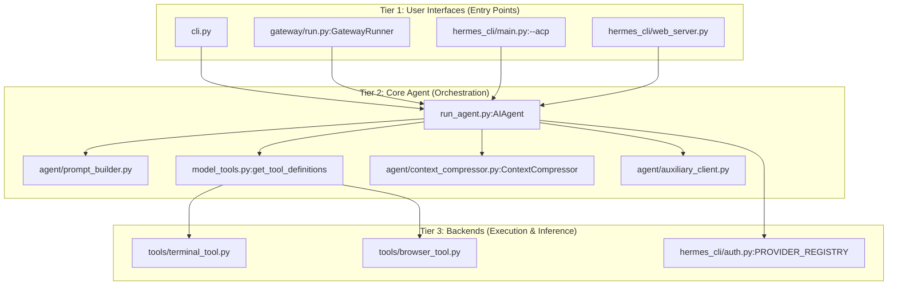

**Sources:** [run_agent.py:103-187](), [cli.py:1-14](), [gateway/run.py:1-32](), [hermes_cli/main.py:40-44](), [hermes_cli/auth.py:167-183](), [agent/auxiliary_client.py:1-41]()

### Runtime Modes

The system supports several primary runtime modes, each instantiating `AIAgent` with different lifecycle management:

| Mode | Entry Point | Use Case | Session Persistence |
|------|-------------|----------|---------------------|
| **CLI** | `cli.py` | Interactive terminal sessions with TUI | `~/.hermes/sessions/` |
| **Gateway** | `gateway/run.py` | Messaging platforms (Telegram, Discord, etc.) | `~/.hermes/sessions/` |
| **ACP** | `hermes_cli/main.py` | Editor integrations (VS Code, Zed) | Client-managed |
| **Web UI** | `hermes_cli/web_server.py` | Browser-based dashboard and chat | `~/.hermes/sessions/` |

**Sources:** [cli.py:1-14](), [gateway/run.py:1-14](), [run_agent.py:103-125](), [hermes_cli/main.py:1-44]()

---

## Core Components

### AIAgent Class

The `AIAgent` class in `run_agent.py` orchestrates the conversation loop. It manages the iteration budget, tool execution via `handle_function_call`, and state persistence. [run_agent.py:17-21](), [run_agent.py:77-102]()

**Execution Flow: Natural Language to Tool Call**

```mermaid
graph LR
    UserMsg["User Message"] --> AIAgent["run_agent.py:AIAgent.run_conversation()"]
    AIAgent --> PromptBuilder["agent/prompt_builder.py:build_skills_system_prompt()"]
    PromptBuilder --> LLMProvider["LLM Provider<br/>(hermes_cli/auth.py:resolve_provider())"]
    LLMProvider --> ToolCallJSON["Tool Call JSON"]
    ToolCallJSON --> ToolDispatcher["model_tools.py:handle_function_call()"]
    ToolDispatcher --> ToolsDir["tools/ directory"]
    ToolsDir --> TerminalTool["tools/terminal_tool.py"]
    TerminalTool --> ToolResult["Tool Result String"]
    ToolResult --> AIAgent
```

**Sources:** [run_agent.py:103-127](), [hermes_cli/auth.py:167-183](), [agent/prompt_builder.py:120-128](), [model_tools.py:97-102]()

### Tool and Environment System

Tools are discovered at runtime and registered for LLM use. Execution occurs within abstracted environments (Local, Docker, SSH, Modal, Daytona, Singularity, etc.) configured in the terminal settings. [hermes_cli/setup.py:5-9](), [website/docs/user-guide/configuration.md:108-116]()

- **Tool System**: Handled via `model_tools.py`, which provides definitions and execution logic for tools like terminal access, file operations, and web browsing. [run_agent.py:123-128]()
- **Environments**: The terminal backend allows the agent to run commands across diverse backends as configured in the `terminal` block of `config.yaml`. [hermes_cli/config.py:5-6](), [website/docs/user-guide/configuration.md:108-116]()

**Sources:** [run_agent.py:103-138](), [hermes_cli/config.py:5-6](), [hermes_cli/setup.py:5-9](), [website/docs/user-guide/configuration.md:108-116]()

---

## Memory and Learning

Hermes Agent features a "closed learning loop" where it creates and improves its own capabilities over time.

- **Skills System**: The agent can create new Python-based tools (skills) and manage them via the `skill_manage` tool. [hermes_cli/main.py:17-30]()
- **Persistent Memory**: Uses `MEMORY.md` and `USER.md` files for long-term fact storage and user profiling, with logic managed in `agent/memory_manager.py`. [run_agent.py:135-136]()
- **Honcho Integration**: Supports AI-native memory and user modeling via the Honcho integration for cross-session recall and dialectic queries. [hermes_cli/main.py:21-36]()

**Sources:** [run_agent.py:135-136](), [hermes_cli/main.py:21-36](), [agent/memory_manager.py:135-136]()

---

## Configuration

All persistent configuration and user data live in the `HERMES_HOME` directory (default: `~/.hermes/`). [hermes_cli/config.py:4-6]()

| File | Purpose |
|------|---------|
| `config.yaml` | Primary settings (model, terminal backend, toolsets) [website/docs/user-guide/configuration.md:19]() |
| `.env` | Secrets and API keys [website/docs/user-guide/configuration.md:20]() |
| `SOUL.md` | Primary agent identity/persona [website/docs/user-guide/configuration.md:22]() |
| `auth.json` | OAuth tokens and provider state [website/docs/user-guide/configuration.md:21]() |

**Sources:** [hermes_cli/config.py:4-6](), [hermes_cli/auth.py:1-17](), [hermes_cli/setup.py:11-12](), [website/docs/user-guide/configuration.md:15-28]()

---

## Sub-Pages

For more technical depth, please refer to the following child pages:

- **[Architecture Overview](#1.1)** — Deep dive into the three-tier architecture, the `AIAgent` loop, and tool registry internals.
- **[Project Structure and Dependencies](#1.2)** — Detailed documentation of the directory layout, key files, and the installation ecosystem including Nix support.

---

# Page: Architecture Overview

# Architecture Overview

<details>
<summary>Relevant source files</summary>

The following files were used as context for generating this wiki page:

- [agent/agent_runtime_helpers.py](agent/agent_runtime_helpers.py)
- [agent/auxiliary_client.py](agent/auxiliary_client.py)
- [agent/tool_executor.py](agent/tool_executor.py)
- [cli-config.yaml.example](cli-config.yaml.example)
- [cli.py](cli.py)
- [gateway/run.py](gateway/run.py)
- [hermes_cli/auth.py](hermes_cli/auth.py)
- [hermes_cli/commands.py](hermes_cli/commands.py)
- [hermes_cli/config.py](hermes_cli/config.py)
- [hermes_cli/main.py](hermes_cli/main.py)
- [hermes_cli/models.py](hermes_cli/models.py)
- [hermes_cli/runtime_provider.py](hermes_cli/runtime_provider.py)
- [hermes_cli/setup.py](hermes_cli/setup.py)
- [hermes_cli/tips.py](hermes_cli/tips.py)
- [run_agent.py](run_agent.py)
- [tests/agent/test_auxiliary_client.py](tests/agent/test_auxiliary_client.py)
- [tests/hermes_cli/test_commands.py](tests/hermes_cli/test_commands.py)
- [tests/hermes_cli/test_model_validation.py](tests/hermes_cli/test_model_validation.py)
- [tests/hermes_cli/test_runtime_provider_resolution.py](tests/hermes_cli/test_runtime_provider_resolution.py)
- [tests/run_agent/test_repair_tool_call_name.py](tests/run_agent/test_repair_tool_call_name.py)
- [tests/run_agent/test_tool_executor_contextvar_propagation.py](tests/run_agent/test_tool_executor_contextvar_propagation.py)
- [tests/test_batch_runner_checkpoint.py](tests/test_batch_runner_checkpoint.py)
- [tests/test_minimax_oauth.py](tests/test_minimax_oauth.py)
- [tests/test_model_tools.py](tests/test_model_tools.py)
- [tests/tools/test_file_tools_cwd_resolution.py](tests/tools/test_file_tools_cwd_resolution.py)
- [tests/tools/test_image_generation.py](tests/tools/test_image_generation.py)
- [tests/tools/test_tool_search.py](tests/tools/test_tool_search.py)
- [tools/thread_context.py](tools/thread_context.py)
- [tools/tool_search.py](tools/tool_search.py)
- [website/docs/developer-guide/agent-loop.md](website/docs/developer-guide/agent-loop.md)
- [website/docs/developer-guide/architecture.md](website/docs/developer-guide/architecture.md)
- [website/docs/developer-guide/context-compression-and-caching.md](website/docs/developer-guide/context-compression-and-caching.md)
- [website/docs/developer-guide/cron-internals.md](website/docs/developer-guide/cron-internals.md)
- [website/docs/developer-guide/gateway-internals.md](website/docs/developer-guide/gateway-internals.md)
- [website/docs/guides/cron-troubleshooting.md](website/docs/guides/cron-troubleshooting.md)
- [website/docs/integrations/index.md](website/docs/integrations/index.md)
- [website/docs/reference/tools-reference.md](website/docs/reference/tools-reference.md)
- [website/docs/reference/toolsets-reference.md](website/docs/reference/toolsets-reference.md)
- [website/docs/user-guide/features/cron.md](website/docs/user-guide/features/cron.md)
- [website/docs/user-guide/features/image-generation.md](website/docs/user-guide/features/image-generation.md)
- [website/docs/user-guide/features/overview.md](website/docs/user-guide/features/overview.md)
- [website/docs/user-guide/features/tool-gateway.md](website/docs/user-guide/features/tool-gateway.md)
- [website/docs/user-guide/features/tool-search.md](website/docs/user-guide/features/tool-search.md)
- [website/docs/user-guide/features/tools.md](website/docs/user-guide/features/tools.md)
- [website/docs/user-guide/sessions.md](website/docs/user-guide/sessions.md)

</details>


## Purpose and Scope

This document describes the high-level architecture of the Hermes Agent system, focusing on the three-tier architecture, major subsystems, and their technical interactions. Hermes Agent is an AI agent framework designed with self-improvement capabilities, orchestrating interactions between LLMs, a diverse tool registry, and multiple execution environments. [run_agent.py:1-21]()

The architecture is organized into three primary tiers:

1.  **User Interface Layer**: Interactive frontends including the CLI (terminal interface), the Messaging Gateway (platform adapters for Telegram, Discord, etc.), and the Web UI Dashboard. [cli.py:1-13](), [gateway/run.py:1-14](), [hermes_cli/main.py:1-44]()
2.  **Core Agent Layer**: The central `AIAgent` class orchestrates the conversation loop, manages context/memory, and handles tool invocation. [run_agent.py:17-21]()
3.  **Tool & Execution Layer**: A modular system of toolsets (terminal, browser, file operations) and an environment abstraction layer that supports local, Docker, SSH, and serverless backends. [run_agent.py:122-132]()

---

## Core Architecture Components

### System Overview Diagram

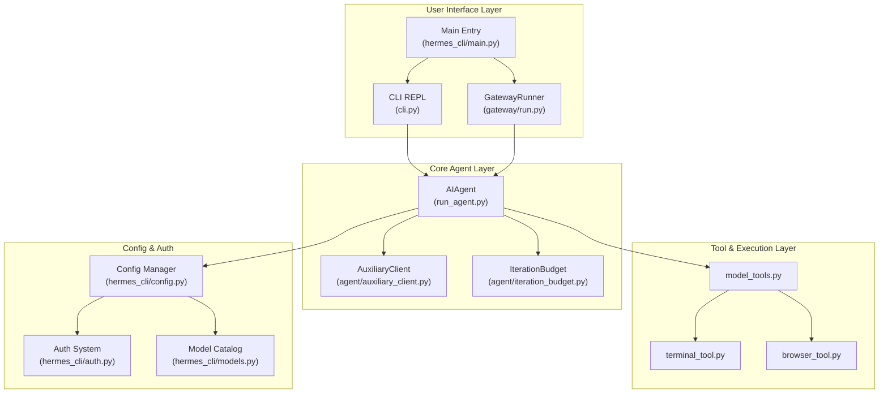

**Sources:** [run_agent.py:17-21](), [cli.py:5-13](), [gateway/run.py:1-14](), [hermes_cli/config.py:1-13](), [hermes_cli/auth.py:1-20](), [hermes_cli/main.py:1-44]().

---

## AIAgent: The Central Orchestrator

The `AIAgent` class in `run_agent.py` is the primary engine of the system. It encapsulates the logic for the "Think-Act-Observe" loop, managing the state of a single conversation session. [run_agent.py:5-21]()

### Conversation Orchestration
*   **Loop Management**: The agent executes a tool-calling loop until a final response is generated or the `IterationBudget` is exhausted. [run_agent.py:10-14](), [run_agent.py:103-103]()
*   **Context Management**: It uses `sanitize_context` to manage message history and `_strip_reasoning_tags` to handle reasoning/thought blocks (e.g., `<think>` tags). [run_agent.py:134-134](), [cli.py:192-202]()
*   **Token Estimation**: It utilizes `estimate_request_tokens_rough` to monitor context window usage and ensure model limits are respected. [run_agent.py:138-141]()

### Auxiliary Client and Resolution
Side tasks like vision analysis, web extraction, or context compression are offloaded to the `AuxiliaryClient`. This subsystem provides a resolution chain to pick the best available backend (OpenRouter, Nous Portal, etc.) without interrupting the main conversation flow. [agent/auxiliary_client.py:1-41]()

*   **Resolution Order**: It checks user-defined overrides in `config.yaml` before falling back to auto-detection chains for text and vision tasks. [agent/auxiliary_client.py:7-24]()
*   **Provider Aliases**: It normalizes provider names (e.g., mapping "google" to "gemini") to ensure consistent routing. [agent/auxiliary_client.py:131-162]()

**Sources:** [run_agent.py:5-21](), [run_agent.py:134-152](), [agent/auxiliary_client.py:1-41](), [cli.py:192-202]().

---

## Tool System and Execution

Hermes employs a modular tool dispatch system that bridges natural language requests to code execution.

### Tool Execution Flow

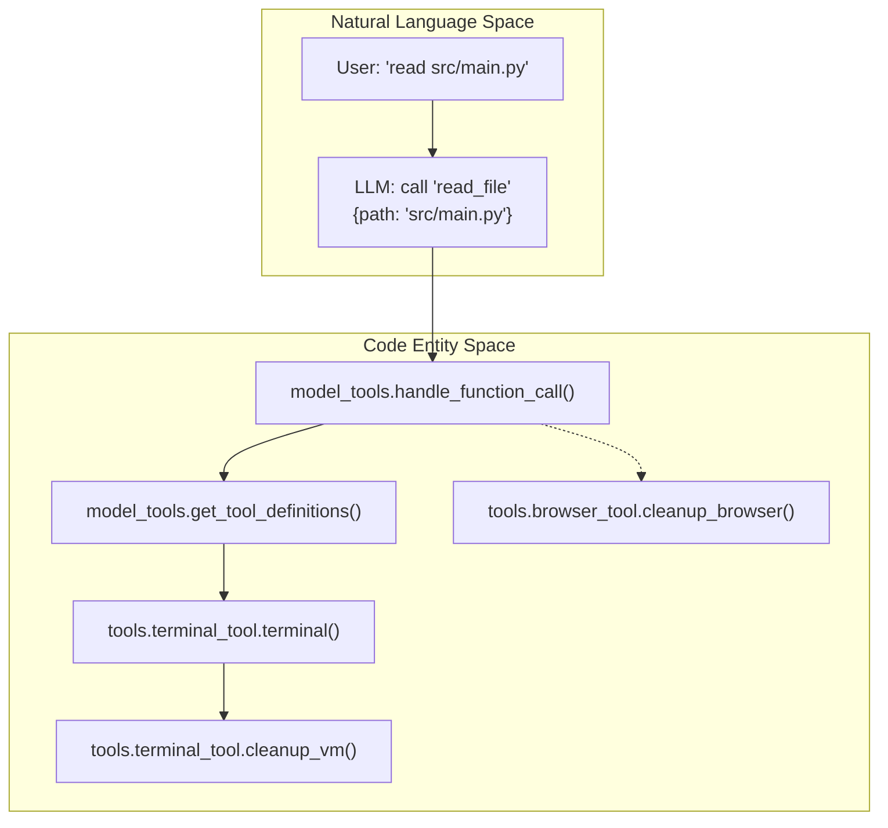

*   **Registry**: `model_tools.py` provides the central registry where tools are defined via `get_tool_definitions` and executed via `handle_function_call`. [run_agent.py:122-127]()
*   **Guardrails**: The `ToolGuardrailDecision` system inspects calls for destructive patterns or dangerous commands before execution. [run_agent.py:173-177]()
*   **Lifecycle Management**: The agent handles environment cleanup through functions like `cleanup_vm` and `cleanup_browser` to ensure resources are released after a session. [run_agent.py:128-131]()

**Sources:** [run_agent.py:122-131](), [run_agent.py:173-177]().

---

## Configuration and Authentication

The system uses a hierarchical configuration and a multi-provider authentication store.

### Configuration Hierarchy
1.  **CLI Args**: Highest priority passed during invocation. [cli.py:8-13]()
2.  **`config.yaml`**: Main settings in `~/.hermes/config.yaml`. [hermes_cli/config.py:5-6]()
3.  **`.env`**: API keys and secrets in `~/.hermes/.env`. [hermes_cli/config.py:6]()
4.  **Defaults**: System defaults defined in `DEFAULT_CONFIG`. [hermes_cli/config.py:133-134]()

### Authentication and Models
The authentication system in `hermes_cli/auth.py` manages credentials for various providers.
*   **Provider Registry**: Defines known inference providers and their auth types (OAuth, API Key). [hermes_cli/auth.py:150-183]()
*   **Model Catalog**: `hermes_cli/models.py` maintains canonical model lists and validation helpers for providers like OpenRouter, OpenAI, and Anthropic. [hermes_cli/models.py:1-6]()
*   **Setup Wizard**: `hermes_cli/setup.py` provides an interactive flow to configure these components. [hermes_cli/setup.py:1-12]()

**Sources:** [hermes_cli/config.py:1-13](), [hermes_cli/auth.py:1-20](), [hermes_cli/models.py:1-6](), [hermes_cli/setup.py:1-12]().

---

## Messaging Gateway

The `GatewayRunner` in `gateway/run.py` enables multi-platform support by acting as a bridge between external messaging APIs and the core `AIAgent`.

*   **Agent Caching**: It maintains an LRU cache of `AIAgent` instances (`_AGENT_CACHE_MAX_SIZE = 128`) to prevent unbounded growth while supporting concurrent sessions. [gateway/run.py:59-65]()
*   **Transient Error Handling**: Includes `_is_transient_network_error` and a specialized loop exception handler to prevent the gateway from crashing due to platform-specific network timeouts (e.g., Telegram `TimedOut`). [gateway/run.py:143-194]()
*   **Command Registry**: Slash commands (e.g., `/new`, `/model`) are defined centrally in `hermes_cli/commands.py` and shared between the CLI and Gateway. [hermes_cli/commands.py:1-9]()

**Sources:** [gateway/run.py:1-14](), [gateway/run.py:59-65](), [gateway/run.py:143-194](), [hermes_cli/commands.py:1-9]().

---

# Page: Project Structure and Dependencies

# Project Structure and Dependencies

<details>
<summary>Relevant source files</summary>

The following files were used as context for generating this wiki page:

- [.envrc](.envrc)
- [.github/actions/nix-setup/action.yml](.github/actions/nix-setup/action.yml)
- [.github/workflows/nix-lockfile-fix.yml](.github/workflows/nix-lockfile-fix.yml)
- [.github/workflows/nix.yml](.github/workflows/nix.yml)
- [.gitignore](.gitignore)
- [MANIFEST.in](MANIFEST.in)
- [acp_registry/agent.json](acp_registry/agent.json)
- [flake.lock](flake.lock)
- [flake.nix](flake.nix)
- [hermes_cli/__init__.py](hermes_cli/__init__.py)
- [hermes_cli/managed_uv.py](hermes_cli/managed_uv.py)
- [hermes_cli/security_advisories.py](hermes_cli/security_advisories.py)
- [nix/checks.nix](nix/checks.nix)
- [nix/devShell.nix](nix/devShell.nix)
- [nix/hermes-agent.nix](nix/hermes-agent.nix)
- [nix/lib.nix](nix/lib.nix)
- [nix/nixosModules.nix](nix/nixosModules.nix)
- [nix/overlays.nix](nix/overlays.nix)
- [nix/packages.nix](nix/packages.nix)
- [nix/python.nix](nix/python.nix)
- [nix/tui.nix](nix/tui.nix)
- [nix/web.nix](nix/web.nix)
- [pyproject.toml](pyproject.toml)
- [scripts/contributor_audit.py](scripts/contributor_audit.py)
- [scripts/install.ps1](scripts/install.ps1)
- [scripts/install.sh](scripts/install.sh)
- [setup-hermes.sh](setup-hermes.sh)
- [tests/hermes_cli/test_cmd_update.py](tests/hermes_cli/test_cmd_update.py)
- [tests/hermes_cli/test_ensure_utf8_locale.py](tests/hermes_cli/test_ensure_utf8_locale.py)
- [tests/hermes_cli/test_managed_uv.py](tests/hermes_cli/test_managed_uv.py)
- [tests/hermes_cli/test_run_with_idle_timeout.py](tests/hermes_cli/test_run_with_idle_timeout.py)
- [tests/hermes_cli/test_tui_npm_install.py](tests/hermes_cli/test_tui_npm_install.py)
- [tests/hermes_cli/test_update_autostash.py](tests/hermes_cli/test_update_autostash.py)
- [tests/hermes_cli/test_update_interrupted_recovery.py](tests/hermes_cli/test_update_interrupted_recovery.py)
- [tests/hermes_cli/test_uv_tool_update.py](tests/hermes_cli/test_uv_tool_update.py)
- [tests/hermes_cli/test_verify_core_dependencies.py](tests/hermes_cli/test_verify_core_dependencies.py)
- [tests/hermes_cli/test_web_ui_build.py](tests/hermes_cli/test_web_ui_build.py)
- [tests/test_packaging_metadata.py](tests/test_packaging_metadata.py)
- [tests/test_project_metadata.py](tests/test_project_metadata.py)
- [tests/test_wheel_locales_e2e.py](tests/test_wheel_locales_e2e.py)
- [tests/tools/test_lazy_deps.py](tests/tools/test_lazy_deps.py)
- [tools/lazy_deps.py](tools/lazy_deps.py)
- [uv.lock](uv.lock)
- [website/docs/getting-started/nix-setup.md](website/docs/getting-started/nix-setup.md)

</details>


This page documents the repository organization, dependency management, and installation ecosystem of Hermes Agent. It covers the directory layout, key source files, the `uv`-based dependency and Python management system, and native multi-platform installation including Nix flake support for declarative deployments.

---

## Repository Layout

Hermes Agent follows a modular codebase design with well-defined directory boundaries for CLI, core agent logic, tools, messaging gateways, and frontends.

### Top-Level Directory Structure and Key Files

The diagram below associates conceptual system components to their corresponding code entities and main source files:

```mermaid
graph TB
    Root["Repository Root"]
    
    Root --> CLI["hermes_cli/ [hermes_cli/]<br/>CLI commands & setup"]
    Root --> Agent["agent/ [agent/]<br/>Agent internals"]
    Root --> Tools["tools/ [tools/]<br/>Tool implementations"]
    Root --> Gateway["gateway/ [gateway/]<br/>Messaging platform adapters"]
    Root --> Cron["cron/ [cron/]<br/>Scheduled tasks"]
    Root --> ACP["acp_registry/ [acp_registry/]<br/>ACP Manifest & Registry"]
    Root --> Plugins["plugins/ [plugins/]<br/>Memory & miscellaneous plugins"]
    Root --> Nix["nix/ [nix/]<br/>Nix flake support for deployment"]
    Root --> TUI["ui-tui/ [ui-tui/]<br/>React Ink-based Terminal UI frontend"]

    CLI --> MainPy["main.py [hermes_cli/main.py]<br/>CLI entry point"]
    CLI --> WebServer["web_server.py [hermes_cli/web_server.py]<br/>FastAPI backend for Dashboard"]
    CLI --> InitPy["__init__.py [hermes_cli/__init__.py]<br/>Version and UTF-8 enforcement"]

    Agent --> AIAgent["AIAgent [agent/run_agent.py]<br/>Core orchestration & conversation loop"]
    Agent --> StatePy["hermes_state.py [agent/hermes_state.py]<br/>Session and memory persistence"]

    Tools --> RegistryPy["registry.py [tools/registry.py]<br/>Central tool registry"]
    Tools --> ToolsetsPy["toolsets.py [tools/toolsets.py]<br/>Toolset definitions"]

    Gateway --> GatewayRunner["GatewayRunner [gateway/run.py]<br/>Gateway service runner"]
    Gateway --> Platforms["platforms/ [gateway/platforms/]<br/>Platform adapter implementations"]

    Root --> BatchRunner["BatchRunner [batch_runner.py]<br/>Parallel trajectory generation"]
    Root --> ReleaseScript["release.py [scripts/release.py]<br/>CalVer release & changelog management"]
```

**Sources:** [hermes_cli/__init__.py:1-12](), [pyproject.toml:8-23](), [hermes_cli/main.py:1-50](), [agent/run_agent.py:1-20]()

---

## Dependency Management

### `uv` Package Manager Ecosystem

Hermes Agent leverages the `uv` package manager for fast, reproducible Python environment management and tool provisioning.

- **Python Requirement:** The project requires **Python >= 3.11,<3.14** [pyproject.toml:20](). The upper bound is critical to prevent `uv` from attempting to install Python 3.14, for which many Rust-backed transitive dependencies (e.g., `pydantic-core`) do not yet have pre-built wheels [pyproject.toml:13-19]().
- **Exact Pinning:** All direct dependencies are exact-pinned (e.g., `openai==2.24.0`) to prevent supply-chain attacks from unreviewed transitive updates [pyproject.toml:24-33]().
- **Lockfile:** The `uv.lock` file captures the full resolution of the dependency tree, ensuring consistency across installs [uv.lock:1-7]().
- **Lazy Installation:** Provider-specific packages (e.g., `anthropic`, `firecrawl-py`, `exa-py`) are moved to optional extras and lazy-installed via `tools/lazy_deps.py` to minimize the base install size and security blast radius [pyproject.toml:39-44](). This also prevents issues like the `matrix` extra's `python-olm` dependency from breaking installs on platforms without compatible wheels [tests/test_project_metadata.py:21-45]().

### Core Dependencies

The pinned set of dependencies in `pyproject.toml` ensures stability:

| Category | Key Dependencies | Role |
|----------|------------------|------|
| **LLM / Data** | `openai`, `pydantic`, `python-dotenv` | Model communication, validation, and env config [pyproject.toml:45-59]() |
| **CLI / UI** | `prompt_toolkit`, `rich`, `fire` | Interactive REPL, terminal formatting, and CLI parsing [pyproject.toml:47-61]() |
| **Networking** | `httpx[socks]`, `requests`, `tenacity` | HTTP clients and retry logic [pyproject.toml:48-53]() |
| **Process** | `psutil` | Cross-platform PID and process-tree management [pyproject.toml:95-100]() |
| **Scheduling** | `croniter` | Core engine for scheduled/interval jobs [pyproject.toml:63]() |
| **Web Server** | `fastapi`, `uvicorn[standard]` | Backend for the Web UI Dashboard [pyproject.toml:103-104]() |
| **Terminal** | `ptyprocess` (Unix), `pywinpty` (Windows) | Cross-platform pseudo-terminal management [pyproject.toml:105-106]() |

**Sources:** [pyproject.toml:45-115](), [uv.lock:1-68]()

---

## Installation Ecosystem

### Cross-Platform Installation Scripts

Hermes provides specialized bootstrap scripts for various environments:

- **`scripts/install.sh`**: The primary installer for Linux, macOS, and Termux. It handles OS detection, FHS-style root installs (`/usr/local/lib/hermes-agent`), and `uv` provisioning [scripts/install.sh:1-66](). It includes a "Stage protocol" for programmatic drivers like the desktop GUI [scripts/install.sh:77-82]().
- **`scripts/install.ps1`**: The Windows PowerShell installer. It forces UTF-8 console encoding to prevent mojibake [scripts/install.ps1:73-89]() and includes logic to detect real architecture (ARM64 vs x64) even under emulation [scripts/install.ps1:125-154]().
- **`hermes_cli/__init__.py`**: Forces UTF-8 encoding at the earliest possible import time to prevent `UnicodeEncodeError` crashes on systems with legacy locales (e.g., Windows CP1252 or minimal Linux ASCII) [hermes_cli/__init__.py:21-51]().

### Nix and NixOS Support

Hermes Agent provides a native NixOS module and flake outputs for declarative deployments.

#### NixOS Module Modes
The module supports two modes [nix/nixosModules.nix:3-5]():
1. **Native systemd service:** Standard host-level service.
2. **Container mode:** Runs inside an OCI container (Docker/Podman) with a persistent writable layer [nix/nixosModules.nix:7-11]().

#### Container Provisioning
The container entrypoint script (`hermes-container-entrypoint`) ensures a writable toolchain is available even when the core agent is read-only in the Nix store [nix/nixosModules.nix:87-152]():
- **User/Group Management:** Dynamically creates a `hermes` user/group matching the host's UID/GID [nix/nixosModules.nix:93-124]().
- **Tooling:** Provisions Node 22 via NodeSource and bootstraps a Python 3.11 venv using `uv` [nix/nixosModules.nix:135-157]().

#### Nix Flake Structure
- **`nix/lib.nix`**: Shared helpers for building npm workspace members. It uses a single `npmDepsHash` to manage dependencies across the entire monorepo [nix/lib.nix:1-31]().
- **`nix/tui.nix`**: Compiles the React/Ink TUI using `tsc` and `esbuild` [nix/tui.nix:1-33]().
- **`nix/packages.nix`**: Defines the `hermes-agent` package and its dependency variants.

### Frontend Build Architecture

The TUI and Web dashboard are built using Node-based toolchains and integrated into the Python package.

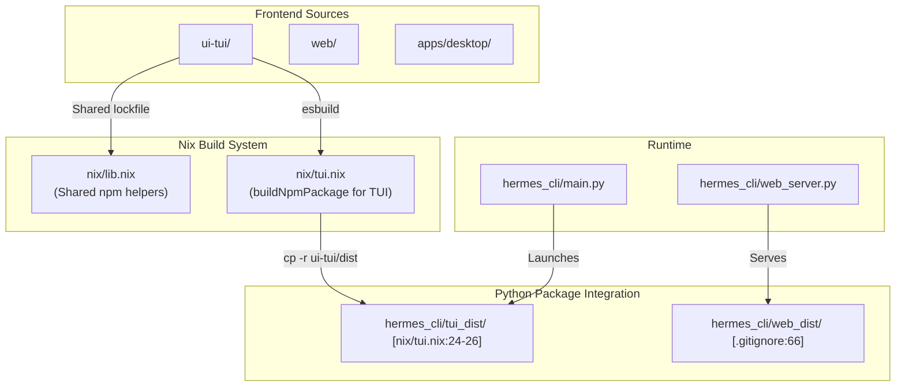

**Sources:** [nix/lib.nix:1-132](), [nix/tui.nix:1-33](), [nix/nixosModules.nix:1-157](), [scripts/install.sh:1-140](), [scripts/install.ps1:1-154]()

---

## Project Metadata and Constraints

### Automated Updates and Stashing
The CLI includes a robust self-update system (`hermes update`) that manages local changes using `git stash` [tests/hermes_cli/test_update_autostash.py:59-82](). It handles interrupted updates via breadcrumb files like `.update-incomplete` [ .gitignore:120-121]().

### Versioning and Metadata
- **Version:** Managed in `pyproject.toml` and `hermes_cli/__init__.py` [pyproject.toml:10](), [hermes_cli/__init__.py:17]().
- **Release Date:** Captured in `__release_date__` [hermes_cli/__init__.py:18]().
- **SPDX License:** MIT [pyproject.toml:22]().

**Sources:** [pyproject.toml:1-23](), [hermes_cli/__init__.py:14-20](), [tests/hermes_cli/test_update_autostash.py:1-150]()

---

# Page: Getting Started

# Getting Started

<details>
<summary>Relevant source files</summary>

The following files were used as context for generating this wiki page:

- [.gitignore](.gitignore)
- [hermes_cli/managed_uv.py](hermes_cli/managed_uv.py)
- [scripts/install.ps1](scripts/install.ps1)
- [scripts/install.sh](scripts/install.sh)
- [setup-hermes.sh](setup-hermes.sh)
- [tests/hermes_cli/test_cmd_update.py](tests/hermes_cli/test_cmd_update.py)
- [tests/hermes_cli/test_managed_uv.py](tests/hermes_cli/test_managed_uv.py)
- [tests/hermes_cli/test_run_with_idle_timeout.py](tests/hermes_cli/test_run_with_idle_timeout.py)
- [tests/hermes_cli/test_tui_npm_install.py](tests/hermes_cli/test_tui_npm_install.py)
- [tests/hermes_cli/test_update_autostash.py](tests/hermes_cli/test_update_autostash.py)
- [tests/hermes_cli/test_update_interrupted_recovery.py](tests/hermes_cli/test_update_interrupted_recovery.py)
- [tests/hermes_cli/test_uv_tool_update.py](tests/hermes_cli/test_uv_tool_update.py)
- [tests/hermes_cli/test_verify_core_dependencies.py](tests/hermes_cli/test_verify_core_dependencies.py)
- [tests/hermes_cli/test_web_ui_build.py](tests/hermes_cli/test_web_ui_build.py)
- [website/docs/getting-started/installation.md](website/docs/getting-started/installation.md)
- [website/docs/getting-started/quickstart.md](website/docs/getting-started/quickstart.md)
- [website/docs/getting-started/updating.md](website/docs/getting-started/updating.md)
- [website/docs/integrations/providers.md](website/docs/integrations/providers.md)
- [website/docs/reference/cli-commands.md](website/docs/reference/cli-commands.md)
- [website/docs/reference/environment-variables.md](website/docs/reference/environment-variables.md)
- [website/docs/reference/slash-commands.md](website/docs/reference/slash-commands.md)
- [website/docs/user-guide/cli.md](website/docs/user-guide/cli.md)
- [website/docs/user-guide/configuration.md](website/docs/user-guide/configuration.md)
- [website/docs/user-guide/features/fallback-providers.md](website/docs/user-guide/features/fallback-providers.md)
- [website/docs/user-guide/messaging/index.md](website/docs/user-guide/messaging/index.md)
- [website/sidebars.ts](website/sidebars.ts)

</details>


This page provides a high-level guide for installing and configuring Hermes Agent, from initial setup to your first conversation. Hermes is designed for users who live in the terminal but also offers a robust messaging gateway for external platforms.

---

## 2.1 Installation

Hermes Agent is cross-platform, supporting Linux, macOS, WSL2, and Android (via Termux). The primary installation method uses `uv` for fast Python provisioning and dependency management [scripts/install.sh:6](), [scripts/install.ps1:5]().

*   **Linux / macOS / WSL2**: The `curl | bash` installer handles platform-specific setup and dependency provisioning [scripts/install.sh:9-12](). It supports an FHS-style root install layout [scripts/install.sh:62-66]().
*   **Android / Termux**: A curated `termux` extra is used to ensure reliable installs on Android, avoiding incompatible binary dependencies [website/docs/getting-started/quickstart.md:68-70]().
*   **Windows**: Native Windows support is available via a PowerShell one-liner [scripts/install.ps1:8](). It installs a portable Git Bash (MinGit) to ensure a POSIX-like environment for shell tools [scripts/install.ps1:209-210]().
*   **Nix**: A Nix flake is provided for reproducible environments [website/sidebars.ts:14]().
*   **Desktop App**: A Tauri-based bootstrap installer is available for users who prefer a graphical installation path [website/docs/getting-started/quickstart.md:50-51]().

For details, see [Installation](#2.1).

**Sources:** [scripts/install.sh:1-12](), [scripts/install.ps1:1-13](), [website/docs/getting-started/quickstart.md:50-70](), [website/sidebars.ts:14](), [scripts/install.ps1:209-210]()

---

## 2.2 Configuration and Setup

Hermes stores all user data and settings in the `HERMES_HOME` directory, which defaults to `~/.hermes/` on POSIX systems [scripts/install.sh:48]() and `$env:LOCALAPPDATA\hermes` on Windows [scripts/install.ps1:26](). Configuration follows a strict hierarchy where CLI arguments override file-based settings.

### Configuration Hierarchy

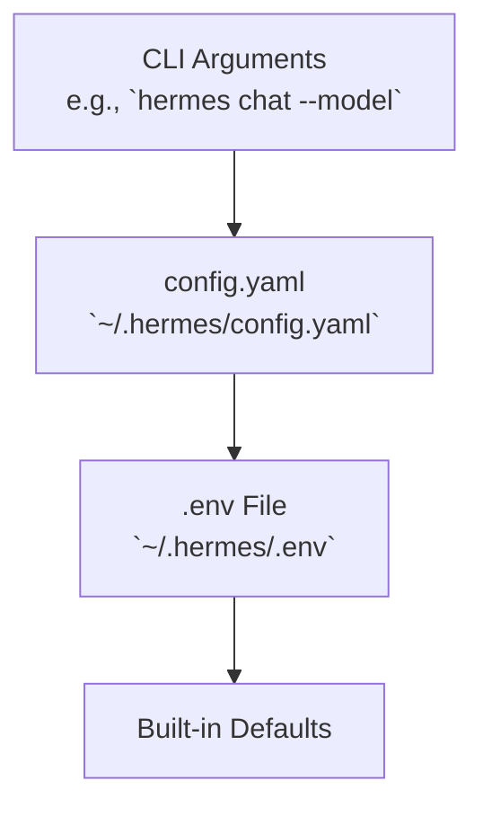
**Sources:** [website/docs/user-guide/configuration.md:49-57]()

### The Setup Wizard

The `hermes setup` command launches an interactive wizard [website/docs/reference/cli-commands.md:46]() that configures models, terminal backends, and messaging platforms [website/docs/user-guide/messaging/index.md:109-112](). The `hermes config set` command automatically routes values to the correct file (e.g., API keys to `.env`, other settings to `config.yaml`) [website/docs/user-guide/configuration.md:45-47]().

| File | Contents |
|------|----------|
| `config.yaml` | Non-secret settings (model, terminal, TTS, compression, etc.) [website/docs/user-guide/configuration.md:19]() |
| `.env` | API keys and secrets [website/docs/user-guide/configuration.md:20]() |
| `auth.json` | OAuth provider credentials (Nous Portal, etc.) [website/docs/user-guide/configuration.md:21]() |
| `SOUL.md` | Primary agent identity (slot #1 in system prompt) [website/docs/user-guide/configuration.md:22]() |

For a full reference of configuration keys and the setup process, see [Configuration and Setup](#2.2).

**Sources:** [website/docs/user-guide/configuration.md:7-30](), [website/docs/reference/cli-commands.md:46](), [website/docs/user-guide/messaging/index.md:109-112]()

---

## 2.3 Authentication and Providers

Hermes features a multi-provider authentication system that supports OAuth device code flows and traditional API key providers [website/docs/integrations/providers.md:11-54]().

1.  **OAuth Flows**: Managed via `hermes auth` [website/docs/reference/cli-commands.md:49](), supporting providers like Nous Portal, OpenAI Codex, and Google Gemini [website/docs/integrations/providers.md:62-85]().
2.  **API Keys**: Configured in `~/.hermes/.env` for providers such as OpenRouter, DeepSeek, and Anthropic [website/docs/reference/environment-variables.md:11-81]().
3.  **Provider Resolution**: Hermes uses a resolution chain to find credentials, prioritizing environment variables and `.env` files [website/docs/user-guide/configuration.md:49-57]().

### Provider Resolution Flow

```mermaid
graph TD
    A["User Command<br/>(e.g. `hermes chat`)"] --> B["`hermes_cli/main.py`<br/>`load_cli_config()`"]
    B --> C{Credential Lookup}
    
    subgraph "Code Entity Space"
        C1["`os.environ`"]
        C2["`dotenv` Parser<br/>(for `.env`)"]
        C3["`auth.json` Reader"]
    end

    C1 --> D["`AIAgent` Init<br/>`hermes_cli/agent.py`"]
    C2 --> D
    C3 --> D
    D --> E["Inference API"]
```
**Sources:** [website/docs/user-guide/configuration.md:49-60](), [website/docs/reference/environment-variables.md:7-9](), [website/docs/integrations/providers.md:11-45]()

For details on specific provider requirements and OAuth flows, see [Authentication and Providers](#2.3).

---

## 2.4 Model Selection and Management

Hermes maintains a model catalog and provides tools for context length discovery and validation.

*   **Interactive Selection**: The `hermes model` command provides a terminal interface for choosing providers and models [website/docs/reference/cli-commands.md:41]().
*   **Nous Portal**: A recommended unified subscription that provides access to 300+ models via `hermes setup --portal` [website/docs/user-guide/configuration.md:11-13]().
*   **Fallback Management**: Users can configure fallback providers via `hermes fallback` to ensure continuity if the primary model fails [website/docs/reference/cli-commands.md:42]().

### Model Selection and Persistence

```mermaid
flowchart LR
    A["`hermes model`"] --> B["`hermes_cli/commands.py`<br/>`model_command()`"]
    B --> C["`~/.hermes/config.yaml`"]
    C --> D["`AIAgent` Init<br/>`hermes_cli/agent.py`"]
    
    subgraph "Validation & Runtime"
        D --> E{"Check API Key"}
        E -- "Missing" --> F["`hermes auth` / `.env`"]
        E -- "Present" --> G["`run_conversation()`<br/>`hermes_cli/agent.py`"]
    end
```
**Sources:** [website/docs/reference/cli-commands.md:41-42](), [website/docs/user-guide/configuration.md:15-20]()

For details on model validation and the model catalog system, see [Model Selection and Management](#2.4).

---

# Page: Installation

# Installation

<details>
<summary>Relevant source files</summary>

The following files were used as context for generating this wiki page:

- [.envrc](.envrc)
- [.github/actions/nix-setup/action.yml](.github/actions/nix-setup/action.yml)
- [.github/workflows/nix-lockfile-fix.yml](.github/workflows/nix-lockfile-fix.yml)
- [.github/workflows/nix.yml](.github/workflows/nix.yml)
- [.gitignore](.gitignore)
- [MANIFEST.in](MANIFEST.in)
- [acp_registry/agent.json](acp_registry/agent.json)
- [flake.lock](flake.lock)
- [flake.nix](flake.nix)
- [hermes_cli/__init__.py](hermes_cli/__init__.py)
- [hermes_cli/managed_uv.py](hermes_cli/managed_uv.py)
- [hermes_cli/security_advisories.py](hermes_cli/security_advisories.py)
- [nix/checks.nix](nix/checks.nix)
- [nix/devShell.nix](nix/devShell.nix)
- [nix/hermes-agent.nix](nix/hermes-agent.nix)
- [nix/lib.nix](nix/lib.nix)
- [nix/nixosModules.nix](nix/nixosModules.nix)
- [nix/overlays.nix](nix/overlays.nix)
- [nix/packages.nix](nix/packages.nix)
- [nix/python.nix](nix/python.nix)
- [nix/tui.nix](nix/tui.nix)
- [nix/web.nix](nix/web.nix)
- [pyproject.toml](pyproject.toml)
- [scripts/contributor_audit.py](scripts/contributor_audit.py)
- [scripts/install.ps1](scripts/install.ps1)
- [scripts/install.sh](scripts/install.sh)
- [setup-hermes.sh](setup-hermes.sh)
- [tests/hermes_cli/test_cmd_update.py](tests/hermes_cli/test_cmd_update.py)
- [tests/hermes_cli/test_ensure_utf8_locale.py](tests/hermes_cli/test_ensure_utf8_locale.py)
- [tests/hermes_cli/test_managed_uv.py](tests/hermes_cli/test_managed_uv.py)
- [tests/hermes_cli/test_run_with_idle_timeout.py](tests/hermes_cli/test_run_with_idle_timeout.py)
- [tests/hermes_cli/test_tui_npm_install.py](tests/hermes_cli/test_tui_npm_install.py)
- [tests/hermes_cli/test_update_autostash.py](tests/hermes_cli/test_update_autostash.py)
- [tests/hermes_cli/test_update_interrupted_recovery.py](tests/hermes_cli/test_update_interrupted_recovery.py)
- [tests/hermes_cli/test_uv_tool_update.py](tests/hermes_cli/test_uv_tool_update.py)
- [tests/hermes_cli/test_verify_core_dependencies.py](tests/hermes_cli/test_verify_core_dependencies.py)
- [tests/hermes_cli/test_web_ui_build.py](tests/hermes_cli/test_web_ui_build.py)
- [tests/test_packaging_metadata.py](tests/test_packaging_metadata.py)
- [tests/test_project_metadata.py](tests/test_project_metadata.py)
- [tests/test_wheel_locales_e2e.py](tests/test_wheel_locales_e2e.py)
- [tests/tools/test_lazy_deps.py](tests/tools/test_lazy_deps.py)
- [tools/lazy_deps.py](tools/lazy_deps.py)
- [uv.lock](uv.lock)
- [website/docs/getting-started/nix-setup.md](website/docs/getting-started/nix-setup.md)

</details>


This document explains the installation process for Hermes Agent, detailing installation methods (curl|bash, PowerShell, manual, Nix flake, Tauri bootstrap installer), dependency provisioning, and platform-specific considerations.

---

## Overview

Hermes Agent features a zero-configuration, fully automated installer designed to provision its own isolated Python environment and dependencies to guarantee cross-platform compatibility and minimal system interference. The core installation logic is implemented in several key scripts:

- `scripts/install.sh` for POSIX-compliant systems (Linux, macOS, WSL2, Android Termux) [scripts/install.sh:1-15]()
- `scripts/install.ps1` for Windows PowerShell environments [scripts/install.ps1:1-13]()
- `setup-hermes.sh` for developers setting up a manual clone [setup-hermes.sh:1-18]()

The installer automates system detection, dependency management (including the `uv` Python package manager), Python environment setup, repository cloning, and CLI integration. For advanced users and automated deployments, Hermes also supports a Nix flake and NixOS modules for declarative installation [nix/nixosModules.nix:1-25]().

### Installation Workflow Summary

The installer executes a structured sequence:

1.  **System Detection:** Determines OS and distribution to tailor installation steps [scripts/install.sh:210-231]().
2.  **`uv` Package Manager Installation:** Provisions `uv`, a fast Python environment and package manager via `hermes_cli/managed_uv.py` logic [scripts/install.sh:258-278](), [scripts/install.ps1:72-130](), [hermes_cli/managed_uv.py:1-40]().
3.  **Python Provisioning:** Ensures Python 3.11 (strictly within the range `>=3.11,<3.14`) is present, installing it via `uv` if needed [pyproject.toml:20-20](), [scripts/install.sh:285-309](), [scripts/install.ps1:132-192]().
4.  **Dependency Checks:** Verifies and installs essential system dependencies such as `git`, `curl`, `ffmpeg`, and `node` [scripts/install.sh:311-399]().
5.  **Repository Setup**: Clones the Hermes Agent repository with submodules [scripts/install.sh:436-482]().
6.  **Virtual Environment & Dependency Installation:** Uses `uv` to create a Python virtual environment and pip-install dependencies, isolating Hermes runtime [scripts/install.sh:494-529]().
7.  **CLI Command Integration:** Creates symlinks to the `hermes` CLI binary in user local bin paths [scripts/install.sh:531-569]().
8.  **Post-Installation Setup Wizard:** Invokes `hermes setup` interactively to finalize configuration [scripts/install.sh:610-628]().

Sources: [scripts/install.sh:210-628](), [scripts/install.ps1:72-596](), [pyproject.toml:20-20](), [hermes_cli/managed_uv.py:1-40]()

---

## Installation Methods

### 1. Quick Install (curl|bash or PowerShell)

#### Linux / macOS / WSL2 / Android (Termux)
Run the POSIX shell install script directly via `curl`:
```bash
curl -fsSL https://hermes-agent.nousresearch.com/install.sh | bash
```
This script automatically detects platform specifics. For Termux (Android), it uses standard Python virtual environments (`venv`) and pip instead of `uv` due to binary compatibility constraints [scripts/install.sh:6-7]().

#### Windows (Native PowerShell)
Use the PowerShell installation command:
```powershell
iex (irm https://hermes-agent.nousresearch.com/install.ps1)
```
The installer handles provisioning `uv`, Python 3.11, and Node.js. It also forces UTF-8 encoding for the console session to ensure correct rendering of CLI graphics [scripts/install.ps1:84-89]().

Sources: [scripts/install.sh:8-87](), [scripts/install.ps1:7-21](), [scripts/install.ps1:84-89]()

---

### 2. Manual Installation (Development)

Developers can manually clone and set up Hermes using the provided setup script:
```bash
git clone --recurse-submodules https://github.com/NousResearch/hermes-agent.git
cd hermes-agent
./setup-hermes.sh
```
The `setup-hermes.sh` script automates the creation of a `.venv` using `uv` (on desktop) or `python -m venv` (on Termux) and installs the correct dependency set.

Sources: [setup-hermes.sh:1-18]()

---

### 3. Nix Flake and NixOS Modules

Hermes Agent supports Nix for reproducible and declarative installs.
- **NixOS Module:** Provides a native systemd service or an OCI container mode [nix/nixosModules.nix:1-11]().
- **TUI Component:** The React-based TUI is built using `buildNpmPackage` and bundled via `esbuild` [nix/tui.nix:15-33]().
- **Container Mode:** Runs Hermes from `/nix/store` bind-mounted into an Ubuntu container, allowing persistent `apt/pip/npm` installs for agent self-improvement [nix/nixosModules.nix:7-11]().
- **Shared Library:** `nix/lib.nix` provides `mkNpmPassthru` to manage the root `package-lock.json` across all workspace members (TUI, Web UI, Desktop) [nix/lib.nix:52-62]().

Sources: [nix/nixosModules.nix:1-25](), [nix/tui.nix:1-33](), [nix/lib.nix:52-62]()

---

### 4. Tauri Bootstrap Installer (Desktop App)

The desktop application for Hermes Agent uses a Tauri bootstrap installer. This installer leverages the `install.ps1` script on Windows and `install.sh` on macOS/Linux to provision the core Hermes CLI and its dependencies. The `--include-desktop` flag is passed to the installer to trigger the desktop app build process [scripts/install.ps1:45-60](), [scripts/install.sh:137]().

Sources: [scripts/install.ps1:45-60](), [scripts/install.sh:137]()

---

## Installation Flow Diagrams

### 1. System Provisioning Logic
This diagram traces the flow from initial script invocation through system detection and environment setup:

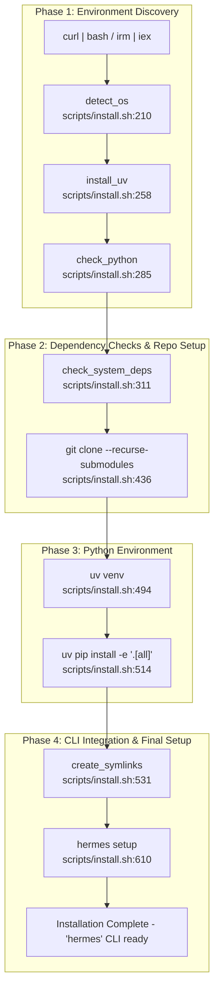
Sources: [scripts/install.sh:210-628](), [scripts/install.ps1:72-596]()

### 2. Installation Code Entity Association Map
This diagram associates system names with specific code entities and filesystem locations:

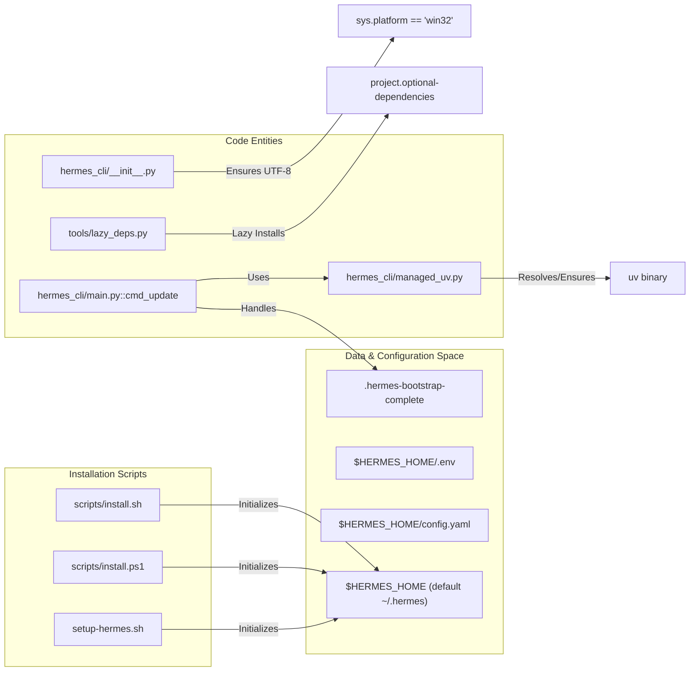
Sources: [hermes_cli/__init__.py:21-47](), [pyproject.toml:117-150](), [scripts/install.sh:48-58](), [hermes_cli/managed_uv.py:1-40](), [hermes_cli/main.py:9-15](), [.gitignore:115-117]()

---

## Dependency Management

Hermes Agent uses `uv` to manage a strictly pinned dependency set [pyproject.toml:25-37](). Dependencies are exact-pinned (e.g., `openai==2.24.0`) to prevent supply-chain attacks from unvetted transitive updates [pyproject.toml:25-33]().

### Core Dependencies
| Package | Version | Purpose |
| :--- | :--- | :--- |
| `openai` | `2.24.0` | Core LLM communication [pyproject.toml:45]() |
| `pydantic` | `2.13.4` | Data validation and tool schemas [pyproject.toml:59]() |
| `prompt_toolkit` | `3.0.52` | Interactive CLI/REPL [pyproject.toml:61]() |
| `psutil` | `7.2.2` | Cross-platform process management [pyproject.toml:100]() |
| `fastapi` | `>=0.104.0` | Web server and API gateway [pyproject.toml:103]() |

### Lazy Installation
Policy dictates that any extra with a `LAZY_DEPS` entry in `tools/lazy_deps.py` must be excluded from the base `[all]` installation [tests/test_project_metadata.py:48-59](). This prevents broken upstream releases (e.g., `mistralai`) from breaking the base install [pyproject.toml:30-33]().

Lazy-installed extras include:
- `anthropic`, `exa`, `firecrawl`, `fal`, `edge-tts`, `modal`, `daytona` [pyproject.toml:120-133]().
- `messaging` (Telegram, Discord, Slack) [pyproject.toml:135]().

Sources: [pyproject.toml:25-135](), [tests/test_project_metadata.py:48-59](), [tools/lazy_deps.py:1-10]()

---

## Platform-Specific Considerations

### Windows
- **UTF-8 Support:** Hermes forces UTF-8 on Windows via `_ensure_utf8()` to prevent `UnicodeEncodeError` crashes when printing box-drawing characters [hermes_cli/__init__.py:21-51]().
- **Timezone Data:** The `tzdata` package is installed specifically for Windows to resolve `ZoneInfoNotFoundError` [pyproject.toml:89-94]().
- **Architecture Detection:** The installer uses `Win32_Processor.Architecture` to detect the real OS architecture (ARM64, x64), bypassing emulation layers in PowerShell [scripts/install.ps1:108-134]().

### Linux / NixOS
- **FHS Layout:** On Linux root installs, code is placed in `/usr/local/lib/hermes-agent` and symlinked to `/usr/local/bin/hermes` [scripts/install.sh:62-66]().
- **NixOS Provisioning:** The NixOS module provisions `nodejs`, `npm`, and `uv` into a persistent writable layer inside containers to support agent self-modification [nix/nixosModules.nix:135-152]().

### Python Versioning
The project caps Python at `<3.14` because Rust-backed transitives (like `pydantic-core`) often lack wheels for upcoming Python versions, which would otherwise trigger failing source builds [pyproject.toml:13-19]().

Sources: [hermes_cli/__init__.py:21-51](), [pyproject.toml:89-94](), [scripts/install.ps1:108-134](), [scripts/install.sh:62-66](), [nix/nixosModules.nix:135-152](), [pyproject.toml:13-19]()

---

# Page: Configuration and Setup

# Configuration and Setup

<details>
<summary>Relevant source files</summary>

The following files were used as context for generating this wiki page:

- [agent/auxiliary_client.py](agent/auxiliary_client.py)
- [cli-config.yaml.example](cli-config.yaml.example)
- [cli.py](cli.py)
- [gateway/run.py](gateway/run.py)
- [hermes_cli/auth.py](hermes_cli/auth.py)
- [hermes_cli/commands.py](hermes_cli/commands.py)
- [hermes_cli/config.py](hermes_cli/config.py)
- [hermes_cli/main.py](hermes_cli/main.py)
- [hermes_cli/models.py](hermes_cli/models.py)
- [hermes_cli/nous_account.py](hermes_cli/nous_account.py)
- [hermes_cli/nous_subscription.py](hermes_cli/nous_subscription.py)
- [hermes_cli/runtime_provider.py](hermes_cli/runtime_provider.py)
- [hermes_cli/setup.py](hermes_cli/setup.py)
- [hermes_cli/tools_config.py](hermes_cli/tools_config.py)
- [run_agent.py](run_agent.py)
- [tests/agent/test_auxiliary_client.py](tests/agent/test_auxiliary_client.py)
- [tests/hermes_cli/test_commands.py](tests/hermes_cli/test_commands.py)
- [tests/hermes_cli/test_image_gen_picker.py](tests/hermes_cli/test_image_gen_picker.py)
- [tests/hermes_cli/test_model_validation.py](tests/hermes_cli/test_model_validation.py)
- [tests/hermes_cli/test_nous_subscription.py](tests/hermes_cli/test_nous_subscription.py)
- [tests/hermes_cli/test_runtime_provider_resolution.py](tests/hermes_cli/test_runtime_provider_resolution.py)
- [tests/hermes_cli/test_setup.py](tests/hermes_cli/test_setup.py)
- [tests/hermes_cli/test_setup_model_provider.py](tests/hermes_cli/test_setup_model_provider.py)
- [tests/hermes_cli/test_setup_noninteractive.py](tests/hermes_cli/test_setup_noninteractive.py)
- [tests/hermes_cli/test_setup_openclaw_migration.py](tests/hermes_cli/test_setup_openclaw_migration.py)
- [tests/hermes_cli/test_setup_reconfigure.py](tests/hermes_cli/test_setup_reconfigure.py)
- [tests/hermes_cli/test_status_model_provider.py](tests/hermes_cli/test_status_model_provider.py)
- [tests/hermes_cli/test_tools_config.py](tests/hermes_cli/test_tools_config.py)
- [tests/hermes_cli/test_video_gen_picker.py](tests/hermes_cli/test_video_gen_picker.py)
- [tests/honcho_plugin/test_async_memory.py](tests/honcho_plugin/test_async_memory.py)
- [tests/test_minimax_oauth.py](tests/test_minimax_oauth.py)
- [tests/test_toolsets.py](tests/test_toolsets.py)
- [tests/tools/test_discord_tool.py](tests/tools/test_discord_tool.py)
- [tests/tools/test_mcp_dynamic_discovery.py](tests/tools/test_mcp_dynamic_discovery.py)
- [tests/tools/test_tool_backend_helpers.py](tests/tools/test_tool_backend_helpers.py)
- [tools/discord_tool.py](tools/discord_tool.py)
- [tools/tool_backend_helpers.py](tools/tool_backend_helpers.py)
- [website/docs/getting-started/installation.md](website/docs/getting-started/installation.md)
- [website/docs/getting-started/quickstart.md](website/docs/getting-started/quickstart.md)
- [website/docs/getting-started/updating.md](website/docs/getting-started/updating.md)
- [website/docs/integrations/providers.md](website/docs/integrations/providers.md)
- [website/docs/reference/cli-commands.md](website/docs/reference/cli-commands.md)
- [website/docs/reference/environment-variables.md](website/docs/reference/environment-variables.md)
- [website/docs/reference/slash-commands.md](website/docs/reference/slash-commands.md)
- [website/docs/user-guide/cli.md](website/docs/user-guide/cli.md)
- [website/docs/user-guide/configuration.md](website/docs/user-guide/configuration.md)
- [website/docs/user-guide/features/fallback-providers.md](website/docs/user-guide/features/fallback-providers.md)
- [website/docs/user-guide/messaging/index.md](website/docs/user-guide/messaging/index.md)
- [website/sidebars.ts](website/sidebars.ts)

</details>


This page covers the detailed mechanics of configuration management and setup in Hermes Agent. It explains the layered configuration hierarchy that governs runtime settings, describes the interactive setup wizard, and presents key configuration files integral to the system initialization and environment control.

---

## Directory Structure

Hermes stores all configuration and runtime data in a well-defined user directory, by default `~/.hermes/`. This home directory is configurable via the `HERMES_HOME` environment variable. On native Windows, this defaults to `%LOCALAPPDATA%\hermes`. [run_agent.py:112](), [hermes_cli/config.py:126-128]()

The directory structure is automatically created when the Hermes Agent initializes via the `ensure_hermes_home` function [hermes_cli/config.py:143]() and consists of:

```text
~/.hermes/
├── config.yaml          # Main structured configuration (model, terminal, tools, etc.)
├── .env                 # Secrets and API keys (e.g., OPENAI_API_KEY)
├── auth.json            # OAuth credentials (managed via hermes_cli/auth.py)
├── SOUL.md              # Primary agent persona (slot #1 in system prompt)
├── memories/            # Persistent memory files (MEMORY.md, USER.md)
├── skills/              # Agent skills (managed via skill_manage tool)
├── cron/                # Scheduled jobs configuration
├── sessions/            # Message gateway session storage
├── logs/                # Log files (errors.log, gateway.log, agent.log)
└── active_profile       # Optional sticky profile name for multiple config sets
```

Sources: [hermes_cli/config.py:4-13](), [website/docs/user-guide/configuration.md:15-28](), [hermes_cli/auth.py:4-13](), [hermes_cli/config.py:143]()

---

## Configuration Hierarchy

Hermes Agent applies settings in a layered precedence order to determine runtime behavior, with later layers overriding earlier ones. The resolution order is:

1.  **CLI arguments** (highest priority): Flags like `--model`, `--provider`, or `--toolsets` override all other sources for a single invocation. [website/docs/user-guide/configuration.md:53]()
2.  **`~/.hermes/config.yaml`**: The primary config file for all non-secret settings. [website/docs/user-guide/configuration.md:54]()
3.  **`~/.hermes/.env`**: Fallback for environment variables; strictly required for secrets (API keys, tokens). Loaded via `load_hermes_dotenv`. [run_agent.py:113-114](), [website/docs/user-guide/configuration.md:55]()
4.  **Built-in defaults**: Hardcoded safe defaults defined in `DEFAULT_CONFIG` within `hermes_cli/config.py`. [hermes_cli/setup.py:134](), [website/docs/user-guide/configuration.md:56]()

The following diagram illustrates this priority chain and how it culminates in the runtime configuration:

**Configuration Priority and Resolution**
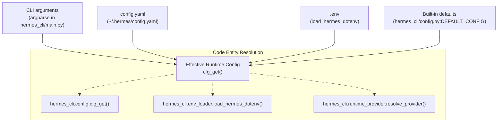

### Implementation Highlights

-   **Interface Selection**: The system performs an early check of `display.interface` in `config.yaml` to decide between TUI and CLI modes before full initialization. [hermes_cli/main.py:116-142]()
-   **Secret Routing**: The `hermes config set` command automatically routes values: API keys and sensitive tokens are identified and saved to `.env`, while settings go to `config.yaml`. [hermes_cli/config.py:143-167](), [website/docs/user-guide/configuration.md:45-47]()
-   **Env Substitution**: `config.yaml` supports `${VAR_NAME}` syntax to reference variables from the environment or `.env` file, handled during config loading. [website/docs/user-guide/configuration.md:62-76]()
-   **Config Parsing Warnings and Backups**: If `config.yaml` is malformed, `load_config` falls back to defaults and creates a timestamped `.bak` file via `_backup_corrupt_config` to prevent data loss during recovery. [hermes_cli/config.py:42-93, 96-139]()

Sources: [hermes_cli/main.py:116-142](), [hermes_cli/config.py:42-139, 143-167](), [website/docs/user-guide/configuration.md:49-76](), [run_agent.py:113-114]()

---

## `config.yaml` Reference

The `config.yaml` file governs the structured behavior of the agent.

### Core Configuration Sections

| Section | Description | Key Configuration Keys |
| :--- | :--- | :--- |
| `model` | AI model & provider routing | `default`, `provider`, `base_url` [hermes_cli/setup.py:36-43]() |
| `terminal` | Terminal execution backend | `backend`, `cwd`, `timeout`, `env_passthrough` [website/docs/user-guide/configuration.md:108-116]() |
| `agent` | Agent loop heuristics | `reasoning_effort`, `max_turns`, `max_iterations` [hermes_cli/setup.py:114-127]() |
| `auxiliary` | Side-task specialized models | `vision`, `compression`, `web_extract` [agent/auxiliary_client.py:32-41]() |
| `providers` | Provider-specific tuning | `request_timeout_seconds`, `stale_timeout_seconds` [website/docs/user-guide/configuration.md:80-87]() |

### Auxiliary Client Overrides

Hermes uses specialized models for tasks like context compression or vision analysis. The `agent/auxiliary_client.py` module handles a resolution chain for these tasks, allowing overrides in `config.yaml` under the `auxiliary:` section. [agent/auxiliary_client.py:7-41]()

Sources: [website/docs/user-guide/configuration.md:80-116](), [agent/auxiliary_client.py:1-41](), [hermes_cli/setup.py:36-43, 114-127]()

---

## .env File Reference

The `.env` file stores sensitive API keys and environment-specific overrides. All variables can be set with `hermes config set VAR value`. [website/docs/user-guide/configuration.md:35]()

| Environment Variable | Purpose |
| :--- | :--- |
| `OPENROUTER_API_KEY` | Recommended for multi-model access [hermes_cli/auth.py:161-162]() |
| `ANTHROPIC_API_KEY` | Native Anthropic access [hermes_cli/auth.py:161-162]() |
| `GOOGLE_API_KEY` | Google AI Studio / Gemini access [agent/auxiliary_client.py:68-70]() |
| `XAI_API_KEY` | Access to xAI Grok models [hermes_cli/tools_config.py:137-141]() |
| `HERMES_HOME` | Overrides the default `~/.hermes` directory [hermes_cli/config.py:124-128]() |

Sources: [hermes_cli/auth.py:161-162](), [hermes_cli/config.py:124-128](), [website/docs/user-guide/configuration.md:55](), [hermes_cli/tools_config.py:137-141]()

---

## Setup Wizard

The `hermes setup` command launches a modular interactive wizard implemented in `hermes_cli/setup.py`.

### Modular Sections
The wizard is split into independently-runnable sections:
1.  **Model & Provider**: Configures the primary LLM and authentication. [hermes_cli/setup.py:5]()
2.  **Terminal Backend**: Configures where commands execute (Local, Docker, etc.). [hermes_cli/setup.py:6]()
3.  **Agent Settings**: Configures iterations, reasoning effort, and memory limits. [hermes_cli/setup.py:7]()
4.  **Messaging Platforms**: Connects Telegram, Discord, Slack, etc. [hermes_cli/setup.py:8]()
5.  **Tools**: Configures TTS, web search, and specialized skills. [hermes_cli/setup.py:9]()

**Setup Wizard Data Flow**
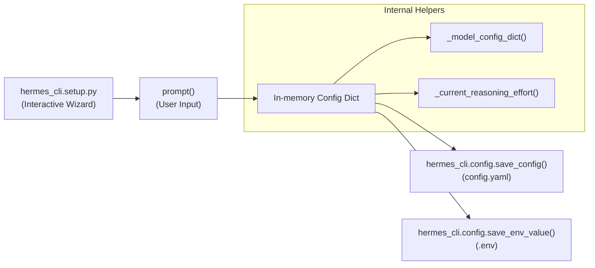

Sources: [hermes_cli/setup.py:1-12, 36-43, 114-127](), [hermes_cli/main.py:14](), [hermes_cli/config.py:139-141]()

---

## Terminal Backend Configuration

Hermes supports multiple execution environments via the `terminal.backend` setting. [website/docs/user-guide/configuration.md:109]()

| Backend | Environment | Implementation Detail |
| :--- | :--- | :--- |
| `local` | Host Machine | Default; no isolation [website/docs/user-guide/configuration.md:124]() |
| `docker` | Container | Hardened sandboxing; shared persistent container [website/docs/user-guide/configuration.md:125]() |
| `ssh` | Remote Server | Network boundary; uses SSH [website/docs/user-guide/configuration.md:126]() |
| `modal` | Cloud Sandbox | Ephemeral cloud compute [website/docs/user-guide/configuration.md:127]() |
| `daytona` | Managed Cloud | Managed cloud dev environments [website/docs/user-guide/configuration.md:128]() |
| `singularity` | HPC Container | Namespaces via `--containall` [website/docs/user-guide/configuration.md:129]() |

Sources: [website/docs/user-guide/configuration.md:107-116, 122-130]()

---

## Configuration Management Commands

| Command | Action |
| :--- | :--- |
| `hermes config` | View current effective configuration [hermes_cli/main.py:42]() |
| `hermes config set KEY VAL` | Update a setting (routes to `.env` or `config.yaml`) [hermes_cli/config.py:11-12]() |
| `hermes config edit` | Opens `config.yaml` in the system editor [hermes_cli/config.py:10]() |
| `hermes doctor` | Validates configuration and dependencies [hermes_cli/main.py:20]() |
| `hermes setup` | Re-runs the interactive setup wizard [hermes_cli/main.py:14]() |

Sources: [hermes_cli/main.py:14, 20, 42](), [hermes_cli/config.py:9-12]()

---

# Page: Authentication and Providers

# Authentication and Providers

<details>
<summary>Relevant source files</summary>

The following files were used as context for generating this wiki page:

- [agent/anthropic_adapter.py](agent/anthropic_adapter.py)
- [agent/auxiliary_client.py](agent/auxiliary_client.py)
- [agent/credential_pool.py](agent/credential_pool.py)
- [agent/portal_tags.py](agent/portal_tags.py)
- [agent/transports/anthropic.py](agent/transports/anthropic.py)
- [cli-config.yaml.example](cli-config.yaml.example)
- [cli.py](cli.py)
- [gateway/run.py](gateway/run.py)
- [hermes_cli/auth.py](hermes_cli/auth.py)
- [hermes_cli/auth_commands.py](hermes_cli/auth_commands.py)
- [hermes_cli/commands.py](hermes_cli/commands.py)
- [hermes_cli/config.py](hermes_cli/config.py)
- [hermes_cli/main.py](hermes_cli/main.py)
- [hermes_cli/models.py](hermes_cli/models.py)
- [hermes_cli/proxy/adapters/base.py](hermes_cli/proxy/adapters/base.py)
- [hermes_cli/proxy/adapters/nous_portal.py](hermes_cli/proxy/adapters/nous_portal.py)
- [hermes_cli/runtime_provider.py](hermes_cli/runtime_provider.py)
- [hermes_cli/setup.py](hermes_cli/setup.py)
- [plugins/model-providers/minimax/__init__.py](plugins/model-providers/minimax/__init__.py)
- [plugins/model-providers/nous/__init__.py](plugins/model-providers/nous/__init__.py)
- [plugins/model-providers/openrouter/__init__.py](plugins/model-providers/openrouter/__init__.py)
- [run_agent.py](run_agent.py)
- [tests/agent/test_anthropic_adapter.py](tests/agent/test_anthropic_adapter.py)
- [tests/agent/test_anthropic_mcp_prefix_strip.py](tests/agent/test_anthropic_mcp_prefix_strip.py)
- [tests/agent/test_auxiliary_client.py](tests/agent/test_auxiliary_client.py)
- [tests/agent/test_credential_pool.py](tests/agent/test_credential_pool.py)
- [tests/agent/test_minimax_provider.py](tests/agent/test_minimax_provider.py)
- [tests/agent/test_portal_tags.py](tests/agent/test_portal_tags.py)
- [tests/agent/transports/test_transport.py](tests/agent/transports/test_transport.py)
- [tests/hermes_cli/test_auth_commands.py](tests/hermes_cli/test_auth_commands.py)
- [tests/hermes_cli/test_auth_nous_provider.py](tests/hermes_cli/test_auth_nous_provider.py)
- [tests/hermes_cli/test_commands.py](tests/hermes_cli/test_commands.py)
- [tests/hermes_cli/test_model_validation.py](tests/hermes_cli/test_model_validation.py)
- [tests/hermes_cli/test_nous_inference_url_validation.py](tests/hermes_cli/test_nous_inference_url_validation.py)
- [tests/hermes_cli/test_proxy.py](tests/hermes_cli/test_proxy.py)
- [tests/hermes_cli/test_runtime_provider_resolution.py](tests/hermes_cli/test_runtime_provider_resolution.py)
- [tests/plugins/model_providers/test_minimax_profile.py](tests/plugins/model_providers/test_minimax_profile.py)
- [tests/providers/test_profile_wiring.py](tests/providers/test_profile_wiring.py)
- [tests/providers/test_provider_profiles.py](tests/providers/test_provider_profiles.py)
- [tests/providers/test_transport_parity.py](tests/providers/test_transport_parity.py)
- [tests/run_agent/test_anthropic_truncation_continuation.py](tests/run_agent/test_anthropic_truncation_continuation.py)
- [tests/test_minimax_oauth.py](tests/test_minimax_oauth.py)
- [website/docs/developer-guide/adding-providers.md](website/docs/developer-guide/adding-providers.md)
- [website/docs/developer-guide/model-provider-plugin.md](website/docs/developer-guide/model-provider-plugin.md)

</details>


This page documents the authentication system that enables Hermes Agent to connect to Large Language Model (LLM) inference providers. It covers the provider registry, OAuth flows, API key management, credential storage, provider resolution logic, and the auto-detection system.

**Scope**: This page focuses on authentication and provider selection for the **primary inference provider**. For information about auxiliary models used by tools (vision analysis, web scraping, context compression), see [Auxiliary Client (4.5)]().

---

## Overview

Hermes Agent supports a wide range of inference providers through a unified authentication system that handles:

1.  **OAuth Device Code Flows** — Used primarily for Nous Portal authentication where a device code is obtained and authorized via browser [hermes_cli/auth.py:750-845]().
2.  **OAuth External Flows** — Delegated authentication via external CLI tools or browser-based redirects, used by OpenAI Codex, Qwen, xAI, and Google Gemini providers [hermes_cli/auth.py:1047-1121]().
3.  **API Key Authentication** — Direct API key providers including OpenRouter, Google AI Studio, Z.AI/GLM, Kimi/Moonshot, MiniMax, Alibaba, DeepSeek, xAI, and others [hermes_cli/auth.py:613-644]().
4.  **Credential Pooling** — Supports multiple credentials per provider with failover, rotation, and status tracking implemented in the `CredentialPool` system [agent/credential_pool.py:13-35]().
5.  **Provider Resolution Chain** — Automatic selection of the active provider based on configuration hierarchy (CLI args → `config.yaml` → `.env` → defaults) and auth state [hermes_cli/runtime_provider.py:237-331]().

---

## Provider Registry and Models

Hermes Agent maintains a **provider registry** via the `PROVIDER_REGISTRY` dictionary defined in `hermes_cli/auth.py`, containing `ProviderConfig` dataclasses that describe each known provider's authentication type, base URLs, and environment variables for API keys [hermes_cli/auth.py:167-220]().

The canonical provider IDs and their authentication schemes include:

-   **`nous`** — OAuth device code flow [hermes_cli/auth.py:168-176]().
-   **`openai-codex`** — OAuth external flow [hermes_cli/auth.py:177-182]().
-   **`anthropic`** — API key via `ANTHROPIC_API_KEY` [hermes_cli/auth.py:206-211]().
-   **`openrouter`** — API key via `OPENROUTER_API_KEY` [hermes_cli/auth.py:212-217]().
-   **`custom`** — OpenAI-compatible endpoints with user-defined `base_url` [hermes_cli/auth.py:159-160]().

### Model Catalogs

Model catalogs curated per provider are declared in `hermes_cli/models.py`. These allow the system and user interfaces like `hermes setup` to display valid model options, falling back to static snapshots if live discovery fails [hermes_cli/models.py:34-145]().

| Provider ID      | Example Models                            | Notes                               |
| ---------------- | ----------------------------------------- | ----------------------------------- |
| `nous`           | `moonshotai/kimi-k2.6`, `claude-opus-4.7` | Nous Portal preferred models        |
| `copilot`        | `gpt-5.4`, `claude-sonnet-4.6`            | GitHub Copilot and ACP              |
| `anthropic`      | `claude-opus-4.7`, `claude-sonnet-4.6`    | Direct Anthropic API                |
| `openai-codex`   | `gpt-5.3-codex`, `gpt-5.4`                | OAuth authenticated OpenAI Codex    |
| `kimi-coding`    | `kimi-k2.6`, `kimi-k2-turbo-preview`      | Kimi / Moonshot family              |

Sources: [hermes_cli/auth.py:161-220](), [hermes_cli/models.py:34-145]()

---

## Provider Resolution Chain

Hermes uses a resolution chain to determine which provider and credentials to use at runtime.

### Key Functions and Classes

-   `resolve_provider(requested: Optional[str]) -> str`: Determines the preferred provider ID based on explicit request, `config.yaml`, or detected active provider [hermes_cli/auth.py:440-460]().
-   `load_pool(provider: str) -> CredentialPool`: Loads credential pools from `~/.hermes/credential_pool.json` to support rotation [agent/credential_pool.py:102-115]().
-   `resolve_runtime_provider(requested_provider: Optional[str]) -> dict`: Central entry point for resolving final API keys, tokens, and endpoints [hermes_cli/runtime_provider.py:237-331]().

### Runtime Provider Resolution Flow

"Runtime Provider Resolution Flow"
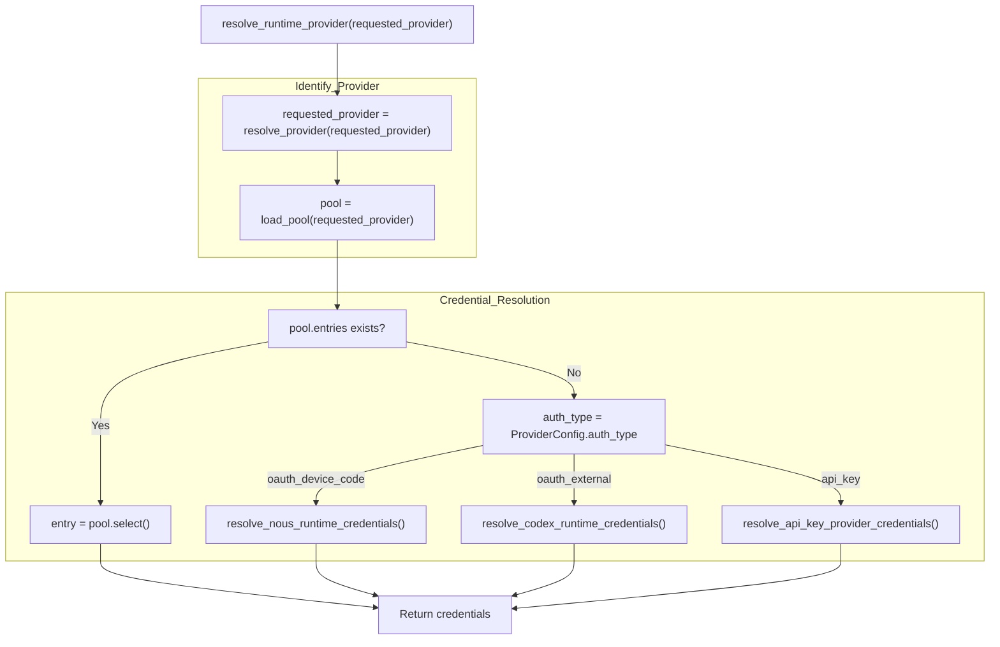
Sources: [hermes_cli/runtime_provider.py:237-331](), [agent/credential_pool.py:102-115](), [hermes_cli/auth.py:440-460]()

---

## Authentication Implementation Details

### OAuth Device Code Flow (Nous Portal)

Implemented in `_login_nous()`, this flow fetches a `user_code` and `verification_uri` from the portal. The CLI then polls the token endpoint until the user authorizes the device in their browser [hermes_cli/auth.py:750-845](). Once authorized, the CLI uses `resolve_nous_runtime_credentials()` to obtain short-lived inference keys or use the JWT directly [hermes_cli/auth.py:895-925]().

### OAuth External Flows

-   **OpenAI Codex**: `resolve_codex_runtime_credentials()` handles token retrieval and refresh for the `openai-codex` provider [hermes_cli/auth.py:1047-1064]().
-   **xAI Grok**: `resolve_xai_oauth_runtime_credentials()` provides access for SuperGrok subscribers [hermes_cli/auth.py:1082-1103]().
-   **Google Gemini**: `resolve_gemini_oauth_runtime_credentials()` supports Cloud Code Assist authentication [hermes_cli/auth.py:1104-1121]().

### API Key Providers

`resolve_api_key_provider_credentials()` scans `os.environ` for keys defined in the `ProviderConfig.api_key_env_vars` list [hermes_cli/auth.py:613-644](). For Anthropic, it additionally checks `~/.claude/.credentials.json` if environment variables are missing [hermes_cli/auth.py:646-689]().

Sources: [hermes_cli/auth.py:613-1121]()

---

## Auto-Detection and Probing

Hermes Agent supports auto-detection of models and API modes, particularly for local servers.

### Local Model Auto-Detection

`_auto_detect_local_model()` queries the `/v1/models` endpoint of a local base URL (e.g., LM Studio or Ollama). If exactly one model is loaded, it is auto-selected [hermes_cli/runtime_provider.py:160-180]().

### API Mode Detection

The `_detect_api_mode_for_url()` function inspects the base URL to determine the correct transport protocol:
-   `api.openai.com` or `api.x.ai` → `codex_responses` [hermes_cli/runtime_provider.py:91-95]().
-   URLs ending in `/anthropic` → `anthropic_messages` [hermes_cli/runtime_provider.py:96-97]().

"Model Selection and Probing"

Sources: [hermes_cli/runtime_provider.py:76-111](), [hermes_cli/models.py:186-255]()

---

## Data Flow: Credential Storage and Persistence

| Location                         | Entity           | Purpose                                                                         |
| -------------------------------- | ---------------- | ------------------------------------------------------------------------------- |
| `~/.hermes/auth.json`            | `AuthStore`      | Persistent OAuth tokens and active provider state [hermes_cli/auth.py:69-71](). |
| `~/.hermes/credential_pool.json` | `CredentialPool` | Multiple credentials for rotation and failover [agent/credential_pool.py:13](). |
| `~/.hermes/.env`                 | Env Vars         | API keys for providers like OpenRouter and Anthropic [hermes_cli/config.py:6](). |
| `~/.hermes/config.yaml`          | `Config`         | User preferences and model overrides [hermes_cli/config.py:5]().                |

### Concurrency Safety

Access to `auth.json` is protected by file locking (`fcntl` on Unix, `msvcrt` on Windows) to prevent data corruption when multiple CLI or gateway instances run concurrently [hermes_cli/auth.py:56-63]().

Sources: [hermes_cli/auth.py:56-71](), [agent/credential_pool.py:13](), [hermes_cli/config.py:5-6]()

---

# Page: Model Selection and Management

# Model Selection and Management

<details>
<summary>Relevant source files</summary>

The following files were used as context for generating this wiki page:

- [agent/image_routing.py](agent/image_routing.py)
- [agent/model_metadata.py](agent/model_metadata.py)
- [agent/models_dev.py](agent/models_dev.py)
- [agent/nous_rate_guard.py](agent/nous_rate_guard.py)
- [gateway/pairing.py](gateway/pairing.py)
- [hermes_cli/doctor.py](hermes_cli/doctor.py)
- [hermes_cli/model_catalog.py](hermes_cli/model_catalog.py)
- [hermes_cli/model_normalize.py](hermes_cli/model_normalize.py)
- [hermes_cli/model_switch.py](hermes_cli/model_switch.py)
- [hermes_cli/pairing.py](hermes_cli/pairing.py)
- [hermes_cli/providers.py](hermes_cli/providers.py)
- [scripts/build_model_catalog.py](scripts/build_model_catalog.py)
- [tests/agent/test_auxiliary_named_custom_providers.py](tests/agent/test_auxiliary_named_custom_providers.py)
- [tests/agent/test_custom_providers_vision.py](tests/agent/test_custom_providers_vision.py)
- [tests/agent/test_image_routing.py](tests/agent/test_image_routing.py)
- [tests/agent/test_model_metadata.py](tests/agent/test_model_metadata.py)
- [tests/agent/test_models_dev.py](tests/agent/test_models_dev.py)
- [tests/agent/test_nous_rate_guard.py](tests/agent/test_nous_rate_guard.py)
- [tests/gateway/test_pairing.py](tests/gateway/test_pairing.py)
- [tests/hermes_cli/test_doctor.py](tests/hermes_cli/test_doctor.py)
- [tests/hermes_cli/test_kanban_worker_image_extraction.py](tests/hermes_cli/test_kanban_worker_image_extraction.py)
- [tests/hermes_cli/test_model_catalog.py](tests/hermes_cli/test_model_catalog.py)
- [tests/hermes_cli/test_model_normalize.py](tests/hermes_cli/test_model_normalize.py)
- [tests/hermes_cli/test_model_switch_custom_providers.py](tests/hermes_cli/test_model_switch_custom_providers.py)
- [tests/hermes_cli/test_models.py](tests/hermes_cli/test_models.py)
- [tests/hermes_cli/test_tencent_tokenhub_provider.py](tests/hermes_cli/test_tencent_tokenhub_provider.py)
- [tests/hermes_cli/test_user_providers_model_switch.py](tests/hermes_cli/test_user_providers_model_switch.py)
- [website/docs/reference/model-catalog.md](website/docs/reference/model-catalog.md)
- [website/static/api/model-catalog.json](website/static/api/model-catalog.json)

</details>


This page covers the model selection and validation system, including the model catalog system, provider-specific normalization, and the dynamic context length discovery mechanism.

---

## Model Catalog System

Hermes maintains a multi-tier model discovery system that combines the `models.dev` community registry, live API discovery, and curated fallback snapshots.

### The models.dev Registry
The primary database for model metadata is `models.dev`. This registry tracks over 4,000 models across 109+ providers [agent/models_dev.py:1-9]().
*   **Data Resolution**: Data is resolved via a bundled offline snapshot, a local disk cache (`~/.hermes/models_dev_cache.json`), and periodic network fetches from `https://models.dev/api.json` [agent/models_dev.py:11-15]().
*   **Metadata**: Each `ModelInfo` object contains critical fields for agent operations: `context_window`, `tool_call` capability, `reasoning` flags, and `cost_input`/`cost_output` for token budgeting [agent/models_dev.py:46-82]().

### Curated and Dynamic Catalogs
While `models.dev` provides the raw data, Hermes uses specialized logic to curate these lists for different providers:
*   **OpenRouter**: Models are fetched from `OPENROUTER_MODELS_URL` [agent/model_metadata.py:21]() and filtered to include only tool-calling models [tests/hermes_cli/test_models.py:89-137](). Free-tier models are also identified [tests/hermes_cli/test_models.py:61-81]().
*   **DeepSeek**: Normalizes inputs to canonical identifiers like `deepseek-chat` (V3) or `deepseek-reasoner` (R1) using keyword matching in `_normalize_for_deepseek` [hermes_cli/model_normalize.py:147-180]().
*   **Local Detection**: The system can automatically detect models on local servers (e.g., Ollama) by querying `/v1/models` [tests/hermes_cli/test_user_providers_model_switch.py:141-151]().

**Model Resolution Hierarchy**

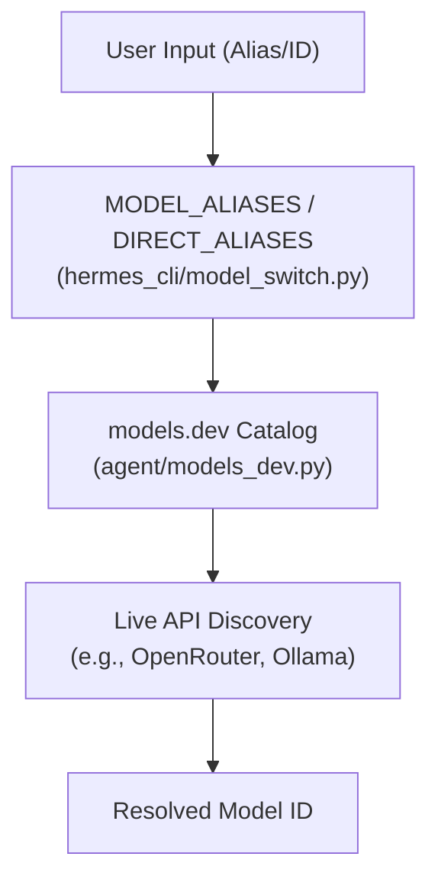
Sources: [hermes_cli/model_switch.py:105-176](), [agent/models_dev.py:11-19](), [agent/model_metadata.py:21](), [tests/hermes_cli/test_models.py:89-137]()

---

## Model Selection and Normalization

### Provider-Aware Normalization
LLM providers vary in their naming conventions. The `normalize_model_for_provider` function ensures the correct string reaches the API [hermes_cli/model_normalize.py:23-28]().

| Provider Type | Logic | Example |
| :--- | :--- | :--- |
| **Aggregators** | Requires `vendor/model` via `_VENDOR_PREFIXES` | `anthropic/claude-sonnet-4.6` |
| **Anthropic** | Dots to hyphens via `_dots_to_hyphens` | `claude-sonnet-4-6` |
| **Copilot/Codex** | Bare name, dots preserved | `claude-sonnet.4.6` |
| **Xiaomi** | Enforces lowercase via `_LOWERCASE_MODEL_PROVIDERS` | `mimo-v2.5-pro` |

Sources: [hermes_cli/model_normalize.py:38-116](), [hermes_cli/model_normalize.py:186-205]()

### The Model Switcher Pipeline
The `/model` command and CLI flags trigger a shared pipeline in `hermes_cli/model_switch.py`:
1.  **Alias Resolution**: Maps `sonnet` to `anthropic/claude-sonnet` using the `MODEL_ALIASES` map [hermes_cli/model_switch.py:105-154](). `DIRECT_ALIASES` also allows for exact model+provider+base_url mappings, bypassing catalog resolution [hermes_cli/model_switch.py:165-176]().
2.  **Provider Resolution**: Determines the target backend (e.g., OpenRouter vs. Native) via `resolve_provider_full` [hermes_cli/providers.py:33-34](). This includes resolving user-defined providers from `config.yaml` [tests/hermes_cli/test_user_providers_model_switch.py:18-58]().
3.  **Normalization**: Applies provider-specific naming rules via `normalize_model_for_provider` [hermes_cli/model_normalize.py:1-28]().
4.  **Agentic Check**: Validates if the model is "agentic". For instance, it warns if a user selects a Nous Hermes 3/4 chat model via `is_nous_hermes_non_agentic`, which lacks native tool-calling [hermes_cli/model_switch.py:53-84]().

**Model Switching Data Flow**

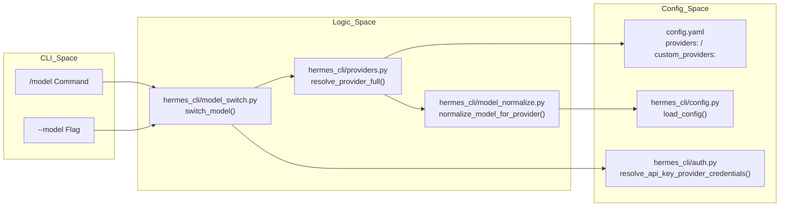
Sources: [hermes_cli/model_switch.py:1-19](), [hermes_cli/model_normalize.py:1-28](), [hermes_cli/providers.py:20-44](), [hermes_cli/model_switch.py:105-154](), [hermes_cli/model_switch.py:165-176](), [tests/hermes_cli/test_user_providers_model_switch.py:18-58]()

---

## Context Length Discovery

Hermes dynamically discovers model context lengths to inform the `ContextCompressor` and prevent overflow errors.

### Discovery Tiers
The `get_model_context_length()` function in `agent/model_metadata.py` follows this priority:
1.  **models.dev**: Primary source for known model limits [agent/models_dev.py:68]().
2.  **Hardcoded Defaults**: Substring matching for major families (Claude: 200k-1M, GPT-5: 400k-1.05M, Gemini: 1M) in `DEFAULT_CONTEXT_LENGTHS` [agent/model_metadata.py:139-180]().
3.  **Probe Tiers**: If unknown, the system uses `CONTEXT_PROBE_TIERS` (256k, 128k, 64k, 32k, 16k, 8k) to step down until a request succeeds [agent/model_metadata.py:118-125]().

### Validation and Constraints
*   **Minimum Length**: Hermes enforces a `MINIMUM_CONTEXT_LENGTH` of 64,000 tokens. Models with smaller windows are rejected as they cannot support complex tool-calling trajectories [agent/model_metadata.py:133]().
*   **Error Parsing**: If a provider returns a context-related error, `parse_context_limit_from_error` extracts the actual limit using regex (e.g., matching OpenAI or Anthropic error strings) and updates the local cache via `save_context_length` [agent/model_metadata.py:27-31](), [agent/model_metadata.py:440-480]().

Sources: [agent/model_metadata.py:112-180](), [tests/agent/test_model_metadata.py:22-35](), [agent/model_metadata.py:440-500]()

---

## Auxiliary Model Management

Hermes utilizes an "Auxiliary" LLM client for non-core tasks such as vision analysis, context compression, and metadata extraction [agent/image_routing.py:1-6]().

### Provider Resolution
The `resolve_provider_client` function determines which model to use for auxiliary tasks [tests/agent/test_auxiliary_named_custom_providers.py:75-76]():
*   **Main Alias**: Resolves `main` to the user's primary model [tests/agent/test_auxiliary_named_custom_providers.py:26-50]().
*   **Task-Specific Overrides**: Users can specify different providers for vision vs. compression in `config.yaml` via the `auxiliary` section [tests/agent/test_auxiliary_named_custom_providers.py:29-33]().
*   **Named Custom Providers**: Allows referencing custom endpoints by name (e.g., `custom:beans`) defined in `custom_providers` config [tests/agent/test_auxiliary_named_custom_providers.py:124-152]().

Sources: [agent/image_routing.py:1-6](), [tests/agent/test_auxiliary_named_custom_providers.py:1-170]()

---

# Page: CLI

# CLI

<details>
<summary>Relevant source files</summary>

The following files were used as context for generating this wiki page:

- [agent/auxiliary_client.py](agent/auxiliary_client.py)
- [cli-config.yaml.example](cli-config.yaml.example)
- [cli.py](cli.py)
- [gateway/run.py](gateway/run.py)
- [hermes_cli/auth.py](hermes_cli/auth.py)
- [hermes_cli/commands.py](hermes_cli/commands.py)
- [hermes_cli/config.py](hermes_cli/config.py)
- [hermes_cli/main.py](hermes_cli/main.py)
- [hermes_cli/models.py](hermes_cli/models.py)
- [hermes_cli/runtime_provider.py](hermes_cli/runtime_provider.py)
- [hermes_cli/setup.py](hermes_cli/setup.py)
- [run_agent.py](run_agent.py)
- [tests/agent/test_auxiliary_client.py](tests/agent/test_auxiliary_client.py)
- [tests/hermes_cli/test_commands.py](tests/hermes_cli/test_commands.py)
- [tests/hermes_cli/test_model_validation.py](tests/hermes_cli/test_model_validation.py)
- [tests/hermes_cli/test_runtime_provider_resolution.py](tests/hermes_cli/test_runtime_provider_resolution.py)
- [tests/test_minimax_oauth.py](tests/test_minimax_oauth.py)
- [website/docs/getting-started/installation.md](website/docs/getting-started/installation.md)
- [website/docs/getting-started/quickstart.md](website/docs/getting-started/quickstart.md)
- [website/docs/getting-started/updating.md](website/docs/getting-started/updating.md)
- [website/docs/integrations/providers.md](website/docs/integrations/providers.md)
- [website/docs/reference/cli-commands.md](website/docs/reference/cli-commands.md)
- [website/docs/reference/environment-variables.md](website/docs/reference/environment-variables.md)
- [website/docs/reference/slash-commands.md](website/docs/reference/slash-commands.md)
- [website/docs/user-guide/cli.md](website/docs/user-guide/cli.md)
- [website/docs/user-guide/configuration.md](website/docs/user-guide/configuration.md)
- [website/docs/user-guide/features/fallback-providers.md](website/docs/user-guide/features/fallback-providers.md)
- [website/docs/user-guide/messaging/index.md](website/docs/user-guide/messaging/index.md)
- [website/sidebars.ts](website/sidebars.ts)

</details>


This page provides a high-level overview of the Hermes Agent command-line interface (CLI). It covers the main entry point, operating modes, configuration hierarchy, subcommand groups, and the key components bridging user interaction with the core AI agent orchestration and multi-provider runtime resolution. Detailed technical information and usage instructions for each subtopic are provided in dedicated child pages linked below.

## Entry Point

The primary CLI entry point for Hermes Agent is the `hermes` executable, which corresponds to the `hermes_cli/main.py` module. Its `main()` function builds a hierarchical command parser and dispatches subcommands to handler functions [hermes_cli/main.py:1-44]().

Before argument parsing, a specialized profile override system processes the `--profile` or `-p` flags to correctly set the `HERMES_HOME` environment variable for configuration isolation [hermes_cli/main.py:138-150](). To ensure a smooth user experience, the CLI also sets the process title to "hermes" for system monitoring tools [hermes_cli/main.py:68-106]().

**Dispatcher Architecture**

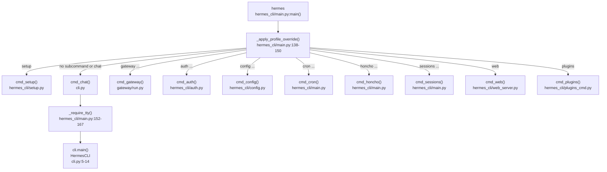

Sources: [hermes_cli/main.py:1-44](), [hermes_cli/main.py:68-106](), [hermes_cli/main.py:138-150](), [hermes_cli/main.py:152-167](), [gateway/run.py:1-14](), [cli.py:1-14]()

---

## Operating Modes

The Hermes CLI supports three primary frontend modes under the `chat` subcommand (also the default when running just `hermes`) [cli.py:1-14]():

| Mode | Invocation | Description |
|---|---|---|
| **Interactive CLI** | `hermes` or `hermes chat` | Launches the `HermesCLI` class using `prompt_toolkit`. Features include a fixed input area, multiline input support, syntax highlighting, and persistent session history [cli.py:54-80](). |
| **Interactive TUI** | `hermes --tui` | Launches a React Ink-based Terminal User Interface (TUI) frontend offering enhanced mouse support, JSON-RPC gateway integration, and visual task monitoring [hermes_cli/main.py:145-158](). For details, see [TUI (Terminal User Interface)](#3.3). |
| **Single-query** | `hermes chat -q "your query"` | Sends a single query directly to `AIAgent.run_conversation()`, streams the raw response to stdout, then exits immediately [run_agent.py:17-21](). |

Internally, the `HermesCLI` class in `cli.py` wraps the `AIAgent` class defined in `run_agent.py` to orchestrate conversations and perform tool calls [run_agent.py:121-138](). For robustness, Hermes uses specialized loaders to ensure UTF-8 stdio setup on Windows via `hermes_bootstrap` [hermes_cli/main.py:46-62]().

**Interaction Flow**

```mermaid
flowchart LR
    USER_IN["User Input"]
    CLI_OBJ["HermesCLI\ncli.py"]
    AGENT["AIAgent\nrun_agent.py"]
    RUNTIME["runtime_provider.py\nresolve_runtime_provider()"]
    POOL["CredentialPool\nagent/credential_pool.py"]
    TOOLS["model_tools.py\nTool Management"]

    USER_IN --> CLI_OBJ
    CLI_OBJ -->|run_conversation()| AGENT
    AGENT --> RUNTIME
    RUNTIME --> POOL
    AGENT --> TOOLS
```

Sources: [cli.py:1-14](), [run_agent.py:1-21](), [run_agent.py:121-138](), [hermes_cli/main.py:46-62, 145-158]()

---

## Configuration Hierarchy

Hermes CLI configuration is layered to enable flexible environment and user overrides [hermes_cli/config.py:1-13]():

1.  **Command-line arguments:** Highest precedence for overrides per invocation.
2.  **User configuration file:** `~/.hermes/config.yaml`, storing all non-secret settings [hermes_cli/config.py:5]().
3.  **Environment file:** `~/.hermes/.env`, for secrets including API keys and tokens [hermes_cli/config.py:6]().
4.  **Built-in defaults:** Hardcoded fallback values defined in `DEFAULT_CONFIG` [hermes_cli/config.py:136]().

The `hermes setup` wizard guides users interactively through configuring AI providers, models, terminal backends, and messaging platforms [hermes_cli/setup.py:4-10](). The configuration system supports environment variable substitution with `${VAR_NAME}` style references inside `config.yaml` [website/docs/user-guide/configuration.md:62-76](). To prevent security escalations, the dashboard's env writer denylists sensitive variables like `LD_PRELOAD` and `PYTHONPATH` [hermes_cli/config.py:143-167]().

Sources: [hermes_cli/config.py:1-13, 143-167](), [hermes_cli/setup.py:4-10](), [website/docs/user-guide/configuration.md:62-76]()

---

## Subcommand Groups

The CLI commands are organized into functional groups [hermes_cli/main.py:1-44]():

| Subcommand | Handler | Purpose |
|---|---|---|
| `chat` | `cmd_chat` | Interactive chat REPL or single-query requests [cli.py:1-14]() |
| `setup` | `cmd_setup` | Interactive setup wizard for initial configuration [hermes_cli/setup.py:1-12]() |
| `config` | `cmd_config` | Inspect and modify configuration files [hermes_cli/config.py:1-13]() |
| `auth` | `cmd_auth` | Manage authentication providers and OAuth flows [hermes_cli/auth.py:1-14]() |
| `gateway` | `cmd_gateway` | Run messaging platform gateway adapters [gateway/run.py:1-14]() |
| `web` | `cmd_web` | Launch the React-backed Web UI Dashboard [hermes_cli/main.py:41](). For details, see [Web UI Dashboard](#3.4). |
| `honcho` | `cmd_honcho` | Configure Honcho AI memory and peer settings [hermes_cli/main.py:21-36]() |
| `sessions` | `cmd_sessions` | Browse and manage previous sessions [hermes_cli/main.py:42]() |
| `skills` | `cmd_skills` | Manage agent skills [hermes_cli/main.py:37]() |
| `cron` | `cmd_cron` | Manage scheduled tasks [hermes_cli/main.py:18]() |
| `doctor` | `cmd_doctor` | Diagnose configuration and environment issues [hermes_cli/main.py:20]() |
| `update` | `cmd_update` | Update Hermes Agent to the latest version [hermes_cli/main.py:38]() |
| `uninstall` | `cmd_uninstall` | Uninstall Hermes Agent [hermes_cli/main.py:39]() |
| `version` | `cmd_version` | Display the current version [hermes_cli/main.py:37]() |

### Slash Commands in Interactive Chat

Within the interactive chat mode, a rich set of slash commands (e.g., `/new`, `/model`, `/status`) is implemented centrally in a `COMMAND_REGISTRY` [hermes_cli/commands.py:64-140](). This registry serves as the authoritative source for CLI autocomplete and gateway command dispatch [hermes_cli/commands.py:1-9]().

For detailed documentation of slash commands, see [Interactive Chat](#3.1). A comprehensive list of all commands and their usage is available in the [Command Reference](#3.2).

Sources: [hermes_cli/main.py:1-44](), [hermes_cli/commands.py:1-9, 64-140](), [hermes_cli/auth.py:1-14]()

---

## Module Layout and Integration

The CLI system bridges user interaction with the kernel of agent orchestration and multi-provider runtime resolution.

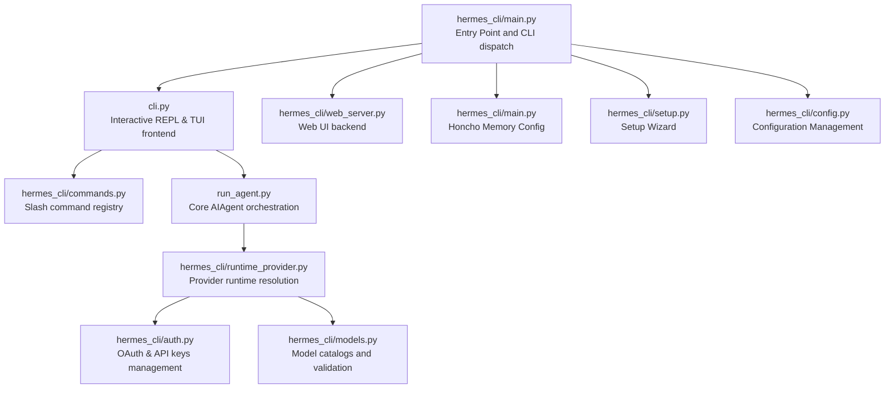

Sources: [hermes_cli/main.py:1-44](), [hermes_cli/commands.py:1-9](), [run_agent.py:1-21](), [hermes_cli/auth.py:1-14](), [hermes_cli/models.py:1-6](), [hermes_cli/setup.py:1-12](), [hermes_cli/config.py:1-13]()

---

## Child Pages

For detailed explanations, please refer to:

-   [Interactive Chat](#3.1) — Covers the interactive REPL mode, slash commands, and session management.
-   [Command Reference](#3.2) — Comprehensive reference for all Hermes subcommands.
-   [TUI (Terminal User Interface)](#3.3) — Documents the React Ink-based TUI frontend (`--tui` flag).
-   [Web UI Dashboard](#3.4) — Details the `hermes web` command and the FastAPI backend dashboard.

---

Sources:
- [hermes_cli/main.py:1-167]()
- [cli.py:1-14]()
- [run_agent.py:1-21, 121-138]()
- [hermes_cli/config.py:1-13, 143-167]()
- [hermes_cli/commands.py:1-9, 64-140]()
- [hermes_cli/setup.py:1-12]()
- [website/docs/user-guide/configuration.md:62-76]()

---

# Page: Interactive Chat

# Interactive Chat

<details>
<summary>Relevant source files</summary>

The following files were used as context for generating this wiki page:

- [agent/auxiliary_client.py](agent/auxiliary_client.py)
- [agent/tool_dispatch_helpers.py](agent/tool_dispatch_helpers.py)
- [cli-config.yaml.example](cli-config.yaml.example)
- [cli.py](cli.py)
- [gateway/run.py](gateway/run.py)
- [gateway/slash_commands.py](gateway/slash_commands.py)
- [hermes_cli/auth.py](hermes_cli/auth.py)
- [hermes_cli/cli_commands_mixin.py](hermes_cli/cli_commands_mixin.py)
- [hermes_cli/commands.py](hermes_cli/commands.py)
- [hermes_cli/config.py](hermes_cli/config.py)
- [hermes_cli/main.py](hermes_cli/main.py)
- [hermes_cli/models.py](hermes_cli/models.py)
- [hermes_cli/runtime_provider.py](hermes_cli/runtime_provider.py)
- [hermes_cli/setup.py](hermes_cli/setup.py)
- [hermes_cli/tips.py](hermes_cli/tips.py)
- [hermes_cli/write_approval_commands.py](hermes_cli/write_approval_commands.py)
- [run_agent.py](run_agent.py)
- [tests/agent/test_auxiliary_client.py](tests/agent/test_auxiliary_client.py)
- [tests/agent/test_curator_activity.py](tests/agent/test_curator_activity.py)
- [tests/agent/test_tool_dispatch_helpers.py](tests/agent/test_tool_dispatch_helpers.py)
- [tests/hermes_cli/test_commands.py](tests/hermes_cli/test_commands.py)
- [tests/hermes_cli/test_curator_run.py](tests/hermes_cli/test_curator_run.py)
- [tests/hermes_cli/test_curator_status.py](tests/hermes_cli/test_curator_status.py)
- [tests/hermes_cli/test_model_validation.py](tests/hermes_cli/test_model_validation.py)
- [tests/hermes_cli/test_runtime_provider_resolution.py](tests/hermes_cli/test_runtime_provider_resolution.py)
- [tests/test_minimax_oauth.py](tests/test_minimax_oauth.py)
- [tests/tools/test_image_generation.py](tests/tools/test_image_generation.py)
- [tests/tools/test_memory_tool.py](tests/tools/test_memory_tool.py)
- [tests/tools/test_skill_manager_tool.py](tests/tools/test_skill_manager_tool.py)
- [tests/tools/test_skill_provenance.py](tests/tools/test_skill_provenance.py)
- [tests/tools/test_threat_patterns.py](tests/tools/test_threat_patterns.py)
- [tests/tools/test_write_approval.py](tests/tools/test_write_approval.py)
- [tools/memory_tool.py](tools/memory_tool.py)
- [tools/skill_manager_tool.py](tools/skill_manager_tool.py)
- [tools/skill_provenance.py](tools/skill_provenance.py)
- [tools/threat_patterns.py](tools/threat_patterns.py)
- [tools/write_approval.py](tools/write_approval.py)
- [website/docs/developer-guide/agent-loop.md](website/docs/developer-guide/agent-loop.md)
- [website/docs/developer-guide/architecture.md](website/docs/developer-guide/architecture.md)
- [website/docs/developer-guide/context-compression-and-caching.md](website/docs/developer-guide/context-compression-and-caching.md)
- [website/docs/developer-guide/cron-internals.md](website/docs/developer-guide/cron-internals.md)
- [website/docs/developer-guide/gateway-internals.md](website/docs/developer-guide/gateway-internals.md)
- [website/docs/guides/cron-troubleshooting.md](website/docs/guides/cron-troubleshooting.md)
- [website/docs/integrations/index.md](website/docs/integrations/index.md)
- [website/docs/reference/tools-reference.md](website/docs/reference/tools-reference.md)
- [website/docs/reference/toolsets-reference.md](website/docs/reference/toolsets-reference.md)
- [website/docs/user-guide/features/cron.md](website/docs/user-guide/features/cron.md)
- [website/docs/user-guide/features/image-generation.md](website/docs/user-guide/features/image-generation.md)
- [website/docs/user-guide/features/memory.md](website/docs/user-guide/features/memory.md)
- [website/docs/user-guide/features/overview.md](website/docs/user-guide/features/overview.md)
- [website/docs/user-guide/features/tool-gateway.md](website/docs/user-guide/features/tool-gateway.md)
- [website/docs/user-guide/features/tools.md](website/docs/user-guide/features/tools.md)
- [website/docs/user-guide/sessions.md](website/docs/user-guide/sessions.md)

</details>


This page documents the interactive terminal chat experience provided by the Hermes Agent CLI. It covers the REPL architecture, `prompt_toolkit` integration, slash commands, session management, and the underlying provider resolution logic.

---

## Component Architecture

The interactive chat is managed primarily by the `HermesCLI` class in `cli.py`. It orchestrates the lifecycle of a conversation by bridging user input to the `AIAgent` core [cli.py:5-13]().

1.  **TUI layer** — Uses `prompt_toolkit` to manage a fixed input widget (`TextArea`) at the bottom of the terminal with scrolling output above [cli.py:58-69]().
2.  **Branding/display layer** — `hermes_cli/banner.py` renders the ASCII logo and version labels [hermes_cli/banner.py:161-162]().
3.  **Command layer** — `hermes_cli/commands.py` provides a central `COMMAND_REGISTRY` for slash commands and tab-completion [hermes_cli/commands.py:64-111]().
4.  **Agent layer** — `AIAgent` (from `run_agent.py`) handles the conversation loop, tool execution, and response management [run_agent.py:17-21]().

**Diagram 1: Interactive Chat Component Map**

```mermaid
flowchart TD
    subgraph "CLI_Process [cli.py]"
        HermesCLI["HermesCLI Class"]
        load_hermes_dotenv["load_hermes_dotenv()"]
        _strip_reasoning_tags["_strip_reasoning_tags()"]
    end

    subgraph "Command_System [hermes_cli/commands.py]"
        COMMAND_REGISTRY["COMMAND_REGISTRY List"]
        CommandDef["CommandDef Dataclass"]
        resolve_command["resolve_command()"]
    end

    subgraph "UI_Engine [prompt_toolkit]"
        TextArea["TextArea (Input Widget)"]
        FileHistory["FileHistory (~/.hermes_history)"]
        patch_stdout["patch_stdout() Context"]
    end

    subgraph "Agent_Core [run_agent.py]"
        AIAgent["AIAgent Class"]
        run_conversation["run_conversation() Method"]
    end

    subgraph "Display_Logic [agent/display.py]"
        KawaiiSpinner["KawaiiSpinner Class"]
        build_tool_preview["_build_tool_preview()"]
        _get_tool_emoji["_get_tool_emoji()"]
    end

    HermesCLI --> load_hermes_dotenv
    HermesCLI --> TextArea
    HermesCLI --> AIAgent
    HermesCLI --> resolve_command
    AIAgent --> run_conversation
    run_conversation --> KawaiiSpinner
    run_conversation --> _get_tool_emoji
```

Sources: [cli.py:58-69](), [cli.py:194-207](), [hermes_cli/banner.py:161-162](), [hermes_cli/commands.py:64-111](), [run_agent.py:17-21]()

---

## REPL Flow and Input Handling

The CLI uses an asynchronous REPL loop. `patch_stdout()` is used to ensure that background updates (like the agent's spinner or tool progress) do not corrupt the user's input line [cli.py:61-61](). The system supports multi-line input via `Shift+Enter` or `Ctrl+Enter` aliases [cli.py:79-87]().

**Diagram 2: Input-to-Agent Execution Flow**

```mermaid
sequenceDiagram
    participant U as User
    participant CLI as HermesCLI [cli.py]
    participant CMD as Commands [hermes_cli/commands.py]
    participant AG as AIAgent [run_agent.py]
    participant SP as KawaiiSpinner [agent/display.py]

    U->>CLI: "Enters text + Enter"
    alt "Starts with /"
        CLI->>CMD: "resolve_command(text)"
        CMD-->>CLI: "CommandDef"
        CLI->>CLI: "process_command()"
    else "Natural Language"
        CLI->>SP: "start()"
        CLI->>AG: "run_conversation(prompt)"
        loop "Tool Loop"
            AG->>AG: "handle_function_call()"
            AG->>SP: "update(tool_status)"
        end
        AG-->>CLI: "Final Response"
        CLI->>SP: "stop()"
        CLI->>CLI: "_strip_reasoning_tags()"
        CLI->>U: "Display Markdown Response"
    end
```

Sources: [cli.py:61-61](), [cli.py:79-87](), [cli.py:194-207](), [hermes_cli/commands.py:46-61](), [run_agent.py:123-128](), [run_agent.py:155-160]()

---

## Slash Commands

Commands are defined in `hermes_cli/commands.py` and categorized for the help system. The `COMMAND_REGISTRY` is the single source of truth for the CLI, gateway, and autocomplete [hermes_cli/commands.py:64-111]().

### Session & Control Commands
| Command | Alias | Description |
| :--- | :--- | :--- |
| `/new` | `/reset` | Start a new session (fresh ID + history) [hermes_cli/commands.py:68-69]() |
| `/retry` | - | Retry the last message (resend to agent) [hermes_cli/commands.py:80-80]() |
| `/undo` | - | Back up N user turns and re-prompt (default 1) [hermes_cli/commands.py:81-82]() |
| `/rollback` | - | List or restore filesystem checkpoints [hermes_cli/commands.py:91-92]() |
| `/background`| `/bg` | Run a prompt in the background [hermes_cli/commands.py:100-101]() |
| `/goal` | - | Set a standing goal Hermes works on across turns [hermes_cli/commands.py:108-109]() |

### Configuration & UI Commands
| Command | Alias | Description |
| :--- | :--- | :--- |
| `/personality`| - | Set a predefined personality [hermes_cli/commands.py:134-135]() |
| `/model` | - | Switch model for this session [hermes_cli/commands.py:126-127]() |
| `/config` | - | Show current configuration [hermes_cli/commands.py:124-125]() |
| `/verbose` | - | Cycle tool progress display levels [hermes_cli/commands.py:138-140]() |

Sources: [hermes_cli/commands.py:64-111]()

---

## Session Management and Persistence

Interactive mode ensures continuity through several mechanisms:

1.  **Trajectory Logging:** Every conversation turn is saved as a trajectory for later inspection or training [run_agent.py:155-160]().
2.  **History:** Input history is persisted in `~/.hermes_history` via `prompt_toolkit.history.FileHistory` [cli.py:59-59]().
3.  **Environment Loading:** The CLI loads `.env` from `~/.hermes/.env` first, then project root as a fallback via `load_hermes_dotenv` [cli.py:180-182]().
4.  **Context Compression:** `ContextCompressor` monitors context window usage and triggers summarization based on thresholds [run_agent.py:144-144]().

### Runtime Provider and Model Resolution
When a session starts or a model is switched, the system resolves credentials and configuration. This checks:
1.  **Config Precedence:** CLI arguments → `config.yaml` → `.env` → defaults. The `hermes_cli.config` module handles this hierarchy [hermes_cli/config.py:1-13]().
2.  **API Keys:** Secrets are specifically routed to `.env` while settings go to `config.yaml` [hermes_cli/config.py:5-6]().
3.  **Timeouts:** Provider-specific and model-specific timeouts (e.g., `request_timeout_seconds`) are applied at runtime using `get_provider_request_timeout` and `get_provider_stale_timeout` [run_agent.py:107-110]().
4.  **Model Selection:** The `hermes_cli/models.py` catalog provides fallback model lists (e.g., `OPENROUTER_MODELS`, `_XAI_STATIC_FALLBACK`) if live endpoints are unreachable [hermes_cli/models.py:34-82](), [hermes_cli/models.py:110-115]().
5.  **Auxiliary Tasks:** Side tasks like vision or compression are routed via `agent/auxiliary_client.py`, which follows a specific resolution chain to find the best available backend (e.g., Main Provider → OpenRouter → Nous Portal) [agent/auxiliary_client.py:7-23]().

**Diagram 3: Provider Resolution Hierarchy**

```mermaid
flowchart TD
    subgraph "Configuration_Sources"
        CLI_ARGS["CLI Arguments"]
        CONFIG_YAML["config.yaml [~/.hermes/]"]
        DOT_ENV[".env [~/.hermes/]"]
    end

    subgraph "Resolution_Logic [hermes_cli/auth.py]"
        resolve_provider["resolve_provider()"]
        PROVIDER_REGISTRY["PROVIDER_REGISTRY"]
        AuthStore["Auth Store (auth.json)"]
    end

    subgraph "Runtime_Selection [agent/auxiliary_client.py]"
        get_text_auxiliary_client["get_text_auxiliary_client()"]
        _resolve_auto["_resolve_auto() Chain"]
    end

    CLI_ARGS --> resolve_provider
    CONFIG_YAML --> resolve_provider
    DOT_ENV --> resolve_provider
    resolve_provider --> PROVIDER_REGISTRY
    resolve_provider --> AuthStore
    AuthStore --> get_text_auxiliary_client
    get_text_auxiliary_client --> _resolve_auto
```

Sources: [cli.py:59-59](), [cli.py:180-182](), [run_agent.py:107-110](), [run_agent.py:144-144](), [hermes_cli/config.py:1-13](), [hermes_cli/models.py:34-82](), [hermes_cli/models.py:110-115](), [agent/auxiliary_client.py:7-23](), [hermes_cli/auth.py:1-17]()

---

# Page: Command Reference

# Command Reference

<details>
<summary>Relevant source files</summary>

The following files were used as context for generating this wiki page:

- [agent/auxiliary_client.py](agent/auxiliary_client.py)
- [cli-config.yaml.example](cli-config.yaml.example)
- [cli.py](cli.py)
- [gateway/run.py](gateway/run.py)
- [hermes_cli/auth.py](hermes_cli/auth.py)
- [hermes_cli/commands.py](hermes_cli/commands.py)
- [hermes_cli/config.py](hermes_cli/config.py)
- [hermes_cli/doctor.py](hermes_cli/doctor.py)
- [hermes_cli/main.py](hermes_cli/main.py)
- [hermes_cli/model_switch.py](hermes_cli/model_switch.py)
- [hermes_cli/models.py](hermes_cli/models.py)
- [hermes_cli/providers.py](hermes_cli/providers.py)
- [hermes_cli/runtime_provider.py](hermes_cli/runtime_provider.py)
- [hermes_cli/setup.py](hermes_cli/setup.py)
- [run_agent.py](run_agent.py)
- [tests/agent/test_auxiliary_client.py](tests/agent/test_auxiliary_client.py)
- [tests/hermes_cli/test_commands.py](tests/hermes_cli/test_commands.py)
- [tests/hermes_cli/test_doctor.py](tests/hermes_cli/test_doctor.py)
- [tests/hermes_cli/test_model_switch_custom_providers.py](tests/hermes_cli/test_model_switch_custom_providers.py)
- [tests/hermes_cli/test_model_validation.py](tests/hermes_cli/test_model_validation.py)
- [tests/hermes_cli/test_runtime_provider_resolution.py](tests/hermes_cli/test_runtime_provider_resolution.py)
- [tests/hermes_cli/test_user_providers_model_switch.py](tests/hermes_cli/test_user_providers_model_switch.py)
- [tests/test_minimax_oauth.py](tests/test_minimax_oauth.py)
- [website/docs/getting-started/installation.md](website/docs/getting-started/installation.md)
- [website/docs/getting-started/quickstart.md](website/docs/getting-started/quickstart.md)
- [website/docs/getting-started/updating.md](website/docs/getting-started/updating.md)
- [website/docs/integrations/providers.md](website/docs/integrations/providers.md)
- [website/docs/reference/cli-commands.md](website/docs/reference/cli-commands.md)
- [website/docs/reference/environment-variables.md](website/docs/reference/environment-variables.md)
- [website/docs/reference/slash-commands.md](website/docs/reference/slash-commands.md)
- [website/docs/user-guide/cli.md](website/docs/user-guide/cli.md)
- [website/docs/user-guide/configuration.md](website/docs/user-guide/configuration.md)
- [website/docs/user-guide/features/fallback-providers.md](website/docs/user-guide/features/fallback-providers.md)
- [website/docs/user-guide/messaging/index.md](website/docs/user-guide/messaging/index.md)
- [website/sidebars.ts](website/sidebars.ts)

</details>


This page documents all `hermes` terminal commands — the subcommands you run from your shell to configure, manage, and interact with Hermes Agent.

**Scope:** Covers the command-line interface (CLI) exposed by the `hermes` executable. For slash commands used inside interactive chat sessions (like `/help`, `/model`, `/tools`), see [Interactive Chat (3.1)](3.1).

Related resources include the [Environment Variables Reference](website/docs/reference/environment-variables.md)() (comprehensive environment config) and the [CLI Commands Reference](website/docs/reference/cli-commands.md)() (authoritative usage guide).

---

## Command Entry Point

All Hermes commands start with the `hermes` executable, which is installed as a Python console script invoking `hermes_cli.main:main()`. 

Before parsing CLI arguments, the entrypoint checks for profile selection using arguments or the sticky default profile saved in `~/.hermes/active_profile` and sets `HERMES_HOME` accordingly so all config and state reads respect the active profile. Profiles are isolated directories under `~/.hermes/profiles/<name>/` containing their own `config.yaml`, `.env`, and databases [hermes_cli/main.py:1-44]().

### CLI Dispatch: Natural Language to Code Mapping
```mermaid
graph LR
  Shell["Shell: $ hermes chat"] --> Entrypoint["hermes_cli/main.py:main()"]
  Entrypoint --> Parser["argparse.ArgumentParser"]
  Parser --> Subcommand["Command Handler Function"]
  Subcommand --> Implementation["Feature Implementation"]

  Parser --> chat["cmd_chat()"]
  Parser --> model["cmd_model()"]
  Parser --> gateway["gateway_command()"]
  Parser --> setup["cmd_setup()"]
  Parser --> config["cmd_config()"]
  Parser --> doctor["run_doctor()"]
  Parser --> profiles["cmd_profile()"]

  chat --> cli_main["cli.py:main()"]
  model --> auth["hermes_cli/auth.py"]
  gateway --> gw_cmd["hermes_cli/gateway.py"]
  setup --> setup_wizard["hermes_cli/setup.py:run_setup_wizard()"]
  config --> config_cmd["hermes_cli/config.py"]
  doctor --> doctor_run["hermes_cli/doctor.py"]
  profiles --> profiles_impl["hermes_cli/profiles.py"]
```
**Sources:** [hermes_cli/main.py:5-44](), [website/docs/reference/cli-commands.md:13-29]()

---

## Command Hierarchy

`hermes` uses Python's `argparse` subparsers for command nesting. Below is the top-level hierarchy of commands and select subcommands.

### Command Structure Diagram
```mermaid
graph TB
  hermes["hermes_cli/main.py:main()"]

  hermes --> chat["chat"]
  hermes --> model["model"]
  hermes --> gateway["gateway"]
  hermes --> setup["setup"]
  hermes --> honcho["honcho"]
  hermes --> auth["auth"]
  hermes --> status["status"]
  hermes --> cron["cron"]
  hermes --> doctor["doctor"]
  hermes --> config["config"]
  hermes --> pairing["pairing"]
  hermes --> skills["skills"]
  hermes --> acp["acp"]
  hermes --> tools["tools"]
  hermes --> sessions["sessions"]
  hermes --> version["version"]
  hermes --> update["update"]
  hermes --> profile["profile"]

  gateway --> gw_run["run"]
  gateway --> gw_start["start"]
  gateway --> gw_stop["stop"]
  gateway --> gw_status["status"]
  gateway --> gw_install["install"]
  gateway --> gw_setup["setup"]

  setup --> setup_model["model"]
  setup --> setup_terminal["terminal"]
  setup --> setup_gateway["gateway"]
  setup --> setup_tools["tools"]

  config --> config_show["show"]
  config --> config_edit["edit"]
  config --> config_set["set"]
  config --> config_check["check"]
  config --> config_migrate["migrate"]

  honcho --> honcho_setup["setup"]
  honcho --> honcho_status["status"]
  honcho --> honcho_mode["mode"]
  honcho --> honcho_tokens["tokens"]

  profile --> prof_create["create"]
  profile --> prof_use["use"]
  profile --> prof_list["list"]
  profile --> prof_delete["delete"]
```
**Sources:** [hermes_cli/main.py:5-44](), [website/docs/reference/cli-commands.md:30-55]()

---

## Global Options

Global flags modify behavior across multiple commands:

| Option | Description | Code Reference |
|--------|-------------|----------------|
| `--version`, `-V` | Show version and exit. | [hermes_cli/main.py:37](), [website/docs/reference/cli-commands.md:23]() |
| `--profile <name>`, `-p` | Select profile for this invocation. | [website/docs/reference/cli-commands.md:24]() |
| `--resume <session>`, `-r` | Resume a session by ID or title. | [website/docs/reference/cli-commands.md:25]() |
| `--continue [name]`, `-c`| Resume the most recent session. | [website/docs/reference/cli-commands.md:26]() |
| `--worktree`, `-w` | Start in an isolated git worktree. | [website/docs/reference/cli-commands.md:27]() |
| `--yolo` | Bypass dangerous-command approval prompts. | [website/docs/reference/cli-commands.md:28]() |
| `--tui` | Launch the React Ink-based TUI. | [hermes_cli/main.py:155](), [website/docs/reference/cli-commands.md:32]() |
| `--cli` | Force the classic prompt_toolkit REPL. | [hermes_cli/main.py:153]() |

**Sources:** [hermes_cli/main.py:5-44](), [website/docs/reference/cli-commands.md:19-34]()

---

## Core Commands

### `hermes chat`
Interactive or one-shot chat interface.
- **Implementation:** `cmd_chat()` in `hermes_cli/main.py` dispatches to `cli.py:main()`.
- **Key Flags:** `-q` (one-shot query), `-m` (model override), `-t` (toolset override), `--checkpoints` (filesystem rollback support) [cli.py:9-13](), [website/docs/reference/cli-commands.md:82-111]().

### `hermes model`
Interactive selection for providers and models.
- **Implementation:** Manages OAuth flows and model catalog retrieval.
- **Catalogs:** Fetches live data from OpenRouter, Nous Portal, and others. The system maintains curated lists for `openai-codex` and `xAI` [hermes_cli/models.py:76-139]().

### `hermes gateway`
Manages the messaging gateway service for Telegram, Discord, Slack, etc.
- **Implementation:** `gateway_command()` dispatches to `gateway/run.py` or platform-specific adapters.
- **Functionality:** Handles service installation (`install`), lifecycle (`start`/`stop`), and interactive platform setup (`setup`) [gateway/run.py:1-50](), [website/docs/user-guide/messaging/index.md:116-125]().

### `hermes setup`
Interactive wizard for initial configuration.
- **Implementation:** `cmd_setup()` in `hermes_cli/main.py` calls `run_setup_wizard()` in `hermes_cli/setup.py`.
- **Sections:** Configures models, terminal backends (Local, Docker, SSH, Modal, etc.), and messaging platforms [hermes_cli/setup.py:4-10]().

### `hermes honcho`
Manages Honcho AI memory integration.
- **Commands:** `setup`, `status`, `mode [hybrid|honcho|local]`, `tokens --context N`, `identity <file>`.
- **Implementation:** Handles directory mapping and peer identity seeding [hermes_cli/main.py:21-36]().

### `hermes config`
Directly manipulates `config.yaml` and `.env`.
- **Implementation:** `cmd_config()` dispatches to functions within `hermes_cli/config.py`.
- **Smart Routing:** `hermes config set KEY VAL` automatically routes secrets (API keys) to `.env` and settings to `config.yaml` [hermes_cli/config.py:9-12](), [website/docs/user-guide/configuration.md:41-43]().

### `hermes doctor`
Diagnoses setup issues.
- **Implementation:** `run_doctor()` in `hermes_cli/doctor.py`.
- **Checks:** Verifies Python environment, system packages (nodejs, ripgrep), API keys, and provider connectivity [hermes_cli/doctor.py:1-5](), [hermes_cli/doctor.py:182-200]().

---

## Natural Language to Code Bridge: Slash Commands Registry

Inside interactive chat, Hermes supports slash commands (e.g., `/help`, `/reset`). These are defined in `hermes_cli.commands.COMMAND_REGISTRY` using `CommandDef` dataclasses.

### Slash Command Registry: Code Entity View
```mermaid
graph LR
  COMMAND_REGISTRY["hermes_cli/commands.py:COMMAND_REGISTRY (list[CommandDef])"]
  
  subgraph Dispatchers["Consumer Logic"]
    CLI_Completer["cli.py:SlashCommandCompleter"]
    Gateway_Logic["gateway/run.py:GatewayRunner"]
    TUI_Logic["hermes_cli/tui_server.py"]
  end

  COMMAND_REGISTRY --> CLI_Completer
  COMMAND_REGISTRY --> Gateway_Logic
  COMMAND_REGISTRY --> TUI_Logic
```
**Sources:** [hermes_cli/commands.py:64-150](), [website/docs/reference/slash-commands.md:9-13](), [gateway/run.py:1-50]()

---

## Command Reference Table

| Command | Purpose | Code Source |
|---------|---------|-------------|
| `chat` | Start interactive or one-shot chat | `cli.py` |
| `model` | Configure AI provider and model | `hermes_cli/auth.py` |
| `gateway` | Manage messaging gateway service | `gateway/run.py` |
| `setup` | Run configuration wizard | `hermes_cli/setup.py` |
| `honcho` | Configure Honcho AI memory | `hermes_cli/main.py` |
| `config` | View/edit `config.yaml` and `.env` | `hermes_cli/config.py` |
| `doctor` | Diagnose environment/config issues | `hermes_cli/doctor.py` |
| `skills` | Manage agent-created or hub skills | `hermes_cli/main.py` |
| `sessions` | Browse and manage conversation history | `hermes_cli/main.py` |
| `update` | Update Hermes and its dependencies | `hermes_cli/main.py` |
| `acp` | Run as an ACP server for editor integration | `hermes_cli/main.py` |

**Sources:** [hermes_cli/main.py:5-44](), [website/docs/reference/cli-commands.md:7-81](), [hermes_cli/config.py:1-13]()

---

# Page: TUI (Terminal User Interface)

# TUI (Terminal User Interface)

<details>
<summary>Relevant source files</summary>

The following files were used as context for generating this wiki page:

- [agent/markdown_tables.py](agent/markdown_tables.py)
- [apps/desktop/src/app/session/hooks/use-route-resume.test.tsx](apps/desktop/src/app/session/hooks/use-route-resume.test.tsx)
- [apps/desktop/src/app/session/hooks/use-route-resume.ts](apps/desktop/src/app/session/hooks/use-route-resume.ts)
- [apps/desktop/src/components/assistant-ui/markdown-text.tsx](apps/desktop/src/components/assistant-ui/markdown-text.tsx)
- [hermes_cli/browser_connect.py](hermes_cli/browser_connect.py)
- [scripts/release.py](scripts/release.py)
- [tests/agent/test_markdown_tables.py](tests/agent/test_markdown_tables.py)
- [tests/cli/test_cli_browser_connect.py](tests/cli/test_cli_browser_connect.py)
- [tests/cli/test_cli_markdown_rendering.py](tests/cli/test_cli_markdown_rendering.py)
- [tests/test_tui_gateway_server.py](tests/test_tui_gateway_server.py)
- [tests/tui_gateway/test_entry_sys_path.py](tests/tui_gateway/test_entry_sys_path.py)
- [tests/tui_gateway/test_protocol.py](tests/tui_gateway/test_protocol.py)
- [tests/tui_gateway/test_wait_for_mcp_discovery.py](tests/tui_gateway/test_wait_for_mcp_discovery.py)
- [tui_gateway/entry.py](tui_gateway/entry.py)
- [tui_gateway/event_publisher.py](tui_gateway/event_publisher.py)
- [tui_gateway/server.py](tui_gateway/server.py)
- [tui_gateway/transport.py](tui_gateway/transport.py)
- [ui-tui/README.md](ui-tui/README.md)
- [ui-tui/packages/hermes-ink/src/ink/wrap-text.test.ts](ui-tui/packages/hermes-ink/src/ink/wrap-text.test.ts)
- [ui-tui/src/__tests__/clipboard.test.ts](ui-tui/src/__tests__/clipboard.test.ts)
- [ui-tui/src/__tests__/createGatewayEventHandler.test.ts](ui-tui/src/__tests__/createGatewayEventHandler.test.ts)
- [ui-tui/src/__tests__/createSlashHandler.test.ts](ui-tui/src/__tests__/createSlashHandler.test.ts)
- [ui-tui/src/__tests__/externalLink.test.ts](ui-tui/src/__tests__/externalLink.test.ts)
- [ui-tui/src/__tests__/gatewayClient.test.ts](ui-tui/src/__tests__/gatewayClient.test.ts)
- [ui-tui/src/__tests__/markdown.test.ts](ui-tui/src/__tests__/markdown.test.ts)
- [ui-tui/src/__tests__/osc52.test.ts](ui-tui/src/__tests__/osc52.test.ts)
- [ui-tui/src/__tests__/platform.test.ts](ui-tui/src/__tests__/platform.test.ts)
- [ui-tui/src/__tests__/statusRule.test.ts](ui-tui/src/__tests__/statusRule.test.ts)
- [ui-tui/src/__tests__/text.test.ts](ui-tui/src/__tests__/text.test.ts)
- [ui-tui/src/__tests__/useConfigSync.test.ts](ui-tui/src/__tests__/useConfigSync.test.ts)
- [ui-tui/src/app.tsx](ui-tui/src/app.tsx)
- [ui-tui/src/app/createGatewayEventHandler.ts](ui-tui/src/app/createGatewayEventHandler.ts)
- [ui-tui/src/app/interfaces.ts](ui-tui/src/app/interfaces.ts)
- [ui-tui/src/app/overlayStore.ts](ui-tui/src/app/overlayStore.ts)
- [ui-tui/src/app/slash/commands/core.ts](ui-tui/src/app/slash/commands/core.ts)
- [ui-tui/src/app/slash/commands/debug.ts](ui-tui/src/app/slash/commands/debug.ts)
- [ui-tui/src/app/slash/commands/ops.ts](ui-tui/src/app/slash/commands/ops.ts)
- [ui-tui/src/app/slash/commands/session.ts](ui-tui/src/app/slash/commands/session.ts)
- [ui-tui/src/app/slash/registry.ts](ui-tui/src/app/slash/registry.ts)
- [ui-tui/src/app/turnController.ts](ui-tui/src/app/turnController.ts)
- [ui-tui/src/app/uiStore.ts](ui-tui/src/app/uiStore.ts)
- [ui-tui/src/app/useConfigSync.ts](ui-tui/src/app/useConfigSync.ts)
- [ui-tui/src/app/useInputHandlers.ts](ui-tui/src/app/useInputHandlers.ts)
- [ui-tui/src/app/useMainApp.ts](ui-tui/src/app/useMainApp.ts)
- [ui-tui/src/components/appChrome.tsx](ui-tui/src/components/appChrome.tsx)
- [ui-tui/src/components/appLayout.tsx](ui-tui/src/components/appLayout.tsx)
- [ui-tui/src/components/appOverlays.tsx](ui-tui/src/components/appOverlays.tsx)
- [ui-tui/src/components/markdown.tsx](ui-tui/src/components/markdown.tsx)
- [ui-tui/src/components/maskedPrompt.tsx](ui-tui/src/components/maskedPrompt.tsx)
- [ui-tui/src/components/messageLine.tsx](ui-tui/src/components/messageLine.tsx)
- [ui-tui/src/components/pluginsHub.tsx](ui-tui/src/components/pluginsHub.tsx)
- [ui-tui/src/components/prompts.tsx](ui-tui/src/components/prompts.tsx)
- [ui-tui/src/components/textInput.tsx](ui-tui/src/components/textInput.tsx)
- [ui-tui/src/components/thinking.tsx](ui-tui/src/components/thinking.tsx)
- [ui-tui/src/content/hotkeys.ts](ui-tui/src/content/hotkeys.ts)
- [ui-tui/src/entry.tsx](ui-tui/src/entry.tsx)
- [ui-tui/src/gatewayClient.ts](ui-tui/src/gatewayClient.ts)
- [ui-tui/src/gatewayTypes.ts](ui-tui/src/gatewayTypes.ts)
- [ui-tui/src/lib/circularBuffer.ts](ui-tui/src/lib/circularBuffer.ts)
- [ui-tui/src/lib/clipboard.ts](ui-tui/src/lib/clipboard.ts)
- [ui-tui/src/lib/externalLink.ts](ui-tui/src/lib/externalLink.ts)
- [ui-tui/src/lib/gracefulExit.ts](ui-tui/src/lib/gracefulExit.ts)
- [ui-tui/src/lib/history.ts](ui-tui/src/lib/history.ts)
- [ui-tui/src/lib/memory.ts](ui-tui/src/lib/memory.ts)
- [ui-tui/src/lib/memoryMonitor.ts](ui-tui/src/lib/memoryMonitor.ts)
- [ui-tui/src/lib/platform.ts](ui-tui/src/lib/platform.ts)
- [ui-tui/src/lib/text.ts](ui-tui/src/lib/text.ts)
- [ui-tui/src/types.ts](ui-tui/src/types.ts)

</details>


The Hermes Agent TUI is a high-fidelity terminal interface built using **React Ink**. It provides a rich, interactive experience that includes real-time streaming of assistant reasoning (Chain-of-Thought), live tool execution tracking, markdown rendering, and a robust command system. Unlike the default `prompt_toolkit` CLI, the TUI operates on a client-server model where a Node.js frontend communicates with a Python-based JSON-RPC gateway.

## Architecture and Data Flow

The TUI architecture separates the rendering logic from the agent's execution environment. This allows the UI to remain responsive even during heavy computation or long-running tool executions.

### Component Diagram: Frontend to Backend
This diagram illustrates the bridge between the React-based UI components and the Python gateway services.

```mermaid
graph TD
    subgraph "React TUI Space (Node.js)"
        A["App (ui-tui/src/app.tsx)"] --> B["GatewayClient (ui-tui/src/gatewayClient.ts)"]
        A --> C["AppLayout (ui-tui/src/components/appLayout.tsx)"]
        C --> D["TranscriptPane (ui-tui/src/components/appLayout.tsx)"]
        C --> E["ComposerPane (ui-tui/src/components/appLayout.tsx)"]
        E --> F["TextInput (ui-tui/src/components/textInput.tsx)"]
    end

    subgraph "Gateway Space (Python)"
        B -- "JSON-RPC (stdio)" --> G["server.py (tui_gateway/server.py)"]
        G --> H["_SlashWorker (tui_gateway/server.py)"]
        G --> I["AIAgent (agent/agent.py)"]
    end

    I -- "Events (status.update, tool.start)" --> G
    G -- "JSON-RPC Events" --> B
    B -- "Dispatch" --> J["createGatewayEventHandler (ui-tui/src/app/createGatewayEventHandler.ts)"]
```
**Sources:** [ui-tui/src/app.tsx:9-25](), [tui_gateway/server.py:184-212](), [ui-tui/src/app/createGatewayEventHandler.ts:77-140]()

### Communication Protocol
The TUI uses **JSON-RPC 2.0** over standard input/output. The Python gateway redirects standard `print()` calls to `stderr` to prevent protocol corruption, reserving `stdout` exclusively for JSON messages [tui_gateway/server.py:201-205]().

1.  **Requests:** The React frontend sends requests like `session.create` or `session.resume` via the `GatewayClient`.
2.  **Events:** The gateway pushes asynchronous events such as `message.delta` (for live text) and `tool.start` (for execution tracking) [ui-tui/src/app/createGatewayEventHandler.ts:77-140]().
3.  **Slash Commands:** Commands starting with `/` are handled by a dedicated `_SlashWorker` subprocess that maintains its own `HermesCLI` instance to avoid blocking the main dispatcher [tui_gateway/server.py:184-212]().
4.  **Async RPC Dispatch:** To prevent UI hangs, slow handlers (e.g., `session.resume`, `skills.manage`, `slash.exec`) are routed to a `ThreadPoolExecutor` so that inbound RPCs like `approval.respond` and `session.interrupt` can still be processed [tui_gateway/server.py:165-197]().

## Key Components

### 1. The Gateway Server (`tui_gateway/server.py`)
The server manages the lifecycle of agent sessions and acts as a bridge to the `AIAgent`.
- **`_SlashWorker`**: A persistent subprocess that executes CLI commands and returns structured output [tui_gateway/server.py:184-212]().
- **`write_json`**: A thread-safe utility (guarded by `_stdout_lock`) for serializing and sending protocol messages back to the React frontend [tui_gateway/server.py:131-131]().
- **Panic Logging**: Implements custom `sys.excepthook` and `threading.excepthook` to capture gateway crashes in `tui_gateway_crash.log`, as standard output is reserved for the JSON pipe [tui_gateway/server.py:55-113]().
- **Session Context**: The server ensures the agent's current working directory (`cwd`) is pinned per session to avoid cross-session file leakage, especially when launched from the desktop app [tests/test_tui_gateway_server.py:61-87]().

### 2. The Composer and Input System
The TUI features a sophisticated input area supporting multi-line editing and history.
- **`TextInput`**: A high-performance React component handling terminal-specific input events, including bracketed paste detection, multi-click selection, and UTF-8 grapheme-aware cursor movement [ui-tui/src/components/textInput.tsx:26-232]().
- **Fast-Echo Path**: A performance optimization that bypasses the Ink renderer for pure printable ASCII input, writing directly to `stdout` to eliminate input lag [ui-tui/src/components/textInput.tsx:243-258]().
- **Input Metrics**: Calculates stable columns and visual height for the composer to ensure the UI doesn't flicker during multi-line expansion [ui-tui/src/components/appLayout.tsx:181-183]().

### 3. Live Execution Tracking (`ToolTrail`)
One of the TUI's primary advantages is the visualization of the agent's internal monologue and tool usage.
- **`StreamingAssistant`**: Renders the current active turn, showing the "Thinking" spinner and live reasoning text [ui-tui/src/components/appLayout.tsx:145-154]().
- **`SubagentAccordion`**: Visualizes complex agent hierarchies with heat-mapped "hotness" buckets based on resource consumption [ui-tui/src/components/thinking.tsx:281-300]().
- **`Spinner`**: Provides visual feedback using braille-based animations (e.g., `helix`, `breathe`, `cascade`) during LLM generation or tool execution [ui-tui/src/components/thinking.tsx:154-174]().
- **`LiveTodoPanel`**: Displays real-time task progress (Pending/In-Progress/Completed) directly beneath the user message that triggered them [ui-tui/src/components/appLayout.tsx:139-139]().

**Sources:** [ui-tui/src/components/thinking.tsx:1-174](), [ui-tui/src/components/appLayout.tsx:81-148](), [ui-tui/src/components/textInput.tsx:240-260]()

## Data Flow: Message Rendering

The following diagram traces how a message moves from the LLM through the system to be rendered as Markdown in the TUI.

```mermaid
sequenceDiagram
    participant LLM as "LLM Provider"
    participant Agent as "AIAgent (Core)"
    participant GW as "server.py (Gateway)"
    participant Client as "GatewayClient (JS)"
    participant EH as "createGatewayEventHandler"
    participant UI as "MessageLine (React)"

    LLM->>Agent: "Stream Chunk"
    Agent->>GW: "on_delta(text)"
    GW->>Client: {"jsonrpc": "2.0", "method": "event", "params": {"type": "message.delta", "payload": {"text": "..."}}}
    Client->>EH: "Handle message.delta"
    EH->>UI: "Update turnStore/uiStore"
    UI->>UI: "StreamingMd (Markdown Component)"
    Note over UI: "Incremental render at block boundaries"
```
**Sources:** [ui-tui/src/app/createGatewayEventHandler.ts:77-140](), [ui-tui/src/app/turnController.ts:1-50]()

## TUI vs. Default CLI

| Feature | Default CLI (`prompt_toolkit`) | TUI (`--tui`) |
| :--- | :--- | :--- |
| **Rendering Engine** | Procedural ANSI | React-based Virtual DOM (`Ink`) |
| **Reasoning (CoT)** | Hidden or static block | Live streaming animation [ui-tui/src/components/thinking.tsx:154-174]() |
| **Tool Execution** | Sequential log lines | Interactive `ToolTrail` tree [ui-tui/src/components/thinking.tsx:281-300]() |
| **Multi-line Input** | Basic | Full editor with UTF-8 awareness [ui-tui/src/components/textInput.tsx:41-90]() |
| **Architecture** | Single Python process | Node.js Client + Python Gateway [tui_gateway/server.py:201-205]() |
| **Mouse Support** | Limited | Native (Scrolling, Selection, Drag) [ui-tui/src/app/useMainApp.ts:147-188]() |
| **Voice Mode** | Command line only | Visual PTT HUD and VAD indicators [ui-tui/src/app/useInputHandlers.ts:220-223]() |

**Sources:** [ui-tui/src/app/useMainApp.ts:73-200](), [tui_gateway/server.py:165-197](), [ui-tui/src/app/useInputHandlers.ts:82-165]()

## Implementation Details

### Virtual History and Scrolling
To maintain performance with long conversations, the TUI uses a virtualized history system.
- **`useVirtualHistory`**: Calculates which messages are currently in the viewport to avoid rendering thousands of Ink components simultaneously [ui-tui/src/app/useMainApp.ts:21-21]().
- **`ScrollBox`**: A component from `@hermes/ink` that manages the terminal viewport and provides handles for programmatic scrolling (e.g., `stickyScroll` to follow new messages) [ui-tui/src/components/appLayout.tsx:101-101]().
- **Wheel Acceleration**: Implements inter-event timing to drive scroll step size, allowing for fast navigation through long transcripts [ui-tui/src/app/useInputHandlers.ts:91-94]().

### Status Bar and Chrome
The status bar provides a real-time HUD of agent activity.
- **`FaceTicker`**: A rotating indicator showing the current verb (e.g., "thinking", "searching") and elapsed turn time [ui-tui/src/components/appChrome.tsx:119-163]().
- **`IndicatorStyle`**: Supports multiple visual styles including `kaomoji`, `emoji`, `ascii`, and `unicode` (braille spinner) [ui-tui/src/components/appChrome.tsx:47-76]().
- **Context Bar**: A color-coded indicator (Green -> Red) representing current LLM context window usage [ui-tui/src/components/appChrome.tsx:165-183]().

**Sources:** [ui-tui/src/components/appChrome.tsx:1-183](), [ui-tui/src/app/useInputHandlers.ts:82-122](), [ui-tui/src/components/appLayout.tsx:91-169]()

---

# Page: Web UI Dashboard

# Web UI Dashboard

<details>
<summary>Relevant source files</summary>

The following files were used as context for generating this wiki page:

- [apps/desktop/scripts/before-pack.cjs](apps/desktop/scripts/before-pack.cjs)
- [apps/desktop/scripts/before-pack.test.cjs](apps/desktop/scripts/before-pack.test.cjs)
- [hermes_cli/dashboard_auth/__init__.py](hermes_cli/dashboard_auth/__init__.py)
- [hermes_cli/dashboard_auth/audit.py](hermes_cli/dashboard_auth/audit.py)
- [hermes_cli/dashboard_auth/base.py](hermes_cli/dashboard_auth/base.py)
- [hermes_cli/dashboard_auth/cookies.py](hermes_cli/dashboard_auth/cookies.py)
- [hermes_cli/dashboard_auth/login_page.py](hermes_cli/dashboard_auth/login_page.py)
- [hermes_cli/dashboard_auth/middleware.py](hermes_cli/dashboard_auth/middleware.py)
- [hermes_cli/dashboard_auth/prefix.py](hermes_cli/dashboard_auth/prefix.py)
- [hermes_cli/dashboard_auth/public_paths.py](hermes_cli/dashboard_auth/public_paths.py)
- [hermes_cli/dashboard_auth/registry.py](hermes_cli/dashboard_auth/registry.py)
- [hermes_cli/dashboard_auth/routes.py](hermes_cli/dashboard_auth/routes.py)
- [hermes_cli/dashboard_auth/ws_tickets.py](hermes_cli/dashboard_auth/ws_tickets.py)
- [hermes_cli/web_server.py](hermes_cli/web_server.py)
- [plugins/dashboard_auth/nous/__init__.py](plugins/dashboard_auth/nous/__init__.py)
- [plugins/dashboard_auth/nous/plugin.yaml](plugins/dashboard_auth/nous/plugin.yaml)
- [tests/hermes_cli/test_dashboard_auth_401_reauth.py](tests/hermes_cli/test_dashboard_auth_401_reauth.py)
- [tests/hermes_cli/test_dashboard_auth_audit.py](tests/hermes_cli/test_dashboard_auth_audit.py)
- [tests/hermes_cli/test_dashboard_auth_cookies.py](tests/hermes_cli/test_dashboard_auth_cookies.py)
- [tests/hermes_cli/test_dashboard_auth_gate.py](tests/hermes_cli/test_dashboard_auth_gate.py)
- [tests/hermes_cli/test_dashboard_auth_middleware.py](tests/hermes_cli/test_dashboard_auth_middleware.py)
- [tests/hermes_cli/test_dashboard_auth_prefix.py](tests/hermes_cli/test_dashboard_auth_prefix.py)
- [tests/hermes_cli/test_dashboard_auth_provider_base.py](tests/hermes_cli/test_dashboard_auth_provider_base.py)
- [tests/hermes_cli/test_dashboard_auth_status_endpoint.py](tests/hermes_cli/test_dashboard_auth_status_endpoint.py)
- [tests/hermes_cli/test_dashboard_auth_ws_auth.py](tests/hermes_cli/test_dashboard_auth_ws_auth.py)
- [tests/hermes_cli/test_dashboard_auth_ws_tickets.py](tests/hermes_cli/test_dashboard_auth_ws_tickets.py)
- [tests/hermes_cli/test_gui_command.py](tests/hermes_cli/test_gui_command.py)
- [tests/hermes_cli/test_web_server.py](tests/hermes_cli/test_web_server.py)
- [tests/plugins/dashboard_auth/test_nous_provider.py](tests/plugins/dashboard_auth/test_nous_provider.py)
- [web/package.json](web/package.json)
- [web/src/App.tsx](web/src/App.tsx)
- [web/src/components/AuthWidget.tsx](web/src/components/AuthWidget.tsx)
- [web/src/components/LanguageSwitcher.tsx](web/src/components/LanguageSwitcher.tsx)
- [web/src/components/ModelInfoCard.tsx](web/src/components/ModelInfoCard.tsx)
- [web/src/components/OAuthLoginModal.tsx](web/src/components/OAuthLoginModal.tsx)
- [web/src/components/OAuthProvidersCard.tsx](web/src/components/OAuthProvidersCard.tsx)
- [web/src/components/ThemeSwitcher.tsx](web/src/components/ThemeSwitcher.tsx)
- [web/src/i18n/en.ts](web/src/i18n/en.ts)
- [web/src/i18n/types.ts](web/src/i18n/types.ts)
- [web/src/i18n/zh.ts](web/src/i18n/zh.ts)
- [web/src/lib/api.ts](web/src/lib/api.ts)
- [web/src/pages/AnalyticsPage.tsx](web/src/pages/AnalyticsPage.tsx)
- [web/src/pages/ChannelsPage.tsx](web/src/pages/ChannelsPage.tsx)
- [web/src/pages/ConfigPage.tsx](web/src/pages/ConfigPage.tsx)
- [web/src/pages/CronPage.tsx](web/src/pages/CronPage.tsx)
- [web/src/pages/EnvPage.tsx](web/src/pages/EnvPage.tsx)
- [web/src/pages/LogsPage.tsx](web/src/pages/LogsPage.tsx)
- [web/src/pages/SessionsPage.tsx](web/src/pages/SessionsPage.tsx)
- [web/src/pages/SkillsPage.tsx](web/src/pages/SkillsPage.tsx)
- [web/src/themes/context.tsx](web/src/themes/context.tsx)
- [web/src/themes/fonts.ts](web/src/themes/fonts.ts)
- [web/src/themes/index.ts](web/src/themes/index.ts)
- [web/src/themes/presets.ts](web/src/themes/presets.ts)
- [web/src/themes/types.ts](web/src/themes/types.ts)
- [website/docs/user-guide/desktop.md](website/docs/user-guide/desktop.md)
- [website/docs/user-guide/features/extending-the-dashboard.md](website/docs/user-guide/features/extending-the-dashboard.md)
- [website/docs/user-guide/features/web-dashboard.md](website/docs/user-guide/features/web-dashboard.md)
- [website/static/img/dashboard/admin-channels.png](website/static/img/dashboard/admin-channels.png)

</details>


The Hermes Web UI Dashboard is a browser-based management interface designed to administer a local Hermes Agent installation. It provides a graphical interface for managing configuration files, environment variables, API keys, sessions, cron jobs, skills, analytics, and interactive chat sessions all through a web browser. The backend is a FastAPI server embedded in the Hermes CLI ([hermes_cli/web_server.py:1-10]()), serving a React SPA built with Vite and Tailwind CSS ([web/package.json:1-15]()).

---

## Architecture and Data Flow

The dashboard follows a classical client-server pattern:

- **Frontend SPA**: A rich React application runs in the user's browser, offering views for configuring the agent, managing sessions, scheduled jobs (cron), inspecting logs and analytics, and launching embedded terminal-based chat via a PTY ([web/src/App.tsx:124-188]()).
- **Backend Server**: A FastAPI backend exposes RESTful APIs and WebSocket endpoints, serves static frontend assets, and mediates configuration/state operations on local files (e.g., `config.yaml`, `.env`) and SQLite databases (sessions) ([hermes_cli/web_server.py:44-65]()).
- **Agent Process**: The embedded chat launches `hermes --tui` inside a POSIX PTY which the backend bridges over WebSocket to the browser terminal (xterm.js-based) ([website/docs/user-guide/features/web-dashboard.md:70-90]()).

The diagram below maps dashboard UI components to key backend code entities and data layers:

**Title: Web Dashboard System Architecture**
```mermaid
graph TD
    subgraph "Browser (React SPA)"
        UI["App.tsx (web/src/App.tsx)"]
        API_CLIENT["api.ts (web/src/lib/api.ts)"]
        UI_SESSIONS["SessionsPage.tsx (web/src/pages/SessionsPage.tsx)"]
        UI_CRON["CronPage.tsx (web/src/pages/CronPage.tsx)"]
        UI_SKILLS["SkillsPage.tsx (web/src/pages/SkillsPage.tsx)"]
        UI_CONFIG["ConfigPage.tsx (web/src/pages/ConfigPage.tsx)"]
        UI_ANALYTICS["AnalyticsPage.tsx (web/src/pages/AnalyticsPage.tsx)"]
        UI_ENV["EnvPage.tsx (web/src/pages/EnvPage.tsx)"]
        UI_LOGS["LogsPage.tsx (web/src/pages/LogsPage.tsx)"]
        UI_CHAT["ChatPage.tsx (web/src/pages/ChatPage.tsx)"]
    end

    subgraph "Backend (FastAPI API & Static Server)"
        WS["hermes_cli/web_server.py"]
        AUTH_MW["_require_token (middleware)"]
        CONFIG_LIB["hermes_cli/config.py"]
        STATUS_LIB["gateway/status.py"]
        ENV_FILE[".env File"]
        CONFIG_YAML["config.yaml"]
        PTY_WS["pty_ws (WebSocket)"]
    end

    UI --> API_CLIENT
    API_CLIENT -- "HTTP Requests with X-Hermes-Session-Token" --> AUTH_MW
    AUTH_MW --> WS

    WS -- "load_config / save_config" --> CONFIG_LIB
    WS -- "read_runtime_status" --> STATUS_LIB
    WS -- "Manage Env Vars" --> ENV_FILE
    CONFIG_LIB --> CONFIG_YAML

    UI_CHAT -- "WebSocket /api/pty" --> PTY_WS
    PTY_WS -- "Spawns hermes --tui PTY" --> TUI_GATEWAY["TUI Gateway + AIAgent"]
```

**Sources:**
[hermes_cli/web_server.py:66-91](), [web/src/lib/api.ts:35-62](), [web/src/App.tsx:124-142](), [hermes_cli/web_server.py:44-63](), [website/docs/user-guide/features/web-dashboard.md:70-82]()

---

## FastAPI Backend (`hermes_cli/web_server.py`)

### Server Initialization and Security

- The FastAPI app is instantiated as `app = FastAPI(title="Hermes Agent", version=__version__, lifespan=_lifespan)` with a custom lifespan to initialize async state such as event channels and the desktop cron ticker ([hermes_cli/web_server.py:130-155](), [hermes_cli/web_server.py:173]()).

- On each server start, a unique ephemeral session token (`_SESSION_TOKEN`) is generated if not injected via `HERMES_DASHBOARD_SESSION_TOKEN`; this token protects sensitive endpoints ([hermes_cli/web_server.py:183-185]()).

- The server includes a **Desktop Cron Ticker** ([hermes_cli/web_server.py:105-127]()) which fires scheduled jobs when running in desktop mode (`HERMES_DESKTOP=1`), as the app lacks the full gateway runner ([hermes_cli/web_server.py:139-148]()).

- If the server binds to non-loopback interfaces, it can engage a gated OAuth mode or require the session token in the `X-Hermes-Session-Token` header ([web/src/lib/api.ts:35-54](), [hermes_cli/web_server.py:183-185]()).

### API Authentication and WebSocket Tickets

- **REST Auth**: Sensitive endpoints require the `X-Hermes-Session-Token` ([web/src/lib/api.ts:36-42]()).
- **WebSocket Auth**: In gated mode, the dashboard uses a "ticket" system. The SPA fetches a single-use ticket via `POST /api/auth/ws-ticket` ([web/src/lib/api.ts:170-179]()) and passes it as a query parameter during the WS upgrade ([web/src/lib/api.ts:181-200]()). This bridges cookie-based OAuth to WebSocket connections.
- **Redaction**: Secret keys are redacted using `redact_key` before being sent to the UI to prevent full credential exposure ([hermes_cli/web_server.py:61](), [tests/hermes_cli/test_web_server.py:166-170]()).

### Key REST API Endpoint Groups

| Domain | Description | Typical Client Component |
| :--- | :--- | :--- |
| **Status** | Hermes version, gateway status, and recent sessions overview | `api.getStatus()` ([web/src/App.tsx:93-94]()) |
| **Configuration** | CRUD for `config.yaml` using structured models | `ConfigPage.tsx` ([web/src/App.tsx:68]()) |
| **Environment** | Manage `.env` variables and reveal secret keys | `EnvPage.tsx` ([web/src/App.tsx:70]()) |
| **Sessions** | Paginated session history and message management | `SessionsPage.tsx` ([web/src/App.tsx:71]()) |
| **Cron Jobs** | Schedule management (create, pause, trigger) | `CronPage.tsx` ([web/src/pages/CronPage.tsx:118-190]()) |
| **Skills** | Enable/disable skills and browse the Skill Hub | `SkillsPage.tsx` ([web/src/pages/SkillsPage.tsx:123-144]()) |
| **Analytics** | Token usage charts and per-model breakdown | `AnalyticsPage.tsx` ([web/src/pages/AnalyticsPage.tsx:130-160]()) |
| **PTY (Chat)** | Pseudo-terminal WebSocket for embedded TUI | `ChatPage.tsx` ([web/src/App.tsx:84]()) |

**Sources:**
[hermes_cli/web_server.py:183-185](), [web/src/lib/api.ts:170-179](), [web/src/pages/CronPage.tsx:118-125](), [web/src/pages/AnalyticsPage.tsx:130-140]()

---

## React Frontend Dashboard

The frontend is a React SPA built with Vite ([web/package.json:8]()). It uses a custom UI library `@nous-research/ui` ([web/package.json:13]()) and Lucide icons ([web/src/App.tsx:20-53]()).

### App Shell and Routing (`web/src/App.tsx`)

- **Persistent Chat**: The `ChatPage` is rendered persistently outside the standard `<Routes>` when embedded chat is enabled ([web/src/App.tsx:116-123]()). This ensures the xterm.js instance and PTY connection survive tab switching ([web/src/App.tsx:144-150]()).
- **Sidebar Navigation**: The sidebar is dynamically built from built-in routes and registered dashboard plugins ([web/src/App.tsx:220-245]()).
- **I18n Support**: Supports multiple locales (en, zh, ja, etc.) with a static message catalog ([web/src/i18n/en.ts:1-10](), [web/src/i18n/types.ts:1-17]()).

### Feature Highlight: Cron Management (`web/src/pages/CronPage.tsx`)

The Cron page provides a high-level `ScheduleBuilder` to generate complex cron expressions ([web/src/pages/CronPage.tsx:142-152]()). It uses `describeSchedule` to turn raw cron strings like `30 14 * * 1,3,5` into human-readable strings like "Weekly on Mon, Wed, Fri at 14:30" ([web/src/pages/CronPage.tsx:71-86]()).

### Feature Highlight: Analytics (`web/src/pages/AnalyticsPage.tsx`)

The Analytics page visualizes token usage over 7, 30, or 90-day periods ([web/src/pages/AnalyticsPage.tsx:28-32]()). It includes a `TokenBarChart` that displays input vs output token consumption using CSS `color-mix` for series styling ([web/src/pages/AnalyticsPage.tsx:130-215]()).

---

## Embedded Chat (PTY) Details

The Chat tab embeds `hermes --tui` by spawning it behind a POSIX pseudo-terminal ([website/docs/user-guide/features/web-dashboard.md:70-80]()).

- **Rendering**: Uses `@xterm/xterm` with the WebGL addon for performance and the Fit addon for responsive resizing ([web/package.json:17-21]()).
- **Persistence**: Closing the browser tab reaps the PTY process. Re-opening starts a fresh PTY ([website/docs/user-guide/features/web-dashboard.md:88-90]()).
- **Resuming**: Users can jump from the Sessions tab to Chat with a specific session ID, triggering the `--resume <id>` flag in the underlying TUI process ([website/docs/user-guide/features/web-dashboard.md:82]()).

**Title: PTY WebSocket Flow**
```mermaid
sequenceDiagram
    participant Browser as "web/src/pages/ChatPage.tsx"
    participant Server as "hermes_cli/web_server.py"
    participant PTY as "POSIX PTY (hermes --tui)"

    Browser->>Server: WebSocket /api/pty (X-Hermes-Session-Token)
    Server->>PTY: spawn_pty("hermes --tui")
    PTY-->>Server: ANSI Stream
    Server-->>Browser: Binary Frame (xterm.js render)
    Browser->>Server: Input Event (Keystroke)
    Server->>PTY: os.write(master_fd, data)
    Browser->>Server: Resize Event (cols/rows)
    Server->>PTY: set_winsize(master_fd, rows, cols)
```

**Sources:**
[website/docs/user-guide/features/web-dashboard.md:70-90](), [web/src/pages/ChatPage.tsx:1-20](), [hermes_cli/web_server.py:90-100]()

---

## Command: `hermes web`

The dashboard is launched via the `web` subcommand ([hermes_cli/web_server.py:8-10]()).

- **Port**: Default is `9119` ([website/docs/user-guide/features/web-dashboard.md:27]()).
- **Host**: Default is `127.0.0.1`. Binding to `0.0.0.0` requires `--insecure` or a configured auth provider ([website/docs/user-guide/features/web-dashboard.md:30]()).
- **Auto-build**: If `web_dist` is missing, the server attempts to run `npm install && npm run build` automatically ([website/docs/user-guide/features/web-dashboard.md:53]()).

**Sources:**
[hermes_cli/web_server.py:1-10](), [website/docs/user-guide/features/web-dashboard.md:15-55](), [tests/hermes_cli/test_web_server.py:1-15]()

---

# Page: Core Agent

# Core Agent

<details>
<summary>Relevant source files</summary>

The following files were used as context for generating this wiki page:

- [agent/auxiliary_client.py](agent/auxiliary_client.py)
- [agent/chat_completion_helpers.py](agent/chat_completion_helpers.py)
- [agent/conversation_loop.py](agent/conversation_loop.py)
- [agent/message_sanitization.py](agent/message_sanitization.py)
- [agent/stream_diag.py](agent/stream_diag.py)
- [cli-config.yaml.example](cli-config.yaml.example)
- [cli.py](cli.py)
- [gateway/run.py](gateway/run.py)
- [hermes_cli/auth.py](hermes_cli/auth.py)
- [hermes_cli/commands.py](hermes_cli/commands.py)
- [hermes_cli/config.py](hermes_cli/config.py)
- [hermes_cli/main.py](hermes_cli/main.py)
- [hermes_cli/models.py](hermes_cli/models.py)
- [hermes_cli/runtime_provider.py](hermes_cli/runtime_provider.py)
- [hermes_cli/setup.py](hermes_cli/setup.py)
- [run_agent.py](run_agent.py)
- [tests/agent/test_auxiliary_client.py](tests/agent/test_auxiliary_client.py)
- [tests/agent/test_codex_ttfb_watchdog.py](tests/agent/test_codex_ttfb_watchdog.py)
- [tests/hermes_cli/test_commands.py](tests/hermes_cli/test_commands.py)
- [tests/hermes_cli/test_model_validation.py](tests/hermes_cli/test_model_validation.py)
- [tests/hermes_cli/test_runtime_provider_resolution.py](tests/hermes_cli/test_runtime_provider_resolution.py)
- [tests/run_agent/test_codex_silent_hang_hint.py](tests/run_agent/test_codex_silent_hang_hint.py)
- [tests/run_agent/test_partial_stream_finish_reason.py](tests/run_agent/test_partial_stream_finish_reason.py)
- [tests/run_agent/test_repair_tool_call_arguments.py](tests/run_agent/test_repair_tool_call_arguments.py)
- [tests/run_agent/test_retry_status_buffer.py](tests/run_agent/test_retry_status_buffer.py)
- [tests/run_agent/test_run_agent.py](tests/run_agent/test_run_agent.py)
- [tests/run_agent/test_stream_drop_logging.py](tests/run_agent/test_stream_drop_logging.py)
- [tests/run_agent/test_streaming.py](tests/run_agent/test_streaming.py)
- [tests/test_minimax_oauth.py](tests/test_minimax_oauth.py)

</details>


The Core Agent is the central orchestration component of Hermes Agent, implemented by the `AIAgent` class in [run_agent.py:181-1180](). It manages the complete lifecycle of AI-powered conversations, coordinating LLM interactions, tool execution, context management, memory, and session persistence. All entry points — including the CLI, Gateway service, and Batch Runner — instantiate an `AIAgent` and call its `run_conversation()` method to perform conversation tasks.

This page provides a high-level overview of the `AIAgent` class structure, its initialization, core responsibilities, and how it connects the natural language conversation space to code entities managing tools and memory subsystems.

## Purpose and Scope

The Core Agent serves as the unified interface for all conversation flows within Hermes Agent. It abstracts complexity such as:

- Selecting and managing LLM providers and their clients (OpenRouter, Anthropic, OpenAI, etc.) via the provider resolution chain [agent/auxiliary_client.py:7-15]().
- Discovering, enabling, and dispatching tools through the centralized tool system [run_agent.py:121-127]().
- Maintaining conversation context, system prompts, and user memory [agent/prompt_builder.py:145-152]().
- Handling session persistence including message logging and trajectory management [agent/trajectory.py:157-160]().
- Managing iteration budgets with support for subagent delegation and interrupts [agent/iteration_budget.py:1-103]().

For detailed technical workflows and component behaviors, see the linked child pages at the end.

Sources: [run_agent.py:1-21](), [run_agent.py:121-127](), [agent/prompt_builder.py:145-152]()

---

## AIAgent Class Overview

The `AIAgent` class is the embodiment of the Core Agent, encapsulating all state and behavior for an AI-driven conversation session. It handles the end-to-end flow starting from initialization through the iterative conversation loop to final response generation.

### Architecture Diagram: Natural Language to Code Entities

```mermaid
graph TB
    NL["Natural Language Space"]
    LLM["LLM Systems<br/>(agent/process_bootstrap.py: OpenAI)"]
    TOOLS["Tool System<br/>(model_tools.py)"]
    MEMORY["Memory & Sessions<br/>(agent/memory_manager.py)"]
    PROMPT["Prompt Construction<br/>(agent/prompt_builder.py)"]
    SESSION["Trajectory Persistence<br/>(agent/trajectory.py: save_trajectory)"]
    
    NL --> PROMPT
    PROMPT --> LLM
    LLM --> TOOLS
    TOOLS --> MEMORY
    MEMORY --> SESSION
    
    classDef system stroke:#999,stroke-width:1px;
    class PROMPT,LLM,TOOLS,MEMORY,SESSION system
```

This diagram shows how natural language conversation requests flow through prompt construction, are handled by underlying LLM APIs, may trigger tool invocation, and are stored in persistent memory and trajectories.

Sources: [run_agent.py:181-1180](), [agent/prompt_builder.py:145-152](), [agent/trajectory.py:157-160]()

---

### Detailed Code Entity Interaction within `AIAgent`

```mermaid
graph TB
    CLI["CLI Entry Point<br/>cli.py"] -->|calls| AIAgent["AIAgent<br/>(run_agent.py:181-1180)"]
    Gateway["Gateway Service<br/>gateway/run.py"] -->|calls| AIAgent
    
    AIAgent --->|initializes| LLMClient["OpenAI Proxy<br/>(agent/process_bootstrap.py: _OpenAIProxy)"]
    AIAgent --->|loads| Tools["Tool Definitions<br/>model_tools.py:get_tool_definitions()"]
    AIAgent --->|manages| ContextCompressor["ContextCompressor<br/>(agent/context_compressor.py)"]
    AIAgent --->|accesses| Memory["Memory Management<br/>(agent/memory_manager.py)"]
    AIAgent --->|uses| Auth["Auth Store<br/>(hermes_cli/auth.py: AuthStore)"]

    Tools -->|executes| ToolHandlers["handle_function_call()"]
```

This diagram illustrates major internal components and integrations the `AIAgent` uses during conversation orchestration.

Sources: [run_agent.py:181-1180](), [run_agent.py:121-127](), [agent/context_compressor.py:1-41](), [gateway/run.py:59-65](), [hermes_cli/auth.py:167-183]()

---

## Initialization and Configuration

The constructor `AIAgent.__init__()` supports comprehensive parameters enabling customization for model selection, provider credentials, toolsets availability, session state, prompt injection, and platform hints.

| Configuration Area | Core Parameters | Purpose |
|---|---|---|
| LLM Setup | `model`, `base_url`, `api_key`, `provider` | Specify model identity and connectivity [run_agent.py:181-250]() |
| Tool Management | `enabled_toolsets`, `disabled_toolsets` | Filter enabled / disabled tools [run_agent.py:121-127]() |
| Conversation Control | `max_iterations`, `iteration_budget` | Limit the number of iterative steps and tool calls [agent/iteration_budget.py:1-103]() |
| Context Augmentation | `ephemeral_system_prompt`, `prefill_messages` | Inject extra system messages or prefill conversation [run_agent.py:181-250]() |
| Persistent Sessions | `session_id` | Enable persistent session logging and trajectory saving [agent/trajectory.py:157-160]() |
| Platform Integration | `platform` | Apply platform-specific message formatting hints [gateway/run.py:138-140]() |

Sources: [run_agent.py:181-250](), [cli.py:9-13](), [run_agent.py:121-127]()

### Initialization Flow

```mermaid
sequenceDiagram
    participant User as "Entry Point (CLI/Gateway)"
    participant Agent as "AIAgent.__init__()"
    participant Tools as "model_tools.get_tool_definitions()"
    participant LLM as "OpenAI Proxy"
    participant Compressor as "ContextCompressor"
    
    User->>Agent: Initialize with config (model, provider, tools, ...)
    Agent->>Agent: Create IterationBudget (shared across subagents)
    Agent->>Agent: Resolve API mode (Anthropic vs ChatCompletions)
    Agent->>LLM: Initialize lazy OpenAI proxy client
    Agent->>Tools: Load enabled tool schemas
    Agent->>Compressor: Initialize context compressor
    Agent-->>User: Ready to run conversation
```

Key components during initialization:

- **IterationBudget** ensures all tool calls and conversation steps remain within configured limits, preventing runaway loops [agent/iteration_budget.py:1-103]().
- **API Mode detection** chooses between OpenAI-compatible or native Anthropic message protocol clients [agent/auxiliary_client.py:165-182]().
- **Tool loading** dynamically imports and filters tools according to enable/disable lists [run_agent.py:121-127]().
- **Context compression** is prepared in case conversation length approaches model limits [agent/context_compressor.py:27-32]().
- **Memory & session loading** reads from local files and initializes memory providers [agent/memory_manager.py:109-109]().

Sources: [agent/iteration_budget.py:1-103](), [agent/context_compressor.py:1-41](), [agent/memory_manager.py:109-111]()

---

## Core Responsibilities of `AIAgent`

The `AIAgent` class’s main orchestration pillars are:

### 1. LLM Communication

`AIAgent` abstracts interactions with diverse LLM providers, crafting prompt payloads and executing chat completions requests. It supports OpenAI-style chat completions and native Anthropic message API protocols transparently, switching clients based on configuration [agent/process_bootstrap.py:81-100]().

LLM responses are parsed for direct textual answers or function/tool call requests. LLM invocation also respects rate limits, retries, and backoff strategies [agent/retry_utils.py:1-43]().

For detailed provider integration, see [Auxiliary Client](#4.5).

Sources: [agent/process_bootstrap.py:81-100](), [agent/retry_utils.py:1-43]()

### 2. Tool Orchestration

Tools are discovered at startup via the centralized tool registry (`get_tool_definitions()`). The agent manages runtime tool availability, filters based on user configuration, and handles dispatching function call requests extracted from LLM responses [run_agent.py:121-127]().

It supports advanced tools like:
- `skill_manage`: manages skills plugins.
- `delegate_task`: spawns subagents with shared iteration budgets for delegation.
- File and terminal tools (LSP-integrated) [tools/terminal_tool.py:1-129]().

All tool invocation flows funnel through `handle_function_call()` [run_agent.py:124]().

For conversation dynamics including tool calling, iteration budgets, and interrupts, see [Conversation Loop](#4.1).

Sources: [run_agent.py:121-127](), [tools/terminal_tool.py:1-129]()

### 3. Context Management

`AIAgent` constructs the conversation context dynamically for each turn. It builds system and user prompts using persona metadata from `SOUL.md`, skills system prompts, and context files [agent/prompt_builder.py:145-152]().

The agent automatically triggers context compression when token usage nears model context window limits, utilizing `ContextCompressor` [agent/context_compressor.py:1-41]().

For prompt-building strategies, see [Context and Prompt Management](#4.2).

Sources: [agent/prompt_builder.py:145-152](), [agent/context_compressor.py:1-41]()

### 4. Session State and Memory Management

Conversations are logged persistently for search, replay, and trajectory logging [agent/trajectory.py:157-160](). The agent integrates local memory files (`MEMORY.md`, `USER.md`) and supports richer "AI-native" memory via the Honcho system [hermes_cli/main.py:21-36]().

Memory updates and session persistence happen incrementally during conversation turns. This enables longitudinal context beyond immediate chat history.

For detailed coverage of session formats, persistence, and Honcho integration, see [Memory and Sessions](#4.3) and [Honcho Integration](#4.4).

Sources: [hermes_cli/main.py:21-36](), [agent/trajectory.py:157-160]()

### 5. Iteration Budgeting and Interrupt Handling

The `IterationBudget` mechanism is central to controlling conversation depth and subagent delegation. It tracks usage across multiple threads and async workers, preventing infinite loops or infinite tool-call cascades [agent/iteration_budget.py:1-103]().

The agent respects interrupt signals to cancel long-running or stalled operations cleanly [tools/interrupt.py:1-103]().

For the iterative conversation workflow and budget mechanisms, see [Conversation Loop](#4.1).

Sources: [agent/iteration_budget.py:1-103](), [tools/interrupt.py:1-103]()

---

## Integration Points Summary

`AIAgent` acts as a nexus integrating these critical subsystems:

| Subsystem | Description | Related Files / Modules |
|---|---|---|
| Tool System | Tool discovery, filtering, and management | `model_tools.py`, `tools/` |
| Memory | Local memory files and AI-native memory integration via Honcho | `agent/memory_manager.py`, `run_agent.py` |
| LLM Provider Clients| OpenAI/anthropic clients, specialized adapters | `agent/process_bootstrap.py:90-100`, `agent/auxiliary_client.py` |
| Prompt/Context | System and user prompt construction, dynamic injection | `agent/prompt_builder.py`, `agent/context_compressor.py` |
| Diagnostic/Status | Spinner and progress display for CLI and Gateway | `cli.py:163-163`, `run_agent.py` |

Sources: [run_agent.py:121-127](), [cli.py:163-163](), [agent/process_bootstrap.py:90-100]()

---

## Child Pages

For detailed technical deep dives on specific Core Agent aspects, see:

- [Conversation Loop](#4.1) — Iterative conversation flow, tool calling, iteration budgeting, and interrupt handling
- [Context and Prompt Management](#4.2) — System prompt construction, persona files (`SOUL.md`), context file usage, and dynamic prompt injection
- [Memory and Sessions](#4.3) — SQLite session persistence, trajectory logging, memory file formats (`MEMORY.md`, `USER.md`), and session search indexing
- [Honcho Integration](#4.4) — AI-native memory system, HonchoSessionManager, write frequency modes, prefetch pipelines, and dialectic queries
- [Auxiliary Client](#4.5) — Auxiliary LLM client system for side tasks such as vision, compression, web extraction. Resolution of providers for auxiliary requests.

---

This page establishes the structural and functional overview of the Core Agent embodied in the `AIAgent` class. It bridges natural language interactions to concrete code modules managing provider clients, tools, and memory systems — ensuring conversations proceed smoothly with stateful context and resource control.

Sources: [run_agent.py:1-1180](), [cli.py:1-116](), [gateway/run.py:1-180]()

---

# Page: Conversation Loop

# Conversation Loop

<details>
<summary>Relevant source files</summary>

The following files were used as context for generating this wiki page:

- [agent/agent_init.py](agent/agent_init.py)
- [agent/chat_completion_helpers.py](agent/chat_completion_helpers.py)
- [agent/conversation_compression.py](agent/conversation_compression.py)
- [agent/conversation_loop.py](agent/conversation_loop.py)
- [agent/display.py](agent/display.py)
- [agent/error_classifier.py](agent/error_classifier.py)
- [agent/message_sanitization.py](agent/message_sanitization.py)
- [agent/stream_diag.py](agent/stream_diag.py)
- [agent/tool_guardrails.py](agent/tool_guardrails.py)
- [agent/tool_result_classification.py](agent/tool_result_classification.py)
- [tests/agent/test_codex_ttfb_watchdog.py](tests/agent/test_codex_ttfb_watchdog.py)
- [tests/agent/test_compression_concurrent_fork.py](tests/agent/test_compression_concurrent_fork.py)
- [tests/agent/test_compression_logging_session_context.py](tests/agent/test_compression_logging_session_context.py)
- [tests/agent/test_display.py](tests/agent/test_display.py)
- [tests/agent/test_error_classifier.py](tests/agent/test_error_classifier.py)
- [tests/agent/test_tool_guardrails.py](tests/agent/test_tool_guardrails.py)
- [tests/agent/test_tool_result_classification.py](tests/agent/test_tool_result_classification.py)
- [tests/gateway/test_compression_concurrent_sessions.py](tests/gateway/test_compression_concurrent_sessions.py)
- [tests/gateway/test_compression_session_id_persistence.py](tests/gateway/test_compression_session_id_persistence.py)
- [tests/run_agent/test_18028_content_policy_blocked.py](tests/run_agent/test_18028_content_policy_blocked.py)
- [tests/run_agent/test_codex_multimodal_tool_result.py](tests/run_agent/test_codex_multimodal_tool_result.py)
- [tests/run_agent/test_codex_silent_hang_hint.py](tests/run_agent/test_codex_silent_hang_hint.py)
- [tests/run_agent/test_file_mutation_verifier.py](tests/run_agent/test_file_mutation_verifier.py)
- [tests/run_agent/test_image_shrink_recovery.py](tests/run_agent/test_image_shrink_recovery.py)
- [tests/run_agent/test_partial_stream_finish_reason.py](tests/run_agent/test_partial_stream_finish_reason.py)
- [tests/run_agent/test_primary_runtime_restore.py](tests/run_agent/test_primary_runtime_restore.py)
- [tests/run_agent/test_repair_tool_call_arguments.py](tests/run_agent/test_repair_tool_call_arguments.py)
- [tests/run_agent/test_retry_status_buffer.py](tests/run_agent/test_retry_status_buffer.py)
- [tests/run_agent/test_run_agent.py](tests/run_agent/test_run_agent.py)
- [tests/run_agent/test_stream_drop_logging.py](tests/run_agent/test_stream_drop_logging.py)
- [tests/run_agent/test_streaming.py](tests/run_agent/test_streaming.py)
- [tests/run_agent/test_tool_call_guardrail_runtime.py](tests/run_agent/test_tool_call_guardrail_runtime.py)
- [tests/test_hermes_state_compression_locks.py](tests/test_hermes_state_compression_locks.py)
- [tests/tools/test_browser_console.py](tests/tools/test_browser_console.py)
- [tests/tools/test_vision_native_fast_path.py](tests/tools/test_vision_native_fast_path.py)

</details>


This page describes the internal mechanics of the `AIAgent` conversation loop, detailing how the agent orchestrates iterative interactions, including system prompt construction, message assembly, integration of tool calls, iteration budget management, context compression, and interrupt handling.

## Overview

All user interactions with Hermes Agent are funneled into the pivotal method:

```python
AIAgent.run_conversation(user_message: str, conversation_history: List[Dict], ...) -> Dict
```

The core logic of this method is implemented in `agent/conversation_loop.py` [agent/conversation_loop.py:1-6](). It manages an iterative loop that continues until the model returns a final answer, the iteration budget is exhausted, or an interrupt is received [agent/conversation_loop.py:33-35]().

**Conversation Loop — Code Entity Map**

```mermaid
flowchart TD
    RC["run_conversation()\nagent/conversation_loop.py"]
    BSP["_build_system_prompt()\nrun_agent.py: AIAgent"]
    AM["Assemble api_messages[]\nHistory + User Turn"]
    PF["apply_anthropic_cache_control()\nagent/prompt_caching.py"]
    CP["ContextCompressor.should_compress()\nagent/conversation_compression.py"]
    CC["compress_context()\nagent/conversation_compression.py"]
    AI["interruptible_api_call()\nagent/chat_completion_helpers.py"]
    HT{"tool_calls in response?"}
    ET["_execute_tool_calls()\nrun_agent.py: AIAgent"]
    HFC["handle_function_call()\nrun_agent.py"]
    IB["IterationBudget.consume()\nagent/iteration_budget.py"]
    FIN["_persist_session()\nrun_agent.py"]

    RC --> BSP --> AM --> PF --> CP
    CP -->|"Threshold met"| CC
    CC --> AI
    CP -->|"Below threshold"| AI
    AI --> HT
    HT -->|"finish_reason=stop"| FIN
    HT -->|"Yes"| ET
    ET --> HFC
    HFC --> IB
    IB -->|"Remaining > 0"| CP
    IB -->|"Exhausted"| FIN
```
Sources: [agent/conversation_loop.py:1-6](), [agent/chat_completion_helpers.py:125-138](), [agent/conversation_compression.py:15-18](), [agent/iteration_budget.py:33-35]()

---

## Iteration Budget and Interrupts

The loop is regulated by a turn-based budget and an interrupt mechanism for safety and control.

### Iteration Budget
The `IterationBudget` class [agent/iteration_budget.py:33-33]() manages the maximum allowed tool-calling steps:
- **Initialization:** Default budget is typically 90 iterations, shared across subagents [agent/agent_init.py:165-165]().
- **Consumption:** The budget is decremented as the agent performs actions [agent/iteration_budget.py:33-35]().
- **Sharing:** When `delegate_task` is called, the subagent receives a portion of the parent's budget.

### Interrupt Handling
Hermes Agent uses a non-blocking interrupt system to stop long-running API calls or tool executions:
- **API Level:** `interruptible_api_call()` runs the request in a background thread [agent/chat_completion_helpers.py:125-138]().
- **Socket Shutdown:** If an interrupt is requested (e.g., `Ctrl+C`), the agent closes the client connection. A specific status string `INTERRUPT_WAITING_FOR_MODEL_PREFIX` is used to signal this state to the UI [agent/conversation_loop.py:71-71]().
- **TTFB Watchdog:** For specific providers like Codex, a Time-To-First-Byte watchdog kills connections that accept but never emit stream events [tests/agent/test_codex_ttfb_watchdog.py:1-9]().

Sources: [agent/iteration_budget.py:33-35](), [agent/chat_completion_helpers.py:125-138](), [agent/conversation_loop.py:71-71](), [tests/agent/test_codex_ttfb_watchdog.py:1-9]()

---

## Context and History Management

Before each LLM call, the agent must determine if the conversation history fits within the model's context window.

### Context Compression
The compression logic [agent/conversation_compression.py:1-27]() manages oversized histories:
- **Feasibility Check:** `check_compression_model_feasibility` ensures the auxiliary model has sufficient context to summarize the main model's history [agent/conversation_compression.py:64-77]().
- **Thresholds:** Compression is triggered when the message history nears the model's limit (e.g., 85% of capacity).
- **Summarization:** `compress_context` uses an auxiliary LLM to summarize middle turns while protecting the head and tail of the conversation [agent/conversation_compression.py:15-18]().
- **Image Shrinking:** `try_shrink_image_parts_in_messages` is a recovery helper that re-encodes large images to fit provider ceilings (e.g., Anthropic's 5MB limit) [agent/conversation_compression.py:20-23]().

### Message Sanitization
The loop performs several cleanup steps on messages:
- **Repair:** `_repair_tool_call_arguments` fixes malformed JSON in model responses, handling trailing commas, unclosed brackets, and literal control characters [tests/run_agent/test_repair_tool_call_arguments.py:8-143]().
- **Sanitization:** `agent.message_sanitization` provides functions to strip non-ASCII characters or surrogates that might cause API errors [agent/conversation_loop.py:37-47]().

Sources: [agent/conversation_compression.py:1-77](), [tests/run_agent/test_repair_tool_call_arguments.py:8-143](), [agent/conversation_loop.py:37-47]()

---

## Tool Execution and Error Recovery

The agent handles tool calls through a dispatch system that includes error classification and smart failover.

### Execution Flow
1. **Detection:** The loop identifies `tool_calls` in the assistant response.
2. **Display:** `build_tool_preview` generates a one-line summary for the CLI/TUI using primary argument mapping (e.g., `command` for `terminal`) [agent/display.py:171-192]().
3. **Execution:** Tools are executed, and results are fed back into the next iteration.
4. **Classification:** If an API error occurs, `classify_api_error` determines the reason [agent/error_classifier.py:32-66]().

### Mapping to Code Entities

```mermaid
graph LR
    subgraph "Natural Language Space"
        LLM["LLM Response\n(Assistant Message)"]
    end

    subgraph "Code Entity Space"
        TC["tool_calls[]\n(JSON Arguments)"]
        HFC["_repair_tool_call_arguments()\nagent/message_sanitization.py"]
        EC["classify_api_error()\nagent/error_classifier.py"]
        DP["build_tool_preview()\nagent/display.py"]
    end

    LLM --> TC
    TC --> HFC
    HFC --> DP
    LLM -- "API Error" --> EC
    EC -- "Recovery Hint" --> LLM
```
Sources: [agent/display.py:171-192](), [agent/error_classifier.py:32-66](), [agent/message_sanitization.py:32-35]()

### Error Recovery Strategies
The `ClassifiedError` object provides hints for the retry loop [agent/error_classifier.py:70-81]():

| Reason | Recovery Action |
| :--- | :--- |
| `context_overflow` | Triggers `should_compress` hint for `ContextCompressor` [agent/error_classifier.py:43-43]() |
| `rate_limit` | Backoff and potentially `should_rotate_credential` [agent/error_classifier.py:33-33]() |
| `billing` | Signals `should_rotate_credential` immediately [agent/error_classifier.py:32-32]() |
| `image_too_large` | Triggers image shrinking logic [agent/error_classifier.py:45-45]() |
| `thinking_signature` | Handles Anthropic thinking block signature invalidation [agent/error_classifier.py:58-58]() |

Sources: [agent/error_classifier.py:24-66](), [agent/error_classifier.py:70-86]()

---

## Finalization

Once the model provides a final answer (indicated by `finish_reason: stop`), the agent wraps up the turn:
- **Usage Tracking:** Usage is normalized and cost is estimated via `normalize_usage` and `estimate_usage_cost` [agent/conversation_loop.py:60-60]().
- **State Persistence:** The conversation state and trajectory are persisted.
- **Cleanup:** Active resources are cleaned up. `interruptible_api_call` ensures that worker-local clients are closed correctly to avoid FD-recycling races [agent/chat_completion_helpers.py:161-173]().

Sources: [agent/conversation_loop.py:60-60](), [agent/chat_completion_helpers.py:161-173]()

---

# Page: Context and Prompt Management

# Context and Prompt Management

<details>
<summary>Relevant source files</summary>

The following files were used as context for generating this wiki page:

- [agent/background_review.py](agent/background_review.py)
- [agent/context_compressor.py](agent/context_compressor.py)
- [agent/context_engine.py](agent/context_engine.py)
- [agent/prompt_builder.py](agent/prompt_builder.py)
- [agent/skill_commands.py](agent/skill_commands.py)
- [agent/skill_utils.py](agent/skill_utils.py)
- [hermes_cli/profile_describer.py](hermes_cli/profile_describer.py)
- [hermes_cli/profile_distribution.py](hermes_cli/profile_distribution.py)
- [plugins/context_engine/__init__.py](plugins/context_engine/__init__.py)
- [tests/agent/test_context_compressor.py](tests/agent/test_context_compressor.py)
- [tests/agent/test_context_compressor_summary_continuity.py](tests/agent/test_context_compressor_summary_continuity.py)
- [tests/agent/test_context_engine_host_contract.py](tests/agent/test_context_engine_host_contract.py)
- [tests/agent/test_prompt_builder.py](tests/agent/test_prompt_builder.py)
- [tests/agent/test_skill_commands.py](tests/agent/test_skill_commands.py)
- [tests/agent/test_skill_utils.py](tests/agent/test_skill_utils.py)
- [tests/cli/test_cli_force_redraw.py](tests/cli/test_cli_force_redraw.py)
- [tests/cli/test_cli_status_bar.py](tests/cli/test_cli_status_bar.py)
- [tests/cli/test_cli_terminal_response_sanitizer.py](tests/cli/test_cli_terminal_response_sanitizer.py)
- [tests/cli/test_cprint_bg_thread.py](tests/cli/test_cprint_bg_thread.py)
- [tests/cli/test_resume_display.py](tests/cli/test_resume_display.py)
- [tests/hermes_cli/test_profile_distribution.py](tests/hermes_cli/test_profile_distribution.py)
- [tests/providers/test_plugin_discovery.py](tests/providers/test_plugin_discovery.py)
- [tests/run_agent/test_background_review.py](tests/run_agent/test_background_review.py)
- [tests/run_agent/test_background_review_cache_parity.py](tests/run_agent/test_background_review_cache_parity.py)
- [tests/run_agent/test_background_review_toolset_restriction.py](tests/run_agent/test_background_review_toolset_restriction.py)
- [tests/run_agent/test_compression_feasibility.py](tests/run_agent/test_compression_feasibility.py)
- [tests/tools/test_skills_tool.py](tests/tools/test_skills_tool.py)
- [tools/skills_tool.py](tools/skills_tool.py)
- [ui-tui/src/__tests__/statusBarTicker.test.ts](ui-tui/src/__tests__/statusBarTicker.test.ts)

</details>


This page explains how the `AIAgent` constructs the system prompt, manages contextual inputs from project files such as `SOUL.md`, dynamically injects user-specified context, and manages LLM context window limits via compression and auxiliary models.

---

## System Prompt Assembly

The central function for constructing the system prompt is `AIAgent._build_system_prompt()` in [run_agent.py:349-405](). This method assembles a layered prompt including the agent's identity, behavioral instructions, tools, skills, and contextual project files.

### Implementation and Data Flow

- **Caching:** The system prompt is cached in `self._cached_system_prompt` to avoid repeated costly rebuilds. It is invalidated when factors like directory changes or context compression occur [run_agent.py:355-360]().
- **Stateless Assembly Modules:** The detailed composition logic lives in `agent/prompt_builder.py` as pure functions that return string snippets [agent/prompt_builder.py:1-5]().
- **Composition Order:**

| Layer | Source / Function | Conditional Inclusion |
|---|---|---|
| Agent Identity | `load_soul_md()` or fallback `DEFAULT_AGENT_IDENTITY` | Always [agent/prompt_builder.py:120-130](), [agent/prompt_builder.py:404-416]() |
| Memory Guidance | `MEMORY_GUIDANCE` prompt snippet | If `memory` enabled [agent/prompt_builder.py:143-162]() |
| Session Search | `SESSION_SEARCH_GUIDANCE` snippet | If `session_search` enabled [agent/prompt_builder.py:180-184]() |
| Skills Guidance | `SKILLS_GUIDANCE` snippet | If `skill_manage` enabled [agent/prompt_builder.py:186-191]() |
| Tool Use Enforcement | `TOOL_USE_ENFORCEMENT_GUIDANCE` | For specific models with strict tooling controls [agent/prompt_builder.py:202-218]() |
| Skills Index | `build_skills_system_prompt()` generates a compact skill directory | If skills exist [agent/prompt_builder.py:228-348]() |
| Project Context Files | `build_context_files_prompt(cwd)` to include instructions from project files like `.hermes.md`, `SOUL.md`, etc. | Unless `skip_context_files` set [agent/prompt_builder.py:350-384]() |
| Platform Hint | `PLATFORM_HINTS[platform]` to provide environment context | If `platform` specified [agent/prompt_builder.py:448-462]() |

### System Prompt Build Logic

Title: System Prompt Assembly Flow
```mermaid
flowchart TD
    AIAgent["AIAgent._build_system_prompt()\n(run_agent.py)"]
    CacheCheck{"Is _cached_system_prompt None?"}
    LoadSoul["load_soul_md()\n(agent/prompt_builder.py)"]
    BuildSkills["build_skills_system_prompt()\n(agent/prompt_builder.py)"]
    BuildContextFiles["build_context_files_prompt()\n(agent/prompt_builder.py)"]
    ScanContent["_scan_context_content()\n(agent/prompt_builder.py)"]
    FinalCache["_cached_system_prompt (string)"]
    ReturnCached["Return cached prompt"]

    AIAgent --> CacheCheck
    CacheCheck -- "Yes" --> LoadSoul
    LoadSoul --> BuildSkills
    BuildSkills --> BuildContextFiles
    BuildContextFiles --> ScanContent
    ScanContent --> FinalCache
    CacheCheck -- "No" --> ReturnCached
```

**Sources:** [agent/prompt_builder.py:45-61](), [agent/prompt_builder.py:120-218](), [agent/prompt_builder.py:228-348](), [agent/prompt_builder.py:350-384](), [run_agent.py:349-405]()

---

## Context Files and Persona (SOUL.md)

### Context Discovery and Security

Hermes Agent discovers context and persona information hierarchically using project files for situational grounding:

- **Persona (`SOUL.md`):** Defines the agent's personality and core identity. Located at `${HERMES_HOME}/SOUL.md`. If missing, the agent falls back to `DEFAULT_AGENT_IDENTITY` [agent/prompt_builder.py:122-130]().
- **Project Context Files:** Search order implemented in `build_context_files_prompt()` [agent/prompt_builder.py:350-384]():
  1. `.hermes.md` or `HERMES.md`: Native project config (searches up to git root) [agent/prompt_builder.py:77-98]().
  2. `AGENTS.md`: Common agent instruction file (CWD only).
  3. `.cursorrules` or `.cursor/rules/*.mdc`: Cursor compatibility.
- **Security Scanning:** All context content passes through `_scan_context_content()` which uses `_scan_for_threats` from `tools.threat_patterns` to detect "ignore previous instructions" or secret exfiltration patterns [agent/prompt_builder.py:45-61]().

### Context File Size Limit
Context files are truncated at `CONTEXT_FILE_MAX_CHARS` (20,000 characters) via `_truncate_content()` to prevent prompt bloat [agent/prompt_builder.py:431-446]().

**Sources:** [agent/prompt_builder.py:45-61](), [agent/prompt_builder.py:77-98](), [agent/prompt_builder.py:404-446]()

---

## Context Window Management and Compression

Hermes manages long conversations approaching model limits using the `ContextCompressor` class [agent/context_compressor.py:12-17]().

### Compression Workflow
- **Trigger:** Compression activates in the `AIAgent` loop when token usage exceeds a configured threshold (typically 85% of window) [agent/context_compressor.py:28-30]().
- **Tool Result Pruning:** Older tool output messages are replaced with `_PRUNED_TOOL_PLACEHOLDER` to save context space [agent/context_compressor.py:91-92]().
- **Summarization:** The middle context is summarized by an auxiliary model. It uses `SUMMARY_PREFIX` to ensure the agent treats the summary as reference, not active instructions [agent/context_compressor.py:37-61]().
- **Continuity Fallback:** If the LLM summarizer fails, the system uses a deterministic fallback to preserve continuity anchors like active tasks and file paths [agent/context_compressor.py:108-113](), [tests/agent/test_context_compressor_summary_continuity.py:1-20]().

### Auxiliary Client Resolution
The summarization task is routed through `agent/auxiliary_client.py`, which uses a resolution chain to find the best available model for the compression task [agent/context_compressor.py:26]().

Title: Context Compression Pipeline
```mermaid
flowchart TD
    Agent["AIAgent._compress_context()\n(run_agent.py)"]
    Compressor["ContextCompressor.compress()\n(agent/context_compressor.py)"]
    Summarize["_generate_summary()\n(agent/context_compressor.py)"]
    AuxLLM["call_llm()\n(agent/auxiliary_client.py)"]
    Fallback["Deterministic Fallback\n(agent/context_compressor.py)"]

    Agent --> Compressor
    Compressor --> Summarize
    Summarize -- "Success" --> AuxLLM
    Summarize -- "Failure" --> Fallback
    AuxLLM -- "Summary" --> Compressor
    Fallback -- "Fallback Content" --> Compressor
    Compressor -- "Compressed History" --> Agent
```

**Sources:** [agent/context_compressor.py:1-113](), [run_agent.py:650-680](), [tests/agent/test_context_compressor.py:96-110]()

---

## Skills Integration in System Prompts

Skills are procedural instructions packaged with metadata and source code, integrated efficiently into prompts.

### Skill Indexing (`build_skills_system_prompt()`)
- Scans `~/.hermes/skills/` and builds an index of names and descriptions [agent/prompt_builder.py:228-348]().
- Filters by platform compatibility using `skill_matches_platform()` [agent/skill_utils.py:128-169]().
- The index informs the LLM about available capabilities without embedding full skill source code upfront.

### Skill Activation via Slash Commands
User inputs like `/axolotl` trigger skill lookups via `_load_skill_payload()` [agent/skill_commands.py:53-118]().

Title: Skill Activation Data Flow
```mermaid
flowchart LR
    UserCmd["User Slash Command Input\n(e.g. /my-skill)"]
    Load["_load_skill_payload()\n(agent/skill_commands.py)"]
    SkillView["skill_view()\n(tools/skills_tool.py)"]
    BuildMsg["_build_skill_message()\n(agent/skill_commands.py)"]

    UserCmd --> Load
    Load --> SkillView
    SkillView --> BuildMsg
```

### Skill Message Building
`_build_skill_message()` formats the payload, performing:
1. **Template Substitution:** Injecting session variables [agent/skill_commands.py:176-178]().
2. **Inline Shell Expansion:** Executing commands defined in the skill markdown [agent/skill_commands.py:179-181]().
3. **Config Injection:** Resolving `metadata.hermes.config` from `config.yaml` [agent/skill_commands.py:121-158]().

**Sources:** [agent/prompt_builder.py:228-348](), [agent/skill_commands.py:53-181](), [agent/skill_utils.py:128-169](), [tools/skills_tool.py:90-103]()

---

## Summary Diagram: Natural Language Concepts to Code Entities

This diagram bridges the conceptual "System Prompt" to the actual classes and functions that generate it.

Title: Prompt Management - NL to Code Mapping
```mermaid
flowchart TD
    subgraph NL_Space ["Natural Language Space"]
        Identity["Agent Persona / Identity"]
        ProjectRules["Project-Specific Rules"]
        Capabilities["Available Skills"]
    end

    subgraph Code_Space ["Code Entity Space"]
        Builder["agent/prompt_builder.py\nbuild_context_files_prompt()"]
        IdentityConst["agent/prompt_builder.py\nDEFAULT_AGENT_IDENTITY"]
        SkillIndex["agent/prompt_builder.py\nbuild_skills_system_prompt()"]
        AIAgent["run_agent.py\nAIAgent._build_system_prompt()"]
    end

    Identity -.-> IdentityConst
    ProjectRules -.-> Builder
    Capabilities -.-> SkillIndex

    IdentityConst --> AIAgent
    Builder --> AIAgent
    SkillIndex --> AIAgent
```

**Sources:** [agent/prompt_builder.py:1-462](), [run_agent.py:349-405](), [agent/prompt_builder.py:122-130]()

---

# Page: Memory and Sessions

# Memory and Sessions

<details>
<summary>Relevant source files</summary>

The following files were used as context for generating this wiki page:

- [agent/tool_dispatch_helpers.py](agent/tool_dispatch_helpers.py)
- [gateway/platforms/yuanbao.py](gateway/platforms/yuanbao.py)
- [gateway/session.py](gateway/session.py)
- [gateway/slash_commands.py](gateway/slash_commands.py)
- [hermes_cli/cli_commands_mixin.py](hermes_cli/cli_commands_mixin.py)
- [hermes_cli/write_approval_commands.py](hermes_cli/write_approval_commands.py)
- [hermes_state.py](hermes_state.py)
- [tests/agent/test_curator_activity.py](tests/agent/test_curator_activity.py)
- [tests/agent/test_tool_dispatch_helpers.py](tests/agent/test_tool_dispatch_helpers.py)
- [tests/gateway/platforms/__init__.py](tests/gateway/platforms/__init__.py)
- [tests/gateway/platforms/test_yuanbao_recall_db_only.py](tests/gateway/platforms/test_yuanbao_recall_db_only.py)
- [tests/gateway/test_load_transcript_db_only.py](tests/gateway/test_load_transcript_db_only.py)
- [tests/gateway/test_retry_replacement.py](tests/gateway/test_retry_replacement.py)
- [tests/gateway/test_session.py](tests/gateway/test_session.py)
- [tests/gateway/test_session_dm_thread_seeding.py](tests/gateway/test_session_dm_thread_seeding.py)
- [tests/gateway/test_telegram_topic_mode.py](tests/gateway/test_telegram_topic_mode.py)
- [tests/hermes_cli/test_curator_run.py](tests/hermes_cli/test_curator_run.py)
- [tests/hermes_cli/test_curator_status.py](tests/hermes_cli/test_curator_status.py)
- [tests/hermes_cli/test_sessions_delete.py](tests/hermes_cli/test_sessions_delete.py)
- [tests/test_hermes_state.py](tests/test_hermes_state.py)
- [tests/test_install_sh_browser_install.py](tests/test_install_sh_browser_install.py)
- [tests/test_model_tools_async_bridge.py](tests/test_model_tools_async_bridge.py)
- [tests/test_yuanbao_pipeline.py](tests/test_yuanbao_pipeline.py)
- [tests/test_yuanbao_shutdown.py](tests/test_yuanbao_shutdown.py)
- [tests/tools/test_browser_chromium_check.py](tests/tools/test_browser_chromium_check.py)
- [tests/tools/test_browser_hardening.py](tests/tools/test_browser_hardening.py)
- [tests/tools/test_browser_homebrew_paths.py](tests/tools/test_browser_homebrew_paths.py)
- [tests/tools/test_browser_secret_exfil.py](tests/tools/test_browser_secret_exfil.py)
- [tests/tools/test_browser_ssrf_local.py](tests/tools/test_browser_ssrf_local.py)
- [tests/tools/test_image_generation_env.py](tests/tools/test_image_generation_env.py)
- [tests/tools/test_memory_tool.py](tests/tools/test_memory_tool.py)
- [tests/tools/test_session_search.py](tests/tools/test_session_search.py)
- [tests/tools/test_skill_manager_tool.py](tests/tools/test_skill_manager_tool.py)
- [tests/tools/test_skill_provenance.py](tests/tools/test_skill_provenance.py)
- [tests/tools/test_threat_patterns.py](tests/tools/test_threat_patterns.py)
- [tests/tools/test_url_safety.py](tests/tools/test_url_safety.py)
- [tests/tools/test_vision_tools.py](tests/tools/test_vision_tools.py)
- [tests/tools/test_web_tools_config.py](tests/tools/test_web_tools_config.py)
- [tests/tools/test_write_approval.py](tests/tools/test_write_approval.py)
- [tools/browser_tool.py](tools/browser_tool.py)
- [tools/image_generation_tool.py](tools/image_generation_tool.py)
- [tools/memory_tool.py](tools/memory_tool.py)
- [tools/mixture_of_agents_tool.py](tools/mixture_of_agents_tool.py)
- [tools/session_search_tool.py](tools/session_search_tool.py)
- [tools/skill_manager_tool.py](tools/skill_manager_tool.py)
- [tools/skill_provenance.py](tools/skill_provenance.py)
- [tools/threat_patterns.py](tools/threat_patterns.py)
- [tools/url_safety.py](tools/url_safety.py)
- [tools/vision_tools.py](tools/vision_tools.py)
- [tools/web_tools.py](tools/web_tools.py)
- [tools/write_approval.py](tools/write_approval.py)
- [website/docs/user-guide/features/memory.md](website/docs/user-guide/features/memory.md)

</details>


This page documents the memory and session management systems in Hermes Agent, which provide persistent conversation context, agent memory storage, and session management capabilities. The implementations span several layers including file-based memories (`MEMORY.md`, `USER.md`), SQLite-backed session persistence with full-text search, and session search for long-term retrieval.

---

## Memory System

The memory system maintains persistent knowledge for the agent and user across sessions. This is stored in two Markdown files in the memories directory scoped to each profile [tools/memory_tool.py:5-14]().

| File | Purpose | Max Size | Tool Actions |
| :--- | :--- | :--- | :--- |
| `MEMORY.md` | Agent personal notes, facts, and quirks | 2200 chars | add, replace, remove, read |
| `USER.md` | User preferences and profiles | 1375 chars | add, replace, remove, read |

Entries are separated using the `§` (section sign) character and can span multiple lines [tools/memory_tool.py:59](). Before being committed to disk, content is scanned by `_scan_memory_content` for prompt injection, role hijacking, and exfiltration patterns [tools/memory_tool.py:78-82]().

### `MemoryStore` Class and Frozen Snapshot Pattern

`MemoryStore` manages in-memory representations of these files while applying a **frozen snapshot pattern** to preserve prompt prefix caching between conversation turns [tools/memory_tool.py:113-124]():

- **Snapshot Generation**: On `load_from_disk()`, the contents of `MEMORY.md` and `USER.md` are read and captured into `_system_prompt_snapshot` [tools/memory_tool.py:132-149]().
- **Immutability**: This snapshot is injected into the system prompt on session start and remains immutable during the session to keep the LLM prefix cache stable [tools/memory_tool.py:11-14]().
- **Live Updates**: Mid-session writes via the `memory` tool update the files on disk immediately using `atomic_replace` [tools/memory_tool.py:36]() and file locks [tools/memory_tool.py:40-47](), but do not modify the current session's system prompt snapshot.
- **Drift Protection**: A guard exists to prevent data loss if the on-disk file is modified externally (e.g., via manual edit or another session). If the tool detects that the file wouldn't round-trip through its parser, it refuses the write and saves a backup [tools/memory_tool.py:83-110]().

#### Memory and Code Entity Bridge

Title: Memory Persistence Flow
```mermaid
graph TD
    subgraph "Disk_Storage_[~/.hermes/memories/]"
        M_FILE["MEMORY.md"]
        U_FILE["USER.md"]
    end

    subgraph "MemoryStore_Class_[tools/memory_tool.py]"
        L_DISK["load_from_disk()"]
        S_SNAP["_system_prompt_snapshot"]
        ENTRIES["memory_entries[] / user_entries[]"]
        SCAN["_scan_memory_content()"]
        S_DISK["_save_to_disk()"]
    end

    subgraph "MemoryTool_Implementation_[tools/memory_tool.py]"
        M_TOOL["memory_tool()"]
    end

    L_DISK -->|reads| M_FILE
    L_DISK -->|reads| U_FILE
    L_DISK -->|populates| S_SNAP
    L_DISK -->|scans_for_threats_via| SCAN
    M_TOOL -->|validates_content_with| SCAN
    M_TOOL -->|updates_live| ENTRIES
    ENTRIES -->|triggers_persistence| S_DISK
    S_DISK -->|atomically_replaces| M_FILE
    S_DISK -->|atomically_replaces| U_FILE
```
Sources: [tools/memory_tool.py:55-142](), [tools/memory_tool.py:78-82]()

---

## Session Architecture

Sessions track conversational context and metadata. A session is identified by a unique ID and associated with a `SessionSource` describing its origin [gateway/session.py:71-79]().

### `SessionSource` and Context Injection

Each session tracks its origin via the `SessionSource` dataclass [gateway/session.py:71-94]():
- `platform`: Origin (e.g., `TELEGRAM`, `DISCORD`, `LOCAL`) [gateway/session.py:80]().
- `chat_id`: Unique identifier for the chat room or DM [gateway/session.py:81]().
- `user_id`: The sender's platform-specific ID [gateway/session.py:84]().

This information is used to build a `SessionContext`, which is then injected into the system prompt so the agent understands its environment (e.g., "You are currently in a Telegram DM") [gateway/session.py:160-169](). For privacy, user IDs can be redacted for specific platforms like WhatsApp or Signal using `_hash_sender_id` [gateway/session.py:39-41](), [gateway/session.py:196-201]().

### SQLite Session Persistence: `SessionDB`

The `SessionDB` class provides SQLite-backed storage with WAL (Write-Ahead Logging) mode enabled for concurrent access [hermes_state.py:9-15](). If WAL mode fails (e.g., on NFS/SMB), it falls back to `DELETE` mode via `apply_wal_with_fallback` [hermes_state.py:157-172]().

#### Database Schema
The schema includes several key tables [hermes_state.py:36-37]():
- `sessions`: Stores metadata including `model`, `system_prompt`, `token_count`, and `title`.
- `messages`: Stores individual turns with `role`, `content`, and `tool_calls`.
- `messages_fts`: A virtual FTS5 table for fast text search across all session messages [hermes_state.py:11]().
- `messages_fts_trigram`: A trigram index for partial matching [hermes_state.py:79-81]().

#### Session DB Entity Mapping

Title: SessionDB Table Schema and Relations
```mermaid
erDiagram
    "SessionDB_Class_[hermes_state.py]" ||--o{ "sessions_table" : manages
    "sessions_table" {
        TEXT id PK "UUID"
        TEXT source "cli/telegram/etc"
        TEXT user_id
        TEXT model "model_slug"
        TEXT title "human_readable_name"
        REAL started_at
        REAL ended_at
        TEXT end_reason
        INTEGER message_count
        INTEGER tool_call_count
        INTEGER input_tokens
        INTEGER output_tokens
        TEXT parent_session_id FK
        TEXT system_prompt
    }

    "sessions_table" ||--o{ "messages_table" : contains
    "messages_table" {
        INTEGER id PK AUTOINCREMENT
        TEXT session_id FK
        TEXT role "user/assistant/tool"
        TEXT content "full_text"
        TEXT tool_calls "JSON"
        TEXT tool_name
        REAL timestamp
        TEXT reasoning
        TEXT platform_message_id "Platform-specific message ID"
    }

    "messages_table" ||--o{ "messages_fts" : "syncs_via_trigger"
    "messages_fts" {
        TEXT content "indexed_text"
    }

    "sessions_table" }|--o{ "sessions_table" : "parent_session_id"
```
Sources: [hermes_state.py:1-37](), [gateway/session.py:160-192](), [hermes_state.py:196-200]()

---

## Session Search and Recall

The `session_search_tool` provides long-term conversation recall using three distinct modes inferred from arguments [tools/session_search_tool.py:5-30](). It operates directly on the `SessionDB` without LLM calls [tools/session_search_tool.py:23]().

### Search Modes
- **DISCOVERY**: Triggered by passing a `query`. It uses the SQLite FTS5 index to find matching messages across sessions [tools/session_search_tool.py:8-11](). It returns snippets, a ±5 message window, and "bookends" (the first and last 3 messages of the session) [tools/session_search_tool.py:8-11]().
- **SCROLL**: Triggered by passing `session_id` and `around_message_id`. It returns a window of messages centered on a specific message ID to allow the agent to navigate history [tools/session_search_tool.py:13-16]().
- **BROWSE**: Triggered when no args are passed. It returns metadata for the most recent sessions chronologically [tools/session_search_tool.py:18-19]().

### Cross-Profile Discovery
The tool can locate sessions across different profiles. The `_locate_session_db` function scans every profile's `state.db` (read-only) for a session ID, ensuring that linked sessions from other profiles can be retrieved even if the profile name is omitted [tools/session_search_tool.py:133-174]().

Sources: [tools/session_search_tool.py:1-30](), [tools/session_search_tool.py:67-87](), [tools/session_search_tool.py:133-175]()

---

## Trajectory Logging

While session history is stored in SQLite, batch runner and RL trajectories are handled by separate systems [hermes_state.py:13](). For messaging platforms, the `SessionStore` handles transcript loading and appending, ensuring that platform-specific context is preserved [gateway/session.py:1-9](). 

The `AIAgent` maintains a trajectory of the current session, which can be exported for fine-tuning or analysis. To optimize storage, image blobs are stripped from messages before saving them to trajectories using `_trajectory_normalize_msg` [agent/tool_dispatch_helpers.py:18-19]().

Sources: [hermes_state.py:13](), [gateway/session.py:1-9](), [agent/tool_dispatch_helpers.py:18-19]()

---

# Page: Honcho Integration

# Honcho Integration

<details>
<summary>Relevant source files</summary>

The following files were used as context for generating this wiki page:

- [agent/memory_manager.py](agent/memory_manager.py)
- [agent/memory_provider.py](agent/memory_provider.py)
- [hermes_cli/memory_setup.py](hermes_cli/memory_setup.py)
- [optional-skills/autonomous-ai-agents/honcho/SKILL.md](optional-skills/autonomous-ai-agents/honcho/SKILL.md)
- [plugins/memory/__init__.py](plugins/memory/__init__.py)
- [plugins/memory/hindsight/README.md](plugins/memory/hindsight/README.md)
- [plugins/memory/hindsight/__init__.py](plugins/memory/hindsight/__init__.py)
- [plugins/memory/hindsight/plugin.yaml](plugins/memory/hindsight/plugin.yaml)
- [plugins/memory/holographic/__init__.py](plugins/memory/holographic/__init__.py)
- [plugins/memory/honcho/README.md](plugins/memory/honcho/README.md)
- [plugins/memory/honcho/__init__.py](plugins/memory/honcho/__init__.py)
- [plugins/memory/honcho/cli.py](plugins/memory/honcho/cli.py)
- [plugins/memory/honcho/client.py](plugins/memory/honcho/client.py)
- [plugins/memory/honcho/session.py](plugins/memory/honcho/session.py)
- [plugins/memory/openviking/__init__.py](plugins/memory/openviking/__init__.py)
- [tests/agent/test_memory_async_sync.py](tests/agent/test_memory_async_sync.py)
- [tests/agent/test_memory_provider.py](tests/agent/test_memory_provider.py)
- [tests/agent/test_memory_session_switch.py](tests/agent/test_memory_session_switch.py)
- [tests/agent/test_memory_user_id.py](tests/agent/test_memory_user_id.py)
- [tests/agent/test_streaming_context_scrubber.py](tests/agent/test_streaming_context_scrubber.py)
- [tests/gateway/test_agent_cache.py](tests/gateway/test_agent_cache.py)
- [tests/gateway/test_vision_memory_leak.py](tests/gateway/test_vision_memory_leak.py)
- [tests/hermes_cli/test_memory_setup_provider_arg.py](tests/hermes_cli/test_memory_setup_provider_arg.py)
- [tests/honcho_plugin/test_cli.py](tests/honcho_plugin/test_cli.py)
- [tests/honcho_plugin/test_client.py](tests/honcho_plugin/test_client.py)
- [tests/honcho_plugin/test_pin_peer_name.py](tests/honcho_plugin/test_pin_peer_name.py)
- [tests/honcho_plugin/test_session.py](tests/honcho_plugin/test_session.py)
- [tests/openviking_plugin/test_openviking.py](tests/openviking_plugin/test_openviking.py)
- [tests/plugins/memory/test_hindsight_provider.py](tests/plugins/memory/test_hindsight_provider.py)
- [tests/plugins/memory/test_openviking_provider.py](tests/plugins/memory/test_openviking_provider.py)
- [tests/run_agent/test_memory_provider_init.py](tests/run_agent/test_memory_provider_init.py)
- [tests/run_agent/test_memory_sync_interrupted.py](tests/run_agent/test_memory_sync_interrupted.py)
- [website/docs/developer-guide/memory-provider-plugin.md](website/docs/developer-guide/memory-provider-plugin.md)
- [website/docs/user-guide/features/honcho.md](website/docs/user-guide/features/honcho.md)
- [website/docs/user-guide/features/memory-providers.md](website/docs/user-guide/features/memory-providers.md)

</details>


Honcho is an AI-native memory system that provides persistent cross-session user modeling. The integration enables Hermes to build a deepening representation of users and contexts across conversations by reasoning about exchanges after they happen, supplementing or replacing local file-based memory (`MEMORY.md`, `USER.md`).

In the current version of Hermes, Honcho is integrated into the unified **Memory Provider Plugin** system [website/docs/user-guide/features/honcho.md:11-13](). This allows Honcho to be selected as the primary memory provider via the `hermes memory setup` wizard or manual configuration [website/docs/user-guide/features/honcho.md:32-42]().

---

## Configuration System

Honcho configuration is managed through a resolution chain that prioritizes instance-local settings over global ones. The `HonchoClientConfig` class in `plugins/memory/honcho/client.py` resolves these settings, allowing for isolated Hermes profiles to maintain distinct Honcho identities. It reads from multiple config sources, prioritizing:

1. Profile-local config path: `$HERMES_HOME/honcho.json` [plugins/memory/honcho/client.py:89-91]()
2. Default profile config: `~/.hermes/honcho.json` [plugins/memory/honcho/client.py:94-96]()
3. Global legacy config: `~/.honcho/config.json` [plugins/memory/honcho/client.py:98]()
4. Environment variables: `HONCHO_API_KEY`, `HONCHO_ENVIRONMENT`, `HONCHO_BASE_URL` [plugins/memory/honcho/client.py:6-7]()

The active host key is derived from the active Hermes profile (e.g., `hermes.<profile>`), allowing multi-profile support with distinct Honcho peers [plugins/memory/honcho/client.py:53-71]().

### Configuration Resolution Diagram

```mermaid
graph TB
    subgraph "CodeEntitySpace:ConfigSources"
        GlobalConfig["~/.honcho/config.json<br/>resolve_global_config_path()"]
        DefaultProfileConfig["~/.hermes/honcho.json"]
        LocalConfig["$HERMES_HOME/honcho.json<br/>resolve_config_path()"]
        EnvVars["Environment Variables<br/>HONCHO_API_KEY, HONCHO_ENVIRONMENT"]
    end

    subgraph "CodeEntitySpace:ResolutionLogic"
        HostBlock["hosts block<br/>(e.g. hermes_coder)<br/>resolve_active_host()"]
        RootFields["Root-level fields<br/>(global defaults)"]
        ResolvedConfig["HonchoClientConfig object"]
    end
    
    GlobalConfig --> DefaultProfileConfig
    DefaultProfileConfig --> LocalConfig
    LocalConfig --> HostBlock
    LocalConfig --> RootFields
    EnvVars --> ResolvedConfig
    
    HostBlock -->|"Highest priority"| ResolvedConfig
    RootFields -->|"Fallback"| ResolvedConfig
    
    ResolvedConfig -->|Checks enabled with is_available()| ActiveManager["HonchoSessionManager"]
    ResolvedConfig -.-> Disabled["Inactive MemoryProvider"]
```
Sources: [plugins/memory/honcho/client.py:35-41](), [plugins/memory/honcho/client.py:53-71](), [plugins/memory/honcho/client.py:79-98]()

### Key Configuration Fields

| Field | Type | Default | Description |
|-------|------|---------|-------------|
| `enabled` | `bool` | `False` | Explicit enable/disable toggle for the Honcho provider [plugins/memory/honcho/client.py:238]() |
| `api_key` | `str` | None | Honcho API key for authentication [plugins/memory/honcho/client.py:230]() |
| `workspace` | `str` | `"hermes"` | Logical container of shared context and sessions [plugins/memory/honcho/client.py:229]() |
| `peer_name` | `str` | None | Identity of the user peer (human) [plugins/memory/honcho/client.py:235]() |
| `ai_peer` | `str` | `"hermes"` | Identity of this Hermes AI agent peer [plugins/memory/honcho/client.py:236]() |
| `write_frequency`| `str` or `int` | `"async"` | Controls when conversation turns are flushed [plugins/memory/honcho/client.py:242]() |
| `recall_mode` | `str` | `"hybrid"` | Memory retrieval modes: `hybrid`, `context`, or `tools` [plugins/memory/honcho/client.py:263]() |
| `context_cadence` | `int` | `1` | Minimum turns between fetching base context [plugins/memory/honcho/client.py:264]() |
| `dialectic_cadence`| `int` | `2` | Minimum turns between dialectic reasoning LLM calls [plugins/memory/honcho/client.py:265]() |
| `dialectic_depth` | `int` | `1` | Number of reasoning passes (1-3) [plugins/memory/honcho/client.py:266]() |

Sources: [plugins/memory/honcho/client.py:101-110](), [plugins/memory/honcho/client.py:225-273](), [website/docs/user-guide/features/honcho.md:115-125]()

---

## HonchoSessionManager

`HonchoSessionManager` orchestrates conversation sessions within Honcho’s AI-native memory. It maintains a local cache of `HonchoSession` objects that represent the session state, including message history. Sessions correspond to conversation contexts such as chat channels or projects [plugins/memory/honcho/session.py:28-43](), [plugins/memory/honcho/session.py:71-106]().

### Session and Message Flow

- When the Hermes agent receives or sends messages, they are added to `HonchoSession` via `add_message()` [plugins/memory/honcho/session.py:45-55]().
- The session manager tracks conversation turns and caches sessions keyed by identifiers like `"channel:chat_id"` [plugins/memory/honcho/session.py:36-39]().
- It retrieves or creates a remote Honcho session via `_get_or_create_honcho_session()`, which configures the session with peer identities [plugins/memory/honcho/session.py:178-205]().
- **Observation Toggles**: Controlled by granular booleans like `user_observe_me`, `user_observe_others`, `ai_observe_me`, and `ai_observe_others` settings [plugins/memory/honcho/session.py:132-135]().

### Session Data Structures Diagram

```mermaid
graph TD
    subgraph "NaturalLanguageSpace:HermesContext"
        SessionKey["Session Key<br/>e.g. 'telegram:12345'"]
        UserMessage["User/Assistant Messages"]
    end

    subgraph "CodeEntitySpace:HonchoSessionManager"
        GetSession["get_or_create_session(key)"]
        Cache["_cache: Dict[str, HonchoSession]"]
        PeersCache["_peers_cache: Dict[str, Any]"]
        SessionsCache["_sessions_cache: Dict[str, Any]"]
    end

    subgraph "CodeEntitySpace:HonchoAPISDK"
        RemoteSession["honcho.session(session_id)"]
        PeerObj["Peer objects<br/>_get_or_create_peer()"]
    end

    subgraph "CodeEntitySpace:DataClasses"
        HonchoSession["HonchoSession<br/>(Local message cache)"]
    end

    SessionKey --> GetSession
    GetSession --> RemoteSession
    RemoteSession --> HonchoSession
    HonchoSession --> Cache
    UserMessage --> HonchoSession.add_message()
    GetSession --> PeerObj
    PeerObj --> PeersCache
    RemoteSession --> SessionsCache
```
Sources: [plugins/memory/honcho/session.py:28-68](), [plugins/memory/honcho/session.py:103-105](), [plugins/memory/honcho/session.py:162-176](), [plugins/memory/honcho/session.py:178-205]()

---

## Write Frequency Modes

Honcho supports multiple write frequency modes to control how and when conversation turn data is flushed to the persistent memory backend [website/docs/user-guide/features/honcho.md:119]().

- **async (default):** Flush messages in a background thread via `_async_writer_loop`. Non-blocking for the main agent loop [plugins/memory/honcho/session.py:146-153]().
- **turn:** Flush on every turn synchronously.
- **session:** Delay writes until the session ends.
- **N (integer):** Flush every N turns based on `_turn_counter` [plugins/memory/honcho/session.py:111]().

### Async Write Pipeline Diagram

```mermaid
graph LR
    subgraph "HermesAgentContext"
        CallAddMsg["HonchoSession.add_message()"]
        SyncTurn["HonchoSessionManager.sync_turn()"]
    end

    subgraph "AsyncWriterPipeline"
        MessageQueue["_async_queue<br/>(Queue)"]
        AsyncThread["_async_writer_loop<br/>(daemon thread)"]
        HonchoAPI["Honcho API<br/>add_messages()"]
    end

    CallAddMsg --> SyncTurn
    SyncTurn --> MessageQueue
    MessageQueue --> AsyncThread
    AsyncThread --> HonchoAPI
```
The async thread consumes message batches from the queue and calls `add_messages()` on the Honcho SDK. This prevents blocking the main conversation logic on network latency [plugins/memory/honcho/session.py:146-153]().

Sources: [plugins/memory/honcho/session.py:45-55](), [plugins/memory/honcho/session.py:109-111](), [plugins/memory/honcho/session.py:146-153](), [website/docs/user-guide/features/honcho.md:119]()

---

## Honcho Tools and Dialectic Queries

Honcho exposes a set of memory provider tools through the `HonchoMemoryProvider` interface [plugins/memory/honcho/__init__.py:7-8]().

### Honcho Toolset Summary

| Tool Name         | Description                                                                                                           | Code Reference                         |
|-------------------|-----------------------------------------------------------------------------------------------------------------------|--------------------------------------|
| `honcho_profile`  | Retrieve or update a peer card (curated list of facts: preferences, patterns).                                          | `PROFILE_SCHEMA` [plugins/memory/honcho/__init__.py:36-61]()    |
| `honcho_search`   | Semantic search over stored context; returns raw excerpts ranked by relevance.                                         | `SEARCH_SCHEMA` [plugins/memory/honcho/__init__.py:63-89]()    |
| `honcho_reasoning`| Dialectic reasoning response: asks natural language questions to get synthesized insights using Honcho LLM.             | `REASONING_SCHEMA` [plugins/memory/honcho/__init__.py:91-128]() |
| `honcho_context`  | Retrieve full session context snapshot (summary, representation, card, messages).                                     | `CONTEXT_SCHEMA` [plugins/memory/honcho/__init__.py:130-152]()  |
| `honcho_conclude` | Create or delete persistent factual conclusions about a peer.                                                          | `CONCLUDE_SCHEMA` [plugins/memory/honcho/__init__.py:154-181]() |

Sources: [plugins/memory/honcho/__init__.py:36-181]()

---

### Dialectic Reasoning (Multi-Pass)

Dialectic reasoning enables Honcho to perform multi-round internal LLM synthesis of user memory. The `dialecticDepth` configuration (1–3) controls the number of passes per query [website/docs/user-guide/features/honcho.md:85-95]():

1.  **Pass 0 (Cold/Warm):** Initial assessment. **Cold start** queries focus on general facts; **Warm session** queries prioritize session-scoped context [website/docs/user-guide/features/honcho.md:64-71]().
2.  **Pass 1 (Self-Audit):** Identifies gaps in the initial assessment and synthesizes evidence from recent sessions.
3.  **Pass 2 (Reconciliation):** Checks for contradictions and produces a final synthesis.

Each pass uses a proportional reasoning level unless overridden by `dialecticDepthLevels` [website/docs/user-guide/features/honcho.md:93-95]().

Sources: [website/docs/user-guide/features/honcho.md:64-71](), [website/docs/user-guide/features/honcho.md:85-95]()

---

## Recall and Prefetch Pipeline

Honcho memory is integrated into the agent’s system prompt in various recall modes [plugins/memory/honcho/client.py:101-108]():

-   **hybrid (default):** Automatically injects context and enables Honcho tools.
-   **context:** Auto-inject context only; tools are hidden.
-   **tools:** No auto-injection; tools must be explicitly called.

### Two-Layer Context Injection

Every turn, Honcho constructs two distinct context layers for the system prompt [website/docs/user-guide/features/honcho.md:55-63]():

1.  **Base Context Layer**: Refreshed every `contextCadence` turns. Includes session summary, user representation, and peer card.
2.  **Dialectic Supplement Layer**: Refreshed every `dialecticCadence` turns. LLM-synthesized reasoning about the user's current state.

Both layers are joined and truncated to the `contextTokens` budget [plugins/memory/honcho/client.py:125-133]().

### Session-Start Prewarm
On session initialization, Honcho fires a dialectic call in the background at full `dialecticDepth` [website/docs/user-guide/features/honcho.md:97-99](). This prewarm ensures that the first turn of a conversation has immediate access to synthesized memory without waiting for a synchronous API call.

Sources: [plugins/memory/honcho/client.py:101-108](), [plugins/memory/honcho/client.py:125-133](), [plugins/memory/honcho/session.py:108-153](), [plugins/memory/honcho/__init__.py:7-181](), [website/docs/user-guide/features/honcho.md:11-125]()

---

# Page: Auxiliary Client

# Auxiliary Client

<details>
<summary>Relevant source files</summary>

The following files were used as context for generating this wiki page:

- [agent/anthropic_adapter.py](agent/anthropic_adapter.py)
- [agent/auxiliary_client.py](agent/auxiliary_client.py)
- [agent/codex_responses_adapter.py](agent/codex_responses_adapter.py)
- [agent/portal_tags.py](agent/portal_tags.py)
- [agent/transports/__init__.py](agent/transports/__init__.py)
- [agent/transports/anthropic.py](agent/transports/anthropic.py)
- [agent/transports/chat_completions.py](agent/transports/chat_completions.py)
- [agent/transports/codex.py](agent/transports/codex.py)
- [agent/transports/types.py](agent/transports/types.py)
- [cli-config.yaml.example](cli-config.yaml.example)
- [cli.py](cli.py)
- [gateway/run.py](gateway/run.py)
- [hermes_cli/auth.py](hermes_cli/auth.py)
- [hermes_cli/commands.py](hermes_cli/commands.py)
- [hermes_cli/config.py](hermes_cli/config.py)
- [hermes_cli/main.py](hermes_cli/main.py)
- [hermes_cli/models.py](hermes_cli/models.py)
- [hermes_cli/runtime_provider.py](hermes_cli/runtime_provider.py)
- [hermes_cli/setup.py](hermes_cli/setup.py)
- [plugins/model-providers/minimax/__init__.py](plugins/model-providers/minimax/__init__.py)
- [plugins/model-providers/nous/__init__.py](plugins/model-providers/nous/__init__.py)
- [plugins/model-providers/openrouter/__init__.py](plugins/model-providers/openrouter/__init__.py)
- [run_agent.py](run_agent.py)
- [tests/agent/test_anthropic_adapter.py](tests/agent/test_anthropic_adapter.py)
- [tests/agent/test_anthropic_mcp_prefix_strip.py](tests/agent/test_anthropic_mcp_prefix_strip.py)
- [tests/agent/test_auxiliary_client.py](tests/agent/test_auxiliary_client.py)
- [tests/agent/test_codex_responses_adapter.py](tests/agent/test_codex_responses_adapter.py)
- [tests/agent/test_minimax_provider.py](tests/agent/test_minimax_provider.py)
- [tests/agent/test_portal_tags.py](tests/agent/test_portal_tags.py)
- [tests/agent/transports/test_chat_completions.py](tests/agent/transports/test_chat_completions.py)
- [tests/agent/transports/test_codex_transport.py](tests/agent/transports/test_codex_transport.py)
- [tests/agent/transports/test_transport.py](tests/agent/transports/test_transport.py)
- [tests/agent/transports/test_types.py](tests/agent/transports/test_types.py)
- [tests/hermes_cli/test_commands.py](tests/hermes_cli/test_commands.py)
- [tests/hermes_cli/test_model_validation.py](tests/hermes_cli/test_model_validation.py)
- [tests/hermes_cli/test_runtime_provider_resolution.py](tests/hermes_cli/test_runtime_provider_resolution.py)
- [tests/plugins/model_providers/test_minimax_profile.py](tests/plugins/model_providers/test_minimax_profile.py)
- [tests/providers/test_profile_wiring.py](tests/providers/test_profile_wiring.py)
- [tests/providers/test_provider_profiles.py](tests/providers/test_provider_profiles.py)
- [tests/providers/test_transport_parity.py](tests/providers/test_transport_parity.py)
- [tests/run_agent/test_anthropic_truncation_continuation.py](tests/run_agent/test_anthropic_truncation_continuation.py)
- [tests/run_agent/test_codex_no_tools_nonetype.py](tests/run_agent/test_codex_no_tools_nonetype.py)
- [tests/run_agent/test_codex_xai_oauth_recovery.py](tests/run_agent/test_codex_xai_oauth_recovery.py)
- [tests/run_agent/test_provider_parity.py](tests/run_agent/test_provider_parity.py)
- [tests/run_agent/test_run_agent_codex_responses.py](tests/run_agent/test_run_agent_codex_responses.py)
- [tests/test_minimax_oauth.py](tests/test_minimax_oauth.py)
- [tests/tools/test_env_probe.py](tests/tools/test_env_probe.py)
- [tools/env_probe.py](tools/env_probe.py)
- [website/docs/developer-guide/adding-providers.md](website/docs/developer-guide/adding-providers.md)
- [website/docs/developer-guide/model-provider-plugin.md](website/docs/developer-guide/model-provider-plugin.md)

</details>


## Purpose and Scope

The auxiliary client is a centralized subsystem designed to handle auxiliary large language model (LLM) invocations for side tasks that are distinct from the primary conversation model. These side tasks include:

- **Text-focused auxiliary tasks**: Web content extraction, session search, and session context compression. [agent/auxiliary_client.py:1-5]()
- **Vision or multimodal auxiliary tasks**: Image analysis for vision tools and browser screenshot understanding. [agent/auxiliary_client.py:17-23]()

The auxiliary client system provides a unified provider resolution chain and client instantiation logic, enabling shared and consistent fallback behavior across different consumers. This shields main agent conversation workloads and their context windows from heavy summarization or specialized processing demands, offloading these to cheaper or task-specialized backends. [agent/auxiliary_client.py:3-6]()

It supports a wide variety of providers including OpenRouter, Nous Portal OAuth, local/self-hosted custom endpoints, OpenAI Codex OAuth, native Anthropic, and direct API-key providers such as Google Gemini, Kimi/Moonshot, and MiniMax. The system also handles transparent payment/credit exhaustion fallbacks by retrying with the next available provider. [agent/auxiliary_client.py:36-41]()

**Sources:** [agent/auxiliary_client.py:1-41](), [agent/auxiliary_client.py:43-51]()

---

## Architecture Overview

The auxiliary client provides a centralized provider routing and fallback system for auxiliary LLM invocations. Instead of each tool or side task implementing its own provider and credential resolution, this system allows all auxiliary consumers to reuse a common resolution chain which selects the best available backend per task type and configured overrides.

This centralized routing enables:

- **Per-task override**: Configuration of provider and model selection via `config.yaml` under the `auxiliary:` section (e.g., `auxiliary.vision.provider`, `auxiliary.compression.model`). [agent/auxiliary_client.py:32-34]()
- **Auto-detection chains**: Logic to find usable credentials and endpoints at runtime across environment variables and stored auth. [agent/auxiliary_client.py:7-23]()
- **Automatic Fallback**: Consistent retry behavior on payment/credit errors (HTTP 402) by moving to the next provider in the chain. [agent/auxiliary_client.py:36-41]()
- **Provider Adapters**: Specialized handling for non-OpenAI protocols (Anthropic, Codex). [agent/anthropic_adapter.py:1-11]()

### Per-Task Provider Resolution and Model Overrides

Auxiliary tasks specify their provider and model via configuration. The client employs the following steps for resolution:

1. Check for a per-task explicit provider override in the configuration. [agent/auxiliary_client.py:32-34]()
2. If set to `"auto"`, apply the automatic provider priority chain defined in `_resolve_auto()`. [agent/auxiliary_client.py:7-23]()
3. For the resolved provider, check for a per-task model override. [agent/auxiliary_client.py:32-34]()
4. Instantiate and return a complete client ready for usage.

### Diagram: Task to Provider Resolution to Backend Clients

```mermaid
graph TB
    subgraph "Auxiliary Task Callers (Natural Language Space)"
        vision_tool["vision_analyze_tool<br/>task='vision'"]
        web_extract_tool["web_extract<br/>task='web_extract'"]
        compression_task["ContextCompressor<br/>task='compression'"]
        session_search_task["session_search<br/>task='session_search'"]
    end
    
    subgraph "Auxiliary Client Provider Resolution (agent/auxiliary_client.py)"
        task_override["_get_auxiliary_provider(task): Config overrides"]
        forced_provider["_resolve_forced_provider()"]
        auto_provider["_resolve_auto(): auto-detection chain"]
        model_override["_get_auxiliary_model(task): Config overrides"]
    end
    
    subgraph "Provider Backends (Code Implementation)"
        openrouter_backend["OpenRouter<br/>OPENROUTER_BASE_URL"]
        nous_backend["Nous Portal<br/>OAuth ~/.hermes/auth.json"]
        anthropic_backend["Anthropic SDK<br/>agent/anthropic_adapter.py"]
        codex_adapter["_CodexCompletionsAdapter<br/>Responses API shim"]
        custom_endpoint["Custom Endpoint<br/>OPENAI_BASE_URL"]
        api_key_providers["API Key Providers<br/>gemini, zai, kimi-coding, minimax, etc."]
    end
    
    vision_tool --> task_override
    web_extract_tool --> task_override
    compression_task --> task_override
    session_search_task --> task_override
    
    task_override -->|provider set| forced_provider
    task_override -->|provider == 'auto'| auto_provider
    
    forced_provider --> openrouter_backend
    forced_provider --> nous_backend
    forced_provider --> anthropic_backend
    forced_provider --> codex_adapter
    forced_provider --> custom_endpoint
    forced_provider --> api_key_providers
    
    auto_provider -->|1| openrouter_backend
    auto_provider -->|2| nous_backend
    auto_provider -->|3| custom_endpoint
    auto_provider -->|4| codex_adapter
    auto_provider -->|5| anthropic_backend
    auto_provider -->|6| api_key_providers
    
    openrouter_backend --> model_override
    nous_backend --> model_override
    anthropic_backend --> model_override
    codex_adapter --> model_override
    custom_endpoint --> model_override
```

**Sources:** [agent/auxiliary_client.py:7-41](), [agent/auxiliary_client.py:165-183](), [hermes_cli/setup.py:4-12]()

---

## Provider Resolution Chain

### Automatic Provider Resolution

The auxiliary client implements resolution chains that attempt the following provider priorities in order for text tasks:

| Priority | Provider | Credential / Config Source | Notes |
| :--- | :--- | :--- | :--- |
| 1 | Main Provider | `_read_main_provider()` | Uses the user's primary agent model/provider. [agent/auxiliary_client.py:175-178]() |
| 2 | OpenRouter | `OPENROUTER_API_KEY` | Aggregated cloud API provider. [agent/auxiliary_client.py:10]() |
| 3 | Nous Portal | `~/.hermes/auth.json` | OAuth authentication via Nous Research. [agent/auxiliary_client.py:11]() |
| 4 | Custom Endpoint | `OPENAI_BASE_URL` + `OPENAI_API_KEY` | For local/self-hosted endpoints. [agent/auxiliary_client.py:12]() |
| 5 | Native Anthropic | `ANTHROPIC_API_KEY` | Direct SDK integration. [agent/auxiliary_client.py:13]() |
| 6 | Direct API Key | `z.ai`, `Kimi`, `MiniMax` keys | Direct integration for specific model families. [agent/auxiliary_client.py:14]() |

Vision/Multimodal task provider resolution prioritize supported vision backends like OpenRouter, Nous Portal, and Native Anthropic. [agent/auxiliary_client.py:17-23]()

**Sources:** [agent/auxiliary_client.py:7-15](), [agent/auxiliary_client.py:131-162](), [agent/auxiliary_client.py:165-183](), [agent/auxiliary_client.py:175-178]()

---

## Client Types and Adapters

### Anthropic Native Adapter

Hermes Agent includes a native adapter for Anthropic's Messages API in `agent/anthropic_adapter.py`. This adapter translates Hermes's internal OpenAI message format to Anthropic's message schema and handles authorization layers transparently. [agent/anthropic_adapter.py:1-11]()

**Highlights:**

- **Reasoning Effort → Thinking Budget**: Maps Hermes Agent's `reasoning_effort` levels to Anthropic's `output_config.effort` via `THINKING_BUDGET` and `ADAPTIVE_EFFORT_MAP`. [agent/anthropic_adapter.py:58-74]()
- **Model-Specific Output Token Limits**: Derived via `_get_anthropic_max_output()`. For example, `claude-opus-4-8` is capped at 128,000 tokens. [agent/anthropic_adapter.py:126-150]()
- **Adaptive Thinking Logic**: Detects models that support or require adaptive thinking (e.g., 4.6, 4.7, and 4.8 series) and adjusts parameters accordingly. [agent/anthropic_adapter.py:85-89]()
- **Auth Support**: Handles regular API keys (`sk-ant-api*`), OAuth setup-tokens (`sk-ant-oat*`), and `Claude Code` credentials. [agent/anthropic_adapter.py:7-11]()

### Diagram: Anthropic Adapter Data Flow

```mermaid
sequenceDiagram
    participant Hermes as AIAgent
    participant Adapter as anthropic_adapter.py
    participant SDK as Anthropic SDK
    
    Hermes->>Adapter: build_anthropic_kwargs(messages, model, effort)
    Adapter->>Adapter: Map ADAPTIVE_EFFORT_MAP[effort]
    Adapter->>Adapter: Resolve _get_anthropic_max_output(model)
    Adapter-->>Hermes: Adapted Kwargs
    Hermes->>SDK: messages.create(**kwargs)
    SDK-->>Hermes: Response Stream
```

**Sources:** [agent/anthropic_adapter.py:58-74](), [agent/anthropic_adapter.py:126-157](), [agent/anthropic_adapter.py:179-182]()

---

### OpenAI Codex Responses Adapter

For users authenticated via the OpenAI Codex OAuth flow or models requiring the Responses API (like GPT-5.x with reasoning), Hermes implements a shim to convert OpenAI-style chat completion requests into the Codex Responses API JSON format. [agent/auxiliary_client.py:25-30]()

**Operation highlights:**
- Translates `chat/completions` requests to the `codex_responses` transport. [agent/auxiliary_client.py:25-30]()
- Handles model allow-lists which are often shifting for Codex endpoints. [agent/auxiliary_client.py:25-30]()
- Integrated into the `_resolve_auto()` chain and the runtime provider resolver. [agent/auxiliary_client.py:10-15]()

**Sources:** [agent/auxiliary_client.py:25-30](), [agent/codex_responses_adapter.py:168-173]()

---

## Smart Routing and Fallbacks

### Credential Pool Failover and Runtime Resolution

Credential management and runtime provider instantiation leverage the `CredentialPool` system:

- **Provider Normalization**: `_normalize_aux_provider()` maps aliases like `google` to `gemini` or `claude` to `anthropic` to ensure consistent resolution. [agent/auxiliary_client.py:165-183]()
- **Credential Rotation**: The client consults the `CredentialPool` to find valid, non-expired credentials for the target task. [agent/credential_pool.py:1-15]()
- **Provider Resolution**: `resolve_provider()` in `hermes_cli/auth.py` picks the active provider via a priority chain. [hermes_cli/auth.py:11-14]()

### Payment and Error Handling Fallback

When an auxiliary LLM call returns an HTTP 402 Payment Required or a credit exhaustion error, the system automatically retries with the next candidate provider in the auto-detection order. [agent/auxiliary_client.py:36-41]()

**Sources:** [agent/auxiliary_client.py:36-41](), [hermes_cli/auth.py:11-14]()

---

# Summary Table: Provider Resolution vs. Code Entities

| Natural Language Task | Code Function / Class | Backend Implementation (Code File) |
| :--- | :--- | :--- |
| **Auxiliary Routing** | `resolve_provider_client()` | `agent/auxiliary_client.py` |
| **Auth Chain** | `_resolve_auto()` | `agent/auxiliary_client.py` |
| **Anthropic Adaptation** | `build_anthropic_client()` | `agent/anthropic_adapter.py` |
| **Codex Mapping** | `_CodexCompletionsAdapter` | `agent/auxiliary_client.py` |
| **Credential Management** | `load_pool()` | `agent/credential_pool.py` |
| **Runtime Detection** | `_detect_api_mode_for_url()` | `hermes_cli/runtime_provider.py` |

**Sources:** [agent/auxiliary_client.py:1-41](), [agent/anthropic_adapter.py:1-11](), [hermes_cli/auth.py:147-162]()

---

# Conclusion

The auxiliary client system is a vital subsystem in Hermes Agent that ensures seamless LLM support for non-conversational side tasks. By centralizing provider detection, credential management, and client instantiation, it enables the core agent to remain focused on task execution while offloading specialized processing (like vision or compression) to the most cost-effective or capable backend available.

**Sources:** [agent/auxiliary_client.py:1-41](), [agent/anthropic_adapter.py:1-11]()

---

# Page: Tool System

# Tool System

<details>
<summary>Relevant source files</summary>

The following files were used as context for generating this wiki page:

- [batch_runner.py](batch_runner.py)
- [cron/jobs.py](cron/jobs.py)
- [cron/scheduler.py](cron/scheduler.py)
- [hermes_cli/cron.py](hermes_cli/cron.py)
- [hermes_cli/skills_config.py](hermes_cli/skills_config.py)
- [model_tools.py](model_tools.py)
- [tests/cli/test_gquota_command.py](tests/cli/test_gquota_command.py)
- [tests/cli/test_quick_commands.py](tests/cli/test_quick_commands.py)
- [tests/cron/test_cron_prompt_injection_skill.py](tests/cron/test_cron_prompt_injection_skill.py)
- [tests/cron/test_jobs.py](tests/cron/test_jobs.py)
- [tests/cron/test_scheduler.py](tests/cron/test_scheduler.py)
- [tests/hermes_cli/test_auth_toctou_file_modes.py](tests/hermes_cli/test_auth_toctou_file_modes.py)
- [tests/hermes_cli/test_cron.py](tests/hermes_cli/test_cron.py)
- [tests/hermes_cli/test_gateway_restart_loop.py](tests/hermes_cli/test_gateway_restart_loop.py)
- [tests/hermes_cli/test_skills_config.py](tests/hermes_cli/test_skills_config.py)
- [tests/hermes_cli/test_web_server_cron_profiles.py](tests/hermes_cli/test_web_server_cron_profiles.py)
- [tests/run_agent/test_concurrent_interrupt.py](tests/run_agent/test_concurrent_interrupt.py)
- [tests/run_agent/test_image_rejection_fallback.py](tests/run_agent/test_image_rejection_fallback.py)
- [tests/run_agent/test_tool_arg_coercion.py](tests/run_agent/test_tool_arg_coercion.py)
- [tests/tools/test_browser_orphan_reaper.py](tests/tools/test_browser_orphan_reaper.py)
- [tests/tools/test_cronjob_tools.py](tests/tools/test_cronjob_tools.py)
- [tests/tools/test_local_tempdir.py](tests/tools/test_local_tempdir.py)
- [tests/tools/test_mcp_preflight_content_type.py](tests/tools/test_mcp_preflight_content_type.py)
- [tests/tools/test_mcp_stability.py](tests/tools/test_mcp_stability.py)
- [tests/tools/test_mcp_structured_content.py](tests/tools/test_mcp_structured_content.py)
- [tests/tools/test_mcp_tool.py](tests/tools/test_mcp_tool.py)
- [tests/tools/test_mcp_tool_session_expired.py](tests/tools/test_mcp_tool_session_expired.py)
- [tests/tools/test_registry.py](tests/tools/test_registry.py)
- [tests/tools/test_tool_result_storage.py](tests/tools/test_tool_result_storage.py)
- [tools/__init__.py](tools/__init__.py)
- [tools/binary_extensions.py](tools/binary_extensions.py)
- [tools/cronjob_tools.py](tools/cronjob_tools.py)
- [tools/mcp_tool.py](tools/mcp_tool.py)
- [tools/registry.py](tools/registry.py)
- [tools/tool_result_storage.py](tools/tool_result_storage.py)
- [toolsets.py](toolsets.py)

</details>


The tool system provides the Hermes Agent with its action capabilities through a structured function-calling architecture. This page introduces the high-level framework of the tool registry, how toolsets are composed and managed, and how tool discovery and execution flow through the system.

Specific technical details about individual tool categories and implementations are delegated to child pages, linked below. This parent page provides the architectural context and explains the integration among major components involved in the Hermes tool system.

## Architecture Overview

The Hermes Agent leverages a **centralized registry pattern** for tools, where each tool module self-registers its schema, handler, and a function to check availability, triggered at module import time. [model_tools.py:5-9]()

- The **tool registry singleton** (`ToolRegistry`) holds metadata and handlers, serving as the definitive source of available tools in the system. [tools/registry.py:151-167]()
- The `model_tools.py` module orchestrates tool discovery by importing all tool modules, then exposes a unified API to retrieve tool schemas (for LLM function-calling) and dispatch tool invocations from the agent. [model_tools.py:1-21]()
- Toolsets declared in `toolsets.py` group tools by use case or scenario. Toolsets may be composed from individual tools or by including other toolsets recursively, enabling flexible configuration. [toolsets.py:1-24]()
- MCP (Model Context Protocol) servers provide dynamically registered external tools that are seamlessly integrated into the same registry to be invoked like built-in tools. [tools/mcp_tool.py:3-12]()

This modular design supports both synchronous and asynchronous tools, with robust bridging between sync agent logic and async handlers to optimize external calls.

Sources: [model_tools.py:1-30](), [toolsets.py:1-24](), [tools/registry.py:1-110]()

---

## Tool Registration and Discovery

### Registration

Each tool registers itself by calling `registry.register()` at module load time. This registers metadata including:

- Tool name (string identifier)
- Toolset membership (categorical grouping)
- JSON schema for the tool parameters (OpenAI function calling style)
- Handler function (signature: takes args dict and optional kwargs)
- Availability check function (`check_fn`)
- Metadata like description, emoji icon, async status, and max result size

The registry wraps registered tools in `ToolEntry` objects, maintaining thread-safe snapshots of all tools and their availability checks. [tools/registry.py:77-108]()

### Discovery Process

Tool discovery is primarily performed by `model_tools.py` invoking `discover_builtin_tools()` from `tools/registry.py`:

Title: Tool Discovery Sequence
```mermaid
sequenceDiagram
    participant Startup as "Agent/CLI Startup"
    participant ModelTools as "model_tools.py"
    participant RegistryMod as "tools/registry.py"
    participant ToolModule as "tools/*.py"
    participant Registry as "ToolRegistry Singleton"

    Startup->>ModelTools: "import model_tools"
    ModelTools->>RegistryMod: "discover_builtin_tools()"

    loop "for each tool .py file"
        RegistryMod->>ToolModule: "import module"
        ToolModule->>Registry: "call registry.register()"
        Registry->>Registry: "add ToolEntry to _tools dict"
    end

    ModelTools->>ModelTools: "discover_mcp_tools()"
    ModelTools->>ModelTools: "discover_plugins()"
```

- The discovery imports all tool modules found in the `tools/` directory that contain top-level `registry.register()` calls. [tools/registry.py:42-74]()
- MCP tools are discovered separately by reading the `mcp_servers` key from the configuration and connecting via a background event loop (`_mcp_loop`). [tools/mcp_tool.py:9-12, 63-67]()
- Additional plugin-provided toolsets are discovered and appended to the configurable toolsets list. [model_tools.py:32-34]()

Sources: [model_tools.py:31-34](), [tools/registry.py:28-73](), [tools/mcp_tool.py:9-12]()

---

## Tool Structure

Each tool consists of the following elements:

### Schema

Tools specify their parameter interface using OpenAI-compatible function calling schemas. This includes the tool name, description, and JSON Schema parameters. [tools/registry.py:89-91]()

### Handler Function

- Signature: `handler(args: dict, **kwargs) -> str`
- Returns a string representing the tool's response (often JSON).
- Handlers may be synchronous or asynchronous. The system uses internal bridging to await async handlers transparently via `_run_async`. [model_tools.py:83-102]()

### Availability Check

Tools can specify a `check_fn` returning a boolean indicating runtime availability. This allows conditional exposure for tools depending on API keys, environment dependencies (e.g., Docker, Playwright), or platform capabilities. Results are cached for ~30 seconds. [tools/registry.py:110-141]()

Sources: [tools/registry.py:76-133](), [model_tools.py:11-20]()

---

## Tool Dispatch Flow

### Invocation Sequence

Title: Tool Invocation Flow
```mermaid
graph TB
    subgraph "Natural Language Space"
        UserReq["User Input (Natural Language)"]
        LLM["LLM generates response with tool_calls"]
    end

    subgraph "Code Entity Space"
        AgentLoop["AIAgent chat loop (run_agent.py)"]
        ModelTools["model_tools.py: handle_function_call()"]
        Registry["ToolRegistry (tools/registry.py)"]
        AsyncBridge["Async bridge: _run_async()"]
        Handler["Tool handler function (e.g. tools.terminal_tool)"]
    end

    UserReq --> LLM
    LLM --> AgentLoop
    AgentLoop --> ModelTools
    ModelTools --> Registry
    Registry --> Handler
    Handler -. "async" .-> AsyncBridge
    Handler --> Result["Return JSON string result"]
    Result --> AgentLoop
```

- The agent uses `handle_function_call()` as the entry point for tool execution. [model_tools.py:13]()
- This function uses `_run_async()` to execute either sync or async handlers correctly across different thread contexts. [model_tools.py:83-102]()
- Results are normalized and truncated if they exceed the tool's `max_result_size_chars`. [tools/registry.py:98-106]()

Sources: [model_tools.py:11-20, 83-125](), [tools/registry.py:100-110]()

---

## Toolsets

Tools are grouped into logical **toolsets** to simplify configuration and filtering. Toolsets are defined in `toolsets.py` and map tool names to functional groups. [toolsets.py:78-210]()

### Core Toolsets and Composition

| Toolset | Description | Primary Tools |
| :--- | :--- | :--- |
| `web` | Web research and content extraction | `web_search`, `web_extract` |
| `terminal` | Command execution and processes | `terminal`, `process` |
| `file` | File manipulation (read, write, patch) | `read_file`, `write_file`, `patch` |
| `browser` | Browser automation (Playwright) | `browser_navigate`, `browser_click` |
| `vision` | Image analysis | `vision_analyze` |
| `video` | Video analysis and understanding | `video_analyze` |
| `code_execution` | Sandboxed code execution | `execute_code` |
| `delegation` | Task delegation to subagents | `delegate_task` |
| `mcp` | External tools via MCP servers | Dynamic `mcp_*` tools |

Toolsets can include other toolsets using the `includes` key, enabling nested composition. [toolsets.py:83, 169]()

Sources: [toolsets.py:31-224]()

---

## Tool Categories and Configuration

### MCP Tool Integration

Hermes agent supports external tools via the Model Context Protocol (MCP). MCP servers are configured under the `mcp_servers` key in `~/.hermes/config.yaml`. [tools/mcp_tool.py:9-12]()

- **Discovery**: Discovers tools from stdio, HTTP, or SSE transports. [tools/mcp_tool.py:5-7, 51-52]()
- **Registration**: Converts MCP schemas to Hermes-compatible schemas and registers them dynamically. [tools/mcp_tool.py:91-100]()
- **Execution**: Tool calls are scheduled onto a dedicated background event loop (`_mcp_loop`) running in a daemon thread. [tools/mcp_tool.py:63-67]()

Sources: [tools/mcp_tool.py:1-71]()

---

## Async Tool Support

The `model_tools.py` module implements a robust asynchronous bridge `_run_async(coro)` that ensures asynchronous tool handlers can be called safely from synchronous agent loops. [model_tools.py:83-102]()

- **Persistent Loop**: Maintains a long-lived event loop (`_tool_loop`) on the main thread to prevent "Event loop is closed" errors. [model_tools.py:47-59]()
- **Worker Threads**: For worker threads (used in subagent delegation), stores thread-local persistent event loops in `_worker_thread_local`. [model_tools.py:61-80]()
- **Safety**: Detects if already running inside an async event loop (e.g., the messaging gateway) and spins up a disposable thread if necessary. [model_tools.py:108-113]()

Sources: [model_tools.py:36-125]()

---

## Scheduled Tools (Cron)

The system includes a dedicated cron scheduler that executes jobs based on specified schedules (intervals, cron expressions, or one-shot). [cron/scheduler.py:4-5]()

- **Job Management**: Jobs are stored in `~/.hermes/cron/jobs.json`. [cron/jobs.py:4]()
- **Security**: Cron prompts are scanned for injection and exfiltration patterns. [tools/cronjob_tools.py:40-64]()
- **Execution**: The scheduler uses persistent thread pools for parallel and sequential jobs. [cron/scheduler.py:160-174]()

Sources: [cron/scheduler.py:1-174](), [cron/jobs.py:1-45](), [tools/cronjob_tools.py:1-104]()

---

## Related Child Pages

For detailed technical documentation and implementation specifics, see the following child pages:

- [Tool Registry and Toolsets](#5.1) — Tool registration, discovery, and platform-specific configurations.
- [Terminal and File Operations](#5.2) — Terminal execution and semantic file tools.
- [Process Management](#5.3) — Background process spawning and lifecycle management.
- [Security and Command Approval](#5.4) — Dangerous command detection and approval callbacks.
- [Web, Browser, and Vision Tools](#5.5) — Web search, Playwright automation, and multimodal analysis.
- [Code Execution and MCP Tools](#5.6) — Python sandbox and MCP server integration.
- [Subagent Delegation](#5.7) — Subagent spawning and iteration budget sharing.
- [Other Tools](#5.8) — Memory, image/video generation, and computer use.

---

Title: Toolset and Tool Code Entities
```mermaid
graph TD
    subgraph "Toolsets (toolsets.py)"
        ToolsetWeb["web: web_search, web_extract"]
        ToolsetTerminal["terminal: terminal, process"]
        ToolsetFile["file: read_file, write_file, patch"]
        ToolsetBrowser["browser: browser_navigate, browser_click"]
        ToolsetMCP["mcp_servers: dynamic MCP tools"]
    end

    subgraph "Registry and Discovery"
        Registry["ToolRegistry (tools/registry.py)"]
        ModelTools["model_tools.py: discover_builtin_tools()"]
        MCPClient["mcp_tool.py: _load_mcp_config()"]
    end

    subgraph "Tool Execution Handlers"
        TerminalTool["terminal_tool.py: terminal_tool()"]
        FileTools["file_tools.py: read_file_tool(), write_file_tool()"]
        BrowserTool["browser_tool.py: browser_navigate(), browser_click()"]
        MCPTasks["mcp_tool.py: MCPServerTask"]
    end

    ToolsetWeb --> Registry
    ToolsetTerminal --> Registry
    ToolsetFile --> Registry
    ToolsetBrowser --> Registry
    ToolsetMCP --> Registry

    ModelTools --> Registry
    MCPClient --> Registry
    Registry --> TerminalTool
    Registry --> FileTools
    Registry --> BrowserTool
    Registry --> MCPTasks
```

Sources:
[model_tools.py:1-30, 36-125](),
[tools/registry.py:1-110, 151-181](),
[toolsets.py:1-224](),
[tools/mcp_tool.py:1-71]()

---

# Page: Tool Registry and Toolsets

# Tool Registry and Toolsets

<details>
<summary>Relevant source files</summary>

The following files were used as context for generating this wiki page:

- [batch_runner.py](batch_runner.py)
- [cron/jobs.py](cron/jobs.py)
- [cron/scheduler.py](cron/scheduler.py)
- [hermes_cli/cron.py](hermes_cli/cron.py)
- [hermes_cli/nous_account.py](hermes_cli/nous_account.py)
- [hermes_cli/nous_subscription.py](hermes_cli/nous_subscription.py)
- [hermes_cli/skills_config.py](hermes_cli/skills_config.py)
- [hermes_cli/tools_config.py](hermes_cli/tools_config.py)
- [model_tools.py](model_tools.py)
- [tests/cli/test_gquota_command.py](tests/cli/test_gquota_command.py)
- [tests/cli/test_quick_commands.py](tests/cli/test_quick_commands.py)
- [tests/cron/test_cron_prompt_injection_skill.py](tests/cron/test_cron_prompt_injection_skill.py)
- [tests/cron/test_jobs.py](tests/cron/test_jobs.py)
- [tests/cron/test_scheduler.py](tests/cron/test_scheduler.py)
- [tests/hermes_cli/test_auth_toctou_file_modes.py](tests/hermes_cli/test_auth_toctou_file_modes.py)
- [tests/hermes_cli/test_cron.py](tests/hermes_cli/test_cron.py)
- [tests/hermes_cli/test_gateway_restart_loop.py](tests/hermes_cli/test_gateway_restart_loop.py)
- [tests/hermes_cli/test_image_gen_picker.py](tests/hermes_cli/test_image_gen_picker.py)
- [tests/hermes_cli/test_nous_subscription.py](tests/hermes_cli/test_nous_subscription.py)
- [tests/hermes_cli/test_setup.py](tests/hermes_cli/test_setup.py)
- [tests/hermes_cli/test_setup_model_provider.py](tests/hermes_cli/test_setup_model_provider.py)
- [tests/hermes_cli/test_setup_noninteractive.py](tests/hermes_cli/test_setup_noninteractive.py)
- [tests/hermes_cli/test_setup_openclaw_migration.py](tests/hermes_cli/test_setup_openclaw_migration.py)
- [tests/hermes_cli/test_setup_reconfigure.py](tests/hermes_cli/test_setup_reconfigure.py)
- [tests/hermes_cli/test_skills_config.py](tests/hermes_cli/test_skills_config.py)
- [tests/hermes_cli/test_status_model_provider.py](tests/hermes_cli/test_status_model_provider.py)
- [tests/hermes_cli/test_tools_config.py](tests/hermes_cli/test_tools_config.py)
- [tests/hermes_cli/test_video_gen_picker.py](tests/hermes_cli/test_video_gen_picker.py)
- [tests/hermes_cli/test_web_server_cron_profiles.py](tests/hermes_cli/test_web_server_cron_profiles.py)
- [tests/honcho_plugin/test_async_memory.py](tests/honcho_plugin/test_async_memory.py)
- [tests/run_agent/test_concurrent_interrupt.py](tests/run_agent/test_concurrent_interrupt.py)
- [tests/run_agent/test_image_rejection_fallback.py](tests/run_agent/test_image_rejection_fallback.py)
- [tests/run_agent/test_tool_arg_coercion.py](tests/run_agent/test_tool_arg_coercion.py)
- [tests/test_toolsets.py](tests/test_toolsets.py)
- [tests/tools/test_browser_orphan_reaper.py](tests/tools/test_browser_orphan_reaper.py)
- [tests/tools/test_cronjob_tools.py](tests/tools/test_cronjob_tools.py)
- [tests/tools/test_discord_tool.py](tests/tools/test_discord_tool.py)
- [tests/tools/test_local_tempdir.py](tests/tools/test_local_tempdir.py)
- [tests/tools/test_mcp_dynamic_discovery.py](tests/tools/test_mcp_dynamic_discovery.py)
- [tests/tools/test_mcp_preflight_content_type.py](tests/tools/test_mcp_preflight_content_type.py)
- [tests/tools/test_mcp_stability.py](tests/tools/test_mcp_stability.py)
- [tests/tools/test_mcp_structured_content.py](tests/tools/test_mcp_structured_content.py)
- [tests/tools/test_mcp_tool.py](tests/tools/test_mcp_tool.py)
- [tests/tools/test_mcp_tool_session_expired.py](tests/tools/test_mcp_tool_session_expired.py)
- [tests/tools/test_registry.py](tests/tools/test_registry.py)
- [tests/tools/test_tool_backend_helpers.py](tests/tools/test_tool_backend_helpers.py)
- [tests/tools/test_tool_result_storage.py](tests/tools/test_tool_result_storage.py)
- [tools/__init__.py](tools/__init__.py)
- [tools/binary_extensions.py](tools/binary_extensions.py)
- [tools/cronjob_tools.py](tools/cronjob_tools.py)
- [tools/discord_tool.py](tools/discord_tool.py)
- [tools/mcp_tool.py](tools/mcp_tool.py)
- [tools/registry.py](tools/registry.py)
- [tools/tool_backend_helpers.py](tools/tool_backend_helpers.py)
- [tools/tool_result_storage.py](tools/tool_result_storage.py)
- [toolsets.py](toolsets.py)

</details>


This page documents the Hermes Agent tool registry system, focusing on tool registration, discovery, toolset composition, and platform-specific toolset management. It details how individual tools self-register in the centralized registry, how toolsets group tools for different use cases, and the dynamic aspects such as MCP tool integration and persistent per-platform configuration.

For implementation details of specific tools (terminal, web, vision, etc.), see related leaf pages like **5.2 Terminal and File Operations**, **5.5 Web, Browser, and Vision Tools**, and **5.8 Other Tools**. For secure command approval details, see **5.4 Security and Command Approval**.

---

## Overview

Hermes Agent uses a **centralized tool registry pattern**, where each tool module registers its schema, handler function, toolset category, and runtime availability check at import time [model_tools.py:5-9](). The registry acts as a unified store for tool metadata and dispatching logic [tools/registry.py:1-6](). This decouples the core agent orchestration from individual tool implementations and avoids maintaining redundant data structures.

Toolsets are logical groupings of tools that can be used to enable or disable coherent bundles of functionality (e.g., web research, terminal execution, vision analysis) [toolsets.py:5-7](). Toolsets support composition by including other toolsets, allowing flexible scenario-based configuration [toolsets.py:240-246]().

Sources: [model_tools.py:1-21](), [tools/registry.py:1-15](), [toolsets.py:1-24]()

---

## Architecture

### Component Hierarchy and Data Flow

The system structure is as follows:

- **Tool Modules** (e.g., `tools/terminal_tool.py`) define tool schemas, handlers, and register them on import using `registry.register()` [tools/registry.py:3-4]().
- The **ToolRegistry singleton** (defined in `tools/registry.py`) collects all tool entries, including schemas and handlers, and provides availability checking and dispatching [tools/registry.py:151-167]().
- The **Toolset system** (`toolsets.py`) defines named groups of tools and supports resolving composed toolsets into flat lists of tool names [toolsets.py:78-237]().
- The **Public API layer** (`model_tools.py`) triggers discovery (imports tool modules), fetches filtered tool definitions by enabled toolsets, and exposes `handle_function_call()` for performing tool invocation [model_tools.py:11-21]().
- **Consumers** such as the core agent (`run_agent.py`), CLI (`hermes_cli/chat.py`), messaging gateways (`gateway/gateway_runner.py`), batch runner (`batch_runner.py`), and RL environments consume this API to integrate tool functionality [model_tools.py:8-9]().

### Tool System Component Map
```mermaid
graph TB
    subgraph "Tool Modules (self-registering)"
        TerminalTool["tools/terminal_tool.py<br/>TERMINAL_SCHEMA<br/>terminal_tool()"]
        FileTool["tools/file_operations.py<br/>READ_FILE_SCHEMA<br/>WRITE_FILE_SCHEMA<br/>read_file_tool()"]
        WebTool["tools/web_tools.py<br/>WEB_SEARCH_SCHEMA<br/>web_search_tool()"]
        VisionTool["tools/vision_tools.py<br/>VISION_SCHEMA<br/>vision_analyze_tool()"]
        BrowserTool["tools/browser_tool.py<br/>BROWSER_SCHEMAS<br/>browser_navigate()"]
    end
    
    subgraph "ToolRegistry (Central Registry)"
        Registry["tools/registry.py<br/>ToolRegistry class<br/>_tools: Dict[str, ToolEntry]<br/>_toolset_checks: Dict[str, Callable]"]
    end
    
    subgraph "Toolset System"
        Toolsets["toolsets.py<br/>TOOLSETS dict<br/>resolve_toolset()"]
    end
    
    subgraph "Public API Layer"
        ModelTools["model_tools.py<br/>discover_builtin_tools()<br/>get_tool_definitions()<br/>handle_function_call()"]
    end
    
    subgraph "Consumers"
        Agent["run_agent.py<br/>AIAgent class"]
        CLI["hermes_cli/chat.py"]
        Gateway["gateway/gateway_runner.py"]
        Batch["batch_runner.py"]
        RL["environments/agent_loop.py"]
    end
    
    TerminalTool -->| "registry.register()" | Registry
    FileTool -->| "registry.register()" | Registry
    WebTool -->| "registry.register()" | Registry
    VisionTool -->| "registry.register()" | Registry
    BrowserTool -->| "registry.register()" | Registry
    
    Registry -->| "provides tool metadata" | ModelTools
    Toolsets -->| "filter & map toolsets to tools" | ModelTools
    
    ModelTools -->| "get_tool_definitions()" | Agent
    ModelTools -->| "get_tool_definitions()" | CLI
    ModelTools -->| "get_tool_definitions()" | Gateway
    ModelTools -->| "get_tool_definitions()" | Batch
    ModelTools -->| "get_tool_definitions()" | RL
    
    Agent -->| "handle_function_call()" | ModelTools
    CLI -->| "handle_function_call()" | ModelTools
    Gateway -->| "handle_function_call()" | ModelTools
    Batch -->| "handle_function_call()" | ModelTools
    RL -->| "handle_function_call()" | ModelTools
    
    ModelTools -->| "registry.dispatch()" | Registry
    Registry -->| "routes to tool handlers" | TerminalTool
    Registry -->| "routes to tool handlers" | FileTool
```

Sources: [model_tools.py:11-21](), [toolsets.py:1-24](), [tools/registry.py:151-167](), [tools/registry.py:169-181]()

---

## Tool Discovery Process

Tools are discovered by dynamically importing tool modules that contain top-level `registry.register()` calls. The main discovery function `discover_builtin_tools()` scans the `tools/` directory, parses files for `registry.register` usage using AST [tools/registry.py:29-54](), then imports valid modules to trigger registration [tools/registry.py:57-74]().

After importing built-in tools, additional MCP tools and plugin tools are discovered.

### Registration Sequence
```mermaid
sequenceDiagram
    participant Startup as "Python Startup"
    participant ModelTools as "model_tools.py"
    participant Registry as "tools/registry.py"
    participant ToolModule as "tools/terminal_tool.py"
    
    Startup->>ModelTools: import model_tools
    activate ModelTools
    
    ModelTools->>Registry: discover_builtin_tools()
    activate Registry
    
    Registry->>Registry: Scan tools/*.py for registry.register()
    
    loop For each tool module
        Registry->>ToolModule: importlib.import_module()
        activate ToolModule
        
        ToolModule->>Registry: registry.register(...)
        Registry->>Registry: store ToolEntry
        
        ToolModule-->>Registry: import complete
        deactivate ToolModule
    end
    Registry-->>ModelTools: list of imported tool modules
    deactivate Registry
    
    ModelTools->>ModelTools: discover_mcp_tools()
    ModelTools->>ModelTools: discover_plugins()
    
    deactivate ModelTools
```

### Typical Tool Categories Registered

| Category | Tools Registered |
|---------|------------------|
| Web | `web_search`, `web_extract` [toolsets.py:90-94]() |
| Terminal, Process | `terminal`, `process` [toolsets.py:152-156]() |
| File | `read_file`, `write_file`, `patch`, `search_files` [toolsets.py:195-199]() |
| Vision/Image | `vision_analyze`, `image_generate` [toolsets.py:113-117](), [toolsets.py:125-129]() |
| Browser Automation | `browser_navigate`, `browser_snapshot`, `browser_click`, etc. [toolsets.py:170-180]() |
| Skills | `skills_list`, `skill_view`, `skill_manage` [toolsets.py:164-168]() |
| Miscellaneous | `text_to_speech`, `todo`, `memory`, `session_search`, `clarify`, `execute_code`, `delegate_task`, `cronjob`, `send_message`, `homeassistant`, `spotify`, `discord`, `discord_admin`, `yuanbao`, `computer_use` [toolsets.py:48-82]() |

Sources: [model_tools.py:31](), [tools/registry.py:28-73](), [toolsets.py:31-82](), [toolsets.py:90-94](), [toolsets.py:113-117](), [toolsets.py:125-129](), [toolsets.py:152-156](), [toolsets.py:164-168](), [toolsets.py:170-180](), [toolsets.py:195-199]()

---

## Tool Registration

### ToolRegistry and ToolEntry

The core class `ToolRegistry` defined in `tools/registry.py` manages tool metadata and toolset state. Each tool registers itself using the `register` method which creates a `ToolEntry` [tools/registry.py:77-98]().

Key metadata in `ToolEntry`:

| Parameter | Description |
|-----------|-------------|
| `name` | Unique tool name (string), e.g., `"terminal"` |
| `toolset` | Toolset group name (string) to which this tool belongs |
| `schema` | JSON schema describing the tool function compatible with OpenAI function calls |
| `handler` | Callable to invoke the tool logic. Can be `async` or sync functions |
| `check_fn` | Optional callable to verify runtime prerequisites (e.g., API keys) |
| `is_async` | Boolean flag indicating if the handler is asynchronous |
| `dynamic_schema_overrides` | Callable returning schema overrides applied at runtime [tools/registry.py:99-106]() |

### Runtime Availability Checks

Availability checks per toolset or tool allow conditional enabling. The registry caches these checks with a TTL of 30 seconds [tools/registry.py:121-123]() to allow for dynamic changes in environment variables or external state to propagate without excessive re-probes [tools/registry.py:110-119](). `invalidate_check_fn_cache()` can be called to clear the cache immediately after configuration changes [tools/registry.py:144-149]().

### Dispatch

Tool invocation occurs via `registry.dispatch(tool_name, args_dict)` which calls the registered handler with JSON arguments and returns JSON results [tools/registry.py:192-211](). Errors during execution are caught and returned as JSON error messages [tools/registry.py:203-211]().

### Async Bridging

Tools support async handlers. `model_tools.py` provides `_run_async()` to run async handlers from sync contexts [model_tools.py:84-103](). It uses persistent event loops (`_tool_loop` for CLI [model_tools.py:55-59](), `_worker_thread_local.loop` for workers [model_tools.py:62-81]()) to avoid "Event loop is closed" errors common with `asyncio.run()` when cached clients are garbage collected [model_tools.py:50-54]().

Sources: [tools/registry.py:76-211](), [model_tools.py:39-132]()

---

## Toolset System

Toolsets are named bundles of tools that simplify enabling/disabling related capabilities [toolsets.py:5-7]().

### Core Toolsets

The `TOOLSETS` dict in `toolsets.py` defines built-in toolset compositions:

| Toolset | Description | Tools Included |
|---------|-------------|----------------|
| `web` | Web research and content extraction | `web_search`, `web_extract` [toolsets.py:90-94]() |
| `terminal` | Terminal execution and process management | `terminal`, `process` [toolsets.py:152-156]() |
| `file` | File manipulation (read, write, patch, search) | `read_file`, `write_file`, `patch`, `search_files` [toolsets.py:195-199]() |
| `browser` | Full browser automation suite | `browser_navigate`, `browser_snapshot`, `browser_click`, etc. [toolsets.py:170-180]() |
| `computer_use` | macOS desktop control via cua-driver | `computer_use` [toolsets.py:142-150]() |
| `skills` | Skill CRUD and management | `skills_list`, `skill_view`, `skill_manage` [toolsets.py:164-168]() |

### Toolset Resolution

The function `resolve_toolset(name: str) -> Set[str]` recursively expands a toolset by including explicitly listed tools and the union of tools from any nested `includes` toolsets [toolsets.py:240-246]().

Sources: [toolsets.py:78-237, 240-246]()

---

## Model Context Protocol (MCP) Integration

Hermes Agent integrates external tool servers via the **Model Context Protocol (MCP)** [tools/mcp_tool.py:1-7]().

- MCP server configurations live in `~/.hermes/config.yaml` under the `mcp_servers` key [tools/mcp_tool.py:9-11]().
- It supports **Stdio**, **HTTP**, and **SSE** transports [tools/mcp_tool.py:5-7]().
- Each MCP tool is registered with a prefix `mcp_{server_name}_` to prevent namespace collisions [tests/tools/test_mcp_tool.py:97]().
- **Sampling Support**: MCP servers can request LLM completions via `sampling/createMessage` [tools/mcp_tool.py:58-59]().
- MCP servers run in a dedicated background asyncio event loop (`_mcp_loop`) managed within a daemon thread to maintain persistent transport contexts [tools/mcp_tool.py:63-67]().
- Subprocess stderr for stdio-based servers is redirected to `~/.hermes/logs/mcp-stderr.log` to prevent TUI corruption [tools/mcp_tool.py:110-115]().

Sources: [tools/mcp_tool.py:1-78](), [tests/tools/test_mcp_tool.py:90-100]()

---

## Configuration and Persistence

### Per-Platform Toolset Configuration

Users configure toolsets per platform (e.g., CLI, Discord, Cron) via `hermes tools` [hermes_cli/tools_config.py:1-6](). Selections are saved persistently in `~/.hermes/config.yaml` under the `platform_toolsets` key [hermes_cli/tools_config.py:8-9](). 

Cron jobs resolve their toolsets by checking the per-job `enabled_toolsets` field first, then falling back to the `cron` platform configuration in `config.yaml` [cron/scheduler.py:85-101](). Specific interactive toolsets like `messaging` and `clarify` are always disabled for cron-spawned agents [cron/scheduler.py:62-75]().

### Default and Disabled Toolsets

Some toolsets are **disabled by default** on new installs (e.g., `moa`, `homeassistant`, `spotify`, `discord`, `video`) [hermes_cli/tools_config.py:115](). These are still available but require explicit opt-in. The `agent.disabled_toolsets` configuration key can globally suppress toolsets across all platforms [tests/hermes_cli/test_tools_config.py:30-35]().

### Platform-Specific Restrictions

The `_TOOLSET_PLATFORM_RESTRICTIONS` dictionary limits certain toolsets to relevant platforms (e.g., Discord admin tools only appear for the Discord platform) [hermes_cli/tools_config.py:150-153]().

Sources: [hermes_cli/tools_config.py:1-110](), [hermes_cli/tools_config.py:115](), [hermes_cli/tools_config.py:150-153](), [tests/hermes_cli/test_tools_config.py:24-65](), [cron/scheduler.py:62-101]()

---

**Sources:**
- [model_tools.py:1-132]()
- [tools/registry.py:1-211]()
- [toolsets.py:1-246]()
- [tools/mcp_tool.py:1-78]()
- [hermes_cli/tools_config.py:1-110]()
- [hermes_cli/tools_config.py:115]()
- [hermes_cli/tools_config.py:150-153]()
- [tests/hermes_cli/test_tools_config.py:24-65]()
- [tests/tools/test_mcp_tool.py:90-100]()
- [cron/scheduler.py:62-101]()

---

# Page: Terminal and File Operations

# Terminal and File Operations

<details>
<summary>Relevant source files</summary>

The following files were used as context for generating this wiki page:

- [agent/file_safety.py](agent/file_safety.py)
- [hermes_cli/checkpoints.py](hermes_cli/checkpoints.py)
- [tests/agent/lsp/test_shell_linter_lsp_skip.py](tests/agent/lsp/test_shell_linter_lsp_skip.py)
- [tests/agent/test_file_safety.py](tests/agent/test_file_safety.py)
- [tests/agent/test_file_safety_container_mirror.py](tests/agent/test_file_safety_container_mirror.py)
- [tests/agent/test_file_safety_credentials.py](tests/agent/test_file_safety_credentials.py)
- [tests/agent/test_file_safety_cross_profile.py](tests/agent/test_file_safety_cross_profile.py)
- [tests/agent/test_file_safety_sandbox_mirror.py](tests/agent/test_file_safety_sandbox_mirror.py)
- [tests/hermes_cli/test_update_zip_symlink_reject.py](tests/hermes_cli/test_update_zip_symlink_reject.py)
- [tests/integration/test_daytona_terminal.py](tests/integration/test_daytona_terminal.py)
- [tests/tools/test_base_environment.py](tests/tools/test_base_environment.py)
- [tests/tools/test_checkpoint_manager.py](tests/tools/test_checkpoint_manager.py)
- [tests/tools/test_code_execution.py](tests/tools/test_code_execution.py)
- [tests/tools/test_code_execution_windows_env.py](tests/tools/test_code_execution_windows_env.py)
- [tests/tools/test_cross_profile_guard.py](tests/tools/test_cross_profile_guard.py)
- [tests/tools/test_daytona_environment.py](tests/tools/test_daytona_environment.py)
- [tests/tools/test_docker_environment.py](tests/tools/test_docker_environment.py)
- [tests/tools/test_docker_orphan_reaper_integration.py](tests/tools/test_docker_orphan_reaper_integration.py)
- [tests/tools/test_file_operations.py](tests/tools/test_file_operations.py)
- [tests/tools/test_file_operations_edge_cases.py](tests/tools/test_file_operations_edge_cases.py)
- [tests/tools/test_file_read_guards.py](tests/tools/test_file_read_guards.py)
- [tests/tools/test_file_sync_back.py](tests/tools/test_file_sync_back.py)
- [tests/tools/test_file_tools.py](tests/tools/test_file_tools.py)
- [tests/tools/test_file_tools_live.py](tests/tools/test_file_tools_live.py)
- [tests/tools/test_file_write_safety.py](tests/tools/test_file_write_safety.py)
- [tests/tools/test_fuzzy_match.py](tests/tools/test_fuzzy_match.py)
- [tests/tools/test_interrupt.py](tests/tools/test_interrupt.py)
- [tests/tools/test_line_ending_preservation.py](tests/tools/test_line_ending_preservation.py)
- [tests/tools/test_local_background_child_hang.py](tests/tools/test_local_background_child_hang.py)
- [tests/tools/test_managed_modal_environment.py](tests/tools/test_managed_modal_environment.py)
- [tests/tools/test_modal_bulk_upload.py](tests/tools/test_modal_bulk_upload.py)
- [tests/tools/test_modal_snapshot_isolation.py](tests/tools/test_modal_snapshot_isolation.py)
- [tests/tools/test_patch_failure_tracking.py](tests/tools/test_patch_failure_tracking.py)
- [tests/tools/test_patch_parser.py](tests/tools/test_patch_parser.py)
- [tests/tools/test_read_loop_detection.py](tests/tools/test_read_loop_detection.py)
- [tests/tools/test_ssh_bulk_upload.py](tests/tools/test_ssh_bulk_upload.py)
- [tests/tools/test_ssh_environment.py](tests/tools/test_ssh_environment.py)
- [tests/tools/test_sync_back_backends.py](tests/tools/test_sync_back_backends.py)
- [tests/tools/test_terminal_config_env_sync.py](tests/tools/test_terminal_config_env_sync.py)
- [tests/tools/test_threaded_process_handle.py](tests/tools/test_threaded_process_handle.py)
- [tests/tools/test_todo_tool.py](tests/tools/test_todo_tool.py)
- [tests/tools/test_write_deny.py](tests/tools/test_write_deny.py)
- [tools/checkpoint_manager.py](tools/checkpoint_manager.py)
- [tools/code_execution_tool.py](tools/code_execution_tool.py)
- [tools/environments/base.py](tools/environments/base.py)
- [tools/environments/daytona.py](tools/environments/daytona.py)
- [tools/environments/docker.py](tools/environments/docker.py)
- [tools/environments/file_sync.py](tools/environments/file_sync.py)
- [tools/environments/managed_modal.py](tools/environments/managed_modal.py)
- [tools/environments/modal.py](tools/environments/modal.py)
- [tools/environments/modal_utils.py](tools/environments/modal_utils.py)
- [tools/environments/singularity.py](tools/environments/singularity.py)
- [tools/environments/ssh.py](tools/environments/ssh.py)
- [tools/file_operations.py](tools/file_operations.py)
- [tools/file_tools.py](tools/file_tools.py)
- [tools/fuzzy_match.py](tools/fuzzy_match.py)
- [tools/patch_parser.py](tools/patch_parser.py)
- [tools/terminal_tool.py](tools/terminal_tool.py)
- [tools/todo_tool.py](tools/todo_tool.py)
- [website/docs/user-guide/checkpoints-and-rollback.md](website/docs/user-guide/checkpoints-and-rollback.md)
- [website/docs/user-guide/git-worktrees.md](website/docs/user-guide/git-worktrees.md)
- [website/docs/user-guide/messaging/sms.md](website/docs/user-guide/messaging/sms.md)

</details>


This page documents the terminal and file operation tools, which provide command execution and filesystem manipulation capabilities. The terminal tool executes shell commands across multiple backend environments, while file tools provide specialized operations for reading, writing, patching, and searching files.

For information about the underlying execution environment backends (local, Docker, SSH, Modal, etc.), see **6.2 Backend Implementations**. For security checks and command approval, see **5.4 Security and Command Approval**. For background process management, see **5.3 Process Management**.

---

## Overview

The terminal and file tools share a common architecture built on the environment abstraction layer. Both tool families:

- Support multiple backend environments (local, Docker, SSH, Singularity, Modal, Daytona) leveraging environment selection via environment variables [tools/terminal_tool.py:9-13]().
- Provide per-task isolation using a `task_id` parameter to support parallel and nested command execution [tools/terminal_tool.py:49-50]().
- Reuse persistent environment instances to avoid startup overhead and enable caching across multiple calls [tools/terminal_tool.py:20-22]().
- Integrate with a security approval system that prevents execution of dangerous commands by requesting user approval [tools/terminal_tool.py:194-202]().
- Handle password injection for sudo commands transparently, using callbacks and cached credentials [tools/terminal_tool.py:152-160]().

The file tools build on top of the terminal tool environments to provide cross-backend file operations such as reading, writing, patching, and searching files, with additional safeguards and optimizations for large files and to prevent infinite loop scenarios [tools/file_tools.py:2-35]().

**Sources:** [tools/terminal_tool.py:1-32](), [tools/file_tools.py:1-35](), [tools/file_operations.py:1-26]()

---

## Terminal Tool Architecture

The terminal tool serves as the core tool for executing shell commands across local and remote execution backends, including containerized and cloud sandboxes.

### Core Components and Data Flow

The following diagram maps the major code entities and their relationships involved in terminal command execution:

Title: Terminal Tool Architecture and Data Flow
```mermaid
graph TB
    subgraph "Terminal Tool Layer"
        TerminalTool["terminal_tool(command, task_id)"]
        TaskID["task_id (str) — Environment Isolation Key"]
    end
    
    subgraph "Environment Management"
        EnvCache["_active_environments (dict)"]
        EnvLock["_env_lock (threading.Lock)"]
        CreateEnv["_create_environment(env_type)"]
        EnvironmentInstance["BaseEnvironment subclass"]
    end
    
    subgraph "Security and Approval"
        CheckGuards["_check_all_guards()"]
        ApprovalCallback["_callback_tls.approval"]
        SudoHandler["_transform_sudo_command()"]
    end
    
    TerminalTool --> TaskID
    TerminalTool --> EnvCache
    EnvCache --> EnvLock
    EnvLock --> EnvCache
    EnvCache --> EnvironmentInstance
    TerminalTool --> CheckGuards
    CheckGuards --> ApprovalCallback
    TerminalTool --> SudoHandler
    TerminalTool --> CreateEnv
    CreateEnv --> EnvironmentInstance
```

- The `terminal_tool` entrypoint receives shell commands and an optional `task_id` to isolate execution contexts.
- Active environments are cached in `_active_environments` keyed by `task_id`, guarded by a threading lock `_env_lock`.
- The environment factory `_create_environment` instantiates the appropriate backend environment class (e.g., `DockerEnvironment`, `SSHEnvironment`, `DaytonaEnvironment`) based on the configured `TERMINAL_ENV` setting.
- Before execution, commands are checked for dangerous patterns with `_check_all_guards`.
- Sudo commands have a special handler `_transform_sudo_command` to inject cached or approved passwords transparently [tools/terminal_tool.py:152-160]().

**Sources:** [tools/terminal_tool.py:152-202](), [tools/environments/docker.py:1-10](), [tools/environments/ssh.py:36-43](), [tools/environments/daytona.py:30-38]()

---

### Environment Lifecycle and Caching

- When a shell command is executed, the terminal tool first looks up the `_active_environments` cache to reuse an existing shell environment.
- Cloud sandboxes like Daytona support persistent filesystems that preserve working state across sandbox recreation, though long-running processes may not survive idle reaping [tools/terminal_tool.py:20-22]().
- Docker environments include a `reap_orphan_containers` mechanism to remove stale containers left behind by crashed processes [tools/environments/docker.py:138-168]().
- SSH environments use `ControlMaster` for connection reuse to minimize latency [tools/environments/ssh.py:42-43]().

**Sources:** [tools/terminal_tool.py:20-22](), [tools/environments/docker.py:138-168](), [tools/environments/ssh.py:36-43]()

---

### Configuration of Terminal Backends

| Variable | Default | Description |
|---|---|---|
| `TERMINAL_MAX_FOREGROUND_TIMEOUT` | `600` | Hard cap on command foreground execution timeout [tools/terminal_tool.py:107-112]() |
| `TERMINAL_DISK_WARNING_GB` | `500.0` | Disk usage warning threshold to log warnings [tools/terminal_tool.py:115-120]() |
| `file_read_max_chars` | `100,000` | Cap on character count returned to the model per read [tools/file_tools.py:35-59]() |

**Sources:** [tools/terminal_tool.py:107-120](), [tools/file_tools.py:35-59]()

---

## File Operations

File tools provide the LLM agent with rich APIs for reading, writing, patching, and searching files. These tools build on the terminal backends by composing shell command invocations.

### File Operations Architecture

File manipulations use the `ShellFileOperations` class, which wraps terminal environment shell execution to provide a unified API [tools/file_operations.py:16]().

| Method | Description | Return Type |
|---|---|---|
| `read_file` | Reads file content with pagination and line counts [tools/file_operations.py:156-172]() | `ReadResult` |
| `write_file` | Writes string content to a file [tools/file_operations.py:176-193]() | `WriteResult` |
| `patch_replace` | Applies fuzzy-match replacement [tools/file_operations.py:16-31]() | `PatchResult` |
| `search` | Search files content using ripgrep [tools/file_operations.py:25-26]() | `SearchResult` |

**Sources:** [tools/file_operations.py:1-26](), [tools/file_operations.py:156-193]()

---

### LSP Semantic Diagnostics Integration

The file tools integrate with Language Server Protocol (LSP) diagnostics. When `write_file` or `patch` is called, the system can optionally run semantic diagnostics and return errors to the agent [tools/file_operations.py:181-187]().

- `WriteResult.lsp_diagnostics`: Contains semantic errors introduced by a write [tools/file_operations.py:187]().
- `PatchResult.lsp_diagnostics`: Contains semantic errors introduced by a patch [tools/file_operations.py:187]().

**Sources:** [tools/file_operations.py:176-193]()

---

### Fuzzy Patching and Line Ending Preservation

Hermes supports complex patching via `fuzzy_find_and_replace`.

- **Fuzzy Matching**: Employs an 8-strategy chain (Exact, Line-trimmed, Whitespace normalized, Indentation flexible, etc.) to handle LLM-generated variations in code formatting [tools/fuzzy_match.py:9-18]().
- **Line Ending Preservation**: `_detect_line_ending` identifies the dominant line ending (`\n` vs `\r\n`) to prevent mixed endings when patching Windows files [tools/file_operations.py:76-95]().
- **Escape-Drift Guard**: `_detect_escape_drift` prevents corruption by identifying spurious backslashes inserted by transport layers during tool-call serialization [tools/fuzzy_match.py:147-156]().

**Sources:** [tools/fuzzy_match.py:9-18](), [tools/fuzzy_match.py:147-156](), [tools/file_operations.py:76-114]()

---

### Security and Write Protection

File writes and patches are protected by a denylist system:

- **Sensitive Paths**: Writes to `/etc/`, `.ssh/`, and critical system files are blocked [agent/file_safety.py:28-63]().
- **Hermes Home**: Access to Hermes' own configuration files (`auth.json`, `config.yaml`, `.env`) is denied [agent/file_safety.py:112-142]().
- **Device Guards**: The system refuses to read device paths like `/dev/zero` or `/dev/stdin` that would hang the process [tools/file_tools.py:69-78]().
- **Path Traversal**: All paths are resolved and normalized to prevent traversal attacks [agent/file_safety.py:96-105]().

**Sources:** [tools/file_tools.py:69-78](), [agent/file_safety.py:28-142]()

---

## Programmatic Tool Calling (PTC)

The `execute_code` tool allows the LLM to write Python scripts that call Hermes tools via RPC, collapsing multi-step tool chains into a single turn [tools/code_execution_tool.py:3-7]().

### PTC Execution Flow

Title: Code Execution Tool RPC Flow
```mermaid
graph TD
    subgraph "Parent Process (Hermes)"
        Agent["AIAgent"]
        RPCServer["RPC Listener (UDS/TCP)"]
        Dispatcher["handle_function_call()"]
    end
    
    subgraph "Sandbox (Local/Remote)"
        Script["LLM Generated Script"]
        Stub["hermes_tools.py (Stubs)"]
    end
    
    Agent -->|execute_code| RPCServer
    RPCServer -->|Spawn| Script
    Script -->|Call tool| Stub
    Stub -->|RPC Request| RPCServer
    RPCServer -->|Dispatch| Dispatcher
    Dispatcher -->|Result| RPCServer
    RPCServer -->|RPC Response| Stub
    Stub -->|Return| Script
    Script -->|Stdout| Agent
```

- **Transport**: Uses Unix Domain Sockets (UDS) for local backends and file-based polling for remote backends (Docker/SSH/Modal/etc.) [tools/code_execution_tool.py:10-22]().
- **Allowed Tools**: Only a subset of tools (`web_search`, `read_file`, `terminal`, etc.) are allowed inside the sandbox [tools/code_execution_tool.py:61-69]().
- **Environment Scrubbing**: Sensitive environment variables (containing KEY, TOKEN, SECRET) are scrubbed before spawning the child process [tools/code_execution_tool.py:90-102]().

**Sources:** [tools/code_execution_tool.py:1-133](), [tests/tools/test_code_execution.py:50-67]()

---

## Execution Flow Summary

Title: Tool to Code Entity Mapping
```mermaid
graph LR

subgraph "Natural Language Space"
    AgentCommand["Agent issues\nshell command"]
    FileRead["Agent requests\nfile read"]
    FileWrite["Agent requests\nfile write/patch"]
    CodeExec["Agent requests\nPTC execution"]
end

subgraph "Code Entity Space"
    TerminalTool["terminal_tool()\ntools/terminal_tool.py"]
    FileTools["read_file_tool()\ntools/file_tools.py"]
    ShellOps["ShellFileOperations\ntools/file_operations.py"]
    FuzzyMatch["fuzzy_find_and_replace()\ntools/fuzzy_match.py"]
    Safety["is_write_denied()\nagent/file_safety.py"]
    PTC["execute_code()\ntools/code_execution_tool.py"]
end

AgentCommand --> TerminalTool
FileRead --> FileTools
FileWrite --> FileTools
CodeExec --> PTC
FileTools --> ShellOps
ShellOps --> FuzzyMatch
FileTools --> Safety
```

**Sources:** [tools/terminal_tool.py:1-32](), [tools/file_tools.py:1-23](), [tools/file_operations.py:12-26](), [tools/fuzzy_match.py:50-65](), [agent/file_safety.py:96-148](), [tools/code_execution_tool.py:38-47]()

---

# Page: Process Management

# Process Management

<details>
<summary>Relevant source files</summary>

The following files were used as context for generating this wiki page:

- [gateway/platforms/signal.py](gateway/platforms/signal.py)
- [tests/gateway/test_internal_event_bypass_pairing.py](tests/gateway/test_internal_event_bypass_pairing.py)
- [tests/gateway/test_signal.py](tests/gateway/test_signal.py)
- [tests/gateway/test_signal_format.py](tests/gateway/test_signal_format.py)
- [tests/integration/test_daytona_terminal.py](tests/integration/test_daytona_terminal.py)
- [tests/tools/test_base_environment.py](tests/tools/test_base_environment.py)
- [tests/tools/test_daytona_environment.py](tests/tools/test_daytona_environment.py)
- [tests/tools/test_docker_environment.py](tests/tools/test_docker_environment.py)
- [tests/tools/test_docker_orphan_reaper_integration.py](tests/tools/test_docker_orphan_reaper_integration.py)
- [tests/tools/test_file_sync_back.py](tests/tools/test_file_sync_back.py)
- [tests/tools/test_local_background_child_hang.py](tests/tools/test_local_background_child_hang.py)
- [tests/tools/test_local_env_blocklist.py](tests/tools/test_local_env_blocklist.py)
- [tests/tools/test_managed_modal_environment.py](tests/tools/test_managed_modal_environment.py)
- [tests/tools/test_modal_bulk_upload.py](tests/tools/test_modal_bulk_upload.py)
- [tests/tools/test_modal_snapshot_isolation.py](tests/tools/test_modal_snapshot_isolation.py)
- [tests/tools/test_notify_on_complete.py](tests/tools/test_notify_on_complete.py)
- [tests/tools/test_process_registry.py](tests/tools/test_process_registry.py)
- [tests/tools/test_ssh_bulk_upload.py](tests/tools/test_ssh_bulk_upload.py)
- [tests/tools/test_ssh_environment.py](tests/tools/test_ssh_environment.py)
- [tests/tools/test_sync_back_backends.py](tests/tools/test_sync_back_backends.py)
- [tests/tools/test_terminal_config_env_sync.py](tests/tools/test_terminal_config_env_sync.py)
- [tests/tools/test_threaded_process_handle.py](tests/tools/test_threaded_process_handle.py)
- [tests/tools/test_watch_patterns.py](tests/tools/test_watch_patterns.py)
- [tools/environments/base.py](tools/environments/base.py)
- [tools/environments/daytona.py](tools/environments/daytona.py)
- [tools/environments/docker.py](tools/environments/docker.py)
- [tools/environments/file_sync.py](tools/environments/file_sync.py)
- [tools/environments/local.py](tools/environments/local.py)
- [tools/environments/managed_modal.py](tools/environments/managed_modal.py)
- [tools/environments/modal.py](tools/environments/modal.py)
- [tools/environments/modal_utils.py](tools/environments/modal_utils.py)
- [tools/environments/singularity.py](tools/environments/singularity.py)
- [tools/environments/ssh.py](tools/environments/ssh.py)
- [tools/process_registry.py](tools/process_registry.py)
- [tools/terminal_tool.py](tools/terminal_tool.py)
- [website/docs/user-guide/messaging/signal.md](website/docs/user-guide/messaging/signal.md)

</details>


## Purpose and Scope

Process Management in Hermes Agent governs the spawning, tracking, and lifecycle management of background processes. This is crucial for managing long-running tasks such as servers, watchers, or continuous builds without blocking the agent's core conversation or tool execution loop.

The heart of this system is the `ProcessRegistry`, an in-memory, thread-safe registry of background processes that tracks their status, buffers output logs, supports blocking waits with interrupt support, process killing, and crash recovery through checkpointing [tools/process_registry.py:2-10]().

Background processes execute entirely within the selected environment backend (local, Docker, Modal, SSH, Singularity, Daytona) ensuring process isolation and sandboxing where applicable [tools/process_registry.py:12-14]().

## Background vs Foreground Execution

The `terminal` tool supports two modes of command execution, controlled by the `background` parameter:

| Mode           | Behavior                                                          | Use Cases                         | Return Value                   |
|----------------|-------------------------------------------------------------------|-----------------------------------|--------------------------------|
| **Foreground** | Blocks until the command finishes or times out                   | Build scripts, installs, CLI cmds | Command output + exit code      |
| **Background** | Spawns process and returns immediately with a unique session ID | Servers, watchers, daemons        | Session ID, for status checks   |

Foreground commands are subject to a hard timeout cap, default 600s, configurable via `TERMINAL_MAX_FOREGROUND_TIMEOUT` [tools/terminal_tool.py:107-112](). Background processes are tracked via `ProcessRegistry` [tools/process_registry.py:137-145]().

## ProcessRegistry Architecture

The `ProcessRegistry` maintains two dictionaries keyed by unique session IDs:

- `_running`: currently active background processes [tools/process_registry.py:156]().
- `_finished`: recently completed processes retained for a time-to-live period [tools/process_registry.py:157]().

It also features a unified `pending_watchers` list and notification system to signal process completions and watch pattern matches [tools/process_registry.py:160-165]().

### Code Association Diagram

The diagram below associates the natural language concepts of background process management with the specific classes and methods found in the codebase.

Title: Process Management Code Association
```mermaid
graph TB
    subgraph "NaturalLanguageSpace" ["Natural Language Space"]
        UserCmd["User requests 'Run command in background'"]
        UserPoll["User queries process status"]
        UserWatch["User requests 'Notify if output matches pattern'"]
    end

    subgraph "CodeEntitySpace" ["Code Entity Space: tools/process_registry.py"]
        Registry["ProcessRegistry Class"]
        Session["ProcessSession Dataclass"]

        subgraph "InternalState" ["Internal State"]
            Running["_running: Dict[str, ProcessSession]"]
            Finished["_finished: Dict[str, ProcessSession]"]
            CQueue["pending_watchers: List"]
        end

        subgraph "CoreMethods" ["Core Methods"]
            SpawnL["spawn_local()"]
            SpawnE["spawn_via_env()"]
            PollM["poll()"]
            WaitM["wait()"]
            KillM["kill_process()"]
            WatchM["_check_watch_patterns()"]
        end
    end

    subgraph "ExecutionBackends" ["Execution Backends"]
        Local["subprocess.Popen / ptyprocess (local)"]
        Remote["BaseEnvironment.execute() (remote)"]
    end

    UserCmd --> SpawnL
    UserCmd --> SpawnE
    UserPoll --> PollM
    UserWatch --> WatchM

    SpawnL --> Session
    SpawnE --> Session
    Session --> Running
    PollM --> Running
    PollM --> Finished

    SpawnL --> Local
    SpawnE --> Remote

    WatchM --> CQueue
    Registry --> CQueue
```
Sources: [tools/process_registry.py:89-134](), [tools/process_registry.py:137-165](), [tools/process_registry.py:173-225](), [tools/process_registry.py:415-437]()

## ProcessSession Data Structure

Each background process is encapsulated as a `ProcessSession` dataclass storing lifecycle state [tools/process_registry.py:89-134]():

| Field             | Type                | Description |
|-------------------|---------------------|-------------|
| `id`              | `str`               | Unique session identifier, e.g., `proc_xxxxxxxxxxxx` |
| `command`         | `str`               | The original shell command line |
| `task_id`         | `str`               | Sandbox/terminal environment isolation key |
| `session_key`     | `str`               | Gateway session key for reset isolation |
| `pid`             | `Optional[int]`     | OS process ID if known (local) |
| `process`         | `Optional[Popen]`   | Local subprocess handle (only local env) |
| `env_ref`         | `Any`               | Reference to the environment object for remote processes |
| `cwd`             | `Optional[str]`     | Working directory of the process |
| `started_at`      | `float`             | Spawn timestamp (epoch) |
| `exited`          | `bool`              | Whether process has exited |
| `exit_code`       | `Optional[int]`     | Process exit code if exited |
| `output_buffer`   | `str`               | Rolling buffer of last ~200KB output |
| `max_output_chars`| `int`               | Maximum size of output buffer (default 200,000 chars) |
| `detached`        | `bool`              | True if recovered from crash (no pipe) |
| `pid_scope`       | `str`               | `"host"` for local/PTY PIDs, `"sandbox"` for env-local PIDs |
| `watch_patterns`  | `List[str]`         | Regex/string patterns to watch for in output |
| `notify_on_complete` | `bool`           | Whether to send a notification on process completion |

## Spawn Modes

### Local Process Spawning (TERMINAL_ENV=local)

When running locally, background processes are spawned as subprocesses or with pseudo-terminals (PTY) for interactive behaviors.

**Lifecycle:**
- Uses `_find_shell()` to locate the shell binary [tools/environments/local.py:194]().
- Sanitizes the environment to strip sensitive Hermes secrets (API keys for OpenAI, Anthropic, etc.) via `_build_provider_env_blocklist` [tools/environments/local.py:100-187]().
- Invokes `subprocess.Popen` or `ptyprocess.PtyProcess` if `use_pty=True` [tools/process_registry.py:173-225]().

### Environment Spawn (Docker / Modal / SSH / Daytona)

For non-local backends, background commands execute inside isolated sandboxes via the `BaseEnvironment` interface [tools/environments/base.py:1-7]().

- **Docker**: Background tasks are supported via the environment interface, utilizing security hardening like `cap-drop ALL` and `no-new-privileges` [tools/environments/docker.py:1-6]().
- **SSH**: Remote execution with `ControlMaster` connection persistence [tools/environments/ssh.py:1-7]().
- **Daytona**: Cloud sandboxes managed via the Daytona SDK [tools/environments/daytona.py:1-6]().

Title: Background Process Execution Flow
```mermaid
graph LR
    subgraph "Registry" ["Registry: tools/process_registry.py"]
        PR["ProcessRegistry"]
        Reader["_reader_loop (thread)"]
    end

    subgraph "Backends" ["Backends: tools/environments/"]
        Local["local.py (Popen)"]
        Env["BaseEnvironment (Remote)"]
    end

    PR -- "spawn_local()" --> Local
    PR -- "spawn_via_env()" --> Env

    Local -- "Pipe/PTY" --> Reader
    Env -- "Pipe/Stream" --> Reader

    Reader -- "Update Buffer" --> PR
    Reader -- "_check_watch_patterns()" --> Notify["pending_watchers"]
```
Sources: [tools/process_registry.py:173-225](), [tools/process_registry.py:255-334](), [tools/process_registry.py:336-413]()

## Process Monitoring and Notifications

### Watch Patterns
Background processes support "watch patterns": regex/string patterns matched against new output. When a pattern matches, a notification event is enqueued.
The system enforces strict rate-limiting [tools/process_registry.py:62-75]():
- **Per-Session**: At most one match every 15s (`WATCH_MIN_INTERVAL_SECONDS`) [tools/process_registry.py:68]().
- **Strike Limit**: After 3 consecutive violations, patterns are disabled for that session [tools/process_registry.py:69]().
- **Global Circuit Breaker**: Max 15 notifications per 10s across all sessions [tools/process_registry.py:73-75]().

### Completion Notifications
If `notify_on_complete` is set, a notification is enqueued when the process exits [tools/process_registry.py:115](). The registry reconciles local exits by checking the `Popen.poll()` status during `poll()` calls to handle orphaned pipes where a descendant daemon might keep a pipe open after the direct child exits [tools/process_registry.py:635-667]().

## Process Tool API

The `process` tool provides a procedural interface to the `ProcessRegistry`:

| Action     | Description |
|------------|-------------|
| `poll`     | Returns status (`running`, `exited`), exit code, and output preview [tools/process_registry.py:415-437](). |
| `wait`     | Blocks until process exit or timeout. Supports `is_interrupted` polling [tools/process_registry.py:439-490](). |
| `read_log` | Paginated retrieval of the 200KB rolling output buffer [tools/process_registry.py:492-514](). |
| `kill`     | Terminates process. Uses `os.kill` for local or environment-specific kill commands [tools/process_registry.py:516-550](). |
| `write`    | Writes data to process stdin [tools/process_registry.py:552-588](). |

## Lifecycle and Cleanup

### Resource Limits and Pruning
- **Rolling Buffer**: 200KB (`MAX_OUTPUT_CHARS`) [tools/process_registry.py:58]().
- **Finished TTL**: Completed processes are kept for 30 minutes (`FINISHED_TTL_SECONDS`) [tools/process_registry.py:59]().
- **Max Processes**: Hard cap of 64 concurrent tracked processes [tools/process_registry.py:60]().

### Crash Recovery
The registry maintains a checkpoint file at `{HERMES_HOME}/processes.json` [tools/process_registry.py:55](). On startup, it attempts to recover sessions via `_load_checkpoint()`. Recovered sessions are marked as `detached` because their I/O pipes are lost, but they can still be polled for status if their PIDs are valid [tools/process_registry.py:772-834]().

### Environment Cleanup
Environment backends implement cleanup mechanisms to prevent resource leakage. For example, the Docker backend includes `reap_orphan_containers` to remove stale containers left behind by hard-killed processes [tools/environments/docker.py:138-170]().

Sources: [tools/process_registry.py:54-75](), [tools/process_registry.py:635-667](), [tools/process_registry.py:772-834](), [tools/environments/local.py:100-187](), [tools/environments/docker.py:138-170](), [tools/terminal_tool.py:107-112]()

---

# Page: Security and Command Approval

# Security and Command Approval

<details>
<summary>Relevant source files</summary>

The following files were used as context for generating this wiki page:

- [CONTRIBUTING.md](CONTRIBUTING.md)
- [hermes_cli/skills_hub.py](hermes_cli/skills_hub.py)
- [tests/gateway/test_yolo_command.py](tests/gateway/test_yolo_command.py)
- [tests/hermes_cli/test_skills_hub.py](tests/hermes_cli/test_skills_hub.py)
- [tests/hermes_cli/test_skills_install_flags.py](tests/hermes_cli/test_skills_install_flags.py)
- [tests/hermes_cli/test_skills_skip_confirm.py](tests/hermes_cli/test_skills_skip_confirm.py)
- [tests/tools/test_approval.py](tests/tools/test_approval.py)
- [tests/tools/test_cron_approval_mode.py](tests/tools/test_cron_approval_mode.py)
- [tests/tools/test_force_dangerous_override.py](tests/tools/test_force_dangerous_override.py)
- [tests/tools/test_hardline_blocklist.py](tests/tools/test_hardline_blocklist.py)
- [tests/tools/test_skills_ast_audit.py](tests/tools/test_skills_ast_audit.py)
- [tests/tools/test_skills_guard.py](tests/tools/test_skills_guard.py)
- [tests/tools/test_skills_hub.py](tests/tools/test_skills_hub.py)
- [tests/tools/test_skills_hub_clawhub.py](tests/tools/test_skills_hub_clawhub.py)
- [tests/tools/test_skills_sync.py](tests/tools/test_skills_sync.py)
- [tests/tools/test_yolo_mode.py](tests/tools/test_yolo_mode.py)
- [tests/website/test_extract_skills.py](tests/website/test_extract_skills.py)
- [tools/approval.py](tools/approval.py)
- [tools/skills_ast_audit.py](tools/skills_ast_audit.py)
- [tools/skills_guard.py](tools/skills_guard.py)
- [tools/skills_hub.py](tools/skills_hub.py)
- [tools/skills_sync.py](tools/skills_sync.py)
- [website/docs/developer-guide/contributing.md](website/docs/developer-guide/contributing.md)
- [website/docs/developer-guide/creating-skills.md](website/docs/developer-guide/creating-skills.md)
- [website/docs/user-guide/features/skills.md](website/docs/user-guide/features/skills.md)
- [website/docs/user-guide/security.md](website/docs/user-guide/security.md)
- [website/i18n/zh-Hans/docusaurus-plugin-content-docs/current/user-guide/features/skills.md](website/i18n/zh-Hans/docusaurus-plugin-content-docs/current/user-guide/features/skills.md)
- [website/scripts/extract-skills.py](website/scripts/extract-skills.py)
- [website/scripts/prebuild.mjs](website/scripts/prebuild.mjs)
- [website/src/pages/skills/index.tsx](website/src/pages/skills/index.tsx)
- [website/src/pages/skills/styles.module.css](website/src/pages/skills/styles.module.css)

</details>


## Purpose and Scope

The Security and Command Approval system is a safeguard layer in Hermes Agent designed to intercept and manage the execution of potentially dangerous commands issued by the AI or users. It balances flexibility and security by detecting destructive or risky operations and requiring explicit user approval before execution, thus preventing accidental system damage, unauthorized actions, or malicious code execution.

This system employs multiple overlapping mechanisms to provide a comprehensive approval workflow:

1.  **Dangerous Command Detection**: Uses a curated set of regex patterns to identify commands posing high-risk operations (e.g., recursive deletion, permission changes, sensitive file writes). This is implemented in the `tools.approval` module [tools/approval.py:3-9]().
2.  **Skills Guard Security Scanner**: Every skill downloaded from the Skills Hub passes through a static analysis scanner to detect data exfiltration, prompt injection, and destructive commands [tools/skills_guard.py:3-9]().
3.  **Approval States and Session Management**: Tracks approval status on a per-session basis using thread-safe context-local storage, supporting one-time, per-session, and permanent approvals [tools/approval.py:31-46]().
4.  **Approval UI/Callbacks**: Supports interactive CLI prompts as well as asynchronous approval via the messaging Gateway with explicit blocking and notification callbacks [tools/approval.py:4-6]().
5.  **Allowlist and YOLO Mode**: Supports a permanent allowlist loaded from config files and a YOLO shortcut mode to bypass approvals within a session [tools/approval.py:8, 29]().
6.  **Hardline Blocklist**: A non-bypassable "floor" that blocks catastrophic commands regardless of YOLO mode or user overrides.
7.  **Write Safety Denylist**: A specific subsystem within file operations that blocks writes to sensitive credentials and system configuration files [agent/file_safety.py:1-3]().
8.  **Secret Redaction**: A regex-based masking system that prevents API keys and tokens from appearing in logs or tool outputs [agent/redact.py:1-8]().

Sources: [tools/approval.py:1-46](), [agent/file_safety.py:1-10](), [agent/redact.py:1-15](), [tools/skills_guard.py:1-23]()

---

## System Architecture

The security and approval subsystem fits into the Hermes tool execution pathway as a gatekeeper between the agent issuing commands and their actual execution on the host system.

### Architecture Flow Diagram

```mermaid
graph TB
    subgraph "Execution Entry"
        TT["terminal_tool()"]
        FO["ShellFileOperations<br/>(tools/file_operations.py)"]
        SM["skill_manage()<br/>(tools/skill_manager_tool.py)"]
    end

    subgraph "Detection Layer"
        Detect["detect_dangerous_command()<br/>(tools/approval.py:541)"]
        WriteSafety["is_write_denied()<br/>(agent/file_safety.py:96)"]
        SkillScan["scan_skill()<br/>(tools/skills_guard.py:333)"]
        Redact["redact_sensitive_text()<br/>(agent/redact.py:220)"]
    end

    subgraph "Approval State"
        IsApproved["is_approved()<br/>(tools/approval.py:734)"]
        PermList["load_permanent()<br/>(tools/approval.py:756)"]
        SessionState["_session_approved: dict<br/>_pending: dict<br/>(tools/approval.py:192-193)"]
    end

    subgraph "Approval Interfaces"
        CLIPrompt["prompt_dangerous_approval()<br/>(tools/approval.py:795)"]
        GatewayCB["_is_gateway_approval_context()<br/>(tools/approval.py:133)"]
        SmartApprove["_smart_approve()<br/>(tools/approval.py:702)"]
    end

    TT --> IsApproved
    FO --> WriteSafety
    SM --> SkillScan
    IsApproved --> SessionState
    SessionState --> PermList

    TT -->|"Regex Scan"| Detect
    TT -->|"Log Filter"| Redact

    Detect -->|"Dangerous Match?"| CLIPrompt
    
    CLIPrompt --> SmartApprove
    CLIPrompt -->|"CLI Input"| User["User Approval Input"]
    CLIPrompt -->|"Gateway Context"| GatewayCB

    User -->|"Approve Save"| PermList
    PermList -->|"Persist"| ConfigYaml["config.yaml"]
```

Sources: [tools/approval.py:133-151](), [tools/approval.py:734-850](), [agent/file_safety.py:96-148](), [agent/redact.py:220-250](), [tools/skills_guard.py:333-350]()

---

## Dangerous Command Detection

Hermes uses regex patterns to scan commands for destructive operations. The detection logic performs command normalization for unicode characters to prevent homograph-based bypasses.

### Key Patterns and Their Intentions

| Pattern Category | Description |
| :--------------- | :---------- |
| **Recursive Delete** | Matches `rm -r` or `rm --recursive` to prevent mass deletion [tests/tools/test_approval.py:48-60](). |
| **Shell Injections** | Detects `bash -c`, `curl | sh`, and other pipe-to-shell patterns [tests/tools/test_approval.py:62-94](). |
| **SQL Destructive** | Flags `DROP TABLE` or `DELETE FROM` without `WHERE` clauses [tests/tools/test_approval.py:95-112](). |
| **Sensitive Targets** | Protects `~/.ssh/`, `.env`, and `config.yaml` from modifications via shell tools [tools/approval.py:153-175](). |
| **Credential Files** | Specifically gates access to shell RC files and credential stores [tools/approval.py:178-183](). |

Sources: [tools/approval.py:153-183](), [tests/tools/test_approval.py:48-112]()

---

## Skills Guard and Hub Security

External skills from the Skills Hub are subjected to mandatory security scanning via `tools.skills_guard`.

- **Trust Levels**: The system categorizes skills into `builtin` (shipped with Hermes), `trusted` (official repositories like OpenAI/Anthropic), and `community` (third-party) [tools/skills_guard.py:11-14]().
- **Install Policy**: `community` skills with any "caution" or "dangerous" verdict are blocked unless the `--force` flag is used [tools/skills_guard.py:51-61]().
- **Threat Scanning**: The scanner uses `THREAT_PATTERNS` to detect exfiltration (e.g., `curl` sending env vars), prompt injection, and destructive commands [tools/skills_guard.py:96-112]().
- **Quarantine**: Bundles are downloaded to a `QUARANTINE_DIR` and scanned before being moved to the active `SKILLS_DIR` [tools/skills_hub.py:53, 31-32]().

Sources: [tools/skills_guard.py:11-61](), [tools/skills_guard.py:96-112](), [tools/skills_hub.py:49-56]()

---

## File Write Safety

In addition to command-line detection, the file operation subsystem implements a specific `is_write_denied` check that intercepts `write_file` and `patch` operations [agent/file_safety.py:96]().

- **Denied Paths**: Exact paths like `~/.ssh/authorized_keys`, `/etc/sudoers`, and the Hermes `auth.json` or `.env` files [agent/file_safety.py:28-63]().
- **Denied Prefixes**: Directories such as `~/.aws/`, `~/.kube/`, and `/etc/systemd/` [agent/file_safety.py:66-82]().
- **Safe Root Enforcement**: If `HERMES_WRITE_SAFE_ROOT` is set, the agent is strictly confined to that directory tree [agent/file_safety.py:85-93]().
- **Profile Awareness**: The system detects if a profile is active and protects both the profile-specific configuration and the global root configuration to prevent cross-profile credential leaks [agent/file_safety.py:107-112]().

Sources: [agent/file_safety.py:28-148](), [tests/agent/test_file_safety_credentials.py:1-100]()

---

## Secret Redaction System

Hermes includes a robust redaction system to prevent sensitive data from leaking into logs, terminal output, or gateway messages [agent/redact.py:1-8]().

- **Pattern Matching**: Uses extensive regex lists to find OpenAI keys (`sk-proj-...`), GitHub tokens (`ghp_...`), AWS keys, and more [agent/redact.py:69-107]().
- **Contextual Detection**: Identifies secrets in JSON fields, environment variable assignments, and Authorization headers [agent/redact.py:109-126]().
- **Masking Strategy**: Short tokens (< 18 chars) are fully masked. Longer tokens preserve the first 6 and last 4 characters for debuggability [agent/redact.py:6-8]().
- **Persistence**: Redaction is enabled by default via `HERMES_REDACT_SECRETS` and cannot be disabled mid-session by the agent [agent/redact.py:58-67]().

Sources: [agent/redact.py:1-107](), [tests/agent/test_redact.py:18-60]()

---

## Approval State and Callbacks

The system manages approval state using thread-safe structures to support concurrent gateway sessions.

### Session Key Context
Hermes uses `contextvars.ContextVar` to isolate session identities. This ensures that an approval in one messaging platform session doesn't inadvertently authorize a command in another [tools/approval.py:31-46]().
-   `set_current_session_key(session_key)` binds the context [tools/approval.py:77-80]().
-   `get_current_session_key()` resolves the key, preferring context-local state over environment variables [tools/approval.py:108-121]().

### Approval Logic Space to Code Mapping

```mermaid
classDiagram
    class ApprovalSystem {
        +dict _session_approved
        +dict _pending
        +is_approved(session_key, command)
        +approve_session(session_key, command)
        +prompt_dangerous_approval(command, description)
    }
    class DetectionLogic {
        +list DANGEROUS_PATTERNS
        +detect_dangerous_command(command)
    }
    class SkillsGuard {
        +scan_skill(path, source)
        +should_allow_install(result)
        +list THREAT_PATTERNS
    }
    class RedactionSystem {
        +list _PREFIX_PATTERNS
        +redact_sensitive_text(text)
    }
    class FileSafety {
        +is_write_denied(path)
        +get_read_block_error(path)
    }
    ApprovalSystem -- DetectionLogic : uses
    ApprovalSystem -- RedactionSystem : filters logs
    TerminalTool -- ApprovalSystem : gates
    FileOperations -- FileSafety : gates
    SkillManager -- SkillsGuard : scans
```

### Smart Approval
When enabled via `approvals.mode: smart`, the system uses an auxiliary LLM via `_smart_approve` to analyze the command risk [tools/approval.py:702](). If the LLM returns `APPROVE`, the command proceeds without a user prompt [tools/approval.py:718-725](). This is intended for low-risk but pattern-matching commands like `python -c "print('hello')"` [tests/tools/test_approval.py:34-46]().

Sources: [tools/approval.py:31-46](), [tools/approval.py:702-732](), [tests/tools/test_approval.py:34-46](), [agent/redact.py:1-15](), [tools/skills_guard.py:22-31]()

---

## YOLO and Allowlist Systems

### YOLO Mode
YOLO mode bypasses all dangerous command prompts.
-   **Implementation**: The mode is "frozen" at module import time in `_YOLO_MODE_FROZEN` to prevent skills from dynamically disabling security via environment variable manipulation [tools/approval.py:26-29]().
-   **Verification**: Verified via `is_truthy_value(os.getenv("HERMES_YOLO_MODE", ""))` [tools/approval.py:29]().
-   **Session Isolation**: Gateway sessions can enable YOLO mode for a single session without affecting others [tests/tools/test_yolo_mode.py:155-165]().

### Allowlist
The allowlist provides permanent approval for specific commands.
-   **Persistence**: Stored in `config.yaml` and loaded via `load_permanent()` [tools/approval.py:756]().
-   **Matching**: Uses the `_permanent_approved` set to store exact command strings that the user has previously authorized for permanent execution [tools/approval.py:193, 734-754]().

Sources: [tools/approval.py:26-29](), [tools/approval.py:734-760](), [tests/tools/test_yolo_mode.py:1-165]()

---

# Page: Web, Browser, and Vision Tools

# Web, Browser, and Vision Tools

<details>
<summary>Relevant source files</summary>

The following files were used as context for generating this wiki page:

- [scripts/docker_config_migrate.py](scripts/docker_config_migrate.py)
- [tests/hermes_cli/test_config.py](tests/hermes_cli/test_config.py)
- [tests/test_install_sh_browser_install.py](tests/test_install_sh_browser_install.py)
- [tests/test_model_tools_async_bridge.py](tests/test_model_tools_async_bridge.py)
- [tests/tools/test_browser_camofox.py](tests/tools/test_browser_camofox.py)
- [tests/tools/test_browser_camofox_persistence.py](tests/tools/test_browser_camofox_persistence.py)
- [tests/tools/test_browser_camofox_state.py](tests/tools/test_browser_camofox_state.py)
- [tests/tools/test_browser_chromium_check.py](tests/tools/test_browser_chromium_check.py)
- [tests/tools/test_browser_cleanup.py](tests/tools/test_browser_cleanup.py)
- [tests/tools/test_browser_hardening.py](tests/tools/test_browser_hardening.py)
- [tests/tools/test_browser_homebrew_paths.py](tests/tools/test_browser_homebrew_paths.py)
- [tests/tools/test_browser_secret_exfil.py](tests/tools/test_browser_secret_exfil.py)
- [tests/tools/test_browser_ssrf_local.py](tests/tools/test_browser_ssrf_local.py)
- [tests/tools/test_docker_config_migrate.py](tests/tools/test_docker_config_migrate.py)
- [tests/tools/test_image_generation_env.py](tests/tools/test_image_generation_env.py)
- [tests/tools/test_session_search.py](tests/tools/test_session_search.py)
- [tests/tools/test_url_safety.py](tests/tools/test_url_safety.py)
- [tests/tools/test_vision_tools.py](tests/tools/test_vision_tools.py)
- [tests/tools/test_web_tools_config.py](tests/tools/test_web_tools_config.py)
- [tools/browser_camofox.py](tools/browser_camofox.py)
- [tools/browser_cdp_tool.py](tools/browser_cdp_tool.py)
- [tools/browser_dialog_tool.py](tools/browser_dialog_tool.py)
- [tools/browser_tool.py](tools/browser_tool.py)
- [tools/image_generation_tool.py](tools/image_generation_tool.py)
- [tools/mixture_of_agents_tool.py](tools/mixture_of_agents_tool.py)
- [tools/session_search_tool.py](tools/session_search_tool.py)
- [tools/url_safety.py](tools/url_safety.py)
- [tools/vision_tools.py](tools/vision_tools.py)
- [tools/web_tools.py](tools/web_tools.py)
- [website/docs/developer-guide/browser-supervisor.md](website/docs/developer-guide/browser-supervisor.md)
- [website/docs/user-guide/features/browser.md](website/docs/user-guide/features/browser.md)

</details>


This document covers the tools that enable web interaction, browser automation, and visual analysis: web search and extraction [tools/web_tools.py:10-14](), automated browser control [tools/browser_tool.py:5-9](), image understanding [tools/vision_tools.py:9-11](), and the multimodal video analysis capabilities. These tools leverage the auxiliary client pattern [agent/auxiliary_client.py:51-55]() to perform side tasks like summarization and vision analysis without bloating the main conversation context.

---

## Architecture Overview

The following diagram bridges the natural language tool definitions used by the agent to the underlying code entities and external service backends.

**Natural Language to Code Entity Mapping**

```mermaid
graph TB
    subgraph "Web_Toolset_[tools/web_tools.py]"
        WebSearch["web_search_tool<br/>(Search metadata)"]
        WebExtract["web_extract_tool<br/>(Content extraction)"]
    end
    
    subgraph "Browser_Toolset_[tools/browser_tool.py]"
        BrowserNav["browser_navigate<br/>(Load page)"]
        BrowserSnap["browser_snapshot<br/>(Aria tree)"]
        BrowserInteract["browser_click/type/scroll<br/>(Interactions)"]
    end
    
    subgraph "Vision_&_Video_[tools/vision_tools.py_/_tools/video_tools.py]"
        VisionAnalyze["vision_analyze_tool<br/>(Image Understanding)"]
        VideoAnalyze["video_analyze_tool<br/>(Multimodal Video)"]
    end
    
    subgraph "Core_Execution_&_Routing"
        WebRegistry["agent.web_search_registry._resolve<br/>(Plugin Dispatcher)"]
        AuxClient["agent.auxiliary_client.async_call_llm<br/>(Summarization/Vision router)"]
        BrowserProviders["agent.browser_registry.get_provider<br/>(Dispatcher)"]
    end
    
    WebSearch --> WebRegistry
    WebExtract --> WebRegistry
    
    WebRegistry -.->|"Firecrawl Plugin"| Firecrawl["plugins.web.firecrawl.provider.Firecrawl"]
    WebRegistry -.->|"Tavily Plugin"| Tavily["plugins.web.tavily.provider"]
    
    WebExtract -.->|"Summarization"| AuxClient
    
    BrowserNav --> BrowserProviders
    BrowserSnap --> BrowserProviders
    
    VisionAnalyze -.->|"Multimodal Analysis"| AuxClient
    VideoAnalyze -.->|"Video Analysis"| AuxClient
```

Sources: [tools/web_tools.py:11-13](), [tools/browser_tool.py:40-50](), [tools/vision_tools.py:10-11](), [agent/auxiliary_client.py:51-55]()

---

## Web Tools

Web tools provide search and extraction capabilities through a pluggable provider system. Backend selection is determined by `web.backend` in `config.yaml` or auto-detected from environment variables [tools/web_tools.py:144-153]().

### Plugin Provider System
Hermes uses a provider-agnostic interface to route web requests. The dispatcher consults the registry to select the appropriate plugin [tools/web_tools.py:46-75]().

| Backend | Capabilities | Implementation |
|---------|--------------|----------------|
| **Firecrawl** | Search, Extract | [plugins/web/firecrawl/provider.py:53-60]() |
| **Parallel** | Search, Extract | [plugins/web/parallel/provider.py:71-74]() |
| **Tavily** | Search, Extract | [plugins/web/tavily/provider.py:63-67]() |
| **Exa** | Search, Extract | [plugins/web/exa/provider.py:75]() |
| **SearXNG** | Search | [tools/web_tools.py:168]() |
| **Brave Search** | Search | [tools/web_tools.py:169]() |

Sources: [tools/web_tools.py:151-175](), [tools/web_tools.py:80-84]()

### Tool Implementation Details
1.  **`web_search_tool`**: Searches the web using the configured backend. Selection can be overridden via config [tools/web_tools.py:11]().
2.  **`web_extract_tool`**: Extracts content from specific URLs [tools/web_tools.py:12](). It uses an auxiliary LLM (often Gemini 3 Flash) to summarize content and reduce token usage [tools/web_tools.py:21-22]().

---

## Browser Automation

The browser tool provides automated control of Chromium-based browsers using the `agent-browser` CLI or cloud providers [tools/browser_tool.py:5-9]().

### Browser Command Flow

```mermaid
sequenceDiagram
    participant Agent as AIAgent
    participant Tool as tools.browser_tool
    participant Registry as agent.browser_registry
    participant Provider as plugins.browser.<vendor>.provider
    participant CLI as agent-browser CLI
    participant Browser as Chromium / Browserbase / Camofox

    Agent->>Tool: browser_navigate(url, task_id)
    Tool->>Registry: get_provider(config_backend)
    Registry->>Provider: Instance
    alt Cloud Mode (Browserbase/Browser Use)
        Provider->>Browser: API Request
    else Local Mode (agent-browser)
        Tool->>CLI: subprocess.run(["agent-browser", "navigate", ...])
        CLI->>Browser: Local Chromium via CDP
    else Local Anti-Detection (Camofox)
        Tool->>Browser: REST API (http://localhost:9377)
    end
    Browser-->>Tool: Page Result (ariaSnapshot)
    Tool-->>Agent: Success + Snapshot
```

Sources: [tools/browser_tool.py:42-50](), [tools/browser_tool.py:91-95](), [tools/browser_camofox.py:8-20](), [website/docs/user-guide/features/browser.md:10-17]()

### Key Features
*   **Accessibility Tree**: Pages are represented as `ariaSnapshot` (text-based snapshots), ideal for LLMs [tools/browser_tool.py:11-12]().
*   **Path Discovery**: Automatically prepends browser-specific PATH fallbacks, including Homebrew Node.js directories [tools/browser_tool.py:135-154]().
*   **Camofox Backend**: A local anti-detection browser server wrapping Camoufox (Firefox fork) with C++ fingerprint spoofing [website/docs/user-guide/features/browser.md:123-125]().
*   **Hybrid Routing**: Automatically routes to a local Chromium sidecar for private/LAN addresses (localhost, 192.168.x.x) even when cloud providers are active [website/docs/user-guide/features/browser.md:89-99]().
*   **Session Isolation**: Sessions are isolated per `task_id` and automatically cleaned up [tools/browser_tool.py:21-25]().

---

## Vision and Video Tools

### Vision Analysis
The `vision_analyze_tool` provides image understanding via multimodal LLMs [tools/vision_tools.py:10]().
*   **Safety**: Implements strict SSRF protection for image URLs [tools/vision_tools.py:92-106]() and redirect guards during download [tools/vision_tools.py:175-190]().
*   **Optimization**: Detects image MIME types (PNG, JPEG, GIF, BMP, WEBP, SVG) [tools/vision_tools.py:109-128]() and caps downloads at 50MB [tools/vision_tools.py:74]().
*   **Execution**: Converts images to base64 and routes them to the vision auxiliary client [tools/vision_tools.py:13-18]().

### Video Analysis
The `video_analyze_tool` enables multimodal video understanding for files and URLs.
*   **Multimodal Understanding**: Extracts visual and temporal data for analysis by frontier models like Gemini 1.5 Pro or Claude 3.5 Sonnet.
*   **Functionality**: Supports describing actions, summarizing video content, and answering specific temporal questions.

Sources: [tools/vision_tools.py:31-43](), [tools/vision_tools.py:155-180](), [tests/tools/test_vision_tools.py:13-24]()

---

## Image Generation

The `image_generation_tool` provides image creation via FAL.ai [tools/image_generation_tool.py:3-7]().

| Model | Display Name | Speed | Strength |
|-------|--------------|-------|----------|
| `fal-ai/flux-2/klein/9b` | FLUX 2 Klein 9B | <1s | Fast, crisp text |
| `fal-ai/flux-2-pro` | FLUX 2 Pro | ~6s | Studio photorealism |
| `fal-ai/z-image/turbo` | Z-Image Turbo | ~2s | Bilingual EN/CN |
| `fal-ai/nano-banana-pro`| Nano Banana Pro | ~8s | Reasoning depth |

*   **Payload Translation**: `_build_fal_payload()` translates unified inputs (prompt, aspect ratio) into model-specific payloads based on `size_style` families [tools/image_generation_tool.py:11-14]().
*   **Upscaling**: Post-generation upscaling via FAL's Clarity Upscaler is gated per-model via the `upscale` flag [tools/image_generation_tool.py:15-17]().

Sources: [tools/image_generation_tool.py:97-192]()

---

## Long-Term Conversation Recall

The `session_search_tool` provides long-term recall without LLM costs by querying the SQLite session database [tools/session_search_tool.py:3-7]().

1.  **Discovery**: Uses FTS5 to find message matches across session history [tools/session_search_tool.py:8-11]().
2.  **Scroll**: Returns a window of messages around a specific message ID to allow conversation browsing [tools/session_search_tool.py:13-16]().
3.  **Browse**: Lists recent sessions chronologically [tools/session_search_tool.py:18-19]().

Sources: [tools/session_search_tool.py:21-30](), [tests/tools/test_session_search.py:3-9]()

---

# Page: Code Execution and MCP Tools

# Code Execution and MCP Tools

<details>
<summary>Relevant source files</summary>

The following files were used as context for generating this wiki page:

- [hermes_cli/checkpoints.py](hermes_cli/checkpoints.py)
- [hermes_cli/mcp_config.py](hermes_cli/mcp_config.py)
- [hermes_cli/skills_config.py](hermes_cli/skills_config.py)
- [tests/cli/test_cli_context_warning.py](tests/cli/test_cli_context_warning.py)
- [tests/cli/test_gquota_command.py](tests/cli/test_gquota_command.py)
- [tests/cli/test_quick_commands.py](tests/cli/test_quick_commands.py)
- [tests/hermes_cli/test_auth_toctou_file_modes.py](tests/hermes_cli/test_auth_toctou_file_modes.py)
- [tests/hermes_cli/test_mcp_add_command_dest.py](tests/hermes_cli/test_mcp_add_command_dest.py)
- [tests/hermes_cli/test_mcp_config.py](tests/hermes_cli/test_mcp_config.py)
- [tests/hermes_cli/test_skills_config.py](tests/hermes_cli/test_skills_config.py)
- [tests/hermes_cli/test_update_zip_symlink_reject.py](tests/hermes_cli/test_update_zip_symlink_reject.py)
- [tests/run_agent/test_concurrent_interrupt.py](tests/run_agent/test_concurrent_interrupt.py)
- [tests/run_agent/test_image_rejection_fallback.py](tests/run_agent/test_image_rejection_fallback.py)
- [tests/run_agent/test_tool_arg_coercion.py](tests/run_agent/test_tool_arg_coercion.py)
- [tests/tools/test_browser_orphan_reaper.py](tests/tools/test_browser_orphan_reaper.py)
- [tests/tools/test_checkpoint_manager.py](tests/tools/test_checkpoint_manager.py)
- [tests/tools/test_code_execution.py](tests/tools/test_code_execution.py)
- [tests/tools/test_code_execution_windows_env.py](tests/tools/test_code_execution_windows_env.py)
- [tests/tools/test_file_read_guards.py](tests/tools/test_file_read_guards.py)
- [tests/tools/test_file_tools.py](tests/tools/test_file_tools.py)
- [tests/tools/test_file_tools_live.py](tests/tools/test_file_tools_live.py)
- [tests/tools/test_interrupt.py](tests/tools/test_interrupt.py)
- [tests/tools/test_local_tempdir.py](tests/tools/test_local_tempdir.py)
- [tests/tools/test_mcp_client_cert.py](tests/tools/test_mcp_client_cert.py)
- [tests/tools/test_mcp_oauth.py](tests/tools/test_mcp_oauth.py)
- [tests/tools/test_mcp_oauth_bidirectional.py](tests/tools/test_mcp_oauth_bidirectional.py)
- [tests/tools/test_mcp_oauth_cold_load_expiry.py](tests/tools/test_mcp_oauth_cold_load_expiry.py)
- [tests/tools/test_mcp_oauth_integration.py](tests/tools/test_mcp_oauth_integration.py)
- [tests/tools/test_mcp_oauth_manager.py](tests/tools/test_mcp_oauth_manager.py)
- [tests/tools/test_mcp_oauth_metadata.py](tests/tools/test_mcp_oauth_metadata.py)
- [tests/tools/test_mcp_preflight_content_type.py](tests/tools/test_mcp_preflight_content_type.py)
- [tests/tools/test_mcp_reconnect_signal.py](tests/tools/test_mcp_reconnect_signal.py)
- [tests/tools/test_mcp_stability.py](tests/tools/test_mcp_stability.py)
- [tests/tools/test_mcp_structured_content.py](tests/tools/test_mcp_structured_content.py)
- [tests/tools/test_mcp_tool.py](tests/tools/test_mcp_tool.py)
- [tests/tools/test_mcp_tool_401_handling.py](tests/tools/test_mcp_tool_401_handling.py)
- [tests/tools/test_mcp_tool_session_expired.py](tests/tools/test_mcp_tool_session_expired.py)
- [tests/tools/test_read_loop_detection.py](tests/tools/test_read_loop_detection.py)
- [tests/tools/test_registry.py](tests/tools/test_registry.py)
- [tests/tools/test_todo_tool.py](tests/tools/test_todo_tool.py)
- [tests/tools/test_tool_result_storage.py](tests/tools/test_tool_result_storage.py)
- [tools/binary_extensions.py](tools/binary_extensions.py)
- [tools/checkpoint_manager.py](tools/checkpoint_manager.py)
- [tools/code_execution_tool.py](tools/code_execution_tool.py)
- [tools/file_tools.py](tools/file_tools.py)
- [tools/mcp_oauth.py](tools/mcp_oauth.py)
- [tools/mcp_oauth_manager.py](tools/mcp_oauth_manager.py)
- [tools/mcp_tool.py](tools/mcp_tool.py)
- [tools/registry.py](tools/registry.py)
- [tools/todo_tool.py](tools/todo_tool.py)
- [tools/tool_result_storage.py](tools/tool_result_storage.py)
- [website/docs/developer-guide/provider-runtime.md](website/docs/developer-guide/provider-runtime.md)
- [website/docs/guides/local-llm-on-mac.md](website/docs/guides/local-llm-on-mac.md)
- [website/docs/guides/local-ollama-setup.md](website/docs/guides/local-ollama-setup.md)
- [website/docs/guides/use-mcp-with-hermes.md](website/docs/guides/use-mcp-with-hermes.md)
- [website/docs/reference/faq.md](website/docs/reference/faq.md)
- [website/docs/reference/mcp-config-reference.md](website/docs/reference/mcp-config-reference.md)
- [website/docs/user-guide/checkpoints-and-rollback.md](website/docs/user-guide/checkpoints-and-rollback.md)
- [website/docs/user-guide/features/mcp.md](website/docs/user-guide/features/mcp.md)
- [website/docs/user-guide/git-worktrees.md](website/docs/user-guide/git-worktrees.md)
- [website/docs/user-guide/messaging/sms.md](website/docs/user-guide/messaging/sms.md)

</details>


The Hermes Agent framework provides advanced capabilities for programmatic tool interaction and external tool discovery. This is achieved through two primary mechanisms: the **Code Execution Sandbox** for programmatic tool calling (PTC) and the **Model Context Protocol (MCP)** for integrating external tool servers.

## 1. Code Execution Sandbox (Programmatic Tool Calling)

The code execution sandbox enables the LLM to write Python scripts that call Hermes tools programmatically via RPC, collapsing multi-step tool chains into a single inference turn. This reduces context window usage by preventing intermediate tool results from entering the conversation history. [tools/code_execution_tool.py:3-7]()

### 1.1 Architecture and Data Flow

The `execute_code` tool allows the LLM to generate a Python script that calls whitelisted tools through an RPC bridge. Only the script's stdout is returned to the LLM—intermediate tool results never enter the context window. The system supports two transports: **Local (UDS/TCP)** and **Remote (File-based)** for environments like Docker or SSH. [tools/code_execution_tool.py:8-29]()

**Programmatic Tool Calling (PTC) Flow**
```mermaid
graph TB
    subgraph "ParentProcess [HermesAgent]"
        AIAgent["AIAgent/LLM"]
        Handler["execute_code()_Handler"]
        RPCServer["_rpc_server_loop()_Thread"]
        Socket["UnixDomainSocket (UDS) or TCP"]
        Dispatcher["handle_function_call()"]
    end
    
    subgraph "ChildProcess [Sandbox]"
        Script["user_script.py (LLM Code)"]
        Stubs["hermes_tools.py (Auto-generated)"]
    end

    AIAgent -->|"1. Generate Code"| Handler
    Handler -->|"2. Create Socket & Start"| RPCServer
    Handler -->|"3. Spawn Child"| Script
    Script -->|"4. import"| Stubs
    Stubs -->|"5. RPC Call (JSON)"| Socket
    Socket -->|"6. Receive"| RPCServer
    RPCServer -->|"7. Dispatch"| Dispatcher
    Dispatcher -->|"8. Tool Logic"| Dispatcher
    Dispatcher -->|"9. Result"| RPCServer
    RPCServer -->|"10. Send"| Socket
    Socket -->|"11. Return Value"| Stubs
    Script -->|"12. print() to stdout"| Handler
    Handler -->|"13. Final Result"| AIAgent
```
**Sources:** [tools/code_execution_tool.py:8-25](), [tools/code_execution_tool.py:420-450]()

### 1.2 Tool Stub Generation
The `generate_hermes_tools_module` function builds the source code for a `hermes_tools.py` module. This module contains stubs that map Python function calls to JSON-RPC requests. [tools/code_execution_tool.py:179-200]()

The sandbox supports a specific subset of tools defined in `SANDBOX_ALLOWED_TOOLS`:
*   `web_search`, `web_extract`
*   `read_file`, `write_file`, `search_files`, `patch`
*   `terminal`

**Sources:** [tools/code_execution_tool.py:60-68](), [tools/code_execution_tool.py:184-210]()

### 1.3 Security and Resource Limits
The sandbox enforces several security boundaries and resource constraints:
*   **Platform Support:** On Windows, the system falls back to loopback TCP for the sandbox RPC transport as `AF_UNIX` is unreliable. [tools/code_execution_tool.py:50-53]()
*   **Timeout:** Default execution limit of 300 seconds (`DEFAULT_TIMEOUT`). [tools/code_execution_tool.py:71]()
*   **Call Volume:** Default maximum of 50 tool calls per script execution (`DEFAULT_MAX_TOOL_CALLS`). [tools/code_execution_tool.py:72]()
*   **Output Capping:** Stdout is capped at 50 KB (`MAX_STDOUT_BYTES`) and Stderr at 10 KB (`MAX_STDERR_BYTES`). [tools/code_execution_tool.py:73-74]()
*   **Environment Scrubbing:** The `_scrub_child_env` function removes sensitive variables (keys, tokens, passwords) while preserving OS-essential variables like `SYSTEMROOT` on Windows. [tools/code_execution_tool.py:118-153]()

**Sources:** [tools/code_execution_tool.py:50-75](), [tools/code_execution_tool.py:118-153]()

---

## 2. Model Context Protocol (MCP) Integration

Hermes Agent supports the Model Context Protocol (MCP), allowing it to connect to external tool servers (e.g., GitHub, Filesystem) and register their capabilities dynamically. [tools/mcp_tool.py:3-11]() Configuration for MCP servers is read from `~/.hermes/config.yaml` under the `mcp_servers` key. [tools/mcp_tool.py:13-48]()

### 2.1 MCP Architecture
The MCP implementation uses a dedicated background event loop (`_mcp_loop`) running in a daemon thread. Each server is represented by an `MCPServerTask`. [tools/mcp_tool.py:63-67]() Stderr from MCP subprocesses is redirected to `~/.hermes/logs/mcp-stderr.log` to prevent TUI corruption. [tools/mcp_tool.py:101-114]()

**MCP Client Integration System**
```mermaid
graph LR
    subgraph "HermesAgentCore"
        Registry["ToolRegistry"]
        Thread["Main/Worker Thread"]
        Discovery["_load_mcp_config()"]
    end

    subgraph "MCPBackgroundSystem"
        Loop["_mcp_loop (Asyncio Loop)"]
        Task1["MCPServerTask (Server A)"]
        Task2["MCPServerTask (Server B)"]
    end

    subgraph "ExternalServers"
        Stdio["Stdio Subprocess (npx)"]
        HTTP["HTTP/SSE Endpoint"]
    end

    Discovery -->|"1. Read Config"| Loop
    Registry -.->|"2. Register Stubs"| Thread
    Thread -->|"3. run_coroutine_threadsafe"| Loop
    Loop --> Task1
    Loop --> Task2
    Task1 <-->|"stdio_client"| Stdio
    Task2 <-->|"sse_client"| HTTP
```
**Sources:** [tools/mcp_tool.py:63-78](), [tools/mcp_tool.py:119-151](), [tools/mcp_tool.py:101-114]()

### 2.2 Schema Mapping and Tool Registration
Tools discovered from MCP servers are converted into the agent's internal tool schema via `_convert_mcp_schema`. [tools/mcp_tool.py:221-226]()
*   **Prefixing:** Tool names are prefixed with `mcp_{server_name}_`. [tools/mcp_tool.py:230-240]()
*   **Sanitization:** Hyphens are replaced with underscores for LLM compatibility. [tools/mcp_tool.py:232-235]()
*   **Schema Normalization:** `_normalize_mcp_input_schema` ensures schemas conform to the expected format, rewriting `$ref` from `#/definitions` to `#/$defs`. [tools/mcp_tool.py:242-260]()

**Sources:** [tools/mcp_tool.py:221-260](), [tests/tools/test_mcp_tool.py:90-110](), [tests/tools/test_mcp_tool.py:189-198]()

### 2.3 OAuth 2.1 Support
For servers requiring browser-based authentication, `mcp_oauth.py` implements OAuth 2.1 with PKCE. [tools/mcp_oauth.py:3-19]()
*   **HermesTokenStorage:** Persists tokens and client information to `~/.hermes/mcp-tokens/` with restricted permissions (0o600). [tools/mcp_oauth.py:175-195]()
*   **Callback Server:** Spawns an ephemeral localhost HTTP server to capture authorization codes. [tools/mcp_oauth.py:16-17]()
*   **Non-Interactive Environments:** `OAuthNonInteractiveError` is raised if OAuth requires browser interaction in a non-interactive environment (e.g., SSH). [tools/mcp_oauth.py:83-85]()

**Sources:** [tools/mcp_oauth.py:3-33](), [tools/mcp_oauth.py:175-206](), [tools/mcp_oauth.py:83-85]()

### 2.4 Security and Reliability
*   **Credential Redaction:** Secrets are stripped from error messages returned to the LLM using regex patterns. [tools/mcp_tool.py:173-185]()
*   **Auto-Reconnection:** Implements exponential backoff for server connections with up to 5 retries. [tools/mcp_tool.py:53-56]()
*   **Thread Safety:** Mutations to the `_servers` registry are protected by a global `_lock`. [tools/mcp_tool.py:73-77]()
*   **Orphan Management:** The system tracks PIDs and process groups to ensure MCP subprocesses are reaped on shutdown, using `SIGTERM` followed by `SIGKILL` if necessary. [tests/tools/test_mcp_stability.py:65-149]()

**Sources:** [tools/mcp_tool.py:173-185](), [tools/mcp_tool.py:53-56](), [tools/mcp_tool.py:73-77](), [tests/tools/test_mcp_stability.py:65-149]()

---

## 3. Tool Registry and Checkpoints

All tools, including MCP-discovered ones and the code execution sandbox, are managed by a central `ToolRegistry`. [tools/registry.py:1-15]()

### 3.1 Registry Lifecycle
The `ToolRegistry` singleton collects schemas and handlers from modules calling `registry.register()`. [tools/registry.py:151-167]() It maintains a `_generation` counter to allow external callers like `get_tool_definitions` to memoize snapshots. [tools/registry.py:162-167]()

### 3.2 Dynamic Discovery
Built-in tools are discovered by scanning the `tools/` directory for modules containing top-level `registry.register()` calls. [tools/registry.py:57-74]() MCP tools are registered dynamically at runtime after configuration loading and server probing. [hermes_cli/mcp_config.py:167-205]()

**Sources:** [tools/registry.py:151-167](), [tools/registry.py:57-74](), [hermes_cli/mcp_config.py:167-205]()

---

# Page: Subagent Delegation

# Subagent Delegation

<details>
<summary>Relevant source files</summary>

The following files were used as context for generating this wiki page:

- [agent/agent_runtime_helpers.py](agent/agent_runtime_helpers.py)
- [agent/tool_executor.py](agent/tool_executor.py)
- [hermes_cli/send_cmd.py](hermes_cli/send_cmd.py)
- [tests/agent/test_subagent_progress.py](tests/agent/test_subagent_progress.py)
- [tests/cron/test_cron_no_agent.py](tests/cron/test_cron_no_agent.py)
- [tests/hermes_cli/test_config_drift.py](tests/hermes_cli/test_config_drift.py)
- [tests/hermes_cli/test_send_cmd.py](tests/hermes_cli/test_send_cmd.py)
- [tests/run_agent/test_repair_tool_call_name.py](tests/run_agent/test_repair_tool_call_name.py)
- [tests/run_agent/test_tool_executor_contextvar_propagation.py](tests/run_agent/test_tool_executor_contextvar_propagation.py)
- [tests/test_batch_runner_checkpoint.py](tests/test_batch_runner_checkpoint.py)
- [tests/test_model_tools.py](tests/test_model_tools.py)
- [tests/tools/test_delegate.py](tests/tools/test_delegate.py)
- [tests/tools/test_file_tools_cwd_resolution.py](tests/tools/test_file_tools_cwd_resolution.py)
- [tests/tools/test_tool_search.py](tests/tools/test_tool_search.py)
- [tools/delegate_tool.py](tools/delegate_tool.py)
- [tools/thread_context.py](tools/thread_context.py)
- [tools/tool_search.py](tools/tool_search.py)
- [website/docs/guides/automate-with-cron.md](website/docs/guides/automate-with-cron.md)
- [website/docs/guides/cron-script-only.md](website/docs/guides/cron-script-only.md)
- [website/docs/guides/delegation-patterns.md](website/docs/guides/delegation-patterns.md)
- [website/docs/guides/pipe-script-output.md](website/docs/guides/pipe-script-output.md)
- [website/docs/user-guide/features/delegation.md](website/docs/user-guide/features/delegation.md)
- [website/docs/user-guide/features/tool-search.md](website/docs/user-guide/features/tool-search.md)

</details>


This page documents the `delegate_task` tool, which spawns child `AIAgent` instances with isolated context, restricted toolsets, and dedicated terminal sessions. The system supports both single-task and parallel batch delegation modes, with configurable progress reporting for CLI and messaging gateway environments.

---

## Overview

The `delegate_task` tool allows an agent to spawn one or more child agents to work on tasks in completely isolated contexts. This is useful for:

- **Reasoning-heavy subtasks** that would flood the parent's context window with intermediate tool calls [[website/docs/user-guide/features/delegation.md:102-104]]().
- **Parallel independent workstreams** (e.g., researching multiple topics simultaneously) [[website/docs/guides/delegation-patterns.md:32-43]]().
- **Zero-context-cost workflows** where only the final summary matters to the parent [[tools/delegate_tool.py:15-16]]().

Each subagent receives:
- A fresh conversation with no parent history [[tools/delegate_tool.py:9-10]]().
- Its own `task_id` which creates an isolated terminal session and file operations cache [[tools/delegate_tool.py:11-11]]().
- A restricted toolset (certain tools like `delegate_task` itself are always blocked to prevent recursive delegation) [[tools/delegate_tool.py:45-53]]().
- A focused system prompt built from the delegated goal and context [[tools/delegate_tool.py:12-13]](), [[tools/delegate_tool.py:646-679]]().

The parent's context only sees the delegation call and the final summary—never the child's intermediate reasoning or tool results [[tools/delegate_tool.py:15-16]]().

**Sources**: [[tools/delegate_tool.py:1-17]](), [[website/docs/user-guide/features/delegation.md:9-16]]()

---

## Tool Schema and Registration

The `delegate_task` tool is registered in the `delegation` toolset with two operational modes:

**Single Task Mode**: Provide `goal` (+ optional `context`, `toolsets`) [[tools/delegate_tool.py:1012-1019]]().
**Batch Mode**: Provide `tasks` array for parallel execution [[tools/delegate_tool.py:1020-1025]]().

### Delegation Logic Flow

Title: "Delegation Tool Architecture"
```mermaid
graph TB
    subgraph "Tool_Registration"
        Schema["DELEGATE_TASK_SCHEMA<br/>(tools/delegate_tool.py:1000)"]
        Handler["delegate_task()<br/>handler function"]
    end

    subgraph "Parameters"
        Goal["goal: str<br/>(single task description)"]
        Context["context: str<br/>(background info for subagent)"]
        Toolsets["toolsets: list[str]<br/>(default: terminal, file, web)"]
        Tasks["tasks: list[dict]<br/>(batch mode)"]
        Model["model: str<br/>(override parent's model)"]
        MaxIter["max_iterations: int<br/>(default: 50)"]
    end

    subgraph "Blocked_Tools"
        Blocked["DELEGATE_BLOCKED_TOOLS<br/>frozenset (tools/delegate_tool.py:45)"]
        DelegateBlock["delegate_task<br/>(no recursive delegation)"]
        ClarifyBlock["clarify<br/>(no user interaction)"]
        MemoryBlock["memory<br/>(no shared MEMORY.md writes)"]
        SendBlock["send_message<br/>(no cross-platform side effects)"]
        CodeBlock["execute_code<br/>(no opaque scripts)"]
    end

    Goal --> Handler
    Context --> Handler
    Toolsets --> Handler
    Tasks --> Handler
    Model --> Handler
    MaxIter --> Handler

    Handler --> Blocked
    Blocked --> DelegateBlock
    Blocked --> ClarifyBlock
    Blocked --> MemoryBlock
    Blocked --> SendBlock
    Blocked --> CodeBlock
```

**Blocked Tools Rationale**:

| Tool | Reason for Blocking |
|---|---|
| `delegate_task` | Prevents recursive delegation beyond `MAX_DEPTH` (default 1) [[tools/delegate_tool.py:47-47]](), [[tools/delegate_tool.py:133-133]](). |
| `clarify` | Subagents cannot interact with the user; would deadlock parent TUI [[tools/delegate_tool.py:48-48]](), [[tools/delegate_tool.py:61-63]](). |
| `memory` | Prevents concurrent writes to shared `MEMORY.md` [[tools/delegate_tool.py:49-49]](). |
| `send_message` | Prevents uncontrolled side effects on messaging platforms [[tools/delegate_tool.py:50-50]](). |
| `execute_code` | Encourages step-by-step reasoning instead of monolithic scripts [[tools/delegate_tool.py:51-51]](). |

**Sources**: [[tools/delegate_tool.py:45-53]](), [[tools/delegate_tool.py:1000-1110]]()

---

## Subagent Isolation Architecture

Each child agent is spawned with complete isolation from the parent's runtime state.

Title: "Subagent Isolation and Data Flow"
```mermaid
graph TB
    subgraph "Parent_Agent_Context"
        ParentAgent["AIAgent<br/>(agent/agent.py:AIAgent)"]
        ParentHistory["Conversation History"]
        ParentTaskID["task_id: parent_uuid"]
    end

    subgraph "Delegation_Call"
        DelegateCall["delegate_task(goal, context, toolsets)"]
        StrippedToolsets["_strip_blocked_tools(toolsets)"]
        ChildPrompt["_build_child_system_prompt(goal, context)"]
    end

    subgraph "Child_Agent_Context"
        ChildAgent["AIAgent<br/>(delegate_depth=1)"]
        ChildHistory["Fresh Conversation<br/>(system + goal message)"]
        ChildTaskID["task_id: child_uuid<br/>(new terminal session)"]
        ChildTools["Restricted Toolset"]
    end

    subgraph "Result_Flow"
        ChildSummary["final_response: str"]
        JSONResult["JSON result<br/>(results array + duration)"]
    end

    ParentAgent --> DelegateCall
    DelegateCall --> StrippedToolsets
    DelegateCall --> ChildPrompt

    StrippedToolsets --> ChildTools
    ChildPrompt --> ChildAgent

    ChildAgent --> ChildHistory
    ChildAgent --> ChildTaskID
    ChildAgent --> ChildTools

    ChildAgent --> ChildSummary
    ChildSummary --> JSONResult
    JSONResult --> ParentAgent

    ParentHistory -.->|NO ACCESS| ChildAgent
    ParentTaskID -.->|SEPARATE| ChildTaskID
```

**Isolation Mechanisms**:

1.  **Context Isolation**: `skip_context_files=True` and `skip_memory=True` ensures children start with a clean slate [[tools/delegate_tool.py:843-845]]().
2.  **Session Isolation**: Each child gets a unique `task_id`, creating a separate terminal session and file operations cache [[tools/delegate_tool.py:837-837]]().
3.  **Toolset Restriction**: `_strip_blocked_tools()` removes the blocked tools from any requested toolsets [[tools/delegate_tool.py:718-724]]().
4.  **Credential Overrides**: Subagents can be routed to different models/providers than the parent via configuration or direct tool parameters [[tools/delegate_tool.py:795-799]]().

**Sources**: [[tools/delegate_tool.py:718-845]](), [[tools/delegate_tool.py:646-679]]()

---

## Single vs Batch Mode

### Single Task Mode
Spawns one child agent, blocks until completion, and returns a JSON summary [[tools/delegate_tool.py:901-970]]().

### Batch Mode (Parallel)
Spawns multiple child agents in parallel using `ThreadPoolExecutor` [[tools/delegate_tool.py:27-30]](). 
- **Concurrency**: Maximum concurrent subagents is determined by `delegation.max_concurrent_children` (default 3) [[tools/delegate_tool.py:132-132]]().
- **Result Ordering**: Results are returned in input order after all children complete [[tools/delegate_tool.py:972-996]]().

Title: "Parallel Delegation Sequence"
```mermaid
sequenceDiagram
    participant Parent as "Parent AIAgent"
    participant Delegate as "delegate_task()"
    participant Executor as "ThreadPoolExecutor"
    participant Child1 as "Child 1"
    participant Child2 as "Child 2"

    Parent->>Delegate: tasks=[t1, t2]
    Delegate->>Executor: submit(_run_single_child, 0)
    Delegate->>Executor: submit(_run_single_child, 1)

    par Parallel Execution
        Executor->>Child1: AIAgent.run_conversation()
        Executor->>Child2: AIAgent.run_conversation()
    end

    Child1-->>Executor: result (summary, duration)
    Child2-->>Executor: result (summary, duration)

    Executor->>Delegate: as_completed()
    Delegate-->>Parent: JSON {results: [r1, r2]}
```

**Sources**: [[tools/delegate_tool.py:901-996]](), [[website/docs/user-guide/features/delegation.md:122-130]]()

---

## Progress Reporting Architecture

Progress reporting relays child events to the parent's display (CLI or Gateway).

Title: "Progress Relay Data Flow"
```mermaid
graph TB
    subgraph "Child_Agent"
        Child["AIAgent (subagent)"]
        ToolCall["Tool Call Event"]
        ThinkEvent["_thinking Event"]
    end

    subgraph "Progress_Callback"
        BuildCallback["_build_child_progress_callback()"]
        SpinnerPath["CLI Path:<br/>spinner.print_above()"]
        GatewayPath["Gateway Path:<br/>Batch tool names"]
    end

    subgraph "Display"
        CLI["Terminal Output"]
        Gateway["Platform Adapter Callback"]
    end

    Child --> ToolCall
    Child --> ThinkEvent

    ToolCall --> BuildCallback
    ThinkEvent --> BuildCallback

    BuildCallback --> SpinnerPath
    BuildCallback --> GatewayPath

    SpinnerPath --> CLI
    GatewayPath --> Gateway
```

### CLI Path: Tree View Display
When the parent agent has a `_delegate_spinner` (CLI context), child tool calls are printed above the spinner using `KawaiiSpinner.print_above()` [[tools/delegate_tool.py:736-737]]().
- **Thinking Events**: `_thinking` events show reasoning previews to indicate activity [[tools/delegate_tool.py:750-769]]().
- **Output Clearing**: `print_above` clears the spinner line to ensure clean terminal output [[tests/agent/test_subagent_progress.py:38-48]]().

### Gateway Path: Batched Tool Names
When the parent agent has a `tool_progress_callback` (gateway context), tool names are batched (default batch size 5) and relayed to avoid flooding the messaging platform [[tools/delegate_tool.py:747-748]](), [[tests/agent/test_subagent_progress.py:122-125]](). Thinking events are relayed as `subagent.thinking` events [[tools/delegate_tool.py:770-773]]().

**Sources**: [[tools/delegate_tool.py:726-788]](), [[tests/agent/test_subagent_progress.py:38-125]]()

---

## Iteration Budget and Security

### Iteration Budget
Subagents operate under a constrained iteration budget to prevent runaway loops:
- **Default Limit**: Children are restricted to 50 iterations by default [[tools/delegate_tool.py:603-603]]().
- **Depth Limit**: Recursion is capped by `MAX_DEPTH` (default 1). Grandchildren are rejected unless `max_spawn_depth` is raised in configuration [[tools/delegate_tool.py:133-138]]().

### Subagent Approval Callbacks
Subagents run in background threads where interactive `input()` would deadlock the parent TUI [[tools/delegate_tool.py:61-63]]().
- **Auto-Deny (Default)**: `_subagent_auto_deny` returns "deny" for dangerous commands, allowing the subagent to see a refusal and recover [[tools/delegate_tool.py:73-84]]().
- **Auto-Approve (Opt-in)**: `_subagent_auto_approve` can be enabled via `delegation.subagent_auto_approve: true` [[tools/delegate_tool.py:87-97]]().

### Interrupt Propagation
The parent maintains an `_active_subagents` dictionary protected by `_active_subagents_lock` [[tools/delegate_tool.py:152-155]]().
- **Propagation**: If the parent agent is interrupted (e.g., via user input or platform interrupt), the interrupt propagates to all active children, triggering an immediate shutdown of their conversation loops [[tools/delegate_tool.py:932-937]]().

**Sources**: [[tools/delegate_tool.py:57-111]](), [[tools/delegate_tool.py:133-156]](), [[tools/delegate_tool.py:603-603]](), [[tools/delegate_tool.py:932-937]]()

---

# Page: Other Tools

# Other Tools

<details>
<summary>Relevant source files</summary>

The following files were used as context for generating this wiki page:

- [agent/tool_dispatch_helpers.py](agent/tool_dispatch_helpers.py)
- [gateway/slash_commands.py](gateway/slash_commands.py)
- [hermes_cli/cli_commands_mixin.py](hermes_cli/cli_commands_mixin.py)
- [hermes_cli/model_setup_flows.py](hermes_cli/model_setup_flows.py)
- [hermes_cli/write_approval_commands.py](hermes_cli/write_approval_commands.py)
- [tests/agent/test_curator_activity.py](tests/agent/test_curator_activity.py)
- [tests/agent/test_tool_dispatch_helpers.py](tests/agent/test_tool_dispatch_helpers.py)
- [tests/hermes_cli/test_auth_manual_paste.py](tests/hermes_cli/test_auth_manual_paste.py)
- [tests/hermes_cli/test_curator_run.py](tests/hermes_cli/test_curator_run.py)
- [tests/hermes_cli/test_curator_status.py](tests/hermes_cli/test_curator_status.py)
- [tests/hermes_cli/test_xai_model_flow.py](tests/hermes_cli/test_xai_model_flow.py)
- [tests/test_install_sh_browser_install.py](tests/test_install_sh_browser_install.py)
- [tests/test_model_tools_async_bridge.py](tests/test_model_tools_async_bridge.py)
- [tests/tools/test_browser_chromium_check.py](tests/tools/test_browser_chromium_check.py)
- [tests/tools/test_browser_hardening.py](tests/tools/test_browser_hardening.py)
- [tests/tools/test_browser_homebrew_paths.py](tests/tools/test_browser_homebrew_paths.py)
- [tests/tools/test_browser_secret_exfil.py](tests/tools/test_browser_secret_exfil.py)
- [tests/tools/test_browser_ssrf_local.py](tests/tools/test_browser_ssrf_local.py)
- [tests/tools/test_computer_use.py](tests/tools/test_computer_use.py)
- [tests/tools/test_computer_use_capture_routing.py](tests/tools/test_computer_use_capture_routing.py)
- [tests/tools/test_computer_use_vision_routing.py](tests/tools/test_computer_use_vision_routing.py)
- [tests/tools/test_image_generation_env.py](tests/tools/test_image_generation_env.py)
- [tests/tools/test_memory_tool.py](tests/tools/test_memory_tool.py)
- [tests/tools/test_session_search.py](tests/tools/test_session_search.py)
- [tests/tools/test_skill_manager_tool.py](tests/tools/test_skill_manager_tool.py)
- [tests/tools/test_skill_provenance.py](tests/tools/test_skill_provenance.py)
- [tests/tools/test_threat_patterns.py](tests/tools/test_threat_patterns.py)
- [tests/tools/test_url_safety.py](tests/tools/test_url_safety.py)
- [tests/tools/test_vision_tools.py](tests/tools/test_vision_tools.py)
- [tests/tools/test_web_tools_config.py](tests/tools/test_web_tools_config.py)
- [tests/tools/test_write_approval.py](tests/tools/test_write_approval.py)
- [tools/browser_tool.py](tools/browser_tool.py)
- [tools/computer_use/backend.py](tools/computer_use/backend.py)
- [tools/computer_use/cua_backend.py](tools/computer_use/cua_backend.py)
- [tools/computer_use/schema.py](tools/computer_use/schema.py)
- [tools/computer_use/tool.py](tools/computer_use/tool.py)
- [tools/computer_use/vision_routing.py](tools/computer_use/vision_routing.py)
- [tools/image_generation_tool.py](tools/image_generation_tool.py)
- [tools/memory_tool.py](tools/memory_tool.py)
- [tools/mixture_of_agents_tool.py](tools/mixture_of_agents_tool.py)
- [tools/session_search_tool.py](tools/session_search_tool.py)
- [tools/skill_manager_tool.py](tools/skill_manager_tool.py)
- [tools/skill_provenance.py](tools/skill_provenance.py)
- [tools/threat_patterns.py](tools/threat_patterns.py)
- [tools/url_safety.py](tools/url_safety.py)
- [tools/vision_tools.py](tools/vision_tools.py)
- [tools/web_tools.py](tools/web_tools.py)
- [tools/write_approval.py](tools/write_approval.py)
- [website/docs/user-guide/features/memory.md](website/docs/user-guide/features/memory.md)

</details>


This page documents auxiliary tools that support specialized agent capabilities: persistent memory, image generation, video generation, session search, skill management, scheduled tasks, and macOS desktop control.

---

## Memory and Session Search

Hermes provides two distinct layers of conversation recall: file-backed curated memory (`MEMORY.md`/`USER.md`) and high-performance search over SQLite transcripts.

### Curated Memory Tools
The `memory` tool manages bounded, file-backed storage that persists across sessions. It uses a **frozen snapshot pattern**: entries are loaded into the system prompt at session start [tools/memory_tool.py:129-131]() and remain stable to preserve the prefix cache. Mid-session writes update the disk immediately but do not mutate the current session's system prompt [tools/memory_tool.py:12-14]().

| Action | Implementation | Purpose |
|:---|:---|:---|
| `add` | `MemoryStore.add_entry()` | Append observation to `MEMORY.md` or `USER.md` |
| `replace` | `MemoryStore.replace_entry()` | Substring match and update an existing entry |
| `remove` | `MemoryStore.remove_entry()` | Delete an entry via substring matching |
| `read` | `MemoryStore._render_block()` | Return live state from disk |

**Security Scanning:** All memory writes pass through `_scan_memory_content()` [tools/memory_tool.py:78-80](), which blocks prompt injection patterns and exfiltration attempts using the "strict" threat pattern scope [tools/memory_tool.py:68-73]().

Sources: [tools/memory_tool.py:1-24](), [tools/memory_tool.py:113-165]()

### Session Search Tool
The `session_search_tool` provides long-term conversation recall via the SQLite session database. It operates in three modes inferred from arguments [tools/session_search_tool.py:5-19]():

1.  **DISCOVERY**: Pass a `query` to run FTS5 (Full-Text Search). It returns hits with a message window and "bookends" (first/last 3 messages of the session) [tools/session_search_tool.py:8-11]().
2.  **SCROLL**: Pass a `session_id` and `around_message_id` to retrieve a specific slice of a conversation for drill-down [tools/session_search_tool.py:13-16]().
3.  **BROWSE**: Called with no arguments to list recent sessions chronologically [tools/session_search_tool.py:18-19]().

**Session Search Architecture**
```mermaid
flowchart TD
    subgraph "Natural_Language_Space"
        UserQuery["'Find where we discussed NeoForge'"]
    end

    subgraph "Code_Entity_Space"
        TOOL["session_search() in tools/session_search_tool.py"]
        DB["SessionDB in hermes_state.py"]
        FTS["FTS5 Virtual Table (messages_fts)"]
        
        UserQuery --> TOOL
        TOOL -- "query" --> FTS
        FTS -- "rowids" --> DB
        DB -- "get_anchored_view()" --> TOOL
        TOOL -- "JSON Results" --> UserQuery
    end
```

Sources: [tools/session_search_tool.py:1-30](), [tools/session_search_tool.py:110-147](), [tools/session_search_tool.py:153-190]()

---

## Media Generation and Analysis

### Image Generation
The `image_generation_tool.py` uses the **FAL model catalog** to support multiple models including FLUX 2 Pro, Z-Image Turbo, and Nano Banana Pro [tools/image_generation_tool.py:97-191]().
- **Payload Translation**: `_build_fal_payload()` maps unified inputs (prompt, aspect_ratio) to model-specific schemas and filters against a `supports` whitelist [tools/image_generation_tool.py:12-14]().
- **Upscaling**: Gated per-model via the `upscale` flag; enabled for FLUX 2 Pro [tools/image_generation_tool.py:145]().

Sources: [tools/image_generation_tool.py:1-191]()

### Video Generation and Analysis
- **video_generate**: Supports text-to-video and image-to-video via backends like FAL.ai Veo 3.1, Pixverse v6, and Kling O3. This tool is typically enabled via the `video_gen` plugin [tests/hermes_cli/test_curator_status.py]().
- **video_analyze**: A specialized multimodal tool for understanding video content. It downloads images from URLs, converts them to base64, and sends them to an auxiliary vision router for analysis [tools/vision_tools.py:1-10](). The tool handles image validation, download retries, and resizing to fit LLM context limits [tools/vision_tools.py:92-107](), [tools/vision_tools.py:155-170]().

Sources: [tools/vision_tools.py:1-10](), [tools/vision_tools.py:92-107](), [tools/vision_tools.py:155-170](), [tests/hermes_cli/test_curator_status.py]()

---

## Skill Management and Scheduled Tasks

### Skill Manager
The `skill_manage` tool allows the agent to turn successful approaches into reusable procedural knowledge [tools/skill_manager_tool.py:10-12]().

| Action | Implementation | Description |
|:---|:---|:---|
| `create` | `_create_skill` | Creates a new directory in `~/.hermes/skills/` with `SKILL.md` [tools/skill_manager_tool.py:15]() |
| `patch` | `_patch_skill` | Targeted find-and-replace within skill files [tools/skill_manager_tool.py:17]() |
| `delete` | `_delete_skill` | Removes a user skill; gated by `_pinned_guard` [tools/skill_manager_tool.py:137-162]() |
| `write_file` | `_write_file` | Add/overwrite a supporting file (reference, template, script, asset) [tools/skill_manager_tool.py:19]() |
| `remove_file` | `_remove_file` | Remove a supporting file from a user skill [tools/skill_manager_tool.py:20]() |

**Security**: Agent-created skills can be scanned via `_security_scan_skill` if `skills.guard_agent_created` is enabled in config [tools/skill_manager_tool.py:78-102](). The `_validate_file_path` function prevents path traversal attacks when managing supporting files [tools/skill_manager_tool.py:150-152]().

### Scheduled Tasks (Cron)
The `cronjob` tool is a unified manager for recurring or one-shot tasks.
- **Capabilities**: Can schedule tasks with attached skills, deliver results to specific platforms (Telegram, Discord, etc.), or run in "no-agent mode" for script-only execution [gateway/slash_commands.py:170-171]().
- **Isolation**: Cron jobs run in fresh sessions to prevent recursive scheduling loops.
- **Profile/Workdir Pinning**: Jobs can be pinned to specific profiles or directories, ensuring `AGENTS.md` or `.cursorrules` are respected during execution.

**Skill and Cron Integration**
```mermaid
flowchart LR
    subgraph "Code_Entity_Space"
        SM["skill_manage() in tools/skill_manager_tool.py"]
        CRON_CMD["_handle_cron_command() in gateway/slash_commands.py"]
        DIR["~/.hermes/skills/"]
        SDB["state.db (cron_jobs table)"]
    end

    SM -- "create/edit" --> DIR
    CRON_CMD -- "action=create" --> SDB
    SDB -- "load_skills" --> DIR
```

Sources: [tools/skill_manager_tool.py:1-40](), [tools/skill_manager_tool.py:150-152](), [gateway/slash_commands.py:170-171]()

---

## Computer Use and Persistent Goals

### Computer Use (macOS Desktop Control)
The `computer_use` tool provides universal macOS desktop control via the `cua-driver` [tools/computer_use/tool.py:3-6]().
- **Implementation**: It bridges function calls to a background driver that does not steal cursor focus [tools/computer_use/cua_backend.py](). The tool uses a universal OpenAI function-calling schema, allowing any tool-capable model to drive it [tools/computer_use/tool.py:3-6]().
- **Safety**: Destructive actions are gated by approval callbacks (`_approval_callback`) [tools/computer_use/tool.py:59-60]() and hard-blocks on dangerous key combinations (`_BLOCKED_KEY_COMBOS`) [tools/computer_use/tool.py:83-90]() and text patterns (`_BLOCKED_TYPE_PATTERNS`) [tools/computer_use/tool.py:101-109](). The `_get_backend` function dynamically selects between `CuaDriverBackend` and a `_NoopBackend` for testing [tools/computer_use/tool.py:131-143]().

**Computer Use Tool Architecture**
```mermaid
graph TD
    A[LLM Agent] --> B{computer_use Tool Call};
    B --> C{handle_computer_use() in tools/computer_use/tool.py};
    C -- "Action: click, type, capture, etc." --> D{_get_backend()};
    D -- "Backend: cua-driver (macOS) or noop" --> E[ComputerUseBackend Interface];
    E --> F[CuaDriverBackend (tools/computer_use/cua_backend.py)];
    E --> G[_NoopBackend (tools/computer_use/tool.py)];
    F -- "Interacts with macOS Accessibility API" --> H[macOS Desktop];
    G -- "Simulates actions (for testing)" --> I[Test Environment];
    C -- "Safety Checks" --> J{_approval_callback};
    C -- "Safety Checks" --> K{_BLOCKED_KEY_COMBOS};
    C -- "Safety Checks" --> L{_BLOCKED_TYPE_PATTERNS};
    J --> C;
    K --> C;
    L --> C;
```

Sources: [tools/computer_use/tool.py:3-6](), [tools/computer_use/tool.py:59-60](), [tools/computer_use/tool.py:83-90](), [tools/computer_use/tool.py:101-109](), [tools/computer_use/tool.py:131-143](), [tools/computer_use/cua_backend.py](), [tests/tools/test_computer_use.py:103-111]()

### Persistent Goals (/goal)
The `/goal` feature (accessible via slash commands) allows users to set high-level objectives that persist across the session [hermes_cli/cli_commands_mixin.py:100-101](). This differs from standard prompts by being explicitly tracked as a session-level state, often used by orchestrators to guide subagents or cron tasks. The `_handle_goal_command` in `GatewaySlashCommandsMixin` processes these commands, storing the goal in the session and providing feedback to the user [gateway/slash_commands.py:170-171]().

Sources: [hermes_cli/cli_commands_mixin.py:100-101](), [gateway/slash_commands.py:170-171]()

### Mixture of Agents (MoA)
The `mixture_of_agents` tool facilitates multi-model consensus. It spawns multiple models to generate responses and then uses a "proposer" model to synthesize the final output, improving reasoning quality through collective intelligence [tools/mixture_of_agents_tool.py:1-10](). This tool is designed to enhance the reliability and robustness of agent outputs by leveraging diverse LLM perspectives.

Sources: [tools/mixture_of_agents_tool.py:1-10]()

---

# Page: Execution Environments

# Execution Environments

<details>
<summary>Relevant source files</summary>

The following files were used as context for generating this wiki page:

- [gateway/platforms/signal.py](gateway/platforms/signal.py)
- [tests/gateway/test_internal_event_bypass_pairing.py](tests/gateway/test_internal_event_bypass_pairing.py)
- [tests/gateway/test_signal.py](tests/gateway/test_signal.py)
- [tests/gateway/test_signal_format.py](tests/gateway/test_signal_format.py)
- [tests/integration/test_daytona_terminal.py](tests/integration/test_daytona_terminal.py)
- [tests/tools/test_base_environment.py](tests/tools/test_base_environment.py)
- [tests/tools/test_daytona_environment.py](tests/tools/test_daytona_environment.py)
- [tests/tools/test_docker_environment.py](tests/tools/test_docker_environment.py)
- [tests/tools/test_docker_orphan_reaper_integration.py](tests/tools/test_docker_orphan_reaper_integration.py)
- [tests/tools/test_file_sync_back.py](tests/tools/test_file_sync_back.py)
- [tests/tools/test_local_background_child_hang.py](tests/tools/test_local_background_child_hang.py)
- [tests/tools/test_local_env_blocklist.py](tests/tools/test_local_env_blocklist.py)
- [tests/tools/test_managed_modal_environment.py](tests/tools/test_managed_modal_environment.py)
- [tests/tools/test_modal_bulk_upload.py](tests/tools/test_modal_bulk_upload.py)
- [tests/tools/test_modal_snapshot_isolation.py](tests/tools/test_modal_snapshot_isolation.py)
- [tests/tools/test_notify_on_complete.py](tests/tools/test_notify_on_complete.py)
- [tests/tools/test_process_registry.py](tests/tools/test_process_registry.py)
- [tests/tools/test_ssh_bulk_upload.py](tests/tools/test_ssh_bulk_upload.py)
- [tests/tools/test_ssh_environment.py](tests/tools/test_ssh_environment.py)
- [tests/tools/test_sync_back_backends.py](tests/tools/test_sync_back_backends.py)
- [tests/tools/test_terminal_config_env_sync.py](tests/tools/test_terminal_config_env_sync.py)
- [tests/tools/test_threaded_process_handle.py](tests/tools/test_threaded_process_handle.py)
- [tests/tools/test_watch_patterns.py](tests/tools/test_watch_patterns.py)
- [tools/environments/base.py](tools/environments/base.py)
- [tools/environments/daytona.py](tools/environments/daytona.py)
- [tools/environments/docker.py](tools/environments/docker.py)
- [tools/environments/file_sync.py](tools/environments/file_sync.py)
- [tools/environments/local.py](tools/environments/local.py)
- [tools/environments/managed_modal.py](tools/environments/managed_modal.py)
- [tools/environments/modal.py](tools/environments/modal.py)
- [tools/environments/modal_utils.py](tools/environments/modal_utils.py)
- [tools/environments/singularity.py](tools/environments/singularity.py)
- [tools/environments/ssh.py](tools/environments/ssh.py)
- [tools/process_registry.py](tools/process_registry.py)
- [tools/terminal_tool.py](tools/terminal_tool.py)
- [website/docs/user-guide/messaging/signal.md](website/docs/user-guide/messaging/signal.md)

</details>


## Purpose and Scope

Execution Environments provide an abstraction layer that allows the terminal tool to execute commands in different backends, from direct local execution to isolated containers and remote cloud sandboxes. This system enables Hermes to adapt its execution strategy based on security requirements, resource constraints, and deployment scenarios.

The environment system is primarily utilized by the `terminal_tool` [tools/terminal_tool.py:23-31]() and background process management systems, which delegate to the terminal's execution layer. This abstraction ensures that the agent can interact with the filesystem and shell consistently, regardless of whether it is running on a developer's laptop, in a Docker container, or in a serverless cloud sandbox.

---

## Environment Selection

The environment backend is selected via the `TERMINAL_ENV` environment variable [tools/terminal_tool.py:9-12](). The `_create_environment` factory function [tools/terminal_tool.py:534-585]() resolves the requested environment type and instantiates the corresponding backend class.

| Backend | Value | Implementation Class | Use Case |
|---------|-------|----------------------|----------|
| Local | `local` | `LocalEnvironment` | Direct host execution (fastest) |
| Docker | `docker` | `DockerEnvironment` | Isolated containers with hardened security |
| SSH | `ssh` | `SSHEnvironment` | Remote execution via SSH connection |
| Modal | `modal` | `ModalEnvironment` | Serverless cloud sandboxes (scalable) |
| Daytona | `daytona` | `DaytonaEnvironment` | Cloud development workspaces |
| Singularity | `singularity` | `SingularityEnvironment` | HPC containers (research clusters) |

**Sources:** [tools/terminal_tool.py:9-12](), [tools/terminal_tool.py:534-585]()

---

## Environment Lifecycle

### Creation and Caching

Environments are created lazily on the first command execution and cached per `task_id` to enable session persistence. The lifecycle is managed by global state dictionaries in `tools/terminal_tool.py` that track active instances and their last activity timestamps.

**Environment Management Diagram**
```mermaid
graph TB
    subgraph "Global_State [tools/terminal_tool.py]"
        active["_active_environments [tools/terminal_tool.py:469]<br/>{task_id: BaseEnvironment}"]
        activity["_last_activity [tools/terminal_tool.py:471]<br/>{task_id: float}"]
        locks["_creation_locks [tools/terminal_tool.py:473]<br/>{task_id: threading.Lock}"]
    end
    
    subgraph "Creation_Flow"
        check["Check _active_environments"]
        create_lock["Acquire _creation_locks[task_id]"]
        double_check["Double-check after lock"]
        spawn["_create_environment() [tools/terminal_tool.py:534]"]
        cache["Store in _active_environments"]
    end
    
    check -->|"not found"| create_lock
    create_lock --> double_check
    double_check -->|"still missing"| spawn
    spawn --> cache
    
    check -->|"found"| touch["Update _last_activity"]
    double_check -->|"created by another thread"| touch
```

The per-task lock (`_creation_locks`) [tools/terminal_tool.py:473-476]() prevents race conditions where concurrent tool calls for the same `task_id` would create duplicate sandboxes.

For details, see [Environment Abstraction](#6.1).

**Sources:** [tools/terminal_tool.py:469-476](), [tools/terminal_tool.py:957-1031]()

### Activity Tracking and Expiry

A background cleanup thread (`_cleanup_thread_worker`) [tools/terminal_tool.py:674-753]() runs every 60 seconds to terminate environments inactive for longer than `TERMINAL_LIFETIME_SECONDS` (default 300s). Environments with active background processes tracked in the `ProcessRegistry` [tools/process_registry.py:137-145]() have their timestamps automatically refreshed to prevent premature termination [tools/terminal_tool.py:738-753]().

**Sources:** [tools/terminal_tool.py:674-753](), [tools/process_registry.py:137-145]()

---

## Configuration and Isolation

### Resource Limits and Images

The system supports granular control over container resources and images via environment variables.

| Variable | Default | Description |
|----------|---------|-------------|
| `TERMINAL_DOCKER_IMAGE` | `nikolaik/python-nodejs:python3.11-nodejs20` | Default Docker image [tools/terminal_tool.py:537]() |
| `TERMINAL_TIMEOUT` | `180` | Command timeout in seconds [tools/terminal_tool.py:552]() |
| `TERMINAL_CONTAINER_CPU` | `1` | CPU cores for containers [tools/terminal_tool.py:555]() |
| `TERMINAL_CONTAINER_MEMORY` | `5120` | Memory in MB [tools/terminal_tool.py:558]() |
| `TERMINAL_CONTAINER_PERSISTENT` | `true` | Enable persistent filesystem [tools/terminal_tool.py:564]() |

**Sources:** [tools/terminal_tool.py:534-585]()

### Environment Sanitization

To prevent sensitive Hermes credentials (like LLM API keys) from leaking into the execution environment, the `LocalEnvironment` and `DockerEnvironment` implement a blocklist system [tools/environments/local.py:75-188](). This blocklist specifically targets API keys, base URLs, and messaging platform tokens.

**Secret Sanitization Flow**
```mermaid
graph LR
    subgraph "Sanitization_Logic [tools/environments/local.py]"
        blocklist["_HERMES_PROVIDER_ENV_BLOCKLIST [tools/environments/local.py:191]"]
        
        input_env["base_env"] --> sanitize["_sanitize_subprocess_env() [tools/environments/local.py:134]"]
        blocklist --> sanitize
        force["_HERMES_PROVIDER_ENV_FORCE_PREFIX [tools/environments/local.py:76]"] --> sanitize
        
        sanitize --> final_env["sanitized_dict"]
    end
```

The blocklist is derived from registered providers to ensure new secrets are automatically protected [tools/environments/local.py:100-113](). Users can override this using the `_HERMES_FORCE_` prefix for specific variables [tools/environments/local.py:76]().

**Sources:** [tools/environments/local.py:75-191](), [tools/environments/docker.py:19-20]()

---

## Backend Implementations

All Hermes execution backends inherit from the `BaseEnvironment` abstract class [tools/environments/base.py:213-222](). This base class defines a unified spawn-per-call model where every command spawns a fresh `bash -c` process but maintains state through session snapshots [tools/environments/base.py:3-7]().

### Backend Highlights

- **LocalEnvironment**: Executes directly on the host but uses `_sanitize_subprocess_env` to filter secrets [tools/environments/local.py:134-162](). It handles path translation for Windows/MSYS environments [tools/environments/local.py:22-39]().
- **DockerEnvironment**: Hardened with security flags including `cap-drop ALL`, `no-new-privileges`, and PID limits [tools/environments/docker.py:1-6](). It includes a safety reaper to clean up orphan containers [tools/environments/docker.py:138-170]().
- **SSHEnvironment**: Uses `ControlMaster` for connection persistence [tools/environments/ssh.py:85-87]() and `FileSyncManager` [tools/environments/ssh.py:72-79]() to sync credentials and skills to the remote host.
- **ModalEnvironment**: Executes via native `modal.Sandbox` in cloud environments [tools/environments/modal.py:1-5](). Supports filesystem snapshots that are restored on subsequent sessions for the same `task_id`.
- **DaytonaEnvironment**: Uses the Daytona Python SDK [tools/environments/daytona.py:30-43]() to run commands in cloud sandboxes, supporting persistent workspaces across sessions via `sandbox.start()` [tools/environments/daytona.py:92]().
- **SingularityEnvironment**: Optimized for HPC clusters using `--containall` for namespace isolation and writable overlays for persistence [tools/environments/singularity.py:1-6]().

**Execution Interface Diagram**
```mermaid
graph TD
    subgraph "Environment_Hierarchy"
        Base["BaseEnvironment [tools/environments/base.py:213]"]
        Local["LocalEnvironment [tools/environments/local.py:130]"]
        Docker["DockerEnvironment [tools/environments/docker.py:260]"]
        SSH["SSHEnvironment [tools/environments/ssh.py:36]"]
        Modal["ModalEnvironment [tools/environments/modal.py:164]"]
        Daytona["DaytonaEnvironment [tools/environments/daytona.py:30]"]
        Singularity["SingularityEnvironment [tools/environments/singularity.py:156]"]
    end

    subgraph "Execution_Contract"
        Execute["execute(command) [tools/environments/base.py:246]"]
        RunBash["_run_bash(cmd_string) [tools/environments/base.py:291]"]
        Snapshot["init_session() [tools/environments/base.py:330]"]
    end

    Base --> Local
    Base --> Docker
    Base --> SSH
    Base --> Modal
    Base --> Daytona
    Base --> Singularity

    Execute --> Snapshot
    Execute --> RunBash
```

For details, see [Backend Implementations](#6.2).

**Sources:** [tools/environments/base.py](), [tools/environments/local.py](), [tools/environments/docker.py](), [tools/environments/ssh.py](), [tools/environments/daytona.py](), [tools/environments/singularity.py]()

---

## File and Credential Synchronization

Remote backends (SSH, Modal, Daytona) lack access to host files. The `FileSyncManager` [tools/environments/file_sync.py:108]() and logic in specific backends ensure that necessary credentials, skills, and cache files are available in the sandbox.

- **Sync Logic**: Tracks local file changes via mtime+size and detects deletions [tools/environments/base.py:173-180]().
- **Transactional**: State is only committed if all upload/delete operations succeed [tools/environments/file_sync.py:138-146]().
- **Bulk Operations**: Supports streaming transfers for high-latency connections to avoid per-file overhead.
    - **SSH**: Uses a tar-over-SSH pipe [tools/environments/ssh.py:189-198]().
    - **Daytona**: Uses `sandbox.fs.upload_files()` for multipart POST batching [tools/environments/daytona.py:160-180]().

**Sources:** [tools/environments/base.py:173-180](), [tools/environments/ssh.py:189-198](), [tools/environments/daytona.py:160-180](), [tools/environments/file_sync.py:108-146]()

---

# Page: Environment Abstraction

# Environment Abstraction

<details>
<summary>Relevant source files</summary>

The following files were used as context for generating this wiki page:

- [gateway/platforms/signal.py](gateway/platforms/signal.py)
- [tests/gateway/test_internal_event_bypass_pairing.py](tests/gateway/test_internal_event_bypass_pairing.py)
- [tests/gateway/test_signal.py](tests/gateway/test_signal.py)
- [tests/gateway/test_signal_format.py](tests/gateway/test_signal_format.py)
- [tests/integration/test_daytona_terminal.py](tests/integration/test_daytona_terminal.py)
- [tests/tools/test_base_environment.py](tests/tools/test_base_environment.py)
- [tests/tools/test_daytona_environment.py](tests/tools/test_daytona_environment.py)
- [tests/tools/test_docker_environment.py](tests/tools/test_docker_environment.py)
- [tests/tools/test_docker_orphan_reaper_integration.py](tests/tools/test_docker_orphan_reaper_integration.py)
- [tests/tools/test_file_sync_back.py](tests/tools/test_file_sync_back.py)
- [tests/tools/test_local_background_child_hang.py](tests/tools/test_local_background_child_hang.py)
- [tests/tools/test_local_env_blocklist.py](tests/tools/test_local_env_blocklist.py)
- [tests/tools/test_managed_modal_environment.py](tests/tools/test_managed_modal_environment.py)
- [tests/tools/test_modal_bulk_upload.py](tests/tools/test_modal_bulk_upload.py)
- [tests/tools/test_modal_snapshot_isolation.py](tests/tools/test_modal_snapshot_isolation.py)
- [tests/tools/test_notify_on_complete.py](tests/tools/test_notify_on_complete.py)
- [tests/tools/test_process_registry.py](tests/tools/test_process_registry.py)
- [tests/tools/test_ssh_bulk_upload.py](tests/tools/test_ssh_bulk_upload.py)
- [tests/tools/test_ssh_environment.py](tests/tools/test_ssh_environment.py)
- [tests/tools/test_sync_back_backends.py](tests/tools/test_sync_back_backends.py)
- [tests/tools/test_terminal_config_env_sync.py](tests/tools/test_terminal_config_env_sync.py)
- [tests/tools/test_threaded_process_handle.py](tests/tools/test_threaded_process_handle.py)
- [tests/tools/test_watch_patterns.py](tests/tools/test_watch_patterns.py)
- [tools/environments/base.py](tools/environments/base.py)
- [tools/environments/daytona.py](tools/environments/daytona.py)
- [tools/environments/docker.py](tools/environments/docker.py)
- [tools/environments/file_sync.py](tools/environments/file_sync.py)
- [tools/environments/local.py](tools/environments/local.py)
- [tools/environments/managed_modal.py](tools/environments/managed_modal.py)
- [tools/environments/modal.py](tools/environments/modal.py)
- [tools/environments/modal_utils.py](tools/environments/modal_utils.py)
- [tools/environments/singularity.py](tools/environments/singularity.py)
- [tools/environments/ssh.py](tools/environments/ssh.py)
- [tools/process_registry.py](tools/process_registry.py)
- [tools/terminal_tool.py](tools/terminal_tool.py)
- [website/docs/user-guide/messaging/signal.md](website/docs/user-guide/messaging/signal.md)

</details>


## Purpose and Scope

This page documents the environment abstraction layer that enables Hermes Agent to execute commands and manipulate files across multiple execution backends (local, Docker, Modal, SSH, Singularity, and Daytona) through a unified interface. This abstraction allows tools like `terminal`, `read_file`, `write_file`, `patch`, and `search_files` to work identically regardless of where the code runs.

The abstraction provides:
- **Unified Interface**: A common set of methods for command execution and cleanup defined in the `BaseEnvironment` abstract base class [tools/environments/base.py:19-21]().
- **Lifecycle Management**: Automated creation, caching, and background reaping of inactive environments via a background cleanup thread [tools/terminal_tool.py:530-631]().
- **Session Reuse**: Persistent state (CWD, environment variables, shell variables) across multiple tool calls within the same task using a "spawn-per-call" model with session snapshot sourcing [tools/environments/base.py:3-7]().
- **Security Isolation**: Per-task sandboxed execution and environment variable sanitization to prevent sensitive Hermes-internal credentials from leaking into subprocesses [tools/environments/local.py:75-191](), [tools/environments/docker.py:1-6]().

**Sources:** [tools/environments/base.py:1-21](), [tools/terminal_tool.py:530-631](), [tools/environments/local.py:75-191](), [tools/environments/docker.py:1-6]()

---

## The BaseEnvironment Interface

All execution environments implement a minimal interface consisting of core methods defined in the `BaseEnvironment` class.

| Method | Signature | Purpose |
|--------|-----------|---------|
| `execute()` | `execute(command: str, cwd: str = None, timeout: int = None, stdin_data: str = None) -> dict` | Execute a shell command and return a dictionary containing `output` and `returncode` [tools/environments/base.py:214-219](). |
| `cleanup()` | `cleanup() -> None` | Release resources, such as stopping containers, closing SSH ControlMaster sockets, or terminating sandboxes [tools/environments/base.py:216-216](). |

### Implementation Details
- **`ProcessHandle` Protocol**: Backends return a `ProcessHandle` (like `subprocess.Popen`) or a `_ThreadedProcessHandle` for SDK-based backends (Modal, Daytona) to provide a consistent polling and wait interface [tools/environments/base.py:187-200]().
- **Heredoc Support**: Some backends like `ModalEnvironment` and `DaytonaEnvironment` use a "heredoc" mode for `stdin_data` to pass multi-line strings into cloud sandboxes [tools/environments/modal.py:171-171](), [tools/environments/daytona.py:38-38]().
- **Activity Monitoring**: The `touch_activity_if_due` function allows long-running executions to report liveness to the gateway, preventing session timeouts during heavy computation [tools/environments/base.py:55-79]().

**Sources:** [tools/environments/base.py:187-219](), [tools/environments/modal.py:171-171](), [tools/environments/daytona.py:38-38](), [tools/environments/base.py:55-79]()

---

## Environment Factory and Configuration

### Factory Pattern
The `_create_environment()` function in `terminal_tool.py` serves as the central factory. It resolves the backend type from the `TERMINAL_ENV` variable and instantiates the specific implementation class [tools/terminal_tool.py:406-454]().

#### Environment Resolution Flow
```mermaid
graph TD
    subgraph "terminal_tool.py"
        CreateEnv["_create_environment()"]
        Config["_get_env_config()"]
    end
    
    CreateEnv --> Config
    
    Config --> |"TERMINAL_ENV='local'"| Local["LocalEnvironment<br/>(tools/environments/local.py)"]
    Config --> |"TERMINAL_ENV='docker'"| Docker["DockerEnvironment<br/>(tools/environments/docker.py)"]
    Config --> |"TERMINAL_ENV='modal'"| Modal["ModalEnvironment<br/>(tools/environments/modal.py)"]
    Config --> |"TERMINAL_ENV='ssh'"| SSH["SSHEnvironment<br/>(tools/environments/ssh.py)"]
    Config --> |"TERMINAL_ENV='singularity'"| Singularity["SingularityEnvironment<br/>(tools/environments/singularity.py)"]
    Config --> |"TERMINAL_ENV='daytona'"| Daytona["DaytonaEnvironment<br/>(tools/environments/daytona.py)"]
    
    Local --> Return["BaseEnvironment Instance"]
    Docker --> Return
    Modal --> Return
    SSH --> Return
    Singularity --> Return
    Daytona --> Return
```
**Sources:** [tools/terminal_tool.py:406-454]()

### Configuration Resolution
Configuration follows a strict hierarchy:
1. **Per-task overrides**: Set via `register_task_env_overrides()`, used for specific tasks or benchmarks [tools/terminal_tool.py:378-395]().
2. **Environment Variables**: `TERMINAL_ENV`, `TERMINAL_DOCKER_IMAGE`, `TERMINAL_SSH_HOST`, etc. [tools/terminal_tool.py:9-12]().
3. **Defaults**: Hardcoded fallbacks (e.g., `local` backend) [tools/terminal_tool.py:10-10]().

**Sources:** [tools/terminal_tool.py:8-12](), [tools/terminal_tool.py:378-454]()

---

## Environment Lifecycle Management

### Creation and Caching
Environments are created on-demand and stored in a global `_active_environments` registry, keyed by `task_id`. To prevent race conditions where multiple tool calls attempt to spawn the same sandbox simultaneously, a `_creation_locks` dictionary provides per-task synchronization [tools/terminal_tool.py:359-365]().

### Automatic Cleanup and Reaping
A background thread, `_cleanup_thread_worker`, periodically scans active environments to reap those that have exceeded their idle TTL [tools/terminal_tool.py:530-631]().

#### Environment Cleanup Flow
```mermaid
graph TD
    subgraph "Cleanup Loop"
        Start["_cleanup_thread_worker<br/>(tools/terminal_tool.py:530)"] --> Poll["Poll every 60s"]
        Poll --> Check["Iterate _active_environments"]
        Check --> ActiveProc{"ProcessRegistry.has_active_processes?<br/>(tools/terminal_tool.py:536)"}
        ActiveProc -- "Yes" --> KeepAlive["Update _last_activity<br/>(Reset TTL)"]
        ActiveProc -- "No" --> AgeCheck{"Inactive > TTL?"}
        AgeCheck -- "Yes" --> Teardown["1. Remove from Registry<br/>2. Call env.cleanup()"]
        AgeCheck -- "No" --> Next["Skip"]
    end
```

**Key Behaviors:**
- **Background Process Protection**: If the `ProcessRegistry` reports active background tasks for a `task_id`, the environment is kept alive regardless of tool inactivity [tools/terminal_tool.py:536-544]().
- **Non-blocking Teardown**: `env.cleanup()` is called outside the global lock to prevent slow container shutdowns from blocking the entire system [tools/terminal_tool.py:560-592]().
- **Disk Usage Warnings**: The tool monitors total disk usage of hermes-related scratch directories via `_check_disk_usage_warning()` and warns when thresholds are exceeded [tools/terminal_tool.py:123-149]().
- **Orphan Container Reaping**: For Docker, a `reap_orphan_containers` utility cleans up stale containers matching `label=hermes-agent=1` that were left behind by crashed processes [tools/environments/docker.py:138-170]().

**Sources:** [tools/terminal_tool.py:123-149](), [tools/terminal_tool.py:530-631](), [tools/environments/docker.py:138-170]()

---

## Execution Backend Implementations

| Backend | Class | Characteristics |
|---------|-------|-----------------|
| **Local** | `LocalEnvironment` | Runs on host. Uses `_popen_bash` for execution. Filters internal credentials via `_HERMES_PROVIDER_ENV_BLOCKLIST` [tools/environments/local.py:191-191](). |
| **Docker** | `DockerEnvironment` | Security-hardened with `cap-drop ALL`, `no-new-privileges`, and PID limits [tools/environments/docker.py:3-6](). Supports filesystem persistence via bind mounts [tools/environments/docker.py:4-5](). |
| **Modal** | `ModalEnvironment` | Cloud-based execution via native Modal Sandboxes [tools/environments/modal.py:164-182](). Supports filesystem snapshots stored in `modal_snapshots.json` [tools/environments/modal.py:34-43](). |
| **SSH** | `SSHEnvironment` | Remote execution via `ControlMaster` persistence [tools/environments/ssh.py:36-43](). Uses hashed socket IDs to fit macOS path limits [tools/environments/ssh.py:53-66](). |
| **Singularity** | `SingularityEnvironment` | Hardened with `--containall` and capability dropping [tools/environments/singularity.py:156-162](). Uses writable overlay directories for persistence [tools/environments/singularity.py:186-191](). |
| **Daytona** | `DaytonaEnvironment` | Cloud-based execution using the Daytona Python SDK. Supports persistent sandboxes that can be stopped and resumed [tools/environments/daytona.py:30-50](). |

**Sources:** [tools/environments/docker.py:1-6](), [tools/environments/modal.py:34-182](), [tools/environments/ssh.py:36-66](), [tools/environments/singularity.py:156-191](), [tools/environments/daytona.py:30-50]()

---

## File Synchronization and Credentials

Remote backends (SSH, Modal, Daytona) create sandboxes with no host files. The framework provides specialized logic to bridge this gap.

- **`FileSyncManager`**: A shared utility used by SSH, Modal, and Daytona backends to manage uploading and deleting files on the remote side [tools/environments/ssh.py:72-79](), [tools/environments/modal.py:190-190](), [tools/environments/daytona.py:144-152]().
- **Transactional Sync**: `FileSyncManager.sync()` ensures state only commits if ALL operations succeed, rolling back on failure [tools/environments/file_sync.py:138-146]().
- **Credential Passthrough**: `credential_files.py` manages a registry of files (like API tokens) that must be synced into the sandbox. Backends use `iter_sync_files()` to enumerate these [tools/environments/file_sync.py:50-76]().
- **Bulk Transfers**: Backends implement `_bulk_upload_fn` (e.g., using `tar` over SSH or SDK multipart POST) to avoid per-file HTTP/TLS overhead [tools/environments/ssh.py:188-190](), [tools/environments/daytona.py:160-180]().
- **Sync Back**: The `sync_back()` method pulls remote changes back to the host, allowing the agent to persist work done in the sandbox (e.g., new skills or updated credentials) [tools/environments/file_sync.py:206-250]().

**Sources:** [tools/environments/ssh.py:72-190](), [tools/environments/modal.py:190-190](), [tools/environments/daytona.py:144-180](), [tools/environments/file_sync.py:50-250]()

---

## Tool Integration Flow

The relationship between high-level tools and the environment abstraction is mediated by `terminal_tool` and the `ProcessRegistry`.

#### Terminal Tool Execution Flow
```mermaid
graph LR
    subgraph "Natural_Language_Space"
        User["'Run the tests in a Docker container'"]
    end

    subgraph "Code_Entity_Space"
        Agent["AIAgent"]
        TTool["terminal_tool"]
        Registry["ProcessRegistry"]
        Env["DockerEnvironment"]
    end

    User -- "User intent" --> Agent
    Agent -- "Calls terminal_tool()" --> TTool
    TTool -- "Spawns process via" --> Registry
    TTool -- "Executes command via" --> Env
    Registry -- "Manages background processes" --> Env
```

#### Process Registry Mapping
```mermaid
graph TD
    subgraph "Process_Registry_Internals"
        PR["ProcessRegistry"]
        PS["ProcessSession"]
        Handle["ProcessHandle"]
    end

    PR -- "spawns" --> PS
    PS -- "wraps" --> Handle
    Handle -- "implemented_by" --> Popen["subprocess.Popen"]
    Handle -- "implemented_by" --> TPH["_ThreadedProcessHandle"]
```

**Sources:** [tools/terminal_tool.py:25-32](), [tools/environments/docker.py:1-6](), [tools/environments/base.py:187-200](), [tools/process_registry.py:89-135]()

---

# Page: Backend Implementations

# Backend Implementations

<details>
<summary>Relevant source files</summary>

The following files were used as context for generating this wiki page:

- [.dockerignore](.dockerignore)
- [.github/workflows/docker-lint.yml](.github/workflows/docker-lint.yml)
- [.hadolint.yaml](.hadolint.yaml)
- [Dockerfile](Dockerfile)
- [docker-compose.yml](docker-compose.yml)
- [docker/SOUL.md](docker/SOUL.md)
- [docker/cont-init.d/02-reconcile-profiles](docker/cont-init.d/02-reconcile-profiles)
- [docker/entrypoint.sh](docker/entrypoint.sh)
- [docker/main-wrapper.sh](docker/main-wrapper.sh)
- [docker/s6-rc.d/dashboard/run](docker/s6-rc.d/dashboard/run)
- [docker/stage2-hook.sh](docker/stage2-hook.sh)
- [tests/docker/__init__.py](tests/docker/__init__.py)
- [tests/docker/conftest.py](tests/docker/conftest.py)
- [tests/docker/test_dashboard.py](tests/docker/test_dashboard.py)
- [tests/docker/test_main_invocation.py](tests/docker/test_main_invocation.py)
- [tests/docker/test_profile_gateway.py](tests/docker/test_profile_gateway.py)
- [tests/docker/test_tui_passthrough.py](tests/docker/test_tui_passthrough.py)
- [tests/docker/test_zombie_reaping.py](tests/docker/test_zombie_reaping.py)
- [tests/integration/test_daytona_terminal.py](tests/integration/test_daytona_terminal.py)
- [tests/test_docker_home_override_scripts.py](tests/test_docker_home_override_scripts.py)
- [tests/tools/test_base_environment.py](tests/tools/test_base_environment.py)
- [tests/tools/test_daytona_environment.py](tests/tools/test_daytona_environment.py)
- [tests/tools/test_docker_environment.py](tests/tools/test_docker_environment.py)
- [tests/tools/test_docker_find.py](tests/tools/test_docker_find.py)
- [tests/tools/test_docker_orphan_reaper_integration.py](tests/tools/test_docker_orphan_reaper_integration.py)
- [tests/tools/test_dockerfile_node_modules_perms.py](tests/tools/test_dockerfile_node_modules_perms.py)
- [tests/tools/test_dockerfile_pid1_reaping.py](tests/tools/test_dockerfile_pid1_reaping.py)
- [tests/tools/test_file_sync_back.py](tests/tools/test_file_sync_back.py)
- [tests/tools/test_local_background_child_hang.py](tests/tools/test_local_background_child_hang.py)
- [tests/tools/test_managed_modal_environment.py](tests/tools/test_managed_modal_environment.py)
- [tests/tools/test_modal_bulk_upload.py](tests/tools/test_modal_bulk_upload.py)
- [tests/tools/test_modal_snapshot_isolation.py](tests/tools/test_modal_snapshot_isolation.py)
- [tests/tools/test_ssh_bulk_upload.py](tests/tools/test_ssh_bulk_upload.py)
- [tests/tools/test_ssh_environment.py](tests/tools/test_ssh_environment.py)
- [tests/tools/test_stage2_hook_install_dir_chown.py](tests/tools/test_stage2_hook_install_dir_chown.py)
- [tests/tools/test_stage2_hook_puid_pgid.py](tests/tools/test_stage2_hook_puid_pgid.py)
- [tests/tools/test_stage2_hook_unraid_uid.py](tests/tools/test_stage2_hook_unraid_uid.py)
- [tests/tools/test_stage2_hook_user_flag_guard.py](tests/tools/test_stage2_hook_user_flag_guard.py)
- [tests/tools/test_sync_back_backends.py](tests/tools/test_sync_back_backends.py)
- [tests/tools/test_terminal_config_env_sync.py](tests/tools/test_terminal_config_env_sync.py)
- [tests/tools/test_threaded_process_handle.py](tests/tools/test_threaded_process_handle.py)
- [tools/environments/base.py](tools/environments/base.py)
- [tools/environments/daytona.py](tools/environments/daytona.py)
- [tools/environments/docker.py](tools/environments/docker.py)
- [tools/environments/file_sync.py](tools/environments/file_sync.py)
- [tools/environments/managed_modal.py](tools/environments/managed_modal.py)
- [tools/environments/modal.py](tools/environments/modal.py)
- [tools/environments/modal_utils.py](tools/environments/modal_utils.py)
- [tools/environments/singularity.py](tools/environments/singularity.py)
- [tools/environments/ssh.py](tools/environments/ssh.py)
- [tools/terminal_tool.py](tools/terminal_tool.py)
- [website/i18n/zh-Hans/docusaurus-plugin-content-docs/current/reference/cli-commands.md](website/i18n/zh-Hans/docusaurus-plugin-content-docs/current/reference/cli-commands.md)
- [website/i18n/zh-Hans/docusaurus-plugin-content-docs/current/reference/environment-variables.md](website/i18n/zh-Hans/docusaurus-plugin-content-docs/current/reference/environment-variables.md)
- [website/i18n/zh-Hans/docusaurus-plugin-content-docs/current/user-guide/docker.md](website/i18n/zh-Hans/docusaurus-plugin-content-docs/current/user-guide/docker.md)

</details>


This page documents the execution environment backends that implement the common `execute()` interface defined in the environment abstraction layer. Each backend provides command execution in a different context: local machine, Docker containers, Singularity containers, Modal cloud sandboxes, remote SSH hosts, or Daytona workspaces.

For the common interface and lifecycle management (environment creation, cleanup, activity tracking), see [6.1 Environment Abstraction](). For details on command execution through the terminal tool and process management, see [5.2 Terminal and File Operations]() and [5.3 Process Management]().

---

## Configuration System

Backend selection and configuration are controlled by environment variables and the `~/.hermes/config.yaml` file. The `TERMINAL_ENV` environment variable or the configuration logic determines which backend is instantiated [tools/terminal_tool.py:9-13]().

### Backend Selection

The environment variable or config key controls which backend is instantiated:

| Value | Backend | Use Case |
|-------|---------|----------|
| `local` | `LocalEnvironment` | Direct execution on host machine (default, fastest) [tools/environments/local.py:1-1]() |
| `docker` | `DockerEnvironment` | Isolated Docker containers with security hardening [tools/environments/docker.py:1-6]() |
| `singularity` | `SingularityEnvironment` | HPC-friendly containers with overlay filesystems [tools/environments/singularity.py:1-6]() |
| `modal` | `ModalEnvironment` | Cloud sandboxes via Modal.com SDK [tools/environments/modal.py:1-5]() |
| `ssh` | `SSHEnvironment` | Remote execution over SSH with ControlMaster [tools/environments/ssh.py:36-43]() |
| `daytona` | `DaytonaEnvironment` | Daytona development environment workspaces [tools/environments/daytona.py:30-36]() |

### Configuration Variables Mapping

The following diagram maps environment variables and configuration keys to the internal structures used during backend initialization.

"Natural Language Space to Code Entity Space: Configuration Mapping"
```mermaid
flowchart TB
    subgraph EnvVars["Environment Variables & Config (Natural Language)"]
        TERMINAL_ENV["TERMINAL_ENV / terminal.backend"]
        DOCKER_IMG["TERMINAL_DOCKER_IMAGE / terminal.image"]
        SSH_HOST["TERMINAL_SSH_HOST / terminal.ssh_host"]
        SSH_USER["TERMINAL_SSH_USER / terminal.ssh_user"]
        CPU["TERMINAL_CONTAINER_CPU / terminal.cpu"]
        MEMORY["TERMINAL_CONTAINER_MEMORY / terminal.memory"]
    end
    
    subgraph ConfigDict["Code Entities (Backend __init__ Args)"]
        env_type["env_type: str"]
        image["image: str"]
        host["host: str"]
        user["user: str"]
        cpu_val["cpu: int"]
        mem_val["memory: int"]
    end
    
    TERMINAL_ENV --> env_type
    DOCKER_IMG --> image
    SSH_HOST --> host
    SSH_USER --> user
    CPU --> cpu_val
    MEMORY --> mem_val
```
Sources: [tools/environments/docker.py:38-60](), [tools/environments/ssh.py:45-51](), [tools/environments/daytona.py:40-50]()

---

## LocalEnvironment

The `LocalEnvironment` backend executes commands directly on the host machine. It is the default option and provides the lowest latency but offers no process or filesystem isolation.

### Key Features
- **Shell Resolution:** It utilizes `_popen_bash` to spawn a subprocess with standard I/O setup [tools/environments/base.py:135-154]().
- **Environment Blocklist:** To prevent leaking sensitive provider keys (e.g., `OPENAI_API_KEY`, `ANTHROPIC_TOKEN`) into the local shell environment during execution, it utilizes a blocklist generated to protect credentials [tools/environments/local.py:20-20]().
- **CWD Persistence:** The local environment can recover when a working directory is deleted by walking up to the nearest existing ancestor via `_resolve_safe_cwd` [tools/environments/local.py:42-72]().

Sources: [tools/environments/base.py:135-154](), [tools/environments/local.py:42-72]()

---

## DockerEnvironment

The `DockerEnvironment` provides a security-hardened container execution environment. It is the recommended backend for balancing performance with safety.

### Security and Resource Limits
Hermes applies strict security flags to every container to prevent host breakout and resource exhaustion:
- **Search Paths:** If `docker` is not in the system PATH, the backend checks common install locations like `/usr/local/bin/docker` or `/Applications/Docker.app/...` [tools/environments/docker.py:28-32]().
- **Labeling:** Containers are tagged with `hermes-agent=1` and `hermes-profile` labels for lifecycle tracking [tools/environments/docker.py:106-120]().
- **Orphan Reaping:** Includes a `reap_orphan_containers` function to clean up stale containers that match `status=exited` and are older than `max_age_seconds` [tools/environments/docker.py:138-170]().

### Runtime Image (Dockerfile)
The official image is built on `debian:13.4` [Dockerfile:10-10](). It features:
- **s6-overlay:** Replaces `tini` as PID 1 to supervise the main process, dashboard, and gateways while reaping zombies [Dockerfile:20-25]().
- **Multi-stage Node.js:** Copies Node 22 LTS from `node:22-bookworm-slim` for the TUI and Web UI [Dockerfile:9-9]().
- **Data Persistence:** All configuration and state are stored in `/opt/data`, which is typically a host-mounted volume [Dockerfile:89-89]().
- **Bootstrap Hook:** `docker/stage2-hook.sh` handles UID/GID remapping via `usermod`/`groupmod` and Docker socket group membership at container boot [docker/stage2-hook.sh:107-140]().

Sources: [tools/environments/docker.py:28-170](), [Dockerfile:1-105](), [docker/stage2-hook.sh:1-140]()

---

## SSHEnvironment

The `SSHEnvironment` allows the agent to execute commands on a remote server.

### Connection Persistence
To avoid the overhead of establishing a new SSH connection for every tool call, Hermes uses `ControlMaster` [tools/environments/ssh.py:1-2]():
- **ControlPath:** A local socket is created in `tempfile.gettempdir() / "hermes-ssh"` to multiplex sessions. The socket filename is a stable hash of the user/host/port to remain under the 104-byte limit on macOS [tools/environments/ssh.py:53-66]().
- **ControlPersist:** The connection is kept open for 300 seconds [tools/environments/ssh.py:87-87]().

### File Synchronization
The `SSHEnvironment` uses a `FileSyncManager` to ensure that local `~/.hermes` files are synchronized to the remote host [tools/environments/ssh.py:72-79](). It uses `scp` for single file uploads and a streaming `tar` pipe over the existing `ControlMaster` connection for efficient bulk transfers [tools/environments/ssh.py:158-180]().

Sources: [tools/environments/ssh.py:36-87](), [tools/environments/ssh.py:158-180]()

---

## ModalEnvironment

The `ModalEnvironment` provides cloud execution via native Modal sandboxes [tools/environments/modal.py:165-170]().

### Snapshot Management
- **Persistence:** Preserves filesystem state across sessions using Modal snapshots [tools/environments/modal.py:1-5]().
- **Snapshot Storage:** Tracks snapshot IDs in `~/.hermes/modal_snapshots.json` [tools/environments/modal.py:34-36]().
- **Cleanup:** Supports deleting snapshots when no longer needed [tools/environments/modal.py:69-81]().

### Image Resolution
The backend converts registry references or snapshot IDs into Modal image objects via `_resolve_modal_image` [tools/environments/modal.py:94-103](). It automatically injects Python and pip into base images like Ubuntu or Debian if they are missing [tools/environments/modal.py:108-124]().

Sources: [tools/environments/modal.py:1-124]()

---

## DaytonaEnvironment

The `DaytonaEnvironment` integrates with the Daytona cloud development platform using the Daytona Python SDK [tools/environments/daytona.py:30-36]().

### Sandbox Lifecycle
- **Persistence:** Supports persistent sandboxes that are resumed across sessions, preserving the filesystem [tools/environments/daytona.py:89-101]().
- **Resource Management:** Translates memory and disk requirements into GiB and caps disk space at 10GB [tools/environments/daytona.py:76-84]().
- **Remote Home Detection:** Detects the remote user's home directory by executing `echo $HOME` inside the sandbox [tools/environments/daytona.py:132-142]().

### Bulk File Upload and Download
To optimize performance, the Daytona backend implements `_daytona_bulk_upload`, which batches multiple files into a single HTTP call using `sandbox.fs.upload_files()` [tools/environments/daytona.py:160-181](). It also provides `_daytona_bulk_download` to retrieve the remote `.hermes/` directory as a tar archive [tools/environments/daytona.py:182-192]().

Sources: [tools/environments/daytona.py:30-192]()

---

## Execution Flow and Data Path

The following diagram illustrates the path a command takes from the agent to a specific backend implementation.

"Code Entity Space: Command Execution Flow"
```mermaid
sequenceDiagram
    participant A as AIAgent (agent/agent.py)
    participant T as terminal_tool.py
    participant B as BaseEnvironment (base.py)
    participant E as SpecificBackend (e.g., DockerEnvironment)
    participant P as _ThreadedProcessHandle

    A->>T: terminal_tool(cmd)
    T->>B: execute(command, cwd, timeout)
    B->>B: _before_execute() (Sync files via FileSyncManager)
    
    alt SDK Backends (Modal/Daytona)
        B->>E: _run_bash(cmd_string, ...)
        E->>P: __init__(exec_fn, cancel_fn)
        P-->>B: return ProcessHandle
    else Subprocess Backends (Local/Docker/SSH)
        B->>E: _run_bash(cmd_string, ...)
        E->>B: _popen_bash(cmd, stdin_data)
        B-->>E: return subprocess.Popen
        E-->>B: return ProcessHandle
    end
    
    B->>B: _wait_for_process(handle, timeout)
    B-->>T: dict(stdout, stderr, exit_code)
```
Sources: [tools/environments/base.py:135-154](), [tools/environments/daytona.py:30-40](), [tools/environments/ssh.py:36-43](), [tools/environments/docker.py:1-6](), [tools/terminal_tool.py:25-32]()

---

# Page: Messaging Gateway

# Messaging Gateway

<details>
<summary>Relevant source files</summary>

The following files were used as context for generating this wiki page:

- [agent/auxiliary_client.py](agent/auxiliary_client.py)
- [cli-config.yaml.example](cli-config.yaml.example)
- [cli.py](cli.py)
- [gateway/channel_directory.py](gateway/channel_directory.py)
- [gateway/config.py](gateway/config.py)
- [gateway/mirror.py](gateway/mirror.py)
- [gateway/platforms/base.py](gateway/platforms/base.py)
- [gateway/platforms/telegram.py](gateway/platforms/telegram.py)
- [gateway/run.py](gateway/run.py)
- [hermes_cli/auth.py](hermes_cli/auth.py)
- [hermes_cli/commands.py](hermes_cli/commands.py)
- [hermes_cli/config.py](hermes_cli/config.py)
- [hermes_cli/main.py](hermes_cli/main.py)
- [hermes_cli/models.py](hermes_cli/models.py)
- [hermes_cli/runtime_provider.py](hermes_cli/runtime_provider.py)
- [hermes_cli/setup.py](hermes_cli/setup.py)
- [run_agent.py](run_agent.py)
- [tests/agent/test_auxiliary_client.py](tests/agent/test_auxiliary_client.py)
- [tests/gateway/test_channel_directory.py](tests/gateway/test_channel_directory.py)
- [tests/gateway/test_config.py](tests/gateway/test_config.py)
- [tests/gateway/test_mirror.py](tests/gateway/test_mirror.py)
- [tests/gateway/test_platform_base.py](tests/gateway/test_platform_base.py)
- [tests/gateway/test_run_tool_media_re.py](tests/gateway/test_run_tool_media_re.py)
- [tests/gateway/test_tts_media_routing.py](tests/gateway/test_tts_media_routing.py)
- [tests/hermes_cli/test_commands.py](tests/hermes_cli/test_commands.py)
- [tests/hermes_cli/test_model_validation.py](tests/hermes_cli/test_model_validation.py)
- [tests/hermes_cli/test_runtime_provider_resolution.py](tests/hermes_cli/test_runtime_provider_resolution.py)
- [tests/test_minimax_oauth.py](tests/test_minimax_oauth.py)
- [tests/tools/test_send_message_tool.py](tests/tools/test_send_message_tool.py)
- [tools/send_message_tool.py](tools/send_message_tool.py)
- [tools/yuanbao_tools.py](tools/yuanbao_tools.py)

</details>


The messaging gateway is a background service that connects Hermes Agent to multiple messaging platforms simultaneously. It runs as a single process that manages platform adapters, routes messages to per-chat agent instances, and persists conversation history across sessions. The gateway is designed to be highly resilient, featuring a per-session agent cache with LRU eviction and idle TTL to prevent memory leaks in long-lived processes [gateway/run.py:59-65](), as well as specialized logic to map raw provider errors or transient network failures into user-safe replies [gateway/run.py:143-184]().

For information about the CLI interface, see [CLI](#3). For details on how the agent processes conversations, see [Core Agent](#4).

---

## Architecture Overview

The gateway uses a multi-layered architecture where platform-specific adapters normalize incoming traffic into a unified event format, which the `GatewayRunner` then dispatches to specific `AIAgent` instances.

### System Entity Mapping

This diagram maps high-level gateway concepts to the specific Python classes and files that implement them.

```mermaid
graph TB
    subgraph "Platform_Adapters [gateway/platforms/]"
        TG["TelegramAdapter (telegram.py)"]
        DC["DiscordAdapter (discord.py)"]
        SL["SlackAdapter (slack.py)"]
        WA["WhatsAppAdapter (whatsapp.py)"]
        MX["MatrixAdapter (matrix.py)"]
        API["APIServerAdapter (api_server.py)"]
        FS["FeishuAdapter (feishu.py)"]
        WC["WeChatAdapter (wechat.py)"]
        QQ["QQBotAdapter (qqbot.py)"]
        BC["BasePlatformAdapter (base.py)"]
    end

    subgraph "Core_Orchestration [gateway/]"
        GR["GatewayRunner (run.py)"]
        PC["PlatformConfig (config.py)"]
        GW_CLI["GatewaySubcommand (hermes_cli/gateway.py)"]
        GS["GatewayStatus (gateway/status.py)"]
    end

    subgraph "Agent_Runtime"
        AA["AIAgent (run_agent.py)"]
        AC["AuxiliaryClient (agent/auxiliary_client.py)"]
        RP["RuntimeProvider (hermes_cli/runtime_provider.py)"]
    end

    TG -- "MessageEvent" --> GR
    DC -- "MessageEvent" --> GR
    SL -- "MessageEvent" --> GR
    WA -- "MessageEvent" --> GR
    MX -- "MessageEvent" --> GR
    API -- "MessageEvent" --> GR
    FS -- "MessageEvent" --> GR
    WC -- "MessageEvent" --> GR
    QQ -- "MessageEvent" --> GR

    BC -. "Interface" .-> TG
    BC -. "Interface" .-> DC

    GR -- "Spawn/Route" --> AA
    AA -- "Side Tasks" --> AC
    AA -- "Credentials" --> RP
    GW_CLI -- "Manage Service" --> GR
    GW_CLI -- "Check PID" --> GS
    PC -- "Load" --> GR
```

**Sources:** [gateway/run.py:6-65](), [gateway/platforms/base.py:20-100](), [gateway/platforms/telegram.py:68-83](), [gateway/config.py:136-166]()

### Key Components

| Component | Code Entity | Responsibility |
|-----------|-------|----------------|
| **Gateway Controller** | `GatewayRunner` | Manages adapter lifecycles, session mapping, and LRU agent caching [gateway/run.py:6-65](). |
| **Platform Interface** | `BasePlatformAdapter` | Abstract base class defining methods for message sending, media handling, and message truncation [gateway/platforms/base.py:20-40](). |
| **CLI Gateway Subcommand** | `hermes gateway` | Handles service installation, status monitoring, and graceful restarts [hermes_cli/main.py:8-13](). |
| **Platform Config** | `PlatformConfig` | Dataclass representing the configuration for a specific messaging platform [gateway/config.py:209-225](). |
| **Message Tool** | `send_message_tool` | Cross-platform tool for the agent to proactively message users/channels [gateway/platforms/base.py:28-30](). |

**Sources:** [gateway/run.py:6-65](), [gateway/platforms/base.py:20-40](), [hermes_cli/main.py:8-13](), [gateway/config.py:209-225]()

---

## Gateway Architecture

The `GatewayRunner` (defined in `gateway/run.py`) acts as the central nervous system. It manages a cache of `AIAgent` instances, capped by `_AGENT_CACHE_MAX_SIZE` (default 128) and evicted after `_AGENT_CACHE_IDLE_TTL_SECS` (1 hour) [gateway/run.py:64-65](). To maintain security, the gateway performs best-effort secret redaction using `_GATEWAY_SECRET_PATTERNS` before text is sent to a messaging platform [gateway/run.py:128-135]().

The gateway integrates with the host operating system's service manager:
- **Service Management:** Handled via `hermes gateway start/stop/status` commands [hermes_cli/main.py:9-11]().
- **Configuration:** Gateway-specific settings are stored in `config.yaml` under the `gateway` key, managed by `gateway/config.py` [gateway/config.py:1-9]().
- **Resilience:** `_is_transient_network_error` identifies recoverable network issues to prevent process crashes [gateway/run.py:143-184]().

For details on routing, session expiry, and cron integration, see [Gateway Architecture](#7.1).

**Sources:** [gateway/run.py:64-184](), [hermes_cli/main.py:9-11](), [gateway/config.py:1-9]()

---

## Platform Adapters

Platform adapters translate platform-specific protocols into a common `MessageEvent`. Each adapter is responsible for handling its own network requirements and message constraints.

### Platform Capabilities

| Feature | Implementation Detail |
|---------|-----------------------|
| **Media Delivery** | `should_send_media_as_audio` determines if a file (e.g., `.ogg`, `.mp3`) routes as a native voice/audio object [gateway/platforms/base.py:103-123](). |
| **Message Limits** | `utf16_len` counts code units to respect Telegram's character limits measured in UTF-16 [gateway/platforms/base.py:126-138](). |
| **Telegram Setup** | `check_telegram_requirements` handles lazy-installation of the `python-telegram-bot` SDK [gateway/platforms/telegram.py:111-163](). |
| **Markdown Handling** | `_escape_mdv2` and `_strip_mdv2` manage Telegram-specific MarkdownV2 formatting [gateway/platforms/telegram.py:171-195](). |

For details on specific adapter implementations, see [Platform Adapters](#7.2).

**Sources:** [gateway/platforms/base.py:103-138](), [gateway/platforms/telegram.py:111-195]()

---

## Session and Media Management

The gateway manages session state using SQLite-backed persistence. It supports advanced session features such as:
- **Media Caching:** Helpers like `cache_document_from_bytes` store incoming attachments for agent consumption [gateway/platforms/base.py:74-81]().
- **Thread Metadata:** `_thread_metadata_for_source` builds platform-aware thread IDs to keep replies in the correct lane [gateway/platforms/base.py:55-77]().
- **Truncation Logic:** `_prefix_within_utf16_limit` ensures long messages are safely truncated without splitting surrogate pairs [gateway/platforms/base.py:141-157]().

For details on media caching, idle resets, and formatting, see [Session and Media Management](#7.3).

**Sources:** [gateway/platforms/base.py:55-157]()

---

## Security and Pairing

The gateway implements a strict security model to prevent unauthorized access to the agent's toolsets.

### Security Layers
1. **Secret Redaction:** `_GATEWAY_SECRET_PATTERNS` masks API keys (OpenAI, GitHub, Slack, etc.) in outgoing messages [gateway/run.py:128-135]().
2. **Platform Registry:** `Platform` enum uses dynamic member creation to validate bundled and runtime-registered plugin adapters [gateway/config.py:136-205]().
3. **Environment Isolation:** `_launch_cwd_for_session` ensures gateway sessions do not inherit a local host CWD, preventing accidental file tool access to the gateway's own directory [run_agent.py:68-89]().
4. **Credential Safety:** `sanitize_context` is used before sending message history to the LLM to ensure no raw metadata leaks [run_agent.py:135]().

For details on the security model and pairing flow, see [Security and Pairing](#7.4).

**Sources:** [gateway/run.py:128-135](), [gateway/config.py:136-205](), [run_agent.py:68-135]()

---

# Page: Gateway Architecture

# Gateway Architecture

<details>
<summary>Relevant source files</summary>

The following files were used as context for generating this wiki page:

- [agent/auxiliary_client.py](agent/auxiliary_client.py)
- [cli-config.yaml.example](cli-config.yaml.example)
- [cli.py](cli.py)
- [gateway/display_config.py](gateway/display_config.py)
- [gateway/run.py](gateway/run.py)
- [gateway/status.py](gateway/status.py)
- [gateway/stream_consumer.py](gateway/stream_consumer.py)
- [hermes_cli/_subprocess_compat.py](hermes_cli/_subprocess_compat.py)
- [hermes_cli/auth.py](hermes_cli/auth.py)
- [hermes_cli/commands.py](hermes_cli/commands.py)
- [hermes_cli/config.py](hermes_cli/config.py)
- [hermes_cli/gateway.py](hermes_cli/gateway.py)
- [hermes_cli/gateway_windows.py](hermes_cli/gateway_windows.py)
- [hermes_cli/main.py](hermes_cli/main.py)
- [hermes_cli/models.py](hermes_cli/models.py)
- [hermes_cli/runtime_provider.py](hermes_cli/runtime_provider.py)
- [hermes_cli/setup.py](hermes_cli/setup.py)
- [hermes_cli/status.py](hermes_cli/status.py)
- [hermes_cli/stdio.py](hermes_cli/stdio.py)
- [run_agent.py](run_agent.py)
- [tests/agent/test_auxiliary_client.py](tests/agent/test_auxiliary_client.py)
- [tests/gateway/test_display_config.py](tests/gateway/test_display_config.py)
- [tests/gateway/test_planned_stop_watcher.py](tests/gateway/test_planned_stop_watcher.py)
- [tests/gateway/test_post_delivery_callback_chaining.py](tests/gateway/test_post_delivery_callback_chaining.py)
- [tests/gateway/test_run_cleanup_progress.py](tests/gateway/test_run_cleanup_progress.py)
- [tests/gateway/test_run_progress_topics.py](tests/gateway/test_run_progress_topics.py)
- [tests/gateway/test_runner_startup_failures.py](tests/gateway/test_runner_startup_failures.py)
- [tests/gateway/test_status.py](tests/gateway/test_status.py)
- [tests/gateway/test_stream_consumer.py](tests/gateway/test_stream_consumer.py)
- [tests/gateway/test_stream_consumer_fresh_final.py](tests/gateway/test_stream_consumer_fresh_final.py)
- [tests/gateway/test_stream_consumer_thread_routing.py](tests/gateway/test_stream_consumer_thread_routing.py)
- [tests/gateway/test_telegram_conflict.py](tests/gateway/test_telegram_conflict.py)
- [tests/gateway/test_telegram_text_batch_perf.py](tests/gateway/test_telegram_text_batch_perf.py)
- [tests/gateway/test_verbose_command.py](tests/gateway/test_verbose_command.py)
- [tests/hermes_cli/test_commands.py](tests/hermes_cli/test_commands.py)
- [tests/hermes_cli/test_gateway.py](tests/hermes_cli/test_gateway.py)
- [tests/hermes_cli/test_gateway_linger.py](tests/hermes_cli/test_gateway_linger.py)
- [tests/hermes_cli/test_gateway_service.py](tests/hermes_cli/test_gateway_service.py)
- [tests/hermes_cli/test_gateway_windows.py](tests/hermes_cli/test_gateway_windows.py)
- [tests/hermes_cli/test_gateway_wsl.py](tests/hermes_cli/test_gateway_wsl.py)
- [tests/hermes_cli/test_model_validation.py](tests/hermes_cli/test_model_validation.py)
- [tests/hermes_cli/test_runtime_provider_resolution.py](tests/hermes_cli/test_runtime_provider_resolution.py)
- [tests/test_minimax_oauth.py](tests/test_minimax_oauth.py)
- [tests/tools/test_windows_native_support.py](tests/tools/test_windows_native_support.py)

</details>


The Gateway is the multi-platform messaging orchestration layer for Hermes Agent. It enables the agent to interact with users across various platforms (Telegram, Discord, Slack, etc.) simultaneously by managing concurrent `AIAgent` instances, routing messages, and handling asynchronous delivery.

**Key architectural difference from CLI**: While the CLI maintains a single persistent `AIAgent` instance in the foreground, the gateway acts as a daemon that orchestrates multiple `AIAgent` instances dynamically. It uses a session-based cache to manage these instances, enforcing LRU (Least Recently Used) eviction and idle TTLs to prevent memory exhaustion [gateway/run.py:59-65]().

---

## System Overview

The gateway architecture is divided into platform-specific adapters, a central orchestration runner, and a streaming consumer that bridges the agent's output to messaging protocols.

### Natural Language to Code Entity Mapping
The following diagram associates the conceptual flow of a message with the specific Python classes and files that implement the gateway logic.

```mermaid
graph TB
    subgraph "Platform Adapters (gateway/platforms/)"
        TG["TelegramAdapter (telegram.py)"]
        DC["DiscordAdapter (discord.py)"]
        SL["SlackAdapter (slack.py)"]
        WA["WhatsAppAdapter (whatsapp.py)"]
    end
    
    subgraph "Gateway Core (gateway/)"
        GR["GatewayRunner (run.py)"]
        DR["DeliveryRouter (delivery.py)"]
        SC["GatewayStreamConsumer (stream_consumer.py)"]
        SS["SessionSource (session.py)"]
    end
    
    subgraph "Agent & State (root/)"
        AG["AIAgent (run_agent.py)"]
        DB["SessionDB (hermes_state.py)"]
        AC["AuxiliaryClient (agent/auxiliary_client.py)"]
    end
    
    TG -->|"MessageEvent"| GR
    DC -->|"MessageEvent"| GR
    
    GR -->|"resolves session"| SS
    GR -->|"spawns/reuses"| AG
    
    AG -->|"on_delta callback"| SC
    SC -->|"edit_message()"| TG
    
    AG -->|"persists"| DB
    AG -->|"uses for vision/compression"| AC
    
    DR -->|"send_message()"| DC
```
**Sources**: [gateway/run.py:157-170](), [gateway/stream_consumer.py:79-92](), [gateway/delivery.py:10-20](), [agent/auxiliary_client.py:1-15]()

### Key Components

| Component | Role | File Path |
|-----------|------|-----------|
| `GatewayRunner` | Main daemon lifecycle manager; handles platform initialization and message dispatch. | [gateway/run.py:157-936]() |
| `AIAgent` | The core agent class. In the gateway, it is instantiated per session with platform-specific context. | [run_agent.py:165-210]() |
| `GatewayStreamConsumer` | Bridges synchronous agent output to asynchronous platform edits (typing/streaming). | [gateway/stream_consumer.py:1-91]() |
| `DeliveryRouter` | A stateless utility for routing outbound messages (like cron notifications) to the correct adapter. | [gateway/delivery.py:10-20]() |
| `SessionSource` | Data class representing the origin of a message (platform, chat ID, user ID). | [gateway/session.py:71-137]() |

---

## GatewayRunner Orchestration

### Initialization and Safety
The `GatewayRunner` is designed for high availability and graceful recovery from network failures. It implements several safety mechanisms:

1.  **Agent Cache Management**: To prevent unbounded memory growth, the runner maintains an `OrderedDict` of active agents. It enforces a maximum size (default 128) and evicts agents that have been idle for more than 1 hour [gateway/run.py:64-65]().
2.  **Transient Error Handling**: The `_is_transient_network_error` function identifies network-level exceptions (like `httpx.ConnectTimeout` or `telegram.error.TimedOut`) and prevents them from crashing the entire daemon [gateway/run.py:143-184]().
3.  **Concurrency Guarding**: A sentinel `_AGENT_PENDING_SENTINEL` is used to prevent race conditions where two messages from the same user might trigger the creation of two identical agent instances simultaneously [gateway/run.py:18-19]().

**Sources**: [gateway/run.py:59-65](), [gateway/run.py:143-184](), [gateway/run.py:18-19]()

### Startup Sequence
The gateway startup process initializes all configured platforms in parallel.

```mermaid
sequenceDiagram
    participant CLI as hermes_cli/main.py
    participant GR as GatewayRunner
    participant Adapters as BasePlatformAdapter
    participant DB as SessionDB
    
    CLI->>GR: start_gateway()
    GR->>DB: initialize_schema()
    
    loop For each platform in config
        GR->>Adapters: connect()
        Adapters-->>GR: connection_status
    end
    
    GR->>GR: _session_expiry_watcher() [Background Task]
    Note over GR: Ready for MessageEvents
```
**Sources**: [gateway/run.py:371-469](), [hermes_cli/main.py:8-13]()

---

## Message Routing and Session Management

### Message Handling Flow
When a platform adapter receives a message, it emits a `MessageEvent` which the `GatewayRunner` processes through `_handle_message` [gateway/run.py:471-480]().

1.  **Session Resolution**: The runner determines the `session_id` based on the platform and chat context [gateway/run.py:530-545]().
2.  **Agent Retrieval**: It checks the `_running_agents` cache. If not found, it instantiates a new `AIAgent` [gateway/run.py:550-565]().
3.  **Streaming Setup**: A `GatewayStreamConsumer` is attached to the agent's `on_delta` callback to provide real-time updates to the user [gateway/stream_consumer.py:79-92]().
4.  **Execution**: The agent runs the conversation loop. Upon completion, the session state is updated in the database [run_agent.py:165-210]().

### Session Expiry and Cleanup
The gateway runs a background watcher (`_session_expiry_watcher`) that periodically checks for idle sessions. If a session has been inactive beyond the `_AGENT_CACHE_IDLE_TTL_SECS`, the agent instance is removed from memory to free resources, though its history remains in the SQLite database for future resumption [gateway/run.py:65]().

**Sources**: [gateway/run.py:530-565](), [gateway/run.py:65](), [gateway/stream_consumer.py:79-92]()

---

## Service Integration

### Cron Scheduler
The Gateway acts as the delivery vehicle for the `hermes cron` system.
-   When a scheduled task triggers, the scheduler uses the `DeliveryRouter` to find the active gateway process [gateway/delivery.py:10-20]().
-   The router identifies the target platform adapter and invokes its `send_message` method [gateway/platforms/base.py:102-122]().

### Service Management
On Linux and macOS, the gateway can be installed as a system service (systemd or launchd).
-   **Status Monitoring**: The `hermes gateway status` command queries the running process via PID files and health checks [hermes_cli/gateway.py:57-72]().
-   **Graceful Restart**: The gateway supports a "drain" period during restarts, allowing active agent turns to complete before the process terminates [hermes_cli/gateway.py:21-25]().

**Sources**: [gateway/delivery.py:10-20](), [hermes_cli/gateway.py:57-72](), [hermes_cli/gateway.py:21-25]()

---

# Page: Platform Adapters

# Platform Adapters

<details>
<summary>Relevant source files</summary>

The following files were used as context for generating this wiki page:

- [agent/bedrock_adapter.py](agent/bedrock_adapter.py)
- [agent/transports/bedrock.py](agent/transports/bedrock.py)
- [gateway/channel_directory.py](gateway/channel_directory.py)
- [gateway/config.py](gateway/config.py)
- [gateway/mirror.py](gateway/mirror.py)
- [gateway/platform_registry.py](gateway/platform_registry.py)
- [gateway/platforms/base.py](gateway/platforms/base.py)
- [gateway/platforms/bluebubbles.py](gateway/platforms/bluebubbles.py)
- [gateway/platforms/dingtalk.py](gateway/platforms/dingtalk.py)
- [gateway/platforms/email.py](gateway/platforms/email.py)
- [gateway/platforms/feishu.py](gateway/platforms/feishu.py)
- [gateway/platforms/helpers.py](gateway/platforms/helpers.py)
- [gateway/platforms/matrix.py](gateway/platforms/matrix.py)
- [gateway/platforms/msgraph_webhook.py](gateway/platforms/msgraph_webhook.py)
- [gateway/platforms/qqbot/__init__.py](gateway/platforms/qqbot/__init__.py)
- [gateway/platforms/qqbot/adapter.py](gateway/platforms/qqbot/adapter.py)
- [gateway/platforms/qqbot/chunked_upload.py](gateway/platforms/qqbot/chunked_upload.py)
- [gateway/platforms/qqbot/constants.py](gateway/platforms/qqbot/constants.py)
- [gateway/platforms/qqbot/crypto.py](gateway/platforms/qqbot/crypto.py)
- [gateway/platforms/qqbot/keyboards.py](gateway/platforms/qqbot/keyboards.py)
- [gateway/platforms/qqbot/onboard.py](gateway/platforms/qqbot/onboard.py)
- [gateway/platforms/qqbot/utils.py](gateway/platforms/qqbot/utils.py)
- [gateway/platforms/slack.py](gateway/platforms/slack.py)
- [gateway/platforms/telegram.py](gateway/platforms/telegram.py)
- [gateway/platforms/wecom.py](gateway/platforms/wecom.py)
- [gateway/platforms/weixin.py](gateway/platforms/weixin.py)
- [gateway/platforms/whatsapp.py](gateway/platforms/whatsapp.py)
- [gateway/shutdown_forensics.py](gateway/shutdown_forensics.py)
- [gateway/whatsapp_identity.py](gateway/whatsapp_identity.py)
- [plugins/platforms/google_chat/__init__.py](plugins/platforms/google_chat/__init__.py)
- [plugins/platforms/google_chat/adapter.py](plugins/platforms/google_chat/adapter.py)
- [plugins/platforms/google_chat/oauth.py](plugins/platforms/google_chat/oauth.py)
- [plugins/platforms/google_chat/plugin.yaml](plugins/platforms/google_chat/plugin.yaml)
- [plugins/platforms/irc/adapter.py](plugins/platforms/irc/adapter.py)
- [plugins/platforms/irc/plugin.yaml](plugins/platforms/irc/plugin.yaml)
- [plugins/platforms/photon/README.md](plugins/platforms/photon/README.md)
- [plugins/platforms/photon/adapter.py](plugins/platforms/photon/adapter.py)
- [plugins/platforms/photon/auth.py](plugins/platforms/photon/auth.py)
- [plugins/platforms/photon/cli.py](plugins/platforms/photon/cli.py)
- [plugins/platforms/photon/plugin.yaml](plugins/platforms/photon/plugin.yaml)
- [plugins/platforms/photon/sidecar/index.mjs](plugins/platforms/photon/sidecar/index.mjs)
- [plugins/platforms/photon/sidecar/package-lock.json](plugins/platforms/photon/sidecar/package-lock.json)
- [plugins/platforms/photon/sidecar/package.json](plugins/platforms/photon/sidecar/package.json)
- [plugins/platforms/teams/__init__.py](plugins/platforms/teams/__init__.py)
- [plugins/platforms/teams/adapter.py](plugins/platforms/teams/adapter.py)
- [plugins/platforms/teams/plugin.yaml](plugins/platforms/teams/plugin.yaml)
- [scripts/whatsapp-bridge/allowlist.js](scripts/whatsapp-bridge/allowlist.js)
- [scripts/whatsapp-bridge/allowlist.test.mjs](scripts/whatsapp-bridge/allowlist.test.mjs)
- [scripts/whatsapp-bridge/bridge.js](scripts/whatsapp-bridge/bridge.js)
- [skills/productivity/teams-meeting-pipeline/SKILL.md](skills/productivity/teams-meeting-pipeline/SKILL.md)
- [tests/agent/test_bedrock_adapter.py](tests/agent/test_bedrock_adapter.py)
- [tests/agent/test_bedrock_integration.py](tests/agent/test_bedrock_integration.py)
- [tests/agent/transports/test_bedrock_transport.py](tests/agent/transports/test_bedrock_transport.py)
- [tests/e2e/__init__.py](tests/e2e/__init__.py)
- [tests/e2e/conftest.py](tests/e2e/conftest.py)
- [tests/e2e/test_discord_adapter.py](tests/e2e/test_discord_adapter.py)
- [tests/e2e/test_platform_commands.py](tests/e2e/test_platform_commands.py)
- [tests/gateway/test_allowed_channels_widening.py](tests/gateway/test_allowed_channels_widening.py)
- [tests/gateway/test_approve_deny_commands.py](tests/gateway/test_approve_deny_commands.py)
- [tests/gateway/test_bluebubbles.py](tests/gateway/test_bluebubbles.py)
- [tests/gateway/test_channel_directory.py](tests/gateway/test_channel_directory.py)
- [tests/gateway/test_clean_shutdown_marker.py](tests/gateway/test_clean_shutdown_marker.py)
- [tests/gateway/test_config.py](tests/gateway/test_config.py)
- [tests/gateway/test_dingtalk.py](tests/gateway/test_dingtalk.py)
- [tests/gateway/test_discord_bot_auth_bypass.py](tests/gateway/test_discord_bot_auth_bypass.py)
- [tests/gateway/test_discord_channel_controls.py](tests/gateway/test_discord_channel_controls.py)
- [tests/gateway/test_discord_document_handling.py](tests/gateway/test_discord_document_handling.py)
- [tests/gateway/test_discord_send.py](tests/gateway/test_discord_send.py)
- [tests/gateway/test_discord_thread_persistence.py](tests/gateway/test_discord_thread_persistence.py)
- [tests/gateway/test_document_cache.py](tests/gateway/test_document_cache.py)
- [tests/gateway/test_email.py](tests/gateway/test_email.py)
- [tests/gateway/test_feishu.py](tests/gateway/test_feishu.py)
- [tests/gateway/test_feishu_approval_buttons.py](tests/gateway/test_feishu_approval_buttons.py)
- [tests/gateway/test_feishu_bot_admission.py](tests/gateway/test_feishu_bot_admission.py)
- [tests/gateway/test_feishu_onboard.py](tests/gateway/test_feishu_onboard.py)
- [tests/gateway/test_google_chat.py](tests/gateway/test_google_chat.py)
- [tests/gateway/test_irc_adapter.py](tests/gateway/test_irc_adapter.py)
- [tests/gateway/test_matrix.py](tests/gateway/test_matrix.py)
- [tests/gateway/test_matrix_mention.py](tests/gateway/test_matrix_mention.py)
- [tests/gateway/test_matrix_voice.py](tests/gateway/test_matrix_voice.py)
- [tests/gateway/test_mattermost.py](tests/gateway/test_mattermost.py)
- [tests/gateway/test_media_download_retry.py](tests/gateway/test_media_download_retry.py)
- [tests/gateway/test_message_deduplicator.py](tests/gateway/test_message_deduplicator.py)
- [tests/gateway/test_mirror.py](tests/gateway/test_mirror.py)
- [tests/gateway/test_msgraph_webhook.py](tests/gateway/test_msgraph_webhook.py)
- [tests/gateway/test_platform_base.py](tests/gateway/test_platform_base.py)
- [tests/gateway/test_platform_connected_checkers.py](tests/gateway/test_platform_connected_checkers.py)
- [tests/gateway/test_platform_reconnect.py](tests/gateway/test_platform_reconnect.py)
- [tests/gateway/test_platform_registry.py](tests/gateway/test_platform_registry.py)
- [tests/gateway/test_qqbot.py](tests/gateway/test_qqbot.py)
- [tests/gateway/test_restart_resume_pending.py](tests/gateway/test_restart_resume_pending.py)
- [tests/gateway/test_run_tool_media_re.py](tests/gateway/test_run_tool_media_re.py)
- [tests/gateway/test_runner_fatal_adapter.py](tests/gateway/test_runner_fatal_adapter.py)
- [tests/gateway/test_setup_feishu.py](tests/gateway/test_setup_feishu.py)
- [tests/gateway/test_shutdown_forensics.py](tests/gateway/test_shutdown_forensics.py)
- [tests/gateway/test_slack.py](tests/gateway/test_slack.py)
- [tests/gateway/test_slack_approval_buttons.py](tests/gateway/test_slack_approval_buttons.py)
- [tests/gateway/test_slack_mention.py](tests/gateway/test_slack_mention.py)
- [tests/gateway/test_teams.py](tests/gateway/test_teams.py)
- [tests/gateway/test_telegram_approval_buttons.py](tests/gateway/test_telegram_approval_buttons.py)
- [tests/gateway/test_telegram_format.py](tests/gateway/test_telegram_format.py)
- [tests/gateway/test_telegram_group_gating.py](tests/gateway/test_telegram_group_gating.py)
- [tests/gateway/test_telegram_model_picker.py](tests/gateway/test_telegram_model_picker.py)
- [tests/gateway/test_telegram_reactions.py](tests/gateway/test_telegram_reactions.py)
- [tests/gateway/test_tts_media_routing.py](tests/gateway/test_tts_media_routing.py)
- [tests/gateway/test_unauthorized_dm_behavior.py](tests/gateway/test_unauthorized_dm_behavior.py)
- [tests/gateway/test_wecom.py](tests/gateway/test_wecom.py)
- [tests/gateway/test_weixin.py](tests/gateway/test_weixin.py)
- [tests/gateway/test_whatsapp_connect.py](tests/gateway/test_whatsapp_connect.py)
- [tests/gateway/test_whatsapp_formatting.py](tests/gateway/test_whatsapp_formatting.py)
- [tests/gateway/test_whatsapp_group_gating.py](tests/gateway/test_whatsapp_group_gating.py)
- [tests/gateway/test_whatsapp_text_batching.py](tests/gateway/test_whatsapp_text_batching.py)
- [tests/hermes_cli/test_auth_profile_fallback.py](tests/hermes_cli/test_auth_profile_fallback.py)
- [tests/hermes_cli/test_bedrock_model_picker.py](tests/hermes_cli/test_bedrock_model_picker.py)
- [tests/hermes_cli/test_setup_irc.py](tests/hermes_cli/test_setup_irc.py)
- [tests/hermes_cli/test_setup_matrix_e2ee.py](tests/hermes_cli/test_setup_matrix_e2ee.py)
- [tests/hermes_cli/test_setup_prompt_menus.py](tests/hermes_cli/test_setup_prompt_menus.py)
- [tests/hermes_cli/test_web_server_host_header.py](tests/hermes_cli/test_web_server_host_header.py)
- [tests/hermes_cli/test_whatsapp_setup_ordering.py](tests/hermes_cli/test_whatsapp_setup_ordering.py)
- [tests/plugins/platforms/photon/test_auth.py](tests/plugins/platforms/photon/test_auth.py)
- [tests/plugins/platforms/photon/test_inbound.py](tests/plugins/platforms/photon/test_inbound.py)
- [tests/plugins/platforms/photon/test_mention_gating.py](tests/plugins/platforms/photon/test_mention_gating.py)
- [tests/plugins/platforms/photon/test_setup_access.py](tests/plugins/platforms/photon/test_setup_access.py)
- [tests/run_agent/test_switch_model_context.py](tests/run_agent/test_switch_model_context.py)
- [tests/tools/test_local_interrupt_cleanup.py](tests/tools/test_local_interrupt_cleanup.py)
- [tests/tools/test_send_message_tool.py](tests/tools/test_send_message_tool.py)
- [tests/tools/test_tts_kittentts.py](tests/tools/test_tts_kittentts.py)
- [tools/interrupt.py](tools/interrupt.py)
- [tools/send_message_tool.py](tools/send_message_tool.py)
- [tools/yuanbao_tools.py](tools/yuanbao_tools.py)
- [website/docs/guides/operate-teams-meeting-pipeline.md](website/docs/guides/operate-teams-meeting-pipeline.md)
- [website/docs/user-guide/messaging/bluebubbles.md](website/docs/user-guide/messaging/bluebubbles.md)
- [website/docs/user-guide/messaging/discord.md](website/docs/user-guide/messaging/discord.md)
- [website/docs/user-guide/messaging/email.md](website/docs/user-guide/messaging/email.md)
- [website/docs/user-guide/messaging/feishu.md](website/docs/user-guide/messaging/feishu.md)
- [website/docs/user-guide/messaging/google_chat.md](website/docs/user-guide/messaging/google_chat.md)
- [website/docs/user-guide/messaging/matrix.md](website/docs/user-guide/messaging/matrix.md)
- [website/docs/user-guide/messaging/mattermost.md](website/docs/user-guide/messaging/mattermost.md)
- [website/docs/user-guide/messaging/msgraph-webhook.md](website/docs/user-guide/messaging/msgraph-webhook.md)
- [website/docs/user-guide/messaging/photon.md](website/docs/user-guide/messaging/photon.md)
- [website/docs/user-guide/messaging/slack.md](website/docs/user-guide/messaging/slack.md)
- [website/docs/user-guide/messaging/teams-meetings.md](website/docs/user-guide/messaging/teams-meetings.md)
- [website/docs/user-guide/messaging/teams.md](website/docs/user-guide/messaging/teams.md)
- [website/docs/user-guide/messaging/telegram.md](website/docs/user-guide/messaging/telegram.md)
- [website/docs/user-guide/messaging/weixin.md](website/docs/user-guide/messaging/weixin.md)
- [website/docs/user-guide/messaging/whatsapp.md](website/docs/user-guide/messaging/whatsapp.md)

</details>


Platform adapters provide a unified interface for integrating Hermes Agent with messaging platforms (Telegram, Discord, WhatsApp, Slack, Signal, Email, Home Assistant, DingTalk, Matrix, Mattermost, SMS, Webhook, API Server, Feishu, Weixin, Bluebubbles, QQBot, Yuanbao, WeCom, Teams, Google Chat, IRC, LINE, SimplexChat). Each adapter normalizes platform-specific message formats, handles media attachments, manages authentication, and translates between standard markdown and platform-specific formatting conventions.

For information about the gateway service that orchestrates these adapters, see [7.1 Gateway Architecture](). For session management and routing logic, see [7.3 Session and Media Management]().

---

## Architecture Overview

Platform adapters follow a common inheritance pattern where all concrete implementations extend `BasePlatformAdapter` [gateway/platforms/base.py:333-350](). This abstract base class defines the contract for connecting to platforms, sending/receiving messages, and handling media.

### Platform Class Hierarchy

```mermaid
graph TB
    subgraph "Abstract Layer"
        BasePlatformAdapter["BasePlatformAdapter<br/>(gateway/platforms/base.py)"]
        MessageEvent["MessageEvent<br/>normalized incoming message"]
        SendResult["SendResult<br/>send operation result"]
    end
    
    subgraph "Concrete Adapters"
        TelegramAdapter["TelegramAdapter<br/>(gateway/platforms/telegram.py)"]
        DiscordAdapter["DiscordAdapter<br/>(plugins/platforms/discord/adapter.py)"]
        SlackAdapter["SlackAdapter<br/>(gateway/platforms/slack.py)"]
        WhatsAppAdapter["WhatsAppAdapter<br/>(gateway/platforms/whatsapp.py)"]
        MatrixAdapter["MatrixAdapter<br/>(gateway/platforms/matrix.py)"]
        APIServerAdapter["APIServerAdapter<br/>(gateway/platforms/api_server.py)"]
        FeishuAdapter["FeishuAdapter<br/>(gateway/platforms/feishu.py)"]
        WeixinAdapter["WeixinAdapter<br/>(gateway/platforms/weixin.py)"]
        QQBotAdapter["QQBotAdapter<br/>(gateway/platforms/qqbot/adapter.py)"]
        TeamsAdapter["TeamsAdapter<br/>(plugins/platforms/teams/adapter.py)"]
        PhotonAdapter["PhotonAdapter<br/>(plugins/platforms/photon/adapter.py)"]
        DingTalkAdapter["DingTalkAdapter<br/>(gateway/platforms/dingtalk.py)"]
        EmailAdapter["EmailAdapter<br/>(gateway/platforms/email.py)"]
        WeComAdapter["WeComAdapter<br/>(gateway/platforms/wecom.py)"]
        BluebubblesAdapter["BluebubblesAdapter<br/>(gateway/platforms/bluebubbles.py)"]
    end
    
    subgraph "Support Systems"
        ImageCache["cache_image_from_bytes<br/>(gateway/platforms/base.py)"]
        AudioCache["cache_audio_from_bytes<br/>(gateway/platforms/base.py)"]
        ResponseStore["ResponseStore<br/>(gateway/platforms/api_server.py)"]
        StreamConsumer["GatewayStreamConsumer<br/>(gateway/stream_consumer.py)"]
    end
    
    BasePlatformAdapter --> MessageEvent
    BasePlatformAdapter --> SendResult
    
    TelegramAdapter -. "inherits" .-> BasePlatformAdapter
    DiscordAdapter -. "inherits" .-> BasePlatformAdapter
    SlackAdapter -. "inherits" .-> BasePlatformAdapter
    WhatsAppAdapter -. "inherits" .-> BasePlatformAdapter
    MatrixAdapter -. "inherits" .-> BasePlatformAdapter
    APIServerAdapter -. "inherits" .-> BasePlatformAdapter
    FeishuAdapter -. "inherits" .-> BasePlatformAdapter
    WeixinAdapter -. "inherits" .-> BasePlatformAdapter
    QQBotAdapter -. "inherits" .-> BasePlatformAdapter
    TeamsAdapter -. "inherits" .-> BasePlatformAdapter
    PhotonAdapter -. "inherits" .-> BasePlatformAdapter
    DingTalkAdapter -. "inherits" .-> BasePlatformAdapter
    EmailAdapter -. "inherits" .-> BasePlatformAdapter
    WeComAdapter -. "inherits" .-> BasePlatformAdapter
    BluebubblesAdapter -. "inherits" .-> BasePlatformAdapter
    
    TelegramAdapter --> ImageCache
    TelegramAdapter --> AudioCache
    APIServerAdapter --> ResponseStore
    BasePlatformAdapter --> StreamConsumer
```

Sources: [gateway/platforms/base.py:333-350](), [gateway/platforms/telegram.py:68-83](), [gateway/platforms/slack.py:39-52](), [gateway/platforms/api_server.py:55-60](), [gateway/platforms/matrix.py:96-105](), [gateway/platforms/feishu.py:131-142](), [gateway/platforms/weixin.py:58-68](), [plugins/platforms/photon/adapter.py:30-40](), [gateway/platforms/dingtalk.py:30-40](), [gateway/platforms/email.py:30-40](), [gateway/platforms/wecom.py:30-40](), [gateway/platforms/bluebubbles.py:30-40]()

---

## BasePlatformAdapter Interface

The `BasePlatformAdapter` class [gateway/platforms/base.py:333-904]() defines the core interface that all platform adapters must implement.

### Abstract Methods

| Method | Purpose | Returns |
|--------|---------|---------|
| `connect()` | Establish connection to platform, start receiving messages [gateway/platforms/base.py:352-358]() | `bool` (success) |
| `disconnect()` | Close connection and cleanup resources [gateway/platforms/base.py:360-366]() | `None` |
| `send(chat_id, content, ...)` | Send a text message to a chat [gateway/platforms/base.py:368-386]() | `SendResult` |
| `get_chat_info(chat_id)` | Retrieve chat metadata (name, type) [gateway/platforms/base.py:461-467]() | `Dict[str, Any]` |

### Optional Override Methods

| Method | Default Behavior | Override Purpose |
|--------|------------------|------------------|
| `edit_message()` | Returns `success=False` | Platform-specific message editing [gateway/platforms/base.py:400-415]() |
| `send_typing()` | No-op | Show typing indicator [gateway/platforms/base.py:388-398]() |
| `send_image()` | Fallback to text URL | Native image attachments [gateway/platforms/base.py:420-435]() |
| `format_message()` | Return content as-is | Platform-specific markdown conversion [gateway/platforms/base.py:440-450]() |

Sources: [gateway/platforms/base.py:352-467]()

---

## Message Flow and Normalization

Platform adapters normalize diverse message formats into a common `MessageEvent` structure [gateway/platforms/base.py:272-318]().

### Inbound Message Pipeline

```mermaid
sequenceDiagram
    participant Platform as "Platform API<br/>(Telegram/Discord/etc)"
    participant Adapter as "PlatformAdapter<br/>_handle_*_message()"
    participant Cache as "Media Cache<br/>cache_image_from_bytes()"
    participant Gateway as "GatewayRunner<br/>_message_handler"
    participant Agent as "AIAgent<br/>run_conversation()"
    
    Platform->>Adapter: Raw platform message
    
    alt Has media attachment
        Adapter->>Platform: Download media bytes
        Platform-->>Adapter: Media data
        Adapter->>Cache: cache_*_from_bytes(data, ext)
        Cache-->>Adapter: Local file path
    end
    
    Adapter->>Adapter: Build MessageEvent<br/>normalize fields
    
    Adapter->>Gateway: handle_message(MessageEvent)
    
    alt Session already active
        Gateway->>Gateway: Queue interrupt<br/>_pending_messages[session_key]
    else Session idle
        Gateway->>Agent: Process message
        Agent-->>Gateway: Response text
        
        Gateway->>Adapter: send(text_content)
    end
```

Sources: [gateway/platforms/base.py:272-318](), [gateway/platforms/telegram.py:668-791](), [gateway/platforms/slack.py:400-450]()

### MessageEvent Structure

The `MessageEvent` dataclass [gateway/platforms/base.py:272-318]() provides a unified representation:
- **Text extraction:** Adapters extract text from platform-specific fields (e.g., Telegram `message.text` vs `message.caption` [gateway/platforms/telegram.py:668-682]()).
- **Media caching:** Attachments are downloaded to local cache directories to preserve them beyond platform URL expiration [gateway/platforms/base.py:58-175]().
- **Document injection:** Small text files (logs, code, markdown) have their content injected directly into `event.text` to provide context to the LLM [gateway/platforms/telegram.py:791-840]().

---

## Media Handling and Caching

Platform adapters download media to local cache directories to avoid ephemeral URL expiration (e.g., Telegram file URLs expire after ~1 hour).

### Cache Utility Functions

| Function | Purpose | Returns |
|----------|---------|---------|
| `cache_image_from_bytes` | Save image bytes to cache [gateway/platforms/base.py:58-73]() | `str` (absolute path) |
| `cache_audio_from_bytes` | Save audio bytes to cache [gateway/platforms/base.py:160-175]() | `str` |
| `cache_video_from_bytes` | Save video bytes to cache [gateway/platforms/base.py:220-235]() | `str` |
| `cache_document_from_bytes` | Save document bytes to cache [gateway/platforms/base.py:240-255]() | `str` |

Sources: [gateway/platforms/base.py:58-255]()

---

## Platform-Specific Implementations

### Telegram Adapter
The `TelegramAdapter` [gateway/platforms/telegram.py:202-212]() uses `python-telegram-bot`.
- **MarkdownV2 formatting:** Implements `_escape_mdv2` to handle Telegram's strict formatting requirements [gateway/platforms/telegram.py:171-173]().
- **UTF-16 Limits:** Specifically tracks message length in UTF-16 code units (limit 4096) to match Telegram's internal counters [gateway/platforms/base.py:125-137]().
- **Network Fallback:** Includes `TelegramFallbackTransport` to handle connection issues in restricted regions [gateway/platforms/telegram_network.py:1-10]().

Sources: [gateway/platforms/telegram.py:171-212](), [gateway/platforms/base.py:125-137](), [gateway/platforms/telegram_network.py:1-10]()

### Slack Adapter
The `SlackAdapter` [gateway/platforms/slack.py:39-52]() uses `slack-bolt` Socket Mode.
- **Block Kit Parsing:** `_extract_text_from_slack_blocks` walks the rich-text tree recursively to extract readable text, including quotes and code blocks [gateway/platforms/slack.py:107-194]().
- **Slash Commands:** Tracks the user ID of the slash-command invoker via `_slash_user_id` ContextVar to route responses correctly [gateway/platforms/slack.py:57-66]().
- **Thread Context:** Uses `_ThreadContextCache` to store and refresh fetched thread context for reply generation [gateway/platforms/slack.py:69-77]().

Sources: [gateway/platforms/slack.py:39-194](), [gateway/platforms/slack.py:57-77]()

### WhatsApp Adapter
The `WhatsAppAdapter` [gateway/platforms/whatsapp.py:219-220]() supports multiple backends (WhatsApp Business API, `whatsapp-web.js`, Baileys) via a Node.js bridge.
- **Node.js Bridge:** Relies on a Node.js subprocess to interact with WhatsApp APIs [gateway/platforms/whatsapp.py:194-216]().
- **Process Management:** Includes utilities like `_kill_port_process` and `_kill_stale_bridge_by_pidfile` to manage the Node.js bridge lifecycle [gateway/platforms/whatsapp.py:38-123]().
- **Cross-platform Process Termination:** `_terminate_bridge_process` handles graceful and forced termination of the bridge process, including its children [gateway/platforms/whatsapp.py:133-177]().

Sources: [gateway/platforms/whatsapp.py:194-220](), [gateway/platforms/whatsapp.py:38-177]()

### API Server Adapter
The `APIServerAdapter` [gateway/platforms/api_server.py:240-260]() provides an OpenAI-compatible interface.
- **Response Store:** Uses `ResponseStore` (SQLite-backed LRU) to maintain conversation state across stateless HTTP requests [gateway/platforms/api_server.py:67-68]().
- **Normalization:** `_normalize_chat_content` flattens array-based content parts into plain text strings, with defensive limits on depth and length [gateway/platforms/api_server.py:111-167]().
- **Idempotency:** Implements `_IdempotencyCache` to prevent concurrent duplicate requests from spawning multiple agent runs [gateway/platforms/api_server.py:169-175]().

Sources: [gateway/platforms/api_server.py:67-175](), [gateway/platforms/api_server.py:240-260]()

### Matrix Adapter
The `MatrixAdapter` [gateway/platforms/matrix.py:199-220]() uses the `mautrix` library.
- **Encryption:** Supports optional E2EE and maintains a persistent store for crypto keys [gateway/platforms/matrix.py:12-13]().
- **Approval Prompts:** Tracks pending reaction-based execution approvals via `_MatrixApprovalPrompt` [gateway/platforms/matrix.py:181-186]().
- **Image Filename Heuristics:** `_looks_like_matrix_image_filename` identifies when Matrix image `content.body` is just a transport filename [gateway/platforms/matrix.py:159-182]().
- **Bang Commands:** `_normalize_matrix_bang_command` converts Matrix-specific `!command` syntax to standard Hermes `/command` [gateway/platforms/matrix.py:167-178]().

Sources: [gateway/platforms/matrix.py:12-220](), [gateway/platforms/matrix.py:167-178]()

### Weixin Adapter
The `WeixinAdapter` [gateway/platforms/weixin.py:60-68]() connects to WeChat personal accounts via Tencent's iLink Bot API.
- **Media Encryption:** Media files move through an AES-128-ECB encrypted CDN protocol [gateway/platforms/weixin.py:179-194]().
- **Session Management:** Handles `SESSION_EXPIRED_ERRCODE` and `RATE_LIMIT_ERRCODE` to manage iLink API session state [gateway/platforms/weixin.py:94-107]().
- **QR Login:** Supports QR-code based authentication via `EP_GET_BOT_QR` [gateway/platforms/weixin.py:83-84]().

Sources: [gateway/platforms/weixin.py:60-194]()

### Feishu Adapter
The `FeishuAdapter` [gateway/platforms/feishu.py:131-142]() supports both WebSocket and Webhook transports.
- **Interactive Cards:** Routes card button-click events as synthetic COMMAND events [gateway/platforms/feishu.py:14]().
- **Markdown Handling:** Uses `_MARKDOWN_HINT_RE` and `_MARKDOWN_TABLE_RE` to detect and format content for Feishu's post-type messages [gateway/platforms/feishu.py:153-165]().
- **Identity Model:** Supports app-scoped `open_id`, tenant-scoped `user_id`, and developer-scoped `union_id` [gateway/platforms/feishu.py:18-46]().

Sources: [gateway/platforms/feishu.py:18-165]()

### Photon Adapter
The `PhotonAdapter` [plugins/platforms/photon/adapter.py:30-40]() integrates with the Photon platform, primarily for iMessage.
- **Node.js Sidecar:** Uses a Node.js sidecar process to bridge to the Photon API [plugins/platforms/photon/sidecar/index.mjs]().
- **Device Flow Login:** Implements RFC 8628 device-code login for authentication [plugins/platforms/photon/auth.py:103-114]().
- **Project and User Management:** Provides CLI commands for setting up Photon projects and registering user phone numbers [plugins/platforms/photon/cli.py:133-177]().

Sources: [plugins/platforms/photon/adapter.py:30-40](), [plugins/platforms/photon/sidecar/index.mjs](), [plugins/platforms/photon/auth.py:103-114](), [plugins/platforms/photon/cli.py:133-177]()

### DingTalk Adapter
The `DingTalkAdapter` [gateway/platforms/dingtalk.py:30-40]() integrates with Alibaba's DingTalk.
- **Webhook and WebSocket:** Supports both webhook and WebSocket long connection modes for receiving messages.
- **Signature Verification:** Validates incoming webhook requests using HMAC-SHA256 signatures.
- **Markdown Support:** Translates Hermes markdown to DingTalk's limited markdown subset.

Sources: [gateway/platforms/dingtalk.py:30-40]()

### Email Adapter
The `EmailAdapter` [gateway/platforms/email.py:30-40]() sends and receives messages via SMTP and IMAP.
- **SMTP/IMAP:** Uses standard email protocols for communication.
- **Message Parsing:** Parses incoming emails to extract plain text and HTML content.
- **Attachment Handling:** Supports sending and receiving file attachments.

Sources: [gateway/platforms/email.py:30-40]()

### WeCom Adapter
The `WeComAdapter` [gateway/platforms/wecom.py:30-40]() integrates with WeChat Work (WeCom).
- **Webhook Callback:** Primarily uses webhook callbacks for inbound messages.
- **Message Encryption/Decryption:** Handles message encryption and decryption using AES-256-CBC.
- **Markdown Support:** Converts Hermes markdown to WeCom's markdown format.

Sources: [gateway/platforms/wecom.py:30-40]()

### Bluebubbles Adapter
The `BluebubblesAdapter` [gateway/platforms/bluebubbles.py:30-40]() integrates with Bluebubbles for iMessage.
- **HTTP API:** Communicates with the Bluebubbles server via HTTP API.
- **Attachment Uploads:** Handles uploading attachments to the Bluebubbles server.
- **Message Formatting:** Adapts messages for iMessage display.

Sources: [gateway/platforms/bluebubbles.py:30-40]()

### QQBot Adapter
The `QQBotAdapter` [gateway/platforms/qqbot/adapter.py:30-40]() integrates with Tencent QQ Bot.
- **WebSocket Connection:** Establishes a WebSocket connection to the QQ Bot API.
- **Message Types:** Supports various QQ message types, including text, image, and file.
- **Event Handling:** Processes different QQ Bot events like message creation and at-mentions.

Sources: [gateway/platforms/qqbot/adapter.py:30-40]()

### Teams Adapter
The `TeamsAdapter` [plugins/platforms/teams/adapter.py:30-40]() integrates with Microsoft Teams.
- **Webhook/Bot Framework:** Uses Microsoft Bot Framework for communication.
- **Adaptive Cards:** Supports sending rich messages using Adaptive Cards.
- **Authentication:** Handles OAuth for Microsoft Graph API integration.

Sources: [plugins/platforms/teams/adapter.py:30-40]()

---

## Streaming Consumer

The `GatewayStreamConsumer` bridges synchronous agent tool/token deltas to asynchronous platform message edits [gateway/stream_consumer.py:79-92]().

### Stream Consumer Data Flow

```mermaid
graph LR
    subgraph "Agent Thread"
        Agent["AIAgent<br/>(core/agent.py)"]
    end
    
    subgraph "Consumer Bridge"
        Queue["queue.Queue<br/>(gateway/stream_consumer.py)"]
        Consumer["GatewayStreamConsumer.run()<br/>(async loop)"]
    end
    
    subgraph "Platform IO"
        Adapter["PlatformAdapter.send()<br/>PlatformAdapter.edit_message()"]
    end
    
    Agent -- "on_delta(text)" --> Queue
    Queue -- "get()" --> Consumer
    Consumer -- "First token" --> Adapter
    Consumer -- "Progressive edits" --> Adapter
```

Sources: [gateway/stream_consumer.py:79-114](), [gateway/stream_consumer.py:137-158]()

---

## Security and Redaction

### Access Control and Authentication
Adapters implement platform-specific security layers:
- **Telegram/Discord:** Use numeric IDs or snowflakes for allowlist filtering [tools/send_message_tool.py:21-35]().
- **API Server:** Validates requests against configured keys and supports CORS/Security headers [gateway/platforms/api_server.py:34-36]().
- **Network Accessibility:** Utility `is_network_accessible` checks if a host binds to non-loopback interfaces [gateway/platforms/base.py:179-193]().

### Redaction
The `_sanitize_error_text` function in the message tool ensures that API keys and tokens are redacted from error messages before being surfaced [tools/send_message_tool.py:70-75]().

Sources: [tools/send_message_tool.py:21-75](), [gateway/platforms/api_server.py:34-36](), [gateway/platforms/base.py:179-193]()

---

# Page: Session and Media Management

# Session and Media Management

<details>
<summary>Relevant source files</summary>

The following files were used as context for generating this wiki page:

- [agent/manual_compression_feedback.py](agent/manual_compression_feedback.py)
- [gateway/channel_directory.py](gateway/channel_directory.py)
- [gateway/config.py](gateway/config.py)
- [gateway/delivery.py](gateway/delivery.py)
- [gateway/mirror.py](gateway/mirror.py)
- [gateway/platforms/base.py](gateway/platforms/base.py)
- [gateway/platforms/telegram.py](gateway/platforms/telegram.py)
- [gateway/platforms/yuanbao.py](gateway/platforms/yuanbao.py)
- [gateway/session.py](gateway/session.py)
- [hermes_state.py](hermes_state.py)
- [tests/cli/test_manual_compress.py](tests/cli/test_manual_compress.py)
- [tests/gateway/platforms/__init__.py](tests/gateway/platforms/__init__.py)
- [tests/gateway/platforms/test_yuanbao_recall_db_only.py](tests/gateway/platforms/test_yuanbao_recall_db_only.py)
- [tests/gateway/test_background_command.py](tests/gateway/test_background_command.py)
- [tests/gateway/test_channel_directory.py](tests/gateway/test_channel_directory.py)
- [tests/gateway/test_compress_command.py](tests/gateway/test_compress_command.py)
- [tests/gateway/test_config.py](tests/gateway/test_config.py)
- [tests/gateway/test_delivery.py](tests/gateway/test_delivery.py)
- [tests/gateway/test_delivery_silence_filter.py](tests/gateway/test_delivery_silence_filter.py)
- [tests/gateway/test_dm_topics.py](tests/gateway/test_dm_topics.py)
- [tests/gateway/test_load_transcript_db_only.py](tests/gateway/test_load_transcript_db_only.py)
- [tests/gateway/test_mirror.py](tests/gateway/test_mirror.py)
- [tests/gateway/test_platform_base.py](tests/gateway/test_platform_base.py)
- [tests/gateway/test_retry_replacement.py](tests/gateway/test_retry_replacement.py)
- [tests/gateway/test_run_tool_media_re.py](tests/gateway/test_run_tool_media_re.py)
- [tests/gateway/test_session.py](tests/gateway/test_session.py)
- [tests/gateway/test_session_dm_thread_seeding.py](tests/gateway/test_session_dm_thread_seeding.py)
- [tests/gateway/test_session_hygiene.py](tests/gateway/test_session_hygiene.py)
- [tests/gateway/test_telegram_thread_fallback.py](tests/gateway/test_telegram_thread_fallback.py)
- [tests/gateway/test_telegram_topic_mode.py](tests/gateway/test_telegram_topic_mode.py)
- [tests/gateway/test_tts_media_routing.py](tests/gateway/test_tts_media_routing.py)
- [tests/gateway/test_voice_command.py](tests/gateway/test_voice_command.py)
- [tests/hermes_cli/test_sessions_delete.py](tests/hermes_cli/test_sessions_delete.py)
- [tests/test_hermes_state.py](tests/test_hermes_state.py)
- [tests/test_yuanbao_pipeline.py](tests/test_yuanbao_pipeline.py)
- [tests/test_yuanbao_shutdown.py](tests/test_yuanbao_shutdown.py)
- [tests/tools/test_send_message_tool.py](tests/tools/test_send_message_tool.py)
- [tests/tools/test_tts_max_text_length.py](tests/tools/test_tts_max_text_length.py)
- [tools/send_message_tool.py](tools/send_message_tool.py)
- [tools/yuanbao_tools.py](tools/yuanbao_tools.py)

</details>


**Purpose**: This page documents how the Hermes messaging gateway manages conversational sessions and multi-platform media. It covers session identity via composite keys, persistent storage using SQLite, media caching for vision/audio tools, and the interrupt handling mechanism that allows users to stop or redirect the agent mid-turn.

**Scope**: This document covers the `GatewayRunner`, `SessionDB`, `SessionSource`, and `BasePlatformAdapter` components. For the core conversation logic, see [Core Agent](4.1). For specific platform configurations, see [Platform Adapters](7.2).

---

## Session Identity and Context

The gateway identifies unique conversations using a composite key that incorporates the platform, user, and chat context. This ensures that a single user can maintain distinct conversation states across different groups or DM channels.

### Session Source and Keys
The `SessionSource` dataclass [gateway/session.py:71-156]() tracks the origin of every message. This information is used to route responses back to the correct platform, inject context into the system prompt, and track delivery for scheduled tasks [gateway/session.py:75-79]().

| Component | Description | Example |
|-----------|-------------|---------|
| **Platform** | The originating service (Enum) | `telegram`, `discord`, `whatsapp` [gateway/session.py:80]() |
| **Chat ID** | Unique ID for the DM or Group | `-100123456789` (TG), `C12345` (Slack) [gateway/session.py:81]() |
| **Thread ID** | Sub-context for forum topics or threads | Discord Thread ID, Slack `thread_ts` [gateway/session.py:86]() |
| **Chat Type** | Classification of the chat | `dm`, `group`, `channel`, `thread` [gateway/session.py:83]() |

The `session_key` is generated by combining these identifiers to ensure session isolation [gateway/session.py:176-177](). For example, Telegram supergroup forum topics route using `message_thread_id` to maintain separate conversation lanes [gateway/platforms/base.py:83-97]().

### Dynamic Context Injection
To help the agent understand its environment, the `SessionContext` [gateway/session.py:161-193]() is used to build a dynamic system prompt. This prompt informs the agent about:
- Which platform it is currently speaking on [gateway/session.py:165]().
- Other connected platforms available for cross-platform messaging [gateway/session.py:166]().
- **PII Redaction**: User IDs and phone numbers are hashed for privacy on platforms like Telegram and Signal (`_PII_SAFE_PLATFORMS`), but preserved for Discord because mentions require raw snowflake IDs [gateway/session.py:196-204]().

Sources: [gateway/session.py:71-156](), [gateway/session.py:161-193](), [gateway/platforms/base.py:83-97](), [gateway/session.py:196-204]()

---

## Session Storage Architecture

Hermes uses a centralized SQLite database (`state.db`) for global search, metadata, and message history.

### SQLite State Store (`SessionDB`)
The `SessionDB` class [hermes_state.py:159-205]() manages persistence in `~/.hermes/state.db` [hermes_state.py:34](). It defaults to **WAL (Write-Ahead Logging)** mode for concurrent multi-platform access [hermes_state.py:9-10]().

To handle environments where WAL is incompatible (like NFS or SMB), `apply_wal_with_fallback` detects `locking protocol` errors and falls back to `journal_mode=DELETE` [hermes_state.py:157-183]().

**Key Database Operations**:
- `create_session()`: Initializes a session record with `session_id`, `source`, and `model` configuration [hermes_state.py:252-298]().
- `append_message()`: Persists a message (role, content, tool calls) and updates the session's `updated_at` timestamp [hermes_state.py:421-470]().
- `update_token_counts()`: Atomically increments usage metrics and can backfill the model name if it was previously unknown [hermes_state.py:345-419]().
- `end_session()`: Marks a session as closed with an `end_reason` (e.g., `user_exit`, `compression`) [hermes_state.py:300-333]().

### Full-Text Search (FTS5)
The database uses the SQLite FTS5 module to index message content [hermes_state.py:10-12](). 
- `messages_fts`: Virtual table for standard text search [hermes_state.py:103-126]().
- `messages_fts_trigram`: Virtual table for CJK (Chinese, Japanese, Korean) substring search [hermes_state.py:132-155]().

```mermaid
graph TD
    subgraph "Code Entity Space"
        DB["SessionDB (hermes_state.py)"]
        TableS["sessions table"]
        TableM["messages table"]
        FTS["messages_fts (Virtual Table)"]
        FTS_Trigram["messages_fts_trigram (Virtual Table)"]
        Trigger["messages_fts_insert Trigger"]
    end

    subgraph "Data Flow"
        Input["append_message()"]
        Input --> TableM
        TableM --> Trigger
        Trigger --> FTS
        Trigger --> FTS_Trigram
    end

    subgraph "Natural Language Space"
        Search["'Find that link from last week'"]
        Tool["session_search tool"]
        Tool --> DB
    end
```
**Diagram: Message persistence and FTS5 indexing flow**

Sources: [hermes_state.py:34](), [hermes_state.py:157-183](), [hermes_state.py:252-298](), [hermes_state.py:300-333](), [hermes_state.py:345-419](), [hermes_state.py:421-470](), [hermes_state.py:103-155]()

---

## Media Management and Caching

The gateway handles multimodal inputs by downloading and caching media locally before passing it to the agent.

### Platform Media Handling
Adapters (like `TelegramAdapter`) handle incoming media by saving it to a temporary directory and returning a local path to the core agent [gateway/platforms/telegram.py:5-7](). 
- **Audio Delivery**: Hermes recognizes extensions like `.ogg`, `.mp3`, `.wav` [gateway/platforms/base.py:30](). Telegram specifically requires `.mp3`/`.m4a` for `sendAudio` and `.ogg`/`.opus` for `sendVoice` [gateway/platforms/base.py:34-35]().
- **Media Redaction**: The `send_message_tool` includes logic to redact sensitive tokens from error text before surfacing it to the model [tools/send_message_tool.py:70-75]().

### Streaming Response Consumer
The `GatewayStreamConsumer` bridges synchronous agent callbacks to asynchronous platform delivery.
- **Adaptive Backoff**: It manages platform flood limits by tracking "flood strikes". After consecutive flood-control failures, it disables progressive edits and falls back to a single final message.
- **Thinking Tags**: The consumer can identify and handle reasoning tags (e.g., `<think>`, `<thought>`) inline to ensure they are formatted or stripped correctly for the user.

Sources: [gateway/platforms/base.py:30-35](), [tools/send_message_tool.py:70-75](), [gateway/platforms/telegram.py:5-7]()

---

## Interrupt Handling and Session Hygiene

### Interrupt Mechanism
The gateway supports interrupting long-running agent turns when new user input arrives or a stop command is issued.
- **Slash Commands**: Commands like `/voice` allow users to toggle settings mid-session. The `/voice` command supports `on`, `off`, `tts`, and `status` subcommands [tests/gateway/test_voice_command.py:91-132]().
- **Voice Mode State**: Per-chat voice settings (e.g., `voice_only`, `all`, `off`) are persisted to `gateway_voice_mode.json` [tests/gateway/test_voice_command.py:148-160]().

### Message Formatting
Platforms have different formatting requirements that the gateway manages:
- **Telegram**: Messages are truncated according to UTF-16 code units (4,096 limit) rather than Unicode code points [gateway/platforms/base.py:126-138](). Special characters are escaped for `MarkdownV2` [gateway/platforms/telegram.py:171-173]().
- **Tables**: Since Telegram lacks native table support, the adapter reformats Markdown tables into bold headings and bullet lists [gateway/platforms/telegram.py:198-204]().
- **Thread Metadata**: The system builds platform-aware thread metadata, such as `direct_messages_topic_id` for Telegram private-chat topics [gateway/platforms/base.py:55-77]().

```mermaid
graph TD
    A["User Message / Command"] --> B{"Is Session Active?"};
    B -- "No" --> C["Initialize SessionContext"];
    C --> D["Run AIAgent Loop"];
    D --> E["Update SessionDB"];

    B -- "Yes" --> H{"Check Command"};
    H -- "/stop" --> I["Signal Agent Interrupt"];
    H -- "New Text" --> J["Queue as Interruption"];

    subgraph "Code Entity Space"
        GatewayRunner["GatewayRunner (gateway/run.py)"]
        SessionDB["SessionDB (hermes_state.py)"]
        AIAgent["AIAgent (agent/agent.py)"]
    end

    GatewayRunner --> B;
    E --> SessionDB;
    D --> AIAgent;
```
**Diagram: Session active state and interrupt handling**

Sources: [gateway/platforms/base.py:126-138](), [gateway/platforms/telegram.py:171-173](), [gateway/platforms/telegram.py:198-204](), [tests/gateway/test_voice_command.py:91-160](), [gateway/platforms/base.py:55-77]()

---

# Page: Security and Pairing

# Security and Pairing

<details>
<summary>Relevant source files</summary>

The following files were used as context for generating this wiki page:

- [agent/nous_rate_guard.py](agent/nous_rate_guard.py)
- [gateway/channel_directory.py](gateway/channel_directory.py)
- [gateway/config.py](gateway/config.py)
- [gateway/mirror.py](gateway/mirror.py)
- [gateway/pairing.py](gateway/pairing.py)
- [gateway/platforms/api_server.py](gateway/platforms/api_server.py)
- [gateway/platforms/base.py](gateway/platforms/base.py)
- [gateway/platforms/telegram.py](gateway/platforms/telegram.py)
- [gateway/session_context.py](gateway/session_context.py)
- [hermes_cli/model_catalog.py](hermes_cli/model_catalog.py)
- [hermes_cli/pairing.py](hermes_cli/pairing.py)
- [scripts/build_model_catalog.py](scripts/build_model_catalog.py)
- [scripts/run_tests.sh](scripts/run_tests.sh)
- [scripts/setup_open_webui.sh](scripts/setup_open_webui.sh)
- [tests/agent/test_nous_rate_guard.py](tests/agent/test_nous_rate_guard.py)
- [tests/cli/test_cli_new_session.py](tests/cli/test_cli_new_session.py)
- [tests/conftest.py](tests/conftest.py)
- [tests/cron/test_cron_context_from.py](tests/cron/test_cron_context_from.py)
- [tests/gateway/test_api_server.py](tests/gateway/test_api_server.py)
- [tests/gateway/test_api_server_bind_guard.py](tests/gateway/test_api_server_bind_guard.py)
- [tests/gateway/test_api_server_jobs.py](tests/gateway/test_api_server_jobs.py)
- [tests/gateway/test_api_server_runs.py](tests/gateway/test_api_server_runs.py)
- [tests/gateway/test_channel_directory.py](tests/gateway/test_channel_directory.py)
- [tests/gateway/test_config.py](tests/gateway/test_config.py)
- [tests/gateway/test_gateway_inactivity_timeout.py](tests/gateway/test_gateway_inactivity_timeout.py)
- [tests/gateway/test_mirror.py](tests/gateway/test_mirror.py)
- [tests/gateway/test_pairing.py](tests/gateway/test_pairing.py)
- [tests/gateway/test_platform_base.py](tests/gateway/test_platform_base.py)
- [tests/gateway/test_run_tool_media_re.py](tests/gateway/test_run_tool_media_re.py)
- [tests/gateway/test_session_api.py](tests/gateway/test_session_api.py)
- [tests/gateway/test_session_env.py](tests/gateway/test_session_env.py)
- [tests/gateway/test_title_command.py](tests/gateway/test_title_command.py)
- [tests/gateway/test_tts_media_routing.py](tests/gateway/test_tts_media_routing.py)
- [tests/hermes_cli/test_api_key_providers.py](tests/hermes_cli/test_api_key_providers.py)
- [tests/hermes_cli/test_model_catalog.py](tests/hermes_cli/test_model_catalog.py)
- [tests/hermes_cli/test_models.py](tests/hermes_cli/test_models.py)
- [tests/hermes_cli/test_tencent_tokenhub_provider.py](tests/hermes_cli/test_tencent_tokenhub_provider.py)
- [tests/run_agent/test_session_id_env.py](tests/run_agent/test_session_id_env.py)
- [tests/test_live_system_guard_self_test.py](tests/test_live_system_guard_self_test.py)
- [tests/tools/test_send_message_tool.py](tests/tools/test_send_message_tool.py)
- [tools/send_message_tool.py](tools/send_message_tool.py)
- [tools/yuanbao_tools.py](tools/yuanbao_tools.py)
- [website/docs/reference/model-catalog.md](website/docs/reference/model-catalog.md)
- [website/docs/user-guide/features/api-server.md](website/docs/user-guide/features/api-server.md)
- [website/docs/user-guide/messaging/open-webui.md](website/docs/user-guide/messaging/open-webui.md)
- [website/static/api/model-catalog.json](website/static/api/model-catalog.json)

</details>


This page documents the security architecture, user authorization mechanisms, and session management for the Hermes Agent messaging gateway. It details how the system handles allowlist filtering, the Direct Message (DM) pairing system, and the security model for process isolation and platform-specific safety.

---

## Security Model and Authorization Hierarchy

The Hermes Agent gateway implements a multi-layered authorization system to control access across messaging platforms. Authorization is evaluated to determine if an incoming `MessageEvent` [gateway/platforms/base.py:12-13]() should be processed by an agent.

### Authorization Logic

The gateway evaluates access in a specific priority order. This logic ensures that only authorized users can interact with the agent's core capabilities.

| Priority | Check Type | Code Entity / Configuration |
| :--- | :--- | :--- |
| 1 | Global Allow-All | `GatewayConfig.allow_all_users` [gateway/config.py:230-231]() |
| 2 | Platform Enabled | `PlatformConfig.enabled` [gateway/config.py:32-34]() |
| 3 | DM Pairing | `PairingStore.is_approved(platform, user_id)` [gateway/pairing.py:112-145]() |
| 4 | Platform Allowlist | `PlatformConfig.extra["allowed_users"]` [gateway/config.py:124-128]() |
| 5 | Global Allowlist | `GATEWAY_ALLOWED_USERS` environment variable [gateway/config.py:314-315]() |
| **Default** | **Deny** | Fallback to `unauthorized_dm_behavior` [gateway/config.py:95-102]() |

### Unauthorized DM Behavior
When an unauthorized user contacts the agent, the behavior is governed by `unauthorized_dm_behavior` [gateway/config.py:95-102]():
- **`ignore`**: The message is silently dropped.
- **`pair`**: The agent responds with a one-time pairing code for the owner to approve via the CLI.

**Sources**: [gateway/config.py:95-102](), [gateway/config.py:124-128](), [gateway/pairing.py:112-145](), [gateway/platforms/base.py:12-13]()

---

## DM Pairing System

The pairing system provides a secure workflow for granting access to new users without manual configuration file edits.

### Code Generation and Storage
When a pairing request is triggered, the system generates a pairing code. This code is associated with the platform-specific `user_id` and `user_name`. The `PairingStore` class [gateway/pairing.py:42-160]() handles the persistence of these codes and the eventual approval state in a SQLite database (`pairing.db`).

### Approval Workflow
1.  **Request**: User sends a message; `GatewayRunner` detects unauthorized status and generates a pairing code via `PairingStore.generate_code()` [gateway/pairing.py:72-110]().
2.  **CLI Approval**: The administrator approves the code using the CLI command `hermes gateway pair approve <code>` [hermes_cli/pairing.py:65-95]().
3.  **Persistence**: Once approved via `PairingStore.approve_code()`, the `user_id` is marked as authorized in the pairing database [gateway/pairing.py:112-145]().

### Code Entity Space: Pairing Flow
The following diagram maps the logical pairing flow to the internal components and classes.

```mermaid
sequenceDiagram
    participant U as ["External User"]
    participant G as ["GatewayRunner"]
    participant P as ["PairingStore"]
    participant A as ["Admin (CLI)"]

    U->>G: "Send Message (Unauthorized)"
    G->>G: "_is_user_authorized() -> False"
    G->>P: "generate_code(platform, user_id)"
    P-->>G: "Code: 'ABC12DEF'"
    G-->>U: "Please provide code ABC12DEF to the owner."
    A->>P: "approve_code('ABC12DEF')"
    P->>P: "Update pairing.db"
    U->>G: "Send Message (Now Authorized)"
    G->>P: "is_approved(platform, user_id)"
    P-->>G: "True"
    G->>G: "_handle_message() continues to Agent loop"
```
**Sources**: [gateway/pairing.py:42-160](), [hermes_cli/pairing.py:65-95](), [gateway/config.py:95-102]()

---

## Dangerous Command Approval

Hermes includes a sophisticated approval system for "dangerous" commands executed via tools like `terminal` or `execute_code`.

### Detection and Smart Approval
The system uses `detect_dangerous_command` [tools/approval.py:4-9]() to scan for patterns like `rm -rf`, `sudo`, or sensitive file writes (e.g., `~/.ssh/`, `.env`). 
- **Smart Approval**: An auxiliary LLM can be used via `_smart_approve` [tools/approval.py:33-46]() to automatically approve low-risk commands (e.g., `python -c "print('hello')"`), reducing user friction.
- **Permanent Allowlist**: Users can permanently allow specific commands which are then persisted in `config.yaml` [tools/approval.py:8-9]().

### Gateway Approval Context
Approvals in the gateway are handled asynchronously. `_is_gateway_approval_context` [tools/approval.py:102-121]() determines if a request originated from a messaging platform. If so, the system uses `contextvars` to track the `approval_session_key` [tools/approval.py:35-38]() to ensure the approval prompt is routed back to the correct user/chat.

**Sources**: [tools/approval.py:1-161](), [tests/tools/test_approval.py:33-94]()

---

## Platform-Specific Security Measures

Each platform adapter implements additional security controls to prevent unintended interactions or data leaks.

### Telegram: Markdown and Limits
The `TelegramAdapter` [gateway/platforms/telegram.py:2-8]() handles complex safety for formatting and length.
- **Markdown Safety**: Implements `_escape_mdv2` [gateway/platforms/telegram.py:171-173]() to prevent raw LLM output from breaking Telegram's strict MarkdownV2 parsing. It also provides `_strip_mdv2` [gateway/platforms/telegram.py:176-196]() for plain text fallbacks.
- **UTF-16 Limits**: Telegram's 4096 character limit is measured in UTF-16 code units; the adapter uses `utf16_len` [gateway/platforms/base.py:126-138]() to ensure messages are correctly truncated via `_prefix_within_utf16_limit` [gateway/platforms/base.py:141-158]() without splitting surrogate pairs.

### API Server: Bind and Auth Security
The `APIServerAdapter` [gateway/platforms/api_server.py:28-32]() exposes an OpenAI-compatible endpoint with specific security constraints.
- **Network Accessibility**: The `is_network_accessible` check [gateway/platforms/api_server.py:59]() ensures the server doesn't accidentally bind to public interfaces unless configured.
- **Credential Redaction**: `_sanitize_error_text` [tools/send_message_tool.py:70-75]() redacts secrets (tokens, API keys) from error messages using regex patterns for `access_token`, `api_key`, and `signature` [tools/send_message_tool.py:60-67]().
- **Response Store Security**: The `ResponseStore` ensures that the local SQLite database for chat history is created with owner-only permissions (0o600) [tests/gateway/test_api_server.py:133-152]().

**Sources**: [gateway/platforms/telegram.py:171-196](), [gateway/platforms/base.py:126-158](), [gateway/platforms/api_server.py:28-62](), [tools/send_message_tool.py:60-75](), [tests/gateway/test_api_server.py:133-152]()

---

## Profile and Process Isolation

Hermes manages security through strict isolation between profiles. Each profile acts as a fully independent instance with its own security context.

### Profile Isolation
Each profile is a distinct directory under the Hermes home path.
- **Credential Isolation**: Subprocesses use a per-profile environment, isolating system tool configs (git, ssh, gh) so credentials don't bleed between profiles.
- **State Separation**: Each profile maintains its own `config.yaml`, `.env`, and session databases.
- **Testing Invariants**: The test suite enforces isolated `HERMES_HOME` per test and unsets all credential-shaped environment variables (e.g., `_API_KEY`, `_TOKEN`) before every test [tests/conftest.py:57-159]().

### Natural Language Space to Code Entity Space: Gateway Security Model
This diagram illustrates the overall security model of the gateway, connecting high-level concepts to their corresponding code entities.

```mermaid
graph TD
    subgraph ["Hermes Agent Gateway"]
        GR["GatewayRunner"]
        Auth["Authorization Logic"]
        PS["PairingStore (gateway/pairing.py)"]
        AS["Approval System (tools/approval.py)"]
        TA["TelegramAdapter (gateway/platforms/telegram.py)"]
        API["APIServerAdapter (gateway/platforms/api_server.py)"]
    end

    subgraph ["External Systems"]
        Telegram_API["Telegram Bot API"]
        LLM["LLM Provider"]
        Client["HTTP Client / UI"]
    end

    subgraph ["Configuration & State"]
        GC["GatewayConfig (gateway/config.py)"]
        PC["PlatformConfig (gateway/config.py)"]
        DB["pairing.db"]
        RS["ResponseStore (gateway/platforms/api_server.py)"]
        Env[".env / OS Environment"]
    end

    GR -- "Delegates to" --> Auth
    Auth -- "Checks" --> GC
    Auth -- "Checks" --> PC
    Auth -- "Queries" --> PS
    Auth -- "Reads" --> Env

    GR -- "Validates Tools via" --> AS
    GR -- "Initializes" --> TA
    GR -- "Initializes" --> API

    TA -- "Communicates with" --> Telegram_API
    API -- "Communicates with" --> Client
    API -- "Persists via" --> RS
    PS -- "Persists to" --> DB
```

**Sources**: [gateway/pairing.py:42-160](), [gateway/config.py:15-102](), [tools/approval.py:1-161](), [gateway/platforms/api_server.py:28-62](), [tests/conftest.py:57-159]()

---

## Credential Safety in Testing

The test suite enforces strict "hermetic" invariants to ensure that developer credentials do not leak into tests.

- **Credential Filtering**: Any environment variable matching patterns like `*_API_KEY` or `*_TOKEN` is automatically unset [tests/conftest.py:162-166]().
- **Explicit Redaction**: The `_sanitize_error_text` function [tools/send_message_tool.py:70-75]() is used throughout the codebase to ensure that even when errors are surfaced to the LLM or user, they do not contain raw secrets captured from URLs or environment assignments [tools/send_message_tool.py:60-67]().
- **Mocking Platform Requirements**: Platform-specific requirements checks (e.g., `check_telegram_requirements`) [gateway/platforms/telegram.py:111-163]() allow the system to fail gracefully or use lazy installation rather than requiring pre-configured secrets.

**Sources**: [tests/conftest.py:162-166](), [tools/send_message_tool.py:60-75](), [gateway/platforms/telegram.py:111-163]()

---

# Page: Skills System

# Skills System

<details>
<summary>Relevant source files</summary>

The following files were used as context for generating this wiki page:

- [CONTRIBUTING.md](CONTRIBUTING.md)
- [agent/prompt_builder.py](agent/prompt_builder.py)
- [agent/skill_commands.py](agent/skill_commands.py)
- [agent/skill_utils.py](agent/skill_utils.py)
- [hermes_cli/profile_describer.py](hermes_cli/profile_describer.py)
- [hermes_cli/profile_distribution.py](hermes_cli/profile_distribution.py)
- [hermes_cli/skills_hub.py](hermes_cli/skills_hub.py)
- [tests/agent/test_prompt_builder.py](tests/agent/test_prompt_builder.py)
- [tests/agent/test_skill_commands.py](tests/agent/test_skill_commands.py)
- [tests/agent/test_skill_utils.py](tests/agent/test_skill_utils.py)
- [tests/hermes_cli/test_profile_distribution.py](tests/hermes_cli/test_profile_distribution.py)
- [tests/hermes_cli/test_skills_hub.py](tests/hermes_cli/test_skills_hub.py)
- [tests/hermes_cli/test_skills_install_flags.py](tests/hermes_cli/test_skills_install_flags.py)
- [tests/hermes_cli/test_skills_skip_confirm.py](tests/hermes_cli/test_skills_skip_confirm.py)
- [tests/tools/test_force_dangerous_override.py](tests/tools/test_force_dangerous_override.py)
- [tests/tools/test_skills_ast_audit.py](tests/tools/test_skills_ast_audit.py)
- [tests/tools/test_skills_guard.py](tests/tools/test_skills_guard.py)
- [tests/tools/test_skills_hub.py](tests/tools/test_skills_hub.py)
- [tests/tools/test_skills_hub_clawhub.py](tests/tools/test_skills_hub_clawhub.py)
- [tests/tools/test_skills_sync.py](tests/tools/test_skills_sync.py)
- [tests/tools/test_skills_tool.py](tests/tools/test_skills_tool.py)
- [tests/website/test_extract_skills.py](tests/website/test_extract_skills.py)
- [tools/skills_ast_audit.py](tools/skills_ast_audit.py)
- [tools/skills_guard.py](tools/skills_guard.py)
- [tools/skills_hub.py](tools/skills_hub.py)
- [tools/skills_sync.py](tools/skills_sync.py)
- [tools/skills_tool.py](tools/skills_tool.py)
- [website/docs/developer-guide/contributing.md](website/docs/developer-guide/contributing.md)
- [website/docs/developer-guide/creating-skills.md](website/docs/developer-guide/creating-skills.md)
- [website/docs/user-guide/features/skills.md](website/docs/user-guide/features/skills.md)
- [website/docs/user-guide/security.md](website/docs/user-guide/security.md)
- [website/i18n/zh-Hans/docusaurus-plugin-content-docs/current/user-guide/features/skills.md](website/i18n/zh-Hans/docusaurus-plugin-content-docs/current/user-guide/features/skills.md)
- [website/scripts/extract-skills.py](website/scripts/extract-skills.py)
- [website/scripts/prebuild.mjs](website/scripts/prebuild.mjs)
- [website/src/pages/skills/index.tsx](website/src/pages/skills/index.tsx)
- [website/src/pages/skills/styles.module.css](website/src/pages/skills/styles.module.css)

</details>


This page documents the skills system: how skills are structured, stored, and injected into the agent's system prompt; the `skill_manage` tool that allows the agent to author and maintain skills; the Skills Hub infrastructure for installing skills from external registries; and the security scanning pipeline.

For general tool registration and dispatch mechanics, see [Tool Registry and Toolsets](#5.1). For the system prompt construction that consumes skill data, see [Context and Prompt Management](#4.2).

---

## What Skills Are

A **skill** is a directory containing a `SKILL.md` file that provides the agent with procedural knowledge — step-by-step instructions, reference material, templates, and supporting scripts for a specific capability. The agent reads skill content on demand rather than having it always loaded, keeping token usage low [tools/skills_tool.py:9-13]().

Skills are stored in `~/.hermes/skills/`, organized by category. On fresh install, bundled skills from the repo's `skills/` directory are seeded there via `tools/skills_sync.py` [tools/skills_sync.py:5-11](). Agent-created and hub-installed skills also land in this same directory [tools/skills_tool.py:85-91]().

**Example directory tree:**

```text
~/.hermes/skills/
├── mlops/
│   └── axolotl/
│       ├── SKILL.md             # Main instructions (required)
│       ├── references/          # Supporting documentation
│       ├── templates/           # Output templates
│       └── assets/              # Supplementary files
├── diagramming/
│   └── excalidraw/
│       ├── SKILL.md
│       └── scripts/
│           └── upload.py
├── .hub/                        # Skills Hub state and metadata
│   ├── lock.json                # Tracks provenance
│   ├── quarantine/              # Pending security scan
│   └── audit.log                # Installation history
└── .bundled_manifest            # Tracks seeded bundled skills
```

Sources: [tools/skills_tool.py:14-27](), [tools/skills_tool.py:85-91](), [tools/skills_sync.py:39-41](), [website/docs/user-guide/features/skills.md:11-13]()

---

## SKILL.md Format

Every skill must have a `SKILL.md` with YAML frontmatter. This format is compatible with the [agentskills.io](https://agentskills.io/specification) open standard [tools/skills_tool.py:28-46]().

**Key frontmatter fields:**
- `name` — skill identifier, max 64 chars [tools/skills_tool.py:94-94]()
- `description` — brief description, max 1024 chars [tools/skills_tool.py:95-95]()
- `platforms` — optional list (e.g., `[macos, linux, windows]`) to restrict compatibility [tools/skills_tool.py:97-103]()
- `required_environment_variables` — list of secrets needed for the skill [tools/skills_tool.py:128-150]()
- `setup.collect_secrets` — metadata for interactive secret collection during installation [tools/skills_tool.py:200-210]()
- `metadata.hermes.config` — optional configuration settings for `config.yaml` [agent/skill_commands.py:124-128]()

The frontmatter is parsed by `parse_frontmatter()` in `agent/skill_utils.py` [agent/skill_utils.py:24-24](). Supporting files under `references/` or `templates/` are accessible via `skill_view(name, file_path)` [tools/skills_tool.py:65-67]().

Sources: [tools/skills_tool.py:28-46](), [tools/skills_tool.py:91-103](), [agent/skill_commands.py:124-128](), [website/docs/user-guide/features/skills.md:86-105]()

---

## System Prompt Integration

At agent startup, the system prompt builder generates a compact skills index. This uses **progressive disclosure**: only minimal metadata (name and truncated description) appears in the main system prompt to save tokens [agent/prompt_builder.py:170-176]().

**Progressive disclosure levels:**

| Level | Tool call | Returns |
|-------|-----------|---------|
| 0 | `skills_list()` | List of all available skills with names and descriptions [tools/skills_tool.py:53-53]() |
| 1 | `skill_view(name)` | Full `SKILL.md` instructions for the specific skill [tools/skills_tool.py:54-54]() |
| 2 | `skill_view(name, path)` | Content of a specific reference, template, or asset file [tools/skills_tool.py:65-67]() |

**Component diagram — skill prompt injection:**

```mermaid
flowchart TD
    PB["agent/prompt_builder.py\n_build_system_prompt()"]
    SU["agent/skill_utils.py\niter_skill_index_files()\nparse_frontmatter()"]
    FS["~/.hermes/skills/\n(filesystem)"]
    SP["system prompt\n(injected index)"]
    ST["tools/skills_tool.py\nskill_view()\nskills_list()"]
    LLM["LLM Inference"]

    PB -->|"calls"| SU
    SU -->|"reads metadata"| FS
    PB -->|"appends index"| SP
    SP --> LLM
    LLM -->|"invokes tool"| ST
    ST -->|"reads full body"| FS
```

Sources: [agent/prompt_builder.py:170-176](), [tools/skills_tool.py:52-67](), [agent/skill_utils.py:88-122]()

---

## Skills Tools (Agent-Facing)

Two tool modules expose skill access and modification to the agent:

### Read-Only Tools (`tools/skills_tool.py`)

Registered tools that allow the agent to discover and read its own capabilities:

| Tool | Description |
|------|-------------|
| `skills_list` | Returns metadata (Tier 0) for all compatible skills [tools/skills_tool.py:53-53]() |
| `skill_view` | Returns full instructions (Tier 1) or specific files (Tier 2) [tools/skills_tool.py:54-54]() |

These tools respect platform compatibility checks; skills marked for `macos` will not be listed when running on `linux` [agent/skill_utils.py:128-169]().

### Authoring Tool (`tools/skill_manager_tool.py`)

The `skill_manage` tool allows the agent to maintain its own skill library. The agent is encouraged to save new workflows as skills after complex tasks [agent/prompt_builder.py:150-163]().

| Action | Description |
|--------|-------------|
| `create` | Create a new skill directory and `SKILL.md` [tools/skill_manager_tool.py:15-15]() |
| `edit` | Replace the entire content of an existing skill file [tools/skill_manager_tool.py:16-16]() |
| `patch` | Apply targeted search-and-replace edits to a skill [tools/skill_manager_tool.py:17-17]() |
| `delete` | Remove a skill (only permitted for user-created skills) [tools/skill_manager_tool.py:18-18]()

For details on skill creation and security scanning of agent-authored code, see [Skills Management and Security](#8.1).

Sources: [tools/skills_tool.py:52-67](), [tools/skill_manager_tool.py:14-21](), [agent/prompt_builder.py:150-176]()

---

## Skills Hub

The Skills Hub enables installing skills from external registries. This is a **user-driven** system; the agent can see installed skills but cannot search or install new ones from the hub itself [tools/skills_hub.py:5-13]().

### Architecture

The hub uses a "source router" to communicate with different registries (GitHub, `skills.sh`, LobeHub, etc.) and a "quarantine" system for security scanning before installation [tools/skills_hub.py:3-11]().

**Component diagram — Skills Hub:**

```mermaid
flowchart LR
    subgraph cli["User Interface"]
        HCLI["hermes_cli/skills_hub.py\ndo_search()\ndo_install()"]
    end

    subgraph hub["tools/skills_hub.py"]
        SR["create_source_router()"]
        GHS["GitHubSource"]
        SSH["SkillsShSource"]
        LHS["LobeHubSource"]
        HLF["HubLockFile\n(lock.json)"]
    end

    subgraph guard["tools/skills_guard.py"]
        SG["scan_skill()"]
        TP["THREAT_PATTERNS\n(Regex scanning)"]
    end

    subgraph store["Filesystem"]
        QD[".hub/quarantine/"]
        LD["skills/ (Live)"]
        AL[".hub/audit.log"]
    end

    HCLI -->|"commands"| SR
    SR --> GHS & SSH & LHS
    GHS -->|"fetch bundle"| QD
    QD -->|"input"| SG
    SG -->|"uses"| TP
    SG -->|"verdict: SAFE"| LD
    SG -->|"log result"| AL
    LD --> HLF
```

Sources: [tools/skills_hub.py:5-14](), [tools/skills_hub.py:46-53](), [hermes_cli/skills_hub.py:35-79](), [tools/skills_guard.py:3-9]()

### Source Adapters

Supported sources include:
- **GitHubSource**: Fetches from any GitHub repository using the Contents API [tools/skills_hub.py:9-9]().
- **SkillsShSource**: Integrates with the `skills.sh` registry by delegating to GitHub [tools/skills_hub.py:14-14]().
- **OptionalSkillSource**: Provides "official" but unactivated skills shipped with the repository [tools/skills_hub.py:8-8]().
- **UrlSource**: Allows direct installation from a raw `SKILL.md` URL [tests/tools/test_skills_hub.py:15-16]().

For details on browsing and installing from the hub, see [Skills Hub](#8.2).

Sources: [tools/skills_hub.py:7-11](), [hermes_cli/skills_hub.py:110-137]()

---

## Code Entity Map

This diagram traces the skills system from the local filesystem through agent tooling to system prompt injection.

```mermaid
flowchart TD
    subgraph fs["Filesystem (~/.hermes/skills/)"]
        SKMD["SKILL.md\n(YAML Frontmatter)"]
        SUBF["references/\ntemplates/"]
        HDIR[".hub/lock.json\n.hub/quarantine/"]
    end

    subgraph tool_layer["Tool Implementations"]
        TST["tools/skills_tool.py\nskills_list()\nskill_view()"]
        SMT["tools/skill_manager_tool.py\nskill_manage()"]
        TSH["tools/skills_hub.py\nGitHubSource\nSkillsShSource"]
        TSG["tools/skills_guard.py\nscan_skill()"]
    end

    subgraph core["Agent Core"]
        APB["agent/prompt_builder.py\n_build_system_prompt()"]
        ASU["agent/skill_utils.py\nparse_frontmatter()"]
        ASC["agent/skill_commands.py\n_load_skill_payload()"]
    end

    subgraph interface["CLI / Slash Commands"]
        HCSH["hermes_cli/skills_hub.py\n_resolve_short_name()\ndo_install()"]
        HMAIN["hermes_cli/main.py\ncmd_skills()"]
        CLI["CLI / Gateway\n(/skill-name)"]
    end

    SKMD --> ASU
    ASU --> APB
    SKMD --> TST
    TST --> APB
    
    SMT -->|"write/edit"| SKMD
    
    TSH -->|"download"| HDIR
    HDIR --> TSG
    TSG -->|"verdict: SAFE"| SKMD
    
    HMAIN --> HCSH
    HCSH --> TSH

    ASC --> CLI
    SKMD --> ASC
```

Sources: [tools/skills_tool.py:87-89](), [tools/skills_tool.py:64-67](), [hermes_cli/skills_hub.py:35-79](), [tools/skill_manager_tool.py:14-21](), [agent/skill_commands.py:10-13]()

---

# Page: Skills Management and Security

# Skills Management and Security

<details>
<summary>Relevant source files</summary>

The following files were used as context for generating this wiki page:

- [CONTRIBUTING.md](CONTRIBUTING.md)
- [agent/curator.py](agent/curator.py)
- [agent/curator_backup.py](agent/curator_backup.py)
- [agent/tool_dispatch_helpers.py](agent/tool_dispatch_helpers.py)
- [gateway/slash_commands.py](gateway/slash_commands.py)
- [hermes_cli/cli_commands_mixin.py](hermes_cli/cli_commands_mixin.py)
- [hermes_cli/curator.py](hermes_cli/curator.py)
- [hermes_cli/skills_hub.py](hermes_cli/skills_hub.py)
- [hermes_cli/write_approval_commands.py](hermes_cli/write_approval_commands.py)
- [tests/agent/test_curator.py](tests/agent/test_curator.py)
- [tests/agent/test_curator_activity.py](tests/agent/test_curator_activity.py)
- [tests/agent/test_curator_backup.py](tests/agent/test_curator_backup.py)
- [tests/agent/test_curator_classification.py](tests/agent/test_curator_classification.py)
- [tests/agent/test_curator_reports.py](tests/agent/test_curator_reports.py)
- [tests/agent/test_tool_dispatch_helpers.py](tests/agent/test_tool_dispatch_helpers.py)
- [tests/cron/test_rewrite_skill_refs.py](tests/cron/test_rewrite_skill_refs.py)
- [tests/hermes_cli/test_curator_recent_run_notice.py](tests/hermes_cli/test_curator_recent_run_notice.py)
- [tests/hermes_cli/test_curator_run.py](tests/hermes_cli/test_curator_run.py)
- [tests/hermes_cli/test_curator_status.py](tests/hermes_cli/test_curator_status.py)
- [tests/hermes_cli/test_skills_hub.py](tests/hermes_cli/test_skills_hub.py)
- [tests/hermes_cli/test_skills_install_flags.py](tests/hermes_cli/test_skills_install_flags.py)
- [tests/hermes_cli/test_skills_skip_confirm.py](tests/hermes_cli/test_skills_skip_confirm.py)
- [tests/tools/test_force_dangerous_override.py](tests/tools/test_force_dangerous_override.py)
- [tests/tools/test_memory_tool.py](tests/tools/test_memory_tool.py)
- [tests/tools/test_skill_manager_tool.py](tests/tools/test_skill_manager_tool.py)
- [tests/tools/test_skill_provenance.py](tests/tools/test_skill_provenance.py)
- [tests/tools/test_skill_usage.py](tests/tools/test_skill_usage.py)
- [tests/tools/test_skills_ast_audit.py](tests/tools/test_skills_ast_audit.py)
- [tests/tools/test_skills_guard.py](tests/tools/test_skills_guard.py)
- [tests/tools/test_skills_hub.py](tests/tools/test_skills_hub.py)
- [tests/tools/test_skills_hub_clawhub.py](tests/tools/test_skills_hub_clawhub.py)
- [tests/tools/test_skills_sync.py](tests/tools/test_skills_sync.py)
- [tests/tools/test_threat_patterns.py](tests/tools/test_threat_patterns.py)
- [tests/tools/test_write_approval.py](tests/tools/test_write_approval.py)
- [tests/website/test_extract_skills.py](tests/website/test_extract_skills.py)
- [tools/memory_tool.py](tools/memory_tool.py)
- [tools/skill_manager_tool.py](tools/skill_manager_tool.py)
- [tools/skill_provenance.py](tools/skill_provenance.py)
- [tools/skill_usage.py](tools/skill_usage.py)
- [tools/skills_ast_audit.py](tools/skills_ast_audit.py)
- [tools/skills_guard.py](tools/skills_guard.py)
- [tools/skills_hub.py](tools/skills_hub.py)
- [tools/skills_sync.py](tools/skills_sync.py)
- [tools/threat_patterns.py](tools/threat_patterns.py)
- [tools/write_approval.py](tools/write_approval.py)
- [website/docs/developer-guide/contributing.md](website/docs/developer-guide/contributing.md)
- [website/docs/developer-guide/creating-skills.md](website/docs/developer-guide/creating-skills.md)
- [website/docs/user-guide/features/curator.md](website/docs/user-guide/features/curator.md)
- [website/docs/user-guide/features/memory.md](website/docs/user-guide/features/memory.md)
- [website/docs/user-guide/features/skills.md](website/docs/user-guide/features/skills.md)
- [website/docs/user-guide/security.md](website/docs/user-guide/security.md)
- [website/i18n/zh-Hans/docusaurus-plugin-content-docs/current/user-guide/features/skills.md](website/i18n/zh-Hans/docusaurus-plugin-content-docs/current/user-guide/features/skills.md)
- [website/scripts/extract-skills.py](website/scripts/extract-skills.py)
- [website/scripts/prebuild.mjs](website/scripts/prebuild.mjs)
- [website/src/pages/skills/index.tsx](website/src/pages/skills/index.tsx)
- [website/src/pages/skills/styles.module.css](website/src/pages/skills/styles.module.css)

</details>


This page documents the skills management system, which allows the agent to create, modify, and delete skills—reusable procedural knowledge for recurring task types. Skills are the agent's "how-to" memory: they capture proven approaches, workflows, and solutions that can be applied to similar problems in the future [tools/skill_manager_tool.py:10-12]().

For information about discovering and installing community skills from the hub, see **8.2 Skills Hub**. This page focuses on programmatic management, security scanning, and the underlying synchronization mechanisms.

---

## Purpose and Scope

The skills system provides:
- **Programmatic skill creation**: The agent can create new skills based on successful task completions (typically after 5+ tool calls or fixing a tricky error) [agent/curator.py:9-12]().
- **Modification operations**: Create, edit, patch, or delete skills via the `skill_manage` tool [tools/skill_manager_tool.py:14-20]().
- **Security scanning**: Automatic regex-based static analysis of all skill content before installation or update via `Skills Guard` [tools/skill_manager_tool.py:78-102]().
- **Supporting files**: References, templates, scripts, and assets alongside `SKILL.md` [tools/skill_manager_tool.py:22-29]().
- **Validation**: Strict name, frontmatter, and platform compatibility constraints [tools/skill_manager_tool.py:178-205]().
- **Synchronization**: Automatic seeding and updating of bundled skills from the repository to the user directory [tools/skills_sync.py:3-7]().

All skills reside in a single location (`~/.hermes/skills/`) and follow a standardized structure with YAML frontmatter [tools/skill_manager_tool.py:107-109]().

**Sources:** [agent/curator.py:9-12](), [tools/skill_manager_tool.py:14-20](), [tools/skill_manager_tool.py:22-29](), [tools/skill_manager_tool.py:178-205](), [tools/skills_sync.py:3-7](), [tools/skill_manager_tool.py:107-109]()

---

## Skills Directory Structure

All skills are stored in `SKILLS_DIR` (`~/.hermes/skills/`) with optional category subdirectories [tools/skill_manager_tool.py:109](). This directory is the single source of truth for agent edits, hub installs, and bundled skills [tools/skill_manager_tool.py:7-9]().

```text
~/.hermes/skills/
├── .bundled_manifest         # Tracks hashes of synced bundled skills [tools/skills_sync.py:41]
├── .hub/                     # Hub state, lockfiles, and quarantine [tools/skills_hub.py:51]
├── .curator_state            # Persistent scheduler + status for curator [agent/curator.py:67]
├── my-skill/
│   ├── SKILL.md              # Required: main skill definition [tools/skill_manager_tool.py:25]
│   ├── references/           # Optional: Supporting documentation [tools/skill_manager_tool.py:26]
│   ├── templates/            # Optional: Templates for output [tools/skill_manager_tool.py:27]
│   ├── scripts/              # Optional: Helper scripts [tools/skill_manager_tool.py:28]
│   └── assets/               # Optional: Supplementary files [tools/skill_manager_tool.py:29]
└── category-name/
    └── another-skill/
        └── SKILL.md
```

**Sources:** [tools/skill_manager_tool.py:22-29](), [tools/skill_manager_tool.py:107-109](), [tools/skills_sync.py:41](), [tools/skills_hub.py:51](), [agent/curator.py:67]()

---

## Skill Management Tools

The primary programmatic interfaces for skills are `skills_list` and `skill_view`, which implement a "progressive disclosure" architecture to save context tokens. The `skill_manage` tool allows for lifecycle operations [tools/skill_manager_tool.py:14-21]().

### Tool Implementation and Flow

The following diagram bridges the agent's intent to the underlying code entities that perform file operations and security checks.

```mermaid
graph TD
    subgraph "Natural Language Space"
        UserReq["User: 'Show me my skills'"]
        AgentDecide["AIAgent decides to use skills_list"]
        AgentManage["AIAgent uses skill_manage(action='create')"]
        SlashCmd["User: '/skills check'"]
    end

    subgraph "Code Entity Space"
        SkillsList["skills_list()<br/>[tools/skills_tool.py]"]
        SkillManage["skill_manage()<br/>[tools/skill_manager_tool.py:14]"]
        SkillsGuard["_security_scan_skill()<br/>[tools/skill_manager_tool.py:78]"]
        SkillsHubCLI["do_check()<br/>[hermes_cli/skills_hub.py:246]"]
        
        subgraph "Internal Utilities"
            ValidateName["_validate_name()<br/>[tools/skill_manager_tool.py:178]"]
            ValidateFM["_validate_frontmatter()<br/>[tools/skill_manager_tool.py:119]"]
            ScanSkill["scan_skill()<br/>[tools/skills_guard.py:192]"]
            SyncSkills["sync_bundled_skills()<br/>[tools/skills_sync.py:200]"]
        end
        
        Registry["tools/registry.py"]
    end

    UserReq --> AgentDecide
    AgentDecide --> SkillsList
    AgentManage --> SkillManage
    SlashCmd --> SkillsHubCLI
    
    SkillManage --> ValidateName
    SkillManage --> ValidateFM
    SkillManage --> SkillsGuard
    SkillsGuard --> ScanSkill
    SkillsHubCLI --> SyncSkills
    
    SkillsList -.->|Registers to| Registry
    SkillManage -.->|Registers to| Registry
```

**Sources:** [tools/skill_manager_tool.py:14-21](), [tools/skill_manager_tool.py:78](), [hermes_cli/skills_hub.py:246](), [tools/skill_manager_tool.py:178](), [tools/skill_manager_tool.py:119](), [tools/skills_guard.py:192](), [tools/skills_sync.py:200]()

---

## Security and Prompt Injection Scanning

Hermes implements layers of security scanning for skill content and memory:

### 1. Memory Scanning
Before any memory entry is injected into the system prompt, it is scanned for injection/exfiltration patterns [tools/memory_tool.py:78-80]().

- **Scope**: Uses the "strict" scope from the shared threat-pattern library [tools/memory_tool.py:68-73]().
- **Blocking**: If findings are detected during `load_from_disk()`, the entry is replaced with a `[BLOCKED]` placeholder in the system prompt snapshot, though the original text remains on disk for user review [tools/memory_tool.py:140-144, 163-164]().

**Sources:** [tools/memory_tool.py:68-80](), [tools/memory_tool.py:132-164]()

### 2. Skills Guard (Static Analysis)
The `Skills Guard` is a security scanner for externally-sourced skills and optionally agent-created ones [tools/skills_guard.py:3-9]().

- **Trust Levels**: Defines `builtin`, `trusted` (OpenAI, Anthropic, HuggingFace, NVIDIA), and `community` levels [tools/skills_guard.py:11-14, 40-49]().
- **Policy Enforcement**: `community` skills with any "caution" or "dangerous" findings are blocked [tools/skills_guard.py:51-61]().
- **Threat Patterns**: Detects environment exfiltration (e.g., `curl` with `$API_KEY`), credential store access (e.g., `~/.ssh`), and destructive commands [tools/skills_guard.py:95-143]().

**Sources:** [tools/skills_guard.py:3-143]()

### 3. Skill Manager Guard
The `skill_manage` tool can optionally scan agent-created skills if `skills.guard_agent_created` is enabled in configuration [tools/skill_manager_tool.py:59-66]().

- **Blocking Logic**: If a scan returns a "dangerous" verdict, the tool returns a failure message to the agent, which can then retry with safer content [tools/skill_manager_tool.py:89-99]().

**Sources:** [tools/skill_manager_tool.py:52-102]()

---

## Synchronization and Bundled Skills

Bundled skills are seeded into the user's `~/.hermes/skills/` directory on install and updated via a manifest-based sync mechanism [tools/skills_sync.py:3-7]().

### Manifest Logic (v2)
The sync process uses `~/.hermes/skills/.bundled_manifest` to track skill versions via MD5 hashes [tools/skills_sync.py:8-10, 41]().

| Scenario | Logic |
| :--- | :--- |
| **New Skill** | Copied to user directory, hash recorded [tools/skills_sync.py:204](). |
| **Unmodified Skill** | If user copy matches manifest hash, it is updated if the repo version changed [tools/skills_sync.py:210-212](). |
| **Modified Skill** | If user copy differs from manifest hash, sync is skipped to protect customizations [tools/skills_sync.py:214-215](). |
| **Deleted Skill** | If entry exists in manifest but file is missing in user dir, it is not re-added [tools/skills_sync.py:217-218](). |

```mermaid
graph TD
    subgraph "Sync Process [tools/skills_sync.py]"
        Start["sync_skills()"]
        ReadManifest["_read_manifest()"]
        Discover["_discover_bundled_skills()"]
        
        subgraph "Per Skill Logic"
            CheckExist{"Exists in user dir?"}
            CheckHash{"User hash == Manifest hash?"}
            Copy["shutil.copytree()"]
            Skip["Log: Skip modified"]
        end
        
        WriteManifest["_write_manifest()"]
    end

    Start --> ReadManifest
    ReadManifest --> Discover
    Discover --> CheckExist
    CheckExist -- No --> Copy
    CheckExist -- Yes --> CheckHash
    CheckHash -- Yes --> Copy
    CheckHash -- No --> Skip
    Copy --> WriteManifest
    Skip --> WriteManifest
```

**Sources:** [tools/skills_sync.py:3-22](), [tools/skills_sync.py:200-218]()

---

## Curator and Lifecycle Management

The `Curator` is an auxiliary-model task that periodically reviews agent-created skills to maintain the collection [agent/curator.py:3-7]().

- **Lifecycle States**: Skills transition through states like `active`, `stale` (after 30 days of inactivity), and `archived` (after 90 days) [agent/curator.py:10-12, 58-59]().
- **Invariants**: Only touches agent-created or built-in skills (if enabled); never auto-deletes, only archives [agent/curator.py:16-17]().
- **Pinning**: Pinned skills are protected from deletion or archiving by the curator [tools/skill_manager_tool.py:137-147, agent/curator.py:18]().

**Sources:** [agent/curator.py:3-18](), [agent/curator.py:56-60](), [tools/skill_manager_tool.py:137-147]()

---

## Character and Token Limits

To maintain efficiency and prevent context overflow, the system enforces strict limits:

- **Skill Name**: Max 64 characters [tools/skill_manager_tool.py:111]().
- **Description**: Max 1024 characters [tools/skill_manager_tool.py:112]().
- **Agent-Created Content**: Skill content is limited to 100,000 characters (~36k tokens) [tools/skill_manager_tool.py:164]().
- **Supporting Files**: Individual supporting files (scripts, assets) are limited to 1 MiB [tools/skill_manager_tool.py:165]().
- **Memory**: Default limits of 2200 chars for `MEMORY.md` and 1375 chars for `USER.md` [tools/memory_tool.py:124]().

**Sources:** [tools/skill_manager_tool.py:111-112](), [tools/skill_manager_tool.py:164-165](), [tools/memory_tool.py:124]()

---

# Page: Skills Hub

# Skills Hub

<details>
<summary>Relevant source files</summary>

The following files were used as context for generating this wiki page:

- [CONTRIBUTING.md](CONTRIBUTING.md)
- [hermes_cli/skills_hub.py](hermes_cli/skills_hub.py)
- [optional-skills/blockchain/evm/SKILL.md](optional-skills/blockchain/evm/SKILL.md)
- [optional-skills/blockchain/evm/scripts/evm_client.py](optional-skills/blockchain/evm/scripts/evm_client.py)
- [skills/software-development/simplify-code/SKILL.md](skills/software-development/simplify-code/SKILL.md)
- [tests/hermes_cli/test_skills_hub.py](tests/hermes_cli/test_skills_hub.py)
- [tests/hermes_cli/test_skills_install_flags.py](tests/hermes_cli/test_skills_install_flags.py)
- [tests/hermes_cli/test_skills_skip_confirm.py](tests/hermes_cli/test_skills_skip_confirm.py)
- [tests/tools/test_force_dangerous_override.py](tests/tools/test_force_dangerous_override.py)
- [tests/tools/test_skills_ast_audit.py](tests/tools/test_skills_ast_audit.py)
- [tests/tools/test_skills_guard.py](tests/tools/test_skills_guard.py)
- [tests/tools/test_skills_hub.py](tests/tools/test_skills_hub.py)
- [tests/tools/test_skills_hub_clawhub.py](tests/tools/test_skills_hub_clawhub.py)
- [tests/tools/test_skills_sync.py](tests/tools/test_skills_sync.py)
- [tests/website/__init__.py](tests/website/__init__.py)
- [tests/website/test_extract_skills.py](tests/website/test_extract_skills.py)
- [tests/website/test_generate_skill_docs.py](tests/website/test_generate_skill_docs.py)
- [tools/skills_ast_audit.py](tools/skills_ast_audit.py)
- [tools/skills_guard.py](tools/skills_guard.py)
- [tools/skills_hub.py](tools/skills_hub.py)
- [tools/skills_sync.py](tools/skills_sync.py)
- [website/docs/developer-guide/contributing.md](website/docs/developer-guide/contributing.md)
- [website/docs/developer-guide/creating-skills.md](website/docs/developer-guide/creating-skills.md)
- [website/docs/reference/optional-skills-catalog.md](website/docs/reference/optional-skills-catalog.md)
- [website/docs/reference/skills-catalog.md](website/docs/reference/skills-catalog.md)
- [website/docs/user-guide/features/skills.md](website/docs/user-guide/features/skills.md)
- [website/docs/user-guide/security.md](website/docs/user-guide/security.md)
- [website/docs/user-guide/skills/bundled/creative/creative-comfyui.md](website/docs/user-guide/skills/bundled/creative/creative-comfyui.md)
- [website/docs/user-guide/skills/bundled/devops/devops-kanban-orchestrator.md](website/docs/user-guide/skills/bundled/devops/devops-kanban-orchestrator.md)
- [website/docs/user-guide/skills/bundled/devops/devops-kanban-worker.md](website/docs/user-guide/skills/bundled/devops/devops-kanban-worker.md)
- [website/docs/user-guide/skills/bundled/software-development/software-development-simplify-code.md](website/docs/user-guide/skills/bundled/software-development/software-development-simplify-code.md)
- [website/docs/user-guide/skills/optional/autonomous-ai-agents/autonomous-ai-agents-antigravity-cli.md](website/docs/user-guide/skills/optional/autonomous-ai-agents/autonomous-ai-agents-antigravity-cli.md)
- [website/docs/user-guide/skills/optional/blockchain/blockchain-evm.md](website/docs/user-guide/skills/optional/blockchain/blockchain-evm.md)
- [website/docs/user-guide/skills/optional/blockchain/blockchain-hyperliquid.md](website/docs/user-guide/skills/optional/blockchain/blockchain-hyperliquid.md)
- [website/docs/user-guide/skills/optional/finance/finance-stocks.md](website/docs/user-guide/skills/optional/finance/finance-stocks.md)
- [website/docs/user-guide/skills/optional/productivity/productivity-here-now.md](website/docs/user-guide/skills/optional/productivity/productivity-here-now.md)
- [website/docs/user-guide/skills/optional/productivity/productivity-shopify.md](website/docs/user-guide/skills/optional/productivity/productivity-shopify.md)
- [website/docs/user-guide/skills/optional/software-development/software-development-rest-graphql-debug.md](website/docs/user-guide/skills/optional/software-development/software-development-rest-graphql-debug.md)
- [website/i18n/zh-Hans/docusaurus-plugin-content-docs/current/user-guide/features/skills.md](website/i18n/zh-Hans/docusaurus-plugin-content-docs/current/user-guide/features/skills.md)
- [website/scripts/extract-skills.py](website/scripts/extract-skills.py)
- [website/scripts/generate-skill-docs.py](website/scripts/generate-skill-docs.py)
- [website/scripts/prebuild.mjs](website/scripts/prebuild.mjs)
- [website/src/pages/skills/index.tsx](website/src/pages/skills/index.tsx)
- [website/src/pages/skills/styles.module.css](website/src/pages/skills/styles.module.css)

</details>


The Skills Hub is a **user-driven** discovery and installation system for extending Hermes Agent capabilities. It connects to multiple registries—including official optional skills, GitHub repositories, the `skills.sh` marketplace, `ClawHub`, and `LobeHub`—and provides a unified interface for searching, installing, and managing skills. [tools/skills_hub.py:3-14]()

**Key Principle:** The Skills Hub is exclusively user-operated. Agents cannot autonomously install, modify, or delete skills from the hub. Users manage the library via the `hermes skills` CLI or `/skills` slash commands. Once installed, skills are available to agents via the progressive disclosure system. [website/docs/user-guide/features/skills.md:4-11]()

**Security Model:** Every skill from an external source is passed through the `Skills Guard` scanner. Dangerous patterns (e.g., exfiltration, prompt injection, destructive commands) trigger blocks or require explicit user overrides based on the source's trust level. [tools/skills_guard.py:1-15]()

## Architecture Overview

The Skills Hub architecture bridges the gap between remote registries and the local `~/.hermes/skills/` directory.

**Skills Hub System Architecture**

```mermaid
graph TD
    subgraph "User Interface (hermes_cli/skills_hub.py)"
        CLI["do_search / do_install / do_list"]
        Slash["handle_skills_slash"]
    end

    subgraph "Hub Logic (tools/skills_hub.py)"
        Router["create_source_router()"]
        Search["unified_search()"]
        Lock["HubLockFile"]
        Taps["TapsManager"]
    end

    subgraph "Source Adapters (tools/skills_hub.py)"
        OptSrc["OptionalSkillSource<br/>(Local optional-skills/)"]
        GHSrc["GitHubSource<br/>(GitHub API)"]
        SSH_Src["SkillsShSource<br/>(skills.sh Adapter)"]
        LobeSrc["LobeHubSource<br/>(LobeHub Index)"]
        ClawSrc["ClawHubSource<br/>(ClawHub API)"]
    end

    subgraph "Security (tools/skills_guard.py)"
        Guard["scan_skill()"]
        Policy["should_allow_install()"]
        Patterns["THREAT_PATTERNS"]
    end

    subgraph "Local Storage (Filesystem)"
        S_Dir["SKILLS_DIR (~/.hermes/skills/)"]
        H_Dir["HUB_DIR (~/.hermes/skills/.hub/)"]
        LockJ["LOCK_FILE (lock.json)"]
        AuditL["AUDIT_LOG (audit.log)"]
    end

    CLI --> Search
    Slash --> Search
    Search --> Router
    Router --> OptSrc & GHSrc & SSH_Src & LobeSrc & ClawSrc

    GHSrc --> Guard
    Guard --> Patterns
    Guard --> Policy

    Policy --"Allowed"--> S_Dir
    Policy --"Blocked/Manual"--> H_Dir

    Lock --> LockJ
    LockJ -.-> AuditL
```
Sources: [tools/skills_hub.py:3-14](), [hermes_cli/skills_hub.py:1-11](), [tools/skills_guard.py:1-23]()

**Skill Resolution Data Flow**

This diagram illustrates how a user-provided short name (e.g., "pptx") is resolved to a specific code entity (a `SkillBundle`) and eventually written to the `SKILLS_DIR`.

```mermaid
sequenceDiagram
    participant U as "User (CLI/Slash)"
    participant R as "_resolve_short_name"
    participant S as "unified_search"
    participant SR as "create_source_router"
    participant G as "GitHubSource"
    participant B as "SkillBundle"

    U->>R: "/skills install pptx"
    R->>S: unified_search("pptx")
    S->>SR: "Get active SkillSource list"
    SR-->>S: "[OptionalSkillSource, GitHubSource, ...]"
    S->>G: "inspect('pptx')"
    G-->>S: "SkillMeta(identifier='anthropics/skills/pptx')"
    S-->>R: "List[SkillMeta]"
    R-->>U: "Resolved to: anthropics/skills/pptx"
    U->>G: "fetch('anthropics/skills/pptx')"
    G->>B: "Create SkillBundle(files, metadata)"
    B-->>U: "SkillBundle"
```
Sources: [hermes_cli/skills_hub.py:35-82](), [tools/skills_hub.py:1145-1155]()

**Key Code Entities:**

| Entity | File | Role |
| :--- | :--- | :--- |
| `SkillSource` | [tools/skills_hub.py:24-24]() | Abstract base class for all skill registry adapters. |
| `GitHubAuth` | [tools/skills_hub.py:172-172]() | Manages GitHub API tokens via env vars, `gh` CLI, or Apps. |
| `HubLockFile` | [tools/skills_hub.py:844-844]() | Tracks the source, hash, and version of installed hub skills. |
| `TapsManager` | [tools/skills_hub.py:1010-1010]() | Manages custom user-added GitHub repositories (Taps). |
| `SkillMeta` | [tools/skills_hub.py:69-69]() | Minimal metadata returned by search results. |
| `SkillBundle` | [tools/skills_hub.py:84-84]() | Container for downloaded skill files and metadata. |

Sources: [tools/skills_hub.py:69-81](), [tools/skills_hub.py:84-92](), [tools/skills_hub.py:172-200](), [tools/skills_hub.py:844-900](), [tools/skills_hub.py:1010-1050](), [tools/skills_hub.py:24-24]()

## Source Adapters

The hub uses a pluggable adapter system to fetch skills. The `create_source_router` function initializes the active adapters. [tools/skills_hub.py:1145-1155]()

### GitHub Adapter
The `GitHubSource` fetches skills from any GitHub repository using the Contents API. [tools/skills_hub.py:307-310]()
*   **Authentication:** Managed by `GitHubAuth`, prioritizing `GITHUB_TOKEN` or `gh auth token`. [tools/skills_hub.py:172-178]()
*   **Trust Resolution:** Repositories like `openai/skills`, `anthropics/skills`, and `NVIDIA/skills` are automatically marked as `trusted`. [tools/skills_guard.py:39-49]()
*   **Categorization:** Supports `skills.sh.json` grouping sidecars to stamp categories onto `SkillMeta` results, allowing repositories to provide hierarchical organization. [tests/tools/test_skills_hub.py:78-101]()

### skills.sh Adapter
`SkillsShSource` acts as a proxy for the `skills.sh` marketplace. [tools/skills_hub.py:537-540]() It searches the marketplace index and delegates the actual file fetching to `GitHubSource` once the underlying repository is identified. [tools/skills_hub.py:623-630]()

### ClawHub and LobeHub Adapters
*   `ClawHubSource` connects to the ClawHub API to search and fetch skills, supporting both search endpoints and exact slug lookups. [tools/skills_hub.py:656-665]()
*   `LobeHubSource` fetches a remote JSON index of skills and filters them based on the query. [tools/skills_hub.py:461-470]()

### Optional Skills
`OptionalSkillSource` provides access to the `optional-skills/` directory included in the Hermes repository. [tools/skills_hub.py:245-250]() These are considered `builtin` and bypass standard security scanning. [tools/skills_guard.py:51-53]() These skills ship with the repo but are not active by default; they include specialized tools for finance, blockchain, and MLOps. [website/docs/reference/optional-skills-catalog.md:1-20]()

Sources: [tools/skills_hub.py:245-250](), [tools/skills_hub.py:307-310](), [tools/skills_hub.py:461-470](), [tools/skills_hub.py:537-540](), [tools/skills_hub.py:623-630](), [tools/skills_hub.py:656-665](), [tools/skills_guard.py:39-49](), [tools/skills_guard.py:51-53](), [tools/skills_hub.py:172-178](), [tests/tools/test_skills_hub.py:78-101](), [website/docs/reference/optional-skills-catalog.md:1-20]()

## Security and Scanning

The `Skills Guard` system performs static analysis on every downloaded skill. [tools/skills_guard.py:1-9]()

### Scanning Logic
The `scan_skill` function iterates through all files in a downloaded bundle. [tools/skills_guard.py:330-340]()
1.  **Threat Patterns:** Uses regex to detect exfiltration (e.g., `curl` with env vars like `API_KEY`), prompt injection (e.g., "ignore previous instructions"), and destructive commands (e.g., `rm -rf /`). [tools/skills_guard.py:95-179]()
2.  **Invisible Characters:** Checks for homoglyph attacks or invisible Unicode characters used to obfuscate code. [tools/skills_guard.py:193-199]()
3.  **Verdict:** Produces a verdict of `safe`, `caution`, or `dangerous`. [tools/skills_guard.py:280-289]()

### Installation Policy
The `INSTALL_POLICY` determines if a skill can be installed based on its `trust_level` and `verdict`. [tools/skills_guard.py:51-61]()

| Trust Level | Safe | Caution | Dangerous |
| :--- | :--- | :--- | :--- |
| `builtin` | Allow | Allow | Allow |
| `trusted` | Allow | Allow | Block |
| `community` | Allow | Block | Block |
| `agent-created`| Allow | Allow | Ask |

Sources: [tools/skills_guard.py:51-61](), [tools/skills_guard.py:95-179](), [tools/skills_guard.py:193-199](), [tools/skills_guard.py:280-289](), [tools/skills_guard.py:330-340]()

## Skill Distribution and Metadata

Skills are distributed as directories containing a mandatory `SKILL.md` file. [website/docs/user-guide/features/skills.md:86-121]()

### Metadata and Configuration
The YAML frontmatter in `SKILL.md` controls how the skill is surfaced and executed:
*   **Name and Description:** Used for search and agent discovery. [tools/skills_hub.py:69-74]()
*   **Tags:** Facilitate categorization and filtering in the hub. [tools/skills_hub.py:79-79]()
*   **Trust Levels:** Metadata helps determine if a skill is `trusted` or `community` based on its source repository. [tools/skills_guard.py:39-49]()
*   **Platform Restrictions:** Skills can use the `platforms` field to restrict availability to `macos`, `linux`, or `windows`. [website/docs/user-guide/features/skills.md:123-138]()

### The Hub State
The hub manages its internal state in `~/.hermes/skills/.hub/`:
*   **lock.json:** Maps installed skills to their source, content hash, and installation path. [tools/skills_hub.py:52-52]()
*   **audit.log:** Records every installation and security scan result. [tools/skills_hub.py:54-54]()
*   **quarantine/**: Temporary storage for skills awaiting scan results or user approval. [tools/skills_hub.py:53-53]()
*   **taps.json:** Stores the list of user-added GitHub repositories (Taps). [tools/skills_hub.py:55-55]()

Sources: [tools/skills_hub.py:49-57](), [tools/skills_hub.py:69-80](), [tools/skills_guard.py:39-49](), [website/docs/user-guide/features/skills.md:123-138]()

## CLI and Slash Commands

The `hermes_cli/skills_hub.py` module provides the implementation for both CLI subcommands and interactive slash commands. [hermes_cli/skills_hub.py:1-11]()

| Command | Function |
| :--- | :--- |
| `do_search` | Searches registries via `unified_search` and displays a Rich table. [hermes_cli/skills_hub.py:35-82]() |
| `do_install` | Orchestrates fetch -> quarantine -> scan -> install flow. [hermes_cli/skills_hub.py:112-140]() |
| `do_list` | Lists installed skills, distinguishing between hub, builtin, and local. [tests/hermes_cli/test_skills_hub.py:124-132]() |
| `do_update` | Checks for updates for all hub-installed skills using `check_for_skill_updates`. [tests/hermes_cli/test_skills_hub.py:83-98]() |
| `do_tap` | Adds a new GitHub repository to the search index via `TapsManager`. [tools/skills_hub.py:1010-1030]() |

Sources: [hermes_cli/skills_hub.py:1-11](), [hermes_cli/skills_hub.py:35-82](), [hermes_cli/skills_hub.py:112-140](), [tests/hermes_cli/test_skills_hub.py:124-132](), [tests/hermes_cli/test_skills_hub.py:83-98](), [tools/skills_hub.py:1010-1030]()

---

# Page: Batch Processing

# Batch Processing

<details>
<summary>Relevant source files</summary>

The following files were used as context for generating this wiki page:

- [batch_runner.py](batch_runner.py)
- [cron/jobs.py](cron/jobs.py)
- [cron/scheduler.py](cron/scheduler.py)
- [hermes_cli/cron.py](hermes_cli/cron.py)
- [mini_swe_runner.py](mini_swe_runner.py)
- [model_tools.py](model_tools.py)
- [tests/cron/test_cron_prompt_injection_skill.py](tests/cron/test_cron_prompt_injection_skill.py)
- [tests/cron/test_jobs.py](tests/cron/test_jobs.py)
- [tests/cron/test_scheduler.py](tests/cron/test_scheduler.py)
- [tests/hermes_cli/test_cron.py](tests/hermes_cli/test_cron.py)
- [tests/hermes_cli/test_gateway_restart_loop.py](tests/hermes_cli/test_gateway_restart_loop.py)
- [tests/hermes_cli/test_web_server_cron_profiles.py](tests/hermes_cli/test_web_server_cron_profiles.py)
- [tests/test_mini_swe_runner.py](tests/test_mini_swe_runner.py)
- [tests/test_trajectory_compressor.py](tests/test_trajectory_compressor.py)
- [tests/test_trajectory_compressor_async.py](tests/test_trajectory_compressor_async.py)
- [tests/tools/test_cronjob_tools.py](tests/tools/test_cronjob_tools.py)
- [tools/__init__.py](tools/__init__.py)
- [tools/cronjob_tools.py](tools/cronjob_tools.py)
- [toolsets.py](toolsets.py)
- [trajectory_compressor.py](trajectory_compressor.py)

</details>


This page covers the parallel data generation pipeline used to run the Hermes agent across large prompt datasets, producing trajectory files for model training. It describes `BatchRunner`, toolset distributions, the checkpointing system, output formats, and the post-processing pipeline.

For details on the trajectory compression algorithm (token budgeting, summarization, `TrajectoryCompressor`), see [Data Generation and Trajectories](#9.3). For the agent conversation loop that each worker invokes, see [Core Agent](#4).

---

## Overview

The batch processing system runs `AIAgent` in parallel across a JSONL prompt dataset, saves per-prompt conversation trajectories, and aggregates tool usage and reasoning statistics. It is the primary mechanism for generating supervised fine-tuning data.

**Entry point:** `batch_runner.py` [batch_runner.py:1-21](), invoked via `python batch_runner.py` or imported as `BatchRunner`.

**Supporting modules:**
- `toolset_distributions.py` — defines named probability distributions over toolsets [toolset_distributions.py:1-20]()
- `model_tools.py` — provides `TOOL_TO_TOOLSET_MAP` for tool discovery and statistics normalization [batch_runner.py:61-65]()
- `toolsets.py` — defines the core toolset groupings used in distributions [toolsets.py:91-203]()
- `trajectory_compressor.py` — post-processes trajectories to fit within context windows [trajectory_compressor.py:1-31]()
- `mini_swe_runner.py` — a specialized runner for SWE benchmark data collection using Hermes execution environments [mini_swe_runner.py:1-27]()
- `cron/scheduler.py` — manages scheduled agent tasks, though typically separate from bulk data generation, it shares toolset resolution logic [cron/scheduler.py:85-114]()

Sources: [batch_runner.py:1-21](), [toolset_distributions.py:1-20](), [batch_runner.py:61-65](), [toolsets.py:91-203](), [trajectory_compressor.py:1-31](), [mini_swe_runner.py:1-27](), [cron/scheduler.py:85-114]()

---

## BatchRunner Pipeline

### Architecture

The `BatchRunner` utilizes `multiprocessing.Pool` to parallelize agent execution [batch_runner.py:41](). Each worker process instantiates an `AIAgent` with specific flags to ensure session isolation and prevent persistent state (like `MEMORY.md`) from contaminating training data [batch_runner.py:49](), [batch_runner.py:334-457]().

**BatchRunner Pipeline**

```mermaid
flowchart TD
    IN["dataset.jsonl\n{'prompt': '...' }"] --> LD["_load_dataset()"]
    LD --> TR["_create_batches()\nList[List[Tuple[int, Dict]]]"]
    TR --> POOL["multiprocessing.Pool\npool.imap_unordered()"]
    POOL --> BW["_process_batch_worker(args)"]
    BW --> SP["_process_single_prompt()\nper prompt"]
    SP --> DIST["sample_toolsets_from_distribution()\ntoolset_distributions.py"]
    DIST --> AG["AIAgent(\n  skip_memory=True\n  skip_context_files=True\n  save_trajectories=False\n)"]
    AG --> CONV["agent.run_conversation(prompt,\n  task_id='task_{idx}')"]
    CONV --> TS["_extract_tool_stats(messages)"]
    CONV --> RS["_extract_reasoning_stats(messages)"]
    CONV --> TF["agent._convert_to_trajectory_format()"]
    TF --> FILTER{"has_any_reasoning?"}
    FILTER -->|"no"| DISCARD["discard sample"]
    FILTER -->|"yes"| NTS["_normalize_tool_stats()"]
    NTS --> BF["batch_N.jsonl"]
    BW --> CK["_save_checkpoint()\ncheckpoint.json"]
    BF --> CMB["combine_batch_files()\nfilter invalid tools"]
    CMB --> OUT["trajectories.jsonl"]
    CMB --> STATS["statistics.json"]
```

Sources: [batch_runner.py:41](), [batch_runner.py:49](), [batch_runner.py:334-457](), [batch_runner.py:125-228]()

For details, see [Batch Runner](#9.1).

---

## Toolset Distributions

`toolset_distributions.py` defines named probability configurations [toolset_distributions.py:1-20](). Each distribution maps toolset names to an independent inclusion probability (0–100%). On each prompt, `sample_toolsets_from_distribution()` rolls independently for each toolset [toolset_distributions.py:50-54]().

**Distribution Sampling Logic**

```mermaid
flowchart LR
    NAME["distribution_name"] --> GD["get_distribution(name)\nDISTRIBUTIONS"]
    GD --> LOOP["for toolset, prob in dist[toolsets]"]
    LOOP --> ROLL["random.random() * 100 < prob?"]
    ROLL -->|"yes"| INC["include toolset"]
    ROLL -->|"no"| SKIP["skip toolset"]
    INC --> RESULT["selected_toolsets: List[str]"]
    SKIP --> RESULT
    RESULT --> GUARD{"len == 0?"}
    GUARD -->|"yes"| FALLBACK["add highest-probability toolset"]
    GUARD -->|"no"| OUT["return selected_toolsets"]
    FALLBACK --> OUT
```

Sources: [toolset_distributions.py:50-54](), [batch_runner.py:50-54]()

For details, see [Toolset Distributions](#9.2).

---

## Checkpointing and Resume

The runner tracks completed prompts to support fault-tolerant resumption. Resume matches on prompt text content and indices to ensure robustness [batch_runner.py:8-12]().

- **`checkpoint.json`** stores progress, run metadata, and aggregated statistics [batch_runner.py:8-12]().
- Failed prompts are handled gracefully to allow for retries in subsequent runs [batch_runner.py:440-457]().

Sources: [batch_runner.py:8-12](), [batch_runner.py:440-457]()

---

## Statistics and Normalization

### Tool Stats (`_extract_tool_stats`)

The runner walks the `messages` list to increment usage counts [batch_runner.py:125-158](). Success is determined by the absence of an `"error"` field in tool responses, with special handling for terminal tool responses (nested content) and JSON success flags [batch_runner.py:160-188](). Stats are normalized via `_normalize_tool_stats()` using `ALL_POSSIBLE_TOOLS` (derived from `TOOL_TO_TOOLSET_MAP` in `model_tools.py`) to ensure a consistent schema for HuggingFace datasets [batch_runner.py:65-98]().

### Reasoning Stats (`_extract_reasoning_stats`)

The system identifies reasoning via scratchpad tags or native thinking tokens extracted from the assistant messages [batch_runner.py:195-228](). Trajectories without reasoning are typically discarded to maintain dataset quality [batch_runner.py:387-393]().

Sources: [batch_runner.py:125-158](), [batch_runner.py:160-188](), [batch_runner.py:65-98](), [batch_runner.py:195-228](), [batch_runner.py:387-393]()

For details, see [Data Generation and Trajectories](#9.3).

---

## Execution Configuration Space

The batch processing system bridges high-level tool configuration with the runtime toolset resolution in `toolsets.py`.

**Tool Mapping and Configuration**

```mermaid
classDiagram
    class ToolsetRegistry {
        <<toolsets.py>>
        _HERMES_CORE_TOOLS
        TOOLSETS
    }
    class BatchRunner {
        <<batch_runner.py>>
        ALL_POSSIBLE_TOOLS
        _extract_tool_stats()
        _process_single_prompt()
    }
    class ModelTools {
        <<model_tools.py>>
        TOOL_TO_TOOLSET_MAP
        get_tool_definitions()
    }
    class ToolsetDistributions {
        <<toolset_distributions.py>>
        sample_toolsets_from_distribution()
    }
    class TrajectoryCompressor {
        <<trajectory_compressor.py>>
        CompressionConfig
        _generate_summary()
    }
    class MiniSWERunner {
        <<mini_swe_runner.py>>
        TERMINAL_TOOL_DEFINITION
        create_environment()
    }
    BatchRunner ..> ToolsetDistributions : samples toolsets
    BatchRunner ..> ModelTools : imports TOOL_TO_TOOLSET_MAP
    ToolsetDistributions ..> ToolsetRegistry : references toolset keys
    ModelTools ..> ToolsetRegistry : uses toolset definitions
    BatchRunner ..> TrajectoryCompressor : post-process output
    MiniSWERunner ..> BatchRunner : compatible output format
```

Sources: [batch_runner.py:50-55](), [toolsets.py:31-76](), [model_tools.py:12-21](), [trajectory_compressor.py:83-124](), [mini_swe_runner.py:68-110]()

---

## Usage Examples

**Basic batch run:**
```bash
python batch_runner.py \
  --dataset_file=data/prompts.jsonl \
  --batch_size=10 \
  --run_name=science_run \
  --distribution=image_gen \
  --num_workers=4
```

**Resuming an interrupted run:**
```bash
python batch_runner.py \
  --dataset_file=data/prompts.jsonl \
  --batch_size=10 \
  --run_name=science_run \
  --resume
```

**Compressing generated trajectories:**
```bash
python trajectory_compressor.py \
  --input=data/science_run \
  --target_max_tokens=16000 \
  --summarization_model=google/gemini-3-flash-preview
```

**Running SWE tasks with sandboxed environments:**
```bash
python mini_swe_runner.py \
  --task "Create a hello world Python script" \
  --env docker \
  --image python:3.11-slim
```

Sources: [batch_runner.py:14-21](), [trajectory_compressor.py:16-31](), [mini_swe_runner.py:16-27]()

---

# Page: Batch Runner

# Batch Runner

<details>
<summary>Relevant source files</summary>

The following files were used as context for generating this wiki page:

- [agent/agent_runtime_helpers.py](agent/agent_runtime_helpers.py)
- [agent/tool_executor.py](agent/tool_executor.py)
- [batch_runner.py](batch_runner.py)
- [cron/jobs.py](cron/jobs.py)
- [cron/scheduler.py](cron/scheduler.py)
- [hermes_cli/cron.py](hermes_cli/cron.py)
- [model_tools.py](model_tools.py)
- [tests/cron/test_cron_prompt_injection_skill.py](tests/cron/test_cron_prompt_injection_skill.py)
- [tests/cron/test_jobs.py](tests/cron/test_jobs.py)
- [tests/cron/test_scheduler.py](tests/cron/test_scheduler.py)
- [tests/hermes_cli/test_cron.py](tests/hermes_cli/test_cron.py)
- [tests/hermes_cli/test_gateway_restart_loop.py](tests/hermes_cli/test_gateway_restart_loop.py)
- [tests/hermes_cli/test_web_server_cron_profiles.py](tests/hermes_cli/test_web_server_cron_profiles.py)
- [tests/run_agent/test_repair_tool_call_name.py](tests/run_agent/test_repair_tool_call_name.py)
- [tests/run_agent/test_tool_executor_contextvar_propagation.py](tests/run_agent/test_tool_executor_contextvar_propagation.py)
- [tests/test_batch_runner_checkpoint.py](tests/test_batch_runner_checkpoint.py)
- [tests/test_model_tools.py](tests/test_model_tools.py)
- [tests/tools/test_cronjob_tools.py](tests/tools/test_cronjob_tools.py)
- [tests/tools/test_file_tools_cwd_resolution.py](tests/tools/test_file_tools_cwd_resolution.py)
- [tests/tools/test_tool_search.py](tests/tools/test_tool_search.py)
- [tools/__init__.py](tools/__init__.py)
- [tools/cronjob_tools.py](tools/cronjob_tools.py)
- [tools/thread_context.py](tools/thread_context.py)
- [tools/tool_search.py](tools/tool_search.py)
- [toolsets.py](toolsets.py)
- [website/docs/user-guide/features/tool-search.md](website/docs/user-guide/features/tool-search.md)

</details>


The Batch Runner provides parallel batch processing capabilities for running the `AIAgent` across multiple prompts from datasets. It supports checkpoint-based resumption, tool usage statistics aggregation, probabilistic toolset sampling, and trajectory collection in the proper format for training and evaluation.

For information about toolset distributions used by the Batch Runner, see section 9.2. For trajectory format and data generation, see section 9.3.

**Sources:** [batch_runner.py:1-21]()

---

## BatchRunner Class

The `BatchRunner` class manages the complete lifecycle of batch processing operations. It handles dataset loading, batch creation, parallel execution via multiprocessing, checkpoint persistence, and statistics aggregation.

### Initialization Parameters

| Parameter | Type | Default | Description |
|-----------|------|---------|-------------|
| `dataset_file` | `str` | required | Path to JSONL file with `prompt` field |
| `batch_size` | `int` | required | Number of prompts per batch |
| `run_name` | `str` | required | Name for checkpointing and output |
| `distribution` | `str` | `"default"` | Toolset distribution name |
| `max_iterations` | `int` | `10` | Max agent iterations per prompt |
| `model` | `str` | `"claude-opus-4-20250514"` | Model identifier |
| `num_workers` | `int` | `4` | Parallel worker processes |
| `ephemeral_system_prompt` | `str` | `None` | System prompt NOT saved to trajectories |
| `max_samples` | `int` | `None` | Limit dataset to first N samples |
| `prefill_messages` | `List[Dict]` | `None` | Few-shot priming messages |

The constructor validates the distribution using `validate_distribution` [batch_runner.py:533-534]() and creates the output directory structure at `data/{run_name}` [batch_runner.py:560](). It also prepares batches indexed with original dataset positions [batch_runner.py:590-619]().

**Sources:** [batch_runner.py:511-619](), [toolset_distributions.py:53-54]()

---

## System Architecture

The following diagram bridges the high-level Batch Runner concepts with the specific code entities that implement them.

### Batch Runner Logic Flow

```mermaid
graph TB
    subgraph "Entry Point"
        CLI["CLI Invocation<br/>python batch_runner.py"]
    end
    
    subgraph "BatchRunner [batch_runner.py]"
        Init["BatchRunner.__init__<br/>Load dataset, create batches"]
        Run["BatchRunner.run(resume=False)<br/>Orchestrates execution"]
        LoadDataset["BatchRunner._load_dataset<br/>Parse JSONL"]
        CreateBatches["BatchRunner._create_batches<br/>Split into chunks"]
        LoadCheckpoint["BatchRunner._load_checkpoint<br/>Read checkpoint.json"]
        ScanContent["BatchRunner._scan_completed_prompts_by_content<br/>Content-based resume"]
        SaveCheckpoint["BatchRunner._save_checkpoint<br/>Persist progress"]
    end
    
    subgraph "Multiprocessing Pool"
        Pool["multiprocessing.Pool(num_workers)<br/>Process pool"]
        WorkerN["_process_batch_worker<br/>Handle single batch"]
    end
    
    subgraph "Batch Worker Process"
        PromptLoop["For each prompt"]
        ProcessPrompt["_process_single_prompt<br/>Run AIAgent"]
        ExtractStats["_extract_tool_stats<br/>Parse tool usage"]
        ExtractReasoning["_extract_reasoning_stats<br/>Count reasoning turns"]
        NormalizeStats["_normalize_tool_stats<br/>Ensure schema consistency"]
        SaveTrajectory["Append to batch_N.jsonl"]
    end
    
    subgraph "Agent Execution [run_agent.py]"
        AIAgent["AIAgent<br/>run_conversation"]
        SampleToolsets["sample_toolsets_from_distribution<br/>[toolset_distributions.py]"]
    end
    
    subgraph "Output Files"
        CheckpointFile["checkpoint.json"]
        BatchFiles["batch_N.jsonl"]
        StatsFile["statistics.json"]
    end
    
    CLI --> Init
    Init --> LoadDataset
    Init --> CreateBatches
    Init --> Run
    Run --> LoadCheckpoint
    Run --> ScanContent
    Run --> Pool
    Pool --> WorkerN
    WorkerN --> PromptLoop
    PromptLoop --> ProcessPrompt
    PromptLoop --> SampleToolsets
    ProcessPrompt --> AIAgent
    AIAgent --> ExtractStats
    AIAgent --> ExtractReasoning
    ExtractStats --> NormalizeStats
    NormalizeStats --> SaveTrajectory
    SaveTrajectory --> BatchFiles
    WorkerN --> SaveCheckpoint
    SaveCheckpoint --> CheckpointFile
    Run --> StatsFile
```

**Sources:** [batch_runner.py:231-508](), [batch_runner.py:511-1036]()

---

## Multiprocessing and Isolation

The Batch Runner uses Python's `multiprocessing.Pool` to execute batches in parallel across multiple worker processes [batch_runner.py:870-916]().

### Worker Pool Configuration

Tasks are submitted via `pool.imap_unordered()` for efficient non-blocking execution with automatic result ordering [batch_runner.py:898](). Each prompt is processed with a unique `task_id` formatted as `task_{prompt_index}` [batch_runner.py:307]().

```mermaid
graph LR
    subgraph "Main Process"
        BatchRunner["BatchRunner.run()"]
        TaskQueue["Task Queue<br/>(batch_num, batch_data)"]
        ResultCollector["pool.imap_unordered"]
        ProgressBar["rich.Progress"]
    end
    
    subgraph "Worker Pool"
        W1["_process_batch_worker"]
        W2["_process_batch_worker"]
    end
    
    subgraph "Per-Worker State"
        Agent1["AIAgent<br/>task_id: task_0"]
        Agent2["AIAgent<br/>task_id: task_1"]
    end
    
    BatchRunner --> TaskQueue
    TaskQueue --> W1
    TaskQueue --> W2
    W1 --> Agent1
    W2 --> Agent2
    W1 --> ResultCollector
    W2 --> ResultCollector
    ResultCollector --> ProgressBar
```

### Task Isolation
The unique `task_id` ensures:
- Separate execution environments for terminal tools [batch_runner.py:245]().
- Per-task container image overrides via `register_task_env_overrides` [batch_runner.py:252-300]().
- No cross-contamination between concurrent executions.

**Sources:** [batch_runner.py:231-308](), [batch_runner.py:870-916]()

---

## Checkpoint and Resume System

The checkpoint system provides fault tolerance. The `_scan_completed_prompts_by_content()` method provides robust resume by matching prompt text rather than indices, allowing recovery even if the dataset order changes [batch_runner.py:712-754]().

### Checkpoint File Structure
Located at `data/{run_name}/checkpoint.json`, it tracks `completed_prompts` (indices) and `batch_stats` [batch_runner.py:667-691](). It uses an atomic write pattern (writing to a `.tmp` file first) to ensure the file is never left in a partially-written state [batch_runner.py:796-833]().

**Sources:** [batch_runner.py:667-833](), [batch_runner.py:712-754]()

---

## Toolset Distribution Sampling

Each prompt independently samples toolsets from the specified distribution using `sample_toolsets_from_distribution` [batch_runner.py:303-308]().

| Distribution | Description | Sources |
|--------------|-------------|---------|
| `default` | All tools available 100% of the time | [toolset_distributions.py:51-54]() |
| `image_gen` | Focus on image generation and vision | [toolset_distributions.py:20]() |
| `research` | Web research and browser automation | [toolset_distributions.py:20]() |

**Sources:** [batch_runner.py:303-308](), [toolset_distributions.py:50-54]()

---

## Statistics Extraction

The Batch Runner extracts comprehensive statistics to track tool usage and reasoning quality.

### Tool Statistics
The `_extract_tool_stats()` function parses message history to compute `count`, `success`, and `failure` for each tool [batch_runner.py:125-192]().
- **Success Detection:** The system checks for non-null error fields and valid JSON content [batch_runner.py:166-187](). It specifically handles terminal tool responses wrapped in a `content` field [batch_runner.py:177-182]().
- **Normalization:** `_normalize_tool_stats()` [batch_runner.py:71-98]() and `_normalize_tool_error_counts()` [batch_runner.py:101-122]() ensure all tools in `ALL_POSSIBLE_TOOLS` [batch_runner.py:65]() are present in the output JSONL to prevent schema mismatches in downstream datasets. `ALL_POSSIBLE_TOOLS` is auto-derived from `TOOL_TO_TOOLSET_MAP` in `model_tools.py` [model_tools.py:14]().

### Reasoning Coverage
The `_extract_reasoning_stats()` function checks for `<REASONING_SCRATCHPAD>` or native thinking tokens in assistant turns [batch_runner.py:195-228](). Samples with `has_any_reasoning: false` are discarded to ensure quality [batch_runner.py:439-444]().

**Sources:** [batch_runner.py:54-228](), [batch_runner.py:439-444](), [model_tools.py:14]()

---

## Output and Trajectories

Trajectories are saved in `batch_N.jsonl` files using a standard format [batch_runner.py:457-467](). The `convert_to_trajectory_format` function in `agent/agent_runtime_helpers.py` is used to transform internal message history into the schema expected for dataset generation [agent/agent_runtime_helpers.py:66-112]().

### Trajectory Conversion Details
- **System Message:** Injects a standardized system prompt describing tool calling via XML tags [agent/agent_runtime_helpers.py:85-97]().
- **Reasoning Handling:** Native thinking tokens are wrapped in `<think>` tags [agent/agent_runtime_helpers.py:126-127]().
- **Multimodal Normalization:** Replaces large base64 image blobs in tool results with text summaries to minimize trajectory size [agent/agent_runtime_helpers.py:78-81]().

Final aggregated metrics are stored in `statistics.json` [batch_runner.py:962-1016]().

**Sources:** [batch_runner.py:457-467](), [batch_runner.py:962-1016](), [agent/agent_runtime_helpers.py:66-150]()

---

# Page: Toolset Distributions

# Toolset Distributions

<details>
<summary>Relevant source files</summary>

The following files were used as context for generating this wiki page:

- [batch_runner.py](batch_runner.py)
- [cron/jobs.py](cron/jobs.py)
- [cron/scheduler.py](cron/scheduler.py)
- [hermes_cli/cron.py](hermes_cli/cron.py)
- [hermes_cli/nous_account.py](hermes_cli/nous_account.py)
- [hermes_cli/nous_subscription.py](hermes_cli/nous_subscription.py)
- [hermes_cli/tools_config.py](hermes_cli/tools_config.py)
- [model_tools.py](model_tools.py)
- [tests/cron/test_cron_prompt_injection_skill.py](tests/cron/test_cron_prompt_injection_skill.py)
- [tests/cron/test_jobs.py](tests/cron/test_jobs.py)
- [tests/cron/test_scheduler.py](tests/cron/test_scheduler.py)
- [tests/hermes_cli/test_cron.py](tests/hermes_cli/test_cron.py)
- [tests/hermes_cli/test_gateway_restart_loop.py](tests/hermes_cli/test_gateway_restart_loop.py)
- [tests/hermes_cli/test_image_gen_picker.py](tests/hermes_cli/test_image_gen_picker.py)
- [tests/hermes_cli/test_nous_subscription.py](tests/hermes_cli/test_nous_subscription.py)
- [tests/hermes_cli/test_setup.py](tests/hermes_cli/test_setup.py)
- [tests/hermes_cli/test_setup_model_provider.py](tests/hermes_cli/test_setup_model_provider.py)
- [tests/hermes_cli/test_setup_noninteractive.py](tests/hermes_cli/test_setup_noninteractive.py)
- [tests/hermes_cli/test_setup_openclaw_migration.py](tests/hermes_cli/test_setup_openclaw_migration.py)
- [tests/hermes_cli/test_setup_reconfigure.py](tests/hermes_cli/test_setup_reconfigure.py)
- [tests/hermes_cli/test_status_model_provider.py](tests/hermes_cli/test_status_model_provider.py)
- [tests/hermes_cli/test_tools_config.py](tests/hermes_cli/test_tools_config.py)
- [tests/hermes_cli/test_video_gen_picker.py](tests/hermes_cli/test_video_gen_picker.py)
- [tests/hermes_cli/test_web_server_cron_profiles.py](tests/hermes_cli/test_web_server_cron_profiles.py)
- [tests/honcho_plugin/test_async_memory.py](tests/honcho_plugin/test_async_memory.py)
- [tests/test_toolsets.py](tests/test_toolsets.py)
- [tests/tools/test_cronjob_tools.py](tests/tools/test_cronjob_tools.py)
- [tests/tools/test_discord_tool.py](tests/tools/test_discord_tool.py)
- [tests/tools/test_mcp_dynamic_discovery.py](tests/tools/test_mcp_dynamic_discovery.py)
- [tests/tools/test_tool_backend_helpers.py](tests/tools/test_tool_backend_helpers.py)
- [tools/__init__.py](tools/__init__.py)
- [tools/cronjob_tools.py](tools/cronjob_tools.py)
- [tools/discord_tool.py](tools/discord_tool.py)
- [tools/tool_backend_helpers.py](tools/tool_backend_helpers.py)
- [toolsets.py](toolsets.py)

</details>


This document describes the toolset distribution system used for probabilistic tool sampling during batch evaluation runs. For information about the batch runner itself, see [Batch Runner](9.1). For details on trajectory format and data generation, see [Data Generation and Trajectories](9.3).

## Purpose and Overview

Toolset distributions enable controlled randomization of tool availability during batch processing. Each distribution defines which toolsets can be sampled and their probability of being selected for any given prompt. This allows the creation of diverse evaluation datasets with varying tool access patterns, simulating real-world scenarios where different tools may or may not be available.

Key characteristics:
- **Independent sampling**: Each toolset is sampled independently based on its probability percentage [[toolset_distributions.py:5-7]]().
- **Multiple concurrent toolsets**: A single prompt can have access to multiple toolsets simultaneously [[toolset_distributions.py:31-41]]().
- **Reproducible yet varied**: Different prompts in the same run get different toolset combinations, creating diverse trajectories [[batch_runner.py:304-315]]().

Sources: [[toolset_distributions.py:1-25]](), [[batch_runner.py:304-315]]()

## Distribution Format

A distribution is a dictionary with two fields:
- `description`: Human-readable explanation of the distribution's purpose [[toolset_distributions.py:32]]().
- `toolsets`: Dictionary mapping toolset names to probability percentages (0-100) [[toolset_distributions.py:33-41]]().

```python
{
    "description": "Heavy focus on image generation with vision and web support",
    "toolsets": {
        "image_gen": 90,  # 90% chance of inclusion
        "vision": 90,
        "web": 55,
        "terminal": 45,
        "moa": 10
    }
}
```

Probabilities represent independent chances of inclusion. For example, with the `image_gen` distribution:
- Each prompt has a 90% chance of getting `image_gen` tools [[toolset_distributions.py:48]]().
- Each prompt has a 90% chance of getting `vision` tools [[toolset_distributions.py:49]]().
- A single prompt could get all five toolsets, none, or any combination.

Sources: [[toolset_distributions.py:26-54]]()

## Sampling Mechanism

The `sample_toolsets_from_distribution()` function performs independent Bernoulli trials for each toolset defined in the distribution.

### Toolset Sampling Logic
```mermaid
flowchart TD
    Start["sample_toolsets_from_distribution()"]
    GetDist["DISTRIBUTIONS.get(name)"]
    InitList["selected_toolsets = []"]
    LoopStart{"For each toolset<br/>in dist['toolsets']"}
    Validate["validate_toolset(toolset_name)"]
    ValidCheck{"Is valid?"}
    RollDice["random.random() * 100"]
    ProbCheck{"< probability?"}
    AddToolset["selected_toolsets.append(toolset_name)"]
    CheckEmpty{"selected_toolsets<br/>empty?"}
    AddHighest["max(dist['toolsets'].items(),<br/>key=lambda x: x[1])[0]"]
    Return["Return selected_toolsets"]
    
    Start --> GetDist
    GetDist --> InitList
    InitList --> LoopStart
    LoopStart --> Validate
    Validate --> ValidCheck
    ValidCheck -->|No| LoopStart
    ValidCheck -->|Yes| RollDice
    RollDice --> ProbCheck
    ProbCheck -->|Yes| AddToolset
    ProbCheck -->|No| LoopStart
    AddToolset --> LoopStart
    LoopStart -->|Done| CheckEmpty
    CheckEmpty -->|Yes| AddHighest
    CheckEmpty -->|No| Return
    AddHighest --> Return
```

**Fallback guarantee**: If no toolsets are sampled (unlikely with reasonable probabilities), the system automatically selects the toolset with the highest probability to ensure at least one toolset is available [[toolset_distributions.py:279-284]]().

Sources: [[toolset_distributions.py:247-288]]()

## Predefined Distributions

The system includes numerous predefined distributions covering common evaluation scenarios [[toolset_distributions.py:29-220]]():

### General Purpose Distributions

| Distribution | Description | Key Toolsets |
|-------------|-------------|--------------|
| `default` | All tools, all the time | All at 100% [[toolset_distributions.py:31-41]]() |
| `balanced` | Equal probability for all | All at 50% [[toolset_distributions.py:107-118]]() |
| `minimal` | Web research only | web: 100% [[toolset_distributions.py:121-126]]() |

### Task-Focused Distributions

| Distribution | Description | Primary Use Case | Key Probabilities |
|-------------|-------------|------------------|-------------------|
| `image_gen` | Image generation focus | Visual content creation | image_gen: 90%, vision: 90% [[toolset_distributions.py:45-54]]() |
| `research` | Web research + analysis | Information gathering | web: 90%, browser: 70% [[toolset_distributions.py:57-66]]() |
| `science` | Scientific computing | Research workflows | web: 94%, terminal: 94%, file: 94% [[toolset_distributions.py:69-80]]() |
| `development` | Coding tasks | Software development | terminal: 80%, file: 80% [[toolset_distributions.py:83-92]]() |
| `creative` | Visual arts | Image generation/analysis | image_gen: 90%, vision: 90% [[toolset_distributions.py:148-155]]() |
| `reasoning` | Complex problem solving | Multi-model reasoning | moa: 90% [[toolset_distributions.py:158-165]]() |

### Browser and Specialized Distributions

| Distribution | Description | Browser Availability | Notes |
|-------------|-------------|---------------------|-------|
| `browser_use` | Full browser interaction | 100% | Includes web: 80%, vision: 70% [[toolset_distributions.py:168-175]]() |
| `browser_only` | Pure browser automation | 100% | No other tools [[toolset_distributions.py:178-183]]() |
| `browser_tasks` | Browser-focused evaluation | 97% | For browser-use-tasks.jsonl [[toolset_distributions.py:186-193]]() |
| `terminal_tasks` | Terminal evaluation | 97% | For nous-terminal-tasks.jsonl [[toolset_distributions.py:196-205]]() |
| `mixed_tasks` | Multi-capability evaluation | High browser/terminal | 92% each for primary tools [[toolset_distributions.py:208-220]]() |

Sources: [[toolset_distributions.py:29-220]]()

### Distribution Probabilities Visualization
```mermaid
graph LR
    subgraph "Default Distribution"
        D1["all toolsets<br/>100%"]
    end
    
    subgraph "Image Gen Distribution"
        IG1["image_gen: 90%"]
        IG2["vision: 90%"]
        IG3["web: 55%"]
        IG4["terminal: 45%"]
        IG5["moa: 10%"]
    end
    
    subgraph "Research Distribution"
        R1["web: 90%"]
        R2["browser: 70%"]
        R3["vision: 50%"]
        R4["moa: 40%"]
        R5["terminal: 10%"]
    end
    
    subgraph "Terminal Tasks Distribution"
        T1["terminal: 97%"]
        T2["file: 97%"]
        T3["web: 97%"]
        T4["browser: 75%"]
        T5["vision: 50%"]
        T6["image_gen: 10%"]
    end
```

Sources: [[toolset_distributions.py:31-220]]()

## Integration with Batch Processing

Toolset distributions integrate with the `BatchRunner` at initialization and during the parallel execution loop.

### Batch Runner Distribution Flow
```mermaid
flowchart TD
    BatchRunner["BatchRunner.__init__()"]
    ValidateDist["validate_distribution(self.distribution)"]
    ValidCheck{"distribution in<br/>DISTRIBUTIONS?"}
    Raise["Raise ValueError:<br/>Unknown distribution"]
    StoreConfig["self.distribution = distribution"]
    
    ProcessPrompt["_process_single_prompt(prompt_index,<br/>prompt_data, batch_num, config)"]
    Sample["sample_toolsets_from_distribution(config['distribution'])"]
    CreateAgent["AIAgent(enabled_toolsets=selected_toolsets,<br/>save_trajectories=False,<br/>skip_context_files=True,<br/>skip_memory=True)"]
    RunConv["agent.run_conversation(prompt, task_id=task_id)"]
    SaveTrajectory["trajectory_entry = {<br/>...'toolsets_used': selected_toolsets}"]
    
    BatchRunner --> ValidateDist
    ValidateDist --> ValidCheck
    ValidCheck -->|No| Raise
    ValidCheck -->|Yes| StoreConfig
    
    StoreConfig -.->|Later during execution| ProcessPrompt
    ProcessPrompt --> Sample
    Sample --> CreateAgent
    CreateAgent --> RunConv
    RunConv --> SaveTrajectory
```

### Initialization Validation

When creating a `BatchRunner`, the distribution name is validated against the registry [[batch_runner.py:586-587]]():

```python
if not validate_distribution(distribution):
    raise ValueError(f"Unknown distribution: {distribution}. Available: {list(list_distributions().keys())}")
```

### Per-Prompt Sampling

Each worker process gets a fresh sample from the distribution inside `_process_single_prompt()` [[batch_runner.py:304-305]]():

```python
selected_toolsets = sample_toolsets_from_distribution(config["distribution"])

agent = AIAgent(
    model=config["model"],
    enabled_toolsets=selected_toolsets,  # Sampled toolsets
    # ...
)
```

The sampled toolsets are stored in the final trajectory metadata for downstream analysis [[batch_runner.py:349]]().

### Command-Line Usage

Specify a distribution when invoking the batch runner [[batch_runner.py:19-20]]():

```bash
# Use the image_gen distribution
python batch_runner.py --dataset_file=data.jsonl --distribution=image_gen
```

Sources: [[batch_runner.py:19-20]](), [[batch_runner.py:304-358]](), [[batch_runner.py:586-587]]()

## API Reference

### Core Functions

#### `get_distribution(name: str) -> Optional[Dict[str, any]]`
Retrieve a distribution definition by name [[toolset_distributions.py:223-234]]().

#### `list_distributions() -> Dict[str, Dict]`
Get all available distributions [[toolset_distributions.py:237-244]]().

#### `sample_toolsets_from_distribution(distribution_name: str) -> List[str]`
Sample toolsets based on a distribution's probabilities [[toolset_distributions.py:247-288]]().
- Each toolset is sampled independently.
- Random roll for each toolset: `random.random() * 100 < probability`.
- If no toolsets selected, picks the highest probability one as fallback [[toolset_distributions.py:279-284]]().

#### `validate_distribution(distribution_name: str) -> bool`
Check if a distribution name is valid [[toolset_distributions.py:291-301]]().

Sources: [[toolset_distributions.py:223-301]]()

## Toolset Configuration for Batch Runs

The `BatchRunner` uses the sampled toolsets to instantiate the `AIAgent`. This determines which tool backends are initialized. Each toolset maps to specific tool names defined in `toolsets.py` [[toolsets.py:88-235]]() and discovered in `model_tools.py` [[model_tools.py:32-34]]().

### Natural Language to Code Entity Space: Toolset Resolution

This diagram bridges the conceptual "toolsets" requested in distributions to the actual Python modules and functions that implement them.

```mermaid
graph TD
    subgraph "Natural_Language_Space"
        D["Distribution: 'image_gen'"]
        T_REQ["Toolset: 'image_gen'"]
    end

    subgraph "Code_Entity_Space"
        TS_DEF["toolsets.py: TOOLSETS['image_gen']"]
        REG["tools.registry: registry"]
        M_TOOLS["model_tools.py: discover_builtin_tools()"]
        
        subgraph "Tool_Modules"
            MOD_IMG["tools/image_generation_tool.py"]
            MOD_WEB["tools/web_tools.py"]
            MOD_TERM["tools/terminal_tool.py"]
            MOD_FILE["tools/file_operations.py"]
            MOD_VISION["tools/vision_tools.py"]
            MOD_BROWSER["tools/browser_tool.py"]
            MOD_MOA["tools/mixture_of_agents_tool.py"]
            MOD_VIDEO["tools/video_tools.py"]
            MOD_DISCORD["tools/discord_tool.py"]
        end
        
        FUNC_IMG["image_generate()"]
        FUNC_WEB_SEARCH["web_search()"]
        FUNC_WEB_EXTRACT["web_extract()"]
        FUNC_TERM["terminal()"]
        FUNC_FILE_READ["read_file()"]
        FUNC_FILE_WRITE["write_file()"]
        FUNC_VISION_ANALYZE["vision_analyze()"]
        FUNC_BROWSER_NAVIGATE["browser_navigate()"]
        FUNC_MOA["mixture_of_agents()"]
        FUNC_VIDEO_ANALYZE["video_analyze()"]
        FUNC_DISCORD_CORE["discord_core()"]
    end

    D -->|references| T_REQ
    T_REQ -->|resolved_by| TS_DEF
    TS_DEF -->|lists_tools| FUNC_IMG
    TS_DEF -->|lists_tools| FUNC_WEB_SEARCH
    TS_DEF -->|lists_tools| FUNC_WEB_EXTRACT
    TS_DEF -->|lists_tools| FUNC_TERM
    TS_DEF -->|lists_tools| FUNC_FILE_READ
    TS_DEF -->|lists_tools| FUNC_FILE_WRITE
    TS_DEF -->|lists_tools| FUNC_VISION_ANALYZE
    TS_DEF -->|lists_tools| FUNC_BROWSER_NAVIGATE
    TS_DEF -->|lists_tools| FUNC_MOA
    TS_DEF -->|lists_tools| FUNC_VIDEO_ANALYZE
    TS_DEF -->|lists_tools| FUNC_DISCORD_CORE

    M_TOOLS -->|imports| MOD_IMG
    M_TOOLS -->|imports| MOD_WEB
    M_TOOLS -->|imports| MOD_TERM
    M_TOOLS -->|imports| MOD_FILE
    M_TOOLS -->|imports| MOD_VISION
    M_TOOLS -->|imports| MOD_BROWSER
    M_TOOLS -->|imports| MOD_MOA
    M_TOOLS -->|imports| MOD_VIDEO
    M_TOOLS -->|imports| MOD_DISCORD

    MOD_IMG -->|registers| FUNC_IMG
    MOD_WEB -->|registers| FUNC_WEB_SEARCH
    MOD_WEB -->|registers| FUNC_WEB_EXTRACT
    MOD_TERM -->|registers| FUNC_TERM
    MOD_FILE -->|registers| FUNC_FILE_READ
    MOD_FILE -->|registers| FUNC_FILE_WRITE
    MOD_VISION -->|registers| FUNC_VISION_ANALYZE
    MOD_BROWSER -->|registers| FUNC_BROWSER_NAVIGATE
    MOD_MOA -->|registers| FUNC_MOA
    MOD_VIDEO -->|registers| FUNC_VIDEO_ANALYZE
    MOD_DISCORD -->|registers| FUNC_DISCORD_CORE

    FUNC_IMG -->|stored_in| REG
    FUNC_WEB_SEARCH -->|stored_in| REG
    FUNC_WEB_EXTRACT -->|stored_in| REG
    FUNC_TERM -->|stored_in| REG
    FUNC_FILE_READ -->|stored_in| REG
    FUNC_FILE_WRITE -->|stored_in| REG
    FUNC_VISION_ANALYZE -->|stored_in| REG
    FUNC_BROWSER_NAVIGATE -->|stored_in| REG
    FUNC_MOA -->|stored_in| REG
    FUNC_VIDEO_ANALYZE -->|stored_in| REG
    FUNC_DISCORD_CORE -->|stored_in| REG
```

Sources: [[toolsets.py:88-235]](), [[model_tools.py:32-34]](), [[toolset_distributions.py:26-54]](), [[hermes_cli/tools_config.py:55-83]](), [[tools/discord_tool.py:36-185]]()

### Tool Distribution Data Flow

This diagram traces how a distribution string in the CLI becomes a set of active tools in the `AIAgent`.

```mermaid
sequenceDiagram
    participant CLI as "batch_runner.py (CLI)"
    participant BR as "BatchRunner"
    participant DIST as "toolset_distributions.py"
    participant AGENT as "run_agent.py (AIAgent)"
    participant REG as "tools.registry (Registry)"
    participant MODEL_TOOLS as "model_tools.py"

    CLI->>BR: --distribution="research"
    BR->>DIST: validate_distribution("research")
    DIST-->>BR: True
    BR->>BR: _process_single_prompt()
    BR->>DIST: sample_toolsets_from_distribution("research")
    DIST-->>BR: ["web", "browser"]
    BR->>AGENT: AIAgent(enabled_toolsets=["web", "browser"])
    AGENT->>MODEL_TOOLS: get_tool_definitions(enabled_toolsets=["web", "browser"])
    MODEL_TOOLS->>REG: registry.get_tool_definitions(enabled_toolsets=["web", "browser"])
    REG-->>MODEL_TOOLS: [web_search_schema, browser_navigate_schema, ...]
    MODEL_TOOLS-->>AGENT: [web_search_schema, browser_navigate_schema, ...]
    AGENT->>AGENT: run_conversation()
```

Sources: [[batch_runner.py:304-358]](), [[toolset_distributions.py:247-288]](), [[model_tools.py:12-21]]()

## Validation and Safety

The validation system ensures distributions reference valid toolsets and prevents runtime errors:

1. **Distribution existence**: `validate_distribution()` checks if the name exists in `DISTRIBUTIONS` [[toolset_distributions.py:291-301]]().
2. **Toolset validity**: `validate_toolset()` from the `toolsets` module verifies each toolset name [[toolset_distributions.py:24]]().
3. **Graceful degradation**: Invalid toolsets are skipped with a warning rather than failing the entire run [[toolset_distributions.py:266-268]]().
4. **Cron Context Restrictions**: In non-batch contexts like cron, certain toolsets are strictly disabled regardless of distribution to prevent recursive job creation or interactive blocking [[cron/scheduler.py:62-82]]().

Sources: [[toolset_distributions.py:247-301]](), [[batch_runner.py:586-587]](), [[cron/scheduler.py:62-82]]()

---

# Page: Data Generation and Trajectories

# Data Generation and Trajectories

<details>
<summary>Relevant source files</summary>

The following files were used as context for generating this wiki page:

- [batch_runner.py](batch_runner.py)
- [cron/jobs.py](cron/jobs.py)
- [cron/scheduler.py](cron/scheduler.py)
- [hermes_cli/cron.py](hermes_cli/cron.py)
- [mini_swe_runner.py](mini_swe_runner.py)
- [model_tools.py](model_tools.py)
- [tests/cron/test_cron_prompt_injection_skill.py](tests/cron/test_cron_prompt_injection_skill.py)
- [tests/cron/test_jobs.py](tests/cron/test_jobs.py)
- [tests/cron/test_scheduler.py](tests/cron/test_scheduler.py)
- [tests/hermes_cli/test_cron.py](tests/hermes_cli/test_cron.py)
- [tests/hermes_cli/test_gateway_restart_loop.py](tests/hermes_cli/test_gateway_restart_loop.py)
- [tests/hermes_cli/test_web_server_cron_profiles.py](tests/hermes_cli/test_web_server_cron_profiles.py)
- [tests/test_mini_swe_runner.py](tests/test_mini_swe_runner.py)
- [tests/test_trajectory_compressor.py](tests/test_trajectory_compressor.py)
- [tests/test_trajectory_compressor_async.py](tests/test_trajectory_compressor_async.py)
- [tests/tools/test_cronjob_tools.py](tests/tools/test_cronjob_tools.py)
- [tools/__init__.py](tools/__init__.py)
- [tools/cronjob_tools.py](tools/cronjob_tools.py)
- [toolsets.py](toolsets.py)
- [trajectory_compressor.py](trajectory_compressor.py)

</details>


## Purpose and Scope

This page documents the trajectory data format generated by the batch processing system for training and evaluation purposes. Trajectories capture the complete conversation history between the user and the agent, including all tool calls, tool responses, and reasoning content. The format is designed for compatibility with HuggingFace datasets and includes normalized tool usage statistics for consistent schema across all entries.

For information about the batch processing pipeline that generates these trajectories, see [Batch Runner](9.1). For information about how tools are sampled for each prompt, see [Toolset Distributions](9.2).

---

## Trajectory Format Overview

Each trajectory entry represents a complete conversation between the user and the agent, stored in a standardized format compatible with training frameworks and HuggingFace datasets.

Title: Trajectory Structure and Data Flow
```mermaid
graph TB
    subgraph "Trajectory Entry Structure"
        Entry["Trajectory Entry<br/>(JSONL line)"]
        Entry --> PromptIdx["prompt_index<br/>(int)"]
        Entry --> Convos["conversations<br/>(List[Dict])"]
        Entry --> Meta["metadata<br/>(Dict)"]
        Entry --> Stats["Tool Statistics"]
        Entry --> Status["Completion Status"]
    end
    
    subgraph "Conversations Format"
        Convos --> Msg1["Message 1"]
        Convos --> Msg2["Message 2"]
        Convos --> MsgN["Message N"]
        
        Msg1 --> From1["from: 'human' | 'gpt'"]
        Msg1 --> Value1["value: str"]
        Msg1 --> TC1["tool_calls: List<br/>(optional)"]
        Msg1 --> TID1["tool_call_id: str<br/>(optional)"]
    end
    
    subgraph "Tool Statistics"
        Stats --> ToolStats["tool_stats<br/>(normalized)"]
        Stats --> ErrorCounts["tool_error_counts<br/>(normalized)"]
        
        ToolStats --> TS1["terminal:<br/>{count, success, failure}"]
        ToolStats --> TS2["read_file:<br/>{count: 0, success: 0, failure: 0}"]
        ToolStats --> TS3["ALL other tools:<br/>{count: 0, success: 0, failure: 0}"]
    end
    
    subgraph "Metadata Fields"
        Meta --> BatchNum["batch_num: int"]
        Meta --> Timestamp["timestamp: ISO 8601"]
        Meta --> Model["model: str"]
    end
    
    Status --> Completed["completed: bool"]
    Status --> Partial["partial: bool"]
    Status --> APICalls["api_calls: int"]
    Status --> Toolsets["toolsets_used: List[str]"]
```

The trajectory format uses the `from`/`value` message structure for training compatibility:

-   **`from`**: Either `"human"` (user message) or `"gpt"` (assistant message) [batch_runner.py:461-462]().
-   **`value`**: The message content (string) [batch_runner.py:461-462]().
-   **`tool_calls`**: Present on assistant messages when the model invokes tools [batch_runner.py:142-143]().
-   **`tool_call_id`**: Present on tool response messages to link back to the tool call [batch_runner.py:150-151]().

This structure is created by `AIAgent._convert_to_trajectory_format()` and differs from the OpenAI message format used during agent execution (`role` instead of `from`, `content` instead of `value`).

Sources: [batch_runner.py:457-467](), [batch_runner.py:114-191]()

---

## Tool Statistics Normalization

All trajectory entries include normalized tool statistics with a **consistent schema** across all possible tools. This is required for HuggingFace datasets to load the JSONL files without schema mismatch errors when creating Arrow/Parquet tables.

Title: Normalization of Tool Entities
```mermaid
graph LR
    subgraph "Raw Tool Stats"
        Raw["From Agent Execution"]
        Raw --> R1["terminal: {count: 5, success: 4, failure: 1}"]
        Raw --> R2["read_file: {count: 2, success: 2, failure: 0}"]
    end
    
    subgraph "Normalization Process"
        Norm["_normalize_tool_stats()"]
        AllTools["ALL_POSSIBLE_TOOLS<br/>(derived from TOOL_TO_TOOLSET_MAP)"]
        Defaults["DEFAULT_TOOL_STATS<br/>{count: 0, success: 0, failure: 0}"]
    end
    
    subgraph "Normalized Tool Stats"
        N["All Tools Present"]
        N --> N1["terminal: {count: 5, success: 4, failure: 1}"]
        N --> N2["read_file: {count: 2, success: 2, failure: 0}"]
        N --> N3["write_file: {count: 0, success: 0, failure: 0}"]
        N --> N4["web_search: {count: 0, success: 0, failure: 0}"]
        N --> N5["vision_analyze: {count: 0, success: 0, failure: 0}"]
        N --> Etc["...all other tools"]
    end
    
    Raw --> Norm
    AllTools --> Norm
    Defaults --> Norm
    Norm --> N
```

### Tool Statistics Schema

The `ALL_POSSIBLE_TOOLS` set is automatically derived from `TOOL_TO_TOOLSET_MAP` in `model_tools.py`, ensuring it stays in sync when new tools are added:

[batch_runner.py:61-66]()
```python
# All possible tools - auto-derived from the master mapping in model_tools.py.
ALL_POSSIBLE_TOOLS = set(TOOL_TO_TOOLSET_MAP.keys())

# Default stats for tools that weren't used
DEFAULT_TOOL_STATS = {'count': 0, 'success': 0, 'failure': 0}
```

The `_normalize_tool_stats()` function ensures every trajectory entry includes statistics for **all** possible tools, even if they weren't used (zeros). This guarantees schema consistency required by Arrow/Parquet.

Sources: [batch_runner.py:70-98](), [batch_runner.py:101-122](), [model_tools.py:14-15]()

---

## Tool Statistics Extraction

Tool usage statistics are extracted from the message history by analyzing assistant messages (tool calls) and tool messages (tool responses) in `_extract_tool_stats`.

Title: Logic Flow for Statistics Extraction
```mermaid
graph TB
    subgraph "Message History"
        Msgs["messages: List[Dict]"]
        Msgs --> AM1["Assistant Message<br/>tool_calls: [...]"]
        Msgs --> TM1["Tool Message<br/>tool_call_id: 'call_123'<br/>content: JSON result"]
    end
    
    subgraph "Extraction Process"
        Extract["_extract_tool_stats()"]
        Map["tool_calls_map<br/>(tool_call_id -> tool_name)"]
        Check["Success/Failure Detection"]
    end
    
    subgraph "Success/Failure Logic"
        Check --> C1["Parse content as JSON"]
        C1 --> C2["Check 'error' field != null"]
        C1 --> C3["Check 'success' == false"]
        C1 --> C4["Terminal tool:<br/>check inner content.error"]
        C2 --> Fail["Mark as Failure"]
        C3 --> Fail
        C4 --> Fail
        C1 --> Success["Mark as Success"]
    end
    
    Msgs --> Extract
    Extract --> Map
    Map --> Check
```

### Success/Failure Detection

The extraction logic carefully determines whether each tool call succeeded or failed:

1.  **Parse JSON response**: Try to parse the tool response content as JSON [batch_runner.py:168-168]().
2.  **Check error field**: If `error` field exists AND has a non-null value → failure [batch_runner.py:172-173]().
3.  **Terminal tool special handling**: Terminal wraps responses in a `content` field; check inner `content.error` [batch_runner.py:177-182]().
4.  **Non-zero exit codes**: These are not considered failures, as the model can self-correct [batch_runner.py:180-180]().
5.  **`success: false` pattern**: Explicitly marks failure for some tools [batch_runner.py:184-185]().

Sources: [batch_runner.py:125-202]()

---

## Trajectory Compression

Post-processing of completed agent trajectories is handled by the `TrajectoryCompressor` class [trajectory_compressor.py:15-16](). This system compresses trajectories to fit within a target token budget while preserving training signal quality.

Title: Trajectory Compression Strategy
```mermaid
graph TD
    subgraph "Input Trajectory"
        T1["First Turns (System, Human, GPT, Tool)"]
        T2["Middle Turns (Intermediate Steps)"]
        T3["Last N Turns (Final Actions/Conclusions)"]
    end

    subgraph "Compression Logic"
        C1["Protect First Turns"]
        C2["Protect Last N Turns"]
        C3["Compress Middle Region"]
        C4["Summarize with LLM"]
    end

    subgraph "Output Trajectory"
        O1["Original First Turns"]
        O2["Summary Message (Human)"]
        O3["Original Last N Turns"]
    end

    T1 --> C1
    T2 --> C3
    T3 --> C2
    C3 --> C4
    C1 --> O1
    C4 --> O2
    C2 --> O3
```

### Compression Strategy
The `TrajectoryCompressor` uses the following rules defined in `CompressionConfig` [trajectory_compressor.py:83-124]():
1.  **Protect first turns**: Keeps system, human, first GPT response, and first tool response [trajectory_compressor.py:9-11]().
2.  **Protect last N turns**: Keeps final actions and conclusions (default `protect_last_n_turns: 4`) [trajectory_compressor.py:98]().
3.  **Compress MIDDLE turns**: Only intermediate turns starting from the 2nd tool response are eligible for compression [trajectory_compressor.py:11]().
4.  **LLM Summarization**: Replaces the compressed region with a single human summary message generated by a model like `google/gemini-3-flash-preview` [trajectory_compressor.py:101]().

The `_effective_temperature_for_model` function [trajectory_compressor.py:59-79]() is used to determine the appropriate temperature setting for the summarization model. Specifically, it handles cases where the model manages temperature server-side (e.g., Kimi) by returning `None`, signaling the caller to omit the `temperature` parameter entirely [trajectory_compressor.py:66-76](). This is also applied in `_generate_summary_async` [trajectory_compressor.py:614-630]().

Sources: [trajectory_compressor.py:8-31](), [trajectory_compressor.py:59-79](), [trajectory_compressor.py:83-124](), [trajectory_compressor.py:614-630]()

---

## Reasoning Extraction and Metrics

Trajectories capture reasoning content from models that support it. The system handles multiple provider formats for reasoning content through `_extract_reasoning_from_message`.

### Reasoning Metrics
The system tracks reasoning coverage per trajectory in `_extract_reasoning_stats` [batch_runner.py:205-239]():
-   **`total_assistant_turns`**: Total turns by the model [batch_runner.py:229]().
-   **`turns_with_reasoning`**: Number of turns where reasoning was successfully extracted [batch_runner.py:230]().
-   **`has_any_reasoning`**: Boolean flag indicating if any turn in the trajectory contained reasoning [batch_runner.py:232]().

Sources: [batch_runner.py:205-239]()

---

## Trajectory Entry Schema

Each trajectory entry saved to JSONL has the following complete schema:

| Field | Type | Description |
|-------|------|-------------|
| `prompt_index` | `int` | Index of the prompt in the original dataset |
| `conversations` | `List[Dict]` | Message history in `from`/`value` format |
| `metadata` | `Dict` | Batch number, timestamp, model name, and toolsets used |
| `completed` | `bool` | True if agent finished naturally |
| `api_calls` | `int` | Number of LLM API calls made |
| `tool_stats` | `Dict[str, Dict]` | **Normalized** full statistics: `{tool: {count, success, failure}}` |
| `tool_error_counts` | `Dict[str, int]` | **Normalized** simple error counts: `{tool: failure_count}` |
| `reasoning_stats` | `Dict` | Reasoning coverage: `{total_assistant_turns, turns_with_reasoning, ...}` |

Sources: [batch_runner.py:457-467](), [batch_runner.py:70-122]()

---

## `mini_swe_runner` for SWE Benchmark Data Collection

The `mini_swe_runner.py` script provides a specialized runner for collecting data compatible with the SWE-bench format, leveraging Hermes-Agent's execution environments and trajectory format.

Title: SWE Data Collection Flow
```mermaid
graph TD
    subgraph "Natural Language Space"
        Task["Task Description<br/>(e.g. 'Fix issue #123')"]
    end

    subgraph "Code Entity Space"
        Runner["MiniSWERunner"]
        EnvFactory["create_environment()"]
        Local["LocalEnvironment"]
        Docker["DockerEnvironment"]
        Modal["ModalEnvironment"]
        Tool["TERMINAL_TOOL_DEFINITION"]
    end

    Task --> Runner
    Runner --> EnvFactory
    EnvFactory --> Local
    EnvFactory --> Docker
    EnvFactory --> Modal
    Runner --> Tool
    Tool --> Trajectory["Trajectory Output<br/>(JSONL)"]
```

### Key Components and Features

-   **Execution Environments**: `mini_swe_runner` can instantiate and utilize `LocalEnvironment`, `DockerEnvironment`, or `ModalEnvironment` via `create_environment()` [mini_swe_runner.py:117-151]().
-   **Terminal Tool**: It uses a `TERMINAL_TOOL_DEFINITION` [mini_swe_runner.py:68-110]() that allows the LLM to interact with the environment via bash commands.
-   **Trajectory Output**: The runner captures the interaction history and saves it in the Hermes-Agent trajectory format [mini_swe_runner.py:309-310]().
-   **LLM Integration**: It uses the centralized provider router and handles model-specific temperature settings via `_effective_temperature_for_model` [mini_swe_runner.py:43-59](). This function ensures that models with strict sampling contracts (like Kimi) do not receive client-side temperature overrides [mini_swe_runner.py:49-59]().

Sources: [mini_swe_runner.py:43-59](), [mini_swe_runner.py:68-110](), [mini_swe_runner.py:117-151](), [mini_swe_runner.py:157-203]()

---

## Summary

The trajectory system ensures data quality for training through:
-   **Standardized message format**: `from`/`value` pairs [batch_runner.py:461-462]().
-   **Normalized tool statistics**: Ensures schema consistency for Arrow/Parquet [batch_runner.py:70-122]().
-   **Trajectory Compression**: Intelligent budget management via `TrajectoryCompressor` [trajectory_compressor.py:1-31]().
-   **SWE Benchmark Data Collection**: `mini_swe_runner` provides a specialized tool for generating trajectories in isolated environments [mini_swe_runner.py:1-27]().

Sources: [batch_runner.py:1-88](), [trajectory_compressor.py:1-43](), [mini_swe_runner.py:1-27]()

---

# Page: Advanced Topics

# Advanced Topics

<details>
<summary>Relevant source files</summary>

The following files were used as context for generating this wiki page:

- [agent/anthropic_adapter.py](agent/anthropic_adapter.py)
- [agent/context_compressor.py](agent/context_compressor.py)
- [agent/context_engine.py](agent/context_engine.py)
- [agent/portal_tags.py](agent/portal_tags.py)
- [agent/transports/anthropic.py](agent/transports/anthropic.py)
- [plugins/context_engine/__init__.py](plugins/context_engine/__init__.py)
- [plugins/model-providers/minimax/__init__.py](plugins/model-providers/minimax/__init__.py)
- [plugins/model-providers/nous/__init__.py](plugins/model-providers/nous/__init__.py)
- [plugins/model-providers/openrouter/__init__.py](plugins/model-providers/openrouter/__init__.py)
- [tests/agent/test_anthropic_adapter.py](tests/agent/test_anthropic_adapter.py)
- [tests/agent/test_anthropic_mcp_prefix_strip.py](tests/agent/test_anthropic_mcp_prefix_strip.py)
- [tests/agent/test_context_compressor.py](tests/agent/test_context_compressor.py)
- [tests/agent/test_context_engine_host_contract.py](tests/agent/test_context_engine_host_contract.py)
- [tests/agent/test_minimax_provider.py](tests/agent/test_minimax_provider.py)
- [tests/agent/test_portal_tags.py](tests/agent/test_portal_tags.py)
- [tests/agent/transports/test_transport.py](tests/agent/transports/test_transport.py)
- [tests/plugins/model_providers/test_minimax_profile.py](tests/plugins/model_providers/test_minimax_profile.py)
- [tests/providers/test_profile_wiring.py](tests/providers/test_profile_wiring.py)
- [tests/providers/test_provider_profiles.py](tests/providers/test_provider_profiles.py)
- [tests/providers/test_transport_parity.py](tests/providers/test_transport_parity.py)
- [tests/run_agent/test_anthropic_truncation_continuation.py](tests/run_agent/test_anthropic_truncation_continuation.py)
- [website/docs/developer-guide/adding-providers.md](website/docs/developer-guide/adding-providers.md)
- [website/docs/developer-guide/model-provider-plugin.md](website/docs/developer-guide/model-provider-plugin.md)

</details>


This section covers advanced features and internal systems that extend Hermes Agent's capabilities beyond basic conversation loops. These topics are relevant for power users, system administrators, and developers working on the codebase.

For core agent functionality, see [Core Agent](#4). For tool configuration, see [Tool System](#5). For memory systems, see [Memory and Sessions](#4.3) and [Honcho Integration](#4.4).

---

## Context Compression

Context compression automatically manages conversation length by summarizing middle turns when approaching the model's token limit. This prevents context overflow errors and reduces API costs while preserving conversation continuity.

### Architecture

The compression system tracks actual token usage from API responses and triggers summarization when crossing a configurable threshold. It preserves the system prompt, recent turns, and conversation structure while condensing middle history into a summary message using a specialized handoff template `SUMMARY_PREFIX` [agent/context_compressor.py:37-61]().

**Context Compression Flow**
```mermaid
graph TB
    subgraph "TokenTracking"
        [APIResponse] --> ["ContextCompressor.update_from_response()"]
        ["ContextCompressor.update_from_response()"] --> ["ContextCompressor.last_prompt_tokens"]
    end

    subgraph "CompressionTrigger"
        ["ContextCompressor.should_compress()"] --> ["ThresholdCheck"]
        ["get_model_context_length()"] --> ["ThresholdCheck"]
    end

    subgraph "Summarization"
        ["ThresholdCheck"] -- "threshold_exceeded" --> ["ContextCompressor._generate_summary_prompt()"]
        ["ContextCompressor._generate_summary_prompt()"] --> ["call_llm()"]
        ["call_llm()"] --> ["ContextCompressor._generate_summary()"]
    end

    subgraph "ContextRebuild"
        ["ContextCompressor._generate_summary()"] --> ["Insert_SUMMARY_PREFIX"]
        ["Insert_SUMMARY_PREFIX"] --> ["DropMiddleTurns"]
        ["DropMiddleTurns"] --> ["Rebuild_messages_list"]
    end
```
**Sources:** [agent/context_compressor.py:37-61](), [agent/context_compressor.py:252-273](), [agent/context_engine.py:82-92]()

### ContextCompressor Class

The `ContextCompressor` class in [agent/context_compressor.py:202-250]() is the default implementation of the `ContextEngine` ABC [agent/context_engine.py:32](). It uses an auxiliary client via `call_llm` [agent/context_compressor.py:26]() for summarization to avoid disrupting the main model's state.

| Property | Type | Description |
|----------|------|-------------|
| `threshold_percent` | `float` | Compression trigger threshold (default 0.85) [agent/context_compressor.py:220](). |
| `protect_first_n` | `int` | Number of initial turns to preserve (default 2) [agent/context_compressor.py:221](). |
| `protect_last_n` | `int` | Number of recent turns to preserve (default 2) [agent/context_compressor.py:222](). |

**Key Methods:**
- `update_from_response(usage)`: Updates tracked token counts from API response [agent/context_compressor.py:252-261]().
- `should_compress()`: Returns True if `last_prompt_tokens` exceeds threshold [agent/context_compressor.py:263-273]().
- `compress(messages)`: Orchestrates the full compression pipeline, including the fallback to deterministic truncation if the LLM summarizer fails [agent/context_compressor.py:365-410]().

**Sources:** [agent/context_compressor.py:202-410](), [agent/context_engine.py:32-106]()

For details, see [Context Compression](#10.1).

---

## Provider Runtime Resolution

Provider runtime resolution determines which LLM provider and credentials to use at agent initialization time. This system supports multiple authentication methods, automatic fallbacks, and per-task provider overrides.

### Provider Profile System

The codebase has transitioned to a plugin-based provider profile system. Profiles are registered via `register_provider` [providers/__init__.py:6]() and inherit from `ProviderProfile` [providers/base.py:7](). This allows for provider-specific logic such as custom `max_tokens` (e.g., 16384 for NVIDIA NIM [plugins/model-providers/nvidia/__init__.py]()) or omitting temperature for specific models like Kimi [plugins/model-providers/kimi/__init__.py]().

**Provider and Credential Space Mapping**
```mermaid
graph TD
    subgraph "NaturalLanguageSpace"
        UserIntent["'Use Claude 4.6 on OpenRouter'"]
    end

    subgraph "CodeEntitySpace"
        [AIAgent_init] --> [get_provider_profile]
        [get_provider_profile] --> [ProviderProfile_registry]
        [AIAgent_init] --> [build_anthropic_client]
        [build_anthropic_client] --> [resolve_anthropic_token]
        [AIAgent_init] --> [AnthropicTransport]
    end

    UserIntent --> [AIAgent_init]
```
**Sources:** [providers/__init__.py:3-6](), [agent/anthropic_adapter.py:240-270](), [agent/transports/anthropic.py:13-18]()

### API Mode Detection

The `api_mode` determines how messages and tool calls are formatted. Hermes supports several modes, including `chat_completions` and `anthropic_messages`. The `AnthropicTransport` delegates format conversion to `anthropic_adapter.py` [agent/transports/anthropic.py:1-5]().

For details, see [Provider Runtime Resolution](#10.2).

---

## Cron and Scheduled Tasks

The cron system allows scheduling arbitrary agent tasks with platform-specific delivery. Jobs run unattended and can send results to any configured messaging platform via the gateway.

### Gateway Integration
The `GatewayRunner` manages the lifecycle of messaging adapters and integrates with the cron scheduler. Scheduled tasks are executed by spawning an agent instance that delivers its output through the appropriate platform adapter.

For details, see [Cron and Scheduled Tasks](#10.3).

---

## Diagnostic Tools

Hermes provides built-in diagnostic commands for troubleshooting configuration, connectivity, and system state.

- `hermes doctor`: Checks configuration and dependencies.
- `hermes status`: Shows status of all components.
- `hermes status --verbose`: Provides detailed internal state, including provider availability and session health.

For details, see [Diagnostic Tools](#10.4).

---

## LSP and Computer Use

Hermes integrates with Language Server Protocol (LSP) for semantic diagnostics and provides a `computer_use` tool for macOS desktop control.

### LSP Integration
The LSP integration in `agent/lsp/` wires semantic diagnostics (e.g., `pyright`, `gopls`, `rust-analyzer`) into the `write_file` and `patch` tools. This allows the agent to receive real-time feedback on code quality directly within its workflow.

### Computer Use Tool
The `computer_use` tool enables Hermes to control the macOS desktop via `cua-driver`. This allows for interaction with GUI applications, clicking, typing, and taking screenshots.

For details, see [LSP and Computer Use](#10.5).

---

## ACP Server and IDE Integration

The Agent Client Protocol (ACP) allows Hermes to be used as a backend for IDEs like VS Code and Zed.

- `hermes acp`: Run as an ACP server for editor integration.
- **Session Management**: Handles multiple concurrent editor sessions through the `HermesACPAgent` interface.

For details, see [ACP Server and IDE Integration](#10.6).

---

## Plugins and Memory Providers

Hermes supports a plugin-based architecture for extending both context management and memory capabilities.

### Plugin Discovery
Plugins are discovered from multiple sources, including bundled and user directories. The system allows for memory providers like `Honcho`, `Holographic`, and `RetainDB` to be integrated via the `MemoryProvider` ABC.

### Memory Provider Plugin Architecture
```mermaid
graph TD
    subgraph "NaturalLanguageSpace"
        MemoryRequest["'Remember my preferred coding style'"]
    end

    subgraph "CodeEntitySpace"
        [AIAgent] --> [MemoryProvider_ABC]
        [MemoryProvider_ABC] --> [HonchoSessionManager]
        [MemoryProvider_ABC] --> [HolographicMemory]
        [MemoryProvider_ABC] --> [RetainDB]
        [AIAgent] --> [ContextEngine]
    end

    MemoryRequest --> [AIAgent]
```
**Sources:** [agent/context_engine.py:32-35](), [plugins/context_engine/__init__.py]()

For details, see [Plugins and Memory Providers](#10.7).

---

## Internationalization (i18n)

Hermes Agent supports internationalization to provide a localized user experience.

- **Static Message Catalog:** Messages are stored in the `locales/` directory.
- **Supported Languages:** Includes `en`, `zh`, `ja`, `de`, `es`, `fr`, `ru`, `it`, `ko`, `pt`, and others.
- **Scope:** Covers CLI approval prompts and gateway slash-command replies.
- **Addition:** New locale keys can be added to the static catalog files to expand language support.

For details, see [Internationalization (i18n)](#10.8).

---

# Page: Context Compression

# Context Compression

<details>
<summary>Relevant source files</summary>

The following files were used as context for generating this wiki page:

- [agent/agent_init.py](agent/agent_init.py)
- [agent/context_compressor.py](agent/context_compressor.py)
- [agent/context_engine.py](agent/context_engine.py)
- [agent/conversation_compression.py](agent/conversation_compression.py)
- [agent/error_classifier.py](agent/error_classifier.py)
- [plugins/context_engine/__init__.py](plugins/context_engine/__init__.py)
- [tests/agent/test_compression_concurrent_fork.py](tests/agent/test_compression_concurrent_fork.py)
- [tests/agent/test_compression_logging_session_context.py](tests/agent/test_compression_logging_session_context.py)
- [tests/agent/test_context_compressor.py](tests/agent/test_context_compressor.py)
- [tests/agent/test_context_engine_host_contract.py](tests/agent/test_context_engine_host_contract.py)
- [tests/agent/test_error_classifier.py](tests/agent/test_error_classifier.py)
- [tests/gateway/test_compression_concurrent_sessions.py](tests/gateway/test_compression_concurrent_sessions.py)
- [tests/gateway/test_compression_session_id_persistence.py](tests/gateway/test_compression_session_id_persistence.py)
- [tests/run_agent/test_18028_content_policy_blocked.py](tests/run_agent/test_18028_content_policy_blocked.py)
- [tests/run_agent/test_codex_multimodal_tool_result.py](tests/run_agent/test_codex_multimodal_tool_result.py)
- [tests/run_agent/test_image_shrink_recovery.py](tests/run_agent/test_image_shrink_recovery.py)
- [tests/run_agent/test_primary_runtime_restore.py](tests/run_agent/test_primary_runtime_restore.py)
- [tests/test_hermes_state_compression_locks.py](tests/test_hermes_state_compression_locks.py)
- [tests/tools/test_browser_console.py](tests/tools/test_browser_console.py)
- [tests/tools/test_vision_native_fast_path.py](tests/tools/test_vision_native_fast_path.py)

</details>


This page documents the context compression system in Hermes Agent. Context compression automatically reduces conversation history to fit within model context limits while preserving conversation continuity and task state.

For information about the conversation loop and message handling, see [Core Agent: Conversation Loop](). For prompt construction and caching, see [Core Agent: Context and Prompt Management]().

---

## Purpose and Scope

The context compression system solves the problem of conversations exceeding model context limits. As agent conversations grow through repeated tool calls and responses, the token count can exceed the model's maximum context length (typically 128k-1M tokens for modern models). Rather than truncating history or failing requests, Hermes implements surgical compression that:

1.  **Preserves critical context** — System prompts, initial user exchanges, and the most recent turns remain intact. [agent/context_compressor.py:4-5]()
2.  **Maintains conversation flow** — The agent continues working seamlessly after compression using a structured "handoff summary" that describes completed work and current state. [agent/context_compressor.py:8-11]()
3.  **Reduces costs** — Compressed contexts use fewer input tokens by pruning old tool outputs before they are even sent to the summarizer. [agent/context_compressor.py:14-15]()
4.  **Enables long-running sessions** — Conversations can continue indefinitely by sliding the compression window and iteratively updating summaries. [agent/context_compressor.py:12-12]()

The system is primarily implemented in the `ContextCompressor` class, which handles the logic of summarizing middle turns while protecting the head and tail of the conversation. [agent/context_compressor.py:3-6]()

**Sources:** [agent/context_compressor.py:1-17]()

---

## System Architecture

Hermes employs a pluggable context engine architecture. While `ContextCompressor` is the default, the system supports third-party engines via a plugin system defined in `plugins/context_engine/`. [agent/context_engine.py:1-10]()

### Context Management Flow
The following diagram illustrates how the `ContextCompressor` bridges the high-level conversation state with the low-level message list and model constraints.

**Context Compression Data Flow**
```mermaid
graph TB
    subgraph "AIAgent Loop (run_agent.py)"
        [AIAgent] --> [run_conversation]
        [run_conversation] --> [build_api_kwargs]
    end
    
    subgraph "Compression Logic (agent/context_compressor.py)"
        [ContextCompressor] --> [get_model_context_length]
        [ContextCompressor] --> [call_llm]
        [ContextCompressor] --> [_summarize_tool_result]
    end
    
    subgraph "Data Structures"
        [MsgList] -- "List[Dict]" --> [SummaryMessage]
        [SummaryMessage] -- "SUMMARY_PREFIX" --> [MsgList]
    end
    
    [run_conversation] -->|"should_compress()"| [ContextCompressor]
    [ContextCompressor] --> [get_model_context_length]
    [ContextCompressor] --> [_summarize_tool_result]
    [_summarize_tool_result] --> [MsgList]
    
    [ContextCompressor] -->|"Generate Summary"| [call_llm]
    [call_llm] --> [SummaryMessage]
    [SummaryMessage] -->|"Injected into"| [MsgList]
    [MsgList] --> [build_api_kwargs]
```
**Sources:** [agent/context_compressor.py:26-32](), [agent/context_engine.py:32-61](), [agent/agent_init.py:154-199]()

---

## Model Context Discovery

Before compression can occur, the system must determine the model's limits. `ContextCompressor` initializes these values during setup. [agent/context_compressor.py:116-120]()

1.  **Metadata Resolution**: Queries `get_model_context_length` to resolve limits based on the model name and provider. [agent/context_compressor.py:30-30]()
2.  **Dynamic Thresholding**: The `threshold_tokens` (trigger point for compression) is calculated as a percentage of the total `context_length`. [agent/context_compressor.py:124-124]()
3.  **Feasibility Check**: The `check_compression_model_feasibility` function warns at session start if the auxiliary compression model's context window is smaller than the main model's compression threshold. [agent/conversation_compression.py:64-77]()
4.  **Auto-Correction**: The system hard-rejects auxiliary models below `MINIMUM_CONTEXT_LENGTH` (64K) to ensure they can handle a full summarization pass. [agent/conversation_compression.py:154-160]()

**Sources:** [agent/context_compressor.py:116-124](), [agent/model_metadata.py:28-32](), [agent/conversation_compression.py:64-160]()

---

## Compression Strategy: Surgical Compaction

The `ContextCompressor` uses a "head-middle-tail" strategy to ensure the agent never loses its original instructions or its most recent context. [agent/context_compressor.py:4-5]()

### 1. Tool Output Summarization (Pre-pass)
Before LLM summarization, the compressor performs an informative pre-pass via `_summarize_tool_result`. This replaces large tool outputs (like file reads or terminal logs) with descriptive 1-line summaries (e.g., `[terminal] ran npm test -> exit 0`). [agent/context_compressor.py:440-459]()

### 2. Message Partitioning
| Segment | Logic | Purpose |
| :--- | :--- | :--- |
| **Protected Head** | First `protect_first_n` messages | Keeps the system prompt and the initial user exchange. [agent/context_compressor.py:111-111]() |
| **Compacted Middle** | Turns between Head and Tail | Summarized into a single structured message. [agent/context_compressor.py:4-5]() |
| **Protected Tail** | Last `protect_last_n` messages or `tail_token_budget` | Keeps the most recent context for immediate continuity. [agent/context_compressor.py:13-13](), [agent/context_compressor.py:126-126]() |

### 3. Iterative Summary Generation
The `_generate_summary` method uses an auxiliary model via `call_llm` to create a structured summary. [agent/context_compressor.py:467-470]()

*   **Iterative Updates**: If a previous summary exists, the summarizer is instructed to update it, preserving long-term state across multiple compactions. [agent/context_compressor.py:12-12]()
*   **Handoff Prefix**: All summaries are prepended with `SUMMARY_PREFIX` to inform the agent that context compaction has occurred and that it should treat the summary as background reference. [agent/context_compressor.py:37-51]()
*   **Multimodal Handling**: The compressor handles multimodal content (images) by estimating their token impact (default 1600 tokens per image) via `_IMAGE_TOKEN_ESTIMATE`. [agent/context_compressor.py:96-101]()
*   **Fallback Path**: If the LLM summarizer fails (e.g., provider outage), the system uses a deterministic fallback that preserves locally recoverable continuity details (like tool names and paths) to avoid a total loss of context. [agent/context_compressor.py:108-112]()

**Sources:** [agent/context_compressor.py:37-51](), [agent/context_compressor.py:96-112](), [agent/context_compressor.py:440-470]()

---

## Concurrency and Session Rotation

To prevent transcript forks in multi-agent or gateway environments, Hermes implements a per-session compression lock in the `SessionDB`. [tests/agent/test_compression_concurrent_fork.py:23-27]()

*   **Locking Mechanism**: Before rotating a `session_id` due to compression, the agent must acquire a lock for that specific session. [tests/agent/test_compression_concurrent_fork.py:92-98]()
*   **Serialization**: If two agents (e.g., a main turn and a background review fork) attempt to compress the same session simultaneously, the lock winner rotates the session while the loser returns its messages unchanged. [tests/gateway/test_compression_concurrent_sessions.py:129-136]()
*   **Session ID Rotation**: Upon successful compression, the `session_id` is rotated to a new UUID-suffixed identifier to maintain a clean history in the `state.db`. [agent/conversation_compression.py:15-18]()

**Sources:** [tests/agent/test_compression_concurrent_fork.py:1-27](), [tests/gateway/test_compression_concurrent_sessions.py:129-140](), [agent/conversation_compression.py:15-18]()

---

## Implementation Reference

### Class Hierarchy and Relationships

**Code Entity Relationships**
```mermaid
classDiagram
    class ContextEngine {
        <<Abstract>>
        +last_prompt_tokens: int
        +threshold_tokens: int
        +context_length: int
        +should_compress(prompt_tokens) bool*
        +compress(messages) List*
        +update_from_response(usage) void*
    }
    class ContextCompressor {
        +compression_count: int
        +_previous_summary: str
        +_summarize_tool_result(name, args, content)
        +_generate_summary(messages)
        +_align_boundary_forward(messages, index)
        +_find_tail_cut_by_tokens(messages, tail_token_budget)
    }
    class AIAgent {
        +context_compressor: ContextEngine
        +_compress_context()
    }

    ContextEngine <|-- ContextCompressor
    AIAgent o-- ContextEngine : uses
```
**Sources:** [agent/context_compressor.py:54-54](), [agent/context_engine.py:32-32]()

### Key Internal Methods
*   `should_compress(prompt_tokens)` [agent/context_compressor.py:195](): Checks if the current token count exceeds `threshold_tokens`. [agent/context_compressor.py:195-199]()
*   `_align_boundary_forward` [agent/context_compressor.py:405](): A safety utility that ensures compression boundaries don't split "atomic" message blocks, such as a tool call and its immediate response. [agent/context_compressor.py:405-421]()
*   `_find_tail_cut_by_tokens` [agent/context_compressor.py:358](): Calculates how many messages to keep at the end of the conversation to stay within the `tail_token_budget`. [agent/context_compressor.py:358-374]()
*   `update_from_response(usage)` [agent/context_compressor.py:177](): Updates internal token tracking based on actual usage reported by the model provider. [agent/context_compressor.py:177-185]()

**Sources:** [agent/context_compressor.py:177-185](), [agent/context_compressor.py:195-199](), [agent/context_compressor.py:358-374](), [agent/context_compressor.py:405-421]()

---

# Page: Provider Runtime Resolution

# Provider Runtime Resolution

<details>
<summary>Relevant source files</summary>

The following files were used as context for generating this wiki page:

- [agent/anthropic_adapter.py](agent/anthropic_adapter.py)
- [agent/auxiliary_client.py](agent/auxiliary_client.py)
- [agent/codex_responses_adapter.py](agent/codex_responses_adapter.py)
- [agent/portal_tags.py](agent/portal_tags.py)
- [agent/transports/__init__.py](agent/transports/__init__.py)
- [agent/transports/anthropic.py](agent/transports/anthropic.py)
- [agent/transports/chat_completions.py](agent/transports/chat_completions.py)
- [agent/transports/codex.py](agent/transports/codex.py)
- [agent/transports/types.py](agent/transports/types.py)
- [cli-config.yaml.example](cli-config.yaml.example)
- [cli.py](cli.py)
- [gateway/run.py](gateway/run.py)
- [hermes_cli/auth.py](hermes_cli/auth.py)
- [hermes_cli/commands.py](hermes_cli/commands.py)
- [hermes_cli/config.py](hermes_cli/config.py)
- [hermes_cli/main.py](hermes_cli/main.py)
- [hermes_cli/models.py](hermes_cli/models.py)
- [hermes_cli/runtime_provider.py](hermes_cli/runtime_provider.py)
- [hermes_cli/setup.py](hermes_cli/setup.py)
- [plugins/model-providers/minimax/__init__.py](plugins/model-providers/minimax/__init__.py)
- [plugins/model-providers/nous/__init__.py](plugins/model-providers/nous/__init__.py)
- [plugins/model-providers/openrouter/__init__.py](plugins/model-providers/openrouter/__init__.py)
- [run_agent.py](run_agent.py)
- [tests/agent/test_anthropic_adapter.py](tests/agent/test_anthropic_adapter.py)
- [tests/agent/test_anthropic_mcp_prefix_strip.py](tests/agent/test_anthropic_mcp_prefix_strip.py)
- [tests/agent/test_auxiliary_client.py](tests/agent/test_auxiliary_client.py)
- [tests/agent/test_codex_responses_adapter.py](tests/agent/test_codex_responses_adapter.py)
- [tests/agent/test_minimax_provider.py](tests/agent/test_minimax_provider.py)
- [tests/agent/test_portal_tags.py](tests/agent/test_portal_tags.py)
- [tests/agent/transports/test_chat_completions.py](tests/agent/transports/test_chat_completions.py)
- [tests/agent/transports/test_codex_transport.py](tests/agent/transports/test_codex_transport.py)
- [tests/agent/transports/test_transport.py](tests/agent/transports/test_transport.py)
- [tests/agent/transports/test_types.py](tests/agent/transports/test_types.py)
- [tests/hermes_cli/test_commands.py](tests/hermes_cli/test_commands.py)
- [tests/hermes_cli/test_model_validation.py](tests/hermes_cli/test_model_validation.py)
- [tests/hermes_cli/test_runtime_provider_resolution.py](tests/hermes_cli/test_runtime_provider_resolution.py)
- [tests/plugins/model_providers/test_minimax_profile.py](tests/plugins/model_providers/test_minimax_profile.py)
- [tests/providers/test_profile_wiring.py](tests/providers/test_profile_wiring.py)
- [tests/providers/test_provider_profiles.py](tests/providers/test_provider_profiles.py)
- [tests/providers/test_transport_parity.py](tests/providers/test_transport_parity.py)
- [tests/run_agent/test_anthropic_truncation_continuation.py](tests/run_agent/test_anthropic_truncation_continuation.py)
- [tests/run_agent/test_codex_no_tools_nonetype.py](tests/run_agent/test_codex_no_tools_nonetype.py)
- [tests/run_agent/test_codex_xai_oauth_recovery.py](tests/run_agent/test_codex_xai_oauth_recovery.py)
- [tests/run_agent/test_provider_parity.py](tests/run_agent/test_provider_parity.py)
- [tests/run_agent/test_run_agent_codex_responses.py](tests/run_agent/test_run_agent_codex_responses.py)
- [tests/test_minimax_oauth.py](tests/test_minimax_oauth.py)
- [tests/tools/test_env_probe.py](tests/tools/test_env_probe.py)
- [tools/env_probe.py](tools/env_probe.py)
- [website/docs/developer-guide/adding-providers.md](website/docs/developer-guide/adding-providers.md)
- [website/docs/developer-guide/model-provider-plugin.md](website/docs/developer-guide/model-provider-plugin.md)

</details>


Provider runtime resolution is the system that determines which LLM provider to use for a request and obtains the necessary credentials, base URLs, and model configurations at execution time. This enables dynamic provider switching, multi-credential failover, and automatic fallback chains without hardcoded dependencies.

For provider authentication setup and OAuth flows, see **2.3 Authentication and Providers**. For model catalog management and validation, see **2.4 Model Selection and Management**.

## Overview

The resolution system operates in multiple stages:

1.  **Provider Selection** — Determine which provider (`openrouter`, `nous`, `openai-codex`, `zai`, etc.) is requested [hermes_cli/auth.py:167-210]().
2.  **Credential Resolution** — Obtain API keys, OAuth tokens, or session credentials from environment variables, persistent storage, or credential pools [agent/credential_pool.py:1-2]().
3.  **Base URL Resolution** — Determine the API endpoint URL, accounting for provider defaults and custom overrides [hermes_cli/auth.py:46-48]().
4.  **API Mode Detection** — Determine the communication protocol (e.g., standard `openai_chat`, `anthropic_messages`, or `codex_responses`) [agent/auxiliary_client.py:131-162]().
5.  **Client Construction** — Build an `OpenAI` or `Anthropic` client instance configured with the resolved parameters [agent/auxiliary_client.py:53-100]().

Two separate resolution chains exist:
*   **Main client** — Used for primary agent conversations, resolved via `resolve_provider()` which leverages `PROVIDER_REGISTRY` [hermes_cli/auth.py:11-13]().
*   **Auxiliary clients** — Used for side tasks like context compression and vision, resolved via a dedicated resolution chain in `auxiliary_client.py` [agent/auxiliary_client.py:1-41]().

Sources: [hermes_cli/auth.py:1-17](), [agent/credential_pool.py:1-2](), [agent/auxiliary_client.py:1-41](), [hermes_cli/auth.py:167-210]()

## Provider Normalization

### Canonical Provider IDs and Aliases

The resolution system uses canonical IDs defined in the `PROVIDER_REGISTRY` [hermes_cli/auth.py:167-210](). Input aliases are mapped to these canonical IDs to ensure consistent resolution across the CLI and auxiliary tasks.

| Input Alias | Canonical Provider |
| :--- | :--- |
| `glm`, `z-ai`, `zhipu` | `zai` [agent/auxiliary_client.py:138-142]() |
| `kimi`, `moonshot` | `kimi-coding` [agent/auxiliary_client.py:143-144]() |
| `minimax-china`, `minimax_cn` | `minimax-cn` [agent/auxiliary_client.py:148-149]() |
| `claude`, `claude-code` | `anthropic` [agent/auxiliary_client.py:150-151]() |
| `github`, `github-copilot` | `copilot` [agent/auxiliary_client.py:152-155]() |
| `google`, `google-gemini`, `google-ai-studio` | `gemini` [agent/auxiliary_client.py:132-134]() |
| `x-ai`, `x.ai`, `grok` | `xai` [agent/auxiliary_client.py:135-137]() |

Sources: [hermes_cli/auth.py:167-210](), [agent/auxiliary_client.py:131-162]()

## Credential Pool and Failover

Hermes implements a multi-credential pool to handle rate limits and credit exhaustion automatically [agent/credential_pool.py:1-2]().

### Pool Strategies
Users can configure how the agent selects from multiple credentials for a single provider using `credential_pool_strategies` in `config.yaml` [hermes_cli/setup.py:45-56]():
*   `fill_first`: Use the highest priority available credential until exhausted.
*   `round_robin`: Rotate through credentials.
*   `random`: Random selection.
*   `least_used`: Select the credential with the lowest usage count.

### Exhaustion and Fallback
When a resolved provider returns a credit-related error (HTTP 402), the system automatically retries with the next available provider in the auto-detection chain [agent/auxiliary_client.py:36-41](). This is specifically handled in `call_llm()` for auxiliary tasks to ensure resilience during background operations like context compression [agent/auxiliary_client.py:3-5]().

Sources: [agent/credential_pool.py:1-2](), [hermes_cli/setup.py:45-56](), [agent/auxiliary_client.py:36-41]()

## Auxiliary Client Resolution

The auxiliary client system provides a unified resolution order for non-primary tasks, ensuring that features like vision analysis or web extraction always have a working backend [agent/auxiliary_client.py:1-6]().

### Resolution Chains
**Text Tasks (e.g., Compression):**
1. User's Main Provider + Model [agent/auxiliary_client.py:8-9]()
2. OpenRouter (`OPENROUTER_API_KEY`) [agent/auxiliary_client.py:10]()
3. Nous Portal [agent/auxiliary_client.py:11]()
4. Custom endpoint (`model.base_url` + `OPENAI_API_KEY`) [agent/auxiliary_client.py:12]()
5. Native Anthropic [agent/auxiliary_client.py:13]()
6. Direct API-key providers (z.ai, Kimi, MiniMax) [agent/auxiliary_client.py:14]()

**Vision Tasks:**
1. Main provider (if vision-capable) [agent/auxiliary_client.py:18]()
2. OpenRouter [agent/auxiliary_client.py:19]()
3. Nous Portal [agent/auxiliary_client.py:20]()
4. Native Anthropic [agent/auxiliary_client.py:21]()
5. Custom endpoint (local vision models like Qwen-VL, LLaVA) [agent/auxiliary_client.py:22]()

Sources: [agent/auxiliary_client.py:1-30]()

## Implementation Details

### API Mode Detection
The system determines the transport protocol and parameter requirements based on the provider and model:
*   **OpenAI Wire**: Standard for most providers; `max_tokens` is often omitted to allow model defaults [agent/auxiliary_client.py:105-106]().
*   **Anthropic Wire**: Mandatory `max_tokens` field; used for `anthropic` and `minimax` [agent/anthropic_adapter.py:123-126]().
*   **Codex**: Uses a specific adapter to bridge the OpenAI Responses API [agent/codex_responses_adapter.py:1-10]().

### Model Catalog Integration
The CLI utilizes a canonical model catalog to provide validated choices during `hermes setup` or `/model` commands [hermes_cli/models.py:1-6](). It includes:
*   **OpenRouter Snapshot**: Fallback list for OpenRouter models [hermes_cli/models.py:34-79]().
*   **Curated xAI/Codex Lists**: Derived from `models_dev_cache.json` or `codex_models.py` [hermes_cli/models.py:86-149]().

Sources: [agent/anthropic_adapter.py:1-25](), [hermes_cli/models.py:1-152](), [agent/codex_responses_adapter.py:1-10]()

## Runtime Resolution Flow

This diagram bridges the CLI command space to the internal resolution entities.

```mermaid
graph LR
    subgraph "Natural_Language_/_CLI_Space"
        CMD["hermes_chat_--model_sonnet"]
    end

    subgraph "Code_Entity_Space"
        MSW["hermes_cli/main.py::_wants_tui_early"]
        NORM["hermes_cli/auth.py::resolve_provider"]
        PROV_REG["hermes_cli/auth.py::PROVIDER_REGISTRY"]
        CRED_POOL["agent/credential_pool.py::load_pool"]
        AUX_RES["agent/auxiliary_client.py::_normalize_aux_provider"]
        AIA["run_agent.py::AIAgent"]
    end

    CMD -- "User_input" --> MSW
    MSW -- "Normalize" --> NORM
    NORM -- "Lookup" --> PROV_REG
    PROV_REG -- "Auth_Type" --> CRED_POOL
    CRED_POOL -- "Credentials" --> AUX_RES
    AUX_RES -- "Constructed_Client" --> AIA
```
Sources: [hermes_cli/auth.py:167-210](), [agent/auxiliary_client.py:102-106](), [run_agent.py:17-20](), [hermes_cli/setup.py:132-144]()

## Credential Selection Logic

The following diagram illustrates how the `CredentialPool` interacts with the configuration to select a valid runtime credential.

```mermaid
graph TD
    subgraph "agent/credential_pool.py"
        START["load_pool(provider)"] --> STRAT{"_get_credential_pool_strategies()"}
        
        STRAT -- "fill_first" --> FF["Select_Primary_API_Key"]
        STRAT -- "round_robin" --> RR["Iterate_Credentials"]
        
        FF --> VALIDATE["Check_auth.json_/_Env"]
        RR --> VALIDATE
        
        VALIDATE -- "Success" --> RETURN["Runtime_Credentials"]
        VALIDATE -- "402/429_Error" --> FALLBACK["Mark_Exhausted_&_Retry"]
    end
```
Sources: [agent/credential_pool.py:1-2](), [hermes_cli/setup.py:45-56](), [agent/auxiliary_client.py:36-41](), [hermes_cli/auth.py:10-13]()

---

# Page: Cron and Scheduled Tasks

# Cron and Scheduled Tasks

<details>
<summary>Relevant source files</summary>

The following files were used as context for generating this wiki page:

- [agent/auxiliary_client.py](agent/auxiliary_client.py)
- [batch_runner.py](batch_runner.py)
- [cli-config.yaml.example](cli-config.yaml.example)
- [cli.py](cli.py)
- [cron/jobs.py](cron/jobs.py)
- [cron/scheduler.py](cron/scheduler.py)
- [gateway/run.py](gateway/run.py)
- [hermes_cli/auth.py](hermes_cli/auth.py)
- [hermes_cli/commands.py](hermes_cli/commands.py)
- [hermes_cli/config.py](hermes_cli/config.py)
- [hermes_cli/cron.py](hermes_cli/cron.py)
- [hermes_cli/main.py](hermes_cli/main.py)
- [hermes_cli/models.py](hermes_cli/models.py)
- [hermes_cli/runtime_provider.py](hermes_cli/runtime_provider.py)
- [hermes_cli/setup.py](hermes_cli/setup.py)
- [model_tools.py](model_tools.py)
- [run_agent.py](run_agent.py)
- [tests/agent/test_auxiliary_client.py](tests/agent/test_auxiliary_client.py)
- [tests/cron/test_cron_prompt_injection_skill.py](tests/cron/test_cron_prompt_injection_skill.py)
- [tests/cron/test_jobs.py](tests/cron/test_jobs.py)
- [tests/cron/test_scheduler.py](tests/cron/test_scheduler.py)
- [tests/hermes_cli/test_commands.py](tests/hermes_cli/test_commands.py)
- [tests/hermes_cli/test_cron.py](tests/hermes_cli/test_cron.py)
- [tests/hermes_cli/test_gateway_restart_loop.py](tests/hermes_cli/test_gateway_restart_loop.py)
- [tests/hermes_cli/test_model_validation.py](tests/hermes_cli/test_model_validation.py)
- [tests/hermes_cli/test_runtime_provider_resolution.py](tests/hermes_cli/test_runtime_provider_resolution.py)
- [tests/hermes_cli/test_web_server_cron_profiles.py](tests/hermes_cli/test_web_server_cron_profiles.py)
- [tests/test_minimax_oauth.py](tests/test_minimax_oauth.py)
- [tests/tools/test_cronjob_tools.py](tests/tools/test_cronjob_tools.py)
- [tools/__init__.py](tools/__init__.py)
- [tools/cronjob_tools.py](tools/cronjob_tools.py)
- [toolsets.py](toolsets.py)

</details>


The cron system in Hermes Agent enables scheduled task automation with natural-language job definitions. Jobs are managed through a unified tool interface or CLI, executed automatically by the gateway daemon, and deliver results to configured platforms. This system provides unattended execution of recurring agent workflows—daily reports, periodic backups, monitoring checks, or any task expressible as an agent prompt.

---

## Job Structure and Storage

Cron jobs are stored as JSON objects in `~/.hermes/cron/jobs.json` [cron/jobs.py:39-40](). Execution output is saved locally to `~/.hermes/cron/output/{job_id}/{timestamp}.md` [cron/jobs.py:45]().

### Job Schema
| Field | Type | Description |
|-------|------|-------------|
| `id` | `str` | Unique UUID for the job. Immutable after creation [cron/jobs.py:52-131](). |
| `name` | `str` | Human-readable job name, defaults to prompt excerpt [cron/jobs.py:134-145](). |
| `prompt` | `str` | The natural-language instruction given to the agent [cron/jobs.py:130-132](). |
| `schedule` | `dict` | Structured schedule: `kind` (once/interval/cron) and `display` [cron/jobs.py:209-247](). |
| `enabled` | `bool` | Activation state [cron/jobs.py:150](). |
| `next_run_at` | `str` | ISO 8601 timestamp of next execution [cron/jobs.py:250-313](). |
| `deliver` | `str` | Delivery target (e.g., "local", "origin", "telegram") [cron/scheduler.py:234-242](). |
| `skills` | `list` | List of skills to load before execution [cron/jobs.py:88-94](). |
| `script` | `str` | Path to a script to execute instead of a prompt [cron/jobs.py:136](). |
| `workdir` | `str` | Working directory for script/agent execution [cron/scheduler.py:488](). |
| `profile` | `str` | Hermes profile to switch into for the run [cron/scheduler.py:174-180](). |
| `enabled_toolsets` | `list` | List of toolsets to enable for this job [cron/scheduler.py:83-102](). |

### Schedule Types
The system parses schedules via `parse_schedule` [cron/jobs.py:209]():
1.  **Intervals**: "every 30m", "every 2h" [cron/jobs.py:232-239]().
2.  **Cron Expressions**: Standard 5-field syntax (requires `croniter`) [cron/jobs.py:243-247]().
3.  **One-shot Durations**: "30m", "1d" (runs once after duration) [cron/jobs.py:214-221]().
4.  **ISO Timestamps**: "2030-01-15T14:00:00" [cron/jobs.py:253-257]().

**Sources:** [cron/jobs.py:39-313](), [tools/cronjob_tools.py:20-33]()

---

## Execution Architecture

The gateway daemon calls `tick()` every 60 seconds from a background thread [cron/scheduler.py:4-5](). A file-based lock at `~/.hermes/cron/.tick.lock` ensures only one process runs the scheduler at a time [cron/scheduler.py:7-9]().

### Data Flow: Schedule to Execution
```mermaid
graph TD
    subgraph "Natural Language Space"
        UserPrompt["'every 1h check server'"]
    end

    subgraph "Code Entity Space"
        Tool["tools/cronjob_tools.py:cronjob"]
        Parse["cron/jobs.py:parse_schedule"]
        Store["cron/jobs.py:JOBS_FILE"]
        Tick["cron/scheduler.py:tick"]
        RunJob["cron/scheduler.py:run_job"]
        AIAgent["run_agent.py:AIAgent"]
        Delivery["cron/scheduler.py:_deliver_result"]
    end

    UserPrompt --> Tool
    Tool --> Parse
    Parse --> Store
    Tick -->|get_due_jobs| Store
    Tick --> RunJob
    RunJob --> AIAgent
    AIAgent -->|final_response| Delivery
    Delivery -->|_send_to_platform| Platforms["Telegram/Discord/WhatsApp"]
```
**Sources:** [cron/scheduler.py:4-45](), [tools/cronjob_tools.py:7-33](), [cron/jobs.py:37-46](), [run_agent.py:17-21]()

### Job Execution Process
When a job is due, `run_job` [cron/scheduler.py:456]() initializes execution:
1.  **Profile Switching**: `_job_profile_context` [cron/scheduler.py:174]() temporarily sets `HERMES_HOME` and environment variables to match the job's pinned profile [cron/scheduler.py:176-180]().
2.  **Session Isolation**: Each run uses a unique `session_id` prefixed with `cron_{job_id}_` [cron/scheduler.py:483]().
3.  **Toolset Resolution**: `_resolve_cron_enabled_toolsets` [cron/scheduler.py:83]() determines available tools. It prioritizes per-job overrides, then the `cron` platform tool config, falling back to full defaults [cron/scheduler.py:100-111]().
4.  **Silent Mode**: A system hint `SILENT_MARKER` (`[SILENT]`) [cron/scheduler.py:155]() is prepended to the prompt. If the agent responds with this marker, delivery is suppressed [cron/scheduler.py:426-428]().
5.  **Serialization**: Jobs with a `workdir` or `profile` run sequentially via `_sequential_pool` to avoid process-global mutation races [cron/scheduler.py:169-173](). Parallel jobs use `_parallel_pool` [cron/scheduler.py:160-164]().

**Sources:** [cron/scheduler.py:83-111](), [cron/scheduler.py:155](), [cron/scheduler.py:174-180](), [cron/scheduler.py:426-428](), [cron/scheduler.py:456-483](), [cron/scheduler.py:160-173]()

---

## Delivery and Gateway Integration

### Delivery Resolution
The `_resolve_delivery_target` function determines where output goes [cron/scheduler.py:234]():
-   **`local`**: No external delivery; output saved to disk only [cron/scheduler.py:259-260]().
-   **`origin`**: Routes back to the platform and `chat_id` that created the job, preserving `thread_id` [cron/scheduler.py:262-268]().
-   **Fallback**: If `origin` is missing, it attempts to use environment variables like `MATRIX_HOME_ROOM` or `TELEGRAM_HOME_CHANNEL` [cron/scheduler.py:269-284]().
-   **Telegram Specifics**: `TELEGRAM_CRON_THREAD_ID` takes precedence over home channel thread IDs for cron execution [cron/scheduler.py:298-304]().

### Delivery Data Flow
```mermaid
graph TD
    subgraph "Cron Scheduler"
        A["cron/scheduler.py:run_job"] --> B{"_deliver_result"}
    end

    subgraph "Delivery Resolution"
        B --> C{"cron/scheduler.py:_resolve_delivery_target"}
        C --> D{"Is 'deliver' == 'local'?"}
        D -- "Yes" --> E["Save output to disk"]
        D -- "No" --> F{"Is 'deliver' == 'origin'?"}
        F -- "Yes" --> G["Resolve origin platform/chat_id"]
        F -- "No" --> H["Parse 'platform:chat_id' or platform name"]
        G --> I["Check _HOME_TARGET_ENV_VARS for fallback"]
    end

    subgraph "Message Sending"
        K["Construct message with header/footer"]
        I --> K
        H --> K
        K --> L["gateway/run.py:send_message"]
        L --> N["Platform Adapter"]
    end

    B --> E
    B --> K
```
**Sources:** [cron/scheduler.py:234-315](), [gateway/run.py:5-7]()

---

## Security and Constraints

### Prompt Scanning
Cron prompts are scanned for critical threats using `_scan_cron_prompt` [tools/cronjob_tools.py:117]().
-   **Injection**: Blocks "ignore previous instructions" and system prompt overrides [tools/cronjob_tools.py:68-71]().
-   **Exfiltration**: Blocks `curl`/`wget` commands that embed environment variables (e.g., `$API_KEY`) into URLs or POST data [tools/cronjob_tools.py:93-104]().
-   **Unicode**: Detects invisible characters and zero-width joiners (ZWJ) used for obfuscation, while allowing legitimate emoji sequences [tools/cronjob_tools.py:106-152]().

### Assembled Prompt Scanning
A secondary scanner, `_scan_cron_skill_assembled` [tools/cronjob_tools.py:182](), runs against the fully assembled prompt including loaded skills inside `_build_job_prompt` [cron/scheduler.py:355-357](). It uses a looser pattern set to avoid false positives on legitimate security documentation within skills [tools/cronjob_tools.py:85-90](). If a violation is detected at runtime, `CronPromptInjectionBlocked` is raised [cron/scheduler.py:49-59]().

### Gateway Lifecycle Protection
The CLI rejects cron jobs that contain commands capable of restarting or stopping the gateway (e.g., `hermes gateway restart`, `systemctl stop hermes`) to prevent agents from creating denial-of-service loops [hermes_cli/cron.py:24-35]().

### Session Constraints
Cron-run sessions cannot recursively create more cron jobs. Hermes disables cron management toolsets (`cronjob`, `messaging`, `clarify`) inside cron executions [cron/scheduler.py:60-73]().

**Sources:** [tools/cronjob_tools.py:67-152](), [tools/cronjob_tools.py:182-205](), [cron/scheduler.py:49-73](), [hermes_cli/cron.py:24-35]()

---

## CLI and Tool Usage

### Unified Tool Interface
The `cronjob` tool provides a single entry point for agents to manage schedules [tools/cronjob_tools.py:4-6]().

| Action | Purpose |
|--------|---------|
| `create` | Schedules a new job; captures current chat as `origin` [tools/cronjob_tools.py:224-241](). |
| `list` | Returns a summary of all jobs [tools/cronjob_tools.py:225](). |
| `update` | Modifies existing job fields (prompt, schedule, skills, etc.) [tools/cronjob_tools.py:232](). |
| `trigger` | Forces immediate execution of a job [tools/cronjob_tools.py:231](). |

### CLI Commands
-   `hermes cron create "every 1h" "Check status"`: Manual job creation [hermes_cli/cron.py:190]().
-   `hermes cron list`: Displays status, next run time, and repeat counts [hermes_cli/cron.py:60-141]().
-   `hermes cron status`: Shows gateway PID and overall cron execution health [hermes_cli/cron.py:157-188]().
-   `hermes cron list` (CLI): Lists available cron jobs via the `hermes_cli/main.py` entry point [hermes_cli/main.py:18]().

**Sources:** [tools/cronjob_tools.py:22-33](), [hermes_cli/cron.py:60-190](), [cron/scheduler.py:4-5](), [hermes_cli/main.py:18-19]()

---

# Page: Diagnostic Tools

# Diagnostic Tools

<details>
<summary>Relevant source files</summary>

The following files were used as context for generating this wiki page:

- [agent/browser_provider.py](agent/browser_provider.py)
- [agent/browser_registry.py](agent/browser_registry.py)
- [gateway/status.py](gateway/status.py)
- [hermes_cli/_subprocess_compat.py](hermes_cli/_subprocess_compat.py)
- [hermes_cli/debug.py](hermes_cli/debug.py)
- [hermes_cli/doctor.py](hermes_cli/doctor.py)
- [hermes_cli/gateway.py](hermes_cli/gateway.py)
- [hermes_cli/gateway_windows.py](hermes_cli/gateway_windows.py)
- [hermes_cli/kanban_specify.py](hermes_cli/kanban_specify.py)
- [hermes_cli/model_switch.py](hermes_cli/model_switch.py)
- [hermes_cli/portal_cli.py](hermes_cli/portal_cli.py)
- [hermes_cli/providers.py](hermes_cli/providers.py)
- [hermes_cli/status.py](hermes_cli/status.py)
- [hermes_cli/stdio.py](hermes_cli/stdio.py)
- [plugins/browser/browser_use/provider.py](plugins/browser/browser_use/provider.py)
- [plugins/browser/browserbase/__init__.py](plugins/browser/browserbase/__init__.py)
- [plugins/browser/browserbase/plugin.yaml](plugins/browser/browserbase/plugin.yaml)
- [plugins/browser/browserbase/provider.py](plugins/browser/browserbase/provider.py)
- [plugins/browser/firecrawl/provider.py](plugins/browser/firecrawl/provider.py)
- [tests/gateway/test_debug_command.py](tests/gateway/test_debug_command.py)
- [tests/gateway/test_planned_stop_watcher.py](tests/gateway/test_planned_stop_watcher.py)
- [tests/gateway/test_runner_startup_failures.py](tests/gateway/test_runner_startup_failures.py)
- [tests/gateway/test_status.py](tests/gateway/test_status.py)
- [tests/gateway/test_telegram_conflict.py](tests/gateway/test_telegram_conflict.py)
- [tests/hermes_cli/test_debug.py](tests/hermes_cli/test_debug.py)
- [tests/hermes_cli/test_doctor.py](tests/hermes_cli/test_doctor.py)
- [tests/hermes_cli/test_gateway.py](tests/hermes_cli/test_gateway.py)
- [tests/hermes_cli/test_gateway_linger.py](tests/hermes_cli/test_gateway_linger.py)
- [tests/hermes_cli/test_gateway_service.py](tests/hermes_cli/test_gateway_service.py)
- [tests/hermes_cli/test_gateway_windows.py](tests/hermes_cli/test_gateway_windows.py)
- [tests/hermes_cli/test_gateway_wsl.py](tests/hermes_cli/test_gateway_wsl.py)
- [tests/hermes_cli/test_model_switch_custom_providers.py](tests/hermes_cli/test_model_switch_custom_providers.py)
- [tests/hermes_cli/test_user_providers_model_switch.py](tests/hermes_cli/test_user_providers_model_switch.py)
- [tests/plugins/browser/check_parity_vs_main.py](tests/plugins/browser/check_parity_vs_main.py)
- [tests/tools/test_managed_browserbase_and_modal.py](tests/tools/test_managed_browserbase_and_modal.py)
- [tests/tools/test_managed_tool_gateway.py](tests/tools/test_managed_tool_gateway.py)
- [tests/tools/test_windows_native_support.py](tests/tools/test_windows_native_support.py)
- [tools/managed_tool_gateway.py](tools/managed_tool_gateway.py)

</details>


Hermes Agent provides a suite of diagnostic utilities for validating system configuration, troubleshooting environment issues, and monitoring service health. These tools range from `hermes doctor` for deep environment validation to `hermes status` for component overviews and runtime state.

---

## Overview

The diagnostic system provides visibility into the agent's runtime environment, authentication state, and service health.

| Command | Purpose | Implementation File |
|---------|---------|---------------------|
| `hermes doctor` | Comprehensive system health check and auto-repair. | [hermes_cli/doctor.py:1-5]() |
| `hermes status` | Quick overview of components, auth, and gateway. | [hermes_cli/status.py:1-5]() |
| `hermes debug share` | Uploads redacted debug reports and logs for support. | [hermes_cli/debug.py:1-12]() |
| `hermes gateway status` | Specific health and PID tracking for the gateway daemon. | [hermes_cli/gateway.py:1-5]() |

Sources: [hermes_cli/doctor.py:1-5](), [hermes_cli/status.py:1-5](), [hermes_cli/gateway.py:1-5](), [hermes_cli/debug.py:1-12]()

---

## Doctor Command Architecture

The `hermes doctor` command performs a multi-stage validation of the Python environment, configuration files, and system services. It is designed to be "Termux-aware," adjusting its recommendations based on whether it detects an Android environment [hermes_cli/doctor.py:57-61]().

### Natural Language to Code Entity Mapping: Doctor
```mermaid
graph TB
    subgraph "Natural Language Space"
        User["User runs 'hermes doctor'"]
        Fix["Auto-repair issues"]
        Termux["Android/Termux Detection"]
        ProviderEnv["Provider API Key Check"]
        HonchoConfig["Honcho Memory Config Check"]
        KanbanGate["Kanban Worker Check"]
    end

    subgraph "Code Entity Space"
        main["hermes_cli/doctor.py: run_doctor()"]
        is_termux["hermes_constants.py: is_termux()"]
        fix_logic["hermes_cli/doctor.py: _fail_and_issue()"]
        sys_pkg["hermes_cli/doctor.py: _system_package_install_cmd()"]
        has_provider_env_config["hermes_cli/doctor.py: _has_provider_env_config()"]
        honcho_is_configured_for_doctor["hermes_cli/doctor.py: _honcho_is_configured_for_doctor()"]
        apply_overrides["hermes_cli/doctor.py: _apply_doctor_tool_availability_overrides()"]
    end

    User --> main
    main --> is_termux
    main --> fix_logic
    main --> has_provider_env_config
    main --> honcho_is_configured_for_doctor
    main --> apply_overrides
    is_termux --> sys_pkg
    ProviderEnv --> has_provider_env_config
    HonchoConfig --> honcho_is_configured_for_doctor
```
Sources: [hermes_cli/doctor.py:57-61](), [hermes_cli/doctor.py:100-104](), [hermes_cli/doctor.py:105-114](), [hermes_cli/doctor.py:201-202](), [hermes_cli/doctor.py:64-70](), [hermes_cli/doctor.py:134-150]()

### Internal Logic and Auto-Fix
- **Environment Loading:** Loads variables from `~/.hermes/.env` to ensure API key checks are accurate [hermes_cli/doctor.py:22-23](). It specifically reads `.env` as UTF-8 to avoid crashes on Windows Chinese locales (GBK) [tests/hermes_cli/test_doctor.py:59-74]().
- **Tool Availability:** The `_apply_doctor_tool_availability_overrides` function handles special cases like `kanban` (gated for dispatcher-spawned workers) and `honcho` (available if configured, even without an active session) [hermes_cli/doctor.py:134-150]().
- **OAuth Fallbacks:** Uses `_has_healthy_oauth_fallback_for_apikey_provider` to determine if a missing API key is non-blocking because a valid OAuth session exists for Google/Gemini, MiniMax, or xAI [hermes_cli/doctor.py:152-180]().
- **Platform-Specific Hints:** Provides custom installation commands for Termux (using `pkg`) versus standard Linux/macOS (using `uv` or `brew`) [hermes_cli/doctor.py:60-70]().

Sources: [hermes_cli/doctor.py:22-23](), [hermes_cli/doctor.py:60-70](), [hermes_cli/doctor.py:134-150](), [hermes_cli/doctor.py:152-180](), [tests/hermes_cli/test_doctor.py:59-74]()

---

## Status and Auth Diagnostics

The `hermes status` command provides a high-level summary of the agent's current configuration and connectivity.

### Status Information Flow
```mermaid
graph TD
    CLI["hermes status"]
    Config["hermes_cli/config.py: load_config()"]
    AuthStatus["hermes_cli/auth.py: resolve_provider()"]
    ProviderResolution["hermes_cli/runtime_provider.py: resolve_requested_provider()"]
    
    subgraph "Entities"
        EnvPath["hermes_cli/config.py: get_env_path()"]
        ProviderLabel["hermes_cli/models.py: provider_label()"]
        NousAccount["hermes_cli/nous_account.py: get_nous_portal_account_info()"]
        NousSub["hermes_cli/nous_subscription.py: get_nous_subscription_features()"]
    end

    CLI --> Config
    CLI --> AuthStatus
    CLI --> ProviderResolution
    Config --> EnvPath
    ProviderResolution --> ProviderLabel
    CLI --> NousAccount
    CLI --> NousSub
```
Sources: [hermes_cli/status.py:14-25](), [hermes_cli/status.py:92-120](), [hermes_cli/status.py:18-22]()

### Key Components Monitored:
- **Environment:** Project root, Python version, and `.env` file presence [hermes_cli/status.py:105-112]().
- **API Keys:** Redacted display of configured keys using `redact_key` which masks secrets while preserving "(not set)" placeholders [hermes_cli/status.py:32-41](), [hermes_cli/status.py:124-148]().
- **OAuth Providers:** Detailed status for Nous, Codex, Qwen, and MiniMax [hermes_cli/status.py:182-192]().
- **Subscription Info:** Displays Nous Portal account info and subscription features if available [hermes_cli/status.py:18-22]().

Sources: [hermes_cli/status.py:32-41](), [hermes_cli/status.py:105-112](), [hermes_cli/status.py:124-148](), [hermes_cli/status.py:182-192]()

---

## Gateway Status and Process Tracking

The gateway uses a PID-file and lock-file mechanism to track daemon health across different platforms.

### Gateway Process Management
```mermaid
graph TD
    subgraph "Natural Language Space"
        GatewayStatus["hermes gateway status"]
        ProcessCheck["Check if gateway is running"]
        PIDFile["gateway.pid"]
        LockFile["gateway.lock"]
    end

    subgraph "Code Entity Space"
        get_running_pid["gateway/status.py: get_running_pid()"]
        looks_like["gateway/status.py: _looks_like_gateway_process()"]
        terminate["gateway/status.py: terminate_pid()"]
        snapshot["hermes_cli/gateway.py: GatewayRuntimeSnapshot"]
    end

    GatewayStatus --> snapshot
    snapshot --> get_running_pid
    get_running_pid --> looks_like
    looks_like --> PIDFile
    looks_like --> LockFile
    GatewayStatus --> terminate
```
Sources: [gateway/status.py:44-56](), [gateway/status.py:167-181](), [gateway/status.py:76-100](), [hermes_cli/gateway.py:56-71]()

- **Liveness Detection:** `get_running_pid` verifies if a PID is active and matches the gateway's expected command line patterns [gateway/status.py:167-181]().
- **Locking:** Uses `msvcrt` on Windows and `fcntl` on POSIX for mutual exclusion to prevent concurrent gateway instances [gateway/status.py:26-30]().
- **Platform-Specific Termination:** Uses `taskkill /T /F` on Windows for tree-killing hard stops, while POSIX uses `SIGTERM`/`SIGKILL` [gateway/status.py:76-100]().

Sources: [gateway/status.py:26-30](), [gateway/status.py:76-100](), [gateway/status.py:167-181]()

---

## Debug Sharing and Log Redaction

The `hermes debug share` command allows users to generate and upload a diagnostic report to a paste service [hermes_cli/debug.py:1-12]().

- **Log Redaction:** Log content is processed through `agent.redact.redact_sensitive_text` with `force=True` before upload to prevent credential leaks [hermes_cli/debug.py:6-11](). Email addresses are also targeted for redaction [hermes_cli/debug.py:38-42]().
- **Paste Management:** Uploads are sent to `paste.rs` or `dpaste.com` [hermes_cli/debug.py:49-50]().
- **Automatic Cleanup:** Pastes are scheduled for deletion after 6 hours [hermes_cli/debug.py:57](). Deletion is driven by the gateway's cron ticker or opportunistically during CLI debug commands [hermes_cli/debug.py:72-76]().
- **Log Snapshots:** Captures snapshots of `agent.log`, `errors.log`, `gateway.log`, and `desktop.log`, limited to 512 KB per file [hermes_cli/debug.py:54](), [tests/hermes_cli/test_debug.py:141-150]().

Sources: [hermes_cli/debug.py:1-12](), [hermes_cli/debug.py:38-42](), [hermes_cli/debug.py:49-57](), [hermes_cli/debug.py:72-76](), [tests/hermes_cli/test_debug.py:141-150]()

---

## Troubleshooting Summary Table

| Symptom | Diagnostic Step | Implementation Reference |
|---------|-----------------|--------------------------|
| **Gateway fails to start** | Check for stale PID files | [gateway/status.py:44-61]() |
| **API keys not loading** | Check `.env` encoding (must be UTF-8) | [tests/hermes_cli/test_doctor.py:59-102]() |
| **Model Resolution Failure** | Check aliases and provider resolve | [hermes_cli/model_switch.py:99-154]() |
| **Non-Agentic Model Warning** | Check if model is Nous Hermes 3/4 | [hermes_cli/model_switch.py:69-84]() |
| **Paste Upload Failure** | Check fallback to dpaste.com | [hermes_cli/debug.py:115-128]() |

Sources: [gateway/status.py:44-61](), [tests/hermes_cli/test_doctor.py:59-102](), [hermes_cli/model_switch.py:69-154](), [hermes_cli/debug.py:115-128]()

---

# Page: LSP and Computer Use

# LSP and Computer Use

<details>
<summary>Relevant source files</summary>

The following files were used as context for generating this wiki page:

- [agent/file_safety.py](agent/file_safety.py)
- [hermes_cli/model_setup_flows.py](hermes_cli/model_setup_flows.py)
- [tests/agent/lsp/test_shell_linter_lsp_skip.py](tests/agent/lsp/test_shell_linter_lsp_skip.py)
- [tests/agent/test_file_safety.py](tests/agent/test_file_safety.py)
- [tests/agent/test_file_safety_container_mirror.py](tests/agent/test_file_safety_container_mirror.py)
- [tests/agent/test_file_safety_credentials.py](tests/agent/test_file_safety_credentials.py)
- [tests/agent/test_file_safety_cross_profile.py](tests/agent/test_file_safety_cross_profile.py)
- [tests/agent/test_file_safety_sandbox_mirror.py](tests/agent/test_file_safety_sandbox_mirror.py)
- [tests/hermes_cli/test_auth_manual_paste.py](tests/hermes_cli/test_auth_manual_paste.py)
- [tests/hermes_cli/test_xai_model_flow.py](tests/hermes_cli/test_xai_model_flow.py)
- [tests/tools/test_computer_use.py](tests/tools/test_computer_use.py)
- [tests/tools/test_computer_use_capture_routing.py](tests/tools/test_computer_use_capture_routing.py)
- [tests/tools/test_computer_use_vision_routing.py](tests/tools/test_computer_use_vision_routing.py)
- [tests/tools/test_cross_profile_guard.py](tests/tools/test_cross_profile_guard.py)
- [tests/tools/test_file_operations.py](tests/tools/test_file_operations.py)
- [tests/tools/test_file_operations_edge_cases.py](tests/tools/test_file_operations_edge_cases.py)
- [tests/tools/test_file_write_safety.py](tests/tools/test_file_write_safety.py)
- [tests/tools/test_fuzzy_match.py](tests/tools/test_fuzzy_match.py)
- [tests/tools/test_line_ending_preservation.py](tests/tools/test_line_ending_preservation.py)
- [tests/tools/test_patch_failure_tracking.py](tests/tools/test_patch_failure_tracking.py)
- [tests/tools/test_patch_parser.py](tests/tools/test_patch_parser.py)
- [tests/tools/test_write_deny.py](tests/tools/test_write_deny.py)
- [tools/computer_use/backend.py](tools/computer_use/backend.py)
- [tools/computer_use/cua_backend.py](tools/computer_use/cua_backend.py)
- [tools/computer_use/schema.py](tools/computer_use/schema.py)
- [tools/computer_use/tool.py](tools/computer_use/tool.py)
- [tools/computer_use/vision_routing.py](tools/computer_use/vision_routing.py)
- [tools/file_operations.py](tools/file_operations.py)
- [tools/fuzzy_match.py](tools/fuzzy_match.py)
- [tools/patch_parser.py](tools/patch_parser.py)

</details>


This page documents two advanced capabilities within the Hermes Agent framework that bridge the gap between text-based reasoning and environment-aware execution:
1.  **Language Server Protocol (LSP) Integration**: The system that wires semantic diagnostics (errors, warnings, hints) from language servers into file modification tools.
2.  **Computer Use**: Universal macOS desktop control via `cua-driver`, allowing agents to interact with GUI applications in the background.

## Language Server Protocol (LSP) Integration

The Hermes Agent integrates with Language Servers (e.g., `pyright`, `gopls`, `rust-analyzer`) to provide semantic feedback directly to the agent after it modifies code. This feedback loop allows the agent to detect and fix syntax errors or type mismatches immediately after applying a change.

### Integration with File Tools

LSP diagnostics are integrated into the core file manipulation tools: `write_file` and `patch`. When these tools execute, they return a result object that includes a dedicated `lsp_diagnostics` field [tools/file_operations.py:181-187](), [tools/file_operations.py:209-210]().

*   **`WriteResult`**: Captures diagnostics after a full file write. The field is `None` when LSP is disabled, when the file isn't in a git workspace, or when no diagnostics were introduced by the edit [tools/file_operations.py:176-192]().
*   **`PatchResult`**: Captures diagnostics after a partial update (hunk-based). It allows the model to see syntax and semantic errors as separate signals from traditional linting [tools/file_operations.py:201-229]().

### Data Flow and Semantic Feedback

The integration ensures that the agent doesn't just "write and pray." Instead, it receives structured signals from the compiler/linter. The `ShellFileOperations` class wraps the terminal backend's execution interface to provide this unified API [tools/file_operations.py:8-16]().

#### LSP Semantic Diagnostic Flow

```mermaid
graph TD
    subgraph "Natural Language Space"
        A["AIAgent"]
    end

    subgraph "Code Entity Space"
        B["tools/file_operations.py:ShellFileOperations"]
        C["agent/lsp/ (LSP Layer)"]
        D["Language Server (e.g. pyright)"]
    end

    A -->|"calls write_file/patch"| B
    B -->|"executes modification"| B
    B -->|"requests diagnostics"| C
    C -->|"LSP: textDocument/publishDiagnostics"| D
    D -->|"returns Semantic Errors"| C
    C -->|"populates lsp_diagnostics"| B
    B -->|"returns WriteResult/PatchResult"| A
```
Sources: [tools/file_operations.py:155-172](), [tools/file_operations.py:176-210]()

### Robust Matching and Fuzzy Logic

To ensure patches apply correctly even when LLMs generate slightly incorrect whitespace or indentation, Hermes uses a multi-strategy fuzzy matching chain in `tools/fuzzy_match.py`.

*   **Strategies**: Includes exact match, line-trimmed, whitespace normalized, indentation flexible, escape normalized, trimmed boundary, and context-aware [tools/fuzzy_match.py:9-18](), [tools/fuzzy_match.py:73-83]().
*   **Escape Drift Guard**: Detects if the transport layer added spurious backslashes (e.g., `\'` instead of `'`) and blocks the write with a helpful error to prevent file corruption [tools/fuzzy_match.py:96-109](), [tools/fuzzy_match.py:147-154]().
*   **Indentation Preservation**: When a fuzzy strategy matches, the replacement text is shifted to match the file's actual indentation depth [tools/fuzzy_match.py:111-115]().

Sources: [tools/fuzzy_match.py:1-145](), [tools/patch_parser.py:1-218]()

### Safety and Deny Lists

Even when using LSP-enabled tools, the agent is subject to a strict write-deny list to prevent accidental or malicious modification of sensitive system files [tools/file_operations.py:146-148]().

*   **Denied Paths**: Includes sensitive files like `.ssh/authorized_keys`, `.ssh/id_rsa`, `.netrc`, and AWS/Kube credentials [agent/file_safety.py:28-63](), [tests/tools/test_file_operations.py:29-48]().
*   **Control Plane Protection**: Hermes blocks writes to `config.yaml`, `auth.json`, and `webhook_subscriptions.json` to prevent prompt-injected agents from escalating privileges [agent/file_safety.py:112-143](), [tests/tools/test_file_operations.py:59-80]().
*   **Profile Isolation**: Under a profile, both the profile-specific and root-level configuration files are denied [agent/file_safety.py:107-111](), [tests/tools/test_file_operations.py:113-133]().

Sources: [tools/file_operations.py:37-52](), [agent/file_safety.py:1-162](), [tests/tools/test_file_operations.py:28-169]()

---

## Computer Use (macOS Desktop Control)

The `computer_use` tool enables universal macOS desktop control. It uses `cua-driver` to interact with the OS in the background via accessibility APIs.

### Backend Architecture

The tool is model-agnostic and provides a standardized interface for interacting with the macOS desktop environment [tools/computer_use/tool.py:1-7]().

*   **`cua-driver`**: The primary backend for macOS. It facilitates communication between the agent and the operating system via an MCP (Model Context Protocol) stdio transport [tools/computer_use/cua_backend.py:1-16]().
*   **`CuaDriverBackend`**: Manages a background asyncio event loop to marshal sync tool calls to the async MCP SDK [tools/computer_use/cua_backend.py:3-6](), [tools/computer_use/cua_backend.py:201-203]().
*   **Multimodal Output**: Actions that capture the screen return multi-part tool messages containing text summaries and base64-encoded PNG images [tools/computer_use/tool.py:13-31]().

### Interaction Model

The tool supports various modes of interaction to ensure compatibility with different model capabilities:
1.  **Coordinate-based**: Direct interaction with specific screen coordinates `[x, y]` [tools/computer_use/schema.py:63-66]().
2.  **Element-based**: Targeting UI elements by their index in the accessibility tree [tools/computer_use/schema.py:59-62]().
3.  **Capture Modes**: Supports `som` (Set-of-Mark), `vision` (raw screenshot), and `ax` (accessibility tree) [tools/computer_use/schema.py:75-79]().

#### Computer Use Tool Execution Flow

```mermaid
graph TD
    subgraph "Natural Language Space"
        M["AIAgent: AIAgent"]
    end

    subgraph "Code Entity Space"
        T["tools/computer_use/tool.py:handle_computer_use"]
        B["tools/computer_use/cua_backend.py:CuaDriverBackend"]
        C["cua-driver (Binary Process)"]
    end

    subgraph "External OS"
        OS["macOS Accessibility (AX) API"]
    end

    M -->|"calls computer_use"| T
    T -->|"routes to backend"| B
    B -->|"MCP over stdio"| C
    C -->|"Native SkyLight/AX SPIs"| OS
    OS -->|"UI Tree / Screen Buffer"| C
    C -->|"JSON/Binary Result"| B
    B -->|"ActionResult / CaptureResult"| T
    T -->|"_multimodal tool message"| M
```
Sources: [tools/computer_use/tool.py:131-144](), [tools/computer_use/cua_backend.py:1-55](), [tools/computer_use/backend.py:31-50]()

### Safety and Approval

The `computer_use` tool includes safety checks to prevent destructive actions without user consent.

*   **Action Classification**: Actions are divided into `_SAFE_ACTIONS` (capture, wait, list_apps) and `_DESTRUCTIVE_ACTIONS` (click, type, key, etc.) [tools/computer_use/tool.py:74-80]().
*   **Key Blocking**: Hard-blocks dangerous key combinations like Logout (`cmd+shift+q`) or Force Delete (`cmd+option+backspace`) [tools/computer_use/tool.py:84-90]().
*   **Type Filtering**: Prevents typing dangerous shell patterns like `curl | bash` or `rm -rf /` [tools/computer_use/tool.py:102-109]().
*   **Approval Callback**: Uses `set_approval_callback` to wire in CLI prompts for destructive actions [tools/computer_use/tool.py:62-70]().

Sources: [tools/computer_use/tool.py:55-118](), [tests/tools/test_computer_use.py:41-101]()

### Summary of Actions

| Action | Description | Targeting |
| :--- | :--- | :--- |
| `capture` | Takes a screenshot and/or retrieves UI state. | `som`, `vision`, `ax` |
| `click` | Performs a mouse click (single, double, right, etc.). | `element` or `coordinate` |
| `type` | Types a string of text into the active field. | `text` |
| `key` | Presses specific key combinations. | `keys` string |
| `list_apps` | Lists running applications and their PIDs. | N/A |
| `focus_app` | Brings a specific application to the foreground. | `app` name |

Sources: [tools/computer_use/schema.py:1-100](), [tools/computer_use/tool.py:161-200]()

---

# Page: ACP Server and IDE Integration

# ACP Server and IDE Integration

<details>
<summary>Relevant source files</summary>

The following files were used as context for generating this wiki page:

- [acp_adapter/edit_approval.py](acp_adapter/edit_approval.py)
- [acp_adapter/events.py](acp_adapter/events.py)
- [acp_adapter/server.py](acp_adapter/server.py)
- [acp_adapter/session.py](acp_adapter/session.py)
- [acp_adapter/tools.py](acp_adapter/tools.py)
- [gateway/platforms/api_server.py](gateway/platforms/api_server.py)
- [gateway/session_context.py](gateway/session_context.py)
- [scripts/run_tests.sh](scripts/run_tests.sh)
- [scripts/setup_open_webui.sh](scripts/setup_open_webui.sh)
- [tests/acp/test_edit_approval.py](tests/acp/test_edit_approval.py)
- [tests/acp/test_events.py](tests/acp/test_events.py)
- [tests/acp/test_mcp_e2e.py](tests/acp/test_mcp_e2e.py)
- [tests/acp/test_server.py](tests/acp/test_server.py)
- [tests/acp/test_session.py](tests/acp/test_session.py)
- [tests/acp/test_session_db_private_access.py](tests/acp/test_session_db_private_access.py)
- [tests/acp/test_tools.py](tests/acp/test_tools.py)
- [tests/acp_adapter/test_acp_commands.py](tests/acp_adapter/test_acp_commands.py)
- [tests/acp_adapter/test_acp_images.py](tests/acp_adapter/test_acp_images.py)
- [tests/cli/test_cli_new_session.py](tests/cli/test_cli_new_session.py)
- [tests/conftest.py](tests/conftest.py)
- [tests/cron/test_cron_context_from.py](tests/cron/test_cron_context_from.py)
- [tests/gateway/test_api_server.py](tests/gateway/test_api_server.py)
- [tests/gateway/test_api_server_bind_guard.py](tests/gateway/test_api_server_bind_guard.py)
- [tests/gateway/test_api_server_jobs.py](tests/gateway/test_api_server_jobs.py)
- [tests/gateway/test_api_server_runs.py](tests/gateway/test_api_server_runs.py)
- [tests/gateway/test_gateway_inactivity_timeout.py](tests/gateway/test_gateway_inactivity_timeout.py)
- [tests/gateway/test_session_api.py](tests/gateway/test_session_api.py)
- [tests/gateway/test_session_env.py](tests/gateway/test_session_env.py)
- [tests/gateway/test_title_command.py](tests/gateway/test_title_command.py)
- [tests/hermes_cli/test_api_key_providers.py](tests/hermes_cli/test_api_key_providers.py)
- [tests/run_agent/test_session_id_env.py](tests/run_agent/test_session_id_env.py)
- [tests/run_agent/test_token_persistence_non_cli.py](tests/run_agent/test_token_persistence_non_cli.py)
- [tests/test_live_system_guard_self_test.py](tests/test_live_system_guard_self_test.py)
- [website/docs/user-guide/features/api-server.md](website/docs/user-guide/features/api-server.md)
- [website/docs/user-guide/messaging/open-webui.md](website/docs/user-guide/messaging/open-webui.md)

</details>


Hermes Agent implements the **Agent Client Protocol (ACP)**, a standardized communication layer that allows the agent to function as a backend for AI-native editors and IDEs. By running as an ACP server, Hermes provides its full suite of self-improvement capabilities, toolsets, and persistent memory to environments like VS Code and Zed.

## Overview and Architecture

The ACP integration is centered around the `HermesACPAgent` class [acp_adapter/server.py:39-39](), which implements the `acp.Agent` interface. This server translates ACP lifecycle events (initialization, authentication, session management) into internal `AIAgent` operations.

### Data Flow

When an IDE connects to Hermes via ACP, the following flow occurs:

1.  **Initialization**: The client sends an `initialize` request. Hermes responds with its capabilities, including session forking, listing, and resumption [acp_adapter/server.py:108-114]().
2.  **Session Creation**: The client requests a `new_session`, `load_session`, or `resume_session`, providing a working directory (`cwd`) [acp_adapter/server.py:282-358]().
3.  **Prompt Execution**: The client sends a prompt. The `HermesACPAgent` extracts text from ACP content blocks, retrieves or restores the `SessionState` [acp_adapter/session.py:170-184](), and executes the agent loop in a `ThreadPoolExecutor` [acp_adapter/server.py:86-86]().
4.  **Streaming Updates**: During execution, callbacks created via `acp_adapter.events` capture tool progress, thinking blocks, and assistant messages, sending them back to the IDE as ACP session updates via `asyncio.run_coroutine_threadsafe` [acp_adapter/events.py:96-101]().

### System Component Mapping

The following diagram bridges the Agent Client Protocol concepts to the specific Python entities in the codebase.

**Diagram: ACP to Code Entity Mapping**
```mermaid
graph TD
    subgraph "IDE_ACP_Client"
        ["IDE (VS Code / Zed)"]
    end

    subgraph "ACP_Server_Layer"
        Server["HermesACPAgent (acp_adapter/server.py)"]
        SManager["SessionManager (acp_adapter/session.py)"]
        SState["SessionState (acp_adapter/session.py)"]
        Auth["detect_provider (acp_adapter/auth.py)"]
        Events["make_step_cb (acp_adapter/events.py)"]
        Tools["build_tool_start (acp_adapter/tools.py)"]
    end

    subgraph "Core_Agent_Layer"
        CoreAgent["AIAgent (run_agent.py)"]
        SessionDB["SessionDB (hermes_state.py)"]
        Terminal["terminal_tool (tools/terminal_tool.py)"]
        MCP["register_mcp_servers (tools/mcp_tool.py)"]
    end

    "IDE_ACP_Client" -- "JSON-RPC (STDIO)" --> Server
    Server -- "manages" --> SManager
    SManager -- "creates/restores" --> SState
    SState -- "wraps" --> CoreAgent
    SManager -- "persists to" --> SessionDB
    Server -- "checks" --> Auth
    CoreAgent -- "triggers" --> Events
    Events -- "notifies" --> "IDE_ACP_Client"
    Events -- "uses" --> Tools
    SState -- "overrides env" --> Terminal
    Server -- "registers" --> MCP
```
Sources: [acp_adapter/server.py:39-39](), [acp_adapter/session.py:170-184](), [acp_adapter/events.py:96-101](), [acp_adapter/session.py:39-71](), [acp_adapter/tools.py:21-56](), [acp_adapter/server.py:86-86]()

## Session Management

ACP sessions are managed by a thread-safe `SessionManager` [acp_adapter/session.py:186-206](). Unlike standard CLI sessions, ACP sessions are explicitly tied to an editor's working directory (`cwd`) and are persisted to the shared `SessionDB` (`~/.hermes/state.db`) so they survive process restarts and appear in `session_search` [acp_adapter/session.py:1-8]().

### Session Persistence and Recovery

When a session is created, its `cwd` is registered with the terminal tool via `_register_task_cwd` [acp_adapter/session.py:123-138]() to ensure environment overrides are applied to sub-processes. This is particularly important for Windows Subsystem for Linux (WSL) environments, where Windows drive paths need to be translated to WSL mount paths (e.g., `E:\Projects` to `/mnt/e/Projects`) [acp_adapter/session.py:29-36]().

### Session Lifecycle Functions

| Function | File:Line | Description |
| :--- | :--- | :--- |
| `create_session` | [acp_adapter/session.py:209-222]() | Initializes a new `SessionState`, fresh `AIAgent`, and persists to DB. |
| `fork_session` | [acp_adapter/session.py:243-277]() | Deep-copies a session's history into a new ID with a fresh agent instance. |
| `list_sessions` | [acp_adapter/session.py:279-314]() | Merges in-memory and persisted sessions into a unified list with pagination support [acp_adapter/server.py:91-91](). |
| `_translate_acp_cwd` | [acp_adapter/session.py:39-54]() | Converts Windows drive paths to WSL mount paths if Hermes is running in WSL. |
| `_register_task_cwd` | [acp_adapter/session.py:123-138]() | Binds a task/session ID to the editor's working directory for tools. |

Sources: [acp_adapter/session.py:186-314](), [acp_adapter/session.py:29-54](), [acp_adapter/session.py:123-138](), [acp_adapter/server.py:91-91]()

## IDE Integration Flow

**Diagram: IDE Integration Sequence**
```mermaid
sequenceDiagram
    participant IDE as "IDE (Zed/VSCode)"
    participant ACP as "HermesACPAgent"
    participant SM as "SessionManager"
    participant AG as "AIAgent"
    participant DB as "SessionDB (~/.hermes/state.db)"
    participant MCP_REG as "mcp_tool.register_mcp_servers"

    IDE->>ACP: initialize()
    ACP-->>IDE: InitializeResponse (agent_capabilities: fork, list, resume)
    IDE->>ACP: new_session(cwd="/project", mcpServers=[...])
    ACP->>SM: create_session(cwd="/project", mcp_servers=[...])
    SM->>MCP_REG: register_mcp_servers(...)
    MCP_REG-->>SM: registered_tool_names
    SM->>DB: _persist(session_state)
    SM-->>ACP: session_id, initial_model_state
    ACP-->>IDE: NewSessionResponse (session_id, models)
    IDE->>ACP: prompt(session_id, "Fix the bug")
    ACP->>AG: run_conversation(user_message, callbacks)
    loop Agent Turn
        AG->>AG: Agent Reasoning
        AG->>ACP: thinking_callback("Thinking...")
        ACP->>IDE: session_update (AgentThoughtChunk)
        AG->>AG: Tool Selection
        AG->>ACP: tool_progress_callback("tool.started", "terminal", ...)
        ACP->>IDE: session_update (ToolCallStart)
        AG->>AG: Tool Execution
        AG->>ACP: step_callback(api_call_count, prev_tools)
        ACP->>IDE: session_update (ToolCallProgress)
    end
    AG-->>ACP: final_response, messages
    ACP-->>IDE: PromptResponse (stop_reason="end_turn")
```
Sources: [acp_adapter/server.py:93-127](), [acp_adapter/session.py:209-222](), [acp_adapter/events.py:114-182](), [acp_adapter/events.py:189-202](), [acp_adapter/events.py:205-245]()

## Implementation Details

### Tool Mapping and Progress
Hermes tool names are mapped to ACP `ToolKind` (e.g., `read_file` -> `read`, `terminal` -> `execute`) using `TOOL_KIND_MAP` [acp_adapter/tools.py:21-56](). During execution, `make_tool_progress_cb` creates a callback that generates unique tool call IDs via `make_tool_call_id` [acp_adapter/tools.py:86-88]() and emits `ToolCallStart` events [acp_adapter/events.py:114-182]().

### Edit Approval and Security
The ACP server implements a pre-execution approval mechanism for file mutations.
*   **Edit Proposals**: Tools like `write_file` and `patch` generate an `EditProposal` [acp_adapter/edit_approval.py:25-33]() containing the old and new text.
*   **Gating**: The `maybe_require_edit_approval` function [acp_adapter/edit_approval.py:181-209]() checks if an approval requester is bound in the current `ContextVar`. If so, it blocks execution until the client approves.
*   **Auto-Approval**: The `should_auto_approve_edit` function [acp_adapter/edit_approval.py:148-178]() determines if a change can bypass the prompt based on the session's policy (e.g., `workspace_session`). Sensitive files like `.env` or `.ssh` keys always require manual approval [acp_adapter/edit_approval.py:140-145]().

### MCP Server Integration
Hermes supports registering ACP-provided MCP servers during session initialization. In `new_session`, `mcp_servers` are passed to the `SessionManager` [acp_adapter/session.py:140-155](), which uses `register_mcp_servers` to expose these as toolsets. This allows IDEs to dynamically extend the agent's capabilities with their own local tools [tests/acp/test_mcp_e2e.py:59-110]().

### Display and Output Redirection
Since ACP reserves `stdout` for JSON-RPC frames, incidental output is redirected to `stderr` via `_acp_stderr_print` [acp_adapter/session.py:112-120](). Tool titles are dynamically built to provide human-readable summaries (e.g., `terminal: ls -la`) [acp_adapter/tools.py:91-180]().

### Authentication and Runtime Detection
The server utilizes `detect_provider()` [acp_adapter/auth.py:65-65]() to identify existing runtime credentials. If Hermes is not yet configured, it advertises a `terminal` auth method that allows the user to run the setup wizard directly from the IDE [acp_adapter/auth.py:40-40]().

### Slash Command Support in ACP
The ACP server supports specific slash commands within prompts to provide fine-grained control over the agent's behavior during a session:
*   **/steer**: Injects guidance into a running agent or replays an interrupted prompt with user corrections [tests/acp_adapter/test_acp_commands.py:118-148]().
*   **/queue**: Adds a prompt to a queue to be executed sequentially after the current turn completes [tests/acp_adapter/test_acp_commands.py:171-180]().

Sources: [acp_adapter/tools.py:21-56](), [acp_adapter/edit_approval.py:25-209](), [acp_adapter/session.py:140-155](), [tests/acp/test_mcp_e2e.py:59-110](), [acp_adapter/session.py:112-120](), [acp_adapter/tools.py:91-180](), [acp_adapter/auth.py:40-65](), [tests/acp_adapter/test_acp_commands.py:118-180]()

---

# Page: Plugins and Memory Providers

# Plugins and Memory Providers

<details>
<summary>Relevant source files</summary>

The following files were used as context for generating this wiki page:

- [agent/memory_manager.py](agent/memory_manager.py)
- [agent/memory_provider.py](agent/memory_provider.py)
- [docs/middleware/README.md](docs/middleware/README.md)
- [gateway/builtin_hooks/__init__.py](gateway/builtin_hooks/__init__.py)
- [gateway/hooks.py](gateway/hooks.py)
- [hermes_cli/curses_ui.py](hermes_cli/curses_ui.py)
- [hermes_cli/memory_setup.py](hermes_cli/memory_setup.py)
- [hermes_cli/middleware.py](hermes_cli/middleware.py)
- [hermes_cli/plugins.py](hermes_cli/plugins.py)
- [hermes_cli/plugins_cmd.py](hermes_cli/plugins_cmd.py)
- [optional-skills/autonomous-ai-agents/honcho/SKILL.md](optional-skills/autonomous-ai-agents/honcho/SKILL.md)
- [plugins/memory/__init__.py](plugins/memory/__init__.py)
- [plugins/memory/hindsight/README.md](plugins/memory/hindsight/README.md)
- [plugins/memory/hindsight/__init__.py](plugins/memory/hindsight/__init__.py)
- [plugins/memory/hindsight/plugin.yaml](plugins/memory/hindsight/plugin.yaml)
- [plugins/memory/holographic/__init__.py](plugins/memory/holographic/__init__.py)
- [plugins/memory/honcho/README.md](plugins/memory/honcho/README.md)
- [plugins/memory/honcho/__init__.py](plugins/memory/honcho/__init__.py)
- [plugins/memory/honcho/cli.py](plugins/memory/honcho/cli.py)
- [plugins/memory/honcho/client.py](plugins/memory/honcho/client.py)
- [plugins/memory/honcho/session.py](plugins/memory/honcho/session.py)
- [plugins/memory/openviking/__init__.py](plugins/memory/openviking/__init__.py)
- [tests/agent/test_memory_async_sync.py](tests/agent/test_memory_async_sync.py)
- [tests/agent/test_memory_provider.py](tests/agent/test_memory_provider.py)
- [tests/agent/test_memory_session_switch.py](tests/agent/test_memory_session_switch.py)
- [tests/agent/test_memory_user_id.py](tests/agent/test_memory_user_id.py)
- [tests/agent/test_streaming_context_scrubber.py](tests/agent/test_streaming_context_scrubber.py)
- [tests/gateway/test_agent_cache.py](tests/gateway/test_agent_cache.py)
- [tests/gateway/test_vision_memory_leak.py](tests/gateway/test_vision_memory_leak.py)
- [tests/hermes_cli/test_curses_arrow_keys.py](tests/hermes_cli/test_curses_arrow_keys.py)
- [tests/hermes_cli/test_curses_color_compat.py](tests/hermes_cli/test_curses_color_compat.py)
- [tests/hermes_cli/test_curses_ui_search.py](tests/hermes_cli/test_curses_ui_search.py)
- [tests/hermes_cli/test_memory_setup_provider_arg.py](tests/hermes_cli/test_memory_setup_provider_arg.py)
- [tests/hermes_cli/test_plugins.py](tests/hermes_cli/test_plugins.py)
- [tests/hermes_cli/test_plugins_cmd.py](tests/hermes_cli/test_plugins_cmd.py)
- [tests/hermes_cli/test_plugins_cmd_enable_disable_nested.py](tests/hermes_cli/test_plugins_cmd_enable_disable_nested.py)
- [tests/hermes_cli/test_plugins_cmd_list.py](tests/hermes_cli/test_plugins_cmd_list.py)
- [tests/honcho_plugin/test_cli.py](tests/honcho_plugin/test_cli.py)
- [tests/honcho_plugin/test_client.py](tests/honcho_plugin/test_client.py)
- [tests/honcho_plugin/test_pin_peer_name.py](tests/honcho_plugin/test_pin_peer_name.py)
- [tests/honcho_plugin/test_session.py](tests/honcho_plugin/test_session.py)
- [tests/openviking_plugin/test_openviking.py](tests/openviking_plugin/test_openviking.py)
- [tests/plugins/memory/test_hindsight_provider.py](tests/plugins/memory/test_hindsight_provider.py)
- [tests/plugins/memory/test_openviking_provider.py](tests/plugins/memory/test_openviking_provider.py)
- [tests/run_agent/test_memory_provider_init.py](tests/run_agent/test_memory_provider_init.py)
- [tests/run_agent/test_memory_sync_interrupted.py](tests/run_agent/test_memory_sync_interrupted.py)
- [tests/test_transform_llm_output_hook.py](tests/test_transform_llm_output_hook.py)
- [web/src/pages/PluginsPage.tsx](web/src/pages/PluginsPage.tsx)
- [website/docs/developer-guide/memory-provider-plugin.md](website/docs/developer-guide/memory-provider-plugin.md)
- [website/docs/guides/build-a-hermes-plugin.md](website/docs/guides/build-a-hermes-plugin.md)
- [website/docs/user-guide/features/honcho.md](website/docs/user-guide/features/honcho.md)
- [website/docs/user-guide/features/hooks.md](website/docs/user-guide/features/hooks.md)
- [website/docs/user-guide/features/memory-providers.md](website/docs/user-guide/features/memory-providers.md)
- [website/docs/user-guide/features/plugins.md](website/docs/user-guide/features/plugins.md)

</details>


Hermes features a robust plugin architecture that allows for extending the agent's capabilities without modifying the core codebase. This system supports adding custom tools, lifecycle hooks, specialized memory providers, and context compression engines. Memory providers implement a standardized interface to offer advanced storage solutions such as AI-native modeling, vector-based retrieval, or external database integrations.

## Plugin System Architecture

The plugin system is managed by the `PluginManager`, which handles discovery, loading, and registration of extensions [hermes_cli/plugins.py:233-237](). Plugins are opt-in by default and must be explicitly enabled in the configuration [hermes_cli/plugins.py:146-174]().

### Plugin Discovery Sources
Plugins are discovered from four primary sources [hermes_cli/plugins.py:5-14]():

1.  **Bundled Plugins**: Located in `<repo>/plugins/`. Note that `memory/` and `context_engine/` subdirectories are excluded from standard discovery as they have their own specialized paths [hermes_cli/plugins.py:7-9]().
2.  **User Plugins**: Located in `~/.hermes/plugins/<name>/` [hermes_cli/plugins.py:10]().
3.  **Project Plugins**: Located in `./.hermes/plugins/<name>/`. These require the environment variable `HERMES_ENABLE_PROJECT_PLUGINS=true` [hermes_cli/plugins.py:11-12]().
4.  **Pip Plugins**: Packages exposing the `hermes_agent.plugins` entry-point group [hermes_cli/plugins.py:13-14]().

Later sources override earlier ones on name collision, allowing users to override bundled plugins with local versions [hermes_cli/plugins.py:16-17]().

### Plugin Manifest and Structure
Every directory-based plugin must contain a `plugin.yaml` manifest and an `__init__.py` file with a `register(ctx)` function [hermes_cli/plugins.py:19-20]().

| Field | Description |
| :--- | :--- |
| `name` | Unique identifier for the plugin [hermes_cli/plugins.py:183](). |
| `kind` | Plugin category: `standalone` (default), `backend` (tool implementation), or `exclusive` (memory/context) [hermes_cli/plugins.py:192-196](). |
| `requires_env` | Environment variables required for operation [hermes_cli/plugins.py:185](). |
| `provides_tools` | List of tool names registered by the plugin [hermes_cli/plugins.py:186](). |
| `provides_hooks` | List of lifecycle hooks the plugin subscribes to [hermes_cli/plugins.py:187]().

### Lifecycle Hooks
Plugins register callbacks for specific events in the agent's execution flow via `ctx.register_hook()` [hermes_cli/plugins.py:215-219](). Valid hooks include [hermes_cli/plugins.py:128-170]():

*   `pre_tool_call` / `post_tool_call`: Executed around tool invocations.
*   `transform_llm_output`: Allows plugins to modify response text before it reaches the user [hermes_cli/plugins.py:136-137]().
*   `pre_llm_call` / `post_llm_call`: Executed around the main LLM inference loop.
*   `on_session_start` / `on_session_end` / `on_session_finalize` / `on_session_reset`: Triggered at various stages of a conversation session.
*   `pre_gateway_dispatch`: Allows plugins to skip or rewrite incoming messages in the messaging gateway [hermes_cli/plugins.py:148-155]().
*   `pre_approval_request` / `post_approval_response`: Fired when a dangerous command needs user approval [hermes_cli/plugins.py:157-170]().

### Middleware Integration
Plugins can register middleware to intercept and modify LLM requests, tool requests, or tool execution [hermes_cli/plugins.py:226-231](). Middleware types include `llm_request`, `tool_request`, and `tool_execution` [hermes_cli/middleware.py:52-53](). This allows for complex behaviors like adding metadata to requests or retrying failed tool calls.

### Code Entity Mapping: Plugin Registration
The following diagram illustrates how the `PluginManager` bridges the natural language "Plugin" concept into the `tools.registry` and hook system.

**Title: Plugin Loading and Entity Registration**
```mermaid
graph TD
    subgraph "Natural Language Space"
        P["Plugin"]
        T["Custom Tool"]
        H["Lifecycle Hook"]
        CC["Slash Command"]
    end

    subgraph "Code Entity Space"
        PM["PluginManager (hermes_cli/plugins.py)"]
        PC["PluginContext (hermes_cli/plugins.py)"]
        TR["registry (tools/registry.py)"]
        REG["register(ctx) (__init__.py)"]
        
        PM -- "instantiates" --> PC
        PM -- "calls" --> REG
        REG -- "ctx.register_tool()" --> PC
        PC -- "delegates to" --> TR
        REG -- "ctx.register_hook()" --> PC
        PC -- "updates" --> PM
        REG -- "ctx.register_command()" --> PC
    end

    P --> PM
    T --> TR
    H --> PM
    CC --> PM
```
Sources: [hermes_cli/plugins.py:196-231](), [hermes_cli/plugins.py:215-219](), [hermes_cli/plugins.py:221-224]()

---

## Memory Providers

Memory Providers are specialized plugins implementing the `MemoryProvider` Abstract Base Class (ABC) [agent/memory_provider.py:34](). They allow Hermes to use structured, searchable, or high-dimensional memory spaces. The `MemoryManager` orchestrates these providers, ensuring only one external provider is active at a time to prevent tool schema bloat [agent/memory_manager.py:6-9]().

### The MemoryProvider Interface
A Memory Provider must implement several key methods to integrate with the `MemoryManager` [agent/memory_manager.py:105-115]():

*   `initialize(session_id, **kwargs)`: Sets up the memory session [agent/memory_provider.py:41]().
*   `prefetch(query)`: Recalls context before a turn starts [agent/memory_provider.py:48]().
*   `sync_turn(user, assistant)`: Persists turns after a response [agent/memory_provider.py:55]().
*   `handle_tool_call(name, args)`: Processes calls to memory-specific tools [agent/memory_provider.py:61]().
*   `get_tool_schemas()`: Returns JSON schemas for tools provided by this memory backend [agent/memory_provider.py:58]().

### Bundled Memory Plugins

| Provider | Implementation | Key Features |
| :--- | :--- | :--- |
| **Honcho** | `HonchoMemoryProvider` | AI-native cross-session user modeling with dialectic reasoning, peer cards, and conclusions [plugins/memory/honcho/__init__.py:1-5](). |
| **Hindsight** | `HindsightMemoryProvider` | Knowledge graph, entity resolution, and multi-strategy retrieval. Supports cloud and local modes [plugins/memory/hindsight/__init__.py:1-6](). |
| **OpenViking** | `OpenVikingMemoryProvider` | Context database by ByteDance with filesystem-style hierarchy (`viking://`) and tiered context loading [plugins/memory/openviking/__init__.py:1-23](). |
| **Mem0** | `Mem0MemoryProvider` | Server-side LLM fact extraction and deduplication via Mem0 Platform. |
| **RetainDB** | `RetainDBMemoryProvider` | Cloud relational storage with crash-safe SQLite write-behind queue. |
| **ByteRover** | `ByteRoverProvider` | Local-first vector memory and task tracking. |
| **Holographic** | `HolographicMemoryProvider` | Simple key-value memory for storing facts. |

### Honcho Implementation Details
Honcho provides AI-native cross-session modeling. It uses a complex configuration chain involving `$HERMES_HOME/honcho.json`, `~/.honcho/config.json`, and environment variables [plugins/memory/honcho/client.py:3-7]().
*   **Tools**: Exposes `honcho_profile`, `honcho_search`, `honcho_reasoning`, `honcho_context`, and `honcho_conclude` [plugins/memory/honcho/__init__.py:36-181]().
*   **Dialectic Reasoning**: Supports configurable reasoning levels from `minimal` to `max` [plugins/memory/honcho/__init__.py:107-118]().
*   **CLI**: Includes a dedicated CLI for setup, status, and session management [plugins/memory/honcho/cli.py:2-4]().

### Hindsight Implementation Details
The Hindsight provider supports advanced retrieval strategies via `hindsight_recall`, `hindsight_retain`, and `hindsight_reflect` tools [plugins/memory/hindsight/__init__.py:177-181]().
*   **Capability Probing**: Probes the Hindsight API for version-specific features like `update_mode='append'` [plugins/memory/hindsight/__init__.py:103-109]().
*   **Embedded Mode**: Can run a local embedded daemon with configurable idle timeouts [plugins/memory/hindsight/__init__.py:18-19]().
*   **Automatic Recall**: Prefetches context based on user queries [plugins/memory/hindsight/__init__.py:196]().

### OpenViking Implementation Details
OpenViking organizes knowledge into a hierarchy (`viking://` URIs) [plugins/memory/openviking/__init__.py:1-6]().
*   **Category Mapping**: Maps categories like `preference`, `entity`, and `event` to specific subdirectories [plugins/memory/openviking/__init__.py:52-58]().
*   **Session Lifecycle**: Implements full session lifecycle management, ensuring sessions are committed on process exit via `atexit` [plugins/memory/openviking/__init__.py:71-91]().
*   **Tiered Context**: Supports L0 (~100 tokens), L1 (~2k), and L2 (full) context loading [plugins/memory/openviking/__init__.py:19]().

### Data Flow: Memory Tool Invocation
When the agent decides to use a memory tool, the request is routed through the `MemoryManager`.

**Title: Memory Provider Tool Execution Flow**
```mermaid
sequenceDiagram
    participant A as AIAgent (agent/run_agent.py)
    participant MM as MemoryManager (agent/memory_manager.py)
    participant P as MemoryProvider (e.g. HindsightMemoryProvider)
    participant SDK as External Service (Hindsight/OpenViking/Mem0)

    A->>MM: handle_tool_call("hindsight_recall", args)
    MM->>P: handle_tool_call("hindsight_recall", args)
    P->>SDK: API Request (query/payload)
    SDK-->>P: JSON Results
    P-->>MM: Formatted Context String
    MM-->>A: Tool Response
```
Sources: [agent/memory_manager.py:105-115](), [plugins/memory/hindsight/__init__.py:43-45](), [plugins/memory/openviking/__init__.py:41-43]()

---

## Configuration and Discovery

### Configuration via config.yaml
The active memory provider is defined in the `config.yaml` file. Only one non-builtin provider can be active at a time.

```yaml
memory:
  provider: "hindsight"   # Selects the active MemoryProvider
  mode: "hybrid"          # context, tools, or hybrid
```

### Plugin Management CLI
The `hermes plugins` command allows users to manage their extensions [hermes_cli/plugins_cmd.py:1-8]().
*   **Install**: `hermes plugins install <url|shorthand>` clones a plugin from Git [hermes_cli/plugins_cmd.py:138-163]().
*   **Update**: Pulls the latest changes for installed plugins.
*   **Remove**: Deletes the plugin directory from `~ ~/.hermes/plugins/`.

Sources: [hermes_cli/plugins_cmd.py:74-78](), [hermes_cli/plugins_cmd.py:138-163]()

---

## Specialty Plugins

Hermes includes several specialty plugins that extend its capabilities beyond core agent functions and memory.

### Cron Job System
The Cron system allows for scheduled agent tasks. It includes security features to prevent prompt injection in non-interactive contexts [cron/scheduler.py:49-59]().
*   **Scanning**: `_scan_cron_prompt` checks for destructive commands or exfiltration patterns [tools/cronjob_tools.py:67-76]().
*   **Tool Gating**: Cron-spawned agents have certain toolsets disabled by default, such as `messaging` and `clarify` [cron/scheduler.py:62-75]().

### Kanban Board
The Kanban plugin provides a multi-profile collaboration board backed by SQLite.
*   **Database**: Uses a dedicated `kanban_db` SQLite schema for task persistence.
*   **Lifecycle**: Manages tasks through a claim/heartbeat/complete lifecycle.
*   **Tools**: Provides `kanban_create_task`, `kanban_update_task`, and `kanban_list_tasks`.

### Other Specialty Plugins
*   **Google Meet**: Tools for creating and managing meetings.
*   **Achievements**: System for tracking agent accomplishments and milestones.
*   **Observability / Langfuse**: Tracing and evaluation of LLM applications via Langfuse middleware [hermes_cli/middleware.py:52-53]().
*   **Image/Video Generation**: Interface for creating media via backend providers like FLUX or specialized video backends [website/docs/user-guide/features/plugins.md:111-112]().
*   **Spotify**: Integration for music playback and playlist management.

Sources: [cron/scheduler.py:62-75](), [website/docs/user-guide/features/plugins.md:98-117](), [plugins/memory/openviking/__init__.py:1-23]()

---

# Page: Internationalization (i18n)

# Internationalization (i18n)

<details>
<summary>Relevant source files</summary>

The following files were used as context for generating this wiki page:

- [agent/auxiliary_client.py](agent/auxiliary_client.py)
- [cli-config.yaml.example](cli-config.yaml.example)
- [cli.py](cli.py)
- [gateway/run.py](gateway/run.py)
- [hermes_cli/auth.py](hermes_cli/auth.py)
- [hermes_cli/commands.py](hermes_cli/commands.py)
- [hermes_cli/config.py](hermes_cli/config.py)
- [hermes_cli/main.py](hermes_cli/main.py)
- [hermes_cli/models.py](hermes_cli/models.py)
- [hermes_cli/runtime_provider.py](hermes_cli/runtime_provider.py)
- [hermes_cli/setup.py](hermes_cli/setup.py)
- [hermes_cli/web_server.py](hermes_cli/web_server.py)
- [run_agent.py](run_agent.py)
- [tests/agent/test_auxiliary_client.py](tests/agent/test_auxiliary_client.py)
- [tests/hermes_cli/test_commands.py](tests/hermes_cli/test_commands.py)
- [tests/hermes_cli/test_model_validation.py](tests/hermes_cli/test_model_validation.py)
- [tests/hermes_cli/test_runtime_provider_resolution.py](tests/hermes_cli/test_runtime_provider_resolution.py)
- [tests/hermes_cli/test_web_server.py](tests/hermes_cli/test_web_server.py)
- [tests/test_minimax_oauth.py](tests/test_minimax_oauth.py)
- [web/src/i18n/en.ts](web/src/i18n/en.ts)
- [web/src/i18n/types.ts](web/src/i18n/types.ts)
- [web/src/i18n/zh.ts](web/src/i18n/zh.ts)
- [web/src/lib/api.ts](web/src/lib/api.ts)
- [web/src/pages/ChannelsPage.tsx](web/src/pages/ChannelsPage.tsx)
- [website/static/img/dashboard/admin-channels.png](website/static/img/dashboard/admin-channels.png)

</details>


Hermes Agent incorporates a static message catalog system for internationalization (i18n), enabling the application to display messages in multiple languages. This system is primarily used for user-facing prompts in the Command Line Interface (CLI) and replies to slash commands within the messaging gateway [gateway/run.py:55]().

## Purpose and Scope

The i18n system provides a localized user experience for high-impact interaction points. By design, the scope is restricted to static strings to maintain performance and avoid external dependencies for core UI elements.

**Included in Scope:**
*   **CLI Approval Prompts**: Messages shown when a dangerous command needs user review [run_agent.py:174-178]().
*   **Gateway Slash-Command Replies**: Standard responses for commands like `/model`, `/status`, and `/help` [gateway/run.py:55](), [hermes_cli/commands.py:1-9]().
*   **Restart/Drain Notices**: Notifications during gateway maintenance or session expiration [gateway/run.py:60-65]().
*   **Web UI Elements**: The React-based dashboard also implements i18n for its interface components [hermes_cli/web_server.py:90-91]().

**Excluded from Scope:**
Agent-generated output (LLM prose), log lines, error tracebacks, tool outputs, and technical slash-command descriptions remain in English.

## Supported Languages

The system supports 16 languages. Language resolution follows a specific hierarchy: explicit function arguments, the `HERMES_LANGUAGE` environment variable, the `display.language` config setting, and finally a fallback to English.

| Code | Language | Code | Language |
| :--- | :--- | :--- | :--- |
| `en` | English (Baseline) | `tr` | Turkish |
| `zh` | Simplified Chinese | `uk` | Ukrainian |
| `zh-hant` | Traditional Chinese | `af` | Afrikaans |
| `ja` | Japanese | `ga` | Irish (Gaeilge) |
| `de` | German | `hu` | Hungarian |
| `es` | Spanish | `it` | Italian |
| `fr` | French | `ko` | Korean |
| `pt` | Portuguese | `ru` | Russian |

Sources: [gateway/run.py:55](), [hermes_cli/config.py:116-118]()

## Static Message Catalog System

The core of the i18n system is a collection of static YAML files located in the `locales/` directory at the repository root.

### Implementation: `agent/i18n.py`

The system uses a flat dotted-path key space (e.g., `gateway.model.switched`). While the YAML files use nesting for readability, they are flattened into a dictionary at runtime.

*   **`t(key, lang=None, **kwargs)`**: The main translation function imported by the gateway [gateway/run.py:55](). It retrieves the string and performs `str.format()` substitution for placeholders.

### Data Flow and Code Mapping

The following diagram bridges the natural language selection to the internal code entities and file lookups.

```mermaid
graph TD
    subgraph "Natural Language Space"
        "UserChoice"["User selects 'German' or 'de'"]
    end

    subgraph "Code Entity Space"
        "Normalize"["_normalize_lang()"]
        "AliasMap"["_LANGUAGE_ALIASES"]
        "LoadCat"["_load_catalog()"]
        "Flatten"["_flatten_into()"]
        "Cache"["_catalog_cache"]
    end

    subgraph "File System"
        "YAML"["locales/de.yaml"]
    end

    "UserChoice" --> "Normalize"
    "Normalize" --> "AliasMap"
    "Normalize" --> "LoadCat"
    "LoadCat" --> "YAML"
    "YAML" --> "Flatten"
    "Flatten" --> "Cache"
    "Cache" --> "TFunc"["t(key, lang='de')"]
```
Title: "Language Resolution and Catalog Loading"

Sources: [gateway/run.py:55](), [hermes_cli/config.py:116-118](), [hermes_cli/setup.py:132-144]()

### Runtime Translation Flow

The `t()` function is designed to be safe; if a key is missing in the target locale, it falls back to English. If English is also missing, it returns the key path itself to prevent application crashes.

```mermaid
graph TD
    "Call"["t('gateway.draining', count=5)"] --> "GetLang"["get_language()"]
    "GetLang" --> "Lookup"["Lookup in _catalog_cache[lang]"]
    "Lookup" -- "Key Missing" --> "FallbackEN"["Lookup in _catalog_cache['en']"]
    "FallbackEN" -- "Key Missing" --> "ReturnKey"["Return 'gateway.draining'"]
    "Lookup" -- "Found" --> "Format"["msg.format(count=5)"]
    "FallbackEN" -- "Found" --> "Format"
    "Format" --> "Result"["'⏳ Draining 5 active agent(s)...'"]
```
Title: "Message Retrieval and Fallback Logic"

Sources: [gateway/run.py:55](), [hermes_cli/config.py:5-6]()

## Integration Examples

### Gateway Commands
The Gateway uses the `t()` function for slash-command replies. For instance, when a user changes models via `/model`, the success message is localized [gateway/run.py:55](). The central registry for these commands is defined in `COMMAND_REGISTRY` [hermes_cli/commands.py:64]().

### Web Dashboard
The web interface (FastAPI backend) serves a localized frontend. The backend handles session tokens and configuration, while the frontend React components utilize translation files located in `web/src/i18n/` [hermes_cli/web_server.py:183-184]().

### Approval Callbacks
In `run_agent.py`, the `AIAgent` utilizes localized strings when prompting for command approval via the `ToolGuardrailDecision` system [run_agent.py:174-178]().

```mermaid
graph LR
    subgraph "agent/i18n.py"
        "t_func"["t(key, **kwargs)"]
    end

    subgraph "run_agent.py"
        "AIAgent"["AIAgent.run_conversation()"]
        "Guard"["toolguard_synthetic_result()"]
    end

    subgraph "gateway/run.py"
        "GRunner"["GatewayRunner"]
        "CmdHandler"["_handle_command()"]
    end

    "AIAgent" --> "Guard"
    "Guard" --> "t_func"
    "CmdHandler" --> "t_func"
```
Title: "Code Entity Space: i18n Consumption"

Sources: [run_agent.py:174-178](), [gateway/run.py:55](), [hermes_cli/commands.py:45-58]()

## Adding New Locale Keys

To maintain catalog parity, new keys must be added to all supported files simultaneously.

1.  **Define Key**: Add the key to `locales/en.yaml` using dotted notation or nested YAML.
2.  **Translate**: Add the identical key to all other files (e.g., `locales/zh.yaml`, `locales/ja.yaml`).
3.  **Placeholders**: Ensure `{placeholder}` tokens match the English baseline exactly.
4.  **Verification**: The system will automatically pick up new keys upon the next restart of the CLI or Gateway [gateway/run.py:5-14]().

Sources: [gateway/run.py:5-14](), [hermes_cli/config.py:4-6](), [hermes_cli/setup.py:132-144]()

---

# Page: Voice and TTS

# Voice and TTS

<details>
<summary>Relevant source files</summary>

The following files were used as context for generating this wiki page:

- [tests/tools/conftest.py](tests/tools/conftest.py)
- [tests/tools/test_transcription.py](tests/tools/test_transcription.py)
- [tests/tools/test_transcription_dotenv_fallback.py](tests/tools/test_transcription_dotenv_fallback.py)
- [tests/tools/test_transcription_tools.py](tests/tools/test_transcription_tools.py)
- [tests/tools/test_tts_dotenv_fallback.py](tests/tools/test_tts_dotenv_fallback.py)
- [tests/tools/test_tts_gemini.py](tests/tools/test_tts_gemini.py)
- [tests/tools/test_voice_cli_integration.py](tests/tools/test_voice_cli_integration.py)
- [tests/tools/test_voice_mode.py](tests/tools/test_voice_mode.py)
- [tools/transcription_tools.py](tools/transcription_tools.py)
- [tools/tts_tool.py](tools/tts_tool.py)
- [tools/voice_mode.py](tools/voice_mode.py)
- [tools/xai_http.py](tools/xai_http.py)
- [website/docs/guides/use-voice-mode-with-hermes.md](website/docs/guides/use-voice-mode-with-hermes.md)
- [website/docs/user-guide/features/tts.md](website/docs/user-guide/features/tts.md)
- [website/docs/user-guide/features/voice-mode.md](website/docs/user-guide/features/voice-mode.md)

</details>


This page provides a high-level overview of the voice interaction and speech synthesis capabilities of Hermes Agent. The system supports full-duplex voice conversations in the CLI, automated transcription of voice messages on messaging platforms (Telegram, Discord, WhatsApp, Slack, Signal, etc.), and high-quality text-to-speech (TTS) responses across multiple providers.

## Overview of Voice Capabilities

Hermes Agent bridges the gap between natural language speech and the agentic core through a modular pipeline of Speech-to-Text (STT) and Text-to-Speech (TTS) components.

| Feature | Description | Implementation |
|---------|-------------|----------------|
| **Voice Mode** | Real-time, push-to-talk or continuous voice interaction in the CLI. | `tools/voice_mode.py` [tools/voice_mode.py:1-10]() |
| **STT Pipeline** | Multi-provider transcription (Local, Groq, OpenAI, Mistral, xAI, ElevenLabs). | `tools/transcription_tools.py` [tools/transcription_tools.py:5-16]() |
| **TTS Synthesis** | Multi-provider synthesis (Edge, ElevenLabs, OpenAI, MiniMax, Mistral, Gemini, xAI, NeuTTS, KittenTTS, Piper). | `tools/tts_tool.py` [tools/tts_tool.py:5-15]() |
| **Platform Delivery**| Integration with Discord Voice Channels and messaging voice bubbles. | `website/docs/user-guide/features/tts.md:32-40]() |

### System Architecture Flow

The following diagram illustrates how audio data flows from a user into the `AIAgent` and back out as synthesized speech, bridging the "Natural Language Space" to the "Code Entity Space".

**Audio Processing Pipeline**
```mermaid
graph LR
    subgraph "Natural Language Space"
        UserAudio["User Voice / Voice Message"]
        AgentAudio["Agent Spoken Response"]
    end

    subgraph "Code Entity Space"
        Recorder["AudioRecorder (tools.voice_mode)"]
        STT["transcribe_audio (tools.transcription_tools)"]
        Agent["AIAgent (agent.agent)"]
        TTS["text_to_speech_tool (tools.tts_tool)"]
    end

    UserAudio --> Recorder
    Recorder --> STT
    STT -- "Transcript (Text)" --> Agent
    Agent -- "Response (Text)" --> TTS
    TTS --> AgentAudio
```
Sources: [tools/voice_mode.py:1-10](), [tools/transcription_tools.py:23-28](), [tools/tts_tool.py:32-35]()

---

## Voice Mode

Voice Mode allows for a hands-free interaction experience within the terminal. It utilizes `sounddevice` and `numpy` for low-latency audio I/O and implements environment detection to ensure compatibility across SSH, Docker, and WSL [tools/voice_mode.py:141-190]().

*   **Activation:** Controlled via `/voice on` in the CLI. The system uses a `_voice_lock` to protect state changes during concurrent recording and processing [tests/tools/test_voice_cli_integration.py:23-29]().
*   **Environment Support:** Includes specialized support for Termux via `termux-microphone-record` and `termux-api` when PortAudio is unavailable [tools/voice_mode.py:61-85]().
*   **Continuous Mode:** Supports a continuous listening mode that triggers processing when silence is detected based on `silence_threshold` and `silence_duration` [website/docs/user-guide/features/voice-mode.md:149-156]().
*   **Diagnostic Support:** The `detect_audio_environment` function checks for the presence of audio libraries and provides installation hints for missing dependencies [tools/voice_mode.py:141-158]().
*   **Hallucination Filter:** Includes logic to filter out phantom text (e.g., "Thank you for watching") generated by Whisper from background noise [website/docs/user-guide/features/voice-mode.md:168-171]().

For details, see [Voice Mode](#11.1).

Sources: [tools/voice_mode.py:1-10](), [tests/tools/test_voice_cli_integration.py:130-147](), [website/docs/user-guide/features/voice-mode.md:149-171]()

---

## TTS and Transcription

The TTS and STT systems are designed for "Zero Config" operation while supporting premium cloud providers for enhanced quality.

### Speech-to-Text (STT)
The transcription system resolves providers in a priority chain: **Local (faster-whisper) > Groq > OpenAI > Mistral > xAI > ElevenLabs** [tools/transcription_tools.py:5-15]().
*   **Local:** Uses `faster-whisper` to run models locally or executes a shell command defined in `HERMES_LOCAL_STT_COMMAND` [tools/transcription_tools.py:86-93]().
*   **Validation:** All audio files are validated for format (mp3, ogg, wav, etc.) and size (max 25MB) before being sent to providers [tools/transcription_tools.py:102-104]().
*   **Dotenv Integration:** STT providers consult `get_env_value()` to ensure keys in `~/.hermes/.env` are honored [tests/tools/test_transcription_dotenv_fallback.py:1-8]().

### Text-to-Speech (TTS)
The `text_to_speech_tool` handles synthesis and automatic conversion. It utilizes `ffmpeg` to convert various outputs to OGG Opus format specifically for Telegram voice bubbles [tools/tts_tool.py:24-26](). It also includes a `_strip_markdown_for_tts` utility to remove bolding, headers, and code blocks for natural speech [tests/tools/test_voice_cli_integration.py:45-125]().

**TTS Provider Mapping**
| Provider | Code Entity | Key Features |
|----------|-------------|--------------|
| **Edge TTS** | `_import_edge_tts` | Free, Microsoft Edge neural voices [tools/tts_tool.py:85-95]() |
| **ElevenLabs** | `_import_elevenlabs` | Premium quality, model-aware character caps [tools/tts_tool.py:97-116]() |
| **OpenAI** | `_import_openai_client` | High quality, gpt-4o-mini-tts support [tools/tts_tool.py:118-121]() |
| **MiniMax TTS** | `DEFAULT_MINIMAX_MODEL` | High-quality with voice cloning [tools/tts_tool.py:179-181]() |
| **Mistral** | `_import_mistral_client` | Multilingual, native Opus support [tools/tts_tool.py:123-139]() |
| **Google Gemini** | `_generate_gemini_tts` | 30 prebuilt voices, raw PCM output, persona prompts [tools/tts_tool.py:11](), [website/docs/user-guide/features/tts.md:102-114]() |
| **xAI TTS** | `DEFAULT_XAI_VOICE_ID` | Grok voices, uses xAI Grok OAuth [tools/tts_tool.py:184-186]() |
| **NeuTTS** | `DEFAULT_PROVIDER` | Local, free, on-device TTS [tools/tts_tool.py:13]() |
| **KittenTTS** | `_import_kittentts` | On-device 25MB nano model [tools/tts_tool.py:147-151]() |
| **Piper** | `_import_piper` | Local neural VITS, 44 languages [tools/tts_tool.py:153-162]() |

**Voice/TTS Class Association**
```mermaid
classDiagram
    class TranscriptionTools {
        +transcribe_audio(path)
        +_transcribe_local()
        +_transcribe_groq()
        +_transcribe_openai()
        +_transcribe_mistral()
        +_transcribe_xai()
        +_transcribe_elevenlabs()
    }
    class TTSTool {
        +text_to_speech_tool(text)
        +_import_edge_tts()
        +_import_elevenlabs()
        +_import_openai_client()
        +_import_mistral_client()
        +_import_kittentts()
        +_import_piper()
        +_strip_markdown_for_tts()
    }
    class VoiceMode {
        +detect_audio_environment()
        +_audio_available()
        +_import_audio()
    }

    TTSTool <.. TranscriptionTools : "Processes STT for TTS feedback"
    VoiceMode --> TranscriptionTools : "Feeds audio to transcribe_audio"
```
Sources: [tools/transcription_tools.py:23-28](), [tools/tts_tool.py:5-15](), [tools/voice_mode.py:32-50]()

For details, see [TTS and Transcription](#11.2).

Sources: [tools/tts_tool.py:5-16](), [tools/transcription_tools.py:5-16](), [tools/voice_mode.py:1-10](), [tests/tools/test_tts_dotenv_fallback.py:1-8]()

---

# Page: Voice Mode

# Voice Mode

<details>
<summary>Relevant source files</summary>

The following files were used as context for generating this wiki page:

- [agent/manual_compression_feedback.py](agent/manual_compression_feedback.py)
- [gateway/delivery.py](gateway/delivery.py)
- [tests/cli/test_manual_compress.py](tests/cli/test_manual_compress.py)
- [tests/gateway/test_background_command.py](tests/gateway/test_background_command.py)
- [tests/gateway/test_compress_command.py](tests/gateway/test_compress_command.py)
- [tests/gateway/test_delivery.py](tests/gateway/test_delivery.py)
- [tests/gateway/test_delivery_silence_filter.py](tests/gateway/test_delivery_silence_filter.py)
- [tests/gateway/test_dm_topics.py](tests/gateway/test_dm_topics.py)
- [tests/gateway/test_session_hygiene.py](tests/gateway/test_session_hygiene.py)
- [tests/gateway/test_telegram_thread_fallback.py](tests/gateway/test_telegram_thread_fallback.py)
- [tests/gateway/test_voice_command.py](tests/gateway/test_voice_command.py)
- [tests/tools/test_tts_max_text_length.py](tests/tools/test_tts_max_text_length.py)
- [tests/tools/test_voice_cli_integration.py](tests/tools/test_voice_cli_integration.py)
- [tests/tools/test_voice_mode.py](tests/tools/test_voice_mode.py)
- [tools/voice_mode.py](tools/voice_mode.py)
- [website/docs/guides/use-voice-mode-with-hermes.md](website/docs/guides/use-voice-mode-with-hermes.md)
- [website/docs/user-guide/features/voice-mode.md](website/docs/user-guide/features/voice-mode.md)

</details>


Voice Mode provides real-time audio interaction capabilities across the CLI and messaging gateways. It encompasses local microphone capture, speech-to-text (STT) transcription, text-to-speech (TTS) synthesis, and specialized integration with Discord voice channels featuring continuous ambient mixing.

## Architecture Overview

The voice system is divided into two primary execution contexts: the **CLI Voice Mode** (push-to-talk/continuous) and the **Gateway Voice Mode** (asynchronous voice messages and live Discord VC).

### Data Flow: Voice Input to Agent
The following diagram illustrates how raw audio is captured, processed, and delivered to the `AIAgent`.

**Voice Input Pipeline**
```mermaid
graph TD
    subgraph "Input_Sources"
        CLI["CLI (sounddevice)"]
        TG["Telegram (Voice Note)"]
        DIS_VC["Discord VoiceChannel (VoiceReceiver)"]
        WA["WhatsApp (Voice Message)"]
        TMX["Termux (termux-microphone-record)"]
    end

    subgraph "Processing_Pipeline"
        PCM["PCM Audio Buffer"]
        VAD["Silence Detection (RMS)"]
        WAV["WAV/OGG Encoding"]
        STT["transcribe_audio (Whisper)"]
    end

    CLI --> PCM
    TG --> WAV
    DIS_VC --> PCM
    WA --> WAV
    TMX --> WAV
    PCM --> VAD
    VAD --> WAV
    WAV --> STT
    STT --> AGENT["AIAgent.chat()"]
```
Sources: [tools/voice_mode.py:1-10](), [gateway/platforms/base.py:54-71](), [website/docs/user-guide/features/voice-mode.md:132-143](), [tools/voice_mode.py:61-64]()

## Per-Chat Voice Settings

In the Messaging Gateway, voice mode is managed on a per-chat basis using the `/voice` slash command. This state is persisted to disk and synchronized with platform adapters to control automatic TTS responses.

### Voice Mode States
The `GatewayRunner` tracks voice modes for each session key (e.g., `telegram:12345`) [tests/gateway/test_voice_command.py:98-103]().

| Mode | Description |
| :--- | :--- |
| `off` | Voice features disabled for this chat [tests/gateway/test_voice_command.py:105-110](). |
| `voice_only` | Enabled; the agent responds with audio when the user sends audio [tests/gateway/test_voice_command.py:98-103](). |
| `all` | Full TTS; the agent responds with audio for every message, including text inputs [tests/gateway/test_voice_command.py:113-118](). |

### Persistence and Synchronization
- **Persistence**: Modes are saved to `gateway_voice_mode.json` [tests/gateway/test_voice_command.py:148-154]().
- **Adapter Sync**: `_sync_voice_mode_state_to_adapter` populates the adapter's `_auto_tts_enabled_chats` and `_auto_tts_disabled_chats` sets to ensure correct behavior after a gateway restart [tests/gateway/test_voice_command.py:168-183]().

Sources: [tests/gateway/test_voice_command.py:91-183](), [gateway/delivery.py:105-121]()

## Discord Voice Channel Integration

Discord voice support is implemented via specialized receiver and mixer classes, providing a full-duplex conversational experience.

### Input: VoiceReceiver
- **Silence Detection**: Uses a threshold to determine the end of an utterance [website/docs/user-guide/features/voice-mode.md:149-155]().

### Output: VoiceMixer (Continuous Audio)
Hermes uses a custom mixer to manage continuous audio streams.
- **Mixing Logic**: Sums PCM frames from child sources and applies gains [tests/gateway/test_delivery_silence_filter.py:27-35]().
- **Silence Filtering**: The delivery system uses `_is_silence_narration` to prevent the agent from speaking meta-tokens like `(silent)` or `...` over the voice channel [gateway/delivery.py:31-50]().

**Voice Mode Code Entity Map**
```mermaid
classDiagram
    class GatewayRunner {
        +_voice_mode: dict
        +_VOICE_MODE_PATH: Path
        +_handle_voice_command(event)
        +_sync_voice_mode_state_to_adapter(adapter)
    }
    class BasePlatformAdapter {
        +_auto_tts_enabled_chats: set
        +_auto_tts_disabled_chats: set
        +send(chat_id, content)
    }
    class DeliveryRouter {
        +deliver(content, targets)
        +_is_silence_narration(content)
    }
    class HermesCLI {
        +_voice_mode: bool
        +_voice_recorder: AudioRecorder
        +_handle_voice_command(command)
    }

    GatewayRunner --> BasePlatformAdapter : "syncs state"
    GatewayRunner --> DeliveryRouter : "routes audio output"
    HermesCLI --> AudioRecorder : "controls hardware"
```
Sources: [tests/gateway/test_voice_command.py:74-84](), [tests/tools/test_voice_cli_integration.py:20-38](), [gateway/delivery.py:175-202](), [gateway/delivery.py:31-50]()

## Speech-to-Text (STT) Pipeline

Transcription is handled by the `transcribe_audio` pipeline. The system supports a provider resolution chain:

1.  **Local**: Uses `faster-whisper` for on-device inference [website/docs/user-guide/features/voice-mode.md:94-95]().
2.  **Groq**: High-speed cloud transcription via `GROQ_API_KEY` [website/docs/user-guide/features/voice-mode.md:96-96]().
3.  **OpenAI**: Standard cloud Whisper API using `VOICE_TOOLS_OPENAI_KEY` [website/docs/user-guide/features/voice-mode.md:97-97]().

### Hallucination Filtering
The system filters Whisper's phantom text (e.g., "Thank you for watching") using a set of known hallucination phrases and regex patterns [website/docs/user-guide/features/voice-mode.md:168-171]().

Sources: [website/docs/user-guide/features/voice-mode.md:94-102](), [website/docs/user-guide/features/voice-mode.md:168-171]()

## Text-to-Speech (TTS) Synthesis

TTS synthesis supports multiple backends with varying constraints.

### Provider Constraints
Input character limits are resolved per-provider via `_resolve_max_text_length` [tests/tools/test_tts_max_text_length.py:11-15]().

| Provider | Default Limit |
| :--- | :--- |
| `openai` | 4096 chars [tests/tools/test_tts_max_text_length.py:22-23](). |
| `xai` | 15000 chars [tests/tools/test_tts_max_text_length.py:25-26](). |
| `elevenlabs` | 5000 - 40000 chars (model dependent) [tests/tools/test_tts_max_text_length.py:78-92](). |

### Processing
- **Markdown Stripping**: `_strip_markdown_for_tts` removes bolding, italics, and code blocks to ensure the synthesizer only receives speakable text [tests/tools/test_voice_cli_integration.py:45-48]().
- **Streaming**: Supports sentence-by-sentence playback for ElevenLabs and OpenAI, reducing perceived latency [website/docs/user-guide/features/voice-mode.md:160-165]().

Sources: [tests/tools/test_tts_max_text_length.py:18-42](), [tests/tools/test_voice_cli_integration.py:48-125](), [website/docs/user-guide/features/voice-mode.md:160-165]()

## CLI Voice Controller

The voice mode in the CLI manages local hardware via `sounddevice` and `numpy`.

- **Environment Detection**: `detect_audio_environment` checks for SSH, Docker, and WSL (PulseAudio) sockets to ensure hardware access [tools/voice_mode.py:142-192]().
- **Reachable Sockets**: The system validates `PULSE_SERVER` and `XDG_RUNTIME_DIR` sockets to support audio forwarding over SSH or into containers [tools/voice_mode.py:89-139](), [tests/tools/test_voice_mode.py:98-114]().
- **VAD Logic**: Uses a two-stage algorithm: speech confirmation (RMS > 200) followed by end detection (3.0s silence) [website/docs/user-guide/features/voice-mode.md:149-155]().

Sources: [tools/voice_mode.py:32-49](), [tools/voice_mode.py:89-139](), [tools/voice_mode.py:142-192](), [website/docs/user-guide/features/voice-mode.md:149-155]()

---

# Page: TTS and Transcription

# TTS and Transcription

<details>
<summary>Relevant source files</summary>

The following files were used as context for generating this wiki page:

- [tests/tools/conftest.py](tests/tools/conftest.py)
- [tests/tools/test_transcription.py](tests/tools/test_transcription.py)
- [tests/tools/test_transcription_dotenv_fallback.py](tests/tools/test_transcription_dotenv_fallback.py)
- [tests/tools/test_transcription_tools.py](tests/tools/test_transcription_tools.py)
- [tests/tools/test_tts_dotenv_fallback.py](tests/tools/test_tts_dotenv_fallback.py)
- [tests/tools/test_tts_gemini.py](tests/tools/test_tts_gemini.py)
- [tools/transcription_tools.py](tools/transcription_tools.py)
- [tools/tts_tool.py](tools/tts_tool.py)
- [tools/xai_http.py](tools/xai_http.py)
- [website/docs/user-guide/features/tts.md](website/docs/user-guide/features/tts.md)

</details>


Hermes Agent provides a multi-modal audio pipeline supporting Text-to-Speech (TTS) synthesis and Speech-to-Text (STT) transcription. This system enables voice-based interaction across the CLI, messaging platforms (Telegram, Discord, WhatsApp, Slack, and Signal), and specialized environments like Discord voice channels.

## Architecture and Data Flow

The audio subsystem is decoupled from the core agent logic, functioning as a set of utility tools and background processors. The following diagram illustrates how audio data moves from a user's voice input to the agent's synthesized response, mapping system processes to specific code entities.

**Audio Pipeline Data Flow (Code Entity Mapping)**
```mermaid
graph TD
    subgraph "Natural Language Space"
        UserVoice["User Audio (OGG/MP3/WAV)"]
        AgentResponse["Response Text"]
        VoiceBubble["Final Audio (Voice Bubble/File)"]
    end

    subgraph "Code Entity Space: tools/transcription_tools.py"
        UserVoice --> TA["transcribe_audio()"]
        TA --> PS["_get_provider()"]
        PS -- "local" --> TL["_transcribe_local()"]
        PS -- "groq" --> TG["_transcribe_groq()"]
        PS -- "openai" --> TO["_transcribe_openai()"]
        PS -- "mistral" --> TM["_transcribe_mistral()"]
        PS -- "xai" --> TX["_transcribe_xai()"]
        TL --> F["Transcript Text"]
        TG --> F
        TO --> F
        TM --> F
        TX --> F
    end

    subgraph "Code Entity Space: AIAgent"
        F --> Chat["AIAgent.chat()"]
        Chat --> AgentResponse
    end

    subgraph "Code Entity Space: tools/tts_tool.py"
        AgentResponse --> SM["_strip_markdown_for_tts()"]
        SM --> TTS["text_to_speech_tool()"]
        TTS --> TP["_get_provider()"]
        TP -- "edge" --> GE["_generate_edge_tts()"]
        TP -- "elevenlabs" --> GL["_generate_elevenlabs()"]
        TP -- "openai" --> GO["_generate_openai_tts()"]
        TP -- "minimax" --> GMX["_generate_minimax_tts()"]
        TP -- "mistral" --> GM["_generate_mistral_tts()"]
        TP -- "gemini" --> GG["_generate_gemini_tts()"]
        TP -- "xai" --> GX["_generate_xai_tts()"]
        TP -- "neutts" --> GN["_generate_neutts()"]
        TP -- "kittentts" --> GK["_generate_kittentts()"]
        TP -- "piper" --> GP["_generate_piper_tts()"]
        GE --> N["Audio Output"]
        GL --> N
        GO --> N
        GMX --> N
        GM --> N
        GG --> N
        GX --> N
        GN --> N
        GK --> N
        GP --> N
        N --> CO["_convert_to_opus()"]
        CO --> VoiceBubble
    end
```
Sources: [tools/tts_tool.py:1-35](), [tools/transcription_tools.py:1-27]()

## Text-to-Speech (TTS) Synthesis

The TTS system is managed by `tools/tts_tool.py`. It supports multiple backends ranging from free cloud-based neural voices to high-fidelity premium providers and local on-device synthesis.

### Supported Backends
| Provider | Implementation | Key Features |
| :--- | :--- | :--- |
| **Edge TTS** | `_generate_edge_tts` | Default, free, uses Microsoft Edge neural voices. [tools/tts_tool.py:6-6](), [tools/tts_tool.py:168-168]() |
| **ElevenLabs** | `_generate_elevenlabs` | Premium, highest quality, supports multilingual v2 and flash v2.5. [tools/tts_tool.py:7-7](), [tools/tts_tool.py:170-172]() |
| **OpenAI TTS** | `_generate_openai_tts` | Paid, high quality, uses `gpt-4o-mini-tts` by default. [tools/tts_tool.py:8-8](), [tools/tts_tool.py:173-173]() |
| **MiniMax TTS** | `_generate_minimax_tts` | High-quality with voice cloning, uses `speech-02-hd`. [tools/tts_tool.py:9-9](), [tools/tts_tool.py:179-181]() |
| **Mistral (Voxtral)** | `_generate_mistral_tts` | Multilingual, native Opus, uses `voxtral-mini-tts-2603`. [tools/tts_tool.py:10-10](), [tools/tts_tool.py:182-183]() |
| **Google Gemini** | `_generate_gemini_tts` | 30 prebuilt voices, 24kHz PCM output. [tools/tts_tool.py:11-11](), [website/docs/user-guide/features/tts.md:68-70]() |
| **xAI TTS** | `_generate_xai_tts` | Grok voices (e.g., Eve), supports custom voice IDs. [tools/tts_tool.py:12-12](), [tools/tts_tool.py:184-184]() |
| **NeuTTS** | `_generate_neutts` | Local, free, on-device synthesis via `neutts-air-q4-gguf`. [tools/tts_tool.py:13-13](), [website/docs/user-guide/features/tts.md:80-80]() |
| **KittenTTS** | `_generate_kittentts` | Local 25MB int8 model (`kitten-tts-nano-0.8-int8`). [tools/tts_tool.py:14-14](), [tools/tts_tool.py:174-175]() |
| **Piper** | `_generate_piper_tts` | Local neural VITS, 44 languages supported. [tools/tts_tool.py:15-15](), [tools/tts_tool.py:176-176]() |

### Implementation Details
- **Markdown Stripping**: Before synthesis, `_strip_markdown_for_tts` removes structural characters and `<think>` blocks to ensure natural spoken output.
- **Character Limits**: Providers have specific input caps. ElevenLabs picks a cap based on `model_id` (e.g., `eleven_flash_v2_5` at 40k chars, `eleven_multilingual_v2` at 10k). [website/docs/user-guide/features/tts.md:131-157]()
- **Gemini Features**: Gemini 3.1 Flash TTS supports `audio_tags` (e.g., `[whispers]`) and `persona_prompt_file` for performance direction. [website/docs/user-guide/features/tts.md:102-130]()
- **Configuration**: TTS settings are loaded from `~/.hermes/config.yaml` under the `tts:` key. [website/docs/user-guide/features/tts.md:43-96]()
- **API Key Resolution**: API keys are resolved using `get_env_value`, which checks `~/.hermes/.env` via the live config module first, then `os.environ`. [tools/tts_tool.py:58-70]()
- **Format Conversion**: Platforms like Telegram require Opus-encoded OGG files. The tool uses `ffmpeg` to transform MP3 or WAV outputs into the required format. [website/docs/user-guide/features/tts.md:34-40]()

Sources: [tools/tts_tool.py:5-35](), [tools/tts_tool.py:58-70](), [website/docs/user-guide/features/tts.md:43-157]()

## Speech-to-Text (STT) Transcription

The transcription system in `tools/transcription_tools.py` provides a unified interface for converting audio files into text.

### Provider Resolution
The system uses a priority-based resolution chain defined in `_get_provider`. If a provider is not explicitly set in the `stt` config, it auto-detects based on available keys and libraries:
1. **Local (faster-whisper)**: Default, free, auto-downloads models (~150MB for `base`). [tools/transcription_tools.py:7-8](), [tools/transcription_tools.py:86-88]()
2. **Groq**: High-speed cloud transcription using `whisper-large-v3-turbo`. [tools/transcription_tools.py:9-9](), [tools/transcription_tools.py:90-90]()
3. **OpenAI**: Paid cloud transcription using `whisper-1`. [tools/transcription_tools.py:10-10](), [tools/transcription_tools.py:89-89]()
4. **Mistral**: Transcription using Voxtral Transcribe API. [tools/transcription_tools.py:11-11](), [tools/transcription_tools.py:91-91]()
5. **xAI**: High accuracy STT with diarization and 21 languages. [tools/transcription_tools.py:12-13]()
6. **ElevenLabs**: Uses the Scribe API with `scribe_v2`. [tools/transcription_tools.py:14-15](), [tools/transcription_tools.py:92-92]()

### Implementation Details
- **API Key Resolution**: Similar to TTS, API keys for cloud STT providers are resolved using `get_env_value`, ensuring compatibility with `~/.hermes/.env`. [tools/transcription_tools.py:49-62]()
- **Transcription Dispatch**: The primary entry point is `transcribe_audio(file_path)`. It performs the following:
    - **Validation**: `_validate_audio_file` checks file existence, format (MP3, OGG, WAV, etc.), and size against `MAX_FILE_SIZE` (25MB). [tools/transcription_tools.py:102-104]()
    - **Dispatch**: Dispatches to the resolved provider function (e.g., `_transcribe_local` or `_transcribe_openai`).
- **Local Model Management**: For `faster-whisper`, the model is loaded once and stored in the `_local_model` singleton. [tools/transcription_tools.py:110-112]()
- **Model Normalization**: `_normalize_local_model` handles cases where cloud-specific model names are configured for local providers. [tools/transcription_tools.py:182-190]()

Sources: [tools/transcription_tools.py:5-15](), [tools/transcription_tools.py:49-62](), [tools/transcription_tools.py:86-112]()

## xAI Integration and Web Voice

Hermes includes deep integration with xAI for both search and audio. The `tools/xai_http.py` module provides shared logic for direct xAI HTTP calls, including TTS and STT.

### xAI Credential Resolution
xAI credentials are resolved with a specific priority to handle both OAuth and direct API keys:
1. **Hermes-managed OAuth**: Checks for tokens in `~/.hermes/auth.json` via `resolve_runtime_provider` or `resolve_xai_oauth_runtime_credentials`. [tools/xai_http.py:75-120]()
2. **XAI_API_KEY**: Resolved via `get_env_value` to check the `.env` file. [tools/xai_http.py:122-124]()

### Availability Probes
- **Cheap Probe**: `has_xai_credentials()` is designed to be a "cheap" probe that only checks for the existence of credentials (env var or `auth.json`) without triggering network calls or token refreshes. [tools/xai_http.py:10-29]()

**xAI Integration Architecture (Code Entity Mapping)**
```mermaid
graph TD
    subgraph "Auth Logic: tools/xai_http.py"
        HXC["has_xai_credentials()"] --> RXC["resolve_xai_http_credentials()"]
        RXC --> ENV["get_env_value('XAI_API_KEY')"]
        RXC --> OAUTH["hermes_cli.auth.resolve_xai_oauth_runtime_credentials"]
    end

    subgraph "TTS: tools/tts_tool.py"
        TTS["_generate_xai_tts()"] --> RXC
    end

    subgraph "STT: tools/transcription_tools.py"
        STT["_transcribe_xai()"] --> RXC
    end

    subgraph "Web: plugins/web/xai/provider.py"
        WSP["XAIWebSearchProvider.search()"] --> RXC
    end
```
Sources: [tools/xai_http.py:10-128](), [tools/tts_tool.py:78-78]()

## Platform and Media Management

The audio system is integrated across the Messaging Gateway to handle multi-platform delivery.

- **Format Selection**: Output formats are tailored per platform: Opus (`.ogg`) for Telegram voice bubbles and MP3 (`.mp3`) for CLI, Discord, and WhatsApp. [tools/tts_tool.py:24-26]()
- **Local Command Providers**: Users can define custom TTS providers of `type: command` in `config.yaml`. Hermes writes text to a temp file and executes the configured shell command. [tools/tts_tool.py:17-21]()
- **Dependency Management**: Audio providers use lazy imports (e.g., `_import_edge_tts`, `_import_elevenlabs`, `_import_mistral_client`) to avoid crashing in environments where audio drivers or specific SDKs are missing. [tools/tts_tool.py:85-139]()

Sources: [tools/tts_tool.py:17-26](), [tools/tts_tool.py:85-139](), [website/docs/user-guide/features/tts.md:34-40]()

---

# Page: Desktop App

# Desktop App

<details>
<summary>Relevant source files</summary>

The following files were used as context for generating this wiki page:

- [apps/desktop/electron/main.cjs](apps/desktop/electron/main.cjs)
- [apps/desktop/electron/preload.cjs](apps/desktop/electron/preload.cjs)
- [apps/desktop/electron/session-windows.cjs](apps/desktop/electron/session-windows.cjs)
- [apps/desktop/electron/session-windows.test.cjs](apps/desktop/electron/session-windows.test.cjs)
- [apps/desktop/electron/workspace-cwd.cjs](apps/desktop/electron/workspace-cwd.cjs)
- [apps/desktop/electron/workspace-cwd.test.cjs](apps/desktop/electron/workspace-cwd.test.cjs)
- [apps/desktop/package.json](apps/desktop/package.json)
- [apps/desktop/src/app/chat/sidebar/index.tsx](apps/desktop/src/app/chat/sidebar/index.tsx)
- [apps/desktop/src/app/chat/sidebar/session-actions-menu.tsx](apps/desktop/src/app/chat/sidebar/session-actions-menu.tsx)
- [apps/desktop/src/app/chat/sidebar/session-row.tsx](apps/desktop/src/app/chat/sidebar/session-row.tsx)
- [apps/desktop/src/app/desktop-controller.tsx](apps/desktop/src/app/desktop-controller.tsx)
- [apps/desktop/src/app/gateway/hooks/use-gateway-boot.ts](apps/desktop/src/app/gateway/hooks/use-gateway-boot.ts)
- [apps/desktop/src/app/hooks/use-keybinds.ts](apps/desktop/src/app/hooks/use-keybinds.ts)
- [apps/desktop/src/app/session/hooks/use-session-actions.ts](apps/desktop/src/app/session/hooks/use-session-actions.ts)
- [apps/desktop/src/app/settings/sessions-settings.tsx](apps/desktop/src/app/settings/sessions-settings.tsx)
- [apps/desktop/src/app/shell/app-shell.tsx](apps/desktop/src/app/shell/app-shell.tsx)
- [apps/desktop/src/app/shell/hooks/use-statusbar-items.tsx](apps/desktop/src/app/shell/hooks/use-statusbar-items.tsx)
- [apps/desktop/src/app/updates-overlay.tsx](apps/desktop/src/app/updates-overlay.tsx)
- [apps/desktop/src/global.d.ts](apps/desktop/src/global.d.ts)
- [apps/desktop/src/hermes.ts](apps/desktop/src/hermes.ts)
- [apps/desktop/src/i18n/en.ts](apps/desktop/src/i18n/en.ts)
- [apps/desktop/src/i18n/ja.ts](apps/desktop/src/i18n/ja.ts)
- [apps/desktop/src/i18n/types.ts](apps/desktop/src/i18n/types.ts)
- [apps/desktop/src/i18n/zh-hant.ts](apps/desktop/src/i18n/zh-hant.ts)
- [apps/desktop/src/i18n/zh.ts](apps/desktop/src/i18n/zh.ts)
- [apps/desktop/src/lib/session-source.ts](apps/desktop/src/lib/session-source.ts)
- [apps/desktop/src/store/session.test.ts](apps/desktop/src/store/session.test.ts)
- [apps/desktop/src/store/session.ts](apps/desktop/src/store/session.ts)
- [apps/desktop/src/store/updates.test.ts](apps/desktop/src/store/updates.test.ts)
- [apps/desktop/src/store/updates.ts](apps/desktop/src/store/updates.ts)
- [apps/desktop/src/types/hermes.ts](apps/desktop/src/types/hermes.ts)

</details>


The Hermes Desktop application is a native, cross-platform shell built on Electron that provides a high-performance graphical interface for the Hermes Agent. It is designed to manage the lifecycle of the underlying agent gateway, handle complex multi-profile authentication (OAuth), and provide a rich React-based environment for chat, tool execution, and session management.

## System Architecture

The desktop application follows a tiered architecture that separates low-level system management from the user interface. It utilizes a "Bootstrap" model to ensure the Hermes environment is provisioned correctly on the host machine.

### Process Model and Responsibilities

The application is split between the Electron Main process (Node.js) and the Renderer process (React).

| Process | Role | Key Code Entities |
| :--- | :--- | :--- |
| **Main Process** | Shell management, local gateway spawning, native OS integration, and secure storage. | `electron/main.cjs` [apps/desktop/electron/main.cjs:1-18](), `bootstrap-runner.cjs` [apps/desktop/electron/main.cjs:28-28]() |
| **Renderer Process** | UI state management, WebSocket communication with the gateway, and user interaction. | `src/app/desktop-controller.tsx` [apps/desktop/src/app/desktop-controller.tsx:1-81](), `src/store/session.ts` [apps/desktop/src/store/session.ts:1-77]() |

### Desktop Entity Relationship
The following diagram illustrates how the desktop shell bridges native OS capabilities to the Hermes core.

"Desktop Entity Relationship"
```mermaid
graph TD
    subgraph "Native_Space_(Main_Process)"
        Main["main.cjs"]
        Runner["bootstrap-runner.cjs"]
        WSProbe["gateway-ws-probe.cjs"]
        SafeStore["safeStorage"]
    end

    subgraph "Web_Space_(Renderer_Process)"
        Controller["DesktopController"]
        GatewayHook["useGatewayBoot"]
        SessionStore["$sessions"]
    end

    Main -->|"spawns"| Runner
    Runner -->|"provisions"| LocalGateway["hermes_gateway"]
    WSProbe -->|"verifies"| LocalGateway
    
    GatewayHook -->|"ipcRenderer.invoke"| Main
    Controller -->|"manages"| SessionStore
    SessionStore -->|"WebSocket"| LocalGateway
```
Sources: [apps/desktop/electron/main.cjs:1-31](), [apps/desktop/src/app/desktop-controller.tsx:81-121](), [apps/desktop/src/app/gateway/hooks/use-gateway-boot.ts](), [apps/desktop/src/store/session.ts:138-140]()

## Core Functional Areas

### 1. Gateway Connection and Shell
The Electron shell acts as a supervisor for the Hermes backend. It can connect to a locally managed gateway instance or a remote instance via WebSocket. The shell handles hardware-specific optimizations, such as disabling hardware acceleration for remote displays (SSH/VNC) to prevent flickering [apps/desktop/electron/main.cjs:126-135]().

*   **Bootstrap Runner:** Handles the initial setup, environment provisioning, and spawning of the `hermes` CLI backend [apps/desktop/electron/main.cjs:26-30]().
*   **Connection Management:** Resolves WebSocket URLs and manages authentication tickets for secure gateway access [apps/desktop/electron/main.cjs:45-57]().
*   **Throttling Prevention:** Disables renderer backgrounding and timer throttling to ensure chat streams do not stall when the window loses focus [apps/desktop/electron/main.cjs:146-148]().

For details, see [Electron Shell and Gateway Connection](#12.1).

### 2. Profile and Update Management
Hermes Desktop supports a sophisticated multi-profile system. Users can switch between different personas or projects, each with its own set of credentials, models, and session history.

*   **Profile Switching:** The app allows persistence of profile choices and can relaunch local backends under a new `HERMES_HOME` [apps/desktop/global.d.ts:33-39]().
*   **Self-Updates:** A dedicated store tracks the distance from the configured git branch and orchestrates the update flow for both the client and the backend [apps/desktop/src/store/updates.ts:45-57]().
*   **Internationalization (i18n):** The UI supports multiple languages including English, Chinese (Simplified/Traditional), and Japanese [apps/desktop/src/i18n/types.ts:8-8]().

### 3. Desktop User Interface
The UI is built using React and a custom design system optimized for agentic workflows. It features a "Right Rail" for secondary content (artifacts, file previews, terminals) and a highly extensible chat composer.

*   **Session Sidebar:** Provides a virtualized list of conversations with workspace grouping, pinning, and multi-platform messaging support [apps/desktop/src/app/chat/sidebar/index.tsx:103-132]().
*   **Terminal Integration:** Includes a native terminal emulator using `node-pty` for executing commands directly within the agent's environment [apps/desktop/electron/main.cjs:67-92]().

For details, see [Desktop UI Components](#12.2).

## Component Map

This map associates high-level UI features with their primary code implementations.

"UI Component to Code Mapping"
```mermaid
graph LR
    subgraph "UI_Component_Space"
        Sidebar["Sidebar_&_Switcher"]
        Composer["Chat_Input"]
        Terminal["Native_Terminal"]
        Settings["Configuration"]
    end

    subgraph "Code_Entity_Space"
        SidebarCode["sidebar/index.tsx"]
        ProfileRail["profile-switcher.tsx"]
        ComposerCode["desktop-controller.tsx"]
        PtyCode["node-pty"]
        SettingsView["SettingsView"]
    end

    Sidebar --> SidebarCode
    Sidebar --> ProfileRail
    Composer --> ComposerCode
    Terminal --> PtyCode
    Settings --> SettingsView
```
Sources: [apps/desktop/src/app/chat/sidebar/index.tsx:1-101](), [apps/desktop/src/app/desktop-controller.tsx:122-129](), [apps/desktop/electron/main.cjs:71-82]()

## Installation and Distribution
The application is packaged using `electron-builder` [apps/desktop/package.json:115-115](). It includes a unique "Bootstrap" installer mechanism that uses an `install-stamp.json` to pin the application to a specific git ref, ensuring consistency between the UI version and the provisioned backend [apps/desktop/electron/main.cjs:166-175]().

| Platform | Packaging Format |
| :--- | :--- |
| **macOS** | DMG, Zip (with Notarization) [apps/desktop/package.json:25-27]() |
| **Windows** | NSIS, MSI [apps/desktop/package.json:28-30]() |
| **Linux** | AppImage, DEB, RPM [apps/desktop/package.json:31-31]() |

Sources: [apps/desktop/package.json:22-31](), [apps/desktop/electron/main.cjs:104-108]()

---

# Page: Electron Shell and Gateway Connection

# Electron Shell and Gateway Connection

<details>
<summary>Relevant source files</summary>

The following files were used as context for generating this wiki page:

- [apps/desktop/electron/main.cjs](apps/desktop/electron/main.cjs)
- [apps/desktop/electron/preload.cjs](apps/desktop/electron/preload.cjs)
- [apps/desktop/electron/workspace-cwd.cjs](apps/desktop/electron/workspace-cwd.cjs)
- [apps/desktop/electron/workspace-cwd.test.cjs](apps/desktop/electron/workspace-cwd.test.cjs)
- [apps/desktop/package.json](apps/desktop/package.json)
- [apps/desktop/src/app/gateway/hooks/use-gateway-boot.ts](apps/desktop/src/app/gateway/hooks/use-gateway-boot.ts)
- [apps/desktop/src/app/session/hooks/use-route-resume.test.tsx](apps/desktop/src/app/session/hooks/use-route-resume.test.tsx)
- [apps/desktop/src/app/session/hooks/use-route-resume.ts](apps/desktop/src/app/session/hooks/use-route-resume.ts)
- [apps/desktop/src/app/session/hooks/use-session-actions.ts](apps/desktop/src/app/session/hooks/use-session-actions.ts)
- [apps/desktop/src/app/settings/sessions-settings.tsx](apps/desktop/src/app/settings/sessions-settings.tsx)
- [apps/desktop/src/components/assistant-ui/markdown-text.tsx](apps/desktop/src/components/assistant-ui/markdown-text.tsx)
- [apps/desktop/src/global.d.ts](apps/desktop/src/global.d.ts)
- [tests/tui_gateway/test_entry_sys_path.py](tests/tui_gateway/test_entry_sys_path.py)
- [tests/tui_gateway/test_protocol.py](tests/tui_gateway/test_protocol.py)
- [tests/tui_gateway/test_wait_for_mcp_discovery.py](tests/tui_gateway/test_wait_for_mcp_discovery.py)
- [tui_gateway/entry.py](tui_gateway/entry.py)
- [tui_gateway/event_publisher.py](tui_gateway/event_publisher.py)
- [tui_gateway/transport.py](tui_gateway/transport.py)
- [ui-tui/src/__tests__/gatewayClient.test.ts](ui-tui/src/__tests__/gatewayClient.test.ts)
- [ui-tui/src/app/slash/commands/debug.ts](ui-tui/src/app/slash/commands/debug.ts)
- [ui-tui/src/app/slash/registry.ts](ui-tui/src/app/slash/registry.ts)
- [ui-tui/src/entry.tsx](ui-tui/src/entry.tsx)
- [ui-tui/src/gatewayClient.ts](ui-tui/src/gatewayClient.ts)
- [ui-tui/src/lib/circularBuffer.ts](ui-tui/src/lib/circularBuffer.ts)
- [ui-tui/src/lib/gracefulExit.ts](ui-tui/src/lib/gracefulExit.ts)
- [ui-tui/src/lib/memory.ts](ui-tui/src/lib/memory.ts)
- [ui-tui/src/lib/memoryMonitor.ts](ui-tui/src/lib/memoryMonitor.ts)

</details>


The Hermes desktop application is an Electron-based shell that orchestrates the lifecycle of the Hermes Agent backend and manages secure connections to either local or remote messaging gateways. It provides a robust authentication layer using both static session tokens and OAuth2 flows.

## Core Architecture

The Electron main process `apps/desktop/electron/main.cjs` acts as the privileged controller [apps/desktop/electron/main.cjs:1-18](). It manages window creation, native system integrations (like the power monitor and system tray), and the inter-process communication (IPC) bridge that allows the React-based renderer to interact with the underlying OS and the Hermes gateway [apps/desktop/electron/preload.cjs:3-131]().

### Connection Logic Flow

The desktop app follows a hierarchical resolution strategy to establish a connection to a Hermes gateway:
1.  **Environment Overrides**: Checks for `HERMES_GATEWAY_URL` and `HERMES_GATEWAY_TOKEN`.
2.  **Profile-Specific Overrides**: User-defined remote URLs stored in the `connection-config`.
3.  **Local Backend**: Spawns a local Python process if no remote configuration is active.

### Data Flow: Renderer to Gateway

The following diagram illustrates how a request from the UI travels through the Electron shell to reach the gateway.

**Request Dispatch Architecture**
```mermaid
graph TD
    subgraph "RendererProcess" [Renderer Process (React)]
        UI["UI Component"] -- "calls" --> UseGatewayBoot["useGatewayBoot.ts"]
        UseGatewayBoot -- "invokes" --> Preload["preload.cjs: getConnection"]
    end

    subgraph "MainProcess" [Main Process (Electron)]
        Preload -- "IPC: hermes:connection" --> Main["main.cjs: ipcMain.handle"]
        Main -- "uses" --> ConnConfig["connection-config.cjs"]
        Main -- "net.request" --> Gateway["Hermes Gateway (Local/Remote)"]
    end

    subgraph "GatewaySpace" [Gateway Space]
        Gateway -- "/api/status" --> Status["Auth & Version Status"]
        Gateway -- "/api/ws" --> WebSocket["Message Stream"]
    end

    UI -.-> |"Bridge Entity"| Preload
    Main -.-> |"Implementation"| ConnConfig
```
Sources: [apps/desktop/electron/main.cjs:8-18](), [apps/desktop/electron/preload.cjs:4-4](), [apps/desktop/src/app/gateway/hooks/use-gateway-boot.ts:131-145](), [apps/desktop/electron/connection-config.cjs:58-58]()

## Gateway Connection Configuration

The `connection-config.cjs` utility provides pure, electron-free logic for normalizing URLs and determining authentication requirements [apps/desktop/electron/connection-config.cjs:44-57]().

### Authentication Modes
Hermes supports two primary authentication models for remote gateways:
1.  **Token Mode**: A legacy static session token. REST requests include the `X-Hermes-Session-Token` header, and WebSockets use the `?token=` query parameter [apps/desktop/electron/connection-config.cjs:45-47]().
2.  **OAuth Mode**: Hosted gateways use HttpOnly session cookies for REST. WebSocket upgrades require a single-use "ticket" minted via `POST /api/auth/ws-ticket` [apps/desktop/electron/connection-config.cjs:47-48]().

### WebSocket Probing
Before establishing a full session, the shell performs a "probe" using `probeGatewayWebSocket` to ensure the target URL is reachable and to identify the required authentication scheme [apps/desktop/electron/main.cjs:31-31]().

| Function | Responsibility |
| :--- | :--- |
| `normalizeRemoteBaseUrl` | Strips trailing slashes, hashes, and queries to ensure a clean base URL [apps/desktop/electron/connection-config.cjs:52-52](). |
| `authModeFromStatus` | Parses `/api/status` to check `auth_required: true` for OAuth detection [apps/desktop/electron/connection-config.cjs:45-45](). |
| `buildGatewayWsUrl` | Constructs the `ws://` or `wss://` URL with the appropriate `token` or `ticket` [apps/desktop/electron/connection-config.cjs:46-47](). |

Sources: [apps/desktop/electron/connection-config.cjs:44-57](), [apps/desktop/electron/main.cjs:31-31]()

## OAuth and Session Management

The desktop app handles complex OAuth flows (PKCE, Device Code, and Loopback) to acquire credentials for various LLM providers [apps/desktop/electron/preload.cjs:15-16]().

### The OAuth Dispatcher
When a user initiates a login, the shell manages the browser redirect or device code polling via the `oauth-net-request.cjs` helper which handles serialization and JSON headers for the `electronNet` module [apps/desktop/electron/oauth-net-request.cjs:32-32]().

**OAuth Entity Mapping**
```mermaid
sequenceDiagram
    participant UI as "Onboarding UI"
    participant Preload as "preload.cjs"
    participant Main as "Electron Main (main.cjs)"
    participant Net as "oauth-net-request.cjs"
    participant Prov as "OAuth Provider"

    UI->>Preload: oauthLoginConnectionConfig(url)
    Preload->>Main: IPC: hermes:connection-config:oauth-login
    Main->>Net: setJsonRequestHeaders()
    Net->>Prov: Request Authorization
    Prov-->>Net: Redirect/Token
    Net-->>UI: Success/Failure Result
```
Sources: [apps/desktop/electron/preload.cjs:15-15](), [apps/desktop/electron/oauth-net-request.cjs:32-32](), [apps/desktop/electron/main.cjs:32-32]()

### Session Cookies
For remote gateways using OAuth, the shell monitors specific cookies to determine session liveness:
*   `cookiesHaveSession`: Checks if the session cookie exists [apps/desktop/electron/connection-config.cjs:49-49]().
*   `cookiesHaveLiveSession`: Validates that the session has not expired [apps/desktop/electron/connection-config.cjs:50-50]().

## Hardware and Environment Adaptation

The Electron shell includes logic to adapt to different execution environments, specifically handling remote displays and WSL.

### GPU Acceleration and Remote Displays
To prevent flickering on remote displays (SSH X11 forwarding, VNC, RDP), the shell detects these environments via `detectRemoteDisplay()` and disables hardware acceleration [apps/desktop/electron/main.cjs:126-135](). It also forces CPU compositing via `disable-gpu-compositing` [apps/desktop/electron/main.cjs:131-131]().

### Background Throttling
To ensure chat streams don't stall when the window is hidden, the shell appends several Chromium switches to disable renderer backgrounding and timer throttling [apps/desktop/electron/main.cjs:146-148]().

### User Data and HERMES_HOME
Users can override the Electron data directory using the `HERMES_DESKTOP_USER_DATA_DIR` environment variable [apps/desktop/electron/main.cjs:94-99](). The shell ensures the directory exists before setting the path [apps/desktop/electron/main.cjs:97-98]().

Sources: [apps/desktop/electron/main.cjs:94-99](), [apps/desktop/electron/main.cjs:126-148](), [apps/desktop/electron/bootstrap-platform.cjs:27-27]()

---

# Page: Desktop UI Components

# Desktop UI Components

<details>
<summary>Relevant source files</summary>

The following files were used as context for generating this wiki page:

- [apps/desktop/electron/session-windows.cjs](apps/desktop/electron/session-windows.cjs)
- [apps/desktop/electron/session-windows.test.cjs](apps/desktop/electron/session-windows.test.cjs)
- [apps/desktop/src/app/artifacts/index.tsx](apps/desktop/src/app/artifacts/index.tsx)
- [apps/desktop/src/app/chat/composer/attachments.tsx](apps/desktop/src/app/chat/composer/attachments.tsx)
- [apps/desktop/src/app/chat/composer/context-menu.tsx](apps/desktop/src/app/chat/composer/context-menu.tsx)
- [apps/desktop/src/app/chat/composer/index.tsx](apps/desktop/src/app/chat/composer/index.tsx)
- [apps/desktop/src/app/chat/composer/inline-refs.ts](apps/desktop/src/app/chat/composer/inline-refs.ts)
- [apps/desktop/src/app/chat/composer/queue-panel.tsx](apps/desktop/src/app/chat/composer/queue-panel.tsx)
- [apps/desktop/src/app/chat/hooks/use-composer-actions.test.ts](apps/desktop/src/app/chat/hooks/use-composer-actions.test.ts)
- [apps/desktop/src/app/chat/hooks/use-composer-actions.ts](apps/desktop/src/app/chat/hooks/use-composer-actions.ts)
- [apps/desktop/src/app/chat/index.tsx](apps/desktop/src/app/chat/index.tsx)
- [apps/desktop/src/app/chat/right-rail/preview-file.tsx](apps/desktop/src/app/chat/right-rail/preview-file.tsx)
- [apps/desktop/src/app/chat/sidebar/cron-jobs-section.tsx](apps/desktop/src/app/chat/sidebar/cron-jobs-section.tsx)
- [apps/desktop/src/app/chat/sidebar/index.tsx](apps/desktop/src/app/chat/sidebar/index.tsx)
- [apps/desktop/src/app/chat/sidebar/load-more-row.tsx](apps/desktop/src/app/chat/sidebar/load-more-row.tsx)
- [apps/desktop/src/app/chat/sidebar/session-actions-menu.tsx](apps/desktop/src/app/chat/sidebar/session-actions-menu.tsx)
- [apps/desktop/src/app/chat/sidebar/session-row.tsx](apps/desktop/src/app/chat/sidebar/session-row.tsx)
- [apps/desktop/src/app/command-center/index.tsx](apps/desktop/src/app/command-center/index.tsx)
- [apps/desktop/src/app/cron/index.tsx](apps/desktop/src/app/cron/index.tsx)
- [apps/desktop/src/app/cron/job-state.ts](apps/desktop/src/app/cron/job-state.ts)
- [apps/desktop/src/app/desktop-controller.tsx](apps/desktop/src/app/desktop-controller.tsx)
- [apps/desktop/src/app/hooks/use-keybinds.ts](apps/desktop/src/app/hooks/use-keybinds.ts)
- [apps/desktop/src/app/layout-constants.ts](apps/desktop/src/app/layout-constants.ts)
- [apps/desktop/src/app/messaging/index.tsx](apps/desktop/src/app/messaging/index.tsx)
- [apps/desktop/src/app/overlays/overlay-search-input.tsx](apps/desktop/src/app/overlays/overlay-search-input.tsx)
- [apps/desktop/src/app/overlays/overlay-split-layout.tsx](apps/desktop/src/app/overlays/overlay-split-layout.tsx)
- [apps/desktop/src/app/page-search-shell.tsx](apps/desktop/src/app/page-search-shell.tsx)
- [apps/desktop/src/app/profiles/create-profile-dialog.tsx](apps/desktop/src/app/profiles/create-profile-dialog.tsx)
- [apps/desktop/src/app/profiles/index.tsx](apps/desktop/src/app/profiles/index.tsx)
- [apps/desktop/src/app/right-sidebar/index.tsx](apps/desktop/src/app/right-sidebar/index.tsx)
- [apps/desktop/src/app/session/hooks/use-message-stream.ts](apps/desktop/src/app/session/hooks/use-message-stream.ts)
- [apps/desktop/src/app/session/hooks/use-prompt-actions.test.tsx](apps/desktop/src/app/session/hooks/use-prompt-actions.test.tsx)
- [apps/desktop/src/app/session/hooks/use-prompt-actions.ts](apps/desktop/src/app/session/hooks/use-prompt-actions.ts)
- [apps/desktop/src/app/session/hooks/use-session-state-cache.test.tsx](apps/desktop/src/app/session/hooks/use-session-state-cache.test.tsx)
- [apps/desktop/src/app/session/hooks/use-session-state-cache.ts](apps/desktop/src/app/session/hooks/use-session-state-cache.ts)
- [apps/desktop/src/app/settings/config-settings.tsx](apps/desktop/src/app/settings/config-settings.tsx)
- [apps/desktop/src/app/settings/constants.ts](apps/desktop/src/app/settings/constants.ts)
- [apps/desktop/src/app/settings/field-copy.ts](apps/desktop/src/app/settings/field-copy.ts)
- [apps/desktop/src/app/settings/helpers.test.ts](apps/desktop/src/app/settings/helpers.test.ts)
- [apps/desktop/src/app/settings/index.tsx](apps/desktop/src/app/settings/index.tsx)
- [apps/desktop/src/app/settings/primitives.tsx](apps/desktop/src/app/settings/primitives.tsx)
- [apps/desktop/src/app/settings/types.ts](apps/desktop/src/app/settings/types.ts)
- [apps/desktop/src/app/shell/app-shell.tsx](apps/desktop/src/app/shell/app-shell.tsx)
- [apps/desktop/src/app/shell/hooks/use-statusbar-items.tsx](apps/desktop/src/app/shell/hooks/use-statusbar-items.tsx)
- [apps/desktop/src/app/shell/titlebar-controls.tsx](apps/desktop/src/app/shell/titlebar-controls.tsx)
- [apps/desktop/src/app/skills/index.test.tsx](apps/desktop/src/app/skills/index.test.tsx)
- [apps/desktop/src/app/skills/index.tsx](apps/desktop/src/app/skills/index.tsx)
- [apps/desktop/src/app/types.ts](apps/desktop/src/app/types.ts)
- [apps/desktop/src/app/updates-overlay.tsx](apps/desktop/src/app/updates-overlay.tsx)
- [apps/desktop/src/components/assistant-ui/clarify-tool.tsx](apps/desktop/src/components/assistant-ui/clarify-tool.tsx)
- [apps/desktop/src/components/assistant-ui/streaming.test.tsx](apps/desktop/src/components/assistant-ui/streaming.test.tsx)
- [apps/desktop/src/components/assistant-ui/thread-virtualizer.tsx](apps/desktop/src/components/assistant-ui/thread-virtualizer.tsx)
- [apps/desktop/src/components/assistant-ui/thread.tsx](apps/desktop/src/components/assistant-ui/thread.tsx)
- [apps/desktop/src/components/assistant-ui/tool-approval-group.test.tsx](apps/desktop/src/components/assistant-ui/tool-approval-group.test.tsx)
- [apps/desktop/src/components/assistant-ui/tool-approval.test.tsx](apps/desktop/src/components/assistant-ui/tool-approval.test.tsx)
- [apps/desktop/src/components/assistant-ui/tool-approval.tsx](apps/desktop/src/components/assistant-ui/tool-approval.tsx)
- [apps/desktop/src/components/assistant-ui/tool-fallback-model.test.ts](apps/desktop/src/components/assistant-ui/tool-fallback-model.test.ts)
- [apps/desktop/src/components/assistant-ui/tool-fallback-model.ts](apps/desktop/src/components/assistant-ui/tool-fallback-model.ts)
- [apps/desktop/src/components/assistant-ui/tool-fallback.tsx](apps/desktop/src/components/assistant-ui/tool-fallback.tsx)
- [apps/desktop/src/components/chat/code-card.tsx](apps/desktop/src/components/chat/code-card.tsx)
- [apps/desktop/src/components/chat/diff-lines.tsx](apps/desktop/src/components/chat/diff-lines.tsx)
- [apps/desktop/src/components/chat/intro.tsx](apps/desktop/src/components/chat/intro.tsx)
- [apps/desktop/src/components/chat/shiki-highlighter.tsx](apps/desktop/src/components/chat/shiki-highlighter.tsx)
- [apps/desktop/src/components/prompt-overlays.tsx](apps/desktop/src/components/prompt-overlays.tsx)
- [apps/desktop/src/components/ui/action-status.tsx](apps/desktop/src/components/ui/action-status.tsx)
- [apps/desktop/src/components/ui/badge.tsx](apps/desktop/src/components/ui/badge.tsx)
- [apps/desktop/src/components/ui/codicon.tsx](apps/desktop/src/components/ui/codicon.tsx)
- [apps/desktop/src/components/ui/input.tsx](apps/desktop/src/components/ui/input.tsx)
- [apps/desktop/src/components/ui/select.tsx](apps/desktop/src/components/ui/select.tsx)
- [apps/desktop/src/components/ui/textarea.tsx](apps/desktop/src/components/ui/textarea.tsx)
- [apps/desktop/src/components/ui/tool-icon.tsx](apps/desktop/src/components/ui/tool-icon.tsx)
- [apps/desktop/src/hermes.ts](apps/desktop/src/hermes.ts)
- [apps/desktop/src/i18n/en.ts](apps/desktop/src/i18n/en.ts)
- [apps/desktop/src/i18n/ja.ts](apps/desktop/src/i18n/ja.ts)
- [apps/desktop/src/i18n/runtime.test.ts](apps/desktop/src/i18n/runtime.test.ts)
- [apps/desktop/src/i18n/types.ts](apps/desktop/src/i18n/types.ts)
- [apps/desktop/src/i18n/zh-hant.ts](apps/desktop/src/i18n/zh-hant.ts)
- [apps/desktop/src/i18n/zh.ts](apps/desktop/src/i18n/zh.ts)
- [apps/desktop/src/lib/chat-messages.ts](apps/desktop/src/lib/chat-messages.ts)
- [apps/desktop/src/lib/chat-runtime.test.ts](apps/desktop/src/lib/chat-runtime.test.ts)
- [apps/desktop/src/lib/chat-runtime.ts](apps/desktop/src/lib/chat-runtime.ts)
- [apps/desktop/src/lib/gateway-events.test.ts](apps/desktop/src/lib/gateway-events.test.ts)
- [apps/desktop/src/lib/gateway-events.ts](apps/desktop/src/lib/gateway-events.ts)
- [apps/desktop/src/lib/session-source.ts](apps/desktop/src/lib/session-source.ts)
- [apps/desktop/src/lib/use-enter-animation.ts](apps/desktop/src/lib/use-enter-animation.ts)
- [apps/desktop/src/store/clarify.test.ts](apps/desktop/src/store/clarify.test.ts)
- [apps/desktop/src/store/clarify.ts](apps/desktop/src/store/clarify.ts)
- [apps/desktop/src/store/composer-input-history.test.ts](apps/desktop/src/store/composer-input-history.test.ts)
- [apps/desktop/src/store/composer-input-history.ts](apps/desktop/src/store/composer-input-history.ts)
- [apps/desktop/src/store/composer.test.ts](apps/desktop/src/store/composer.test.ts)
- [apps/desktop/src/store/composer.ts](apps/desktop/src/store/composer.ts)
- [apps/desktop/src/store/cron.ts](apps/desktop/src/store/cron.ts)
- [apps/desktop/src/store/gateway.ts](apps/desktop/src/store/gateway.ts)
- [apps/desktop/src/store/layout.ts](apps/desktop/src/store/layout.ts)
- [apps/desktop/src/store/prompts.test.ts](apps/desktop/src/store/prompts.test.ts)
- [apps/desktop/src/store/prompts.ts](apps/desktop/src/store/prompts.ts)
- [apps/desktop/src/store/session.test.ts](apps/desktop/src/store/session.test.ts)
- [apps/desktop/src/store/session.ts](apps/desktop/src/store/session.ts)
- [apps/desktop/src/store/updates.test.ts](apps/desktop/src/store/updates.test.ts)
- [apps/desktop/src/store/updates.ts](apps/desktop/src/store/updates.ts)
- [apps/desktop/src/styles.css](apps/desktop/src/styles.css)
- [apps/desktop/src/types/hermes.ts](apps/desktop/src/types/hermes.ts)

</details>


The Hermes Desktop application is built using **React** and **Tailwind CSS**, encapsulated within an Electron shell. It utilizes a state management architecture driven by **nanostores** for reactive, cross-component data flow and **assistant-ui** for the core conversational interface.

## 1. Chat Composer (`ChatBar`)

The `ChatBar` is the primary input interface for the user. It handles rich text editing, file attachments, slash commands, and voice interactions.

### Implementation Details
- **Rich Editor**: Uses a custom rich text implementation that supports inline references (chips) for files and sessions via `RICH_INPUT_SLOT` [apps/desktop/src/app/chat/composer/index.tsx:72-78]().
- **State Management**: Syncs with `assistant-ui` state via `useAuiState` [apps/desktop/src/app/chat/composer/index.tsx:130-131]() and manages local attachments through the `$composerAttachments` store [apps/desktop/src/app/chat/composer/index.tsx:132]().
- **History & Queue**: Supports browsing command history [apps/desktop/src/app/chat/composer/index.tsx:27-33]() and a prompt queuing system (`$queuedPromptsBySession`) for multi-turn planning [apps/desktop/src/app/chat/composer/index.tsx:34-42]().
- **Voice Integration**: Integrates `useVoiceRecorder` and `useVoiceConversation` for hands-free interaction [apps/desktop/src/app/chat/composer/index.tsx:63-64]().

### Data Flow: Submission
The submission flow orchestrates the transition from UI input to Gateway request:
1. **Slash Command Detection**: If the input starts with `/`, it is intercepted for local execution or skill dispatch via `parseSlashCommand` [apps/desktop/src/app/session/hooks/use-prompt-actions.ts:10-13]().
2. **Attachment Syncing**: Images and files are uploaded to the backend via `uploadComposerAttachment` before the text is sent [apps/desktop/src/app/session/hooks/use-prompt-actions.ts:154-157]().
3. **Remote vs Local**: In remote mode, file bytes are read as Data URLs and uploaded via `image.attach_bytes` or `file.attach` [apps/desktop/src/app/session/hooks/use-prompt-actions.ts:165-182]().

**Sources**: [apps/desktop/src/app/chat/composer/index.tsx](), [apps/desktop/src/app/session/hooks/use-prompt-actions.ts]()

---

## 2. Session Sidebar and Profile Switcher

The sidebar manages navigation between different agent profiles and historical conversation sessions.

### Session Sidebar (`ChatSidebar`)
- **Virtualization**: Uses `VirtualSessionList` for performance when handling large session counts, triggered above the `VIRTUALIZE_THRESHOLD` [apps/desktop/src/app/chat/sidebar/index.tsx:101-103]().
- **Organization**: Sessions are filtered by source (e.g., excluding `cron` or external messaging platforms from the main list) to maintain scannability [apps/desktop/src/app/desktop-controller.tsx:142-145]().
- **Persistence**: Interaction states like pinned sessions are managed via `$pinnedSessionIds` and `$sidebarSessionOrderIds` [apps/desktop/src/app/chat/sidebar/index.tsx:47-56]().

### Profile Switcher (`ProfileRail`)
The `ProfileRail` provides a horizontal switcher at the bottom of the sidebar.
- **Multi-Profile Logic**: Allows switching between specific profiles or an "All Profiles" unified view (`ALL_PROFILES`) [apps/desktop/src/app/chat/sidebar/index.tsx:75-78]().
- **State**: Tracks the active profile via `$activeGatewayProfile` and `$profileScope` [apps/desktop/src/app/desktop-controller.tsx:41-43]().

### Component Association Diagram
Title: "Sidebar and Profile Code Entities"
```mermaid
graph TD
    subgraph "Navigation Components"
        PS["ProfileRail (profile-switcher.tsx)"]
        SB["ChatSidebar (index.tsx)"]
        SR["SidebarSessionRow (session-row.tsx)"]
        CJS["SidebarCronJobsSection (cron-jobs-section.tsx)"]
    end

    subgraph "State Entities (Nanostores)"
        $P["$profiles (store/profile.ts)"]
        $S["$sessions (store/session.ts)"]
        $PIN["$pinnedSessionIds (store/layout.ts)"]
        $CRON["$cronJobs (store/cron.ts)"]
    end

    PS -- "selects" --> $P
    SB -- "renders list" --> SR
    SB -- "renders" --> CJS
    SR -- "displays" --> $S
    SR -- "toggles" --> $PIN
    CJS -- "polls" --> $CRON
```
**Sources**: [apps/desktop/src/app/chat/sidebar/index.tsx](), [apps/desktop/src/app/desktop-controller.tsx](), [apps/desktop/src/store/profile.ts](), [apps/desktop/src/store/session.ts]()

---

## 3. Assistant-UI Thread Component

The `Thread` component is the main viewport for the conversation, utilizing `@assistant-ui/react` primitives.

### Custom Message Parts
- **`AssistantMessage`**: Renders agent responses with support for tool call status and branch-in-new-chat functionality [apps/desktop/src/components/assistant-ui/thread.tsx:154]().
- **`UserMessage`**: Displays user text and attachments [apps/desktop/src/components/assistant-ui/thread.tsx:157]().
- **`ToolFallback`**: A generic renderer for tool outputs that aren't explicitly handled by specialized components [apps/desktop/src/components/assistant-ui/thread.tsx:62]().
- **`DirectiveContent`**: Handles special formatted text like reasoning blocks or citations [apps/desktop/src/components/assistant-ui/thread.tsx:58]().

### Virtualization and Loading
The thread uses `VirtualizedThread` to handle long conversation trajectories [apps/desktop/src/components/assistant-ui/thread.tsx:171](). Loading states are split into `session` (initial fetch) and `response` (waiting for LLM) [apps/desktop/src/components/assistant-ui/thread.tsx:99]().

**Sources**: [apps/desktop/src/components/assistant-ui/thread.tsx]()

---

## 4. Settings and Internationalization

### Settings Panels
The settings interface is divided into functional modules managed via `SettingsView` [apps/desktop/src/app/desktop-controller.tsx:128]().
- **Model Settings**: Assigning main and auxiliary models.
- **Appearance**: Theme selection and tool-view modes (Product vs Technical) [apps/desktop/src/i18n/en.ts:211-216]().
- **MCP**: Configuration of Model Context Protocol servers.

### Internationalization (i18n)
Hermes Desktop uses a structured translation system defined in `apps/desktop/src/i18n/`.
- **Supported Locales**: English (`en`), Chinese (`zh`, `zh-hant`), and Japanese (`ja`) [apps/desktop/src/i18n/types.ts:8]().
- **Structure**: Translations are categorized into `boot`, `notifications`, `titlebar`, `keybinds`, and `settings` [apps/desktop/src/i18n/en.ts:45-206]().
- **Dynamic Content**: Supports functions for pluralization and interpolation (e.g., `updateReadyMessage: (count: number) => string`) [apps/desktop/src/i18n/types.ts:116]().

**Sources**: [apps/desktop/src/i18n/en.ts](), [apps/desktop/src/i18n/types.ts](), [apps/desktop/src/app/desktop-controller.tsx]()

---

## 5. Global Overlays and Update Management

### Update System
The update system tracks both the client (Electron) and backend (Gateway) versions.
- **Skew Detection**: `reportBackendContract` guards against a desktop GUI talking to an outdated backend [apps/desktop/src/store/updates.ts:101-105]().
- **Update Polling**: `startUpdatePoller` periodically checks for new commits/releases [apps/desktop/src/store/updates.ts:16-17]().
- **Notification**: Available updates trigger a toast via `maybeNotifyUpdateAvailable` [apps/desktop/src/store/updates.ts:124-127]().

### Global UI Flow
Title: "Desktop UI System Data Flow"
```mermaid
sequenceDiagram
    participant U as User
    participant DC as DesktopController
    participant GB as useGatewayBoot
    participant G as HermesGateway (hermes.ts)
    participant B as Python Backend

    U->>DC: Open App
    DC->>GB: useGatewayBoot()
    GB->>G: checkHermesUpdate()
    GB->>G: listAllProfileSessions()
    G->>B: JSON-RPC Request
    B-->>G: Session List Response
    G-->>DC: setSessions(sessions)
    DC->>U: Render Sidebar & Chat
```

**Sources**: [apps/desktop/src/app/desktop-controller.tsx](), [apps/desktop/src/store/updates.ts](), [apps/desktop/src/hermes.ts]()

---

## 6. Styling and Theming

The app uses a CSS variable-based theming system defined in `styles.css`.
- **Tailwind Integration**: Standard Tailwind colors are mapped to `--dt-*` variables [apps/desktop/src/styles.css:20-40]().
- **Custom Variants**: Defines a `compact` variant for small viewports (height < 768px) which flattens sidebar scrolling [apps/desktop/src/styles.css:8-10]().
- **Shadows**: Implements custom layered shadows (e.g., `--shadow-nous`) for a natural "desktop" depth effect [apps/desktop/src/styles.css:80-84]().

**Sources**: [apps/desktop/src/styles.css]()

---

# Page: Kanban Task Board

# Kanban Task Board

<details>
<summary>Relevant source files</summary>

The following files were used as context for generating this wiki page:

- [docs/hermes-kanban-v1-spec.pdf](docs/hermes-kanban-v1-spec.pdf)
- [gateway/kanban_watchers.py](gateway/kanban_watchers.py)
- [hermes_cli/kanban.py](hermes_cli/kanban.py)
- [hermes_cli/kanban_db.py](hermes_cli/kanban_db.py)
- [hermes_cli/kanban_decompose.py](hermes_cli/kanban_decompose.py)
- [hermes_cli/kanban_diagnostics.py](hermes_cli/kanban_diagnostics.py)
- [plugins/kanban/dashboard/dist/index.js](plugins/kanban/dashboard/dist/index.js)
- [plugins/kanban/dashboard/dist/style.css](plugins/kanban/dashboard/dist/style.css)
- [plugins/kanban/dashboard/plugin_api.py](plugins/kanban/dashboard/plugin_api.py)
- [skills/devops/kanban-orchestrator/SKILL.md](skills/devops/kanban-orchestrator/SKILL.md)
- [skills/devops/kanban-worker/SKILL.md](skills/devops/kanban-worker/SKILL.md)
- [tests/gateway/test_kanban_watchers_mixin.py](tests/gateway/test_kanban_watchers_mixin.py)
- [tests/hermes_cli/test_kanban_boards.py](tests/hermes_cli/test_kanban_boards.py)
- [tests/hermes_cli/test_kanban_cli.py](tests/hermes_cli/test_kanban_cli.py)
- [tests/hermes_cli/test_kanban_core_functionality.py](tests/hermes_cli/test_kanban_core_functionality.py)
- [tests/hermes_cli/test_kanban_db.py](tests/hermes_cli/test_kanban_db.py)
- [tests/hermes_cli/test_kanban_decompose.py](tests/hermes_cli/test_kanban_decompose.py)
- [tests/hermes_cli/test_kanban_diagnostics.py](tests/hermes_cli/test_kanban_diagnostics.py)
- [tests/plugins/test_kanban_dashboard_plugin.py](tests/plugins/test_kanban_dashboard_plugin.py)
- [tests/tools/test_command_guards.py](tests/tools/test_command_guards.py)
- [tests/tools/test_kanban_tools.py](tests/tools/test_kanban_tools.py)
- [tools/kanban_tools.py](tools/kanban_tools.py)
- [website/docs/user-guide/features/kanban-tutorial.md](website/docs/user-guide/features/kanban-tutorial.md)
- [website/docs/user-guide/features/kanban-worker-lanes.md](website/docs/user-guide/features/kanban-worker-lanes.md)
- [website/docs/user-guide/features/kanban.md](website/docs/user-guide/features/kanban.md)

</details>


The Hermes Kanban system is a durable, SQLite-backed task coordination framework designed for multi-profile and multi-project collaboration. Unlike transient subagent delegations (e.g., `delegate_task`), the Kanban system persists tasks, state transitions, and inter-agent communication in a shared database, allowing work to survive restarts, scale across multiple OS processes, and involve human intervention [website/docs/user-guide/features/kanban.md:11-12]().

## System Architecture

The system operates as a cross-profile coordination primitive. While individual profiles maintain their own identities and memories, they all converge on a shared `kanban.db` located at the Hermes root (typically `~/.hermes/kanban.db`) [hermes_cli/kanban_db.py:1-9](). This architecture enables a "Dispatcher" to claim tasks and spawn specialized "Worker" profiles to execute them.

### Data Flow and Entity Mapping

The following diagram illustrates how natural language concepts map to specific code entities and storage locations.

**Natural Language to Code Entity Space**
```mermaid
graph TD
    subgraph "Natural Language Space"
        TaskNL["'Ship Feature X'"]
        AssigneeNL["'Senior Developer'"]
        WorkspaceNL["'Work Directory'"]
        CommentNL["'Need API keys'"]
    end

    subgraph "Code Entity Space (hermes_cli/kanban_db.py)"
        TaskTable["Task (dataclass)"]
        Status["VALID_STATUSES"]
        DB["SQLite: kanban.db"]
    end

    subgraph "Execution Space"
        Profile["AIAgent (Profile)"]
        Worker["Worker Process (subprocess)"]
        Dispatcher["GatewayRunner / Dispatcher"]
    end

    TaskNL --> TaskTable
    AssigneeNL --> Profile
    WorkspaceNL --> TaskTable
    CommentNL --> DB
    
    TaskTable --> DB
    Profile --> Worker
    Dispatcher -- "spawns" --> Worker
    Worker -- "Claims via" --> TaskTable
```
Sources: [hermes_cli/kanban_db.py:1-69](), [hermes_cli/kanban_db.py:87-102](), [website/docs/user-guide/features/kanban.md:11-20]()

## Core Components

The system is divided into three primary layers: the Database Kernel, the CLI/Interface layer, and the Agent Toolset.

### 1. Kanban Core and CLI
The core logic resides in `kanban_db.py`, which manages the SQLite schema including `tasks`, `task_links`, `task_comments`, and `task_events` [hermes_cli/kanban_db.py:55-59](). It implements a robust concurrency strategy using WAL mode and `BEGIN IMMEDIATE` transactions to ensure atomic task claiming by workers, preventing race conditions between multiple dispatchers or agents [hermes_cli/kanban_db.py:61-68]().

The CLI surface (`hermes kanban ...`) provides human-facing commands for task management, including creation, listing, and manual state overrides [hermes_cli/kanban.py:1-13](). It also supports a "slash command" interface (`/kanban`) used in the terminal and messaging gateways [hermes_cli/kanban.py:10-12]().

For details, see [Kanban Core and CLI](#13.1).

### 2. Kanban Tools and Dashboard
Agents interact with the board through a specialized toolset (`kanban_tools.py`) rather than the CLI. This ensures backend portability across different execution environments like Docker, Modal, or SSH, where the `hermes` binary might not be available in the remote `$PATH` [tools/kanban_tools.py:9-15](). 

The system also includes a web-based Dashboard Plugin that provides a visual board view and real-time updates via WebSockets [plugins/kanban/dashboard/plugin_api.py:1-12](). This dashboard uses a React-based frontend to render task cards and handle drag-and-drop state transitions [plugins/kanban/dashboard/dist/index.js:8-12]().

For details, see [Kanban Tools and Dashboard](#13.2).

## Task Lifecycle and Dispatching

Tasks follow a strict state machine: `triage` → `todo` → `ready` → `running` → `blocked` → `done` [hermes_cli/kanban_db.py:100](). 

The **Dispatcher** is a background loop (usually embedded in the Hermes Gateway) that ticks every 60 seconds to [website/docs/user-guide/features/kanban.md:69-70]():
* Promote `todo` tasks to `ready` once dependencies (links) are satisfied.
* Reclaim stale claims from crashed or wedged workers where the PID is gone but the heartbeat has expired [hermes_cli/kanban_db.py:114-122]().
* Spawn worker processes for `ready` tasks using the assigned profile.

**Task State Machine and Code Transitions**
```mermaid
stateDiagram-v2
    [*] --> triage
    triage --> todo: "create_task()"
    todo --> ready: "Dispatcher: check_dependencies()"
    ready --> running: "claim_task() / dispatch_once()"
    running --> blocked: "kanban_block() / _handle_block"
    blocked --> ready: "unblock_task() / _handle_unblock"
    running --> done: "complete_task() / _handle_complete"
    done --> archived: "archive_task()"
```
Sources: [hermes_cli/kanban_db.py:100](), [hermes_cli/kanban.py:36-44](), [tools/kanban_tools.py:132-161](), [website/docs/user-guide/features/kanban.md:62-70]()

## Multi-Project Boards
Users can isolate unrelated workstreams by creating separate boards. Each board is a directory under `<root>/kanban/boards/<slug>/` containing its own database, workspaces root, and logs [hermes_cli/kanban_db.py:11-18](). The system resolves the active board via the `HERMES_KANBAN_BOARD` environment variable, the `HERMES_KANBAN_DB` override, or the `kanban/current` pointer file [hermes_cli/kanban_db.py:25-37]().

| Feature | Description | Code Reference |
|:---|:---|:---|
| **Shared Root** | All profiles share the same board by default to facilitate coordination. | [hermes_cli/kanban_db.py:1-9]() |
| **Workspaces** | Supports `scratch` (ephemeral), `worktree` (git), and `dir:<path>` (persistent). | [hermes_cli/kanban_db.py:102]() |
| **Circuit Breaker** | Auto-blocks tasks after `DEFAULT_FAILURE_LIMIT` (2) consecutive spawn failures. | [hermes_cli/kanban_db.py:148-155]() |
| **Tenants** | Soft-filtering namespace within a single board for multi-tenant isolation. | [hermes_cli/kanban_db.py:68-69]() |
| **Heartbeat** | Workers call `heartbeat_claim` to extend their 15-minute claim window. | [hermes_cli/kanban_db.py:106-112]() |

Sources: [hermes_cli/kanban_db.py:1-155](), [website/docs/user-guide/features/kanban.md:57-71](), [tests/hermes_cli/test_kanban_core_functionality.py:96-120]()

---

# Page: Kanban Core and CLI

# Kanban Core and CLI

<details>
<summary>Relevant source files</summary>

The following files were used as context for generating this wiki page:

- [docs/hermes-kanban-v1-spec.pdf](docs/hermes-kanban-v1-spec.pdf)
- [gateway/kanban_watchers.py](gateway/kanban_watchers.py)
- [hermes_cli/kanban.py](hermes_cli/kanban.py)
- [hermes_cli/kanban_db.py](hermes_cli/kanban_db.py)
- [hermes_cli/kanban_decompose.py](hermes_cli/kanban_decompose.py)
- [hermes_cli/kanban_diagnostics.py](hermes_cli/kanban_diagnostics.py)
- [plugins/kanban/dashboard/dist/index.js](plugins/kanban/dashboard/dist/index.js)
- [plugins/kanban/dashboard/dist/style.css](plugins/kanban/dashboard/dist/style.css)
- [plugins/kanban/dashboard/plugin_api.py](plugins/kanban/dashboard/plugin_api.py)
- [skills/devops/kanban-orchestrator/SKILL.md](skills/devops/kanban-orchestrator/SKILL.md)
- [skills/devops/kanban-worker/SKILL.md](skills/devops/kanban-worker/SKILL.md)
- [tests/gateway/test_kanban_watchers_mixin.py](tests/gateway/test_kanban_watchers_mixin.py)
- [tests/hermes_cli/test_kanban_boards.py](tests/hermes_cli/test_kanban_boards.py)
- [tests/hermes_cli/test_kanban_cli.py](tests/hermes_cli/test_kanban_cli.py)
- [tests/hermes_cli/test_kanban_core_functionality.py](tests/hermes_cli/test_kanban_core_functionality.py)
- [tests/hermes_cli/test_kanban_db.py](tests/hermes_cli/test_kanban_db.py)
- [tests/hermes_cli/test_kanban_decompose.py](tests/hermes_cli/test_kanban_decompose.py)
- [tests/hermes_cli/test_kanban_diagnostics.py](tests/hermes_cli/test_kanban_diagnostics.py)
- [tests/plugins/test_kanban_dashboard_plugin.py](tests/plugins/test_kanban_dashboard_plugin.py)
- [tests/tools/test_command_guards.py](tests/tools/test_command_guards.py)
- [tests/tools/test_kanban_tools.py](tests/tools/test_kanban_tools.py)
- [tools/kanban_tools.py](tools/kanban_tools.py)
- [website/docs/user-guide/features/kanban-tutorial.md](website/docs/user-guide/features/kanban-tutorial.md)
- [website/docs/user-guide/features/kanban-worker-lanes.md](website/docs/user-guide/features/kanban-worker-lanes.md)
- [website/docs/user-guide/features/kanban.md](website/docs/user-guide/features/kanban.md)

</details>


The Kanban system is a durable, SQLite-backed task board designed for multi-profile and multi-project coordination. Unlike ephemeral subagent delegation, the Kanban system provides a persistent state machine for tasks that survive restarts, support human-in-the-loop interaction, and allow for complex multi-agent workflows.

## Kanban Database Schema and Architecture

The core of the system is `kanban_db.py`, which manages a shared SQLite database. By default, this database is located at `<root>/kanban.db` where `<root>` is the shared Hermes home [hermes_cli/kanban_db.py:3-5](). The system supports multiple "boards" (projects), each with its own isolated database and workspace root [hermes_cli/kanban_db.py:11-18]().

### Core Schema Entities
The database contains four primary tables [hermes_cli/kanban_db.py:55-59]():
*   **`tasks`**: Stores task metadata, status, assignee, priority, and workspace configuration.
*   **`task_links`**: Records parent-child dependencies between tasks.
*   **`task_comments`**: An append-only log of human and agent communications.
*   **`task_events`**: A diagnostic audit trail of state transitions and worker activity.

### Status State Machine
Tasks transition through a defined lifecycle [hermes_cli/kanban_db.py:100-101]():
1.  **`triage`**: Initial raw ideas requiring specification.
2.  **`todo`**: Tasks waiting for dependencies or assignment.
3.  **`scheduled`**: Tasks with a time-delay or future start [plugins/kanban/dashboard/plugin_api.py:146-152]().
4.  **`ready`**: Dependencies satisfied; available for a dispatcher to claim.
5.  **`running`**: Claimed by a worker process.
6.  **`blocked`**: Worker requires human input or external resolution.
7.  **`done`**: Task completed successfully.
8.  **`archived`**: Completed tasks removed from the active board view.

### Concurrency and Locking
The system uses SQLite's **WAL (Write-Ahead Logging) mode** and `BEGIN IMMEDIATE` transactions for write operations [hermes_cli/kanban_db.py:61-63](). Task claiming uses a **Compare-and-Swap (CAS)** strategy on `tasks.status` and `tasks.claim_lock` to ensure that exactly one dispatcher wins a task [hermes_cli/kanban_db.py:63-65]().

Sources: [hermes_cli/kanban_db.py:1-123](), [hermes_cli/kanban_db.py:125-156](), [plugins/kanban/dashboard/plugin_api.py:142-152]()

---

## Task Lifecycle: Claim, Heartbeat, and Completion

The Kanban lifecycle is managed by a dispatcher (usually embedded in the Hermes Gateway) that ticks every 60 seconds [website/docs/user-guide/features/kanban.md:69-70]().

### The Dispatch Loop
1.  **Reclaim Stale Claims**: Reclaims tasks where the worker PID is dead or the `claim_expires` timestamp has passed [hermes_cli/kanban_db.py:106-112]().
2.  **Promote Dependencies**: Moves tasks from `todo` to `ready` if all their parent tasks in `task_links` are `done` [website/docs/user-guide/features/kanban.md:63-64]().
3.  **Claim and Spawn**: Atomically marks a `ready` task as `running`, sets a `claim_lock`, and spawns the assigned profile as a new OS process [hermes_cli/kanban_db.py:63-65]().

### Heartbeat and Crash Recovery
Workers are spawned with a default **Claim TTL of 15 minutes** [hermes_cli/kanban_db.py:112](). 
*   **`heartbeat_claim(task_id)`**: Workers must periodically call this to extend their lease [hermes_cli/kanban_db.py:107-108]().
*   **Crash Detection**: The dispatcher checks `_pid_alive(worker_pid)`. If the PID is gone, the task is released back to `ready` [hermes_cli/kanban_db.py:150-153]().
*   **Circuit Breaker**: If a task fails to spawn or crashes more than `DEFAULT_FAILURE_LIMIT` (default: 2) times consecutively, it is moved to `blocked` to prevent infinite loops [tests/hermes_cli/test_kanban_core_functionality.py:96-104]().

### Workspaces
Workers operate in three types of environments [website/docs/user-guide/features/kanban.md:65-68]():
*   **`scratch`**: A temporary directory deleted upon task completion [website/docs/user-guide/features/kanban.md:66]().
*   **`dir:<path>`**: An absolute path to a persistent local directory [website/docs/user-guide/features/kanban.md:67]().
*   **`worktree`**: A Git worktree (managed via `git worktree add`) [website/docs/user-guide/features/kanban.md:68]().

Sources: [hermes_cli/kanban_db.py:106-156](), [website/docs/user-guide/features/kanban.md:55-71](), [tests/hermes_cli/test_kanban_core_functionality.py:96-121]()

---

## Hermes Kanban CLI

The `hermes kanban` command provides the human-facing interface for board management. It supports plain text and `--json` output formats [hermes_cli/kanban.py:9-13]().

### Key Subcommands
| Command | Description |
| :--- | :--- |
| `create` | Adds a new task. Supports `--parent`, `--workspace`, and `--assignee` [hermes_cli/kanban.py:192-210](). |
| `list` | Lists tasks. Filterable by `--status`, `--assignee`, and `--tenant` [hermes_cli/kanban.py:53-58](). |
| `show` | Displays full task details, including comments and event history [hermes_cli/kanban.py:133-140](). |
| `comment` | Appends a message to the task's discussion thread [hermes_cli/kanban.py:142-150](). |
| `block` / `unblock` | Manually manages task blocks [hermes_cli/kanban.py:152-160](). |
| `boards` | Manages project boards (create, switch, delete) [hermes_cli/kanban_db.py:11-23](). |

### Slash Command Integration
The `run_slash` function in `hermes_cli/kanban.py` allows the CLI and the Messaging Gateway to share the same parsing logic for `/kanban ...` commands [hermes_cli/kanban.py:10-12]().

Sources: [hermes_cli/kanban.py:1-117](), [tests/hermes_cli/test_kanban_cli.py:76-114]()

---

## Agent Tool Integration

Agents interact with the board through structured tool calls in `tools/kanban_tools.py` rather than shell commands. This prevents shell-quoting errors and allows the agent to receive structured JSON errors [tools/kanban_tools.py:9-21]().

### Gating and Security
Kanban tools are only visible to the agent if [tools/kanban_tools.py:62-76]():
1.  The `HERMES_KANBAN_TASK` environment variable is set (indicating the agent is a spawned worker).
2.  The active profile has the `kanban` toolset enabled in its `config.yaml`.

**Ownership Enforcement**: Workers are restricted from mutating tasks other than the one they are assigned to. `_enforce_worker_task_ownership(tid)` rejects destructive calls on foreign task IDs [tools/kanban_tools.py:132-150]().

### Implementation Diagram: CLI to Database Flow
This diagram illustrates how user input via the CLI or Agent tools resolves to database operations.

Title: Kanban Execution Flow
```mermaid
graph TD
    subgraph "Natural Language Space"
        User["User Input / Agent Intent"]
    end

    subgraph "Code Entity Space: hermes_cli/kanban.py"
        CLI["kanban_command()"]
        Slash["run_slash()"]
    end

    subgraph "Code Entity Space: tools/kanban_tools.py"
        Tool["_handle_complete() / _handle_block()"]
    end

    subgraph "Code Entity Space: hermes_cli/kanban_db.py"
        InitDB["init_db()"]
        Connect["connect()"]
        Complete["complete_task()"]
        Block["block_task()"]
        DB[("kanban.db (SQLite)")]
    end

    User --> CLI
    User --> Slash
    User --> Tool
    
    CLI --> Connect
    Slash --> Connect
    Tool --> Connect
    
    Connect --> DB
    Tool --> Complete
    Tool --> Block
    Complete --> DB
    Block --> DB
```
Sources: [hermes_cli/kanban.py:1-13](), [tools/kanban_tools.py:1-38](), [hermes_cli/kanban_db.py:1-69]()

---

## Dashboard and Live Updates

The Kanban system includes a Web UI dashboard implemented as a plugin. It provides a visual board view with drag-and-drop capabilities [plugins/kanban/dashboard/dist/index.js:1-11]().

### Backend API (`plugin_api.py`)
The dashboard communicates with a FastAPI backend mounted at `/api/plugins/kanban/` [plugins/kanban/dashboard/plugin_api.py:1-3]().
*   **`GET /board`**: Returns the current state of all columns, tenants, and assignees [plugins/kanban/dashboard/plugin_api.py:150-152]().
*   **`POST /tasks`**: Creates new tasks from the UI [plugins/kanban/dashboard/plugin_api.py:87-90]().
*   **`WebSocket /events`**: Provides live updates by tailing the `task_events` table [plugins/kanban/dashboard/plugin_api.py:10-12]().

### Component Mapping: Dashboard to Code
This diagram maps UI components to their corresponding backend logic and database entities.

Title: Dashboard Component Mapping
```mermaid
graph LR
    subgraph "UI Space (React/SDK)"
        Card["Kanban Card (dist/index.js)"]
        Column["Status Column (dist/index.js)"]
        WS["WebSocket (dist/index.js)"]
    end

    subgraph "Backend Space (plugin_api.py)"
        Route["/api/plugins/kanban/board"]
        EventLoop["_ws_upgrade_authorized()"]
    end

    subgraph "Database Space (kanban_db.py)"
        TaskTbl["tasks table"]
        EventTbl["task_events table"]
    end

    Card -- "GET/PATCH" --> Route
    Column -- "Filter" --> Route
    WS -- "Tail" --> EventLoop
    Route --> TaskTbl
    EventLoop --> EventTbl
```
Sources: [plugins/kanban/dashboard/plugin_api.py:1-56](), [plugins/kanban/dashboard/dist/index.js:12-42](), [plugins/kanban/dashboard/dist/style.css:157-171]()

---

# Page: Kanban Tools and Dashboard

# Kanban Tools and Dashboard

<details>
<summary>Relevant source files</summary>

The following files were used as context for generating this wiki page:

- [docs/hermes-kanban-v1-spec.pdf](docs/hermes-kanban-v1-spec.pdf)
- [gateway/kanban_watchers.py](gateway/kanban_watchers.py)
- [hermes_cli/kanban.py](hermes_cli/kanban.py)
- [hermes_cli/kanban_db.py](hermes_cli/kanban_db.py)
- [hermes_cli/kanban_decompose.py](hermes_cli/kanban_decompose.py)
- [hermes_cli/kanban_diagnostics.py](hermes_cli/kanban_diagnostics.py)
- [hermes_cli/web_server.py](hermes_cli/web_server.py)
- [plugins/kanban/dashboard/dist/index.js](plugins/kanban/dashboard/dist/index.js)
- [plugins/kanban/dashboard/dist/style.css](plugins/kanban/dashboard/dist/style.css)
- [plugins/kanban/dashboard/plugin_api.py](plugins/kanban/dashboard/plugin_api.py)
- [skills/devops/kanban-orchestrator/SKILL.md](skills/devops/kanban-orchestrator/SKILL.md)
- [skills/devops/kanban-worker/SKILL.md](skills/devops/kanban-worker/SKILL.md)
- [tests/gateway/test_kanban_watchers_mixin.py](tests/gateway/test_kanban_watchers_mixin.py)
- [tests/hermes_cli/test_kanban_boards.py](tests/hermes_cli/test_kanban_boards.py)
- [tests/hermes_cli/test_kanban_cli.py](tests/hermes_cli/test_kanban_cli.py)
- [tests/hermes_cli/test_kanban_core_functionality.py](tests/hermes_cli/test_kanban_core_functionality.py)
- [tests/hermes_cli/test_kanban_db.py](tests/hermes_cli/test_kanban_db.py)
- [tests/hermes_cli/test_kanban_decompose.py](tests/hermes_cli/test_kanban_decompose.py)
- [tests/hermes_cli/test_kanban_diagnostics.py](tests/hermes_cli/test_kanban_diagnostics.py)
- [tests/hermes_cli/test_web_server.py](tests/hermes_cli/test_web_server.py)
- [tests/plugins/test_kanban_dashboard_plugin.py](tests/plugins/test_kanban_dashboard_plugin.py)
- [tests/tools/test_command_guards.py](tests/tools/test_command_guards.py)
- [tests/tools/test_kanban_tools.py](tests/tools/test_kanban_tools.py)
- [tools/kanban_tools.py](tools/kanban_tools.py)
- [web/src/i18n/en.ts](web/src/i18n/en.ts)
- [web/src/i18n/types.ts](web/src/i18n/types.ts)
- [web/src/i18n/zh.ts](web/src/i18n/zh.ts)
- [web/src/lib/api.ts](web/src/lib/api.ts)
- [web/src/pages/ChannelsPage.tsx](web/src/pages/ChannelsPage.tsx)
- [website/docs/user-guide/features/kanban-tutorial.md](website/docs/user-guide/features/kanban-tutorial.md)
- [website/docs/user-guide/features/kanban-worker-lanes.md](website/docs/user-guide/features/kanban-worker-lanes.md)
- [website/docs/user-guide/features/kanban.md](website/docs/user-guide/features/kanban.md)
- [website/static/img/dashboard/admin-channels.png](website/static/img/dashboard/admin-channels.png)

</details>


The Hermes Kanban system provides a structured interface for both AI agents and human users to coordinate complex, multi-step tasks. While the core logic resides in a shared SQLite database, the system exposes two primary interaction layers: a **tool-calling interface** for agents to manage their own lifecycles and an **interactive web dashboard** for human oversight and manual board manipulation.

## Agent Tool Interface

Agents interact with the Kanban board through the `kanban_tools.py` module. These tools are dynamically registered into the agent's schema based on the execution context.

### Gating and Visibility
The visibility of Kanban tools is strictly controlled to prevent task-scoped workers from interfering with global board state:

*   **Worker Mode:** When the `HERMES_KANBAN_TASK` environment variable is set (indicating a dispatcher-spawned worker), the agent sees **lifecycle tools** (`kanban_complete`, `kanban_block`, `kanban_heartbeat`, `kanban_comment`, `kanban_create`, `kanban_link`) but is denied access to **routing tools** (`kanban_list`, `kanban_unblock`) `[tools/kanban_tools.py:74-90]()`.
*   **Orchestrator Mode:** If the profile explicitly enables the `kanban` toolset in `config.yaml` and is not currently running as a spawned worker, it gains access to the full suite, including routing and enumeration tools `[tools/kanban_tools.py:79-91]()`.
*   **Default Mode:** A standard `hermes chat` session without the `kanban` toolset enabled sees zero Kanban tools `[tools/kanban_tools.py:62-76]()`.

### Key Tool Handlers
| Tool Name | Purpose | Scope |
| :--- | :--- | :--- |
| `kanban_show` | Retrieves full task details, comments, and run history `[tools/kanban_tools.py:228-232]()`. | All |
| `kanban_complete` | Marks the current task as `done` and provides a result summary `[tools/kanban_tools.py:255-270]()`. | Worker |
| `kanban_block` | Transitions task to `blocked` and requests human intervention `[tools/kanban_tools.py:280-295]()`. | Worker |
| `kanban_heartbeat` | Manually refreshes the `claim_expires` TTL for long-running tasks `[tools/kanban_tools.py:310-320]()`. | Worker |
| `kanban_list` | Enumerates tasks across the board with filtering `[tools/kanban_tools.py:440-455]()`. | Orchestrator |

**Sources:** `[tools/kanban_tools.py:1-161]()`, `[hermes_cli/kanban_db.py:100-112]()`

## Web Dashboard Plugin

The Kanban Dashboard is implemented as a plugin for the Hermes Web UI. It provides a real-time, drag-and-drop interface for task management.

### Backend Architecture (`plugin_api.py`)
The backend is a FastAPI-powered REST and WebSocket service mounted at `/api/plugins/kanban/` by the dashboard's plugin system `[plugins/kanban/dashboard/plugin_api.py:3-7]()`.

*   **REST Endpoints:** Handles CRUD operations via `_conn()` which lazily initializes the DB `[plugins/kanban/dashboard/plugin_api.py:119-136]()`. It supports board filtering by tenant/assignee and board switching `[plugins/kanban/dashboard/plugin_api.py:105-116]()`.
*   **Live Updates:** Uses a WebSocket (`/events`) that tails the `task_events` table on a poll interval, allowing the UI to reflect changes made by background workers or CLI commands immediately `[plugins/kanban/dashboard/plugin_api.py:10-12]()`.
*   **Authentication:** Leverages the dashboard's `_SESSION_TOKEN` or OAuth tickets via `_ws_upgrade_authorized` to secure plugin routes `[plugins/kanban/dashboard/plugin_api.py:64-81]()`.

### Frontend Implementation (`dist/index.js`)
The frontend is a React-based SPA that uses the Hermes Plugin SDK for UI components.

*   **Column Mapping:** Maps database statuses (`triage`, `todo`, `ready`, etc.) to visual columns defined in `COLUMN_ORDER` `[plugins/kanban/dashboard/dist/index.js:89-102]()`.
*   **Drag-and-Drop:** Implements handlers to trigger `PATCH` requests to update task status via the database `[plugins/kanban/dashboard/dist/index.js:9-10]()`.
*   **Diagnostic Overlays:** Displays warnings for "hallucinated" card IDs or broken references detected by the `kanban_diagnostics` layer `[plugins/kanban/dashboard/dist/index.js:117-130]()`.

**Sources:** `[plugins/kanban/dashboard/plugin_api.py:1-152]()`, `[plugins/kanban/dashboard/dist/index.js:1-162]()`, `[tests/plugins/test_kanban_dashboard_plugin.py:67-193]()`

## Multi-Agent Coordination Flow

The coordination between workers and orchestrators is governed by the `kanban_db.py` state machine and the dispatcher loop.

### Coordination Data Flow
This diagram illustrates how Natural Language intents from agents are translated into Code Entities and Database state.

**Diagram: Intent to Execution Flow**
```mermaid
graph TD
    subgraph "NaturalLanguageSpace"
        A["Agent Intent: 'Task complete'"]
    end

    subgraph "CodeEntitySpace"
        B["registry.kanban_complete"]
        C["kt._stamp_worker_session_metadata()"]
        D["kb.complete_task()"]
    end

    subgraph "PersistenceSpace"
        E[("kanban.db: tasks")]
        F[("kanban.db: task_events")]
    end

    A -->|Triggers Tool Call| B
    B -->|Enforces Ownership| C
    C -->|Invokes DB Logic| D
    D -->|UPDATE status='done'| E
    D -->|INSERT event| F
    F -.->|WebSocket Tail| G["Web Dashboard UI"]
```
**Sources:** `[tools/kanban_tools.py:255-270]()`, `[hermes_cli/kanban_db.py:55-68]()`, `[plugins/kanban/dashboard/plugin_api.py:10-12]()`, `[tools/registry.py:36-37]()`

### Coordination Skills
Two specialized skills facilitate complex coordination:
1.  **`kanban-worker`:** Designed for agents assigned to a specific task. It focuses on using `kanban_complete` and `kanban_block` to signal state changes back to the board `[skills/devops/kanban-worker/SKILL.md]()`.
2.  **`kanban-orchestrator`:** Designed for "manager" agents. It uses `kanban_list` to find `ready` tasks and `kanban_create` to decompose high-level goals into linked sub-tasks `[skills/devops/kanban-orchestrator/SKILL.md]()`.

### Worker Lifecycle State Machine
The following diagram maps the status transitions enforced by `kanban_db.py` and observed by the `kanban_tools.py`.

**Diagram: Task Lifecycle Transitions**
```mermaid
stateDiagram-v2
    [*] --> triage: "kb.create_task()"
    triage --> todo: "Manual Triage"
    todo --> ready: "kb._check_dependencies()"
    ready --> running: "kb.claim_task()"
    running --> running: "kb.heartbeat_claim()"
    running --> blocked: "kb.block_task()"
    running --> done: "kb.complete_task()"
    blocked --> ready: "kb.unblock_task()"
    done --> archived: "kb.archive_task()"
    
    note right of running
        Dispatcher monitors PID 
        and claim_expires TTL
    end
```
**Sources:** `[hermes_cli/kanban_db.py:100-112]()`, `[hermes_cli/kanban_db.py:148-156]()`, `[tools/kanban_tools.py:280-320]()`

## Implementation Details

### Concurrency and Locking
The system uses SQLite's **WAL (Write-Ahead Logging)** mode to allow the dashboard and agents to read the board without blocking the dispatcher's write transactions `[hermes_cli/kanban_db.py:61-68]()`. Write operations use `BEGIN IMMEDIATE` and **Compare-and-Swap (CAS)** logic on `tasks.status` and `tasks.claim_lock` to ensure atomicity during task claiming `[hermes_cli/kanban_db.py:63-65]()`.

### Heartbeat Bridge
A unique feature of `kanban_tools.py` is the **automatic activity bridge**. When the agent performs work (e.g., terminal or file operations), it optionally "touches" the Kanban heartbeat `[tools/kanban_tools.py:180-210]()`. This prevents the dispatcher from reclaiming a task while the agent is active but hasn't explicitly called `kanban_heartbeat` `[hermes_cli/kanban_db.py:114-122]()`.

**Sources:** `[hermes_cli/kanban_db.py:114-122]()`, `[tools/kanban_tools.py:180-210]()`, `[tests/hermes_cli/test_kanban_db.py:54-68]()`

---

# Page: Infrastructure and CI/CD

# Infrastructure and CI/CD

<details>
<summary>Relevant source files</summary>

The following files were used as context for generating this wiki page:

- [.dockerignore](.dockerignore)
- [.github/actions/hermes-smoke-test/action.yml](.github/actions/hermes-smoke-test/action.yml)
- [.github/dependabot.yml](.github/dependabot.yml)
- [.github/workflows/contributor-check.yml](.github/workflows/contributor-check.yml)
- [.github/workflows/deploy-site.yml](.github/workflows/deploy-site.yml)
- [.github/workflows/docker-lint.yml](.github/workflows/docker-lint.yml)
- [.github/workflows/docker-publish.yml](.github/workflows/docker-publish.yml)
- [.github/workflows/docs-site-checks.yml](.github/workflows/docs-site-checks.yml)
- [.github/workflows/history-check.yml](.github/workflows/history-check.yml)
- [.github/workflows/lint.yml](.github/workflows/lint.yml)
- [.github/workflows/osv-scanner.yml](.github/workflows/osv-scanner.yml)
- [.github/workflows/skills-index.yml](.github/workflows/skills-index.yml)
- [.github/workflows/supply-chain-audit.yml](.github/workflows/supply-chain-audit.yml)
- [.github/workflows/tests.yml](.github/workflows/tests.yml)
- [.github/workflows/upload_to_pypi.yml](.github/workflows/upload_to_pypi.yml)
- [.hadolint.yaml](.hadolint.yaml)
- [Dockerfile](Dockerfile)
- [docker-compose.yml](docker-compose.yml)
- [docker/SOUL.md](docker/SOUL.md)
- [docker/cont-init.d/02-reconcile-profiles](docker/cont-init.d/02-reconcile-profiles)
- [docker/entrypoint.sh](docker/entrypoint.sh)
- [docker/main-wrapper.sh](docker/main-wrapper.sh)
- [docker/s6-rc.d/dashboard/run](docker/s6-rc.d/dashboard/run)
- [docker/stage2-hook.sh](docker/stage2-hook.sh)
- [hermes_cli/dep_ensure.py](hermes_cli/dep_ensure.py)
- [nix/desktop.nix](nix/desktop.nix)
- [scripts/build_skills_index.py](scripts/build_skills_index.py)
- [scripts/lint_diff.py](scripts/lint_diff.py)
- [scripts/run_tests_parallel.py](scripts/run_tests_parallel.py)
- [tests/docker/__init__.py](tests/docker/__init__.py)
- [tests/docker/conftest.py](tests/docker/conftest.py)
- [tests/docker/test_dashboard.py](tests/docker/test_dashboard.py)
- [tests/docker/test_main_invocation.py](tests/docker/test_main_invocation.py)
- [tests/docker/test_profile_gateway.py](tests/docker/test_profile_gateway.py)
- [tests/docker/test_tui_passthrough.py](tests/docker/test_tui_passthrough.py)
- [tests/docker/test_zombie_reaping.py](tests/docker/test_zombie_reaping.py)
- [tests/hermes_cli/test_banner_pip_update.py](tests/hermes_cli/test_banner_pip_update.py)
- [tests/hermes_cli/test_dep_ensure.py](tests/hermes_cli/test_dep_ensure.py)
- [tests/scripts/test_build_skills_index_health.py](tests/scripts/test_build_skills_index_health.py)
- [tests/test_docker_home_override_scripts.py](tests/test_docker_home_override_scripts.py)
- [tests/test_run_tests_parallel.py](tests/test_run_tests_parallel.py)
- [tests/tools/test_docker_find.py](tests/tools/test_docker_find.py)
- [tests/tools/test_dockerfile_node_modules_perms.py](tests/tools/test_dockerfile_node_modules_perms.py)
- [tests/tools/test_dockerfile_pid1_reaping.py](tests/tools/test_dockerfile_pid1_reaping.py)
- [tests/tools/test_stage2_hook_install_dir_chown.py](tests/tools/test_stage2_hook_install_dir_chown.py)
- [tests/tools/test_stage2_hook_puid_pgid.py](tests/tools/test_stage2_hook_puid_pgid.py)
- [tests/tools/test_stage2_hook_unraid_uid.py](tests/tools/test_stage2_hook_unraid_uid.py)
- [tests/tools/test_stage2_hook_user_flag_guard.py](tests/tools/test_stage2_hook_user_flag_guard.py)
- [website/i18n/zh-Hans/docusaurus-plugin-content-docs/current/reference/cli-commands.md](website/i18n/zh-Hans/docusaurus-plugin-content-docs/current/reference/cli-commands.md)
- [website/i18n/zh-Hans/docusaurus-plugin-content-docs/current/reference/environment-variables.md](website/i18n/zh-Hans/docusaurus-plugin-content-docs/current/reference/environment-variables.md)
- [website/i18n/zh-Hans/docusaurus-plugin-content-docs/current/user-guide/docker.md](website/i18n/zh-Hans/docusaurus-plugin-content-docs/current/user-guide/docker.md)

</details>


The Hermes Agent framework utilizes a robust infrastructure layer designed for portable deployment and automated lifecycle management. This system encompasses containerized environments using Docker and s6-overlay, multi-platform packaging via Nix and PyPI, and a comprehensive CI/CD pipeline that enforces security through supply-chain audits and automated testing.

## High-Level Infrastructure Architecture

The infrastructure bridges the gap between the Python-based core agent and diverse deployment targets. It ensures that the agent's self-improving nature (e.g., skill creation and environment management) remains stable across different host operating systems.

### Code to Entity Mapping: Infrastructure

The following diagram maps high-level infrastructure concepts to specific files and logic within the codebase.

**Infrastructure Component Mapping**
```mermaid
graph TD
    subgraph "DeploymentEntities"
        DOCKER["Dockerfile"]
        DCOMP["docker-compose.yml"]
        NIX["flake.nix"]
    end

    subgraph "ContainerManagement"
        S6["s6-overlay /init"]
        S2H["docker/stage2-hook.sh"]
        MW["docker/main-wrapper.sh"]
        SM["hermes_cli/service_manager.py"]
    end

    subgraph "ReleaseAndDependencyLogic"
        REL["scripts/release.py"]
        DEP["hermes_cli/dep_ensure.py"]
        PAR["scripts/run_tests_parallel.py"]
    end

    DOCKER --> S6
    S6 --> S2H
    S2H --> MW
    MW --> SM
    DCOMP --> DOCKER
    REL --> PYPROJ["pyproject.toml"]
    DEP --> PAR
```
Sources: [Dockerfile:1-10](), [docker/stage2-hook.sh:1-17](), [docker-compose.yml:29-35](), [scripts/run_tests_parallel.py:1-15]()

## Docker Deployment

Hermes is primarily deployed as a containerized service. The architecture utilizes a full supervision system using `s6-overlay` [Dockerfile:22-25](). This allows the container to manage multiple internal processes—such as the main agent, the Web UI dashboard, and platform-specific gateways—while correctly reaping zombie processes [tests/tools/test_dockerfile_pid1_reaping.py:8-12]().

Key features of the Docker infrastructure include:
*   **UID/GID Remapping**: Supports `HERMES_UID`/`HERMES_GID` (and `PUID`/`PGID` aliases) to ensure files written to host volumes match host user permissions, specifically handling NAS environments like Unraid or Synology [docker/stage2-hook.sh:104-116]().
*   **Service Supervision**: Uses `s6-overlay` to manage the lifecycle of the agent and its auxiliary services, ensuring the dashboard restarts automatically after a crash [tests/docker/test_dashboard.py:168-173]().
*   **Bootstrap Logic**: The `stage2-hook.sh` handles critical first-boot tasks like config seeding, volume ownership (`chown`), and skill synchronization [docker/stage2-hook.sh:2-4]().
*   **Service Management**: The `hermes_cli/service_manager.py` provides an internal interface for the agent to manage these supervised services at runtime.

For details, see [Docker Deployment](#14.1).

Sources: [Dockerfile:22-33](), [docker/stage2-hook.sh:104-116](), [tests/tools/test_dockerfile_pid1_reaping.py:8-12](), [tests/docker/test_dashboard.py:168-173]()

## CI/CD and Release Management

The project uses GitHub Actions for a multi-stage delivery pipeline. This includes rigorous testing, security auditing, and automated releases.

### Release Process
Hermes follows a **CalVer** (Calendar Versioning) scheme (e.g., `2026.6.5`). Releases are managed by `scripts/release.py`, which automates:
1.  Updating version strings in `pyproject.toml` and core package files.
2.  Synchronizing the `acp_registry/agent.json` manifest for IDE integrations.
3.  Generating changelogs based on contributor audits and PR history.

### CI Pipeline Logic
The CI system is designed for high-signal feedback and supply-chain security.

**CI/CD Workflow Logic**
```mermaid
graph LR
    PUSH["git push"] --> LINT["lint.yml (Ruff/Hadolint)"]
    PUSH --> AUDIT["supply-chain-audit.yml"]
    PUSH --> TEST["tests.yml (run_tests_parallel.py)"]
    
    AUDIT -->|Detects .pth/exec| ALERT["🚨 CRITICAL Comment"]
    TEST -->|Success| DOCKER_PUB["docker-publish.yml"]
    
    DOCKER_PUB -->|Multi-arch| GHCR["ghcr.io / DockerHub"]
    
    subgraph "ReleaseStep"
        REL_SCRIPT["scripts/release.py"] --> PYPI["upload_to_pypi.yml"]
        REL_SCRIPT --> SITE["deploy-site.yml"]
    end
```
Sources: [.github/workflows/supply-chain-audit.yml:103-115](), [.github/workflows/tests.yml:84-110](), [.github/workflows/docker-publish.yml:143-150](), [.github/workflows/deploy-site.yml:58-77]()

Key CI/CD components:
*   **Supply Chain Audit**: Scans PRs for high-risk patterns like `.pth` file modifications, `base64` + `exec` combinations, or obfuscated `subprocess` calls [ .github/workflows/supply-chain-audit.yml:103-115]().
*   **Parallel Testing**: Uses `scripts/run_tests_parallel.py` to shard tests across 6 runners using a duration-based LPT (Longest Processing Time) algorithm, providing isolation by running each test file in a fresh interpreter [ .github/workflows/tests.yml:84-110]().
*   **Docker Publishing**: Builds and pushes multi-arch (amd64/arm64) images, including a "smoke test" step that validates the container can run `hermes --help` before pushing [.github/workflows/docker-publish.yml:81-85]().
*   **Skills Indexing**: The `deploy-site.yml` workflow automatically rebuilds the unified skills catalog using `scripts/build_skills_index.py` to ensure the web dashboard and agent have the latest community tools [.github/workflows/deploy-site.yml:77-78]().

For details, see [CI/CD and Release Management](#14.2).

Sources: [.github/workflows/supply-chain-audit.yml:103-115](), [.github/workflows/tests.yml:84-110](), [.github/workflows/docker-publish.yml:81-85](), [.github/workflows/deploy-site.yml:77-78](), [scripts/run_tests_parallel.py:9-15]()

---

# Page: Docker Deployment

# Docker Deployment

<details>
<summary>Relevant source files</summary>

The following files were used as context for generating this wiki page:

- [.dockerignore](.dockerignore)
- [.github/workflows/docker-lint.yml](.github/workflows/docker-lint.yml)
- [.hadolint.yaml](.hadolint.yaml)
- [Dockerfile](Dockerfile)
- [docker-compose.yml](docker-compose.yml)
- [docker/SOUL.md](docker/SOUL.md)
- [docker/cont-init.d/015-supervise-perms](docker/cont-init.d/015-supervise-perms)
- [docker/cont-init.d/02-reconcile-profiles](docker/cont-init.d/02-reconcile-profiles)
- [docker/entrypoint.sh](docker/entrypoint.sh)
- [docker/main-wrapper.sh](docker/main-wrapper.sh)
- [docker/s6-rc.d/dashboard/finish](docker/s6-rc.d/dashboard/finish)
- [docker/s6-rc.d/dashboard/run](docker/s6-rc.d/dashboard/run)
- [docker/stage2-hook.sh](docker/stage2-hook.sh)
- [hermes_cli/container_boot.py](hermes_cli/container_boot.py)
- [hermes_cli/service_manager.py](hermes_cli/service_manager.py)
- [tests/docker/__init__.py](tests/docker/__init__.py)
- [tests/docker/conftest.py](tests/docker/conftest.py)
- [tests/docker/test_container_restart.py](tests/docker/test_container_restart.py)
- [tests/docker/test_dashboard.py](tests/docker/test_dashboard.py)
- [tests/docker/test_gateway_run_supervised.py](tests/docker/test_gateway_run_supervised.py)
- [tests/docker/test_main_invocation.py](tests/docker/test_main_invocation.py)
- [tests/docker/test_profile_gateway.py](tests/docker/test_profile_gateway.py)
- [tests/docker/test_s6_profile_gateway_integration.py](tests/docker/test_s6_profile_gateway_integration.py)
- [tests/docker/test_tui_passthrough.py](tests/docker/test_tui_passthrough.py)
- [tests/docker/test_zombie_reaping.py](tests/docker/test_zombie_reaping.py)
- [tests/gateway/restart_test_helpers.py](tests/gateway/restart_test_helpers.py)
- [tests/gateway/test_gateway_shutdown.py](tests/gateway/test_gateway_shutdown.py)
- [tests/hermes_cli/test_container_boot.py](tests/hermes_cli/test_container_boot.py)
- [tests/hermes_cli/test_gateway_s6_dispatch.py](tests/hermes_cli/test_gateway_s6_dispatch.py)
- [tests/hermes_cli/test_profiles_s6_hooks.py](tests/hermes_cli/test_profiles_s6_hooks.py)
- [tests/hermes_cli/test_service_manager.py](tests/hermes_cli/test_service_manager.py)
- [tests/test_docker_home_override_scripts.py](tests/test_docker_home_override_scripts.py)
- [tests/tools/test_docker_find.py](tests/tools/test_docker_find.py)
- [tests/tools/test_dockerfile_node_modules_perms.py](tests/tools/test_dockerfile_node_modules_perms.py)
- [tests/tools/test_dockerfile_pid1_reaping.py](tests/tools/test_dockerfile_pid1_reaping.py)
- [tests/tools/test_stage2_hook_install_dir_chown.py](tests/tools/test_stage2_hook_install_dir_chown.py)
- [tests/tools/test_stage2_hook_puid_pgid.py](tests/tools/test_stage2_hook_puid_pgid.py)
- [tests/tools/test_stage2_hook_unraid_uid.py](tests/tools/test_stage2_hook_unraid_uid.py)
- [tests/tools/test_stage2_hook_user_flag_guard.py](tests/tools/test_stage2_hook_user_flag_guard.py)
- [website/docs/user-guide/docker.md](website/docs/user-guide/docker.md)
- [website/i18n/zh-Hans/docusaurus-plugin-content-docs/current/reference/cli-commands.md](website/i18n/zh-Hans/docusaurus-plugin-content-docs/current/reference/cli-commands.md)
- [website/i18n/zh-Hans/docusaurus-plugin-content-docs/current/reference/environment-variables.md](website/i18n/zh-Hans/docusaurus-plugin-content-docs/current/reference/environment-variables.md)
- [website/i18n/zh-Hans/docusaurus-plugin-content-docs/current/user-guide/docker.md](website/i18n/zh-Hans/docusaurus-plugin-content-docs/current/user-guide/docker.md)

</details>


The Hermes Agent is distributed as a multi-arch Docker image designed for high availability and process isolation. It utilizes the `s6-overlay` supervision system to manage the core agent, messaging gateways, and the web dashboard as distinct services within a single container. This architecture ensures that orphaned subprocesses (such as LSP servers or browser instances) are reaped correctly and that per-profile gateways can be managed dynamically.

## Architecture and Init System

Hermes uses `s6-overlay` as its PID 1 init system. This replaces simpler reapers like `tini` to provide service supervision, automatic restarts, and clean signal forwarding [Dockerfile:20-25]().

### PID 1 and Supervision Flow
The container lifecycle is managed through several stages defined by `s6-overlay`:
1.  **Stage 1**: Binary initialization and environment setup.
2.  **Stage 2 (cont-init.d)**: Bootstrap scripts (UID remapping, volume initialization) [docker/stage2-hook.sh:2-4]().
3.  **Stage 3**: Supervision of long-running services (gateways, dashboard).
4.  **Stage 4**: Final cleanup on shutdown.

### Service Management Entity Mapping
The following diagram maps the conceptual deployment components to their specific code implementations and filesystem locations.

**Container Service Mapping**
```mermaid
graph TD
    subgraph "Container Space"
        Init["/init (s6-svscan)"] -- "execs" --> MW["main-wrapper.sh"]
        Init -- "monitors" --> S6RC["s6-rc services"]
    end

    subgraph "Code Entity Space"
        MW -- "invokes" --> CLI["hermes_cli/main.py"]
        S6RC -- "runs" --> DB["dashboard (s6-rc.d/dashboard/run)"]
        S6RC -- "runs" --> GW["gateway-default (s6-rc.d/gateway/run)"]
        
        SM["ServiceManager (service_manager.py)"] -- "controls" --> S6SVC["s6-svc commands"]
        S6SVC -- "signals" --> Init
    end

    subgraph "Filesystem Space"
        Init -.-> SD["/run/service/ (scandir)"]
        CLI -.-> HH["/opt/data (HERMES_HOME)"]
    end

    Sources["Sources: Dockerfile, docker/main-wrapper.sh, hermes_cli/service_manager.py"]
```
Sources: [Dockerfile:31-33](), [Dockerfile:86](), [hermes_cli/service_manager.py:85-98]()

## Container Lifecycle and Bootstrap

### Stage 2 Hook (`stage2-hook.sh`)
Before any services start, the `stage2-hook.sh` script (wired as `01-hermes-setup`) performs critical environment preparation:
*   **UID/GID Remapping**: To ensure files written to host-mounted volumes have correct ownership, the script remaps the internal `hermes` user to match the host `HERMES_UID` (or `PUID`) and `HERMES_GID` (or `PGID`) [docker/stage2-hook.sh:104-116]().
*   **Docker-in-Docker (DooD) Support**: If the host Docker socket is mounted, the script detects its GID and adds the `hermes` user to the corresponding group inside the container, enabling the `docker` execution backend [docker/stage2-hook.sh:118-139]().
*   **Profile Seeding**: Ensures that `HERMES_HOME` is initialized with necessary base files if empty [docker/stage2-hook.sh:76-86]().
*   **Safety Guard**: Rejects starts where the container was launched with `docker run --user` as this breaks s6-overlay's ability to perform root-level bootstrap tasks [docker/stage2-hook.sh:51-74]().

### Profile Reconciliation (`container_boot.py`)
Because `/run/service/` (where s6 stores service definitions) is a `tmpfs` wiped on restart, Hermes uses a reconciliation logic on boot. The `reconcile_profile_gateways` function scans the persistent `/opt/data/profiles` directory and recreates the s6 service slots for every profile found [hermes_cli/container_boot.py:62-83]().

| Feature | Implementation |
| :--- | :--- |
| **State Persistence** | Prior state is read from `gateway_state.json` in the profile directory [hermes_cli/container_boot.py:107](). |
| **Auto-Restart** | Only profiles previously in the `running` state are automatically started [hermes_cli/container_boot.py:36](). |
| **Stale File Cleanup** | Removes old `gateway.pid` and `processes.json` files to prevent PID collisions [hermes_cli/container_boot.py:42](). |

Sources: [docker/stage2-hook.sh:2-4](), [hermes_cli/container_boot.py:62-83](), [hermes_cli/container_boot.py:107-111]()

## Service Management (`service_manager.py`)

The `ServiceManager` protocol provides a backend-agnostic interface for controlling services. When running inside Docker, Hermes detects the `s6` environment via `_s6_running()` which probes `/proc/1/comm` and `/run/s6/basedir` [hermes_cli/service_manager.py:110-111](), [hermes_cli/service_manager.py:121-151]().

### Dynamic Service Registration
Unlike host-based `systemd` or `launchd` backends, the `s6` backend supports **runtime registration**. This allows the agent to create new profiles and immediately spin up a supervised gateway service for that profile without restarting the container [hermes_cli/service_manager.py:73-82]().

**Service Control Flow**
```mermaid
sequenceDiagram
    participant User as CLI/Web UI
    participant SM as ServiceManager (S6)
    participant S6 as s6-svscan (/init)
    participant FS as /run/service/

    User->>SM: register_profile_gateway("coder")
    Note over SM: validate_profile_name("coder")
    SM->>FS: Create "gateway-coder" dir
    SM->>FS: Write "run" script
    SM->>S6: s6-svscanctl -a /run/service
    S6-->>FS: Scans new directory
    S6->>User: Service "gateway-coder" is live
    
    User->>SM: start("gateway-coder")
    SM->>S6: s6-svc -u /run/service/gateway-coder
```
Sources: [hermes_cli/service_manager.py:33-51](), [hermes_cli/service_manager.py:54-82](), [hermes_cli/service_manager.py:110-111]()

## Docker Deployment Configuration

The `docker-compose.yml` provides a production-ready template. It defines two primary services: `gateway` (the core agent and messaging adapters) and `dashboard` (the web-based management UI) [docker-compose.yml:29-77]().

### Key Environment Variables
| Variable | Purpose |
| :--- | :--- |
| `HERMES_UID` / `PUID` | Host UID for volume ownership [docker-compose.yml:39](). |
| `HERMES_GID` / `PGID` | Host GID for volume ownership [docker-compose.yml:40](). |
| `HERMES_DASHBOARD` | Set to `1` to enable the supervised dashboard service [website/docs/user-guide/docker.md:109](). |
| `PLAYWRIGHT_BROWSERS_PATH` | Set to `/opt/hermes/.playwright` to ensure browsers survive volume overlays [Dockerfile:17](). |
| `PYTHONUNBUFFERED` | Set to `1` to ensure real-time logging in `docker logs` [Dockerfile:13](). |

### Build Process
The `Dockerfile` uses a multi-stage build to minimize image size while including all necessary runtimes:
1.  **uv_source**: Provides the `uv` package manager for Python dependencies [Dockerfile:1]().
2.  **node_source**: Provides Node.js 22 LTS for the TUI and Web components [Dockerfile:9]().
3.  **Final Stage**: Based on `debian:13.4`, installs system tools (ripgrep, ffmpeg, git, docker-cli) and sets up the `s6-overlay` binaries [Dockerfile:10-29]().

Sources: [docker-compose.yml:5-11](), [Dockerfile:1-10](), [Dockerfile:51-76](), [website/docs/user-guide/docker.md:107-112]()

---

# Page: CI/CD and Release Management

# CI/CD and Release Management

<details>
<summary>Relevant source files</summary>

The following files were used as context for generating this wiki page:

- [.github/actions/hermes-smoke-test/action.yml](.github/actions/hermes-smoke-test/action.yml)
- [.github/dependabot.yml](.github/dependabot.yml)
- [.github/workflows/contributor-check.yml](.github/workflows/contributor-check.yml)
- [.github/workflows/deploy-site.yml](.github/workflows/deploy-site.yml)
- [.github/workflows/docker-publish.yml](.github/workflows/docker-publish.yml)
- [.github/workflows/docs-site-checks.yml](.github/workflows/docs-site-checks.yml)
- [.github/workflows/history-check.yml](.github/workflows/history-check.yml)
- [.github/workflows/lint.yml](.github/workflows/lint.yml)
- [.github/workflows/osv-scanner.yml](.github/workflows/osv-scanner.yml)
- [.github/workflows/skills-index.yml](.github/workflows/skills-index.yml)
- [.github/workflows/supply-chain-audit.yml](.github/workflows/supply-chain-audit.yml)
- [.github/workflows/tests.yml](.github/workflows/tests.yml)
- [.github/workflows/upload_to_pypi.yml](.github/workflows/upload_to_pypi.yml)
- [MANIFEST.in](MANIFEST.in)
- [acp_registry/agent.json](acp_registry/agent.json)
- [hermes_cli/__init__.py](hermes_cli/__init__.py)
- [hermes_cli/browser_connect.py](hermes_cli/browser_connect.py)
- [hermes_cli/dep_ensure.py](hermes_cli/dep_ensure.py)
- [hermes_cli/security_advisories.py](hermes_cli/security_advisories.py)
- [nix/desktop.nix](nix/desktop.nix)
- [pyproject.toml](pyproject.toml)
- [scripts/build_skills_index.py](scripts/build_skills_index.py)
- [scripts/contributor_audit.py](scripts/contributor_audit.py)
- [scripts/lint_diff.py](scripts/lint_diff.py)
- [scripts/release.py](scripts/release.py)
- [scripts/run_tests_parallel.py](scripts/run_tests_parallel.py)
- [tests/cli/test_cli_browser_connect.py](tests/cli/test_cli_browser_connect.py)
- [tests/hermes_cli/test_banner_pip_update.py](tests/hermes_cli/test_banner_pip_update.py)
- [tests/hermes_cli/test_dep_ensure.py](tests/hermes_cli/test_dep_ensure.py)
- [tests/hermes_cli/test_ensure_utf8_locale.py](tests/hermes_cli/test_ensure_utf8_locale.py)
- [tests/scripts/test_build_skills_index_health.py](tests/scripts/test_build_skills_index_health.py)
- [tests/test_packaging_metadata.py](tests/test_packaging_metadata.py)
- [tests/test_project_metadata.py](tests/test_project_metadata.py)
- [tests/test_run_tests_parallel.py](tests/test_run_tests_parallel.py)
- [tests/test_tui_gateway_server.py](tests/test_tui_gateway_server.py)
- [tests/test_wheel_locales_e2e.py](tests/test_wheel_locales_e2e.py)
- [tests/tools/test_lazy_deps.py](tests/tools/test_lazy_deps.py)
- [tools/lazy_deps.py](tools/lazy_deps.py)
- [tui_gateway/server.py](tui_gateway/server.py)
- [ui-tui/src/__tests__/createGatewayEventHandler.test.ts](ui-tui/src/__tests__/createGatewayEventHandler.test.ts)
- [ui-tui/src/__tests__/createSlashHandler.test.ts](ui-tui/src/__tests__/createSlashHandler.test.ts)
- [ui-tui/src/__tests__/statusRule.test.ts](ui-tui/src/__tests__/statusRule.test.ts)
- [ui-tui/src/__tests__/useConfigSync.test.ts](ui-tui/src/__tests__/useConfigSync.test.ts)
- [ui-tui/src/app/createGatewayEventHandler.ts](ui-tui/src/app/createGatewayEventHandler.ts)
- [ui-tui/src/app/interfaces.ts](ui-tui/src/app/interfaces.ts)
- [ui-tui/src/app/slash/commands/core.ts](ui-tui/src/app/slash/commands/core.ts)
- [ui-tui/src/app/slash/commands/ops.ts](ui-tui/src/app/slash/commands/ops.ts)
- [ui-tui/src/app/slash/commands/session.ts](ui-tui/src/app/slash/commands/session.ts)
- [ui-tui/src/app/turnController.ts](ui-tui/src/app/turnController.ts)
- [ui-tui/src/app/uiStore.ts](ui-tui/src/app/uiStore.ts)
- [ui-tui/src/app/useConfigSync.ts](ui-tui/src/app/useConfigSync.ts)
- [ui-tui/src/app/useMainApp.ts](ui-tui/src/app/useMainApp.ts)
- [ui-tui/src/components/appChrome.tsx](ui-tui/src/components/appChrome.tsx)
- [ui-tui/src/components/appLayout.tsx](ui-tui/src/components/appLayout.tsx)
- [ui-tui/src/gatewayTypes.ts](ui-tui/src/gatewayTypes.ts)
- [uv.lock](uv.lock)

</details>


This page documents the infrastructure supporting the Hermes Agent lifecycle, including automated testing, supply-chain security, multi-platform distribution (Docker, PyPI, Nix), and the CalVer-based release process.

## Overview of CI/CD Workflows

Hermes Agent utilizes GitHub Actions to orchestrate a high-frequency release cycle. The pipeline is designed to ensure that the "self-improving" nature of the agent does not compromise system stability or security.

### Testing and Validation
*   **Parallel Test Runner**: To manage a suite of ~17,000 tests, the project uses a custom orchestrator `scripts/run_tests_parallel.py` [scripts/run_tests_parallel.py:1-85](). It discovers `test_*.py` files and executes them in fresh subprocesses to prevent module-level state leakage [scripts/run_tests_parallel.py:112-140]().
*   **Matrix Slicing**: Tests are sharded across parallel jobs using a Longest Processing Time (LPT) algorithm based on a cached `test_durations.json` file [.github/workflows/tests.yml:27-30]().
*   **Smoke Testing**: Every Docker build undergoes a "smoke test" via a dedicated action that verifies CLI responsiveness and gateway availability [.github/actions/hermes-smoke-test/action.yml:1-35]().

### Supply Chain Security
The project implements a "ruthlessly narrow" audit system to detect high-signal indicators of supply chain attacks, such as the `litellm` .pth injection pattern [.github/workflows/supply-chain-audit.yml:14-21]().

| Check Type | Logic | Rationale |
| :--- | :--- | :--- |
| **.pth Audit** | Detects added/modified `.pth` files [.github/workflows/supply-chain-audit.yml:90-101]() | These execute automatically on interpreter start. |
| **B64 Exec** | Scans for `base64.b64decode` + `exec()` on one line [.github/workflows/supply-chain-audit.yml:103-116]() | Common signature for hidden payloads. |
| **Install Hooks** | Monitors `setup.py`, `sitecustomize.py`, etc. [.github/workflows/supply-chain-audit.yml:138-149]() | Prevents malicious code execution during `pip install`. |
| **Dependency Lock** | Enforces exact version pins in `pyproject.toml` [pyproject.toml:25-33]() | Prevents unreviewed transitive updates from reaching users. |

**Sources:** [.github/workflows/tests.yml:1-186](), [.github/workflows/supply-chain-audit.yml:1-171](), [pyproject.toml:25-44]()

---

## Release Management and CalVer

Hermes Agent follows a **Calendar Versioning (CalVer)** scheme (e.g., `v2026.6.5`). Releases are managed by `scripts/release.py`, which automates changelog generation, version bumping, and tag creation [scripts/release.py:1-21]().

### The Release Process Data Flow

The following diagram illustrates how a release moves from a local script invocation to global distribution.

**Release Pipeline Data Flow**
```mermaid
graph TD
    subgraph "Local Environment"
        R_PY["scripts/release.py"]
        VER_F["hermes_cli/__init__.py"]
        PYP_F["pyproject.toml"]
        ACP_F["acp_registry/agent.json"]
    end

    subgraph "GitHub Actions"
        TAG_PUSH["Tag Push (v20*)"]
        PYPI_WF["upload_to_pypi.yml"]
        DOCKER_WF["docker-publish.yml"]
        SITE_WF["deploy-site.yml"]
    end

    R_PY -- "1. Bump Version" --> VER_F
    R_PY -- "2. Sync Metadata" --> PYP_F
    R_PY -- "3. Lock ACP" --> ACP_F
    R_PY -- "4. git tag & push" --> TAG_PUSH

    TAG_PUSH --> PYPI_WF
    TAG_PUSH --> DOCKER_WF
    TAG_PUSH --> SITE_WF

    PYPI_WF -- "uv build" --> PyPI["PyPI (hermes-agent)"]
    DOCKER_WF -- "multi-arch build" --> DockerHub["Docker Hub"]
    SITE_WF -- "build_skills_index.py" --> Vercel["Vercel/GitHub Pages"]
```
**Sources:** [scripts/release.py:33-41](), [.github/workflows/upload_to_pypi.yml:3-15](), [.github/workflows/docker-publish.yml:24-25](), [.github/workflows/deploy-site.yml:4-5]()

### Key Release Functions
*   **Version Synchronization**: The `release.py` script ensures that `hermes_cli.__version__` [hermes_cli/__init__.py:10](), `pyproject.toml` [pyproject.toml:10](), and the `ACP_REGISTRY_MANIFEST` [scripts/release.py:40-41]() are updated atomically.
*   **Contributor Mapping**: The script maintains a mapping of Git emails to GitHub usernames (`AUTHOR_MAP`) to generate accurate changelogs [scripts/release.py:47-162]().
*   **Audit Logic**: `scripts/contributor_audit.py` validates that all commit authors are recognized and maps them to GitHub profiles for the automated changelog [scripts/contributor_audit.py:1-40]().

---

## Distribution Channels

### 1. PyPI and Wheels
The PyPI release process includes building the React-based Web UI and TUI bundles before packaging the Python wheel [.github/workflows/upload_to_pypi.yml:58-68]().
*   **Sigstore Signing**: All distributions are signed with Sigstore OIDC for verifiable provenance [.github/workflows/upload_to_pypi.yml:146-153]().
*   **Lazy Dependencies**: To keep the base wheel lightweight, optional backends (e.g., Anthropic, Matrix, Voice) are defined in `LAZY_DEPS` [tools/lazy_deps.py:77-166]() and installed on-demand via `hermes_cli/dep_ensure.py` [hermes_cli/dep_ensure.py:1-30]().

### 2. Docker
The Docker workflow builds multi-arch images (`linux/amd64`, `linux/arm64`) using the `s6-overlay` init system for service management [.github/workflows/docker-publish.yml:74-153]().
*   **Digest-based Manifests**: Images are pushed by digest and then merged into a single manifest list to support multi-platform pulls [.github/workflows/docker-publish.yml:146-160]().

### 3. Nix Flake
A dedicated Nix workflow ensures the reproducibility of the environment across Linux and macOS [.github/workflows/nix.yml:16-21]().
*   **Lockfile Validation**: A custom diagnostic `fix-lockfiles` checks if the npm lockfile hashes in Nix expressions match the committed `package-lock.json` [.github/workflows/nix.yml:47-53]().

---

## Skills Indexing and Documentation

The `deploy-site.yml` workflow manages the automated extraction of skill metadata for the Skills Hub.

**Skill Metadata Extraction Flow**
```mermaid
graph LR
    SKILLS["skills/ & optional-skills/"]
    B_IDX["scripts/build_skills_index.py"]
    E_SKILL["website/scripts/extract-skills.py"]
    G_DOCS["website/scripts/generate-skill-docs.py"]
    DOCU["Docusaurus Build"]

    SKILLS --> B_IDX
    B_IDX -- "unified catalog" --> E_SKILL
    E_SKILL -- "JSON metadata" --> G_DOCS
    G_DOCS -- "Markdown Pages" --> DOCU
```

*   **build_skills_index.py**: Crawls the repository and external taps to build a unified multi-source catalog `skills_index.json` [scripts/build_skills_index.py:1-50]().
*   **generate-skill-docs.py**: Dynamically creates documentation pages for every discovered skill based on their manifests [.github/workflows/deploy-site.yml:72-73]().

**Sources:** [.github/workflows/deploy-site.yml:1-106](), [scripts/build_skills_index.py:1-100](), [tools/lazy_deps.py:161-166]()

---

## Security and Advisories

The project maintains a security advisory system located in `hermes_cli/security_advisories.py`. This system is used to:
1.  Notify users of critical vulnerabilities in dependencies.
2.  Manage the `hermes doctor` diagnostic checks.
3.  Implement the `security.allow_lazy_installs` toggle, which allows users to disable runtime package installations in restricted environments [tools/lazy_deps.py:35-38]().

The `osv-scanner.yml` workflow provides automated scanning for known vulnerabilities (CVEs) in the dependency tree [.github/workflows/osv-scanner.yml:1-30]().

**Sources:** [tools/lazy_deps.py:1-50](), [.github/workflows/osv-scanner.yml:1-40](), [hermes_cli/security_advisories.py]()

---

# Page: Glossary

# Glossary

<details>
<summary>Relevant source files</summary>

The following files were used as context for generating this wiki page:

- [agent/auxiliary_client.py](agent/auxiliary_client.py)
- [batch_runner.py](batch_runner.py)
- [cli-config.yaml.example](cli-config.yaml.example)
- [cli.py](cli.py)
- [cron/jobs.py](cron/jobs.py)
- [cron/scheduler.py](cron/scheduler.py)
- [docs/hermes-kanban-v1-spec.pdf](docs/hermes-kanban-v1-spec.pdf)
- [gateway/kanban_watchers.py](gateway/kanban_watchers.py)
- [gateway/platforms/yuanbao.py](gateway/platforms/yuanbao.py)
- [gateway/run.py](gateway/run.py)
- [gateway/session.py](gateway/session.py)
- [hermes_cli/auth.py](hermes_cli/auth.py)
- [hermes_cli/commands.py](hermes_cli/commands.py)
- [hermes_cli/config.py](hermes_cli/config.py)
- [hermes_cli/cron.py](hermes_cli/cron.py)
- [hermes_cli/kanban.py](hermes_cli/kanban.py)
- [hermes_cli/kanban_db.py](hermes_cli/kanban_db.py)
- [hermes_cli/kanban_decompose.py](hermes_cli/kanban_decompose.py)
- [hermes_cli/kanban_diagnostics.py](hermes_cli/kanban_diagnostics.py)
- [hermes_cli/main.py](hermes_cli/main.py)
- [hermes_cli/models.py](hermes_cli/models.py)
- [hermes_cli/runtime_provider.py](hermes_cli/runtime_provider.py)
- [hermes_cli/setup.py](hermes_cli/setup.py)
- [hermes_cli/skills_config.py](hermes_cli/skills_config.py)
- [hermes_state.py](hermes_state.py)
- [model_tools.py](model_tools.py)
- [plugins/kanban/dashboard/dist/index.js](plugins/kanban/dashboard/dist/index.js)
- [plugins/kanban/dashboard/dist/style.css](plugins/kanban/dashboard/dist/style.css)
- [plugins/kanban/dashboard/plugin_api.py](plugins/kanban/dashboard/plugin_api.py)
- [run_agent.py](run_agent.py)
- [skills/devops/kanban-orchestrator/SKILL.md](skills/devops/kanban-orchestrator/SKILL.md)
- [skills/devops/kanban-worker/SKILL.md](skills/devops/kanban-worker/SKILL.md)
- [tests/agent/test_auxiliary_client.py](tests/agent/test_auxiliary_client.py)
- [tests/cli/test_gquota_command.py](tests/cli/test_gquota_command.py)
- [tests/cli/test_quick_commands.py](tests/cli/test_quick_commands.py)
- [tests/cron/test_cron_prompt_injection_skill.py](tests/cron/test_cron_prompt_injection_skill.py)
- [tests/cron/test_jobs.py](tests/cron/test_jobs.py)
- [tests/cron/test_scheduler.py](tests/cron/test_scheduler.py)
- [tests/gateway/platforms/__init__.py](tests/gateway/platforms/__init__.py)
- [tests/gateway/platforms/test_yuanbao_recall_db_only.py](tests/gateway/platforms/test_yuanbao_recall_db_only.py)
- [tests/gateway/test_kanban_watchers_mixin.py](tests/gateway/test_kanban_watchers_mixin.py)
- [tests/gateway/test_load_transcript_db_only.py](tests/gateway/test_load_transcript_db_only.py)
- [tests/gateway/test_retry_replacement.py](tests/gateway/test_retry_replacement.py)
- [tests/gateway/test_session.py](tests/gateway/test_session.py)
- [tests/gateway/test_session_dm_thread_seeding.py](tests/gateway/test_session_dm_thread_seeding.py)
- [tests/gateway/test_telegram_topic_mode.py](tests/gateway/test_telegram_topic_mode.py)
- [tests/hermes_cli/test_auth_toctou_file_modes.py](tests/hermes_cli/test_auth_toctou_file_modes.py)
- [tests/hermes_cli/test_commands.py](tests/hermes_cli/test_commands.py)
- [tests/hermes_cli/test_cron.py](tests/hermes_cli/test_cron.py)
- [tests/hermes_cli/test_gateway_restart_loop.py](tests/hermes_cli/test_gateway_restart_loop.py)
- [tests/hermes_cli/test_kanban_boards.py](tests/hermes_cli/test_kanban_boards.py)
- [tests/hermes_cli/test_kanban_cli.py](tests/hermes_cli/test_kanban_cli.py)
- [tests/hermes_cli/test_kanban_core_functionality.py](tests/hermes_cli/test_kanban_core_functionality.py)
- [tests/hermes_cli/test_kanban_db.py](tests/hermes_cli/test_kanban_db.py)
- [tests/hermes_cli/test_kanban_decompose.py](tests/hermes_cli/test_kanban_decompose.py)
- [tests/hermes_cli/test_kanban_diagnostics.py](tests/hermes_cli/test_kanban_diagnostics.py)
- [tests/hermes_cli/test_model_validation.py](tests/hermes_cli/test_model_validation.py)
- [tests/hermes_cli/test_runtime_provider_resolution.py](tests/hermes_cli/test_runtime_provider_resolution.py)
- [tests/hermes_cli/test_sessions_delete.py](tests/hermes_cli/test_sessions_delete.py)
- [tests/hermes_cli/test_skills_config.py](tests/hermes_cli/test_skills_config.py)
- [tests/hermes_cli/test_web_server_cron_profiles.py](tests/hermes_cli/test_web_server_cron_profiles.py)
- [tests/plugins/test_kanban_dashboard_plugin.py](tests/plugins/test_kanban_dashboard_plugin.py)
- [tests/run_agent/test_concurrent_interrupt.py](tests/run_agent/test_concurrent_interrupt.py)
- [tests/run_agent/test_image_rejection_fallback.py](tests/run_agent/test_image_rejection_fallback.py)
- [tests/run_agent/test_tool_arg_coercion.py](tests/run_agent/test_tool_arg_coercion.py)
- [tests/test_hermes_state.py](tests/test_hermes_state.py)
- [tests/test_minimax_oauth.py](tests/test_minimax_oauth.py)
- [tests/test_yuanbao_pipeline.py](tests/test_yuanbao_pipeline.py)
- [tests/test_yuanbao_shutdown.py](tests/test_yuanbao_shutdown.py)
- [tests/tools/test_browser_orphan_reaper.py](tests/tools/test_browser_orphan_reaper.py)
- [tests/tools/test_command_guards.py](tests/tools/test_command_guards.py)
- [tests/tools/test_cronjob_tools.py](tests/tools/test_cronjob_tools.py)
- [tests/tools/test_kanban_tools.py](tests/tools/test_kanban_tools.py)
- [tests/tools/test_local_tempdir.py](tests/tools/test_local_tempdir.py)
- [tests/tools/test_mcp_preflight_content_type.py](tests/tools/test_mcp_preflight_content_type.py)
- [tests/tools/test_mcp_stability.py](tests/tools/test_mcp_stability.py)
- [tests/tools/test_mcp_structured_content.py](tests/tools/test_mcp_structured_content.py)
- [tests/tools/test_mcp_tool.py](tests/tools/test_mcp_tool.py)
- [tests/tools/test_mcp_tool_session_expired.py](tests/tools/test_mcp_tool_session_expired.py)
- [tests/tools/test_registry.py](tests/tools/test_registry.py)
- [tests/tools/test_tool_result_storage.py](tests/tools/test_tool_result_storage.py)
- [tools/__init__.py](tools/__init__.py)
- [tools/binary_extensions.py](tools/binary_extensions.py)
- [tools/cronjob_tools.py](tools/cronjob_tools.py)
- [tools/kanban_tools.py](tools/kanban_tools.py)
- [tools/mcp_tool.py](tools/mcp_tool.py)
- [tools/registry.py](tools/registry.py)
- [tools/tool_result_storage.py](tools/tool_result_storage.py)
- [toolsets.py](toolsets.py)
- [website/docs/getting-started/installation.md](website/docs/getting-started/installation.md)
- [website/docs/getting-started/quickstart.md](website/docs/getting-started/quickstart.md)
- [website/docs/getting-started/updating.md](website/docs/getting-started/updating.md)
- [website/docs/integrations/providers.md](website/docs/integrations/providers.md)
- [website/docs/reference/cli-commands.md](website/docs/reference/cli-commands.md)
- [website/docs/reference/environment-variables.md](website/docs/reference/environment-variables.md)
- [website/docs/reference/slash-commands.md](website/docs/reference/slash-commands.md)
- [website/docs/user-guide/cli.md](website/docs/user-guide/cli.md)
- [website/docs/user-guide/configuration.md](website/docs/user-guide/configuration.md)
- [website/docs/user-guide/features/fallback-providers.md](website/docs/user-guide/features/fallback-providers.md)
- [website/docs/user-guide/features/kanban-tutorial.md](website/docs/user-guide/features/kanban-tutorial.md)
- [website/docs/user-guide/features/kanban-worker-lanes.md](website/docs/user-guide/features/kanban-worker-lanes.md)
- [website/docs/user-guide/features/kanban.md](website/docs/user-guide/features/kanban.md)
- [website/docs/user-guide/messaging/index.md](website/docs/user-guide/messaging/index.md)
- [website/sidebars.ts](website/sidebars.ts)

</details>


This page defines codebase-specific terminology, architectural concepts, and domain jargon used throughout the Hermes Agent project. It serves as a technical reference for onboarding engineers to map natural language concepts to specific code entities.

## Core Architectural Terms

### 1. AIAgent
The central orchestration class responsible for the conversation loop, tool execution, and state management. It acts as the "brain" that coordinates between the LLM, the tool registry, and the execution environments.
*   **Implementation:** `AIAgent` class in [run_agent.py:17-21]()
*   **Key Responsibility:** Managing the iterative loop where the LLM can call multiple tools before responding to the user. [run_agent.py:9-14]()

### 2. Toolset
A logical grouping of tools (e.g., `web`, `terminal`, `file`). Toolsets allow for granular capability management and security scoping.
*   **Implementation:** `get_toolset_for_tool` and `get_tool_definitions` in [run_agent.py:122-127]() (imported from `model_tools.py`)
*   **Configuration:** Toolsets are toggled per platform in `config.yaml` under `platform_toolsets`. [hermes_cli/tools_config.py:8-10]()

### 3. Iteration Budget
A thread-safe mechanism that limits the number of LLM "turns" or tool-calling iterations allowed per request to prevent infinite loops or excessive API costs.
*   **Implementation:** `IterationBudget` class in [run_agent.py:102-102]() (imported from `agent/iteration_budget.py`)
*   **Subagent Delegation:** Subagents spawned via `delegate_task` share or receive a portion of the iteration budget to ensure the total work remains bounded. [run_agent.py:102-102]()

### 4. Gateway
The multi-platform messaging service that allows Hermes to communicate over Telegram, Discord, Slack, etc. It translates platform-specific events into a unified format.
*   **Implementation:** `GatewayRunner` in [gateway/run.py:6-7]()
*   **Lifecycle:** Manages the startup of all configured platform adapters and the background cron scheduler. [gateway/run.py:1-14]()

---

## Technical Mapping: From Concept to Code

The following diagram bridges the gap between high-level system concepts and the specific Python classes or files that implement them.

### System Entity Mapping
```mermaid
graph TD
    subgraph "Natural Language Space"
        A["'The Agent'"]
        B["'The Sandbox'"]
        C["'The Chat Bot'"]
        D["'The Skills'"]
        E["'The Cron Scheduler'"]
        F["'The Task Board'"]
    end

    subgraph "Code Entity Space"
        A --> |"Implemented by"| AIAgent["AIAgent (run_agent.py)"]
        B --> |"Managed by"| TerminalTool["terminal_tool (tools/terminal_tool.py)"]
        C --> |"Orchestrated by"| GatewayRunner["GatewayRunner (gateway/run.py)"]
        D --> |"Managed by"| SkillManage["skill_manage (hermes_cli/tools_config.py)"]
        E --> |"Implemented by"| CronScheduler["CronScheduler (cron/scheduler.py)"]
        F --> |"Stored in"| KanbanDB["kanban_db (hermes_cli/kanban_db.py)"]
    end

    AIAgent --> |"Calls"| HandleFunctionCall["handle_function_call (run_agent.py:125)"]
    HandleFunctionCall --> |"Dispatches to"| GetToolDefinitions["get_tool_definitions (run_agent.py:123)"]
    GatewayRunner --> |"Spawns"| AIAgent
    TerminalTool --> |"Cleanup via"| CleanupVM["cleanup_vm (run_agent.py:128)"]
    CronScheduler --> |"Executes jobs via"| AIAgent
    KanbanDB --> |"Used by"| KanbanTools["kanban_tools (tools/kanban_tools.py)"]
```
**Sources:** [run_agent.py:122-135](), [gateway/run.py:1-14](), [hermes_cli/main.py:1-44](), [cron/scheduler.py:1-10](), [hermes_cli/kanban_db.py:1-24]()

---

## Domain Jargon & Abbreviations

| Term | Definition | Code Pointer |
| :--- | :--- | :--- |
| **ACP** | Agent Client Protocol. A standard for connecting agents to IDEs like VS Code or Zed. | [hermes_cli/main.py:40-40]() |
| **Auxiliary Client** | A secondary LLM client router used for side tasks (vision, compression, web extraction) to save costs. | [agent/auxiliary_client.py:1-41]() |
| **Context Compression** | Automatic summarization of conversation history via `ContextCompressor` when approaching token limits. | [run_agent.py:143-143]() |
| **Credential Pool** | Mechanism to manage multiple API keys for rotation and fallback. | [hermes_cli/setup.py:45-55]() |
| **Honcho** | AI-native memory system providing dialectic queries and prefetch pipelines. | [hermes_cli/main.py:21-36]() |
| **Kanban** | A SQLite-backed task board for multi-profile/multi-agent task coordination. | [hermes_cli/kanban_db.py:1-9]() |
| **SOUL.md** | A Markdown file defining the agent's core identity and personality. | [run_agent.py:151-151]() |
| **Slash Command** | Commands prefixed with `/` (e.g., `/reset`, `/model`) used in CLI and Gateway. | [gateway/run.py:68-68]() |
| **TUI** | Terminal User Interface. A React Ink-based frontend for the CLI. | [hermes_cli/main.py:145-158]() |
| **Trajectory** | A log of reasoning, tool calls, and results, used for training or diagnostics. | [run_agent.py:157-160]() |

---

## Data Flow: Message Processing

The following diagram illustrates how a user message travels from a messaging platform through the Gateway and into the Core Agent.

### Message Trajectory
```mermaid
sequenceDiagram
    participant U as "User (Platform)"
    participant G as "BasePlatformAdapter"
    participant R as "GatewayRunner"
    participant A as "AIAgent"
    participant T as "handle_function_call"

    U->>G: "Sends message"
    G->>R: "Dispatch Platform Event"
    R->>A: "run_conversation() [run_agent.py:20]"
    A->>A: "build_skills_system_prompt() [run_agent.py:147]"
    A->>T: "handle_function_call() [run_agent.py:125]"
    T->>A: "Returns tool result"
    A->>G: "send_message(response)"
    G->>U: "Final response"
```
**Sources:** [run_agent.py:17-21](), [gateway/run.py:1-14](), [run_agent.py:122-152]()

---

## Execution Environment Backends

Hermes supports multiple backends for executing terminal commands. The choice is governed by the configuration and resolved during tool dispatch.

| Backend | Description | Code Pointer |
| :--- | :--- | :--- |
| **local** | Executes directly on the host machine. | [run_agent.py:81-83]() |
| **docker** | Runs commands inside a Docker container for isolation. | [run_agent.py:81-83]() |
| **modal** | Serverless cloud execution via Modal sandboxes. | [run_agent.py:81-83]() |
| **ssh** | Executes commands on a remote server via SSH. | [run_agent.py:81-83]() |
| **daytona** | Cloud development environment backend integration. | [run_agent.py:81-83]() |
| **singularity** | Container execution using Singularity/Apptainer. | [website/docs/user-guide/configuration.md:109-115]() |

**Sources:** [run_agent.py:67-89](), [hermes_cli/setup.py:6-9](), [website/docs/user-guide/configuration.md:103-130]()

---

## Configuration Hierarchy

Hermes resolves its configuration using a specific precedence order:
1.  **CLI Arguments:** Passed directly to the CLI entry point. [hermes_cli/main.py:151-153]()
2.  **config.yaml:** User settings stored in `~/.hermes/config.yaml`. [hermes_cli/config.py:4-6]()
3.  **Environment Variables:** Loaded from `.env` via `load_hermes_dotenv`. [run_agent.py:112-116]()
4.  **Defaults:** Fallback values defined in `DEFAULT_CONFIG`. [hermes_cli/setup.py:132-135]()

### Profile Management
Hermes supports multiple configuration profiles. The active profile shifts the `HERMES_HOME` directory, swapping the entire configuration context.
*   **Implementation:** `get_hermes_home` in [hermes_constants.py:64-64]()
*   **Resolution:** Handled via environment variables or CLI overrides. [hermes_cli/main.py:124-128]()

**Sources:** [hermes_cli/config.py:1-13](), [run_agent.py:111-119](), [hermes_cli/main.py:108-158]()