# Page: Overview

# Overview

<details>
<summary>Relevant source files</summary>

The following files were used as context for generating this wiki page:

- [.agents/skills/crabbox/SKILL.md](.agents/skills/crabbox/SKILL.md)
- [.agents/skills/openclaw-testing/SKILL.md](.agents/skills/openclaw-testing/SKILL.md)
- [.crabbox.yaml](.crabbox.yaml)
- [.github/actions/ensure-base-commit/action.yml](.github/actions/ensure-base-commit/action.yml)
- [.github/actions/setup-node-env/action.yml](.github/actions/setup-node-env/action.yml)
- [.github/actions/setup-pnpm-store-cache/action.yml](.github/actions/setup-pnpm-store-cache/action.yml)
- [.github/actions/setup-pnpm-store-cache/ensure-node.sh](.github/actions/setup-pnpm-store-cache/ensure-node.sh)
- [.github/workflows/ci-build-artifacts-testbox.yml](.github/workflows/ci-build-artifacts-testbox.yml)
- [.github/workflows/ci-check-testbox.yml](.github/workflows/ci-check-testbox.yml)
- [.github/workflows/ci.yml](.github/workflows/ci.yml)
- [.github/workflows/crabbox-hydrate.yml](.github/workflows/crabbox-hydrate.yml)
- [.github/workflows/openclaw-cross-os-release-checks-reusable.yml](.github/workflows/openclaw-cross-os-release-checks-reusable.yml)
- [.github/workflows/windows-blacksmith-testbox.yml](.github/workflows/windows-blacksmith-testbox.yml)
- [AGENTS.md](AGENTS.md)
- [CHANGELOG.md](CHANGELOG.md)
- [CONTRIBUTING.md](CONTRIBUTING.md)
- [docs/.generated/plugin-sdk-api-baseline.sha256](docs/.generated/plugin-sdk-api-baseline.sha256)
- [docs/ci.md](docs/ci.md)
- [docs/plugins/codex-harness-reference.md](docs/plugins/codex-harness-reference.md)
- [docs/plugins/codex-harness-runtime.md](docs/plugins/codex-harness-runtime.md)
- [docs/plugins/codex-harness.md](docs/plugins/codex-harness.md)
- [docs/plugins/sdk-migration.md](docs/plugins/sdk-migration.md)
- [docs/plugins/sdk-subpaths.md](docs/plugins/sdk-subpaths.md)
- [docs/reference/full-release-validation.md](docs/reference/full-release-validation.md)
- [docs/tools/btw.md](docs/tools/btw.md)
- [extensions/acpx/npm-shrinkwrap.json](extensions/acpx/npm-shrinkwrap.json)
- [extensions/amazon-bedrock-mantle/npm-shrinkwrap.json](extensions/amazon-bedrock-mantle/npm-shrinkwrap.json)
- [extensions/amazon-bedrock/npm-shrinkwrap.json](extensions/amazon-bedrock/npm-shrinkwrap.json)
- [extensions/anthropic-vertex/npm-shrinkwrap.json](extensions/anthropic-vertex/npm-shrinkwrap.json)
- [extensions/codex/harness.ts](extensions/codex/harness.ts)
- [extensions/codex/index.test.ts](extensions/codex/index.test.ts)
- [extensions/codex/npm-shrinkwrap.json](extensions/codex/npm-shrinkwrap.json)
- [extensions/codex/src/app-server/dynamic-tools.test.ts](extensions/codex/src/app-server/dynamic-tools.test.ts)
- [extensions/codex/src/app-server/dynamic-tools.ts](extensions/codex/src/app-server/dynamic-tools.ts)
- [extensions/codex/src/app-server/event-projector.test.ts](extensions/codex/src/app-server/event-projector.test.ts)
- [extensions/codex/src/app-server/event-projector.ts](extensions/codex/src/app-server/event-projector.ts)
- [extensions/codex/src/app-server/local-runtime-attribution.ts](extensions/codex/src/app-server/local-runtime-attribution.ts)
- [extensions/codex/src/app-server/outcome-fallback-runtime-contract.test.ts](extensions/codex/src/app-server/outcome-fallback-runtime-contract.test.ts)
- [extensions/codex/src/app-server/protocol-validators.ts](extensions/codex/src/app-server/protocol-validators.ts)
- [extensions/codex/src/app-server/protocol.ts](extensions/codex/src/app-server/protocol.ts)
- [extensions/codex/src/app-server/run-attempt.test.ts](extensions/codex/src/app-server/run-attempt.test.ts)
- [extensions/codex/src/app-server/run-attempt.ts](extensions/codex/src/app-server/run-attempt.ts)
- [extensions/codex/src/app-server/side-question.test.ts](extensions/codex/src/app-server/side-question.test.ts)
- [extensions/codex/src/app-server/side-question.ts](extensions/codex/src/app-server/side-question.ts)
- [extensions/codex/src/app-server/thread-lifecycle.test.ts](extensions/codex/src/app-server/thread-lifecycle.test.ts)
- [extensions/codex/src/app-server/thread-lifecycle.ts](extensions/codex/src/app-server/thread-lifecycle.ts)
- [extensions/codex/src/app-server/trajectory.test.ts](extensions/codex/src/app-server/trajectory.test.ts)
- [extensions/codex/src/app-server/trajectory.ts](extensions/codex/src/app-server/trajectory.ts)
- [extensions/codex/test-api.ts](extensions/codex/test-api.ts)
- [extensions/diagnostics-otel/npm-shrinkwrap.json](extensions/diagnostics-otel/npm-shrinkwrap.json)
- [extensions/discord/index.ts](extensions/discord/index.ts)
- [extensions/discord/npm-shrinkwrap.json](extensions/discord/npm-shrinkwrap.json)
- [extensions/google-meet/src/realtime-node.ts](extensions/google-meet/src/realtime-node.ts)
- [extensions/google-meet/src/realtime.ts](extensions/google-meet/src/realtime.ts)
- [extensions/memory-core/src/memory/provider-adapters.ts](extensions/memory-core/src/memory/provider-adapters.ts)
- [extensions/memory-lancedb/npm-shrinkwrap.json](extensions/memory-lancedb/npm-shrinkwrap.json)
- [extensions/twitch/npm-shrinkwrap.json](extensions/twitch/npm-shrinkwrap.json)
- [extensions/whatsapp/npm-shrinkwrap.json](extensions/whatsapp/npm-shrinkwrap.json)
- [npm-shrinkwrap.json](npm-shrinkwrap.json)
- [package.json](package.json)
- [pnpm-lock.yaml](pnpm-lock.yaml)
- [pnpm-workspace.yaml](pnpm-workspace.yaml)
- [qa/scenarios/memory/thread-memory-isolation.md](qa/scenarios/memory/thread-memory-isolation.md)
- [scripts/AGENTS.md](scripts/AGENTS.md)
- [scripts/ci-run-timings.mjs](scripts/ci-run-timings.mjs)
- [scripts/crabbox-wrapper.mjs](scripts/crabbox-wrapper.mjs)
- [scripts/generate-prompt-snapshots.ts](scripts/generate-prompt-snapshots.ts)
- [scripts/lib/ci-node-test-plan.mjs](scripts/lib/ci-node-test-plan.mjs)
- [scripts/lib/docker-build.sh](scripts/lib/docker-build.sh)
- [scripts/lib/plugin-sdk-entrypoints.json](scripts/lib/plugin-sdk-entrypoints.json)
- [scripts/lib/plugin-sdk-private-local-only-subpaths.json](scripts/lib/plugin-sdk-private-local-only-subpaths.json)
- [scripts/prompt-snapshot-files.ts](scripts/prompt-snapshot-files.ts)
- [src/agents/auth-profile-runtime-contract.test.ts](src/agents/auth-profile-runtime-contract.test.ts)
- [src/agents/btw.test.ts](src/agents/btw.test.ts)
- [src/agents/btw.ts](src/agents/btw.ts)
- [src/agents/harness/types.ts](src/agents/harness/types.ts)
- [src/agents/tools/image-tool.providers.live.test.ts](src/agents/tools/image-tool.providers.live.test.ts)
- [src/plugin-sdk/entrypoints.ts](src/plugin-sdk/entrypoints.ts)
- [src/plugin-sdk/memory-core-host-embedding-registry.ts](src/plugin-sdk/memory-core-host-embedding-registry.ts)
- [src/plugin-sdk/realtime-voice.ts](src/plugin-sdk/realtime-voice.ts)
- [src/talk/output-activity-tracker.test.ts](src/talk/output-activity-tracker.test.ts)
- [src/talk/output-activity-tracker.ts](src/talk/output-activity-tracker.ts)
- [test/fixtures/agents/prompt-snapshots/codex-runtime-happy-path/README.md](test/fixtures/agents/prompt-snapshots/codex-runtime-happy-path/README.md)
- [test/fixtures/agents/prompt-snapshots/codex-runtime-happy-path/codex-dynamic-tools.discord-group.json](test/fixtures/agents/prompt-snapshots/codex-runtime-happy-path/codex-dynamic-tools.discord-group.json)
- [test/fixtures/agents/prompt-snapshots/codex-runtime-happy-path/codex-dynamic-tools.heartbeat-turn.json](test/fixtures/agents/prompt-snapshots/codex-runtime-happy-path/codex-dynamic-tools.heartbeat-turn.json)
- [test/fixtures/agents/prompt-snapshots/codex-runtime-happy-path/codex-dynamic-tools.telegram-direct.json](test/fixtures/agents/prompt-snapshots/codex-runtime-happy-path/codex-dynamic-tools.telegram-direct.json)
- [test/fixtures/agents/prompt-snapshots/codex-runtime-happy-path/discord-group-codex-message-tool.md](test/fixtures/agents/prompt-snapshots/codex-runtime-happy-path/discord-group-codex-message-tool.md)
- [test/fixtures/agents/prompt-snapshots/codex-runtime-happy-path/telegram-direct-codex-message-tool.md](test/fixtures/agents/prompt-snapshots/codex-runtime-happy-path/telegram-direct-codex-message-tool.md)
- [test/fixtures/agents/prompt-snapshots/codex-runtime-happy-path/telegram-heartbeat-codex-tool.md](test/fixtures/agents/prompt-snapshots/codex-runtime-happy-path/telegram-heartbeat-codex-tool.md)
- [test/helpers/agents/happy-path-prompt-snapshots.ts](test/helpers/agents/happy-path-prompt-snapshots.ts)
- [test/helpers/agents/prompt-snapshot-paths.ts](test/helpers/agents/prompt-snapshot-paths.ts)
- [test/scripts/ci-node-test-plan.test.ts](test/scripts/ci-node-test-plan.test.ts)
- [test/scripts/ci-run-timings.test.ts](test/scripts/ci-run-timings.test.ts)
- [test/scripts/ci-workflow-guards.test.ts](test/scripts/ci-workflow-guards.test.ts)
- [test/scripts/crabbox-wrapper.test.ts](test/scripts/crabbox-wrapper.test.ts)
- [test/scripts/openclaw-cross-os-release-workflow.test.ts](test/scripts/openclaw-cross-os-release-workflow.test.ts)
- [test/scripts/package-acceptance-workflow.test.ts](test/scripts/package-acceptance-workflow.test.ts)
- [test/scripts/prompt-snapshots.test.ts](test/scripts/prompt-snapshots.test.ts)
- [test/scripts/setup-pnpm-store-cache-ensure-node.test.ts](test/scripts/setup-pnpm-store-cache-ensure-node.test.ts)
- [test/vitest/vitest.unit-support.config.ts](test/vitest/vitest.unit-support.config.ts)

</details>


OpenClaw is a **multi-platform AI gateway** and personal assistant system that orchestrates conversations between messaging channels and AI agents [package.json:2-4](). It acts as a central control plane, connecting messaging platforms like WhatsApp, Telegram, Slack, and Discord to advanced AI models, providing a unified interface for AI interaction [package.json:89-112]().

The system is powered by the **Pi Agent Core** [pnpm-lock.yaml:56-58]() and is designed around a **Personal Assistant Trust Model**, assuming a single trusted operator boundary. It enables agents to perform real-world tasks through a rich tool ecosystem, including browser automation, filesystem access, and media understanding.

For installation and first-time setup, see [Getting Started](#1.1). For fundamental mental models, see [Core Concepts](#1.2). For technical details on the build system and cross-platform clients, see [Platform Architecture](#1.3).

Sources: [package.json:2-4](), [package.json:89-112](), [pnpm-lock.yaml:56-58]()

## Core Architecture

OpenClaw is organized as a monorepo using `pnpm` workspaces [pnpm-workspace.yaml:1-5](). The Gateway is the central engine that manages the lifecycle of the assistant, configuration validation, and agent execution.

### System Mapping: Natural Language to Code Entities

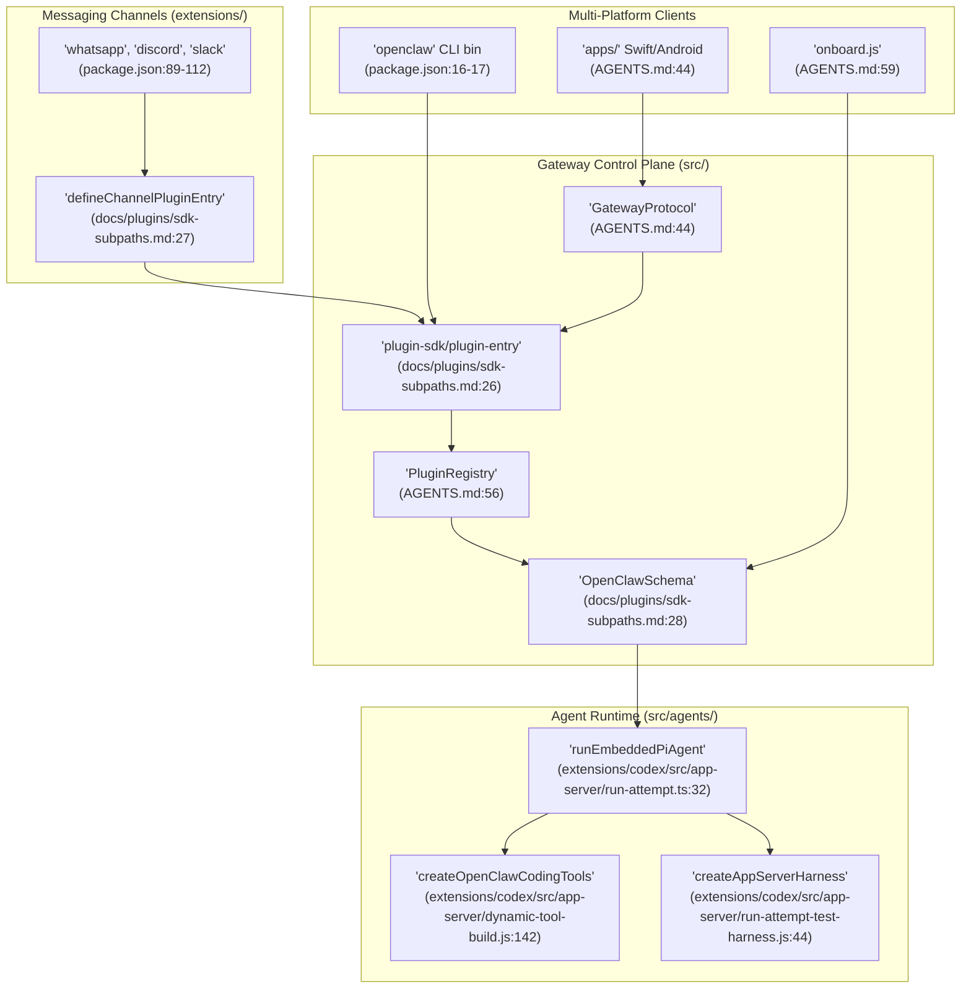
Sources: [AGENTS.md:44-60](), [package.json:16-17](), [docs/plugins/sdk-subpaths.md:26-28](), [extensions/codex/src/app-server/run-attempt.ts:32-36](), [pnpm-workspace.yaml:1-5]()

## Core Concepts

### Gateway & Agents
The **Gateway** is the always-on control plane. It manages **Agents**, which are execution contexts configured with specific models and workspace defaults. The system maintains a `models.json` for model discovery and configuration [CHANGELOG.md:17](). Agents can utilize various runtimes, including the embedded Pi core or the **Codex app-server** harness for specialized coding tasks [extensions/codex/src/app-server/run-attempt.ts:118-128]().

### Sessions & Channels
A **Session** represents a specific conversation thread. **Channels** are the transport layers (like Telegram, WhatsApp, or Google Meet) that route messages to the Gateway [CHANGELOG.md:10](). The system now utilizes **SQLite-backed state** for inbound queues and monitor tracking to ensure persistence across restarts [CHANGELOG.md:18]().

### Skills & Tools
**Tools** are functional capabilities (like `web search` or `browser automation`) that the agent can invoke. **Skills** are modular extensions that teach agents how to use these tools for specific domains, managed via `SKILL.md` files [AGENTS.md:4](). A new **Skill Workshop** flow in the Control UI allows for governed skill creation and reviewable proposals [CHANGELOG.md:15]().

For a deeper dive into these primitives, see [Core Concepts](#1.2).

Sources: [CHANGELOG.md:10-18](), [extensions/codex/src/app-server/run-attempt.ts:118-128](), [AGENTS.md:4-60]()

## Multi-Platform Architecture

OpenClaw is built for high portability across desktop, server, and mobile environments. It leverages a shared TypeScript core and native UI components.

| Platform | Role | Technology |
| :--- | :--- | :--- |
| **Server / Desktop** | Core Gateway | Node.js / TypeScript [package.json:148-151]() |
| **Web** | Control UI | React/Vite Dashboard (via `ui/` workspace) [pnpm-workspace.yaml:3]() |
| **Native Clients** | iOS / Android / macOS | Swift / Kotlin / Jetpack Compose (via `apps/`) [AGENTS.md:44]() |
| **Container** | Deployment | Docker Multi-arch manifests [CHANGELOG.md:19]() |

### Data Flow: Message to Tool Execution

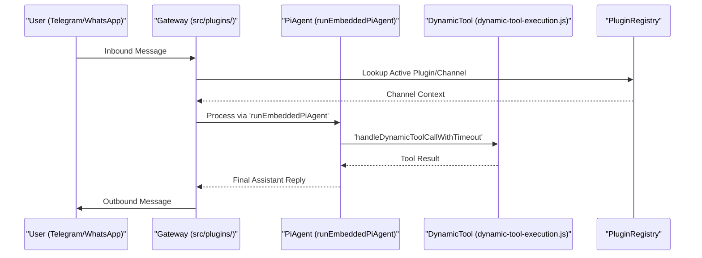
Sources: [AGENTS.md:44-55](), [extensions/codex/src/app-server/dynamic-tool-execution.js:155](), [extensions/codex/src/app-server/run-attempt.ts:32]()

For details on the build system and native integrations, see [Platform Architecture](#1.3).

## Security & Trust

OpenClaw operates on a **Personal Assistant Trust Model**. Because the assistant has access to sensitive local tools (like shell execution), it includes several safety boundaries:
- **Boundary Checks**: Automated enforcement to prevent unauthorized cross-package imports [AGENTS.md:51-53]().
- **SecretRef System**: Manifest-driven contract for managing provider integration credentials [CHANGELOG.md:39]().
- **Audit System**: Diagnostic repair and health checks for disk space and post-upgrade JSON probes [CHANGELOG.md:42]().
- **Sandboxing**: Execution of dangerous tasks within isolated environments like Docker or **OpenShell** [package.json:105]().

Sources: [AGENTS.md:51-59](), [CHANGELOG.md:39-42](), [package.json:105]()

## Getting Started

The recommended way to set up OpenClaw is via the interactive onboarding wizard.

```bash
pnpm openclaw onboard
```

This command guides you through:
1. **Model Providers**: Configuring API keys for providers like OpenAI, Anthropic, or Google Gemini [pnpm-lock.yaml:47-61]().
2. **Messaging Channels**: Linking accounts for Telegram, WhatsApp, Discord, etc. [package.json:89-112]().
3. **Workspace Setup**: Initializing the configuration and agent workspaces [AGENTS.md:60]().

For a full walkthrough, see [Getting Started](#1.1).

Sources: [package.json:16-17](), [pnpm-lock.yaml:47-61](), [AGENTS.md:60]()

---

# Page: Getting Started

# Getting Started

<details>
<summary>Relevant source files</summary>

The following files were used as context for generating this wiki page:

- [docs/cli/update.md](docs/cli/update.md)
- [docs/gateway/security/index.md](docs/gateway/security/index.md)
- [docs/gateway/security/shrinkwrap.md](docs/gateway/security/shrinkwrap.md)
- [docs/install/development-channels.md](docs/install/development-channels.md)
- [docs/install/index.md](docs/install/index.md)
- [docs/install/installer.md](docs/install/installer.md)
- [docs/install/updating.md](docs/install/updating.md)
- [docs/plugins/dependency-resolution.md](docs/plugins/dependency-resolution.md)
- [docs/reference/release-performance-sweep.md](docs/reference/release-performance-sweep.md)
- [extensions/acpx/package.json](extensions/acpx/package.json)
- [extensions/codex/package.json](extensions/codex/package.json)
- [extensions/codex/src/app-server/request.ts](extensions/codex/src/app-server/request.ts)
- [extensions/codex/src/migration/apply.ts](extensions/codex/src/migration/apply.ts)
- [extensions/codex/src/migration/plan.ts](extensions/codex/src/migration/plan.ts)
- [extensions/codex/src/migration/provider.test.ts](extensions/codex/src/migration/provider.test.ts)
- [extensions/codex/src/migration/provider.ts](extensions/codex/src/migration/provider.ts)
- [extensions/codex/src/migration/source.ts](extensions/codex/src/migration/source.ts)
- [extensions/tlon/package.json](extensions/tlon/package.json)
- [openclaw.mjs](openclaw.mjs)
- [scripts/check-cli-startup-memory.mjs](scripts/check-cli-startup-memory.mjs)
- [scripts/install-cli.sh](scripts/install-cli.sh)
- [scripts/install.ps1](scripts/install.ps1)
- [scripts/install.sh](scripts/install.sh)
- [scripts/lib/plugin-npm-package-manifest.mjs](scripts/lib/plugin-npm-package-manifest.mjs)
- [scripts/write-cli-startup-metadata.ts](scripts/write-cli-startup-metadata.ts)
- [src/cli/argv.test.ts](src/cli/argv.test.ts)
- [src/cli/argv.ts](src/cli/argv.ts)
- [src/cli/help-cold-imports.test.ts](src/cli/help-cold-imports.test.ts)
- [src/cli/plugins-install-record-commit.test.ts](src/cli/plugins-install-record-commit.test.ts)
- [src/cli/root-help-metadata.ts](src/cli/root-help-metadata.ts)
- [src/cli/run-main-policy.ts](src/cli/run-main-policy.ts)
- [src/cli/run-main.exit.test.ts](src/cli/run-main.exit.test.ts)
- [src/cli/run-main.test.ts](src/cli/run-main.test.ts)
- [src/cli/run-main.ts](src/cli/run-main.ts)
- [src/cli/update-cli.test.ts](src/cli/update-cli.test.ts)
- [src/cli/update-cli/update-command.ts](src/cli/update-cli/update-command.ts)
- [src/commands/doctor-legacy-config.migrations.test.ts](src/commands/doctor-legacy-config.migrations.test.ts)
- [src/commands/doctor/shared/legacy-config-compatibility-base.ts](src/commands/doctor/shared/legacy-config-compatibility-base.ts)
- [src/commands/doctor/shared/legacy-config-core-normalizers.ts](src/commands/doctor/shared/legacy-config-core-normalizers.ts)
- [src/commands/migrate.test.ts](src/commands/migrate.test.ts)
- [src/commands/migrate.ts](src/commands/migrate.ts)
- [src/commands/migrate/output.test.ts](src/commands/migrate/output.test.ts)
- [src/commands/migrate/output.ts](src/commands/migrate/output.ts)
- [src/commands/migrate/selection.test.ts](src/commands/migrate/selection.test.ts)
- [src/commands/migrate/selection.ts](src/commands/migrate/selection.ts)
- [src/commands/migrate/skill-selection-prompt.test.ts](src/commands/migrate/skill-selection-prompt.test.ts)
- [src/commands/migrate/skill-selection-prompt.ts](src/commands/migrate/skill-selection-prompt.ts)
- [src/commands/migrate/types.ts](src/commands/migrate/types.ts)
- [src/commands/onboard-non-interactive.gateway.test.ts](src/commands/onboard-non-interactive.gateway.test.ts)
- [src/commands/onboard-non-interactive/config-write.ts](src/commands/onboard-non-interactive/config-write.ts)
- [src/commands/onboard-non-interactive/local.ts](src/commands/onboard-non-interactive/local.ts)
- [src/commands/onboard-non-interactive/remote.ts](src/commands/onboard-non-interactive/remote.ts)
- [src/docs/clawhub-plugin-docs.test.ts](src/docs/clawhub-plugin-docs.test.ts)
- [src/entry.root-help-fast-path.test.ts](src/entry.root-help-fast-path.test.ts)
- [src/entry.test.ts](src/entry.test.ts)
- [src/entry.ts](src/entry.ts)
- [src/infra/install-source-utils.test.ts](src/infra/install-source-utils.test.ts)
- [src/infra/install-source-utils.ts](src/infra/install-source-utils.ts)
- [src/infra/npm-install-env.test.ts](src/infra/npm-install-env.test.ts)
- [src/infra/npm-install-env.ts](src/infra/npm-install-env.ts)
- [src/infra/safe-package-install.test.ts](src/infra/safe-package-install.test.ts)
- [src/infra/update-channels.test.ts](src/infra/update-channels.test.ts)
- [src/infra/update-channels.ts](src/infra/update-channels.ts)
- [src/infra/update-global.test.ts](src/infra/update-global.test.ts)
- [src/infra/update-global.ts](src/infra/update-global.ts)
- [src/infra/update-runner.test.ts](src/infra/update-runner.test.ts)
- [src/infra/update-runner.ts](src/infra/update-runner.ts)
- [src/plugins/provider-auth-choice.test.ts](src/plugins/provider-auth-choice.test.ts)
- [src/plugins/provider-auth-choice.ts](src/plugins/provider-auth-choice.ts)
- [src/scripts/test-live-media.test.ts](src/scripts/test-live-media.test.ts)
- [src/wizard/setup.migration-import.ts](src/wizard/setup.migration-import.ts)
- [src/wizard/setup.post-install-migration.test.ts](src/wizard/setup.post-install-migration.test.ts)
- [src/wizard/setup.post-install-migration.ts](src/wizard/setup.post-install-migration.ts)
- [src/wizard/setup.test.ts](src/wizard/setup.test.ts)
- [src/wizard/setup.ts](src/wizard/setup.ts)
- [test/openclaw-launcher.e2e.test.ts](test/openclaw-launcher.e2e.test.ts)
- [test/plugin-npm-package-manifest.test.ts](test/plugin-npm-package-manifest.test.ts)
- [test/scripts/check-cli-startup-memory.test.ts](test/scripts/check-cli-startup-memory.test.ts)
- [test/scripts/install-cli.test.ts](test/scripts/install-cli.test.ts)
- [test/scripts/install-ps1.test.ts](test/scripts/install-ps1.test.ts)
- [test/scripts/install-sh.test.ts](test/scripts/install-sh.test.ts)
- [test/scripts/write-cli-startup-metadata.test.ts](test/scripts/write-cli-startup-metadata.test.ts)

</details>


OpenClaw is a personal AI assistant system that runs on your own hardware, serving as a multi-platform AI gateway between your messaging apps and AI agents. This page guides you through installing OpenClaw and performing your initial configuration using the onboarding wizard.

---

## Prerequisites

OpenClaw requires **Node.js 24 (recommended)** or **Node.js 22.19+** [scripts/install.sh:19-22](). The system is designed to run on **macOS, Linux, and Windows**. The installer verifies the environment and ensures dependencies like `tar` and `curl`/`wget` are available for bootstrapping [scripts/install.sh:59-71](), [scripts/install.sh:189-193]().

On Linux, the installer handles non-interactive `apt-get` environments and ensures `DEBIAN_FRONTEND` is set correctly for repository configuration [test/scripts/install-sh.test.ts:116-123](). On Windows, the installer checks for a compatible `node.exe` and can automatically download a portable Node.js runtime if a system-wide installation is missing or outdated [scripts/install.ps1:152-172](), [scripts/install.ps1:194-205]().

**Sources:** [scripts/install.sh:19-22](), [scripts/install.sh:59-71](), [scripts/install.sh:189-193](), [test/scripts/install-sh.test.ts:116-123](), [scripts/install.ps1:152-172](), [scripts/install.ps1:194-205]()

---

## Installation

The primary distribution method is via a shell installer (macOS/Linux) or PowerShell script (Windows). These scripts install the `openclaw` CLI, which serves as the entry point for all management tasks [scripts/install.sh:265-275]().

### macOS and Linux
```bash
# Recommended: Shell installer
curl -fsSL https://openclaw.ai/install.sh | bash
```
The `install.sh` script performs OS detection, bootstraps the `gum` UI tool for an interactive experience, and ensures a supported Node.js binary is active in the shell [scripts/install.sh:136-153](), [scripts/install.sh:168-187](). It specifically checks for Alpine Linux to use `apk` for Node.js installation before falling back to other methods [test/scripts/install-sh.test.ts:157-168]().

### Windows
```powershell
# PowerShell installer
powershell -c "irm https://openclaw.ai/install.ps1 | iex"
```
The `install.ps1` script supports dry-run modes and specific install methods such as `npm` or `git` [scripts/install.ps1:5-13](). It handles Windows-specific path issues by running command shims from a safe local directory via `Invoke-CommandFromWindowsSafeDirectory` [test/scripts/install-ps1.test.ts:116-127]().

### Updating
OpenClaw features a robust update system implemented in `runGatewayUpdate` [src/infra/update-runner.ts:12](). It manages the entire lifecycle: fetching tags, checking out code (for git installs), running `pnpm build`, and performing post-update repairs via the `doctor` command [src/infra/update-runner.test.ts:79-118]().

```bash
openclaw update
```
The update command uses a "sentinel" file to track the health of the control plane during restarts, ensuring that a failed update can be diagnosed [src/cli/update-cli/update-command.ts:70-76]().

**Sources:** [scripts/install.sh:265-275](), [scripts/install.sh:136-153](), [scripts/install.sh:168-187](), [test/scripts/install-sh.test.ts:157-168](), [scripts/install.ps1:5-13](), [test/scripts/install-ps1.test.ts:116-127](), [src/infra/update-runner.ts:12](), [src/infra/update-runner.test.ts:79-118](), [src/cli/update-cli/update-command.ts:70-76]()

---

## Onboarding Wizard

The recommended setup path is the onboarding flow, which is triggered automatically if no configuration is detected or via `openclaw onboard`.

### Onboarding Logic & CLI Entry
The CLI entry point `runCli` in `src/cli/run-main.ts` evaluates the environment to decide if the onboarding wizard (Crestodian) should start [src/cli/run-main.ts:50-57](). If the configuration is missing or invalid, it routes the user to the setup wizard [src/cli/run-main.exit.test.ts:54-57]().

### Implementation & Data Flow
The wizard populates `openclaw.json`, the primary configuration file located at `CONFIG_PATH` [src/cli/update-cli/update-command.ts:33]().

**Onboarding Logic Flow**
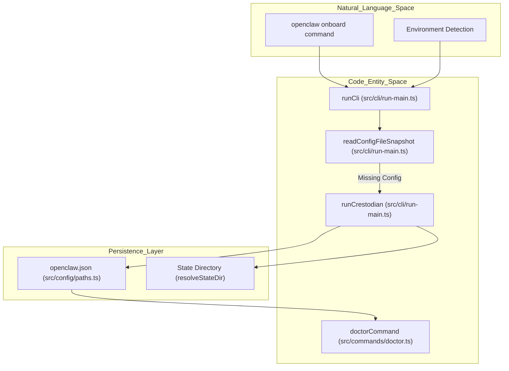

**Sources:** [src/cli/run-main.ts:50-57](), [src/cli/run-main.exit.test.ts:54-57](), [src/cli/update-cli/update-command.ts:33](), [src/config/paths.ts:6]()

---

## Workspace & Plugin Configuration

OpenClaw uses a manifest-driven plugin architecture. During onboarding, plugins are synchronized based on the chosen update channel [src/cli/update-cli/update-command.ts:97-101]().

### Plugin Management
The system tracks installed plugins using `PluginInstallRecord` objects [src/cli/update-cli/update-command.ts:35](). When the system is updated or repaired, it runs `syncPluginsForUpdateChannel` to ensure all required plugins are present and compatible with the current version [src/cli/update-cli/update-command.ts:97]().

### Model Providers
Onboarding involves configuring model providers (e.g., OpenAI, Anthropic). The system manages credentials via environment substitution to ensure secrets are handled securely [src/cli/update-cli/update-command.ts:29]().

**Plugin and Update Sequence**
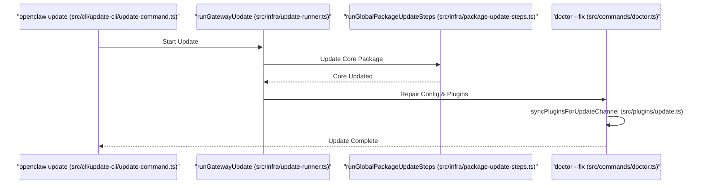

**Sources:** [src/cli/update-cli/update-command.ts:35](), [src/cli/update-cli/update-command.ts:97-101](), [src/cli/update-cli/update-command.ts:29](), [src/infra/update-runner.ts:12](), [src/plugins/update.ts:97]()

---

## System Health & Diagnostics

The `openclaw doctor` command is the primary tool for maintaining system health [src/cli/update-cli/update-command.ts:16]().

### Doctor Capabilities
*   **Auto-Repair**: Fixes common configuration issues and missing plugin dependencies [src/infra/update-runner.test.ts:79-118]().
*   **Environment Validation**: Ensures the Node.js version satisfies the engine requirements [src/cli/update-cli/update-command.ts:57]().
*   **Shell Completion**: Verifies and installs shell completion scripts [src/cli/update-cli/update-command.ts:13-15]().

**Sources:** [src/cli/update-cli/update-command.ts:16](), [src/infra/update-runner.test.ts:79-118](), [src/cli/update-cli/update-command.ts:57](), [src/cli/update-cli/update-command.ts:13-15]()

---

## First Interaction

### 1. Verify Installation
Confirm the CLI is correctly installed and the version matches the expected release:
```bash
openclaw --version
```

### 2. Start the Gateway
Run the gateway in the foreground to see initial logs and ensure the WebSocket server starts correctly:
```bash
openclaw gateway run
```
The CLI uses a fast-path optimization for the `gateway run` command to minimize startup latency [src/cli/run-main.ts:118-158](). This optimization, checked via `isGatewayRunFastPathArgv`, avoids heavy imports until it is certain the user wants to run the gateway [src/cli/run-main.ts:160-183]().

### 3. Interactive Setup
If you skipped onboarding during installation, you can trigger it manually:
```bash
openclaw onboard
```
This will initialize your `openclaw.json` and prepare the workspace for agents [src/cli/update-cli/update-command.ts:33]().

**Sources:** [src/cli/run-main.ts:118-158](), [src/cli/run-main.ts:160-183](), [src/cli/update-cli/update-command.ts:33]()

---

# Page: Core Concepts

# Core Concepts

<details>
<summary>Relevant source files</summary>

The following files were used as context for generating this wiki page:

- [apps/macos/Sources/OpenClaw/HostEnvSecurityPolicy.generated.swift](apps/macos/Sources/OpenClaw/HostEnvSecurityPolicy.generated.swift)
- [docs/.i18n/glossary.zh-CN.json](docs/.i18n/glossary.zh-CN.json)
- [docs/automation/index.md](docs/automation/index.md)
- [docs/channels/ambient-room-events.md](docs/channels/ambient-room-events.md)
- [docs/channels/group-messages.md](docs/channels/group-messages.md)
- [docs/channels/troubleshooting.md](docs/channels/troubleshooting.md)
- [docs/cli/config.md](docs/cli/config.md)
- [docs/concepts/agent-workspace.md](docs/concepts/agent-workspace.md)
- [docs/concepts/context.md](docs/concepts/context.md)
- [docs/concepts/soul.md](docs/concepts/soul.md)
- [docs/concepts/system-prompt.md](docs/concepts/system-prompt.md)
- [docs/docs.json](docs/docs.json)
- [docs/gateway/config-agents.md](docs/gateway/config-agents.md)
- [docs/gateway/heartbeat.md](docs/gateway/heartbeat.md)
- [docs/gateway/local-model-services.md](docs/gateway/local-model-services.md)
- [docs/gateway/troubleshooting.md](docs/gateway/troubleshooting.md)
- [docs/help/faq-first-run.md](docs/help/faq-first-run.md)
- [docs/help/faq.md](docs/help/faq.md)
- [docs/nodes/camera.md](docs/nodes/camera.md)
- [docs/nodes/index.md](docs/nodes/index.md)
- [docs/platforms/macos.md](docs/platforms/macos.md)
- [docs/providers/ds4.md](docs/providers/ds4.md)
- [docs/providers/index.md](docs/providers/index.md)
- [docs/reference/rich-output-protocol.md](docs/reference/rich-output-protocol.md)
- [docs/reference/token-use.md](docs/reference/token-use.md)
- [docs/start/openclaw.md](docs/start/openclaw.md)
- [docs/tools/index.md](docs/tools/index.md)
- [docs/tools/skill-workshop.md](docs/tools/skill-workshop.md)
- [extensions/anthropic/stream-wrappers.test.ts](extensions/anthropic/stream-wrappers.test.ts)
- [extensions/anthropic/stream-wrappers.ts](extensions/anthropic/stream-wrappers.ts)
- [extensions/codex/src/app-server/native-execution-policy.test.ts](extensions/codex/src/app-server/native-execution-policy.test.ts)
- [extensions/codex/src/app-server/native-execution-policy.ts](extensions/codex/src/app-server/native-execution-policy.ts)
- [extensions/whatsapp/light-runtime-api.ts](extensions/whatsapp/light-runtime-api.ts)
- [extensions/whatsapp/runtime-api.ts](extensions/whatsapp/runtime-api.ts)
- [extensions/whatsapp/src/auth-store.lazy-dir.test.ts](extensions/whatsapp/src/auth-store.lazy-dir.test.ts)
- [src/agents/bootstrap-files.test.ts](src/agents/bootstrap-files.test.ts)
- [src/agents/command/session-store.test.ts](src/agents/command/session-store.test.ts)
- [src/agents/command/session-store.ts](src/agents/command/session-store.ts)
- [src/agents/context.test.ts](src/agents/context.test.ts)
- [src/agents/embedded-agent-helpers/bootstrap.ts](src/agents/embedded-agent-helpers/bootstrap.ts)
- [src/agents/embedded-agent-runner/types.ts](src/agents/embedded-agent-runner/types.ts)
- [src/agents/live-model-switch.test.ts](src/agents/live-model-switch.test.ts)
- [src/agents/live-model-switch.ts](src/agents/live-model-switch.ts)
- [src/agents/tools/media-tool-shared.test.ts](src/agents/tools/media-tool-shared.test.ts)
- [src/auto-reply/reply/commands-context-report.test.ts](src/auto-reply/reply/commands-context-report.test.ts)
- [src/cli/config-set-dryrun.ts](src/cli/config-set-dryrun.ts)
- [src/cli/program/route-args.test.ts](src/cli/program/route-args.test.ts)
- [src/commands/doctor-session-snapshots.test.ts](src/commands/doctor-session-snapshots.test.ts)
- [src/commands/doctor-session-snapshots.ts](src/commands/doctor-session-snapshots.ts)
- [src/config/sessions.cache.test.ts](src/config/sessions.cache.test.ts)
- [src/config/sessions/disk-budget.test.ts](src/config/sessions/disk-budget.test.ts)
- [src/config/sessions/disk-budget.ts](src/config/sessions/disk-budget.ts)
- [src/config/sessions/lifecycle.ts](src/config/sessions/lifecycle.ts)
- [src/config/sessions/sessions.test.ts](src/config/sessions/sessions.test.ts)
- [src/config/sessions/skill-prompt-blobs.ts](src/config/sessions/skill-prompt-blobs.ts)
- [src/config/sessions/store-cache.ts](src/config/sessions/store-cache.ts)
- [src/config/sessions/store-load.ts](src/config/sessions/store-load.ts)
- [src/config/sessions/store.skills-stripping.test.ts](src/config/sessions/store.skills-stripping.test.ts)
- [src/config/sessions/store.ts](src/config/sessions/store.ts)
- [src/config/sessions/types.ts](src/config/sessions/types.ts)
- [src/config/types.agent-defaults.ts](src/config/types.agent-defaults.ts)
- [src/config/zod-schema.agent-defaults.ts](src/config/zod-schema.agent-defaults.ts)
- [src/docs/config-path-docs.test.ts](src/docs/config-path-docs.test.ts)
- [src/gateway/session-utils.single-row-cache.test.ts](src/gateway/session-utils.single-row-cache.test.ts)
- [src/infra/heartbeat-runner.model-override.test.ts](src/infra/heartbeat-runner.model-override.test.ts)
- [src/infra/host-env-security-policy.json](src/infra/host-env-security-policy.json)
- [src/infra/host-env-security.reported-baseline.json](src/infra/host-env-security.reported-baseline.json)
- [src/infra/host-env-security.reported-baseline.test.ts](src/infra/host-env-security.reported-baseline.test.ts)
- [src/infra/host-env-security.test.ts](src/infra/host-env-security.test.ts)
- [src/infra/json-files.test.ts](src/infra/json-files.test.ts)
- [src/infra/json-files.ts](src/infra/json-files.ts)
- [src/plugins/contracts/plugin-sdk-runtime-api-guardrails.test.ts](src/plugins/contracts/plugin-sdk-runtime-api-guardrails.test.ts)
- [src/plugins/runtime/runtime-web-channel-plugin.test.ts](src/plugins/runtime/runtime-web-channel-plugin.test.ts)
- [src/plugins/runtime/runtime-web-channel-plugin.ts](src/plugins/runtime/runtime-web-channel-plugin.ts)
- [src/plugins/session-entry-slot-keys.ts](src/plugins/session-entry-slot-keys.ts)
- [ui/src/ui/views/config-quick.test.ts](ui/src/ui/views/config-quick.test.ts)
- [ui/src/ui/views/config-quick.ts](ui/src/ui/views/config-quick.ts)

</details>


This page explains the fundamental building blocks of OpenClaw: the Gateway, Agents, Sessions, Channels, Tools, Skills, and the personal assistant trust model. Understanding these concepts is essential for configuring and operating OpenClaw effectively.

---

## Gateway

The Gateway is OpenClaw's central control plane—a Node.js server that coordinates all communication between clients, channels, agents, and tools. It serves as the single point of entry for managing configuration, sessions, and multi-platform messaging.

### Gateway Architecture

The Gateway acts as the traffic controller, routing inbound messages from various platform adapters to the appropriate agent runtime. It is responsible for loading plugins, managing the configuration lifecycle, and maintaining the global hook runner.

Title: Gateway Entity Mapping
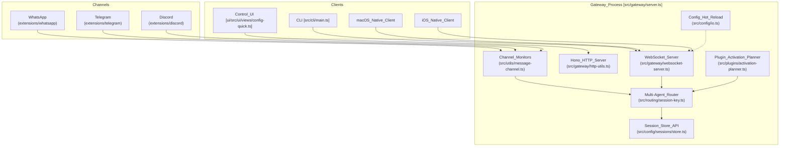

**Key Gateway responsibilities:**

| Responsibility | Implementation | File Reference |
|----------------|----------------|-------------|
| WebSocket RPC | Protocol v3 with `RequestFrame`, `ResponseFrame`, and `EventFrame` | [src/gateway/local-request-context.ts:16-21]() |
| Configuration | Zod-validated JSON configuration with migrations | [src/config/sessions/store-migrations.ts:39-39]() |
| Multi-agent Routing | Mapping channel peers to specific agent instances | [src/routing/session-key.ts:27-34]() |
| Diagnostics | Integrated `doctor` command for auto-repair and status | [docs/help/faq.md:60-67]() |

**Crestodian & Delegate Architecture**
For organizational deployments, OpenClaw supports a **delegate architecture** where an agent acts on behalf of humans. **Crestodian** serves as the configless-safe setup and repair helper. It ensures that even without a complex initial config, the system can be bootstrapped safely using the `wizard` state tracking and the `openclaw doctor` command [docs/help/faq.md:60-67]().

**Sources:** [src/gateway/local-request-context.ts:16-21](), [src/routing/session-key.ts:27-34](), [docs/help/faq.md:60-67](), [src/config/sessions/store.ts:86-86]()

---

## Agents

An agent is an isolated runtime context powered by the execution pipeline. It manages its own workspace, model providers, and tool execution logic. OpenClaw supports multi-agent routing where different channels or senders can be bound to different agents.

Title: Agent Execution Pipeline and Provider Resolution
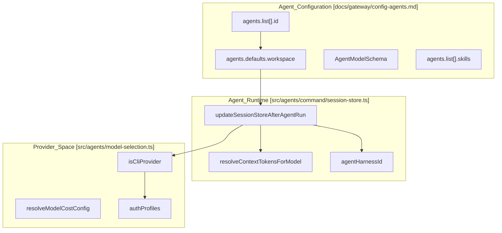

**Agent configuration hierarchy:**

| Config Path | Purpose | Implementation |
|-------------|---------|----------------|
| `agents.defaults` | Shared settings for all agents (workspace, model, memory) | [docs/gateway/config-agents.md:14-17]() |
| `agents.list[]` | Individual agent definitions and overrides | [docs/gateway/config-agents.md:46-56]() |
| `authProfiles` | Named credentials used by agents for model access | [docs/help/faq.md:101-102]() |
| `bootstrap` | Policy for injecting workspace files (SOUL.md, AGENTS.md) into prompts | [docs/gateway/config-agents.md:64-72]() |

The execution pipeline handles the lifecycle of an interaction, including retries and model selection. After a run, `updateSessionStoreAfterAgentRun` persists the model used, token usage, and session metadata [src/agents/command/session-store.ts:55-76]().

**Sources:** [docs/gateway/config-agents.md:1-150](), [src/agents/command/session-store.ts:55-120](), [src/agents/command/session-store.test.ts:20-24]()

---

## Sessions

A session is the conversation state boundary. OpenClaw uses a flexible session scoping model. Sessions are identified by unique keys and persisted as JSONL transcripts in a dedicated store.

### Session Scoping
OpenClaw supports several session scoping modes:
- **`main`**: A single global session.
- **`agent`**: Sessions scoped to a specific agent instance.
- **`subagent`**: Specialized sessions spawned for task delegation.

**Session Storage and Cache:**
Sessions are stored in `sessions.json` and managed by `loadSessionStore` [src/config/sessions/store.ts:42-46](). To improve performance, OpenClaw implements a multi-layer cache in `store-cache.ts` that includes a serialized string cache and a "DeepReadonly" snapshot cache [src/config/sessions/store-cache.ts:14-39](). Large strings, such as skill prompts, are interned to reduce memory pressure [src/config/sessions/store-cache.ts:111-125]().

**Maintenance:**
The Gateway automatically prunes stale entries and enforces a disk budget for session files [src/config/sessions/store.ts:17-18](). Resets can be triggered based on idle time or daily schedules (e.g., 4 AM) [src/config/sessions/sessions.test.ts:143-150]().

**Sources:** [src/config/sessions/store.ts:1-60](), [src/config/sessions/store-cache.ts:1-64](), [src/config/sessions/sessions.test.ts:42-150]()

---

## Channels

Channels are the messaging surfaces that connect to the Gateway. Each channel handles message normalization and delivery.

**Channel Architecture:**
Channels handle platform-specific events (e.g., Telegram, Discord, WhatsApp) and route them to the Gateway's multi-agent router. The system normalizes delivery context (channel, accountId, threadId) to ensure consistent routing [src/config/sessions/store-load.ts:84-100]().

**Channel Policy:**
Access is governed by policies including `allowFrom` restrictions. Channels can enforce daily resets or idle timeouts for sessions to keep interactions fresh [src/config/sessions/sessions.test.ts:125-140]().

**Sources:** [src/config/sessions/store-load.ts:84-100](), [src/config/sessions/sessions.test.ts:125-140]()

---

## Tools

Tools allow agents to interact with the host system or external APIs. They are registered via the plugin system and can be dynamically discovered by agents.

**Tool Categories:**
- **Coding Tools:** File manipulation and shell execution.
- **Browser Automation:** CDP-based tab control and web navigation.
- **Memory Tools:** Hybrid search for recalling information from session history [docs/gateway/config-agents.md:192-194]().
- **Media Tools:** Image understanding and media processing.

**Tool Policy:**
Tool execution is governed by policies that can restrict access to specific agents or environments. The system uses a `SecretRef` system to handle credentials required by tools securely.

**Sources:** [docs/gateway/config-agents.md:175-194](), [src/agents/command/session-store.ts:24-33]()

---

## Skills

Skills are modular capability definitions, often defined in `SKILL.md` files. They provide high-level guidance and standing orders to agents.

- **Modular Instructions:** Skills are injected into the system prompt based on an allowlist [docs/gateway/config-agents.md:40-45]().
- **Workspace Skills:** Agents can load skills directly from their workspace directory (`./skills`).
- **Hydration:** Skill prompts are stored as blobs and hydrated during agent execution [src/config/sessions/store.ts:20-25]().

**Sources:** [docs/gateway/config-agents.md:40-63](), [src/config/sessions/store.ts:20-25]()

---

## Trust Model

OpenClaw is designed as a **personal AI assistant**, operating under a single-user trust model where the operator is the owner of the Gateway.

1. **Trusted Operator Boundary:** The system assumes the person running the Gateway is the authorized administrator.
2. **Security Auditing:** The system includes a security audit command to identify filesystem, gateway, and sandbox risks [docs/help/faq.md:60-67]().
3. **Sandboxing:** OpenClaw supports Docker-based sandboxing for tool execution, ensuring that dangerous commands are isolated from the host system.
4. **Secret Management:** Sensitive credentials are never stored in plain text in transcripts; the system uses a `SecretRef` resolution hierarchy.

**Sources:** [docs/help/faq.md:84-106](), [src/config/sessions/store.ts:150-168]()

---

# Page: Platform Architecture

# Platform Architecture

<details>
<summary>Relevant source files</summary>

The following files were used as context for generating this wiki page:

- [apps/android/app/src/debug/AndroidManifest.xml](apps/android/app/src/debug/AndroidManifest.xml)
- [apps/android/app/src/debug/java/ai/openclaw/app/VoiceE2eReceiver.kt](apps/android/app/src/debug/java/ai/openclaw/app/VoiceE2eReceiver.kt)
- [apps/android/app/src/main/java/ai/openclaw/app/AssistantLaunch.kt](apps/android/app/src/main/java/ai/openclaw/app/AssistantLaunch.kt)
- [apps/android/app/src/main/java/ai/openclaw/app/MainActivity.kt](apps/android/app/src/main/java/ai/openclaw/app/MainActivity.kt)
- [apps/android/app/src/main/java/ai/openclaw/app/MainViewModel.kt](apps/android/app/src/main/java/ai/openclaw/app/MainViewModel.kt)
- [apps/android/app/src/main/java/ai/openclaw/app/NodeRuntime.kt](apps/android/app/src/main/java/ai/openclaw/app/NodeRuntime.kt)
- [apps/android/app/src/main/java/ai/openclaw/app/gateway/GatewayHostSecurity.kt](apps/android/app/src/main/java/ai/openclaw/app/gateway/GatewayHostSecurity.kt)
- [apps/android/app/src/main/java/ai/openclaw/app/gateway/GatewayProtocol.kt](apps/android/app/src/main/java/ai/openclaw/app/gateway/GatewayProtocol.kt)
- [apps/android/app/src/main/java/ai/openclaw/app/gateway/GatewaySession.kt](apps/android/app/src/main/java/ai/openclaw/app/gateway/GatewaySession.kt)
- [apps/android/app/src/main/java/ai/openclaw/app/gateway/GatewayTls.kt](apps/android/app/src/main/java/ai/openclaw/app/gateway/GatewayTls.kt)
- [apps/android/app/src/main/java/ai/openclaw/app/node/ConnectionManager.kt](apps/android/app/src/main/java/ai/openclaw/app/node/ConnectionManager.kt)
- [apps/android/app/src/main/java/ai/openclaw/app/ui/ConnectTabScreen.kt](apps/android/app/src/main/java/ai/openclaw/app/ui/ConnectTabScreen.kt)
- [apps/android/app/src/main/java/ai/openclaw/app/ui/GatewayConfigResolver.kt](apps/android/app/src/main/java/ai/openclaw/app/ui/GatewayConfigResolver.kt)
- [apps/android/app/src/main/java/ai/openclaw/app/ui/GatewayDiagnostics.kt](apps/android/app/src/main/java/ai/openclaw/app/ui/GatewayDiagnostics.kt)
- [apps/android/app/src/main/java/ai/openclaw/app/ui/GatewayPairingRetry.kt](apps/android/app/src/main/java/ai/openclaw/app/ui/GatewayPairingRetry.kt)
- [apps/android/app/src/main/java/ai/openclaw/app/ui/OnboardingFlow.kt](apps/android/app/src/main/java/ai/openclaw/app/ui/OnboardingFlow.kt)
- [apps/android/app/src/main/java/ai/openclaw/app/ui/VoiceTabScreen.kt](apps/android/app/src/main/java/ai/openclaw/app/ui/VoiceTabScreen.kt)
- [apps/android/app/src/main/java/ai/openclaw/app/voice/MicCaptureManager.kt](apps/android/app/src/main/java/ai/openclaw/app/voice/MicCaptureManager.kt)
- [apps/android/app/src/main/java/ai/openclaw/app/voice/TalkModeGatewayConfig.kt](apps/android/app/src/main/java/ai/openclaw/app/voice/TalkModeGatewayConfig.kt)
- [apps/android/app/src/main/java/ai/openclaw/app/voice/TalkModeManager.kt](apps/android/app/src/main/java/ai/openclaw/app/voice/TalkModeManager.kt)
- [apps/android/app/src/test/java/ai/openclaw/app/GatewayBootstrapAuthTest.kt](apps/android/app/src/test/java/ai/openclaw/app/GatewayBootstrapAuthTest.kt)
- [apps/android/app/src/test/java/ai/openclaw/app/gateway/GatewaySessionInvokeTest.kt](apps/android/app/src/test/java/ai/openclaw/app/gateway/GatewaySessionInvokeTest.kt)
- [apps/android/app/src/test/java/ai/openclaw/app/gateway/GatewaySessionReconnectTest.kt](apps/android/app/src/test/java/ai/openclaw/app/gateway/GatewaySessionReconnectTest.kt)
- [apps/android/app/src/test/java/ai/openclaw/app/node/ConnectionManagerTest.kt](apps/android/app/src/test/java/ai/openclaw/app/node/ConnectionManagerTest.kt)
- [apps/android/app/src/test/java/ai/openclaw/app/ui/GatewayConfigResolverTest.kt](apps/android/app/src/test/java/ai/openclaw/app/ui/GatewayConfigResolverTest.kt)
- [apps/android/app/src/test/java/ai/openclaw/app/ui/OnboardingFlowLogicTest.kt](apps/android/app/src/test/java/ai/openclaw/app/ui/OnboardingFlowLogicTest.kt)
- [apps/android/app/src/test/java/ai/openclaw/app/voice/MicCaptureManagerTest.kt](apps/android/app/src/test/java/ai/openclaw/app/voice/MicCaptureManagerTest.kt)
- [apps/android/app/src/test/java/ai/openclaw/app/voice/TalkModeConfigParsingTest.kt](apps/android/app/src/test/java/ai/openclaw/app/voice/TalkModeConfigParsingTest.kt)
- [apps/android/app/src/test/java/ai/openclaw/app/voice/TalkModeManagerTest.kt](apps/android/app/src/test/java/ai/openclaw/app/voice/TalkModeManagerTest.kt)
- [apps/android/scripts/voice-e2e.sh](apps/android/scripts/voice-e2e.sh)
- [apps/shared/OpenClawKit/Sources/OpenClawProtocol/GatewayModels.swift](apps/shared/OpenClawKit/Sources/OpenClawProtocol/GatewayModels.swift)
- [apps/shared/OpenClawKit/Sources/OpenClawProtocol/WakeParamsCompatibility.swift](apps/shared/OpenClawKit/Sources/OpenClawProtocol/WakeParamsCompatibility.swift)
- [docs/gateway/protocol.md](docs/gateway/protocol.md)
- [docs/platforms/android.md](docs/platforms/android.md)
- [docs/plugins/plugin-inventory.md](docs/plugins/plugin-inventory.md)
- [docs/plugins/reference.md](docs/plugins/reference.md)
- [extensions/tsconfig.package-boundary.paths.json](extensions/tsconfig.package-boundary.paths.json)
- [extensions/xai/tsconfig.json](extensions/xai/tsconfig.json)
- [scripts/check-plugin-sdk-exports.mjs](scripts/check-plugin-sdk-exports.mjs)
- [scripts/lib/bundled-plugin-build-entries.mjs](scripts/lib/bundled-plugin-build-entries.mjs)
- [scripts/lib/extension-package-boundary.ts](scripts/lib/extension-package-boundary.ts)
- [scripts/lib/plugin-sdk-entries.d.mts](scripts/lib/plugin-sdk-entries.d.mts)
- [scripts/lib/plugin-sdk-entries.mjs](scripts/lib/plugin-sdk-entries.mjs)
- [scripts/prepare-extension-package-boundary-artifacts.mjs](scripts/prepare-extension-package-boundary-artifacts.mjs)
- [scripts/protocol-gen-swift.ts](scripts/protocol-gen-swift.ts)
- [scripts/release-check.ts](scripts/release-check.ts)
- [scripts/run-node-watch-paths.mjs](scripts/run-node-watch-paths.mjs)
- [scripts/watch-node.mjs](scripts/watch-node.mjs)
- [scripts/write-plugin-sdk-entry-dts.ts](scripts/write-plugin-sdk-entry-dts.ts)
- [src/agents/model-ref-shared.test.ts](src/agents/model-ref-shared.test.ts)
- [src/agents/model-ref-shared.ts](src/agents/model-ref-shared.ts)
- [src/cli/system-cli.test.ts](src/cli/system-cli.test.ts)
- [src/config/config.agent-concurrency-defaults.test.ts](src/config/config.agent-concurrency-defaults.test.ts)
- [src/config/cron-limits.ts](src/config/cron-limits.ts)
- [src/config/defaults.test.ts](src/config/defaults.test.ts)
- [src/config/defaults.ts](src/config/defaults.ts)
- [src/config/io.write-prepare.test.ts](src/config/io.write-prepare.test.ts)
- [src/config/io.write-prepare.ts](src/config/io.write-prepare.ts)
- [src/config/materialize.ts](src/config/materialize.ts)
- [src/config/model-alias-defaults.test.ts](src/config/model-alias-defaults.test.ts)
- [src/cron/service.ts](src/cron/service.ts)
- [src/cron/service/ops.ts](src/cron/service/ops.ts)
- [src/infra/tsdown-config.test.ts](src/infra/tsdown-config.test.ts)
- [src/infra/watch-node.test.ts](src/infra/watch-node.test.ts)
- [src/plugins/plugin-sdk-native-resolver.test.ts](src/plugins/plugin-sdk-native-resolver.test.ts)
- [src/plugins/plugin-sdk-native-resolver.ts](src/plugins/plugin-sdk-native-resolver.ts)
- [src/plugins/provider-auth-choice-helpers.test.ts](src/plugins/provider-auth-choice-helpers.test.ts)
- [src/plugins/provider-auth-choice-helpers.ts](src/plugins/provider-auth-choice-helpers.ts)
- [src/plugins/sdk-alias.test.ts](src/plugins/sdk-alias.test.ts)
- [src/plugins/sdk-alias.ts](src/plugins/sdk-alias.ts)
- [test/release-check.test.ts](test/release-check.test.ts)
- [test/scripts/bundled-plugin-build-entries.test.ts](test/scripts/bundled-plugin-build-entries.test.ts)
- [test/scripts/prepare-extension-package-boundary-artifacts.test.ts](test/scripts/prepare-extension-package-boundary-artifacts.test.ts)
- [test/scripts/watch-node.test.ts](test/scripts/watch-node.test.ts)
- [test/vitest/vitest.shared.config.ts](test/vitest/vitest.shared.config.ts)
- [tsconfig.json](tsconfig.json)
- [tsdown.config.ts](tsdown.config.ts)

</details>


## Purpose and Scope

This document provides a high-level architectural overview of OpenClaw, explaining how the major subsystems interact to deliver a self-hosted multi-platform AI gateway. It covers the core Node.js gateway, native clients (iOS/Android/macOS), Docker-based sandboxing, and the cross-platform build system.

OpenClaw is designed as a **hub-and-spoke** system where the central Gateway coordinates agent execution, messaging channels, and native device nodes.

---

## Architectural Overview

The architecture is centered around the **Gateway Control Plane**, which manages state, routing, and communication between various clients and the agent runtime.

### System Components Diagram

The following diagram maps high-level system components to their corresponding entities in the codebase.

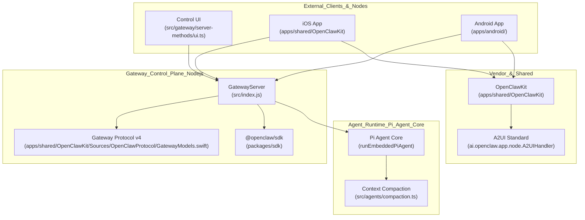

**Sources:** [apps/shared/OpenClawKit/Sources/OpenClawProtocol/GatewayModels.swift:5-6](), [apps/android/app/src/main/java/ai/openclaw/app/NodeRuntime.kt:182-188](), [scripts/protocol-gen-swift.ts:26-36]()

---

## Core Platform Subsystems

### 1. Gateway Control Plane
The Gateway is a WebSocket-based RPC server. It serves as the single source of truth for sessions and configuration. It manages the lifecycle of the AI assistant, including automated updates and service health.

*   **Protocol Versioning:** The gateway currently uses Protocol v4 [apps/shared/OpenClawKit/Sources/OpenClawProtocol/GatewayModels.swift:5-6]().
*   **RPC Framing:** Communication is handled via standardized `RequestFrame` [apps/shared/OpenClawKit/Sources/OpenClawProtocol/GatewayModels.swift:153-177](), `ResponseFrame` [apps/shared/OpenClawKit/Sources/OpenClawProtocol/GatewayModels.swift:179-207](), and `EventFrame` [apps/shared/OpenClawKit/Sources/OpenClawProtocol/GatewayModels.swift:209-237]().
*   **Presence & Heartbeats:** Nodes report status using `PresenceEntry`, tracking metadata like `platform`, `devicefamily`, and `lastinputseconds` [apps/shared/OpenClawKit/Sources/OpenClawProtocol/GatewayModels.swift:239-256]().
*   **Error Handling:** A centralized `ErrorCode` enum defines platform-wide error states such as `AGENT_TIMEOUT` and `NOT_PAIRED` [apps/shared/OpenClawKit/Sources/OpenClawProtocol/GatewayModels.swift:23-30]().

**Sources:** [apps/shared/OpenClawKit/Sources/OpenClawProtocol/GatewayModels.swift:5-256](), [docs/gateway/protocol.md:15-26]()

### 2. Shared Packages Layer (`packages/`)
OpenClaw utilizes a monorepo structure where core logic is extracted into shared TypeScript packages.

*   **gateway-protocol:** Defines the source-of-truth schemas using TypeBox [scripts/protocol-gen-swift.ts:8-9]().
*   **sdk:** The `@openclaw/sdk` provides a programmatic interface for external integrations to interact with the Gateway.
*   **llm-core & agent-core:** Contain the foundational logic for model interaction and agent execution cycles.
*   **terminal-core:** Manages TTY and shell execution logic used by both the Gateway and sandboxed environments.

### 3. Native Clients (iOS / macOS / Android)
OpenClaw provides native applications that act as **Device Nodes**. These nodes connect to the gateway to provide hardware-level capabilities to the AI agents.

*   **Android Runtime:** The Android app implements a `NodeRuntime` [apps/android/app/src/main/java/ai/openclaw/app/NodeRuntime.kt:78-82]() that coordinates hardware handlers including `CameraHandler` [apps/android/app/src/main/java/ai/openclaw/app/NodeRuntime.kt:110-118](), `LocationHandler` [apps/android/app/src/main/java/ai/openclaw/app/NodeRuntime.kt:126-133](), and `SmsHandler` [apps/android/app/src/main/java/ai/openclaw/app/NodeRuntime.kt:177-180]().
*   **Voice Integration:** Real-time voice interaction is managed by `TalkModeManager` [apps/android/app/src/main/java/ai/openclaw/app/voice/TalkModeManager.kt:90-100](). It handles audio capture and playback synchronization, including PTT (Push-To-Talk) payloads [apps/android/app/src/main/java/ai/openclaw/app/voice/TalkModeManager.kt:56-75]().
*   **UI State:** The Android client uses `MainViewModel` to expose gateway and node states (e.g., `isConnected`, `isNodeConnected`, `statusText`) to the Jetpack Compose UI [apps/android/app/src/main/java/ai/openclaw/app/MainViewModel.kt:82-94]().
*   **A2UI Canvas:** Native clients support the A2UI standard for rich UI rendering, managed by `A2UIHandler` which links the native `CanvasController` to the gateway's canvas host URLs [apps/android/app/src/main/java/ai/openclaw/app/NodeRuntime.kt:182-188]().

**Sources:** [apps/android/app/src/main/java/ai/openclaw/app/NodeRuntime.kt:78-188](), [apps/android/app/src/main/java/ai/openclaw/app/voice/TalkModeManager.kt:56-100](), [apps/android/app/src/main/java/ai/openclaw/app/MainViewModel.kt:82-118]()

---

## Build and Release System

OpenClaw uses a multi-platform build system to target Node.js, native mobile, and desktop environments.

### Build Tooling
*   **tsdown:** Used for bundling the Node.js core and shared packages. It handles environment variable injection and source map generation [tsdown.config.ts:37-41]().
*   **Native Code Generation:** The `scripts/protocol-gen-swift.ts` script automatically generates Swift models from the TypeScript protocol schema defined in `packages/gateway-protocol`, ensuring the iOS/macOS clients stay in sync with the Gateway [scripts/protocol-gen-swift.ts:1-9]().
*   **SDK Aliasing:** The system includes sophisticated logic to resolve the `plugin-sdk` during development and production, allowing plugins to consume shared logic seamlessly [src/plugins/sdk-alias.ts:14-29]().

### Asset Bundling
*   **Bundled Assets:** Assets for extensions, such as Chrome extension components, are managed within the `extensions/` directory and bundled during the release process [tsdown.config.ts:157-162]().
*   **Artifact Inventory:** The release process validates that all required artifacts (e.g., `npm-shrinkwrap.json`, `dist/index.js`, plugin-sdk files) are present in the final package [scripts/release-check.ts:72-101]().

**Sources:** [tsdown.config.ts:1-162](), [scripts/protocol-gen-swift.ts:1-36](), [src/plugins/sdk-alias.ts:14-29](), [scripts/release-check.ts:72-101]()

---

## Data Flow: Native Node Invocation

When an agent needs to access device hardware, the request flows through the Gateway's RPC layer to the native client.

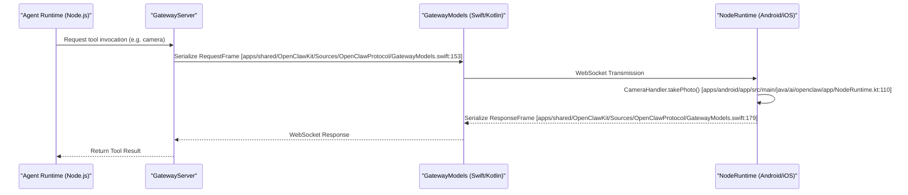

**Key Implementation Details:**
*   **Serialization:** All platforms use the same `GatewayModels` schema to ensure binary-compatible JSON serialization [apps/shared/OpenClawKit/Sources/OpenClawProtocol/GatewayModels.swift:1-10]().
*   **Asynchronous Flow:** Requests are tracked by `id` [apps/shared/OpenClawKit/Sources/OpenClawProtocol/GatewayModels.swift:155]() in the `RequestFrame`, allowing for non-blocking hardware operations.

**Sources:** [apps/shared/OpenClawKit/Sources/OpenClawProtocol/GatewayModels.swift:1-179](), [apps/android/app/src/main/java/ai/openclaw/app/NodeRuntime.kt:110-118]()

---

# Page: Gateway

# Gateway

<details>
<summary>Relevant source files</summary>

The following files were used as context for generating this wiki page:

- [docs/automation/hooks.md](docs/automation/hooks.md)
- [docs/reference/AGENTS.default.md](docs/reference/AGENTS.default.md)
- [docs/reference/templates/AGENTS.md](docs/reference/templates/AGENTS.md)
- [scripts/build-all.mjs](scripts/build-all.mjs)
- [scripts/lib/static-extension-assets.mjs](scripts/lib/static-extension-assets.mjs)
- [scripts/runtime-postbuild.mjs](scripts/runtime-postbuild.mjs)
- [skills/model-usage/SKILL.md](skills/model-usage/SKILL.md)
- [src/agents/embedded-agent-runner/run/attempt-system-prompt.test.ts](src/agents/embedded-agent-runner/run/attempt-system-prompt.test.ts)
- [src/agents/embedded-agent-runner/run/attempt.cwd-split.test.ts](src/agents/embedded-agent-runner/run/attempt.cwd-split.test.ts)
- [src/cli/gateway-cli/lifecycle.runtime.ts](src/cli/gateway-cli/lifecycle.runtime.ts)
- [src/cli/gateway-cli/run-loop.test.ts](src/cli/gateway-cli/run-loop.test.ts)
- [src/cli/gateway-cli/run-loop.ts](src/cli/gateway-cli/run-loop.ts)
- [src/gateway/gateway-cli-backend.connect.test.ts](src/gateway/gateway-cli-backend.connect.test.ts)
- [src/gateway/gateway-cli-backend.live-helpers.test.ts](src/gateway/gateway-cli-backend.live-helpers.test.ts)
- [src/gateway/gateway-cli-backend.live-helpers.ts](src/gateway/gateway-cli-backend.live-helpers.ts)
- [src/gateway/gateway-cli-backend.live-probe-helpers.test.ts](src/gateway/gateway-cli-backend.live-probe-helpers.test.ts)
- [src/gateway/gateway-cli-backend.live-probe-helpers.ts](src/gateway/gateway-cli-backend.live-probe-helpers.ts)
- [src/gateway/live-agent-probes.test.ts](src/gateway/live-agent-probes.test.ts)
- [src/gateway/live-agent-probes.ts](src/gateway/live-agent-probes.ts)
- [src/gateway/method-scopes.test.ts](src/gateway/method-scopes.test.ts)
- [src/gateway/method-scopes.ts](src/gateway/method-scopes.ts)
- [src/gateway/methods/core-descriptors.ts](src/gateway/methods/core-descriptors.ts)
- [src/gateway/methods/descriptor.ts](src/gateway/methods/descriptor.ts)
- [src/gateway/methods/registry.test.ts](src/gateway/methods/registry.test.ts)
- [src/gateway/methods/registry.ts](src/gateway/methods/registry.ts)
- [src/gateway/minimal-gateway.test-helpers.ts](src/gateway/minimal-gateway.test-helpers.ts)
- [src/gateway/probe.close-drain.test.ts](src/gateway/probe.close-drain.test.ts)
- [src/gateway/probe.test.ts](src/gateway/probe.test.ts)
- [src/gateway/probe.ts](src/gateway/probe.ts)
- [src/gateway/server-close.test.ts](src/gateway/server-close.test.ts)
- [src/gateway/server-close.ts](src/gateway/server-close.ts)
- [src/gateway/server-methods-list.test.ts](src/gateway/server-methods-list.test.ts)
- [src/gateway/server-methods-list.ts](src/gateway/server-methods-list.ts)
- [src/gateway/server-methods.ts](src/gateway/server-methods.ts)
- [src/gateway/server-methods/models-auth-status.test.ts](src/gateway/server-methods/models-auth-status.test.ts)
- [src/gateway/server-methods/models-auth-status.ts](src/gateway/server-methods/models-auth-status.ts)
- [src/gateway/server-methods/subagent-followup.test-helpers.ts](src/gateway/server-methods/subagent-followup.test-helpers.ts)
- [src/gateway/server-reload-handlers.test.ts](src/gateway/server-reload-handlers.test.ts)
- [src/gateway/server-reload-handlers.ts](src/gateway/server-reload-handlers.ts)
- [src/gateway/server-startup-post-attach.test.ts](src/gateway/server-startup-post-attach.test.ts)
- [src/gateway/server-startup-post-attach.ts](src/gateway/server-startup-post-attach.ts)
- [src/gateway/server.impl.ts](src/gateway/server.impl.ts)
- [src/gateway/server.silent-scope-upgrade-reconnect.poc.test.ts](src/gateway/server.silent-scope-upgrade-reconnect.poc.test.ts)
- [src/infra/exec-wrapper-trust-plan.test.ts](src/infra/exec-wrapper-trust-plan.test.ts)
- [src/infra/infra-runtime.test.ts](src/infra/infra-runtime.test.ts)
- [src/infra/restart.deferral-timeout.test.ts](src/infra/restart.deferral-timeout.test.ts)
- [src/infra/restart.ts](src/infra/restart.ts)
- [test/scripts/build-all.test.ts](test/scripts/build-all.test.ts)
- [test/scripts/runtime-postbuild.test.ts](test/scripts/runtime-postbuild.test.ts)

</details>


The Gateway is the central control plane for OpenClaw, responsible for managing WebSocket connections, dispatching RPC methods, coordinating messaging channels, orchestrating agent runs, and maintaining system state. It runs as a single multiplexed process serving protocol clients (CLI, native apps, Control UI) and channel providers simultaneously. [src/gateway/server.impl.ts:165-166]()

For details on specific Gateway subsystems, see:
- **[WebSocket Protocol & RPC](#2.1)** — Document the Gateway protocol v3, including `ConnectFrame`, `RequestFrame`, `ResponseFrame`, and `EventFrame`. [src/gateway/server-methods/types.ts:1-20]()
- **[Authentication & Authorization](#2.2)** — Explain Gateway authentication modes (token/password/none), scope-based authorization, and device pairing. [src/gateway/server.impl.ts:55-59]()
- **[Configuration System](#2.3)** — Overview of `openclaw.json`, `models.json`, `auth-profiles.json`, and Zod schema validation. [src/gateway/server.impl.ts:12-24]()
- **[Session & State Management](#2.4)** — Document session scoping, JSONL transcript storage, and session lifecycle events. [src/gateway/server.impl.ts:80-86]()
- **[Multi-Agent Routing](#2.5)** — Explain agent bindings and how channels route to specific agents. [src/gateway/server.impl.ts:62-65]()
- **[Service Lifecycle & Diagnostics](#2.6)** — Cover health checks, the `status` command, and the `doctor` command for auto-repair. [src/gateway/server.impl.ts:101-108]()
- **[Control UI & WebChat](#2.7)** — Document the browser-based dashboard served by the Gateway for chat and management. [src/gateway/server.impl.ts:84-84]()
- **[HTTP APIs](#2.8)** — Document the Gateway's HTTP surfaces including OpenAI-compatible endpoints and MCP bridge. [src/gateway/server.impl.ts:46-48]()
- **[Client SDK](#2.9)** — Document the TypeScript SDK that wraps the WebSocket protocol for external integrations.

---

## Gateway Role in the System

The Gateway acts as the single source of truth for:
- **Protocol connections**: WebSocket clients connect to the Gateway for RPC and events. [src/gateway/server.impl.ts:112-112]()
- **Channel routing**: Inbound messages from Telegram, Discord, etc., are normalized and routed to agents. [src/gateway/server.impl.ts:4-9]()
- **Agent orchestration**: The Gateway invokes agent runs and streams results, managing the execution pipeline. [src/gateway/server.impl.ts:3-4]()
- **Configuration**: Runtime config is loaded, validated, and hot-reloaded. [src/gateway/server.impl.ts:12-19]()
- **Model Auth Warming**: Pre-warms model provider authentication states at startup to reduce latency during agent execution. [src/gateway/server-startup-post-attach.ts:188-191]()

### Gateway Architecture Overview

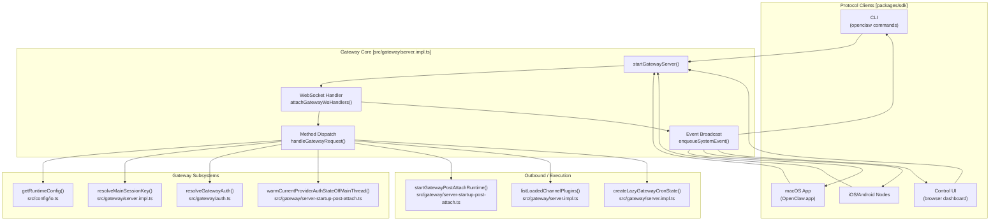

Sources: [src/gateway/server.impl.ts:58-112](), [src/gateway/server-startup-post-attach.ts:188-191](), [src/gateway/server.impl.ts:85-85]()

---

## Core Responsibilities

### 1. WebSocket Protocol Handling
The Gateway implements a JSON-based RPC protocol over WebSockets. Each client must perform a handshake and authorize scopes. [src/gateway/server.impl.ts:110-112]()

**Key protocol components:**
- **Handshake**: Managed via `attachGatewayWsHandlers` which handles the initial connection state and `ConnectParams`. [src/gateway/server.impl.ts:112-112]()
- **RPC Requests**: Clients issue method calls which are organized in `GATEWAY_EVENTS`. [src/gateway/server-methods-list.ts:88-88]()
- **Events**: Async notifications like `GATEWAY_EVENT_UPDATE_AVAILABLE` are pushed to connected clients. [src/gateway/server-startup-post-attach.ts:20-22]()

Sources: [src/gateway/server.impl.ts:112-112](), [src/gateway/server-methods-list.ts:88-88](), [src/gateway/server-startup-post-attach.ts:20-22]()

### 2. RPC Method Dispatch
The Gateway exposes method families organized by domain. Method handlers are registered in `createGatewayMethodRegistry` and supplemented by plugin-provided handlers. [src/gateway/methods/registry.ts:65-69]()

**Method categories and Scopes:**
- `operator.read`: Status, health, logs, and list methods. [src/gateway/methods/core-descriptors.ts:21-22]()
- `operator.write`: Actions that modify state or send messages. [src/gateway/methods/core-descriptors.ts:25-29]()
- `operator.admin`: High-privilege actions like configuration changes, restricted via `ADMIN_SCOPE`. [src/gateway/server.impl.ts:57-57]()

Sources: [src/gateway/methods/core-descriptors.ts:20-50](), [src/gateway/methods/registry.ts:63-69]()

### 3. Model Auth Pre-warming
To ensure low latency for agent responses, the Gateway pre-warms authentication states for configured model providers at startup and upon configuration reload. [src/gateway/server-startup-post-attach.ts:188-191]()

- **Warming Logic**: `warmCurrentProviderAuthStateOffMainThread` probes external CLIs and plugins to cache available credentials. [src/gateway/server-startup-post-attach.ts:190-191]()
- **Hot Reload**: The cache is cleared and re-warmed during hot-reload to ensure credentials remain fresh. [src/gateway/server-reload-handlers.ts:93-97]()

Sources: [src/gateway/server-startup-post-attach.ts:188-191](), [src/gateway/server-reload-handlers.ts:93-97]()

---

## Gateway Server Implementation

### Server Startup and Lifecycle

The Gateway startup is a multi-stage process involving early runtime initialization, plugin discovery, and post-ready maintenance tasks. [src/gateway/server-startup-post-attach.ts:109-115]()

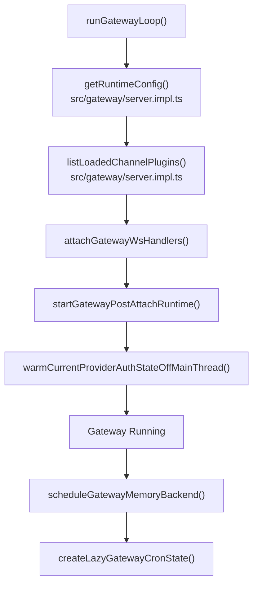

Sources: [src/gateway/server-startup-post-attach.ts:109-115](), [src/gateway/server.impl.ts:161-166](), [src/cli/gateway-cli/run-loop.ts:99-108]()

### Restart and Recovery

The Gateway handles graceful shutdowns and state recovery during restarts, particularly for agent runs that were interrupted.

- **Drain and Abort**: During shutdown, the Gateway attempts to drain pending tasks and abort active embedded agent runs. [src/cli/gateway-cli/run-loop.ts:19-21]()
- **Session Recovery**: The Gateway manages handoff state during restarts to preserve traces and session context. [src/gateway/server.impl.ts:34-35]()
- **Handoff Management**: `resumeGatewayRestartTraceFromHandoff` ensures that diagnostics continue across process boundaries. [src/gateway/server.impl.ts:81-81]()

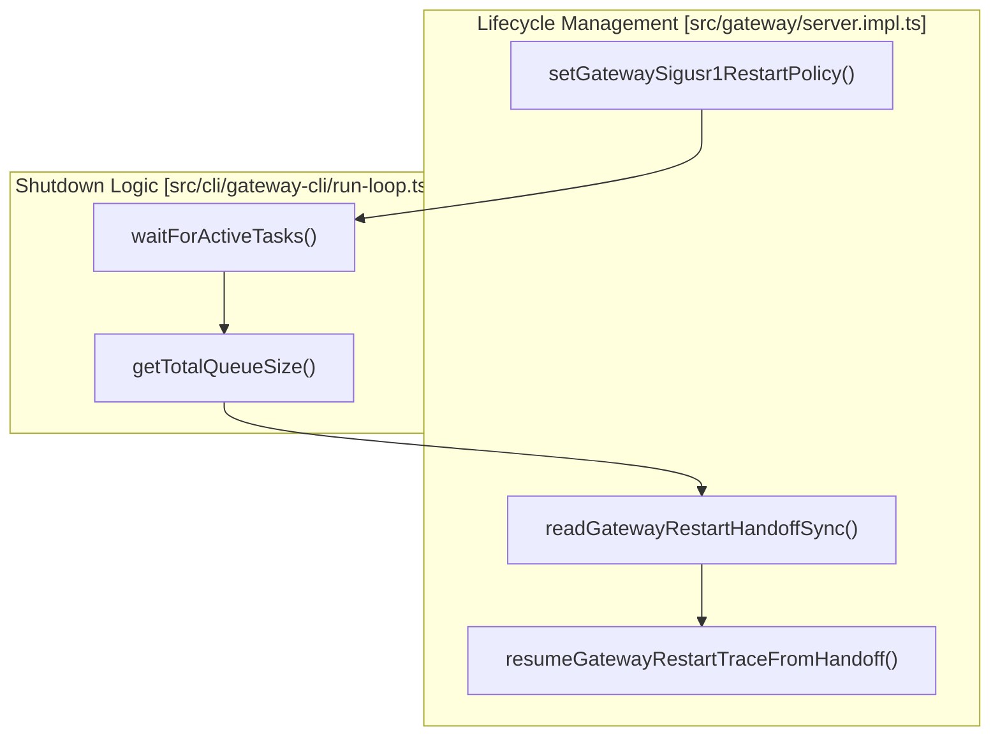

Sources: [src/gateway/server.impl.ts:34-83](), [src/cli/gateway-cli/run-loop.ts:18-23]()

### Session and Store Management

The Gateway maintains session state with specific scoping and persistence rules. [src/gateway/server.impl.ts:22-22]()

- **Store Management**: Session data is persisted to the state directory, with the Gateway coordinating concurrent access. [src/gateway/server-startup-post-attach.ts:36-36]()
- **Persistence**: Shared gateway session generations are enforced for configuration writes to maintain security. [src/gateway/server.impl.ts:94-97]()
- **State Organization**: State is organized under a dedicated directory resolved at runtime. [src/gateway/server-startup-post-attach.ts:7-7]()

Sources: [src/gateway/server.impl.ts:22-97](), [src/gateway/server-startup-post-attach.ts:7-36]()

---

## Summary

The Gateway is the orchestration layer for OpenClaw. It:
- Implements the WebSocket protocol for all clients. [src/gateway/server.impl.ts:112-112]()
- Dispatches RPC methods with scope-based authorization. [src/gateway/methods/registry.ts:65-69]()
- Manages the lifecycle of agent runs and pre-warms model authentication. [src/gateway/server-startup-post-attach.ts:188-191]()
- Coordinates session persistence and hot-reloading of configuration. [src/gateway/server-reload-handlers.ts:93-97]()

For operational details, see [Service Lifecycle & Diagnostics](#2.6).

---

# Page: WebSocket Protocol & RPC

# WebSocket Protocol & RPC

<details>
<summary>Relevant source files</summary>

The following files were used as context for generating this wiki page:

- [apps/android/app/src/main/java/ai/openclaw/app/gateway/GatewayProtocol.kt](apps/android/app/src/main/java/ai/openclaw/app/gateway/GatewayProtocol.kt)
- [apps/shared/OpenClawKit/Sources/OpenClawProtocol/GatewayModels.swift](apps/shared/OpenClawKit/Sources/OpenClawProtocol/GatewayModels.swift)
- [apps/shared/OpenClawKit/Sources/OpenClawProtocol/WakeParamsCompatibility.swift](apps/shared/OpenClawKit/Sources/OpenClawProtocol/WakeParamsCompatibility.swift)
- [docs/automation/hooks.md](docs/automation/hooks.md)
- [docs/gateway/protocol.md](docs/gateway/protocol.md)
- [docs/reference/AGENTS.default.md](docs/reference/AGENTS.default.md)
- [docs/reference/templates/AGENTS.md](docs/reference/templates/AGENTS.md)
- [packages/sdk/src/client.ts](packages/sdk/src/client.ts)
- [packages/sdk/src/index.test.ts](packages/sdk/src/index.test.ts)
- [packages/sdk/src/normalize.ts](packages/sdk/src/normalize.ts)
- [scripts/protocol-gen-swift.ts](scripts/protocol-gen-swift.ts)
- [skills/model-usage/SKILL.md](skills/model-usage/SKILL.md)
- [src/agents/agent-run-terminal-outcome.test.ts](src/agents/agent-run-terminal-outcome.test.ts)
- [src/agents/agent-run-terminal-outcome.ts](src/agents/agent-run-terminal-outcome.ts)
- [src/agents/model-ref-shared.test.ts](src/agents/model-ref-shared.test.ts)
- [src/agents/model-ref-shared.ts](src/agents/model-ref-shared.ts)
- [src/agents/run-wait.test.ts](src/agents/run-wait.test.ts)
- [src/agents/run-wait.ts](src/agents/run-wait.ts)
- [src/cli/gateway-cli/lifecycle.runtime.ts](src/cli/gateway-cli/lifecycle.runtime.ts)
- [src/cli/gateway-cli/run-loop.test.ts](src/cli/gateway-cli/run-loop.test.ts)
- [src/cli/gateway-cli/run-loop.ts](src/cli/gateway-cli/run-loop.ts)
- [src/cli/system-cli.test.ts](src/cli/system-cli.test.ts)
- [src/config/config.agent-concurrency-defaults.test.ts](src/config/config.agent-concurrency-defaults.test.ts)
- [src/config/cron-limits.ts](src/config/cron-limits.ts)
- [src/config/defaults.test.ts](src/config/defaults.test.ts)
- [src/config/defaults.ts](src/config/defaults.ts)
- [src/config/io.write-prepare.test.ts](src/config/io.write-prepare.test.ts)
- [src/config/io.write-prepare.ts](src/config/io.write-prepare.ts)
- [src/config/materialize.ts](src/config/materialize.ts)
- [src/config/model-alias-defaults.test.ts](src/config/model-alias-defaults.test.ts)
- [src/cron/service.ts](src/cron/service.ts)
- [src/cron/service/ops.ts](src/cron/service/ops.ts)
- [src/gateway/method-scopes.test.ts](src/gateway/method-scopes.test.ts)
- [src/gateway/method-scopes.ts](src/gateway/method-scopes.ts)
- [src/gateway/methods/core-descriptors.ts](src/gateway/methods/core-descriptors.ts)
- [src/gateway/methods/descriptor.ts](src/gateway/methods/descriptor.ts)
- [src/gateway/methods/registry.test.ts](src/gateway/methods/registry.test.ts)
- [src/gateway/methods/registry.ts](src/gateway/methods/registry.ts)
- [src/gateway/server-close.test.ts](src/gateway/server-close.test.ts)
- [src/gateway/server-close.ts](src/gateway/server-close.ts)
- [src/gateway/server-methods-list.test.ts](src/gateway/server-methods-list.test.ts)
- [src/gateway/server-methods-list.ts](src/gateway/server-methods-list.ts)
- [src/gateway/server-methods.ts](src/gateway/server-methods.ts)
- [src/gateway/server-methods/agent-job.ts](src/gateway/server-methods/agent-job.ts)
- [src/gateway/server-methods/agent-wait-dedupe.test.ts](src/gateway/server-methods/agent-wait-dedupe.test.ts)
- [src/gateway/server-methods/agent-wait-dedupe.ts](src/gateway/server-methods/agent-wait-dedupe.ts)
- [src/gateway/server-methods/models-auth-status.test.ts](src/gateway/server-methods/models-auth-status.test.ts)
- [src/gateway/server-methods/models-auth-status.ts](src/gateway/server-methods/models-auth-status.ts)
- [src/gateway/server-methods/server-methods.test.ts](src/gateway/server-methods/server-methods.test.ts)
- [src/gateway/server-reload-handlers.test.ts](src/gateway/server-reload-handlers.test.ts)
- [src/gateway/server-reload-handlers.ts](src/gateway/server-reload-handlers.ts)
- [src/gateway/server-startup-post-attach.test.ts](src/gateway/server-startup-post-attach.test.ts)
- [src/gateway/server-startup-post-attach.ts](src/gateway/server-startup-post-attach.ts)
- [src/gateway/server.impl.ts](src/gateway/server.impl.ts)
- [src/gateway/session-lifecycle-state.test.ts](src/gateway/session-lifecycle-state.test.ts)
- [src/gateway/session-lifecycle-state.ts](src/gateway/session-lifecycle-state.ts)
- [src/infra/agent-events.test.ts](src/infra/agent-events.test.ts)
- [src/infra/agent-events.ts](src/infra/agent-events.ts)
- [src/infra/infra-runtime.test.ts](src/infra/infra-runtime.test.ts)
- [src/infra/restart.deferral-timeout.test.ts](src/infra/restart.deferral-timeout.test.ts)
- [src/infra/restart.ts](src/infra/restart.ts)
- [src/plugins/provider-auth-choice-helpers.test.ts](src/plugins/provider-auth-choice-helpers.test.ts)
- [src/plugins/provider-auth-choice-helpers.ts](src/plugins/provider-auth-choice-helpers.ts)

</details>


The Gateway WebSocket protocol defines how clients communicate with the Gateway server using a JSON-based RPC (Remote Procedure Call) system. This page documents protocol version 4, including frame structures, the 30+ RPC methods available, and the authorization system with Swift code generation.

## Protocol Architecture

The Gateway protocol is a bidirectional WebSocket protocol with four core message types: connect frames (client handshake), request frames (client→server), response frames (server→client), and event frames (server→client push notifications). All messages are JSON-encoded and validated against schemas defined using TypeBox.

### System Architecture & Code Entities

The following diagram bridges the protocol concepts to the specific code entities implementing them, highlighting the flow from WebSocket message handling to method dispatch.

Title: Gateway Protocol Implementation Map
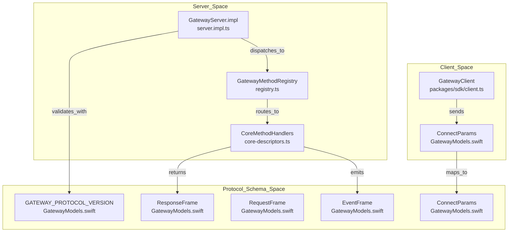

Sources: [apps/shared/OpenClawKit/Sources/OpenClawProtocol/GatewayModels.swift:5-207](), [src/gateway/methods/registry.ts:63-70](), [src/gateway/server.impl.ts:60-70](), [src/gateway/methods/core-descriptors.ts:60-67](), [packages/sdk/src/client.ts:1-50]()

## Frame Types

The protocol defines four core frame types used for communication. All frames are validated against the schema source of truth via TypeBox, which is then used to generate Swift models [apps/shared/OpenClawKit/Sources/OpenClawProtocol/GatewayModels.swift:1]().

### ConnectParams (Handshake)

The initial message sent by a client immediately after establishing the WebSocket connection. It includes protocol version negotiation and authentication [apps/shared/OpenClawKit/Sources/OpenClawProtocol/GatewayModels.swift:49-109]().

| Field | Type | Required | Description |
|-------|------|----------|-------------|
| `minProtocol` | `Int` | Yes | Minimum protocol version supported by client [apps/shared/OpenClawKit/Sources/OpenClawProtocol/GatewayModels.swift:50]() |
| `maxProtocol` | `Int` | Yes | Maximum protocol version supported by client [apps/shared/OpenClawKit/Sources/OpenClawProtocol/GatewayModels.swift:51]() |
| `client` | `[String: AnyCodable]` | Yes | Client metadata (id, version, platform) [apps/shared/OpenClawKit/Sources/OpenClawProtocol/GatewayModels.swift:52]() |
| `auth` | `[String: AnyCodable]` | No | Credentials: token or password [apps/shared/OpenClawKit/Sources/OpenClawProtocol/GatewayModels.swift:60]() |
| `role` | `String` | No | Requested role (e.g., operator, node) [apps/shared/OpenClawKit/Sources/OpenClawProtocol/GatewayModels.swift:57]() |
| `scopes` | `[String]`| No | Requested permission scopes [apps/shared/OpenClawKit/Sources/OpenClawProtocol/GatewayModels.swift:58]() |

Sources: [apps/shared/OpenClawKit/Sources/OpenClawProtocol/GatewayModels.swift:49-109]()

### RequestFrame (RPC Call)

Used by clients to invoke server-side methods. It includes a unique `id` for correlation and a `method` name [apps/shared/OpenClawKit/Sources/OpenClawProtocol/GatewayModels.swift:153-177]().

```json
{
  "type": "req",
  "id": "uuid-123",
  "method": "agent.send",
  "params": {
    "text": "Hello agent"
  }
}
```

Sources: [apps/shared/OpenClawKit/Sources/OpenClawProtocol/GatewayModels.swift:153-177]()

### ResponseFrame (RPC Result)

The server's response to a `RequestFrame`, correlated by the `id`. It indicates success via the `ok` boolean [apps/shared/OpenClawKit/Sources/OpenClawProtocol/GatewayModels.swift:179-207]().

```json
{
  "type": "res",
  "id": "uuid-123",
  "ok": true,
  "payload": { "status": "processing" }
}
```

Sources: [apps/shared/OpenClawKit/Sources/OpenClawProtocol/GatewayModels.swift:179-207]()

### EventFrame (Server Push)

Server-initiated messages for streaming or status updates. Optional `seq` and `stateVersion` fields assist with synchronization [apps/shared/OpenClawKit/Sources/OpenClawProtocol/GatewayModels.swift:209-237]().

```json
{
  "type": "event",
  "event": "agent.delta",
  "payload": { "text": " thinking..." },
  "stateVersion": { "presence": 10 }
}
```

Sources: [apps/shared/OpenClawKit/Sources/OpenClawProtocol/GatewayModels.swift:209-237]()

## RPC Methods & Implementation

The Gateway exposes over 30 RPC methods. Core methods are registered via `createCoreGatewayMethodDescriptors` [src/gateway/methods/registry.ts:63]().

### Core Method Handlers

Methods are organized into functional groups such as agent interaction, chat management, and session control [src/gateway/server-methods-list.ts:1-20]().

- **Agent Interaction**: `agent.send` and `agent.wait` handle message ingestion and long-polling for terminal responses [src/agents/run-wait.ts:202-219](). `waitForAgentJob` manages the lifecycle of these requests, mapping lifecycle end events to terminal statuses [src/gateway/server-methods/agent-job.ts:27-111]().
- **Chat Management**: `chat.send` and `chat.history` provide high-level chat abstractions [src/gateway/server-methods/server-methods.test.ts:25-37]().
- **Presence & Health**: `server.health` and presence versioning provide visibility into system state [src/gateway/server.impl.ts:101-107]().

### Steering Queue & Delivery

For active-run message delivery, the Gateway manages an internal steering queue and event handling system.

- **Deduplication**: Idempotency is managed for agent operations to prevent duplicate execution on retry via `setGatewayDedupeEntry` [src/gateway/server-methods/agent-wait-dedupe.ts:20]().
- **Presence**: `PresenceEntry` returns entries keyed by device identity for UI visibility, including versioning via `presenceVersion` [apps/shared/OpenClawKit/Sources/OpenClawProtocol/GatewayModels.swift:239-256](), [src/gateway/server.impl.ts:104-105]().
- **Safe Restart & Draining**: The Gateway can defer restarts if active work is in progress. The `runGatewayLoop` uses `waitForActiveTasks` and `waitForActiveEmbeddedRuns` to ensure a clean handoff or shutdown [src/cli/gateway-cli/run-loop.ts:124-180](). It specifically checks `getActiveEmbeddedRunCount` to avoid interrupting LLM interactions [src/gateway/server.impl.ts:3]().

Sources: [src/gateway/server.impl.ts:2-106](), [apps/shared/OpenClawKit/Sources/OpenClawProtocol/GatewayModels.swift:239-256](), [src/agents/run-wait.ts:195-227](), [src/cli/gateway-cli/run-loop.ts:124-180]()

## TypeBox & Schema Validation

TypeBox serves as the source of truth for the protocol. Every inbound request is validated against these schemas before dispatching to the appropriate handler [scripts/protocol-gen-swift.ts:8-9]().

Title: Schema Validation and Code Generation Flow
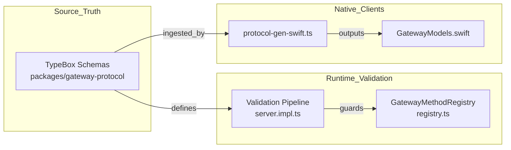

Sources: [scripts/protocol-gen-swift.ts:1-10](), [src/gateway/methods/registry.ts:60-70](), [src/gateway/server.impl.ts:60-70]()

## Swift Code Generation

To maintain parity between the TypeScript Gateway and native clients (iOS/macOS), TypeBox schemas are used to generate Swift models [apps/shared/OpenClawKit/Sources/OpenClawProtocol/GatewayModels.swift:1]().

- **Generation Script**: `scripts/protocol-gen-swift.ts` iterates over `ProtocolSchemas` to produce native Swift types [scripts/protocol-gen-swift.ts:1-40](). It handles mapping TypeScript types to Swift `struct` and `enum` declarations, including special handling for optional parameters in initializers [scripts/protocol-gen-swift.ts:43-81]().
- **Protocol Parity**: Both Swift and TypeScript define `GATEWAY_PROTOCOL_VERSION = 4` [apps/shared/OpenClawKit/Sources/OpenClawProtocol/GatewayModels.swift:5]().
- **Native Types**: Generates `struct` and `enum` types with `Codable` and `Sendable` conformance for thread-safe native use [apps/shared/OpenClawKit/Sources/OpenClawProtocol/GatewayModels.swift:23-237]().

Sources: [apps/shared/OpenClawKit/Sources/OpenClawProtocol/GatewayModels.swift:1-237](), [scripts/protocol-gen-swift.ts:1-186]()

## Error Handling

Errors are returned in a standard format using `ErrorCode` enums, providing clear failure reasons for the client [apps/shared/OpenClawKit/Sources/OpenClawProtocol/GatewayModels.swift:23-30]().

| Code | Description |
|------|-------------|
| `NOT_LINKED` | Client is not linked to a session or agent. [apps/shared/OpenClawKit/Sources/OpenClawProtocol/GatewayModels.swift:24]() |
| `NOT_PAIRED` | Device pairing is missing or invalid. [apps/shared/OpenClawKit/Sources/OpenClawProtocol/GatewayModels.swift:25]() |
| `AGENT_TIMEOUT` | The agent failed to respond within the connection budget. [apps/shared/OpenClawKit/Sources/OpenClawProtocol/GatewayModels.swift:26]() |
| `INVALID_REQUEST` | The RPC parameters failed schema validation. [apps/shared/OpenClawKit/Sources/OpenClawProtocol/GatewayModels.swift:27]() |
| `APPROVAL_NOT_FOUND` | Requested approval ID does not exist or has expired. [apps/shared/OpenClawKit/Sources/OpenClawProtocol/GatewayModels.swift:28]() |
| `UNAVAILABLE` | The requested service or agent is temporarily unavailable. [apps/shared/OpenClawKit/Sources/OpenClawProtocol/GatewayModels.swift:29]() |

Sources: [apps/shared/OpenClawKit/Sources/OpenClawProtocol/GatewayModels.swift:23-30]()

---

# Page: Authentication & Authorization

# Authentication & Authorization

<details>
<summary>Relevant source files</summary>

The following files were used as context for generating this wiki page:

- [docs/automation/hooks.md](docs/automation/hooks.md)
- [docs/reference/AGENTS.default.md](docs/reference/AGENTS.default.md)
- [docs/reference/templates/AGENTS.md](docs/reference/templates/AGENTS.md)
- [extensions/feishu/src/app-registration.test.ts](extensions/feishu/src/app-registration.test.ts)
- [extensions/feishu/src/app-registration.ts](extensions/feishu/src/app-registration.ts)
- [extensions/memory-core/cli-metadata.ts](extensions/memory-core/cli-metadata.ts)
- [extensions/memory-core/cli.ts](extensions/memory-core/cli.ts)
- [extensions/telegram/src/bot.create-telegram-bot.test.ts](extensions/telegram/src/bot.create-telegram-bot.test.ts)
- [extensions/whatsapp/src/auth-store.ts](extensions/whatsapp/src/auth-store.ts)
- [extensions/whatsapp/src/creds-files.ts](extensions/whatsapp/src/creds-files.ts)
- [extensions/whatsapp/src/creds-persistence.test.ts](extensions/whatsapp/src/creds-persistence.test.ts)
- [extensions/whatsapp/src/creds-persistence.ts](extensions/whatsapp/src/creds-persistence.ts)
- [extensions/whatsapp/src/login.coverage.test.ts](extensions/whatsapp/src/login.coverage.test.ts)
- [extensions/whatsapp/src/login.ts](extensions/whatsapp/src/login.ts)
- [extensions/whatsapp/src/session.test.ts](extensions/whatsapp/src/session.test.ts)
- [extensions/whatsapp/src/session.ts](extensions/whatsapp/src/session.ts)
- [scripts/repro/cli-web-search-secret-refs-live-proof.mjs](scripts/repro/cli-web-search-secret-refs-live-proof.mjs)
- [skills/model-usage/SKILL.md](skills/model-usage/SKILL.md)
- [src/acp/client-helpers.ts](src/acp/client-helpers.ts)
- [src/acp/client.test.ts](src/acp/client.test.ts)
- [src/agents/model-auth-env-vars.ts](src/agents/model-auth-env-vars.ts)
- [src/agents/models-config.providers.moonshot.test.ts](src/agents/models-config.providers.moonshot.test.ts)
- [src/agents/models-config.providers.nvidia.test.ts](src/agents/models-config.providers.nvidia.test.ts)
- [src/agents/models-config.runtime-source-snapshot.test.ts](src/agents/models-config.runtime-source-snapshot.test.ts)
- [src/cli/capability-cli.test.ts](src/cli/capability-cli.test.ts)
- [src/cli/capability-cli.ts](src/cli/capability-cli.ts)
- [src/cli/command-config-resolution.test.ts](src/cli/command-config-resolution.test.ts)
- [src/cli/command-config-resolution.ts](src/cli/command-config-resolution.ts)
- [src/cli/command-secret-gateway.test.ts](src/cli/command-secret-gateway.test.ts)
- [src/cli/command-secret-gateway.ts](src/cli/command-secret-gateway.ts)
- [src/cli/command-secret-resolution.coverage.test.ts](src/cli/command-secret-resolution.coverage.test.ts)
- [src/cli/command-secret-targets.import.test.ts](src/cli/command-secret-targets.import.test.ts)
- [src/cli/command-secret-targets.test.ts](src/cli/command-secret-targets.test.ts)
- [src/cli/command-secret-targets.ts](src/cli/command-secret-targets.ts)
- [src/cli/gateway-cli/lifecycle.runtime.ts](src/cli/gateway-cli/lifecycle.runtime.ts)
- [src/cli/gateway-cli/run-loop.test.ts](src/cli/gateway-cli/run-loop.test.ts)
- [src/cli/gateway-cli/run-loop.ts](src/cli/gateway-cli/run-loop.ts)
- [src/cli/qr-cli.ts](src/cli/qr-cli.ts)
- [src/commands/models/load-config.test.ts](src/commands/models/load-config.test.ts)
- [src/commands/models/load-config.ts](src/commands/models/load-config.ts)
- [src/gateway/method-scopes.test.ts](src/gateway/method-scopes.test.ts)
- [src/gateway/method-scopes.ts](src/gateway/method-scopes.ts)
- [src/gateway/methods/core-descriptors.ts](src/gateway/methods/core-descriptors.ts)
- [src/gateway/methods/descriptor.ts](src/gateway/methods/descriptor.ts)
- [src/gateway/methods/registry.test.ts](src/gateway/methods/registry.test.ts)
- [src/gateway/methods/registry.ts](src/gateway/methods/registry.ts)
- [src/gateway/server-aux-handlers.ts](src/gateway/server-aux-handlers.ts)
- [src/gateway/server-close.test.ts](src/gateway/server-close.test.ts)
- [src/gateway/server-close.ts](src/gateway/server-close.ts)
- [src/gateway/server-methods-list.test.ts](src/gateway/server-methods-list.test.ts)
- [src/gateway/server-methods-list.ts](src/gateway/server-methods-list.ts)
- [src/gateway/server-methods.ts](src/gateway/server-methods.ts)
- [src/gateway/server-methods/models-auth-status.test.ts](src/gateway/server-methods/models-auth-status.test.ts)
- [src/gateway/server-methods/models-auth-status.ts](src/gateway/server-methods/models-auth-status.ts)
- [src/gateway/server-methods/secrets.ts](src/gateway/server-methods/secrets.ts)
- [src/gateway/server-reload-handlers.test.ts](src/gateway/server-reload-handlers.test.ts)
- [src/gateway/server-reload-handlers.ts](src/gateway/server-reload-handlers.ts)
- [src/gateway/server-startup-post-attach.test.ts](src/gateway/server-startup-post-attach.test.ts)
- [src/gateway/server-startup-post-attach.ts](src/gateway/server-startup-post-attach.ts)
- [src/gateway/server.device-token-rotate-authz.test.ts](src/gateway/server.device-token-rotate-authz.test.ts)
- [src/gateway/server.impl.ts](src/gateway/server.impl.ts)
- [src/gateway/server.node-pairing-authz.test.ts](src/gateway/server.node-pairing-authz.test.ts)
- [src/infra/fs-safe.ts](src/infra/fs-safe.ts)
- [src/infra/infra-runtime.test.ts](src/infra/infra-runtime.test.ts)
- [src/infra/restart.deferral-timeout.test.ts](src/infra/restart.deferral-timeout.test.ts)
- [src/infra/restart.ts](src/infra/restart.ts)
- [src/infra/transport-ready.test.ts](src/infra/transport-ready.test.ts)
- [src/infra/transport-ready.ts](src/infra/transport-ready.ts)
- [src/media/qr-terminal.render.test.ts](src/media/qr-terminal.render.test.ts)
- [src/media/qr-terminal.test.ts](src/media/qr-terminal.test.ts)
- [src/media/qr-terminal.ts](src/media/qr-terminal.ts)
- [src/plugin-sdk/channel-test-helpers.ts](src/plugin-sdk/channel-test-helpers.ts)
- [src/plugin-sdk/security-runtime.ts](src/plugin-sdk/security-runtime.ts)
- [src/secrets/runtime-command-secrets.test.ts](src/secrets/runtime-command-secrets.test.ts)
- [src/secrets/runtime-command-secrets.ts](src/secrets/runtime-command-secrets.ts)
- [src/types/qrcode.d.ts](src/types/qrcode.d.ts)

</details>


This page explains how the OpenClaw Gateway authenticates clients and authorizes access to RPC methods and HTTP surfaces. The system implements a multi-layered security model centered around a single trusted operator managing a personal AI assistant infrastructure.

---

## Overview

OpenClaw security guidance assumes a **personal assistant** deployment: one trusted operator boundary, potentially many agents. It assumes a single trusted operator who may manage multiple agents and devices.

1.  **Transport Authentication**: Proving identity to the Gateway (token, password, or none) at the connection level [src/gateway/auth.ts:15-30]().
2.  **Protocol Handshake**: Validating client identity and requested scopes during the connection exchange.
3.  **Method Authorization**: Controlling RPC access via granular scopes (READ, WRITE, ADMIN, PAIRING, APPROVALS) [src/gateway/auth.ts:133-145]().
4.  **Rate Limiting**: Protecting the control plane via auth throttling and budget management [src/gateway/auth-rate-limit.ts:55-56]().
5.  **Sensitive Data Redaction**: Automatic scrubbing of identifiers and secrets from logs [src/agents/openai-transport-stream.ts:27-28]().

**Sources**: [src/gateway/auth.ts:15-145](), [src/agents/openai-transport-stream.ts:27-28](), [src/gateway/auth-rate-limit.ts:55-56]()

---

## Authentication Modes

The Gateway supports several authentication modes resolved by `resolveGatewayAuth` from the configuration [src/gateway/auth.ts:15-15]().

| Mode | Description | Implementation Detail |
| :--- | :--- | :--- |
| **Token** | Static bearer token authentication | Validated against `gateway.auth.token` [src/gateway/auth.ts:27-27](). |
| **Password** | Shared password authentication | Configured in `gateway.auth.password` [src/gateway/auth.ts:28-28](). |
| **None** | Unauthenticated access | Explicitly set via `mode: "none"` [src/gateway/auth.ts:26-26](). |
| **Trusted Proxy** | Identity-bearing HTTP auth | Relies on an upstream proxy to inject identity headers [docs/gateway/openai-http-api.md:32-34](). |

### Authentication Resolution

The Gateway determines the authentication state by evaluating configuration against the environment. For automated installations, the system handles the logic of finding existing tokens or auto-generating new ones if missing.

**Gateway Connection Auth Flow**
```mermaid
graph TD
    subgraph "AuthEntry [src/gateway/auth.ts]"
        "WS_Conn"["WebSocket Connection"] --> "ResolveAuth"["resolveGatewayAuth()"]
        "ResolveAuth" --> "ModeCheck"{"Auth Mode?"}
    end

    subgraph "Validation [src/gateway/auth.ts]"
        "ModeCheck" -- "token" --> "TokenVal"["Validate gateway.auth.token"]
        "ModeCheck" -- "password" --> "PassVal"["Validate gateway.auth.password"]
        "ModeCheck" -- "none" --> "AllowAll"["Grant Access"]
    end

    subgraph "RoleResolution"
        "TokenVal" --> "AssignRole"["Assign ResolvedGatewayAuth"]
        "PassVal" --> "AssignRole"
        "AssignRole" --> "ScopeCheck"["Authorize Scopes"]
    end
```
**Sources**: [src/gateway/auth.ts:15-30](), [docs/gateway/openai-http-api.md:32-34]()

---

## Authorization Scopes

OpenClaw enforces scope-based access control for Gateway RPC methods. Scopes define the granular permissions required to execute specific operations.

| Scope | Purpose | Implementation Reference |
| :--- | :--- | :--- |
| `operator.read` | Read-only access to state and sessions. | [src/gateway/auth.ts:134-134]() |
| `operator.write` | Permission to modify state, run agents, or chat. | [src/gateway/auth.ts:135-135]() |
| `operator.admin` | Full administrative access, including config changes. | [src/gateway/auth.ts:133-133]() |
| `operator.pairing` | Permission to pair new devices. | [src/gateway/auth.ts:136-136]() |
| `operator.approvals`| Permission to resolve tool execution approvals. | [src/gateway/auth.ts:137-137]() |

### Scope Enforcement

The system uses a hierarchy where `ADMIN_SCOPE` effectively grants all other permissions [src/gateway/auth.ts:133-133](). Core gateway methods are classified in `CORE_GATEWAY_METHOD_SPECS` with their required scopes [src/gateway/methods/core-descriptors.ts:20-134](). For example, `config.set` requires `operator.admin` [src/gateway/methods/core-descriptors.ts:48-48](), while `health` only requires `operator.read` [src/gateway/methods/core-descriptors.ts:21-21]().

For the OpenAI-compatible HTTP surface, the Gateway applies specific logic:
- If using `token` or `password` auth, it restores the full operator default scope set, ignoring narrower `x-openclaw-scopes` headers [docs/gateway/openai-http-api.md:66-72]().
- Trusted identity modes (like `trusted-proxy`) honor the `x-openclaw-scopes` header when present [docs/gateway/openai-http-api.md:73-77]().

**Authorization Entity Mapping**
```mermaid
classDiagram
    class "ResolvedGatewayAuth"["src/gateway/auth.ts"] {
        +mode: "token" | "password" | "none"
        +token?: string
        +password?: string
        +allowTailscale: boolean
    }
    class "GatewayScopes"["src/gateway/auth.ts"] {
        +ADMIN_SCOPE: "operator.admin"
        +READ_SCOPE: "operator.read"
        +WRITE_SCOPE: "operator.write"
        +PAIRING_SCOPE: "operator.pairing"
        +APPROVALS_SCOPE: "operator.approvals"
    }
    class "CoreGatewayMethodSpec"["src/gateway/methods/core-descriptors.ts"] {
        +name: string
        +scope: GatewayMethodScope
        +controlPlaneWrite?: boolean
    }
    
    "ResolvedGatewayAuth" ..> "GatewayScopes" : "authorized via"
    "CoreGatewayMethodSpec" ..> "GatewayScopes" : "maps to"
```
**Sources**: [src/gateway/auth.ts:130-145](), [src/gateway/methods/core-descriptors.ts:20-134](), [docs/gateway/openai-http-api.md:66-77]()

---

## Device Pairing and Token Rotation

### Device Pairing
Remote nodes establish trust through pairing. This process is governed by the `operator.pairing` scope [src/gateway/auth.ts:136-136](). Mobile clients are encouraged to use the device-pairing flow so they do not need to store shared HTTP tokens [docs/gateway/openai-http-api.md:86-87](). The `node` scope is also used for specific node-to-gateway operations like `skills.bins` [src/gateway/methods/core-descriptors.ts:116-116]().

### Shared Auth Generation
The Gateway manages `SharedGatewaySessionGenerationState` to handle client session validity across configuration reloads [src/gateway/server-shared-auth-generation.ts:93-98](). When configuration changes, `disconnectStaleSharedGatewayAuthClients` ensures that clients using outdated credentials are forced to re-authenticate [src/gateway/server-reload-handlers.ts:50-54](). The generation is updated via `setCurrentSharedGatewaySessionGeneration` during config writes [src/gateway/server-shared-auth-generation.ts:51-51]().

### Internal Handoffs
For sensitive operations like bash tool execution approvals, the system uses internal runtime handoff tokens. Followup results register elevated defaults behind internal tokens to maintain the security boundary [src/agents/bash-tools.exec-host-shared.test.ts:133-150]().

**Sources**: [src/gateway/auth.ts:136-136](), [src/gateway/server-shared-auth-generation.ts:93-98](), [src/gateway/server-reload-handlers.ts:50-54](), [src/gateway/methods/core-descriptors.ts:116-116]()

---

## Provider Authentication Warming

The Gateway performs "warming" of model provider authentication states to ensure high performance during model listing and selection. This avoids expensive external CLI probing or plugin discovery on the request hot path.

- **Warming Process**: Triggered at startup [src/gateway/server-startup-post-attach.ts:179-186]() and during hot reloads [src/gateway/server-reload-handlers.ts:93-97]().
- **Implementation**: `warmCurrentProviderAuthState` populates a `PreparedProviderAuthState` map [src/agents/model-provider-auth.ts:85-89]().
- **Worker Isolation**: Large-scale auth discovery can be offloaded to a worker thread via `warmCurrentProviderAuthStateOffMainThread` to prevent blocking the event loop [src/agents/model-provider-auth.ts:70-78]().
- **Fingerprinting**: Cached states are tied to a `configFingerprint` to ensure they are invalidated if the `OpenClawConfig` changes [src/agents/model-provider-auth.ts:131-142]().

**Auth Warming Data Flow**
```mermaid
graph LR
    subgraph "Discovery [src/agents/model-provider-auth.ts]"
        "Config"["OpenClawConfig"] --> "Warmer"["warmCurrentProviderAuthState()"]
        "Warmer" --> "Worker"["Worker Thread"]
    end

    subgraph "Validation [src/agents/model-auth.ts]"
        "Worker" --> "AuthCheck"["hasRuntimeAvailableProviderAuth()"]
        "AuthCheck" --> "Result"["[Provider, HasAuth]"]
    end

    subgraph "Cache [src/agents/model-provider-auth.ts]"
        "Result" --> "StateMap"["currentProviderAuthStates"]
        "StateMap" -- "consulted by" --> "HasAuthCall"["hasAuthForModelProvider()"]
    end
```

**Sources**: [src/agents/model-provider-auth.ts:30-48](), [src/agents/model-provider-auth.ts:85-156](), [src/gateway/server-startup-post-attach.ts:179-186](), [src/gateway/server-reload-handlers.ts:93-97]()

---

## Rate Limiting & Safety Guards

The Gateway implements several layers of protection:

1.  **Auth Rate Limiter**: The `AuthRateLimiter` class tracks authentication attempts to prevent brute-force attacks [src/gateway/auth-rate-limit.ts:56-56](). If `gateway.auth.rateLimit` is configured, too many failures result in a `429 Too Many Requests` response [docs/gateway/openai-http-api.md:49-49]().
2.  **Secret Redaction**: Transport payloads are scrubbed using redaction utilities to prevent leaking API keys or internal request IDs in logs [src/agents/openai-transport-stream.ts:27-28]().
3.  **SSRF Protection**: Outbound requests from the agent runtime are wrapped in `buildGuardedModelFetch` to prevent Server-Side Request Forgery [src/agents/openai-transport-stream.ts:67-68]().
4.  **Event Loop Health**: The `createGatewayEventLoopHealthMonitor` ensures the Gateway remains responsive under load, which is critical for maintaining auth verification performance [src/gateway/server.impl.ts:99-99]().

**Sources**: [src/gateway/auth-rate-limit.ts:56-56](), [docs/gateway/openai-http-api.md:49-49](), [src/agents/openai-transport-stream.ts:27-68](), [src/gateway/server.impl.ts:99-99]()

---

# Page: Configuration System

# Configuration System

<details>
<summary>Relevant source files</summary>

The following files were used as context for generating this wiki page:

- [docs/.generated/config-baseline.sha256](docs/.generated/config-baseline.sha256)
- [docs/channels/discord.md](docs/channels/discord.md)
- [docs/cli/mcp.md](docs/cli/mcp.md)
- [docs/web/control-ui.md](docs/web/control-ui.md)
- [extensions/codex/src/app-server/attempt-startup.ts](extensions/codex/src/app-server/attempt-startup.ts)
- [extensions/discord/src/config-schema.test.ts](extensions/discord/src/config-schema.test.ts)
- [extensions/discord/src/config-ui-hints.ts](extensions/discord/src/config-ui-hints.ts)
- [extensions/discord/src/voice/manager.e2e.test.ts](extensions/discord/src/voice/manager.e2e.test.ts)
- [extensions/discord/src/voice/manager.ts](extensions/discord/src/voice/manager.ts)
- [extensions/discord/src/voice/realtime.ts](extensions/discord/src/voice/realtime.ts)
- [src/agents/agent-scope-config.ts](src/agents/agent-scope-config.ts)
- [src/agents/openai-routing.test.ts](src/agents/openai-routing.test.ts)
- [src/agents/openai-routing.ts](src/agents/openai-routing.ts)
- [src/cli/plugins-install-record-commit.ts](src/cli/plugins-install-record-commit.ts)
- [src/commands/agent-command.test-mocks.ts](src/commands/agent-command.test-mocks.ts)
- [src/commands/agents.bind.test-support.ts](src/commands/agents.bind.test-support.ts)
- [src/commands/doctor-disk-space.test.ts](src/commands/doctor-disk-space.test.ts)
- [src/commands/doctor-disk-space.ts](src/commands/doctor-disk-space.ts)
- [src/commands/doctor-lint.test.ts](src/commands/doctor-lint.test.ts)
- [src/commands/doctor/shared/codex-route-warnings.test.ts](src/commands/doctor/shared/codex-route-warnings.test.ts)
- [src/commands/doctor/shared/codex-route-warnings.ts](src/commands/doctor/shared/codex-route-warnings.ts)
- [src/commands/doctor/shared/stale-plugin-config.test.ts](src/commands/doctor/shared/stale-plugin-config.test.ts)
- [src/commands/doctor/shared/stale-plugin-config.ts](src/commands/doctor/shared/stale-plugin-config.ts)
- [src/config/bundled-channel-config-metadata.generated.ts](src/config/bundled-channel-config-metadata.generated.ts)
- [src/config/codex-plugin-diagnostics.ts](src/config/codex-plugin-diagnostics.ts)
- [src/config/config.plugin-validation.test.ts](src/config/config.plugin-validation.test.ts)
- [src/config/config.ts](src/config/config.ts)
- [src/config/doc-baseline.integration.test.ts](src/config/doc-baseline.integration.test.ts)
- [src/config/io.ts](src/config/io.ts)
- [src/config/io.write-config.test.ts](src/config/io.write-config.test.ts)
- [src/config/mutate.test.ts](src/config/mutate.test.ts)
- [src/config/mutate.ts](src/config/mutate.ts)
- [src/config/runtime-snapshot.ts](src/config/runtime-snapshot.ts)
- [src/config/schema.help.ts](src/config/schema.help.ts)
- [src/config/schema.labels.ts](src/config/schema.labels.ts)
- [src/config/schema.test.ts](src/config/schema.test.ts)
- [src/config/session-parent-fork-config-keys.test.ts](src/config/session-parent-fork-config-keys.test.ts)
- [src/config/types.agents.ts](src/config/types.agents.ts)
- [src/config/types.discord.ts](src/config/types.discord.ts)
- [src/config/types.mcp.ts](src/config/types.mcp.ts)
- [src/config/types.tools.ts](src/config/types.tools.ts)
- [src/config/validation.ts](src/config/validation.ts)
- [src/config/zod-schema.agent-defaults.test.ts](src/config/zod-schema.agent-defaults.test.ts)
- [src/config/zod-schema.agent-runtime.ts](src/config/zod-schema.agent-runtime.ts)
- [src/config/zod-schema.providers-core.ts](src/config/zod-schema.providers-core.ts)
- [src/config/zod-schema.ts](src/config/zod-schema.ts)
- [src/flows/doctor-core-checks.test.ts](src/flows/doctor-core-checks.test.ts)
- [src/flows/doctor-core-checks.ts](src/flows/doctor-core-checks.ts)
- [src/flows/doctor-health-contributions.test.ts](src/flows/doctor-health-contributions.test.ts)
- [src/flows/doctor-health-contributions.ts](src/flows/doctor-health-contributions.ts)
- [src/flows/doctor-health-conversion-plan.ts](src/flows/doctor-health-conversion-plan.ts)
- [src/flows/doctor-lint-flow.ts](src/flows/doctor-lint-flow.ts)
- [src/gateway/server-methods/config-write-flow.ts](src/gateway/server-methods/config-write-flow.ts)
- [src/gateway/server-methods/config.shared-auth.test.ts](src/gateway/server-methods/config.shared-auth.test.ts)
- [src/gateway/server-startup-config.ts](src/gateway/server-startup-config.ts)
- [src/infra/push-web.test.ts](src/infra/push-web.test.ts)
- [src/infra/push-web.ts](src/infra/push-web.ts)
- [src/secrets/runtime-fast-path.ts](src/secrets/runtime-fast-path.ts)
- [src/secrets/runtime-request-secret-refs.test.ts](src/secrets/runtime-request-secret-refs.test.ts)
- [src/secrets/runtime-secret-scan.ts](src/secrets/runtime-secret-scan.ts)
- [src/secrets/runtime-web-tools.test.ts](src/secrets/runtime-web-tools.test.ts)
- [src/secrets/runtime-web-tools.ts](src/secrets/runtime-web-tools.ts)
- [src/secrets/runtime.gateway-auth.integration.test.ts](src/secrets/runtime.gateway-auth.integration.test.ts)
- [src/secrets/runtime.test.ts](src/secrets/runtime.test.ts)
- [src/secrets/runtime.ts](src/secrets/runtime.ts)

</details>


The Configuration System provides runtime configuration loading, validation, hot-reload, and management for the OpenClaw gateway and all its subsystems (channels, agents, tools, models, etc.). It reads configuration from `~/.openclaw/openclaw.json` in **JSON5** format [src/config/paths.ts:21-21](), validates it against a strict **Zod schema** [src/config/zod-schema.ts:1-1](), resolves secrets, and exposes a runtime snapshot to all gateway components. The system supports programmatic updates via transactional mutations and automatic migration from legacy formats through the `doctor` utility.

For channel-specific configuration patterns, see [Messaging Channels](#4). For agent and model configuration, see [Agent Runtime](#3). For the complete field reference, see page [Configuration Reference](#2.3.1).

---

## Architecture Overview

The configuration system operates as a multi-stage pipeline that transforms raw JSON5 files into a validated, resolved runtime snapshot. It integrates core configuration with plugin-provided schemas to create a unified state.

### Configuration Loading & Validation Flow

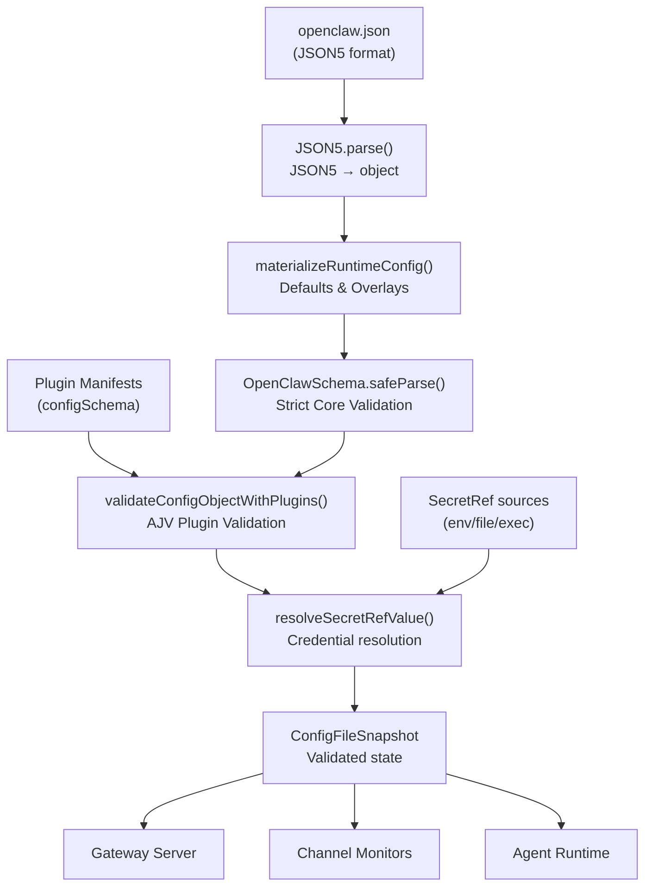
Sources: [src/config/io.ts:5-81](), [src/config/validation.ts:42-47](), [src/config/io.ts:111-114]()

---

## Core Configuration Modules

### Config I/O and Validation

The primary validation engine is built on **Zod**, ensuring that every field in the configuration file matches the expected type and structure. The system uses a hierarchical schema approach where sub-schemas handle specific domains like `AgentRunRetriesConfigSchema` and `SandboxDockerSchema` [src/config/zod-schema.agent-runtime.ts:58-210]().

Validation is not limited to static types; it includes complex logic such as `validateSandboxBindEntries` to ensure absolute paths for security [src/config/zod-schema.agent-runtime.ts:26-56]() and duration parsing for heartbeat intervals [src/config/zod-schema.agent-runtime.ts:110-122]().

### Config Schema Entity Mapping

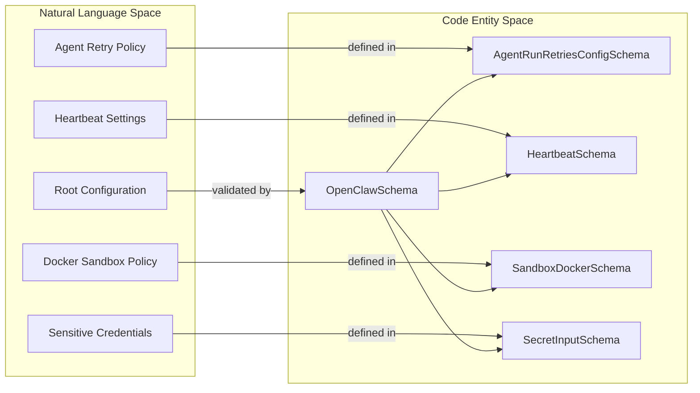

| Function / Variable | Purpose | Location |
|----------|---------|-------------------|
| `OpenClawSchema` | Root Zod schema for the entire core system | [src/config/zod-schema.ts:50-50]() |
| `FIELD_HELP` | Descriptions for UI and documentation | [src/config/schema.help.ts:4-4]() |
| `FIELD_LABELS` | Human-readable names for UI forms | [src/config/schema.labels.ts:3-3]() |
| `validateConfigObjectWithPlugins` | Entry point for validating config merged with plugin schemas | [src/config/validation.ts:113-114]() |
| `materializeRuntimeConfig` | Combines raw config with defaults and model overlays | [src/config/materialize.ts:1-10]() |

Sources: [src/config/schema.labels.ts:3-128](), [src/config/schema.help.ts:4-72](), [src/config/zod-schema.agent-runtime.ts:58-210](), [src/config/validation.ts:46-50]()

### SecretRef System

OpenClaw implements a `SecretRef` pattern to keep sensitive credentials out of the main configuration file. Fields marked as sensitive can accept either a plain string or a `SecretRef` object [src/config/types.secrets.ts:22-30]().

Supported sources include:
- **`env`**: Loads from process environment variables [src/config/types.secrets.ts:24-24]().
- **`file`**: Reads from a local file path [src/config/types.secrets.ts:25-25]().
- **`exec`**: Resolves via external process execution [src/config/types.secrets.ts:26-26]().

Sources: [src/config/types.secrets.ts:22-30](), [src/secrets/runtime.ts:1-10](), [src/config/validation.ts:48-48]()

---

## Plugin Configuration Integration

OpenClaw allows plugins to extend the configuration schema. When `validateConfigObjectWithPlugins` is called, it loads the `PluginMetadataSnapshot` [src/config/io.ts:28-30]() and merges plugin-defined schemas (from `openclaw.plugin.json`) into the validation process using `validateJsonSchemaValue` [src/config/validation.ts:25-25]().

*   **Bundled Channels**: Metadata for built-in channels like Discord and Slack is auto-generated and includes their specific JSON schemas [src/config/bundled-channel-config-metadata.generated.ts:17-20]().
*   **Dynamic Validation**: The system identifies enabled plugins and validates their specific `config` blocks against the manifest's `configSchema` [src/config/config.plugin-validation.test.ts:35-46]().

For details on how plugin schemas are merged and used by the Control UI, see [Schema Generation & UI Integration](#2.3.2).

Sources: [src/config/validation.ts:130-140](), [src/config/bundled-channel-config-metadata.generated.ts:1-15](), [src/config/config.plugin-validation.test.ts:120-130]()

---

## Configuration Repair & Health

The `doctor` system provides a robust health-check and auto-repair mechanism for configuration state. It identifies legacy patterns, ambiguous settings, and environment issues [src/flows/doctor-health-contributions.ts:100-120]().

*   **Health Contributions**: Core health checks cover gateway auth modes, UI protocol freshness, and auth profile integrity [src/flows/doctor-health-contributions.ts:135-170]().
*   **Migrations**: The system handles complex migrations, such as rewriting legacy `openai-codex/*` model references to the canonical `openai/*` format [src/commands/doctor/shared/codex-route-warnings.ts:34-37]().
*   **Integrity Checks**: `doctor` verifies that required directories exist and that the configuration file is writable [src/flows/doctor-health-contributions.ts:21-29]().

Sources: [src/flows/doctor-health-contributions.ts:31-53](), [src/commands/doctor/shared/codex-route-warnings.test.ts:57-75](), [src/config/io.ts:149-167]()

---

## Key Configuration Files

| File | Purpose |
|------|---------|
| `openclaw.json` | Main system configuration (Gateway, Agents, Channels) [src/config/paths.ts:21-21]() |
| `models.json` | Catalog of known model providers and their capabilities [src/agents/model-catalog.ts:65-65]() |
| `auth-profiles.json` | Storage for authenticated sessions and provider tokens [src/config/io.ts:63-63]() |
| `config-health.json` | Internal tracking of last-known-good config states for recovery [src/config/io.ts:149-149]() |

Sources: [src/config/paths.ts:21-21](), [src/config/io.ts:82-82](), [src/config/io.ts:169-177]()

---

# Page: Configuration Reference

# Configuration Reference

<details>
<summary>Relevant source files</summary>

The following files were used as context for generating this wiki page:

- [docs/automation/index.md](docs/automation/index.md)
- [docs/channels/groups.md](docs/channels/groups.md)
- [docs/channels/slack.md](docs/channels/slack.md)
- [docs/cli/migrate.md](docs/cli/migrate.md)
- [docs/concepts/agent-workspace.md](docs/concepts/agent-workspace.md)
- [docs/concepts/context.md](docs/concepts/context.md)
- [docs/concepts/soul.md](docs/concepts/soul.md)
- [docs/concepts/system-prompt.md](docs/concepts/system-prompt.md)
- [docs/gateway/config-agents.md](docs/gateway/config-agents.md)
- [docs/gateway/config-channels.md](docs/gateway/config-channels.md)
- [docs/gateway/configuration-examples.md](docs/gateway/configuration-examples.md)
- [docs/gateway/configuration-reference.md](docs/gateway/configuration-reference.md)
- [docs/gateway/configuration.md](docs/gateway/configuration.md)
- [docs/gateway/heartbeat.md](docs/gateway/heartbeat.md)
- [docs/help/faq.md](docs/help/faq.md)
- [docs/nodes/camera.md](docs/nodes/camera.md)
- [docs/plugins/codex-native-plugins.md](docs/plugins/codex-native-plugins.md)
- [docs/reference/rich-output-protocol.md](docs/reference/rich-output-protocol.md)
- [docs/reference/token-use.md](docs/reference/token-use.md)
- [docs/start/openclaw.md](docs/start/openclaw.md)
- [extensions/codex/index.ts](extensions/codex/index.ts)
- [extensions/codex/src/app-server/auth-bridge.test.ts](extensions/codex/src/app-server/auth-bridge.test.ts)
- [extensions/codex/src/app-server/auth-bridge.ts](extensions/codex/src/app-server/auth-bridge.ts)
- [extensions/codex/src/app-server/rate-limits.test.ts](extensions/codex/src/app-server/rate-limits.test.ts)
- [extensions/codex/src/app-server/rate-limits.ts](extensions/codex/src/app-server/rate-limits.ts)
- [extensions/codex/src/app-server/request.test.ts](extensions/codex/src/app-server/request.test.ts)
- [extensions/codex/src/command-account.ts](extensions/codex/src/command-account.ts)
- [extensions/codex/src/command-formatters.ts](extensions/codex/src/command-formatters.ts)
- [extensions/codex/src/command-handlers.ts](extensions/codex/src/command-handlers.ts)
- [extensions/codex/src/command-rpc.ts](extensions/codex/src/command-rpc.ts)
- [extensions/codex/src/commands.test.ts](extensions/codex/src/commands.test.ts)
- [extensions/codex/src/conversation-binding-data.ts](extensions/codex/src/conversation-binding-data.ts)
- [extensions/codex/src/conversation-binding.test.ts](extensions/codex/src/conversation-binding.test.ts)
- [extensions/codex/src/conversation-binding.ts](extensions/codex/src/conversation-binding.ts)
- [extensions/github-copilot/embeddings.test.ts](extensions/github-copilot/embeddings.test.ts)
- [extensions/slack/src/approval-auth.ts](extensions/slack/src/approval-auth.ts)
- [extensions/slack/src/approval-handler.runtime.test.ts](extensions/slack/src/approval-handler.runtime.test.ts)
- [extensions/slack/src/approval-handler.runtime.ts](extensions/slack/src/approval-handler.runtime.ts)
- [extensions/slack/src/approval-native-gates.ts](extensions/slack/src/approval-native-gates.ts)
- [extensions/slack/src/approval-native.test.ts](extensions/slack/src/approval-native.test.ts)
- [extensions/slack/src/approval-native.ts](extensions/slack/src/approval-native.ts)
- [extensions/slack/src/monitor.test-helpers.ts](extensions/slack/src/monitor.test-helpers.ts)
- [extensions/slack/src/send.ts](extensions/slack/src/send.ts)
- [extensions/slack/src/send.unfurl.test.ts](extensions/slack/src/send.unfurl.test.ts)
- [extensions/telegram/src/status-reaction-variants.ts](extensions/telegram/src/status-reaction-variants.ts)
- [extensions/whatsapp/src/auto-reply/monitor/on-message.audio-preflight.test.ts](extensions/whatsapp/src/auto-reply/monitor/on-message.audio-preflight.test.ts)
- [extensions/whatsapp/src/auto-reply/monitor/on-message.ts](extensions/whatsapp/src/auto-reply/monitor/on-message.ts)
- [src/agents/auth-profiles/credential-state.test.ts](src/agents/auth-profiles/credential-state.test.ts)
- [src/agents/auth-profiles/credential-state.ts](src/agents/auth-profiles/credential-state.ts)
- [src/agents/auth-profiles/order.test.ts](src/agents/auth-profiles/order.test.ts)
- [src/agents/auth-profiles/order.ts](src/agents/auth-profiles/order.ts)
- [src/agents/auth-profiles/session-override.test.ts](src/agents/auth-profiles/session-override.test.ts)
- [src/agents/auth-profiles/session-override.ts](src/agents/auth-profiles/session-override.ts)
- [src/agents/bootstrap-files.test.ts](src/agents/bootstrap-files.test.ts)
- [src/agents/embedded-agent-helpers/bootstrap.ts](src/agents/embedded-agent-helpers/bootstrap.ts)
- [src/agents/runtime-plan/auth.ts](src/agents/runtime-plan/auth.ts)
- [src/auto-reply/reply/commands-context-report.test.ts](src/auto-reply/reply/commands-context-report.test.ts)
- [src/config/types.agent-defaults.ts](src/config/types.agent-defaults.ts)
- [src/config/types.messages.ts](src/config/types.messages.ts)
- [src/config/types.slack.ts](src/config/types.slack.ts)
- [src/config/zod-schema.agent-defaults.ts](src/config/zod-schema.agent-defaults.ts)
- [src/infra/heartbeat-runner.model-override.test.ts](src/infra/heartbeat-runner.model-override.test.ts)
- [ui/src/ui/views/config-quick.test.ts](ui/src/ui/views/config-quick.test.ts)
- [ui/src/ui/views/config-quick.ts](ui/src/ui/views/config-quick.ts)

</details>


This document provides a comprehensive technical reference for all configuration keys available in `~/.openclaw/openclaw.json`. It covers types, defaults, validation rules, and subsystem effects.

OpenClaw uses a centralized configuration system built on **JSON5** and **Zod**, providing strict type safety while allowing comments and trailing commas in the configuration file [[docs/gateway/configuration-reference.md:30-30](), [src/config/io.ts:5-15]()].

## Configuration Architecture

The configuration system is organized into a hierarchical structure that separates infrastructure, runtime, and agent-specific settings.

### Top-Level Organization

```mermaid
graph TB
    subgraph "Configuration File [openclaw.json]"
        Root["Root OpenClawConfig Object"]
    end
    
    subgraph "Core Infrastructure Subsystems"
        Meta["meta: Version & History"]
        Env["env: Shell & Var Injection"]
        Logging["logging: Severity & Redaction"]
        Diagnostics["diagnostics: OTEL & Tracing"]
        Update["update: Auto-update Channels"]
    end
    
    subgraph "Gateway & Identity"
        Gateway["gateway: Port, Bind, Mode"]
        Auth["auth: Auth Profiles"]
        Models["models: Provider Catalog"]
        Secrets["secrets: SecretRef Mgmt"]
    end
    
    subgraph "Agent & Tool Runtime"
        Agents["agents: Workspace & Defaults"]
        Tools["tools: Policy & Security"]
        Memory["memory: Vector & QMD Knobs"]
        Session["session: Lifecycle & Pruning"]
    end
    
    subgraph "Messaging & Protocol"
        Channels["channels: Platform Config"]
        Messages["messages: TTS & Rendering"]
        Commands["commands: Slash Commands"]
    end
    
    subgraph "Automation & Extensions"
        Cron["cron: Scheduled Jobs"]
        Hooks["hooks: System Webhooks"]
        Skills["skills: SKILL.md Registry"]
        Plugins["plugins: Manifest Extensions"]
        MCP["mcp: Model Context Protocol"]
    end
    
    Root --> Meta
    Root --> Env
    Root --> Logging
    Root --> Diagnostics
    Root --> Update
    
    Root --> Gateway
    Root --> Auth
    Root --> Models
    Root --> Secrets
    
    Root --> Agents
    Root --> Tools
    Root --> Memory
    Root --> Session
    
    Root --> Channels
    Root --> Messages
    Root --> Commands
    
    Root --> Cron
    Root --> Hooks
    Root --> Skills
    Root --> Plugins
    Root --> MCP
```
**Sources:** `[docs/gateway/configuration-reference.md:34-156]()`, `[src/config/zod-schema.ts:1-32]()`

## Schema Validation System

OpenClaw employs a strict validation pipeline. Configuration is validated against a base schema merged with dynamic schemas provided by plugins and channels.

### Zod Schema Pipeline

The configuration loading process uses `getRuntimeConfig` to handle runtime state and `validateConfigObjectWithPlugins` for validation [[src/config/io.ts:111-114]()]. During runtime initialization, the system merges defaults, environment variables, and plugin-specific schemas. The `openclaw config schema` command prints the live JSON Schema used for validation and Control UI integration [[docs/gateway/configuration-reference.md:15-17]()].

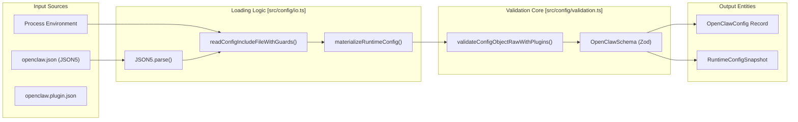
**Sources:** `[src/config/io.ts:75-114]()`, `[src/config/zod-schema.ts:1-32]()`, `[docs/gateway/configuration-reference.md:13-22]()`

## Agent & Automation Configuration

The `agents` section defines core LLM parameters, while the `automation` features like `cron` handle scheduled tasks [[docs/gateway/config-agents.md:10-13]()].

### Agent Defaults & Context
| Key | Type | Default | Effect |
| :--- | :--- | :--- | :--- |
| `agents.defaults.workspace` | `string` | `~/.openclaw/workspace` | Filesystem root for agent sandboxing and file operations. [[docs/gateway/config-agents.md:16-18]() |
| `agents.defaults.skills` | `array` | `[]` | Default skill allowlist for agents. [[docs/gateway/config-agents.md:40-43]() |
| `agents.defaults.contextInjection` | `string` | `"always"` | Controls when workspace bootstrap files are injected into the system prompt. [[docs/gateway/config-agents.md:88-90]() |
| `agents.defaults.bootstrapMaxChars` | `integer` | `20000` | Max characters per workspace bootstrap file before truncation. [[docs/gateway/config-agents.md:104-106]() |
| `agents.defaults.bootstrapTotalMaxChars` | `integer` | `60000` | Max total characters injected across all workspace bootstrap files. [[docs/gateway/config-agents.md:119-119]() |

### Model Auth & Failover
Authentication is managed via `AuthProfileStore`. The `resolveAuthProfileOrder` function determines which credentials to use based on provider aliases and explicit configuration [[src/agents/auth-profiles/order.ts:31-31](), [src/agents/auth-profiles/order.ts:52-55]()].

| Key | Type | Default | Effect |
| :--- | :--- | :--- | :--- |
| `auth.order` | `Record<string, string[]>` | `{}` | Explicit priority list for provider credentials. [[src/agents/auth-profiles/order.ts:135-140]() |
| `models.pricing.enabled` | `boolean` | `true` | Controls background pricing-catalog fetches. [[docs/gateway/configuration-reference.md:84-87]() |

**Sources:** `[docs/gateway/config-agents.md:10-130]()`, `[src/agents/auth-profiles/order.ts:31-150]()`, `[extensions/codex/src/command-account.ts:145-161]()`

## Messaging Channels

The `channels` section configures integration with platforms like Slack, Telegram, and WhatsApp [[docs/gateway/config-channels.md:10-15]()].

### Global Channel Defaults
| Key | Type | Default | Effect |
| :--- | :--- | :--- | :--- |
| `channels.defaults.groupPolicy` | `string` | `"allowlist"` | Fallback policy for group chats: `open`, `allowlist`, or `disabled`. [[docs/gateway/config-channels.md:75-75]() |
| `channels.defaults.contextVisibility` | `string` | `"all"` | Default context inclusion: `all`, `allowlist`, or `allowlist_quote`. [[docs/gateway/config-channels.md:88-88]() |

### Platform-Specific Examples
| Platform | Configuration Root | Key Features |
| :--- | :--- | :--- |
| **Slack** | `channels.slack` | Socket Mode vs HTTP, Bot/App tokens. [[docs/channels/slack.md:26-36]() |
| **Telegram** | `channels.telegram` | Bot tokens, DM/Group policies, Topic support. [[docs/gateway/config-channels.md:163-181]() |
| **WhatsApp** | `channels.whatsapp` | Multi-account support, read receipts. [[docs/gateway/config-channels.md:116-128]() |

### Group Reply Logic
OpenClaw supports different visible reply modes for groups. The `visibleReplies` setting determines if the agent must use the `message` tool or can return raw text [[docs/channels/groups.md:47-52]()].

| Key | Type | Default | Effect |
| :--- | :--- | :--- | :--- |
| `messages.groupChat.visibleReplies` | `string` | `"automatic"` | `"automatic"` or `"message_tool"`. [[docs/channels/groups.md:47-49]() |
| `messages.groupChat.unmentionedInbound` | `string` | `"user_request"` | `"user_request"` or `"room_event"`. [[docs/channels/groups.md:76-82]() |

**Sources:** `[docs/gateway/config-channels.md:10-156]()`, `[docs/channels/slack.md:1-50]()`, `[docs/channels/groups.md:45-112]()`

## Infrastructure & Diagnostics

### MCP (Model Context Protocol)
Managed MCP server definitions live under `mcp.servers`. These allow the agent to connect to external tool providers [[docs/gateway/configuration-reference.md:91-95]()].

| Key | Type | Default | Effect |
| :--- | :--- | :--- | :--- |
| `mcp.sessionIdleTtlMs` | `integer` | `600000` | Idle eviction time for MCP sessions. [[docs/gateway/configuration-reference.md:99-100]() |
| `mcp.servers.<name>.command` | `string` | `undefined` | Stdio transport command for local MCP servers. [[docs/gateway/configuration-reference.md:103-103]() |
| `mcp.servers.<name>.url` | `string` | `undefined` | HTTP/SSE endpoint for remote MCP servers. [[docs/gateway/configuration-reference.md:107-107]() |

### Memory & QMD (`memory`)
The `memory` section controls vector search and session retention behavior via the QMD (Queryable Memory Document) backend [[docs/gateway/configuration-reference.md:26-26]()].

| Key | Type | Default | Effect |
| :--- | :--- | :--- | :--- |
| `memory.qmd.limits.maxInjectedChars` | `integer` | `undefined` | Max characters injected from memory into the prompt. [[docs/gateway/configuration-reference.md:193-193]() |
| `agents.defaults.startupContext.dailyMemoryDays` | `integer` | `2` | Number of daily memory files to include in startup prelude. [[docs/gateway/config-agents.md:217-217]() |

**Sources:** `[docs/gateway/configuration-reference.md:91-156]()`, `[docs/gateway/config-agents.md:188-221]()`, `[extensions/codex/src/app-server/config.js:12-13]()`

---

# Page: Schema Generation & UI Integration

# Schema Generation & UI Integration

<details>
<summary>Relevant source files</summary>

The following files were used as context for generating this wiki page:

- [docs/.generated/config-baseline.sha256](docs/.generated/config-baseline.sha256)
- [docs/channels/discord.md](docs/channels/discord.md)
- [docs/cli/mcp.md](docs/cli/mcp.md)
- [docs/web/control-ui.md](docs/web/control-ui.md)
- [extensions/discord/src/config-schema.test.ts](extensions/discord/src/config-schema.test.ts)
- [extensions/discord/src/config-ui-hints.ts](extensions/discord/src/config-ui-hints.ts)
- [extensions/discord/src/voice/manager.e2e.test.ts](extensions/discord/src/voice/manager.e2e.test.ts)
- [extensions/discord/src/voice/manager.ts](extensions/discord/src/voice/manager.ts)
- [extensions/discord/src/voice/realtime.ts](extensions/discord/src/voice/realtime.ts)
- [src/agents/agent-scope-config.ts](src/agents/agent-scope-config.ts)
- [src/agents/embedded-agent-runner/tool-schema-runtime.ts](src/agents/embedded-agent-runner/tool-schema-runtime.ts)
- [src/agents/tools-effective-inventory-groups.ts](src/agents/tools-effective-inventory-groups.ts)
- [src/agents/tools-effective-inventory.ts](src/agents/tools-effective-inventory.ts)
- [src/agents/tools-effective-inventory.types.ts](src/agents/tools-effective-inventory.types.ts)
- [src/commands/doctor-config-flow.include-warning.test.ts](src/commands/doctor-config-flow.include-warning.test.ts)
- [src/config/bundled-channel-config-metadata.generated.ts](src/config/bundled-channel-config-metadata.generated.ts)
- [src/config/schema.help.ts](src/config/schema.help.ts)
- [src/config/schema.labels.ts](src/config/schema.labels.ts)
- [src/config/schema.test.ts](src/config/schema.test.ts)
- [src/config/types.agents.ts](src/config/types.agents.ts)
- [src/config/types.discord.ts](src/config/types.discord.ts)
- [src/config/types.mcp.ts](src/config/types.mcp.ts)
- [src/config/types.tools.ts](src/config/types.tools.ts)
- [src/config/zod-schema.agent-defaults.test.ts](src/config/zod-schema.agent-defaults.test.ts)
- [src/config/zod-schema.agent-runtime.ts](src/config/zod-schema.agent-runtime.ts)
- [src/config/zod-schema.providers-core.ts](src/config/zod-schema.providers-core.ts)
- [src/config/zod-schema.ts](src/config/zod-schema.ts)
- [src/gateway/server-methods/config.test.ts](src/gateway/server-methods/config.test.ts)
- [src/gateway/server-methods/config.ts](src/gateway/server-methods/config.ts)
- [src/gateway/server-methods/node-child-process.test-support.ts](src/gateway/server-methods/node-child-process.test-support.ts)
- [src/gateway/server-methods/tools-effective.runtime.ts](src/gateway/server-methods/tools-effective.runtime.ts)
- [src/gateway/server-methods/tools-effective.test.ts](src/gateway/server-methods/tools-effective.test.ts)
- [src/gateway/server-methods/tools-effective.ts](src/gateway/server-methods/tools-effective.ts)
- [src/gateway/server-methods/update-managed-service-handoff.test.ts](src/gateway/server-methods/update-managed-service-handoff.test.ts)
- [src/gateway/server-methods/update-managed-service-handoff.ts](src/gateway/server-methods/update-managed-service-handoff.ts)
- [src/gateway/server-methods/update.test.ts](src/gateway/server-methods/update.test.ts)
- [src/gateway/server-methods/update.ts](src/gateway/server-methods/update.ts)
- [src/infra/errors.test.ts](src/infra/errors.test.ts)
- [src/infra/errors.ts](src/infra/errors.ts)
- [src/infra/is-main.test.ts](src/infra/is-main.test.ts)
- [src/infra/is-main.ts](src/infra/is-main.ts)
- [src/infra/push-web.test.ts](src/infra/push-web.test.ts)
- [src/infra/push-web.ts](src/infra/push-web.ts)
- [ui/src/styles/chat/grouped.css](ui/src/styles/chat/grouped.css)
- [ui/src/styles/config.css](ui/src/styles/config.css)
- [ui/src/styles/usage.css](ui/src/styles/usage.css)
- [ui/src/ui/app-settings.refresh-active-tab.node.test.ts](ui/src/ui/app-settings.refresh-active-tab.node.test.ts)
- [ui/src/ui/app-settings.ts](ui/src/ui/app-settings.ts)
- [ui/src/ui/controllers/config.test.ts](ui/src/ui/controllers/config.test.ts)
- [ui/src/ui/controllers/config.ts](ui/src/ui/controllers/config.ts)
- [ui/src/ui/controllers/config/form-coerce.ts](ui/src/ui/controllers/config/form-coerce.ts)
- [ui/src/ui/controllers/config/form-utils.node.test.ts](ui/src/ui/controllers/config/form-utils.node.test.ts)
- [ui/src/ui/controllers/config/form-utils.ts](ui/src/ui/controllers/config/form-utils.ts)
- [ui/src/ui/controllers/cron-filters.test.ts](ui/src/ui/controllers/cron-filters.test.ts)
- [ui/src/ui/controllers/cron.test.ts](ui/src/ui/controllers/cron.test.ts)
- [ui/src/ui/controllers/cron.ts](ui/src/ui/controllers/cron.ts)
- [ui/src/ui/format.test.ts](ui/src/ui/format.test.ts)
- [ui/src/ui/format.ts](ui/src/ui/format.ts)
- [ui/src/ui/provider-quota-summary.test.ts](ui/src/ui/provider-quota-summary.test.ts)
- [ui/src/ui/provider-quota-summary.ts](ui/src/ui/provider-quota-summary.ts)
- [ui/src/ui/types.ts](ui/src/ui/types.ts)
- [ui/src/ui/views/activity.ts](ui/src/ui/views/activity.ts)
- [ui/src/ui/views/config-form.shared.ts](ui/src/ui/views/config-form.shared.ts)
- [ui/src/ui/views/config.browser.test.ts](ui/src/ui/views/config.browser.test.ts)
- [ui/src/ui/views/config.ts](ui/src/ui/views/config.ts)
- [ui/src/ui/views/cron.test.ts](ui/src/ui/views/cron.test.ts)
- [ui/src/ui/views/cron.ts](ui/src/ui/views/cron.ts)
- [ui/src/ui/views/overview-cards.ts](ui/src/ui/views/overview-cards.ts)
- [ui/src/ui/views/overview-event-log.ts](ui/src/ui/views/overview-event-log.ts)
- [ui/src/ui/views/overview.render.test.ts](ui/src/ui/views/overview.render.test.ts)
- [ui/src/ui/views/usage-render-details.test.ts](ui/src/ui/views/usage-render-details.test.ts)
- [ui/src/ui/views/usage-render-details.ts](ui/src/ui/views/usage-render-details.ts)
- [ui/src/ui/views/usage-render-overview.test.ts](ui/src/ui/views/usage-render-overview.test.ts)
- [ui/src/ui/views/usage-render-overview.ts](ui/src/ui/views/usage-render-overview.ts)

</details>


This page explains how OpenClaw builds, caches, and merges configuration schemas with plugin extensions to drive the dynamic forms in the Control UI. The system transforms static **Zod** definitions and **JSON Schema** into interactive forms with rich metadata for validation and visual rendering.

---

## Schema Generation Pipeline

OpenClaw uses a multi-stage pipeline to convert runtime schemas into the structured metadata required by the Control UI. This pipeline bridges the gap between static code definitions and the dynamic JSON-based configuration required by the frontend.

### Architecture Overview

The pipeline transforms core configuration definitions and plugin-provided schemas into serialized metadata that the Control UI uses to render forms.

```mermaid
graph TD
    subgraph "DefinitionSpace [Code Entities]"
        BaseSchema["OpenClawSchema<br/>(src/config/zod-schema.ts)"]
        FieldHelp["FIELD_HELP<br/>(src/config/schema.help.ts)"]
        FieldLabels["FIELD_LABELS<br/>(src/config/schema.labels.ts)"]
        BundledMetadata["RAW_BUNDLED_CHANNEL_CONFIG_METADATA<br/>(src/config/bundled-channel-config-metadata.generated.ts)"]
    end

    subgraph "ProcessingSpace [Logic]"
        LoadSchema["loadGatewayRuntimeConfigSchema()<br/>(src/gateway/server-methods/config.ts)"]
        ValidateConfig["validateConfigObjectWithPlugins()<br/>(src/config/validation.ts)"]
    end

    subgraph "OutputSpace [UI Integration]"
        ConfigSchema["ConfigSchema<br/>(JSON Schema Draft-07)"]
        UIHints["ConfigUiHints<br/>(Labels/Help/Tags)"]
        ConfigView["renderConfig()<br/>(ui/src/ui/views/config.ts)"]
    end

    BaseSchema --> LoadSchema
    FieldHelp --> LoadSchema
    FieldLabels --> LoadSchema
    BundledMetadata --> LoadSchema
    
    LoadSchema --> ConfigSchema
    LoadSchema --> UIHints
    
    ConfigSchema --> ConfigView
    UIHints --> ConfigView
```

**Sources:** [src/config/zod-schema.ts:49-50](), [src/config/schema.help.ts:4-51](), [src/config/schema.labels.ts:3-100](), [src/gateway/server-methods/config.ts:12-17](), [src/config/bundled-channel-config-metadata.generated.ts:17-20]()

---

## JSON Schema Generation & Caching

The core configuration is defined using Zod but projected as JSON Schema for the UI. To ensure performance, the Gateway caches these schema builds.

### Base Schema Generation
The configuration keys found in `openclaw.json` are managed via a root Zod schema named `OpenClawSchema` [src/config/zod-schema.ts:49](). This is supplemented by provider-specific schemas like `TelegramGroupSchema` [src/config/zod-schema.providers-core.ts:171]() and `DiscordPreviewStreamingConfigSchema` [src/config/zod-schema.providers-core.ts:124]().

The system relies on a pre-generated metadata registry for bundled channels, stored in `RAW_BUNDLED_CHANNEL_CONFIG_METADATA` [src/config/bundled-channel-config-metadata.generated.ts:17](). This includes full JSON Schema definitions for every supported channel (e.g., Discord, ClickClack) [src/config/bundled-channel-config-metadata.generated.ts:18-20]().

**Sources:** [src/config/zod-schema.ts:49](), [src/config/zod-schema.providers-core.ts:171](), [src/config/zod-schema.providers-core.ts:124](), [src/config/bundled-channel-config-metadata.generated.ts:17-20]()

### Caching and Performance
Because building the full schema (merging core, plugins, and help text) is expensive, the Gateway implements a caching layer:
1.  **Response Cache**: `loadGatewayRuntimeConfigSchema` results are cached to reuse schema builds across burst requests [src/gateway/server-methods/config.ts:155-161]().
2.  **Cache Invalidation**: The cache is cleared via `clearConfigSchemaResponseCacheForTests` or when configuration writes change schema inputs [src/gateway/server-methods/config.ts:3-7](), [src/gateway/server-methods/config.test.ts:163-169]().
3.  **Baseline Hashes**: The system tracks `config-baseline.sha256` for core and plugin surfaces to detect drift [docs/.generated/config-baseline.sha256:1-4]().

**Sources:** [src/gateway/server-methods/config.ts:155-161](), [src/gateway/server-methods/config.test.ts:163-169](), [docs/.generated/config-baseline.sha256:1-4]()

---

## UI Hints & Form Metadata

The Control UI uses **UI Hints** and field metadata to create a user-friendly experience, mapping technical JSON paths to human-readable elements.

### Hint Categories
| Hint Key | Purpose | Code Reference |
| :--- | :--- | :--- |
| `help` | Extended documentation strings | `FIELD_HELP` [src/config/schema.help.ts:4]() |
| `labels` | Short UI labels for fields | `FIELD_LABELS` [src/config/schema.labels.ts:3]() |
| `uiHints` | Visual presentation hints (e.g. for Discord) | `RAW_BUNDLED_CHANNEL_CONFIG_METADATA` [src/config/bundled-channel-config-metadata.generated.ts:13]() |

**Sources:** [src/config/schema.help.ts:4](), [src/config/schema.labels.ts:3](), [src/config/bundled-channel-config-metadata.generated.ts:13]()

### Specialized Field Metadata
Certain subsystems define their own metadata, such as `MEDIA_AUDIO_FIELD_HELP` and `MEDIA_AUDIO_FIELD_LABELS`, which are merged into the main registries [src/config/schema.help.ts:1](), [src/config/schema.labels.ts:1](). This includes complex logic like `describeTalkSilenceTimeoutDefaults` for dynamic help text [src/config/schema.help.ts:2]().

**Sources:** [src/config/schema.help.ts:1-2](), [src/config/schema.labels.ts:1]()

---

## UI Integration & State Management

The Control UI consumes the generated schemas and validation state to drive its `config` view.

### Configuration View State
The UI maintains a complex state for the configuration form, managed in `ConfigProps` [ui/src/ui/views/config.browser.test.ts:4-64](). This includes:
*   `formMode`: Toggle between "form" (visual) and "raw" (JSON) [ui/src/ui/views/config.browser.test.ts:23]().
*   `schema`: The JSON Schema Draft-07 object fetched from the Gateway [ui/src/ui/views/config.browser.test.ts:17-20]().
*   `uiHints`: Labels and help text used to annotate the form [ui/src/ui/views/config.browser.test.ts:22]().

### Form Validation and Safety
The UI implements safety checks to prevent invalid saves. Buttons like `Save` and `Apply` are disabled if the form contains invalid data or if the schema is missing [ui/src/ui/views/config.browser.test.ts:174-190](). The `onFormPatch` callback handles incremental updates as the user interacts with the dynamic fields [ui/src/ui/views/config.browser.test.ts:32]().

```mermaid
sequenceDiagram
    participant UI as "Control UI (Lit)"
    participant Controller as "config.ts Controller"
    participant Gateway as "Gateway (RPC)"

    UI->>Controller: loadConfig()
    Controller->>Gateway: config.get()
    Gateway-->>Controller: raw JSON config
    Controller->>Gateway: config.getSchema()
    Gateway-->>Controller: JSON Schema + UI Hints
    Controller->>UI: Update ConfigProps
    UI->>UI: renderConfig(props)
```

**Sources:** [ui/src/ui/views/config.browser.test.ts:4-64](), [ui/src/ui/views/config.browser.test.ts:174-190](), [ui/src/ui/controllers/config.ts:30]()

---

## Summary of Key Symbols

| Symbol | Role | Location |
| :--- | :--- | :--- |
| `loadGatewayRuntimeConfigSchema` | Aggregates Zod schemas, help text, and labels into a UI-ready format | [src/gateway/server-methods/config.ts:12]() |
| `OpenClawSchema` | The primary Zod schema for the entire gateway configuration | [src/config/zod-schema.ts:49]() |
| `FIELD_HELP` | Dictionary of help text indexed by configuration path | [src/config/schema.help.ts:4]() |
| `FIELD_LABELS` | Dictionary of UI labels indexed by configuration path | [src/config/schema.labels.ts:3]() |
| `RAW_BUNDLED_CHANNEL_CONFIG_METADATA` | Pre-compiled registry of channel-specific schemas and UI hints | [src/config/bundled-channel-config-metadata.generated.ts:17]() |
| `renderConfig` | Lit-based render function for the configuration view | [ui/src/ui/views/config.ts:4]() |
| `ConfigProps` | Interface defining the state of the configuration UI | [ui/src/ui/views/config.browser.test.ts:4]() |

**Sources:** [src/gateway/server-methods/config.ts:12](), [src/config/zod-schema.ts:49](), [src/config/schema.help.ts:4](), [src/config/schema.labels.ts:3](), [src/config/bundled-channel-config-metadata.generated.ts:17](), [ui/src/ui/views/config.ts:4](), [ui/src/ui/views/config.browser.test.ts:4]()

---

# Page: Session & State Management

# Session & State Management

<details>
<summary>Relevant source files</summary>

The following files were used as context for generating this wiki page:

- [extensions/codex/src/app-server/native-execution-policy.test.ts](extensions/codex/src/app-server/native-execution-policy.test.ts)
- [extensions/codex/src/app-server/native-execution-policy.ts](extensions/codex/src/app-server/native-execution-policy.ts)
- [extensions/codex/src/app-server/transcript-mirror.test.ts](extensions/codex/src/app-server/transcript-mirror.test.ts)
- [extensions/codex/src/app-server/transcript-mirror.ts](extensions/codex/src/app-server/transcript-mirror.ts)
- [src/agents/agent-command.compaction-rotation.test.ts](src/agents/agent-command.compaction-rotation.test.ts)
- [src/agents/cli-backends.ts](src/agents/cli-backends.ts)
- [src/agents/command/attempt-execution.cli.test.ts](src/agents/command/attempt-execution.cli.test.ts)
- [src/agents/command/attempt-execution.ts](src/agents/command/attempt-execution.ts)
- [src/agents/command/session-store.test.ts](src/agents/command/session-store.test.ts)
- [src/agents/command/session-store.ts](src/agents/command/session-store.ts)
- [src/agents/embedded-agent-runner/types.ts](src/agents/embedded-agent-runner/types.ts)
- [src/agents/live-model-switch.test.ts](src/agents/live-model-switch.test.ts)
- [src/agents/live-model-switch.ts](src/agents/live-model-switch.ts)
- [src/agents/model-picker-visibility.ts](src/agents/model-picker-visibility.ts)
- [src/agents/model-runtime-aliases.test.ts](src/agents/model-runtime-aliases.test.ts)
- [src/agents/model-runtime-aliases.ts](src/agents/model-runtime-aliases.ts)
- [src/agents/tools/media-tool-shared.test.ts](src/agents/tools/media-tool-shared.test.ts)
- [src/auto-reply/fallback-state.test.ts](src/auto-reply/fallback-state.test.ts)
- [src/auto-reply/fallback-state.ts](src/auto-reply/fallback-state.ts)
- [src/commands/doctor-session-snapshots.test.ts](src/commands/doctor-session-snapshots.test.ts)
- [src/commands/doctor-session-snapshots.ts](src/commands/doctor-session-snapshots.ts)
- [src/config/sessions.cache.test.ts](src/config/sessions.cache.test.ts)
- [src/config/sessions/disk-budget.test.ts](src/config/sessions/disk-budget.test.ts)
- [src/config/sessions/disk-budget.ts](src/config/sessions/disk-budget.ts)
- [src/config/sessions/lifecycle.ts](src/config/sessions/lifecycle.ts)
- [src/config/sessions/sessions.test.ts](src/config/sessions/sessions.test.ts)
- [src/config/sessions/skill-prompt-blobs.ts](src/config/sessions/skill-prompt-blobs.ts)
- [src/config/sessions/store-cache.ts](src/config/sessions/store-cache.ts)
- [src/config/sessions/store-load.ts](src/config/sessions/store-load.ts)
- [src/config/sessions/store.skills-stripping.test.ts](src/config/sessions/store.skills-stripping.test.ts)
- [src/config/sessions/store.ts](src/config/sessions/store.ts)
- [src/config/sessions/targets.test.ts](src/config/sessions/targets.test.ts)
- [src/config/sessions/transcript-append.ts](src/config/sessions/transcript-append.ts)
- [src/config/sessions/transcript-write-context.ts](src/config/sessions/transcript-write-context.ts)
- [src/config/sessions/transcript.test.ts](src/config/sessions/transcript.test.ts)
- [src/config/sessions/transcript.ts](src/config/sessions/transcript.ts)
- [src/config/sessions/types.ts](src/config/sessions/types.ts)
- [src/cron/isolated-agent/run.interim-retry.test.ts](src/cron/isolated-agent/run.interim-retry.test.ts)
- [src/cron/isolated-agent/run.skill-filter.test.ts](src/cron/isolated-agent/run.skill-filter.test.ts)
- [src/cron/isolated-agent/session.test.ts](src/cron/isolated-agent/session.test.ts)
- [src/cron/isolated-agent/subagent-followup.test.ts](src/cron/isolated-agent/subagent-followup.test.ts)
- [src/gateway/server.sessions.store-rpc.test.ts](src/gateway/server.sessions.store-rpc.test.ts)
- [src/gateway/session-utils.search.test.ts](src/gateway/session-utils.search.test.ts)
- [src/gateway/session-utils.single-row-cache.test.ts](src/gateway/session-utils.single-row-cache.test.ts)
- [src/gateway/session-utils.test.ts](src/gateway/session-utils.test.ts)
- [src/gateway/session-utils.ts](src/gateway/session-utils.ts)
- [src/gateway/session-utils.types.ts](src/gateway/session-utils.types.ts)
- [src/infra/json-files.test.ts](src/infra/json-files.test.ts)
- [src/infra/json-files.ts](src/infra/json-files.ts)
- [src/plugins/session-entry-slot-keys.ts](src/plugins/session-entry-slot-keys.ts)
- [src/shared/session-types.ts](src/shared/session-types.ts)
- [src/tui/gateway-chat.ts](src/tui/gateway-chat.ts)
- [src/tui/tui-backend.ts](src/tui/tui-backend.ts)
- [ui/src/ui/chat/slash-command-executor.node.test.ts](ui/src/ui/chat/slash-command-executor.node.test.ts)
- [ui/src/ui/chat/slash-command-executor.ts](ui/src/ui/chat/slash-command-executor.ts)

</details>


This page documents OpenClaw's session and state management system, including session scoping models, storage formats, directory organization, and lifecycle management. Sessions control conversation continuity and isolation across channels, peers, and agents.

---

## Session Scoping Models

OpenClaw supports multiple session scoping strategies to control conversation isolation. The scoping model determines whether conversations are shared across channels or isolated per sender.

### Scoping Modes

| Mode | Behavior | Use Case |
|------|----------|----------|
| `main` | Single shared session across all channels and peers | Single-user, personal assistant |
| `per-sender` | One session per sender, shared across channels | Multi-user, channel-agnostic identity |
| `global` | Shared session across a specific boundary | Organizational shared state |
| `subagent` | Isolated session for sub-agent task execution | Autonomous agent task isolation |

The system identifies sessions using a `sessionKey`. The Gateway distinguishes between persistent user sessions and synthetic runtime sessions like `cron`, `subagent`, or `acp` (Agent Control Protocol) [src/routing/session-key.js:86-91]().

### Session Key Resolution
The system resolves a unique `sessionKey` for every inbound message. This key typically follows the pattern `agent:<agentId>:<channel>:<kind>:<id>` [src/routing/session-key.js:72-73](). Keys are parsed and categorized using utility functions like `parseAgentSessionKey` [src/routing/session-key.js:90-90]().

**Code Entity Space: Session Key Resolution**
```mermaid
graph TD
    subgraph "NaturalLanguageSpace"
        Msg["Inbound Message"]
    end

    subgraph "CodeEntitySpace"
        parseAgentSessionKey["parseAgentSessionKey(sessionKey)"]
        normalizeAgentId["normalizeAgentId(id)"]
        isSubagentSessionKey["isSubagentSessionKey(key)"]
        isCronRunSessionKey["isCronRunSessionKey(key)"]
        classifySessionKey["classifySessionKey(key)"]
        
        Msg --> parseAgentSessionKey
        parseAgentSessionKey --> normalizeAgentId
        parseAgentSessionKey --> isSubagentSessionKey
        parseAgentSessionKey --> isCronRunSessionKey
        parseAgentSessionKey --> classifySessionKey
    end
    
    subgraph "Logic"
        IsSubagentKey["Is Subagent Key?"]
        IsCronKey["Is Cron Key?"]
    end

    isSubagentSessionKey --- IsSubagentKey
    isCronRunSessionKey --- IsCronKey
```
Sources: `[src/routing/session-key.js:72-91]()`, `[src/gateway/session-utils.ts:72-77]()`

---

## Session Storage

OpenClaw persists sessions in two distinct layers to balance performance and durability.

### 1. Metadata Store (`sessions.json`)
The `sessions.json` file (the "Store") maps a `sessionKey` to a `SessionEntry` object. It is managed by `SessionManager` and accessed via `loadSessionStore` [src/config/sessions/store.ts:42-46]().

| Field | Description |
|-------|-------------|
| `sessionId` | Unique UUID identifying the current transcript file [src/config/sessions/types.ts:33-33]() |
| `updatedAt` | Timestamp (ms) of the last activity [src/config/sessions/types.ts:34-34]() |
| `sessionFile` | Absolute path to the active JSONL transcript [src/config/sessions/store.ts:118-118]() |
| `displayName` | Human-readable name for the session [src/config/sessions.cache.test.ts:38-38]() |
| `pluginExtensions` | Slot for plugins to store session-scoped state [src/config/sessions/store-load.ts:173-181]() |

### 2. Transcript (`.jsonl`)
Transcripts are append-only **JSONL** files containing the full conversation history, tool calls, and metadata.
- **Structure:** Each line is a JSON object representing an `AgentMessage` or metadata entry [src/config/sessions/transcript.ts:62-75]().
- **Persistence:** Messages are appended via `appendSessionTranscriptMessage` [src/config/sessions/transcript.ts:19-19]() which ensures sequential writes using `runWithOwnedSessionTranscriptWriteLock` [src/config/sessions/transcript.ts:25-25]().
- **User Turn Persistence:** `appendUserTurnTranscriptMessage` manages the recording of user messages, ensuring metadata is attached before writing to disk [src/agents/command/attempt-execution.ts:21-23]().
- **Tail Reading:** The system uses `readTailAssistantTextFromSessionTranscript` to verify the last message in a transcript before appending new turns, preventing duplicates [src/config/sessions/transcript.ts:172-180]().

Sources: `[src/config/sessions/store.ts:42-46]()`, `[src/config/sessions/types.ts:33-34]()`, `[src/config/sessions/transcript.ts:19-180]()`, `[src/agents/command/attempt-execution.ts:21-23]()`, `[src/config/sessions/store-load.ts:173-181]()`

---

## State Directory Organization

OpenClaw organizes state by Agent ID to ensure isolation. The `resolveAgentWorkspaceDir` function determines the root workspace for an agent [src/gateway/session-utils.ts:17-17]().

```text
~/.openclaw/
├── openclaw.json           # Global configuration
└── agents/
    └── {agentId}/          # Agent-specific isolation [src/gateway/session-utils.ts:169-169]()
        └── sessions/       # Session storage directory [src/config/sessions/sessions.test.ts:57-57]()
            ├── sessions.json  # Metadata store [src/config/sessions/store.ts:19-19]()
            └── {id}.jsonl     # Active transcript [src/config/sessions/transcript.ts:31-41]()
```

Sources: `[src/gateway/session-utils.ts:17-169]()`, `[src/config/sessions/sessions.test.ts:57-57]()`, `[src/config/sessions/store.ts:19-19]()`, `[src/config/sessions/transcript.ts:31-41]()`

---

## Session Lifecycle & Maintenance

### Initialization & Run Flow
When an agent run starts, `resolveSessionTranscriptFile` resolves the session context [src/config/sessions/transcript.ts:105-113](). This involves checking for session existence and resolving the session file path [src/config/sessions/transcript.ts:118-130]().

**Code Entity Space: Lifecycle Implementation**
```mermaid
sequenceDiagram
    participant G as "Gateway/Agent"
    participant RS as "resolveSessionTranscriptFile"
    participant ST as "store.ts"
    participant T as "Transcript (JSONL)"
    participant TA as "user-turn-transcript.ts"

    G->>RS: "resolveSessionTranscriptFile(params)"
    RS->>ST: "loadSessionStore(storePath)"
    RS->>RS: "resolveAndPersistSessionFile()"
    
    G->>TA: "appendUserTurnTranscriptMessage(input)"
    TA->>T: "Append JSONL line"
    
    G->>ST: "updateSessionStore(key, patch)"
    ST->>ST: "runExclusiveSessionStoreWrite()"
```
Sources: `[src/config/sessions/transcript.ts:105-148]()`, `[src/agents/command/attempt-execution.ts:21-41]()`, `[src/config/sessions/store.ts:59-59]()`

### Maintenance & Pruning
Sessions undergo periodic maintenance to manage disk usage and performance:
- **Disk Budget:** `enforceSessionDiskBudget` performs sweeps to ensure session files do not exceed allocated space [src/config/sessions/store.ts:17-17]().
- **Stale Entry Pruning:** `pruneStaleEntries` removes session metadata for sessions that have not been updated within a specific threshold [src/config/sessions/store.ts:53-53]().
- **Write Locking:** All transcript writes are guarded by `acquireSessionWriteLock` to prevent corruption during concurrent agent turns [src/agents/command/attempt-execution.ts:41-41]().
- **Cache Management:** `invalidateSessionStoreCache` ensures that in-memory session metadata stays synchronized with disk during multi-process operations [src/config/sessions/store.ts:33-33]().
- **In-Memory Interning:** Large strings (like skill prompts) are interned using `internSessionStoreLargeStrings` to reduce memory pressure during store loading [src/config/sessions/store-cache.ts:121-125]().

### Reliability & Failover
If a session becomes corrupted or an agent execution fails, the system uses `FailoverError` to classify the reason (e.g., `AbortError`) and determines if the reused CLI session should be cleared [src/agents/command/attempt-execution.ts:59-64]().

Sources: `[src/config/sessions/store.ts:17-53]()`, `[src/agents/command/attempt-execution.ts:41-64]()`, `[src/config/sessions/store.ts:33-33]()`, `[src/config/sessions/store-cache.ts:121-125]()`

---

# Page: Multi-Agent Routing

# Multi-Agent Routing

<details>
<summary>Relevant source files</summary>

The following files were used as context for generating this wiki page:

- [docs/cli/agent.md](docs/cli/agent.md)
- [docs/tools/agent-send.md](docs/tools/agent-send.md)
- [extensions/memory-core/src/dreaming-narrative.test.ts](extensions/memory-core/src/dreaming-narrative.test.ts)
- [extensions/memory-core/src/dreaming-narrative.ts](extensions/memory-core/src/dreaming-narrative.ts)
- [extensions/memory-core/src/dreaming-repair.test.ts](extensions/memory-core/src/dreaming-repair.test.ts)
- [packages/gateway-client/src/client.ts](packages/gateway-client/src/client.ts)
- [packages/gateway-client/src/client.watchdog.test.ts](packages/gateway-client/src/client.watchdog.test.ts)
- [src/agents/command/cli-compaction.test.ts](src/agents/command/cli-compaction.test.ts)
- [src/agents/command/cli-compaction.ts](src/agents/command/cli-compaction.ts)
- [src/agents/command/types.ts](src/agents/command/types.ts)
- [src/agents/embedded-agent-runner/compact.types.ts](src/agents/embedded-agent-runner/compact.types.ts)
- [src/agents/harness/selection.test.ts](src/agents/harness/selection.test.ts)
- [src/agents/harness/selection.ts](src/agents/harness/selection.ts)
- [src/auto-reply/reply/commands-compact.test.ts](src/auto-reply/reply/commands-compact.test.ts)
- [src/auto-reply/reply/commands-compact.ts](src/auto-reply/reply/commands-compact.ts)
- [src/cli/gateway-dispatch-dotenv.ts](src/cli/gateway-dispatch-dotenv.ts)
- [src/cli/program/command-registry-core.ts](src/cli/program/command-registry-core.ts)
- [src/cli/program/command-registry.test.ts](src/cli/program/command-registry.test.ts)
- [src/cli/program/register.agent-turn.ts](src/cli/program/register.agent-turn.ts)
- [src/cli/program/register.agent.test.ts](src/cli/program/register.agent.test.ts)
- [src/cli/program/register.agent.ts](src/cli/program/register.agent.ts)
- [src/commands/agent-via-gateway.test.ts](src/commands/agent-via-gateway.test.ts)
- [src/commands/agent-via-gateway.ts](src/commands/agent-via-gateway.ts)
- [src/config/config.talk-validation.test.ts](src/config/config.talk-validation.test.ts)
- [src/config/gateway-dispatch-config.test.ts](src/config/gateway-dispatch-config.test.ts)
- [src/config/gateway-dispatch-config.ts](src/config/gateway-dispatch-config.ts)
- [src/gateway/call.test.ts](src/gateway/call.test.ts)
- [src/gateway/call.ts](src/gateway/call.ts)
- [src/gateway/chat-abort.test.ts](src/gateway/chat-abort.test.ts)
- [src/gateway/chat-abort.ts](src/gateway/chat-abort.ts)
- [src/gateway/client.test.ts](src/gateway/client.test.ts)
- [src/gateway/client.ts](src/gateway/client.ts)
- [src/gateway/client.watchdog.test.ts](src/gateway/client.watchdog.test.ts)
- [src/gateway/connection-details.ts](src/gateway/connection-details.ts)
- [src/gateway/server-chat-state.ts](src/gateway/server-chat-state.ts)
- [src/gateway/server-maintenance.test.ts](src/gateway/server-maintenance.test.ts)
- [src/gateway/server-maintenance.ts](src/gateway/server-maintenance.ts)
- [src/gateway/server-methods/agent.test.ts](src/gateway/server-methods/agent.test.ts)
- [src/gateway/server-methods/agent.ts](src/gateway/server-methods/agent.ts)
- [src/gateway/server-methods/chat.abort-authorization.test.ts](src/gateway/server-methods/chat.abort-authorization.test.ts)
- [src/gateway/server-methods/chat.abort-persistence.test.ts](src/gateway/server-methods/chat.abort-persistence.test.ts)
- [src/gateway/server-methods/chat.abort.test-helpers.ts](src/gateway/server-methods/chat.abort.test-helpers.ts)
- [src/gateway/server-methods/session-active-runs.ts](src/gateway/server-methods/session-active-runs.ts)
- [src/gateway/server-methods/sessions.ts](src/gateway/server-methods/sessions.ts)
- [src/gateway/server.node-version-mismatch.test.ts](src/gateway/server.node-version-mismatch.test.ts)
- [src/gateway/server.sessions.list-changed.test.ts](src/gateway/server.sessions.list-changed.test.ts)
- [src/infra/dotenv-global.ts](src/infra/dotenv-global.ts)
- [src/infra/dotenv.ts](src/infra/dotenv.ts)
- [src/node-host/runner.credentials.test.ts](src/node-host/runner.credentials.test.ts)
- [src/node-host/runner.ts](src/node-host/runner.ts)
- [test/vitest/vitest.gateway-client.config.ts](test/vitest/vitest.gateway-client.config.ts)

</details>


## Purpose and Scope

This document explains the OpenClaw Gateway's multi-agent routing system, which allows a single process to host multiple isolated AI assistants. Each agent operates within its own isolated workspace, maintains independent session history, and utilizes its own set of authentication profiles and model configurations [src/gateway/server-methods/agent.ts:120-135](). Routing is handled by a deterministic mechanism that maps inbound messages from messaging channels to the appropriate agent based on configurable bindings and session keys [src/routing/session-key.ts:30-40]().

---

## Agent Isolation Model

Each agent in the Gateway is a distinct logical entity with its own filesystem resources. Isolation ensures that tools, memory, and credentials used by one agent do not leak into another.

| Resource | Path Pattern | Purpose |
|----------|-------------|---------|
| **Workspace** | `~/.openclaw/workspace-<agentId>` | Filesystem context for tools and local skills [src/gateway/server-methods/agent.test.ts:122-133](). |
| **Agent Directory** | `~/.openclaw/agents/<agentId>/` | Agent-specific configuration including `auth-profiles.json` and `models.json` [src/gateway/server-methods/agent.ts:120-125](). |
| **Session Store** | `~/.openclaw/agents/<agentId>/sessions/store.json` | Index of all conversation metadata for this agent [src/gateway/server-methods/sessions.ts:50-58](). |
| **Session Transcripts** | `~/.openclaw/agents/<agentId>/sessions/<uuid>.jsonl` | Append-only conversation history (JSONL) [src/gateway/server-methods/sessions.ts:54-55](). |

### Agent Resource Mapping
The diagram below shows how the Gateway maps logical Agent IDs to physical filesystem entities using `resolveAgentWorkspaceDir` and `resolveAgentIdFromSessionKey` [src/gateway/server-methods/agent.test.ts:122-133]().

```mermaid
graph TB
    subgraph "GatewayProcess[Gateway Process]"
        Router["Agent Router (src/gateway/server-methods/agent.ts)"]
    end
    
    subgraph "Agent_Main[Agent: 'main']"
        Workspace1["Workspace<br/>resolveAgentWorkspaceDir"]
        AgentDir1["Agent Dir<br/>(src/agents/agent-scope.js)"]
        Sessions1["Sessions Store<br/>loadSessionStore"]
        Auth1["auth-profiles.json"]
        Store1["store.json (src/config/sessions.ts)"]
        
        AgentDir1 --> Auth1
        Sessions1 --> Store1
    end
    
    subgraph "Agent_Work[Agent: 'work']"
        Workspace2["Workspace<br/>resolveAgentWorkspaceDir"]
        AgentDir2["Agent Dir<br/>(src/agents/agent-scope.js)"]
        Sessions2["Sessions Store<br/>loadSessionStore"]
        Auth2["auth-profiles.json"]
        Store2["store.json (src/config/sessions.ts)"]
        
        AgentDir2 --> Auth2
        Sessions2 --> Store2
    end
    
    Router --> Agent_Main
    Router --> Agent_Work
```

**Sources:**
- [src/gateway/server-methods/agent.ts:120-135]()
- [src/gateway/server-methods/agent.test.ts:122-133]()
- [src/gateway/server-methods/sessions.ts:50-58]()

---

## Session Key Structure

Routing information is encoded directly into session keys. The Gateway uses `resolveAgentIdFromSessionKey` to extract the target agent from the session identifier [src/routing/session-key.ts:33-33](). Keys are normalized to ensure case-insensitive matching for IDs [src/routing/session-key.ts:32-32]().

| Format | Example | Agent ID | Purpose |
|--------|---------|----------|-------|
| **Explicit agent** | `agent:work:main` | `work` | Specific agent targeting [src/routing/session-key.ts:33-33]() |
| **Default agent** | `main` | `main` | Default assistant routing [src/gateway/server-methods/agent.test.ts:107-110]() |
| **Sub-agent** | `agent:main:subagent:xyz` | `main` | Recursive sub-agent session [src/routing/session-key.ts:84-84]() |
| **Unscoped** | `*` | N/A | Global/unscoped session sentinel [src/routing/session-key.ts:31-31]() |

The Gateway identifies internal requester sessions (like sub-agents) to manage lifecycle using `isAcpSessionKey` [src/routing/session-key.ts:84-84]().

**Sources:**
- [src/routing/session-key.ts:30-40]()
- [src/gateway/server-methods/agent.test.ts:107-119]()
- [src/routing/session-key.ts:84-84]()

---

## Delegate Architecture and ACP Routing

OpenClaw supports a recursive multi-agent model where a "controller" agent can spawn "sub-agents" via the Agent Control Protocol (ACP). These sub-agents are routed to their own isolated sessions but remain bound to the requester via the `subagent-registry` [src/gateway/server-methods/agent.test.ts:9-12]().

### Sub-Agent Registry and Lifecycle
The registry manages the state of active runs, coordinating with the Gateway to ensure sessions are correctly initialized.

1.  **Context Resolution**: `registerAgentRunContext` builds the execution context including account and session identifiers [src/gateway/server-methods/agent.ts:67-67]().
2.  **Auth Planning**: The system determines if auth profiles should be forwarded or resolved via `resolveProviderIdForAuth` [src/gateway/server-methods/agent.ts:39-39]().
3.  **Execution**: `runEmbeddedPiAgent` (invoked via `agentHandlers`) executes the agent logic within the resolved scope [src/gateway/server-methods/agent.ts:26-26]().

```mermaid
sequenceDiagram
    participant P as Parent Agent
    participant G as Gateway (src/gateway/server-methods/agent.ts)
    participant R as Subagent Registry (src/gateway/server-methods/agent.test.ts)
    participant S as Sub-Agent Session
    participant E as Agent Runtime (src/agents/harness/selection.ts)

    P->>G: Spawn Sub-Agent Request
    G->>R: registerSubagentRun (src/agents/subagent-registry.js)
    G->>S: Initialize Isolated Session
    S->>E: runAgentHarnessAttempt (src/agents/harness/selection.ts)
    E-->>S: Task Complete
    S-->>G: Emit Agent Event (src/gateway/server-methods/agent.ts)
    G->>R: Mark Completed
    G-->>P: Deliver Result
```

**Sources:**
- [src/gateway/server-methods/agent.ts:39-67]()
- [src/gateway/server-methods/agent.test.ts:9-12]()
- [src/agents/harness/selection.ts:16-17]()

---

## Model and Auth Profile Routing

Routing also determines which model configuration and authentication profile are used for a specific turn.

### Model Overrides and Fallbacks
The system allows per-session model overrides via `resolveSessionModelRef` [src/gateway/server-methods/sessions.ts:113-113](). `updateChatRunProvider` manages the transition between primary models and providers [src/gateway/chat-abort.ts:13-13]().

### Auth Profile Scoping
Auth profiles are managed per agent. When an agent runs, it resolves its credentials using `resolveProviderIdForAuth` which is scoped to the agent's identity [src/gateway/server-methods/agent.ts:39-39](). This ensures that even if two agents use the same model provider (e.g., OpenAI), they can use different API keys stored in their respective `auth-profiles.json` files.

**Sources:**
- [src/gateway/server-methods/agent.ts:39-39]()
- [src/gateway/server-methods/sessions.ts:113-113]()
- [src/gateway/chat-abort.ts:24-25]()

---

## Isolated Workspaces

Every agent is assigned a dedicated workspace directory via `resolveAgentWorkspaceDir` [src/gateway/server-methods/agent.test.ts:122-133](). This directory serves as the root for all file-based tools.

| Function | File | Description |
|----------|------|-------------|
| `resolveAgentWorkspaceDir` | `src/gateway/server-methods/agent.test.ts` | Calculates the path based on `agentId` and config [src/gateway/server-methods/agent.test.ts:131-133](). |
| `resolveAgentIdFromSessionKey` | `src/routing/session-key.ts` | Extracts agent identity for workspace selection [src/routing/session-key.ts:33-33](). |

### Workspace Data Flow
The following diagram illustrates how the Gateway resolves the workspace for a session and passes it to the agent runtime.

```mermaid
flowchart LR
    A["Gateway Ingress (src/gateway/server-methods/agent.ts)"] -- "resolveAgentIdFromSessionKey" --> B["Agent ID"]
    B -- "resolveAgentWorkspaceDir" --> C["Workspace Path"]
    C -- "registerAgentRunContext" --> D["Execution Context"]
    D -- "runAgentHarnessAttempt" --> E["Agent Runtime (src/agents/harness/selection.ts)"]
```

**Sources:**
- [src/gateway/server-methods/agent.test.ts:122-133]()
- [src/gateway/server-methods/agent.ts:67-67]()
- [src/agents/harness/selection.ts:16-17]()

---

# Page: Service Lifecycle & Diagnostics

# Service Lifecycle & Diagnostics

<details>
<summary>Relevant source files</summary>

The following files were used as context for generating this wiki page:

- [extensions/codex/src/app-server/attempt-startup.ts](extensions/codex/src/app-server/attempt-startup.ts)
- [extensions/phone-control/index.test.ts](extensions/phone-control/index.test.ts)
- [extensions/phone-control/index.ts](extensions/phone-control/index.ts)
- [src/agents/acp-runtime-overlay.ts](src/agents/acp-runtime-overlay.ts)
- [src/agents/agent-runtime-metadata.ts](src/agents/agent-runtime-metadata.ts)
- [src/agents/auth-profiles/external-cli-scope.ts](src/agents/auth-profiles/external-cli-scope.ts)
- [src/agents/model-transport-debug.ts](src/agents/model-transport-debug.ts)
- [src/agents/openai-reasoning-compat.ts](src/agents/openai-reasoning-compat.ts)
- [src/agents/openai-routing.test.ts](src/agents/openai-routing.test.ts)
- [src/agents/openai-routing.ts](src/agents/openai-routing.ts)
- [src/agents/openclaw-tools.subagents.sessions-spawn.test-harness.ts](src/agents/openclaw-tools.subagents.sessions-spawn.test-harness.ts)
- [src/agents/prompt-surface.ts](src/agents/prompt-surface.ts)
- [src/agents/queued-file-writer.ts](src/agents/queued-file-writer.ts)
- [src/agents/subagent-control.test.ts](src/agents/subagent-control.test.ts)
- [src/agents/subagent-control.ts](src/agents/subagent-control.ts)
- [src/cli/command-execution-startup.test.ts](src/cli/command-execution-startup.test.ts)
- [src/commands/agent-command.test-mocks.ts](src/commands/agent-command.test-mocks.ts)
- [src/commands/doctor-config-analysis.test.ts](src/commands/doctor-config-analysis.test.ts)
- [src/commands/doctor-config-analysis.ts](src/commands/doctor-config-analysis.ts)
- [src/commands/doctor-config-flow.test.ts](src/commands/doctor-config-flow.test.ts)
- [src/commands/doctor-config-flow.ts](src/commands/doctor-config-flow.ts)
- [src/commands/doctor-config-preflight.state-migration.test.ts](src/commands/doctor-config-preflight.state-migration.test.ts)
- [src/commands/doctor-config-preflight.test.ts](src/commands/doctor-config-preflight.test.ts)
- [src/commands/doctor-config-preflight.ts](src/commands/doctor-config-preflight.ts)
- [src/commands/doctor-disk-space.test.ts](src/commands/doctor-disk-space.test.ts)
- [src/commands/doctor-disk-space.ts](src/commands/doctor-disk-space.ts)
- [src/commands/doctor-lint.test.ts](src/commands/doctor-lint.test.ts)
- [src/commands/doctor/emit-notes.test.ts](src/commands/doctor/emit-notes.test.ts)
- [src/commands/doctor/emit-notes.ts](src/commands/doctor/emit-notes.ts)
- [src/commands/doctor/repair-sequencing.test.ts](src/commands/doctor/repair-sequencing.test.ts)
- [src/commands/doctor/repair-sequencing.ts](src/commands/doctor/repair-sequencing.ts)
- [src/commands/doctor/shared/codex-route-warnings.test.ts](src/commands/doctor/shared/codex-route-warnings.test.ts)
- [src/commands/doctor/shared/codex-route-warnings.ts](src/commands/doctor/shared/codex-route-warnings.ts)
- [src/commands/doctor/shared/preview-warnings.test.ts](src/commands/doctor/shared/preview-warnings.test.ts)
- [src/commands/doctor/shared/preview-warnings.ts](src/commands/doctor/shared/preview-warnings.ts)
- [src/commands/doctor/shared/stale-oauth-profile-shadows.test.ts](src/commands/doctor/shared/stale-oauth-profile-shadows.test.ts)
- [src/commands/doctor/shared/stale-oauth-profile-shadows.ts](src/commands/doctor/shared/stale-oauth-profile-shadows.ts)
- [src/commands/doctor/shared/stale-plugin-config.test.ts](src/commands/doctor/shared/stale-plugin-config.test.ts)
- [src/commands/doctor/shared/stale-plugin-config.ts](src/commands/doctor/shared/stale-plugin-config.ts)
- [src/commands/sessions.acp-runtime-metadata.test.ts](src/commands/sessions.acp-runtime-metadata.test.ts)
- [src/config/codex-plugin-diagnostics.ts](src/config/codex-plugin-diagnostics.ts)
- [src/config/config.plugin-validation.test.ts](src/config/config.plugin-validation.test.ts)
- [src/config/validation.ts](src/config/validation.ts)
- [src/flows/doctor-core-checks.test.ts](src/flows/doctor-core-checks.test.ts)
- [src/flows/doctor-core-checks.ts](src/flows/doctor-core-checks.ts)
- [src/flows/doctor-health-contributions.test.ts](src/flows/doctor-health-contributions.test.ts)
- [src/flows/doctor-health-contributions.ts](src/flows/doctor-health-contributions.ts)
- [src/flows/doctor-health-conversion-plan.ts](src/flows/doctor-health-conversion-plan.ts)
- [src/flows/doctor-lint-flow.ts](src/flows/doctor-lint-flow.ts)
- [src/gateway/server-chat.agent-events.test.ts](src/gateway/server-chat.agent-events.test.ts)
- [src/gateway/server-chat.ts](src/gateway/server-chat.ts)
- [src/infra/diagnostic-events.ts](src/infra/diagnostic-events.ts)
- [src/infra/state-migrations.test.ts](src/infra/state-migrations.test.ts)
- [src/logging/diagnostic-run-activity.ts](src/logging/diagnostic-run-activity.ts)
- [src/logging/diagnostic-session-recovery-coordinator.ts](src/logging/diagnostic-session-recovery-coordinator.ts)
- [src/logging/diagnostic-session-recovery.ts](src/logging/diagnostic-session-recovery.ts)
- [src/logging/diagnostic-session-state.ts](src/logging/diagnostic-session-state.ts)
- [src/logging/diagnostic-stuck-session-recovery.runtime.test.ts](src/logging/diagnostic-stuck-session-recovery.runtime.test.ts)
- [src/logging/diagnostic-stuck-session-recovery.runtime.ts](src/logging/diagnostic-stuck-session-recovery.runtime.ts)
- [src/logging/diagnostic.test.ts](src/logging/diagnostic.test.ts)
- [src/logging/diagnostic.ts](src/logging/diagnostic.ts)
- [src/routing/channel-route-targets.test.ts](src/routing/channel-route-targets.test.ts)
- [src/routing/channel-route-targets.ts](src/routing/channel-route-targets.ts)

</details>


This page details OpenClaw Gateway’s process lifecycle management, daemon supervision integration, health checks, diagnostic tooling, and automated repair capabilities. It covers Gateway daemon management on macOS (`launchd`), Linux (`systemd`), and Windows (`schtasks`), the real-time status command, and the extensive `doctor` command used for diagnostics and auto-repair. It also details how diagnostic contracts contributed by plugins and channels are surfaced and managed.

For broader context, see [Gateway Architecture (2)](), [Configuration System (2.3)](), and [Authentication (2.2)]().

---

## Gateway Startup Sequence

The Gateway process can start in:

- **Foreground/CLI mode**: For direct invocation (`openclaw gateway run`).
- **Daemon mode**: Supervised by OS service managers like `launchd`, `systemd`, or Windows Task Scheduler.
- **Embedded mode**: Bundled inside native apps or device nodes.

The startup involves:

1. Ensuring the CLI executable is on the system PATH via `ensureOpenClawCliOnPath` [src/gateway/server.impl.ts:119-119]().
2. Loading a startup config snapshot.
3. Initializing tracing and telemetry, including resuming restart traces if handoff occurred [src/gateway/server.impl.ts:76-83]().
4. Loading models, plugins, and preparing runtime.
5. Launching sidecar services like memory backend, cron scheduler, and channel health monitors.

```mermaid
flowchart TD
    Start["Gateway Process Start\n(src/gateway/server.impl.ts)"]
    EnsurePath["ensureOpenClawCliOnPath()\n(src/gateway/server.impl.ts)"]
    LoadConfig["loadGatewayStartupConfigSnapshot()\n(src/gateway/server-startup-config.ts)"]
    InitTrace["createGatewayStartupTrace()\n(src/gateway/server.impl.ts)"]

    subgraph "Early Runtime"
      Early["startGatewayEarlyRuntime()\n(src/gateway/server-startup.ts)"]
      Models["loadGatewayModelCatalog()\n(src/gateway/server-model-catalog.ts)"]
      Plugins["prepareGatewayPluginBootstrap()\n(src/gateway/server-startup-plugins.ts)"]
    end

    subgraph "Post-Attach Sidecar Services"
      Locks["cleanStaleLockFiles()\n(src/agents/session-write-lock.js)"]
      Gmail["startGmailWatcherWithLogs()\n(src/hooks/gmail-watcher-lifecycle.js)"]
      Memory["startGatewayMemoryBackend()\n(src/gateway/server-startup-memory.js)"]
      Cron["buildGatewayCronService()\n(src/gateway/server-cron.js)"]
      AuthWarm["warmCurrentProviderAuthStateOffMainThread()\n(src/gateway/server-startup-post-attach.ts)"]
    end

    Start --> EnsurePath --> LoadConfig --> InitTrace --> Early --> Models --> Plugins --> Locks --> Gmail --> Memory --> Cron --> AuthWarm --> Ready["Gateway Ready"]
```

**Sources:** `[src/gateway/server.impl.ts:119-162]()`, `[src/gateway/server-startup-post-attach.ts:194-205]()`

---

## Daemon Management & Restart Loop

OpenClaw integrates deeply with service supervisors for longevity and auto-restart. The Gateway utilizes a `runGatewayLoop` to handle signals and manage process respawning during updates or failures.

### macOS Launchd Service Management

- Installed Gateway services run as `launchd` agents.
- Managed via Apple `launchctl` tool.
- Key operations:
  - Install and configure launch agent plists via `installLaunchAgent`.
  - Detect and repair stale launch agent states with `repairLaunchAgentBootstrap`.
  - Execute controlled restarts with fallback detached restart handoff scripts.
- The `restartLaunchAgent` function attempts a `launchctl kickstart`. If this fails (e.g., I/O error), it falls back to `scheduleDetachedLaunchdRestartHandoff`.

```mermaid
flowchart TD
    RestartLaunchAgent["restartLaunchAgent()\n(src/daemon/launchd.ts)"]
    PrepareArgs["prepareLaunchAgentProgramArguments()\n(src/daemon/launchd.ts)"]
    KickstartCmd["execLaunchctl(['kickstart', '-k', ...])\n(src/daemon/launchd.ts)"]
    Handoff["scheduleDetachedLaunchdRestartHandoff()\n(src/daemon/launchd-restart-handoff.ts)"]
    RestartScript["buildLaunchdRestartScript()\n(src/daemon/launchd-restart-handoff.ts)"]

    RestartLaunchAgent --> PrepareArgs --> KickstartCmd
    KickstartCmd -- "Fails (e.g. I/O error)" --> Handoff --> RestartScript
```

**Sources:** `[src/daemon/launchd.ts:26-26]()`, `[src/daemon/launchd.test.ts:152-211]()`

### The Gateway Run Loop

The `runGatewayLoop` is responsible for the Gateway's lifecycle state machine. It handles:
- **Signal Handling**: Listens for `SIGTERM`, `SIGINT`, and `SIGUSR1` [src/gateway/server.impl.ts:35-35]().
- **Drain Management**: Before restarting, it calls `waitForActiveTasks` and `waitForActiveEmbeddedRuns` to ensure clean state [src/cli/gateway-cli/run-loop.test.ts:148-171]().
- **Update Respawn**: When an update is triggered, it spawns a new version via `respawnGatewayProcessForUpdate` and verifies its health [src/cli/gateway-cli/run-loop.test.ts:65-72]().

**Sources:** `[src/cli/gateway-cli/run-loop.test.ts:145-175]()`, `[src/gateway/server.impl.ts:34-36]()`

---

## Health Checks & Diagnostics Runtime

### Real-time Diagnostic Heartbeat
The Gateway maintains an internal diagnostic heartbeat via `startDiagnosticHeartbeat` [src/logging/diagnostic.ts:49-50](). This system monitors:
- **Event Loop Health**: Tracks P99 delay and utilization using `monitorEventLoopDelay` [src/logging/diagnostic.ts:1-111]().
- **Stuck Session Detection**: Identifies sessions that have not made progress within `resolveStuckSessionWarnMs` [src/logging/diagnostic.ts:48-48]().
- **Liveness Sampling**: Emits `DiagnosticLivenessSample` events when CPU core ratio or event loop delay exceeds thresholds [src/logging/diagnostic.ts:106-116]().

### Stuck Session Recovery
If a session is deemed "stuck" (e.g., a tool call never returned), the heartbeat triggers `requestStuckSessionRecovery` [src/logging/diagnostic.test.ts:23-25](). This runtime attempts to abort the stalled embedded run and clean up associated resources via `recoverStuckDiagnosticSession` [src/logging/diagnostic-stuck-session-recovery.runtime.ts:1-20]().

**Sources:** `[src/logging/diagnostic.ts:41-50]()`, `[src/logging/diagnostic.test.ts:151-175]()`, `[src/logging/diagnostic-stuck-session-recovery.runtime.ts:1-20]()`

---

## Doctor Command for Diagnostics and Auto-Repair

The `openclaw doctor` command is the all-in-one health inspection and repair tool. It supports multiple modes including `--fix` for automated repair and surfaces contributions from various subsystems.

### Core Health Contributions
The doctor executes a series of "Health Contributions" defined in `doctor-health-contributions.ts` [src/flows/doctor-health-contributions.ts:48-53]():
- **Gateway Config**: Validates `gateway.mode` and ensures auth settings aren't ambiguous via `runGatewayConfigHealth` [src/flows/doctor-health-contributions.ts:135-161]().
- **Auth Profiles**: Repairs legacy flat auth profile stores via `maybeRepairLegacyFlatAuthProfileStores` and canonicalizes API key field aliases [src/flows/doctor-health-contributions.ts:163-181]().
- **Plugin Validation**: Scans for missing plugins and attempts reinstallation via ClawHub or NPM [src/config/validation.ts:185-200]().

### Repair Logic Flow
```mermaid
flowchart TD
    Doctor["openclaw doctor --fix"]
    Ctx["DoctorHealthFlowContext\n(src/flows/doctor-health-contributions.ts)"]
    
    subgraph "Core Checks"
        GAuth["runGatewayConfigHealth()\n(src/flows/doctor-health-contributions.ts)"]
        PHealth["runAuthProfileHealth()\n(src/flows/doctor-health-contributions.ts)"]
    end

    subgraph "State Integrity"
        State["maybeRepairStateIntegrity()\n(src/commands/doctor-state-integrity.js)"]
        Disk["checkDiskSpace()\n(src/commands/doctor-disk-space.ts)"]
    end

    Doctor --> Ctx
    Ctx --> GAuth --> PHealth
    PHealth --> State --> Disk
```

**Sources:** `[src/flows/doctor-health-contributions.ts:31-53]()`, `[src/flows/doctor-health-contributions.ts:135-181]()`, `[src/commands/doctor-disk-space.ts:1-10]()`

### Channel & Plugin Doctor Contracts
Plugins and channels surface their own diagnostic requirements through the doctor:
- **Codex Route Warnings**: Detects legacy `openai-codex/*` model refs and prompts for policy-based migration via `collectCodexRouteWarnings` [src/commands/doctor/shared/codex-route-warnings.ts:34-37]().
- **OAuth Sidecars**: `maybeRepairLegacyOAuthSidecarProfiles` handles the migration of shadowed OAuth credentials [src/flows/doctor-health-contributions.ts:168-169]().
- **Diagnostic Events**: The Gateway surfaces a `DiagnosticEventPayload` for visualizing startup and runtime events [src/infra/diagnostic-events.ts:1-10]().
- **Phone Control Arming**: The `phone-control` plugin contributes diagnostics for node command policies, allowing owners to "arm" specific device capabilities like `sms.send` or `camera.snap` [extensions/phone-control/index.ts:51-56]().

**Sources:** `[src/flows/doctor-health-contributions.ts:163-181]()`, `[src/commands/doctor/shared/codex-route-warnings.ts:34-37]()`, `[extensions/phone-control/index.ts:51-56]()`

---

# Page: Control UI & WebChat

# Control UI & WebChat

<details>
<summary>Relevant source files</summary>

The following files were used as context for generating this wiki page:

- [extensions/whatsapp/src/auto-reply.web-auto-reply.last-route.test.ts](extensions/whatsapp/src/auto-reply.web-auto-reply.last-route.test.ts)
- [scripts/check-docker-e2e-boundaries.mjs](scripts/check-docker-e2e-boundaries.mjs)
- [scripts/ensure-playwright-chromium.mjs](scripts/ensure-playwright-chromium.mjs)
- [src/gateway/server-methods/chat.directive-tags.test.ts](src/gateway/server-methods/chat.directive-tags.test.ts)
- [src/gateway/server-methods/chat.ts](src/gateway/server-methods/chat.ts)
- [src/gateway/server.chat.gateway-server-chat-b.test.ts](src/gateway/server.chat.gateway-server-chat-b.test.ts)
- [src/routing/session-key.test.ts](src/routing/session-key.test.ts)
- [src/routing/session-key.ts](src/routing/session-key.ts)
- [src/sessions/user-turn-transcript.test.ts](src/sessions/user-turn-transcript.test.ts)
- [src/sessions/user-turn-transcript.ts](src/sessions/user-turn-transcript.ts)
- [test/scripts/ensure-playwright-chromium.test.ts](test/scripts/ensure-playwright-chromium.test.ts)
- [ui/src/styles.css](ui/src/styles.css)
- [ui/src/styles/base.css](ui/src/styles/base.css)
- [ui/src/styles/chat/layout.css](ui/src/styles/chat/layout.css)
- [ui/src/styles/chat/sidebar.css](ui/src/styles/chat/sidebar.css)
- [ui/src/styles/chat/text.css](ui/src/styles/chat/text.css)
- [ui/src/styles/chat/tool-cards.css](ui/src/styles/chat/tool-cards.css)
- [ui/src/styles/config-quick.css](ui/src/styles/config-quick.css)
- [ui/src/styles/layout.css](ui/src/styles/layout.css)
- [ui/src/styles/layout.mobile.css](ui/src/styles/layout.mobile.css)
- [ui/src/styles/skill-workshop.css](ui/src/styles/skill-workshop.css)
- [ui/src/test-helpers/control-ui-e2e.ts](ui/src/test-helpers/control-ui-e2e.ts)
- [ui/src/types/highlight-js-subpaths.d.ts](ui/src/types/highlight-js-subpaths.d.ts)
- [ui/src/ui/app-chat.test.ts](ui/src/ui/app-chat.test.ts)
- [ui/src/ui/app-chat.ts](ui/src/ui/app-chat.ts)
- [ui/src/ui/app-gateway-chat-load.node.test.ts](ui/src/ui/app-gateway-chat-load.node.test.ts)
- [ui/src/ui/app-gateway.node.test.ts](ui/src/ui/app-gateway.node.test.ts)
- [ui/src/ui/app-gateway.sessions.node.test.ts](ui/src/ui/app-gateway.sessions.node.test.ts)
- [ui/src/ui/app-gateway.ts](ui/src/ui/app-gateway.ts)
- [ui/src/ui/app-lifecycle-connect.node.test.ts](ui/src/ui/app-lifecycle-connect.node.test.ts)
- [ui/src/ui/app-lifecycle.node.test.ts](ui/src/ui/app-lifecycle.node.test.ts)
- [ui/src/ui/app-lifecycle.ts](ui/src/ui/app-lifecycle.ts)
- [ui/src/ui/app-render.assistant-avatar.test.ts](ui/src/ui/app-render.assistant-avatar.test.ts)
- [ui/src/ui/app-render.helpers.node.test.ts](ui/src/ui/app-render.helpers.node.test.ts)
- [ui/src/ui/app-render.helpers.ts](ui/src/ui/app-render.helpers.ts)
- [ui/src/ui/app-render.ts](ui/src/ui/app-render.ts)
- [ui/src/ui/app-scroll.test.ts](ui/src/ui/app-scroll.test.ts)
- [ui/src/ui/app-scroll.ts](ui/src/ui/app-scroll.ts)
- [ui/src/ui/app-settings.test.ts](ui/src/ui/app-settings.test.ts)
- [ui/src/ui/app-view-state.ts](ui/src/ui/app-view-state.ts)
- [ui/src/ui/app.ts](ui/src/ui/app.ts)
- [ui/src/ui/chat/build-chat-items.test.ts](ui/src/ui/chat/build-chat-items.test.ts)
- [ui/src/ui/chat/build-chat-items.ts](ui/src/ui/chat/build-chat-items.ts)
- [ui/src/ui/chat/chat-queue.ts](ui/src/ui/chat/chat-queue.ts)
- [ui/src/ui/chat/chat-responsive.browser.test.ts](ui/src/ui/chat/chat-responsive.browser.test.ts)
- [ui/src/ui/chat/composer-persistence.test.ts](ui/src/ui/chat/composer-persistence.test.ts)
- [ui/src/ui/chat/composer-persistence.ts](ui/src/ui/chat/composer-persistence.ts)
- [ui/src/ui/chat/grouped-render.test.ts](ui/src/ui/chat/grouped-render.test.ts)
- [ui/src/ui/chat/grouped-render.ts](ui/src/ui/chat/grouped-render.ts)
- [ui/src/ui/chat/run-lifecycle.test.ts](ui/src/ui/chat/run-lifecycle.test.ts)
- [ui/src/ui/chat/run-lifecycle.ts](ui/src/ui/chat/run-lifecycle.ts)
- [ui/src/ui/chat/session-controls.ts](ui/src/ui/chat/session-controls.ts)
- [ui/src/ui/chat/tool-cards.node.test.ts](ui/src/ui/chat/tool-cards.node.test.ts)
- [ui/src/ui/chat/tool-cards.test.ts](ui/src/ui/chat/tool-cards.test.ts)
- [ui/src/ui/chat/tool-cards.ts](ui/src/ui/chat/tool-cards.ts)
- [ui/src/ui/chat/user-message-content.ts](ui/src/ui/chat/user-message-content.ts)
- [ui/src/ui/components/file-preview-modal.test.ts](ui/src/ui/components/file-preview-modal.test.ts)
- [ui/src/ui/components/file-preview-modal.ts](ui/src/ui/components/file-preview-modal.ts)
- [ui/src/ui/control-ui-performance.test.ts](ui/src/ui/control-ui-performance.test.ts)
- [ui/src/ui/control-ui-performance.ts](ui/src/ui/control-ui-performance.ts)
- [ui/src/ui/controllers/chat.test.ts](ui/src/ui/controllers/chat.test.ts)
- [ui/src/ui/controllers/chat.ts](ui/src/ui/controllers/chat.ts)
- [ui/src/ui/controllers/sessions.test.ts](ui/src/ui/controllers/sessions.test.ts)
- [ui/src/ui/controllers/sessions.ts](ui/src/ui/controllers/sessions.ts)
- [ui/src/ui/controllers/skill-workshop.ts](ui/src/ui/controllers/skill-workshop.ts)
- [ui/src/ui/e2e/chat-flow.e2e.test.ts](ui/src/ui/e2e/chat-flow.e2e.test.ts)
- [ui/src/ui/e2e/chat-picker-pagination.e2e.test.ts](ui/src/ui/e2e/chat-picker-pagination.e2e.test.ts)
- [ui/src/ui/e2e/cron-filters.e2e.test.ts](ui/src/ui/e2e/cron-filters.e2e.test.ts)
- [ui/src/ui/gateway.node.test.ts](ui/src/ui/gateway.node.test.ts)
- [ui/src/ui/gateway.ts](ui/src/ui/gateway.ts)
- [ui/src/ui/markdown.test.ts](ui/src/ui/markdown.test.ts)
- [ui/src/ui/markdown.ts](ui/src/ui/markdown.ts)
- [ui/src/ui/navigation.browser.test.ts](ui/src/ui/navigation.browser.test.ts)
- [ui/src/ui/session-key.ts](ui/src/ui/session-key.ts)
- [ui/src/ui/storage.node.test.ts](ui/src/ui/storage.node.test.ts)
- [ui/src/ui/storage.ts](ui/src/ui/storage.ts)
- [ui/src/ui/types/chat-types.ts](ui/src/ui/types/chat-types.ts)
- [ui/src/ui/ui-types.ts](ui/src/ui/ui-types.ts)
- [ui/src/ui/views/chat.test.ts](ui/src/ui/views/chat.test.ts)
- [ui/src/ui/views/chat.ts](ui/src/ui/views/chat.ts)
- [ui/src/ui/views/logs.ts](ui/src/ui/views/logs.ts)
- [ui/src/ui/views/skill-workshop.ts](ui/src/ui/views/skill-workshop.ts)

</details>


The OpenClaw Gateway serves a browser-based Control UI that acts as the primary administrative and interaction interface for the system. It includes a comprehensive chat interface, settings management, session views, and real-time monitoring.

## Overview

The Control UI is a Single Page Application (SPA) built with **Vite + Lit** and served directly by the Gateway's internal HTTP server. By default, it is accessible at `http://<host>:18789/`, though an optional prefix can be configured via `gateway.controlUi.basePath`. It communicates with the Gateway via the WebSocket Protocol (v3) to perform actions like sending messages, updating configurations, and managing agent lifecycles.

### Implementation Architecture

The UI is organized into a controller-view pattern. Views represent the visual layout using Lit templates, while controllers handle data fetching and state mutations through RPC calls over the WebSocket [ui/src/ui/app-render.ts:34-135]().

| Component | Responsibility |
| :--- | :--- |
| **App Shell** | Main layout, responsive navigation drawer, and theme management [ui/src/ui/app-render.ts:1-25](). |
| **Controllers** | Domain logic for `agents.ts`, `config.ts`, `cron.ts`, `sessions.ts`, and `dreaming.ts` [ui/src/ui/app-render.ts:34-135](). |
| **Views** | Lit templates for rendering tabs like Chat, Overview, Dreaming, and Config [ui/src/ui/app-render.ts:174-189](). |
| **Lazy Loading** | View modules are deferred to minimize initial bundle size via `createLazyView` [ui/src/ui/app-render.ts:148](). |

**Sources:** [ui/src/ui/app-render.ts:1-189](), [ui/src/ui/views/chat.ts:23-26]().

## Chat Interface

The Chat interface is the primary interaction point for AI agents. It supports real-time streaming, tool execution visualization, and session management.

### Message Processing Flow

When a user sends a message through the UI, it follows a specific pipeline managed by `app-chat.ts`:

1.  **Input Handling**: `handleSendChat` triggers the message dispatch, managing attachments and local history [ui/src/ui/app-chat.ts:57]().
2.  **RPC Request**: The client calls the `chat.send` method via WebSocket [ui/src/ui/app-chat.ts:102-108]().
3.  **Gateway Routing**: The Gateway resolves the `sessionKey` (e.g., `agent:main` or `agent:ops:main`) and routes the message [src/gateway/server-methods/chat.ts:148-150]().
4.  **Event Feedback**: The Gateway broadcasts events back to the UI, which are processed by `refreshChat` to update the local `AppViewState` [ui/src/ui/app-chat.ts:212-217]().

### Data Flow: WebChat to Agent Runtime

The following diagram illustrates the path of a message from the browser UI to the Agent Runtime, utilizing the RPC methods defined in the Gateway.

Title: "Message Delivery Path from Control UI"
```mermaid
graph TD
    subgraph "Browser_Control_UI"
        A["renderChat_ui/src/ui/views/chat.ts"] --> B["handleSendChat_ui/src/ui/app-chat.ts"]
        B --> C["Gateway_WS_Request_chat.send"]
    end

    subgraph "Gateway_Node_js"
        C -- "WebSocket_RequestFrame" --> D["GatewayRequestContext_src/gateway/server-methods/types.ts"]
        D --> E["dispatchInboundMessage_src/gateway/server-methods/chat.ts"]
        E --> F["createReplyDispatcher_src/gateway/server-methods/chat.ts"]
        F --> G["runEmbeddedPiAgent_src/agents/pi-embedded-runner/index.ts"]
        G -- "EventFrame" --> H["emitSessionTranscriptUpdate_src/sessions/transcript-events.ts"]
    end

    H -- "Streaming_Update" --> I["AppViewState_chatStream"]
    I --> A
```
**Sources:** [ui/src/ui/app-chat.ts:57-217](), [src/gateway/server-methods/chat.ts:42-44](), [ui/src/ui/views/chat.ts:23-33](), [src/sessions/transcript-events.ts:10]().

### Chat UI Components

The chat interface is rendered by `renderChat` [ui/src/ui/views/chat.ts:24]() and includes several interactive elements:

*   **Session Selector**: Allows switching between direct, group, and cron sessions, rendered by `renderChatSessionSelect` [ui/src/ui/chat/session-controls.ts:30]().
*   **Message Grouping**: Messages are processed through `buildChatItems` [ui/src/ui/chat/build-chat-items.ts:17]() and rendered via `renderMessageGroup` [ui/src/ui/chat/grouped-render.ts:8]() to handle role-based styling and text avatars.
*   **Markdown Rendering**: The UI uses `toSanitizedMarkdownHtml` to safely render agent responses, stripping unsafe scripts and links [ui/src/ui/markdown.ts:6]().
*   **Attachment Store**: Manages image and file payloads locally via `registerChatAttachmentPayload` [ui/src/ui/chat/attachment-payload-store.ts:8]() and `getChatAttachmentDataUrl` [ui/src/ui/chat/attachment-payload-store.ts:14]().
*   **Skill Workshop**: An integrated view for triaging agent-proposed skills and modifications, supporting a two-pane layout with a queue and detail view [ui/src/ui/views/skill-workshop.ts:122]().

Title: "Chat View Component Hierarchy"
```mermaid
graph TD
    ChatView["renderChat_ui/src/ui/views/chat.ts"]
    ChatView --> ChatHeader["renderChatRunControls_ui/src/ui/chat/run-controls.ts"]
    ChatHeader --> SessionSelect["renderChatSessionSelect_ui/src/ui/chat/session-controls.ts"]
    ChatView --> History["refreshChat_ui/src/ui/app-chat.ts"]
    ChatView --> RenderGroup["renderMessageGroup_ui/src/ui/chat/grouped-render.ts"]
    RenderGroup --> Avatar["renderChatAvatar_ui/src/ui/chat/chat-avatar.ts"]
    ChatView --> Attachments["getChatAttachmentDataUrl_ui/src/ui/chat/attachment-payload-store.ts"]
    ChatView --> Markdown["toSanitizedMarkdownHtml_ui/src/ui/markdown.ts"]
    ChatView --> Workshop["renderSkillWorkshop_ui/src/ui/views/skill-workshop.ts"]
```
**Sources:** [ui/src/ui/views/chat.ts:24](), [ui/src/ui/chat/session-controls.ts:30](), [ui/src/ui/chat/grouped-render.ts:8](), [ui/src/ui/chat/attachment-payload-store.ts:8-14](), [ui/src/ui/markdown.ts:6](), [ui/src/ui/views/skill-workshop.ts:122]().

## Configuration & Settings

The Control UI provides a dynamic form-based interface for managing the Gateway's configuration (`openclaw.json`).

### Configuration Form Rendering
The `renderConfig` view [ui/src/ui/views/config.ts:188]() generates UI elements based on the JSON Schema provided by the Gateway.
*   **Form vs Raw**: The UI provides a Form mode and a Raw JSON editor.
*   **Secret Management**: Structured `SecretRef` values are rendered to prevent accidental object-to-string corruption.
*   **Validation**: Config writes include a base-hash guard to prevent clobbering concurrent edits.

### Quick Settings
The `renderQuickSettings` view [ui/src/ui/views/config-quick.ts:187]() provides a compact dashboard for frequently accessed settings.
*   **Model & Thinking**: Allows changing the current model and thinking level.
*   **Security**: Displays gateway authentication status, execution policy, and browser enablement.
*   **Assistant Identity**: Allows overriding the assistant's avatar and name locally via `setAssistantAvatarOverride` [ui/src/ui/app-render.ts:52]().

**Sources:** [ui/src/ui/app-render.ts:52-188]().

## Session & Memory Management

The UI provides dedicated views for managing sessions and the "Dreaming" memory system.

### Session Management
The `loadSessions` controller [ui/src/ui/controllers/sessions.ts:123]() allows users to interact with session data.
*   **Lifecycle**: Users can list, patch, and delete sessions via the `sessions.*` RPC family.
*   **Restoration**: Sessions can be restored or branched from specific checkpoints [ui/src/ui/controllers/sessions.ts:121-126]().
*   **Key Parsing**: Session keys are parsed into displayable names via `resolveSessionDisplayName` [ui/src/ui/app-render.ts:161]().

### Dreaming (Memory)
The `renderDreaming` view [ui/src/ui/app-render.ts:195]() provides a "Dream Diary" reader and status monitoring.
*   **Status Monitoring**: Displays status for dreaming phases (light, deep, rem) via `loadDreamingStatus` [ui/src/ui/app-render.ts:102]().
*   **Diary Management**: Provides actions like `loadDreamDiary`, `backfillDreamDiary`, and `dedupeDreamDiary` [ui/src/ui/app-render.ts:91-107]().
*   **Wiki Integration**: Displays synthesized insights and memory palace items via `loadWikiImportInsights` and `loadWikiMemoryPalace` [ui/src/ui/app-render.ts:103-104]().

### Cron & Automations
The `renderCron` controller [ui/src/ui/controllers/cron.ts:72-88]() manages scheduled jobs.
*   **Job Control**: Allows creating, editing, cloning, and running cron jobs via `addCronJob`, `toggleCronJob`, and `runCronJob` [ui/src/ui/app-render.ts:75-78]().
*   **History**: Displays run history with status and delivery filtering via `loadCronRuns` [ui/src/ui/app-render.ts:73]().

**Sources:** [ui/src/ui/controllers/sessions.ts:121-126](), [ui/src/ui/app-render.ts:73-195](), [ui/src/ui/controllers/cron.ts:72-88]().

## WebChat & Embedding

The Gateway serves a simplified WebChat interface designed for embedding or lightweight use.

### Authentication & Handshake
*   **Pairing**: New browser profiles require one-time pairing approval via `approveDevicePairing` [ui/src/ui/app-render.ts:91]().
*   **Handshake**: Auth is supplied during the WebSocket handshake via tokens, passwords, or device tokens.
*   **Device Management**: Users can revoke or rotate device tokens via the `devices` controller [ui/src/ui/controllers/devices.ts:91-95]().

### Localization
The UI supports multiple locales managed via the `i18n` subsystem [ui/src/ui/app-render.ts:4](). Translations are handled through the `t` function [ui/src/ui/views/chat.ts:6]() and `i18n.setLocale` [ui/src/ui/views/chat.test.ts:5]().

**Sources:** [ui/src/ui/app-render.ts:4-91](), [ui/src/ui/controllers/devices.ts:91-95](), [ui/src/ui/views/chat.test.ts:5](), [ui/src/ui/views/chat.ts:6]().

---

# Page: HTTP APIs

# HTTP APIs

<details>
<summary>Relevant source files</summary>

The following files were used as context for generating this wiki page:

- [docs/gateway/openai-http-api.md](docs/gateway/openai-http-api.md)
- [docs/gateway/openresponses-http-api.md](docs/gateway/openresponses-http-api.md)
- [docs/reference/code-mode.md](docs/reference/code-mode.md)
- [scripts/e2e/lib/session-log-mentions.ts](scripts/e2e/lib/session-log-mentions.ts)
- [scripts/e2e/mcp-code-mode-gateway-client.ts](scripts/e2e/mcp-code-mode-gateway-client.ts)
- [scripts/e2e/mcp-code-mode-gateway-docker.sh](scripts/e2e/mcp-code-mode-gateway-docker.sh)
- [scripts/e2e/mcp-code-mode-gateway-live-docker.sh](scripts/e2e/mcp-code-mode-gateway-live-docker.sh)
- [scripts/e2e/mcp-code-mode-gateway-seed.ts](scripts/e2e/mcp-code-mode-gateway-seed.ts)
- [scripts/mcp-code-mode-gateway-e2e.ts](scripts/mcp-code-mode-gateway-e2e.ts)
- [scripts/tool-search-gateway-e2e.ts](scripts/tool-search-gateway-e2e.ts)
- [src/agents/code-mode-namespaces.ts](src/agents/code-mode-namespaces.ts)
- [src/agents/code-mode.test.ts](src/agents/code-mode.test.ts)
- [src/agents/code-mode.ts](src/agents/code-mode.ts)
- [src/agents/code-mode.worker.ts](src/agents/code-mode.worker.ts)
- [src/agents/command/shared-types.ts](src/agents/command/shared-types.ts)
- [src/agents/embedded-agent-runner/model.static-catalog.test.ts](src/agents/embedded-agent-runner/model.static-catalog.test.ts)
- [src/agents/openai-transport-stream.test.ts](src/agents/openai-transport-stream.test.ts)
- [src/agents/openai-transport-stream.ts](src/agents/openai-transport-stream.ts)
- [src/agents/tool-search.ts](src/agents/tool-search.ts)
- [src/gateway/open-responses.schema.ts](src/gateway/open-responses.schema.ts)
- [src/gateway/openai-compat-errors.ts](src/gateway/openai-compat-errors.ts)
- [src/gateway/openai-http.image-budget.test.ts](src/gateway/openai-http.image-budget.test.ts)
- [src/gateway/openai-http.test.ts](src/gateway/openai-http.test.ts)
- [src/gateway/openai-http.ts](src/gateway/openai-http.ts)
- [src/gateway/openai-tool-choice.ts](src/gateway/openai-tool-choice.ts)
- [src/gateway/openresponses-http.test.ts](src/gateway/openresponses-http.test.ts)
- [src/gateway/openresponses-http.ts](src/gateway/openresponses-http.ts)
- [src/llm/providers/openai-completions.test.ts](src/llm/providers/openai-completions.test.ts)
- [src/llm/providers/openai-completions.ts](src/llm/providers/openai-completions.ts)
- [src/shared/text/reasoning-tag-text-partitioner.test.ts](src/shared/text/reasoning-tag-text-partitioner.test.ts)
- [src/shared/text/reasoning-tag-text-partitioner.ts](src/shared/text/reasoning-tag-text-partitioner.ts)
- [test/scripts/mcp-code-mode-gateway-client.test.ts](test/scripts/mcp-code-mode-gateway-client.test.ts)
- [test/scripts/session-log-mentions.test.ts](test/scripts/session-log-mentions.test.ts)
- [test/scripts/tool-search-gateway-e2e.test.ts](test/scripts/tool-search-gateway-e2e.test.ts)

</details>


The OpenClaw Gateway exposes several HTTP surfaces to facilitate integration with external tools, OpenAI-compatible clients, and Model Context Protocol (MCP) ecosystems. These interfaces allow the Gateway to act as a bridge between the core agent runtime and third-party applications.

## OpenAI-Compatible Endpoints

OpenClaw provides a compatibility layer that allows standard OpenAI clients to interact with OpenClaw-backed agents and models. This is primarily handled through the `/v1/chat/completions` and `/v1/responses` endpoints.

### Chat Completions (`/v1/chat/completions`)

This endpoint mimics the OpenAI Chat Completions API. When a request is received, the Gateway routes it to the appropriate agent or model provider based on the configuration.

*   **Implementation**: The routing logic determines if the request should be handled by an internal agent or forwarded to a configured provider. The `handleGatewayPostJsonEndpoint` [src/gateway/openai-http.ts:44-44]() helper manages the ingress, while `buildAgentCommandInput` [src/gateway/openai-http.ts:145-170]() prepares the payload for the agent runtime.
*   **Agent Routing**: OpenClaw treats the `model` field as an agent target. `model: "openclaw"` routes to the default agent, while `model: "openclaw/<agentId>"` targets a specific one. This is resolved via `resolveOpenAiCompatModelOverride` [src/gateway/openai-http.ts:47-47]().
*   **Data Flow**:
    1.  Client sends an OpenAI-formatted JSON payload.
    2.  Gateway validates sampling parameters using `validateOpenAiSamplingParams` [src/gateway/openai-http.ts:51-51]().
    3.  The request is processed via `agentCommandFromIngress` [src/gateway/openai-http.ts:21-21]() which triggers the agent execution pipeline.
    4.  Streaming responses are handled by `createAssistantMessageEventStream` [src/agents/openai-transport-stream.ts:24-24]() and delivered via SSE [src/gateway/openai-http.ts:141-143]().

### Responses Endpoint (`/v1/responses`)

The `/v1/responses` endpoint provides compatibility with the Azure OpenAI Responses API, used for managing complex model turns and reasoning outputs [src/gateway/openresponses-http.ts:1-5]().

*   **Usage Tracking**: The `processResponsesStream` function handles the consumption of SSE streams from upstream providers and normalizes usage data [src/agents/openai-transport-stream.ts:1111-1111]().
*   **Failure Handling**: It observes `response.failed` events via `normalizeResponsesFailedEvent` [src/agents/openai-transport-stream.ts:1093-1093]() and normalizes them into standard error shapes without leaking sensitive request IDs [src/agents/openai-transport-stream.test.ts:143-187]().
*   **Payload Policy**: Payload restrictions and reasoning summary preferences are enforced via `applyOpenAIResponsesPayloadPolicy` [src/agents/openai-transport-stream.ts:59-61]().

**Sources**: [src/gateway/openai-http.ts:21-170](), [src/agents/openai-transport-stream.ts:24-1111](), [src/agents/openai-transport-stream.test.ts:143-187](), [src/gateway/openresponses-http.ts:1-5]()

---

## Tool Invocation API (`/tools/invoke`)

The `/tools/invoke` endpoint allows external systems to directly trigger OpenClaw tools without going through a natural language prompt.

### Execution Guardrails
Direct tool calls are subject to security policies and lifecycle hooks. 
*   **Media Handling**: Tool results are subject to image budget limits, configured via `resolveOpenAiChatCompletionsLimits` [src/gateway/openai-http.ts:116-139]().
*   **Input Processing**: Image content is extracted from sources using `extractImageContentFromSource` [src/gateway/openai-http.ts:30-30]().

| Feature | Description |
| :--- | :--- |
| **Auth Requirement** | Requests are restricted by scope, typically requiring `operator.write` or `ADMIN_SCOPE` [src/gateway/openai-http.test.ts:82-82](). |
| **Tool Choice** | Constraints are checked via `isToolChoiceConstraintSatisfied` [src/gateway/openai-http.ts:53-53](). |
| **Error Normalization** | Provider errors are mapped to OpenAI shapes via `resolveOpenAiCompatError` [src/gateway/openai-http.ts:51-51](). |

**Sources**: [src/gateway/openai-http.ts:30-139](), [src/gateway/openai-http.test.ts:82-82]()

---

## MCP Bridge (`openclaw mcp serve`)

OpenClaw includes a Model Context Protocol (MCP) bridge, allowing clients like **Claude Code**, **Codex**, or **Cursor** to use OpenClaw as a host for tools.

### Architecture
The MCP bridge translates between the MCP protocol and the internal OpenClaw Gateway.

1.  **Transport**: Usually runs over `stdio`.
2.  **Tool Mapping**: OpenClaw's internal tools are exposed as MCP tools.
3.  **Code Mode Integration**: MCP tools are grouped under the `MCP` namespace in OpenClaw's experimental **Code Mode** [docs/reference/code-mode.md:47-48]().
4.  **Code Mode Execution**: Code mode uses a `quickjs-wasi` worker [src/agents/code-mode.ts:203-203]() to evaluate model-generated JavaScript/TypeScript, calling MCP tools through a hidden catalog bridge [src/agents/code-mode.ts:30-42]().

**Sources**: [docs/reference/code-mode.md:47-48](), [src/agents/code-mode.ts:30-203]()

---

## Data Flow & Entity Mapping

The following diagrams illustrate how HTTP requests transition from external APIs into the Gateway internals.

### Request Routing Architecture

Title: "HTTP Request to Gateway Internal Flow"
```mermaid
graph TD
    subgraph "External_Space"
        A["HTTP_Client_(OpenAI_SDK)"] -- "/v1/chat/completions" --> B["Gateway_HTTP_Listener"]
        C["MCP_Client_(Claude_Code)"] -- "stdio" --> D["openclaw_mcp_serve"]
    end

    subgraph "Code_Entity_Space_(Internal)"
        B -- "handleGatewayPostJsonEndpoint" --> E["src/gateway/openai-http.ts"]
        E -- "validateOpenAiSamplingParams" --> F["Protocol_Validation"]
        F -- "agentCommandFromIngress" --> G["src/commands/agent.ts"]
        D -- "Code_Mode_Bridge" --> H["src/agents/code-mode.ts"]
        H -- "QuickJS_Worker" --> I["src/agents/code-mode.worker.ts"]
    end

    subgraph "Execution"
        G -- "runEmbeddedPiAgent" --> K["Pi_Agent_Runtime"]
        I -- "request('namespace',...)" --> L["Tool_Execution_Context"]
    end
```
**Sources**: [src/gateway/openai-http.ts:21-51](), [src/agents/code-mode.ts:1-203](), [src/agents/code-mode.worker.ts:219-224]()

### Model Transport and Stream Processing

Title: "OpenAI Transport Stream Processing"
```mermaid
graph LR
    subgraph "Provider_API"
        S["SSE_Stream"] -- "Chunks" --> P["processOpenAICompletionsStream"]
    end

    subgraph "Transformation_Pipeline"
        P -- "sanitize" --> T["sanitizeTransportPayloadText"]
        T -- "filter" --> F["createDeepSeekTextFilter"]
        F -- "cost" --> C["calculateCost"]
    end

    subgraph "Gateway_Output"
        C -- "push" --> O["OpenAI_Compatible_Response"]
    end
```
**Sources**: [src/agents/openai-transport-stream.ts:81-82](), [src/agents/openai-transport-stream.ts:19-21](), [src/agents/openai-transport-stream.ts:35-35]()

---

## Security and Authentication

All HTTP APIs enforce the OpenClaw security model, assuming a single trusted operator boundary.

### Authentication Modes
The Gateway supports multiple authentication strategies [docs/gateway/openai-http-api.md:24-49]():
*   **Token**: A static bearer token (`mode: "token"`) verified against `gateway.auth.token`.
*   **Password**: Verified against `gateway.auth.password`.
*   **Trusted Proxy**: Relies on identity headers from a configured proxy.
*   **None**: Used for local-only development [src/gateway/openai-http.test.ts:37-37]().

### Request Isolation
*   **Session Scoping**: Requests are isolated by `sessionKey` [src/gateway/openai-http.ts:149-149]().
*   **Media Protection**: Input files are limited by size and MIME type via `InputImageLimits` [src/gateway/openai-http.ts:101-107]().
*   **Usage Tracking**: The transport layer tracks `usage` (input/output tokens) via `normalizeUsage` [src/gateway/openai-http.ts:15-15]().
*   **Code Sandbox**: Code Mode execution is isolated in a `quickjs-wasi` worker with strict memory (`memoryLimitBytes`) and timeout (`timeoutMs`) constraints [src/agents/code-mode.ts:67-80]().

**Sources**: [src/gateway/openai-http.ts:15-149](), [src/gateway/openai-http.test.ts:37-37](), [docs/gateway/openai-http-api.md:24-49](), [src/agents/code-mode.ts:67-80]()

---

# Page: Client SDK

# Client SDK

<details>
<summary>Relevant source files</summary>

The following files were used as context for generating this wiki page:

- [docs/cli/agent.md](docs/cli/agent.md)
- [docs/tools/agent-send.md](docs/tools/agent-send.md)
- [packages/gateway-client/src/client.ts](packages/gateway-client/src/client.ts)
- [packages/gateway-client/src/client.watchdog.test.ts](packages/gateway-client/src/client.watchdog.test.ts)
- [packages/sdk/src/client.ts](packages/sdk/src/client.ts)
- [packages/sdk/src/index.test.ts](packages/sdk/src/index.test.ts)
- [packages/sdk/src/normalize.ts](packages/sdk/src/normalize.ts)
- [src/agents/agent-run-terminal-outcome.test.ts](src/agents/agent-run-terminal-outcome.test.ts)
- [src/agents/agent-run-terminal-outcome.ts](src/agents/agent-run-terminal-outcome.ts)
- [src/agents/command/types.ts](src/agents/command/types.ts)
- [src/agents/run-wait.test.ts](src/agents/run-wait.test.ts)
- [src/agents/run-wait.ts](src/agents/run-wait.ts)
- [src/cli/gateway-dispatch-dotenv.ts](src/cli/gateway-dispatch-dotenv.ts)
- [src/cli/program/command-registry-core.ts](src/cli/program/command-registry-core.ts)
- [src/cli/program/command-registry.test.ts](src/cli/program/command-registry.test.ts)
- [src/cli/program/register.agent-turn.ts](src/cli/program/register.agent-turn.ts)
- [src/cli/program/register.agent.test.ts](src/cli/program/register.agent.test.ts)
- [src/cli/program/register.agent.ts](src/cli/program/register.agent.ts)
- [src/commands/agent-via-gateway.test.ts](src/commands/agent-via-gateway.test.ts)
- [src/commands/agent-via-gateway.ts](src/commands/agent-via-gateway.ts)
- [src/config/config.talk-validation.test.ts](src/config/config.talk-validation.test.ts)
- [src/config/gateway-dispatch-config.test.ts](src/config/gateway-dispatch-config.test.ts)
- [src/config/gateway-dispatch-config.ts](src/config/gateway-dispatch-config.ts)
- [src/gateway/call.test.ts](src/gateway/call.test.ts)
- [src/gateway/call.ts](src/gateway/call.ts)
- [src/gateway/chat-abort.test.ts](src/gateway/chat-abort.test.ts)
- [src/gateway/chat-abort.ts](src/gateway/chat-abort.ts)
- [src/gateway/client.test.ts](src/gateway/client.test.ts)
- [src/gateway/client.ts](src/gateway/client.ts)
- [src/gateway/client.watchdog.test.ts](src/gateway/client.watchdog.test.ts)
- [src/gateway/connection-details.ts](src/gateway/connection-details.ts)
- [src/gateway/server-chat-state.ts](src/gateway/server-chat-state.ts)
- [src/gateway/server-maintenance.test.ts](src/gateway/server-maintenance.test.ts)
- [src/gateway/server-maintenance.ts](src/gateway/server-maintenance.ts)
- [src/gateway/server-methods/agent-job.ts](src/gateway/server-methods/agent-job.ts)
- [src/gateway/server-methods/agent-wait-dedupe.test.ts](src/gateway/server-methods/agent-wait-dedupe.test.ts)
- [src/gateway/server-methods/agent-wait-dedupe.ts](src/gateway/server-methods/agent-wait-dedupe.ts)
- [src/gateway/server-methods/agent.test.ts](src/gateway/server-methods/agent.test.ts)
- [src/gateway/server-methods/agent.ts](src/gateway/server-methods/agent.ts)
- [src/gateway/server-methods/chat.abort-authorization.test.ts](src/gateway/server-methods/chat.abort-authorization.test.ts)
- [src/gateway/server-methods/chat.abort-persistence.test.ts](src/gateway/server-methods/chat.abort-persistence.test.ts)
- [src/gateway/server-methods/chat.abort.test-helpers.ts](src/gateway/server-methods/chat.abort.test-helpers.ts)
- [src/gateway/server-methods/server-methods.test.ts](src/gateway/server-methods/server-methods.test.ts)
- [src/gateway/server-methods/session-active-runs.ts](src/gateway/server-methods/session-active-runs.ts)
- [src/gateway/server.node-version-mismatch.test.ts](src/gateway/server.node-version-mismatch.test.ts)
- [src/gateway/session-lifecycle-state.test.ts](src/gateway/session-lifecycle-state.test.ts)
- [src/gateway/session-lifecycle-state.ts](src/gateway/session-lifecycle-state.ts)
- [src/infra/agent-events.test.ts](src/infra/agent-events.test.ts)
- [src/infra/agent-events.ts](src/infra/agent-events.ts)
- [src/infra/dotenv-global.ts](src/infra/dotenv-global.ts)
- [src/infra/dotenv.ts](src/infra/dotenv.ts)
- [src/node-host/runner.credentials.test.ts](src/node-host/runner.credentials.test.ts)
- [src/node-host/runner.ts](src/node-host/runner.ts)
- [test/vitest/vitest.gateway-client.config.ts](test/vitest/vitest.gateway-client.config.ts)

</details>


The OpenClaw Client SDK (`@openclaw/sdk`) is a TypeScript/JavaScript package located in `packages/sdk` that provides a high-level, programmatic interface for interacting with the OpenClaw Gateway. It wraps the [Gateway WebSocket protocol](2.1) (v4) into a structured class-based API, handling handshakes, authentication, request-response multiplexing, and event distribution.

## Core Architecture

The SDK is designed around the `OpenClaw` class, which serves as the primary entry point. It organizes Gateway functionality into logical namespaces (e.g., `Agents`, `Sessions`, `Runs`, `Tasks`) and manages the underlying WebSocket lifecycle through the `GatewayClient`.

### SDK Entity Mapping
The following diagram illustrates how the SDK bridges high-level TypeScript calls to the low-level WebSocket frames defined in the protocol.

Title: SDK Internal Mapping to Gateway
```mermaid
graph TD
    subgraph "Application_Layer"
        App["User Application"]
    end

    subgraph "SDK_Internal_(@openclaw/sdk)"
        OC["class OpenClaw"]
        EH["class EventHub"]
        GCT["class GatewayClient"]
        
        subgraph "Namespaces"
            Sess["OpenClaw.sessions"]
            Runs["OpenClaw.runs"]
            Tools["OpenClaw.tools"]
            Tasks["OpenClaw.tasks"]
            Agents["OpenClaw.agents"]
            Approvals["OpenClaw.approvals"]
            Artifacts["OpenClaw.artifacts"]
            Environments["OpenClaw.environments"]
            Models["OpenClaw.models"]
        end
    end

    subgraph "Gateway_Remote_Process"
        WS["WebSocket Server"]
        Mux["Request Multiplexer"]
        Handlers["agentHandlers / chatHandlers"]
    end

    App --> OC
    OC --> Sess & Runs & Tools & Tasks & Agents & Approvals & Artifacts & Environments & Models
    Sess & Runs & Tools & Tasks & Agents & Approvals & Artifacts & Environments & Models --> GCT
    GCT -- "RequestFrame" --> WS
    WS -- "Mux" --> Handlers
    WS -- "ResponseFrame" --> GCT
    WS -- "EventFrame" --> EH
    EH -- "EventEmitter" --> App
```
Sources: [packages/sdk/src/client.ts:1-200](), [src/gateway/server-methods/agent.ts:155-159](), [src/gateway/server-methods/chat.ts:30-37]()

## Key Classes and Implementation

### The OpenClaw Class
The `OpenClaw` class is the central coordinator. It initializes the transport and provides access to the functional namespaces. It handles the initial `connect` handshake required by the protocol.

*   **Handshake**: On startup, it sends a `ConnectParams` structure containing client identification, protocol versions, required `scopes`, and `auth` credentials.
*   **Authentication**: Supports multiple modes: token-based (`auth.token`), password-based, and device-based identity signatures.
*   **Protocol Versioning**: The SDK negotiates protocol version 4, ensuring compatibility with the Gateway's current feature set. [src/gateway/client.ts:141-142]()

### GatewayClientTransport
The `GatewayClient` manages the `WebSocket` connection. It is responsible for:
1.  **Framing**: Wrapping method calls into `RequestFrame` objects with unique `id` strings generated via `randomUUID`. [src/gateway/server-methods/agent.ts:1-15]()
2.  **Multiplexing**: Tracking pending requests and resolving the correct promise when a `ResponseFrame` arrives.
3.  **Connection Options**: Configurable parameters include `url`, `requestTimeoutMs`, and `deviceToken`. It manages device identity and signing via `signDevicePayload`. [src/gateway/client.ts:111-150](), [src/gateway/client.ts:213-219]()

### EventHub
The `EventHub` processes incoming `EventFrame` messages. It allows clients to stream real-time updates.
Key event types include:
*   **Transcript Updates**: Real-time streaming of agent reasoning and tool outputs.
*   **Lifecycle Events**: `phase: "start"`, `phase: "end"`, and `phase: "error"` notifications for agent runs. [src/gateway/server-methods/server-methods.test.ts:93-107]()
*   **Task Completion**: `AGENT_INTERNAL_EVENT_TYPE_TASK_COMPLETION` events for backgrounded operations. [src/gateway/server-methods/agent.ts:37-38]()

## Functional Namespaces

The SDK exposes Gateway methods through typed namespaces, mirroring the `GatewayRequestHandlers` defined in the server. [src/gateway/server-methods/agent.ts:155-159]()

| Namespace | Primary Role | Key Methods / RPC Targets |
| :--- | :--- | :--- |
| **Agents** | Agent management | `agent.get`, `agent.run`, `agent.list`, `agent.wait` |
| **Sessions** | Conversation state | `sessions.list`, `sessions.delete`, `sessions.compact`, `sessions.reset` |
| **Runs** | Agent execution | `agent.wait`, `agent.abort`, `agent.run` |
| **Tools** | Tool discovery | `tools.list`, `tools.invoke` |
| **Approvals** | Human-in-the-loop | `approvals.list`, `approvals.respond` |
| **Tasks** | Background jobs | `tasks.list`, `tasks.cancel` |
| **Artifacts** | File management | `artifacts.list`, `artifacts.get` |
| **Models** | Model control | `models.authStatus`, `models.authLogout` |

Sources: [src/gateway/server-methods/agent.ts:20-23](), [src/gateway/server-methods/exec-approval.ts:38-39]()

## Request-Response Flow

Every request initiated by the SDK follows a lifecycle involving unique IDs and typed frames. For example, `agent.wait` uses the `waitForTerminalGatewayDedupe` mechanism to synchronize terminal run states. [src/gateway/server-methods/agent-wait-dedupe.ts:152-153]()

Title: Agent Wait Sequence Flow
```mermaid
sequenceDiagram
    participant App as "User Application"
    participant SDK as "SDK (OpenClaw.runs)"
    participant GCT as "GatewayClient"
    participant GW as "Gateway Server"

    App->>SDK: wait(runId, timeoutMs)
    SDK->>GCT: request("agent.wait", {runId, timeoutMs})
    Note over GCT: Generate Request ID
    GCT->>GW: RequestFrame {id: "123", method: "agent.wait", params: {...}}
    GW->>GW: agentHandlers.wait()
    Note over GW: waitForTerminalGatewayDedupe
    GW-->>GCT: ResponseFrame {id: "123", ok: true, payload: {status: "ok", ...}}
    GCT-->>SDK: Resolve Promise
    SDK-->>App: Return WaitResult
```
Sources: [src/agents/run-wait.ts:208-222](), [src/gateway/server-methods/agent.ts:146-153]()

## Error Handling

The SDK surfaces Gateway errors using standard `ErrorCodes` defined in the protocol package. [src/gateway/server-methods/agent.ts:17-23]()

*   **Validation Errors**: The SDK/Gateway validates parameters (e.g., `validateAgentParams`, `validateAgentWaitParams`) before execution. [src/gateway/server-methods/agent.ts:20-23]()
*   **Recoverable Errors**: The SDK identifies recoverable connection issues (e.g., `ECONNRESET`, `socket hang up`, `gateway closed (1006)`) to trigger automatic reconnection or retry logic in the execution pipeline. [src/agents/run-wait.ts:120-130]()
*   **Timeouts**: Requests that exceed `requestTimeoutMs` or agent runs that hit hard limits return a `timeout` status. The SDK uses `normalizeAgentRunTimeoutPhase` to attribute the timeout to either the provider or the local runtime. [src/agents/run-wait.ts:100-101](), [src/gateway/server-methods/agent.ts:41-43]()

Sources: [src/gateway/server-methods/agent.ts:17-23](), [src/agents/run-wait.ts:120-130](), [src/agents/run-timeout-attribution.ts:41-43]()

---

# Page: Agent Runtime

# Agent Runtime

<details>
<summary>Relevant source files</summary>

The following files were used as context for generating this wiki page:

- [extensions/codex/src/app-server/dynamic-tool-build.test.ts](extensions/codex/src/app-server/dynamic-tool-build.test.ts)
- [extensions/codex/src/app-server/dynamic-tool-build.ts](extensions/codex/src/app-server/dynamic-tool-build.ts)
- [src/agents/agent-command.live-model-switch.test.ts](src/agents/agent-command.live-model-switch.test.ts)
- [src/agents/agent-command.ts](src/agents/agent-command.ts)
- [src/agents/agent-scope.test.ts](src/agents/agent-scope.test.ts)
- [src/agents/agent-scope.ts](src/agents/agent-scope.ts)
- [src/agents/cli-runner.runtime.ts](src/agents/cli-runner.runtime.ts)
- [src/agents/embedded-agent-runner/compact.hooks.harness.ts](src/agents/embedded-agent-runner/compact.hooks.harness.ts)
- [src/agents/embedded-agent-runner/compact.ts](src/agents/embedded-agent-runner/compact.ts)
- [src/agents/embedded-agent-runner/run/attempt-session.ts](src/agents/embedded-agent-runner/run/attempt-session.ts)
- [src/agents/embedded-agent-runner/run/attempt-trajectory-flush-cleanup.test.ts](src/agents/embedded-agent-runner/run/attempt-trajectory-flush-cleanup.test.ts)
- [src/agents/embedded-agent-runner/run/attempt-trajectory-flush-cleanup.ts](src/agents/embedded-agent-runner/run/attempt-trajectory-flush-cleanup.ts)
- [src/agents/embedded-agent-runner/run/attempt.spawn-workspace.test-support.ts](src/agents/embedded-agent-runner/run/attempt.spawn-workspace.test-support.ts)
- [src/agents/embedded-agent-runner/run/attempt.ts](src/agents/embedded-agent-runner/run/attempt.ts)
- [src/agents/embedded-agent-runner/system-prompt.test.ts](src/agents/embedded-agent-runner/system-prompt.test.ts)
- [src/agents/embedded-agent-runner/system-prompt.ts](src/agents/embedded-agent-runner/system-prompt.ts)
- [src/agents/runtime-plan/tools.test.ts](src/agents/runtime-plan/tools.test.ts)
- [src/agents/runtime-plan/tools.ts](src/agents/runtime-plan/tools.ts)
- [src/agents/sessions/agent-session.ts](src/agents/sessions/agent-session.ts)
- [src/agents/sessions/sdk.test.ts](src/agents/sessions/sdk.test.ts)
- [src/agents/tool-schema-projection.test.ts](src/agents/tool-schema-projection.test.ts)
- [src/agents/tool-schema-projection.ts](src/agents/tool-schema-projection.ts)
- [src/agents/tool-schema-quarantine.test.ts](src/agents/tool-schema-quarantine.test.ts)
- [src/agents/tool-schema-quarantine.ts](src/agents/tool-schema-quarantine.ts)
- [src/agents/tools-effective-inventory-build.ts](src/agents/tools-effective-inventory-build.ts)
- [src/agents/tools-effective-mcp-inventory.ts](src/agents/tools-effective-mcp-inventory.ts)
- [src/auto-reply/get-reply-options.types.ts](src/auto-reply/get-reply-options.types.ts)
- [src/auto-reply/reply/agent-runner-cli-dispatch.test.ts](src/auto-reply/reply/agent-runner-cli-dispatch.test.ts)
- [src/auto-reply/reply/agent-runner-cli-dispatch.ts](src/auto-reply/reply/agent-runner-cli-dispatch.ts)
- [src/auto-reply/reply/agent-runner-execution.test.ts](src/auto-reply/reply/agent-runner-execution.test.ts)
- [src/auto-reply/reply/agent-runner-execution.ts](src/auto-reply/reply/agent-runner-execution.ts)
- [src/auto-reply/reply/current-turn-images.ts](src/auto-reply/reply/current-turn-images.ts)
- [src/auto-reply/reply/followup-runner.test.ts](src/auto-reply/reply/followup-runner.test.ts)
- [src/auto-reply/reply/followup-runner.ts](src/auto-reply/reply/followup-runner.ts)
- [src/auto-reply/reply/get-reply-directives.ts](src/auto-reply/reply/get-reply-directives.ts)
- [src/auto-reply/reply/get-reply-run.media-only.test.ts](src/auto-reply/reply/get-reply-run.media-only.test.ts)
- [src/auto-reply/reply/get-reply-run.ts](src/auto-reply/reply/get-reply-run.ts)
- [src/auto-reply/reply/get-reply.ts](src/auto-reply/reply/get-reply.ts)
- [src/auto-reply/reply/model-selection.test.ts](src/auto-reply/reply/model-selection.test.ts)
- [src/auto-reply/reply/model-selection.ts](src/auto-reply/reply/model-selection.ts)
- [src/auto-reply/reply/queue/types.ts](src/auto-reply/reply/queue/types.ts)
- [src/channels/plugins/setup-helpers.test.ts](src/channels/plugins/setup-helpers.test.ts)
- [src/commands/agent.test.ts](src/commands/agent.test.ts)
- [src/cron/isolated-agent/run.cron-model-override-forwarding.test.ts](src/cron/isolated-agent/run.cron-model-override-forwarding.test.ts)
- [src/plugins/contracts/run-context-lifecycle.contract.test.ts](src/plugins/contracts/run-context-lifecycle.contract.test.ts)
- [src/plugins/runtime/runtime-tasks.test.ts](src/plugins/runtime/runtime-tasks.test.ts)
- [src/plugins/status.registry-snapshot.test.ts](src/plugins/status.registry-snapshot.test.ts)
- [src/plugins/web-provider-runtime-shared.test.ts](src/plugins/web-provider-runtime-shared.test.ts)

</details>


The Agent Runtime is OpenClaw's execution engine for AI agent interactions. It orchestrates model calls, tool execution, context management, and session state across multiple providers (OpenAI, Anthropic, Google, etc.). This system is powered by Pi Agent Core and OpenClaw-specific extensions for sandboxing, memory, authentication, and failover.

The runtime handles the translation of natural language intents into structured code execution and model interactions, managing the state transitions between user inputs and agent responses.

## Architecture Overview

The Agent Runtime consists of several interconnected systems that bridge high-level agent logic with low-level model providers and local system tools. It utilizes a lane-based execution model to manage concurrency, specifically using `CommandLane` to prioritize different types of tasks [src/auto-reply/reply/agent-runner-execution.ts:67-67]().

### System Architecture Diagram
The following diagram illustrates how the high-level runtime concepts map to the internal code structure.

```mermaid
graph TB
    subgraph "Entry Points"
        runPreparedReply["runPreparedReply<br/>(src/auto-reply/reply/get-reply-run.ts)"]
        agentCommand["agentCommand<br/>(src/agents/agent-command.ts)"]
    end
    
    subgraph "Execution Layer"
        runEmbeddedAgent["runEmbeddedAgent<br/>(src/auto-reply/reply/agent-runner-execution.ts)"]
        runWithModelFallback["runWithModelFallback<br/>(src/agents/model-fallback.ts)"]
        runCliAgent["runCliAgentWithLifecycle<br/>(src/auto-reply/reply/agent-runner-cli-dispatch.ts)"]
    end
    
    subgraph "Prompt & Context"
        buildReplyPrompt["buildReplyPromptEnvelope<br/>(src/auto-reply/reply/get-reply-run.ts)"]
        buildInboundMeta["buildInboundMetaSystemPrompt<br/>(src/auto-reply/reply/get-reply-run.ts)"]
        applySessionHints["applySessionHints<br/>(src/auto-reply/reply/get-reply-run.ts)"]
    end
    
    subgraph "Memory & Compaction"
        runPreflightCompaction["runPreflightCompactionIfNeeded<br/>(src/auto-reply/reply/agent-runner-memory.ts)"]
        compactEmbedded["compactEmbeddedAgentSession<br/>(src/agents/embedded-agent-runner/compact.ts)"]
    end
    
    subgraph "Session State"
        updateSessionStore["updateSessionStore<br/>(src/config/sessions.ts)"]
        loadSessionEntry["loadSessionStore<br/>(src/config/sessions/store.ts)"]
    end
    
    runPreparedReply --> buildReplyPrompt
    runPreparedReply --> runPreflightCompaction
    runPreparedReply --> runWithModelFallback
    
    agentCommand --> runWithModelFallback
    
    runWithModelFallback --> runEmbeddedAgent
    runWithModelFallback --> runCliAgent
    
    runPreflightCompaction --> compactEmbedded
    runEmbeddedAgent --> updateSessionStore
```
Sources: [src/auto-reply/reply/get-reply-run.ts:46-46](), [src/auto-reply/reply/agent-runner-execution.ts:40-44](), [src/agents/agent-command.ts:103-103](), [src/auto-reply/reply/followup-runner.ts:43-43]()

## Execution Pipeline

The execution pipeline manages the high-level lifecycle of an agent interaction, including model selection, authentication profile rotation, and error handling. It utilizes `runWithModelFallback` to orchestrate retries across different model providers if the primary fails [src/auto-reply/reply/agent-runner-execution.ts:44-44]().

*   **Retry & Failover:** The system uses `MAX_LIVE_SWITCH_RETRIES` to prevent infinite ping-pong when session selections conflict with fallback choices [src/auto-reply/reply/agent-runner-execution.ts:122-122]().
*   **Authentication Resolution:** Credentials are resolved via `resolveRunAuthProfile`, which handles profile mapping for the specific provider [src/auto-reply/reply/agent-runner-execution.ts:88-88]().
*   **Error Classification:** Results are analyzed by `classifyProviderRequestError` to identify transient vs. terminal failures [src/auto-reply/reply/agent-runner-execution.ts:107-109]().

For details, see [Execution Pipeline](#3.1).

Sources: [src/auto-reply/reply/agent-runner-execution.ts:44-122](), [src/auto-reply/reply/agent-runner-execution.ts:88-109]()

## System Prompt & Context

OpenClaw constructs dynamic system prompts by merging modular sections based on the session type and environment.

*   **Modular Construction:** The prompt is wrapped in an envelope using `buildReplyPromptEnvelope` which adds context about the environment and agent capabilities [src/auto-reply/reply/get-reply-run.ts:84-84]().
*   **Inbound Metadata:** Context about the message origin (e.g., sender info, channel type) is added via `buildInboundMetaSystemPrompt` [src/auto-reply/reply/get-reply-run.ts:78-78]().
*   **Group Context:** Specific logic for group chats is handled by `buildGroupChatContext` and `buildGroupIntro` [src/auto-reply/reply/get-reply-run.ts:72-73]().
*   **Skill Injection:** Runtime skills are injected into the prompt via `resolveSkillsPromptForRun` [src/agents/embedded-agent-runner/run/attempt.ts:61-61]().

For details, see [System Prompt & Context](#3.2).

Sources: [src/auto-reply/reply/get-reply-run.ts:72-84](), [src/agents/embedded-agent-runner/run/attempt.ts:61-61]()

## Model Providers & Authentication

OpenClaw supports a wide array of providers through a normalization layer that handles disparate API schemas.

*   **Provider Routing:** The runtime determines the provider based on the message origin using `resolveOriginMessageProvider` [src/auto-reply/reply/agent-runner-execution.ts:105-105]().
*   **Authentication Modes:** Models are matched with credentials via `resolveModelAuthMode` [src/agents/embedded-agent-runner/run/attempt.ts:158-158]().
*   **OAuth Handling:** Failures in OAuth token refreshes are classified and can trigger login commands via `buildOAuthRefreshFailureLoginCommand` [src/auto-reply/reply/agent-runner-execution.ts:21-23]().

For details, see [Model Providers & Authentication](#3.3).

Sources: [src/auto-reply/reply/agent-runner-execution.ts:21-105](), [src/agents/embedded-agent-runner/run/attempt.ts:158-158]()

## Tools System

The tool system provides agents with capabilities to interact with the local environment and external services.

*   **Tool Policies:** Access is governed by policies resolved via `resolveEffectiveToolPolicy` [src/agents/embedded-agent-runner/run/attempt.ts:102-102]().
*   **Coding Tools:** Specialized tools for file manipulation and shell execution are created via `createOpenClawCodingTools` [src/agents/embedded-agent-runner/run/attempt.ts:97-97]().
*   **Messaging Tools:** Agents can send messages to other channels using tools detected via `isMessagingToolSendAction` [src/auto-reply/reply/agent-runner-execution.ts:39-39]().

For details, see [Tools System](#3.4).

Sources: [src/agents/embedded-agent-runner/run/attempt.ts:97-102](), [src/auto-reply/reply/agent-runner-execution.ts:39-39]()

## Commands & Auto-Reply

The runtime features a command registry and auto-reply logic for processing user directives.

*   **Command Detection:** The gateway checks for control commands in user input via `hasControlCommand` [src/auto-reply/reply/get-reply-run.ts:46-46]().
*   **Auto-Reply Runner:** The `runPreparedReply` function serves as the primary entry point for channel-initiated responses [src/auto-reply/reply/get-reply-run.ts:46-46]().
*   **Directives:** Users can influence agent behavior using inline directives like `/think` or `/verbose`, which are parsed via `resolveReplyDirectives` [src/auto-reply/reply/get-reply.ts:34-34]().

For details, see [Commands & Auto-Reply](#3.5).

Sources: [src/auto-reply/reply/get-reply-run.ts:46-46](), [src/auto-reply/reply/get-reply.ts:34-34]()

## Context Compaction

When a session history becomes too large for the model's context window, the runtime triggers compaction.

*   **Preflight Checks:** `runPreflightCompactionIfNeeded` ensures the session is within limits before a run starts [src/auto-reply/reply/followup-runner.ts:43-43]().
*   **Automatic Guard:** Compaction settings are applied from configuration via `applyAgentCompactionSettingsFromConfig` [src/agents/embedded-agent-runner/run/attempt.ts:87-87]().
*   **Session Accounting:** The runtime tracks compaction events per session using `incrementRunCompactionCount` [src/auto-reply/reply/followup-runner.ts:63-63]().

For details, see [Context Compaction](#3.6).

Sources: [src/auto-reply/reply/followup-runner.ts:43-63](), [src/agents/embedded-agent-runner/run/attempt.ts:87-87]()

## Automation & ACP

The runtime supports complex orchestration through built-in scheduling and the Agent Control Protocol (ACP).

*   **Sub-Agents:** The runtime identifies sub-agent interactions using `isSubagentSessionKey` [src/routing/session-key.js:38-38]().
*   **Followup Runs:** Background tasks and follow-ups are managed via the `FollowupRun` queue [src/auto-reply/reply/followup-runner.ts:57-58]().
*   **ACP Integration:** Spawning new agent instances is controlled via `isAcpRuntimeSpawnAvailable` [src/agents/embedded-agent-runner/run/attempt.ts:6-6]().

For details, see [Automation & Cron](#3.7) and [ACP & Sub-Agents](#3.8).

Sources: [src/routing/session-key.js:38-38](), [src/auto-reply/reply/followup-runner.ts:57-58](), [src/agents/embedded-agent-runner/run/attempt.ts:6-6]()

---

# Page: Execution Pipeline

# Execution Pipeline

<details>
<summary>Relevant source files</summary>

The following files were used as context for generating this wiki page:

- [docs/gateway/config-tools.md](docs/gateway/config-tools.md)
- [docs/plugins/codex-computer-use.md](docs/plugins/codex-computer-use.md)
- [docs/tools/acp-agents.md](docs/tools/acp-agents.md)
- [extensions/codex/src/app-server/dynamic-tool-build.test.ts](extensions/codex/src/app-server/dynamic-tool-build.test.ts)
- [extensions/codex/src/app-server/dynamic-tool-build.ts](extensions/codex/src/app-server/dynamic-tool-build.ts)
- [packages/model-catalog-core/src/provider-model-id-normalization.test.ts](packages/model-catalog-core/src/provider-model-id-normalization.test.ts)
- [packages/model-catalog-core/src/provider-model-id-normalization.ts](packages/model-catalog-core/src/provider-model-id-normalization.ts)
- [qa/scenarios/channels/message-tool-stranded-final-reply.md](qa/scenarios/channels/message-tool-stranded-final-reply.md)
- [src/agents/acp-spawn.test.ts](src/agents/acp-spawn.test.ts)
- [src/agents/acp-spawn.ts](src/agents/acp-spawn.ts)
- [src/agents/agent-command.live-model-switch.test.ts](src/agents/agent-command.live-model-switch.test.ts)
- [src/agents/agent-command.ts](src/agents/agent-command.ts)
- [src/agents/agent-scope.test.ts](src/agents/agent-scope.test.ts)
- [src/agents/agent-scope.ts](src/agents/agent-scope.ts)
- [src/agents/cli-runner.runtime.ts](src/agents/cli-runner.runtime.ts)
- [src/agents/embedded-agent-runner/compact.hooks.harness.ts](src/agents/embedded-agent-runner/compact.hooks.harness.ts)
- [src/agents/embedded-agent-runner/compact.ts](src/agents/embedded-agent-runner/compact.ts)
- [src/agents/embedded-agent-runner/run/attempt-session.ts](src/agents/embedded-agent-runner/run/attempt-session.ts)
- [src/agents/embedded-agent-runner/run/attempt-trajectory-flush-cleanup.test.ts](src/agents/embedded-agent-runner/run/attempt-trajectory-flush-cleanup.test.ts)
- [src/agents/embedded-agent-runner/run/attempt-trajectory-flush-cleanup.ts](src/agents/embedded-agent-runner/run/attempt-trajectory-flush-cleanup.ts)
- [src/agents/embedded-agent-runner/run/attempt.spawn-workspace.test-support.ts](src/agents/embedded-agent-runner/run/attempt.spawn-workspace.test-support.ts)
- [src/agents/embedded-agent-runner/run/attempt.ts](src/agents/embedded-agent-runner/run/attempt.ts)
- [src/agents/embedded-agent-runner/system-prompt.test.ts](src/agents/embedded-agent-runner/system-prompt.test.ts)
- [src/agents/embedded-agent-runner/system-prompt.ts](src/agents/embedded-agent-runner/system-prompt.ts)
- [src/agents/failover-error.test.ts](src/agents/failover-error.test.ts)
- [src/agents/failover-error.ts](src/agents/failover-error.ts)
- [src/agents/fallback-skip-cache.test.ts](src/agents/fallback-skip-cache.test.ts)
- [src/agents/fallback-skip-cache.ts](src/agents/fallback-skip-cache.ts)
- [src/agents/model-fallback.test.ts](src/agents/model-fallback.test.ts)
- [src/agents/model-fallback.ts](src/agents/model-fallback.ts)
- [src/agents/model-selection-normalize.ts](src/agents/model-selection-normalize.ts)
- [src/agents/model-selection-resolve.ts](src/agents/model-selection-resolve.ts)
- [src/agents/model-selection-shared.ts](src/agents/model-selection-shared.ts)
- [src/agents/model-selection.test.ts](src/agents/model-selection.test.ts)
- [src/agents/model-selection.ts](src/agents/model-selection.ts)
- [src/agents/model-thinking-default.ts](src/agents/model-thinking-default.ts)
- [src/agents/model-visibility-policy.ts](src/agents/model-visibility-policy.ts)
- [src/agents/openclaw-tools.subagents.sessions-spawn.model.test.ts](src/agents/openclaw-tools.subagents.sessions-spawn.model.test.ts)
- [src/agents/runtime-plan/tools.test.ts](src/agents/runtime-plan/tools.test.ts)
- [src/agents/runtime-plan/tools.ts](src/agents/runtime-plan/tools.ts)
- [src/agents/sessions/agent-session.ts](src/agents/sessions/agent-session.ts)
- [src/agents/sessions/sdk.test.ts](src/agents/sessions/sdk.test.ts)
- [src/agents/tool-schema-projection.test.ts](src/agents/tool-schema-projection.test.ts)
- [src/agents/tool-schema-projection.ts](src/agents/tool-schema-projection.ts)
- [src/agents/tool-schema-quarantine.test.ts](src/agents/tool-schema-quarantine.test.ts)
- [src/agents/tool-schema-quarantine.ts](src/agents/tool-schema-quarantine.ts)
- [src/agents/tools-effective-inventory-build.ts](src/agents/tools-effective-inventory-build.ts)
- [src/agents/tools-effective-mcp-inventory.ts](src/agents/tools-effective-mcp-inventory.ts)
- [src/auto-reply/get-reply-options.types.ts](src/auto-reply/get-reply-options.types.ts)
- [src/auto-reply/reply/agent-runner-cli-dispatch.test.ts](src/auto-reply/reply/agent-runner-cli-dispatch.test.ts)
- [src/auto-reply/reply/agent-runner-cli-dispatch.ts](src/auto-reply/reply/agent-runner-cli-dispatch.ts)
- [src/auto-reply/reply/agent-runner-execution.test.ts](src/auto-reply/reply/agent-runner-execution.test.ts)
- [src/auto-reply/reply/agent-runner-execution.ts](src/auto-reply/reply/agent-runner-execution.ts)
- [src/auto-reply/reply/agent-runner-utils.secret-resolution.test.ts](src/auto-reply/reply/agent-runner-utils.secret-resolution.test.ts)
- [src/auto-reply/reply/agent-runner.misc.runreplyagent.test.ts](src/auto-reply/reply/agent-runner.misc.runreplyagent.test.ts)
- [src/auto-reply/reply/agent-runner.ts](src/auto-reply/reply/agent-runner.ts)
- [src/auto-reply/reply/bash-command.stop.test.ts](src/auto-reply/reply/bash-command.stop.test.ts)
- [src/auto-reply/reply/commands-acp.test.ts](src/auto-reply/reply/commands-acp.test.ts)
- [src/auto-reply/reply/commands-acp/lifecycle.ts](src/auto-reply/reply/commands-acp/lifecycle.ts)
- [src/auto-reply/reply/commands-acp/runtime-options.ts](src/auto-reply/reply/commands-acp/runtime-options.ts)
- [src/auto-reply/reply/commands-core.test.ts](src/auto-reply/reply/commands-core.test.ts)
- [src/auto-reply/reply/commands-subagents-focus.test.ts](src/auto-reply/reply/commands-subagents-focus.test.ts)
- [src/auto-reply/reply/current-turn-images.ts](src/auto-reply/reply/current-turn-images.ts)
- [src/auto-reply/reply/followup-runner.test.ts](src/auto-reply/reply/followup-runner.test.ts)
- [src/auto-reply/reply/followup-runner.ts](src/auto-reply/reply/followup-runner.ts)
- [src/auto-reply/reply/get-reply-directives.ts](src/auto-reply/reply/get-reply-directives.ts)
- [src/auto-reply/reply/get-reply-run.media-only.test.ts](src/auto-reply/reply/get-reply-run.media-only.test.ts)
- [src/auto-reply/reply/get-reply-run.ts](src/auto-reply/reply/get-reply-run.ts)
- [src/auto-reply/reply/get-reply.ts](src/auto-reply/reply/get-reply.ts)
- [src/auto-reply/reply/model-selection.test.ts](src/auto-reply/reply/model-selection.test.ts)
- [src/auto-reply/reply/model-selection.ts](src/auto-reply/reply/model-selection.ts)
- [src/auto-reply/reply/pending-tool-task-drain.test.ts](src/auto-reply/reply/pending-tool-task-drain.test.ts)
- [src/auto-reply/reply/private-message-tool-final.test.ts](src/auto-reply/reply/private-message-tool-final.test.ts)
- [src/auto-reply/reply/private-message-tool-final.ts](src/auto-reply/reply/private-message-tool-final.ts)
- [src/auto-reply/reply/queue/types.ts](src/auto-reply/reply/queue/types.ts)
- [src/auto-reply/reply/reply-state.test.ts](src/auto-reply/reply/reply-state.test.ts)
- [src/auto-reply/reply/session-delivery.ts](src/auto-reply/reply/session-delivery.ts)
- [src/auto-reply/reply/session-updates.lifecycle.test.ts](src/auto-reply/reply/session-updates.lifecycle.test.ts)
- [src/auto-reply/reply/session-updates.test.ts](src/auto-reply/reply/session-updates.test.ts)
- [src/auto-reply/reply/session-updates.ts](src/auto-reply/reply/session-updates.ts)
- [src/auto-reply/reply/session-usage.ts](src/auto-reply/reply/session-usage.ts)
- [src/auto-reply/reply/session.test.ts](src/auto-reply/reply/session.test.ts)
- [src/auto-reply/reply/session.ts](src/auto-reply/reply/session.ts)
- [src/channels/plugins/setup-helpers.test.ts](src/channels/plugins/setup-helpers.test.ts)
- [src/commands/agent.test.ts](src/commands/agent.test.ts)
- [src/commands/models/list.configured.test.ts](src/commands/models/list.configured.test.ts)
- [src/commands/models/list.configured.ts](src/commands/models/list.configured.ts)
- [src/cron/isolated-agent/run.cron-model-override-forwarding.test.ts](src/cron/isolated-agent/run.cron-model-override-forwarding.test.ts)
- [src/gateway/drain-active-sessions-for-shutdown.test.ts](src/gateway/drain-active-sessions-for-shutdown.test.ts)
- [src/gateway/session-reset-service.ts](src/gateway/session-reset-service.ts)
- [src/plugins/contracts/run-context-lifecycle.contract.test.ts](src/plugins/contracts/run-context-lifecycle.contract.test.ts)
- [src/plugins/provider-runtime.test.ts](src/plugins/provider-runtime.test.ts)
- [src/plugins/runtime/runtime-tasks.test.ts](src/plugins/runtime/runtime-tasks.test.ts)
- [src/plugins/status.registry-snapshot.test.ts](src/plugins/status.registry-snapshot.test.ts)
- [src/plugins/web-provider-runtime-shared.test.ts](src/plugins/web-provider-runtime-shared.test.ts)
- [src/skills/runtime/embedded-run-entries.integration.test.ts](src/skills/runtime/embedded-run-entries.integration.test.ts)
- [src/skills/runtime/embedded-run-entries.test.ts](src/skills/runtime/embedded-run-entries.test.ts)
- [src/skills/runtime/embedded-run-entries.ts](src/skills/runtime/embedded-run-entries.ts)
- [src/skills/runtime/session-snapshot.test.ts](src/skills/runtime/session-snapshot.test.ts)

</details>


The agent execution pipeline transforms an inbound message into a model response. It encompasses directive parsing, command detection, model selection with fallback, auth profile resolution, system prompt construction, tool policy enforcement, streaming response delivery, and context compaction.

This page documents the complete execution flow from message receipt through final reply delivery, focusing on the `runEmbeddedPiAgent` lifecycle and the `runAgentTurnWithFallback` orchestration.

---

## Execution Stages

The pipeline consists of distinct processing stages, each handling specific aspects of the agent turn lifecycle.

| Stage | Key Functions | Primary Responsibility |
|---|---|---|
| **Input Processing** | `createUserTurnTranscriptRecorder`, `resolveSessionFilePath` | Resolve session identifiers, persist user input to transcript, and handle idempotency. [src/auto-reply/reply/get-reply-run.ts:40-42](), [src/auto-reply/reply/get-reply-run.ts:23-24]() |
| **Model Resolution** | `resolveModelRefFromString`, `resolveRunAuthProfile` | Select model, resolve auth credentials, and handle initial provider discovery. [src/auto-reply/reply/agent-runner-execution.ts:48-50](), [src/auto-reply/reply/agent-runner-execution.ts:88-88]() |
| **Pre-run Maintenance** | `runPreflightCompactionIfNeeded`, `runMemoryFlushIfNeeded` | Check context window limits and trigger compaction or memory flushing before the turn starts. [src/auto-reply/reply/agent-runner.ts:78-78](), [src/auto-reply/reply/agent-runner.ts:78-78]() |
| **Execution** | `runEmbeddedAgent`, `runWithModelFallback`, `runAgentTurnWithFallback` | Orchestrate turn lifecycle, retry loops, and model-level failover. [src/auto-reply/reply/agent-runner-execution.ts:40-40](), [src/auto-reply/reply/agent-runner-execution.ts:44-44](), [src/auto-reply/reply/agent-runner.ts:71-71]() |
| **Tool Dispatch** | `isMessagingToolSendAction`, `drainPendingToolTasks` | Execute tool calls, enforce policies, and handle side-effect delivery. [src/auto-reply/reply/agent-runner-execution.ts:39-39](), [src/auto-reply/reply/agent-runner.ts:95-95]() |
| **Response Processing** | `buildReplyPayloads`, `createBlockReplyPipeline` | Stream deltas, chunk text, strip tags, and handle incomplete turns. [src/auto-reply/reply/agent-runner.ts:79-79](), [src/auto-reply/reply/agent-runner.ts:88-88]() |
| **State Management** | `updateSessionStore`, `persistRunSessionUsage` | Update session metadata, track token usage, and update the session store. [src/auto-reply/reply/agent-runner-execution.ts:56-56](), [src/auto-reply/reply/agent-runner.ts:114-114]() |

Sources: [src/auto-reply/reply/agent-runner-execution.ts:1-120](), [src/auto-reply/reply/agent-runner.ts:1-118](), [src/auto-reply/reply/get-reply-run.ts:1-110]()

---

## Pipeline Call Chain

The execution pipeline routes through nested function calls, each adding retry logic, concurrency control, or error handling.

| Layer | Layer Name | Primary Entry Point | Responsibility |
|---|---|---|---|
| **L1** | **Reply Orchestration** | `runAgentTurnWithFallback` | Top-level entry that handles the entire multi-model fallback strategy. [src/auto-reply/reply/agent-runner-execution.ts:71-71]() |
| **L2** | **Turn Management** | `runWithModelFallback` | Manages the sequence of candidate models if the primary fails. [src/auto-reply/reply/agent-runner-execution.ts:44-44]() |
| **L3** | **Execution Core** | `runEmbeddedAgent` | Direct interface to the underlying model provider for a single attempt. [src/auto-reply/reply/agent-runner-execution.ts:40-40]() |
| **L4** | **Followup Handling** | `createFollowupRunner` | Orchestrates secondary runs (e.g., commitments, reminders, sub-agents). [src/auto-reply/reply/followup-runner.ts:29-30]() |

Sources: [src/auto-reply/reply/agent-runner-execution.ts:40-71](), [src/auto-reply/reply/agent-runner.ts:91-91](), [src/auto-reply/reply/followup-runner.ts:29-65]()

---

**Message flow from channel inbound to model API and back**

```mermaid
sequenceDiagram
    participant Gateway as "Gateway (get-reply-run.ts)"
    participant Orchestrator as "runAgentTurnWithFallback"
    participant Runner as "runEmbeddedAgent"
    participant Compaction as "runPreflightCompaction"
    participant API as "Model Provider API"

    Gateway->>Orchestrator: "runPreparedReply"
    Orchestrator->>Compaction: "Check Context Window"
    Compaction-->>Orchestrator: "Ready / Compacted"
    Orchestrator->>Runner: "runEmbeddedAgent (Primary)"
    Runner->>API: "Provider Request"
    API-->>Runner: "Error (e.g. Overloaded)"
    Runner-->>Orchestrator: "Classified Error"
    Note over Orchestrator: "resolveModelFallbackOptions"
    Orchestrator->>Runner: "runEmbeddedAgent (Fallback Model)"
    Runner->>API: "Provider Request"
    API-->>Runner: "Success"
    Runner-->>Orchestrator: "ReplyPayloads"
    Orchestrator-->>Gateway: "Final Delivery"
```

Sources: [src/auto-reply/reply/get-reply-run.ts:131-150](), [src/auto-reply/reply/agent-runner-execution.ts:40-109](), [src/auto-reply/reply/agent-runner-memory.ts:43-43]()

---

## Failover and Retries

The pipeline manages model-level failover and authentication profile rotation by classifying errors to decide whether to retry with the same model, rotate to a different API key, or fail over to a fallback model.

### Error Classification
The pipeline uses `classifyProviderRequestError` [src/auto-reply/reply/agent-runner-execution.ts:107-109]() to map raw provider errors to internal recovery strategies:
- **Context Overflow**: Detected via `isContextOverflowError` [src/auto-reply/reply/agent-runner-execution.ts:31-31]() or `isLikelyContextOverflowError` [src/auto-reply/reply/agent-runner-execution.ts:33-33](). Triggers compaction.
- **Billing**: Detected via `isBillingErrorMessage` [src/auto-reply/reply/agent-runner-execution.ts:32-32]().
- **Rate Limit**: Detected via `isRateLimitErrorMessage` [src/auto-reply/reply/agent-runner-execution.ts:35-35](). Triggers profile rotation via `resolveRunAuthProfile` [src/auto-reply/reply/agent-runner-execution.ts:88-88]().
- **Overloaded**: Detected via `isOverloadedErrorMessage` [src/auto-reply/reply/agent-runner-execution.ts:34-34](). Triggers model fallback.
- **Live Model Switch**: `LiveSessionModelSwitchError` [src/auto-reply/reply/agent-runner-execution.ts:43-43]() occurs when a session is pinned to a model that the current runtime cannot fulfill. The pipeline allows up to `MAX_LIVE_SWITCH_RETRIES` (2) before failing [src/auto-reply/reply/agent-runner-execution.ts:122-122]().

Sources: [src/auto-reply/reply/agent-runner-execution.ts:20-122](), [src/auto-reply/reply/provider-request-error-classifier.ts:107-109]()

---

## Context Overflow & Compaction

When a session exceeds the model's context window, the pipeline triggers automatic compaction or truncation via `runPreflightCompactionIfNeeded` [src/auto-reply/reply/agent-runner-memory.ts:43-43]().

1. **Detection**: Checked before every run by comparing estimated session tokens against `resolveContextTokensForModel` [src/auto-reply/reply/agent-runner-execution.ts:26-26]().
2. **Execution**: If required, `runPreflightCompactionIfNeeded` is called to summarize or truncate history before the model attempt [src/auto-reply/reply/agent-runner.ts:78-78]().
3. **Post-Compaction**: The runner reads `readPostCompactionContext` [src/auto-reply/reply/agent-runner.ts:96-96]() to ensure the next turn uses the fresh, compacted state.

Sources: [src/auto-reply/reply/agent-runner-memory.ts:43-43](), [src/auto-reply/reply/agent-runner-execution.ts:26-37](), [src/auto-reply/reply/agent-runner.ts:78-96]()

---

## Code Entity Reference

**Core execution components and their file associations**

```mermaid
graph TB
    subgraph ExecutionLogic["Execution Logic"]
        runAgentTurnWithFallback["runAgentTurnWithFallback (src/auto-reply/reply/agent-runner-execution.ts)"]
        runEmbeddedAgent["runEmbeddedAgent (src/agents/embedded-agent.ts)"]
        runCliAgentWithLifecycle["runCliAgentWithLifecycle (src/auto-reply/reply/agent-runner-cli-dispatch.ts)"]
    end

    subgraph ErrorHandling["Error & Failover"]
        classifyProviderRequestError["classifyProviderRequestError (src/auto-reply/reply/provider-request-error-classifier.ts)"]
        isContextOverflowError["isContextOverflowError (src/agents/embedded-agent-helpers.ts)"]
        resolveRunAuthProfile["resolveRunAuthProfile (src/auto-reply/reply/agent-runner-auth-profile.ts)"]
        resolveModelFallbackOptions["resolveModelFallbackOptions (src/auto-reply/reply/agent-runner-utils.ts)"]
    end

    subgraph ContextManagement["Context Management"]
        runPreflightCompactionIfNeeded["runPreflightCompactionIfNeeded (src/auto-reply/reply/agent-runner-memory.ts)"]
        updateSessionStore["updateSessionStore (src/config/sessions.ts)"]
    end

    runAgentTurnWithFallback --> runEmbeddedAgent
    runAgentTurnWithFallback --> runCliAgentWithLifecycle
    runAgentTurnWithFallback -.-> classifyProviderRequestError
    runAgentTurnWithFallback -.-> resolveRunAuthProfile
    runAgentTurnWithFallback -.-> resolveModelFallbackOptions
    runAgentTurnWithFallback -.-> runPreflightCompactionIfNeeded
    runPreflightCompactionIfNeeded -.-> updateSessionStore
```

Sources: [src/auto-reply/reply/agent-runner-execution.ts:1-122](), [src/auto-reply/reply/agent-runner-memory.ts:43-43](), [src/auto-reply/reply/agent-runner-utils.ts:101-102](), [src/auto-reply/reply/agent-runner-cli-dispatch.ts:91-93]()

---

# Page: System Prompt & Context

# System Prompt & Context

<details>
<summary>Relevant source files</summary>

The following files were used as context for generating this wiki page:

- [docs/automation/index.md](docs/automation/index.md)
- [docs/concepts/agent-workspace.md](docs/concepts/agent-workspace.md)
- [docs/concepts/context.md](docs/concepts/context.md)
- [docs/concepts/soul.md](docs/concepts/soul.md)
- [docs/concepts/system-prompt.md](docs/concepts/system-prompt.md)
- [docs/gateway/config-agents.md](docs/gateway/config-agents.md)
- [docs/gateway/heartbeat.md](docs/gateway/heartbeat.md)
- [docs/help/faq.md](docs/help/faq.md)
- [docs/nodes/camera.md](docs/nodes/camera.md)
- [docs/reference/rich-output-protocol.md](docs/reference/rich-output-protocol.md)
- [docs/reference/token-use.md](docs/reference/token-use.md)
- [docs/start/openclaw.md](docs/start/openclaw.md)
- [packages/gateway-protocol/src/schema/agents-models-skills.test.ts](packages/gateway-protocol/src/schema/agents-models-skills.test.ts)
- [scripts/tsdown-build.mjs](scripts/tsdown-build.mjs)
- [src/agents/agent-bundle-mcp-materialize.ts](src/agents/agent-bundle-mcp-materialize.ts)
- [src/agents/agent-bundle-mcp-runtime.test.ts](src/agents/agent-bundle-mcp-runtime.test.ts)
- [src/agents/agent-bundle-mcp-runtime.ts](src/agents/agent-bundle-mcp-runtime.ts)
- [src/agents/agent-bundle-mcp-tools.materialize.test.ts](src/agents/agent-bundle-mcp-tools.materialize.test.ts)
- [src/agents/agent-bundle-mcp-types.ts](src/agents/agent-bundle-mcp-types.ts)
- [src/agents/agent-tools-agent-config.exec.test.ts](src/agents/agent-tools-agent-config.exec.test.ts)
- [src/agents/agent-tools.create-openclaw-coding-tools.test.ts](src/agents/agent-tools.create-openclaw-coding-tools.test.ts)
- [src/agents/agent-tools.ts](src/agents/agent-tools.ts)
- [src/agents/bootstrap-files.test.ts](src/agents/bootstrap-files.test.ts)
- [src/agents/embedded-agent-helpers/bootstrap.ts](src/agents/embedded-agent-helpers/bootstrap.ts)
- [src/agents/embedded-agent-runner/compact.hooks.test.ts](src/agents/embedded-agent-runner/compact.hooks.test.ts)
- [src/agents/embedded-agent-runner/compact.queued.ts](src/agents/embedded-agent-runner/compact.queued.ts)
- [src/agents/embedded-agent-runner/compaction-runtime-context.test.ts](src/agents/embedded-agent-runner/compaction-runtime-context.test.ts)
- [src/agents/embedded-agent-runner/compaction-runtime-context.ts](src/agents/embedded-agent-runner/compaction-runtime-context.ts)
- [src/agents/embedded-agent-runner/effective-tool-policy.ts](src/agents/embedded-agent-runner/effective-tool-policy.ts)
- [src/agents/embedded-agent-runner/run/attempt-tool-construction-plan.test.ts](src/agents/embedded-agent-runner/run/attempt-tool-construction-plan.test.ts)
- [src/agents/embedded-agent-runner/run/attempt-tool-construction-plan.ts](src/agents/embedded-agent-runner/run/attempt-tool-construction-plan.ts)
- [src/agents/embedded-agent-runner/run/attempt.prompt-helpers.ts](src/agents/embedded-agent-runner/run/attempt.prompt-helpers.ts)
- [src/agents/embedded-agent-runner/run/attempt.spawn-workspace.context-engine.test.ts](src/agents/embedded-agent-runner/run/attempt.spawn-workspace.context-engine.test.ts)
- [src/agents/system-prompt.test.ts](src/agents/system-prompt.test.ts)
- [src/agents/system-prompt.ts](src/agents/system-prompt.ts)
- [src/agents/test-helpers/fast-openclaw-tools.ts](src/agents/test-helpers/fast-openclaw-tools.ts)
- [src/agents/tool-catalog.test.ts](src/agents/tool-catalog.test.ts)
- [src/agents/tool-catalog.ts](src/agents/tool-catalog.ts)
- [src/agents/tool-policy-audit.ts](src/agents/tool-policy-audit.ts)
- [src/agents/tool-policy-pipeline.test.ts](src/agents/tool-policy-pipeline.test.ts)
- [src/agents/tool-policy-pipeline.ts](src/agents/tool-policy-pipeline.ts)
- [src/agents/tools-effective-inventory.test.ts](src/agents/tools-effective-inventory.test.ts)
- [src/auto-reply/reply/agent-runner-memory.test.ts](src/auto-reply/reply/agent-runner-memory.test.ts)
- [src/auto-reply/reply/agent-runner-memory.ts](src/auto-reply/reply/agent-runner-memory.ts)
- [src/auto-reply/reply/commands-context-report.test.ts](src/auto-reply/reply/commands-context-report.test.ts)
- [src/cli/mcp-cli.test.ts](src/cli/mcp-cli.test.ts)
- [src/cli/mcp-cli.ts](src/cli/mcp-cli.ts)
- [src/cli/update-cli/plugin-payload-validation.test.ts](src/cli/update-cli/plugin-payload-validation.test.ts)
- [src/cli/update-cli/plugin-payload-validation.ts](src/cli/update-cli/plugin-payload-validation.ts)
- [src/cli/update-cli/post-core-plugin-convergence.test.ts](src/cli/update-cli/post-core-plugin-convergence.test.ts)
- [src/cli/update-cli/post-core-plugin-convergence.ts](src/cli/update-cli/post-core-plugin-convergence.ts)
- [src/commands/doctor-plugin-registry.test.ts](src/commands/doctor-plugin-registry.test.ts)
- [src/commands/doctor-plugin-registry.ts](src/commands/doctor-plugin-registry.ts)
- [src/commands/doctor/shared/active-tool-schema-warnings.test.ts](src/commands/doctor/shared/active-tool-schema-warnings.test.ts)
- [src/commands/doctor/shared/active-tool-schema-warnings.ts](src/commands/doctor/shared/active-tool-schema-warnings.ts)
- [src/config/mcp-config.ts](src/config/mcp-config.ts)
- [src/config/types.agent-defaults.ts](src/config/types.agent-defaults.ts)
- [src/config/zod-schema.agent-defaults.ts](src/config/zod-schema.agent-defaults.ts)
- [src/flows/doctor-core-checks.runtime-errors.test.ts](src/flows/doctor-core-checks.runtime-errors.test.ts)
- [src/flows/doctor-core-checks.runtime.test.ts](src/flows/doctor-core-checks.runtime.test.ts)
- [src/flows/doctor-core-checks.runtime.ts](src/flows/doctor-core-checks.runtime.ts)
- [src/infra/heartbeat-runner.model-override.test.ts](src/infra/heartbeat-runner.model-override.test.ts)
- [src/plugins/channel-catalog-registry.test.ts](src/plugins/channel-catalog-registry.test.ts)
- [src/plugins/channel-catalog-registry.ts](src/plugins/channel-catalog-registry.ts)
- [src/plugins/installed-plugin-index-record-reader.ts](src/plugins/installed-plugin-index-record-reader.ts)
- [src/plugins/installed-plugin-index-records.test.ts](src/plugins/installed-plugin-index-records.test.ts)
- [src/plugins/installed-plugin-index-records.ts](src/plugins/installed-plugin-index-records.ts)
- [src/plugins/installed-plugin-index-store.ts](src/plugins/installed-plugin-index-store.ts)
- [src/plugins/plugin-peer-link.test.ts](src/plugins/plugin-peer-link.test.ts)
- [src/plugins/plugin-peer-link.ts](src/plugins/plugin-peer-link.ts)
- [src/plugins/stale-local-bundled-plugin-install-records.test.ts](src/plugins/stale-local-bundled-plugin-install-records.test.ts)
- [src/plugins/stale-local-bundled-plugin-install-records.ts](src/plugins/stale-local-bundled-plugin-install-records.ts)
- [test/scripts/tsdown-build.test.ts](test/scripts/tsdown-build.test.ts)
- [ui/src/ui/views/config-quick.test.ts](ui/src/ui/views/config-quick.test.ts)
- [ui/src/ui/views/config-quick.ts](ui/src/ui/views/config-quick.ts)

</details>


This page documents how OpenClaw constructs the system prompt for each agent run, including modular sections, prompt modes, bootstrap file injection, and dynamic context assembly. For information about the agent execution pipeline that uses this prompt, see [Execution Pipeline]().

---

## Overview

OpenClaw builds a custom system prompt for every agent run instead of using a static template. The prompt is assembled from modular sections based on configuration, session state, and runtime context. The construction process is primarily handled by the `buildAgentSystemPrompt` function [src/agents/system-prompt.ts:111-111]().

The prompt assembly integrates with plugin hooks and provider-specific transforms to ensure the model has the necessary instructions for tool use and persona embodiment. This logic is crucial for both the primary agent runner [src/auto-reply/reply/agent-runner-memory.ts:86-91]() and sub-agent specific contexts [src/agents/system-prompt.ts:6-6]().

Standing orders are governed by `AGENTS.md`, which defines repo-root rules and hard policies that the agent must internalize before performing work [docs/gateway/config-agents.md:66-66]().

**Sources:** [src/agents/system-prompt.ts:11-13](), [src/auto-reply/reply/agent-runner-memory.ts:86-91](), [docs/gateway/config-agents.md:66-66]()

---

## System Prompt Assembly Flow

The construction of the system prompt involves resolving runtime parameters, invoking plugin hooks, and assembling modular text blocks. The execution pipeline initiates this by gathering all necessary context to build the prompt string.

### Diagram: System Prompt Assembly Flow
Title: System Prompt Assembly Flow
```mermaid
graph TD
    RunAgent["runEmbeddedAgent()"]
    BuildParams["buildEmbeddedRunExecutionParams()"]
    BuildSystemPrompt["buildAgentSystemPrompt()"]
    Sections["Modular Sections"]
    BootstrapInjection["Bootstrap File Injection<br/>buildFullBootstrapPromptLines()"]
    ProviderContrib["ProviderSystemPromptContribution"]
    FinalPrompt["Final System Prompt"]
    
    RunAgent --> BuildParams
    BuildParams --> BuildSystemPrompt
    BuildSystemPrompt --> Sections
    Sections --> BootstrapInjection
    BootstrapInjection --> ProviderContrib
    ProviderContrib --> FinalPrompt
    
    BuildParams --> RuntimeInfo["Runtime Info<br/>agentId, model"]
    BuildParams --> SessionState["Session State<br/>contextFiles, toolNames"]
    
    RuntimeInfo --> BuildSystemPrompt
    SessionState --> BuildSystemPrompt
```

**Sources:** [src/auto-reply/reply/agent-runner-memory.ts:46-48](), [src/agents/system-prompt.ts:111-150](), [src/agents/system-prompt.ts:25-28]()

---

## Prompt Modes

OpenClaw supports three prompt modes defined in `src/agents/system-prompt.ts`. These control which sections are included in the system prompt to optimize token usage and maintain cache stability [src/agents/system-prompt.ts:55-60]().

| Mode | Usage |
|------|-------|
| `"full"` | All sections (default, for main agent) [src/agents/system-prompt.ts:57-57](). |
| `"minimal"` | Reduced sections (Tooling, Workspace, Runtime). Used for subagents [src/agents/system-prompt.ts:58-58](). |
| `"none"` | Just basic identity line, no sections [src/agents/system-prompt.ts:59-59](). |

The `minimal` mode is specifically tailored for sub-agents, as seen in `buildSubagentSystemPrompt`, which focuses on task execution rather than persona [src/agents/system-prompt.test.ts:6-6]().

**Sources:** [src/agents/system-prompt.ts:55-60](), [src/agents/system-prompt.test.ts:125-130]()

---

## Modular Sections & Bootstrap Injection

The system prompt is assembled from discrete sections. OpenClaw prioritizes specific files from the workspace, injecting them into the prompt based on a defined order [src/agents/system-prompt.ts:63-71]().

### Section Priority (CONTEXT_FILE_ORDER)
Files are sorted using a priority map to ensure foundational instructions appear first [src/agents/system-prompt.ts:63-71]():

1.  **agents.md (10)**: Core agent guidelines and standing orders.
2.  **soul.md (20)**: Agent personality, embodiment, and tone.
3.  **identity.md (30)**: Specific identity/persona constraints.
4.  **user.md (40)**: User-specific preferences and history.
5.  **tools.md (50)**: Manual tool usage instructions.
6.  **bootstrap.md (60)**: Initial workspace setup instructions.
7.  **memory.md (70)**: Context related to the memory system.

### Dynamic Context Injection
OpenClaw injects turn-scoped instructions based on the trigger. Files like `heartbeat.md` are treated as dynamic context [src/agents/system-prompt.ts:73-73]().

The injection behavior is configurable via `agents.defaults.contextInjection` [docs/gateway/config-agents.md:88-90]():
*   `"always"`: Inject on every turn.
*   `"continuation-skip"`: Skips re-injection on safe continuation turns to save tokens [docs/gateway/config-agents.md:92-92]().
*   `"never"`: Disables workspace bootstrap injection entirely [docs/gateway/config-agents.md:93-93]().

### Sub-Agent Delegation
In `full` mode, if the agent has the `sessions_spawn` tool, a specific **Sub-Agent Delegation** section is added [src/agents/system-prompt.ts:86-92](). This instructs the agent to:
*   Act as a responsive coordinator [src/agents/system-prompt.ts:98-98]().
*   Delegate expensive tasks like shell commands or web browsing [src/agents/system-prompt.ts:101-101]().
*   Use `sessions_yield` to wait for child results instead of polling [src/agents/system-prompt.ts:104-105]().

**Sources:** [src/agents/system-prompt.ts:63-71](), [src/agents/system-prompt.ts:86-112](), [docs/gateway/config-agents.md:88-102]()

---

## Personality & Context Maintenance

### SOUL.md & Identity
`SOUL.md` provides the agent's core personality. OpenClaw also injects the current model identity into the runtime prompt so the agent knows its own capabilities [src/agents/system-prompt.test.ts:111-118]().

### Diagram: Natural Language Space to Code Entity Space
Title: Context Resolution Mapping
```mermaid
graph LR
    subgraph "Natural Language Space (Files)"
        AM["AGENTS.md"]
        SM["SOUL.md"]
        HM["HEARTBEAT.md"]
    end

    subgraph "Code Entity Space (System Prompt Logic)"
        BSP["buildAgentSystemPrompt()"]
        BFP["buildFullBootstrapPromptLines()"]
        RAI["resolveAgentIdFromSessionKey()"]
    end

    AM -- "Priority 10" --> BFP
    SM -- "Priority 20" --> BFP
    HM -- "Dynamic" --> BSP
    BFP --> BSP
    RAI --> BSP
    BSP --> REA["runEmbeddedAgent()"]
```

**Sources:** [src/agents/system-prompt.ts:63-71](), [src/agents/system-prompt.test.ts:111-123](), [src/auto-reply/reply/agent-runner-memory.ts:25-25]()

---

## Cache Stability & Normalization

To maximize the efficiency of model-side prompt caching, OpenClaw employs several strategies to keep the system prompt stable.

1.  **Stable Prefix Caching**: The `stablePromptPrefixCache` stores generated prompt prefixes [src/agents/system-prompt.ts:115-115]().
2.  **Boundary Markers**: The `SYSTEM_PROMPT_CACHE_BOUNDARY` is used to separate stable instructions from volatile session-specific data [src/agents/system-prompt.ts:48-48]().
3.  **Sanitization**: Content is cleaned using `sanitizeContextFileContentForPrompt` to remove restricted strings that might trigger model policy rejections [src/agents/system-prompt.ts:160-164]().

### Diagram: Context Data Flow
Title: Context Injection & Sanitization Data Flow
```mermaid
graph TD
    WS["Workspace Files<br/>(AGENTS.md, SOUL.md)"] --> BFP["buildFullBootstrapPromptLines()"]
    BFP --> Sanitize["sanitizeContextFileContentForPrompt()"]
    Sanitize --> SectionBuild["buildAgentSystemPrompt()"]
    SectionBuild --> CacheCheck["cacheStablePromptPrefix()"]
    CacheCheck --> Final["Final Prompt String"]
    
    subgraph "Normalization"
        Sanitize
        CacheCheck
    end
```

**Sources:** [src/agents/system-prompt.ts:26-28](), [src/agents/system-prompt.ts:115-135](), [src/agents/system-prompt.ts:160-165]()

---

## Compaction & Context Maintenance

As sessions grow, the context engine must manage the prompt's size.

1.  **Context Budgets**: OpenClaw splits context budgets by subsystem. `agents.defaults.bootstrapMaxChars` (default 20,000) and `bootstrapTotalMaxChars` (default 60,000) control workspace file injection [docs/gateway/config-agents.md:104-123]().
2.  **Startup Context**: On reset or startup, a specific prelude is injected, controlled by `agents.defaults.startupContext`, which includes recent daily memory files [docs/gateway/config-agents.md:204-221]().
3.  **Memory Flush**: When thresholds are hit, a memory flush can be triggered to move transcript details into permanent storage [src/auto-reply/reply/agent-runner-memory.ts:150-161]().

**Sources:** [docs/gateway/config-agents.md:104-123](), [docs/gateway/config-agents.md:204-221](), [src/auto-reply/reply/agent-runner-memory.ts:150-161]()

---

# Page: Model Providers & Authentication

# Model Providers & Authentication

<details>
<summary>Relevant source files</summary>

The following files were used as context for generating this wiki page:

- [docs/help/testing-live.md](docs/help/testing-live.md)
- [extensions/amazon-bedrock/stream.runtime.test.ts](extensions/amazon-bedrock/stream.runtime.test.ts)
- [extensions/amazon-bedrock/stream.runtime.ts](extensions/amazon-bedrock/stream.runtime.ts)
- [extensions/google/transport-stream.test.ts](extensions/google/transport-stream.test.ts)
- [extensions/google/transport-stream.ts](extensions/google/transport-stream.ts)
- [extensions/google/vertex-adc.ts](extensions/google/vertex-adc.ts)
- [extensions/lmstudio/openclaw.plugin.json](extensions/lmstudio/openclaw.plugin.json)
- [qa/scenarios/config/config-restart-capability-flip.md](qa/scenarios/config/config-restart-capability-flip.md)
- [scripts/test-live-subagent-announce-docker.sh](scripts/test-live-subagent-announce-docker.sh)
- [src/agents/agent-tools.before-tool-call.e2e.test.ts](src/agents/agent-tools.before-tool-call.e2e.test.ts)
- [src/agents/agent-tools.before-tool-call.embedded-mode.test.ts](src/agents/agent-tools.before-tool-call.embedded-mode.test.ts)
- [src/agents/agent-tools.before-tool-call.ts](src/agents/agent-tools.before-tool-call.ts)
- [src/agents/anthropic-transport-stream.test.ts](src/agents/anthropic-transport-stream.test.ts)
- [src/agents/anthropic-transport-stream.ts](src/agents/anthropic-transport-stream.ts)
- [src/agents/json-unsafe-integers.ts](src/agents/json-unsafe-integers.ts)
- [src/agents/live-cache-regression-runner.test.ts](src/agents/live-cache-regression-runner.test.ts)
- [src/agents/live-cache-regression-runner.ts](src/agents/live-cache-regression-runner.ts)
- [src/agents/live-cache-test-support.ts](src/agents/live-cache-test-support.ts)
- [src/agents/live-model-filter.ts](src/agents/live-model-filter.ts)
- [src/agents/live-test-helpers.test.ts](src/agents/live-test-helpers.test.ts)
- [src/agents/live-test-helpers.ts](src/agents/live-test-helpers.ts)
- [src/agents/live-test-provider-drift.test.ts](src/agents/live-test-provider-drift.test.ts)
- [src/agents/live-test-provider-drift.ts](src/agents/live-test-provider-drift.ts)
- [src/agents/model-auth-env.provider-aliases.test.ts](src/agents/model-auth-env.provider-aliases.test.ts)
- [src/agents/model-auth-env.ts](src/agents/model-auth-env.ts)
- [src/agents/model-auth-label.test.ts](src/agents/model-auth-label.test.ts)
- [src/agents/model-auth-label.ts](src/agents/model-auth-label.ts)
- [src/agents/model-auth.profiles.test.ts](src/agents/model-auth.profiles.test.ts)
- [src/agents/model-auth.test.ts](src/agents/model-auth.test.ts)
- [src/agents/model-auth.ts](src/agents/model-auth.ts)
- [src/agents/model-auth.workspace-plugin.test.ts](src/agents/model-auth.workspace-plugin.test.ts)
- [src/agents/model-catalog-visibility.test.ts](src/agents/model-catalog-visibility.test.ts)
- [src/agents/model-catalog-visibility.ts](src/agents/model-catalog-visibility.ts)
- [src/agents/model-compat.test.ts](src/agents/model-compat.test.ts)
- [src/agents/model-provider-auth.test.ts](src/agents/model-provider-auth.test.ts)
- [src/agents/model-provider-auth.ts](src/agents/model-provider-auth.ts)
- [src/agents/models.profiles.live.test.ts](src/agents/models.profiles.live.test.ts)
- [src/agents/openai-reasoning-compat.live.test.ts](src/agents/openai-reasoning-compat.live.test.ts)
- [src/agents/subagent-announce.live.test.ts](src/agents/subagent-announce.live.test.ts)
- [src/agents/tool-replay-repair.live.test.ts](src/agents/tool-replay-repair.live.test.ts)
- [src/auto-reply/reply/commands-models.test.ts](src/auto-reply/reply/commands-models.test.ts)
- [src/auto-reply/reply/commands-models.ts](src/auto-reply/reply/commands-models.ts)
- [src/commands/configure.gateway-auth.prompt-auth-config.test.ts](src/commands/configure.gateway-auth.prompt-auth-config.test.ts)
- [src/commands/configure.gateway-auth.ts](src/commands/configure.gateway-auth.ts)
- [src/commands/doctor.runs-legacy-state-migrations-yes-mode-without.e2e.test.ts](src/commands/doctor.runs-legacy-state-migrations-yes-mode-without.e2e.test.ts)
- [src/commands/model-picker.test.ts](src/commands/model-picker.test.ts)
- [src/config/model-input.ts](src/config/model-input.ts)
- [src/config/types.skills.ts](src/config/types.skills.ts)
- [src/config/zod-schema.models.test.ts](src/config/zod-schema.models.test.ts)
- [src/flows/model-picker.ts](src/flows/model-picker.ts)
- [src/gateway/gateway-cli-backend.live.test.ts](src/gateway/gateway-cli-backend.live.test.ts)
- [src/gateway/gateway-models.profiles.live.test.ts](src/gateway/gateway-models.profiles.live.test.ts)
- [src/gateway/server-methods/models.ts](src/gateway/server-methods/models.ts)
- [src/llm/providers/anthropic.test.ts](src/llm/providers/anthropic.test.ts)
- [src/llm/providers/anthropic.ts](src/llm/providers/anthropic.ts)
- [src/llm/providers/simple-options.ts](src/llm/providers/simple-options.ts)
- [src/plugins/contracts/host-hooks.contract.test.ts](src/plugins/contracts/host-hooks.contract.test.ts)
- [src/plugins/synthetic-auth.runtime.test.ts](src/plugins/synthetic-auth.runtime.test.ts)
- [src/plugins/synthetic-auth.runtime.ts](src/plugins/synthetic-auth.runtime.ts)
- [src/plugins/trusted-tool-policy.ts](src/plugins/trusted-tool-policy.ts)
- [src/secrets/provider-env-vars.dynamic.test.ts](src/secrets/provider-env-vars.dynamic.test.ts)
- [src/secrets/provider-env-vars.ts](src/secrets/provider-env-vars.ts)
- [src/skills/workshop/config.ts](src/skills/workshop/config.ts)
- [src/skills/workshop/policy.ts](src/skills/workshop/policy.ts)
- [src/tui/tui-event-handlers.test.ts](src/tui/tui-event-handlers.test.ts)
- [src/tui/tui-event-handlers.ts](src/tui/tui-event-handlers.ts)
- [test/proof/thinking-signature-real-proof.ts](test/proof/thinking-signature-real-proof.ts)

</details>


OpenClaw acts as a multi-platform AI gateway that abstracts various LLM providers (Anthropic, OpenAI, Google Gemini, DeepSeek, etc.) into a unified interface. This page documents how OpenClaw configures these providers, manages authentication profiles, and resolves credentials during agent execution.

For **Gateway authentication** (WebSocket tokens, passwords, and device pairing), see [Authentication & Authorization](#2.2). For the full configuration schema, see [Configuration Reference](#2.3.1).

---

## Auth Profiles & Credential Storage

Credentials for model providers are managed in `auth-profiles.json`, located within each agent's state directory. This store is managed by the `AuthProfileStore` logic [src/agents/auth-profiles/store.ts:18-21]().

### Profile ID Structure
Profiles are identified by a string in the format `<provider>:<name>`.
*   **API Keys**: Typically use the `default` name (e.g., `anthropic:default`).
*   **OAuth**: Managed via specialized profiles that support token refresh logic [src/agents/model-auth.ts:154-156]().
*   **CLI Auth**: Specialized IDs like `google-gemini-cli` are used when bridging to local CLI tools for authentication discovery [src/commands/model-picker.test.ts:50-53]().

### Credential Types
The system supports several credential formats defined in the authentication resolution logic:

| Type | Usage | Code Reference |
| :--- | :--- | :--- |
| `api-key` | Standard API keys stored in the profile store or resolved from environment variables. | [src/agents/model-auth.ts:41-41]() |
| `oauth` | Managed tokens including `access`, `refresh`, and `expires` fields for automatic renewal. | [src/agents/model-auth.ts:154-156]() |
| `SecretRef` | Pointers to environment variables or external secret managers defined in `models.json`. | [src/agents/model-auth.ts:138-146]() |

Sources: [src/agents/auth-profiles/store.ts:18-21](), [src/agents/model-auth.ts:41-156](), [src/commands/model-picker.test.ts:50-53]()

---

## Provider Configuration & Discovery

OpenClaw uses a dual-layer configuration system: explicit configuration in `openclaw.json` and a synchronized `models.json` used by the agent runtime [src/gateway/gateway-models.profiles.live.test.ts:44-44]().

### The Model Selection Logic
The system handles parsing model references (e.g., `provider/model`) and inferring providers through normalization and alias mapping. The `model-selection` module [src/agents/model-selection.ts]() is central to this process.

**Title: Model Selection & Identity Resolution**
```mermaid
graph TD
    subgraph "NaturalLanguageSpace"
        UserString["'anthropic/opus'"]
        Alias["'sonnet'"]
    end

    subgraph "CodeEntitySpace"
        NPI["normalizeProviderId()"]:::code
        PMS["parseModelRef()"]:::code
        RMS["resolveModelRefFromString()"]:::code
        NMS["normalizeModelSelection()"]:::code
    end

    UserString --> PMS
    Alias --> RMS
    PMS --> NPI
    RMS --> NMS

    classDef code stroke-width:2px;
```
Sources: [src/agents/model-selection.ts:14-27](), [src/agents/model-selection.test.ts:103-110](), [src/agents/model-selection-shared.ts:25-29]()

### Provider Catalog & Discovery
OpenClaw automatically enables providers if it detects valid credentials or via catalogs:
*   **Plugin-Owned Catalogs**: Provider plugins own onboarding, model catalogs, and transport normalization [src/agents/model-provider-auth.ts:22-22]().
*   **Normalization**: Provider IDs are normalized to canonical forms using `normalizeProviderId` [src/agents/model-selection.ts:14-14]().
*   **Discovery**: The system scans for available models using `loadModelCatalog` [src/agents/model-catalog.js:15-16]().

For details on the discovery pipeline, see [Provider Normalization](#3.3.1).

---

## Runtime Auth Resolution

When an agent initiates a request, the execution pipeline determines how to authenticate with the chosen provider using a strict resolution hierarchy.

### Auth Selection & Failover
The `hasAuthForModelProvider` function coordinates credential resolution, prioritizing explicit config while allowing for environment fallbacks. This logic handles finding and validating API keys and other credentials before they leave the gateway [src/agents/model-provider-auth.ts:145-158]().

**Title: Auth Resolution Hierarchy**
```mermaid
graph TD
    subgraph "NaturalLanguageSpace"
        Request["Agent inference call"]
        Creds["Resolved Credential"]
    end

    subgraph "CodeEntitySpace"
        HAMP["hasRuntimeAvailableProviderAuth()"]:::code
        REAK["resolveEnvApiKey()"]:::code
        CPAC["createProviderAuthChecker()"]:::code
        RPAC["createRuntimeProviderAuthLookup()"]:::code
    end

    Request --> HAMP
    HAMP --> REAK
    HAMP --> CPAC
    REAK --> RPAC
    CPAC --> Creds
    RPAC --> Creds

    classDef code stroke-width:2px;
```
Sources: [src/commands/model-picker.test.ts:72-113](), [src/agents/model-auth.ts:41-41](), [src/agents/model-provider-auth.ts:145-158]()

---

## Implicit Provider Discovery

OpenClaw can implicitly discover providers based on environment variables and local configuration. To optimize performance, the gateway "warms" this state at startup.

### Prewarming Auth State
To avoid expensive CLI probing and plugin discovery on the hot path, OpenClaw populates a `PreparedProviderAuthState` during gateway startup [src/agents/model-provider-auth.ts:31-41](). This cache is consulted by `hasAuthForModelProvider` so every model-listing call (pickers, `/models`, status commands) skips per-provider plugin discovery [src/agents/model-provider-auth.ts:166-201]().

### Discovery Mechanisms
*   **Environment-Based**: Primary keys like `ANTHROPIC_API_KEY` are scanned via `resolveEnvApiKey` [src/agents/model-auth.ts:41-41]().
*   **Synthetic Auth**: Plugins can inject synthetic provider references at runtime [src/plugins/synthetic-auth.runtime.ts:10-25]().
*   **External CLI Probing**: The system can probe local tools (e.g., `az`, `gcloud`, `google-gemini-cli`) for credentials [src/agents/auth-profiles.js:29-30]().

### Hot Reloading
The gateway supports hot reloading of authentication state. When configuration changes, the prepared state is invalidated via `clearCurrentProviderAuthState` to ensure the next request re-warms with the new config [src/agents/model-provider-auth.ts:108-112]().

For details on OAuth flows and CLI integrations, see [OAuth & Custom Providers](#3.3.2).

Sources: [src/agents/model-provider-auth.ts:31-201](), [src/agents/model-auth.ts:41-41](), [src/plugins/synthetic-auth.runtime.ts:10-25](), [src/agents/auth-profiles.js:29-30]()

---

# Page: Provider Normalization

# Provider Normalization

<details>
<summary>Relevant source files</summary>

The following files were used as context for generating this wiki page:

- [docs/gateway/openai-http-api.md](docs/gateway/openai-http-api.md)
- [docs/gateway/openresponses-http-api.md](docs/gateway/openresponses-http-api.md)
- [extensions/amazon-bedrock/stream.runtime.test.ts](extensions/amazon-bedrock/stream.runtime.test.ts)
- [extensions/amazon-bedrock/stream.runtime.ts](extensions/amazon-bedrock/stream.runtime.ts)
- [extensions/google/transport-stream.test.ts](extensions/google/transport-stream.test.ts)
- [extensions/google/transport-stream.ts](extensions/google/transport-stream.ts)
- [extensions/google/vertex-adc.ts](extensions/google/vertex-adc.ts)
- [extensions/imessage/src/actions.runtime.test.ts](extensions/imessage/src/actions.runtime.test.ts)
- [extensions/imessage/src/actions.runtime.ts](extensions/imessage/src/actions.runtime.ts)
- [extensions/imessage/src/cli-output.test.ts](extensions/imessage/src/cli-output.test.ts)
- [extensions/imessage/src/cli-output.ts](extensions/imessage/src/cli-output.ts)
- [extensions/imessage/src/send.test.ts](extensions/imessage/src/send.test.ts)
- [extensions/imessage/src/send.ts](extensions/imessage/src/send.ts)
- [scripts/e2e/parallels/windows-git.ts](scripts/e2e/parallels/windows-git.ts)
- [src/acp/control-plane/manager.test-helpers.ts](src/acp/control-plane/manager.test-helpers.ts)
- [src/acp/translator.prompt-size.test.ts](src/acp/translator.prompt-size.test.ts)
- [src/agents/anthropic-transport-stream.test.ts](src/agents/anthropic-transport-stream.test.ts)
- [src/agents/anthropic-transport-stream.ts](src/agents/anthropic-transport-stream.ts)
- [src/agents/command/shared-types.ts](src/agents/command/shared-types.ts)
- [src/agents/embedded-agent-runner/model.static-catalog.test.ts](src/agents/embedded-agent-runner/model.static-catalog.test.ts)
- [src/agents/json-unsafe-integers.ts](src/agents/json-unsafe-integers.ts)
- [src/agents/openai-transport-stream.test.ts](src/agents/openai-transport-stream.test.ts)
- [src/agents/openai-transport-stream.ts](src/agents/openai-transport-stream.ts)
- [src/agents/provider-transport-fetch.test.ts](src/agents/provider-transport-fetch.test.ts)
- [src/agents/provider-transport-fetch.ts](src/agents/provider-transport-fetch.ts)
- [src/config/zod-schema.models.test.ts](src/config/zod-schema.models.test.ts)
- [src/gateway/open-responses.schema.ts](src/gateway/open-responses.schema.ts)
- [src/gateway/openai-compat-errors.ts](src/gateway/openai-compat-errors.ts)
- [src/gateway/openai-http.image-budget.test.ts](src/gateway/openai-http.image-budget.test.ts)
- [src/gateway/openai-http.test.ts](src/gateway/openai-http.test.ts)
- [src/gateway/openai-http.ts](src/gateway/openai-http.ts)
- [src/gateway/openai-tool-choice.ts](src/gateway/openai-tool-choice.ts)
- [src/gateway/openresponses-http.test.ts](src/gateway/openresponses-http.test.ts)
- [src/gateway/openresponses-http.ts](src/gateway/openresponses-http.ts)
- [src/llm/providers/anthropic.test.ts](src/llm/providers/anthropic.test.ts)
- [src/llm/providers/anthropic.ts](src/llm/providers/anthropic.ts)
- [src/llm/providers/openai-completions.test.ts](src/llm/providers/openai-completions.test.ts)
- [src/llm/providers/openai-completions.ts](src/llm/providers/openai-completions.ts)
- [src/llm/providers/simple-options.ts](src/llm/providers/simple-options.ts)
- [src/shared/text/reasoning-tag-text-partitioner.test.ts](src/shared/text/reasoning-tag-text-partitioner.test.ts)
- [src/shared/text/reasoning-tag-text-partitioner.ts](src/shared/text/reasoning-tag-text-partitioner.ts)
- [test/proof/thinking-signature-real-proof.ts](test/proof/thinking-signature-real-proof.ts)

</details>


This page describes the `normalizeProviders` pipeline, the discovery of implicit providers (such as GitHub Copilot and Amazon Bedrock), and the synchronization of normalized model configurations to the `models.json` file. Provider normalization ensures that model provider definitions from various sources—configuration files, environment variables, and plugins—are transformed into a canonical format used by the Agent Runtime.

---

## Normalization Pipeline Overview

The normalization process occurs in two primary stages: explicit normalization of configured providers and discovery of implicit providers based on the environment and authentication profiles. This pipeline is critical for the execution pipeline to resolve specific model capabilities and transport settings.

### Provider Discovery and Sync Flow
The following diagram illustrates the flow from configuration sources through the normalization logic to the final `models.json` artifact.

```mermaid
graph TB
    subgraph "Natural_Language_Space"["Natural Language Space"]
        "User_Configuration"["User Configuration"]
        "Environment_Discovery"["Environment Discovery"]
        "Plugin_Discovery"["Plugin Extensions"]
    end

    subgraph "Code_Entity_Space"["Code Entity Space"]
        "OpenClawConfig"["OpenClawConfig"]
        "resolveEnvApiKey"["resolveEnvApiKey()"]
        "loadManifestModelCatalog"["loadManifestModelCatalog()"]
        "buildConfiguredModelCatalog"["buildConfiguredModelCatalog()"]
        "normalizeProviderId"["normalizeProviderId()"]
    end

    "User_Configuration" -- "models.providers" --> "OpenClawConfig"
    "OpenClawConfig" -- "explicit config" --> "normalizeProviderId"
    "Environment_Discovery" -- "process.env" --> "resolveEnvApiKey"
    "Plugin_Discovery" -- "provider catalogs" --> "loadManifestModelCatalog"
    
    "normalizeProviderId" -- "normalized providers" --> "ProviderRuntimeModel"["ProviderRuntimeModel"]
    "loadManifestModelCatalog" -- "plugin models" --> "ProviderRuntimeModel"
    "buildConfiguredModelCatalog" -- "merged catalog" --> "ProviderRuntimeModel"
```
**Sources:** [src/agents/openai-transport-stream.ts:18-23](), [src/agents/openai-transport-stream.ts:69-73](), [extensions/google/transport-stream.ts:1-9]()

---

## Stage 1: Explicit Provider Normalization

The normalization process ensures that manually entered settings in `openclaw.json` are sanitized and compatible with the underlying AI libraries. This is handled by a series of functions that resolve provider IDs and model references.

### Key Normalization Steps
1.  **Provider ID Normalization**: Providers are mapped to canonical slugs to ensure consistency across different transport implementations [src/agents/openai-transport-stream.ts:96-97](), [extensions/google/transport-stream.ts:45-51]().
2.  **Transport API Selection**: The system resolves the correct API protocol (e.g., `openai-completions`, `openai-responses`, `anthropic-messages`, `google-vertex`) based on the provider and base URL [src/agents/openai-transport-stream.ts:44-50](), [src/agents/anthropic-transport-stream.ts:52-56](), [extensions/google/transport-stream.ts:45-47]().
3.  **Model ID Mapping**: Functions like `resolveAnthropicRequestModelId` strip provider prefixes (e.g., `anthropic/`) to provide the clean ID expected by the upstream API [src/agents/anthropic-transport-stream.ts:69-74]().
4.  **Endpoint Attribution**: `resolveProviderEndpoint` classifies base URLs into endpoint classes (e.g., `anthropic-public`, `default`) to determine if a provider is a "direct" native implementation [src/agents/anthropic-transport-stream.ts:208-214]().
5.  **Strict Tool Normalization**: For providers like OpenAI that support "strict" mode, `normalizeOpenAIStrictToolParameters` and `resolveOpenAIStrictToolFlagForInventory` ensure the tool schemas are compliant with provider-specific requirements during the normalization pass [src/agents/openai-transport-stream.ts:63-68]().

**Sources:** [src/agents/openai-transport-stream.ts:44-68](), [src/agents/anthropic-transport-stream.ts:52-74](), [src/agents/anthropic-transport-stream.ts:208-214](), [extensions/google/transport-stream.ts:45-51]()

---

## Stage 2: Implicit Provider Discovery

Implicit discovery allows OpenClaw to support providers that aren't explicitly in the config but are available via the environment or active authentication profiles.

### Discovery Logic
The discovery logic checks for specific environment variables or authentication credentials to auto-register providers.

| Provider Category | Discovery Logic / Source |
| :--- | :--- |
| **Environment Keys** | `getEnvApiKey` detects credentials like `ANTHROPIC_API_KEY` or `OPENAI_API_KEY` in the process environment [src/agents/openai-transport-stream.ts:18-18](), [src/agents/anthropic-transport-stream.ts:2-2](). |
| **Copilot Discovery** | `buildCopilotDynamicHeaders` and `hasCopilotVisionInput` facilitate the discovery of GitHub Copilot as a provider by identifying the required session and machine IDs [src/agents/openai-transport-stream.ts:34-34](), [src/agents/anthropic-transport-stream.ts:12-12](). |
| **Google ADC** | `hasGoogleVertexAuthorizedUserAdcSync` and `resolveGoogleVertexAuthorizedUserHeaders` discover Google Cloud credentials via Application Default Credentials (ADC) [extensions/google/transport-stream.test.ts:40-41](), [extensions/google/transport-stream.ts:41-43](). |
| **OAuth Discovery** | `isAnthropicOAuthToken` identifies tokens starting with `sk-ant-oat` to trigger OAuth-specific transport behaviors [src/agents/anthropic-transport-stream.ts:204-206](). |

### Model Capability Normalization
During discovery, the system normalizes reasoning and thinking capabilities. For instance, `resolveOpenAIReasoningEffortForModel` and `normalizeOpenAIReasoningEffort` map provider-specific reasoning levels to the internal schema [src/agents/openai-transport-stream.ts:51-57](). Similarly, `mapThinkingLevelToEffort` translates internal `ThinkingLevel` to Anthropic's `low`/`medium`/`high` adaptive effort levels [src/agents/anthropic-transport-stream.ts:138-155]().

**Sources:** [src/agents/openai-transport-stream.ts:18-57](), [src/agents/anthropic-transport-stream.ts:2-12](), [src/agents/anthropic-transport-stream.ts:138-206](), [extensions/google/transport-stream.ts:41-43]()

---

## Catalog and Model Synchronization

The `models.json` file acts as a cache for the results of the normalization and discovery pipeline.

### Row Construction Pipeline
1.  **Catalog Loading**: Static model definitions are merged with dynamic overrides using `mergeModelProviderRequestOverrides` [src/agents/provider-transport-fetch.ts:35-35]().
2.  **Transport Function Creation**: The system uses `createOpenClawTransportStreamFnForModel` to associate a normalized model with its corresponding transport logic [src/agents/openai-transport-stream.test.ts:17-17]().
3.  **Request Policy Integration**: `resolveProviderRequestPolicyConfig` and `attachModelProviderRequestTransport` link normalized models to specific proxy and network policies [src/agents/openai-transport-stream.ts:69-70](), [src/agents/openai-transport-stream.test.ts:13-13]().
4.  **Cost and Usage Sync**: `calculateCost` and `createEmptyTransportUsage` ensure that every model in the catalog has a standardized way to report token consumption and financial cost [src/agents/openai-transport-stream.ts:19-19](), [src/agents/anthropic-transport-stream.ts:20-20]().
5.  **Local Service Leasing**: For providers requiring local binaries (e.g., `ollama` or `claude-cli`), `ensureModelProviderLocalService` manages the lifecycle of the background process during the normalization pass [src/agents/provider-transport-fetch.ts:29-31]().

**Sources:** [src/agents/openai-transport-stream.ts:19-70](), [src/agents/openai-transport-stream.test.ts:13-17](), [src/agents/anthropic-transport-stream.ts:20-20](), [src/agents/provider-transport-fetch.ts:29-35]()

---

## Code Entity Mapping

The following diagram maps high-level normalization concepts to the specific code entities that implement them.

```mermaid
graph LR
    subgraph "Input_Sources"["Input Sources"]
        "OCConfig"["OpenClawConfig"]
        "ProcEnv"["NodeJS.ProcessEnv"]
        "AuthStore"["AuthProfileStore"]
    end

    subgraph "Normalization_Engine"["Normalization Engine"]
        "getEnvApiKey"["getEnvApiKey()"]
        "buildGuardedModelFetch"["buildGuardedModelFetch()"]
        "transformTransportMessages"["transformTransportMessages()"]
    end

    subgraph "Canonical_Output"["Canonical Output"]
        "Model"["Model"]
        "ProviderRuntimeModel"["ProviderRuntimeModel"]
        "models_json"["models.json"]
    end

    "OCConfig" --> "buildGuardedModelFetch"
    "ProcEnv" --> "getEnvApiKey"
    "AuthStore" --> "transformTransportMessages"
    "getEnvApiKey" --> "Model"
    "buildGuardedModelFetch" --> "ProviderRuntimeModel"
    "transformTransportMessages" --> "models_json"
    "ProviderRuntimeModel" -- "cached in" --> "models_json"
```
**Sources:** [src/agents/openai-transport-stream.ts:18-23](), [src/agents/openai-transport-stream.ts:71-73](), [src/agents/anthropic-transport-stream.ts:15-17](), [src/agents/provider-transport-fetch.ts:32-37]()

---

# Page: OAuth & Custom Providers

# OAuth & Custom Providers

<details>
<summary>Relevant source files</summary>

The following files were used as context for generating this wiki page:

- [apps/ios/Sources/Design/TalkProTab.swift](apps/ios/Sources/Design/TalkProTab.swift)
- [docs/install/migrating-hermes.md](docs/install/migrating-hermes.md)
- [extensions/codex/src/migration/auth.ts](extensions/codex/src/migration/auth.ts)
- [extensions/migrate-hermes/auth-config.ts](extensions/migrate-hermes/auth-config.ts)
- [extensions/migrate-hermes/auth.ts](extensions/migrate-hermes/auth.ts)
- [extensions/migrate-hermes/items.ts](extensions/migrate-hermes/items.ts)
- [extensions/migrate-hermes/secrets.test.ts](extensions/migrate-hermes/secrets.test.ts)
- [extensions/migrate-hermes/secrets.ts](extensions/migrate-hermes/secrets.ts)
- [extensions/migrate-hermes/source.ts](extensions/migrate-hermes/source.ts)
- [extensions/openai/realtime-provider-shared.ts](extensions/openai/realtime-provider-shared.ts)
- [extensions/openai/realtime-voice-provider.test.ts](extensions/openai/realtime-voice-provider.test.ts)
- [extensions/openai/realtime-voice-provider.ts](extensions/openai/realtime-voice-provider.ts)
- [src/gateway/server-startup-log.test.ts](src/gateway/server-startup-log.test.ts)
- [src/gateway/server-startup-log.ts](src/gateway/server-startup-log.ts)
- [src/plugin-sdk/provider-auth.test.ts](src/plugin-sdk/provider-auth.test.ts)
- [src/plugin-sdk/provider-auth.ts](src/plugin-sdk/provider-auth.ts)
- [src/plugins/config-contract-matches.ts](src/plugins/config-contract-matches.ts)
- [src/plugins/config-contracts.test.ts](src/plugins/config-contracts.test.ts)
- [src/plugins/config-contracts.ts](src/plugins/config-contracts.ts)
- [src/plugins/discovery-threading.test.ts](src/plugins/discovery-threading.test.ts)
- [src/plugins/installed-plugin-index-registry.ts](src/plugins/installed-plugin-index-registry.ts)
- [src/plugins/installed-plugin-index-types.ts](src/plugins/installed-plugin-index-types.ts)
- [src/plugins/loader.runtime-registry.test.ts](src/plugins/loader.runtime-registry.test.ts)
- [src/plugins/loader.test-fixtures.ts](src/plugins/loader.test-fixtures.ts)
- [src/plugins/loader.test.ts](src/plugins/loader.test.ts)
- [src/plugins/loader.ts](src/plugins/loader.ts)
- [src/plugins/manifest-registry.ts](src/plugins/manifest-registry.ts)
- [src/plugins/plugin-sdk-dist-alias.ts](src/plugins/plugin-sdk-dist-alias.ts)
- [src/plugins/registry.ts](src/plugins/registry.ts)
- [src/plugins/runtime/standalone-runtime-registry-loader.test.ts](src/plugins/runtime/standalone-runtime-registry-loader.test.ts)
- [src/security/dangerous-config-flags-current-snapshot.test.ts](src/security/dangerous-config-flags-current-snapshot.test.ts)
- [src/security/dangerous-config-flags-current.ts](src/security/dangerous-config-flags-current.ts)
- [src/security/dangerous-config-flags.ts](src/security/dangerous-config-flags.ts)
- [src/talk/provider-types.ts](src/talk/provider-types.ts)

</details>


OpenClaw provides a robust architecture for managing diverse authentication mechanisms beyond simple API keys. This includes OAuth 2.0 flows, device-based authentication, and custom provider discovery via the plugin system, ensuring that the Agent Runtime can access models across various cloud and local providers.

## Authentication Modes

OpenClaw supports several authentication strategies for model providers, ranging from static keys to dynamic, short-lived tokens:

*   **API Key**: Standard bearer token authentication resolved from environment variables or configuration files [src/plugin-sdk/provider-auth.ts:90]().
*   **OAuth**: Full OAuth 2.0 flows with managed access and refresh tokens, used for services like xAI Grok, Google Gemini, or OpenAI Codex [src/plugin-sdk/provider-auth.ts:103]().
*   **Device Code**: A "headless" OAuth flow where the Gateway prints a code and URL for the user to authorize in a separate browser, ideal for SSH/VPS setups [src/plugin-sdk/provider-auth.ts:113-116]().
*   **Auth Profile**: Named credential sets stored in `auth-profiles.json`. Profiles can be `api_key` or `oauth` types and are associated with specific providers [src/plugin-sdk/provider-auth.ts:15-21]().

### Auth Profile System
The `AuthProfileStore` is the central repository for these credentials. OpenClaw prioritizes explicit provider auth order followed by usage heuristics. The system tracks profile health, including expiration times for OAuth tokens to ensure proactive refreshing.

| Entity | Role |
| :--- | :--- |
| `AuthProfileStore` | Manages the structure for storing profiles by provider ID [src/plugin-sdk/provider-auth.ts:37](). |
| `resolveAuthProfileOrder` | Determines the priority of credentials to use for a specific request [src/plugin-sdk/provider-auth.ts:13](). |
| `isProviderAuthProfileConfigured` | Checks if a usable credential exists for a provider, optionally including external CLI discovery [src/plugin-sdk/provider-auth.test.ts:157-165](). |

**Sources:** [src/plugin-sdk/provider-auth.ts:1-130](), [src/plugin-sdk/provider-auth.test.ts:1-102]()

---

## OAuth & Provider Runtime Architecture

OpenClaw uses a plugin-driven runtime to bridge the gap between model requests and underlying credentials. The runtime orchestrates token resolution and ensures that background refreshes are handled correctly via plugin hooks.

### Code Entity Space: Auth Resolution
The system resolves a model request into a concrete authenticated transport using the `AuthProfileStore` and provider-specific transport logic.

| System Name | Code Entity | File |
| :--- | :--- | :--- |
| **Auth Store** | `ensureAuthProfileStore` | [src/plugin-sdk/provider-auth.ts:41]() |
| **API Key Resolver** | `resolveProviderAuthProfileApiKey` | [src/plugin-sdk/provider-auth.test.ts:61]() |
| **PKCE Generator** | `generateHexPkceVerifierChallenge` | [src/plugin-sdk/provider-auth.ts:113]() |
| **Token Caching** | `resolveCopilotApiToken` | [src/plugin-sdk/provider-auth.test.ts:189]() |

**Provider Auth Resolution Flow**
```mermaid
graph TD
    subgraph "Auth_Resolution_[src/agents/auth-profiles/]"
        Store["ensureAuthProfileStore()"]
        Order["resolveAuthProfileOrder()"]
        Discovery["externalCliDiscoveryForProviderAuth()"]
    end

    subgraph "OAuth_Runtime_[src/plugin-sdk/provider-auth.ts]"
        PKCE["generateHexPkceVerifierChallenge()"]
        BuildResult["buildOauthProviderAuthResult()"]
        Copilot["resolveCopilotApiToken()"]
    end

    subgraph "Credential_Sources"
        Disk["auth-profiles.json"]
        Env["resolveEnvApiKey()"]
        GitHub["GitHub Copilot Token Endpoint"]
    end

    Store --> Disk
    Order --> Store
    Discovery --> Env
    PKCE --> BuildResult
    Copilot --> GitHub
    Order --> Discovery
```
**Sources:** [src/plugin-sdk/provider-auth.ts:1-130](), [src/plugin-sdk/provider-auth.test.ts:103-172](), [extensions/openai/realtime-voice-provider.ts:1-40]()

### Key Implementations

#### OpenAI Realtime & Voice Call
The OpenAI provider supports complex Realtime Voice capabilities through WebSockets.
- **WebSocket Transport**: Uses the `ws` library to establish persistent connections for low-latency audio [extensions/openai/realtime-voice-provider.ts:33]().
- **Auth Integration**: Resolves API keys via `resolveProviderAuthProfileApiKey` and injects them into provider request headers [extensions/openai/realtime-voice-provider.ts:5-7]().
- **Session Configuration**: Supports both standard and Azure OpenAI deployments, normalizing configuration for VAD thresholds and audio formats like `pcm16` or `g711_ulaw` [extensions/openai/realtime-voice-provider.ts:178-201]().

#### GitHub Copilot Discovery
- **Token Management**: Implements a specific caching layer for GitHub Copilot tokens in `github-copilot.token.json` [src/plugin-sdk/provider-auth.ts:143-145]().
- **Refresh Logic**: Tokens are considered usable if they have at least 5 minutes of remaining life [src/plugin-sdk/provider-auth.ts:147-154]().
- **IDE Emulation**: Injects specific headers (User-Agent, Editor-Version) to maintain compatibility with the Copilot internal API [src/plugin-sdk/provider-auth.ts:121-128]().

#### Qwen Portal & Device Flow
Custom providers can register via the `PluginRegistry` to handle specialized auth flows like the Qwen Portal device flow.
- **Provider Validation**: The `normalizeRegisteredProvider` function ensures that custom providers meet the required contract for model catalog integration [src/plugins/registry.ts:125]().
- **Interactive Handlers**: Plugins can register interactive callbacks to handle user-facing auth prompts during the device flow [src/plugins/registry.ts:109-110]().

**Sources:** [extensions/openai/realtime-voice-provider.ts:43-240](), [src/plugin-sdk/provider-auth.ts:130-200](), [src/plugins/registry.ts:1-130]()

---

## Migration & Provider Discovery

OpenClaw supports migrating configuration and credentials from other AI systems (like Hermes or legacy Codex) and performing implicit provider discovery.

### Code Entity Space: Migration
| System Name | Code Entity | File |
| :--- | :--- | :--- |
| **Migration Item** | `createMigrationItem` | [extensions/migrate-hermes/auth.ts:4]() |
| **Credential Import** | `readOpenCodeOpenAICandidates` | [extensions/migrate-hermes/auth.ts:82]() |
| **Conflict Check** | `hasAuthProfileConfigConflict` | [extensions/migrate-hermes/auth.ts:25]() |

### Migration Logic
The migration system allows users to port their workspace, skills, and authentication profiles into OpenClaw:
- **Hermes/OpenCode Migration**: Specifically handles extracting OpenAI OAuth tokens from legacy `opencode-auth.json` or `hermes` configurations [extensions/migrate-hermes/auth.ts:82-116]().
- **Deduplication**: Uses `authProfileDedupeKey` based on account IDs or email addresses to prevent duplicate credential entries during import [extensions/migrate-hermes/auth.ts:223-225]().
- **Config Patching**: Migrated credentials can trigger a `configPatch` to update the default model for the workspace [extensions/migrate-hermes/auth.ts:178-185]().

**Migration Flow**
```mermaid
graph TD
    subgraph "Migration_Plugin_[extensions/migrate-hermes/]"
        Candidate["readOpenCodeOpenAICandidates()"]
        Fingerprint["sourceCredentialFingerprint()"]
        BuildResult["buildAuthResult()"]
    end

    subgraph "Core_Auth_Bridge_[src/plugin-sdk/provider-auth.ts]"
        Identity["resolveOpenAICodexAuthIdentity()"]
        Expiry["resolveOpenAICodexAccessTokenExpiry()"]
        Lock["updateAuthProfileStoreWithLock()"]
    end

    Candidate --> Fingerprint
    Fingerprint --> BuildResult
    BuildResult --> Identity
    Identity --> Expiry
    Expiry --> Lock
```
**Sources:** [extensions/migrate-hermes/auth.ts:1-230](), [src/plugin-sdk/provider-auth.ts:103-112]()

### Implicit Provider Discovery
OpenClaw uses provider aliases and manifest metadata to discover usable credentials:
- **Manifest Contracts**: Plugins declare supported providers (e.g., `realtimeVoiceProviders`, `imageGenerationProviders`) in their manifest [src/plugins/manifest-registry.ts:165-182]().
- **Auto-Enablement**: Plugins can be configured to auto-enable when specific providers are detected in the user's environment [src/plugins/manifest-registry.ts:208]().

**Sources:** [src/plugins/manifest-registry.ts:198-220](), [src/plugins/registry.ts:125-140]()

---

# Page: Tools System

# Tools System

<details>
<summary>Relevant source files</summary>

The following files were used as context for generating this wiki page:

- [docs/automation/tasks.md](docs/automation/tasks.md)
- [docs/tools/image-generation.md](docs/tools/image-generation.md)
- [docs/tools/media-overview.md](docs/tools/media-overview.md)
- [docs/tools/music-generation.md](docs/tools/music-generation.md)
- [docs/tools/video-generation.md](docs/tools/video-generation.md)
- [packages/gateway-protocol/src/schema/agents-models-skills.test.ts](packages/gateway-protocol/src/schema/agents-models-skills.test.ts)
- [src/agents/agent-bundle-mcp-materialize.ts](src/agents/agent-bundle-mcp-materialize.ts)
- [src/agents/agent-bundle-mcp-runtime.test.ts](src/agents/agent-bundle-mcp-runtime.test.ts)
- [src/agents/agent-bundle-mcp-runtime.ts](src/agents/agent-bundle-mcp-runtime.ts)
- [src/agents/agent-bundle-mcp-tools.materialize.test.ts](src/agents/agent-bundle-mcp-tools.materialize.test.ts)
- [src/agents/agent-bundle-mcp-types.ts](src/agents/agent-bundle-mcp-types.ts)
- [src/agents/agent-tools-agent-config.exec.test.ts](src/agents/agent-tools-agent-config.exec.test.ts)
- [src/agents/agent-tools.ts](src/agents/agent-tools.ts)
- [src/agents/embedded-agent-runner/compact.hooks.test.ts](src/agents/embedded-agent-runner/compact.hooks.test.ts)
- [src/agents/embedded-agent-runner/compact.queued.ts](src/agents/embedded-agent-runner/compact.queued.ts)
- [src/agents/embedded-agent-runner/compaction-runtime-context.test.ts](src/agents/embedded-agent-runner/compaction-runtime-context.test.ts)
- [src/agents/embedded-agent-runner/compaction-runtime-context.ts](src/agents/embedded-agent-runner/compaction-runtime-context.ts)
- [src/agents/embedded-agent-runner/effective-tool-policy.ts](src/agents/embedded-agent-runner/effective-tool-policy.ts)
- [src/agents/embedded-agent-runner/run/attempt.prompt-helpers.ts](src/agents/embedded-agent-runner/run/attempt.prompt-helpers.ts)
- [src/agents/embedded-agent-runner/run/attempt.spawn-workspace.context-engine.test.ts](src/agents/embedded-agent-runner/run/attempt.spawn-workspace.context-engine.test.ts)
- [src/agents/model-fallback.run-embedded.e2e.test.ts](src/agents/model-fallback.run-embedded.e2e.test.ts)
- [src/agents/openclaw-tools.registration.ts](src/agents/openclaw-tools.registration.ts)
- [src/agents/openclaw-tools.ts](src/agents/openclaw-tools.ts)
- [src/agents/openclaw-tools.update-plan.test.ts](src/agents/openclaw-tools.update-plan.test.ts)
- [src/agents/subagent-announce-delivery.test.ts](src/agents/subagent-announce-delivery.test.ts)
- [src/agents/subagent-announce-delivery.ts](src/agents/subagent-announce-delivery.ts)
- [src/agents/subagent-announce-dispatch.test.ts](src/agents/subagent-announce-dispatch.test.ts)
- [src/agents/subagent-announce-dispatch.ts](src/agents/subagent-announce-dispatch.ts)
- [src/agents/tool-policy-audit.ts](src/agents/tool-policy-audit.ts)
- [src/agents/tool-policy-pipeline.test.ts](src/agents/tool-policy-pipeline.test.ts)
- [src/agents/tool-policy-pipeline.ts](src/agents/tool-policy-pipeline.ts)
- [src/agents/tools-effective-inventory.test.ts](src/agents/tools-effective-inventory.test.ts)
- [src/agents/tools/image-generate-background.test.ts](src/agents/tools/image-generate-background.test.ts)
- [src/agents/tools/media-generate-background-shared.test.ts](src/agents/tools/media-generate-background-shared.test.ts)
- [src/agents/tools/media-generate-background-shared.ts](src/agents/tools/media-generate-background-shared.ts)
- [src/agents/tools/media-generate-background.test-support.ts](src/agents/tools/media-generate-background.test-support.ts)
- [src/agents/tools/music-generate-background.test.ts](src/agents/tools/music-generate-background.test.ts)
- [src/agents/tools/music-generate-tool.test.ts](src/agents/tools/music-generate-tool.test.ts)
- [src/agents/tools/music-generate-tool.ts](src/agents/tools/music-generate-tool.ts)
- [src/agents/tools/skill-workshop-tool.test.ts](src/agents/tools/skill-workshop-tool.test.ts)
- [src/agents/tools/skill-workshop-tool.ts](src/agents/tools/skill-workshop-tool.ts)
- [src/agents/tools/video-generate-background.test.ts](src/agents/tools/video-generate-background.test.ts)
- [src/auto-reply/reply/agent-runner-memory.test.ts](src/auto-reply/reply/agent-runner-memory.test.ts)
- [src/auto-reply/reply/agent-runner-memory.ts](src/auto-reply/reply/agent-runner-memory.ts)
- [src/channels/plugins/package-state-probes.test.ts](src/channels/plugins/package-state-probes.test.ts)
- [src/channels/plugins/package-state-probes.ts](src/channels/plugins/package-state-probes.ts)
- [src/cli/mcp-cli.test.ts](src/cli/mcp-cli.test.ts)
- [src/cli/mcp-cli.ts](src/cli/mcp-cli.ts)
- [src/commands/doctor/shared/active-tool-schema-warnings.test.ts](src/commands/doctor/shared/active-tool-schema-warnings.test.ts)
- [src/commands/doctor/shared/active-tool-schema-warnings.ts](src/commands/doctor/shared/active-tool-schema-warnings.ts)
- [src/config/mcp-config.ts](src/config/mcp-config.ts)
- [src/flows/doctor-core-checks.runtime-errors.test.ts](src/flows/doctor-core-checks.runtime-errors.test.ts)
- [src/flows/doctor-core-checks.runtime.test.ts](src/flows/doctor-core-checks.runtime.test.ts)
- [src/flows/doctor-core-checks.runtime.ts](src/flows/doctor-core-checks.runtime.ts)

</details>


The tools system in OpenClaw enables agents to extend their capabilities beyond generating text by invoking structured, typed functions. These tools allow the agent to interact with the local filesystem, execute shell commands, manage background processes, automate browsers, and perform web searches [src/agents/openclaw-tools.ts:37-66](). Tool usage is governed by a policy pipeline that ensures security and contextual appropriateness through explicit approvals, session-scoped restrictions, and sandboxing [src/agents/agent-tools.policy.ts:1-14]().

This page provides a high-level overview of the tool system, covering assembly, normalization, execution handlers, and the integration of plugin-based capabilities.

**Related pages:**
- [Tool Policies & Filtering](#3.4.1) — Document tool policy resolution (global/agent/profile/group), owner-only restrictions, sandbox vs host tools, and plugin tool integration.
- [Exec & Background Processes](#3.4.2) — Explain exec/process tools, foreground vs background execution, process registry, session management, and output buffering.
- [Memory & Search](#3.4.3) — Document memory system including MemoryIndexManager, hybrid search (vector + FTS), and memory tools.
- [Browser Automation](#3.4.4) — Document integrated browser control, CDP-based tab control, and agent browser actions.
- [Web Search & Fetch](#3.4.5) — Document web search tool integration (Brave, Perplexity, Tavily, etc.) and SSRF protection.
- [Image & Media Tools](#3.4.6) — Document image generation, PDF processing, and media understanding pipeline.

---

## Tool Assembly & Lifecycle

OpenClaw assembles available tools for an agent turn by constructing an inventory based on the agent's configuration, active plugins, and available skills. The `createOpenClawTools` function (and specialized factories like `createOpenClawCodingTools`) serves as the core factory for gathering specialized media, messaging, and plugin-contributed tools [src/agents/openclaw-tools.ts:80-143]().

The lifecycle of a tool call involves:
1.  **Inventory Resolution**: Determining which tools the agent is allowed to see based on policy, tool profiles (e.g., `coding`, `minimal`), and explicit allowlists [src/agents/tool-policy.ts:26-26](), [src/agents/agent-tools.policy.ts:1-14]().
2.  **Schema Normalization**: Adapting tool definitions for specific model providers, including strict type handling for JSON schemas using `TypeBox` [src/agents/tools/music-generate-tool.ts:2-2](), [src/agents/tool-schema-projection.ts:27-30]().
3.  **Execution Handling**: Routing the model's tool call to the appropriate internal handler, such as the `execute` method of a `AnyAgentTool` implementation [src/agents/tools/music-generate-tool.ts:150-158]().
4.  **Result Processing**: Capturing output, handling errors, and returning structured data via `jsonResult` [src/agents/tools/common.js:38-38]().

### Tool Execution Flow
This diagram bridges the "Natural Language Space" of agent intent to the "Code Entity Space" of the tool execution pipeline.

```mermaid
graph TB
    subgraph "Natural Language Space"
        intent["Agent Intent (e.g. 'Generate Music')"]
        resp["Model Tool Call (JSON)"]
    end

    subgraph "Code Entity Space (Execution Pipeline)"
        A["runEmbeddedPiAgent()"]
        B["createOpenClawTools()"]
        C["AnyAgentTool.execute()"]
        D["musicGenerationTaskLifecycle.createTaskRun()"]
        E["recordTaskRunProgressByRunId()"]
    end

    subgraph "Output Space"
        F["Tool Result Content"]
        G["Session Storage (JSONL)"]
    end

    intent --> resp
    resp --> A
    A --> B
    B --> C
    C --> D
    D --> E
    E --> F
    F --> G
```
Sources: [src/agents/openclaw-tools.ts:80-143](), [src/agents/tools/music-generate-tool.ts:95-158](), [src/agents/tools/media-generate-background-shared.ts:118-163](), [src/auto-reply/reply/agent-runner-memory.ts:34-34]()

---

## Tool Categories & Discovery

OpenClaw tools are organized into categories that balance local system access with cloud-based capabilities.

### 1. Messaging & Communication
The `message` tool is the primary interface for agents to communicate across platforms like Telegram, Slack, or Discord [src/agents/openclaw-tools.ts:50-50]().

*   **Subagent Delivery**: The `deliverSubagentAnnouncement` function handles routing results from background tools (like media generation) back to the originating channel [src/agents/subagent-announce-delivery.ts:204-213]().
*   **Context Preservation**: Delivery logic ensures that user-facing session state is preserved for input provenance [src/agents/subagent-announce-delivery.ts:135-137]().

### 2. Media Generation & Background Tasks
OpenClaw supports long-running background tasks for media generation (music, image, video) to avoid blocking the main agent loop [src/agents/tools/media-generate-background-shared.ts:31-31]().

*   **Task Lifecycle**: Tools use `MediaGenerationTaskLifecycle` to manage state from `createTaskRun` through `completeTaskRun` [src/agents/tools/media-generate-background-shared.ts:103-109]().
*   **Detached Execution**: Tasks can be detached from the active session, allowing the agent to continue while the media is generated [src/agents/tools/media-generate-background-shared.ts:45-45]().

### 3. MCP (Model Context Protocol) Integration
OpenClaw integrates with MCP servers to dynamically expand the toolset available to agents [src/agents/agent-bundle-mcp-tools.ts:11-14]().

*   **Runtime Materialization**: MCP tools are materialized for a specific run using `materializeBundleMcpToolsForRun` [src/agents/agent-bundle-mcp-tools.ts:11-11]().
*   **Catalog Management**: The `SessionMcpRuntime` tracks tool catalogs and ensures server availability during execution [src/agents/agent-bundle-mcp-types.ts:15-15]().

Sources: [src/agents/openclaw-tools.ts:37-66](), [src/agents/tools/media-generate-background-shared.ts:1-109](), [src/agents/agent-bundle-mcp-tools.ts:1-15](), [src/agents/subagent-announce-delivery.ts:1-213]()

---

## Policy & Schema Normalization

OpenClaw ensures that tool definitions are compatible with various LLM providers while maintaining security boundaries.

### Schema Adaptation
The system adapts tool schemas to match provider constraints. The `inspectRuntimeToolInputSchemas` function validates that tools meet the required structure for the target model [src/flows/doctor-core-checks.runtime.ts:28-30]().

### The Policy Pipeline
Tool visibility and execution are governed by a multi-stage pipeline:
1.  **Effective Policy**: `resolveEffectiveToolPolicy` calculates the final set of allowed tools based on global, agent, and profile settings [src/flows/doctor-core-checks.runtime.ts:14-14]().
2.  **Explicit Allowlist**: The `collectExplicitAllowlist` function extracts specific tool names that have been granted execution permission [src/flows/doctor-core-checks.runtime.ts:26-26]().
3.  **Media Factory Plan**: Media tools (image, music, video) use a specialized factory plan to check availability based on provider capabilities [src/agents/openclaw-tools.ts:22-27]().

### Tool Policy Normalization
This diagram shows how a tool request is processed into a model-ready payload.

```mermaid
graph LR
    subgraph "Tool Definition"
        Raw["AnyAgentTool (Core/Plugin)"]
    end

    subgraph "Normalization Pipeline"
        P1["resolveEffectiveToolPolicy()"]
        P2["normalizeAgentRuntimeTools()"]
        P3["inspectRuntimeToolInputSchemas()"]
    end

    subgraph "Model Space"
        M["Provider Tool Definition (JSON Schema)"]
    end

    Raw --> P1
    P1 --> P2
    P2 --> P3
    P3 --> M
```
Sources: [src/flows/doctor-core-checks.runtime.ts:14-30](), [src/agents/runtime-plan/tools.ts:25-25]()

---

## Summary of Key Code Entities

| Symbol | File | Description |
| :--- | :--- | :--- |
| `createOpenClawTools` | [src/agents/openclaw-tools.ts:80]() | Factory for assembling core messaging, media, and plugin tools. |
| `deliverSubagentAnnouncement` | [src/agents/subagent-announce-delivery.ts:204]() | Routes results from background tasks back to the user/channel. |
| `createRunningTaskRun` | [src/agents/tools/media-generate-background-shared.ts:134]() | Initializes a ledger record for a background tool execution. |
| `materializeBundleMcpToolsForRun` | [src/agents/agent-bundle-mcp-tools.ts:11]() | Prepares MCP-sourced tools for inclusion in the agent's context. |
| `resolveEffectiveToolPolicy` | [src/agents/agent-tools.policy.ts:14]() | Resolves the final tool permission set for the current agent session. |

Sources: [src/agents/openclaw-tools.ts:1-143](), [src/agents/subagent-announce-delivery.ts:1-213](), [src/agents/tools/media-generate-background-shared.ts:1-218](), [src/flows/doctor-core-checks.runtime.ts:1-40]()

---

# Page: Tool Policies & Filtering

# Tool Policies & Filtering

<details>
<summary>Relevant source files</summary>

The following files were used as context for generating this wiki page:

- [docs/help/testing-live.md](docs/help/testing-live.md)
- [packages/gateway-protocol/src/schema/agents-models-skills.test.ts](packages/gateway-protocol/src/schema/agents-models-skills.test.ts)
- [qa/scenarios/config/config-restart-capability-flip.md](qa/scenarios/config/config-restart-capability-flip.md)
- [scripts/test-live-subagent-announce-docker.sh](scripts/test-live-subagent-announce-docker.sh)
- [src/agents/agent-bundle-mcp-materialize.ts](src/agents/agent-bundle-mcp-materialize.ts)
- [src/agents/agent-bundle-mcp-runtime.test.ts](src/agents/agent-bundle-mcp-runtime.test.ts)
- [src/agents/agent-bundle-mcp-runtime.ts](src/agents/agent-bundle-mcp-runtime.ts)
- [src/agents/agent-bundle-mcp-tools.materialize.test.ts](src/agents/agent-bundle-mcp-tools.materialize.test.ts)
- [src/agents/agent-bundle-mcp-types.ts](src/agents/agent-bundle-mcp-types.ts)
- [src/agents/agent-tools-agent-config.exec.test.ts](src/agents/agent-tools-agent-config.exec.test.ts)
- [src/agents/agent-tools.before-tool-call.e2e.test.ts](src/agents/agent-tools.before-tool-call.e2e.test.ts)
- [src/agents/agent-tools.before-tool-call.embedded-mode.test.ts](src/agents/agent-tools.before-tool-call.embedded-mode.test.ts)
- [src/agents/agent-tools.before-tool-call.ts](src/agents/agent-tools.before-tool-call.ts)
- [src/agents/agent-tools.ts](src/agents/agent-tools.ts)
- [src/agents/embedded-agent-runner/compact.hooks.test.ts](src/agents/embedded-agent-runner/compact.hooks.test.ts)
- [src/agents/embedded-agent-runner/compact.queued.ts](src/agents/embedded-agent-runner/compact.queued.ts)
- [src/agents/embedded-agent-runner/compaction-runtime-context.test.ts](src/agents/embedded-agent-runner/compaction-runtime-context.test.ts)
- [src/agents/embedded-agent-runner/compaction-runtime-context.ts](src/agents/embedded-agent-runner/compaction-runtime-context.ts)
- [src/agents/embedded-agent-runner/effective-tool-policy.ts](src/agents/embedded-agent-runner/effective-tool-policy.ts)
- [src/agents/embedded-agent-runner/run/attempt.prompt-helpers.ts](src/agents/embedded-agent-runner/run/attempt.prompt-helpers.ts)
- [src/agents/embedded-agent-runner/run/attempt.spawn-workspace.context-engine.test.ts](src/agents/embedded-agent-runner/run/attempt.spawn-workspace.context-engine.test.ts)
- [src/agents/live-cache-regression-runner.test.ts](src/agents/live-cache-regression-runner.test.ts)
- [src/agents/live-cache-regression-runner.ts](src/agents/live-cache-regression-runner.ts)
- [src/agents/live-cache-test-support.ts](src/agents/live-cache-test-support.ts)
- [src/agents/live-model-filter.ts](src/agents/live-model-filter.ts)
- [src/agents/live-test-helpers.test.ts](src/agents/live-test-helpers.test.ts)
- [src/agents/live-test-helpers.ts](src/agents/live-test-helpers.ts)
- [src/agents/live-test-provider-drift.test.ts](src/agents/live-test-provider-drift.test.ts)
- [src/agents/live-test-provider-drift.ts](src/agents/live-test-provider-drift.ts)
- [src/agents/model-compat.test.ts](src/agents/model-compat.test.ts)
- [src/agents/models.profiles.live.test.ts](src/agents/models.profiles.live.test.ts)
- [src/agents/openai-reasoning-compat.live.test.ts](src/agents/openai-reasoning-compat.live.test.ts)
- [src/agents/subagent-announce.live.test.ts](src/agents/subagent-announce.live.test.ts)
- [src/agents/tool-policy-audit.ts](src/agents/tool-policy-audit.ts)
- [src/agents/tool-policy-pipeline.test.ts](src/agents/tool-policy-pipeline.test.ts)
- [src/agents/tool-policy-pipeline.ts](src/agents/tool-policy-pipeline.ts)
- [src/agents/tool-replay-repair.live.test.ts](src/agents/tool-replay-repair.live.test.ts)
- [src/agents/tools-effective-inventory.test.ts](src/agents/tools-effective-inventory.test.ts)
- [src/auto-reply/reply/agent-runner-memory.test.ts](src/auto-reply/reply/agent-runner-memory.test.ts)
- [src/auto-reply/reply/agent-runner-memory.ts](src/auto-reply/reply/agent-runner-memory.ts)
- [src/cli/mcp-cli.test.ts](src/cli/mcp-cli.test.ts)
- [src/cli/mcp-cli.ts](src/cli/mcp-cli.ts)
- [src/commands/doctor.runs-legacy-state-migrations-yes-mode-without.e2e.test.ts](src/commands/doctor.runs-legacy-state-migrations-yes-mode-without.e2e.test.ts)
- [src/commands/doctor/shared/active-tool-schema-warnings.test.ts](src/commands/doctor/shared/active-tool-schema-warnings.test.ts)
- [src/commands/doctor/shared/active-tool-schema-warnings.ts](src/commands/doctor/shared/active-tool-schema-warnings.ts)
- [src/config/mcp-config.ts](src/config/mcp-config.ts)
- [src/config/types.skills.ts](src/config/types.skills.ts)
- [src/flows/doctor-core-checks.runtime-errors.test.ts](src/flows/doctor-core-checks.runtime-errors.test.ts)
- [src/flows/doctor-core-checks.runtime.test.ts](src/flows/doctor-core-checks.runtime.test.ts)
- [src/flows/doctor-core-checks.runtime.ts](src/flows/doctor-core-checks.runtime.ts)
- [src/gateway/gateway-cli-backend.live.test.ts](src/gateway/gateway-cli-backend.live.test.ts)
- [src/gateway/gateway-models.profiles.live.test.ts](src/gateway/gateway-models.profiles.live.test.ts)
- [src/plugins/contracts/host-hooks.contract.test.ts](src/plugins/contracts/host-hooks.contract.test.ts)
- [src/plugins/trusted-tool-policy.ts](src/plugins/trusted-tool-policy.ts)
- [src/skills/workshop/config.ts](src/skills/workshop/config.ts)
- [src/skills/workshop/policy.ts](src/skills/workshop/policy.ts)

</details>


This page documents the tool policy resolution workflow and filtering mechanisms in OpenClaw's agent runtime. Tool policies control which tools are permitted or denied according to global settings, agent configuration, profile/group rules, and ownership boundaries.

---

## Policy Resolution Hierarchy

OpenClaw employs a layered approach to tool policy resolution. The effective policy is resolved by merging global defaults with agent-specific overrides, profile-based restrictions, and sub-agent capability constraints.

### Implementation Details

The core logic for resolving tool availability resides in the `src/agents/agent-tools.policy.ts` and `src/agents/tool-policy.ts` modules. Key functions include:

- `resolveEffectiveToolPolicy` [src/flows/doctor-core-checks.runtime.ts:14-14]() computes the merged allow/deny policy by combining global and agent-level configurations.
- `applyFinalEffectiveToolPolicy` [src/flows/doctor-core-checks.runtime.ts:16-16]() applies the resolved policy to the runtime toolset during the execution phase.
- `collectExplicitAllowlist` [src/flows/doctor-core-checks.runtime.ts:26-26]() extracts the list of explicitly permitted tools from the configuration.
- `normalizeToolName` [src/flows/doctor-core-checks.runtime.ts:26-26]() ensures tool names are canonicalized to prevent bypasses via case sensitivity or whitespace.

### Data Flow and Normalization

Before policies are applied, tool names are normalized to prevent bypasses:
- `normalizeLowercaseStringOrEmpty` [src/auto-reply/reply/agent-runner-memory.ts:5-5]() and other coercion utilities ensure configuration keys are canonicalized.
- `normalizeAgentRuntimeTools` [src/flows/doctor-core-checks.runtime.ts:25-25]() prepares the toolset for the agent runtime by applying normalization and filtering logic.

### Tool Policy Resolution Workflow

Title: Tool Policy Resolution Pipeline
```mermaid
flowchart TD
  subgraph "ConfigurationSource [openclaw.json]"
    GlobalCfg["Global tools.allow/deny"]
    AgentCfg["Agent-specific tools.allow/deny"]
    ProfileCfg["Auth Profile tools.allow/deny"]
  end

  subgraph "ContextResolution [src/agents/agent-tools.policy.ts]"
    RETP["resolveEffectiveToolPolicy()"]
    AFETP["applyFinalEffectiveToolPolicy()"]
    CEAL["collectExplicitAllowlist()"]
  end

  subgraph "FilteringLogic [src/flows/doctor-core-checks.runtime.ts]"
    NART["normalizeAgentRuntimeTools()"]
    NTN["normalizeToolName()"]
  end

  GlobalCfg --> RETP
  AgentCfg --> RETP
  ProfileCfg --> RETP
  RETP --> AFETP
  AFETP --> NART
  NART --> NTN
  NTN --> FinalSet["Final Available Tools"]
```

Sources: [src/flows/doctor-core-checks.runtime.ts:13-26](), [src/auto-reply/reply/agent-runner-memory.ts:4-7]()

---

## Tool Execution Hooks & Approvals

Before a tool is executed, it passes through a hook system that can veto, adjust parameters, or require human approval.

- **Before Tool Call Hooks:** `hasBeforeToolCallPolicy` [src/agents/agent-tools.before-tool-call.ts:175-178]() checks if any active hooks or trusted policies are registered.
- **Trusted Tool Policies:** `runTrustedToolPolicies` [src/agents/agent-tools.before-tool-call.ts:32-32]() executes plugin-defined security policies that can block execution.
- **Human-in-the-loop (HITL):** If a tool requires approval, a `DeferredPluginToolApproval` [src/agents/agent-tools.before-tool-call.ts:145-152]() is created, pausing execution until the gateway receives a resolution.
- **Parameter Adjustment:** Hooks can modify tool arguments via `recordAdjustedParamsForToolCall` [src/agents/agent-tools.before-tool-call.ts:201-205](), allowing for transparent path remapping or security sanitization.

Sources: [src/agents/agent-tools.before-tool-call.ts:130-152](), [src/agents/agent-tools.before-tool-call.ts:168-186](), [src/agents/agent-tools.before-tool-call.ts:201-209]()

---

## Sandbox vs Host Tools

The system enforces boundaries between sandboxed and host execution. Configuration for these boundaries is validated to ensure isolation.

- **Sandbox Resolution:** `resolveSandboxConfigForAgent` [src/auto-reply/reply/agent-runner-memory.ts:17-17]() determines whether an agent should run tools in a Docker container or on the host.
- **Workspace Isolation:** `ensureMemoryFlushTargetFile` [src/auto-reply/reply/agent-runner-memory.ts:93-115]() validates that tool outputs (like memory flushes) remain within the resolved `workspaceDir` and prevents path traversal.
- **Status Monitoring:** `resolveSandboxRuntimeStatus` [src/auto-reply/reply/agent-runner-memory.ts:17-17]() provides the runtime with the current health and connectivity of the sandbox environment.

### Sandbox Security Validation

Title: Sandbox Execution Boundary
```mermaid
flowchart TD
  subgraph "SandboxResolution [src/auto-reply/reply/agent-runner-memory.ts]"
    RSCFA["resolveSandboxConfigForAgent()"]
    RSRS["resolveSandboxRuntimeStatus()"]
    EMFTF["ensureMemoryFlushTargetFile()"]
  end

  subgraph "PolicyEnforcement [src/agents/agent-tools.before-tool-call.ts]"
    BTCE["BeforeToolCallBlockedError"]
    RTPP["runTrustedToolPolicies()"]
  end

  RSCFA --> RSRS
  RSRS --> EMFTF
  EMFTF -- "Path Check" --> RTPP
  RTPP -- "Violation" --> BTCE
```

Sources: [src/auto-reply/reply/agent-runner-memory.ts:17-17](), [src/auto-reply/reply/agent-runner-memory.ts:93-115](), [src/agents/agent-tools.before-tool-call.ts:194-200]()

---

## Plugin Tool Integration & MCP

OpenClaw integrates external tools via a plugin system and the Model Context Protocol (MCP).

- **MCP Runtime:** `createBundleMcpToolRuntime` [src/flows/doctor-core-checks.runtime.ts:4-4]() initializes the environment for MCP-based tools.
- **Dynamic Tool Loading:** `materializeBundleMcpToolsForRun` [src/agents/agent-bundle-mcp-tools.ts:11-11]() resolves and prepares MCP tools for a specific agent execution turn.
- **Schema Validation:** `createBundleMcpJsonSchemaValidator` [src/agents/agent-bundle-mcp-runtime.test.ts:6-6]() ensures that tool inputs from the LLM match the expected JSON schema of the plugin or MCP server.
- **Tool Metadata:** `getPluginToolMeta` [src/flows/doctor-core-checks.runtime.ts:36-36]() retrieves extended metadata for tools provided by plugins, such as icons or specialized UI hints.

### Code Entity Association

| Code Entity | Role in Filtering | Source |
| :--- | :--- | :--- |
| `resolveEffectiveToolPolicy` | Merges global and agent-level tool configurations | [src/flows/doctor-core-checks.runtime.ts:14-14]() |
| `applyFinalEffectiveToolPolicy` | Final gatekeeper for tool availability in a run | [src/flows/doctor-core-checks.runtime.ts:16-16]() |
| `hasBeforeToolCallPolicy` | Detects if execution hooks are active | [src/agents/agent-tools.before-tool-call.ts:175-175]() |
| `BeforeToolCallBlockedError` | Error thrown when a hook vetoes a tool call | [src/agents/agent-tools.before-tool-call.ts:194-194]() |
| `ensureMemoryFlushTargetFile` | Prevents tools from writing outside the workspace | [src/auto-reply/reply/agent-runner-memory.ts:93-93]() |
| `createBundleMcpToolRuntime` | Orchestrates external MCP tool availability | [src/flows/doctor-core-checks.runtime.ts:4-4]() |
| `normalizeToolName` | Canonicalizes names to prevent policy bypass | [src/flows/doctor-core-checks.runtime.ts:26-26]() |

Sources: [src/flows/doctor-core-checks.runtime.ts:4-36](), [src/agents/agent-tools.before-tool-call.ts:175-200](), [src/auto-reply/reply/agent-runner-memory.ts:93-115]()

---

# Page: Exec & Background Processes

# Exec & Background Processes

<details>
<summary>Relevant source files</summary>

The following files were used as context for generating this wiki page:

- [docs/gateway/cli-backends.md](docs/gateway/cli-backends.md)
- [docs/help/environment.md](docs/help/environment.md)
- [docs/tools/exec.md](docs/tools/exec.md)
- [scripts/deadcode-unused-files.allowlist.mjs](scripts/deadcode-unused-files.allowlist.mjs)
- [src/agents/acp-spawn-parent-stream.test.ts](src/agents/acp-spawn-parent-stream.test.ts)
- [src/agents/acp-spawn-parent-stream.ts](src/agents/acp-spawn-parent-stream.ts)
- [src/agents/bash-process-registry.ts](src/agents/bash-process-registry.ts)
- [src/agents/bash-tools.exec-host-gateway.test.ts](src/agents/bash-tools.exec-host-gateway.test.ts)
- [src/agents/bash-tools.exec-host-gateway.ts](src/agents/bash-tools.exec-host-gateway.ts)
- [src/agents/bash-tools.exec-host-node-phases.ts](src/agents/bash-tools.exec-host-node-phases.ts)
- [src/agents/bash-tools.exec-host-node.test.ts](src/agents/bash-tools.exec-host-node.test.ts)
- [src/agents/bash-tools.exec-host-node.ts](src/agents/bash-tools.exec-host-node.ts)
- [src/agents/bash-tools.exec-runtime.test.ts](src/agents/bash-tools.exec-runtime.test.ts)
- [src/agents/bash-tools.exec-runtime.ts](src/agents/bash-tools.exec-runtime.ts)
- [src/agents/bash-tools.exec-types.ts](src/agents/bash-tools.exec-types.ts)
- [src/agents/bash-tools.exec.path.test.ts](src/agents/bash-tools.exec.path.test.ts)
- [src/agents/bash-tools.exec.script-preflight.test.ts](src/agents/bash-tools.exec.script-preflight.test.ts)
- [src/agents/bash-tools.exec.security-floor.test.ts](src/agents/bash-tools.exec.security-floor.test.ts)
- [src/agents/bash-tools.exec.ts](src/agents/bash-tools.exec.ts)
- [src/agents/bash-tools.schemas.ts](src/agents/bash-tools.schemas.ts)
- [src/agents/bash-tools.test.ts](src/agents/bash-tools.test.ts)
- [src/agents/cli-output.test.ts](src/agents/cli-output.test.ts)
- [src/agents/cli-output.ts](src/agents/cli-output.ts)
- [src/agents/cli-runner.before-agent-reply-cron.test.ts](src/agents/cli-runner.before-agent-reply-cron.test.ts)
- [src/agents/cli-runner.binding-flush.test.ts](src/agents/cli-runner.binding-flush.test.ts)
- [src/agents/cli-runner.context-engine.test.ts](src/agents/cli-runner.context-engine.test.ts)
- [src/agents/cli-runner.reliability.test.ts](src/agents/cli-runner.reliability.test.ts)
- [src/agents/cli-runner.spawn.test.ts](src/agents/cli-runner.spawn.test.ts)
- [src/agents/cli-runner.ts](src/agents/cli-runner.ts)
- [src/agents/cli-runner/claude-live-session.ts](src/agents/cli-runner/claude-live-session.ts)
- [src/agents/cli-runner/claude-skills-plugin.ts](src/agents/cli-runner/claude-skills-plugin.ts)
- [src/agents/cli-runner/execute.supervisor-capture.test.ts](src/agents/cli-runner/execute.supervisor-capture.test.ts)
- [src/agents/cli-runner/execute.ts](src/agents/cli-runner/execute.ts)
- [src/agents/cli-runner/log.ts](src/agents/cli-runner/log.ts)
- [src/agents/cli-runner/prepare.test.ts](src/agents/cli-runner/prepare.test.ts)
- [src/agents/cli-runner/prepare.ts](src/agents/cli-runner/prepare.ts)
- [src/agents/cli-runner/session-history.test.ts](src/agents/cli-runner/session-history.test.ts)
- [src/agents/cli-runner/session-history.ts](src/agents/cli-runner/session-history.ts)
- [src/agents/cli-runner/types.ts](src/agents/cli-runner/types.ts)
- [src/agents/command/attempt-execution.error-propagation.test.ts](src/agents/command/attempt-execution.error-propagation.test.ts)
- [src/agents/command/attempt-execution.helpers.ts](src/agents/command/attempt-execution.helpers.ts)
- [src/agents/command/attempt-execution.runtime.ts](src/agents/command/attempt-execution.runtime.ts)
- [src/agents/command/attempt-execution.test.ts](src/agents/command/attempt-execution.test.ts)
- [src/agents/command/claude-cli-project-dir.ts](src/agents/command/claude-cli-project-dir.ts)
- [src/agents/exec-approval-result.test.ts](src/agents/exec-approval-result.test.ts)
- [src/agents/exec-approval-result.ts](src/agents/exec-approval-result.ts)
- [src/agents/mcp-oauth.ts](src/agents/mcp-oauth.ts)
- [src/agents/model-catalog-browse.test.ts](src/agents/model-catalog-browse.test.ts)
- [src/agents/model-catalog-browse.ts](src/agents/model-catalog-browse.ts)
- [src/agents/sessions/bash-executor.ts](src/agents/sessions/bash-executor.ts)
- [src/agents/sessions/resolve-config-value.ts](src/agents/sessions/resolve-config-value.ts)
- [src/agents/sessions/tools/bash.test.ts](src/agents/sessions/tools/bash.test.ts)
- [src/agents/sessions/tools/bash.ts](src/agents/sessions/tools/bash.ts)
- [src/agents/sessions/tools/render-utils.ts](src/agents/sessions/tools/render-utils.ts)
- [src/agents/shell-snapshot.test.ts](src/agents/shell-snapshot.test.ts)
- [src/agents/shell-snapshot.ts](src/agents/shell-snapshot.ts)
- [src/agents/shell-utils.test.ts](src/agents/shell-utils.test.ts)
- [src/agents/shell-utils.ts](src/agents/shell-utils.ts)
- [src/channels/draft-stream-loop.test.ts](src/channels/draft-stream-loop.test.ts)
- [src/channels/draft-stream-loop.ts](src/channels/draft-stream-loop.ts)
- [src/channels/typing-lifecycle.ts](src/channels/typing-lifecycle.ts)
- [src/channels/typing.test.ts](src/channels/typing.test.ts)
- [src/channels/typing.ts](src/channels/typing.ts)
- [src/commands/doctor-claude-cli.test.ts](src/commands/doctor-claude-cli.test.ts)
- [src/commands/doctor-claude-cli.ts](src/commands/doctor-claude-cli.ts)
- [src/gateway/server-node-events.test.ts](src/gateway/server-node-events.test.ts)
- [src/gateway/server-node-events.ts](src/gateway/server-node-events.ts)
- [src/infra/exec-safe-builtins.test.ts](src/infra/exec-safe-builtins.test.ts)
- [src/infra/exec-safe-builtins.ts](src/infra/exec-safe-builtins.ts)
- [src/infra/heartbeat-runner.subagent-session-guard.test.ts](src/infra/heartbeat-runner.subagent-session-guard.test.ts)
- [src/media-understanding/runner.skip-tiny-audio.test.ts](src/media-understanding/runner.skip-tiny-audio.test.ts)
- [test/vitest/vitest.channels.config.ts](test/vitest/vitest.channels.config.ts)

</details>


This page provides a detailed technical overview of the execution and background process tools in OpenClaw. It explains the implementation of CLI runners, shell execution on host nodes, session management, and output buffering.

## Overview

OpenClaw’s execution system allows agents to interact with shell environments across multiple platforms (Host, Docker Sandbox, or Device Nodes). The system is split into two primary paradigms:

1.  **CLI Runners**: Specialized harnesses for running LLM-native CLI tools (like `claude-cli` or `codex-cli`) as backends for agent reasoning [src/agents/cli-runner.ts:60-62]().
2.  **Bash Tools**: Standard execution tools (`exec` and `process`) that allow agents to run arbitrary shell commands on a target host [src/agents/bash-tools.exec-host-node.ts:199-200]().

### Key Code Entities

| Component | Code Entity | Source File |
| :--- | :--- | :--- |
| CLI Runner Entry | `runPreparedCliAgent` | [src/agents/cli-runner.ts:251-251]() |
| CLI Context Prep | `prepareCliRunContext` | [src/agents/cli-runner/prepare.ts:134-136]() |
| Node Exec Entry | `executeNodeHostCommand` | [src/agents/bash-tools.exec-host-node.ts:199-200]() |
| Execution Phases | `resolveNodeExecutionTarget` | [src/agents/bash-tools.exec-host-node-phases.ts:177-179]() |
| Process Registry | `bash-process-registry.js` | [src/agents/bash-process-registry.js:24-31]() |
| CLI Backend Config | `resolveCliBackendConfig` | [src/agents/cli-backends.ts:41-41]() |

**Sources:** [src/agents/cli-runner.ts:251-251](), [src/agents/cli-runner/prepare.ts:134-136](), [src/agents/bash-tools.exec-host-node.ts:199-200](), [src/agents/bash-tools.exec-host-node-phases.ts:177-179](), [src/agents/bash-process-registry.js:24-31](), [src/agents/cli-backends.ts:41-41]()

---

## CLI Runner & Session Persistence

The `cli-runner` manages the execution of external CLI-based LLM backends. Unlike standard tools, these runners often maintain their own stateful sessions.

### Preparation Flow
Before execution, `prepareCliRunContext` builds the environment, resolves the workspace, and determines if a CLI session can be reused [src/agents/cli-runner/prepare.ts:134-168]().

**CLI Preparation & Execution Flow**
```mermaid
sequenceDiagram
    participant Command as "attempt-execution.ts"
    participant Prepare as "cli-runner/prepare.ts"
    participant Runner as "cli-runner.ts"
    participant Backend as "CLI Backend (e.g. Claude)"

    Command->>Prepare: "prepareCliRunContext(params)"
    Prepare->>Prepare: "resolveRunWorkspaceDir()"
    Prepare->>Prepare: "resolveCliSessionReuse()"
    Prepare-->>Command: "PreparedCliRunContext"
    
    Command->>Runner: "runPreparedCliAgent(context)"
    Runner->>Backend: "spawn(backend.command, args)"
    Backend-->>Runner: "stdout / stderr (JSONL)"
    Runner->>Runner: "persistApprovedCliUserTurnTranscript()"
```

**Implementation Details:**
- **Workspace Resolution**: The system resolves the working directory via `resolveRunWorkspaceDir`, falling back to safe defaults if necessary [src/agents/cli-runner/prepare.ts:138-144]().
- **Session Reuse**: The `resolveCliSessionReuse` function checks if an existing CLI process or state file matches the current context (system prompt, model, and workspace) [src/agents/cli-runner/prepare.ts:42-42]().
- **Transcript Persistence**: User turns are recorded into session history via `persistApprovedCliUserTurnTranscript` only after successful execution [src/agents/cli-runner.ts:200-213]().

**Sources:** [src/agents/cli-runner/prepare.ts:134-168](), [src/agents/cli-runner.ts:200-213](), [src/agents/workspace-run.ts:67-68]()

---

## Host Execution & Node Resolution

When an agent calls shell tools, OpenClaw dispatches the command to a target host. For remote or device-specific execution, it uses **Device Nodes**.

### Node Target Resolution
The `resolveNodeExecutionTarget` function identifies the specific `nodeId` from the available nodes list and ensures it is connected [src/agents/bash-tools.exec-host-node-phases.ts:180-205]().

**Node Execution Architecture**
```mermaid
graph TD
    subgraph "Agent Runtime"
        A["Tool: exec"] --> B["executeNodeHostCommand"]
    end

    subgraph "Approval & Analysis"
        B --> C["analyzeNodeApprovalRequirement"]
        C --> D{"Approval Needed?"}
        D -- "Yes" --> E["registerExecApprovalRequestForHostOrThrow"]
        D -- "No" --> F["invokeNodeSystemRunDirect"]
    end

    subgraph "Gateway RPC"
        E --> G["node.invoke(system_run.prepare)"]
        F --> H["node.invoke(system_run.invoke)"]
    end

    subgraph "Target Node (iOS/macOS/Android)"
        G --> I["Prepare Environment"]
        H --> J["Spawn Process"]
    end
```

**Security & Approvals:**
- **Preflight**: Commands are analyzed to check if they hit restricted patterns or require manual user intervention [src/agents/bash-tools.exec-host-node.ts:137-145]().
- **Durable Approvals**: The system checks for "allow-always" patterns in `ExecAllowlistEntry` to skip repetitive prompts for known safe commands [src/agents/bash-tools.exec-host-node-phases.ts:99-118]().
- **Timeout Management**: Execution timeouts are strictly enforced, with `resolveNodeInvokeTimeoutMs` calculating safe margins for RPC overhead [src/agents/bash-tools.exec-host-node-phases.ts:78-85]().

**Sources:** [src/agents/bash-tools.exec-host-node.ts:137-145](), [src/agents/bash-tools.exec-host-node-phases.ts:78-205]()

---

## Background Processes & Registry

OpenClaw supports long-running background processes via the `process` tool and `exec` with the `background` parameter [docs/tools/exec.md:11-12]().

### Process Registry
The `bash-process-registry.js` manages the lifecycle of these backgrounded tasks [src/agents/bash-process-registry.js:17-24]().

- **Session Scoping**: Background sessions are scoped per agent; the `process` tool only interacts with sessions belonging to the same agent [docs/tools/exec.md:12-12]().
- **State Management**: Processes can be marked as backgrounded via `markBackgrounded` or exited via `markExited` [src/agents/bash-process-registry.js:20-21]().
- **Heartbeat Integration**: When a background process exits, it can trigger a system event and request a heartbeat to notify the agent of completion [src/agents/bash-tools.exec-runtime.ts:27-27]().

### Output Buffering
- **Aggregation**: Results from node executions are aggregated from `stdout`, `stderr`, and `error` fields into a single `AgentToolResult` [src/agents/bash-tools.exec-host-node-phases.ts:155-173]().
- **Tail Buffering**: The system can notify the agent of the "tail" of output for backgrounded processes [src/agents/bash-tools.exec-host-node.ts:181-181]().
- **TTY Support**: The `pty` parameter allows running commands in a pseudo-terminal for TTY-only CLIs and terminal UIs [docs/tools/exec.md:40-42]().

**Sources:** [src/agents/bash-process-registry.js:17-24](), [src/agents/bash-tools.exec-runtime.ts:27-27](), [src/agents/bash-tools.exec-host-node-phases.ts:155-173](), [docs/tools/exec.md:11-42]()

---

## Configuration & Policies

Execution behavior is highly configurable through `openclaw.json` and external approval files.

- **Target Hosts**: Valid hosts include `auto`, `sandbox`, `gateway`, and `node` [docs/tools/exec.md:44-46](). `auto` resolves to `sandbox` if available, otherwise `gateway` [src/agents/bash-tools.exec-runtime.test.ts:112-125]().
- **Security Levels**: Policies include `deny`, `allowlist`, `ask`, `auto`, and `full` [docs/tools/exec.md:71-71]().
- **Shell Snapshots**: On non-Windows gateway hosts, OpenClaw captures shell aliases and functions into snapshots to ensure consistency across tool calls [docs/tools/exec.md:83-87]().
- **Path Protection**: Host execution rejects `env.PATH` and loader overrides (`LD_*`) to prevent binary hijacking [docs/tools/exec.md:88-89]().

**Sources:** [docs/tools/exec.md:44-89](), [src/agents/bash-tools.exec-runtime.test.ts:112-125]()

---

# Page: Memory & Search

# Memory & Search

<details>
<summary>Relevant source files</summary>

The following files were used as context for generating this wiki page:

- [extensions/acpx/src/process-reaper.test.ts](extensions/acpx/src/process-reaper.test.ts)
- [extensions/acpx/src/process-reaper.ts](extensions/acpx/src/process-reaper.ts)
- [extensions/diffs-language-pack/npm-shrinkwrap.json](extensions/diffs-language-pack/npm-shrinkwrap.json)
- [extensions/diffs-language-pack/package.json](extensions/diffs-language-pack/package.json)
- [extensions/memory-core/src/dreaming-phases.test.ts](extensions/memory-core/src/dreaming-phases.test.ts)
- [extensions/memory-core/src/memory/index.test.ts](extensions/memory-core/src/memory/index.test.ts)
- [extensions/memory-core/src/memory/manager-embedding-errors.ts](extensions/memory-core/src/memory/manager-embedding-errors.ts)
- [extensions/memory-core/src/memory/manager-embedding-ops.ts](extensions/memory-core/src/memory/manager-embedding-ops.ts)
- [extensions/memory-core/src/memory/manager-embedding-policy.test.ts](extensions/memory-core/src/memory/manager-embedding-policy.test.ts)
- [extensions/memory-core/src/memory/manager-embedding-policy.ts](extensions/memory-core/src/memory/manager-embedding-policy.ts)
- [extensions/memory-core/src/memory/manager-embedding-timeout.test.ts](extensions/memory-core/src/memory/manager-embedding-timeout.test.ts)
- [extensions/memory-core/src/memory/manager-local-worker-errors.ts](extensions/memory-core/src/memory/manager-local-worker-errors.ts)
- [extensions/memory-core/src/memory/manager-provider-state.ts](extensions/memory-core/src/memory/manager-provider-state.ts)
- [extensions/memory-core/src/memory/manager-session-sync-state.test.ts](extensions/memory-core/src/memory/manager-session-sync-state.test.ts)
- [extensions/memory-core/src/memory/manager-session-sync-state.ts](extensions/memory-core/src/memory/manager-session-sync-state.ts)
- [extensions/memory-core/src/memory/manager-source-state.test.ts](extensions/memory-core/src/memory/manager-source-state.test.ts)
- [extensions/memory-core/src/memory/manager-source-state.ts](extensions/memory-core/src/memory/manager-source-state.ts)
- [extensions/memory-core/src/memory/manager-sync-ops.archive-delta-bypass.test.ts](extensions/memory-core/src/memory/manager-sync-ops.archive-delta-bypass.test.ts)
- [extensions/memory-core/src/memory/manager-sync-ops.interval.test.ts](extensions/memory-core/src/memory/manager-sync-ops.interval.test.ts)
- [extensions/memory-core/src/memory/manager-sync-ops.startup-catchup.test.ts](extensions/memory-core/src/memory/manager-sync-ops.startup-catchup.test.ts)
- [extensions/memory-core/src/memory/manager-sync-ops.ts](extensions/memory-core/src/memory/manager-sync-ops.ts)
- [extensions/memory-core/src/memory/manager-sync-yield.test.ts](extensions/memory-core/src/memory/manager-sync-yield.test.ts)
- [extensions/memory-core/src/memory/manager.fts-only-reindex.test.ts](extensions/memory-core/src/memory/manager.fts-only-reindex.test.ts)
- [extensions/memory-core/src/memory/manager.ts](extensions/memory-core/src/memory/manager.ts)
- [extensions/memory-core/src/memory/manager.watcher-config.test.ts](extensions/memory-core/src/memory/manager.watcher-config.test.ts)
- [extensions/memory-core/src/memory/qmd-manager.test.ts](extensions/memory-core/src/memory/qmd-manager.test.ts)
- [extensions/memory-core/src/memory/qmd-manager.ts](extensions/memory-core/src/memory/qmd-manager.ts)
- [extensions/memory-core/src/memory/watch-settle.ts](extensions/memory-core/src/memory/watch-settle.ts)
- [extensions/memory-lancedb/index.test.ts](extensions/memory-lancedb/index.test.ts)
- [extensions/memory-lancedb/index.ts](extensions/memory-lancedb/index.ts)
- [extensions/memory-lancedb/package.json](extensions/memory-lancedb/package.json)
- [extensions/qa-matrix/src/cli.runtime.test.ts](extensions/qa-matrix/src/cli.runtime.test.ts)
- [extensions/telegram/src/api-fetch.test.ts](extensions/telegram/src/api-fetch.test.ts)
- [extensions/telegram/src/send.test-harness.ts](extensions/telegram/src/send.test-harness.ts)
- [extensions/voice-call/src/cli.test.ts](extensions/voice-call/src/cli.test.ts)
- [extensions/voice-call/src/cli.ts](extensions/voice-call/src/cli.ts)
- [extensions/voice-call/src/gateway-continue-operation.test.ts](extensions/voice-call/src/gateway-continue-operation.test.ts)
- [extensions/voice-call/src/gateway-continue-operation.ts](extensions/voice-call/src/gateway-continue-operation.ts)
- [packages/gateway-protocol/src/schema/agents-models-skills.test.ts](packages/gateway-protocol/src/schema/agents-models-skills.test.ts)
- [packages/memory-host-sdk/src/host/embeddings.test.ts](packages/memory-host-sdk/src/host/embeddings.test.ts)
- [packages/memory-host-sdk/src/host/embeddings.ts](packages/memory-host-sdk/src/host/embeddings.ts)
- [packages/memory-host-sdk/src/host/embeddings.types.ts](packages/memory-host-sdk/src/host/embeddings.types.ts)
- [scripts/lib/official-external-plugin-catalog.json](scripts/lib/official-external-plugin-catalog.json)
- [scripts/lib/plugin-sdk-doc-metadata.ts](scripts/lib/plugin-sdk-doc-metadata.ts)
- [src/agents/agent-bundle-mcp-materialize.ts](src/agents/agent-bundle-mcp-materialize.ts)
- [src/agents/agent-bundle-mcp-runtime.test.ts](src/agents/agent-bundle-mcp-runtime.test.ts)
- [src/agents/agent-bundle-mcp-runtime.ts](src/agents/agent-bundle-mcp-runtime.ts)
- [src/agents/agent-bundle-mcp-tools.materialize.test.ts](src/agents/agent-bundle-mcp-tools.materialize.test.ts)
- [src/agents/agent-bundle-mcp-types.ts](src/agents/agent-bundle-mcp-types.ts)
- [src/agents/agent-tools-agent-config.exec.test.ts](src/agents/agent-tools-agent-config.exec.test.ts)
- [src/agents/agent-tools.ts](src/agents/agent-tools.ts)
- [src/agents/embedded-agent-runner/compact.hooks.test.ts](src/agents/embedded-agent-runner/compact.hooks.test.ts)
- [src/agents/embedded-agent-runner/compact.queued.ts](src/agents/embedded-agent-runner/compact.queued.ts)
- [src/agents/embedded-agent-runner/compaction-runtime-context.test.ts](src/agents/embedded-agent-runner/compaction-runtime-context.test.ts)
- [src/agents/embedded-agent-runner/compaction-runtime-context.ts](src/agents/embedded-agent-runner/compaction-runtime-context.ts)
- [src/agents/embedded-agent-runner/effective-tool-policy.ts](src/agents/embedded-agent-runner/effective-tool-policy.ts)
- [src/agents/embedded-agent-runner/run/attempt.prompt-helpers.ts](src/agents/embedded-agent-runner/run/attempt.prompt-helpers.ts)
- [src/agents/embedded-agent-runner/run/attempt.spawn-workspace.context-engine.test.ts](src/agents/embedded-agent-runner/run/attempt.spawn-workspace.context-engine.test.ts)
- [src/agents/tool-policy-audit.ts](src/agents/tool-policy-audit.ts)
- [src/agents/tool-policy-pipeline.test.ts](src/agents/tool-policy-pipeline.test.ts)
- [src/agents/tool-policy-pipeline.ts](src/agents/tool-policy-pipeline.ts)
- [src/agents/tools-effective-inventory.test.ts](src/agents/tools-effective-inventory.test.ts)
- [src/auto-reply/envelope.test.ts](src/auto-reply/envelope.test.ts)
- [src/auto-reply/envelope.ts](src/auto-reply/envelope.ts)
- [src/auto-reply/reply/agent-runner-memory.test.ts](src/auto-reply/reply/agent-runner-memory.test.ts)
- [src/auto-reply/reply/agent-runner-memory.ts](src/auto-reply/reply/agent-runner-memory.ts)
- [src/auto-reply/reply/commands-export-session.test.ts](src/auto-reply/reply/commands-export-session.test.ts)
- [src/auto-reply/reply/commands-export-session.ts](src/auto-reply/reply/commands-export-session.ts)
- [src/auto-reply/reply/mentions.test.ts](src/auto-reply/reply/mentions.test.ts)
- [src/auto-reply/reply/mentions.ts](src/auto-reply/reply/mentions.ts)
- [src/cli/mcp-cli.test.ts](src/cli/mcp-cli.test.ts)
- [src/cli/mcp-cli.ts](src/cli/mcp-cli.ts)
- [src/commands/doctor/shared/active-tool-schema-warnings.test.ts](src/commands/doctor/shared/active-tool-schema-warnings.test.ts)
- [src/commands/doctor/shared/active-tool-schema-warnings.ts](src/commands/doctor/shared/active-tool-schema-warnings.ts)
- [src/config/mcp-config.ts](src/config/mcp-config.ts)
- [src/config/sessions.ts](src/config/sessions.ts)
- [src/config/sessions/session-file-rotation.ts](src/config/sessions/session-file-rotation.ts)
- [src/config/sessions/store-entry-shape.ts](src/config/sessions/store-entry-shape.ts)
- [src/flows/doctor-core-checks.runtime-errors.test.ts](src/flows/doctor-core-checks.runtime-errors.test.ts)
- [src/flows/doctor-core-checks.runtime.test.ts](src/flows/doctor-core-checks.runtime.test.ts)
- [src/flows/doctor-core-checks.runtime.ts](src/flows/doctor-core-checks.runtime.ts)
- [src/gateway/server.sessions.reset-models.test.ts](src/gateway/server.sessions.reset-models.test.ts)
- [src/plugins/memory-embedding-providers.ts](src/plugins/memory-embedding-providers.ts)
- [src/plugins/official-external-plugin-catalog.test.ts](src/plugins/official-external-plugin-catalog.test.ts)

</details>


This page documents the memory system within the agent runtime. It covers the `MemoryIndexManager` and `QmdMemoryManager` lifecycles, hybrid search (vector + FTS), synchronization strategies, and the background "dreaming" system for long-term memory promotion.

---

## Architecture Overview

The memory system indexes Markdown files from the agent workspace and session transcripts into a storage backend (SQLite or LanceDB) with vector embeddings and full-text search capabilities. Agents interact with indexed memory via primary tools:

- `memory_search` — semantic search over indexed chunks [extensions/memory-core/src/memory/qmd-manager.ts:27-30]().
- `memory_get` — targeted read of specific files or line ranges [extensions/memory-core/src/memory/qmd-manager.ts:34-38]().
- `memory_recall` — vector search specific to the active-memory backend [extensions/memory-lancedb/index.ts:143-150]().

### Memory System Data Flow

The system bridges unstructured natural language files into a structured "Code Entity Space" for efficient retrieval.

Title: Memory Indexing and Search Pipeline
```mermaid
graph TB
    subgraph "Agent Workspace"
        MEMORY["MEMORY.md<br/>(curated long-term)"]
        DailyLogs["memory/YYYY-MM-DD.md<br/>(daily logs)"]
    end
    
    subgraph "Sessions"
        SessionFiles["sessions/*.jsonl<br/>(conversation transcripts)"]
    end
    
    subgraph "Indexing Pipeline"
        Indexer["File Scanner<br/>listSessionFilesForAgent()"]
        Chunker["Text Chunker<br/>truncateUtf16Safe()"]
        Embedder["Embedding Provider<br/>OpenAI/Gemini/Local"]
    end
    
    MEMORY --> Indexer
    DailyLogs --> Indexer
    SessionFiles --> Indexer
    
    Indexer --> Chunker
    Chunker --> Embedder
    
    subgraph "Storage Backend"
        LanceDB["LanceDB Table<br/>(memories)"]
        FTSTable["SQLite FTS5<br/>(chunks_fts)"]
    end
    
    Embedder --> LanceDB
    Chunker --> FTSTable
    
    subgraph "Search Pipeline"
        VectorSearch["normalizeRecallQuery()<br/>cosine similarity"]
        FTSSearch["BM25 ranking<br/>normalizeHanBm25Query()"]
        HybridMerge["Hybrid Merge<br/>Weighted combination"]
    end
    
    LanceDB --> VectorSearch
    FTSTable --> FTSSearch
    VectorSearch --> HybridMerge
    FTSSearch --> HybridMerge
    
    HybridMerge --> MemorySearchTool["memory_search tool"]
```
Sources: [extensions/memory-lancedb/index.ts:198-211](), [extensions/memory-core/src/memory/qmd-manager.ts:110-120](), [extensions/memory-core/src/memory/qmd-manager.ts:168-172](), [extensions/memory-lancedb/index.ts:143-150]()

---

## Memory Managers

OpenClaw supports two primary memory management backends: the builtin SQLite/LanceDB-based engine and the high-performance QMD (Quasi-Memory Daemon).

### MemoryIndexManager (Builtin)
The builtin manager handles file watching and indexing.
- **File Watchers**: Monitors `MEMORY.md`, the `memory/` directory, and session files [extensions/memory-core/src/memory/qmd-manager.ts:110-120]().
- **Filtering**: Ignores non-markdown churn such as `.git`, `node_modules`, and `vendor` directories [extensions/memory-core/src/memory/qmd-manager.ts:92-104]().
- **Hybrid Search**: Combines vector scores with keyword matches; uses over-fetching to handle "envelope sludge" (contaminated memories) [extensions/memory-lancedb/index.ts:203-211]().

### QmdMemoryManager
The `QmdMemoryManager` manages the QMD backend, which uses `mcporter` for background indexing and data synchronization [extensions/memory-core/src/memory/qmd-manager.ts:149-154]().
- **Lifecycle**: Supports background sync via `QmdEmbedQueueState` to manage sequential heavy ML work [extensions/memory-core/src/memory/qmd-manager.ts:156-160]().
- **Process Management**: Spawns `mcporter` with specific timeouts and retry logic using `withFileLock` to prevent `SQLITE_BUSY` errors [extensions/memory-core/src/memory/qmd-manager.ts:217-221]().
- **QMD Format**: Leverages `buildSessionEntry` and `parseQmdQueryJson` for cross-platform memory compatibility [extensions/memory-core/src/memory/qmd-manager.ts:22-32]().

Sources: [extensions/memory-core/src/memory/qmd-manager.ts:92-120](), [extensions/memory-lancedb/index.ts:203-211](), [extensions/memory-core/src/memory/qmd-manager.ts:156-160]()

---

## Embedding Providers

Embedding provider resolution follows a strict hierarchy defined in `resolveMemoryBackendConfig`.

### Provider Selection
1. **OpenAI**: Primary remote provider for high-quality embeddings like `text-embedding-3-small` [extensions/memory-lancedb/index.ts:40-42]().
2. **Global Registry**: Providers are managed via a global registry using `MEMORY_EMBEDDING_PROVIDERS_KEY` to ensure consistency across the agent runtime [extensions/memory-core/src/memory/qmd-manager.test.ts:211-213]().

Sources: [extensions/memory-lancedb/index.ts:40-42](), [extensions/memory-core/src/memory/qmd-manager.test.ts:211-213]()

---

## Dreaming & Memory Promotion

### Dreaming System
Dreaming is the process of background multi-agent memory sweeps that promote "short-term" candidates into long-term durable storage.
- **Phases**: Includes `light` (frequent lookbacks) and `rem` (narrative synthesis) [extensions/memory-core/src/dreaming-phases.ts:16-18]().
- **Memory Flush**: Triggered when the context window reaches a threshold. `resolveMemoryFlushPlan` determines what needs to be archived [src/auto-reply/reply/agent-runner-memory.ts:39-39]().
- **QMD Storage**: Long-term memories are written to the workspace in QMD-compatible formats, typically under `memory/YYYY-MM-DD.md` [src/auto-reply/reply/agent-runner-memory.test.ts:159-166]().

### Short-Term Promotion
The promotion pipeline tracks how often specific snippets are recalled during active sessions.
- **Recalls**: Tracked via `recordShortTermRecalls` which persists data to `short-term-recall.json` [extensions/memory-core/src/dreaming-phases.test.ts:22-25]().
- **Ranking**: `rankShortTermPromotionCandidates` uses signal counts to determine which snippets deserve promotion [extensions/memory-core/src/dreaming-phases.test.ts:21-21]().

Sources: [extensions/memory-core/src/dreaming-phases.ts:16-18](), [src/auto-reply/reply/agent-runner-memory.ts:39-39](), [extensions/memory-core/src/dreaming-phases.test.ts:21-25]()

---

## Session Compaction & Memory Flush

When a session grows too large, the system performs compaction.
- **Preflight Compaction**: A guardrail run before the main agent execution if the token count is high [src/auto-reply/reply/agent-runner-memory.ts:55-55]().
- **Memory Flush**: If the session is nearing the model's limit, `runMemoryFlushIfNeeded` invokes an agent to summarize the conversation into a permanent file [src/auto-reply/reply/agent-runner-memory.ts:15-18]().
- **Target Safety**: `ensureMemoryFlushTargetFile` ensures that memory files are only written within the agent's designated workspace [src/auto-reply/reply/agent-runner-memory.ts:93-115]().

Sources: [src/auto-reply/reply/agent-runner-memory.ts:15-115]()

---

## Bridging "Natural Language Space" to "Code Entity Space"

### Diagram 1: Memory Tools and Implementation
Title: Association of Tool Names to Code Entities
```mermaid
graph TD
    subgraph "Natural Language Space (Tools)"
        T1["memory_search"]
        T2["memory_get"]
        T3["memory_recall"]
    end

    subgraph "Code Entity Space (Classes/Functions)"
        C1["QmdMemoryManager.search()"]
        C2["QmdMemoryManager.get()"]
        C3["LanceDB.search() / normalizeRecallQuery()"]
    end

    T1 --> C1
    T2 --> C2
    T3 --> C3

    subgraph "Storage Entities"
        S1[("mcporter index.sqlite")]
        S2[("LanceDB memories table")]
        S3[("Session JSONL Files")]
    end

    C1 --> S1
    C3 --> S2
    C2 --> S3
```
Sources: [extensions/memory-core/src/memory/qmd-manager.ts:27-51](), [extensions/memory-lancedb/index.ts:143-150](), [extensions/memory-lancedb/index.ts:198-211]()

### Diagram 2: Dreaming and Promotion Flow
Title: From Conversation to Long-Term Memory
```mermaid
graph LR
    subgraph "Conversation Space"
        TRANSCRIPT["session_transcripts/*.jsonl"]
    end

    subgraph "Processing Logic"
        REC["recordShortTermRecalls()"]
        FLUSH["runMemoryFlushIfNeeded()"]
        DREAM["runDreamingSweepPhases()"]
    end

    subgraph "Code Entity Space (Output)"
        MEM_MD["memory/YYYY-MM-DD.md<br/>(Durable Memory)"]
        DREAMS_MD["DREAMS.md<br/>(Narrative Archive)"]
    end

    TRANSCRIPT --> REC
    TRANSCRIPT --> FLUSH
    REC --> DREAM
    FLUSH -- "writes" --> MEM_MD
    DREAM -- "narrative" --> DREAMS_MD
```
Sources: [src/auto-reply/reply/agent-runner-memory.ts:15-18](), [extensions/memory-core/src/dreaming-phases.ts:16-18](), [extensions/memory-core/src/dreaming-phases.test.ts:21-25]()

---

# Page: Browser Automation

# Browser Automation

<details>
<summary>Relevant source files</summary>

The following files were used as context for generating this wiki page:

- [docs/tools/browser.md](docs/tools/browser.md)
- [extensions/browser/src/browser/cdp-proxy-bypass.test.ts](extensions/browser/src/browser/cdp-proxy-bypass.test.ts)
- [extensions/browser/src/browser/cdp-proxy-bypass.ts](extensions/browser/src/browser/cdp-proxy-bypass.ts)
- [extensions/browser/src/browser/cdp.helpers.fuzz.test.ts](extensions/browser/src/browser/cdp.helpers.fuzz.test.ts)
- [extensions/browser/src/browser/chrome-mcp.test.ts](extensions/browser/src/browser/chrome-mcp.test.ts)
- [extensions/browser/src/browser/chrome-mcp.ts](extensions/browser/src/browser/chrome-mcp.ts)
- [extensions/browser/src/browser/chrome.internal.test.ts](extensions/browser/src/browser/chrome.internal.test.ts)
- [extensions/browser/src/browser/chrome.test.ts](extensions/browser/src/browser/chrome.test.ts)
- [extensions/browser/src/browser/chrome.ts](extensions/browser/src/browser/chrome.ts)
- [extensions/browser/src/browser/client-fetch.loopback-auth.test.ts](extensions/browser/src/browser/client-fetch.loopback-auth.test.ts)
- [extensions/browser/src/browser/client-fetch.ts](extensions/browser/src/browser/client-fetch.ts)
- [extensions/browser/src/browser/profiles.test.ts](extensions/browser/src/browser/profiles.test.ts)
- [extensions/browser/src/browser/profiles.ts](extensions/browser/src/browser/profiles.ts)
- [extensions/discord/src/monitor/typing.test.ts](extensions/discord/src/monitor/typing.test.ts)
- [extensions/microsoft-foundry/auth.ts](extensions/microsoft-foundry/auth.ts)
- [extensions/microsoft-foundry/cli.ts](extensions/microsoft-foundry/cli.ts)
- [extensions/microsoft-foundry/index.test.ts](extensions/microsoft-foundry/index.test.ts)
- [extensions/microsoft-foundry/provider.ts](extensions/microsoft-foundry/provider.ts)
- [extensions/microsoft-foundry/runtime.ts](extensions/microsoft-foundry/runtime.ts)
- [extensions/microsoft-foundry/shared.ts](extensions/microsoft-foundry/shared.ts)
- [extensions/telegram/src/polling-liveness.test.ts](extensions/telegram/src/polling-liveness.test.ts)
- [extensions/telegram/src/polling-liveness.ts](extensions/telegram/src/polling-liveness.ts)
- [extensions/telegram/src/polling-session.test.ts](extensions/telegram/src/polling-session.test.ts)
- [extensions/telegram/src/polling-session.ts](extensions/telegram/src/polling-session.ts)
- [extensions/telegram/src/polling-status.ts](extensions/telegram/src/polling-status.ts)
- [extensions/telegram/src/request-timeouts.test.ts](extensions/telegram/src/request-timeouts.test.ts)
- [extensions/telegram/src/request-timeouts.ts](extensions/telegram/src/request-timeouts.ts)
- [extensions/telegram/src/sequential-key.test.ts](extensions/telegram/src/sequential-key.test.ts)
- [extensions/telegram/src/sequential-key.ts](extensions/telegram/src/sequential-key.ts)
- [extensions/telegram/src/status-issues.ts](extensions/telegram/src/status-issues.ts)
- [extensions/telegram/src/status.test.ts](extensions/telegram/src/status.test.ts)
- [extensions/telegram/src/telegram-ingress-spool.test.ts](extensions/telegram/src/telegram-ingress-spool.test.ts)
- [extensions/telegram/src/telegram-ingress-spool.ts](extensions/telegram/src/telegram-ingress-spool.ts)
- [extensions/telegram/src/telegram-ingress-worker.runtime.ts](extensions/telegram/src/telegram-ingress-worker.runtime.ts)
- [extensions/telegram/src/telegram-ingress-worker.ts](extensions/telegram/src/telegram-ingress-worker.ts)
- [extensions/telegram/src/telegram-reply-fence.test.ts](extensions/telegram/src/telegram-reply-fence.test.ts)
- [extensions/telegram/src/telegram-reply-fence.ts](extensions/telegram/src/telegram-reply-fence.ts)
- [extensions/tlon/src/security.test.ts](extensions/tlon/src/security.test.ts)
- [src/config/bundled-channel-config-runtime.test.ts](src/config/bundled-channel-config-runtime.test.ts)
- [src/config/config-misc.test.ts](src/config/config-misc.test.ts)
- [src/config/gateway-control-ui-origins.test.ts](src/config/gateway-control-ui-origins.test.ts)
- [src/config/io.clobber-snapshot.test.ts](src/config/io.clobber-snapshot.test.ts)
- [src/config/io.clobber-snapshot.ts](src/config/io.clobber-snapshot.ts)
- [src/config/io.eacces.test.ts](src/config/io.eacces.test.ts)
- [src/config/io.observe-recovery.test.ts](src/config/io.observe-recovery.test.ts)
- [src/config/io.observe-recovery.ts](src/config/io.observe-recovery.ts)
- [src/config/sessions.test.ts](src/config/sessions.test.ts)
- [src/config/sessions/store.session-key-normalization.test.ts](src/config/sessions/store.session-key-normalization.test.ts)
- [src/config/talk.normalize.test.ts](src/config/talk.normalize.test.ts)
- [src/config/zod-schema.cron-retention.test.ts](src/config/zod-schema.cron-retention.test.ts)
- [src/plugin-sdk/browser-cdp.ts](src/plugin-sdk/browser-cdp.ts)
- [src/plugin-sdk/browser-subpaths.test.ts](src/plugin-sdk/browser-subpaths.test.ts)
- [ui/src/ui/views/overview-log-tail.ts](ui/src/ui/views/overview-log-tail.ts)

</details>


This section documents OpenClaw’s integrated **Browser Automation** subsystem, which enables agent-driven control of Chromium-based browsers (Chrome, Brave, Edge, Chromium). It covers the architecture and implementation of the browser control service, the management of isolated browser profiles, tab lifecycle and CDP (Chrome DevTools Protocol) based tab control, supported browser actions invoked by agents, and the Chrome extension relay.

---

## 1. Purpose and Scope

OpenClaw embeds a dedicated browser control service to allow agent automation within fully isolated Chromium browser sessions. This system supports multi-profile management, deterministic tab control, user-like agent actions (click, type, drag, snapshot), and interaction with real user sessions via Chrome MCP (Model Context Protocol).

This subsystem is designed to provide a "safe lane" for agents that does not interfere with the user's daily browsing. Unlike lightweight HTTP tools like `web_search` or `web_fetch`, the browser tool handles JS-heavy sites and authenticated sessions.

---

## 2. Architecture Overview

### 2.1 Browser Profiles and Isolation

- **Profiles:** OpenClaw manages multiple browser profiles, isolated from the user’s personal browser profiles. The main agent profile is `openclaw`, which uses a dedicated Chromium profile directory [extensions/browser/src/browser/chrome.ts:62-64]().
- **Managed vs Existing Session:** Driver modes define lifecycle management:
  - **Managed:** OpenClaw launches and manages the browser instance (default for `openclaw` profile). This includes "decorating" the profile with a custom theme color and download settings [extensions/browser/src/browser/chrome.ts:97-101]().
  - **Existing Session:** Attaches to an existing real browser session (e.g., user's logged in Chrome) via MCP transport [extensions/browser/src/browser/chrome-mcp.ts:44-49]().
- **Profile Configuration:** Profiles are declared in `openclaw.json`. Each profile has its own CDP port, user data directory, and assigned UI color [extensions/browser/src/browser/chrome.ts:56-62]().

### 2.2 Browser Control Service (Bundled Plugin)

The browser automation logic is implemented as a **bundled plugin**.
- It runs as a local control service inside the Gateway.
- Controls profile launch, tab lifecycle (list/open/focus/close), and dispatches agent browser commands.
- Enforces SSRF (Server Side Request Forgery) guards to validate navigation targets [extensions/browser/src/browser/chrome.ts:7-9]().
- **Node Host Invoke:** Commands can be executed via `runBrowserProxyCommand`, which manages the lifecycle of the browser control context and dispatches requests to the appropriate route.

### 2.3 CDP and MCP Transports

- **CDP (Chrome DevTools Protocol):** The main control channel using WebSocket and REST APIs. Discovery of WebSocket URLs typically happens via the `/json/version` endpoint [extensions/browser/src/browser/chrome.ts:31-33]().
- **Playwright Integration:** For advanced actions (click, type, drag, snapshot), OpenClaw uses Playwright on top of CDP. This provides a high-level API for interacting with the DOM. Evaluations can be aborted using `AbortController` signals to prevent hanging processes.
- **Chrome MCP:** For `existing-session` profiles, communication uses the `chrome-devtools-mcp` package via a `StdioClientTransport` relay [extensions/browser/src/browser/chrome-mcp.ts:8-9](). This allows the agent to interact with a user's real browser session by wrapping MCP tool calls like `list_pages`, `new_page`, and `take_screenshot` [extensions/browser/src/browser/chrome-mcp.ts:44-49]().

Sources:
[extensions/browser/src/browser/chrome.ts:7-101]()
[extensions/browser/src/browser/chrome-mcp.ts:8-49]()

---

## 3. Key Components and Implementation

### 3.1 CDP Communication and Discovery

The `chrome.ts` and `cdp.ts` files provide the transport for interacting with Chromium.

- **WebSocket Normalization:** The `normalizeCdpWsUrl` function ensures that WebSocket URLs are correctly formatted for the DevTools protocol [extensions/browser/src/browser/cdp.ts:35-35]().
- **Diagnostic Probes:** `diagnoseChromeCdp` is used to verify if a browser instance is reachable and healthy before attempting actions [extensions/browser/src/browser/chrome.ts:85-90]().
- **Profile Decoration:** Before launching a managed profile, `decorateOpenClawProfile` writes Chrome Preferences to set the profile name and theme color [extensions/browser/src/browser/chrome.ts:97-101]().

### 3.2 Chrome MCP Integration

The MCP integration allows OpenClaw to control external browsers via a standardized protocol.

- **Session Management:** Sessions are cached in a `Map` and managed by a `ChromeMcpSessionFactory` [extensions/browser/src/browser/chrome-mcp.ts:141-143]().
- **Tool Mapping:** MCP tool results are parsed into internal `BrowserTab` structures. The `extractStructuredPages` function handles both structured JSON and legacy text-based page lists from the MCP server [extensions/browser/src/browser/chrome-mcp.ts:226-227]().
- **Command Construction:** `buildChromeMcpArgs` dynamically generates the `npx` or direct command arguments needed to launch the MCP bridge, including `--userDataDir` and `--browserUrl` [extensions/browser/src/browser/chrome-mcp.test.ts:168-179]().

### 3.3 Security and SSRF Protection

Browser automation enforces strict security boundaries to prevent SSRF via the browser.

- **Loopback Bypass:** When a proxy is configured, CDP connections to `localhost` or `127.0.0.1` are protected by a managed proxy bypass, which ensures local browser control traffic does not exit the machine [extensions/browser/src/browser/chrome.internal.test.ts:28-30]().
- **Direct Agents:** The system uses `fetchWithSsrFGuard` to validate CDP endpoint URLs against configured policies before connection [extensions/browser/src/browser/client-fetch.loopback-auth.test.ts:12-18]().
- **Redaction:** Sensitive information like CDP tokens or credentials in URLs are redacted in logs via `redactCdpUrl` and `redactToolPayloadText` [extensions/browser/src/browser/chrome-mcp.ts:21-25]().
- **Navigation Guard:** Target URLs are checked against navigation boundaries before allowing Playwright or MCP to navigate.

Sources:
[extensions/browser/src/browser/chrome.ts:85-101]()
[extensions/browser/src/browser/chrome-mcp.ts:21-227]()
[extensions/browser/src/browser/chrome-mcp.test.ts:168-179]()
[extensions/browser/src/browser/chrome.internal.test.ts:28-30]()
[extensions/browser/src/browser/client-fetch.loopback-auth.test.ts:12-18]()

---

## 4. Data Flow: Gateway to Browser Node

### Browser Logic Entity Mapping
The following diagram bridges natural language concepts to the code entities that implement them.

Title: "Browser Logic Entity Mapping"
```mermaid
flowchart LR
  subgraph "Natural_Language_Space"
    "Agent_Tool_Call"
    "Tab_Lifecycle"
    "Proxy_Bypass"
    "MCP_Relay"
    "Aria_Snapshot"
  end

  subgraph "Code_Entity_Space"
    direction TB
    "browserTool"["browserTool()"]
    "chrome-mcp"["chrome-mcp.ts"]
    "cdp-proxy-bypass"["cdp-proxy-bypass.ts"]
    "chrome-ts"["chrome.ts"]
    "browser-tool-actions"["browser-tool.actions.ts"]
  end

  "Agent_Tool_Call" --> "browser-tool-actions"
  "Tab_Lifecycle" --> "chrome-ts"
  "Tab_Lifecycle" --> "chrome-mcp"
  "Proxy_Bypass" --> "cdp-proxy-bypass"
  "MCP_Relay" --> "chrome-mcp"
  "Agent_Tool_Call" --> "browserTool"
```

Sources:
[extensions/browser/src/browser/chrome.ts:1-46]()
[extensions/browser/src/browser/chrome-mcp.ts:1-49]()

### Physical Data Flow
The Gateway routes agent requests through the `Browser Plugin`. Depending on the profile configuration, it uses direct CDP calls or the MCP relay for existing sessions.

Title: "Browser Data Flow Architecture"
```mermaid
flowchart LR
  subgraph "Gateway_Control_Plane"
    direction TB
    A["Agent_Tool_Call"] --> B["browser-tool.actions.ts"]
    B --> C{"Driver_Type?"}
    C -- "openclaw" --> D["chrome.ts_(CDP)"]
    C -- "existing-session" --> E["chrome-mcp.ts_(MCP)"]
    D --> F["cdp.helpers.ts"]
    E --> G["stdio_transport"]
  end

  subgraph "External_Process"
    F --> H["Chromium_(localhost)"]
    G --> I["chrome-devtools-mcp"]
    I --> J["User_Browser"]
  end
```

Sources:
[extensions/browser/src/browser/chrome-mcp.ts:44-49]()
[extensions/browser/src/browser/chrome.ts:1-28]()

---

## 5. Agent Browser Actions Reference

Agent interactions are executed via the `browser-tool.actions.ts` handler.

| Action | Implementation Detail | Source File |
|---|---|---|
| `status` | Reports PID, port, and readiness (CDP/HTTP/Page) | [extensions/browser/src/browser/chrome.ts:85-90]() |
| `list_tabs` | Parsed from `list_pages` MCP tool or `/json/list` CDP endpoint | [extensions/browser/src/browser/chrome-mcp.ts:185-192]() |
| `navigate` | Invokes `navigate_page` via MCP or Playwright `goto` | [extensions/browser/src/browser/chrome-mcp.ts:515-519]() |
| `screenshot` | Captures binary image; MCP version writes to temp file first | [extensions/browser/src/browser/chrome-mcp.ts:413-433]() |

---

## 6. Troubleshooting

- **Profile Locks:** If Chromium reports the profile is in use, `clearStaleChromeSingletonLocks` attempts to remove `SingletonLock`, `SingletonSocket`, and `SingletonCookie` files [extensions/browser/src/browser/chrome.ts:136-144]().
- **Process Cleanup:** `terminateChromeForRetry` sends `SIGKILL` to hanging browser processes and waits for exit before retrying [extensions/browser/src/browser/chrome.ts:192-200]().
- **Stale MCP Pages:** If a selected page is closed, the system detects `STALE_SELECTED_PAGE_ERROR` and informs the agent to refresh the page list [extensions/browser/src/browser/chrome-mcp.ts:137-138]().
- **Launch Failures:** `chromeLaunchHints` provides specific advice for Linux sandbox issues or missing `DISPLAY` servers [extensions/browser/src/browser/chrome.ts:202-221]().

Sources:
[extensions/browser/src/browser/chrome.ts:136-221]()
[extensions/browser/src/browser/chrome-mcp.ts:137-138]()

---

# Page: Web Search & Fetch

# Web Search & Fetch

<details>
<summary>Relevant source files</summary>

The following files were used as context for generating this wiki page:

- [docs/help/environment.md](docs/help/environment.md)
- [docs/tools/exec.md](docs/tools/exec.md)
- [scripts/deadcode-unused-files.allowlist.mjs](scripts/deadcode-unused-files.allowlist.mjs)
- [src/agents/acp-spawn-parent-stream.test.ts](src/agents/acp-spawn-parent-stream.test.ts)
- [src/agents/acp-spawn-parent-stream.ts](src/agents/acp-spawn-parent-stream.ts)
- [src/agents/bash-process-registry.ts](src/agents/bash-process-registry.ts)
- [src/agents/bash-tools.exec-host-gateway.test.ts](src/agents/bash-tools.exec-host-gateway.test.ts)
- [src/agents/bash-tools.exec-host-gateway.ts](src/agents/bash-tools.exec-host-gateway.ts)
- [src/agents/bash-tools.exec-host-node-phases.ts](src/agents/bash-tools.exec-host-node-phases.ts)
- [src/agents/bash-tools.exec-host-node.test.ts](src/agents/bash-tools.exec-host-node.test.ts)
- [src/agents/bash-tools.exec-host-node.ts](src/agents/bash-tools.exec-host-node.ts)
- [src/agents/bash-tools.exec-runtime.test.ts](src/agents/bash-tools.exec-runtime.test.ts)
- [src/agents/bash-tools.exec-runtime.ts](src/agents/bash-tools.exec-runtime.ts)
- [src/agents/bash-tools.exec-types.ts](src/agents/bash-tools.exec-types.ts)
- [src/agents/bash-tools.exec.path.test.ts](src/agents/bash-tools.exec.path.test.ts)
- [src/agents/bash-tools.exec.script-preflight.test.ts](src/agents/bash-tools.exec.script-preflight.test.ts)
- [src/agents/bash-tools.exec.security-floor.test.ts](src/agents/bash-tools.exec.security-floor.test.ts)
- [src/agents/bash-tools.exec.ts](src/agents/bash-tools.exec.ts)
- [src/agents/bash-tools.schemas.ts](src/agents/bash-tools.schemas.ts)
- [src/agents/bash-tools.test.ts](src/agents/bash-tools.test.ts)
- [src/agents/command/attempt-execution.error-propagation.test.ts](src/agents/command/attempt-execution.error-propagation.test.ts)
- [src/agents/command/attempt-execution.runtime.ts](src/agents/command/attempt-execution.runtime.ts)
- [src/agents/exec-approval-result.test.ts](src/agents/exec-approval-result.test.ts)
- [src/agents/exec-approval-result.ts](src/agents/exec-approval-result.ts)
- [src/agents/sessions/bash-executor.ts](src/agents/sessions/bash-executor.ts)
- [src/agents/sessions/resolve-config-value.ts](src/agents/sessions/resolve-config-value.ts)
- [src/agents/sessions/tools/bash.test.ts](src/agents/sessions/tools/bash.test.ts)
- [src/agents/sessions/tools/bash.ts](src/agents/sessions/tools/bash.ts)
- [src/agents/sessions/tools/render-utils.ts](src/agents/sessions/tools/render-utils.ts)
- [src/agents/shell-snapshot.test.ts](src/agents/shell-snapshot.test.ts)
- [src/agents/shell-snapshot.ts](src/agents/shell-snapshot.ts)
- [src/agents/shell-utils.test.ts](src/agents/shell-utils.test.ts)
- [src/agents/shell-utils.ts](src/agents/shell-utils.ts)
- [src/auto-reply/reply/agent-runner-payloads.test.ts](src/auto-reply/reply/agent-runner-payloads.test.ts)
- [src/auto-reply/reply/agent-runner-payloads.ts](src/auto-reply/reply/agent-runner-payloads.ts)
- [src/auto-reply/reply/agent-runner.runreplyagent.e2e.test.ts](src/auto-reply/reply/agent-runner.runreplyagent.e2e.test.ts)
- [src/auto-reply/reply/reply-delivery.test.ts](src/auto-reply/reply/reply-delivery.test.ts)
- [src/auto-reply/reply/reply-delivery.ts](src/auto-reply/reply/reply-delivery.ts)
- [src/auto-reply/reply/reply-media-paths.test.ts](src/auto-reply/reply/reply-media-paths.test.ts)
- [src/auto-reply/reply/reply-media-paths.ts](src/auto-reply/reply/reply-media-paths.ts)
- [src/gateway/managed-image-attachments.ts](src/gateway/managed-image-attachments.ts)
- [src/gateway/server-node-events.test.ts](src/gateway/server-node-events.test.ts)
- [src/gateway/server-node-events.ts](src/gateway/server-node-events.ts)
- [src/infra/exec-safe-builtins.test.ts](src/infra/exec-safe-builtins.test.ts)
- [src/infra/exec-safe-builtins.ts](src/infra/exec-safe-builtins.ts)
- [src/infra/heartbeat-runner.subagent-session-guard.test.ts](src/infra/heartbeat-runner.subagent-session-guard.test.ts)
- [src/media/image-ops.rastermill-adapter.test.ts](src/media/image-ops.rastermill-adapter.test.ts)
- [src/media/image-ops.ts](src/media/image-ops.ts)
- [src/media/web-media.test.ts](src/media/web-media.test.ts)
- [src/media/web-media.ts](src/media/web-media.ts)

</details>


This section documents the implementation and integration of web search and fetch tools within the OpenClaw agent runtime. It covers the supported web search providers, the HTTP fetch tool with SSRF (Server-Side Request Forgery) protection, and the underlying transport mechanisms that ensure secure and reliable web access.

---

## Overview

OpenClaw provides built-in web tools that extend agent capabilities with external web data access:

- **`web_search`**: Executes web queries across multiple providers offering structured search results or AI-grounded answers with citations.
- **`web_fetch`**: Fetches raw HTTP content. It includes safeguards to prevent SSRF attacks and enforces resource limits. [src/media/web-media.ts:46-56]()
- **`x_search`**: A specialized tool for searching X (formerly Twitter) content, primarily integrated through the xAI provider.

These tools are managed through a provider-based architecture where capabilities are resolved at runtime based on configuration and available API keys or Auth Profiles. [src/media/web-media.ts:97-114]()

Sources:
- [src/media/web-media.ts:46-114]()

---

## Web Search Tool Integration

### Supported Providers & Runtime Resolution

OpenClaw supports various web search providers integrated as plugins. The system selects the active provider based on available credentials and configuration.

| Provider | Implementation Details |
|:---|:---|
| **xAI Grok** | Integrated search via the Grok model provider using the xAI Responses API. Supports `web_search` and `x_search`. |
| **Brave** | Structured snippets from the Brave Search API. |
| **Perplexity** | LLM-based search with real-time grounding via the Perplexity API. |
| **Tavily** | AI-optimized search results. |
| **Kimi** | Search capabilities for Kimi-based models. |

### Failover and Profile Rotation
Web search operations are subject to rate limits. The system manages these failures by rotating through available `AuthProfile` entries. When an agent execution fails due to provider-specific errors, the `runWithModelFallback` utility handles retries and provider transitions. [src/auto-reply/reply/agent-runner.runreplyagent.e2e.test.ts:76-90]()

Title: Web Search Failover and Credential Rotation
```mermaid
flowchart TD
    "AgentRunner"["runReplyAgent"] -->|Executes| "Fallback"["runWithModelFallback"]
    "Fallback" -->|Try Provider| "SearchTool"["web_search tool"]
    "SearchTool" -->|Error: 429 Rate Limit| "Fallback"
    "Fallback" -->|Advance Profile| "AuthProfile"["AuthProfile Rotation"]
    "AuthProfile" -->|Retry| "SearchTool"
```

Sources:
- [src/auto-reply/reply/agent-runner.runreplyagent.e2e.test.ts:76-90]()

---

## Web Fetch & SSRF Protection

The fetch system is designed for secure retrieval of web content, focusing on protection against Server-Side Request Forgery (SSRF).

### SSRF Guarding
The `SsrFPolicy` is enforced during web media and content fetching. This policy validates target URLs to prevent access to sensitive internal infrastructure or restricted local paths. [src/media/web-media.ts:18-18]()

- **Private Network Blocking**: Requests to loopback or internal IP ranges are intercepted by the SSRF guard.
- **Local Media Access**: The system explicitly checks if a URL refers to local files via `resolveMediaStoreUriToPath` or `resolveInboundMediaReference`. [src/media/web-media.ts:83-95]()

### Media Fetching and Sanitization
The `loadWebMedia` function handles fetching of images, PDFs, and other media types. [src/media/web-media.ts:52-54]()

- **Host Read Capability**: Restricts local file reads to validated plain-text (CSV/Markdown) and trusted documents via `HOST_READ_ALLOWED_DOCUMENT_MIMES`. [src/media/web-media.ts:140-157]()
- **Content-Type Validation**: Validates the `content-type` of fetched data against an allowlist of supported media mimes. It rejects HTML from local host-read paths to prevent security boundary escapes. [src/media/web-media.ts:168-174]()
- **Image Optimization**: Fetched images can be automatically processed (resized/compressed) using `optimizeImageToJpeg` or `createImageProcessor`. [src/media/web-media.ts:31-34]() [src/media/web-media.ts:131-134]()

### Implementation Details
- **Fetch Implementation**: Tools can provide a custom `fetchImpl` to override default behavior while still adhering to the `ssrfPolicy`. [src/media/web-media.ts:50-52]()
- **Idle Timeouts**: The system enforces `readIdleTimeoutMs` to prevent stalled connections from consuming agent resources. [src/media/web-media.ts:54-54]()

Title: Secure Web Fetch Pipeline
```mermaid
flowchart TD
    "Agent"["Agent Tool"] -->|Invoke| "loadWebMedia"["loadWebMedia()"]
    "loadWebMedia" -->|Check URL| "SSRF"["SsrFPolicy Validation"]
    "SSRF" -->|Local Path| "LocalGuard"["assertLocalMediaAllowed()"]
    "SSRF" -->|Remote URL| "RemoteFetch"["readRemoteMediaBuffer()"]
    "LocalGuard" -->|Allow| "FS"["readLocalFileSafely()"]
    "RemoteFetch" -->|Response| "MimeCheck"["detectMime()"]
    "MimeCheck" -->|Valid Media| "Result"["WebMediaResult"]
```

Sources:
- [src/media/web-media.ts:18-174]()
- [src/media/web-media.test.ts:91-203]()

---

## Transport and Provider Specifics

OpenClaw implements transport logic to handle provider-specific response formats and ensure stability.

### Payload Normalization
When agents return web content (including media), the system performs a final normalization in `buildReplyPayloads`. This includes stripping duplicate media already sent by messaging tools and ensuring that media paths are relative to the safe workspace. [src/auto-reply/reply/agent-runner-payloads.test.ts:146-169]()

### Request Timeouts and Retries
Web operations use configurable timeouts. For instance, the `web_fetch` operations within `loadWebMedia` respect a `readIdleTimeoutMs` to ensure the agent does not hang indefinitely on a slow response. [src/media/web-media.test.ts:186-203]()

Sources:
- [src/auto-reply/reply/agent-runner-payloads.test.ts:146-169]()
- [src/media/web-media.test.ts:186-203]()

---

# Page: Image & Media Tools

# Image & Media Tools

<details>
<summary>Relevant source files</summary>

The following files were used as context for generating this wiki page:

- [docs/automation/tasks.md](docs/automation/tasks.md)
- [docs/providers/together.md](docs/providers/together.md)
- [docs/tools/image-generation.md](docs/tools/image-generation.md)
- [docs/tools/media-overview.md](docs/tools/media-overview.md)
- [docs/tools/music-generation.md](docs/tools/music-generation.md)
- [docs/tools/pdf.md](docs/tools/pdf.md)
- [docs/tools/video-generation.md](docs/tools/video-generation.md)
- [extensions/alibaba/video-generation-provider.test.ts](extensions/alibaba/video-generation-provider.test.ts)
- [extensions/byteplus/video-generation-provider.test.ts](extensions/byteplus/video-generation-provider.test.ts)
- [extensions/byteplus/video-generation-provider.ts](extensions/byteplus/video-generation-provider.ts)
- [extensions/document-extract/document-extractor.test.ts](extensions/document-extract/document-extractor.test.ts)
- [extensions/document-extract/document-extractor.ts](extensions/document-extract/document-extractor.ts)
- [extensions/minimax/provider-http.test-helpers.ts](extensions/minimax/provider-http.test-helpers.ts)
- [extensions/minimax/video-generation-provider.test.ts](extensions/minimax/video-generation-provider.test.ts)
- [extensions/minimax/video-generation-provider.ts](extensions/minimax/video-generation-provider.ts)
- [extensions/openai/video-generation-provider.test.ts](extensions/openai/video-generation-provider.test.ts)
- [extensions/openai/video-generation-provider.ts](extensions/openai/video-generation-provider.ts)
- [extensions/qwen/video-generation-provider.test.ts](extensions/qwen/video-generation-provider.test.ts)
- [extensions/runway/video-generation-provider.test.ts](extensions/runway/video-generation-provider.test.ts)
- [extensions/runway/video-generation-provider.ts](extensions/runway/video-generation-provider.ts)
- [extensions/together/onboard.ts](extensions/together/onboard.ts)
- [extensions/together/openclaw.plugin.json](extensions/together/openclaw.plugin.json)
- [extensions/together/together.live.test.ts](extensions/together/together.live.test.ts)
- [extensions/together/video-generation-provider.test.ts](extensions/together/video-generation-provider.test.ts)
- [extensions/together/video-generation-provider.ts](extensions/together/video-generation-provider.ts)
- [extensions/xai/video-generation-provider.test.ts](extensions/xai/video-generation-provider.test.ts)
- [extensions/xai/video-generation-provider.ts](extensions/xai/video-generation-provider.ts)
- [src/agents/generated-attachments.ts](src/agents/generated-attachments.ts)
- [src/agents/internal-events.ts](src/agents/internal-events.ts)
- [src/agents/model-fallback.run-embedded.e2e.test.ts](src/agents/model-fallback.run-embedded.e2e.test.ts)
- [src/agents/openclaw-tools.registration.ts](src/agents/openclaw-tools.registration.ts)
- [src/agents/openclaw-tools.ts](src/agents/openclaw-tools.ts)
- [src/agents/openclaw-tools.update-plan.test.ts](src/agents/openclaw-tools.update-plan.test.ts)
- [src/agents/subagent-announce-delivery.test.ts](src/agents/subagent-announce-delivery.test.ts)
- [src/agents/subagent-announce-delivery.ts](src/agents/subagent-announce-delivery.ts)
- [src/agents/subagent-announce-dispatch.test.ts](src/agents/subagent-announce-dispatch.test.ts)
- [src/agents/subagent-announce-dispatch.ts](src/agents/subagent-announce-dispatch.ts)
- [src/agents/tools/image-generate-background.test.ts](src/agents/tools/image-generate-background.test.ts)
- [src/agents/tools/image-generate-tool.test.ts](src/agents/tools/image-generate-tool.test.ts)
- [src/agents/tools/image-generate-tool.ts](src/agents/tools/image-generate-tool.ts)
- [src/agents/tools/image-tool.test.ts](src/agents/tools/image-tool.test.ts)
- [src/agents/tools/image-tool.ts](src/agents/tools/image-tool.ts)
- [src/agents/tools/media-generate-background-shared.test.ts](src/agents/tools/media-generate-background-shared.test.ts)
- [src/agents/tools/media-generate-background-shared.ts](src/agents/tools/media-generate-background-shared.ts)
- [src/agents/tools/media-generate-background.test-support.ts](src/agents/tools/media-generate-background.test-support.ts)
- [src/agents/tools/media-tool-shared.ts](src/agents/tools/media-tool-shared.ts)
- [src/agents/tools/music-generate-background.test.ts](src/agents/tools/music-generate-background.test.ts)
- [src/agents/tools/music-generate-tool.test.ts](src/agents/tools/music-generate-tool.test.ts)
- [src/agents/tools/music-generate-tool.ts](src/agents/tools/music-generate-tool.ts)
- [src/agents/tools/pdf-tool.test.ts](src/agents/tools/pdf-tool.test.ts)
- [src/agents/tools/pdf-tool.ts](src/agents/tools/pdf-tool.ts)
- [src/agents/tools/skill-workshop-tool.test.ts](src/agents/tools/skill-workshop-tool.test.ts)
- [src/agents/tools/skill-workshop-tool.ts](src/agents/tools/skill-workshop-tool.ts)
- [src/agents/tools/video-generate-background.test.ts](src/agents/tools/video-generate-background.test.ts)
- [src/agents/tools/video-generate-tool.test.ts](src/agents/tools/video-generate-tool.test.ts)
- [src/agents/tools/video-generate-tool.ts](src/agents/tools/video-generate-tool.ts)
- [src/channels/plugins/package-state-probes.test.ts](src/channels/plugins/package-state-probes.test.ts)
- [src/channels/plugins/package-state-probes.ts](src/channels/plugins/package-state-probes.ts)
- [src/media-understanding/shared.test.ts](src/media-understanding/shared.test.ts)
- [src/media-understanding/shared.ts](src/media-understanding/shared.ts)
- [src/media/document-extractors.runtime.ts](src/media/document-extractors.runtime.ts)
- [src/media/pdf-extract.test.ts](src/media/pdf-extract.test.ts)
- [src/media/pdf-extract.ts](src/media/pdf-extract.ts)
- [src/plugin-sdk/test-helpers/provider-http-mocks.ts](src/plugin-sdk/test-helpers/provider-http-mocks.ts)
- [src/plugins/document-extractor-types.ts](src/plugins/document-extractor-types.ts)
- [src/video-generation/dashscope-compatible.ts](src/video-generation/dashscope-compatible.ts)

</details>


This section documents the image and media tools implemented within OpenClaw. It covers the infrastructure for image generation, video synthesis, music creation, media understanding, and Text-to-Speech (TTS) capabilities.

---

## 1. Purpose and Scope

OpenClaw provides a comprehensive system to handle media inputs and outputs within AI agent workflows. The purpose of these tools is to:

- **Generate Media**: Create images, music, and video from natural language prompts using various providers [src/agents/tools/video-generate-tool.ts:14-17](), [src/agents/tools/music-generate-tool.ts:15-18]().
- **Understand Content**: Extract information from images, PDFs, and media files via vision-capable models or specialized extractors [src/agents/tools/image-tool.ts:27-30](), [src/agents/tools/pdf-tool.ts:52-54]().
- **Voice Interaction**: Synthesize speech (TTS) and handle transcription for audio inputs [src/media-understanding/shared.ts:46-58](), [src/media-understanding/shared.ts:60-79]().
- **Provider Failover**: Automatically cycle through configured providers if the primary one fails [src/agents/tools/image-tool.ts:45-47]().
- **Asynchronous Processing**: Support long-running media generation tasks (e.g., video, music) via background workers and session "wake" events [src/agents/tools/media-generate-background-shared.ts:69-76](), [src/agents/tools/music-generate-background.ts:68-74]().
- **Network Security**: Protect media fetching and provider requests using a strict SSRF guard and DNS pinning [src/media-understanding/shared.ts:27-30]().

**Sources:** [src/agents/tools/video-generate-tool.ts:14-17](), [src/agents/tools/music-generate-tool.ts:15-18](), [src/agents/tools/image-tool.ts:27-30](), [src/media-understanding/shared.ts:46-58](), [src/media-understanding/shared.ts:60-79](), [src/agents/tools/media-generate-background-shared.ts:69-76](), [src/agents/tools/music-generate-background.ts:68-74](), [src/media-understanding/shared.ts:27-30]()

---

## 2. Image Generation & Editing

The image generation system uses a unified runtime that abstracts multiple providers (OpenAI, Google, OpenRouter, Fal, etc.) behind a common interface.

### 2.1 Image Generation Runtime
The runtime abstracts provider-specific APIs into a standard interface.

- **OpenAI Compatibility**: Many providers are wrapped using OpenAI-compatible logic, handling JSON or multipart requests [src/agents/tools/image-generate-tool.ts:187-209]().
- **Geometry Normalization**: The runtime maps requested sizes and aspect ratios to provider capabilities [src/agents/tools/image-generate-tool.ts:114-130]().
- **Vision Integration**: Tools can determine if a model has vision capabilities and route requests accordingly [src/agents/tools/image-tool.ts:57-58]().

### 2.2 Image Generation Tool (`image_generate`)
The `createImageGenerateTool` function constructs the tool for agents. It supports:
- **Actions**: `generate` (new image), `status` (active task), or `list` (inspect models) [src/agents/tools/image-generate-tool.ts:134-139]().
- **Reference Images**: Supports passing images via path, URL, or data URL, which are decoded using `decodeDataUrl` [src/agents/tools/image-generate-tool.ts:67-67](), [src/agents/tools/image-generate-tool.ts:141-150]().
- **Storage**: Generated images are saved to the managed media directory via `saveMediaBuffer` [src/agents/tools/image-generate-tool.ts:33-33]().

### 2.3 Bridge: Language Space to Code Entities

Title: Image Generation Execution Flow
```mermaid
flowchart TD
  subgraph NaturalLanguageSpace["Natural Language Space"]
    prompt["'Draw a futuristic city in 16:9'"]
    edit_prompt["'Add a cat to this image'"]
  end

  subgraph CodeEntitySpace["Code Entity Space"]
    tool["createImageGenerateTool()"]
    resolve["resolveCapabilityModelConfigForTool()"]
    runtime["generateImage()"]
    provider["ImageGenerationProvider"]
    store["saveMediaBuffer()"]
  end

  prompt --> tool
  edit_prompt --> tool
  tool --> resolve
  resolve --> runtime
  runtime --> provider
  provider --> store
```
**Sources:** [src/agents/tools/image-generate-tool.ts:33-33](), [src/agents/tools/image-generate-tool.ts:134-139](), [src/agents/tools/image-generate-tool.ts:187-209](), [src/agents/tools/image-tool.ts:57-58]()

---

## 3. Video & Music Generation Pipeline

Video and music generation are treated as asynchronous processes due to high latency.

### 3.1 Task Lifecycle
When an agent calls `video_generate` or `music_generate`, the system creates a background task:
1. **Submission**: OpenClaw submits the request to the provider (e.g., OpenAI, Runway, Luma, Google Lyria) [src/agents/tools/music-generate-tool.ts:15-19]().
2. **Background Execution**: Workers monitor job status. The `createDefaultMediaGenerateBackgroundScheduler` ensures the task is enqueued and tracked [src/agents/tools/media-generate-background-shared.ts:70-76]().
3. **Session Wake**: Once completed, the system wakes the original session with an internal completion event via `wakeMusicGenerationTaskCompletion` [src/agents/tools/music-generate-background.ts:118-118](). This uses `deliverSubagentAnnouncement` to notify the requester [src/agents/subagent-announce-delivery.ts:204-215]().

### 3.2 Media Tool Configuration
The system determines which media tools are enabled based on explicit model configs like `musicGenerationModel` [src/agents/tools/music-generate-tool.ts:146-160](). It verifies provider availability through `listRuntimeMusicGenerationProviders` [src/agents/tools/music-generate-tool.ts:158-158]().

**Sources:** [src/agents/tools/music-generate-tool.ts:15-19](), [src/agents/tools/media-generate-background-shared.ts:70-76](), [src/agents/tools/music-generate-background.ts:118-118](), [src/agents/subagent-announce-delivery.ts:204-215](), [src/agents/tools/music-generate-tool.ts:146-160]()

---

## 4. Media Infrastructure & Security

### 4.1 Media Understanding
OpenClaw provides specialized utilities for content extraction and understanding:
- **`describeImageWithModel`**: Central interface for image analysis [src/agents/tools/image-tool.ts:27-28]().
- **`loadWebMedia`**: The central utility for fetching media from URLs or local paths, handling buffer loading and MIME detection [src/agents/tools/image-tool.ts:98-101]().
- **`pdf_tool`**: Specialized tool for extracting text and structure from PDF documents [src/agents/tools/pdf-tool.ts:52-54]().

### 4.2 Storage & MIME Handling
- **MIME Normalization**: The system uses `resolveAudioTranscriptionUploadFileName` to ensure correct extensions for audio uploads [src/media-understanding/shared.ts:46-58]().
- **File Persistence**: Media is stored using `saveMediaBuffer`, ensuring that generated or edited assets are available for the session [src/agents/tools/music-generate-tool.ts:12-12]().

### 4.3 Security & SSRF
All media tools that fetch remote assets implement SSRF protection via `fetchWithSsrFGuard` [src/media-understanding/shared.ts:28-28]().

- **Timeouts**: Managed by `fetchWithTimeout` and `createProviderOperationDeadline` [src/media-understanding/shared.ts:36-37](), [src/media-understanding/shared.ts:103-122]().
- **Operation Deadlines**: The system enforces global timeouts across multi-step media generation via `resolveProviderOperationTimeoutMs` [src/media-understanding/shared.ts:124-138]().
- **Polling Logic**: `pollProviderOperationJson` is used to safely check provider status until a task is complete or fails [src/media-understanding/shared.ts:168-182]().

### 4.4 Bridge: Media Processing Pipeline

Title: Media Retrieval and Processing Logic
```mermaid
flowchart TD
  subgraph NaturalLanguageSpace["Natural Language Space"]
    url["'https://example.com/image.png'"]
    audio["'voice_memo.m4a'"]
  end

  subgraph CodeEntitySpace["Code Entity Space"]
    fetch["loadWebMedia()"]
    guard["fetchWithSsrFGuard()"]
    transcribe["postTranscriptionRequest()"]
    poll["pollProviderOperationJson()"]
    store["saveMediaBuffer()"]
  end

  url --> fetch
  fetch --> guard
  audio --> transcribe
  guard --> poll
  poll --> store
```

**Sources:** [src/agents/tools/image-tool.ts:27-28](), [src/agents/tools/image-tool.ts:98-101](), [src/media-understanding/shared.ts:28-28](), [src/media-understanding/shared.ts:103-122](), [src/media-understanding/shared.ts:124-138](), [src/media-understanding/shared.ts:168-182](), [src/agents/tools/music-generate-tool.ts:12-12]()

---

# Page: Commands & Auto-Reply

# Commands & Auto-Reply

<details>
<summary>Relevant source files</summary>

The following files were used as context for generating this wiki page:

- [docs/plugins/hooks.md](docs/plugins/hooks.md)
- [src/agents/agent-command.live-model-switch.test.ts](src/agents/agent-command.live-model-switch.test.ts)
- [src/agents/agent-command.ts](src/agents/agent-command.ts)
- [src/agents/agent-scope.test.ts](src/agents/agent-scope.test.ts)
- [src/agents/agent-scope.ts](src/agents/agent-scope.ts)
- [src/agents/cli-runner.runtime.ts](src/agents/cli-runner.runtime.ts)
- [src/agents/openclaw-tools.sessions.test.ts](src/agents/openclaw-tools.sessions.test.ts)
- [src/agents/tools/agent-step.test.ts](src/agents/tools/agent-step.test.ts)
- [src/agents/tools/agent-step.ts](src/agents/tools/agent-step.ts)
- [src/agents/tools/sessions-send-tool.ts](src/agents/tools/sessions-send-tool.ts)
- [src/agents/tools/sessions.test.ts](src/agents/tools/sessions.test.ts)
- [src/auto-reply/get-reply-options.types.ts](src/auto-reply/get-reply-options.types.ts)
- [src/auto-reply/reply/agent-runner-cli-dispatch.test.ts](src/auto-reply/reply/agent-runner-cli-dispatch.test.ts)
- [src/auto-reply/reply/agent-runner-cli-dispatch.ts](src/auto-reply/reply/agent-runner-cli-dispatch.ts)
- [src/auto-reply/reply/agent-runner-execution.test.ts](src/auto-reply/reply/agent-runner-execution.test.ts)
- [src/auto-reply/reply/agent-runner-execution.ts](src/auto-reply/reply/agent-runner-execution.ts)
- [src/auto-reply/reply/context-text.ts](src/auto-reply/reply/context-text.ts)
- [src/auto-reply/reply/current-turn-images.ts](src/auto-reply/reply/current-turn-images.ts)
- [src/auto-reply/reply/dispatch-acp-command-bypass.test.ts](src/auto-reply/reply/dispatch-acp-command-bypass.test.ts)
- [src/auto-reply/reply/dispatch-acp-command-bypass.ts](src/auto-reply/reply/dispatch-acp-command-bypass.ts)
- [src/auto-reply/reply/dispatch-acp-delivery.test.ts](src/auto-reply/reply/dispatch-acp-delivery.test.ts)
- [src/auto-reply/reply/dispatch-acp-delivery.ts](src/auto-reply/reply/dispatch-acp-delivery.ts)
- [src/auto-reply/reply/dispatch-acp.ts](src/auto-reply/reply/dispatch-acp.ts)
- [src/auto-reply/reply/dispatch-from-config.test.ts](src/auto-reply/reply/dispatch-from-config.test.ts)
- [src/auto-reply/reply/dispatch-from-config.ts](src/auto-reply/reply/dispatch-from-config.ts)
- [src/auto-reply/reply/effective-reply-route.test.ts](src/auto-reply/reply/effective-reply-route.test.ts)
- [src/auto-reply/reply/effective-reply-route.ts](src/auto-reply/reply/effective-reply-route.ts)
- [src/auto-reply/reply/followup-runner.test.ts](src/auto-reply/reply/followup-runner.test.ts)
- [src/auto-reply/reply/followup-runner.ts](src/auto-reply/reply/followup-runner.ts)
- [src/auto-reply/reply/get-reply-directives.ts](src/auto-reply/reply/get-reply-directives.ts)
- [src/auto-reply/reply/get-reply-run.media-only.test.ts](src/auto-reply/reply/get-reply-run.media-only.test.ts)
- [src/auto-reply/reply/get-reply-run.ts](src/auto-reply/reply/get-reply-run.ts)
- [src/auto-reply/reply/get-reply.ts](src/auto-reply/reply/get-reply.ts)
- [src/auto-reply/reply/model-selection.test.ts](src/auto-reply/reply/model-selection.test.ts)
- [src/auto-reply/reply/model-selection.ts](src/auto-reply/reply/model-selection.ts)
- [src/auto-reply/reply/queue/types.ts](src/auto-reply/reply/queue/types.ts)
- [src/channels/plugins/setup-helpers.test.ts](src/channels/plugins/setup-helpers.test.ts)
- [src/commands/agent.test.ts](src/commands/agent.test.ts)
- [src/cron/isolated-agent/run.cron-model-override-forwarding.test.ts](src/cron/isolated-agent/run.cron-model-override-forwarding.test.ts)
- [src/plugin-sdk/acp-runtime-backend.ts](src/plugin-sdk/acp-runtime-backend.ts)
- [src/plugin-sdk/acp-runtime.test.ts](src/plugin-sdk/acp-runtime.test.ts)
- [src/plugins/contracts/run-context-lifecycle.contract.test.ts](src/plugins/contracts/run-context-lifecycle.contract.test.ts)
- [src/plugins/hook-types.ts](src/plugins/hook-types.ts)
- [src/plugins/runtime/runtime-tasks.test.ts](src/plugins/runtime/runtime-tasks.test.ts)
- [src/plugins/status.registry-snapshot.test.ts](src/plugins/status.registry-snapshot.test.ts)
- [src/plugins/web-provider-runtime-shared.test.ts](src/plugins/web-provider-runtime-shared.test.ts)

</details>


This page explains OpenClaw’s command registry, command detection, handler pipeline, auto-reply logic, and directive processing. The command system enables users to invoke specific functions or query state via standalone messages (e.g., `/status`, `/help`), while the auto-reply system governs how the Gateway detects commands, authorizes senders, processes directives (inline hints or persistent session flags), and orchestrates agent responses.

For detailed information, this page links to child pages:
- See [Command System](#3.5.1) for command definitions, argument parsing, native platform commands, and the menu system.
- See [Status & Directives](#3.5.2) for status message construction, directive parsing, and persistence.

---

## 3.5.1 Command System Overview

OpenClaw supports a flexible and extensible command system where commands are defined as structured entities and dispatched through a prioritized pipeline.

- **Command Registry:** Core built-in commands (like `/help`, `/status`, `/tasks`) are managed through a centralized registry. The system matches incoming text using `normalizeCommandBody` [src/auto-reply/commands-registry.ts:102-102](), `resolveTextCommand` [src/auto-reply/commands-registry.ts:103-103](), and `findCommandByNativeName` [src/auto-reply/commands-registry.ts:101-101]().
- **Command Detection:** The system identifies commands by matching normalized message bodies against aliases. `isNativeCommandTurn` [src/auto-reply/reply/dispatch-from-config.ts:96-96]() and `resolveCommandTurnContext` [src/auto-reply/reply/dispatch-from-config.ts:97-97]() are used during the reply preparation phase to determine if a message should be handled as a command rather than an LLM prompt.
- **Authorization:** Commands are gated by sender identity. The system checks `isAuthorizedSender` [src/auto-reply/reply/get-reply-run.js:189-189]() and `senderIsOwner` [src/auto-reply/reply/get-reply-run.js:192-192]() before executing privileged operations.
- **Plugin Integration:** Plugins can register custom commands using `registerPluginCommand` [src/auto-reply/reply/dispatch-from-config.test.ts:17-17](), which are then matched via `matchPluginCommand` [src/auto-reply/reply/dispatch-from-config.ts:71-71]() during message dispatch.

### Command Detection and Handler Dispatch

Title: "Command Detection and Handler Dispatch"
```mermaid
graph TD
    subgraph "NaturalLanguageSpace" ["Natural Language Space"]
        UserHelp["'/help'"]
        UserStatus["'/status'"]
        UserDirective["'/think high'"]
    end

    subgraph "CodeEntitySpace" ["Code Entity Space"]
        HCC["isNativeCommandTurn<br/>src/auto-reply/reply/dispatch-from-config.ts"]
        RTC["resolveTextCommand<br/>src/auto-reply/commands-registry.ts"]
        MPC["matchPluginCommand<br/>src/auto-reply/reply/dispatch-from-config.ts"]
        NCB["normalizeCommandBody<br/>src/auto-reply/commands-registry.ts"]
    end

    UserHelp --> NCB
    UserStatus --> NCB
    UserDirective --> NCB
    NCB --> HCC
    HCC --> RTC
    RTC --> MPC
```

**Sources:** [src/auto-reply/reply/dispatch-from-config.ts:71-104](), [src/auto-reply/reply/dispatch-from-config.test.ts:17-17](), [src/auto-reply/commands-registry.ts:101-104](), [src/auto-reply/reply/get-reply-run.js:186-196]()

---

## 3.5.2 Status & Directives

Status messages and directives provide feedback on the current session state and allow fine-grained control over agent behavior without full command syntax.

- **Inline Directives:** Directives like `/think`, `/verbose`, and `/reasoning` act as inline hints. These are handled via `InlineDirectives` [src/auto-reply/reply/get-reply-run.js:66-66]() and parsed during the reply preparation stage [src/auto-reply/reply/get-reply-run.js:198-201]().
- **Thinking Levels:** Thinking levels (e.g., `minimal`, `low`, `high`) are normalized to ensure compatibility across different providers using `normalizeThinkLevel` [src/auto-reply/reply/get-reply-run.js:54-54]() and `resolveSupportedThinkingLevel` [src/auto-reply/reply/get-reply-run.js:56-56]().
- **Persistence:** Directives can be persisted in the session state. The system uses `normalizeVerboseLevel` [src/auto-reply/reply/dispatch-from-config.ts:114-114]() to apply these settings to the agent runtime.
- **Status Construction:** Detailed status text is built by aggregating session info and active configurations, often triggered by commands that call `resolveCommandTurnContext` [src/auto-reply/reply/dispatch-from-config.ts:97-97]().

### Directive Processing and Session State

Title: "Directive Processing and Session State"
```mermaid
graph TD
    subgraph "SystemState" ["System State"]
        SE["SessionEntry<br/>src/config/sessions/types.ts"]
        OC["OpenClawConfig<br/>src/config/types.openclaw.js"]
    end

    subgraph "ProcessingLogic" ["Processing Logic"]
        NVL["normalizeVerboseLevel<br/>src/auto-reply/reply/dispatch-from-config.ts"]
        RSR["resolveSourceReplyVisibilityPolicy<br/>src/auto-reply/reply/source-reply-delivery-mode.ts"]
        NTL["normalizeThinkLevel<br/>src/auto-reply/reply/get-reply-run.js"]
    end

    subgraph "Output" ["Output"]
        SRD["SourceReplyVisibilityPolicy"]
        THK["ThinkLevel State"]
        VBS["VerboseLevel State"]
    end

    OC --> RSR
    RSR --> SRD
    SE --> NTL
    NTL --> THK
    SE --> NVL
    NVL --> VBS
```

- **Source Reply Delivery:** The system determines if a reply should be visible in the source channel or restricted via `resolveSourceReplyVisibilityPolicy` [src/auto-reply/reply/dispatch-from-config.ts:144-145]().

**Sources:** [src/auto-reply/reply/dispatch-from-config.ts:114-145](), [src/auto-reply/reply/get-reply-run.js:50-66](), [src/agents/agent-command.ts:5-12]()

---

## Auto-Reply Logic & Media Handling

The auto-reply system manages the end-to-end execution of an agent turn, including routing, media processing, and delivery policy.

1.  **Dispatch Pipeline:** `createReplyDispatcher` [src/auto-reply/reply/dispatch-from-config.test.ts:34-34]() initializes the coordinator that handles inbound message claims and routing decisions.
2.  **Streaming & Coalescing:** The system manages message delivery through the `BlockReplyPipeline` [src/auto-reply/reply/agent-runner-execution.ts:103-103]() and `createBlockReplyDeliveryHandler` [src/auto-reply/reply/agent-runner-execution.ts:111-111]().
3.  **Media Handling:** Inbound media is resolved via `resolveCurrentTurnImages` [src/auto-reply/reply/agent-runner-execution.ts:104-104](). Outbound media is processed through `ReplyMediaContext` [src/auto-reply/reply/agent-runner-execution.ts:112-113]().
4.  **Typing Signaling:** The system manages typing indicators via `createTypingSignaler` [src/auto-reply/reply/followup-runner.ts:64-64]() to provide user feedback during generation.
5.  **Deduplication:** Inbound messages are deduplicated via `claimInboundDedupe` [src/auto-reply/reply/dispatch-from-config.ts:132-132]() to prevent race conditions.

### Auto-Reply Execution Flow

Title: "Auto-Reply Execution Flow"
```mermaid
graph TD
    A["Inbound Message"] --> B{"isNativeCommandTurn?<br/>src/auto-reply/reply/dispatch-from-config.ts"};
    B -- "No" --> D["createReplyDispatcher<br/>src/auto-reply/reply/reply-dispatcher.ts"];

    subgraph "Agent Runner Pipeline"
        D --> D1["Resolve SessionEntry<br/>src/auto-reply/reply/dispatch-from-config.ts"];
        D1 --> D2["runEmbeddedAgent<br/>src/auto-reply/reply/agent-runner-execution.ts"];
        D2 --> D3["createBlockReplyDeliveryHandler<br/>src/auto-reply/reply/reply-delivery.js"];
        D3 --> D4["routeReply<br/>src/auto-reply/reply/followup-runner.ts"];
    end

    style D2 stroke-width:2px
    style D3 stroke-width:2px
```

- **Session Persistence:** After a run, the session transcript is updated via `appendAssistantMessageToSessionTranscript` [src/auto-reply/reply/dispatch-from-config.ts:46-46]().

**Sources:** [src/auto-reply/reply/dispatch-from-config.ts:1-147](), [src/auto-reply/reply/agent-runner-execution.ts:1-122](), [src/auto-reply/reply/followup-runner.ts:1-65](), [src/auto-reply/reply/dispatch-from-config.test.ts:34-37]()

---

## Summary

The Commands & Auto-Reply system provides the primary interface for controlling OpenClaw agents. It ensures that commands are authorized, context-aware, and provide rich feedback through the status and directive subsystems.

For deeper technical details, please consult these child pages:

- [Command System](#3.5.1)
- [Status & Directives](#3.5.2)

---

# Page: Command System

# Command System

<details>
<summary>Relevant source files</summary>

The following files were used as context for generating this wiki page:

- [.github/workflows/docs-sync-publish.yml](.github/workflows/docs-sync-publish.yml)
- [SECURITY.md](SECURITY.md)
- [apps/macos/Sources/OpenClaw/OnboardingView+Pages.swift](apps/macos/Sources/OpenClaw/OnboardingView+Pages.swift)
- [docs/automation/cron-jobs.md](docs/automation/cron-jobs.md)
- [docs/cli/cron.md](docs/cli/cron.md)
- [docs/plugins/hooks.md](docs/plugins/hooks.md)
- [extensions/signal/src/config-schema.test.ts](extensions/signal/src/config-schema.test.ts)
- [extensions/telegram/src/account-selection.ts](extensions/telegram/src/account-selection.ts)
- [extensions/telegram/src/accounts.test.ts](extensions/telegram/src/accounts.test.ts)
- [extensions/telegram/src/doctor.test.ts](extensions/telegram/src/doctor.test.ts)
- [extensions/telegram/src/doctor.ts](extensions/telegram/src/doctor.ts)
- [src/agents/openclaw-tools.sessions.test.ts](src/agents/openclaw-tools.sessions.test.ts)
- [src/agents/tools/agent-step.test.ts](src/agents/tools/agent-step.test.ts)
- [src/agents/tools/agent-step.ts](src/agents/tools/agent-step.ts)
- [src/agents/tools/sessions-send-tool.ts](src/agents/tools/sessions-send-tool.ts)
- [src/agents/tools/sessions.test.ts](src/agents/tools/sessions.test.ts)
- [src/auto-reply/reply/context-text.ts](src/auto-reply/reply/context-text.ts)
- [src/auto-reply/reply/dispatch-acp-command-bypass.test.ts](src/auto-reply/reply/dispatch-acp-command-bypass.test.ts)
- [src/auto-reply/reply/dispatch-acp-command-bypass.ts](src/auto-reply/reply/dispatch-acp-command-bypass.ts)
- [src/auto-reply/reply/dispatch-acp-delivery.test.ts](src/auto-reply/reply/dispatch-acp-delivery.test.ts)
- [src/auto-reply/reply/dispatch-acp-delivery.ts](src/auto-reply/reply/dispatch-acp-delivery.ts)
- [src/auto-reply/reply/dispatch-acp.ts](src/auto-reply/reply/dispatch-acp.ts)
- [src/auto-reply/reply/dispatch-from-config.test.ts](src/auto-reply/reply/dispatch-from-config.test.ts)
- [src/auto-reply/reply/dispatch-from-config.ts](src/auto-reply/reply/dispatch-from-config.ts)
- [src/auto-reply/reply/effective-reply-route.test.ts](src/auto-reply/reply/effective-reply-route.test.ts)
- [src/auto-reply/reply/effective-reply-route.ts](src/auto-reply/reply/effective-reply-route.ts)
- [src/cli/config-cli.test.ts](src/cli/config-cli.test.ts)
- [src/cli/config-cli.ts](src/cli/config-cli.ts)
- [src/cli/cron-cli.test.ts](src/cli/cron-cli.test.ts)
- [src/cli/cron-cli/register.cron-simple.test.ts](src/cli/cron-cli/register.cron-simple.test.ts)
- [src/cli/cron-cli/register.cron-simple.ts](src/cli/cron-cli/register.cron-simple.ts)
- [src/cli/cron-cli/shared.cause-display.test.ts](src/cli/cron-cli/shared.cause-display.test.ts)
- [src/cli/cron-cli/shared.test.ts](src/cli/cron-cli/shared.test.ts)
- [src/cli/cron-cli/shared.ts](src/cli/cron-cli/shared.ts)
- [src/cli/daemon-cli/install.test.ts](src/cli/daemon-cli/install.test.ts)
- [src/cli/failure-output.test.ts](src/cli/failure-output.test.ts)
- [src/cli/plugins-install-persist.test.ts](src/cli/plugins-install-persist.test.ts)
- [src/cli/skills-cli.commands.test.ts](src/cli/skills-cli.commands.test.ts)
- [src/config/group-policy.test.ts](src/config/group-policy.test.ts)
- [src/config/group-policy.ts](src/config/group-policy.ts)
- [src/config/schema.ts](src/config/schema.ts)
- [src/config/validation.channel-metadata.test.ts](src/config/validation.channel-metadata.test.ts)
- [src/cron/cron-protocol-conformance.test.ts](src/cron/cron-protocol-conformance.test.ts)
- [src/cron/parse.test.ts](src/cron/parse.test.ts)
- [src/cron/parse.ts](src/cron/parse.ts)
- [src/cron/service.failure-alert.test.ts](src/cron/service.failure-alert.test.ts)
- [src/infra/stable-node-path.test.ts](src/infra/stable-node-path.test.ts)
- [src/plugin-sdk/acp-runtime-backend.ts](src/plugin-sdk/acp-runtime-backend.ts)
- [src/plugin-sdk/acp-runtime.test.ts](src/plugin-sdk/acp-runtime.test.ts)
- [src/plugins/hook-types.ts](src/plugins/hook-types.ts)
- [src/secrets/configure-plan.ts](src/secrets/configure-plan.ts)
- [src/secrets/json-pointer.test.ts](src/secrets/json-pointer.test.ts)
- [src/secrets/json-pointer.ts](src/secrets/json-pointer.ts)
- [src/secrets/path-utils.test.ts](src/secrets/path-utils.test.ts)
- [src/secrets/path-utils.ts](src/secrets/path-utils.ts)
- [src/skills/loading/skill-contract.ts](src/skills/loading/skill-contract.ts)

</details>


The Command System in OpenClaw provides a unified interface for structured control of agents, sessions, and system configurations. It bridges natural language chat interfaces with structured code execution through textual slash commands (e.g., `/status`, `/model`) and native platform integrations (e.g., Discord Slash Commands, Telegram Bot Commands).

---

## Overview

OpenClaw's command system is designed to be multi-platform and extensible. It allows users to bypass the LLM execution pipeline for direct system manipulation while providing rich UI elements like choice menus, buttons, and autocomplete on supported platforms.

- **Unified Registry**: Centralized definitions for all system and plugin commands, allowing both built-in and extended functionality. [src/auto-reply/reply/dispatch-from-config.ts:71-71](), [src/auto-reply/reply/dispatch-from-config.ts:101-104]()
- **Argument Parsing**: Support for positional arguments, typed choices, and "capture remaining" text for natural language instructions. [src/auto-reply/reply/dispatch-from-config.ts:102-102]()
- **Native Integration**: Automatic mapping of commands to platform-specific interfaces like Telegram bot commands or Discord slash commands. [src/auto-reply/reply/dispatch-from-config.ts:96-99]()
- **Authorization and Policy**: Integrated checks for tool policies and agent permissions before command execution. [src/auto-reply/reply/dispatch-from-config.ts:19-24]()

Sources: [src/auto-reply/reply/dispatch-from-config.ts:19-24](), [src/auto-reply/reply/dispatch-from-config.ts:71-71](), [src/auto-reply/reply/dispatch-from-config.ts:96-104]()

---

## Command Architecture

The system distinguishes between **Core Commands** (built-in system controls), **Plugin Commands** (extended via the plugin SDK), and **Inline Directives** (flags like `/think` or `/verbose` that modify model behavior).

### Command Detection and Parsing

The command system identifies commands by checking if a message starts with a `/`. The detection logic handles stripping of directives and resolving aliases. Commands can be invoked locally via CLI or remotely via the Gateway.

**Diagram: Natural Language to Code Entity Mapping (Command Detection)**
```mermaid
graph TD
    "UserMsg[User Message: '/model gpt-4o']" --> "Detect[resolveTextCommand]"
    "Detect[resolveTextCommand]" --> "Match[findCommandByNativeName]"
    "Match[findCommandByNativeName]" --> "Parse[normalizeCommandBody]"
    "Parse[normalizeCommandBody]" --> "Registry[commands-registry.js]"
    "Registry[commands-registry.js]" --> "Handler[Command Execution Pipeline]"
    
    subgraph "Natural Language Space"
    "UserMsg[User Message: '/model gpt-4o']"
    end

    subgraph "Code Entity Space"
    "Detect[resolveTextCommand]"
    "Match[findCommandByNativeName]"
    "Parse[normalizeCommandBody]"
    end
```
Sources: [src/auto-reply/reply/dispatch-from-config.ts:100-104](), [src/auto-reply/reply/dispatch-from-config.ts:153-158]()

### Execution Pipeline

Command execution is managed within the `dispatch-from-config.ts` module. When a message is dispatched, the system determines if it is a "Native Command Turn" (handled via structured platform metadata) or a "Text Command" (parsed from the message body).

**Diagram: Command Execution Data Flow**
```mermaid
graph TD
    "Msg[Incoming Message]" --> "Dedupe[claimInboundDedupe]"
    "Dedupe[claimInboundDedupe]" --> "Type[isNativeCommandTurn]"
    "Type[isNativeCommandTurn]" -- "Yes" --> "Native[resolveCommandTurnContext]"
    "Type[isNativeCommandTurn]" -- "No" --> "Text[resolveTextCommand]"
    "Native[resolveCommandTurnContext]" --> "Exec[DispatchReplyOperation]"
    "Text[resolveTextCommand]" --> "Exec[DispatchReplyOperation]"
    "Exec[DispatchReplyOperation]" --> "Harness[selectAgentHarness]"
    "Harness[selectAgentHarness]" --> "Registry[matchPluginCommand]"
    
    subgraph "Routing Entities"
    "Exec[DispatchReplyOperation]"
    "Harness[selectAgentHarness]"
    "Match[matchPluginCommand]"
    end
```
Sources: [src/auto-reply/reply/dispatch-from-config.ts:95-104](), [src/auto-reply/reply/dispatch-from-config.ts:71-71](), [src/auto-reply/reply/dispatch-from-config.ts:132-132]()

---

## Command Types and Directives

### Directives vs. Commands
- **Commands**: Standalone instructions starting with `/`. They execute logic and often return a structured response or UI menu. [src/auto-reply/reply/dispatch-from-config.ts:101-104]()
- **Directives**: Inline hints (e.g., `/think`, `/verbose`, `/reasoning`) that modify the execution context without being the primary action. [src/auto-reply/reply/dispatch-from-config.ts:114-114]()
- **Directive Persistence**: If a message contains directives, they are parsed and applied to the current session turn, overriding defaults. [src/auto-reply/reply/dispatch-from-config.ts:87-87]()

### Argument Parsing and Normalization
Commands often require complex argument resolution. For instance, the `sessions.send` tool (which can be invoked via commands) includes logic to normalize aliases for message content like `SendMessage`, `content`, or `text`. [src/agents/tools/sessions-send-tool.ts:68-82]()

**Diagram: Argument Normalization (Sessions Send Example)**
```mermaid
graph TD
    "Args[Raw Arguments Object]" --> "Loop[Iterate Aliases: SendMessage, content, text]"
    "Loop[Iterate Aliases: SendMessage, content, text]" --> "Strip[stripFormattedReasoningMessage]"
    "Strip[stripFormattedReasoningMessage]" --> "Final[Normalized params.message]"
    
    subgraph "Code Entity Space"
    "Loop[normalizeSessionsSendArguments]"
    "Strip[stripFormattedReasoningMessage]"
    end
```
Sources: [src/agents/tools/sessions-send-tool.ts:68-88](), [src/auto-reply/reply/dispatch-from-config.ts:102-102]()

---

## Session and Maintenance Commands

Specific commands manage the lifecycle and health of the session:
- **/status**: Invokes logic to display current model, session ID, and task progress.
- **/model**: Allows live switching of models during a session. [src/auto-reply/reply/dispatch-from-config.ts:27-31]()
- **/cron**: Manages Gateway cron jobs and wake events. [docs/automation/cron-jobs.md:16-24](), [src/cli/cron-cli/shared.ts:55-75]()
- **/skills**: Manages agent skills, including installation and status reporting. [src/cli/skills-cli.commands.test.ts:10-47]()

Sources: [src/auto-reply/reply/dispatch-from-config.ts:27-31](), [docs/automation/cron-jobs.md:16-24](), [src/cli/skills-cli.commands.test.ts:10-47]()

---

## Implementation Reference

### Key Classes and Functions

| Entity | Description | Location |
| :--- | :--- | :--- |
| `resolveTextCommand` | Parses a string to find a matching command in the registry. | [src/auto-reply/reply/dispatch-from-config.ts:103-104]() |
| `isNativeCommandTurn` | Detects if a turn is triggered by platform-native metadata. | [src/auto-reply/reply/dispatch-from-config.ts:96-96]() |
| `matchPluginCommand` | Matches an incoming message against registered plugin commands. | [src/auto-reply/reply/dispatch-from-config.ts:71-71]() |
| `resolveCommandTurnContext` | Extracts command arguments and target session for native turns. | [src/auto-reply/reply/dispatch-from-config.ts:97-97]() |
| `normalizeCommandBody` | Strips directives and whitespace from a command string. | [src/auto-reply/reply/dispatch-from-config.ts:102-102]() |
| `registerPluginCommand` | Registers a new command from a plugin into the global registry. | [src/auto-reply/reply/dispatch-from-config.test.ts:17-17]() |

Sources: [src/auto-reply/reply/dispatch-from-config.ts:96-104](), [src/auto-reply/reply/dispatch-from-config.test.ts:17-17]()

---

# Page: Status & Directives

# Status & Directives

<details>
<summary>Relevant source files</summary>

The following files were used as context for generating this wiki page:

- [docs/plugins/hooks.md](docs/plugins/hooks.md)
- [src/agents/agent-command.live-model-switch.test.ts](src/agents/agent-command.live-model-switch.test.ts)
- [src/agents/agent-command.ts](src/agents/agent-command.ts)
- [src/agents/agent-scope.test.ts](src/agents/agent-scope.test.ts)
- [src/agents/agent-scope.ts](src/agents/agent-scope.ts)
- [src/agents/cli-runner.runtime.ts](src/agents/cli-runner.runtime.ts)
- [src/agents/openclaw-tools.sessions.test.ts](src/agents/openclaw-tools.sessions.test.ts)
- [src/agents/tools/agent-step.test.ts](src/agents/tools/agent-step.test.ts)
- [src/agents/tools/agent-step.ts](src/agents/tools/agent-step.ts)
- [src/agents/tools/sessions-send-tool.ts](src/agents/tools/sessions-send-tool.ts)
- [src/agents/tools/sessions.test.ts](src/agents/tools/sessions.test.ts)
- [src/auto-reply/get-reply-options.types.ts](src/auto-reply/get-reply-options.types.ts)
- [src/auto-reply/reply/agent-runner-cli-dispatch.test.ts](src/auto-reply/reply/agent-runner-cli-dispatch.test.ts)
- [src/auto-reply/reply/agent-runner-cli-dispatch.ts](src/auto-reply/reply/agent-runner-cli-dispatch.ts)
- [src/auto-reply/reply/agent-runner-execution.test.ts](src/auto-reply/reply/agent-runner-execution.test.ts)
- [src/auto-reply/reply/agent-runner-execution.ts](src/auto-reply/reply/agent-runner-execution.ts)
- [src/auto-reply/reply/context-text.ts](src/auto-reply/reply/context-text.ts)
- [src/auto-reply/reply/current-turn-images.ts](src/auto-reply/reply/current-turn-images.ts)
- [src/auto-reply/reply/dispatch-acp-command-bypass.test.ts](src/auto-reply/reply/dispatch-acp-command-bypass.test.ts)
- [src/auto-reply/reply/dispatch-acp-command-bypass.ts](src/auto-reply/reply/dispatch-acp-command-bypass.ts)
- [src/auto-reply/reply/dispatch-acp-delivery.test.ts](src/auto-reply/reply/dispatch-acp-delivery.test.ts)
- [src/auto-reply/reply/dispatch-acp-delivery.ts](src/auto-reply/reply/dispatch-acp-delivery.ts)
- [src/auto-reply/reply/dispatch-acp.ts](src/auto-reply/reply/dispatch-acp.ts)
- [src/auto-reply/reply/dispatch-from-config.test.ts](src/auto-reply/reply/dispatch-from-config.test.ts)
- [src/auto-reply/reply/dispatch-from-config.ts](src/auto-reply/reply/dispatch-from-config.ts)
- [src/auto-reply/reply/effective-reply-route.test.ts](src/auto-reply/reply/effective-reply-route.test.ts)
- [src/auto-reply/reply/effective-reply-route.ts](src/auto-reply/reply/effective-reply-route.ts)
- [src/auto-reply/reply/followup-runner.test.ts](src/auto-reply/reply/followup-runner.test.ts)
- [src/auto-reply/reply/followup-runner.ts](src/auto-reply/reply/followup-runner.ts)
- [src/auto-reply/reply/get-reply-directives.ts](src/auto-reply/reply/get-reply-directives.ts)
- [src/auto-reply/reply/get-reply-run.media-only.test.ts](src/auto-reply/reply/get-reply-run.media-only.test.ts)
- [src/auto-reply/reply/get-reply-run.ts](src/auto-reply/reply/get-reply-run.ts)
- [src/auto-reply/reply/get-reply.ts](src/auto-reply/reply/get-reply.ts)
- [src/auto-reply/reply/model-selection.test.ts](src/auto-reply/reply/model-selection.test.ts)
- [src/auto-reply/reply/model-selection.ts](src/auto-reply/reply/model-selection.ts)
- [src/auto-reply/reply/queue/types.ts](src/auto-reply/reply/queue/types.ts)
- [src/channels/plugins/setup-helpers.test.ts](src/channels/plugins/setup-helpers.test.ts)
- [src/commands/agent.test.ts](src/commands/agent.test.ts)
- [src/cron/isolated-agent/run.cron-model-override-forwarding.test.ts](src/cron/isolated-agent/run.cron-model-override-forwarding.test.ts)
- [src/plugin-sdk/acp-runtime-backend.ts](src/plugin-sdk/acp-runtime-backend.ts)
- [src/plugin-sdk/acp-runtime.test.ts](src/plugin-sdk/acp-runtime.test.ts)
- [src/plugins/contracts/run-context-lifecycle.contract.test.ts](src/plugins/contracts/run-context-lifecycle.contract.test.ts)
- [src/plugins/hook-types.ts](src/plugins/hook-types.ts)
- [src/plugins/runtime/runtime-tasks.test.ts](src/plugins/runtime/runtime-tasks.test.ts)
- [src/plugins/status.registry-snapshot.test.ts](src/plugins/status.registry-snapshot.test.ts)
- [src/plugins/web-provider-runtime-shared.test.ts](src/plugins/web-provider-runtime-shared.test.ts)

</details>


## Purpose and Scope

This page documents the **status message system** and **inline directives** in OpenClaw. Status messages provide runtime information about the current session, model configuration, token usage, and related parameters. Inline directives such as `/think`, `/verbose`, `/reasoning`, and `/fast` allow users to modify agent behavior dynamically within a chat message. This section covers the implementation of directive persistence, authorization, and the construction of status responses.

---

## Status Messages

Status messages present detailed runtime information for the current session. The system identifies the active runtime—such as the built-in Pi Agent Core or external harnesses—to tailor the status output.

### Status Construction Pipeline

The construction of status information gathers data from the active `SessionEntry` [src/config/sessions.js:55-55](), configuration defaults, and live provider usage. Key metadata includes versions, model configurations, fallback states, token usage, and current queue/activation states.

**Status Construction Flow**

```mermaid
graph TB
    "Version"["Version Line:<br/>🦞 OpenClaw {VERSION}"]
    "Model"["Model Line:<br/>🧠 Model: {provider}/{model} · 🔑 {auth}"]
    "Usage"["Usage Line:<br/>🧮 Tokens: {input} in / {output} out · 💵 Cost: {cost}"]
    "Context"["Context Line:<br/>📚 Context: {total}/{limit} ({pct}%) · 🧹 Compactions: {count}"]
    "Session"["Session Line:<br/>🧵 Session: {key} · updated {ago}"]
    "Options"["Options Line:<br/>⚙️ Runtime: {runtime} · Think: {level} · Verbose: {v}"]
    "Activation"["Activation Line:<br/>👥 Activation: {mode} · 🪢 Queue: {mode}"]

    "Version" --> "Model"
    "Model" --> "Usage"
    "Usage" --> "Context"
    "Context" --> "Session"
    "Session" --> "Options"
    "Options" --> "Activation"
```

The system resolves the model authentication mode (e.g., API key, OAuth) to display in status reports. This ensures the user knows which credential profile is active during the current run via `resolveRunAuthProfile` [src/auto-reply/reply/agent-runner-execution.ts:88-88]().

Sources: [src/config/sessions.js:55-55](), [src/auto-reply/reply/agent-runner-execution.ts:88-88](), [src/auto-reply/reply/dispatch-from-config.ts:107-112]().

---

## Directives Overview

**Directives** are inline annotations embedded within chat messages to control agent behavior. They are processed by the Gateway and stripped before the model sees the message [src/auto-reply/reply/get-reply-run.ts:66-66]().

### Directive Persistence vs Ephemeral Use

The system distinguishes between messages containing **only directives** and those with mixed content:

1.  **Directive-Only**: If a message consists solely of directives (e.g., `/think high`), the settings are persisted to the session store via `updateSessionStore` [src/auto-reply/reply/agent-runner-execution.ts:56-56]().
2.  **Inline/Mixed**: If a message contains directives and text (e.g., `/think high explain this code`), the directives are treated as "inline hints" and do **not** persist session settings; they apply only to the current turn.

**Directive Parsing Decision Tree**

```mermaid
graph TD
    "Inbound"["Inbound Message"] --> "Parse"["parseInlineDirectives()"]
    "Parse" --> "AuthCheck"{"Is Authorized?"}
    "AuthCheck" -->|No| "Plain"["Treat as Plain Text"]
    "AuthCheck" -->|Yes| "ContentCheck"{"Directive Only?"}
    "ContentCheck" -->|Yes| "Persist"["Update Session Store"]
    "ContentCheck" -->|No| "Ephemeral"["Apply to current Turn"]
    "Ephemeral" --> "Strip"["stripLeadingSilentToken()"]
```

Sources: [src/auto-reply/reply/agent-runner-execution.ts:56-56](), [src/auto-reply/reply/agent-runner-execution.ts:85-86](), [src/auto-reply/reply/get-reply-run.ts:66-66]().

---

## Directive Types and Effects

Below are the primary inline directives and their corresponding effects on the session state.

| Directive | Description | Levels / Aliases |
|:---|:---|:---|
| `/think` | Sets reasoning depth/budget | `off`, `minimal`, `low`, `medium`, `high`, `xhigh`, `adaptive`, `max` [src/auto-reply/reply/get-reply-run.ts:50-59]() |
| `/fast` | Toggles priority/high-speed tiers | `on`, `off`, `default` [src/agents/agent-command.ts:96-96]() |
| `/verbose` | Controls tool output detail | `off`, `on`, `full` [src/auto-reply/reply/get-reply-run.ts:59-59]() |
| `/reasoning` | Toggles model internal reasoning | `on`, `off`, `stream` [src/auto-reply/reply/get-reply-run.ts:55-55]() |
| `/model` | Switches the active model | `<provider/model>` [src/agents/agent-command.ts:168-171]() |

### Thinking Level Resolution
Thinking levels are resolved in a specific hierarchy:
1. **Inline directive** on the current message (highest priority).
2. **Session override** (set by directive-only message).
3. **Per-agent default** via `resolveDefaultModelForAgent` [src/agents/agent-command.ts:113-113]().
4. **Global default**.
5. **Fallback**: Provider-declared default via `resolveThinkingDefault` [src/agents/agent-command.ts:114-114]().

Sources: [src/auto-reply/reply/get-reply-run.ts:50-59](), [src/agents/agent-command.ts:96-96](), [src/agents/agent-command.ts:113-114]().

---

## Implementation Details

### Authorization & Security
Directives are only applied for **authorized senders**. Authorization is checked during message dispatch and before updating the session store via `updateSessionStore` [src/auto-reply/reply/agent-runner-execution.ts:56-56]().

### Persistence Logic
When a directive-only message is processed, the system updates the session state using `updateSessionStore`. This persistence ensures that subsequent messages in the same session inherit the chosen behavior (like `/fast on`) until explicitly reset.

### Response Sanitization
Before a reply is delivered, the system performs sanitization:
*   **Directive Stripping**: Using `stripLeadingSilentToken` to remove tokens like `SILENT_REPLY_TOKEN` from the user-facing transcript [src/auto-reply/reply/agent-runner-execution.ts:85-85]().
*   **Transcript Updates**: Assistant messages are appended to the session transcript via `appendAssistantMessageToSessionTranscript` [src/auto-reply/reply/dispatch-from-config.ts:46-46]().
*   **Context Management**: Handling context overflow by building recovery text if limits are exceeded [src/auto-reply/reply/agent-runner-execution.ts:15-15]().

Sources: [src/auto-reply/reply/agent-runner-execution.ts:56-56](), [src/auto-reply/reply/agent-runner-execution.ts:85-85](), [src/auto-reply/reply/dispatch-from-config.ts:46-46](), [src/auto-reply/reply/agent-runner-execution.ts:15-15]().

---

## Diagrams Bridging Natural Language & Code Entities

### 1. Directive Processing & Persistence Map

```mermaid
graph LR
    subgraph "Natural Language Space"
        "UserMsg"["User sends '/fast on'"]
    end

    subgraph "Code Entity Space"
        "UserMsg" --> "ExecRunner"["auto-reply/reply/agent-runner-execution.ts"]
        "ExecRunner" --> "TokenStripper"["stripLeadingSilentToken()"]
        "ExecRunner" --> "SessionUpdate"["updateSessionStore()"]
        "SessionUpdate" --> "Store"["config/sessions.js"]
    end
```

Sources: [src/auto-reply/reply/agent-runner-execution.ts:56-56](), [src/auto-reply/reply/agent-runner-execution.ts:85-85](), [src/config/sessions.js:56-56]().

### 2. Status Information Resolution Pipeline

```mermaid
graph TB
    subgraph "Natural Language Space"
        "StatusReq"["User sends '/status'"]
    end

    subgraph "Code Entity Space"
        "StatusReq" --> "AgentCmd"["agents/agent-command.ts"]
        "AgentCmd" --> "AuthLookup"["resolveRunAuthProfile()"]
        "AgentCmd" --> "ModelRes"["resolveDefaultModelForAgent()"]
        "ModelRes" --> "ThinkRes"["resolveThinkingDefault()"]
    end
```

Sources: [src/auto-reply/reply/agent-runner-execution.ts:88-88](), [src/agents/agent-command.ts:113-114]().

---

# Page: Context Compaction

# Context Compaction

<details>
<summary>Relevant source files</summary>

The following files were used as context for generating this wiki page:

- [extensions/codex/src/app-server/dynamic-tool-build.test.ts](extensions/codex/src/app-server/dynamic-tool-build.test.ts)
- [extensions/codex/src/app-server/dynamic-tool-build.ts](extensions/codex/src/app-server/dynamic-tool-build.ts)
- [extensions/memory-core/src/dreaming-narrative.test.ts](extensions/memory-core/src/dreaming-narrative.test.ts)
- [extensions/memory-core/src/dreaming-narrative.ts](extensions/memory-core/src/dreaming-narrative.ts)
- [extensions/memory-core/src/dreaming-repair.test.ts](extensions/memory-core/src/dreaming-repair.test.ts)
- [src/agents/command/cli-compaction.test.ts](src/agents/command/cli-compaction.test.ts)
- [src/agents/command/cli-compaction.ts](src/agents/command/cli-compaction.ts)
- [src/agents/embedded-agent-runner/compact.hooks.harness.ts](src/agents/embedded-agent-runner/compact.hooks.harness.ts)
- [src/agents/embedded-agent-runner/compact.ts](src/agents/embedded-agent-runner/compact.ts)
- [src/agents/embedded-agent-runner/compact.types.ts](src/agents/embedded-agent-runner/compact.types.ts)
- [src/agents/embedded-agent-runner/run/attempt-session.ts](src/agents/embedded-agent-runner/run/attempt-session.ts)
- [src/agents/embedded-agent-runner/run/attempt-trajectory-flush-cleanup.test.ts](src/agents/embedded-agent-runner/run/attempt-trajectory-flush-cleanup.test.ts)
- [src/agents/embedded-agent-runner/run/attempt-trajectory-flush-cleanup.ts](src/agents/embedded-agent-runner/run/attempt-trajectory-flush-cleanup.ts)
- [src/agents/embedded-agent-runner/run/attempt.spawn-workspace.test-support.ts](src/agents/embedded-agent-runner/run/attempt.spawn-workspace.test-support.ts)
- [src/agents/embedded-agent-runner/run/attempt.ts](src/agents/embedded-agent-runner/run/attempt.ts)
- [src/agents/embedded-agent-runner/system-prompt.test.ts](src/agents/embedded-agent-runner/system-prompt.test.ts)
- [src/agents/embedded-agent-runner/system-prompt.ts](src/agents/embedded-agent-runner/system-prompt.ts)
- [src/agents/harness/selection.test.ts](src/agents/harness/selection.test.ts)
- [src/agents/harness/selection.ts](src/agents/harness/selection.ts)
- [src/agents/runtime-plan/tools.test.ts](src/agents/runtime-plan/tools.test.ts)
- [src/agents/runtime-plan/tools.ts](src/agents/runtime-plan/tools.ts)
- [src/agents/sessions/agent-session.ts](src/agents/sessions/agent-session.ts)
- [src/agents/sessions/sdk.test.ts](src/agents/sessions/sdk.test.ts)
- [src/agents/tool-schema-projection.test.ts](src/agents/tool-schema-projection.test.ts)
- [src/agents/tool-schema-projection.ts](src/agents/tool-schema-projection.ts)
- [src/agents/tool-schema-quarantine.test.ts](src/agents/tool-schema-quarantine.test.ts)
- [src/agents/tool-schema-quarantine.ts](src/agents/tool-schema-quarantine.ts)
- [src/agents/tools-effective-inventory-build.ts](src/agents/tools-effective-inventory-build.ts)
- [src/agents/tools-effective-mcp-inventory.ts](src/agents/tools-effective-mcp-inventory.ts)
- [src/auto-reply/reply/commands-compact.test.ts](src/auto-reply/reply/commands-compact.test.ts)
- [src/auto-reply/reply/commands-compact.ts](src/auto-reply/reply/commands-compact.ts)
- [src/gateway/server-methods/sessions.ts](src/gateway/server-methods/sessions.ts)
- [src/gateway/server.sessions.list-changed.test.ts](src/gateway/server.sessions.list-changed.test.ts)

</details>


Context compaction is a critical lifecycle mechanism in OpenClaw designed to manage AI agent memory by summarizing and condensing session conversation histories. This process prevents context overflow when sessions approach model token limits, ensuring long-running interactions remain coherent and efficient while staying within the provider's context window.

---

## Overview

OpenClaw performs **automatic context compaction** to keep conversation transcripts within the constraints of the underlying LLM's context window. When the estimated token count for a session exceeds defined thresholds, or when a model provider returns a context-overflow error, the system triggers a compaction operation that replaces older messages with a concise summary.

### Key Implementation Features

- **Overflow Detection:** Monitored during the execution pipeline in `runEmbeddedAgent` [src/agents/embedded-agent-runner/run.ts:136-136]() and handled via `classifyFailoverReason` [src/agents/embedded-agent-runner/run.ts:53-54]().
- **Exclusive Locking:** Uses `acquireSessionWriteLock` to prevent concurrent modifications to the session JSONL file during truncation [src/agents/embedded-agent-runner/compact.ts:108-111]().
- **Checkpointing:** Captures state before and after compaction via `captureCompactionCheckpointSnapshotAsync` and `persistSessionCompactionCheckpoint` [src/agents/embedded-agent-runner/compact.ts:8-11]().
- **Durable Memory Sync:** Flushes pending tool results and ensures the transcript remains valid via `repairSessionFileIfNeeded` [src/agents/embedded-agent-runner/compact.ts:104-104]().
- **Successor Transcripts:** Supports rotating to a new transcript file after compaction via `rotateTranscriptAfterCompaction` [src/agents/embedded-agent-runner/compact.ts:141-143]() to avoid in-place corruption.
- **Memory Flush Integration:** Pre-compaction logic includes `runMemoryFlushIfNeeded` to preserve long-term memory before the active transcript is truncated [src/auto-reply/reply/agent-runner-memory.ts:14-14]().
- **CLI Runtime Passthrough:** For CLI-based runtimes (like `claude-cli`), OpenClaw handles the compaction of the local transcript and clears external resume state via `runCliTurnCompactionLifecycle` [src/agents/command/cli-compaction.ts:141-141]().

### Context Compaction Data Flow

The following diagram illustrates the transition from the high-level "Natural Language" intent to the "Code Entity" execution path within the runner.

Title: Compaction Lifecycle Data Flow
```mermaid
graph TD
    subgraph "Natural_Language_Space" ["Natural Language Space"]
        "User_sends_message"["User sends message"]
        "Limit_reached"["Limit reached / Context Overflow"]
        "Generate_Summary"["Generate Summary"]
    end

    subgraph "Code_Entity_Space" ["Code Entity Space"]
        "runEmbeddedAgent"["runEmbeddedAgent"]
        "classifyFailoverReason"["classifyFailoverReason"]
        "compactEmbeddedAgentSession"["compactEmbeddedAgentSession"]
        "runBeforeCompactionHooks"["runBeforeCompactionHooks"]
        "contextEngine_compact"["contextEngine.compact"]
        "runPostCompactionSideEffects"["runPostCompactionSideEffects"]
        "runMemoryFlushIfNeeded"["runMemoryFlushIfNeeded"]
    end

    "User_sends_message" --> "runEmbeddedAgent"
    "runEmbeddedAgent" --> "classifyFailoverReason"
    "classifyFailoverReason" -->|isLikelyContextOverflow| "compactEmbeddedAgentSession"
    "compactEmbeddedAgentSession" --> "runMemoryFlushIfNeeded"
    "runMemoryFlushIfNeeded" --> "runBeforeCompactionHooks"
    "runBeforeCompactionHooks" --> "contextEngine_compact"
    "contextEngine_compact" --> "runPostCompactionSideEffects"
    "runPostCompactionSideEffects" --> "Generate_Summary"
```

Sources:
[src/agents/embedded-agent-runner/run.ts:53-62](), [src/agents/embedded-agent-runner/run.ts:136-136](), [src/agents/embedded-agent-runner/compact.ts:121-124](), [src/agents/embedded-agent-runner/compact.ts:126-132](), [src/auto-reply/reply/agent-runner-memory.ts:14-14]()

---

## Trigger Conditions and Safeguards

### Token Thresholds
OpenClaw uses a tiered approach to context management.
- **Default Trigger:** 32,768 tokens (defined by `DEFAULT_CONTEXT_TOKENS`) [src/agents/embedded-agent-runner/compact.ts:77-77]().
- **Dynamic Calculation:** The system estimates tokens using `estimateTokens` from the session manager [src/agents/embedded-agent-runner/compact.ts:112-112]().
- **Model-Specific Window:** Resolves the context window via `resolveContextWindowInfo` [src/agents/embedded-agent-runner/compact.ts:75-75]().
- **Memory Flush Threshold:** Memory flushes are triggered when `resolveEffectivePromptTokens` exceeds the model's soft threshold [src/auto-reply/reply/agent-runner-memory.ts:163-174]().
- **Preemptive Compaction:** The system checks if a prompt will fit before sending via `shouldPreemptivelyCompactBeforePrompt` [src/agents/command/cli-compaction.ts:128-128]().

### Safeguard Mode
To prevent infinite loops or hangs, the system implements a safeguard mode:
- **Timeout Protection:** Configured via `resolveCompactionTimeoutMs` and enforced by `compactWithSafetyTimeout` [src/agents/embedded-agent-runner/compact.ts:136-137]().
- **Cancel Reason:** Hooks can cancel compaction using `setCompactionSafeguardCancelReason` [src/agents/agent-hooks/compaction-safeguard-runtime.js:45-45]().
- **Post-Compaction Loop Guard:** `createPostCompactionLoopGuard` tracks consecutive compactions to detect failures where the model still reports overflow immediately after summarization [src/agents/embedded-agent-runner/run.ts:121-124]().

Sources:
[src/agents/embedded-agent-runner/compact.ts:75-77](), [src/agents/embedded-agent-runner/compact.ts:136-137](), [src/agents/embedded-agent-runner/run.ts:121-124](), [src/auto-reply/reply/agent-runner-memory.ts:163-174](), [src/agents/agent-hooks/compaction-safeguard-runtime.js:45-45]()

---

## Implementation Lifecycle

### 1. Pre-Compaction Hooks
Before summarization begins, the system executes `runBeforeCompactionHooks` [src/agents/embedded-agent-runner/compact.ts:131-131](). This allows plugins to prepare data or adjust metrics via `buildBeforeCompactionHookMetrics` [src/agents/embedded-agent-runner/compact.ts:128-128]().

### 2. Checkpointing
OpenClaw captures a snapshot using `captureCompactionCheckpointSnapshotAsync` [src/agents/embedded-agent-runner/compact.ts:8-8](). This ensures session recovery if compaction fails. The reason is recorded via `resolveSessionCompactionCheckpointReason` [src/agents/embedded-agent-runner/compact.ts:11-11]().

### 3. Summarization and Truncation
The core logic resides in `compactEmbeddedAgentSession`.
- **History Limiting:** Respects session history limits via `limitHistoryTurns` [src/agents/embedded-agent-runner/compact.ts:147-147]().
- **Truncation:** If rotation is enabled, the system rotates the transcript via `rotateTranscriptAfterCompaction` [src/agents/embedded-agent-runner/compact.ts:141-143]().
- **Real Conversation Check:** Verifies meaningful content using `hasMeaningfulConversationContent` [src/agents/embedded-agent-runner/compact.ts:72-74]().
- **Context Engine Execution:** The `contextEngine.compact` method is the primary driver for generating the summary [src/agents/command/cli-compaction.test.ts:29-40]().

### 4. Post-Compaction Sync
After successful truncation, `runPostCompactionSideEffects` is triggered [src/agents/embedded-agent-runner/compact.ts:132-132](). This typically involves:
- **Memory Sync:** Forcing a memory search index update or running post-compaction hooks [src/agents/embedded-agent-runner/run.ts:104-104]().
- **Context Engine Maintenance:** `runContextEngineMaintenance` is invoked to cleanup engine-specific state after the turn [src/agents/embedded-agent-runner/run.ts:111-111]().
- **Follow-up Sync:** `refreshQueuedFollowupSession` ensures that any pending automated replies are associated with the new session ID [src/auto-reply/reply/agent-runner-memory.ts:62-62]().

### System Entity Relationship

Title: Compaction System Class Relationships
```mermaid
classDiagram
    class "compactEmbeddedAgentSession" {
        +runBeforeCompactionHooks()
        +compactWithSafetyTimeout()
        +runPostCompactionSideEffects()
        +rotateTranscriptAfterCompaction()
    }
    class "SessionManager" {
        +estimateTokens()
        +guardSessionManager()
        +repairSessionFileIfNeeded()
    }
    class "CompactionHooks" {
        +estimateTokensAfterCompaction()
        +runAfterCompactionHooks()
        +buildBeforeCompactionHookMetrics()
    }
    class "MemoryFlushManager" {
        +runMemoryFlushIfNeeded()
        +resolveMemoryFlushPlan()
        +ensureMemoryFlushTargetFile()
    }

    "compactEmbeddedAgentSession" --> "SessionManager" : "Flushes and repairs state"
    "compactEmbeddedAgentSession" --> "CompactionHooks" : "Triggers lifecycle events"
    "compactEmbeddedAgentSession" --> "MemoryFlushManager" : "Triggers long-term memory sync"
```

Sources:
[src/agents/embedded-agent-runner/compact.ts:121-143](), [src/agents/embedded-agent-runner/run.ts:104-111](), [src/agents/embedded-agent-runner/compact.ts:8-13](), [src/auto-reply/reply/agent-runner-memory.ts:39-40]()

---

## Memory Flush Triggers

Compaction acts as a synchronization barrier for the agent's memory and external state.

| Component | Trigger Point | Purpose |
| :--- | :--- | :--- |
| **Oversized Tool Results** | Pre-Compaction | `truncateOversizedToolResultsInSession` ensures massive outputs are trimmed before summarization to fit the budget [src/agents/embedded-agent-runner/compact.ts:153-153](). |
| **Session Lock** | During Process | `acquireSessionWriteLock` prevents concurrent agent turns from corrupting the session during rewrite [src/agents/embedded-agent-runner/compact.ts:108-111](). |
| **Memory Sync** | Post-Compaction | `runPostCompactionSideEffects` triggers memory search manager sync to reflect the new summary [src/agents/embedded-agent-runner/run.ts:104-104](). |
| **MCP Runtimes** | Failure/Retire | `retireSessionMcpRuntime` clears tool runtimes that may be invalid after context shifts [src/agents/embedded-agent-runner/run.ts:27-28](). |
| **Long-term Memory** | Preflight | `runMemoryFlushIfNeeded` writes active context to persistent files (e.g., `memory/YYYY-MM-DD.md`) before truncation [src/auto-reply/reply/agent-runner-memory.ts:151-161](). |

Sources:
[src/agents/embedded-agent-runner/compact.ts:153-153](), [src/agents/embedded-agent-runner/compact.ts:108-111](), [src/agents/embedded-agent-runner/run.ts:104-104](), [src/agents/embedded-agent-runner/run.ts:27-28](), [src/auto-reply/reply/agent-runner-memory.ts:151-161]()

---

## Hooks and Configuration

The compaction behavior is highly configurable and integrated into the global hook system.

- **Global Hooks:** `getGlobalHookRunner` provides access to `runBeforeCompaction` and `runAfterCompaction` which are called during the lifecycle [src/agents/embedded-agent-runner/run.ts:17-17]().
- **Manual Compaction:** Users can trigger compaction via the `/compact` command, handled by `handleCompactCommand` [src/auto-reply/reply/commands-compact.ts:199-199]().
- **Safeguard Runtime:** `consumeCompactionSafeguardCancelReason` manages the state of active compaction safeguards to prevent overlapping cycles [src/agents/agent-hooks/compaction-safeguard-runtime.js:44-44]().
- **CLI Runtime Compaction:** For runtimes like `claude-cli`, OpenClaw clears the `cliSessionBindings` in the session store when a compaction occurs to force a fresh session start on the next turn [src/agents/command/cli-compaction.ts:185-187]().
- **Context Engine Maintenance:** `runContextEngineMaintenance` is triggered after compaction to perform garbage collection on vector stores or file indexes [src/agents/embedded-agent-runner/run/attempt.ts:168-168]().

Sources:
[src/agents/embedded-agent-runner/run.ts:17-17](), [src/auto-reply/reply/commands-compact.ts:199-199](), [src/agents/agent-hooks/compaction-safeguard-runtime.js:44-44](), [src/agents/command/cli-compaction.ts:185-187](), [src/agents/embedded-agent-runner/run/attempt.ts:168-168]()

---

# Page: Automation & Cron

# Automation & Cron

<details>
<summary>Relevant source files</summary>

The following files were used as context for generating this wiki page:

- [packages/gateway-protocol/src/cron-validators.test.ts](packages/gateway-protocol/src/cron-validators.test.ts)
- [packages/gateway-protocol/src/schema/cron.ts](packages/gateway-protocol/src/schema/cron.ts)
- [src/agents/session-suspension.test.ts](src/agents/session-suspension.test.ts)
- [src/agents/session-suspension.ts](src/agents/session-suspension.ts)
- [src/agents/tool-error-summary.ts](src/agents/tool-error-summary.ts)
- [src/agents/tools/cron-tool.schema.test.ts](src/agents/tools/cron-tool.schema.test.ts)
- [src/agents/tools/cron-tool.test.ts](src/agents/tools/cron-tool.test.ts)
- [src/agents/tools/cron-tool.ts](src/agents/tools/cron-tool.ts)
- [src/commands/doctor-cron.ts](src/commands/doctor-cron.ts)
- [src/config/sessions/store.runtime.ts](src/config/sessions/store.runtime.ts)
- [src/cron/delivery-plan.test.ts](src/cron/delivery-plan.test.ts)
- [src/cron/delivery-plan.ts](src/cron/delivery-plan.ts)
- [src/cron/delivery-preview.test.ts](src/cron/delivery-preview.test.ts)
- [src/cron/delivery-preview.ts](src/cron/delivery-preview.ts)
- [src/cron/delivery.test.ts](src/cron/delivery.test.ts)
- [src/cron/isolated-agent.direct-delivery-core-channels.test.ts](src/cron/isolated-agent.direct-delivery-core-channels.test.ts)
- [src/cron/isolated-agent.helpers.test.ts](src/cron/isolated-agent.helpers.test.ts)
- [src/cron/isolated-agent.mocks.ts](src/cron/isolated-agent.mocks.ts)
- [src/cron/isolated-agent.model-formatting.test.ts](src/cron/isolated-agent.model-formatting.test.ts)
- [src/cron/isolated-agent.model-preflight.test.ts](src/cron/isolated-agent.model-preflight.test.ts)
- [src/cron/isolated-agent/delivery-dispatch.double-announce.test.ts](src/cron/isolated-agent/delivery-dispatch.double-announce.test.ts)
- [src/cron/isolated-agent/delivery-dispatch.named-agent.test.ts](src/cron/isolated-agent/delivery-dispatch.named-agent.test.ts)
- [src/cron/isolated-agent/delivery-dispatch.ts](src/cron/isolated-agent/delivery-dispatch.ts)
- [src/cron/isolated-agent/helpers.ts](src/cron/isolated-agent/helpers.ts)
- [src/cron/isolated-agent/model-selection.ts](src/cron/isolated-agent/model-selection.ts)
- [src/cron/isolated-agent/run-delivery.runtime.ts](src/cron/isolated-agent/run-delivery.runtime.ts)
- [src/cron/isolated-agent/run-executor.ts](src/cron/isolated-agent/run-executor.ts)
- [src/cron/isolated-agent/run-fallback-policy.test.ts](src/cron/isolated-agent/run-fallback-policy.test.ts)
- [src/cron/isolated-agent/run-fallback-policy.ts](src/cron/isolated-agent/run-fallback-policy.ts)
- [src/cron/isolated-agent/run-model-selection.runtime.ts](src/cron/isolated-agent/run-model-selection.runtime.ts)
- [src/cron/isolated-agent/run.diagnostic-events.test.ts](src/cron/isolated-agent/run.diagnostic-events.test.ts)
- [src/cron/isolated-agent/run.fast-mode.test.ts](src/cron/isolated-agent/run.fast-mode.test.ts)
- [src/cron/isolated-agent/run.message-tool-policy.test.ts](src/cron/isolated-agent/run.message-tool-policy.test.ts)
- [src/cron/isolated-agent/run.payload-fallbacks.test.ts](src/cron/isolated-agent/run.payload-fallbacks.test.ts)
- [src/cron/isolated-agent/run.runtime-plugins.test.ts](src/cron/isolated-agent/run.runtime-plugins.test.ts)
- [src/cron/isolated-agent/run.session-key-isolation.test.ts](src/cron/isolated-agent/run.session-key-isolation.test.ts)
- [src/cron/isolated-agent/run.suite-helpers.ts](src/cron/isolated-agent/run.suite-helpers.ts)
- [src/cron/isolated-agent/run.test-harness.ts](src/cron/isolated-agent/run.test-harness.ts)
- [src/cron/isolated-agent/run.ts](src/cron/isolated-agent/run.ts)
- [src/cron/normalize.test.ts](src/cron/normalize.test.ts)
- [src/cron/normalize.ts](src/cron/normalize.ts)
- [src/cron/run-diagnostics.test.ts](src/cron/run-diagnostics.test.ts)
- [src/cron/run-diagnostics.ts](src/cron/run-diagnostics.ts)
- [src/cron/run-log.error-reason.test.ts](src/cron/run-log.error-reason.test.ts)
- [src/cron/run-log.test.ts](src/cron/run-log.test.ts)
- [src/cron/run-log.ts](src/cron/run-log.ts)
- [src/cron/run-log/sqlite-store.ts](src/cron/run-log/sqlite-store.ts)
- [src/cron/service.every-jobs-fire.test.ts](src/cron/service.every-jobs-fire.test.ts)
- [src/cron/service.get-job.test.ts](src/cron/service.get-job.test.ts)
- [src/cron/service.issue-16156-list-skips-cron.test.ts](src/cron/service.issue-16156-list-skips-cron.test.ts)
- [src/cron/service.issue-regressions.test.ts](src/cron/service.issue-regressions.test.ts)
- [src/cron/service.jobs.test.ts](src/cron/service.jobs.test.ts)
- [src/cron/service.main-job-passes-heartbeat-target-last.test.ts](src/cron/service.main-job-passes-heartbeat-target-last.test.ts)
- [src/cron/service.restart-catchup.test.ts](src/cron/service.restart-catchup.test.ts)
- [src/cron/service.runs-one-shot-main-job-disables-it.test.ts](src/cron/service.runs-one-shot-main-job-disables-it.test.ts)
- [src/cron/service.test-harness.ts](src/cron/service.test-harness.ts)
- [src/cron/service/jobs.apply-patch.test.ts](src/cron/service/jobs.apply-patch.test.ts)
- [src/cron/service/jobs.ts](src/cron/service/jobs.ts)
- [src/cron/service/ops.test.ts](src/cron/service/ops.test.ts)
- [src/cron/service/state.ts](src/cron/service/state.ts)
- [src/cron/service/store.load-missing-session-target.test.ts](src/cron/service/store.load-missing-session-target.test.ts)
- [src/cron/service/store.test.ts](src/cron/service/store.test.ts)
- [src/cron/service/store.ts](src/cron/service/store.ts)
- [src/cron/service/task-ledger.ts](src/cron/service/task-ledger.ts)
- [src/cron/service/timer.regression.test.ts](src/cron/service/timer.regression.test.ts)
- [src/cron/service/timer.test.ts](src/cron/service/timer.test.ts)
- [src/cron/service/timer.ts](src/cron/service/timer.ts)
- [src/cron/store.test.ts](src/cron/store.test.ts)
- [src/cron/store.ts](src/cron/store.ts)
- [src/cron/store/delivery-codec.ts](src/cron/store/delivery-codec.ts)
- [src/cron/store/failure-alert-codec.ts](src/cron/store/failure-alert-codec.ts)
- [src/cron/store/payload-codec.ts](src/cron/store/payload-codec.ts)
- [src/cron/store/row-codec.ts](src/cron/store/row-codec.ts)
- [src/cron/store/scalar-codec.ts](src/cron/store/scalar-codec.ts)
- [src/cron/store/schema.ts](src/cron/store/schema.ts)
- [src/cron/store/state-codec.ts](src/cron/store/state-codec.ts)
- [src/cron/types.ts](src/cron/types.ts)
- [src/gateway/server-cron.test.ts](src/gateway/server-cron.test.ts)
- [src/gateway/server-cron.ts](src/gateway/server-cron.ts)
- [src/gateway/server-methods/cron.ts](src/gateway/server-methods/cron.ts)
- [src/gateway/server-methods/cron.validation.test.ts](src/gateway/server-methods/cron.validation.test.ts)
- [src/gateway/server.cron.test.ts](src/gateway/server.cron.test.ts)
- [src/infra/heartbeat-wake.test.ts](src/infra/heartbeat-wake.test.ts)
- [src/infra/heartbeat-wake.ts](src/infra/heartbeat-wake.ts)
- [src/infra/outbound/agent-delivery.test.ts](src/infra/outbound/agent-delivery.test.ts)
- [src/infra/outbound/bound-delivery-router.test.ts](src/infra/outbound/bound-delivery-router.test.ts)
- [src/infra/outbound/message-action-runner.poll.test.ts](src/infra/outbound/message-action-runner.poll.test.ts)
- [src/infra/outbound/outbound-session.test-helpers.ts](src/infra/outbound/outbound-session.test-helpers.ts)
- [src/infra/outbound/outbound-session.test.ts](src/infra/outbound/outbound-session.test.ts)
- [src/infra/outbound/outbound-session.ts](src/infra/outbound/outbound-session.ts)
- [src/poll-params.test.ts](src/poll-params.test.ts)
- [src/poll-params.ts](src/poll-params.ts)
- [src/state/openclaw-state-db.test.ts](src/state/openclaw-state-db.test.ts)

</details>


OpenClaw features a built-in automation engine managing scheduled tasks, recurring agent turns, and proactive "heartbeat" interactions. This system is centered around the Gateway's internal scheduler, which handles persistent job storage, scheduling logic, and execution across different session scopes [src/gateway/server-cron.ts:121-124]().

## 1. Cron Job Architecture

The Gateway's cron system supports multiple job types and session targets, allowing agents to perform background tasks or initiate conversations autonomously [src/cron/types.ts:47-50](). Job definitions persist at a location defined in the configuration, typically `cron.json` [src/gateway/server-cron.ts:123]().

### 1.1 Job Types and Session Targets

Jobs are categorized by their `sessionTarget`, which determines the execution context and workspace isolation [src/cron/types.ts:47]().

| Session Target | Behavior | Best for |
| :--- | :--- | :--- |
| **`main`** | Enqueued into the primary heartbeat turn [src/cron/service/timer.ts:195-201](). | Reminders, simple notifications. |
| **`isolated`** | Runs in a dedicated, ephemeral session `cron:<jobId>:run:<id>` [src/gateway/server-cron.ts:156](). | Complex reports, background chores. |
| **`current`** | Bound to the session where the job was created [src/cron/normalize.ts:31](). | Context-aware recurring work. |
| **`session:id`** | Targets a specific persistent named session [src/gateway/server-cron.ts:186](). | Multi-step workflows building on history. |

### 1.2 Scheduling Syntax

OpenClaw supports three scheduling kinds [src/cron/normalize.ts:58]():
- **`at`**: One-shot timestamp (ISO 8601).
- **`every`**: Fixed interval execution based on `everyMs` [src/cron/normalize.ts:82]().
- **`cron`**: Standard cron expressions with optional `tz` (IANA timezone) for wall-clock scheduling [src/cron/normalize.ts:108-112]().

**Staggering and Jitter**
To prevent resource spikes, jobs using `cron` expressions can include a `staggerMs` window [src/cron/normalize.ts:88](). The system calculates a deterministic offset based on the `jobId` to ensure the job always fires at the same relative offset within its window [src/cron/service/jobs.ts:95-116]().

Sources: [src/gateway/server-cron.ts:121-186](), [src/cron/types.ts:47-50](), [src/cron/normalize.ts:55-115](), [src/cron/service/jobs.ts:95-116]()

---

## 2. Isolated Agent Runner

Isolated session cron jobs facilitate background agent tasks using a unique session to avoid polluting the main conversation memory [src/cron/isolated-agent/run.ts:174]().

### 2.1 Execution Lifecycle

The isolated runner prepares a complete agent environment for each run [src/cron/isolated-agent/run.ts:195-210]().

1.  **Session Resolution**: `resolveCronAgentSessionKey` [src/cron/isolated-agent/run.ts:94]() assigns a distinct session key.
2.  **Model Selection**: `resolveCronModelSelection` [src/cron/isolated-agent/run.ts:56]() determines the LLM to use, checking payload overrides before falling back to agent defaults.
3.  **Preflight & Fallbacks**: If the primary model fails, the system attempts `resolveCronPreflightCandidates` [src/cron/isolated-agent/run.ts:58]() to find viable alternatives.
4.  **Tool Policy**: The runner manages tool restrictions via `expandToolGroups` [src/cron/isolated-agent/run.ts:6](). It can explicitly allow or deny tools based on the `toolsAllow` field in the payload [src/agents/tools/cron-tool.ts:144]().
5.  **Agent Turn**: `createCronPromptExecutor` [src/cron/isolated-agent/run-executor.ts:119]() invokes the agent, managing the `runWithModelFallback` loop [src/cron/isolated-agent/run-executor.ts:183]().
6.  **Teardown**: The runner disposes of bundled MCP runtime instances via `retireRolledCronSessionMcpRuntime` [src/cron/isolated-agent/run.ts:170-191]().

### 2.2 Delivery Dispatch

The `dispatchCronDelivery` function manages how agent output reaches the user or external systems [src/cron/isolated-agent/delivery-dispatch.ts:154]().

-   **Announce**: Delivers a summary to a target channel (Telegram, Discord, etc.) [src/agents/tools/cron-tool.ts:54]().
-   **Webhook**: Jobs can post results to external HTTP endpoints [src/agents/tools/cron-tool.ts:54]().
-   **Suppression**: If the agent return is identified as a heartbeat-only response via `isHeartbeatOnlyResponse` [src/cron/isolated-agent/run.ts:52](), outbound delivery may be suppressed.
-   **Subagent Awareness**: The dispatcher checks `expectsSubagentFollowup` and `isLikelyInterimCronMessage` [src/cron/isolated-agent/delivery-dispatch.double-announce.test.ts:130-133]() to prevent premature or duplicate notifications during long-running subagent tasks.

Sources: [src/cron/isolated-agent/run.ts:56-191](), [src/cron/isolated-agent/run-executor.ts:119-183](), [src/agents/tools/cron-tool.ts:54-144](), [src/cron/isolated-agent/delivery-dispatch.ts:154]()

---

## 3. Heartbeat Integration

Heartbeats are periodic main-session turns that allow the agent to surface items needing attention [src/infra/heartbeat-wake.ts:5]().

### 3.1 Heartbeat Logic and Wake-ups

The Gateway manages periodic proactive turns through a heartbeat runner [src/gateway/server-cron.ts:24-25]().

| Feature | Description |
| :--- | :--- |
| **Interval** | Managed by `runHeartbeatOnce` [src/gateway/server-cron.ts:24](). |
| **Wake Requests** | External triggers or the cron tool can call `requestHeartbeat()` to force an immediate turn [src/gateway/server-cron.ts:25](). |
| **System Events** | Cron jobs targeting the `main` session enqueue system events via `enqueueSystemEvent` [src/gateway/server-cron.ts:26](). |

### 3.2 Code to Entity Mapping: Heartbeat

```mermaid
graph LR
    subgraph "NaturalLanguageSpace"
        NL1["'Check my tasks every hour'"]
        NL2["'Wake up the agent now'"]
    end

    subgraph "CodeEntitySpace"
        H_WAKE["requestHeartbeat() (src/infra/heartbeat-wake.ts)"]
        H_RUN["runHeartbeatOnce() (src/infra/heartbeat-runner.js)"]
        H_EVT["enqueueSystemEvent() (src/infra/system-events.ts)"]
        H_SRV["buildGatewayCronService (src/gateway/server-cron.ts)"]
    end

    NL1 --> H_RUN
    H_RUN --> H_EVT
    NL2 --> H_WAKE
    H_WAKE --> H_RUN
    H_SRV --> H_EVT
```

Sources: [src/gateway/server-cron.ts:24-26](), [src/infra/heartbeat-wake.ts:5-10]()

---

## 4. Execution Safety and Reliability

### 4.1 Watchdogs and Timeouts
The system uses a watchdog mechanism to ensure jobs do not hang indefinitely [src/cron/service/timer.ts:149-158]().
- **`executeJobCoreWithTimeout`**: Wraps job execution with a wall-clock timeout [src/cron/service/timer.ts:120]().
- **Phase Tracking**: For isolated runs, the watchdog tracks setup phases (e.g., model preflight) separately from the actual agent turn to provide better diagnostics on failure [src/cron/service/timer.ts:139-153]().

### 4.2 Error Backoff
When a job fails, the system applies an exponential backoff schedule to prevent "spamming" failing providers [src/cron/service/jobs.ts:43-49]().
- **`resolveJobErrorBackoffUntilMs`**: Calculates the next allowed run time based on the number of `consecutiveErrors` [src/cron/service/jobs.ts:75-93]().

### 4.3 Process Cleanup
To prevent resource leaks, the system performs lifecycle cleanup for browser sessions and sub-processes associated with cron session keys [src/gateway/server-cron.ts:4]().

Sources: [src/cron/service/timer.ts:120-158](), [src/cron/service/jobs.ts:43-93](), [src/gateway/server-cron.ts:4]()

---

## 5. System Architecture

This diagram illustrates the data flow from a cron trigger through execution to delivery.

```mermaid
graph TD
    subgraph "TriggerAndScheduling"
        Store["CronStore (src/cron/service/store.ts)"]
        Timer["executeJobCoreWithTimeout (src/cron/service/timer.ts)"]
    end

    subgraph "ExecutionContext"
        Runner["runCronIsolatedAgentTurn (src/cron/isolated-agent/run.ts)"]
        Executor["createCronPromptExecutor (src/cron/isolated-agent/run-executor.ts)"]
        Fallback["runWithModelFallback (src/cron/isolated-agent/run-executor.ts)"]
    end

    subgraph "DeliveryDispatch"
        Plan["resolveCronDeliveryPlan (src/cron/delivery-plan.js)"]
        Dispatch["dispatchCronDelivery (src/cron/isolated-agent/delivery-dispatch.ts)"]
    end

    Store --> Timer
    Timer --> Runner
    Runner --> Executor
    Executor --> Fallback
    Fallback --> Plan
    Plan --> Dispatch
```

Sources: [src/cron/service/store.ts:65-66](), [src/cron/service/timer.ts:120](), [src/cron/isolated-agent/run.ts:93-111](), [src/cron/isolated-agent/run-executor.ts:119-183](), [src/cron/isolated-agent/delivery-dispatch.ts:154]()

---

## 6. Code to Entity Mapping: Delivery

The delivery system maps high-level "announce" or "webhook" requests to specific outbound infrastructure.

```mermaid
graph LR
    subgraph "NaturalLanguageSpace"
        D1["'Announce to Telegram channel'"]
        D2["'Deliver as a silent update'"]
    end

    subgraph "CodeEntitySpace"
        D_PLAN["resolveCronDeliveryPlan (src/cron/delivery-plan.js)"]
        D_SILENT["isHeartbeatOnlyResponse (src/cron/isolated-agent/helpers.ts)"]
        D_OUT["dispatchCronDelivery (src/cron/isolated-agent/delivery-dispatch.ts)"]
        D_ROUTE["resolveCronChannelOutputPolicy (src/cron/isolated-agent/channel-output-policy.ts)"]
    end

    D1 --> D_PLAN
    D_PLAN --> D_OUT
    D2 --> D_SILENT
    D_SILENT --> D_PLAN
    D_OUT --> D_ROUTE
```

Sources: [src/cron/isolated-agent/run.ts:33-50](), [src/cron/isolated-agent/helpers.ts:52](), [src/cron/isolated-agent/delivery-dispatch.ts:154]()

---

# Page: ACP & Sub-Agents

# ACP & Sub-Agents

<details>
<summary>Relevant source files</summary>

The following files were used as context for generating this wiki page:

- [docs/plugins/hooks.md](docs/plugins/hooks.md)
- [scripts/check-kysely-guardrails.mjs](scripts/check-kysely-guardrails.mjs)
- [src/acp/control-plane/manager.cancel-session.test.ts](src/acp/control-plane/manager.cancel-session.test.ts)
- [src/acp/control-plane/manager.cancel-session.ts](src/acp/control-plane/manager.cancel-session.ts)
- [src/acp/control-plane/manager.close-session.ts](src/acp/control-plane/manager.close-session.ts)
- [src/acp/control-plane/manager.core.ts](src/acp/control-plane/manager.core.ts)
- [src/acp/control-plane/manager.initialize-session.test.ts](src/acp/control-plane/manager.initialize-session.test.ts)
- [src/acp/control-plane/manager.initialize-session.ts](src/acp/control-plane/manager.initialize-session.ts)
- [src/acp/control-plane/manager.runtime-config.test.ts](src/acp/control-plane/manager.runtime-config.test.ts)
- [src/acp/control-plane/manager.runtime-controls.ts](src/acp/control-plane/manager.runtime-controls.ts)
- [src/acp/control-plane/manager.runtime-handle-cache.ts](src/acp/control-plane/manager.runtime-handle-cache.ts)
- [src/acp/control-plane/manager.runtime-handle-ensure.ts](src/acp/control-plane/manager.runtime-handle-ensure.ts)
- [src/acp/control-plane/manager.runtime-options-commands.ts](src/acp/control-plane/manager.runtime-options-commands.ts)
- [src/acp/control-plane/manager.runtime-resume-state.ts](src/acp/control-plane/manager.runtime-resume-state.ts)
- [src/acp/control-plane/manager.startup-identity-reconcile.test.ts](src/acp/control-plane/manager.startup-identity-reconcile.test.ts)
- [src/acp/control-plane/manager.startup-identity-reconcile.ts](src/acp/control-plane/manager.startup-identity-reconcile.ts)
- [src/acp/control-plane/manager.status.ts](src/acp/control-plane/manager.status.ts)
- [src/acp/control-plane/manager.test.ts](src/acp/control-plane/manager.test.ts)
- [src/acp/control-plane/manager.turn-runner.ts](src/acp/control-plane/manager.turn-runner.ts)
- [src/acp/control-plane/manager.types.ts](src/acp/control-plane/manager.types.ts)
- [src/acp/control-plane/runtime-cache.test.ts](src/acp/control-plane/runtime-cache.test.ts)
- [src/acp/control-plane/runtime-cache.ts](src/acp/control-plane/runtime-cache.ts)
- [src/agents/agent-steering-queue.test.ts](src/agents/agent-steering-queue.test.ts)
- [src/agents/agent-steering-queue.ts](src/agents/agent-steering-queue.ts)
- [src/agents/openclaw-tools.sessions.test.ts](src/agents/openclaw-tools.sessions.test.ts)
- [src/agents/subagent-announce-output.test.ts](src/agents/subagent-announce-output.test.ts)
- [src/agents/subagent-announce-output.ts](src/agents/subagent-announce-output.ts)
- [src/agents/subagent-delivery-state.test.ts](src/agents/subagent-delivery-state.test.ts)
- [src/agents/subagent-delivery-state.ts](src/agents/subagent-delivery-state.ts)
- [src/agents/subagent-orphan-recovery.test.ts](src/agents/subagent-orphan-recovery.test.ts)
- [src/agents/subagent-registry-lifecycle.test.ts](src/agents/subagent-registry-lifecycle.test.ts)
- [src/agents/subagent-registry-lifecycle.ts](src/agents/subagent-registry-lifecycle.ts)
- [src/agents/subagent-registry-run-manager.ts](src/agents/subagent-registry-run-manager.ts)
- [src/agents/subagent-registry.steer-restart.test.ts](src/agents/subagent-registry.steer-restart.test.ts)
- [src/agents/subagent-registry.test.ts](src/agents/subagent-registry.test.ts)
- [src/agents/subagent-registry.ts](src/agents/subagent-registry.ts)
- [src/agents/subagent-registry.types.ts](src/agents/subagent-registry.types.ts)
- [src/agents/subagent-run-liveness.ts](src/agents/subagent-run-liveness.ts)
- [src/agents/subagent-run-timeout.test.ts](src/agents/subagent-run-timeout.test.ts)
- [src/agents/subagent-run-timeout.ts](src/agents/subagent-run-timeout.ts)
- [src/agents/subagent-session-reconciliation.ts](src/agents/subagent-session-reconciliation.ts)
- [src/agents/tools/agent-step.test.ts](src/agents/tools/agent-step.test.ts)
- [src/agents/tools/agent-step.ts](src/agents/tools/agent-step.ts)
- [src/agents/tools/sessions-send-tool.ts](src/agents/tools/sessions-send-tool.ts)
- [src/agents/tools/sessions.test.ts](src/agents/tools/sessions.test.ts)
- [src/agents/utils/paths.ts](src/agents/utils/paths.ts)
- [src/auto-reply/reply/context-text.ts](src/auto-reply/reply/context-text.ts)
- [src/auto-reply/reply/dispatch-acp-command-bypass.test.ts](src/auto-reply/reply/dispatch-acp-command-bypass.test.ts)
- [src/auto-reply/reply/dispatch-acp-command-bypass.ts](src/auto-reply/reply/dispatch-acp-command-bypass.ts)
- [src/auto-reply/reply/dispatch-acp-delivery.test.ts](src/auto-reply/reply/dispatch-acp-delivery.test.ts)
- [src/auto-reply/reply/dispatch-acp-delivery.ts](src/auto-reply/reply/dispatch-acp-delivery.ts)
- [src/auto-reply/reply/dispatch-acp.ts](src/auto-reply/reply/dispatch-acp.ts)
- [src/auto-reply/reply/dispatch-from-config.test.ts](src/auto-reply/reply/dispatch-from-config.test.ts)
- [src/auto-reply/reply/dispatch-from-config.ts](src/auto-reply/reply/dispatch-from-config.ts)
- [src/auto-reply/reply/effective-reply-route.test.ts](src/auto-reply/reply/effective-reply-route.test.ts)
- [src/auto-reply/reply/effective-reply-route.ts](src/auto-reply/reply/effective-reply-route.ts)
- [src/commands/agent/session.test.ts](src/commands/agent/session.test.ts)
- [src/infra/kysely-sync.ts](src/infra/kysely-sync.ts)
- [src/plugin-sdk/acp-runtime-backend.ts](src/plugin-sdk/acp-runtime-backend.ts)
- [src/plugin-sdk/acp-runtime.test.ts](src/plugin-sdk/acp-runtime.test.ts)
- [src/plugins/hook-types.ts](src/plugins/hook-types.ts)
- [src/shared/subagents-format.test.ts](src/shared/subagents-format.test.ts)
- [src/shared/subagents-format.ts](src/shared/subagents-format.ts)

</details>


The **Agent Control Protocol (ACP)** and the **Sub-Agent** system provide a framework for orchestrating multi-agent workflows within OpenClaw. This system empowers a "parent" agent to delegate discrete tasks to "child" agents, which execute in isolated sessions and report results back asynchronously to the requester.

---

## Agent Control Protocol (ACP)

ACP is a dedicated runtime harness designed for multi-session orchestration involving external AI CLI tools (e.g., Codex, Claude Code, Gemini CLI, Cursor). It extends the sub-agent model by supporting session resumption, streaming output routing, and advanced configuration [src/acp/control-plane/manager.core.ts:1-28]().

### ACP Session Management
The `AcpSessionManager` is the central control plane for ACP. It handles session initialization, state transitions, and persistence of session metadata [src/acp/control-plane/manager.core.ts:62-77]().

- **Session Initialization:** The `initializeSession` method prepares the runtime environment, enforces concurrent session limits, and writes the initial session metadata [src/acp/control-plane/manager.core.ts:145-168]().
- **Turn Execution:** `runTurn` manages the execution of a single interaction turn, tracking latency stats and handling streaming output via the `AcpRuntime` [src/acp/control-plane/manager.core.ts:243-260]().
- **Observability:** The manager provides snapshots of active turns, queue depth, and average latency to monitor system health [src/acp/control-plane/manager.core.ts:112-130]().
- **Identity Reconcile:** Upon gateway startup, `reconcilePendingSessionIdentities` restores state for sessions that were active before a restart [src/acp/control-plane/manager.core.ts:132-143]().

**Sources:** [src/acp/control-plane/manager.core.ts:62-260](), [src/acp/control-plane/manager.test.ts:54-103]()

---

## Sub-Agent System Architecture

Sub-agents are isolated agent sessions launched by a parent session. Each sub-agent runs in its own session key space, typically identified by a `subagent` segment in the key [src/agents/subagent-registry.test.ts:189-192]().

### Sub-Agent Registry
The `subagent-registry.ts` tracks active runs, maintaining a mapping between `runId`, `childSessionKey`, and the `requesterSessionKey` (the parent) [src/agents/subagent-registry.ts:52-78]().

| Function | Description |
| :--- | :--- |
| `listRunsForRequesterFromRuns` | Monitors concurrency and lists active child runs for a specific parent [src/agents/subagent-registry.ts:62-62](). |
| `countActiveRunsForSessionFromRuns` | Enforces concurrency limits for a specific session [src/agents/subagent-registry.ts:55-55](). |
| `isSubagentSessionRunActiveFromRuns` | Checks if a specific child session is currently executing [src/agents/subagent-registry.ts:59-59](). |
| `resolveRequesterForChildSessionFromRuns` | Resolves which parent session is responsible for a child session [src/agents/subagent-registry.ts:63-63](). |
| `persistSubagentRunsToDisk` | Flushes the in-memory registry state to persistent storage [src/agents/subagent-registry.ts:73-74](). |

### Lifecycle & Cleanup
The `createSubagentRegistryLifecycleController` manages the terminal states of a sub-agent run [src/agents/subagent-registry-lifecycle.ts:115-145]().
- **Completion Reasons:** Runs can end with `SUBAGENT_ENDED_REASON_COMPLETE`, `SUBAGENT_ENDED_REASON_ERROR`, or `SUBAGENT_ENDED_REASON_KILLED` [src/agents/subagent-registry.ts:32-37]().
- **Resource Cleanup:** Upon completion, the system triggers `cleanupBrowserSessionsForLifecycleEnd` to terminate associated browser automation instances [src/agents/subagent-registry-lifecycle.ts:73-77]() and can purge session artifacts if the `cleanup` mode is set to `delete` [src/agents/subagent-registry-run-manager.ts:45-47]().
- **Task Integration:** Sub-agent outcomes are reported back to the `detached-task-runtime` to update the status of background tasks [src/agents/subagent-registry-lifecycle.ts:11-14]().

**Sources:** [src/agents/subagent-registry.ts:52-78](), [src/agents/subagent-registry-lifecycle.ts:11-145](), [src/agents/subagent-registry-run-manager.ts:45-47]()

---

## Technical Data Flow: Spawn to Announcement

The orchestration involves a tool-triggered spawn followed by an asynchronous completion announcement.

### Sub-Agent Orchestration Flow

```mermaid
graph TD
    subgraph "Parent_Session_Space" ["Parent Session Space"]
        Tool["sessions-send-tool.ts"] -- "calls" --> Spawn["startAgentRun"]
        Announce["subagent-announce.js"] -- "wakes parent" --> ParentRun["Agent_Run"]
    end

    subgraph "Registry_State" ["Registry State"]
        Spawn -- "register" --> Registry["subagent-registry.ts"]
        Registry -- "persist" --> Disk[("subagent-registry-state.js")]
    end

    subgraph "Execution_Engine" ["Execution Engine"]
        Spawn -- "invokes" --> ACPSM["AcpSessionManager"]
        ACPSM -- "completion" --> Dispatch["subagent-registry-run-manager.ts"]
        Dispatch -- "triggers" --> Announce
    end

    subgraph "Delivery_Dispatch" ["Delivery Dispatch"]
        Announce -- "if active" --> CallGW["callGateway('agent.wait')"]
        Announce -- "result" --> Outcome["SubagentRunOutcome"]
    end
```
**Sources:** [src/agents/tools/sessions-send-tool.ts:202-230](), [src/agents/subagent-registry.ts:105-123](), [src/agents/subagent-registry-run-manager.ts:158-204](), [src/agents/subagent-registry-lifecycle.ts:115-145]()

### Delivery Dispatch
When a task completes, the system handles the delivery of results back to the original channel.
- **Wait Mechanism:** The system uses `waitForAgentRun` to poll for completion via the `agent.wait` RPC method [src/agents/subagent-registry-run-manager.ts:11-11]().
- **Outcome Timing:** `withSubagentOutcomeTiming` wraps the result to track execution duration and success metrics [src/agents/subagent-registry-run-manager.ts:13-13]().
- **Idempotency:** Idempotency keys are generated to prevent duplicate completion announcements [src/agents/subagent-registry-lifecycle.ts:21-24]().
- **Recovery:** Recoverable errors (like timeouts) trigger a retry logic with backoff [src/agents/subagent-registry-run-manager.ts:42-43]().

**Sources:** [src/agents/subagent-registry-run-manager.ts:11-43](), [src/agents/subagent-registry-lifecycle.ts:21-24]()

---

## Code Entity Map: Sessions Send Logic

The `sessions-send` tool serves as a primary interface for agents to communicate with other sessions, including sub-agents.

```mermaid
classDiagram
    class SessionsSendTool {
        +execute(params)
    }

    class StartAgentRun {
        +startAgentRun()
    }

    class AcpSessionManager {
        +initializeSession()
        +runTurn()
    }

    class SubagentRegistry {
        +countActiveRunsForSession()
        +getSubagentRunByChildSessionKey()
    }

    SessionsSendTool --> StartAgentRun : "Internal Runner"
    StartAgentRun --> AcpSessionManager : "if ACP session"
    StartAgentRun --> SubagentRegistry : "Track child run"
```
**Sources:** [src/agents/tools/sessions-send-tool.ts:56-88](), [src/agents/tools/sessions-send-tool.ts:202-230](), [src/acp/control-plane/manager.core.ts:145-168](), [src/agents/subagent-registry.ts:52-65]()

### Tool Parameter Resolution
The system normalizes parameters like `message` and `sessionKey` before dispatching to the specific delivery logic [src/agents/tools/sessions-send-tool.ts:68-88]().

| Parameter | Type | Handling |
| :--- | :--- | :--- |
| `sessionKey` | `string` | Target session for the message [src/agents/tools/sessions-send-tool.ts:57-57](). |
| `message` | `string` | Content to send, stripped of reasoning blocks [src/agents/tools/sessions-send-tool.ts:60-60](). |
| `timeoutSeconds` | `number` | Maximum time to wait for a reply [src/agents/tools/sessions-send-tool.ts:61-61](). |
| `cleanup` | `"delete" \| "keep"` | Policy for session persistence after the task [src/agents/subagent-registry-run-manager.ts:145-145](). |

**Sources:** [src/agents/tools/sessions-send-tool.ts:56-88](), [src/agents/subagent-registry-run-manager.ts:145-145]()

---

## Persistent Bindings

OpenClaw supports **Session Bindings**, allowing sub-agents and ACP sessions to "own" a specific messaging conversation or thread.

- **Conversation Binding:** The `resolveConversationBindingRecord` identifies if a specific channel/thread is currently bound to an agent session [src/auto-reply/reply/dispatch-from-config.ts:38-40]().
- **Inbound Claim:** When a message arrives, the system checks for existing bindings. If a session is bound, it claims the inbound message for that specific session [src/auto-reply/reply/dispatch-from-config.ts:132-132]().
- **ACP Integration:** If an ACP session is parent-owned and running in the background, specific interaction rules apply to how it consumes inbound messages [src/auto-reply/reply/dispatch-from-config.ts:2-2]().
- **Hooks:** The `subagent_spawned` and `subagent_ended` hooks allow plugins to observe and react to lifecycle changes, such as setting up custom routing or notifications [src/plugins/hook-types.ts:101-102]().

**Sources:** [src/auto-reply/reply/dispatch-from-config.ts:2-132](), [src/plugins/hook-types.ts:101-102]()

---

# Page: Codex & CLI Backends

# Codex & CLI Backends

<details>
<summary>Relevant source files</summary>

The following files were used as context for generating this wiki page:

- [CHANGELOG.md](CHANGELOG.md)
- [docs/gateway/cli-backends.md](docs/gateway/cli-backends.md)
- [docs/plugins/codex-harness-reference.md](docs/plugins/codex-harness-reference.md)
- [docs/plugins/codex-harness-runtime.md](docs/plugins/codex-harness-runtime.md)
- [docs/plugins/codex-harness.md](docs/plugins/codex-harness.md)
- [docs/tools/btw.md](docs/tools/btw.md)
- [extensions/codex/harness.ts](extensions/codex/harness.ts)
- [extensions/codex/index.test.ts](extensions/codex/index.test.ts)
- [extensions/codex/media-understanding-provider.test.ts](extensions/codex/media-understanding-provider.test.ts)
- [extensions/codex/media-understanding-provider.ts](extensions/codex/media-understanding-provider.ts)
- [extensions/codex/src/app-server/attempt-steering.ts](extensions/codex/src/app-server/attempt-steering.ts)
- [extensions/codex/src/app-server/attempt-turn-watches.test.ts](extensions/codex/src/app-server/attempt-turn-watches.test.ts)
- [extensions/codex/src/app-server/attempt-turn-watches.ts](extensions/codex/src/app-server/attempt-turn-watches.ts)
- [extensions/codex/src/app-server/client.test.ts](extensions/codex/src/app-server/client.test.ts)
- [extensions/codex/src/app-server/compact.test.ts](extensions/codex/src/app-server/compact.test.ts)
- [extensions/codex/src/app-server/compact.ts](extensions/codex/src/app-server/compact.ts)
- [extensions/codex/src/app-server/context-engine-projection.test.ts](extensions/codex/src/app-server/context-engine-projection.test.ts)
- [extensions/codex/src/app-server/context-engine-projection.ts](extensions/codex/src/app-server/context-engine-projection.ts)
- [extensions/codex/src/app-server/dynamic-tool-execution.test.ts](extensions/codex/src/app-server/dynamic-tool-execution.test.ts)
- [extensions/codex/src/app-server/dynamic-tools.test.ts](extensions/codex/src/app-server/dynamic-tools.test.ts)
- [extensions/codex/src/app-server/dynamic-tools.ts](extensions/codex/src/app-server/dynamic-tools.ts)
- [extensions/codex/src/app-server/event-projector.test.ts](extensions/codex/src/app-server/event-projector.test.ts)
- [extensions/codex/src/app-server/event-projector.ts](extensions/codex/src/app-server/event-projector.ts)
- [extensions/codex/src/app-server/local-runtime-attribution.ts](extensions/codex/src/app-server/local-runtime-attribution.ts)
- [extensions/codex/src/app-server/outcome-fallback-runtime-contract.test.ts](extensions/codex/src/app-server/outcome-fallback-runtime-contract.test.ts)
- [extensions/codex/src/app-server/protocol-validators.ts](extensions/codex/src/app-server/protocol-validators.ts)
- [extensions/codex/src/app-server/protocol.ts](extensions/codex/src/app-server/protocol.ts)
- [extensions/codex/src/app-server/run-attempt-test-harness.ts](extensions/codex/src/app-server/run-attempt-test-harness.ts)
- [extensions/codex/src/app-server/run-attempt.context-engine.test.ts](extensions/codex/src/app-server/run-attempt.context-engine.test.ts)
- [extensions/codex/src/app-server/run-attempt.test.ts](extensions/codex/src/app-server/run-attempt.test.ts)
- [extensions/codex/src/app-server/run-attempt.ts](extensions/codex/src/app-server/run-attempt.ts)
- [extensions/codex/src/app-server/shared-client.test.ts](extensions/codex/src/app-server/shared-client.test.ts)
- [extensions/codex/src/app-server/shared-client.ts](extensions/codex/src/app-server/shared-client.ts)
- [extensions/codex/src/app-server/side-question.test.ts](extensions/codex/src/app-server/side-question.test.ts)
- [extensions/codex/src/app-server/side-question.ts](extensions/codex/src/app-server/side-question.ts)
- [extensions/codex/src/app-server/thread-lifecycle.test.ts](extensions/codex/src/app-server/thread-lifecycle.test.ts)
- [extensions/codex/src/app-server/thread-lifecycle.ts](extensions/codex/src/app-server/thread-lifecycle.ts)
- [extensions/codex/src/app-server/trajectory.test.ts](extensions/codex/src/app-server/trajectory.test.ts)
- [extensions/codex/src/app-server/trajectory.ts](extensions/codex/src/app-server/trajectory.ts)
- [extensions/codex/src/conversation-turn-collector.test.ts](extensions/codex/src/conversation-turn-collector.test.ts)
- [extensions/codex/test-api.ts](extensions/codex/test-api.ts)
- [scripts/generate-prompt-snapshots.ts](scripts/generate-prompt-snapshots.ts)
- [scripts/prompt-snapshot-files.ts](scripts/prompt-snapshot-files.ts)
- [src/agents/auth-profile-runtime-contract.test.ts](src/agents/auth-profile-runtime-contract.test.ts)
- [src/agents/btw.test.ts](src/agents/btw.test.ts)
- [src/agents/btw.ts](src/agents/btw.ts)
- [src/agents/cli-output.test.ts](src/agents/cli-output.test.ts)
- [src/agents/cli-output.ts](src/agents/cli-output.ts)
- [src/agents/cli-runner.before-agent-reply-cron.test.ts](src/agents/cli-runner.before-agent-reply-cron.test.ts)
- [src/agents/cli-runner.binding-flush.test.ts](src/agents/cli-runner.binding-flush.test.ts)
- [src/agents/cli-runner.context-engine.test.ts](src/agents/cli-runner.context-engine.test.ts)
- [src/agents/cli-runner.reliability.test.ts](src/agents/cli-runner.reliability.test.ts)
- [src/agents/cli-runner.spawn.test.ts](src/agents/cli-runner.spawn.test.ts)
- [src/agents/cli-runner.ts](src/agents/cli-runner.ts)
- [src/agents/cli-runner/claude-live-session.ts](src/agents/cli-runner/claude-live-session.ts)
- [src/agents/cli-runner/claude-skills-plugin.ts](src/agents/cli-runner/claude-skills-plugin.ts)
- [src/agents/cli-runner/execute.supervisor-capture.test.ts](src/agents/cli-runner/execute.supervisor-capture.test.ts)
- [src/agents/cli-runner/execute.ts](src/agents/cli-runner/execute.ts)
- [src/agents/cli-runner/log.ts](src/agents/cli-runner/log.ts)
- [src/agents/cli-runner/prepare.test.ts](src/agents/cli-runner/prepare.test.ts)
- [src/agents/cli-runner/prepare.ts](src/agents/cli-runner/prepare.ts)
- [src/agents/cli-runner/session-history.test.ts](src/agents/cli-runner/session-history.test.ts)
- [src/agents/cli-runner/session-history.ts](src/agents/cli-runner/session-history.ts)
- [src/agents/cli-runner/types.ts](src/agents/cli-runner/types.ts)
- [src/agents/command/attempt-execution.helpers.ts](src/agents/command/attempt-execution.helpers.ts)
- [src/agents/command/attempt-execution.test.ts](src/agents/command/attempt-execution.test.ts)
- [src/agents/command/claude-cli-project-dir.ts](src/agents/command/claude-cli-project-dir.ts)
- [src/agents/harness/types.ts](src/agents/harness/types.ts)
- [src/agents/mcp-oauth.ts](src/agents/mcp-oauth.ts)
- [src/agents/model-catalog-browse.test.ts](src/agents/model-catalog-browse.test.ts)
- [src/agents/model-catalog-browse.ts](src/agents/model-catalog-browse.ts)
- [src/channels/draft-stream-loop.test.ts](src/channels/draft-stream-loop.test.ts)
- [src/channels/draft-stream-loop.ts](src/channels/draft-stream-loop.ts)
- [src/channels/typing-lifecycle.ts](src/channels/typing-lifecycle.ts)
- [src/channels/typing.test.ts](src/channels/typing.test.ts)
- [src/channels/typing.ts](src/channels/typing.ts)
- [src/commands/doctor-claude-cli.test.ts](src/commands/doctor-claude-cli.test.ts)
- [src/commands/doctor-claude-cli.ts](src/commands/doctor-claude-cli.ts)
- [src/media-understanding/runner.skip-tiny-audio.test.ts](src/media-understanding/runner.skip-tiny-audio.test.ts)
- [src/plugin-sdk/agent-harness-runtime.ts](src/plugin-sdk/agent-harness-runtime.ts)
- [test/fixtures/agents/prompt-snapshots/codex-runtime-happy-path/README.md](test/fixtures/agents/prompt-snapshots/codex-runtime-happy-path/README.md)
- [test/fixtures/agents/prompt-snapshots/codex-runtime-happy-path/codex-dynamic-tools.discord-group.json](test/fixtures/agents/prompt-snapshots/codex-runtime-happy-path/codex-dynamic-tools.discord-group.json)
- [test/fixtures/agents/prompt-snapshots/codex-runtime-happy-path/codex-dynamic-tools.heartbeat-turn.json](test/fixtures/agents/prompt-snapshots/codex-runtime-happy-path/codex-dynamic-tools.heartbeat-turn.json)
- [test/fixtures/agents/prompt-snapshots/codex-runtime-happy-path/codex-dynamic-tools.telegram-direct.json](test/fixtures/agents/prompt-snapshots/codex-runtime-happy-path/codex-dynamic-tools.telegram-direct.json)
- [test/fixtures/agents/prompt-snapshots/codex-runtime-happy-path/discord-group-codex-message-tool.md](test/fixtures/agents/prompt-snapshots/codex-runtime-happy-path/discord-group-codex-message-tool.md)
- [test/fixtures/agents/prompt-snapshots/codex-runtime-happy-path/telegram-direct-codex-message-tool.md](test/fixtures/agents/prompt-snapshots/codex-runtime-happy-path/telegram-direct-codex-message-tool.md)
- [test/fixtures/agents/prompt-snapshots/codex-runtime-happy-path/telegram-heartbeat-codex-tool.md](test/fixtures/agents/prompt-snapshots/codex-runtime-happy-path/telegram-heartbeat-codex-tool.md)
- [test/helpers/agents/happy-path-prompt-snapshots.ts](test/helpers/agents/happy-path-prompt-snapshots.ts)
- [test/helpers/agents/prompt-snapshot-paths.ts](test/helpers/agents/prompt-snapshot-paths.ts)
- [test/scripts/prompt-snapshots.test.ts](test/scripts/prompt-snapshots.test.ts)
- [test/vitest/vitest.channels.config.ts](test/vitest/vitest.channels.config.ts)

</details>


OpenClaw supports multiple agent runtimes beyond the default internal "Pi" harness. This page documents the integration with the **Codex app-server** (native runtime via JSON-RPC), **CLI Backends** (like `claude-cli` and `opencode`), and the selection logic that determines which backend to use.

## Overview

OpenClaw categorizes its execution environments into three primary types:
1.  **PI (Internal):** The default TypeScript-based agent core that manages tools, memory, and model providers directly.
2.  **Codex Harness:** A native runtime integration that offloads low-level agent logic (model discovery, thread management, compaction) to the `codex` app-server while keeping OpenClaw as the interface and tool provider.
3.  **CLI Backends:** External command-line agents (e.g., Anthropic's Claude Code) wrapped by OpenClaw to provide them with session persistence, channel connectivity, and MCP bridge support.

### When to Use Each Backend

| Backend | Best For... | Key Characteristics |
| :--- | :--- | :--- |
| **PI** | General use, complex multi-agent setups, high customizability. | Full control over the execution loop; works with all supported providers. |
| **Codex** | Users with ChatGPT/Codex subscriptions wanting native performance. | Native thread resume, native tool continuation, native compaction. |
| **CLI** | Using specialized external agents like `claude` or `opencode`. | Runs the agent in a subprocess; uses OpenClaw for channel delivery and MCP. |

Sources: [docs/plugins/codex-harness.md:10-32](), [extensions/codex/src/app-server/run-attempt.ts:32-34]()

---

## Codex App-Server Harness

The `codex` plugin allows OpenClaw to run embedded OpenAI agent turns through the native Codex app-server instead of the built-in PI harness [docs/plugins/codex-harness.md:10-14](). This integration uses a JSON-RPC 2.0 protocol over Stdio or WebSockets.

### Implementation Architecture

The harness is implemented in `extensions/codex/src/app-server/`. The `runCodexAppServerAttempt` function (aliased via `testing` or exported in internal modules) serves as the entry point for executing a turn via this backend [extensions/codex/src/app-server/run-attempt.ts:60-61]().

#### Data Flow: Natural Language to Codex RPC
The following diagram illustrates how a user message moves from a channel into the native Codex runtime, utilizing the projector to handle the asynchronous stream of events.

**Codex Runtime Data Flow**
```mermaid
graph TD
    User["User Message (Telegram/Discord)"] --> Gateway["Gateway Multi-Agent Router"]
    Gateway --> Selection["resolveEmbeddedAgentRuntime"]
    Selection -- "agentRuntime.id: 'codex'" --> Harness["runCodexAppServerAttempt"]
    
    subgraph "Codex_Plugin_(extensions/codex/src/app-server/)"
        Harness --> Client["CodexAppServerClient"]
        Client --> Transport["CodexAppServerClientFactory"]
        Transport -- "JSON-RPC (thread/start)" --> Native["Native Codex App-Server"]
    end

    Native -- "Notification (item/agentMessage/delta)" --> Projector["CodexAppServerEventProjector"]
    Projector --> UI["Gateway Agent Events (emitGlobalAgentEvent)"]
```
Sources: [extensions/codex/src/app-server/run-attempt.ts:61-125](), [extensions/codex/src/app-server/event-projector.ts:1-12](), [extensions/codex/src/app-server/client.ts:118-118]()

### Key Components

*   **`CodexAppServerClient`**: Interface for the underlying process or WebSocket connection. It handles requests and notifications between OpenClaw and the app-server [extensions/codex/src/app-server/client.ts:118-118]().
*   **`CodexAppServerEventProjector`**: A stateful class that translates native Codex notifications (e.g., `item/reasoning/textDelta`) into OpenClaw agent events [extensions/codex/src/app-server/event-projector.ts:144-196]().
*   **Thread Lifecycle**: Managed via `startOrResumeThread`. It handles native thread resume by checking `readCodexAppServerBinding` and evaluating if existing threads are compatible with current config [extensions/codex/src/app-server/thread-lifecycle.ts:224-229]().
*   **Dynamic Tool Bridge**: The `createCodexDynamicToolBridge` function allows the native Codex agent to call OpenClaw tools via JSON-RPC [extensions/codex/src/app-server/dynamic-tools.ts:32-33]().

Sources: [extensions/codex/src/app-server/client.ts:118-118](), [extensions/codex/src/app-server/event-projector.ts:144-196](), [extensions/codex/src/app-server/thread-lifecycle.ts:224-229](), [extensions/codex/src/app-server/dynamic-tools.ts:32-33]()

---

## CLI Backends

CLI backends allow OpenClaw to wrap external agent binaries (e.g., `claude-cli`), providing them with session management and channel connectivity.

### Execution Pipeline

The `runCliAgent` execution logic (in `src/agents/cli-runner.ts`) handles process management, including argument parsing and output streaming.

1.  **Preparation**: `prepareCliRunContext` (referenced in `types.ts`) resolves the workspace, environment variables, and auth credentials [src/agents/cli-runner/types.ts:13-13]().
2.  **Execution**: The runner spawns the process using a `ProcessSupervisor` (internal to CLI runner logic). It supports both `stdin` and `arg` input modes.
3.  **Reliability**: CLI-backed runtimes include logic to recover from interrupted tool calls and stale session bindings [CHANGELOG.md:9-9]().

**CLI Backend Execution Diagram**
```mermaid
graph LR
    subgraph "OpenClaw_Core_(src/agents/)"
        Runner["runCliAgent (cli-runner.ts)"]
        History["loadCliSessionHistoryMessages"]
        EndHook["runCliAgentEndHook"]
    end

    subgraph "External_Process"
        Binary["claude-cli / opencode"]
    end

    Runner --> History
    Runner --> Binary
    Binary -- "Stdout (JSONL/Text)" --> Runner
    Runner --> EndHook
```
Sources: [src/agents/cli-runner.ts:10-13](), [src/agents/cli-runner.ts:189-198](), [CHANGELOG.md:9-9]()

### Session Persistence
CLI backends often require transcript flushing to maintain state. The `isCliBindingFlushed` function checks if external transcripts (like `claude-cli` session files) have been successfully written to disk before proceeding [src/agents/cli-runner.ts:83-103]().

---

## Agent Runtime Selection

OpenClaw determines the backend based on model references and configuration.

1.  **Automatic Interception**: The `codex` plugin intercepts `openai/gpt-*` model refs to use the app-server harness if enabled [docs/plugins/codex-harness.md:57-60]().
2.  **Context Engine Projection**: When a context engine like Lossless is used, Codex turns rehydrate from the engine's summary [extensions/codex/src/app-server/thread-lifecycle.ts:86-90]().
3.  **Explicit Routing**: Users can force a runtime by setting `agentRuntime.id: "codex"` or `"pi"` in provider or model config [docs/plugins/codex-harness.md:117-118]().

Sources: [docs/plugins/codex-harness.md:57-60](), [extensions/codex/src/app-server/thread-lifecycle.ts:86-90](), [docs/plugins/codex-harness.md:117-118]()

---

## Harness Plugin Architecture

The harness system allows the `codex` extension to contribute capabilities to the Gateway.

### Native Hook Relay
The Codex harness implements a `NativeHookRelay` to bridge native events into OpenClaw's hook system [extensions/codex/src/app-server/run-attempt.ts:182-188]().
*   **Compaction**: Triggers `before_compaction` and `after_compaction` hooks when the app-server flushes context [extensions/codex/src/app-server/event-projector.ts:10-12]().
*   **LLM I/O**: Intercepts native inputs/outputs for auditing via `runAgentHarnessLlmInputHook` and `runAgentHarnessLlmOutputHook` [extensions/codex/src/app-server/run-attempt.ts:26-27]().

### Transcript Mirroring
To maintain consistency, `readMirroredSessionHistoryMessages` synchronizes native app-server state with OpenClaw's session files [extensions/codex/src/app-server/run-attempt.ts:63-63](). This ensures the visible chat history reflects the native agent's internal state accurately.

### Compaction & Context Engines
The Codex harness handles compaction natively unless a context engine is active [docs/plugins/codex-harness.md:128-133](). If the native Codex thread binding is missing or stale, OpenClaw attempts recovery or repair [docs/plugins/codex-harness.md:149-150]().

**Compaction Lifecycle**
```mermaid
graph TD
    Start["Codex Turn Completion"] --> Check["isTerminalCodexTurnNotificationForTurn"]
    Check -- "Success" --> Hooks["runAgentHarnessAfterCompactionHook"]
    Hooks --> Finalize["finalizeHarnessContextEngineTurn"]
    Finalize --> Binding["writeCodexAppServerBinding"]
```
Sources: [extensions/codex/src/app-server/run-attempt.ts:74-75](), [extensions/codex/src/app-server/event-projector.ts:10-12](), [extensions/codex/src/app-server/thread-lifecycle.ts:50-51]()

Sources: [extensions/codex/src/app-server/run-attempt.ts:26-27](), [extensions/codex/src/app-server/event-projector.ts:10-12](), [extensions/codex/src/app-server/run-attempt.ts:182-188](), [docs/plugins/codex-harness.md:128-133]()

---

# Page: Messaging Channels

# Messaging Channels

<details>
<summary>Relevant source files</summary>

The following files were used as context for generating this wiki page:

- [docs/.generated/plugin-sdk-api-baseline.sha256](docs/.generated/plugin-sdk-api-baseline.sha256)
- [docs/channels/groups.md](docs/channels/groups.md)
- [docs/channels/slack.md](docs/channels/slack.md)
- [docs/gateway/config-channels.md](docs/gateway/config-channels.md)
- [docs/plugins/sdk-migration.md](docs/plugins/sdk-migration.md)
- [docs/plugins/sdk-subpaths.md](docs/plugins/sdk-subpaths.md)
- [extensions/acpx/npm-shrinkwrap.json](extensions/acpx/npm-shrinkwrap.json)
- [extensions/amazon-bedrock-mantle/npm-shrinkwrap.json](extensions/amazon-bedrock-mantle/npm-shrinkwrap.json)
- [extensions/amazon-bedrock/npm-shrinkwrap.json](extensions/amazon-bedrock/npm-shrinkwrap.json)
- [extensions/anthropic-vertex/npm-shrinkwrap.json](extensions/anthropic-vertex/npm-shrinkwrap.json)
- [extensions/codex/npm-shrinkwrap.json](extensions/codex/npm-shrinkwrap.json)
- [extensions/diagnostics-otel/npm-shrinkwrap.json](extensions/diagnostics-otel/npm-shrinkwrap.json)
- [extensions/discord/index.ts](extensions/discord/index.ts)
- [extensions/discord/npm-shrinkwrap.json](extensions/discord/npm-shrinkwrap.json)
- [extensions/github-copilot/embeddings.test.ts](extensions/github-copilot/embeddings.test.ts)
- [extensions/google-meet/src/realtime-node.ts](extensions/google-meet/src/realtime-node.ts)
- [extensions/google-meet/src/realtime.ts](extensions/google-meet/src/realtime.ts)
- [extensions/memory-core/src/memory/provider-adapters.ts](extensions/memory-core/src/memory/provider-adapters.ts)
- [extensions/memory-lancedb/npm-shrinkwrap.json](extensions/memory-lancedb/npm-shrinkwrap.json)
- [extensions/slack/src/approval-auth.ts](extensions/slack/src/approval-auth.ts)
- [extensions/slack/src/approval-handler.runtime.test.ts](extensions/slack/src/approval-handler.runtime.test.ts)
- [extensions/slack/src/approval-handler.runtime.ts](extensions/slack/src/approval-handler.runtime.ts)
- [extensions/slack/src/approval-native-gates.ts](extensions/slack/src/approval-native-gates.ts)
- [extensions/slack/src/approval-native.test.ts](extensions/slack/src/approval-native.test.ts)
- [extensions/slack/src/approval-native.ts](extensions/slack/src/approval-native.ts)
- [extensions/slack/src/monitor.test-helpers.ts](extensions/slack/src/monitor.test-helpers.ts)
- [extensions/slack/src/send.ts](extensions/slack/src/send.ts)
- [extensions/slack/src/send.unfurl.test.ts](extensions/slack/src/send.unfurl.test.ts)
- [extensions/telegram/src/status-reaction-variants.ts](extensions/telegram/src/status-reaction-variants.ts)
- [extensions/twitch/npm-shrinkwrap.json](extensions/twitch/npm-shrinkwrap.json)
- [extensions/whatsapp/npm-shrinkwrap.json](extensions/whatsapp/npm-shrinkwrap.json)
- [extensions/whatsapp/src/auto-reply/monitor/on-message.audio-preflight.test.ts](extensions/whatsapp/src/auto-reply/monitor/on-message.audio-preflight.test.ts)
- [extensions/whatsapp/src/auto-reply/monitor/on-message.ts](extensions/whatsapp/src/auto-reply/monitor/on-message.ts)
- [npm-shrinkwrap.json](npm-shrinkwrap.json)
- [package.json](package.json)
- [pnpm-lock.yaml](pnpm-lock.yaml)
- [pnpm-workspace.yaml](pnpm-workspace.yaml)
- [scripts/lib/plugin-sdk-entrypoints.json](scripts/lib/plugin-sdk-entrypoints.json)
- [scripts/lib/plugin-sdk-private-local-only-subpaths.json](scripts/lib/plugin-sdk-private-local-only-subpaths.json)
- [src/config/types.messages.ts](src/config/types.messages.ts)
- [src/config/types.slack.ts](src/config/types.slack.ts)
- [src/plugin-sdk/entrypoints.ts](src/plugin-sdk/entrypoints.ts)
- [src/plugin-sdk/memory-core-host-embedding-registry.ts](src/plugin-sdk/memory-core-host-embedding-registry.ts)
- [src/plugin-sdk/realtime-voice.ts](src/plugin-sdk/realtime-voice.ts)
- [src/talk/output-activity-tracker.test.ts](src/talk/output-activity-tracker.test.ts)
- [src/talk/output-activity-tracker.ts](src/talk/output-activity-tracker.ts)

</details>


This document covers OpenClaw's messaging channel integrations, which bridge external messaging platforms (Telegram, Discord, Slack, WhatsApp, Signal, Matrix, and others) to the Gateway and Agent Runtime. The focus is on how messages are received from channels, normalized into a common format, filtered through access control policies, and routed to agent sessions.

For information about the Agent Runtime that processes these messages, see [Agent Runtime](#3). For the Gateway protocol that coordinates channel state, see [Gateway](#2). For platform-specific native client applications, see [Native Clients & Nodes](#6).

---

## Channel Architecture

OpenClaw's channel system follows a **provider monitor pattern** where each messaging platform integration runs as a long-lived process monitoring platform message streams. This design abstracts the complexity of each platform's API into a modular, unified interface. Channels are registered via `defineChannelPluginEntry` [src/plugin-sdk/entrypoints.ts:27]() or `createChatChannelPlugin` [docs/plugins/sdk-subpaths.md:27]().

### Provider Monitor Pattern Diagram

```mermaid
graph TB
    subgraph "External Platform"
        TelegramAPI["Telegram Bot API<br/>(grammY)"]
        DiscordGateway["Discord Gateway<br/>(discord.js)"]
        WhatsAppAPI["WhatsApp Web<br/>(Baileys)"]
    end

    subgraph "Provider Monitor Layer"
        TelegramMonitor["dispatchTelegramMessage<br/>(extensions/telegram/src/bot-message-dispatch.ts)"]
        DiscordMonitor["processDiscordMessage<br/>(extensions/discord/src/monitor/message-handler.process.ts)"]
        WhatsAppMonitor["onWhatsAppMessage<br/>(extensions/whatsapp/src/auto-reply/monitor/on-message.ts)"]
    end

    subgraph "Message Normalization"
        Pipeline["createChannelMessageReplyPipeline<br/>(extensions/telegram/src/bot-message-dispatch.ts)"]
        SessionKeyGen["getTelegramSequentialKey<br/>(extensions/telegram/src/sequential-key.ts)"]
    end

    subgraph "Policy Layer"
        DMPolicy["resolveChannelDmPolicy<br/>(docs/plugins/sdk-subpaths.md:76)"]
        GroupPolicy["resolveChannelGroupRequireMention<br/>(docs/plugins/sdk-subpaths.md:83)"]
    end

    subgraph "Auto-Reply System"
        ReplyHandler["dispatchInboundMessage<br/>(extensions/discord/src/monitor/message-handler.process.test.ts)"]
        Dispatcher["createReplyDispatcher<br/>(src/auto-reply/reply/dispatch-from-config.test.ts)"]
    end

    TelegramAPI --> TelegramMonitor
    DiscordGateway --> DiscordMonitor
    WhatsAppAPI --> WhatsAppMonitor

    TelegramMonitor --> Pipeline
    DiscordMonitor --> Pipeline
    WhatsAppMonitor --> Pipeline

    Pipeline --> SessionKeyGen
    SessionKeyGen --> DMPolicy
    DMPolicy --> GroupPolicy
    GroupPolicy --> ReplyHandler
    ReplyHandler --> Dispatcher
```
Sources: [extensions/telegram/src/bot-message-dispatch.ts:161-172](), [extensions/discord/src/monitor/message-handler.process.ts:154-157](), [extensions/telegram/src/sequential-key.ts:100-155](), [extensions/whatsapp/src/auto-reply/monitor/on-message.ts:1-10](), [docs/plugins/sdk-subpaths.md:76-83]()

The provider monitor component for each platform handles platform-specific connection, authentication, and event listening. For example, Telegram uses `grammY` [package.json:122]() and Discord uses `discord.js` [package.json:89](). These monitors transform raw events into a context that the system uses for routing via functions like `buildDiscordMessageProcessContext` [extensions/discord/src/monitor/message-handler.process.ts:64-64]().

For a detailed explanation of this architecture, including docking and session reply route switching, see [Channel Architecture](#4.1).

**Sources:**
[package.json:89-122](), [extensions/telegram/src/sequential-key.ts:100-155](), [extensions/discord/src/monitor/message-handler.process.ts:64-64](), [docs/plugins/sdk-subpaths.md:27-27]()

---

## Platform Integrations

OpenClaw supports many communication platforms with dedicated extensions, encapsulating platform-specific details.

-   **Telegram:** Production-ready support for bot DMs, groups, and forum topics. It utilizes `dispatchTelegramMessage` [extensions/telegram/src/bot-message-dispatch.ts:170-171]() and supports complex features like stickers [extensions/telegram/src/status-reaction-variants.ts:1-10]().
-   **Discord:** Connects via Discord Gateway. It uses `processDiscordMessage` [extensions/discord/src/monitor/message-handler.process.ts:154-157]() to manage attachments, media resolution, and bot-loop protection.
-   **Slack:** Supports Socket Mode and HTTP Request URLs [docs/channels/slack.md:22-37](). It is integrated via the `@openclaw/slack` plugin [docs/channels/slack.md:49]().
-   **WhatsApp:** Integrated via the `Baileys` library [pnpm-workspace.yaml:18](). It runs through the gateway's web channel and supports multi-account setups [docs/gateway/config-channels.md:95-156]().
-   **Specialty Channels:** Includes Google Meet for voice/video conferencing [extensions/google-meet/src/realtime.ts:1-10]() and a Voice Call plugin for Twilio/SIP telephony [package.json:111]().

Refer to [Platform Integrations](#4.2) for detailed per-platform documentation.

**Sources:**
[docs/channels/slack.md:22-49](), [docs/gateway/config-channels.md:95-156](), [pnpm-workspace.yaml:18-18](), [extensions/telegram/src/bot-message-dispatch.ts:170-171](), [extensions/google-meet/src/realtime.ts:1-10]()

---

## Policy & Access Control

Robust access control protects user privacy and prevents unauthorized agent queries.

### DM & Group Policies

Access is governed by specific platform configurations:
1.  **DM Policy:** Controls direct message access. Options include `pairing` (default), `allowlist`, `open`, and `disabled` [docs/gateway/config-channels.md:25-30]().
2.  **Group Policy:** Manages interaction in rooms. Options include `allowlist` (default), `open`, and `disabled` [docs/gateway/config-channels.md:32-36]().
3.  **Mention Gating:** Groups often require an explicit mention (`requireMention: true`) before the agent responds [docs/channels/groups.md:18-33]().

### Allowlist Configuration

OpenClaw uses platform IDs for `allowFrom` and `groupAllowFrom` configurations [docs/gateway/config-channels.md:118-127](). The `resolveChannelDmAccess` [docs/plugins/sdk-subpaths.md:76]() helper determines if a specific sender is authorized. Policies can also restrict context visibility to allowlisted senders using `contextVisibility` modes [docs/gateway/config-channels.md:88-91]().

For details on policy enforcement, see [Policy & Access Control](#4.3).

**Sources:**
[docs/gateway/config-channels.md:25-91](), [docs/channels/groups.md:18-33](), [docs/plugins/sdk-subpaths.md:76-76]()

---

## Message Flow & Delivery

The message delivery pipeline handles processing inbound messages into agent sessions and formatting agent replies for each platform.

### Message Routing Diagram

```mermaid
sequenceDiagram
    participant P as Platform (Telegram/Discord)
    participant M as Provider Monitor
    participant D as Dispatcher (createReplyDispatcher)
    participant A as Agent Runtime (runInboundReplyTurn)
    participant O as Outbound Service (channel-outbound)

    P->>M: Inbound Message
    M->>D: processDiscordMessage [extensions/discord/src/monitor/message-handler.process.ts:154]
    D->>A: dispatchInboundMessage [extensions/discord/src/monitor/message-handler.process.test.ts:174]
    A->>A: Agent Processing (runEmbeddedPiAgent)
    A->>O: deliverReplies via plugin-sdk/channel-outbound [docs/plugins/sdk-subpaths.md:203]
    O->>M: editMessage / sendMessage
    M->>P: Platform Send
```
Sources: [extensions/discord/src/monitor/message-handler.process.ts:154-157](), [extensions/discord/src/monitor/message-handler.process.test.ts:174-185](), [docs/plugins/sdk-subpaths.md:203-203]()

### Delivery Mechanics

-   **Streaming:** Supports real-time streaming response updates [docs/gateway/config-channels.md:189]().
-   **Deduplication:** The system uses `reply-dedupe` [scripts/lib/plugin-sdk-entrypoints.json:44]() to prevent duplicate responses to the same event.
-   **Chunking:** Text is chunked based on platform limits using `text-chunking` [scripts/lib/plugin-sdk-entrypoints.json:92](). WhatsApp, for example, defaults to a 4000 character limit [docs/gateway/config-channels.md:119]().
-   **Media & TTS:** Outbound media is handled by `outbound-media` [scripts/lib/plugin-sdk-entrypoints.json:57](), and text can be synthesized using `tts-runtime` [scripts/lib/plugin-sdk-entrypoints.json:96]().
-   **Watermarking:** Inbound events are watermarked to ensure exactly-once processing [scripts/lib/plugin-sdk-entrypoints.json:193]().

For comprehensive message lifecycle mechanics, see [Message Flow & Delivery](#4.4).

**Sources:**
[docs/gateway/config-channels.md:119-189](), [scripts/lib/plugin-sdk-entrypoints.json:44-193](), [docs/plugins/sdk-subpaths.md:203-203]()

---

This overview summarizes the multi-platform messaging channel system in OpenClaw. Detailed documentation is available in the child pages:

-   [Channel Architecture](#4.1)
-   [Platform Integrations](#4.2)
-   [Policy & Access Control](#4.3)
-   [Message Flow & Delivery](#4.4)

---

# Page: Channel Architecture

# Channel Architecture

<details>
<summary>Relevant source files</summary>

The following files were used as context for generating this wiki page:

- [extensions/discord/src/mentions.test.ts](extensions/discord/src/mentions.test.ts)
- [extensions/discord/src/mentions.ts](extensions/discord/src/mentions.ts)
- [extensions/discord/src/monitor/message-handler.draft-preview.ts](extensions/discord/src/monitor/message-handler.draft-preview.ts)
- [extensions/discord/src/monitor/message-handler.process.test.ts](extensions/discord/src/monitor/message-handler.process.test.ts)
- [extensions/discord/src/monitor/message-handler.process.ts](extensions/discord/src/monitor/message-handler.process.ts)
- [extensions/mattermost/src/channel.test.ts](extensions/mattermost/src/channel.test.ts)
- [extensions/mattermost/src/channel.ts](extensions/mattermost/src/channel.ts)
- [extensions/mattermost/src/mattermost/send.test.ts](extensions/mattermost/src/mattermost/send.test.ts)
- [extensions/mattermost/src/mattermost/send.ts](extensions/mattermost/src/mattermost/send.ts)
- [extensions/msteams/src/reply-stream-controller.ts](extensions/msteams/src/reply-stream-controller.ts)
- [src/agents/runtime-plan/types.ts](src/agents/runtime-plan/types.ts)
- [src/agents/tools/message-tool.test.ts](src/agents/tools/message-tool.test.ts)
- [src/agents/tools/message-tool.ts](src/agents/tools/message-tool.ts)
- [src/auto-reply/reply-payload.ts](src/auto-reply/reply-payload.ts)
- [src/auto-reply/reply/agent-runner-usage-line.test.ts](src/auto-reply/reply/agent-runner-usage-line.test.ts)
- [src/auto-reply/reply/agent-runner-usage-line.ts](src/auto-reply/reply/agent-runner-usage-line.ts)
- [src/auto-reply/reply/block-reply-coalescer.ts](src/auto-reply/reply/block-reply-coalescer.ts)
- [src/auto-reply/reply/block-reply-pipeline.test.ts](src/auto-reply/reply/block-reply-pipeline.test.ts)
- [src/auto-reply/reply/block-reply-pipeline.ts](src/auto-reply/reply/block-reply-pipeline.ts)
- [src/auto-reply/reply/reply-threading.ts](src/auto-reply/reply/reply-threading.ts)
- [src/channels/streaming.ts](src/channels/streaming.ts)
- [src/infra/outbound/message-action-param-keys.ts](src/infra/outbound/message-action-param-keys.ts)
- [src/infra/outbound/message-action-params.test.ts](src/infra/outbound/message-action-params.test.ts)
- [src/infra/outbound/message-action-params.ts](src/infra/outbound/message-action-params.ts)
- [src/infra/outbound/message-action-runner.media.test.ts](src/infra/outbound/message-action-runner.media.test.ts)
- [src/infra/outbound/message-action-runner.send-validation.test.ts](src/infra/outbound/message-action-runner.send-validation.test.ts)
- [src/infra/outbound/message-action-runner.ts](src/infra/outbound/message-action-runner.ts)
- [src/infra/outbound/outbound-send-service.test.ts](src/infra/outbound/outbound-send-service.test.ts)
- [src/infra/outbound/outbound-send-service.ts](src/infra/outbound/outbound-send-service.ts)
- [src/plugin-sdk/channel-streaming.test.ts](src/plugin-sdk/channel-streaming.test.ts)
- [src/plugin-sdk/channel-streaming.ts](src/plugin-sdk/channel-streaming.ts)
- [src/plugin-sdk/reply-payload.test.ts](src/plugin-sdk/reply-payload.test.ts)
- [src/plugin-sdk/reply-payload.ts](src/plugin-sdk/reply-payload.ts)

</details>


This page documents the unified channel architecture that enables OpenClaw to connect to multiple messaging platforms (Telegram, Discord, Slack, WhatsApp, Signal, iMessage, and others). It explains the multi-platform channel system, provider monitors, message normalization, and event processing patterns involved in handling inbound and outbound messaging.

OpenClaw treats messaging platforms as **Channels**, which are implemented as extensible plugins. Each channel is responsible for maintaining a live connection to its respective platform, normalizing its inbound events into a standard intermediate representation, managing multi-account configurations, enforcing security policies, and delivering outbound messages with proper session routing.

---

## Channel Plugin Architecture

OpenClaw channels follow a shared plugin architecture standard defined in the Plugin SDK. Each messaging platform implements the `ChannelPlugin` interface, furnishing hooks for setup, configuration, security policies, event routing, outbound delivery, and status monitoring.

### Channel Plugin Structure

The core abstraction is the `ChannelPlugin` interface. It is subdivided into several key components encapsulating domain-specific logic for each platform.

Title: Channel Plugin Component Model
```mermaid
classDiagram
    class "ChannelPlugin" {
        +string id
        +ChannelMeta meta
        +ChannelSetupAdapter setup
        +ChannelConfigAdapter config
        +ChannelSecurity security
        +ChannelMessaging messaging
        +ChannelOutbound outbound
        +ChannelStatus status
        +ChannelActions actions
    }

    class "ChannelMessaging" {
        +normalizeTarget(to)
        +inferTargetChatType(to)
        +resolveOutboundSessionRoute(params)
    }

    class "ChannelOutbound" {
        +string deliveryMode
        +chunker(text, limit)
        +sendText(params)
        +sendMedia(params)
        +sendPayload(params)
    }

    class "ChannelActions" {
        +describeMessageTool(ctx)
        +dispatchMessageAction(ctx)
    }

    "ChannelPlugin" *-- "ChannelMessaging"
    "ChannelPlugin" *-- "ChannelOutbound"
    "ChannelPlugin" *-- "ChannelActions"
```

- **ChannelMeta**: Metadata including channel id and label.
- **Messaging**: Provides target normalization, chat type inference, and session routing [src/infra/outbound/message-action-runner.ts:88-90]().
- **Outbound**: Defines message chunking, media sending, and payload delivery respecting platform limits [src/plugin-sdk/reply-payload.ts:187-195]().
- **Actions**: Exposes platform-specific capabilities (like polls or message pinning) as tools for the AI agent [src/agents/tools/message-tool.ts:11-21]().

**Sources:**
- [src/infra/outbound/message-action-runner.ts:88-90]()
- [src/plugin-sdk/reply-payload.ts:187-195]()
- [src/agents/tools/message-tool.ts:11-21]()

---

## Message Normalization and Tooling

Inbound messages from various platforms are normalized into a common format for processing by the agent runtime. Conversely, agents interact with channels through the `message` tool, which abstracts platform-specific APIs.

### The Message Tool (`message-tool.ts`)

The `message` tool is the primary interface for agents to send messages, create polls, or interact with threads across any configured channel.

- **Action Discovery**: The tool determines what an agent can do on a specific platform by checking the plugin's action registry using `listChannelSupportedActions` [src/agents/tools/message-tool.ts:51-51]().
- **Target Normalization**: Targets (phone numbers, user IDs, channel IDs) are normalized using `resolveChannelTarget` [src/infra/outbound/message-action-runner.ts:90-90]().
- **Multi-Channel Dispatch**: Agents can broadcast messages across multiple channels simultaneously using the `broadcast` action [src/infra/outbound/message-action-runner.ts:148-162]().

### Media and Attachments

Channel architecture handles complex media types by resolving local paths and remote URLs before delivery.
- **SSRF Protection**: Remote media fetching adheres to the `ssrfPolicy` configured in the gateway [extensions/discord/src/monitor/message-handler.process.ts:201-208]().
- **Sandbox Integration**: When an agent generates a file in a sandbox, the system resolves the path using `getAgentScopedMediaLocalRoots` and `normalizeSandboxMediaList` before sending [src/infra/outbound/message-action-runner.ts:35-63]().

**Sources:**
- [src/agents/tools/message-tool.ts:51-51]()
- [src/infra/outbound/message-action-runner.ts:35-162]()
- [extensions/discord/src/monitor/message-handler.process.ts:201-208]()

---

## Message Flow and Delivery

The delivery pipeline handles the transformation of `ReplyPayload` objects into platform-specific API calls.

### Outbound Delivery Pipeline

1.  **Normalization**: Payloads are normalized to handle text chunking and media attachment rules via `normalizeOutboundReplyPayload` [src/plugin-sdk/reply-payload.ts:84-88]().
2.  **Chunking**: Platforms have character limits. The `sendPayloadWithChunkedTextAndMedia` function splits long messages while preserving formatting [src/plugin-sdk/reply-payload.ts:187-195]().
3.  **Action Execution**: The `executeSendAction` service handles the final delivery to the resolved channel plugin [src/infra/outbound/message-action-runner.ts:87-87]().

Title: Outbound Delivery Sequence
```mermaid
sequenceDiagram
    participant Agent as "Agent Runtime"
    participant Runner as "message-action-runner.ts"
    participant Normalizer as "reply-payload.ts"
    participant Service as "outbound-send-service.ts"
    participant Adapter as "ChannelOutboundAdapter"

    Agent->>Runner: "runMessageAction(action='send')"
    Runner->>Normalizer: "normalizeOutboundReplyPayload()"
    Runner->>Service: "executeSendAction()"
    Service->>Adapter: "sendPayload() / sendText()"
    Adapter->>Adapter: "chunkText(limit)"
```

**Sources:**
- [src/plugin-sdk/reply-payload.ts:84-195]()
- [src/infra/outbound/message-action-runner.ts:87-87]()

---

## Progress Drafts and Streaming

To improve user experience during long-running tasks, OpenClaw supports **Progress Drafts** and **Live Previews**.

- **Feedback Controllers**: Channels use `createStatusReactionController` to manage "thinking" indicators or reactions [extensions/discord/src/monitor/message-handler.process.ts:9-13]().
- **Live Previews**: The system can maintain a "live" message that updates as the agent progresses. Discord uses `createDiscordDraftStream` to manage this state [extensions/discord/src/monitor/message-handler.draft-preview.ts:58-60]().
- **Streaming Modes**: Configuration allows switching between `partial` (streaming text), `block` (sending complete paragraphs), or `progress` (showing tool execution status) [src/plugin-sdk/channel-streaming.test.ts:36-49]().
- **Progress Rendering**: `formatChannelProgressDraftText` generates the user-visible status text from internal tool events [extensions/discord/src/monitor/message-handler.draft-preview.ts:103-107]().

**Sources:**
- [extensions/discord/src/monitor/message-handler.process.ts:9-13]()
- [extensions/discord/src/monitor/message-handler.draft-preview.ts:58-107]()
- [src/plugin-sdk/channel-streaming.test.ts:36-49]()

---

## Channel Docking and Session Routing

Channel docking refers to how OpenClaw maintains a "reply route" for a session and switches between different delivery modes based on context.

### Session Interaction Mode

When an inbound message is received, the system determines how to route the reply.
- **Bot Loop Protection**: `recordChannelBotPairLoopAndCheckSuppression` prevents agents from endlessly replying to other bots [extensions/discord/src/monitor/message-handler.process.ts:206-208]().
- **Session Key Generation**: Messages are associated with a session key (e.g., `agent:main:discord:direct:123`) used to load history and context [src/infra/outbound/message-action-runner.ts:126-126]().
- **Source Reply Routing**: If `sourceReplyDeliveryMode` is set to `message_tool_only`, the agent must explicitly use the message tool to reply to the user, rather than the automatic reply pipeline [src/infra/outbound/message-action-runner.ts:130-130]().
- **Threading**: `resolveAndApplyOutboundThreadId` ensures messages are grouped correctly in threads or replies [src/infra/outbound/message-action-runner.ts:70-74]().

Title: Natural Language Space to Code Entity Space
```mermaid
graph LR
    subgraph "Natural Language Space"
        UserMsg["User Message"]
        Thinking["'Thinking...' Status"]
        AgentTool["Agent uses 'message' tool"]
        BotLoop["Bot-to-Bot Loop"]
        LivePreview["Live Progress Update"]
    end

    subgraph "Code Entity Space"
        Process["processDiscordMessage()"]
        Reaction["createStatusReactionController()"]
        MsgTool["runMessageAction()"]
        Guard["recordChannelBotPairLoopAndCheckSuppression()"]
        Draft["createDiscordDraftStream()"]
    end

    UserMsg --> Process
    Process --> Reaction
    Reaction --> Thinking
    MsgTool --> AgentTool
    AgentTool --> MsgTool
    Process --> Guard
    Guard --> BotLoop
    Process --> Draft
    Draft --> LivePreview
```

**Sources:**
- [extensions/discord/src/monitor/message-handler.process.ts:206-208]()
- [src/infra/outbound/message-action-runner.ts:70-130]()
- [extensions/discord/src/monitor/message-handler.draft-preview.ts:58-60]()

---

# Page: Platform Integrations

# Platform Integrations

<details>
<summary>Relevant source files</summary>

The following files were used as context for generating this wiki page:

- [.agents/maintainer-notes/telegram.md](.agents/maintainer-notes/telegram.md)
- [docs/channels/telegram.md](docs/channels/telegram.md)
- [extensions/browser/src/browser/cdp.helpers.fuzz.test.ts](extensions/browser/src/browser/cdp.helpers.fuzz.test.ts)
- [extensions/browser/src/browser/chrome.executables.ts](extensions/browser/src/browser/chrome.executables.ts)
- [extensions/browser/src/browser/chrome.version.test.ts](extensions/browser/src/browser/chrome.version.test.ts)
- [extensions/browser/src/browser/client-fetch.loopback-auth.test.ts](extensions/browser/src/browser/client-fetch.loopback-auth.test.ts)
- [extensions/browser/src/browser/client-fetch.ts](extensions/browser/src/browser/client-fetch.ts)
- [extensions/browser/src/browser/profiles.test.ts](extensions/browser/src/browser/profiles.test.ts)
- [extensions/browser/src/browser/profiles.ts](extensions/browser/src/browser/profiles.ts)
- [extensions/discord/src/monitor/typing.test.ts](extensions/discord/src/monitor/typing.test.ts)
- [extensions/google-meet/index.test.ts](extensions/google-meet/index.test.ts)
- [extensions/google-meet/index.ts](extensions/google-meet/index.ts)
- [extensions/google-meet/src/cli.test.ts](extensions/google-meet/src/cli.test.ts)
- [extensions/google-meet/src/cli.ts](extensions/google-meet/src/cli.ts)
- [extensions/google-meet/src/config.test.ts](extensions/google-meet/src/config.test.ts)
- [extensions/google-meet/src/config.ts](extensions/google-meet/src/config.ts)
- [extensions/imessage/src/monitor.watch-subscribe-retry.test.ts](extensions/imessage/src/monitor.watch-subscribe-retry.test.ts)
- [extensions/line/src/rich-menu.test.ts](extensions/line/src/rich-menu.test.ts)
- [extensions/llm-task/index.ts](extensions/llm-task/index.ts)
- [extensions/llm-task/openclaw.plugin.json](extensions/llm-task/openclaw.plugin.json)
- [extensions/llm-task/src/llm-task-tool.test.ts](extensions/llm-task/src/llm-task-tool.test.ts)
- [extensions/llm-task/src/llm-task-tool.ts](extensions/llm-task/src/llm-task-tool.ts)
- [extensions/matrix/src/matrix/draft-stream.test.ts](extensions/matrix/src/matrix/draft-stream.test.ts)
- [extensions/matrix/src/matrix/draft-stream.ts](extensions/matrix/src/matrix/draft-stream.ts)
- [extensions/matrix/src/matrix/format.test.ts](extensions/matrix/src/matrix/format.test.ts)
- [extensions/matrix/src/matrix/format.ts](extensions/matrix/src/matrix/format.ts)
- [extensions/matrix/src/matrix/monitor/handler.group-history.test.ts](extensions/matrix/src/matrix/monitor/handler.group-history.test.ts)
- [extensions/matrix/src/matrix/monitor/handler.test.ts](extensions/matrix/src/matrix/monitor/handler.test.ts)
- [extensions/matrix/src/matrix/monitor/handler.thread-root-media.test.ts](extensions/matrix/src/matrix/monitor/handler.thread-root-media.test.ts)
- [extensions/matrix/src/matrix/monitor/handler.ts](extensions/matrix/src/matrix/monitor/handler.ts)
- [extensions/matrix/src/matrix/sdk.test.ts](extensions/matrix/src/matrix/sdk.test.ts)
- [extensions/matrix/src/matrix/sdk.ts](extensions/matrix/src/matrix/sdk.ts)
- [extensions/matrix/src/matrix/send.test.ts](extensions/matrix/src/matrix/send.test.ts)
- [extensions/matrix/src/matrix/send.ts](extensions/matrix/src/matrix/send.ts)
- [extensions/memory-core/src/concept-vocabulary.ts](extensions/memory-core/src/concept-vocabulary.ts)
- [extensions/nextcloud-talk/src/inbound.ts](extensions/nextcloud-talk/src/inbound.ts)
- [extensions/qqbot/src/engine/utils/audio.ts](extensions/qqbot/src/engine/utils/audio.ts)
- [extensions/slack/src/directory-contract.test.ts](extensions/slack/src/directory-contract.test.ts)
- [extensions/slack/src/doctor.test.ts](extensions/slack/src/doctor.test.ts)
- [extensions/slack/src/draft-stream.ts](extensions/slack/src/draft-stream.ts)
- [extensions/slack/src/http/plugin-routes.test.ts](extensions/slack/src/http/plugin-routes.test.ts)
- [extensions/slack/src/monitor/context.ts](extensions/slack/src/monitor/context.ts)
- [extensions/slack/src/monitor/dm-auth.test.ts](extensions/slack/src/monitor/dm-auth.test.ts)
- [extensions/slack/src/monitor/dm-auth.ts](extensions/slack/src/monitor/dm-auth.ts)
- [extensions/slack/src/monitor/events/assistant.test.ts](extensions/slack/src/monitor/events/assistant.test.ts)
- [extensions/slack/src/monitor/events/assistant.ts](extensions/slack/src/monitor/events/assistant.ts)
- [extensions/slack/src/monitor/events/messages.test.ts](extensions/slack/src/monitor/events/messages.test.ts)
- [extensions/slack/src/monitor/events/messages.ts](extensions/slack/src/monitor/events/messages.ts)
- [extensions/slack/src/monitor/message-handler/dispatch.preview-fallback.test.ts](extensions/slack/src/monitor/message-handler/dispatch.preview-fallback.test.ts)
- [extensions/slack/src/monitor/message-handler/dispatch.ts](extensions/slack/src/monitor/message-handler/dispatch.ts)
- [extensions/slack/src/monitor/message-handler/prepare-routing.ts](extensions/slack/src/monitor/message-handler/prepare-routing.ts)
- [extensions/slack/src/monitor/message-handler/prepare.test.ts](extensions/slack/src/monitor/message-handler/prepare.test.ts)
- [extensions/slack/src/monitor/message-handler/prepare.thread-session-key.test.ts](extensions/slack/src/monitor/message-handler/prepare.thread-session-key.test.ts)
- [extensions/slack/src/monitor/message-handler/prepare.ts](extensions/slack/src/monitor/message-handler/prepare.ts)
- [extensions/slack/src/monitor/message-handler/subteam-mentions.test.ts](extensions/slack/src/monitor/message-handler/subteam-mentions.test.ts)
- [extensions/slack/src/monitor/message-handler/subteam-mentions.ts](extensions/slack/src/monitor/message-handler/subteam-mentions.ts)
- [extensions/slack/src/monitor/message-handler/types.ts](extensions/slack/src/monitor/message-handler/types.ts)
- [extensions/slack/src/monitor/provider.ts](extensions/slack/src/monitor/provider.ts)
- [extensions/slack/src/monitor/replies.test.ts](extensions/slack/src/monitor/replies.test.ts)
- [extensions/slack/src/monitor/replies.ts](extensions/slack/src/monitor/replies.ts)
- [extensions/slack/src/monitor/slash.ts](extensions/slack/src/monitor/slash.ts)
- [extensions/telegram/src/action-runtime.test.ts](extensions/telegram/src/action-runtime.test.ts)
- [extensions/telegram/src/action-runtime.ts](extensions/telegram/src/action-runtime.ts)
- [extensions/telegram/src/bot-core.raw-update-log.test.ts](extensions/telegram/src/bot-core.raw-update-log.test.ts)
- [extensions/telegram/src/bot-core.ts](extensions/telegram/src/bot-core.ts)
- [extensions/telegram/src/bot-deps.ts](extensions/telegram/src/bot-deps.ts)
- [extensions/telegram/src/bot-message-dispatch.test.ts](extensions/telegram/src/bot-message-dispatch.test.ts)
- [extensions/telegram/src/bot-message-dispatch.ts](extensions/telegram/src/bot-message-dispatch.ts)
- [extensions/telegram/src/bot/delivery.replies.ts](extensions/telegram/src/bot/delivery.replies.ts)
- [extensions/telegram/src/bot/delivery.test.ts](extensions/telegram/src/bot/delivery.test.ts)
- [extensions/telegram/src/config-schema.test.ts](extensions/telegram/src/config-schema.test.ts)
- [extensions/telegram/src/lane-delivery-text-deliverer.ts](extensions/telegram/src/lane-delivery-text-deliverer.ts)
- [extensions/telegram/src/lane-delivery.ts](extensions/telegram/src/lane-delivery.ts)
- [extensions/telegram/src/native-tool-progress-draft.test.ts](extensions/telegram/src/native-tool-progress-draft.test.ts)
- [extensions/telegram/src/native-tool-progress-draft.ts](extensions/telegram/src/native-tool-progress-draft.ts)
- [extensions/telegram/src/polling-liveness.test.ts](extensions/telegram/src/polling-liveness.test.ts)
- [extensions/telegram/src/polling-liveness.ts](extensions/telegram/src/polling-liveness.ts)
- [extensions/telegram/src/polling-session.test.ts](extensions/telegram/src/polling-session.test.ts)
- [extensions/telegram/src/polling-session.ts](extensions/telegram/src/polling-session.ts)
- [extensions/telegram/src/polling-status.ts](extensions/telegram/src/polling-status.ts)
- [extensions/telegram/src/raw-update-log.ts](extensions/telegram/src/raw-update-log.ts)
- [extensions/telegram/src/request-timeouts.test.ts](extensions/telegram/src/request-timeouts.test.ts)
- [extensions/telegram/src/request-timeouts.ts](extensions/telegram/src/request-timeouts.ts)
- [extensions/telegram/src/send.test.ts](extensions/telegram/src/send.test.ts)
- [extensions/telegram/src/send.ts](extensions/telegram/src/send.ts)
- [extensions/telegram/src/sequential-key.test.ts](extensions/telegram/src/sequential-key.test.ts)
- [extensions/telegram/src/sequential-key.ts](extensions/telegram/src/sequential-key.ts)
- [extensions/telegram/src/status-issues.ts](extensions/telegram/src/status-issues.ts)
- [extensions/telegram/src/status.test.ts](extensions/telegram/src/status.test.ts)
- [extensions/telegram/src/telegram-ingress-spool.test.ts](extensions/telegram/src/telegram-ingress-spool.test.ts)
- [extensions/telegram/src/telegram-ingress-spool.ts](extensions/telegram/src/telegram-ingress-spool.ts)
- [extensions/telegram/src/telegram-ingress-worker.runtime.ts](extensions/telegram/src/telegram-ingress-worker.runtime.ts)
- [extensions/telegram/src/telegram-ingress-worker.ts](extensions/telegram/src/telegram-ingress-worker.ts)
- [extensions/telegram/src/telegram-reply-fence.test.ts](extensions/telegram/src/telegram-reply-fence.test.ts)
- [extensions/telegram/src/telegram-reply-fence.ts](extensions/telegram/src/telegram-reply-fence.ts)
- [extensions/tlon/src/security.test.ts](extensions/tlon/src/security.test.ts)
- [src/agents/main-session-restart-recovery.test.ts](src/agents/main-session-restart-recovery.test.ts)
- [src/agents/main-session-restart-recovery.ts](src/agents/main-session-restart-recovery.ts)
- [src/auto-reply/reply/before-deliver.test.ts](src/auto-reply/reply/before-deliver.test.ts)
- [src/auto-reply/reply/normalize-reply.ts](src/auto-reply/reply/normalize-reply.ts)
- [src/config/types.base.ts](src/config/types.base.ts)
- [src/config/types.telegram.ts](src/config/types.telegram.ts)
- [src/infra/install-package-dir.test.ts](src/infra/install-package-dir.test.ts)
- [src/infra/install-package-dir.ts](src/infra/install-package-dir.ts)
- [src/infra/package-update-steps.test.ts](src/infra/package-update-steps.test.ts)
- [src/infra/package-update-steps.ts](src/infra/package-update-steps.ts)
- [src/plugin-sdk/browser-cdp.ts](src/plugin-sdk/browser-cdp.ts)
- [src/plugin-sdk/browser-subpaths.test.ts](src/plugin-sdk/browser-subpaths.test.ts)
- [ui/src/ui/views/overview-log-tail.ts](ui/src/ui/views/overview-log-tail.ts)

</details>


This page documents the specific implementations for each messaging and conferencing platform that OpenClaw supports. Each integration uses platform-native libraries and follows specific patterns for authentication, message normalization, and real-time interaction.

---

## Messaging Platforms

OpenClaw integrates with multiple messaging platforms through dedicated provider implementations. Each platform has unique characteristics, authentication flows, and capabilities that are abstracted into a common message processing pipeline.

### Platform Overview Table

| Platform | Library / Driver | Protocol | Authentication Method | Real-time Mode |
|---|---|---|---|---|
| Telegram | grammY | Bot API | Bot Token | Long polling / Webhook |
| Discord | discord.js | Gateway API | Bot Token | WebSocket Gateway |
| Slack | @slack/bolt | Events API | Bot Token + App Token | Socket Mode / HTTP |
| WhatsApp | Baileys | WhatsApp Web | QR Code Pairing | WebSocket |
| Matrix | matrix-js-sdk | Client-Server API | Access Token | Sync Loop |

Sources: [docs/channels/telegram.md:8-8](), [extensions/telegram/src/bot-message-dispatch.ts:2-2](), [extensions/slack/src/monitor/message-handler/dispatch.ts:1-3](), [extensions/matrix/src/matrix/monitor/handler.ts:1-20]()

---

## Telegram Integration (grammY)

OpenClaw integrates with Telegram via the `grammY` library [extensions/telegram/src/bot-message-dispatch.ts:2-2](). The implementation focuses on handling the complexities of the Telegram Bot API, including media groups, message fragments, and sequential execution.

### Update Pipeline and Message Processing

- **Sequentialization:** Telegram updates are processed sequentially per chat/thread via a middleware pipeline using `getTelegramSequentialKey` to avoid concurrent command or message handling conflicts [extensions/telegram/src/bot-message-dispatch.ts:128-128]().
- **Throttling:** The `throttler` middleware is applied to respect Telegram's API rate limits [extensions/telegram/src/bot-message-dispatch.test.ts:173-183]().
- **Polling Management:** `TelegramPollingSession` handles the lifecycle of the grammY runner, including webhook cleanup and stall detection [extensions/telegram/src/polling-session.ts:51-62]().
- **Isolated Ingress:** An `isolatedIngress` mode allows offloading update fetching to a separate worker process [extensions/telegram/src/polling-session.ts:181-192]().
- **Reply Fencing:** The system uses `beginTelegramReplyFence` and `endTelegramReplyFence` to manage message delivery order and prevent race conditions during streaming [extensions/telegram/src/bot-message-dispatch.ts:131-142]().
- **Inbound Spooling:** For high-volume or isolated setups, updates can be spooled to disk via `writeTelegramSpooledUpdate` and claimed by workers [extensions/telegram/src/polling-session.ts:30-41]().

### Telegram Code Entity Mapping

```mermaid
graph LR
    subgraph "grammY_Middleware_Stack"
        Update["Update (grammY)"] --> Seq["getTelegramSequentialKey()"]
        Seq --> Throttler["throttler"]
        Throttler --> Handlers["registerTelegramHandlers()"]
    end
    
    subgraph "Telegram_Core_Dispatch"
        Handlers --> Inbound["runChannelInboundEvent()"]
        Inbound --> Dispatch["dispatchTelegramMessage()"]
        Dispatch --> Pipeline["createChannelMessageReplyPipeline()"]
        Pipeline --> Deliver["deliverReplies()"]
    end
```

Sources: [extensions/telegram/src/bot-message-dispatch.ts:113-142](), [extensions/telegram/src/polling-session.ts:42-50](), [extensions/telegram/src/bot-message-dispatch.test.ts:173-183](), [extensions/telegram/src/polling-session.ts:30-41]()

---

## Slack Integration (Bolt)

The Slack integration uses the `@slack/bolt` framework to handle events and interact with the Slack API.

- **Transport Modes:** Supports Socket Mode (WebSocket) for local deployments and HTTP Mode for cloud deployments [extensions/slack/src/monitor/message-handler/dispatch.ts:71-80]().
- **Message Normalization:** `prepareSlackMessage` normalizes Slack-specific events into a standard OpenClaw inbound format [extensions/slack/src/monitor/message-handler/prepare.ts:25-25]().
- **Assistant Threads:** Supports Slack's native Assistant View via `resolveSlackMessageAssistantThreadContext` [extensions/slack/src/monitor/message-handler/prepare.test.ts:206-216]().
- **Streaming & Progress:** Implements rich progress blocks for Slack via `buildSlackProgressDraftBlocks` and `startSlackStream` [extensions/slack/src/monitor/message-handler/dispatch.ts:65-79]().
- **Thread Participation:** Tracks participation in threads via `recordSlackThreadParticipation` to maintain context during asynchronous replies [extensions/slack/src/monitor/message-handler/dispatch.ts:70-70]().

Sources: [extensions/slack/src/monitor/message-handler/dispatch.ts:65-80](), [extensions/slack/src/monitor/message-handler/prepare.test.ts:206-216]()

---

## Matrix Integration

The Matrix integration handles end-to-end encrypted or plain text messaging via the Matrix protocol.

- **Event Handling:** `createMatrixRoomMessageHandler` processes incoming `m.room.message` and `m.reaction` events [extensions/matrix/src/matrix/monitor/handler.ts:12-20]().
- **State Management:** Uses `registerSessionBindingAdapter` to link Matrix room/thread IDs to OpenClaw session keys [extensions/matrix/src/matrix/monitor/handler.test.ts:5-8]().
- **Rich Replies:** Supports Matrix notices (`m.notice`) and formatted HTML body parts [extensions/matrix/src/matrix/monitor/handler.test.ts:194-198]().

Sources: [extensions/matrix/src/matrix/monitor/handler.ts:12-20](), [extensions/matrix/src/matrix/monitor/handler.test.ts:5-8]()

---

## Voice & Conferencing Integrations

OpenClaw supports real-time voice interaction through video conferencing (Google Meet) and telephony.

### Google Meet Integration

The Google Meet plugin allows agents to join meetings and interact via audio/video.

- **CLI Interface:** Provides a `google-meet` CLI for joining meetings directly from the terminal [extensions/google-meet/src/cli.ts:1-20]().
- **Configuration:** Managed via `GoogleMeetConfig` including OAuth credentials and meeting preferences [extensions/google-meet/src/config.ts:1-15]().
- **Audio Bridge:** Uses a real-time audio bridge to connect meeting audio to the agent runtime [extensions/google-meet/index.ts:1-10]().

### Voice & Video Code Entity Mapping

```mermaid
graph TD
    subgraph "Platform_Code_Entities"
        MeetRuntime["google-meet/index.ts"]
        MeetCLI["google-meet/src/cli.ts"]
        SlackDispatch["slack/monitor/message-handler/dispatch.ts"]
        TelegramBot["telegram/src/bot-message-dispatch.ts"]
    end

    subgraph "Integration_Services"
        AudioBridge["Audio Real-time Bridge"]
        DraftStream["createTelegramDraftStream()"]
        SlackStream["startSlackStream()"]
    end

    MeetRuntime --> AudioBridge
    MeetCLI --> MeetRuntime
    TelegramBot --> DraftStream
    SlackDispatch --> SlackStream
```

Sources: [extensions/google-meet/src/cli.ts:1-10](), [extensions/telegram/src/bot-message-dispatch.ts:104-104](), [extensions/slack/src/monitor/message-handler/dispatch.ts:77-77]()

---

## Summary of Integration Features

| Feature | Telegram | Slack | Matrix | Google Meet |
|---|---|---|---|---|
| **Streaming** | `createTelegramDraftStream` | `startSlackStream` | `deliverMatrixReplies` | Real-time Audio |
| **Media Support** | Full (Stickers/Video) | Rich Blocks | Images/Files | Video/Audio |
| **Interactive UI** | `resolveTelegramInlineButtons` | `buildSlackProgressDraftBlocks` | Reactions | Voice/VAD |
| **Thread Support** | `getTelegramSequentialKey` | `recordSlackThreadParticipation` | `SessionBindingAdapter` | N/A |

Sources: [extensions/telegram/src/bot-message-dispatch.ts:104-128](), [extensions/slack/src/monitor/message-handler/dispatch.ts:65-77](), [extensions/matrix/src/matrix/monitor/handler.test.ts:5-61]()

---

# Page: Policy & Access Control

# Policy & Access Control

<details>
<summary>Relevant source files</summary>

The following files were used as context for generating this wiki page:

- [docs/channels/groups.md](docs/channels/groups.md)
- [docs/channels/slack.md](docs/channels/slack.md)
- [docs/gateway/config-channels.md](docs/gateway/config-channels.md)
- [extensions/bonjour/manifest.test.ts](extensions/bonjour/manifest.test.ts)
- [extensions/github-copilot/embeddings.test.ts](extensions/github-copilot/embeddings.test.ts)
- [extensions/matrix/src/matrix/monitor/inbound-dedupe.test.ts](extensions/matrix/src/matrix/monitor/inbound-dedupe.test.ts)
- [extensions/openai/auth-choice-copy.ts](extensions/openai/auth-choice-copy.ts)
- [extensions/openai/openclaw.plugin.json](extensions/openai/openclaw.plugin.json)
- [extensions/openai/openclaw.plugin.test.ts](extensions/openai/openclaw.plugin.test.ts)
- [extensions/openai/provider-contract-api.ts](extensions/openai/provider-contract-api.ts)
- [extensions/openai/setup-api.test.ts](extensions/openai/setup-api.test.ts)
- [extensions/openai/setup-api.ts](extensions/openai/setup-api.ts)
- [extensions/openrouter/music-generation-provider.test.ts](extensions/openrouter/music-generation-provider.test.ts)
- [extensions/openrouter/music-generation-provider.ts](extensions/openrouter/music-generation-provider.ts)
- [extensions/slack/src/approval-auth.ts](extensions/slack/src/approval-auth.ts)
- [extensions/slack/src/approval-handler.runtime.test.ts](extensions/slack/src/approval-handler.runtime.test.ts)
- [extensions/slack/src/approval-handler.runtime.ts](extensions/slack/src/approval-handler.runtime.ts)
- [extensions/slack/src/approval-native-gates.ts](extensions/slack/src/approval-native-gates.ts)
- [extensions/slack/src/approval-native.test.ts](extensions/slack/src/approval-native.test.ts)
- [extensions/slack/src/approval-native.ts](extensions/slack/src/approval-native.ts)
- [extensions/slack/src/monitor.test-helpers.ts](extensions/slack/src/monitor.test-helpers.ts)
- [extensions/slack/src/send.ts](extensions/slack/src/send.ts)
- [extensions/slack/src/send.unfurl.test.ts](extensions/slack/src/send.unfurl.test.ts)
- [extensions/telegram/src/bot-handlers.runtime.ts](extensions/telegram/src/bot-handlers.runtime.ts)
- [extensions/telegram/src/bot.test.ts](extensions/telegram/src/bot.test.ts)
- [extensions/telegram/src/channel.message-adapter.test.ts](extensions/telegram/src/channel.message-adapter.test.ts)
- [extensions/telegram/src/message-cache.test.ts](extensions/telegram/src/message-cache.test.ts)
- [extensions/telegram/src/message-cache.ts](extensions/telegram/src/message-cache.ts)
- [extensions/telegram/src/model-buttons.test.ts](extensions/telegram/src/model-buttons.test.ts)
- [extensions/telegram/src/model-buttons.ts](extensions/telegram/src/model-buttons.ts)
- [extensions/telegram/src/outbound-message-context.ts](extensions/telegram/src/outbound-message-context.ts)
- [extensions/telegram/src/outbound-params.test.ts](extensions/telegram/src/outbound-params.test.ts)
- [extensions/telegram/src/outbound-params.ts](extensions/telegram/src/outbound-params.ts)
- [extensions/telegram/src/status-reaction-variants.ts](extensions/telegram/src/status-reaction-variants.ts)
- [extensions/whatsapp/src/auto-reply/monitor/on-message.audio-preflight.test.ts](extensions/whatsapp/src/auto-reply/monitor/on-message.audio-preflight.test.ts)
- [extensions/whatsapp/src/auto-reply/monitor/on-message.ts](extensions/whatsapp/src/auto-reply/monitor/on-message.ts)
- [extensions/whatsapp/src/inbound.media.test.ts](extensions/whatsapp/src/inbound.media.test.ts)
- [src/config/types.messages.ts](src/config/types.messages.ts)
- [src/config/types.slack.ts](src/config/types.slack.ts)
- [src/plugin-sdk/test-helpers/provider-runtime-contract.ts](src/plugin-sdk/test-helpers/provider-runtime-contract.ts)
- [src/plugins/activation-planner.test.ts](src/plugins/activation-planner.test.ts)
- [src/plugins/plugin-registry.test.ts](src/plugins/plugin-registry.test.ts)
- [src/plugins/web-provider-resolution-candidates.test.ts](src/plugins/web-provider-resolution-candidates.test.ts)

</details>


This page documents the access control mechanisms and messaging policies for messaging channels in OpenClaw. These policies determine which messages trigger agent responses, which senders are authorized to interact with the personal AI assistant gateway, and how sensitive operations (like tool execution and command access) are gated.

---

## Overview

OpenClaw utilizes a layered and flexible policy system to govern access across various messaging platforms. The system operates on a **personal assistant trust model**, assuming one trusted operator boundary per gateway [docs/gateway/config-channels.md:21-24]().

Key policy components include:

- **DM (Direct Message) Policies**: Specify handling of unknown direct message senders with modes like `pairing`, `allowlist`, `open`, or `disabled` [docs/gateway/config-channels.md:25-30]().
- **Group Policies**: Dictate how group/room messages are gated, supporting `requireMention` gating and allowlist filtering [docs/gateway/config-channels.md:32-36]().
- **allowFrom Configuration**: Provides explicit numeric ID allowlists for senders and groups [docs/gateway/config-channels.md:118-118]().
- **Channel Model Overrides**: Pinning specific channels or topics to specific models via `channels.modelByChannel` [docs/gateway/config-channels.md:44-47]().

Sources: [docs/gateway/config-channels.md:21-47]()

---

## DM Policy Modes

The `dmPolicy` setting governs how the gateway responds to messages received directly from unknown senders in one-on-one conversations. This is configured under `channels.<provider>.dmPolicy` [docs/gateway/config-channels.md:115-117]().

| Mode | Behavior |
|---|---|
| `pairing` | (Default) Unknown senders receive a one-time pairing code; owner must approve. Codes expire after 1 hour [docs/gateway/config-channels.md:27-40](). |
| `allowlist` | Only senders in `allowFrom` (or paired allow store) are permitted [docs/gateway/config-channels.md:28-28](). |
| `open` | Allow all inbound DMs (requires `allowFrom: ["*"]`) [docs/gateway/config-channels.md:29-29](). |
| `disabled` | Ignore all inbound DMs [docs/gateway/config-channels.md:30-30](). |

### Implementation Details
DM authorization is enforced during the message preflight phase. For Telegram, `enforceTelegramDmAccess` handles the validation of inbound direct messages against the configured policy [extensions/telegram/src/bot-handlers.runtime.ts:103-103](). Effective DM policies are resolved using `resolveTelegramEffectiveDmPolicy`, which merges global defaults with account-specific overrides [extensions/telegram/src/bot-handlers.runtime.ts:49-49]().

Sources: [docs/gateway/config-channels.md:25-42](), [extensions/telegram/src/bot-handlers.runtime.ts:47-51]()

---

## Group & Channel Policies

Group policies regulate whether group or room messages are processed and under which conditions.

### Supported Group Policies

| Mode | Behavior |
|---|---|
| `allowlist` | (Default) Only groups matching the configured allowlist are permitted [docs/gateway/config-channels.md:34-34](). |
| `open` | Bypass group allowlists (mention-gating still applies) [docs/gateway/config-channels.md:35-35](). |
| `disabled` | Block all group/room messages [docs/gateway/config-channels.md:36-36](). |

### Mention Requirements
In groups, `requireMention` determines if the bot responds to all messages or only those where it is explicitly tagged. This can be configured globally for all groups via `groups: { "*": { requireMention: true } }` or per specific group ID [docs/gateway/config-channels.md:124-125](). In the Telegram implementation, `resolveGroupRequireMention` is passed to the handler registration to filter inbound events [extensions/telegram/src/bot-handlers.runtime.ts:166-166]().

### Default Fallbacks
If a provider-level `groupPolicy` is unset, the system falls back to `channels.defaults.groupPolicy`. If that is also missing, it defaults to `allowlist` (fail-closed) with a startup warning [docs/gateway/config-channels.md:41-42]().

Sources: [docs/gateway/config-channels.md:32-42](), [docs/gateway/config-channels.md:123-128](), [extensions/telegram/src/bot-handlers.runtime.ts:111-114]()

---

## Technical Implementation: Access Resolution

Access evaluation follows a layered precedence model. The system maps incoming messages to internal session keys and authorization checks.

### Code Entity Mapping (Policy Components)

This diagram illustrates how configuration-level policies map to internal runtime entities in the Telegram plugin.

```mermaid
graph TD
    subgraph "Natural Language Space"
        DP["DM Policy (pairing/allowlist/open)"]
        GP["Group Policy (allowlist/open/disabled)"]
        RM["Require Mention Gating"]
    end

    subgraph "Code Entity Space"
        EDM["extensions/telegram/src/dm-access.ts::enforceTelegramDmAccess"]
        EGA["extensions/telegram/src/group-access.ts::evaluateTelegramGroupBaseAccess"]
        EGP["extensions/telegram/src/group-access.ts::evaluateTelegramGroupPolicyAccess"]
        RDM["extensions/telegram/src/bot-access.ts::resolveTelegramEffectiveDmPolicy"]
        IRM["extensions/telegram/src/bot-handlers.runtime.ts::resolveGroupRequireMention"]
    end

    DP -- "Enforced by" --> EDM
    DP -- "Resolved by" --> RDM
    GP -- "Base check" --> EGA
    GP -- "Policy check" --> EGP
    RM -- "Checked in" --> IRM
```

Sources: [extensions/telegram/src/bot-handlers.runtime.ts:49-166](), [extensions/telegram/src/dm-access.ts:1-5](), [extensions/telegram/src/group-access.ts:1-5]()

---

## Allowlists and Sender Identifiers

Allowlists control interaction via `allowFrom` configuration. Identifiers are normalized based on the channel plugin's requirements.

| Platform | Normalization Logic / Format |
|---|---|
| **Telegram** | Numeric User IDs (e.g., `tg:12345678`). Handled by `expandTelegramAllowFromWithAccessGroups` [extensions/telegram/src/bot-handlers.runtime.ts:43-43](). |
| **WhatsApp** | Phone numbers in international format (e.g., `+15555550123`) [docs/gateway/config-channels.md:118-118](). |
| **Slack** | Workspace-specific IDs. Authorization checked via `resolveTelegramCommandAuthorization` style patterns in Slack equivalent [extensions/telegram/src/bot-handlers.runtime.ts:87-87](). |

### Code Entity Mapping (Authorization Flow)
The system uses specialized functions to resolve effective policies from complex merged configurations.

```mermaid
graph TD
    subgraph "Policy Verification Flow"
        CFG[("openclaw.json")] --> RGC["extensions/telegram/src/bot-handlers.runtime.ts::resolveTelegramGroupConfig"]
        RGC --> EGA["extensions/telegram/src/group-access.ts::evaluateTelegramGroupBaseAccess"]
    end

    subgraph "Action Dispatch"
        TCA["extensions/telegram/src/bot-handlers.runtime.ts::resolveTelegramCommandAuthorization"]
        TCA -- "Checks Ingress" --> RIA["extensions/telegram/src/ingress.ts::resolveTelegramCommandIngressAuthorization"]
        RIA -- "Uses" --> AFG["extensions/telegram/src/bot/helpers.ts::isTelegramCommandsAllowFromConfigured"]
    end

    EGA -- "Results in" --> ACCESS["Access Decision"]
```

Sources: [extensions/telegram/src/bot-handlers.runtime.ts:86-119](), [extensions/telegram/src/bot/helpers.ts:86-87](), [extensions/telegram/src/ingress.ts:117-119]()

---

# Page: Message Flow & Delivery

# Message Flow & Delivery

<details>
<summary>Relevant source files</summary>

The following files were used as context for generating this wiki page:

- [docs/concepts/compaction.md](docs/concepts/compaction.md)
- [docs/reference/session-management-compaction.md](docs/reference/session-management-compaction.md)
- [extensions/discord/src/channel-actions.test.ts](extensions/discord/src/channel-actions.test.ts)
- [extensions/discord/src/channel-actions.ts](extensions/discord/src/channel-actions.ts)
- [extensions/discord/src/channel.test.ts](extensions/discord/src/channel.test.ts)
- [extensions/discord/src/send.permissions.authz.test.ts](extensions/discord/src/send.permissions.authz.test.ts)
- [extensions/discord/src/send.permissions.ts](extensions/discord/src/send.permissions.ts)
- [extensions/discord/src/send.ts](extensions/discord/src/send.ts)
- [extensions/discord/src/shared.test.ts](extensions/discord/src/shared.test.ts)
- [extensions/discord/src/shared.ts](extensions/discord/src/shared.ts)
- [extensions/mattermost/src/channel.test.ts](extensions/mattermost/src/channel.test.ts)
- [extensions/mattermost/src/channel.ts](extensions/mattermost/src/channel.ts)
- [extensions/mattermost/src/mattermost/send.test.ts](extensions/mattermost/src/mattermost/send.test.ts)
- [extensions/mattermost/src/mattermost/send.ts](extensions/mattermost/src/mattermost/send.ts)
- [scripts/check-docker-e2e-boundaries.mjs](scripts/check-docker-e2e-boundaries.mjs)
- [scripts/ensure-playwright-chromium.mjs](scripts/ensure-playwright-chromium.mjs)
- [src/agents/agent-model-discovery.ts](src/agents/agent-model-discovery.ts)
- [src/agents/embedded-agent-runner/model-discovery-cache.ts](src/agents/embedded-agent-runner/model-discovery-cache.ts)
- [src/agents/model-catalog.test.ts](src/agents/model-catalog.test.ts)
- [src/agents/model-catalog.ts](src/agents/model-catalog.ts)
- [src/agents/model-discovery-context.ts](src/agents/model-discovery-context.ts)
- [src/agents/model-registry-loader.ts](src/agents/model-registry-loader.ts)
- [src/agents/plugin-model-catalog.ts](src/agents/plugin-model-catalog.ts)
- [src/agents/sessions/model-registry.ts](src/agents/sessions/model-registry.ts)
- [src/agents/tools/message-tool.test.ts](src/agents/tools/message-tool.test.ts)
- [src/agents/tools/message-tool.ts](src/agents/tools/message-tool.ts)
- [src/auto-reply/reply/agent-runner-usage-line.test.ts](src/auto-reply/reply/agent-runner-usage-line.test.ts)
- [src/auto-reply/reply/agent-runner-usage-line.ts](src/auto-reply/reply/agent-runner-usage-line.ts)
- [src/gateway/runtime-plugin-config.test.ts](src/gateway/runtime-plugin-config.test.ts)
- [src/gateway/runtime-plugin-config.ts](src/gateway/runtime-plugin-config.ts)
- [src/gateway/server-methods/channels.start.test.ts](src/gateway/server-methods/channels.start.test.ts)
- [src/gateway/server-methods/channels.status.test.ts](src/gateway/server-methods/channels.status.test.ts)
- [src/gateway/server-methods/channels.ts](src/gateway/server-methods/channels.ts)
- [src/gateway/server-methods/chat.directive-tags.test.ts](src/gateway/server-methods/chat.directive-tags.test.ts)
- [src/gateway/server-methods/chat.ts](src/gateway/server-methods/chat.ts)
- [src/gateway/server-methods/send.test.ts](src/gateway/server-methods/send.test.ts)
- [src/gateway/server-methods/send.ts](src/gateway/server-methods/send.ts)
- [src/gateway/server.chat.gateway-server-chat-b.test.ts](src/gateway/server.chat.gateway-server-chat-b.test.ts)
- [src/gateway/server.sessions.permissions-hooks.test.ts](src/gateway/server.sessions.permissions-hooks.test.ts)
- [src/gateway/session-compaction-checkpoints.test.ts](src/gateway/session-compaction-checkpoints.test.ts)
- [src/gateway/session-compaction-checkpoints.ts](src/gateway/session-compaction-checkpoints.ts)
- [src/infra/outbound/message-action-param-keys.ts](src/infra/outbound/message-action-param-keys.ts)
- [src/infra/outbound/message-action-params.test.ts](src/infra/outbound/message-action-params.test.ts)
- [src/infra/outbound/message-action-params.ts](src/infra/outbound/message-action-params.ts)
- [src/infra/outbound/message-action-runner.media.test.ts](src/infra/outbound/message-action-runner.media.test.ts)
- [src/infra/outbound/message-action-runner.send-validation.test.ts](src/infra/outbound/message-action-runner.send-validation.test.ts)
- [src/infra/outbound/message-action-runner.ts](src/infra/outbound/message-action-runner.ts)
- [src/infra/outbound/outbound-send-service.test.ts](src/infra/outbound/outbound-send-service.test.ts)
- [src/infra/outbound/outbound-send-service.ts](src/infra/outbound/outbound-send-service.ts)
- [src/routing/session-key.test.ts](src/routing/session-key.test.ts)
- [src/routing/session-key.ts](src/routing/session-key.ts)
- [src/secrets/runtime-discord-surface.test.ts](src/secrets/runtime-discord-surface.test.ts)
- [src/sessions/user-turn-transcript.test.ts](src/sessions/user-turn-transcript.test.ts)
- [src/sessions/user-turn-transcript.ts](src/sessions/user-turn-transcript.ts)
- [test/scripts/ensure-playwright-chromium.test.ts](test/scripts/ensure-playwright-chromium.test.ts)
- [ui/src/test-helpers/control-ui-e2e.ts](ui/src/test-helpers/control-ui-e2e.ts)
- [ui/src/ui/app-chat.test.ts](ui/src/ui/app-chat.test.ts)
- [ui/src/ui/app-chat.ts](ui/src/ui/app-chat.ts)
- [ui/src/ui/app-gateway-chat-load.node.test.ts](ui/src/ui/app-gateway-chat-load.node.test.ts)
- [ui/src/ui/app-gateway.sessions.node.test.ts](ui/src/ui/app-gateway.sessions.node.test.ts)
- [ui/src/ui/app-gateway.ts](ui/src/ui/app-gateway.ts)
- [ui/src/ui/chat/run-lifecycle.test.ts](ui/src/ui/chat/run-lifecycle.test.ts)
- [ui/src/ui/chat/run-lifecycle.ts](ui/src/ui/chat/run-lifecycle.ts)
- [ui/src/ui/controllers/chat.test.ts](ui/src/ui/controllers/chat.test.ts)
- [ui/src/ui/controllers/chat.ts](ui/src/ui/controllers/chat.ts)
- [ui/src/ui/controllers/sessions.test.ts](ui/src/ui/controllers/sessions.test.ts)
- [ui/src/ui/controllers/sessions.ts](ui/src/ui/controllers/sessions.ts)
- [ui/src/ui/e2e/chat-flow.e2e.test.ts](ui/src/ui/e2e/chat-flow.e2e.test.ts)
- [ui/src/ui/e2e/cron-filters.e2e.test.ts](ui/src/ui/e2e/cron-filters.e2e.test.ts)
- [ui/src/ui/session-key.ts](ui/src/ui/session-key.ts)

</details>


This page documents the message processing pipeline in OpenClaw, specifically focusing on the outbound delivery system, session key generation, update watermarking, deduplication, and reply delivery. It explains how OpenClaw routes messages from agents back to users across various platforms, ensuring continuity of conversations and reliable delivery.

---

## Overview

OpenClaw’s message delivery architecture separates message intent from platform-specific implementation details. Outbound message dispatch follows a pipeline that progresses from agent message action invocation through layered resolution and finally to platform-specific delivery.

The fundamental stages are:

1.  **Action Initiation**: Agents or commands invoke outbound message actions via the `runInboundMessageDispatch` or `dispatchInboundMessage` pipeline. [src/gateway/server-methods/chat.ts:42-42]()
2.  **Target Resolution**: Human-friendly identifiers or user/channel IDs are converted to concrete channel-account-message targets using session bindings and conversation routing. [src/infra/outbound/message-action-runner.ts:88-90]()
3.  **Session Routing**: The system calculates or confirms the appropriate session key to maintain conversation continuity. [src/routing/session-key.ts:25-30]()
4.  **Delivery Execution**: Payloads are chunked, sanitized, and dispatched via the outbound adapter specific to the messaging channel (e.g., Telegram, Discord, Slack, WhatsApp). [src/infra/outbound/message-action-runner.ts:87-87]()

**Sources:** [src/gateway/server-methods/chat.ts:42-44](), [src/routing/session-key.ts:25-30](), [src/infra/outbound/message-action-runner.ts:87-91]()

---

## Outbound Delivery Pipeline

The core of the delivery system is the platform-specific dispatch logic. This logic encapsulates assembling outbound payloads, leveraging delivery hooks, and invoking dispatchers for final delivery.

### Message Action Flow

The flow of a message from the agent runtime to the physical channel involves several layers of normalization and policy checking.

**Diagram: Message Action Execution Flow**
```mermaid
graph TD
  subgraph "NaturalLanguageSpace"
    "AgentRuntime"["Agent Runtime"] --> "RunMessageAction"["Run Message Action"]
  end

  subgraph "CodeEntitySpace"
    "RunMessageAction"["runMessageAction"] --> "NormalizeActionInput"["normalizeMessageActionInput"]
    "NormalizeActionInput" --> "ResolveChannel"["resolveOutboundChannelPlugin"]
    "ResolveChannel" --> "ExecuteSend"["executeSendAction"]
    "ExecuteSend" --> "ChannelPlugin"["Channel Plugin (e.g. Mattermost/Discord)"]
  end
```

- `runMessageAction`: Entry point for processing an outbound message request, handling parameter hydration and policy enforcement. [src/infra/outbound/message-action-runner.ts:111-111]()
- `normalizeMessageActionInput`: Sanitizes input parameters and resolves media references. [src/infra/outbound/message-action-runner.ts:58-58]()
- `resolveOutboundChannelPlugin`: Identifies the correct channel implementation based on the session or explicit target. [src/infra/outbound/message-action-runner.ts:51-51]()
- `executeSendAction`: The final dispatcher that hands the payload to the channel-specific provider. [src/infra/outbound/outbound-send-service.ts:11-11]()

**Sources:** [src/infra/outbound/message-action-runner.ts:51-111](), [src/infra/outbound/outbound-send-service.ts:11-20]()

---

## Session Key Generation & Routing

Session keys uniquely identify conversations and are crucial for maintaining consistent state across message turns and platforms.

### Session Key Formation

Session keys are derived from the message context. OpenClaw uses `parseAgentSessionKey` and `normalizeAgentId` to determine the correct key based on the chat type and platform identifiers. [src/routing/session-key.ts:25-30]()

The system distinguishes between different interaction lanes:
- **Direct Agent Sessions**: Scoped to a specific agent (e.g., `agent:main:sess-1`). [src/routing/session-key.ts:25-25]()
- **Global Sessions**: Shared across agents for specific integration types. [ui/src/ui/session-key.ts:83-83]()
- **Channel Bindings**: Map platform-specific thread IDs to internal session keys. [src/infra/outbound/message-action-runner.ts:71-74]()

### Outbound Session Resolution

When sending a message, OpenClaw resolves the effective reply route using session metadata and session binding services. [src/gateway/server-methods/chat.ts:60-60]()

| Platform Context | Target Resolution Details | Implementation Function | Source File |
| :--- | :--- | :--- | :--- |
| **Internal RPC** | WebSocket Event Frame | `emitGatewayEvent` | [ui/src/ui/app-gateway.ts:183-183]() |
| **Mattermost** | Post/Channel ID | `mattermostOutbound.send` | [extensions/mattermost/src/channel.ts:40-40]() |
| **Discord** | Channel/Thread ID | `discordOutbound.send` | [extensions/discord/src/channel-actions.ts:10-10]() |

**Diagram: Session Route Resolution State**
```mermaid
stateDiagram-v2
  [*] --> "parseAgentSessionKey"
  "parseAgentSessionKey" --> "loadSessionEntry"
  "loadSessionEntry" --> "resolveOutboundSessionRoute"
  "resolveOutboundSessionRoute" --> "executeSendAction"
  "executeSendAction" --> [*]
```

**Sources:** [src/routing/session-key.ts:25-30](), [src/infra/outbound/message-action-runner.ts:88-88](), [src/gateway/server-methods/chat.ts:141-150]()

---

## Message Processing: Deduplication & Feedback

To prevent processing the same incoming update multiple times and handle race conditions, OpenClaw employs deduplication and feedback mechanisms.

- **Inbound Deduplication**: Managed via `setGatewayDedupeEntry` to prevent concurrent processing of duplicate message IDs. [src/gateway/server-methods/chat.ts:153-153]()
- **Update Watermarking**: The system uses `updateChatRunProvider` and run lifecycle reconciliation to track session progress during long-running agent turns. [src/gateway/server-methods/chat.ts:109-110]()
- **Wait/Steer Queue**: If a message arrives while an agent is already thinking, it is placed in a steering queue to be delivered to the active run. [ui/src/ui/app-chat.ts:43-43]()

### User Turn Transcript Recording

OpenClaw records user inputs before they are even processed by the agent to ensure durability. The `UserTurnTranscriptRecorder` handles persisting the "user" role message to the session JSONL file. [src/sessions/user-turn-transcript.ts:112-130]()

- **Persistence**: `persistUserTurnTranscript` appends the message to the session file. [src/sessions/user-turn-transcript.ts:67-67]()
- **Media Support**: Media inputs are normalized and paths resolved against the session workspace. [src/sessions/user-turn-transcript.ts:190-204]()

### Progress and Metadata Injection

Before delivery, messages are enriched with metadata and formatted according to platform capabilities.

- **Timestamp Injection**: `injectTimestamp` adds precise timing metadata to agent turns. [src/gateway/server-methods/chat.ts:152-152]()
- **Directive Tags**: Inline directives like `/think` or `/verbose` are parsed and stripped for display using `stripInlineDirectiveTagsForDisplay`. [src/gateway/server-methods/chat.ts:91-91]()
- **Canvas Rendering**: Visual components are extracted from text using `extractCanvasFromText` for clients that support A2UI rendering. [src/gateway/server-methods/chat.ts:47-47]()

**Sources:** [src/gateway/server-methods/chat.ts:91-153](), [src/sessions/user-turn-transcript.ts:112-130](), [ui/src/ui/app-chat.ts:43-43]()

---

## Technical Data Flow: Reply Delivery

The following sequence diagram shows the flow from the Gateway receiving a message to the UI rendering the response.

**Diagram: Reply Delivery Sequence**
```mermaid
sequenceDiagram
  participant UI as "Control UI (app-chat.ts)"
  participant GW as "Gateway Server (chat.ts)"
  participant Pipe as "Message Action Runner"
  participant Plugin as "Channel Plugin"

  UI->>GW: chat.send (RPC)
  GW->>GW: setGatewayDedupeEntry()
  GW->>Pipe: runMessageAction()
  Pipe->>Plugin: executeSendAction()
  Plugin-->>Pipe: messageId
  Pipe-->>GW: SendResult
  GW-->>UI: chat event (delta/final)
```

**Sources:** [src/gateway/server-methods/chat.ts:147-153](), [src/infra/outbound/message-action-runner.ts:111-111](), [ui/src/ui/app-chat.ts:41-43]()

---

# Page: Extensions

# Extensions

<details>
<summary>Relevant source files</summary>

The following files were used as context for generating this wiki page:

- [docs/plugins/manifest.md](docs/plugins/manifest.md)
- [extensions/feishu/openclaw.plugin.json](extensions/feishu/openclaw.plugin.json)
- [src/gateway/server-startup-log.test.ts](src/gateway/server-startup-log.test.ts)
- [src/gateway/server-startup-log.ts](src/gateway/server-startup-log.ts)
- [src/gateway/server.lazy.test.ts](src/gateway/server.lazy.test.ts)
- [src/infra/git-commit.test.ts](src/infra/git-commit.test.ts)
- [src/infra/npm-managed-root.test.ts](src/infra/npm-managed-root.test.ts)
- [src/infra/npm-managed-root.ts](src/infra/npm-managed-root.ts)
- [src/plugins/config-contract-matches.ts](src/plugins/config-contract-matches.ts)
- [src/plugins/config-contracts.test.ts](src/plugins/config-contracts.test.ts)
- [src/plugins/config-contracts.ts](src/plugins/config-contracts.ts)
- [src/plugins/discovery-threading.test.ts](src/plugins/discovery-threading.test.ts)
- [src/plugins/discovery.test.ts](src/plugins/discovery.test.ts)
- [src/plugins/discovery.ts](src/plugins/discovery.ts)
- [src/plugins/install.npm-spec.e2e.test.ts](src/plugins/install.npm-spec.e2e.test.ts)
- [src/plugins/install.npm-spec.test.ts](src/plugins/install.npm-spec.test.ts)
- [src/plugins/install.test.ts](src/plugins/install.test.ts)
- [src/plugins/install.ts](src/plugins/install.ts)
- [src/plugins/installed-plugin-index-registry.ts](src/plugins/installed-plugin-index-registry.ts)
- [src/plugins/installed-plugin-index-types.ts](src/plugins/installed-plugin-index-types.ts)
- [src/plugins/loader.native-module-loader.test.ts](src/plugins/loader.native-module-loader.test.ts)
- [src/plugins/loader.runtime-registry.test.ts](src/plugins/loader.runtime-registry.test.ts)
- [src/plugins/loader.test-fixtures.ts](src/plugins/loader.test-fixtures.ts)
- [src/plugins/loader.test.ts](src/plugins/loader.test.ts)
- [src/plugins/loader.ts](src/plugins/loader.ts)
- [src/plugins/manifest-registry.test.ts](src/plugins/manifest-registry.test.ts)
- [src/plugins/manifest-registry.ts](src/plugins/manifest-registry.ts)
- [src/plugins/manifest-tool-availability.ts](src/plugins/manifest-tool-availability.ts)
- [src/plugins/manifest.ts](src/plugins/manifest.ts)
- [src/plugins/package-entry-resolution.ts](src/plugins/package-entry-resolution.ts)
- [src/plugins/plugin-graceful-init-failure.test.ts](src/plugins/plugin-graceful-init-failure.test.ts)
- [src/plugins/plugin-sdk-dist-alias.ts](src/plugins/plugin-sdk-dist-alias.ts)
- [src/plugins/registry.ts](src/plugins/registry.ts)
- [src/plugins/runtime/standalone-runtime-registry-loader.test.ts](src/plugins/runtime/standalone-runtime-registry-loader.test.ts)
- [src/plugins/tools.optional.test.ts](src/plugins/tools.optional.test.ts)
- [src/plugins/tools.ts](src/plugins/tools.ts)
- [src/security/dangerous-config-flags-current-snapshot.test.ts](src/security/dangerous-config-flags-current-snapshot.test.ts)
- [src/security/dangerous-config-flags-current.ts](src/security/dangerous-config-flags-current.ts)
- [src/security/dangerous-config-flags.ts](src/security/dangerous-config-flags.ts)
- [test/helpers/gateway-e2e-harness.test.ts](test/helpers/gateway-e2e-harness.test.ts)
- [test/helpers/gateway-e2e-harness.ts](test/helpers/gateway-e2e-harness.ts)

</details>


Extensions provide OpenClaw’s primary mechanism for adding new capabilities without modifying core source code. There are two main extension types supported by OpenClaw:

-   **Plugins** — Modular TypeScript/JavaScript packages that register runtime capabilities such as model providers, tools, hooks, and channels.
-   **Skills** — Markdown-based agent capability definitions that provide instructions, examples, and guiding context for agent behavior.

This page gives a high-level overview of these extension types, their architecture, and integration into the system. For deep technical detail and usage, see the respective child pages:

-   [Plugin Architecture](#5.1) — Full SDK reference, plugin registration API, exports, and discovery mechanisms.
-   [Skills System](#5.2) — `SKILL.md` format, requirements, installation, and execution model.
-   [Plugin Examples](#5.3) — Walkthroughs of OAuth plugins like Google Gemini CLI and Qwen Portal, including provider registration and authentication flows.

---

## Extension Types

| Extension Type | Format | Purpose | Distribution Examples |
| :--- | :--- | :--- | :--- |
| **Plugins** | TS/JS modules or bundles | Add providers, tools, hooks, channels, and more | Bundled (`extensions/*`), workspace (`.openclaw/extensions`), or npm packages |
| **Skills** | Markdown files named `SKILL.md` | Define agent capabilities via instructions | ClawHub (community collection), repo-bundled (`./skills`) |

Plugins are code-driven extensions that integrate deeply with OpenClaw’s runtime system via the `OpenClawPluginApi` [src/plugins/loader.ts:169-174](), while skills augment agent behavior through natural language instructions and examples.

Sources: [src/plugins/loader.ts:169-174](), [src/plugins/registry.ts:168-175]()

---

## Plugin System Architecture

OpenClaw’s plugin system organizes plugin discovery, registration, and runtime integration into well-defined components. The system is "manifest-first," meaning it reads `openclaw.plugin.json` to validate configuration and determine capabilities before executing any plugin code [src/plugins/loader.ts:101-104]().

Title: Plugin Architecture and Code Entity Mapping
```mermaid
graph TB
    subgraph "Plugin_Sources"
        ["Bundled_Plugins<br/>OPENCLAW_BUNDLED_PLUGINS_DIR"] -- "Discovery" --> ["discoverOpenClawPlugins()<br/>(src/plugins/discovery.ts)"]
        [".openclaw/extensions/<br/>Workspace_Plugins"] -- "Discovery" --> ["discoverOpenClawPlugins()"]
        ["NPM_Managed_Root"] -- "Installation" --> ["installPluginFromNpmSpec()<br/>(src/plugins/install.ts)"]
    end

    subgraph "Loading_Pipeline"
        ["discoverOpenClawPlugins()"] --> ["loadOpenClawPlugins()<br/>(src/plugins/loader.ts)"]
        ["loadOpenClawPlugins()"] --> ["PluginLoaderCacheState<br/>(src/plugins/loader-cache-state.ts)"]
        ["PluginLoaderCacheState"] --> ["PluginRegistry<br/>(src/plugins/registry.ts)"]
    end

    subgraph "Registration_&_Capability_Mapping"
        ["PluginRegistry"] --> ["PluginRecord<br/>(src/plugins/registry.ts)"]
        ["PluginRecord"] -- "Provider" --> ["normalizeRegisteredProvider()"]
        ["PluginRecord"] -- "Tool" --> ["AnyAgentTool<br/>(src/agents/tools/common.ts)"]
        ["PluginRecord"] -- "Channel" --> ["ChannelPlugin<br/>(src/channels/plugins/types.plugin.ts)"]
    end
```

**Discovery and Installation:**

OpenClaw discovers plugins by searching paths in priority order:
1.  Explicit paths configured in `plugins.load.paths`.
2.  Workspace extensions folder `.openclaw/extensions/` [src/plugins/loader.test.ts:208-212]().
3.  Bundled plugins directory defined by `OPENCLAW_BUNDLED_PLUGINS_DIR` [src/plugins/loader.test.ts:203-204]().

For external extensions, OpenClaw manages a specialized installation process in `src/plugins/install.ts` that ensures isolation using a managed npm root [src/infra/npm-managed-root.ts:15-20](). This system handles integrity checks and peer dependency linking [src/plugins/install.ts:68-70]().

Sources: [src/plugins/loader.ts:57-60](), [src/plugins/loader.test.ts:203-204](), [src/plugins/loader.test.ts:208-212](), [src/plugins/loader.ts:101-104](), [src/infra/npm-managed-root.ts:15-20](), [src/plugins/install.ts:68-70]()

---

## Plugin SDK and Runtime Integration

OpenClaw provides a typed Plugin SDK that defines the interface between plugins and the Gateway core. The system uses a `PluginModuleLoaderCache` to handle module isolation and reloading [src/plugins/loader.ts:125-128]().

| Component | Role | Code Entity Location |
| :--- | :--- | :--- |
| **Loader** | Manages discovery, loading, and caching of plugins | `loadOpenClawPlugins` [src/plugins/loader.ts:58-58]() |
| **Registry** | Holds active plugin instances and their registered capabilities | `PluginRegistry` [src/plugins/registry.ts:140-140]() |
| **SDK API** | The interface passed to `register(api)` for capability registration | `OpenClawPluginApi` [src/plugins/loader.ts:169-174]() |
| **Runtime** | The execution context providing core helpers (agent, model, etc.) | `PluginRuntime` [src/plugins/loader.ts:149-149]() |

Plugins operate in runtimes where they can access core services. Modern plugins use `register(api)` to declare capabilities such as text inference, speech, and image generation [src/plugins/loader.ts:169-174]().

Sources: [src/plugins/registry.ts:140-140](), [src/plugins/loader.ts:149-149](), [src/plugins/loader.ts:169-174](), [src/plugins/loader.ts:58-58]()

---

## Plugin Registration Flow

Title: Plugin Lifecycle and Registration API
```mermaid
sequenceDiagram
    participant PM as "Plugin Module (jiti)"
    participant L as "loader.ts"
    participant R as "registry.ts"
    participant API as "OpenClawPluginApi"

    L->>PM: Dynamic Import (jiti/native)
    PM->>L: Export Plugin Definition
    L->>API: buildPluginApi(PluginRecord)
    L->>PM: Call register(api)

    Note over PM, API: Registration Phase
    
    PM->>API: api.registerProvider(ProviderPlugin)
    API->>R: registerProvider()
    
    PM->>API: api.registerTool(tool, opts?)
    API->>R: registerPluginTool()
    
    PM->>API: api.registerChannel(ChannelPlugin)
    API->>R: registerChannel()
```

Plugins implement a `register(api: OpenClawPluginApi)` method [src/plugins/loader.test.ts:155-155](). The `OpenClawPluginApi` (built via `buildPluginApi` in `src/plugins/api-builder.ts`) provides methods to register:

-   **Providers:** LLM text inference, speech (TTS/STT), image generation, and media understanding [src/plugins/registry.ts:124-125]().
-   **Tools:** Agent tools via factories that create tool instances [src/plugins/registry.ts:151-155]().
-   **Hooks:** Lifecycle hooks that allow plugins to intercept core events [src/plugins/registry.ts:32-33]().
-   **Channels:** Messaging platform integrations (Telegram, Discord, etc.) [src/plugins/loader-channel-setup.ts:79-81]().

Sources: [src/plugins/loader.test.ts:155-155](), [src/plugins/registry.ts:124-125](), [src/plugins/registry.ts:151-155](), [src/plugins/loader-channel-setup.ts:79-81]()

---

## Plugin Slots (Exclusive Categories)

OpenClaw manages some critical roles as exclusive "slots." Only one plugin can be active in a slot at a time, preventing conflicting behaviors in core subsystems.

| Slot | Purpose | Config Path |
| :--- | :--- | :--- |
| `memory` | Long-term memory and vector storage implementation | `plugins.slots.memory` [src/plugins/loader.ts:50-53]() |
| `context-engine` | Specialized context management logic | `plugins.slots.context-engine` [src/plugins/loader.test.ts:11-11]() |

Slot decisions are resolved during the plugin activation phase [src/plugins/loader.ts:50-53]() via `resolveMemorySlotDecision` [src/plugins/loader.ts:50-50]().

Sources: [src/plugins/loader.ts:50-53](), [src/plugins/loader.test.ts:11-11]()

---

## Skills System Overview

Skills are natural language powered agent capabilities expressed in markdown-formatted `SKILL.md` files. They allow users to extend agent behavior without writing TypeScript code.

Title: Skill Discovery and Loading
```mermaid
graph LR
    subgraph "Skill_Sources"
        ["bundledSkillsDir<br/>(skills/)"] -- "Discovery" --> ["loadSkillsFromDirSafe()"]
        ["workspaceDir<br/>(.openclaw/skills/)"] -- "Discovery" --> ["loadWorkspaceSkillEntries()"]
    end

    subgraph "Loading_Process"
        ["loadWorkspaceSkillEntries()"] --> ["readSkillFrontmatterSafe()"]
        ["readSkillFrontmatterSafe()"] --> ["SkillEntry"]
    end

    subgraph "Runtime_Integration"
        ["SkillEntry"] -- "Status" --> ["resolveSkillStatusEntry()"]
        ["SkillEntry"] -- "Prompt" --> ["formatSkillsForPrompt()"]
    end
```

**Key Features:**
-   **ClawHub Integration:** Skills can be discovered and installed from community collections via ClawHub.
-   **Managed Skills:** Skills bundled within the repository (e.g., `./skills`) or installed into the workspace.
-   **Natural Language Definitions:** Uses instructions and examples to guide the LLM's reasoning, with frontmatter for metadata and requirements.

The skills system interacts with the runtime through a status report which tracks eligibility, missing requirements, and installation options.

---

## Extension Examples

OpenClaw includes several reference implementations demonstrating the extension model:

-   **Memory Core:** The default memory implementation utilizing `registerMemoryCapability` [src/plugins/loader.test.ts:88-88]().
-   **Channel Plugins:** Bundled integrations for platforms like Telegram, utilizing `api.registerChannel` [src/plugins/loader.test.ts:153-175]().
-   **OAuth Providers:** Complex provider plugins that implement OAuth handlers for interactive flows, such as Google Gemini or Qwen [src/plugins/registry.ts:275-276]().
-   **Tool Factories:** Implementation of optional and multi-tool registries [src/plugins/tools.optional.test.ts:91-102]().

For details, see [Plugin Examples](#5.3).

Sources: [src/plugins/loader.test.ts:88-88](), [src/plugins/loader.test.ts:153-175](), [src/plugins/registry.ts:275-276](), [src/plugins/tools.optional.test.ts:91-102]()

---

# Page: Plugin Architecture

# Plugin Architecture

<details>
<summary>Relevant source files</summary>

The following files were used as context for generating this wiki page:

- [docs/.generated/plugin-sdk-api-baseline.sha256](docs/.generated/plugin-sdk-api-baseline.sha256)
- [docs/plugins/manifest.md](docs/plugins/manifest.md)
- [docs/plugins/plugin-inventory.md](docs/plugins/plugin-inventory.md)
- [docs/plugins/reference.md](docs/plugins/reference.md)
- [docs/plugins/sdk-migration.md](docs/plugins/sdk-migration.md)
- [docs/plugins/sdk-subpaths.md](docs/plugins/sdk-subpaths.md)
- [extensions/acpx/npm-shrinkwrap.json](extensions/acpx/npm-shrinkwrap.json)
- [extensions/amazon-bedrock-mantle/npm-shrinkwrap.json](extensions/amazon-bedrock-mantle/npm-shrinkwrap.json)
- [extensions/amazon-bedrock/npm-shrinkwrap.json](extensions/amazon-bedrock/npm-shrinkwrap.json)
- [extensions/anthropic-vertex/npm-shrinkwrap.json](extensions/anthropic-vertex/npm-shrinkwrap.json)
- [extensions/codex/npm-shrinkwrap.json](extensions/codex/npm-shrinkwrap.json)
- [extensions/diagnostics-otel/npm-shrinkwrap.json](extensions/diagnostics-otel/npm-shrinkwrap.json)
- [extensions/discord/index.ts](extensions/discord/index.ts)
- [extensions/discord/npm-shrinkwrap.json](extensions/discord/npm-shrinkwrap.json)
- [extensions/feishu/openclaw.plugin.json](extensions/feishu/openclaw.plugin.json)
- [extensions/google-meet/src/realtime-node.ts](extensions/google-meet/src/realtime-node.ts)
- [extensions/google-meet/src/realtime.ts](extensions/google-meet/src/realtime.ts)
- [extensions/memory-core/src/memory/provider-adapters.ts](extensions/memory-core/src/memory/provider-adapters.ts)
- [extensions/memory-lancedb/npm-shrinkwrap.json](extensions/memory-lancedb/npm-shrinkwrap.json)
- [extensions/tsconfig.package-boundary.paths.json](extensions/tsconfig.package-boundary.paths.json)
- [extensions/twitch/npm-shrinkwrap.json](extensions/twitch/npm-shrinkwrap.json)
- [extensions/whatsapp/npm-shrinkwrap.json](extensions/whatsapp/npm-shrinkwrap.json)
- [extensions/xai/tsconfig.json](extensions/xai/tsconfig.json)
- [npm-shrinkwrap.json](npm-shrinkwrap.json)
- [package.json](package.json)
- [pnpm-lock.yaml](pnpm-lock.yaml)
- [pnpm-workspace.yaml](pnpm-workspace.yaml)
- [scripts/check-plugin-sdk-exports.mjs](scripts/check-plugin-sdk-exports.mjs)
- [scripts/lib/bundled-plugin-build-entries.mjs](scripts/lib/bundled-plugin-build-entries.mjs)
- [scripts/lib/extension-package-boundary.ts](scripts/lib/extension-package-boundary.ts)
- [scripts/lib/plugin-sdk-entries.d.mts](scripts/lib/plugin-sdk-entries.d.mts)
- [scripts/lib/plugin-sdk-entries.mjs](scripts/lib/plugin-sdk-entries.mjs)
- [scripts/lib/plugin-sdk-entrypoints.json](scripts/lib/plugin-sdk-entrypoints.json)
- [scripts/lib/plugin-sdk-private-local-only-subpaths.json](scripts/lib/plugin-sdk-private-local-only-subpaths.json)
- [scripts/prepare-extension-package-boundary-artifacts.mjs](scripts/prepare-extension-package-boundary-artifacts.mjs)
- [scripts/release-check.ts](scripts/release-check.ts)
- [scripts/run-node-watch-paths.mjs](scripts/run-node-watch-paths.mjs)
- [scripts/watch-node.mjs](scripts/watch-node.mjs)
- [scripts/write-plugin-sdk-entry-dts.ts](scripts/write-plugin-sdk-entry-dts.ts)
- [src/gateway/server-startup-log.test.ts](src/gateway/server-startup-log.test.ts)
- [src/gateway/server-startup-log.ts](src/gateway/server-startup-log.ts)
- [src/gateway/server.lazy.test.ts](src/gateway/server.lazy.test.ts)
- [src/infra/git-commit.test.ts](src/infra/git-commit.test.ts)
- [src/infra/npm-managed-root.test.ts](src/infra/npm-managed-root.test.ts)
- [src/infra/npm-managed-root.ts](src/infra/npm-managed-root.ts)
- [src/infra/tsdown-config.test.ts](src/infra/tsdown-config.test.ts)
- [src/infra/watch-node.test.ts](src/infra/watch-node.test.ts)
- [src/plugin-sdk/entrypoints.ts](src/plugin-sdk/entrypoints.ts)
- [src/plugin-sdk/memory-core-host-embedding-registry.ts](src/plugin-sdk/memory-core-host-embedding-registry.ts)
- [src/plugin-sdk/realtime-voice.ts](src/plugin-sdk/realtime-voice.ts)
- [src/plugins/config-contract-matches.ts](src/plugins/config-contract-matches.ts)
- [src/plugins/config-contracts.test.ts](src/plugins/config-contracts.test.ts)
- [src/plugins/config-contracts.ts](src/plugins/config-contracts.ts)
- [src/plugins/discovery-threading.test.ts](src/plugins/discovery-threading.test.ts)
- [src/plugins/discovery.test.ts](src/plugins/discovery.test.ts)
- [src/plugins/discovery.ts](src/plugins/discovery.ts)
- [src/plugins/install.npm-spec.e2e.test.ts](src/plugins/install.npm-spec.e2e.test.ts)
- [src/plugins/install.npm-spec.test.ts](src/plugins/install.npm-spec.test.ts)
- [src/plugins/install.test.ts](src/plugins/install.test.ts)
- [src/plugins/install.ts](src/plugins/install.ts)
- [src/plugins/installed-plugin-index-registry.ts](src/plugins/installed-plugin-index-registry.ts)
- [src/plugins/installed-plugin-index-types.ts](src/plugins/installed-plugin-index-types.ts)
- [src/plugins/loader.native-module-loader.test.ts](src/plugins/loader.native-module-loader.test.ts)
- [src/plugins/loader.runtime-registry.test.ts](src/plugins/loader.runtime-registry.test.ts)
- [src/plugins/loader.test-fixtures.ts](src/plugins/loader.test-fixtures.ts)
- [src/plugins/loader.test.ts](src/plugins/loader.test.ts)
- [src/plugins/loader.ts](src/plugins/loader.ts)
- [src/plugins/manifest-registry.test.ts](src/plugins/manifest-registry.test.ts)
- [src/plugins/manifest-registry.ts](src/plugins/manifest-registry.ts)
- [src/plugins/manifest-tool-availability.ts](src/plugins/manifest-tool-availability.ts)
- [src/plugins/manifest.ts](src/plugins/manifest.ts)
- [src/plugins/package-entry-resolution.ts](src/plugins/package-entry-resolution.ts)
- [src/plugins/plugin-graceful-init-failure.test.ts](src/plugins/plugin-graceful-init-failure.test.ts)
- [src/plugins/plugin-sdk-dist-alias.ts](src/plugins/plugin-sdk-dist-alias.ts)
- [src/plugins/plugin-sdk-native-resolver.test.ts](src/plugins/plugin-sdk-native-resolver.test.ts)
- [src/plugins/plugin-sdk-native-resolver.ts](src/plugins/plugin-sdk-native-resolver.ts)
- [src/plugins/registry.ts](src/plugins/registry.ts)
- [src/plugins/runtime/standalone-runtime-registry-loader.test.ts](src/plugins/runtime/standalone-runtime-registry-loader.test.ts)
- [src/plugins/sdk-alias.test.ts](src/plugins/sdk-alias.test.ts)
- [src/plugins/sdk-alias.ts](src/plugins/sdk-alias.ts)
- [src/plugins/tools.optional.test.ts](src/plugins/tools.optional.test.ts)
- [src/plugins/tools.ts](src/plugins/tools.ts)
- [src/security/dangerous-config-flags-current-snapshot.test.ts](src/security/dangerous-config-flags-current-snapshot.test.ts)
- [src/security/dangerous-config-flags-current.ts](src/security/dangerous-config-flags-current.ts)
- [src/security/dangerous-config-flags.ts](src/security/dangerous-config-flags.ts)
- [src/talk/output-activity-tracker.test.ts](src/talk/output-activity-tracker.test.ts)
- [src/talk/output-activity-tracker.ts](src/talk/output-activity-tracker.ts)
- [test/helpers/gateway-e2e-harness.test.ts](test/helpers/gateway-e2e-harness.test.ts)
- [test/helpers/gateway-e2e-harness.ts](test/helpers/gateway-e2e-harness.ts)
- [test/release-check.test.ts](test/release-check.test.ts)
- [test/scripts/bundled-plugin-build-entries.test.ts](test/scripts/bundled-plugin-build-entries.test.ts)
- [test/scripts/prepare-extension-package-boundary-artifacts.test.ts](test/scripts/prepare-extension-package-boundary-artifacts.test.ts)
- [test/scripts/watch-node.test.ts](test/scripts/watch-node.test.ts)
- [test/vitest/vitest.shared.config.ts](test/vitest/vitest.shared.config.ts)
- [tsconfig.json](tsconfig.json)
- [tsdown.config.ts](tsdown.config.ts)

</details>


This page documents OpenClaw's plugin system comprehensively, explaining the Plugin SDK, registration APIs, the various plugin exports (providers, tools, hooks), and the discovery process. It covers the manifest-driven architecture centered around `openclaw.plugin.json`, the activation planner, capability availability checks, and the plugin boundary enforcement system that ensures security and stability.

---

## Overview

OpenClaw's plugin architecture is a modular extensibility framework enabling dynamic integration of new capabilities such as model providers, tools, messaging channels, and hooks without modifying core code. Plugins are first-class citizens that register themselves through a rich SDK and expose capabilities following strict contracts.

Key framework components:
- **PluginRegistry**: Central record keeper for plugins and registrations per capability [src/plugins/registry.ts:137-140]().
- **Plugin SDK**: Typed interface presented to plugins during registration (via `register(api)`) to add providers, tools, and hooks [src/plugins/api-builder.ts:25-28]().
- **Plugin Manifest**: Discovered metadata (`openclaw.plugin.json`) enables manifest-driven discovery and capability activation without executing plugin code [src/plugins/manifest.ts:61-63]().
- **Activation Planner**: Decides when plugins should load based on manifest activation hints such as `onStartup` or presence of requested providers/channels [src/plugins/loader.ts:46-51]().
- **Capability Boundary Enforcement**: Ensures only enabled and authorized plugins participate, rejecting potentially dangerous plugins or invalid states [src/plugins/loader.ts:63-64]().

Plugins have shapes — e.g., provider-only, hook-only, or hybrid — that define what registration methods they can expose [src/plugins/loader.ts:163-171]().

Sources: [src/plugins/registry.ts:137-140](), [src/plugins/api-builder.ts:25-28](), [src/plugins/manifest.ts:61-63](), [src/plugins/loader.ts:46-51](), [src/plugins/loader.ts:63-64](), [src/plugins/loader.ts:163-171]()

---

## Plugin Discovery and Loading

### Discovery Mechanism

OpenClaw discovers plugins by scanning directories for manifests or explicit paths defined in the configuration. The discovery order respects explicit user paths, workspace-level plugins, global installations, and finally built-in bundled plugins:

- **Explicit Load Paths**: Plugins explicitly loaded from user config paths.
- **Workspace Extensions**: Plugins in `extensions/` within the current workspace [pnpm-workspace.yaml:5-5]().
- **Global Extensions**: Usually in a global user directory path.
- **Bundled Plugins**: Packaged with OpenClaw; discovered using `OPENCLAW_BUNDLED_PLUGINS_DIR` [src/plugins/loader.test.ts:204-204]().

Discovery results in a list of `PluginCandidate` objects representing possible plugins with their paths and manifest data [src/plugins/loader.ts:54-57](). The `discoverOpenClawPlugins` function handles the recursive scanning and identification of plugin roots [src/plugins/discovery.ts:54-57]().

```mermaid
graph TD
    A["discoverOpenClawPlugins() @ src/plugins/discovery.ts"] --> B["resolvePluginDiscoveryContext()"]
    B --> C["Scan explicit config plugin paths"]
    B --> D["Scan workspace extensions (extensions/*)"]
    B --> E["Scan global extensions"]
    B --> F["Scan bundled plugins from env"]
    F --> G["Filter ignored or denied plugins"]
    G --> H["Return PluginCandidate[] list"]
```

### Plugin Loading and Activation Planning

The main loading routine `loadOpenClawPlugins` takes the discovered manifests and activation hints to decide which plugins to import and execute their `register(api)` calls [src/plugins/loader.ts:53-57]().

- The **Activation Planner** evaluates activation conditions such as:
  - Load on gateway startup (`onStartup`).
  - Load on provider requests (`onProviders`).
  - Load on messaging channel presence (`onChannels`) [src/plugins/loader.ts:46-51]().
- `loadOpenClawPlugins` then dynamically imports plugin entry points and calls their registration functions with an instance of `OpenClawPluginApi` [src/plugins/loader.ts:28-30]().
- The API is the plugin's main interface to register capabilities into the global `PluginRegistry` [src/plugins/registry.ts:137-140]().

```mermaid
graph TB
  subgraph "Code Entities"
    L["loadOpenClawPlugins() @ src/plugins/loader.ts"]
    M["Plugin Module (index.*)"]
    API["OpenClawPluginApi @ src/plugins/types.ts"]
    R["PluginRegistry @ src/plugins/registry.ts"]
    MR["PluginManifestRegistry @ src/plugins/manifest-registry.ts"]
  end

  L -->|1. Inspect Manifests & Activation| MR
  MR -->|2. Provide activation triggers| L
  L -->|3. Import plugin module| M
  M -->|4. Call register(api)| API
  API -->|5. Register capabilities| R
```

Sources: [src/plugins/loader.ts:46-57](), [src/plugins/registry.ts:137-140](), [src/plugins/loader.test.ts:204-204](), [pnpm-workspace.yaml:5-5](), [src/plugins/discovery.ts:54-57]()

---

## Plugin SDK and Capability Registration API

The **Plugin SDK** is exposed as narrow public subpaths under `openclaw/plugin-sdk/` [docs/plugins/sdk-subpaths.md:9-10](). Upon load, the plugin receives an instance of `OpenClawPluginApi` exposing registration methods [src/plugins/loader.ts:165-171]():

| Method                      | Capability                  | Example                      |
|-----------------------------|-----------------------------|------------------------------|
| `api.registerProvider()`     | Model Providers              | OpenAI, Anthropic            |
| `api.registerChannel()`      | Messaging Channels           | Telegram, Slack              |
| `api.registerTool()`         | Tools used by agents         | Web search, PDF processor    |
| `api.registerHook()`         | Lifecycle event hooks        | `before_prompt_build`        |
| `api.registerMemoryCapability()` | Memory backends & supplements | Vector DBs, prompt enhancers |

### SDK Subpaths
The SDK is modularized to prevent broad barrel imports. Key subpaths include:
- `plugin-sdk/plugin-entry`: Basic entry point definitions [docs/plugins/sdk-subpaths.md:26-26]().
- `plugin-sdk/core`: Channel and setup plugin primitives [docs/plugins/sdk-subpaths.md:27-27]().
- `plugin-sdk/config-schema`: Root configuration schemas [docs/plugins/sdk-subpaths.md:28-28]().
- `plugin-sdk/health`: Diagnostic health-check registration [docs/plugins/sdk-subpaths.md:32-32]().

### Capability Availability Checks and Filtering
OpenClaw enforces capability boundary restrictions:
- Only **enabled** plugins from the `InstalledPluginIndex` participate at runtime [src/plugins/loader.ts:66-67]().
- Plugins declare capabilities in `openclaw.plugin.json` so the system can reason about them before loading code [src/plugins/loader.ts:98-101]().

Sources: [src/plugins/loader.ts:165-171](), [docs/plugins/sdk-subpaths.md:9-32](), [src/plugins/loader.ts:66-101]()

---

## Plugin Manifests: The `openclaw.plugin.json` File

Each native plugin must include an `openclaw.plugin.json` manifest file that exposes metadata [src/plugins/loader.test.ts:177-179]():

| Field                  | Description                                                   |
|-------------------------|---------------------------------------------------------------|
| `id`                    | Unique plugin identifier                                      |
| `name`                  | Human-readable plugin name                                    |
| `description`           | Brief description                                            |
| `configSchema`          | JSON schema validating plugin configuration                  |
| `providers`             | List of provider IDs the plugin supports                     |
| `channels`              | Messaging channels owned by this plugin                      |
| `activation`            | Load triggers: `onStartup`, `onProviders`, `onChannels`     |
| `slots`                 | Exclusive slot names (e.g., `memory`) restricting multiples |

OpenClaw leverages the manifest for **discovery, validation, and planning load activation** without executing plugin code [src/plugins/loader.ts:98-101]().

Sources: [src/plugins/loader.test.ts:177-179](), [src/plugins/loader.ts:98-101]()

---

## Plugin Boundary Enforcement System

### Security and Sandboxing
Plugin boundary enforcement is critical to maintain the host's integrity and security.

- **Security Scan**: Installation runs static analysis (`scanBundleInstallSource`, `scanPackageInstallSource`) to detect dangerous operations [src/plugins/install.test.ts:38-43]().
- **Integrity Checks**: NPM plugin integrity hashes are validated against registry metadata [src/plugins/install.ts:13-14]().
- **Managed NPM Root**: Plugins are installed under a controlled managed root (`_openclaw-managed-npm`) with peer dependencies linked to the Gateway host [src/plugins/install.ts:27-27]().

### Manifest-Driven Restrictions
- **Version Compatibility**: The system checks `minHostVersion` and `pluginApi` ranges in `package.json` [src/plugins/install.ts:112-116](), [src/plugins/install.ts:150-165]().
- **Slot Isolation**: Slot declarations prevent multiple plugins from occupying exclusive roles, such as memory backends [src/plugins/loader.ts:163-163]().
- **SDK Alias Enforcement**: The loader ensures plugins import the correct SDK version via a virtual alias system [src/plugins/sdk-alias.ts:12-21](). This maps `openclaw/plugin-sdk` imports to either the source (`src/`) or distribution (`dist/`) folders depending on the environment [src/plugins/sdk-alias.ts:150-165]().

### Installation and Removal
- **Install**: Plugins can be installed from archives, directories, or NPM specs [src/plugins/install.ts:12-17]().
- **Uninstall**: Removal operations clean up directories and indices safely [src/plugins/install.ts:21-21]().

Sources: [src/plugins/install.test.ts:38-43](), [src/plugins/install.ts:12-27](), [src/plugins/install.ts:112-165](), [src/plugins/loader.ts:163-163](), [src/plugins/sdk-alias.ts:12-165]()

---

## Tool and Hook Export System

Plugins augment the agent runtime through specific exports:

- **Tools**: Registered using `api.registerTool`, providing Zod/JSON schemas and execution handlers [src/plugins/registry.ts:150-153]().
- **Hooks**: Offer lifecycle event subscriptions (e.g., `before_prompt_build`) to modify runtime behavior [src/plugins/registry.ts:21-22]().
- **Interactive Handlers**: Register handlers for UI-driven interactions [src/plugins/loader.ts:69-72]().

Sources: [src/plugins/registry.ts:21-22](), [src/plugins/registry.ts:150-153](), [src/plugins/loader.ts:69-72]()

---

## Diagrams Bridging Natural Language and Code Entities

### Activation and Capability Flow

This diagram shows how natural language concepts of activation map onto code-level components:

```mermaid
flowchart TB
    subgraph "Natural Language Space"
        GatewayStartup["Gateway Startup"]
        ProviderRequest["Provider Requested"]
        ChannelActive["Channel Active"]
    end
    subgraph "Code Entity Space"
        ActivationPlanner["PluginActivationConfigSource @ src/plugins/loader.ts"]
        ManifestRegistry["PluginManifestRegistry @ src/plugins/manifest-registry.ts"]
        Loader["loadOpenClawPlugins() @ src/plugins/loader.ts"]
    end

    GatewayStartup --> ActivationPlanner
    ProviderRequest --> ManifestRegistry
    ChannelActive --> ManifestRegistry
    ActivationPlanner --> Loader
    ManifestRegistry --> Loader
```

Sources: [src/plugins/loader.ts:46-57](), [src/plugins/manifest-registry.ts:98-101]()

---

### Manifest & Registry Management Flow

This diagram relates plugin artifacts on disk to their representation in the internal registry and index systems:

```mermaid
flowchart TB
    subgraph "Natural Language Space"
        PluginOnDisk["Plugin on Disk"]
        PluginMetadata["Plugin Metadata"]
    end
    subgraph "Code Entity Space"
        Candidate["PluginCandidate @ src/plugins/loader.ts"]
        ManifestRecord["PluginManifestRecord @ src/plugins/manifest-registry.ts"]
        Registry["PluginRegistry @ src/plugins/registry.ts"]
    end

    PluginOnDisk --> Candidate
    PluginMetadata --> ManifestRecord
    Candidate --> ManifestRecord
    ManifestRecord --> Registry
```

Sources: [src/plugins/loader.ts:54-57](), [src/plugins/manifest-registry.ts:98-101](), [src/plugins/registry.ts:137-140]()

---

# Summary

OpenClaw's plugin architecture is a manifest-driven, capability-based system enabling flexible extension of the gateway. The manifest `openclaw.plugin.json` lies at the heart of the discovery and activation system, enabling selective, safe, and policy-driven plugin integration. The Plugin SDK provides the API surface for plugins to register providers, channels, tools, and hooks. The architecture includes rigorous boundary enforcement mechanisms—security scanning, manifest validation, and activation planning—to ensure runtime safety.

---

# References

- `src/plugins/registry.ts`
- `src/plugins/api-builder.ts`
- `src/plugins/loader.ts`
- `src/plugins/manifest.ts`
- `src/plugins/manifest-registry.ts`
- `src/plugins/install.ts`
- `src/plugins/sdk-alias.ts`
- `docs/plugins/sdk-subpaths.md`

Sources: [src/plugins/registry.ts:1-182](), [src/plugins/api-builder.ts:1-60](), [src/plugins/loader.ts:1-188](), [src/plugins/manifest.ts:1-100](), [src/plugins/manifest-registry.ts:1-150](), [src/plugins/install.ts:1-180](), [src/plugins/sdk-alias.ts:1-165](), [docs/plugins/sdk-subpaths.md:1-85]()

---

# Page: Skills System

# Skills System

<details>
<summary>Relevant source files</summary>

The following files were used as context for generating this wiki page:

- [docs/cli/plugins.md](docs/cli/plugins.md)
- [docs/cli/skills.md](docs/cli/skills.md)
- [docs/plugins/community.md](docs/plugins/community.md)
- [docs/plugins/manage-plugins.md](docs/plugins/manage-plugins.md)
- [docs/prose.md](docs/prose.md)
- [docs/tools/creating-skills.md](docs/tools/creating-skills.md)
- [docs/tools/plugin.md](docs/tools/plugin.md)
- [docs/tools/skills-config.md](docs/tools/skills-config.md)
- [docs/tools/skills.md](docs/tools/skills.md)
- [packages/gateway-protocol/src/schema/agents-models-skills.ts](packages/gateway-protocol/src/schema/agents-models-skills.ts)
- [src/cli/skills-cli.ts](src/cli/skills-cli.ts)
- [src/cli/skills-cli.workshop.test.ts](src/cli/skills-cli.workshop.test.ts)
- [src/commands/doctor/shared/missing-configured-plugin-install.test.ts](src/commands/doctor/shared/missing-configured-plugin-install.test.ts)
- [src/commands/doctor/shared/missing-configured-plugin-install.ts](src/commands/doctor/shared/missing-configured-plugin-install.ts)
- [src/commands/doctor/shared/release-configured-plugin-installs.test.ts](src/commands/doctor/shared/release-configured-plugin-installs.test.ts)
- [src/commands/doctor/shared/release-configured-plugin-installs.ts](src/commands/doctor/shared/release-configured-plugin-installs.ts)
- [src/commands/doctor/shared/update-phase.test.ts](src/commands/doctor/shared/update-phase.test.ts)
- [src/commands/doctor/shared/update-phase.ts](src/commands/doctor/shared/update-phase.ts)
- [src/commands/onboarding-plugin-install.test.ts](src/commands/onboarding-plugin-install.test.ts)
- [src/commands/onboarding-plugin-install.ts](src/commands/onboarding-plugin-install.ts)
- [src/gateway/server-methods/skills.clawhub.test.ts](src/gateway/server-methods/skills.clawhub.test.ts)
- [src/gateway/server-methods/skills.proposals.test.ts](src/gateway/server-methods/skills.proposals.test.ts)
- [src/gateway/server-methods/skills.test-helpers.ts](src/gateway/server-methods/skills.test-helpers.ts)
- [src/gateway/server-methods/skills.ts](src/gateway/server-methods/skills.ts)
- [src/plugins/clawhub-error-codes.ts](src/plugins/clawhub-error-codes.ts)
- [src/plugins/clawhub.test.ts](src/plugins/clawhub.test.ts)
- [src/plugins/clawhub.ts](src/plugins/clawhub.ts)
- [src/plugins/update.test.ts](src/plugins/update.test.ts)
- [src/plugins/update.ts](src/plugins/update.ts)
- [src/skills/workshop/service.test.ts](src/skills/workshop/service.test.ts)
- [src/skills/workshop/service.ts](src/skills/workshop/service.ts)
- [src/skills/workshop/store.ts](src/skills/workshop/store.ts)
- [src/skills/workshop/types.ts](src/skills/workshop/types.ts)

</details>


The Skills System in OpenClaw extends agent capabilities by providing modular instruction sets and tool definitions packaged as directory-based "skills". Each skill defines how an agent should use specific binaries, APIs, or local scripts, and includes metadata for environment injection, dependency checking, and automated installation.

## SKILL.md Format and Metadata

A skill is organized as a directory containing a `SKILL.md` file. This file mixes YAML frontmatter for configuration with Markdown for rich instructions provided to the agent [[src/skills/workshop/service.test.ts:110-111]]().

### Technical Specification

OpenClaw implements the **AgentSkills.io** specification. The parser extracts frontmatter values to ensure compatibility with the embedded Pi agent runtime and deterministic prompt construction.

The YAML frontmatter defines essential skill metadata:

| Field | Type | Description |
| :--- | :--- | :--- |
| `name` | string | Unique identifier for the skill [[src/skills/workshop/service.test.ts:110-110]](). |
| `description` | string | Summary used during discovery and prompt construction [[src/skills/workshop/service.test.ts:110-110]](). |
| `user-invocable` | boolean | Controls if the skill can be manually triggered by a user [[src/skills/workshop/service.test.ts:142-142]](). |
| `metadata.openclaw.requires` | object | Gating rules: `bins` (PATH check), `env` (variables), and `config` (openclaw.json paths) [[docs/tools/skills.md:119-120]](). |

### Requirement Evaluation

OpenClaw verifies skill eligibility through requirement evaluation logic. This process ensures the agent only attempts to use skills that are functionally supported by the current environment.

- **Binary Availability**: Required tools must exist on the system PATH.
- **Configuration Paths**: Specific features (like API keys) must be active in the global `openclaw.json` [[docs/tools/skills.md:119-120]]().
- **Environment Variables**: Skills can require specific variables to be present in the execution context [[src/skills/workshop/service.test.ts:142-142]]().

**Sources:** [[src/skills/workshop/service.test.ts:110-112]](), [[src/skills/workshop/service.test.ts:142-154]](), [[docs/tools/skills.md:11-15]]().

---

## Skill Installation and Sources

OpenClaw supports skills from multiple tiers. Higher-priority sources override lower ones if names collide. The system resolves the canonical entries for a session based on a defined precedence hierarchy [[docs/tools/skills.md:32-35]]().

### Locations and Precedence

OpenClaw loads skills from these sources, highest precedence first [[docs/tools/skills.md:37-45]]():

| # | Source | Path | Visible To |
| :--- | :--- | :--- | :--- |
| 1 | **Workspace Skills** | `<workspace>/skills` | Only that agent [[docs/tools/skills.md:71-71]]() |
| 2 | **Project Agent Skills** | `<workspace>/.agents/skills` | Workspace agent [[docs/tools/skills.md:72-72]]() |
| 3 | **Personal Agent Skills** | `~/.agents/skills` | All local agents [[docs/tools/skills.md:73-73]]() |
| 4 | **Managed Skills** | `~/.openclaw/skills` | All local agents [[docs/tools/skills.md:74-74]]() |
| 5 | **Bundled Skills** | Shipped in repo-level `./skills/` | All local agents [[docs/tools/skills.md:43-43]]() |

### Bundled Skills and Allowlists

Repo-level bundled skills provide baseline functionality but are subject to security and visibility controls:
- **Allowlists**: Agent configurations can restrict which skills are visible using an allowlist in `openclaw.json` [[docs/tools/skills.md:83-96]]().
- **Plugin Skills**: Plugins can also ship skills, which load at a low precedence level similar to extra directories [[docs/tools/skills.md:110-115]]().

### Natural Language to Code Entity Space: Installation

The following diagram maps high-level installation concepts to specific code entities.

Title: Skill Installation and Lifecycle Flow
```mermaid
graph TD
    subgraph "NaturalLanguageConcepts"
        ["Skill Setup / Installation"]
        ["Security & Configuration"]
        ["Source Priority"]
    end

    subgraph "CodeEntitySpace"
        ["Skill Setup / Installation"] --> InstallFunc["'installSkill' in src/gateway/server-methods/skills.ts"]
        ["Skill Setup / Installation"] --> ClawHubInstall["'installSkillFromClawHub' in src/skills/lifecycle/clawhub.ts"]
        ["Security & Configuration"] --> Allowlist["'agents.defaults.skills' in docs/tools/skills.md"]
        ["Security & Configuration"] --> Doctor["'repairMissingConfiguredPluginInstalls' in src/commands/doctor/shared/missing-configured-plugin-install.ts"]
        ["Source Priority"] --> StatusFunc["'buildWorkspaceSkillStatus' in src/skills/discovery/status.ts"]
        StatusFunc --> Priority["Workspace > .agents > Managed > Bundled"]
    end
```

**Sources:** [[docs/tools/skills.md:32-45]](), [[docs/tools/skills.md:83-96]](), [[src/gateway/server-methods/skills.ts:40-40]](), [[src/skills/lifecycle/clawhub.ts:18-23]](), [[src/commands/doctor/shared/missing-configured-plugin-install.ts:172-172]]().

---

## Skill Workshop

The Skill Workshop is a proposal-based system that allows agents to suggest new skills or updates to existing ones. This acts as a staging area where human operators can review, revise, or reject changes before they are applied to the active skill directories [[docs/tools/skills.md:124-130]]().

### Technical Implementation

The workshop is managed by the `SkillWorkshopService`, which handles the lifecycle of `SkillProposal` records stored in the OpenClaw state directory [[src/skills/workshop/service.ts:78-80]]().

- **Proposal Creation**: Agents or users create proposals via `proposeCreateSkill` or `proposeUpdateSkill` [[src/skills/workshop/service.test.ts:49-53]]().
- **Support Files**: Proposals can include auxiliary files (scripts, templates) stored in a managed `supportFiles` directory [[src/skills/workshop/store.ts:153-155]]().
- **Application**: When a proposal is applied via `applySkillProposal`, the service writes the `SKILL.md` and support files to the target workspace, effectively "installing" the skill [[src/skills/workshop/service.test.ts:104-107]]().

### Natural Language to Code Entity Space: Workshop Flow

This diagram maps the workshop lifecycle from proposal to active skill.

Title: Skill Workshop Proposal Lifecycle
```mermaid
sequenceDiagram
    participant Agent as "Agent / CLI"
    participant Workshop as "SkillWorkshopService (src/skills/workshop/service.ts)"
    participant Store as "Workshop Store (src/skills/workshop/store.ts)"
    participant FS as "Workspace Filesystem"

    Agent->>Workshop: "proposeCreateSkill(name, content)"
    Workshop->>Store: "writeSkillProposal(proposalId, record)"
    Store->>FS: "Write PROPOSAL.md to stateDir/skill-workshop"
    Note over Agent, FS: Review Period (Pending Status)
    Agent->>Workshop: "applySkillProposal(proposalId)"
    Workshop->>Store: "readSkillProposal(proposalId)"
    Workshop->>FS: "writeWorkspaceSkillFile(targetPath, content)"
    FS-->>Agent: "Skill Active in <workspace>/skills"
```

**Sources:** [[src/skills/workshop/service.ts:47-62]](), [[src/skills/workshop/service.test.ts:47-66]](), [[src/skills/workshop/store.ts:95-101]](), [[src/skills/workshop/store.ts:103-115]]().

---

## Skill Execution and Prompt Injection

The bridge from static files to live execution involves discovery and status reporting. The `buildWorkspaceSkillStatus` function aggregates all available skills and determines which are "eligible" based on environment checks [[src/skills/discovery/status.ts:33-33]]().

### Runtime Refresh and Lifecycle

The system monitors skill directories for changes. The `bumpSkillsSnapshotVersion` function is called whenever skills are modified (e.g., after applying a workshop proposal), signaling the agent runtime to refresh its capability index [[src/skills/workshop/service.ts:12-12]]().

### Workspace Skills vs Managed Skills

OpenClaw supports multi-agent setups where skills can be either global or isolated. Workspace-specific skills allow repository-level control over agent workflows [[docs/tools/skills.md:64-67]]().

| Feature | Workspace Skills | Managed Skills |
| :--- | :--- | :--- |
| **Path** | `<workspace>/skills/` | `~/.openclaw/skills/` |
| **Isolation** | Isolated to specific agent | Shared across all agents |
| **Lifecycle** | Managed via `skills workshop` | Managed via `skills install --global` |
| **Precedence** | Highest | Medium |

### Implementation Overview Diagram

Title: Skills System Implementation Overview
```mermaid
flowchart LR
    Config["OpenClawConfig"] --> Status["buildWorkspaceSkillStatus() (src/skills/discovery/status.ts)"]
    Status --> Eligibility["evaluateEntryRequirements()"]
    
    Workshop["SkillWorkshopService (src/skills/workshop/service.ts)"] --> Apply["applySkillProposal()"]
    Apply --> FS["Workspace FS (<workspace>/skills)"]
    
    FS --> Status
    
    subgraph "Discovery & Loading"
        ["src/skills/discovery/status.ts"]
        ["src/gateway/server-methods/skills.ts"]
    end
```

**Sources:** [[src/skills/discovery/status.ts:33-33]](), [[src/skills/workshop/service.ts:104-107]](), [[docs/tools/skills.md:37-45]](), [[src/gateway/server-methods/skills.ts:146-157]]().

---

# Page: Plugin Examples

# Plugin Examples

<details>
<summary>Relevant source files</summary>

The following files were used as context for generating this wiki page:

- [apps/ios/Sources/Design/TalkProTab.swift](apps/ios/Sources/Design/TalkProTab.swift)
- [docs/install/migrating-hermes.md](docs/install/migrating-hermes.md)
- [extensions/bonjour/manifest.test.ts](extensions/bonjour/manifest.test.ts)
- [extensions/codex/src/migration/auth.ts](extensions/codex/src/migration/auth.ts)
- [extensions/matrix/src/matrix/monitor/inbound-dedupe.test.ts](extensions/matrix/src/matrix/monitor/inbound-dedupe.test.ts)
- [extensions/migrate-hermes/auth-config.ts](extensions/migrate-hermes/auth-config.ts)
- [extensions/migrate-hermes/auth.ts](extensions/migrate-hermes/auth.ts)
- [extensions/migrate-hermes/items.ts](extensions/migrate-hermes/items.ts)
- [extensions/migrate-hermes/secrets.test.ts](extensions/migrate-hermes/secrets.test.ts)
- [extensions/migrate-hermes/secrets.ts](extensions/migrate-hermes/secrets.ts)
- [extensions/migrate-hermes/source.ts](extensions/migrate-hermes/source.ts)
- [extensions/openai/auth-choice-copy.ts](extensions/openai/auth-choice-copy.ts)
- [extensions/openai/openclaw.plugin.json](extensions/openai/openclaw.plugin.json)
- [extensions/openai/openclaw.plugin.test.ts](extensions/openai/openclaw.plugin.test.ts)
- [extensions/openai/provider-contract-api.ts](extensions/openai/provider-contract-api.ts)
- [extensions/openai/realtime-provider-shared.ts](extensions/openai/realtime-provider-shared.ts)
- [extensions/openai/realtime-voice-provider.test.ts](extensions/openai/realtime-voice-provider.test.ts)
- [extensions/openai/realtime-voice-provider.ts](extensions/openai/realtime-voice-provider.ts)
- [extensions/openai/setup-api.test.ts](extensions/openai/setup-api.test.ts)
- [extensions/openai/setup-api.ts](extensions/openai/setup-api.ts)
- [extensions/openrouter/music-generation-provider.test.ts](extensions/openrouter/music-generation-provider.test.ts)
- [extensions/openrouter/music-generation-provider.ts](extensions/openrouter/music-generation-provider.ts)
- [extensions/telegram/src/bot-handlers.runtime.ts](extensions/telegram/src/bot-handlers.runtime.ts)
- [extensions/telegram/src/bot.test.ts](extensions/telegram/src/bot.test.ts)
- [extensions/telegram/src/channel.message-adapter.test.ts](extensions/telegram/src/channel.message-adapter.test.ts)
- [extensions/telegram/src/message-cache.test.ts](extensions/telegram/src/message-cache.test.ts)
- [extensions/telegram/src/message-cache.ts](extensions/telegram/src/message-cache.ts)
- [extensions/telegram/src/model-buttons.test.ts](extensions/telegram/src/model-buttons.test.ts)
- [extensions/telegram/src/model-buttons.ts](extensions/telegram/src/model-buttons.ts)
- [extensions/telegram/src/outbound-message-context.ts](extensions/telegram/src/outbound-message-context.ts)
- [extensions/telegram/src/outbound-params.test.ts](extensions/telegram/src/outbound-params.test.ts)
- [extensions/telegram/src/outbound-params.ts](extensions/telegram/src/outbound-params.ts)
- [extensions/whatsapp/src/inbound.media.test.ts](extensions/whatsapp/src/inbound.media.test.ts)
- [src/plugin-sdk/provider-auth.test.ts](src/plugin-sdk/provider-auth.test.ts)
- [src/plugin-sdk/provider-auth.ts](src/plugin-sdk/provider-auth.ts)
- [src/plugin-sdk/test-helpers/provider-runtime-contract.ts](src/plugin-sdk/test-helpers/provider-runtime-contract.ts)
- [src/plugins/activation-planner.test.ts](src/plugins/activation-planner.test.ts)
- [src/plugins/plugin-registry.test.ts](src/plugins/plugin-registry.test.ts)
- [src/plugins/web-provider-resolution-candidates.test.ts](src/plugins/web-provider-resolution-candidates.test.ts)
- [src/talk/provider-types.ts](src/talk/provider-types.ts)

</details>


This page demonstrates how to implement OpenClaw plugins through concrete examples from the codebase. It walks through provider registration, authentication flows (including OAuth and API keys), and specialized implementations like Realtime Voice and Music Generation.

For broader architectural context and the plugin registration API, see **5.1 Plugin Architecture**. For skills and `SKILL.md` format, see **5.2 Skills System**.

---

## Plugin Structure Overview

OpenClaw plugins are discovered by scanning for entry points that utilize `register(api)`. Every native OpenClaw plugin must ship an `openclaw.plugin.json` manifest file in its root directory [extensions/openai/openclaw.plugin.json:1-5](). This manifest allows the Gateway to validate configuration and discover capabilities without executing plugin code.

### Core Plugin Registration

The system uses a `PluginRegistry` to manage the lifecycle of providers, tools, and hooks once they are activated in the runtime.

**Diagram: Plugin Discovery and Provider Registration**

```mermaid
graph TD
    subgraph "PluginSystem"
        ["Discovery"]
        ["PluginManifestRegistry"]
        ["PluginRegistry"]
    end

    subgraph "CodeEntities"
        ["discoverOpenClawPlugins"]
        ["loadPluginManifestRegistry"]
        ["createPluginRegistry"]
        ["api.registerProvider"]
    end

    ["Discovery"] --> ["discoverOpenClawPlugins"]
    ["discoverOpenClawPlugins"] --> ["loadPluginManifestRegistry"]
    ["loadPluginManifestRegistry"] --> ["PluginManifestRegistry"]
    ["PluginManifestRegistry"] --> ["createPluginRegistry"]
    ["createPluginRegistry"] --> ["api.registerProvider"]
    ["api.registerProvider"] --> ["PluginRegistry"]
```

Sources: `src/plugins/loader.ts` (referenced in architectural context), [extensions/openai/openclaw.plugin.json:1-10](), [src/plugin-sdk/provider-auth.ts:1-10]()

---

## Authentication & Provider Registration

OpenClaw uses a normalized `provider-auth` SDK to handle various credential types, including API keys and OAuth tokens.

### OpenAI Provider Example
The OpenAI plugin demonstrates a multi-modal provider that supports standard chat completions, realtime voice, and account setup via a wizard [extensions/openai/openclaw.plugin.test.ts:66-79]().

- **API Key Resolution**: The SDK provides `resolveProviderAuthProfileApiKey` to look up credentials in the `auth-profiles.json` store [src/plugin-sdk/provider-auth.ts:11-19]().
- **Wizard Integration**: Authentication methods can define a `wizard` object in their registration to provide metadata for the Control UI's onboarding forms [extensions/openai/openclaw.plugin.test.ts:81-92]().
- **External CLI Discovery**: Some providers (like OpenAI or Anthropic) can opt-in to discovering credentials from local CLI tools (e.g., `gh` or `claude` CLI) [src/plugin-sdk/provider-auth.ts:11-12]().

**Diagram: Provider Authentication Resolution**

```mermaid
sequenceDiagram
    participant Agent as "Agent Runtime"
    participant Plugin as "Provider Plugin"
    participant SDK as "provider-auth SDK"
    participant Store as "auth-profiles.json"

    Agent->>Plugin: resolveProviderAuth()
    Plugin->>SDK: resolveProviderAuthProfileApiKey({ provider: "openai" })
    SDK->>SDK: loadAuthProfileStoreForSecretsRuntime()
    SDK->>Store: Read Profile Data
    Store-->>SDK: Encrypted/Plain Credentials
    SDK-->>Plugin: API Key / OAuth Token
    Plugin-->>Agent: ProviderAuthResult
```

Sources: [src/plugin-sdk/provider-auth.ts:11-19](), [src/plugin-sdk/provider-auth.ts:61-69](), [extensions/openai/openclaw.plugin.test.ts:164-172]()

---

## Specialized Provider Implementations

### Realtime Voice: OpenAI
The OpenAI plugin implements a `RealtimeVoiceProviderPlugin` which manages low-latency WebSocket connections for audio streaming [extensions/openai/realtime-voice-provider.ts:20-24]().

- **WebSocket Management**: It uses the `ws` library to connect to endpoints like `wss://api.openai.com/v1/realtime` [extensions/openai/realtime-voice-provider.ts:33-34]().
- **Barge-in Handling**: The implementation includes logic to detect and handle user interruptions via `interruptResponseOnInputAudio` [extensions/openai/realtime-voice-provider.ts:218-222]().
- **Audio Formats**: It supports multiple formats such as `PCM16` (24kHz) and `G711_ULAW` (8kHz) [extensions/openai/realtime-voice-provider.ts:194-201]().

Sources: [extensions/openai/realtime-voice-provider.ts:87-94](), [extensions/openai/realtime-voice-provider.ts:153-176](), [extensions/openai/realtime-voice-provider.test.ts:229-234]()

### Music Generation: OpenRouter
The OpenRouter plugin demonstrates a `MusicGenerationProvider` that handles Server-Sent Events (SSE) to stream generated audio [extensions/openrouter/music-generation-provider.ts:1-5]().

- **Multimodal Inputs**: The provider can accept `inputImages` as reference content for the music generation prompt [extensions/openrouter/music-generation-provider.ts:80-85]().
- **SSE Processing**: The `processOpenRouterSseLine` function parses `data: [DONE]` and `audio` chunks from the stream [extensions/openrouter/music-generation-provider.ts:113-135]().
- **Buffer Recomposition**: It independently decodes base64 chunks and concatenates them into a final audio buffer [extensions/openrouter/music-generation-provider.ts:178-185]().

Sources: [extensions/openrouter/music-generation-provider.ts:59-72](), [extensions/openrouter/music-generation-provider.ts:169-185](), [extensions/openrouter/music-generation-provider.test.ts:89-129]()

---

## Channel Implementation: Telegram

The Telegram plugin illustrates how a messaging channel integrates with the agent runtime, handling message caching and interactive UI elements.

- **Message Cache**: Telegram uses a persistent cache to reconstruct reply chains and provide context to the agent [extensions/telegram/src/message-cache.ts:30-57]().
- **Interactive Menus**: It implements dynamic keyboards for model selection and provider switching [extensions/telegram/src/model-buttons.ts:136-144]().
- **Inbound Debouncing**: To prevent message flooding, the plugin utilizes `createInboundDebouncer` to group rapid-fire messages into a single agent turn [extensions/telegram/src/bot-handlers.runtime.ts:11-14]().

**Diagram: Telegram Inbound Message Flow**

```mermaid
graph TD
    subgraph "TelegramChannel"
        ["registerTelegramHandlers"]
        ["processMessage"]
        ["TelegramMessageCache"]
    end

    subgraph "AgentCore"
        ["resolveAgentRoute"]
        ["dispatchTelegramPluginInteractiveHandler"]
    end

    ["registerTelegramHandlers"] --> ["processMessage"]
    ["processMessage"] --> ["TelegramMessageCache"]
    ["TelegramMessageCache"] --> ["resolveAgentRoute"]
    ["resolveAgentRoute"] --> ["dispatchTelegramPluginInteractiveHandler"]
```

Sources: [extensions/telegram/src/bot-handlers.runtime.ts:148-167](), [extensions/telegram/src/message-cache.ts:7-15](), [extensions/telegram/src/message-cache.test.ts:73-106]()

---

## Summary: Implementation Checklist

| Component | Responsibility | Reference |
| :--- | :--- | :--- |
| **Plugin Manifest** | Declare capabilities, model prefixes, and endpoint classes. | `openclaw.plugin.json` [extensions/openai/openclaw.plugin.json:1-11]() |
| **Auth Setup** | Implement wizard metadata and API key resolution logic. | `provider-auth.ts` [src/plugin-sdk/provider-auth.ts:82-90]() |
| **Provider Logic** | Implement `generateMusic`, `RealtimeVoiceBridge`, or `chat`. | `realtime-voice-provider.ts` [extensions/openai/realtime-voice-provider.ts:217-228]() |
| **Channel Adapters** | Normalize inbound messages and manage session state. | `bot-handlers.runtime.ts` [extensions/telegram/src/bot-handlers.runtime.ts:34-41]() |

Sources: [extensions/openai/openclaw.plugin.json:1-11](), [src/plugin-sdk/provider-auth.ts:82-90](), [extensions/openai/realtime-voice-provider.ts:217-228](), [extensions/telegram/src/bot-handlers.runtime.ts:34-41]()

---

# Page: Native Clients & Nodes

# Native Clients & Nodes

<details>
<summary>Relevant source files</summary>

The following files were used as context for generating this wiki page:

- [apps/android/app/src/debug/AndroidManifest.xml](apps/android/app/src/debug/AndroidManifest.xml)
- [apps/android/app/src/debug/java/ai/openclaw/app/VoiceE2eReceiver.kt](apps/android/app/src/debug/java/ai/openclaw/app/VoiceE2eReceiver.kt)
- [apps/android/app/src/main/java/ai/openclaw/app/AssistantLaunch.kt](apps/android/app/src/main/java/ai/openclaw/app/AssistantLaunch.kt)
- [apps/android/app/src/main/java/ai/openclaw/app/MainActivity.kt](apps/android/app/src/main/java/ai/openclaw/app/MainActivity.kt)
- [apps/android/app/src/main/java/ai/openclaw/app/MainViewModel.kt](apps/android/app/src/main/java/ai/openclaw/app/MainViewModel.kt)
- [apps/android/app/src/main/java/ai/openclaw/app/NodeRuntime.kt](apps/android/app/src/main/java/ai/openclaw/app/NodeRuntime.kt)
- [apps/android/app/src/main/java/ai/openclaw/app/gateway/GatewayHostSecurity.kt](apps/android/app/src/main/java/ai/openclaw/app/gateway/GatewayHostSecurity.kt)
- [apps/android/app/src/main/java/ai/openclaw/app/gateway/GatewayProtocol.kt](apps/android/app/src/main/java/ai/openclaw/app/gateway/GatewayProtocol.kt)
- [apps/android/app/src/main/java/ai/openclaw/app/gateway/GatewaySession.kt](apps/android/app/src/main/java/ai/openclaw/app/gateway/GatewaySession.kt)
- [apps/android/app/src/main/java/ai/openclaw/app/gateway/GatewayTls.kt](apps/android/app/src/main/java/ai/openclaw/app/gateway/GatewayTls.kt)
- [apps/android/app/src/main/java/ai/openclaw/app/node/ConnectionManager.kt](apps/android/app/src/main/java/ai/openclaw/app/node/ConnectionManager.kt)
- [apps/android/app/src/main/java/ai/openclaw/app/ui/ConnectTabScreen.kt](apps/android/app/src/main/java/ai/openclaw/app/ui/ConnectTabScreen.kt)
- [apps/android/app/src/main/java/ai/openclaw/app/ui/GatewayConfigResolver.kt](apps/android/app/src/main/java/ai/openclaw/app/ui/GatewayConfigResolver.kt)
- [apps/android/app/src/main/java/ai/openclaw/app/ui/GatewayDiagnostics.kt](apps/android/app/src/main/java/ai/openclaw/app/ui/GatewayDiagnostics.kt)
- [apps/android/app/src/main/java/ai/openclaw/app/ui/GatewayPairingRetry.kt](apps/android/app/src/main/java/ai/openclaw/app/ui/GatewayPairingRetry.kt)
- [apps/android/app/src/main/java/ai/openclaw/app/ui/OnboardingFlow.kt](apps/android/app/src/main/java/ai/openclaw/app/ui/OnboardingFlow.kt)
- [apps/android/app/src/main/java/ai/openclaw/app/ui/VoiceTabScreen.kt](apps/android/app/src/main/java/ai/openclaw/app/ui/VoiceTabScreen.kt)
- [apps/android/app/src/main/java/ai/openclaw/app/voice/MicCaptureManager.kt](apps/android/app/src/main/java/ai/openclaw/app/voice/MicCaptureManager.kt)
- [apps/android/app/src/main/java/ai/openclaw/app/voice/TalkModeGatewayConfig.kt](apps/android/app/src/main/java/ai/openclaw/app/voice/TalkModeGatewayConfig.kt)
- [apps/android/app/src/main/java/ai/openclaw/app/voice/TalkModeManager.kt](apps/android/app/src/main/java/ai/openclaw/app/voice/TalkModeManager.kt)
- [apps/android/app/src/test/java/ai/openclaw/app/GatewayBootstrapAuthTest.kt](apps/android/app/src/test/java/ai/openclaw/app/GatewayBootstrapAuthTest.kt)
- [apps/android/app/src/test/java/ai/openclaw/app/gateway/GatewaySessionInvokeTest.kt](apps/android/app/src/test/java/ai/openclaw/app/gateway/GatewaySessionInvokeTest.kt)
- [apps/android/app/src/test/java/ai/openclaw/app/gateway/GatewaySessionReconnectTest.kt](apps/android/app/src/test/java/ai/openclaw/app/gateway/GatewaySessionReconnectTest.kt)
- [apps/android/app/src/test/java/ai/openclaw/app/node/ConnectionManagerTest.kt](apps/android/app/src/test/java/ai/openclaw/app/node/ConnectionManagerTest.kt)
- [apps/android/app/src/test/java/ai/openclaw/app/ui/GatewayConfigResolverTest.kt](apps/android/app/src/test/java/ai/openclaw/app/ui/GatewayConfigResolverTest.kt)
- [apps/android/app/src/test/java/ai/openclaw/app/ui/OnboardingFlowLogicTest.kt](apps/android/app/src/test/java/ai/openclaw/app/ui/OnboardingFlowLogicTest.kt)
- [apps/android/app/src/test/java/ai/openclaw/app/voice/MicCaptureManagerTest.kt](apps/android/app/src/test/java/ai/openclaw/app/voice/MicCaptureManagerTest.kt)
- [apps/android/app/src/test/java/ai/openclaw/app/voice/TalkModeConfigParsingTest.kt](apps/android/app/src/test/java/ai/openclaw/app/voice/TalkModeConfigParsingTest.kt)
- [apps/android/app/src/test/java/ai/openclaw/app/voice/TalkModeManagerTest.kt](apps/android/app/src/test/java/ai/openclaw/app/voice/TalkModeManagerTest.kt)
- [apps/android/scripts/voice-e2e.sh](apps/android/scripts/voice-e2e.sh)
- [apps/shared/OpenClawKit/Sources/OpenClawProtocol/GatewayModels.swift](apps/shared/OpenClawKit/Sources/OpenClawProtocol/GatewayModels.swift)
- [apps/shared/OpenClawKit/Sources/OpenClawProtocol/WakeParamsCompatibility.swift](apps/shared/OpenClawKit/Sources/OpenClawProtocol/WakeParamsCompatibility.swift)
- [docs/gateway/protocol.md](docs/gateway/protocol.md)
- [docs/platforms/android.md](docs/platforms/android.md)
- [scripts/protocol-gen-swift.ts](scripts/protocol-gen-swift.ts)
- [src/agents/model-ref-shared.test.ts](src/agents/model-ref-shared.test.ts)
- [src/agents/model-ref-shared.ts](src/agents/model-ref-shared.ts)
- [src/cli/system-cli.test.ts](src/cli/system-cli.test.ts)
- [src/config/config.agent-concurrency-defaults.test.ts](src/config/config.agent-concurrency-defaults.test.ts)
- [src/config/cron-limits.ts](src/config/cron-limits.ts)
- [src/config/defaults.test.ts](src/config/defaults.test.ts)
- [src/config/defaults.ts](src/config/defaults.ts)
- [src/config/io.write-prepare.test.ts](src/config/io.write-prepare.test.ts)
- [src/config/io.write-prepare.ts](src/config/io.write-prepare.ts)
- [src/config/materialize.ts](src/config/materialize.ts)
- [src/config/model-alias-defaults.test.ts](src/config/model-alias-defaults.test.ts)
- [src/cron/service.ts](src/cron/service.ts)
- [src/cron/service/ops.ts](src/cron/service/ops.ts)
- [src/plugins/provider-auth-choice-helpers.test.ts](src/plugins/provider-auth-choice-helpers.test.ts)
- [src/plugins/provider-auth-choice-helpers.ts](src/plugins/provider-auth-choice-helpers.ts)

</details>


This document provides a high-level introduction to OpenClaw's native client applications for iOS, macOS, and Android. These apps serve as both **Gateway clients** connecting to the Gateway server via WebSocket, and **Device Nodes** that expose rich, platform-specific device capabilities to the agent runtime. Integration with the agent runtime occurs through the `node.invoke` RPC method, enabling agents to control native features like camera, screen capture, notifications, and location on the device.

For the Gateway WebSocket protocol and RPC methods, see [WebSocket Protocol & RPC](#2.1). For the web-based Control UI dashboard, see [Gateway](#2).

---

## Overview

OpenClaw's native clients differ from CLI clients and web Control UI in three key ways:

1.  **Platform Integration:**  
    Native clients access platform-specific APIs that are not available to Node.js or browser clients, such as:  
    * Android's CameraX, Location, and SMS/Call Log APIs [apps/android/app/src/main/java/ai/openclaw/app/NodeRuntime.kt:141-146]().  
    * iOS’s AVFoundation, CoreLocation, and UserNotifications.  
    * macOS ScreenCaptureKit, AppleScript automation, and menubar integrations.

2.  **Device Node Protocol:**  
    Native clients register with the Gateway as **device nodes**, providing device identity and capabilities. They handle `node.invoke` RPC calls routed from the Gateway, which allows agents to invoke native tools like `camera.snap`, `screen.record`, and `location.get` [docs/gateway/protocol.md:196-199](). The `node.invoke` method requires appropriate authorization on the Gateway [docs/gateway/protocol.md:231-236]().

3.  **Native UI:**  
    They provide rich, platform-native user experiences—SwiftUI on iOS/macOS, Jetpack Compose on Android—supporting OS-level features such as share extensions, widgets, background daemons, and auto-update mechanisms.

Behind the scenes, all clients share a code-generated protocol layer based on Gateway TypeScript schemas to guarantee type safety and protocol consistency [apps/shared/OpenClawKit/Sources/OpenClawProtocol/GatewayModels.swift:1-5]().

Sources:  
- [apps/shared/OpenClawKit/Sources/OpenClawProtocol/GatewayModels.swift:1-5]()  
- [docs/gateway/protocol.md:196-199]()  
- [docs/gateway/protocol.md:231-236]()  
- [apps/android/app/src/main/java/ai/openclaw/app/NodeRuntime.kt:141-146]()

---

## Multi-Platform Architecture

OpenClaw's native client architecture bridges high-level agent requests to native platform implementations using a consistent RPC dispatching pattern. This architecture enables seamless integration of the Gateway, native clients, and platform-specific handlers.

### System Mapping: Logic to Code Entities

```mermaid
graph TB
    subgraph "Gateway Server (Node.js)"
        GatewayWS["Gateway WebSocket<br/>docs/gateway/protocol.md"]
        NodeInvokeRPC["node.invoke RPC Handler<br/>src/gateway/server-methods/nodes.ts"]
    end

    subgraph "iOS/macOS Client (Swift)"
        SwiftModels["GatewayModels.swift<br/>apps/shared/OpenClawKit/Sources/OpenClawProtocol/GatewayModels.swift"]
        ConnectParams["ConnectParams Struct<br/>GatewayModels.swift: lines 49-92"]
    end

    subgraph "Android Client (Kotlin)"
        AndroidAppRuntime["NodeRuntime.kt<br/>ai.openclaw.app.NodeRuntime"]
        InvokeDispatcher["InvokeDispatcher.kt<br/>ai.openclaw.app.node.InvokeDispatcher"]
        CameraHandler["CameraHandler.kt<br/>ai.openclaw.app.node.CameraHandler"]
    end

    ConnectParams -- "role: 'node' connect frame" --> GatewayWS
    GatewayWS --> NodeInvokeRPC
    NodeInvokeRPC -- "node.invoke RPC" --> AndroidAppRuntime
    AndroidAppRuntime --> InvokeDispatcher
    InvokeDispatcher --> CameraHandler
```

Summary:  
* The Gateway accepts connections from native clients identified as device nodes (`role: 'node'`) [docs/gateway/protocol.md:194-197]().  
* It routes `node.invoke` RPC calls through server-side handlers to the connected native client.  
* Native client runtimes (Swift, Kotlin) parse the protocol using code-generated models and dispatch calls to platform-specific handlers that implement tools like camera, location, and notifications [apps/android/app/src/main/java/ai/openclaw/app/NodeRuntime.kt:116-194]().

For detailed architecture and client codebases, see [Platform Overview](#6.1).

Sources:  
- [apps/shared/OpenClawKit/Sources/OpenClawProtocol/GatewayModels.swift:1-92]()  
- [docs/gateway/protocol.md:10-13]()  
- [apps/android/app/src/main/java/ai/openclaw/app/NodeRuntime.kt:116-194]()  
- [apps/android/app/src/main/java/ai/openclaw/app/MainViewModel.kt:29-32]()

---

## Device Node Protocol

Native clients connect to the Gateway with device-specific metadata in the `ConnectParams` payload, registering as device nodes to receive commands [apps/shared/OpenClawKit/Sources/OpenClawProtocol/GatewayModels.swift:49-62](). The Gateway maintains a dynamic registry of **paired nodes**, enabling secure RPC dispatch to the correct native client.

### Protocol Flow: Request to Native Execution

```mermaid
sequenceDiagram
    participant Agent as "Agent Runtime"
    participant Gateway as "Gateway Server"
    participant NodeApp as "Native Client (NodeRuntime)"

    NodeApp->>Gateway: "ConnectFrame (method: 'connect', role: 'node')"
    Gateway->>NodeApp: "HelloOk Response"

    Note over Agent, Gateway: Agent requests a native capability

    Agent->>Gateway: "RequestFrame (method: 'node.invoke', params: {...})"
    Gateway->>NodeApp: "RequestFrame (method: 'node.invoke', params: {...})"

    Note over NodeApp: NodeRuntime dispatches to native Handlers (e.g., CameraHandler)

    NodeApp->>Gateway: "ResponseFrame (ok: true, payload)"
    Gateway->>Agent: "ResponseFrame (ok: true, payload)"
```

The device pairing process establishes mutual trust between the Gateway and native nodes using cryptographic tokens. Device tokens are rotated periodically to maintain secure authorization scopes [docs/gateway/protocol.md:138-148](). The Android client manages tokens via `DeviceAuthStore` and `DeviceIdentityStore` [apps/android/app/src/main/java/ai/openclaw/app/NodeRuntime.kt:97-112](). 

Detailed node-specific tools include native APIs for camera, location, SMS, notifications, and system information. Command policy enforcement ensures only authorized RPCs are executed.

For comprehensive protocol details, pairing system, native node tooling, and command policy documentation, see [Device Node Protocol](#6.2).

Sources:  
- [apps/shared/OpenClawKit/Sources/OpenClawProtocol/GatewayModels.swift:49-62]()  
- [docs/gateway/protocol.md:138-148]()  
- [apps/shared/OpenClawKit/Sources/OpenClawProtocol/GatewayModels.swift:153-207]()  
- [apps/android/app/src/main/java/ai/openclaw/app/NodeRuntime.kt:97-112]()

---

## iOS & macOS Ecosystem

The iOS and macOS clients share common code and patterns via `OpenClawKit`, providing deep integration into native platform frameworks.

### iOS App Structure

The iOS app combines multiple components for flexibility:  
* **Main App:** Primary interface with chat, voice, and device node management features.  
* **Extensions:** Share extension for quick content sharing, Activity widget for glanceable info, and Watch app for Apple Watch integration.

### macOS App Structure

The macOS menubar app integrates tightly with system services:  
* **Daemon Management:** Uses `launchd` for managing service lifecycle—installing, restarting, and status checking the node process.  
* **Canvas Rendering:** Implements the A2UI open standard canvas rendering for rich UI surfaces using plugin surface URLs [docs/gateway/protocol.md:108-111]().  
* **Auto-Update:** Supports Sparkle framework for secure background updates.  
* **Wake-word Daemon:** Integrates with `Swabble` for voice wake trigger support.

For detailed iOS/macOS architecture, build process, and platform capabilities, see [iOS & macOS Apps](#6.3).

Sources:  
- [docs/gateway/protocol.md:108-111]()  
- [apps/shared/OpenClawKit/Sources/OpenClawProtocol/GatewayModels.swift:239-256]()

---

## Android Ecosystem

The Android native client is implemented in Kotlin, emphasizing modern Android development practices and rich native capabilities.

### Build System and UI

* **Gradle Build:** Official Android build system with multi-ABI support and signing configurations.  
* **Jetpack Compose:** Fully declarative UI framework providing Material 3 components and smooth UI state management [apps/android/app/src/main/java/ai/openclaw/app/MainViewModel.kt:29-32]().  

### Native Capabilities

* **Hardware and System Integration:** Managers for camera (`CameraCaptureManager`), location (`LocationCaptureManager`), SMS (`SmsManager`), and mic handle direct platform APIs and permission requests [apps/android/app/src/main/java/ai/openclaw/app/NodeRuntime.kt:99-102]().  
* **Voice Interaction:** `TalkModeManager` supports real-time voice capture and synthesis, TTS and ASR, with server relay fallback [apps/android/app/src/main/java/ai/openclaw/app/voice/TalkModeManager.kt:96-106]().  
* **Node Presence & Alive Reasons:** The client reports presence reasons such as background app refresh and manual activation using standardized reason codes [apps/shared/OpenClawKit/Sources/OpenClawProtocol/GatewayModels.swift:40-47]().

For detailed Android client internals, UI, and build configuration, see [Android App](#6.4).

Sources:  
- [apps/shared/OpenClawKit/Sources/OpenClawProtocol/GatewayModels.swift:40-47]()  
- [apps/android/app/src/main/java/ai/openclaw/app/NodeRuntime.kt:99-102]()  
- [apps/android/app/src/main/java/ai/openclaw/app/voice/TalkModeManager.kt:96-106]()

---

## Summary

OpenClaw's native clients function as the essential bridge connecting the Gateway and agent runtime to the native device capabilities:

* They implement a **type-safe protocol layer** with code-generated Swift and Kotlin models ensuring consistency [apps/shared/OpenClawKit/Sources/OpenClawProtocol/GatewayModels.swift:1-5]().  
* They support a secure **device node protocol**, enabling the Gateway to route RPCs to native tools exposing hardware and OS features over WebSocket.  
* They provide **rich native user experiences** using SwiftUI (iOS/macOS) and Jetpack Compose (Android), built with attention to platform specifics like extensions, widgets, menubar apps, and voice daemons.

For thorough technical documentation on the native client architecture, detailed device node protocol, and platform-specific apps, consult the child pages:

* [Platform Overview](#6.1)  
* [Device Node Protocol](#6.2)  
* [iOS & macOS Apps](#6.3)  
* [Android App](#6.4)

Sources:  
- [apps/shared/OpenClawKit/Sources/OpenClawProtocol/GatewayModels.swift:1-5]()

---

# Page: Platform Overview

# Platform Overview

<details>
<summary>Relevant source files</summary>

The following files were used as context for generating this wiki page:

- [apps/android/app/src/main/java/ai/openclaw/app/gateway/GatewayProtocol.kt](apps/android/app/src/main/java/ai/openclaw/app/gateway/GatewayProtocol.kt)
- [apps/shared/OpenClawKit/Sources/OpenClawProtocol/GatewayModels.swift](apps/shared/OpenClawKit/Sources/OpenClawProtocol/GatewayModels.swift)
- [apps/shared/OpenClawKit/Sources/OpenClawProtocol/WakeParamsCompatibility.swift](apps/shared/OpenClawKit/Sources/OpenClawProtocol/WakeParamsCompatibility.swift)
- [docs/gateway/protocol.md](docs/gateway/protocol.md)
- [scripts/protocol-gen-swift.ts](scripts/protocol-gen-swift.ts)
- [src/agents/model-ref-shared.test.ts](src/agents/model-ref-shared.test.ts)
- [src/agents/model-ref-shared.ts](src/agents/model-ref-shared.ts)
- [src/cli/system-cli.test.ts](src/cli/system-cli.test.ts)
- [src/config/config.agent-concurrency-defaults.test.ts](src/config/config.agent-concurrency-defaults.test.ts)
- [src/config/cron-limits.ts](src/config/cron-limits.ts)
- [src/config/defaults.test.ts](src/config/defaults.test.ts)
- [src/config/defaults.ts](src/config/defaults.ts)
- [src/config/io.write-prepare.test.ts](src/config/io.write-prepare.test.ts)
- [src/config/io.write-prepare.ts](src/config/io.write-prepare.ts)
- [src/config/materialize.ts](src/config/materialize.ts)
- [src/config/model-alias-defaults.test.ts](src/config/model-alias-defaults.test.ts)
- [src/cron/service.ts](src/cron/service.ts)
- [src/cron/service/ops.ts](src/cron/service/ops.ts)
- [src/plugins/provider-auth-choice-helpers.test.ts](src/plugins/provider-auth-choice-helpers.test.ts)
- [src/plugins/provider-auth-choice-helpers.ts](src/plugins/provider-auth-choice-helpers.ts)

</details>


## Purpose and Scope

This page provides a detailed technical explanation of OpenClaw's native client architecture, covering the iOS, macOS, and Android platforms. It explains how the platform-native codebases (Swift for Apple platforms and Kotlin for Android) interact with the Gateway server via a robust, versioned WebSocket RPC protocol. It also describes the automated code generation process that derives native data model classes and protocol structures directly from TypeScript protocol schemas.

For more platform-centric details, see the linked pages: [Device Node Protocol (6.2)](), [iOS & macOS Apps (6.3)](), and [Android App (6.4)]().

---

## Multi-Platform Architecture

OpenClaw supports native client applications for three major platforms:

-   **iOS/iPadOS/watchOS**: Built with Swift using SwiftUI. The codebase includes main apps, share extensions, Live Activities widgets, and watchOS companion apps.
-   **macOS**: A lightweight Swift-based menu bar app focused on background operations and system automation.
-   **Android**: Written in Kotlin using Jetpack Compose UI toolkit. The Android app features a central `NodeRuntime` that orchestrates platform handlers (Camera, Location, SMS, etc.) and manages the `GatewaySession` lifecycle.

All native clients communicate with the OpenClaw Gateway server via a standardized protocol called **Gateway Protocol v4** [apps/shared/OpenClawKit/Sources/OpenClawProtocol/GatewayModels.swift:5-6](). This protocol operates over a WebSocket connection using JSON-encoded RPC frames [docs/gateway/protocol.md:15-18](). Its schemas and RPC method specifications are authored in TypeScript and code-generated into native Swift types to ensure strong typing and version consistency [apps/shared/OpenClawKit/Sources/OpenClawProtocol/GatewayModels.swift:1-3]().

### Architecture Diagram: Platform Codebases & Gateway Communication

```mermaid
graph TB
    subgraph "Gateway_Server_(Node.js)"
        GS["GatewayServer"]
        SchemaTS["TypeScript_Protocol_Schemas<br/>packages/gateway-protocol/src/schema.ts"]
    end

    subgraph "Code_Generation_Pipeline"
        GenSwift["scripts/protocol-gen-swift.ts"]
    end

    subgraph "Native_Clients_-_Swift"
        SwiftProtocol["GatewayModels.swift<br/>apps/shared/OpenClawKit"]
        IOsApp["iOS_App<br/>apps/ios"]
        MacOSApp["macOS_App<br/>apps/macos"]
    end

    subgraph "Native_Client_-_Kotlin"
        AndroidApp["Android_App<br/>apps/android"]
        NodeRuntime["ai.openclaw.app.NodeRuntime"]
        GatewaySession["ai.openclaw.app.gateway.GatewaySession"]
        AndroidApp --> NodeRuntime
        NodeRuntime --> GatewaySession
    end

    SchemaTS --> GenSwift
    GenSwift --> SwiftProtocol
    SwiftProtocol --> IOsApp
    SwiftProtocol --> MacOSApp

    IOsApp -->|"[WebSocket RPC]"| GS
    MacOSApp -->|"[WebSocket RPC]"| GS
    GatewaySession -->|"[WebSocket RPC]"| GS
```

**Sources:**
[apps/shared/OpenClawKit/Sources/OpenClawProtocol/GatewayModels.swift:1-6](), [scripts/protocol-gen-swift.ts:1-9](), [docs/gateway/protocol.md:10-15]()

---

## Gateway Protocol Code Generation

OpenClaw's Gateway protocol is specified in TypeScript schemas. The **Swift** code for clients is automatically generated by `scripts/protocol-gen-swift.ts`. This script translates TypeScript/JSON schema definitions into Swift `struct`s that conform to `Codable` and `Sendable` [scripts/protocol-gen-swift.ts:185-212]().

The generated Swift code includes core protocol frames like `ConnectParams`, `HelloOk`, `RequestFrame`, `ResponseFrame`, and `EventFrame` [apps/shared/OpenClawKit/Sources/OpenClawProtocol/GatewayModels.swift:49-237](). It also includes enumerations such as `ErrorCode` for protocol error reasons (e.g., `NOT_LINKED`, `AGENT_TIMEOUT`, `INVALID_REQUEST`) [apps/shared/OpenClawKit/Sources/OpenClawProtocol/GatewayModels.swift:23-30]().

### Key Protocol Frame Structures

| Frame Type | Purpose | Swift Type |
| :--- | :--- | :--- |
| `ConnectParams` | Client handshake parameters | `struct ConnectParams` [apps/shared/OpenClawKit/Sources/OpenClawProtocol/GatewayModels.swift:49-109]() |
| `HelloOk` | Server handshake acknowledgment | `struct HelloOk` [apps/shared/OpenClawKit/Sources/OpenClawProtocol/GatewayModels.swift:111-151]() |
| `RequestFrame` | RPC invocation request | `struct RequestFrame` [apps/shared/OpenClawKit/Sources/OpenClawProtocol/GatewayModels.swift:153-177]() |
| `ResponseFrame` | RPC response frame | `struct ResponseFrame` [apps/shared/OpenClawKit/Sources/OpenClawProtocol/GatewayModels.swift:179-207]() |
| `EventFrame` | Server-to-client events | `struct EventFrame` [apps/shared/OpenClawKit/Sources/OpenClawProtocol/GatewayModels.swift:209-237]() |

**Sources:**
[apps/shared/OpenClawKit/Sources/OpenClawProtocol/GatewayModels.swift:1-237](), [scripts/protocol-gen-swift.ts:1-176]()

---

## Native Client to Gateway Data Flow

### Connection and Handshake
The connection lifecycle involves a specific handshake sequence [docs/gateway/protocol.md:27-28]():
1.  **Challenge**: Gateway sends a `connect.challenge` event with a nonce [docs/gateway/protocol.md:29-37]().
2.  **Connect Request**: The client sends a `connect` request containing `ConnectParams` including protocol versions, client metadata, and `auth` credentials [docs/gateway/protocol.md:39-72]().
3.  **Response**: The Gateway responds with `HelloOk`, which provides server features, policy limits (e.g., `maxPayload`), and negotiated `auth` scopes [docs/gateway/protocol.md:74-98]().

### RPC and Event Handling
Clients use `RequestFrame` to invoke server methods and listen for `EventFrame` for real-time updates [apps/shared/OpenClawKit/Sources/OpenClawProtocol/GatewayModels.swift:153-237]().
-   **Framing**: All communication follows a standard JSON framing: `{type, id, method, params}` for requests and `{type, id, ok, payload|error}` for responses [docs/gateway/protocol.md:215-220]().
-   **Streaming**: The Gateway supports streaming responses, particularly for AI completions via `v1/chat/completions` which can be consumed by native clients as WebSocket event frames [docs/gateway/protocol.md:219-220]().

### Message Flow Entity Map

```mermaid
graph TD
    subgraph "Native_Entity_Space"
        GS_SWIFT["OpenClawProtocol.GatewayModels.swift"]
        CP_SWIFT["ConnectParams"]
        RF_SWIFT["RequestFrame"]
    end

    subgraph "Gateway_Entity_Space"
        G_WS["docs/gateway/protocol.md"]
        H_OK["HelloOk"]
        EV_FRAME["EventFrame"]
    end

    CP_SWIFT -- "Handshake Request" --> G_WS
    G_WS -- "Handshake OK" --> H_OK
    RF_SWIFT -- "RPC Method Call" --> G_WS
    G_WS -- "Server Push" --> EV_FRAME
    GS_SWIFT -- "Shared Type Source" --> G_WS
```

### Roles and Scopes
Gateway connections are defined by roles and authorized by scopes.
-   **Roles**: `operator` for control plane clients and `node` for capability hosts (e.g., camera/screen) [docs/gateway/protocol.md:228-232]().
-   **Scopes**: Scopes determined during handshake (e.g., `operator.read`, `operator.write`, `operator.admin`) determine which RPC methods are available to the client [docs/gateway/protocol.md:233-240]().

**Sources:**
[apps/shared/OpenClawKit/Sources/OpenClawProtocol/GatewayModels.swift:49-151](), [docs/gateway/protocol.md:9-105]()

---

# Page: Device Node Protocol

# Device Node Protocol

<details>
<summary>Relevant source files</summary>

The following files were used as context for generating this wiki page:

- [apps/android/app/src/main/java/ai/openclaw/app/gateway/GatewayProtocol.kt](apps/android/app/src/main/java/ai/openclaw/app/gateway/GatewayProtocol.kt)
- [apps/shared/OpenClawKit/Sources/OpenClawProtocol/GatewayModels.swift](apps/shared/OpenClawKit/Sources/OpenClawProtocol/GatewayModels.swift)
- [apps/shared/OpenClawKit/Sources/OpenClawProtocol/WakeParamsCompatibility.swift](apps/shared/OpenClawKit/Sources/OpenClawProtocol/WakeParamsCompatibility.swift)
- [docs/concepts/session-tool.md](docs/concepts/session-tool.md)
- [docs/gateway/protocol.md](docs/gateway/protocol.md)
- [extensions/diffs/src/tool.test.ts](extensions/diffs/src/tool.test.ts)
- [extensions/diffs/src/tool.ts](extensions/diffs/src/tool.ts)
- [scripts/protocol-gen-swift.ts](scripts/protocol-gen-swift.ts)
- [scripts/repro/session-status-run-session-key-live-proof.mjs](scripts/repro/session-status-run-session-key-live-proof.mjs)
- [src/agents/model-catalog.runtime.ts](src/agents/model-catalog.runtime.ts)
- [src/agents/model-ref-shared.test.ts](src/agents/model-ref-shared.test.ts)
- [src/agents/model-ref-shared.ts](src/agents/model-ref-shared.ts)
- [src/agents/model-selection.plugin-runtime.test.ts](src/agents/model-selection.plugin-runtime.test.ts)
- [src/agents/openclaw-tools.session-status.test.ts](src/agents/openclaw-tools.session-status.test.ts)
- [src/agents/schema/typebox.ts](src/agents/schema/typebox.ts)
- [src/agents/tools/common.params.test.ts](src/agents/tools/common.params.test.ts)
- [src/agents/tools/common.ts](src/agents/tools/common.ts)
- [src/agents/tools/nodes-tool-commands.ts](src/agents/tools/nodes-tool-commands.ts)
- [src/agents/tools/nodes-tool-media.ts](src/agents/tools/nodes-tool-media.ts)
- [src/agents/tools/nodes-tool.test.ts](src/agents/tools/nodes-tool.test.ts)
- [src/agents/tools/nodes-tool.ts](src/agents/tools/nodes-tool.ts)
- [src/agents/tools/session-status-tool.ts](src/agents/tools/session-status-tool.ts)
- [src/agents/tools/sessions-history-tool.test.ts](src/agents/tools/sessions-history-tool.test.ts)
- [src/agents/tools/sessions-history-tool.ts](src/agents/tools/sessions-history-tool.ts)
- [src/agents/tools/sessions-list-tool.test.ts](src/agents/tools/sessions-list-tool.test.ts)
- [src/agents/tools/sessions-list-tool.ts](src/agents/tools/sessions-list-tool.ts)
- [src/agents/tools/subagents-tool.test.ts](src/agents/tools/subagents-tool.test.ts)
- [src/agents/tools/subagents-tool.ts](src/agents/tools/subagents-tool.ts)
- [src/auto-reply/reply/directive-handling.defaults.ts](src/auto-reply/reply/directive-handling.defaults.ts)
- [src/cli/system-cli.test.ts](src/cli/system-cli.test.ts)
- [src/config/config.agent-concurrency-defaults.test.ts](src/config/config.agent-concurrency-defaults.test.ts)
- [src/config/cron-limits.ts](src/config/cron-limits.ts)
- [src/config/defaults.test.ts](src/config/defaults.test.ts)
- [src/config/defaults.ts](src/config/defaults.ts)
- [src/config/io.write-prepare.test.ts](src/config/io.write-prepare.test.ts)
- [src/config/io.write-prepare.ts](src/config/io.write-prepare.ts)
- [src/config/materialize.ts](src/config/materialize.ts)
- [src/config/model-alias-defaults.test.ts](src/config/model-alias-defaults.test.ts)
- [src/cron/service.ts](src/cron/service.ts)
- [src/cron/service/ops.ts](src/cron/service/ops.ts)
- [src/infra/parse-finite-number.test.ts](src/infra/parse-finite-number.test.ts)
- [src/infra/parse-finite-number.ts](src/infra/parse-finite-number.ts)
- [src/plugin-sdk/channel-actions.ts](src/plugin-sdk/channel-actions.ts)
- [src/plugin-sdk/number-runtime.ts](src/plugin-sdk/number-runtime.ts)
- [src/plugin-sdk/param-readers.ts](src/plugin-sdk/param-readers.ts)
- [src/plugin-sdk/string-coerce-runtime.ts](src/plugin-sdk/string-coerce-runtime.ts)
- [src/plugins/provider-auth-choice-helpers.test.ts](src/plugins/provider-auth-choice-helpers.test.ts)
- [src/plugins/provider-auth-choice-helpers.ts](src/plugins/provider-auth-choice-helpers.ts)
- [src/shared/number-coercion.ts](src/shared/number-coercion.ts)

</details>


The Device Node Protocol defines the secure communication and RPC method handling between the OpenClaw Gateway and native device clients (referred to as nodes). These nodes run on platforms such as iOS, Android, and macOS, exposing low-level device capabilities (camera, screen capture, notifications, etc.) for AI agents via the Gateway. This protocol is essential for extending the personal AI assistant's ability to interact with the user's physical devices safely and efficiently.

---

## Protocol Overview

Device nodes connect to the Gateway via the Gateway WebSocket protocol (v4) [apps/shared/OpenClawKit/Sources/OpenClawProtocol/GatewayModels.swift:5-6](). The connection uses the `role: "node"` parameter in the `ConnectParams` struct to designate it as a node connection [apps/shared/OpenClawKit/Sources/OpenClawProtocol/GatewayModels.swift:57]().

### Node Connection Flow

The connection flow involves a handshake, identity verification, and an optional pairing phase if the device is not already recognized. Nodes declare their hardware capabilities (e.g., `camera`, `voice`) and supported commands (e.g., `camera.snap`) during the `connect` handshake [docs/gateway/protocol.md:198-199]().

Title: Node Connection and Pairing Sequence
```mermaid
sequenceDiagram
    participant Node as "Device Node (iOS/Android/macOS)"
    participant GW as "Gateway Server"
    participant Agent as "Agent Runtime"

    Node->>GW: "RequestFrame" { method: "connect", params: ConnectParams }
    Note right of Node: Includes role: "node", caps: ["camera"], commands: ["camera.snap"]
    GW->>Node: "ResponseFrame" (HelloOk) { features, snapshot, policy }

    Note over Node,GW: "Node connected but unpaired (if no valid token)"

    Node->>GW: "node.pair.request" { deviceId, publicKey, ... }
    GW->>Node: "EventFrame" { event: "node.pair.requested" }

    Note over GW: "Owner reviews and approves pairing via CLI or UI"

    GW->>Node: "EventFrame" { event: "node.pair.resolved", approved: true, token }
    Node->>GW: "node.pair.verify" { deviceId, token }
    GW->>Node: "ResponseFrame" { ok: true }

    Note over Node,GW: "Node is now paired and active"

    Agent->>GW: "node.invoke" { nodeId, method, params }
    GW->>Node: "EventFrame" { event: "node.invoke.request", method, params }
    Node->>GW: "node.invoke.result" { id, ok, payload }
    Agent-->>GW: "ResponseFrame" { payload }
```
Sources: [apps/shared/OpenClawKit/Sources/OpenClawProtocol/GatewayModels.swift:49-109](), [docs/gateway/protocol.md:182-213](), [apps/shared/OpenClawKit/Sources/OpenClawProtocol/GatewayModels.swift:153-207]()

---

## Node Role & Authorization

Nodes connect to the Gateway with specific claims. This restricts them to a specific subset of RPC methods and enforces a strict cryptographically-backed authorization model.

### Node-Specific RPC Methods

The Gateway maintains a set of methods specifically for the `node` role. These are enforced during the handshake and subsequent message handling.

| Method | Purpose | Direction | Role |
|---|---|---|---|
| `node.invoke.result` | Return command execution result (e.g., photo) | Node → Gateway | `node` |
| `node.event` | Send asynchronous device event (e.g., battery) | Node → Gateway | `node` |
| `node.presence.alive` | Heartbeat reporting background/silent-push state | Node → Gateway | `node` |
| `node.pair.request` | Initiate device trust relationship | Node → Gateway | `operator` |
| `node.pair.verify` | Complete trust handshake with issued token | Node → Gateway | `node` |
| `node.pluginSurface.refresh` | Update scoped plugin surface URLs (e.g., Canvas) | Node → Gateway | `node` |

Sources: [apps/shared/OpenClawKit/Sources/OpenClawProtocol/GatewayModels.swift:40-47](), [docs/gateway/protocol.md:111-116](), [apps/shared/OpenClawKit/Sources/OpenClawProtocol/GatewayModels.swift:23-30]()

---

## Device Pairing & Identity

Nodes must be **paired** with the Gateway to receive commands. Pairing establishment establishes a trust relationship between the Gateway and the hardware device.

### Pairing Flow Implementation

1.  **Handshake**: Nodes provide a `device` object containing a `publicKey`, `signature`, and `nonce` [docs/gateway/protocol.md:63-69]().
2.  **Request**: If unpaired, the node calls `node.pair.request`. The Gateway registers the intent and emits a `node.pair.requested` event.
3.  **Approval**: An operator approves the request. Upon approval, a `deviceToken` is issued in the `hello-ok.auth` payload [docs/gateway/protocol.md:142-148]().
4.  **Verification**: The node completes the flow by calling `node.pair.verify`.

### Presence Reporting
The `NodePresenceAliveReason` enum allows nodes to specify why they are waking up, such as `bg_app_refresh`, `significant_location`, or `silent_push` [apps/shared/OpenClawKit/Sources/OpenClawProtocol/GatewayModels.swift:40-47](). This is processed via the Gateway health state to update global presence in `PresenceEntry` [apps/shared/OpenClawKit/Sources/OpenClawProtocol/GatewayModels.swift:239-256]().

Sources: [apps/shared/OpenClawKit/Sources/OpenClawProtocol/GatewayModels.swift:40-47](), [docs/gateway/protocol.md:138-168](), [apps/shared/OpenClawKit/Sources/OpenClawProtocol/GatewayModels.swift:239-256]()

---

## Node Invocation Protocol (`node.invoke`)

The core interactive mechanism for remote device commands is the `node.invoke` RPC method. This permits the Gateway or agents to control device-specific capabilities remotely.

### Execution Policy
When an agent calls `node.invoke`, the Gateway routes the request to the target node. The Gateway enforces command policies, ensuring that the node has declared the capability and that the command is allowed for the node's current pairing state.

### System Run (Exec) Commands on Nodes
Exec approvals are the guardrail for letting a sandboxed agent run commands on a real host node.
- **Validation**: The Gateway reconciles node pairings on connect to ensure that only approved nodes can receive sensitive execution requests.
- **Approvals**: Node execution requests often require an `ExecApprovalRequestParams` frame which includes `requireDeliveryRoute` [scripts/protocol-gen-swift.ts:79]().

Title: Mapping Protocol Entities to Code Logic
```mermaid
graph TD
    subgraph "Protocol (GatewayModels.swift)"
        P_Req["RequestFrame"]
        P_Res["ResponseFrame"]
        P_Params["ConnectParams"]
        P_Alive["NodePresenceAliveReason"]
    end

    subgraph "SwiftGen (protocol-gen-swift.ts)"
        G_Gen["swiftType"]
        G_Init["swiftInitializerParam"]
    end

    subgraph "Node Tool (nodes-tool.ts)"
        T_NT["createNodesTool"]
        T_NS["NodesToolSchema"]
    end

    P_Params --> G_Init
    P_Req --> G_Gen
    G_Gen --> P_Res
    T_NS --> T_NT
    T_NT --> P_Req
```
Sources: [apps/shared/OpenClawKit/Sources/OpenClawProtocol/GatewayModels.swift:40-237](), [scripts/protocol-gen-swift.ts:185-223](), [src/agents/tools/nodes-tool.ts:84-145]()

---

## Node-Specific Tools & Capabilities

### Camera, Screen, and Notifications
Nodes declare capabilities like `camera`, `screen`, and `voice` in the `caps` array [docs/gateway/protocol.md:198](). The `createNodesTool` function provides an agent interface to these actions [src/agents/tools/nodes-tool.ts:125-145]().

### Action Handling
The `nodes` tool handles various actions including:
- **Media**: `camera_snap`, `camera_clip`, `screen_record` [src/agents/tools/nodes-tool.ts:32-36]().
- **System**: `location_get`, `notifications_list`, `device_status` [src/agents/tools/nodes-tool.ts:37-40]().
- **Pairing**: `approve`, `reject`, `pending` [src/agents/tools/nodes-tool.ts:28-30]().

### Canvas and Plugin Surfaces
Nodes can host interactive "Canvases" or other plugin-driven UIs.
- **Surface Refresh**: Nodes use `node.pluginSurface.refresh` to receive fresh, scoped URLs for surfaces like `canvas` [docs/gateway/protocol.md:111-116]().
- **AnyCodable**: Swift models use `AnyCodable` for flexible plugin-specific parameters and responses [apps/shared/OpenClawKit/Sources/OpenClawProtocol/GatewayModels.swift:52]().

### Numeric Coercion in Node Tools
When node-specific tools (like timers or capture intervals) receive input, the system uses the `normalization-core` utilities to ensure safety:
- **Timeouts**: `durationMs` for screen recording is capped at 300,000ms (5 minutes) in the tool schema [src/agents/tools/nodes-tool.ts:105]().
- **Limits**: `photos_latest` is capped at 20 [src/agents/tools/nodes-tool.ts:103]().
- **Safety**: `asSafeIntegerInRange` and `asPositiveSafeInteger` are used to sanitize tool inputs [src/agents/tools/common.ts:3-6]().

Sources: [docs/gateway/protocol.md:111-213](), [apps/shared/OpenClawKit/Sources/OpenClawProtocol/GatewayModels.swift:52](), [src/agents/tools/nodes-tool.ts:84-123](), [src/agents/tools/common.ts:1-20]()

---

## Node Command Policies

The Gateway enforces strict policies on which commands a node can execute.
- **Scope Gating**: Commands are checked against negotiated scopes. Approving a node pairing requires resolving necessary scopes via `resolveNodePairApprovalScopes` [src/agents/tools/nodes-tool.ts:7]().
- **Protocol Versioning**: Both client and server negotiate protocol versions (current version: 4) to ensure compatibility of RPC signatures [apps/shared/OpenClawKit/Sources/OpenClawProtocol/GatewayModels.swift:5-6]().
- **Startup Protection**: While the Gateway is finishing startup sidecars, the `connect` request can return a retryable `UNAVAILABLE` error [docs/gateway/protocol.md:100-104]().

Sources: [apps/shared/OpenClawKit/Sources/OpenClawProtocol/GatewayModels.swift:5-6](), [docs/gateway/protocol.md:100-104](), [src/agents/tools/nodes-tool.ts:7-81]()

---

# Page: iOS & macOS Apps

# iOS & macOS Apps

<details>
<summary>Relevant source files</summary>

The following files were used as context for generating this wiki page:

- [apps/android/app/src/main/java/ai/openclaw/app/gateway/GatewayProtocol.kt](apps/android/app/src/main/java/ai/openclaw/app/gateway/GatewayProtocol.kt)
- [apps/ios/Sources/Design/TalkProTab.swift](apps/ios/Sources/Design/TalkProTab.swift)
- [apps/shared/OpenClawKit/Sources/OpenClawProtocol/GatewayModels.swift](apps/shared/OpenClawKit/Sources/OpenClawProtocol/GatewayModels.swift)
- [apps/shared/OpenClawKit/Sources/OpenClawProtocol/WakeParamsCompatibility.swift](apps/shared/OpenClawKit/Sources/OpenClawProtocol/WakeParamsCompatibility.swift)
- [docs/gateway/protocol.md](docs/gateway/protocol.md)
- [docs/install/migrating-hermes.md](docs/install/migrating-hermes.md)
- [extensions/codex/src/migration/auth.ts](extensions/codex/src/migration/auth.ts)
- [extensions/migrate-hermes/auth-config.ts](extensions/migrate-hermes/auth-config.ts)
- [extensions/migrate-hermes/auth.ts](extensions/migrate-hermes/auth.ts)
- [extensions/migrate-hermes/items.ts](extensions/migrate-hermes/items.ts)
- [extensions/migrate-hermes/secrets.test.ts](extensions/migrate-hermes/secrets.test.ts)
- [extensions/migrate-hermes/secrets.ts](extensions/migrate-hermes/secrets.ts)
- [extensions/migrate-hermes/source.ts](extensions/migrate-hermes/source.ts)
- [extensions/openai/realtime-provider-shared.ts](extensions/openai/realtime-provider-shared.ts)
- [extensions/openai/realtime-voice-provider.test.ts](extensions/openai/realtime-voice-provider.test.ts)
- [extensions/openai/realtime-voice-provider.ts](extensions/openai/realtime-voice-provider.ts)
- [scripts/protocol-gen-swift.ts](scripts/protocol-gen-swift.ts)
- [src/agents/model-ref-shared.test.ts](src/agents/model-ref-shared.test.ts)
- [src/agents/model-ref-shared.ts](src/agents/model-ref-shared.ts)
- [src/cli/system-cli.test.ts](src/cli/system-cli.test.ts)
- [src/config/config.agent-concurrency-defaults.test.ts](src/config/config.agent-concurrency-defaults.test.ts)
- [src/config/cron-limits.ts](src/config/cron-limits.ts)
- [src/config/defaults.test.ts](src/config/defaults.test.ts)
- [src/config/defaults.ts](src/config/defaults.ts)
- [src/config/io.write-prepare.test.ts](src/config/io.write-prepare.test.ts)
- [src/config/io.write-prepare.ts](src/config/io.write-prepare.ts)
- [src/config/materialize.ts](src/config/materialize.ts)
- [src/config/model-alias-defaults.test.ts](src/config/model-alias-defaults.test.ts)
- [src/cron/service.ts](src/cron/service.ts)
- [src/cron/service/ops.ts](src/cron/service/ops.ts)
- [src/plugin-sdk/provider-auth.test.ts](src/plugin-sdk/provider-auth.test.ts)
- [src/plugin-sdk/provider-auth.ts](src/plugin-sdk/provider-auth.ts)
- [src/plugins/provider-auth-choice-helpers.test.ts](src/plugins/provider-auth-choice-helpers.test.ts)
- [src/plugins/provider-auth-choice-helpers.ts](src/plugins/provider-auth-choice-helpers.ts)
- [src/talk/provider-types.ts](src/talk/provider-types.ts)

</details>


OpenClaw ships native Swift applications for iOS, watchOS, and macOS. These apps connect to the Gateway via WebSocket, expose device capabilities through the `node.invoke` protocol, and provide platform-native UI for chat, voice interaction, and agent management.

The iOS app includes multiple components: the main app, a share extension, a watch companion app, and an activity widget. The macOS app is a lightweight menubar utility integrating chat, agent selection, and gateway control features. Both platforms share common code through `OpenClawKit` and use code-generated Gateway protocol models, configured via XcodeGen.

Additionally, OpenClaw integrates with the Swabble wake-word daemon for voice activation, uses Sparkle for auto-updates on macOS, and supports the A2UI canvas rendering for rich agent-driven UI.

---

## iOS App Structure

The iOS app comprises four primary targets built using XcodeGen (configured in `apps/ios/project.yml`):

| Target | Type | Purpose |
|---|---|---|
| `OpenClaw` | Application | Main iOS app providing chat, voice, canvas, and device service integration |
| `OpenClawShareExtension` | App Extension | System share sheet extension handling shared text, URLs, images, and video |
| `OpenClawActivityWidget` | App Extension | Live Activity Widget for displaying agent status and receiving updates |
| `OpenClawWatchApp` + `OpenClawWatchExtension` | watchOS App | Apple Watch companion app offering quick agent interactions |

All targets share the common bundle ID prefix `ai.openclaw.ios.*` and are synced in versioning through build settings. The protocol version is synchronized across all clients to ensure compatibility with the Gateway. The current protocol version is 4.
Sources: [apps/shared/OpenClawKit/Sources/OpenClawProtocol/GatewayModels.swift:5-6](), [apps/ios/project.yml:1-20]()

### Share Extension

The share extension enables OpenClaw to receive shared content from other iOS apps. It bundles shared data and forwards it to the Gateway via the protocol for further processing by the main app.

- Supports shared content types: plain text, URLs, images, and videos.
- Converts shared data into agent requests handled by the node transport.

### Watch App

The watchOS companion app provides a minimal interface for quick agent interactions and status updates, relaying messages bidirectionally between the Apple Watch and iOS device.

### Activity Widget (Live Activities)

The `OpenClawLiveActivity` provides real-time feedback of agent runs and session status directly on the Lock Screen or Dynamic Island. It consumes `EventFrame` updates from the Gateway to refresh its view state.
Sources: [apps/ios/ActivityWidget/OpenClawLiveActivity.swift:1-30]()

---

## macOS App Structure

The macOS app is a lightweight menu bar utility designed for quick agent interaction and Gateway control. It is configured to run without a Dock icon (`LSUIElement`).

### Key Components

| Component | Description |
|---|---|
| **Menu Bar Icon** | Displays connection status and provides quick interaction actions. |
| **Chat Window** | A floating chat interface showing message history and supporting message sending. |
| **Gateway Settings** | UI for connecting, server selection, and authentication management. |
| **Voice Wake** | Always-on wake-word detection powered by integrated Swabble daemon. |
| **Exec Approvals** | System-native UI prompts for approving agent-initiated local execution requests. |

---

## Sparkle Auto-Update (macOS)

OpenClaw leverages the Sparkle framework on macOS to provide seamless app updates with cryptographic verification.

### Update Flow

```mermaid
sequenceDiagram
    participant App ["OpenClaw macOS App"]
    participant Sparkle ["Sparkle Framework (SPUUpdater)"]
    participant Feed ["GitHub appcast.xml"]
    participant GitHubRelease ["GitHub Release Asset"]

    App->>Sparkle: "Check for Updates"
    Sparkle->>Feed: "GET appcast.xml"
    Feed-->>Sparkle: "Signed appcast (Ed25519)"
    Sparkle->>Sparkle: "Verify signature"
    Sparkle->>GitHubRelease: "Download .zip enclosure"
    GitHubRelease-->>Sparkle: "OpenClaw-YYYY.M.D.zip"
    Sparkle->>Sparkle: "Verify Developer ID signature"
    Sparkle->>App: "Install and Relaunch"
```

---

## iOS & macOS Architecture

The native apps revolve around WebSocket connections to the Gateway. These connections use the Gateway Protocol v4, with models generated from the TypeScript schema using `scripts/protocol-gen-swift.ts`.

### Architecture Diagram: Code Entity Mapping

This diagram maps the high-level architecture to specific code entities within the Swift and TypeScript codebases.

```mermaid
graph TD
    subgraph "Native_Client_Space (Swift)"
        CP["ConnectParams (GatewayModels.swift)"]
        RF["RequestFrame (GatewayModels.swift)"]
        EF["EventFrame (GatewayModels.swift)"]
        GCC["GatewayConnectionController (iOS/Sources/Gateway)"]
        NAM["NodeAppModel (iOS/Sources/Model)"]
        
        subgraph "Capabilities"
            CAM["camera (ConnectParams.caps)"]
            SCR["screen (ConnectParams.caps)"]
            MIC["voice (ConnectParams.caps)"]
        end
    end

    subgraph "Gateway_Space (TypeScript)"
        GS["Gateway (src/gateway)"]
        MS["MethodScopes (docs/gateway/protocol.md)"]
        HELLOK["HelloOk (GatewayModels.swift)"]
        SCH["ProtocolSchemas (packages/gateway-protocol/src/schema.ts)"]
    end

    CP -- "Handshake" --> GS
    RF -- "RPC Request" --> GS
    GS -- "Authorize" --> MS
    GS -- "node.invoke" --> RF
    RF -- "Trigger" --> CAM
    RF -- "Trigger" --> SCR
    SCH -- "protocol-gen-swift.ts" --> CP
    GCC -- "Manages" --> CP
    NAM -- "Holds State" --> GCC
```

The protocol uses `ConnectParams` to define client capabilities and roles (e.g., `role` property).
Sources: [apps/shared/OpenClawKit/Sources/OpenClawProtocol/GatewayModels.swift:49-109](), [docs/gateway/protocol.md:172-202](), [scripts/protocol-gen-swift.ts:1-9](), [apps/ios/Sources/Gateway/GatewayConnectionController.swift:1-20](), [apps/ios/Sources/Model/NodeAppModel.swift:1-50]()

---

## Device Pairing & Protocol

Device pairing is anchored in the `operator.pairing` scope, which governs methods like `node.pair.request` and `device.token.rotate`.

### Gateway Protocol Models

The protocol models are shared via code-generated Swift files. Key structures include:
- `ConnectParams`: Defines the client capabilities, roles, and authentication.
- `RequestFrame` / `ResponseFrame`: Standardized RPC containers.
- `EventFrame`: For asynchronous server-to-client notifications.
- `HelloOk`: The server response upon successful connection, containing negotiated `features` and `snapshot`.
- `PresenceEntry`: Reports device state, including `platform`, `modelidentifier`, and `lastinputseconds`.

Sources: [apps/shared/OpenClawKit/Sources/OpenClawProtocol/GatewayModels.swift:49-251](), [docs/gateway/protocol.md:222-231](), [scripts/protocol-gen-swift.ts:86-117]()

---

## Voice & Talk Mode

The iOS app implements a robust voice interaction system through `TalkModeManager` and specialized session types.

- **TalkModeManager**: Orchestrates the voice lifecycle, handling permissions and session transitions.
- **RealtimeTalkRelaySession**: Handles audio relaying through the Gateway for backend-only voice providers.
- **TalkRealtimeWebRTCSession**: Facilitates direct low-latency WebRTC voice sessions (e.g., with OpenAI Realtime).
- **Audio Formats**: Supports `REALTIME_VOICE_AUDIO_FORMAT_PCM16_24KHZ` and `REALTIME_VOICE_AUDIO_FORMAT_G711_ULAW_8KHZ`.

Sources: [apps/ios/Sources/Voice/TalkModeManager.swift:1-50](), [apps/ios/Sources/Voice/RealtimeTalkRelaySession.swift:1-40](), [apps/ios/Sources/Voice/TalkRealtimeWebRTCSession.swift:1-40](), [extensions/openai/realtime-voice-provider.ts:25-28]()

---

## A2UI Canvas Rendering

The apps visualize rich agent-driven UI components via the A2UI canvas.

### Implementation Details
- **Integration**: The Gateway provides scoped plugin surface URLs in the `HelloOk` frame. Nodes can refresh these via `node.pluginSurface.refresh` for the `canvas` surface.
- **Rendering**: The native app hosts a web view that renders the A2UI components provided by the Gateway's canvas plugin.

```mermaid
graph LR
    subgraph "Gateway_Runtime (Node.js)"
        CP["Canvas Plugin Surface"]
        PS["pluginSurfaceUrls (HelloOk.pluginsurfaceurls)"]
    end
    subgraph "Native_Runtime (Swift)"
        HOK["HelloOk (GatewayModels.swift)"]
        NPSR["node.pluginSurface.refresh (protocol.md)"]
        A2UI["A2UI Canvas View (vendor/a2ui)"]
    end

    CP --> PS
    PS --> HOK
    HOK -- "Load Canvas URL" --> NPSR
    NPSR --> A2UI
```

Sources: [docs/gateway/protocol.md:108-117](), [apps/shared/OpenClawKit/Sources/OpenClawProtocol/GatewayModels.swift:111-151]()

---

## Swabble Wake-Word Daemon Integration

OpenClaw integrates with the Swabble wake-word daemon for voice activation.

### Integration Details

- **RPC Interface**: The app manages wake-word settings via specific RPC methods.
- **Status Reporting**: The node reports presence and wake status via `PresenceEntry`, using `NodePresenceAliveReason` to indicate triggers like `manual`, `bg_app_refresh`, or `significant_location`.

Sources: [apps/shared/OpenClawKit/Sources/OpenClawProtocol/GatewayModels.swift:40-47](), [apps/shared/OpenClawKit/Sources/OpenClawProtocol/GatewayModels.swift:239-256]()

---

## Sources
- [apps/shared/OpenClawKit/Sources/OpenClawProtocol/GatewayModels.swift:1-256]()
- [docs/gateway/protocol.md:1-210]()
- [scripts/protocol-gen-swift.ts:1-223]()
- [apps/ios/Sources/Gateway/GatewayConnectionController.swift:1-20]()
- [apps/ios/Sources/Voice/TalkModeManager.swift:1-50]()
- [apps/ios/ActivityWidget/OpenClawLiveActivity.swift:1-30]()
- [apps/ios/Sources/Model/NodeAppModel.swift:1-50]()
- [apps/ios/Sources/Voice/RealtimeTalkRelaySession.swift:1-40]()
- [apps/ios/Sources/Voice/TalkRealtimeWebRTCSession.swift:1-40]()
- [extensions/openai/realtime-voice-provider.ts:1-240]()
- [apps/ios/project.yml:1-20]()

---

# Page: Android App

# Android App

<details>
<summary>Relevant source files</summary>

The following files were used as context for generating this wiki page:

- [apps/android/app/src/debug/AndroidManifest.xml](apps/android/app/src/debug/AndroidManifest.xml)
- [apps/android/app/src/debug/java/ai/openclaw/app/VoiceE2eReceiver.kt](apps/android/app/src/debug/java/ai/openclaw/app/VoiceE2eReceiver.kt)
- [apps/android/app/src/main/java/ai/openclaw/app/AssistantLaunch.kt](apps/android/app/src/main/java/ai/openclaw/app/AssistantLaunch.kt)
- [apps/android/app/src/main/java/ai/openclaw/app/MainActivity.kt](apps/android/app/src/main/java/ai/openclaw/app/MainActivity.kt)
- [apps/android/app/src/main/java/ai/openclaw/app/MainViewModel.kt](apps/android/app/src/main/java/ai/openclaw/app/MainViewModel.kt)
- [apps/android/app/src/main/java/ai/openclaw/app/NodeRuntime.kt](apps/android/app/src/main/java/ai/openclaw/app/NodeRuntime.kt)
- [apps/android/app/src/main/java/ai/openclaw/app/gateway/GatewayHostSecurity.kt](apps/android/app/src/main/java/ai/openclaw/app/gateway/GatewayHostSecurity.kt)
- [apps/android/app/src/main/java/ai/openclaw/app/gateway/GatewaySession.kt](apps/android/app/src/main/java/ai/openclaw/app/gateway/GatewaySession.kt)
- [apps/android/app/src/main/java/ai/openclaw/app/gateway/GatewayTls.kt](apps/android/app/src/main/java/ai/openclaw/app/gateway/GatewayTls.kt)
- [apps/android/app/src/main/java/ai/openclaw/app/node/ConnectionManager.kt](apps/android/app/src/main/java/ai/openclaw/app/node/ConnectionManager.kt)
- [apps/android/app/src/main/java/ai/openclaw/app/ui/ConnectTabScreen.kt](apps/android/app/src/main/java/ai/openclaw/app/ui/ConnectTabScreen.kt)
- [apps/android/app/src/main/java/ai/openclaw/app/ui/GatewayConfigResolver.kt](apps/android/app/src/main/java/ai/openclaw/app/ui/GatewayConfigResolver.kt)
- [apps/android/app/src/main/java/ai/openclaw/app/ui/GatewayDiagnostics.kt](apps/android/app/src/main/java/ai/openclaw/app/ui/GatewayDiagnostics.kt)
- [apps/android/app/src/main/java/ai/openclaw/app/ui/GatewayPairingRetry.kt](apps/android/app/src/main/java/ai/openclaw/app/ui/GatewayPairingRetry.kt)
- [apps/android/app/src/main/java/ai/openclaw/app/ui/OnboardingFlow.kt](apps/android/app/src/main/java/ai/openclaw/app/ui/OnboardingFlow.kt)
- [apps/android/app/src/main/java/ai/openclaw/app/ui/VoiceTabScreen.kt](apps/android/app/src/main/java/ai/openclaw/app/ui/VoiceTabScreen.kt)
- [apps/android/app/src/main/java/ai/openclaw/app/voice/MicCaptureManager.kt](apps/android/app/src/main/java/ai/openclaw/app/voice/MicCaptureManager.kt)
- [apps/android/app/src/main/java/ai/openclaw/app/voice/TalkModeGatewayConfig.kt](apps/android/app/src/main/java/ai/openclaw/app/voice/TalkModeGatewayConfig.kt)
- [apps/android/app/src/main/java/ai/openclaw/app/voice/TalkModeManager.kt](apps/android/app/src/main/java/ai/openclaw/app/voice/TalkModeManager.kt)
- [apps/android/app/src/test/java/ai/openclaw/app/GatewayBootstrapAuthTest.kt](apps/android/app/src/test/java/ai/openclaw/app/GatewayBootstrapAuthTest.kt)
- [apps/android/app/src/test/java/ai/openclaw/app/gateway/GatewaySessionInvokeTest.kt](apps/android/app/src/test/java/ai/openclaw/app/gateway/GatewaySessionInvokeTest.kt)
- [apps/android/app/src/test/java/ai/openclaw/app/gateway/GatewaySessionReconnectTest.kt](apps/android/app/src/test/java/ai/openclaw/app/gateway/GatewaySessionReconnectTest.kt)
- [apps/android/app/src/test/java/ai/openclaw/app/node/ConnectionManagerTest.kt](apps/android/app/src/test/java/ai/openclaw/app/node/ConnectionManagerTest.kt)
- [apps/android/app/src/test/java/ai/openclaw/app/ui/GatewayConfigResolverTest.kt](apps/android/app/src/test/java/ai/openclaw/app/ui/GatewayConfigResolverTest.kt)
- [apps/android/app/src/test/java/ai/openclaw/app/ui/OnboardingFlowLogicTest.kt](apps/android/app/src/test/java/ai/openclaw/app/ui/OnboardingFlowLogicTest.kt)
- [apps/android/app/src/test/java/ai/openclaw/app/voice/MicCaptureManagerTest.kt](apps/android/app/src/test/java/ai/openclaw/app/voice/MicCaptureManagerTest.kt)
- [apps/android/app/src/test/java/ai/openclaw/app/voice/TalkModeConfigParsingTest.kt](apps/android/app/src/test/java/ai/openclaw/app/voice/TalkModeConfigParsingTest.kt)
- [apps/android/app/src/test/java/ai/openclaw/app/voice/TalkModeManagerTest.kt](apps/android/app/src/test/java/ai/openclaw/app/voice/TalkModeManagerTest.kt)
- [apps/android/scripts/voice-e2e.sh](apps/android/scripts/voice-e2e.sh)
- [docs/platforms/android.md](docs/platforms/android.md)

</details>


The Android app is a native Kotlin client implementation for OpenClaw. It acts as a device node implementing the Device Node Protocol, exposing Android-specific device capabilities such as camera, location, notifications, SMS, call logs, and more to the agent runtime controlled via the Gateway. The app delivers a fluid user experience with a user interface built using Jetpack Compose and Material 3 components, optimized for mobile usage. It connects to the Gateway via WebSocket and supports gateway discovery through QR code scanning and DNS-SD (mDNS).

---

## Build System

The Android app uses the Gradle build system orchestrated with the Android Gradle Plugin. The main Gradle configuration is located in `apps/android/app/build.gradle.kts`.

### Build Configuration

| Property               | Value                  | Description                                                         |
|------------------------|------------------------|---------------------------------------------------------------------|
| Application ID         | `ai.openclaw.app`       | The stable package identifier for the Android application.          |
| Compile SDK Version    | 36                     | Android SDK version targeted at compile time.                       |
| Min SDK Version        | 31 (Android 12)         | The minimum version of Android OS supported by the app.             |
| Target SDK Version     | 36                     | Android SDK version targeted at runtime.                            |

These values ensure recent Android features and security updates are supported while maintaining compatibility with Android 12+ devices.

### Signing Configuration

Signing of release builds requires setting environment variables or Gradle project properties for the keystore and key passwords. The build script validates required signing properties when a release build is triggered and expands the home directory shorthand (`~/`) in keystore paths.

The signing configuration variables include:

```properties
OPENCLAW_ANDROID_STORE_FILE=~/path/to/keystore.jks
OPENCLAW_ANDROID_STORE_PASSWORD=your_store_password
OPENCLAW_ANDROID_KEY_ALIAS=openclaw
OPENCLAW_ANDROID_KEY_PASSWORD=your_key_password
```

This ensures security and compliance by enforcing signed release builds.

### Product Flavors

The build defines two product flavors scoped under the `store` dimension to handle permission and policy differences:

| Flavor       | Description                                                            |
|--------------|------------------------------------------------------------------------|
| `play`       | Google Play Store compliant variant restricting sensitive permissions (e.g., SMS, call log). |
| `thirdParty` | Full feature set variant allowing sensitive permissions for side-loading or alternative stores like F-Droid. |

This separation helps meet platform distribution policies while maintaining a powerful user experience on sideloaded installs.

---

## Application Architecture

The Android app follows a Single-Activity architecture with `MainActivity` hosting the UI. The backend logic is encapsulated in `NodeRuntime`, which manages device capabilities, gateway connectivity, and application state. The UI state and logic are exposed through `MainViewModel` by leveraging Kotlin's `StateFlow` for reactive updates.

### NodeRuntime

`NodeRuntime` is the core orchestrator for the Android app's runtime environment. It initializes and integrates multiple subsystems that handle device features and gateway communication:

- **Gateway Session**: Maintains the persistent communication channel with the Gateway via WebSocket.
- **Device Capability Handlers**: These include specialized classes such as `CameraHandler`, `LocationHandler`, `SmsHandler`, `NotificationsHandler`, and more, which expose Android device functionalities to the Gateway [apps/android/app/src/main/java/ai/openclaw/app/NodeRuntime.kt:116-187]().
- **Connection Management**: The `ConnectionManager` encapsulates device state tracking, capability advertisement, and TLS parameter resolution [apps/android/app/src/main/java/ai/openclaw/app/node/ConnectionManager.kt:18-32]().
- **Canvas Controller**: Manages the A2UI canvas state for rendering agent-provided interactive UIs [apps/android/app/src/main/java/ai/openclaw/app/NodeRuntime.kt:98-98]().
- **Voice Interaction**: Integrated through `TalkModeManager` and microphone/audio capture management subsystems [apps/android/app/src/main/java/ai/openclaw/app/NodeRuntime.kt:196-200]().

`NodeRuntime` exposes key state flows such as discovered gateways, connection status, voice capture mode, and canvas URLs, enabling reactive consumption by the UI [apps/android/app/src/main/java/ai/openclaw/app/NodeRuntime.kt:81-200]().

### MainViewModel

`MainViewModel` bridges the UI layer and `NodeRuntime`. It holds a reference to the runtime and provides safe reactive access to its state. It defines helper functions like `runtimeState` to map runtime `StateFlow` values to UI-observable state variables, gracefully handling runtime initialization delays [apps/android/app/src/main/java/ai/openclaw/app/MainViewModel.kt:59-65]().

The ViewModel exposes flows of gateways, connection states, canvas hydration status, gateway metadata, skill summaries, and various other telemetry and configuration states essential for the UI [apps/android/app/src/main/java/ai/openclaw/app/MainViewModel.kt:67-120]().

---

### Android App Architecture Components

```mermaid
graph TD
    subgraph "Natural-Language-Space"
        AndroidApp["Android App"]
        UI["User Interface"]
        Voice["Voice Interaction"]
        NodeCapabilities["Device Node Capabilities"]
        GatewayConnection["Gateway Connection"]
    end

    subgraph "Code-Entity-Space"
        MainActivity["ai.openclaw.app.MainActivity"]
        MainViewModel["ai.openclaw.app.MainViewModel"]
        NodeRuntime["ai.openclaw.app.NodeRuntime"]
        TalkModeManager["ai.openclaw.app.voice.TalkModeManager"]
        GatewaySession["ai.openclaw.app.gateway.GatewaySession"]
        InvokeDispatcher["ai.openclaw.app.node.InvokeDispatcher"]
        CameraHandler["ai.openclaw.app.node.CameraHandler"]
        LocationHandler["ai.openclaw.app.node.LocationHandler"]
        SmsHandler["ai.openclaw.app.node.SmsHandler"]
        NotificationsHandler["ai.openclaw.app.node.NotificationsHandler"]
        SecurePrefs["ai.openclaw.app.SecurePrefs"]
        ConnectionManager["ai.openclaw.app.node.ConnectionManager"]
    end

    AndroidApp --> MainActivity
    MainActivity --> MainViewModel
    MainViewModel --> NodeRuntime
    NodeRuntime --> GatewaySession
    NodeRuntime --> InvokeDispatcher
    NodeRuntime --> SecurePrefs
    NodeRuntime --> TalkModeManager
    NodeRuntime --> ConnectionManager

    InvokeDispatcher --> CameraHandler
    InvokeDispatcher --> LocationHandler
    InvokeDispatcher --> SmsHandler
    InvokeDispatcher --> NotificationsHandler

    UI --> MainActivity
    Voice --> TalkModeManager
    NodeCapabilities --> InvokeDispatcher
    GatewayConnection --> GatewaySession
```

Sources: [apps/android/app/src/main/java/ai/openclaw/app/NodeRuntime.kt:81-200](), [apps/android/app/src/main/java/ai/openclaw/app/MainViewModel.kt:29-120](), [apps/android/app/src/main/java/ai/openclaw/app/node/ConnectionManager.kt:18-32]()

---

## Voice Interaction (Talk Mode)

### TalkModeManager

The Android app implements voice interactions with the `TalkModeManager` class, handling speech recognition, voice conversation state, and text-to-speech synthesis [apps/android/app/src/main/java/ai/openclaw/app/voice/TalkModeManager.kt:96-106]().

It supports different execution modes:

- **Native Mode**: Utilizes Android's native `SpeechRecognizer` APIs for local speech-to-text transcription [apps/android/app/src/main/java/ai/openclaw/app/voice/TalkModeManager.kt:139-139]().
- **Relay Mode**: Streams real-time PCM16 audio frames via the Gateway using a relay protocol for low-latency transcription and agent interaction. This involves `realtimeAudioQueue` and `realtimeAudioWriterJob` for playback [apps/android/app/src/main/java/ai/openclaw/app/voice/TalkModeManager.kt:181-183]().

This manager maintains a conversation log (`_conversation`), tracks voice capture state, and interfaces with text-to-speech engines to provide seamless voice-based personal assistant features [apps/android/app/src/main/java/ai/openclaw/app/voice/TalkModeManager.kt:136-137]().

### MicCaptureManager

`MicCaptureManager` handles the details of audio capture from Android hardware microphones, managing audio buffers, session lifecycle, and transcription streaming to the Gateway [apps/android/app/src/main/java/ai/openclaw/app/voice/MicCaptureManager.kt:46-63]().

It exposes `StateFlow` properties to signal audio levels (`_inputLevel`), live transcripts (`_liveTranscript`), current microphone state, and conversation entries [apps/android/app/src/main/java/ai/openclaw/app/voice/MicCaptureManager.kt:77-102](). The manager handles buffering, message queuing, and partial transcript flushing [apps/android/app/src/main/java/ai/openclaw/app/voice/MicCaptureManager.kt:124-154]().

---

### Voice Interaction Data Flow

```mermaid
sequenceDiagram
    participant Mic as "MicCaptureManager"
    participant TMM as "TalkModeManager"
    participant GS as "GatewaySession"

    Mic->>TMM: "PCM16 Audio Frames"
    TMM->>GS: "talk.event (audio)"
    GS-->>TMM: "handleGatewayEvent()"
    TMM-->>TMM: "Update _conversation State"
    TMM->>TMM: "realtimeAudioQueue.send(audio)"
```

Sources: [apps/android/app/src/main/java/ai/openclaw/app/voice/TalkModeManager.kt:168-183](), [apps/android/app/src/main/java/ai/openclaw/app/voice/MicCaptureManager.kt:46-118](), [apps/android/app/src/main/java/ai/openclaw/app/voice/TalkModeManager.kt:181-182]()

---

## Gateway Connectivity

`GatewaySession` manages the WebSocket connection lifecycle to the OpenClaw Gateway server. It wraps OkHttp's WebSocket client and implements connection, authentication, reconnection, and message dispatching logic [apps/android/app/src/main/java/ai/openclaw/app/gateway/GatewaySession.kt:117-126]().

### Authentication

The Gateway supports multiple authentication modes defined in `GatewayConnectAuthSource` [apps/android/app/src/main/java/ai/openclaw/app/gateway/GatewaySession.kt:63-69]():

- **DEVICE_TOKEN**: Per-device token for persistent identity.
- **BOOTSTRAP_TOKEN**: Temporary token used on initial pairing or untrusted state.
- **PASSWORD**: Shared credentials for operator or node roles.

`GatewaySession` handles handshakes, authentication retries (using `pendingDeviceTokenRetry`), and TLS fingerprint probing to ensure trusted man-in-the-middle protection [apps/android/app/src/main/java/ai/openclaw/app/gateway/GatewaySession.kt:198-214]().

### RPC Invocation

The Gateway can invoke commands on the Android device via RPC messages encapsulated in `InvokeRequest`. These requests get routed to `InvokeDispatcher`, which delegates to subsystem handlers like camera or SMS managers [apps/android/app/src/main/java/ai/openclaw/app/gateway/GatewaySession.kt:135-141](), [apps/android/app/src/main/java/ai/openclaw/app/NodeRuntime.kt:116-187]().

Handlers respond with `InvokeResult` structures containing JSON-encoded results or `ErrorShape` objects that are propagated back over the gateway connection [apps/android/app/src/main/java/ai/openclaw/app/gateway/GatewaySession.kt:143-156]().

Sources: [apps/android/app/src/main/java/ai/openclaw/app/gateway/GatewaySession.kt:63-156](), [apps/android/app/src/main/java/ai/openclaw/app/NodeRuntime.kt:116-187]()

---

## Jetpack Compose UI

The Android UI uses Jetpack Compose with Material 3 components to create a modern, reactive UI experience.

- **Onboarding Flow**: The `OnboardingFlow` manages the initial setup, gateway discovery via QR scanner, and permission requests [apps/android/app/src/main/java/ai/openclaw/app/ui/OnboardingFlow.kt:118-156]().
- **State Observation**: Compose functions observe `StateFlow` properties from `MainViewModel` to reactively update UI elements as runtime state changes, such as message lists, connection status, or canvas states [apps/android/app/src/main/java/ai/openclaw/app/MainViewModel.kt:91-120]().
- **Canvas Integration**: The `CanvasController` coordinates with a WebView used for rendering agent A2UI interfaces. `MainViewModel` exposes `canvasCurrentUrl` and `canvasA2uiHydrated` for UI rendering [apps/android/app/src/main/java/ai/openclaw/app/MainViewModel.kt:72-76]().

Sources: [apps/android/app/src/main/java/ai/openclaw/app/MainViewModel.kt:91-120](), [apps/android/app/src/main/java/ai/openclaw/app/ui/OnboardingFlow.kt:118-156]()

---

# Summary

The OpenClaw Android app is a comprehensive native client that integrates deeply with device capabilities through a modular runtime (`NodeRuntime`) and a reactive UI built on Jetpack Compose. It features a well-structured Gradle build with environment-driven signing configurations and dual product flavors for Play Store compliance and full access builds.

Voice interaction is a central feature, managed by the sophisticated `TalkModeManager` in conjunction with native and relay-supported speech recognition and text-to-speech synthesis. The gateway connectivity subsystem manages robust WebSocket communication, authentication, and RPC invocation, enforcing secure pairing models and enabling the Android device to act as a native node in the OpenClaw ecosystem.

Sources:
[apps/android/app/src/main/java/ai/openclaw/app/NodeRuntime.kt:81-200]()
[apps/android/app/src/main/java/ai/openclaw/app/MainViewModel.kt:29-120]()
[apps/android/app/src/main/java/ai/openclaw/app/voice/TalkModeManager.kt:96-183]()
[apps/android/app/src/main/java/ai/openclaw/app/voice/MicCaptureManager.kt:46-118]()
[apps/android/app/src/main/java/ai/openclaw/app/gateway/GatewaySession.kt:63-214]()
[apps/android/app/src/main/java/ai/openclaw/app/ui/OnboardingFlow.kt:118-156]()

---

# Page: Security

# Security

<details>
<summary>Relevant source files</summary>

The following files were used as context for generating this wiki page:

- [.agents/skills/crabbox/SKILL.md](.agents/skills/crabbox/SKILL.md)
- [.agents/skills/openclaw-testing/SKILL.md](.agents/skills/openclaw-testing/SKILL.md)
- [.crabbox.yaml](.crabbox.yaml)
- [.github/actions/ensure-base-commit/action.yml](.github/actions/ensure-base-commit/action.yml)
- [.github/actions/setup-node-env/action.yml](.github/actions/setup-node-env/action.yml)
- [.github/actions/setup-pnpm-store-cache/action.yml](.github/actions/setup-pnpm-store-cache/action.yml)
- [.github/actions/setup-pnpm-store-cache/ensure-node.sh](.github/actions/setup-pnpm-store-cache/ensure-node.sh)
- [.github/workflows/ci-build-artifacts-testbox.yml](.github/workflows/ci-build-artifacts-testbox.yml)
- [.github/workflows/ci-check-testbox.yml](.github/workflows/ci-check-testbox.yml)
- [.github/workflows/ci.yml](.github/workflows/ci.yml)
- [.github/workflows/crabbox-hydrate.yml](.github/workflows/crabbox-hydrate.yml)
- [.github/workflows/openclaw-cross-os-release-checks-reusable.yml](.github/workflows/openclaw-cross-os-release-checks-reusable.yml)
- [.github/workflows/windows-blacksmith-testbox.yml](.github/workflows/windows-blacksmith-testbox.yml)
- [AGENTS.md](AGENTS.md)
- [CONTRIBUTING.md](CONTRIBUTING.md)
- [docs/ci.md](docs/ci.md)
- [docs/cli/update.md](docs/cli/update.md)
- [docs/gateway/security/index.md](docs/gateway/security/index.md)
- [docs/gateway/security/shrinkwrap.md](docs/gateway/security/shrinkwrap.md)
- [docs/install/development-channels.md](docs/install/development-channels.md)
- [docs/install/index.md](docs/install/index.md)
- [docs/install/installer.md](docs/install/installer.md)
- [docs/install/updating.md](docs/install/updating.md)
- [docs/plugins/dependency-resolution.md](docs/plugins/dependency-resolution.md)
- [docs/reference/full-release-validation.md](docs/reference/full-release-validation.md)
- [docs/reference/release-performance-sweep.md](docs/reference/release-performance-sweep.md)
- [extensions/acpx/package.json](extensions/acpx/package.json)
- [extensions/codex/package.json](extensions/codex/package.json)
- [extensions/tlon/package.json](extensions/tlon/package.json)
- [qa/scenarios/memory/thread-memory-isolation.md](qa/scenarios/memory/thread-memory-isolation.md)
- [scripts/AGENTS.md](scripts/AGENTS.md)
- [scripts/ci-run-timings.mjs](scripts/ci-run-timings.mjs)
- [scripts/crabbox-wrapper.mjs](scripts/crabbox-wrapper.mjs)
- [scripts/install-cli.sh](scripts/install-cli.sh)
- [scripts/install.ps1](scripts/install.ps1)
- [scripts/install.sh](scripts/install.sh)
- [scripts/lib/ci-node-test-plan.mjs](scripts/lib/ci-node-test-plan.mjs)
- [scripts/lib/docker-build.sh](scripts/lib/docker-build.sh)
- [scripts/lib/plugin-npm-package-manifest.mjs](scripts/lib/plugin-npm-package-manifest.mjs)
- [src/agents/tools/image-tool.providers.live.test.ts](src/agents/tools/image-tool.providers.live.test.ts)
- [src/cli/update-cli.test.ts](src/cli/update-cli.test.ts)
- [src/cli/update-cli/update-command.ts](src/cli/update-cli/update-command.ts)
- [src/infra/install-source-utils.test.ts](src/infra/install-source-utils.test.ts)
- [src/infra/install-source-utils.ts](src/infra/install-source-utils.ts)
- [src/infra/npm-install-env.test.ts](src/infra/npm-install-env.test.ts)
- [src/infra/npm-install-env.ts](src/infra/npm-install-env.ts)
- [src/infra/safe-package-install.test.ts](src/infra/safe-package-install.test.ts)
- [src/infra/update-channels.test.ts](src/infra/update-channels.test.ts)
- [src/infra/update-channels.ts](src/infra/update-channels.ts)
- [src/infra/update-global.test.ts](src/infra/update-global.test.ts)
- [src/infra/update-global.ts](src/infra/update-global.ts)
- [src/infra/update-runner.test.ts](src/infra/update-runner.test.ts)
- [src/infra/update-runner.ts](src/infra/update-runner.ts)
- [src/scripts/test-live-media.test.ts](src/scripts/test-live-media.test.ts)
- [test/plugin-npm-package-manifest.test.ts](test/plugin-npm-package-manifest.test.ts)
- [test/scripts/ci-node-test-plan.test.ts](test/scripts/ci-node-test-plan.test.ts)
- [test/scripts/ci-run-timings.test.ts](test/scripts/ci-run-timings.test.ts)
- [test/scripts/ci-workflow-guards.test.ts](test/scripts/ci-workflow-guards.test.ts)
- [test/scripts/crabbox-wrapper.test.ts](test/scripts/crabbox-wrapper.test.ts)
- [test/scripts/install-cli.test.ts](test/scripts/install-cli.test.ts)
- [test/scripts/install-ps1.test.ts](test/scripts/install-ps1.test.ts)
- [test/scripts/install-sh.test.ts](test/scripts/install-sh.test.ts)
- [test/scripts/openclaw-cross-os-release-workflow.test.ts](test/scripts/openclaw-cross-os-release-workflow.test.ts)
- [test/scripts/package-acceptance-workflow.test.ts](test/scripts/package-acceptance-workflow.test.ts)
- [test/scripts/setup-pnpm-store-cache-ensure-node.test.ts](test/scripts/setup-pnpm-store-cache-ensure-node.test.ts)
- [test/vitest/vitest.unit-support.config.ts](test/vitest/vitest.unit-support.config.ts)

</details>


This page provides a high-level overview of OpenClaw's security model and implementation. It introduces the core trust assumptions underpinning OpenClaw’s design, describes the defense-in-depth audit system, sandboxing mechanisms, and secret management approach.

---

## Trust Model and Scope

OpenClaw operates under a **personal assistant trust model**. This means a single trusted operator is expected per gateway instance. The key assumptions include:

- **Trusted Host and Configuration**: The OpenClaw host environment and its configuration files (e.g., `openclaw.json`) must be controlled and trusted. Anyone able to modify this state is considered a trusted operator.
- **Trusted Gateway Authentication**: Callers authenticated to the Gateway API (via token, password, or device pairing) are trusted operators. OpenClaw supports multiple auth modes, including `token` and `password`.
- **No Multi-Tenant Hostile Isolation**: Running a single Gateway for multiple mutually untrusted or adversarial users is unsupported. If such isolation is required, separate Gateway instances must be used.
- **Node Pairing Trust**: Node commands and remote access are restricted until explicit node pairing is approved, moving beyond simple device-token possession.

The trust boundary centers on the personal assistant operator who controls the Gateway and its associated agents. OpenClaw uses `doctor` checks to ensure these boundaries are not inadvertently weakened by ambiguous configurations.

### Trust Boundary Concept

```mermaid
flowchart TB
  subgraph "UntrustedSpace" ["Untrusted Space"]
    Users["External Senders\n(Slack, Discord, Telegram)"]
  end

  subgraph "OpenClawGatewayBoundary" ["OpenClaw Gateway Boundary (Trusted)"]
    Auth["gateway.auth\n(Token/Password/Pairing)"]
    Router["Session Router\n(sessionKey)"]
    Agent["Agent Runtime\n(Tool Policy)"]
  end

  subgraph "HostOSBoundary" ["Host OS Boundary (Trusted)"]
    Config["openclaw.json\n~/.openclaw"]
    Secrets["SecretRef Resolution"]
    Filesystem["Local State & Logs"]
  end

  Users -->|Messages| Auth
  Auth -->|Authorized| Router
  Router --> Agent
  Agent -->|Tool Execution| Filesystem
  Config -->|Defines Policy| Auth
  Secrets -->|Provides API Keys| Agent
```

**Sources:**
[AGENTS.md:4-5](); [src/cli/update-cli/update-command.ts:27-28](); [src/cli/update-cli/update-command.ts:109-110]()

---

## Security Audit System

OpenClaw features an automated security audit and health system integrated into the `doctor` command suite. This system performs comprehensive runtime environment checks to uncover security issues or misconfigurations [src/cli/update-cli/update-command.ts:15-16]().

The audit system detects common risks such as:
- **Unauthenticated Gateway Exposure**: Checks if gateway authentication is ambiguous or unset [src/cli/update-cli/update-command.ts:117-118]().
- **Risky Tool Policies**: Identifies when sensitive commands (like `exec` or `/diagnostics`) lack proper owner restrictions [src/cli/update-cli/update-command.ts:101-102]().
- **Supply Chain Integrity**: Validates that critical packages and bundled plugins haven't drifted from their expected manifests [src/cli/update-cli/update-command.ts:118-119]().
- **Dependency Guarding**: Automated GitHub workflows enforce strict review requirements for dependency changes and lockfile integrity [test/scripts/package-acceptance-workflow.test.ts:88-91]().

The `doctor` command provides auto-repair capabilities to correct permissions and tighten policy laxities automatically [src/cli/update-cli/update-command.ts:15-16]().

### Architecture Diagram: Security Audit & Validation

```mermaid
graph TB
  subgraph "EntryPoints" ["Entry Points"]
    CLI["CLI: openclaw doctor"]
    CI["CI: package-acceptance.yml"]
    Update["Update: update-command.ts"]
  end

  subgraph "ValidationLogic" ["Validation Logic"]
    Doctor["doctorCommand()"]
    Check["checkUpdateStatus()"]
    Verify["verify_sha256sum_file()"]
  end

  subgraph "SecurityChecks" ["Security Checks"]
    FS["pathExists()"]
    Integrity["compareSemverStrings()"]
    Policy["assertConfigWriteAllowedInCurrentMode()"]
    Engine["nodeVersionSatisfiesEngine()"]
  end

  CLI --> Doctor
  CI --> Verify
  Update --> Check
  Doctor --> Policy
  Check --> Integrity
  Doctor --> FS
  Check --> Engine
```

For details, see [Security Audit System](#7.2).

**Sources:**
[src/cli/update-cli/update-command.ts:15-16](); [src/cli/update-cli/update-command.ts:23-28](); [src/cli/update-cli/update-command.ts:65-69](); [scripts/install.sh:155-160](); [test/scripts/package-acceptance-workflow.test.ts:5-13]()

---

## Sandboxing & Isolation

OpenClaw employs layered sandboxing and isolation mechanisms to reduce risks from executing arbitrary tools and network requests:

- **Docker Sandboxing**: Tools can be executed inside Docker containers. Configuration logic ensures that only safe paths are accessible and that dangerous flags are validated.
- **OpenShell/Crabbox Isolation**: Supports remote validation and execution via the Crabbox wrapper, providing an isolated environment for broad tests and package validation [.agents/skills/crabbox/SKILL.md:8-10]().
- **Installer Hardening**: The `install.sh` script uses non-interactive wrappers for system package managers to prevent terminal hijacking during setup [test/scripts/install-sh.test.ts:116-123]().
- **Execution Approvals**: Sensitive operations, particularly those involving the shell or global updates, are gated by user confirmation [src/cli/update-cli/update-command.ts:7-7]().
- **Runtime Guards**: Strict Node.js version checks and environment normalization prevent execution in unsupported or insecure runtimes [src/cli/update-cli/update-command.ts:57-57]().

### Code Entity Space: Execution Protection Flow

```mermaid
flowchart LR
  subgraph "AgentExecution" ["Agent Execution"]
    Tool["runGatewayUpdate"]
    Shell["runCommandWithTimeout"]
  end

  subgraph "SecurityGates" ["Security Gates"]
    Confirm["clack/prompts:confirm"]
    Guard["nodeVersionSatisfiesEngine"]
    Config["assertConfigWriteAllowed"]
  end

  subgraph "ExternalSystems" ["External Systems"]
    OS["Host OS / Shell"]
    Crabbox["Crabbox Sandbox"]
  end

  Tool --> Confirm
  Tool --> Guard
  Shell --> OS
  Tool --> Config
  OS --> Crabbox
```

For details, see [Sandboxing & Isolation](#7.3).

**Sources:**
[src/cli/update-cli/update-command.ts:7-7](); [src/cli/update-cli/update-command.ts:23-24](); [src/cli/update-cli/update-command.ts:57-57](); [src/cli/update-cli/update-command.ts:87-87](); [src/cli/update-cli/update-command.ts:102-102]()

---

## Secret Management

OpenClaw integrates a unified system for credentials and secrets to minimize exposure:

- **SecretRef System**: Abstracts credential references using the `SecretRef` type. This allows configuration to point to environment variables or external providers without embedding plain-text secrets in `openclaw.json`.
- **Environment Resolution**: Secrets are resolved at runtime using environment variable substitution, keeping keys out of persistent configuration files [src/cli/update-cli/update-command.ts:29-29]().
- **Credential Safety**: Standing orders for agents explicitly prohibit printing or leaking secrets during execution [AGENTS.md:17-17]().
- **Auth Profile Encryption**: Provider-specific credentials (like OpenAI or Anthropic keys) are managed via auth profiles, which can be resolved through the `SecretRef` hierarchy.

For details, see [Secret Management](#7.4).

**Sources:**
[AGENTS.md:17-17](); [src/cli/update-cli/update-command.ts:29-29](); [src/cli/update-cli/update-command.ts:155-157]()

---

## Summary and Next Steps

OpenClaw's security is grounded in the **single trusted operator boundary**. Its defense-in-depth approach combines:

- **Strict Configuration Validation**: Ensuring the Gateway and Agents are not misconfigured via `doctor` [src/cli/update-cli/update-command.ts:15-16]().
- **Installer Safety**: Using non-interactive shell patterns and checksum verification for bootstrapped binaries [scripts/install.sh:100-108](); [scripts/install.sh:221-224]().
- **Supply Chain Security**: Auditing dependencies and build artifacts through automated CI gates [test/scripts/package-acceptance-workflow.test.ts:88-91]().
- **Isolated Validation**: Leveraging Crabbox for remote, ephemeral execution environments [.agents/skills/crabbox/SKILL.md:12-17]().

Continue your exploration with these detailed child pages:

- [Security Model & Trust Boundaries](#7.1) — Detailed threat model and scope.
- [Security Audit System](#7.2) — Documentation of the audit/doctor CLI and findings.
- [Sandboxing & Isolation](#7.3) — Deep dive into Docker, Crabbox, and SSRF guards.
- [Secret Management](#7.4) — Coverage of the SecretRef system and credential storage.

---

# Bridging Natural Language and Code: Trust Boundary to Core Code Entities

This diagram relates the natural language concepts of OpenClaw's trust model components to specific code entities implementing those components:

```mermaid
graph TB
  "PersonalAssistantTrustBoundary"["Personal Assistant Trusted Operator"] --> "GatewayInstance"
  "GatewayInstance"[Gateway Instance] --> "src/daemon/service.ts"
  "GatewayAuth"[Gateway Authentication] --> "src/config/config.ts"
  "DoctorChecks"[Doctor Health Checks] --> "src/commands/doctor.ts"
  "AgentRuntime"[Agent Runtime] --> "src/cli/update-cli/update-command.ts"
  "ToolPolicy"[Tool Policy Enforcement] --> "src/plugins/config-state.ts"

  "SecretRefSys"[SecretRef Credential System] --> "src/config/env-substitution.ts"
  "InstallerSafety"[Installer Safety] --> "scripts/install.sh"
  "BuildIntegrity"[Build Integrity] --> "test/scripts/package-acceptance-workflow.test.ts"

  "SecurityAuditCLI"[Security Audit CLI] --> "src/cli/update-cli/shared.js"
  "Sandboxing"[Sandboxing] --> "scripts/crabbox-wrapper.mjs"
  "DepGuard"[Dependency Guard] --> ".github/workflows/ci.yml"
```

**Sources:**
[src/cli/update-cli/update-command.ts:16-17](); [src/cli/update-cli/update-command.ts:27-29](); [scripts/install.sh:2-5](); [scripts/crabbox-wrapper.mjs:25-29](); [.github/workflows/ci.yml:39-44]()

---

# Page: Security Model & Trust Boundaries

# Security Model & Trust Boundaries

<details>
<summary>Relevant source files</summary>

The following files were used as context for generating this wiki page:

- [.agents/skills/telegram-crabbox-e2e-proof/SKILL.md](.agents/skills/telegram-crabbox-e2e-proof/SKILL.md)
- [.github/actions/docker-e2e-plan/action.yml](.github/actions/docker-e2e-plan/action.yml)
- [.github/codex/prompts/mantis-telegram-desktop-proof.md](.github/codex/prompts/mantis-telegram-desktop-proof.md)
- [.github/workflows/auto-response.yml](.github/workflows/auto-response.yml)
- [.github/workflows/clawsweeper-dispatch.yml](.github/workflows/clawsweeper-dispatch.yml)
- [.github/workflows/dependency-guard.yml](.github/workflows/dependency-guard.yml)
- [.github/workflows/full-release-validation.yml](.github/workflows/full-release-validation.yml)
- [.github/workflows/mantis-discord-smoke.yml](.github/workflows/mantis-discord-smoke.yml)
- [.github/workflows/mantis-discord-status-reactions.yml](.github/workflows/mantis-discord-status-reactions.yml)
- [.github/workflows/mantis-discord-thread-attachment.yml](.github/workflows/mantis-discord-thread-attachment.yml)
- [.github/workflows/mantis-slack-desktop-smoke.yml](.github/workflows/mantis-slack-desktop-smoke.yml)
- [.github/workflows/mantis-telegram-desktop-proof.yml](.github/workflows/mantis-telegram-desktop-proof.yml)
- [.github/workflows/mantis-telegram-live.yml](.github/workflows/mantis-telegram-live.yml)
- [.github/workflows/npm-telegram-beta-e2e.yml](.github/workflows/npm-telegram-beta-e2e.yml)
- [.github/workflows/openclaw-live-and-e2e-checks-reusable.yml](.github/workflows/openclaw-live-and-e2e-checks-reusable.yml)
- [.github/workflows/openclaw-release-checks.yml](.github/workflows/openclaw-release-checks.yml)
- [.github/workflows/opengrep-precise-full.yml](.github/workflows/opengrep-precise-full.yml)
- [.github/workflows/opengrep-precise.yml](.github/workflows/opengrep-precise.yml)
- [.github/workflows/package-acceptance.yml](.github/workflows/package-acceptance.yml)
- [.github/workflows/qa-live-transports-convex.yml](.github/workflows/qa-live-transports-convex.yml)
- [.github/workflows/real-behavior-proof.yml](.github/workflows/real-behavior-proof.yml)
- [.github/workflows/sandbox-common-smoke.yml](.github/workflows/sandbox-common-smoke.yml)
- [scripts/check-extension-package-tsc-boundary.mjs](scripts/check-extension-package-tsc-boundary.mjs)
- [scripts/check-memory-fd-repro.mjs](scripts/check-memory-fd-repro.mjs)
- [scripts/e2e/openwebui-docker.sh](scripts/e2e/openwebui-docker.sh)
- [scripts/e2e/telegram-user-crabbox-proof.ts](scripts/e2e/telegram-user-crabbox-proof.ts)
- [scripts/e2e/telegram-user-driver.py](scripts/e2e/telegram-user-driver.py)
- [scripts/github/barnacle-auto-response.mjs](scripts/github/barnacle-auto-response.mjs)
- [scripts/github/dependency-guard.mjs](scripts/github/dependency-guard.mjs)
- [scripts/github/real-behavior-proof-check.mjs](scripts/github/real-behavior-proof-check.mjs)
- [scripts/github/real-behavior-proof-policy.mjs](scripts/github/real-behavior-proof-policy.mjs)
- [scripts/lib/docker-e2e-plan.mjs](scripts/lib/docker-e2e-plan.mjs)
- [scripts/lib/docker-e2e-scenarios.mjs](scripts/lib/docker-e2e-scenarios.mjs)
- [scripts/list-prod-store-packages.mjs](scripts/list-prod-store-packages.mjs)
- [src/cli/cron-cli/register.cron-add.ts](src/cli/cron-cli/register.cron-add.ts)
- [src/cli/cron-cli/schedule-options.ts](src/cli/cron-cli/schedule-options.ts)
- [src/gateway/session-utils.perf.test.ts](src/gateway/session-utils.perf.test.ts)
- [test/scripts/barnacle-auto-response.test.ts](test/scripts/barnacle-auto-response.test.ts)
- [test/scripts/check-extension-package-tsc-boundary.test.ts](test/scripts/check-extension-package-tsc-boundary.test.ts)
- [test/scripts/check-memory-fd-repro.test.ts](test/scripts/check-memory-fd-repro.test.ts)
- [test/scripts/dependency-guard-script.test.ts](test/scripts/dependency-guard-script.test.ts)
- [test/scripts/dependency-guard-workflow.test.ts](test/scripts/dependency-guard-workflow.test.ts)
- [test/scripts/docker-e2e-plan.test.ts](test/scripts/docker-e2e-plan.test.ts)
- [test/scripts/list-prod-store-packages.test.ts](test/scripts/list-prod-store-packages.test.ts)
- [test/scripts/mantis-telegram-desktop-proof-workflow.test.ts](test/scripts/mantis-telegram-desktop-proof-workflow.test.ts)
- [test/scripts/real-behavior-proof-check.test.ts](test/scripts/real-behavior-proof-check.test.ts)
- [test/scripts/real-behavior-proof-policy.test.ts](test/scripts/real-behavior-proof-policy.test.ts)
- [test/scripts/sandbox-common-smoke-workflow.test.ts](test/scripts/sandbox-common-smoke-workflow.test.ts)

</details>


This page documents OpenClaw's security model, threat assumptions, and trust boundaries. It explains the single trusted operator security model, key threat assumptions, in-scope and out-of-scope security guarantees, and defense-in-depth mechanisms including static analysis, plugin supply chain hardening, sandboxing, SSRF protection, and code quality gates.

---

## Trust Model Overview

OpenClaw assumes a **personal assistant security model** with a single trusted operator boundary per Gateway instance. It is **not** designed as a multi-tenant adversarial isolation system where untrusted or adversarial users share one gateway configuration or agent runtime.

| Boundary | Trust Level | Explanation |
| :--- | :--- | :--- |
| **Gateway Config and State** | **Trusted** | Anyone who can modify `openclaw.json` or Gateway state files effectively controls the gateway and all agents it runs. |
| **Gateway Authenticated Callers** | **Trusted** | Gateway authentication grants operator-level access; OpenClaw does not provide per-user isolation within one Gateway instance. |
| **Session Keys** | **Routing Context Only** | Session keys route messages and context but do not confer authorization on their own. |
| **Channel Messages** | **Untrusted Input** | Messages from third-party sources can contain code injection or social engineering payloads. They are treated as untrusted within the Gateway. |
| **Plugins and Extensions** | **Trusted Code** | Plugins run inside the Gateway process with full operator privileges. |
| **Model Providers** | **Trusted External Services** | Network requests to model providers are subject to SSRF guards and network controls. |

This establishes that the trusted boundary starts at the operator who controls Gateway config and API keys. All runtime extensions and agents run within that boundary. Incoming messages and external network inputs are untrusted and strictly validated or sandboxed as needed.

### Trust Boundary Diagram: Concepts to Code Entities

```mermaid
graph TB
    subgraph "Trusted_Operator_Boundary"
        GatewayConfig["openclaw.json config"]
        PluginInstall["Plugin Loader\n(scripts/lib/docker-e2e-scenarios.mjs)"]
        SecretRef["Secret Management\n(scripts/github/real-behavior-proof-policy.mjs)"]
    end

    subgraph "Untrusted_Input_Boundary"
        ChannelMessages["Incoming Channel Messages\n(scripts/e2e/telegram-user-crabbox-proof.ts)"]
        UnsafeInputGuard["fetchWithSsrFGuard\n(scripts/github/real-behavior-proof-policy.mjs)"]
        TransportSanitizer["sanitizeTransportPayloadText\n(scripts/check-memory-fd-repro.mjs)"]
    end

    ChannelMessages --> TransportSanitizer
    TransportSanitizer --> PluginInstall
    PluginInstall --> UnsafeInputGuard
    GatewayConfig --> SecretRef
```

**Sources:** [scripts/e2e/telegram-user-crabbox-proof.ts:153-157](), [scripts/github/real-behavior-proof-policy.mjs:122-133](), [scripts/check-memory-fd-repro.mjs:29-31](), [scripts/lib/docker-e2e-scenarios.mjs:179-193]()

---

## Trust Boundary Definitions

### Operator Trust Boundary

The trusted operator boundary is defined as the person or process that can:

- Modify the Gateway host configuration files (`openclaw.json` and related state).
- Authenticate to the Gateway API with valid tokens or credentials.

#### Key points:

- Gateway access controls grant operator-level permissions to all authenticated callers.
- Secrets used by plugins and agents are resolved via the `SecretRef` system, ensuring credentials are handled via environment variables or secure storage [scripts/github/real-behavior-proof-policy.mjs:169-180]().
- Model transport data is sanitized to prevent leaking sensitive request identifiers or internal metadata [scripts/check-memory-fd-repro.mjs:32-44]().

### Supply Chain Hardening & Plugin Installation

OpenClaw enforces a robust supply-chain security process:

- **Static Analysis Enforcement:** OpenGrep rules are used to maintain boundaries between core logic and extension surfaces [.github/workflows/opengrep-precise.yml:1-20]().
- **Dependency Auditing:** The project uses `Knip` for dependency auditing and ensures critical quality gates are met during CI [.github/workflows/mantis-telegram-desktop-proof.yml:48-49]().
- **Isolated Proof Environments:** For PR verification, Mantis creates detached worktrees to isolate baseline and candidate builds, ensuring untrusted fork code cannot access main workflow secrets [.github/codex/prompts/mantis-telegram-desktop-proof.md:104-113]().

---

## Model Transport & SSRF Guard

OpenClaw processes all outbound network requests through a guard system that mitigates SSRF (Server-Side Request Forgery).

- **`readBoundedGitHubApiJson`**: This function wraps API requests with security policies, including size limits and timeout guards to prevent resource exhaustion [scripts/github/real-behavior-proof-policy.mjs:122-133]().
- **Private Network Control**: Requests to private or local networks are restricted during agent execution to prevent internal service probing [scripts/check-memory-fd-repro.mjs:32-44]().
- **Bounded Response Reading**: All network responses are consumed through bounded readers to prevent memory-based Denial of Service (DoS) attacks [scripts/github/real-behavior-proof-policy.mjs:128-131]().

---

## Static Analysis & Quality Gates

OpenClaw employs automated static analysis and quality assurance mechanisms to maintain code security.

### OpenGrep Security Rulepack

- OpenGrep runs static analysis over the codebase to flag unapproved patterns and enforce precise boundaries between core and extensions [.github/workflows/opengrep-precise.yml:1-20]().
- Full repository scans are performed periodically to ensure compliance with security policies [.github/workflows/opengrep-precise-full.yml:1-15]().

### CodeQL Security & Quality Gates

- The CI pipeline integrates CodeQL critical quality gates to detect potential vulnerabilities like injection or memory safety issues.
- These gates are mandatory for all PRs and releases to ensure a high security baseline [.github/workflows/full-release-validation.yml:180-184]().

### Mantis Visual Proofing

Mantis provides an additional layer of security by verifying that code changes do not introduce visual regressions or unexpected behavior in real messaging environments like Telegram. This process includes mandatory authorization checks for workflow actors [scripts/e2e/telegram-user-crabbox-proof.ts:1-83](), [.github/workflows/mantis-telegram-desktop-proof.yml:56-80]().

---

## Model Request Security Flow

```mermaid
sequenceDiagram
    participant Agent as MantisAgent (.github/codex/prompts/mantis-telegram-desktop-proof.md)
    participant Fetcher as readBoundedGitHubApiJson (scripts/github/real-behavior-proof-policy.mjs)
    participant Guard as withGitHubApiTimeout (scripts/github/real-behavior-proof-policy.mjs)
    participant Provider as External API Provider

    Agent->>Fetcher: request(url, payload)
    Fetcher->>Guard: withGitHubApiTimeout(label, timeout)
    Guard->>Guard: validateDestination(url)
    alt Destination Allowed
        Guard->>Provider: HTTP POST
        Provider-->>Guard: Response
        Guard-->>Fetcher: response
        Fetcher-->>Agent: sanitizedJSON
    else Destination Blocked (SSRF/Timeout)
        Guard-->>Fetcher: error: ETIMEDOUT or ETOOBIG
        Fetcher-->>Agent: throw Error
    end
```

**Sources:** [scripts/github/real-behavior-proof-policy.mjs:100-133](), [.github/codex/prompts/mantis-telegram-desktop-proof.md:43-55]()

---

## Out of Scope & Known Limitations

- **Model Hallucinations:** Incorrect LLM output is not a security failure unless it leads to SSRF guard bypass or unauthorized tool execution.
- **Operator Actions:** The trusted operator can configure agents with tools that access filesystem resources directly; OpenClaw assumes the operator intends this access.
- **External API Security:** OpenClaw relies on the security of third-party model providers (OpenAI, Anthropic, etc.). Compromise of a provider's API key is outside OpenClaw's technical control boundary.

---

**Sources:**
- [.github/workflows/mantis-telegram-desktop-proof.yml:56-108]()
- [scripts/github/real-behavior-proof-policy.mjs:1-133]()
- [scripts/e2e/telegram-user-crabbox-proof.ts:145-170]()
- [.github/codex/prompts/mantis-telegram-desktop-proof.md:9-28]()
- [.github/workflows/opengrep-precise.yml:1-20]()

---

# Page: Security Audit System

# Security Audit System

<details>
<summary>Relevant source files</summary>

The following files were used as context for generating this wiki page:

- [docs/cli/update.md](docs/cli/update.md)
- [docs/gateway/security/index.md](docs/gateway/security/index.md)
- [docs/gateway/security/shrinkwrap.md](docs/gateway/security/shrinkwrap.md)
- [docs/install/development-channels.md](docs/install/development-channels.md)
- [docs/install/index.md](docs/install/index.md)
- [docs/install/installer.md](docs/install/installer.md)
- [docs/install/updating.md](docs/install/updating.md)
- [docs/plugins/dependency-resolution.md](docs/plugins/dependency-resolution.md)
- [docs/reference/release-performance-sweep.md](docs/reference/release-performance-sweep.md)
- [extensions/acpx/package.json](extensions/acpx/package.json)
- [extensions/codex/package.json](extensions/codex/package.json)
- [extensions/codex/src/app-server/attempt-startup.ts](extensions/codex/src/app-server/attempt-startup.ts)
- [extensions/tlon/package.json](extensions/tlon/package.json)
- [scripts/install-cli.sh](scripts/install-cli.sh)
- [scripts/install.ps1](scripts/install.ps1)
- [scripts/install.sh](scripts/install.sh)
- [scripts/lib/plugin-npm-package-manifest.mjs](scripts/lib/plugin-npm-package-manifest.mjs)
- [src/agents/openai-routing.test.ts](src/agents/openai-routing.test.ts)
- [src/agents/openai-routing.ts](src/agents/openai-routing.ts)
- [src/cli/update-cli.test.ts](src/cli/update-cli.test.ts)
- [src/cli/update-cli/update-command.ts](src/cli/update-cli/update-command.ts)
- [src/commands/agent-command.test-mocks.ts](src/commands/agent-command.test-mocks.ts)
- [src/commands/doctor-disk-space.test.ts](src/commands/doctor-disk-space.test.ts)
- [src/commands/doctor-disk-space.ts](src/commands/doctor-disk-space.ts)
- [src/commands/doctor-lint.test.ts](src/commands/doctor-lint.test.ts)
- [src/commands/doctor/shared/codex-route-warnings.test.ts](src/commands/doctor/shared/codex-route-warnings.test.ts)
- [src/commands/doctor/shared/codex-route-warnings.ts](src/commands/doctor/shared/codex-route-warnings.ts)
- [src/commands/doctor/shared/stale-plugin-config.test.ts](src/commands/doctor/shared/stale-plugin-config.test.ts)
- [src/commands/doctor/shared/stale-plugin-config.ts](src/commands/doctor/shared/stale-plugin-config.ts)
- [src/config/codex-plugin-diagnostics.ts](src/config/codex-plugin-diagnostics.ts)
- [src/config/config.plugin-validation.test.ts](src/config/config.plugin-validation.test.ts)
- [src/config/validation.ts](src/config/validation.ts)
- [src/flows/doctor-core-checks.test.ts](src/flows/doctor-core-checks.test.ts)
- [src/flows/doctor-core-checks.ts](src/flows/doctor-core-checks.ts)
- [src/flows/doctor-health-contributions.test.ts](src/flows/doctor-health-contributions.test.ts)
- [src/flows/doctor-health-contributions.ts](src/flows/doctor-health-contributions.ts)
- [src/flows/doctor-health-conversion-plan.ts](src/flows/doctor-health-conversion-plan.ts)
- [src/flows/doctor-lint-flow.ts](src/flows/doctor-lint-flow.ts)
- [src/infra/install-source-utils.test.ts](src/infra/install-source-utils.test.ts)
- [src/infra/install-source-utils.ts](src/infra/install-source-utils.ts)
- [src/infra/npm-install-env.test.ts](src/infra/npm-install-env.test.ts)
- [src/infra/npm-install-env.ts](src/infra/npm-install-env.ts)
- [src/infra/safe-package-install.test.ts](src/infra/safe-package-install.test.ts)
- [src/infra/update-channels.test.ts](src/infra/update-channels.test.ts)
- [src/infra/update-channels.ts](src/infra/update-channels.ts)
- [src/infra/update-global.test.ts](src/infra/update-global.test.ts)
- [src/infra/update-global.ts](src/infra/update-global.ts)
- [src/infra/update-runner.test.ts](src/infra/update-runner.test.ts)
- [src/infra/update-runner.ts](src/infra/update-runner.ts)
- [src/scripts/test-live-media.test.ts](src/scripts/test-live-media.test.ts)
- [test/plugin-npm-package-manifest.test.ts](test/plugin-npm-package-manifest.test.ts)
- [test/scripts/install-cli.test.ts](test/scripts/install-cli.test.ts)
- [test/scripts/install-ps1.test.ts](test/scripts/install-ps1.test.ts)
- [test/scripts/install-sh.test.ts](test/scripts/install-sh.test.ts)

</details>


The Security Audit System in OpenClaw performs automated security checks that assess deployment configurations, plugin integrity, and runtime state to identify risks, misconfigurations, and potential vulnerabilities. It helps maintain a secure personal AI assistant by analyzing key security surfaces such as the filesystem, Gateway exposure, sandbox configurations, and tool policies. The system classifies findings by severity and supports auto-fixing common security footguns where safe.

---

## Command Interface

The security audit system is primarily invoked via the CLI command:

```bash
openclaw security audit [--deep] [--fix] [--json]
```

- **Basic Mode**: Runs configuration and filesystem checks based on the local `openclaw.json` and state directory.
- **`--deep`**: Adds live probing of the Gateway, inspection of runtime artifacts like Docker containers, and scanning of system services for extra gateway installs.
- **`--fix`**: Attempts to auto-remediate specific categories of security issues safely, such as tightening permissions and restoring sensitive logging redaction.
- **`--json`**: Produces a machine-readable JSON report suitable for automation or continuous integration.

The system is deeply integrated into the `openclaw doctor` command via `DoctorHealthContribution` entries [src/flows/doctor-health-contributions.ts:48-53](). These contributions register specific health checks (e.g., `core/doctor/ui-protocol-freshness`) that identify issues like ambiguous auth modes or missing owner accounts [src/flows/doctor-health-contributions.ts:135-161]().

**Sources:**
- [src/flows/doctor-health-contributions.ts:48-53]()
- [src/flows/doctor-health-contributions.ts:135-161]()

---

## Severity Levels and Finding Categories

Findings are classified into three severity levels: `info`, `warning`, and `error`. The system organizes checks into several key categories.

### 1. Gateway & Auth Exposure
Validates the security posture of the Gateway control plane.
- **Auth Mode Ambiguity**: Flags when `gateway.auth.token` and `gateway.auth.password` are both configured while `gateway.auth.mode` is unset [src/flows/doctor-health-contributions.ts:150-160]().
- **Owner Account Configuration**: Warns if the Gateway mode is unset, which blocks startup, or if setup has not been completed [src/flows/doctor-health-contributions.ts:139-149]().
- **Auth Profile Health**: Repairs legacy flat auth profile stores and canonical API key field aliases [src/flows/doctor-health-contributions.ts:163-182]().

### 2. Filesystem & Secret Management
Ensures that sensitive data is protected at rest.
- **Legacy OAuth Migration**: Identifies and repairs legacy OAuth profile IDs and sidecar profiles [src/flows/doctor-health-contributions.ts:166-170]().
- **Config Persistence**: Ensures the configuration is writable and valid before attempting persistence [src/flows/doctor-health-contributions.ts:21-30]().

### 3. Plugin & Extension Security
Audits the integrity of installed extensions and their configuration.
- **Plugin Registry Integrity**: Validates the plugin registry after configuration mutations [src/cli/update-cli/update-command.ts:119-119]().
- **Official External Plugins**: Identifies missing official external plugins and provides installation hints [src/config/validation.ts:185-194]().
- **Stale Config Cleanup**: Detects removed plugins and ignores stale configuration entries in `plugins.allow` or `plugins.slots` [src/config/config.plugin-validation.test.ts:78-91]().

### 4. Tool & Sandbox Policy
- **Safe Directory Execution**: On Windows, the system ensures commands are invoked from safe directories to prevent path-based attacks [test/scripts/install-ps1.test.ts:116-127]().
- **Codex Route Security**: Identifies legacy `openai-codex/*` model refs that should be rewritten to `openai/*` to align with modern runtime policies [src/commands/doctor/shared/codex-route-warnings.test.ts:57-75]().
- **App-Server Sanitization**: Warns when Codex app-server commands include inline arguments, which should be moved to the `args` field for proper escaping [src/commands/doctor/shared/codex-route-warnings.test.ts:137-163]().

**Sources:**
- [src/flows/doctor-health-contributions.ts:135-182]()
- [src/config/validation.ts:185-194]()
- [src/config/config.plugin-validation.test.ts:78-91]()
- [test/scripts/install-ps1.test.ts:116-127]()
- [src/commands/doctor/shared/codex-route-warnings.test.ts:57-163]()

---

## Audit Data Flow Diagram

This diagram maps the audit process to the internal `Doctor` health flow and configuration validation logic.

"Natural Language Space" to "Code Entity Space" Mapping:

```mermaid
graph TD
    subgraph "Natural Language Space"
        "Audit"["Security Audit"]
        "Health"["Health Check"]
        "Repair"["Auto-Repair"]
    end

    subgraph "Code Entity Space"
        "doctor_cmd"["doctorCommand<br/>src/cli/update-cli/update-command.ts"]
        "runDoctorHealthRepairs"["runDoctorHealthRepairs()<br/>src/flows/doctor-health-contributions.test.ts"]
        "createDoctorHealthContribution"["createDoctorHealthContribution()<br/>src/flows/doctor-health-contributions.ts"]
        "mutateConfigFileWithRetry"["mutateConfigFileWithRetry()<br/>src/cli/update-cli/update-command.ts"]
    end

    "Audit" --> "doctor_cmd"
    "Health" --> "createDoctorHealthContribution"
    "Repair" --> "mutateConfigFileWithRetry"
    "doctor_cmd" --> "runDoctorHealthRepairs"
    "runDoctorHealthRepairs" --> "mutateConfigFileWithRetry"
    "createDoctorHealthContribution" --> "runDoctorHealthRepairs"
```

**Sources:**
- [src/cli/update-cli/update-command.ts:16-24]()
- [src/flows/doctor-health-contributions.ts:100-120]()
- [src/flows/doctor-health-contributions.test.ts:48-50]()

---

## Implementation Entity Mapping

This diagram bridges the security categories to the specific code entities responsible for probing and repairing them.

```mermaid
graph LR
    subgraph "Security Surface"
        "GW"["Gateway & Auth"]
        "PL"["Plugin Integrity"]
        "CR"["Codex Routes"]
        "CF"["Config Validation"]
    end

    subgraph "Code Entity Space"
        "runGatewayConfigHealth"["runGatewayConfigHealth()<br/>src/flows/doctor-health-contributions.ts"]
        "syncPluginsForUpdateChannel"["syncPluginsForUpdateChannel()<br/>src/cli/update-cli/update-command.ts"]
        "collectCodexRouteWarnings"["collectCodexRouteWarnings()<br/>src/commands/doctor/shared/codex-route-warnings.ts"]
        "validateConfigObjectWithPlugins"["validateConfigObjectWithPlugins()<br/>src/config/config.plugin-validation.test.ts"]
    end

    "GW" --> "runGatewayConfigHealth"
    "PL" --> "syncPluginsForUpdateChannel"
    "CR" --> "collectCodexRouteWarnings"
    "CF" --> "validateConfigObjectWithPlugins"
```

**Sources:**
- [src/flows/doctor-health-contributions.ts:135-135]()
- [src/cli/update-cli/update-command.ts:97-97]()
- [src/commands/doctor/shared/codex-route-warnings.ts:34-34]()
- [src/config/config.plugin-validation.test.ts:7-7]()

---

## Auto-Fix Capabilities

The `--fix` flag (or `openclaw doctor --fix`) enables the **Auto-Fix System**, which automates remediation of detected security issues.

1.  **Auth Profile Repair**: Automatically repairs legacy flat auth profile stores and migrates OAuth profile IDs [src/flows/doctor-health-contributions.ts:164-170]().
2.  **Plugin Synchronization**: Syncs plugins for the current update channel and updates NPM-installed plugins to secure versions [src/cli/update-cli/update-command.ts:97-98]().
3.  **Config Remediation**: Replaces corrupted or invalid configuration files with snapshots or repairs legacy fields [src/cli/update-cli/update-command.ts:115-116]().
4.  **Codex Route Migration**: Rewrites legacy model references and repairs session store routes to use canonical OpenAI providers [src/commands/doctor/shared/codex-route-warnings.ts:35-37]().
5.  **Installer Hardening**: The `install.sh` script enforces `noninteractive` modes for package managers and validates checksums for bootstrapped binaries like `gum` [scripts/install.sh:118-221]().

**Sources:**
- [src/flows/doctor-health-contributions.ts:164-170]()
- [src/cli/update-cli/update-command.ts:97-116]()
- [src/commands/doctor/shared/codex-route-warnings.ts:35-37]()
- [scripts/install.sh:118-221]()

---

# Page: Sandboxing & Isolation

# Sandboxing & Isolation

<details>
<summary>Relevant source files</summary>

The following files were used as context for generating this wiki page:

- [.env.example](.env.example)
- [.github/workflows/docker-release.yml](.github/workflows/docker-release.yml)
- [.github/workflows/install-smoke.yml](.github/workflows/install-smoke.yml)
- [.github/workflows/plugin-prerelease.yml](.github/workflows/plugin-prerelease.yml)
- [Dockerfile](Dockerfile)
- [docker-compose.yml](docker-compose.yml)
- [docs/cli/agents.md](docs/cli/agents.md)
- [docs/help/faq-models.md](docs/help/faq-models.md)
- [docs/install/docker-vm-runtime.md](docs/install/docker-vm-runtime.md)
- [docs/install/docker.md](docs/install/docker.md)
- [docs/install/podman.md](docs/install/podman.md)
- [docs/providers/anthropic.md](docs/providers/anthropic.md)
- [docs/providers/claude-max-api-proxy.md](docs/providers/claude-max-api-proxy.md)
- [scripts/ci-docker-pull-retry.sh](scripts/ci-docker-pull-retry.sh)
- [scripts/clawdock/README.md](scripts/clawdock/README.md)
- [scripts/clawdock/clawdock-helpers.sh](scripts/clawdock/clawdock-helpers.sh)
- [scripts/dev/gateway-smoke.ts](scripts/dev/gateway-smoke.ts)
- [scripts/dev/ios-node-e2e.ts](scripts/dev/ios-node-e2e.ts)
- [scripts/docker/cleanup-smoke/Dockerfile](scripts/docker/cleanup-smoke/Dockerfile)
- [scripts/docker/install-sh-e2e/Dockerfile](scripts/docker/install-sh-e2e/Dockerfile)
- [scripts/docker/install-sh-smoke/Dockerfile](scripts/docker/install-sh-smoke/Dockerfile)
- [scripts/docker/install-sh-smoke/run.sh](scripts/docker/install-sh-smoke/run.sh)
- [scripts/docker/sandbox/Dockerfile](scripts/docker/sandbox/Dockerfile)
- [scripts/docker/setup.sh](scripts/docker/setup.sh)
- [scripts/docs-i18n/localized_links.go](scripts/docs-i18n/localized_links.go)
- [scripts/docs-i18n/localized_links_test.go](scripts/docs-i18n/localized_links_test.go)
- [scripts/e2e/Dockerfile](scripts/e2e/Dockerfile)
- [scripts/e2e/Dockerfile.qr-import](scripts/e2e/Dockerfile.qr-import)
- [scripts/e2e/bun-global-install-smoke.sh](scripts/e2e/bun-global-install-smoke.sh)
- [scripts/e2e/kitchen-sink-plugin-docker.sh](scripts/e2e/kitchen-sink-plugin-docker.sh)
- [scripts/e2e/kitchen-sink-rpc-docker.sh](scripts/e2e/kitchen-sink-rpc-docker.sh)
- [scripts/e2e/kitchen-sink-rpc-walk.mjs](scripts/e2e/kitchen-sink-rpc-walk.mjs)
- [scripts/e2e/onboard-docker.sh](scripts/e2e/onboard-docker.sh)
- [scripts/e2e/plugin-binding-command-escape-docker.sh](scripts/e2e/plugin-binding-command-escape-docker.sh)
- [scripts/e2e/plugin-binding-command-escape.Dockerfile](scripts/e2e/plugin-binding-command-escape.Dockerfile)
- [scripts/e2e/plugins-docker.sh](scripts/e2e/plugins-docker.sh)
- [scripts/e2e/qr-import-docker.sh](scripts/e2e/qr-import-docker.sh)
- [scripts/lib/docker-e2e-container.sh](scripts/lib/docker-e2e-container.sh)
- [scripts/lib/docker-e2e-image.sh](scripts/lib/docker-e2e-image.sh)
- [scripts/lib/docker-e2e-package.sh](scripts/lib/docker-e2e-package.sh)
- [scripts/lib/openclaw-e2e-instance.sh](scripts/lib/openclaw-e2e-instance.sh)
- [scripts/lib/plugin-prerelease-test-plan.mjs](scripts/lib/plugin-prerelease-test-plan.mjs)
- [scripts/podman/setup.sh](scripts/podman/setup.sh)
- [scripts/run-openclaw-podman.sh](scripts/run-openclaw-podman.sh)
- [scripts/run-opengrep.sh](scripts/run-opengrep.sh)
- [scripts/test-install-sh-docker.sh](scripts/test-install-sh-docker.sh)
- [scripts/test-projects-serial.mjs](scripts/test-projects-serial.mjs)
- [src/cli/npm-resolution.test.ts](src/cli/npm-resolution.test.ts)
- [src/cli/plugin-install-plan.test.ts](src/cli/plugin-install-plan.test.ts)
- [src/cli/plugin-install-plan.ts](src/cli/plugin-install-plan.ts)
- [src/cli/plugins-cli.install.test.ts](src/cli/plugins-cli.install.test.ts)
- [src/cli/plugins-install-command.ts](src/cli/plugins-install-command.ts)
- [src/commands/agents.bind.commands.test.ts](src/commands/agents.bind.commands.test.ts)
- [src/commands/agents.bindings.ts](src/commands/agents.bindings.ts)
- [src/docker-image-digests.test.ts](src/docker-image-digests.test.ts)
- [src/docker-setup.e2e.test.ts](src/docker-setup.e2e.test.ts)
- [src/dockerfile.test.ts](src/dockerfile.test.ts)
- [src/hooks/update.test.ts](src/hooks/update.test.ts)
- [src/hooks/update.ts](src/hooks/update.ts)
- [src/security/audit-plugins-trust.test.ts](src/security/audit-plugins-trust.test.ts)
- [test/scripts/ci-docker-pull-retry.test.ts](test/scripts/ci-docker-pull-retry.test.ts)
- [test/scripts/clawdock-helpers.test.ts](test/scripts/clawdock-helpers.test.ts)
- [test/scripts/docker-build-helper.test.ts](test/scripts/docker-build-helper.test.ts)
- [test/scripts/gateway-smoke.test.ts](test/scripts/gateway-smoke.test.ts)
- [test/scripts/kitchen-sink-rpc-walk.test.ts](test/scripts/kitchen-sink-rpc-walk.test.ts)
- [test/scripts/openclaw-e2e-instance.test.ts](test/scripts/openclaw-e2e-instance.test.ts)
- [test/scripts/plugin-prerelease-test-plan.test.ts](test/scripts/plugin-prerelease-test-plan.test.ts)
- [test/scripts/test-install-sh-docker.test.ts](test/scripts/test-install-sh-docker.test.ts)

</details>


OpenClaw employs a multi-layered sandboxing and isolation system to securely execute agent tools, primarily utilizing Docker containers, environment sanitization, network controls, and granular execution approval workflows. This page details the implementation of OpenClaw’s Docker sandbox configuration, security profiles, workspace bind mount validation, and the execution approval logic.

---

## Sandbox Architecture Overview

OpenClaw supports multiple sandbox and execution backends, determining where commands run based on tool policy and sandbox availability.

- **Local Docker Sandbox:** Containerized runtime with hardened images and strict execution policies.
- **Node Host (Device Nodes):** Remote execution on paired devices (e.g., iOS, Android, or macOS clients) via the `node.invoke` RPC.
- **OpenShell:** A managed cloud sandbox backend offering remote isolated execution as an alternative to local Docker.

The system uses a target resolution phase to decide if a command should run on the host, in a local sandbox, or on a remote node.

| Component | Role | Code Symbol(s) & Location |
| --------- | ---- | ------------------------- |
| Sandbox Target Resolver | Determines if exec runs on host, sandbox, or remote node | `resolveNodeExecutionTarget()` [src/agents/bash-tools.exec-host-node-phases.ts:177-201]() |
| Execution Coordinator | Orchestrates approval, analysis, and dispatch | `executeNodeHostCommand()` [src/agents/bash-tools.exec-host-node.ts:85-164]() |
| Exec Approval System | Requests user confirmation on risky exec commands | `registerExecApprovalRequestForHostOrThrow()` [src/agents/bash-tools.exec-approval-request.ts:13-14]() |
| Docker Build & Runtime | Hardened, multi-stage build producing minimal container image | `Dockerfile` [Dockerfile:1-133]() |
| Approval Analysis | Evaluates if a command requires human intervention | `analyzeNodeApprovalRequirement()` [src/agents/bash-tools.exec-host-node-phases.ts:106-112]() |

### Tool Execution Isolation Flow

```mermaid
graph TD
  subgraph "Agent_Runtime_Space"
    Agent["Agent Execution Loop"]
    Tool["bash_tools.exec"]
  end

  subgraph "Security_Layer"
    Target["resolveNodeExecutionTarget()"]
    Analysis["analyzeNodeApprovalRequirement()"]
    Approval["registerExecApprovalRequestForHostOrThrow()"]
  end

  subgraph "Execution_Target"
    Host["Host Process (Gateway)"]
    Docker["Docker Sandbox Container"]
    Node["Remote Device Node (node.invoke)"]
  end

  Agent --> Tool
  Tool --> Target
  Target --> Analysis
  Analysis -->|Needs Approval| Approval
  Approval -->|User Allowed| Host
  Target -->|Sandbox Mode| Docker
  Target -->|Remote Target| Node
```

**Sources:**
[src/agents/bash-tools.exec-host-node.ts:85-164](), [src/agents/bash-tools.exec-host-node-phases.ts:177-201](), [Dockerfile:1-133]()

---

## Docker Sandbox Implementation

Docker provides the primary isolation layer for untrusted code. OpenClaw’s Docker image setup emphasizes security, reproducibility, and a minimal runtime footprint.

### Dockerfile Build Strategy and Hardening

- **Multi-stage build**: The Dockerfile uses multi-stage builds to produce a minimal runtime image, stripping away build tools like `pnpm` and source code [Dockerfile:4-7]().
- **Base image pinning**: Base images are pinned to SHA256 digests (`node:24-bookworm-slim@sha256:...`) to ensure reproducible and reviewed snapshots [Dockerfile:12-14]().
- **Init system**: `tini` is utilized as the ENTRYPOINT to handle signal forwarding and prevent zombie process accumulation [src/dockerfile.test.ts:64-80]().
- **Permission normalization**: The build process explicitly normalizes permissions for extensions and agent directories to `755` for directories and `644` for files [Dockerfile:101-108]().
- **Native Addon Verification**: Critical native addons like `matrix-sdk-crypto` are verified during build to prevent runtime failures in isolated environments [Dockerfile:82-97]().

### Docker Setup and Orchestration

The `scripts/docker/setup.sh` script handles the initial configuration of the Docker environment:
- **Network Isolation**: It pins `gateway.bind` to specific interfaces and manages `allowedOrigins` for the Control UI [scripts/docker/setup.sh:125-155]().
- **Non-root Execution**: The system supports running in a non-root context, which is validated by smoke tests to ensure the runtime floor (Node.js 22.19.0+) is met [test/scripts/test-install-sh-docker.test.ts:147-164]().
- **Timeout Awareness**: Standalone Docker smoke runs are routed through a timeout-aware helper to prevent stalled containers from consuming CI resources [test/scripts/docker-build-helper.test.ts:132-137]().

**Sources:**
[Dockerfile:1-133](), [src/dockerfile.test.ts:30-80](), [scripts/docker/setup.sh:125-155](), [test/scripts/test-install-sh-docker.test.ts:147-164](), [test/scripts/docker-build-helper.test.ts:132-137]()

---

## Exec Approval & Security Profiles

OpenClaw implements a "Human-in-the-loop" security model for shell execution. Commands are analyzed before execution to determine if they violate safety boundaries.

### Approval Analysis Logic

The `analyzeNodeApprovalRequirement` function checks several conditions [src/agents/bash-tools.exec-host-node-phases.ts:57-67]():
- **Allowlist Check**: Commands are evaluated against a shell allowlist [src/agents/bash-tools.exec-host-node-phases.ts:14-17]().
- **Durable Approvals**: The system checks if the exact command has a "persistent" approval from the user [src/agents/bash-tools.exec-host-node-phases.ts:99-118]().
- **Inline Eval Detection**: Dangerous patterns like `python3 -c "..."` or `node -e "..."` are detected as "inline eval hits" and typically require strict approval [src/agents/bash-tools.exec-host-node-phases.ts:120-132]().

### Approval Data Flow

```mermaid
graph LR
  subgraph "Gateway_Logic"
    A["executeNodeHostCommand()"]
    B["analyzeNodeApprovalRequirement()"]
    C["registerExecApprovalRequest...()"]
  end

  subgraph "User_Interface"
    D["Control UI / Messaging Channel"]
    E["User Decision (Allow/Deny)"]
  end

  A --> B
  B -->|Requires Ask| C
  C --> D
  D --> E
  E -->|Decision| A
```

**Sources:**
[src/agents/bash-tools.exec-host-node.ts:85-164](), [src/agents/bash-tools.exec-host-node-phases.ts:57-132](), [src/agents/bash-tools.exec-host-node-phases.ts:99-118]()

---

## Network & Bind Mount Isolation

### Network Isolation
Docker containers are configured via `docker-compose.yml` to limit network exposure. The gateway typically manages network access, while the sandbox containers can be restricted to internal-only communication or specific SSRF-safe proxies. The `gateway-network` E2E lane specifically tests these boundaries [test/scripts/docker-build-helper.test.ts:79-79]().

### Bind Mount Validation
The setup scripts validate mount paths to ensure they do not contain disallowed characters or whitespace, preventing path injection or misconfiguration during the `docker compose run` phase [scripts/docker/setup.sh:212-224]().

---

## OpenShell Cloud Sandbox

OpenShell is an alternative backend for OpenClaw that provides managed cloud sandboxes [extensions/openshell/openclaw.plugin.json:1-10](). This allows execution in a remote, isolated environment without requiring a local Docker daemon.

- **Managed Lifecycle**: OpenShell handles the creation and destruction of isolated execution environments.
- **Configurable**: Users can configure OpenShell via the plugin settings [extensions/openshell/src/config.ts:1-20]().
- **Kitchen Sink Validation**: The `kitchen-sink-rpc` E2E suite validates that external plugin RPC calls, such as those used by sandbox providers, maintain resource ceilings and handle teardown gracefully [scripts/e2e/kitchen-sink-rpc-walk.mjs:35-37]().

**Sources:**
[extensions/openshell/openclaw.plugin.json:1-10](), [extensions/openshell/src/config.ts:1-20](), [scripts/e2e/kitchen-sink-rpc-walk.mjs:35-37]()

---

## Bridge Diagrams: Code Entity Mapping

### Execution & Sandbox Components Map

```mermaid
graph TD
  subgraph "Natural_Language_Space"
    NL_Docker["Docker Sandbox"]
    NL_Remote["Remote Node Execution"]
    NL_Approval["Execution Approval"]
    NL_OpenShell["OpenShell Cloud Sandbox"]
  end

  subgraph "Code_Entity_Space"
    CE_Dockerfile["Dockerfile"]
    CE_Invoke["invokeNodeSystemRunDirect() (bash-tools.exec-host-node-phases.ts)"]
    CE_Analyze["analyzeNodeApprovalRequirement() (bash-tools.exec-host-node-phases.ts)"]
    CE_Target["resolveNodeExecutionTarget() (bash-tools.exec-host-node-phases.ts)"]
    CE_OpenShell["OpenShellCore (openshell-core.ts)"]
    CE_Helper["docker-build.sh (scripts/lib/docker-build.sh)"]
  end

  NL_Docker --> CE_Dockerfile
  NL_Docker --> CE_Helper
  NL_Remote --> CE_Invoke
  NL_Approval --> CE_Analyze
  NL_OpenShell --> CE_OpenShell
  CE_Target --> NL_Remote
  CE_Target --> NL_Docker
```

### Security & Validation Map

```mermaid
graph LR
  subgraph "Natural_Language_Space"
    SV_Allowlist["Command Allowlist"]
    SV_Eval["Inline Eval Detection"]
    SV_Env["Env Sanitization"]
    SV_Doctor["Security Audit / Doctor"]
    SV_Resource["Resource Ceiling"]
  end

  subgraph "Code_Entity_Space"
    CE_EvalList["evaluateShellAllowlist() (exec-approvals.ts)"]
    CE_DetectEval["detectInterpreterInlineEvalArgv() (inline-eval.js)"]
    CE_BuildCmd["buildNodeShellCommand() (node-shell.js)"]
    CE_Doctor["openclaw doctor (doctor.md)"]
    CE_Ceiling["assert-resource-ceiling.mjs (scripts/e2e/lib/docker-stats/assert-resource-ceiling.mjs)"]
  end

  SV_Allowlist --> CE_EvalList
  SV_Eval --> CE_DetectEval
  SV_Env --> CE_BuildCmd
  SV_Doctor --> CE_Doctor
  SV_Resource --> CE_Ceiling
```

**Sources:**
[src/agents/bash-tools.exec-host-node-phases.ts:1-205](), [src/agents/bash-tools.exec-host-node.ts:1-164](), [Dockerfile:1-133](), [scripts/e2e/kitchen-sink-plugin-docker.sh:83-86](), [test/scripts/docker-build-helper.test.ts:15-21]()

---

# Page: Secret Management

# Secret Management

<details>
<summary>Relevant source files</summary>

The following files were used as context for generating this wiki page:

- [extensions/memory-core/cli-metadata.ts](extensions/memory-core/cli-metadata.ts)
- [extensions/memory-core/cli.ts](extensions/memory-core/cli.ts)
- [scripts/repro/cli-web-search-secret-refs-live-proof.mjs](scripts/repro/cli-web-search-secret-refs-live-proof.mjs)
- [src/acp/client-helpers.ts](src/acp/client-helpers.ts)
- [src/acp/client.test.ts](src/acp/client.test.ts)
- [src/agents/model-auth-env-vars.ts](src/agents/model-auth-env-vars.ts)
- [src/agents/models-config.providers.moonshot.test.ts](src/agents/models-config.providers.moonshot.test.ts)
- [src/agents/models-config.providers.nvidia.test.ts](src/agents/models-config.providers.nvidia.test.ts)
- [src/agents/models-config.runtime-source-snapshot.test.ts](src/agents/models-config.runtime-source-snapshot.test.ts)
- [src/cli/capability-cli.test.ts](src/cli/capability-cli.test.ts)
- [src/cli/capability-cli.ts](src/cli/capability-cli.ts)
- [src/cli/command-config-resolution.test.ts](src/cli/command-config-resolution.test.ts)
- [src/cli/command-config-resolution.ts](src/cli/command-config-resolution.ts)
- [src/cli/command-secret-gateway.test.ts](src/cli/command-secret-gateway.test.ts)
- [src/cli/command-secret-gateway.ts](src/cli/command-secret-gateway.ts)
- [src/cli/command-secret-resolution.coverage.test.ts](src/cli/command-secret-resolution.coverage.test.ts)
- [src/cli/command-secret-targets.import.test.ts](src/cli/command-secret-targets.import.test.ts)
- [src/cli/command-secret-targets.test.ts](src/cli/command-secret-targets.test.ts)
- [src/cli/command-secret-targets.ts](src/cli/command-secret-targets.ts)
- [src/cli/plugins-install-record-commit.ts](src/cli/plugins-install-record-commit.ts)
- [src/commands/agents.bind.test-support.ts](src/commands/agents.bind.test-support.ts)
- [src/commands/models/load-config.test.ts](src/commands/models/load-config.test.ts)
- [src/commands/models/load-config.ts](src/commands/models/load-config.ts)
- [src/config/config.ts](src/config/config.ts)
- [src/config/doc-baseline.integration.test.ts](src/config/doc-baseline.integration.test.ts)
- [src/config/io.ts](src/config/io.ts)
- [src/config/io.write-config.test.ts](src/config/io.write-config.test.ts)
- [src/config/mutate.test.ts](src/config/mutate.test.ts)
- [src/config/mutate.ts](src/config/mutate.ts)
- [src/config/runtime-snapshot.ts](src/config/runtime-snapshot.ts)
- [src/config/session-parent-fork-config-keys.test.ts](src/config/session-parent-fork-config-keys.test.ts)
- [src/gateway/server-aux-handlers.ts](src/gateway/server-aux-handlers.ts)
- [src/gateway/server-methods/config-write-flow.ts](src/gateway/server-methods/config-write-flow.ts)
- [src/gateway/server-methods/config.shared-auth.test.ts](src/gateway/server-methods/config.shared-auth.test.ts)
- [src/gateway/server-methods/secrets.ts](src/gateway/server-methods/secrets.ts)
- [src/gateway/server-startup-config.ts](src/gateway/server-startup-config.ts)
- [src/secrets/runtime-command-secrets.test.ts](src/secrets/runtime-command-secrets.test.ts)
- [src/secrets/runtime-command-secrets.ts](src/secrets/runtime-command-secrets.ts)
- [src/secrets/runtime-fast-path.ts](src/secrets/runtime-fast-path.ts)
- [src/secrets/runtime-request-secret-refs.test.ts](src/secrets/runtime-request-secret-refs.test.ts)
- [src/secrets/runtime-secret-scan.ts](src/secrets/runtime-secret-scan.ts)
- [src/secrets/runtime-web-tools.test.ts](src/secrets/runtime-web-tools.test.ts)
- [src/secrets/runtime-web-tools.ts](src/secrets/runtime-web-tools.ts)
- [src/secrets/runtime.gateway-auth.integration.test.ts](src/secrets/runtime.gateway-auth.integration.test.ts)
- [src/secrets/runtime.test.ts](src/secrets/runtime.test.ts)
- [src/secrets/runtime.ts](src/secrets/runtime.ts)

</details>


OpenClaw provides a comprehensive and secure secret management system that handles sensitive credentials such as API keys, tokens, and passwords using a flexible and unified abstraction called `SecretRef`. This system cleanly separates secret references from actual secret values, enabling support for multiple secret backends, safe credential rotation, per-environment overrides, and secure storage across agent workspaces without embedding secrets directly in the configuration.

---

## SecretRef System

The foundation of OpenClaw's secret management is the `SecretRef` abstraction, a structure that explicitly describes how and where a secret is sourced. This uniform interface is leveraged throughout OpenClaw for model providers, messaging channels, and internal gateway authentication.

### Supported Secret Sources

- **Environment Variables (`env`)**: Secrets can reference environment variables by name. This method supports injection of secrets via standard environment variable workflows. The `getProviderEnvVars` function is used to identify standard environment variable names based on provider IDs [src/cli/capability-cli.ts:77-77]().
- **Auth Profiles**: Credentials stored in `auth-profiles.json`. The system can discover and load these profiles using `loadAuthProfileStoreForRuntime` [src/cli/capability-cli.ts:23-23]().
- **Implicit Discovery**: OpenClaw can detect credentials from conventional environment variables. The `resolveApiKeyForProvider` function handles the resolution logic for these providers [src/cli/capability-cli.ts:29-29]().
- **Runtime Web Tools**: Web search and fetch providers (like Brave, Tavily, or Firecrawl) resolve their API keys through a specialized `resolveRuntimeWebTools` pipeline that checks both configuration and environment variables [src/secrets/runtime-web-tools.ts:70-70]().

### Structure and Resolution

Validation and resolution of these secrets are integrated into the CLI and Gateway startup. OpenClaw resolves command configuration secrets via the helper `resolveCommandConfigWithSecrets` function to transparently inject secrets into CLI commands [src/cli/capability-cli.ts:105-105]().

**Sources:**
[src/cli/capability-cli.ts:23-23](), [src/cli/capability-cli.ts:29-29](), [src/cli/capability-cli.ts:77-77](), [src/cli/capability-cli.ts:105-105](), [src/secrets/runtime-web-tools.ts:70-70]()

---

## Secret Resolution Flow

Secrets are resolved into concrete values during runtime through a structured pipeline. This process is designed to guarantee startup-time validation and consistent secret updates.

### Runtime Snapshot Model

- **Startup Preparation**: During Gateway startup, `loadGatewayStartupConfigSnapshot` coordinates the initial validation and resolution of secrets [src/gateway/server-startup-config.ts:104-109]().
- **Activation Lifecycle**: The system uses `createRuntimeSecretsActivator` to create a serialized activation function used during startup and configuration reloads [src/gateway/server-startup-config.ts:170-181]().
- **Fast Path Snapshots**: For performance, the system can prepare a "fast path" snapshot of secrets using `prepareSecretsRuntimeFastPathSnapshot` [src/gateway/server-startup-config.ts:22-24]().

### Secret Resolution Engine Diagram

```mermaid
graph TD
    subgraph "Entry_Points"
        CLI["CLI Commands (capability-cli.ts)"]
        Startup["Gateway Startup (server-startup-config.ts)"]
    end

    subgraph "Secret_Activator_Logic"
        Activator["createRuntimeSecretsActivator()"]
        PrepareSnapshot["prepareSecretsRuntimeSnapshot()"]
        ActivateSnapshot["activateSecretsRuntimeSnapshotState()"]
        FastPath["prepareSecretsRuntimeFastPathSnapshot()"]
    end

    subgraph "Resolution_Strategies"
        ResolveAPIKey["resolveApiKeyForProvider()"]
        ResolveStore["loadAuthProfileStoreForRuntime()"]
        ResolveEnv["getProviderEnvVars()"]
        ResolveWeb["resolveRuntimeWebTools()"]
    end

    CLI --> Activator
    Startup --> Activator
    Activator --> PrepareSnapshot
    PrepareSnapshot --> ResolveAPIKey
    PrepareSnapshot --> ResolveStore
    PrepareSnapshot --> ResolveEnv
    PrepareSnapshot --> ResolveWeb
    PrepareSnapshot --> ActivateSnapshot
    Activator --> FastPath
```

**Diagram Title: Secret Resolution Engine Flow**

**Sources:**
[src/gateway/server-startup-config.ts:22-34](), [src/gateway/server-startup-config.ts:104-109](), [src/gateway/server-startup-config.ts:170-181](), [src/cli/capability-cli.ts:23-29](), [src/cli/capability-cli.ts:77-77](), [src/secrets/runtime-web-tools.ts:70-70]()

---

## Auth Profiles & Credential Storage

OpenClaw uses **Auth Profiles** to manage and persist credentials for model providers. Credentials are stored in a structured store and managed via dedicated utility functions.

### Profile Management

- **Store Loading**: Profiles are loaded from disk using `loadAuthProfileStoreForRuntime` [src/cli/capability-cli.ts:23-23]().
- **Atomic Updates**: Updates to the profile store are performed with a lock to prevent corruption using `updateAuthProfileStoreWithLock` [src/cli/capability-cli.ts:25-25]().
- **Provider Filtering**: The CLI can list profiles associated with a specific provider using `listProfilesForProvider` [src/cli/capability-cli.ts:22-22]().

### Credential Resolution Hierarchy

When an agent or tool needs to call a service, it follows this resolution path:
1. **Direct API Key**: Checking for keys directly in configuration or resolved via `resolveApiKeyForProvider` [src/cli/capability-cli.ts:29-29]().
2. **Auth Profile Store**: Retrieving a stored profile for the specific provider [src/cli/capability-cli.ts:23-24]().
3. **Implicit Env**: Falling back to provider-specific defaults like `OPENAI_API_KEY` identified via `getProviderEnvVars` [src/cli/capability-cli.ts:77-77]().

**Sources:**
[src/cli/capability-cli.ts:22-25](), [src/cli/capability-cli.ts:29-29](), [src/cli/capability-cli.ts:77-77]()

---

## Secret Auditing and Diagnostics

OpenClaw includes diagnostic tools to ensure secrets are correctly configured and not leaked.

### Command Secret Targets

The system defines specific "secret target IDs" which are configuration paths known to contain sensitive data. These are used to identify which parts of the configuration should be treated as secrets:
- **Models**: `models.providers.*.apiKey` [src/cli/command-secret-targets.ts:23-23]().
- **Gateway Auth**: `gateway.auth.token` and `gateway.auth.password` [src/cli/command-secret-targets.ts:58-59]().
- **Plugin Credentials**: The system identifies plugin-specific credentials for web search and fetch using `isPluginWebSearchCredentialTargetId` and `isPluginWebFetchCredentialTargetId` [src/cli/command-secret-targets.ts:124-138]().

### Configuration Health and Audit

- **Audit Records**: Every config write can generate an audit record via `appendConfigAuditRecord` [src/config/io.ts:48-49]().
- **Health Fingerprinting**: The system tracks `ConfigHealthFingerprint` to detect suspicious modifications or corruption of sensitive configuration files [src/config/io.ts:153-167]().
- **Secret Scanning**: During runtime, the system can perform scans to ensure no raw secrets are accidentally exposed in non-secret fields [src/secrets/runtime-secret-scan.ts]().

**Sources:**
[src/cli/command-secret-targets.ts:23-36](), [src/cli/command-secret-targets.ts:58-62](), [src/cli/command-secret-targets.ts:124-138](), [src/config/io.ts:48-55](), [src/config/io.ts:153-167]()

---

## Code Entity Space Mapping

### Secret Configuration and Discovery

```mermaid
graph LR
  subgraph "Natural_Language_Space"
    Discovery["Credential Discovery"]
    Storage["Auth Profile Storage"]
    Injection["CLI Secret Injection"]
  end

  subgraph "Code_Entity_Space"
    getProviderEnvVars["getProviderEnvVars()"]
    resolveApiKeyForProvider["resolveApiKeyForProvider()"]
    loadAuthProfileStoreForRuntime["loadAuthProfileStoreForRuntime()"]
    updateAuthProfileStoreWithLock["updateAuthProfileStoreWithLock()"]
    resolveCommandConfigWithSecrets["resolveCommandConfigWithSecrets()"]
    resolveRuntimeWebTools["resolveRuntimeWebTools()"]
  end

  Discovery --- getProviderEnvVars
  Discovery --- resolveApiKeyForProvider
  Discovery --- resolveRuntimeWebTools
  Storage --- loadAuthProfileStoreForRuntime
  Storage --- updateAuthProfileStoreWithLock
  Injection --- resolveCommandConfigWithSecrets
```

### Startup Secret Activation

```mermaid
graph TD
  subgraph "Natural_Language_Space"
    Startup["Gateway Startup"]
    Snapshot["Secret Snapshot"]
    Timeline["Diagnostics Timeline"]
  end

  subgraph "Code_Entity_Space"
    loadGatewayStartupConfigSnapshot["loadGatewayStartupConfigSnapshot()"]
    createRuntimeSecretsActivator["createRuntimeSecretsActivator()"]
    prepareSecretsRuntimeFastPathSnapshot["prepareSecretsRuntimeFastPathSnapshot()"]
    measureDiagnosticsTimelineSpan["measureDiagnosticsTimelineSpan()"]
  end

  Startup --- loadGatewayStartupConfigSnapshot
  Startup --- createRuntimeSecretsActivator
  Snapshot --- prepareSecretsRuntimeFastPathSnapshot
  Timeline --- measureDiagnosticsTimelineSpan
```

**Sources:**
[src/gateway/server-startup-config.ts:17-24](), [src/gateway/server-startup-config.ts:104-109](), [src/gateway/server-startup-config.ts:170-181](), [src/cli/capability-cli.ts:23-25](), [src/cli/capability-cli.ts:77-77](), [src/cli/capability-cli.ts:105-105](), [src/secrets/runtime-web-tools.ts:70-70]()

---

# Page: Build & Release

# Build & Release

<details>
<summary>Relevant source files</summary>

The following files were used as context for generating this wiki page:

- [.agents/skills/crabbox/SKILL.md](.agents/skills/crabbox/SKILL.md)
- [.agents/skills/openclaw-testing/SKILL.md](.agents/skills/openclaw-testing/SKILL.md)
- [.crabbox.yaml](.crabbox.yaml)
- [.github/actions/ensure-base-commit/action.yml](.github/actions/ensure-base-commit/action.yml)
- [.github/actions/setup-node-env/action.yml](.github/actions/setup-node-env/action.yml)
- [.github/actions/setup-pnpm-store-cache/action.yml](.github/actions/setup-pnpm-store-cache/action.yml)
- [.github/actions/setup-pnpm-store-cache/ensure-node.sh](.github/actions/setup-pnpm-store-cache/ensure-node.sh)
- [.github/workflows/ci-build-artifacts-testbox.yml](.github/workflows/ci-build-artifacts-testbox.yml)
- [.github/workflows/ci-check-testbox.yml](.github/workflows/ci-check-testbox.yml)
- [.github/workflows/ci.yml](.github/workflows/ci.yml)
- [.github/workflows/crabbox-hydrate.yml](.github/workflows/crabbox-hydrate.yml)
- [.github/workflows/openclaw-cross-os-release-checks-reusable.yml](.github/workflows/openclaw-cross-os-release-checks-reusable.yml)
- [.github/workflows/windows-blacksmith-testbox.yml](.github/workflows/windows-blacksmith-testbox.yml)
- [AGENTS.md](AGENTS.md)
- [CONTRIBUTING.md](CONTRIBUTING.md)
- [docs/ci.md](docs/ci.md)
- [docs/reference/full-release-validation.md](docs/reference/full-release-validation.md)
- [extensions/msteams/npm-shrinkwrap.json](extensions/msteams/npm-shrinkwrap.json)
- [extensions/zalouser/npm-shrinkwrap.json](extensions/zalouser/npm-shrinkwrap.json)
- [qa/scenarios/memory/thread-memory-isolation.md](qa/scenarios/memory/thread-memory-isolation.md)
- [scripts/AGENTS.md](scripts/AGENTS.md)
- [scripts/changed-lanes.mjs](scripts/changed-lanes.mjs)
- [scripts/check-changed.mjs](scripts/check-changed.mjs)
- [scripts/ci-changed-scope.mjs](scripts/ci-changed-scope.mjs)
- [scripts/ci-run-timings.mjs](scripts/ci-run-timings.mjs)
- [scripts/crabbox-wrapper.mjs](scripts/crabbox-wrapper.mjs)
- [scripts/generate-npm-shrinkwrap.mjs](scripts/generate-npm-shrinkwrap.mjs)
- [scripts/lib/ci-node-test-plan.mjs](scripts/lib/ci-node-test-plan.mjs)
- [scripts/lib/docker-build.sh](scripts/lib/docker-build.sh)
- [scripts/lib/format-generated-module.mjs](scripts/lib/format-generated-module.mjs)
- [scripts/plugin-npm-publish.sh](scripts/plugin-npm-publish.sh)
- [scripts/qa-lab-up.ts](scripts/qa-lab-up.ts)
- [scripts/run-with-env.mjs](scripts/run-with-env.mjs)
- [scripts/test-projects-imports.mjs](scripts/test-projects-imports.mjs)
- [scripts/test-projects-max.mjs](scripts/test-projects-max.mjs)
- [src/agents/tools/image-tool.providers.live.test.ts](src/agents/tools/image-tool.providers.live.test.ts)
- [src/infra/vitest-config.test.ts](src/infra/vitest-config.test.ts)
- [src/scripts/ci-changed-scope.test.ts](src/scripts/ci-changed-scope.test.ts)
- [test/package-manager-config.test.ts](test/package-manager-config.test.ts)
- [test/package-scripts.test.ts](test/package-scripts.test.ts)
- [test/scripts/changed-lanes.test.ts](test/scripts/changed-lanes.test.ts)
- [test/scripts/ci-node-test-plan.test.ts](test/scripts/ci-node-test-plan.test.ts)
- [test/scripts/ci-run-timings.test.ts](test/scripts/ci-run-timings.test.ts)
- [test/scripts/ci-workflow-guards.test.ts](test/scripts/ci-workflow-guards.test.ts)
- [test/scripts/crabbox-wrapper.test.ts](test/scripts/crabbox-wrapper.test.ts)
- [test/scripts/format-generated-module.test.ts](test/scripts/format-generated-module.test.ts)
- [test/scripts/generate-npm-shrinkwrap.test.ts](test/scripts/generate-npm-shrinkwrap.test.ts)
- [test/scripts/openclaw-cross-os-release-workflow.test.ts](test/scripts/openclaw-cross-os-release-workflow.test.ts)
- [test/scripts/package-acceptance-workflow.test.ts](test/scripts/package-acceptance-workflow.test.ts)
- [test/scripts/qa-lab-up.test.ts](test/scripts/qa-lab-up.test.ts)
- [test/scripts/run-with-env.test.ts](test/scripts/run-with-env.test.ts)
- [test/scripts/setup-pnpm-store-cache-ensure-node.test.ts](test/scripts/setup-pnpm-store-cache-ensure-node.test.ts)
- [test/vitest/vitest.unit-support.config.ts](test/vitest/vitest.unit-support.config.ts)

</details>


This page documents OpenClaw's multi-platform build system, continuous integration and delivery (CI/CD) infrastructure, and release processes. It offers a high-level perspective on building TypeScript into distributable JavaScript, producing native iOS/macOS/Android apps, validating builds through CI pipelines, and publishing releases to npm, Docker registries, and app distribution platforms.

For development workflows and local environment setup, refer to [Development](#9).

---

## Purpose and Scope

OpenClaw builds and releases software artifacts across multiple platforms and channels to support diverse deployment targets and end-user environments:

- **Node.js package** (`openclaw` on npm): Contains the CLI and Gateway server runtime.
- **Docker images** on GitHub Container Registry (GHCR): For server deployments with multi-architecture support (amd64, arm64).
- **macOS app**: Menubar application featuring Sparkle-based auto-update functionality.
- **iOS/watchOS apps**: Native mobile and wearable clients.
- **Android app**: Native Android client delivered via APK/AAB [AGENTS.md:21-21]().

The build system fulfills key roles:
1. Compile TypeScript source into optimized JavaScript bundles for Node.js and Docker runtimes.
2. Generate native app binaries for iOS/macOS (Swift/Xcode-based) and Android (Kotlin/Gradle-based) [AGENTS.md:44-46]().
3. Bundle and export plugin SDK subpaths enabling third-party extensions [AGENTS.md:57-58]().
4. Validate build and release artifacts before publication using comprehensive smoke tests [.github/workflows/ci.yml:62-65]().
5. Support incremental CI builds with intelligent code scope detection to reduce cycle times.

---

## 8.1 Multi-Platform Build System

OpenClaw utilizes tailored build toolchains per platform, all coordinated under a pnpm workspace to manage dependencies and share code.

### Node.js and Tooling
The Node.js core uses `tsdown` for fast bundling. Dependency management is strictly enforced via `pnpm` [AGENTS.md:18-18](). A critical part of the Node build is maintaining a stable `npm-shrinkwrap.json` which is generated via `scripts/generate-npm-shrinkwrap.mjs` to ensure production lockfile consistency [scripts/generate-npm-shrinkwrap.mjs:1-11]().

**Build Flow: Source to Artifacts**
```mermaid
graph TB
    subgraph "Source_Files" ["Source Files"]
        TS["src/*.ts<br/>packages/*"]
        Extensions["extensions/*/src/*.ts"]
        UI["ui/"]
    end
    
    subgraph "Build_Pipeline" ["Build Pipeline"]
        CI_Build["ci.yml:build-artifacts"]
        Shrinkwrap["scripts/generate-npm-shrinkwrap.mjs"]
        TSDown["tsdown-build"]
    end
    
    subgraph "Artifacts" ["Artifacts"]
        Dist["dist/"]
        ControlUI["dist/ui/"]
        NPM_Pkg["openclaw-current.tgz"]
    end
    
    TS --> CI_Build
    Extensions --> CI_Build
    UI --> CI_Build
    
    CI_Build --> TSDown
    CI_Build --> Shrinkwrap
    TSDown --> Dist
    TSDown --> ControlUI
    Shrinkwrap --> NPM_Pkg
```
Sources: [.github/workflows/ci.yml:45-55](), [scripts/generate-npm-shrinkwrap.mjs:1-11](), [docs/ci.md:19-21]()

For native clients, OpenClaw uses platform-specific build systems:
- **iOS/macOS**: Xcode projects and schemes are managed using XcodeGen.
- **Android**: Kotlin code built via Gradle [AGENTS.md:44-46]().

For detailed platform-specific build documentation, see [Multi-Platform Build System](#8.1).

---

## 8.2 CI/CD Pipeline

OpenClaw leverages GitHub Actions workflows integrated with custom scripts to maintain code quality and release readiness.

### Workflow Structure
The CI pipeline is orchestrated by `.github/workflows/ci.yml`, which uses a `preflight` job to determine the execution matrix based on changed paths [docs/ci.md:13-17]().
- **Scope Detection**: `scripts/ci-changed-scope.mjs` and `scripts/changed-lanes.mjs` identify which sub-systems (Node, macOS, Android, Docs) require validation [scripts/changed-lanes.mjs:1-11]().
- **Security & Audit**: Includes `security-fast` for key detection and `check-dependencies` using Knip [docs/ci.md:18-19]().
- **Sharded Testing**: Node tests are sharded across multiple runners to minimize wall time [docs/ci.md:24-25]().

For detailed CI/CD documentation, see [CI/CD Pipeline](#8.2).

---

## 8.3 Release Process

OpenClaw follows a disciplined versioning and multi-channel publication process.

### Versioning & Promotion
Releases conform to Calendar Versioning (CalVer) in `YYYY.M.D` format.
1. **Validation**: The `full-release-validation.yml` workflow triggers exhaustive platform checks [test/scripts/package-acceptance-workflow.test.ts:13-13]().
2. **NPM Publication**: Handled by `openclaw-release-publish.yml` [test/scripts/package-acceptance-workflow.test.ts:12-12]().
3. **Docker**: Images are built with multi-arch manifests and pushed to GHCR.

For detailed release documentation, see [Release Process](#8.3).

---

## 8.4 Testing Strategy

OpenClaw employs comprehensive testing layers emphasizing correctness and upgrade safety.

- **Unit & Integration**: Powered by Vitest [test/scripts/package-acceptance-workflow.test.ts:2-2]().
- **E2E Smoke Tests**: Validated via `package-acceptance.yml` [test/scripts/package-acceptance-workflow.test.ts:5-5]().
- **Upgrade Survivor**: `scripts/e2e/lib/upgrade-survivor/run.sh` ensures that user configuration and sessions survive version upgrades [test/scripts/package-acceptance-workflow.test.ts:22-22]().
- **Cross-OS Validation**: Reusable workflows test behavior across Windows, macOS, and Linux [test/scripts/package-acceptance-workflow.test.ts:11-11]().

For comprehensive testing details, see [Testing Strategy](#8.4).

---

## 8.5 QA Lab & Scenario Packs

The QA Lab provides a high-fidelity environment for verifying complex agent behaviors.

- **Crabbox Wrapper**: A unified CLI (`scripts/crabbox-wrapper.mjs`) for running remote validation across Linux, macOS, and Windows [scripts/crabbox-wrapper.mjs:1-30]().
- **Scenario Packs**: Located in `./qa`, these provide reproducible test cases for agents and tools.
- **Hydration**: The `Crabbox Hydrate` workflow prepares remote environments with necessary dependencies and Docker engines [.github/workflows/crabbox-hydrate.yml:1-44]().
- **Credential Broker**: Parallel tests lease live credentials via a Convex-backed broker to avoid authentication conflicts [test/scripts/package-acceptance-workflow.test.ts:14-14]().

For details on the QA infrastructure, see [QA Lab & Scenario Packs](#8.5).

---

# Bridging Natural Language to Code Entities

**CI Scoping and Execution Mapping**

```mermaid
flowchart TB
  subgraph "Natural_Language_Space" ["Natural Language Space"]
    NL_Preflight["Preflight Scope Detection"]
    NL_Hydration["Remote Environment Setup"]
    NL_Shrinkwrap["Lockfile Integrity Guard"]
  end

  subgraph "Code_Entity_Space" ["Code Entity Space"]
    PreflightJob[".github/workflows/ci.yml:preflight"]
    HydrateScript["scripts/ci-hydrate-live-auth.sh"]
    ShrinkwrapScript["scripts/generate-npm-shrinkwrap.mjs"]
  end

  NL_Preflight --> PreflightJob
  NL_Hydration --> HydrateScript
  NL_Shrinkwrap --> ShrinkwrapScript
```
Sources: [.github/workflows/ci.yml:39-45](), [test/scripts/package-acceptance-workflow.test.ts:21-21](), [scripts/generate-npm-shrinkwrap.mjs:1-11]()

---

**Remote Validation Infrastructure**

```mermaid
flowchart LR
  subgraph "Pipeline_Entities" ["Pipeline Entities"]
    CrabboxWF[".github/workflows/crabbox-hydrate.yml"]
    Wrapper["scripts/crabbox-wrapper.mjs"]
    Skill[".agents/skills/crabbox/SKILL.md"]
  end

  subgraph "Code_Execution" ["Code Execution"]
    Lease["Crabbox Lease ID"]
    Provider["AWS / Blacksmith / Azure"]
    Action["crabbox run -- pnpm test"]
  end

  CrabboxWF --> Lease
  Wrapper --> Provider
  Skill --> Action
```
Sources: [.github/workflows/crabbox-hydrate.yml:1-20](), [scripts/crabbox-wrapper.mjs:21-29](), [.agents/skills/crabbox/SKILL.md:1-20]()

---

- [Multi-Platform Build System](#8.1)
- [CI/CD Pipeline](#8.2)
- [Release Process](#8.3)
- [Testing Strategy](#8.4)
- [QA Lab & Scenario Packs](#8.5)

Sources: [AGENTS.md:1-60](), [.github/workflows/ci.yml:1-80](), [scripts/crabbox-wrapper.mjs:1-100](), [test/scripts/package-acceptance-workflow.test.ts:1-50](), [docs/ci.md:1-40](), [scripts/generate-npm-shrinkwrap.mjs:1-100]()

---

# Page: Multi-Platform Build System

# Multi-Platform Build System

<details>
<summary>Relevant source files</summary>

The following files were used as context for generating this wiki page:

- [docs/plugins/plugin-inventory.md](docs/plugins/plugin-inventory.md)
- [docs/plugins/reference.md](docs/plugins/reference.md)
- [extensions/tsconfig.package-boundary.paths.json](extensions/tsconfig.package-boundary.paths.json)
- [extensions/xai/tsconfig.json](extensions/xai/tsconfig.json)
- [scripts/build-all.mjs](scripts/build-all.mjs)
- [scripts/check-plugin-sdk-exports.mjs](scripts/check-plugin-sdk-exports.mjs)
- [scripts/lib/bundled-plugin-build-entries.mjs](scripts/lib/bundled-plugin-build-entries.mjs)
- [scripts/lib/extension-package-boundary.ts](scripts/lib/extension-package-boundary.ts)
- [scripts/lib/plugin-sdk-entries.d.mts](scripts/lib/plugin-sdk-entries.d.mts)
- [scripts/lib/plugin-sdk-entries.mjs](scripts/lib/plugin-sdk-entries.mjs)
- [scripts/lib/static-extension-assets.mjs](scripts/lib/static-extension-assets.mjs)
- [scripts/prepare-extension-package-boundary-artifacts.mjs](scripts/prepare-extension-package-boundary-artifacts.mjs)
- [scripts/release-check.ts](scripts/release-check.ts)
- [scripts/run-node-watch-paths.mjs](scripts/run-node-watch-paths.mjs)
- [scripts/runtime-postbuild.mjs](scripts/runtime-postbuild.mjs)
- [scripts/tsdown-build.mjs](scripts/tsdown-build.mjs)
- [scripts/watch-node.mjs](scripts/watch-node.mjs)
- [scripts/write-plugin-sdk-entry-dts.ts](scripts/write-plugin-sdk-entry-dts.ts)
- [src/agents/agent-tools.create-openclaw-coding-tools.test.ts](src/agents/agent-tools.create-openclaw-coding-tools.test.ts)
- [src/agents/embedded-agent-runner/run/attempt-system-prompt.test.ts](src/agents/embedded-agent-runner/run/attempt-system-prompt.test.ts)
- [src/agents/embedded-agent-runner/run/attempt-tool-construction-plan.test.ts](src/agents/embedded-agent-runner/run/attempt-tool-construction-plan.test.ts)
- [src/agents/embedded-agent-runner/run/attempt-tool-construction-plan.ts](src/agents/embedded-agent-runner/run/attempt-tool-construction-plan.ts)
- [src/agents/embedded-agent-runner/run/attempt.cwd-split.test.ts](src/agents/embedded-agent-runner/run/attempt.cwd-split.test.ts)
- [src/agents/system-prompt.test.ts](src/agents/system-prompt.test.ts)
- [src/agents/system-prompt.ts](src/agents/system-prompt.ts)
- [src/agents/test-helpers/fast-openclaw-tools.ts](src/agents/test-helpers/fast-openclaw-tools.ts)
- [src/agents/tool-catalog.test.ts](src/agents/tool-catalog.test.ts)
- [src/agents/tool-catalog.ts](src/agents/tool-catalog.ts)
- [src/cli/update-cli/plugin-payload-validation.test.ts](src/cli/update-cli/plugin-payload-validation.test.ts)
- [src/cli/update-cli/plugin-payload-validation.ts](src/cli/update-cli/plugin-payload-validation.ts)
- [src/cli/update-cli/post-core-plugin-convergence.test.ts](src/cli/update-cli/post-core-plugin-convergence.test.ts)
- [src/cli/update-cli/post-core-plugin-convergence.ts](src/cli/update-cli/post-core-plugin-convergence.ts)
- [src/commands/doctor-plugin-registry.test.ts](src/commands/doctor-plugin-registry.test.ts)
- [src/commands/doctor-plugin-registry.ts](src/commands/doctor-plugin-registry.ts)
- [src/gateway/gateway-cli-backend.connect.test.ts](src/gateway/gateway-cli-backend.connect.test.ts)
- [src/gateway/gateway-cli-backend.live-helpers.test.ts](src/gateway/gateway-cli-backend.live-helpers.test.ts)
- [src/gateway/gateway-cli-backend.live-helpers.ts](src/gateway/gateway-cli-backend.live-helpers.ts)
- [src/gateway/gateway-cli-backend.live-probe-helpers.test.ts](src/gateway/gateway-cli-backend.live-probe-helpers.test.ts)
- [src/gateway/gateway-cli-backend.live-probe-helpers.ts](src/gateway/gateway-cli-backend.live-probe-helpers.ts)
- [src/gateway/live-agent-probes.test.ts](src/gateway/live-agent-probes.test.ts)
- [src/gateway/live-agent-probes.ts](src/gateway/live-agent-probes.ts)
- [src/gateway/minimal-gateway.test-helpers.ts](src/gateway/minimal-gateway.test-helpers.ts)
- [src/gateway/probe.close-drain.test.ts](src/gateway/probe.close-drain.test.ts)
- [src/gateway/probe.test.ts](src/gateway/probe.test.ts)
- [src/gateway/probe.ts](src/gateway/probe.ts)
- [src/gateway/server-methods/subagent-followup.test-helpers.ts](src/gateway/server-methods/subagent-followup.test-helpers.ts)
- [src/gateway/server.silent-scope-upgrade-reconnect.poc.test.ts](src/gateway/server.silent-scope-upgrade-reconnect.poc.test.ts)
- [src/infra/exec-wrapper-trust-plan.test.ts](src/infra/exec-wrapper-trust-plan.test.ts)
- [src/infra/tsdown-config.test.ts](src/infra/tsdown-config.test.ts)
- [src/infra/watch-node.test.ts](src/infra/watch-node.test.ts)
- [src/plugins/channel-catalog-registry.test.ts](src/plugins/channel-catalog-registry.test.ts)
- [src/plugins/channel-catalog-registry.ts](src/plugins/channel-catalog-registry.ts)
- [src/plugins/installed-plugin-index-record-reader.ts](src/plugins/installed-plugin-index-record-reader.ts)
- [src/plugins/installed-plugin-index-records.test.ts](src/plugins/installed-plugin-index-records.test.ts)
- [src/plugins/installed-plugin-index-records.ts](src/plugins/installed-plugin-index-records.ts)
- [src/plugins/installed-plugin-index-store.ts](src/plugins/installed-plugin-index-store.ts)
- [src/plugins/plugin-peer-link.test.ts](src/plugins/plugin-peer-link.test.ts)
- [src/plugins/plugin-peer-link.ts](src/plugins/plugin-peer-link.ts)
- [src/plugins/plugin-sdk-native-resolver.test.ts](src/plugins/plugin-sdk-native-resolver.test.ts)
- [src/plugins/plugin-sdk-native-resolver.ts](src/plugins/plugin-sdk-native-resolver.ts)
- [src/plugins/sdk-alias.test.ts](src/plugins/sdk-alias.test.ts)
- [src/plugins/sdk-alias.ts](src/plugins/sdk-alias.ts)
- [src/plugins/stale-local-bundled-plugin-install-records.test.ts](src/plugins/stale-local-bundled-plugin-install-records.test.ts)
- [src/plugins/stale-local-bundled-plugin-install-records.ts](src/plugins/stale-local-bundled-plugin-install-records.ts)
- [test/release-check.test.ts](test/release-check.test.ts)
- [test/scripts/build-all.test.ts](test/scripts/build-all.test.ts)
- [test/scripts/bundled-plugin-build-entries.test.ts](test/scripts/bundled-plugin-build-entries.test.ts)
- [test/scripts/prepare-extension-package-boundary-artifacts.test.ts](test/scripts/prepare-extension-package-boundary-artifacts.test.ts)
- [test/scripts/runtime-postbuild.test.ts](test/scripts/runtime-postbuild.test.ts)
- [test/scripts/tsdown-build.test.ts](test/scripts/tsdown-build.test.ts)
- [test/scripts/watch-node.test.ts](test/scripts/watch-node.test.ts)
- [test/vitest/vitest.shared.config.ts](test/vitest/vitest.shared.config.ts)
- [tsconfig.json](tsconfig.json)
- [tsdown.config.ts](tsdown.config.ts)

</details>


This document details the OpenClaw multi-platform build system which compiles, packages, and produces distributable artifacts for the Node.js core, iOS/macOS native apps, Android native app, and Docker containers. It covers the platform-specific tools and configurations employed: `tsdown` for Node.js builds, `XcodeGen` for iOS/macOS, and Gradle for Android.

---

## Build Target Matrix

OpenClaw supports several build targets. Each platform uses specialized build tools aligned with its environment and language requirements:

| Platform       | Build Tool   | Primary Language(s) | Output Artifacts               | Config / Script Files           |
| -------------- | ----------- | ------------------- | ----------------------------- | ------------------------------ |
| Node.js / CLI  | `tsdown`    | TypeScript          | `dist/` JavaScript bundles    | [tsdown.config.ts:3-240]()      |
| iOS            | `XcodeGen`  | Swift 6.0           | `.ipa` installers             | `apps/ios/project.yml`          |
| macOS          | SwiftPM + Shell | Swift 6.0, Shell   | `.app` bundles                | `scripts/package-mac-app.sh`    |
| Android        | Gradle      | Kotlin              | `.apk`, `.aab`                | `apps/android/app/build.gradle.kts` |
| Docker         | `docker buildx` | Node.js          | Multi-arch Docker images      | [scripts/build-all.mjs:1-20]() |

**Sources:** [tsdown.config.ts:3-240](), [scripts/build-all.mjs:1-20]()

---

## Node.js Build Pipeline: `tsdown`

### Overview

OpenClaw uses the `tsdown` tool to bundle the Node.js core, Plugin SDK, and bundled extensions into a clean `dist/` output directory. This tool compiles TypeScript input sources into optimized JavaScript modules while carefully managing dependencies and build graph structure.

The build configuration is declared in `tsdown.config.ts`, which defines input sources, output directories, and custom build options such as external dependency handling and log suppression [tsdown.config.ts:3-133]().

### Dist Graph and Entry Points

The `tsdown` configuration defines a "unified dist graph" encompassing core modules and bundled plugins. Key features include:

- **Core Entries:** Entry points include `src/index.ts` and `src/entry.ts` for bootstrapping the runtime.
- **Lazy Runtime Boundaries:** The build system produces specific runtime bundles like `dist/agents/compaction-planning.worker.js` and `dist/telegram-ingress-worker.runtime.js` [scripts/release-check.ts:94-97]().
- **Bundled Plugins:** Extensions under `extensions/` are automatically discovered via `collectBundledPluginBuildEntries()` [tsdown.config.ts:157-157]().
- **External Dependencies:** Heavy or native-dependent libraries (e.g., `@slack/bolt`, `@lancedb/lancedb`, `matrix-js-sdk`) are explicitly externalized via `explicitNeverBundleDependencies` to prevent bundling issues [tsdown.config.ts:192-206]().
- **SDK Aliasing:** During development, the system can alias SDK imports to source files (`src/plugin-sdk`) or distribution files (`dist/plugin-sdk`) using `PluginSdkResolutionPreference` [src/plugins/sdk-alias.ts:11-21]().

### Memory Management and Invocation

The build system dynamically adjusts `NODE_OPTIONS` to ensure `tsdown` has sufficient heap space. On Windows, it defaults to 8GB (`--max-old-space-size=8192`) for DTS builds [scripts/build-all.mjs:13-13](), while the standard `tsdown` build script defaults to 12GB (`DEFAULT_TSDOWN_MAX_OLD_SPACE_MB = 12288`) [scripts/tsdown-build.mjs:23-23](). 

In containerized environments, the script `scripts/tsdown-build.mjs` attempts to read cgroup limits from `/sys/fs/cgroup/memory.max` to clamp heap usage [scripts/tsdown-build.mjs:26-30]().

**Sources:** [tsdown.config.ts:157-206](), [scripts/build-all.mjs:13-13](), [scripts/tsdown-build.mjs:23-30](), [src/plugins/sdk-alias.ts:11-21](), [scripts/release-check.ts:94-97]()

---

## Build Orchestration with `build-all.mjs`

The `scripts/build-all.mjs` script orchestrates the full build pipeline through defined "profiles" [scripts/build-all.mjs:164-208]().

| Profile | Steps Included |
| :--- | :--- |
| `full` | All steps from asset building to UI and metadata generation [scripts/build-all.mjs:165-165](). |
| `ciArtifacts` | Optimized for CI; includes UI build and postbuild stamps [scripts/build-all.mjs:166-183](). |
| `gatewayWatch` | Minimal set for core runtime development, focusing on `tsdown` and postbuild [scripts/build-all.mjs:184-190](). |
| `cliStartup` | Focuses on CLI metadata and compatibility files [scripts/build-all.mjs:199-207](). |

The orchestration includes specialized steps for the Control UI (`ui:build`) and the Plugin SDK type generation (`build:plugin-sdk:dts`) which uses a high memory limit on Windows [scripts/build-all.mjs:89-97](), [scripts/build-all.mjs:138-146]().

**Sources:** [scripts/build-all.mjs:164-208](), [scripts/build-all.mjs:89-146]()

---

## CI/CD and Release Validation

### Release Checks

The `scripts/release-check.ts` script performs comprehensive verification of the build artifacts before publication [scripts/release-check.ts:1-125](). It ensures:
- **Pack Integrity:** Validates that required paths (like `npm-shrinkwrap.json`, `dist/index.js`, and `dist/build-info.json`) are present in the package [scripts/release-check.ts:72-101]().
- **Forbidden Content:** Scans for private QA code (e.g., `dist/extensions/qa-channel/`), test helpers, or local build metadata that should not be in public releases [scripts/release-check.ts:102-125]().
- **Size Constraints:** Monitors critical Plugin SDK entrypoint sizes (e.g., `openclaw/plugin-sdk/core`) to prevent regressions beyond `MAX_CRITICAL_PLUGIN_SDK_ENTRYPOINT_BYTES` (2MB) [scripts/release-check.ts:148-153]().

### Runtime Smoke Testing

The build system includes smoke tests that validate the CLI and Gateway readiness. The `PACKED_CLI_SMOKE_COMMANDS` verify basic functionality like `onboard --help`, `doctor --help`, and `models list` [scripts/release-check.ts:155-162](). It also includes a `doctor --fix` repair policy check for bundled runtime dependencies [scripts/release-check.ts:163-167]().

**Sources:** [scripts/release-check.ts:72-167]()

---

## Build System Architecture Mapping

### Build Orchestration Map

This diagram bridges the build requirements to the specific scripts and configurations in the codebase.

```mermaid
graph TD
  subgraph "Natural Language Space"
    NodeBuild["Node.js Core Build"]
    DTSGen["Plugin SDK Type Generation"]
    AssetProc["Bundled Plugin Assets"]
    ReleaseVal["Release Integrity Check"]
  end

  subgraph "Code Entity Space"
    TsdownConfig["tsdown.config.ts"]
    BuildAll["scripts/build-all.mjs"]
    AssetScript["scripts/bundled-plugin-assets.mjs"]
    ReleaseCheck["scripts/release-check.ts"]
  end

  NodeBuild --- TsdownConfig
  DTSGen --- BuildAll
  AssetProc --- AssetScript
  ReleaseVal --- ReleaseCheck
```

**Sources:** [tsdown.config.ts:3-12](), [scripts/build-all.mjs:73-162](), [scripts/release-check.ts:1-125]()

---

### Artifact Generation Flow

This diagram illustrates the data flow from source to the final `dist/` directory.

```mermaid
flowchart TD
  subgraph "Source Space"
    SRC["src/**/*.ts"]
    EXT["extensions/**/*.ts"]
    SDK["packages/plugin-sdk/src"]
  end

  subgraph "Build Orchestrator (scripts/build-all.mjs)"
    TSDOWN_STEP["Step: tsdown"]
    DTS_STEP["Step: build:plugin-sdk:dts"]
    ASSET_STEP["Step: plugins:assets:copy"]
  end

  subgraph "Output (dist/)"
    CORE_JS["dist/index.js"]
    SDK_DTS["dist/plugin-sdk/*.d.ts"]
    EXT_ASSETS["dist/extensions/*/assets"]
  end

  SRC --> TSDOWN_STEP
  EXT --> TSDOWN_STEP
  SDK --> DTS_STEP
  
  TSDOWN_STEP --> CORE_JS
  DTS_STEP --> SDK_DTS
  ASSET_STEP --> EXT_ASSETS

  CORE_JS --> RC["scripts/release-check.ts"]
  SDK_DTS --> RC
```

**Sources:** [scripts/build-all.mjs:73-122](), [scripts/release-check.ts:72-101]()

---

## Native & Mobile Build Systems

### iOS and macOS (XcodeGen)
OpenClaw employs `XcodeGen` to generate Xcode projects for the iOS and macOS native clients. The `apps/ios/project.yml` file defines targets, build settings, capabilities, and dependencies.

### Android (Gradle)
The Android client is built using Gradle. The build configuration is managed in `apps/android/app/build.gradle.kts`, handling signing and assembly of APKs or App Bundles.

---

# End of section 8.1

---

# Page: CI/CD Pipeline

# CI/CD Pipeline

<details>
<summary>Relevant source files</summary>

The following files were used as context for generating this wiki page:

- [.agents/skills/crabbox/SKILL.md](.agents/skills/crabbox/SKILL.md)
- [.agents/skills/openclaw-testing/SKILL.md](.agents/skills/openclaw-testing/SKILL.md)
- [.crabbox.yaml](.crabbox.yaml)
- [.github/actionlint.yaml](.github/actionlint.yaml)
- [.github/actions/ensure-base-commit/action.yml](.github/actions/ensure-base-commit/action.yml)
- [.github/actions/setup-node-env/action.yml](.github/actions/setup-node-env/action.yml)
- [.github/actions/setup-pnpm-store-cache/action.yml](.github/actions/setup-pnpm-store-cache/action.yml)
- [.github/actions/setup-pnpm-store-cache/ensure-node.sh](.github/actions/setup-pnpm-store-cache/ensure-node.sh)
- [.github/workflows/ci-build-artifacts-testbox.yml](.github/workflows/ci-build-artifacts-testbox.yml)
- [.github/workflows/ci-check-testbox.yml](.github/workflows/ci-check-testbox.yml)
- [.github/workflows/ci.yml](.github/workflows/ci.yml)
- [.github/workflows/codeql-macos-critical-security.yml](.github/workflows/codeql-macos-critical-security.yml)
- [.github/workflows/crabbox-hydrate.yml](.github/workflows/crabbox-hydrate.yml)
- [.github/workflows/openclaw-cross-os-release-checks-reusable.yml](.github/workflows/openclaw-cross-os-release-checks-reusable.yml)
- [.github/workflows/website-installer-sync.yml](.github/workflows/website-installer-sync.yml)
- [.github/workflows/windows-blacksmith-testbox.yml](.github/workflows/windows-blacksmith-testbox.yml)
- [AGENTS.md](AGENTS.md)
- [CONTRIBUTING.md](CONTRIBUTING.md)
- [apps/swabble/.github/workflows/ci.yml](apps/swabble/.github/workflows/ci.yml)
- [docs/ci.md](docs/ci.md)
- [docs/reference/full-release-validation.md](docs/reference/full-release-validation.md)
- [extensions/msteams/npm-shrinkwrap.json](extensions/msteams/npm-shrinkwrap.json)
- [extensions/zalouser/npm-shrinkwrap.json](extensions/zalouser/npm-shrinkwrap.json)
- [qa/scenarios/memory/thread-memory-isolation.md](qa/scenarios/memory/thread-memory-isolation.md)
- [scripts/AGENTS.md](scripts/AGENTS.md)
- [scripts/changed-lanes.mjs](scripts/changed-lanes.mjs)
- [scripts/check-changed.mjs](scripts/check-changed.mjs)
- [scripts/ci-changed-scope.mjs](scripts/ci-changed-scope.mjs)
- [scripts/ci-run-timings.mjs](scripts/ci-run-timings.mjs)
- [scripts/crabbox-wrapper.mjs](scripts/crabbox-wrapper.mjs)
- [scripts/generate-npm-shrinkwrap.mjs](scripts/generate-npm-shrinkwrap.mjs)
- [scripts/lib/ci-node-test-plan.mjs](scripts/lib/ci-node-test-plan.mjs)
- [scripts/lib/docker-build.sh](scripts/lib/docker-build.sh)
- [scripts/lib/format-generated-module.mjs](scripts/lib/format-generated-module.mjs)
- [scripts/openclaw-cross-os-release-checks.ts](scripts/openclaw-cross-os-release-checks.ts)
- [scripts/plugin-npm-publish.sh](scripts/plugin-npm-publish.sh)
- [scripts/qa-lab-up.ts](scripts/qa-lab-up.ts)
- [scripts/run-with-env.mjs](scripts/run-with-env.mjs)
- [scripts/test-projects-imports.mjs](scripts/test-projects-imports.mjs)
- [scripts/test-projects-max.mjs](scripts/test-projects-max.mjs)
- [src/agents/tools/image-tool.providers.live.test.ts](src/agents/tools/image-tool.providers.live.test.ts)
- [src/infra/vitest-config.test.ts](src/infra/vitest-config.test.ts)
- [src/scripts/ci-changed-scope.test.ts](src/scripts/ci-changed-scope.test.ts)
- [test/package-manager-config.test.ts](test/package-manager-config.test.ts)
- [test/package-scripts.test.ts](test/package-scripts.test.ts)
- [test/scripts/changed-lanes.test.ts](test/scripts/changed-lanes.test.ts)
- [test/scripts/ci-node-test-plan.test.ts](test/scripts/ci-node-test-plan.test.ts)
- [test/scripts/ci-run-timings.test.ts](test/scripts/ci-run-timings.test.ts)
- [test/scripts/ci-workflow-guards.test.ts](test/scripts/ci-workflow-guards.test.ts)
- [test/scripts/crabbox-wrapper.test.ts](test/scripts/crabbox-wrapper.test.ts)
- [test/scripts/format-generated-module.test.ts](test/scripts/format-generated-module.test.ts)
- [test/scripts/generate-npm-shrinkwrap.test.ts](test/scripts/generate-npm-shrinkwrap.test.ts)
- [test/scripts/openclaw-cross-os-release-checks.test.ts](test/scripts/openclaw-cross-os-release-checks.test.ts)
- [test/scripts/openclaw-cross-os-release-workflow.test.ts](test/scripts/openclaw-cross-os-release-workflow.test.ts)
- [test/scripts/package-acceptance-workflow.test.ts](test/scripts/package-acceptance-workflow.test.ts)
- [test/scripts/qa-lab-up.test.ts](test/scripts/qa-lab-up.test.ts)
- [test/scripts/run-with-env.test.ts](test/scripts/run-with-env.test.ts)
- [test/scripts/setup-pnpm-store-cache-ensure-node.test.ts](test/scripts/setup-pnpm-store-cache-ensure-node.test.ts)
- [test/scripts/website-installer-sync-workflow.test.ts](test/scripts/website-installer-sync-workflow.test.ts)
- [test/vitest/vitest.unit-support.config.ts](test/vitest/vitest.unit-support.config.ts)

</details>


## Purpose and Scope

This document describes the OpenClaw continuous integration and deployment infrastructure, detailing its GitHub Actions workflows, the intelligent scope detection mechanism used to optimize job execution, test sharding strategies, platform-specific validation processes, and release automation. The CI/CD pipeline is designed to maintain high quality across Node.js, Android, iOS, and macOS components while minimizing build times through aggressive conditional execution and test parallelism.

**Sources:** [.github/workflows/ci.yml:1-12]()

## Overview

The OpenClaw CI pipeline is triggered on every push to the `main` branch and on every pull request [.github/workflows/ci.yml:3-25](). It incorporates a multi-stage execution model, where lightweight "preflight" jobs identify whether subsequent resource-intensive platform-specific jobs should run.

The main workflows include:

- **CI (`ci.yml`)**: The primary validation workflow running linting, tests, builds, and platform-specific tests [.github/workflows/ci.yml:1-58]().
- **Full Release Validation (`full-release-validation.yml`)**: An umbrella workflow that orchestrates exhaustive cross-OS and live-provider checks for release candidates [test/scripts/package-acceptance-workflow.test.ts:13]().
- **OpenClaw Live And E2E Checks (`openclaw-live-and-e2e-checks-reusable.yml`)**: A reusable workflow for running Docker-based end-to-end turns and live model provider coverage [test/scripts/package-acceptance-workflow.test.ts:6]().
- **Crabbox Hydrate (`crabbox-hydrate.yml`)**: Prepares remote "testbox" environments for heavy validation across Linux, macOS, and Windows [.github/workflows/crabbox-hydrate.yml:1-30]().

**Sources:** [.github/workflows/ci.yml:1-58](), [test/scripts/package-acceptance-workflow.test.ts:5-23](), [.github/workflows/crabbox-hydrate.yml:1-30]()

---

## Scope Detection System

To conserve CI resources and reduce turnaround times, OpenClaw implements a multi-phase detection system. It distinguishes documentation-only changes from code changes and further determines which parts of the system are affected.

### Scope Analysis Data Flow

```mermaid
graph TD
    subgraph "Phase 1: Docs Analysis"
        Trigger["Push/PR Trigger"] --> DocsScope[".github/actions/detect-docs-changes"]
        DocsScope --> DocsOnlyCheck{"docs_only == true?"}
    end

    subgraph "Phase 2: Area Analysis"
        DocsOnlyCheck -->|no| ChangedScope["scripts/ci-changed-scope.mjs"]
        ChangedScope --> Manifest["Build CI manifest (Node script)"]
    end

    subgraph "Job Execution"
        DocsOnlyCheck -->|yes| SkipHeavy["Skip tests, build-artifacts,<br/>macos, android, windows"]
        Manifest --> Outputs["Outputs: run_node, run_macos,<br/>run_android, run_windows"]
        Outputs --> ConditionalJobs["Conditional Downstream Jobs"]
    end
```

### Phase 1: Preflight and Docs-Scope

The `preflight` job runs the `detect-docs-changes` action to analyze the list of changed files [.github/workflows/ci.yml:135-139](). If **only** documentation files changed, it sets `docs_only` to `true`, allowing the pipeline to bypass heavy platform tests [.github/workflows/ci.yml:47, 138]().

### Phase 2: Area and Extension Detection

When non-doc changes exist, the pipeline runs `scripts/ci-changed-scope.mjs` to inspect the git diff and set boolean flags for different platform lanes [.github/workflows/ci.yml:140-143]().
- **Node Scope**: Triggered by changes in `src/`, `test/`, `extensions/`, or core config files [.github/workflows/ci.yml:49]().
- **Native Scopes**: `run_macos` and `run_android` are triggered by changes in `apps/macos/`, `apps/android/`, and `apps/shared/` [.github/workflows/ci.yml:50-51]().
- **Plugin/Channel Contracts**: Detects if specific integration contracts need re-validation based on changed files in `extensions/` [.github/workflows/ci.yml:59-61]().

**Sources:** [.github/workflows/ci.yml:37-77](), [scripts/ci-changed-scope.mjs:1-50]()

---

## Test Sharding and Validation Strategies

OpenClaw employs aggressive sharding and specialized validation scripts to maintain high coverage across a complex multi-platform codebase.

### Test Sharding and Matrix Execution

The CI pipeline shards tests to maximize parallelism:
- **`checks-fast-core`**: Shards fast Linux correctness lanes, including bundled, protocol, and CI-routing checks [.github/workflows/ci.yml:56-58](), [docs/ci.md:21]().
- **`checks-node-core-nondist`**: Executes core Node.js tests that do not depend on built artifacts, sharded for speed [.github/workflows/ci.yml:63-64]().
- **`checks-windows`**: Specifically targets Windows-specific process and path logic, using a matrix for different Windows versions [.github/workflows/ci.yml:70-71]().

### Cross-OS Release Checks

The script `scripts/openclaw-cross-os-release-checks.ts` orchestrates complex "smoke" tests that simulate real-world installation and upgrades across Ubuntu, Windows, and macOS [scripts/openclaw-cross-os-release-checks.ts:33-40]().

| Suite | Purpose | Key Check |
| :--- | :--- | :--- |
| `packaged-fresh` | Fresh npm install | Validates basic installation [scripts/openclaw-cross-os-release-checks.ts:35]() |
| `installer-fresh` | Script-based install | Validates `openclaw.ai` installers [scripts/openclaw-cross-os-release-checks.ts:36]() |
| `packaged-upgrade` | Update from baseline | Validates upgrade path survival [scripts/openclaw-cross-os-release-checks.ts:37]() |
| `dev-update` | Hot-patch logic | Validates binary replacement [scripts/openclaw-cross-os-release-checks.ts:38]() |

**Sources:** [scripts/openclaw-cross-os-release-checks.ts:31-40](), [test/scripts/openclaw-cross-os-release-checks.test.ts:140-145]()

---

## Dependency Audit & Quality Gates

### Knip Dependency Audit
The CI pipeline utilizes **Knip** via the `check-dependencies` job to identify unused files, dependencies, and exports, ensuring the production bundle remains lean [docs/ci.md:19]().

### CodeQL & Zizmor
- **CodeQL**: Performs deep static analysis to identify security vulnerabilities and critical logic errors.
- **Zizmor**: Audits GitHub Actions workflows for insecure patterns such as command injection in `run` steps [docs/ci.md:18]().

### Package Acceptance
The `package-acceptance.yml` workflow validates that published npm packages are functional. It checks for correctly selected `pnpm` versions from `packageManager` in `package.json` and ensures toolchain compatibility [test/scripts/package-acceptance-workflow.test.ts:88-105]().

**Sources:** [docs/ci.md:15-35](), [test/scripts/package-acceptance-workflow.test.ts:88-105]()

---

## Crabbox & Remote Validation

OpenClaw uses **Crabbox**, a transport and orchestration surface for remote validation across Linux, macOS, and Windows [.agents/skills/crabbox/SKILL.md:3-10]().

### Backend Providers
- **AWS Crabbox**: Direct provider (`cbx_...` IDs) used for persistent direct-provider leases and macOS targets [.agents/skills/crabbox/SKILL.md:14-15, 57]().
- **Blacksmith Testbox**: Delegated provider (`tbx_...` IDs) preferred for broad `pnpm` gates and CI-parity checks [.agents/skills/crabbox/SKILL.md:16-17, 57]().

### Remote Hydration
The `Crabbox Hydrate` workflow prepares these remote environments by installing Node.js, `pnpm`, and Docker [.github/workflows/crabbox-hydrate.yml:52-190](). It ensures that the remote environment matches the local developer setup for consistent proof.

**Sources:** [.agents/skills/crabbox/SKILL.md:1-60](), [.github/workflows/crabbox-hydrate.yml:42-190]()

---

# Key Implementation Details

## Data Flow: From Commit to Validated Artifact

```mermaid
graph LR
    subgraph "GitHub Actions"
        Commit["Git Commit"] --> Preflight["preflight job"]
        Preflight --> NodeJob["checks-node-core"]
        Preflight --> WinJob["checks-windows"]
        Preflight --> MacJob["macos-swift"]
    end

    subgraph "Validation Scripts"
        NodeJob --> Vitest["vitest (unit/integration)"]
        WinJob --> CrossOS["openclaw-cross-os-release-checks.ts"]
        Preflight --> Crabbox["crabbox-hydrate.yml"]
    end

    subgraph "Quality Gates"
        Vitest --> CodeQL["CodeQL Analysis"]
        CrossOS --> Knip["Knip Audit"]
        Crabbox --> Testbox["Blacksmith Testbox Proof"]
    end
```

This diagram maps how a commit triggers the `preflight` logic to dispatch platform-specific jobs, which in turn invoke specialized scripts or remote orchestration via Crabbox.

**Sources:** [.github/workflows/ci.yml:37-77](), [scripts/openclaw-cross-os-release-checks.ts:1-40](), [.agents/skills/crabbox/SKILL.md:1-20]()

## Node.js Environment Setup

The pipeline uses a composite action `.github/actions/setup-pnpm-store-cache` to ensure consistency. It:
1. Installs Node.js from the requested version [.github/actions/setup-pnpm-store-cache/action.yml:54-56]().
2. Configures `pnpm` using `corepack` based on the `packageManager` field in `package.json` [.github/actions/setup-pnpm-store-cache/action.yml:65-80]().
3. Restores the `pnpm` store cache to speed up dependency installation [.github/actions/setup-pnpm-store-cache/action.yml:92-102]().

**Sources:** [.github/actions/setup-pnpm-store-cache/action.yml:1-109](), [test/scripts/package-acceptance-workflow.test.ts:88-114]()

## Release Check Heartbeats

To prevent CI timeouts during long-running release checks (e.g., waiting for a Windows Gateway to become ready), the `openclaw-cross-os-release-checks.ts` script implements a heartbeat mechanism. It prints status updates based on `CROSS_OS_COMMAND_HEARTBEAT_SECONDS` (default 60s) to satisfy the GitHub Actions "no output" timeout [scripts/openclaw-cross-os-release-checks.ts:166-169]().

**Sources:** [scripts/openclaw-cross-os-release-checks.ts:166-169](), [test/scripts/openclaw-cross-os-release-checks.test.ts:199-201]()

---

# Page: Release Process

# Release Process

<details>
<summary>Relevant source files</summary>

The following files were used as context for generating this wiki page:

- [.github/workflows/openclaw-npm-release.yml](.github/workflows/openclaw-npm-release.yml)
- [.github/workflows/openclaw-release-publish.yml](.github/workflows/openclaw-release-publish.yml)
- [.github/workflows/plugin-clawhub-release.yml](.github/workflows/plugin-clawhub-release.yml)
- [.github/workflows/plugin-npm-release.yml](.github/workflows/plugin-npm-release.yml)
- [docs/reference/RELEASING.md](docs/reference/RELEASING.md)
- [packages/plugin-package-contract/src/index.test.ts](packages/plugin-package-contract/src/index.test.ts)
- [packages/plugin-package-contract/src/index.ts](packages/plugin-package-contract/src/index.ts)
- [scripts/check-gateway-cpu-scenarios.mjs](scripts/check-gateway-cpu-scenarios.mjs)
- [scripts/check-plugin-gateway-gauntlet.mjs](scripts/check-plugin-gateway-gauntlet.mjs)
- [scripts/e2e/parallels/common.ts](scripts/e2e/parallels/common.ts)
- [scripts/e2e/parallels/env-limits.ts](scripts/e2e/parallels/env-limits.ts)
- [scripts/e2e/parallels/guest-transports.ts](scripts/e2e/parallels/guest-transports.ts)
- [scripts/e2e/parallels/host-command.ts](scripts/e2e/parallels/host-command.ts)
- [scripts/e2e/parallels/host-server.ts](scripts/e2e/parallels/host-server.ts)
- [scripts/e2e/parallels/linux-smoke.ts](scripts/e2e/parallels/linux-smoke.ts)
- [scripts/e2e/parallels/macos-smoke.ts](scripts/e2e/parallels/macos-smoke.ts)
- [scripts/e2e/parallels/npm-update-scripts.ts](scripts/e2e/parallels/npm-update-scripts.ts)
- [scripts/e2e/parallels/npm-update-smoke.ts](scripts/e2e/parallels/npm-update-smoke.ts)
- [scripts/e2e/parallels/package-artifact.ts](scripts/e2e/parallels/package-artifact.ts)
- [scripts/e2e/parallels/parallels-vm.ts](scripts/e2e/parallels/parallels-vm.ts)
- [scripts/e2e/parallels/plugin-isolation.ts](scripts/e2e/parallels/plugin-isolation.ts)
- [scripts/e2e/parallels/powershell.ts](scripts/e2e/parallels/powershell.ts)
- [scripts/e2e/parallels/provider-auth.ts](scripts/e2e/parallels/provider-auth.ts)
- [scripts/e2e/parallels/smoke-common.ts](scripts/e2e/parallels/smoke-common.ts)
- [scripts/e2e/parallels/snapshots.ts](scripts/e2e/parallels/snapshots.ts)
- [scripts/e2e/parallels/update-job-timeout.ts](scripts/e2e/parallels/update-job-timeout.ts)
- [scripts/e2e/parallels/windows-smoke.ts](scripts/e2e/parallels/windows-smoke.ts)
- [scripts/lib/direct-run.mjs](scripts/lib/direct-run.mjs)
- [scripts/lib/plugin-clawhub-release.ts](scripts/lib/plugin-clawhub-release.ts)
- [scripts/lib/plugin-gateway-gauntlet.mjs](scripts/lib/plugin-gateway-gauntlet.mjs)
- [scripts/lib/release-beta-verifier.ts](scripts/lib/release-beta-verifier.ts)
- [scripts/plugin-clawhub-publish.sh](scripts/plugin-clawhub-publish.sh)
- [scripts/profile-extension-memory.mjs](scripts/profile-extension-memory.mjs)
- [scripts/release-beta-smoke.ts](scripts/release-beta-smoke.ts)
- [scripts/release-candidate-checklist.mjs](scripts/release-candidate-checklist.mjs)
- [scripts/validate-release-publish-approval.mjs](scripts/validate-release-publish-approval.mjs)
- [src/commands/agents.add.test.ts](src/commands/agents.add.test.ts)
- [src/commands/agents.commands.add.ts](src/commands/agents.commands.add.ts)
- [test/plugin-clawhub-release.test.ts](test/plugin-clawhub-release.test.ts)
- [test/plugin-npm-release.test.ts](test/plugin-npm-release.test.ts)
- [test/scripts/check-gateway-cpu-scenarios.test.ts](test/scripts/check-gateway-cpu-scenarios.test.ts)
- [test/scripts/parallels-npm-update-smoke.test.ts](test/scripts/parallels-npm-update-smoke.test.ts)
- [test/scripts/parallels-smoke-model.test.ts](test/scripts/parallels-smoke-model.test.ts)
- [test/scripts/parallels-update-job-timeout.test.ts](test/scripts/parallels-update-job-timeout.test.ts)
- [test/scripts/plugin-gateway-gauntlet.test.ts](test/scripts/plugin-gateway-gauntlet.test.ts)
- [test/scripts/profile-extension-memory.test.ts](test/scripts/profile-extension-memory.test.ts)
- [test/scripts/release-beta-smoke.test.ts](test/scripts/release-beta-smoke.test.ts)
- [test/scripts/release-beta-verifier.test.ts](test/scripts/release-beta-verifier.test.ts)
- [test/scripts/release-candidate-checklist.test.ts](test/scripts/release-candidate-checklist.test.ts)
- [ui/index.html](ui/index.html)
- [ui/public/sw.js](ui/public/sw.js)
- [ui/src/main.ts](ui/src/main.ts)
- [ui/src/ui/mount-fallback.test.ts](ui/src/ui/mount-fallback.test.ts)
- [ui/src/ui/public-assets.test.ts](ui/src/ui/public-assets.test.ts)
- [ui/src/ui/public-assets.ts](ui/src/ui/public-assets.ts)
- [ui/src/ui/service-worker-cache.test.ts](ui/src/ui/service-worker-cache.test.ts)
- [ui/src/ui/views/agents-utils.test.ts](ui/src/ui/views/agents-utils.test.ts)
- [ui/src/ui/views/agents-utils.ts](ui/src/ui/views/agents-utils.ts)

</details>


This document describes the versioning strategy, release validation, and distribution process for OpenClaw releases across npm, Docker, and native platform channels (macOS, iOS, Android).

## Purpose and Scope

The OpenClaw release process ensures coordinated delivery of the Node.js Gateway core and its various client implementations. This page covers:  
- **CalVer Versioning**: The calendar-based scheme used for all project components.  
- **npm Publication**: Validation and automated delivery via trusted publishing workflows.  
- **Docker Delivery**: Creation of multi-architecture Docker images with manifest lists.  
- **Native Releases**: Coordination of macOS Sparkle feed updates and iOS/macOS app packaging.  
- **Full Release Validation**: The manual "everything before release" umbrella that orchestrates CI, Docker, and QA Lab validation.

---

## CalVer Versioning Scheme

OpenClaw adopts **calendar versioning (CalVer)** following a pattern:  
`YYYY.M.D[-beta.N]` where `YYYY` is the Year, `M` is the Month (non-zero-padded), and `D` is the Day (non-zero-padded). This scheme supports stable, stable correction, and beta prerelease suffixes [scripts/release-candidate-checklist.mjs:17-18]().

### Version Types

| Type              | Format                | Description                                  |
|-------------------|-----------------------|----------------------------------------------|
| Stable            | `vYYYY.M.D`           | Formal production releases [.github/workflows/openclaw-release-publish.yml:97]() |
| Stable Correction | `vYYYY.M.D-N`         | Hotfix or patch releases [.github/workflows/openclaw-release-publish.yml:97]() |
| Beta Prerelease   | `vYYYY.M.D-beta.N`    | Early public testing builds [.github/workflows/openclaw-release-publish.yml:105]() |

### Release Channels Mapping

| Channel  | Git Tag Prefix       | npm Tag | Description                              |
|----------|---------------------|---------|------------------------------------------|
| latest   | `vYYYY.M.D`          | `latest` | Production releases [.github/workflows/openclaw-release-publish.yml:35]() |
| beta     | `vYYYY.M.D-beta.N`   | `beta`   | Beta prereleases for testing [.github/workflows/openclaw-release-publish.yml:34]() |
| alpha    | `vYYYY.M.D-alpha.N`  | `alpha`  | Early internal alpha builds [.github/workflows/openclaw-release-publish.yml:33]() |

**Sources:** [.github/workflows/openclaw-release-publish.yml:97-108](), [.github/workflows/openclaw-release-publish.yml:33-35](), [scripts/release-candidate-checklist.mjs:17-18]()

---

## npm Publication Workflow

OpenClaw's npm publication is a structured, multi-phase CI/CD workflow ensuring that the package meets quality and policy requirements before publishing.

### Pre-Publish Validation
The `OpenClaw NPM Release` workflow ([.github/workflows/openclaw-npm-release.yml]()) manages the build and validation of the core package. Key steps include:
- **Environment Check**: Ensuring the version is not already published using `npm view` [.github/workflows/openclaw-npm-release.yml:123-137]().
- **Correctness Gates**: Running `pnpm check`, `pnpm check:test-types`, and `pnpm check:architecture` [.github/workflows/openclaw-npm-release.yml:141-154]().
- **Build Phase**: Compiling the Node.js source and building the Control UI assets [.github/workflows/openclaw-npm-release.yml:156-160]().

### Plugin Release Coordination
Plugins are published as independent packages but coordinated with the main release. The `plugin_publish_scope` input in the release workflow determines if all publishable plugins or a selected subset are released [.github/workflows/openclaw-release-publish.yml:31-42]().

### Release Workflow Overview

```mermaid
flowchart TD
  WFLOW[".github/workflows/openclaw-release-publish.yml"] --> RESOLVE["resolve_release_target"]
  RESOLVE --> PREFLIGHT["openclaw-npm-release.yml (preflight)"]

  subgraph "Validation Phase"
    PREFLIGHT --> CHK["pnpm check"]
    CHK --> BUILD["pnpm build && pnpm ui:build"]
    BUILD --> METADATA["Validate release metadata"]
  end

  subgraph "Promotion Phase"
    METADATA --> CHECKLIST["scripts/release-candidate-checklist.mjs"]
    CHECKLIST --> PUBLISH["npm publish --tag"]
    PUBLISH --> OIDC["GitHub OIDC Trusted Publishing"]
  end
```

**Sources:** [.github/workflows/openclaw-npm-release.yml:123-160](), [.github/workflows/openclaw-release-publish.yml:31-42](), [.github/workflows/openclaw-release-publish.yml:145-180]()

---

## Release Candidate Checklist & Smoke Testing

The `scripts/release-candidate-checklist.mjs` script provides a local developer interface for managing the release lifecycle, including dispatching validation runs and gathering evidence [scripts/release-candidate-checklist.mjs:17-41]().

### Parallels VM Smoke Testing
A critical part of the release process is verifying the installer and upgrade paths on native operating systems using Parallels Desktop. This is orchestrated by `scripts/e2e/parallels/npm-update-smoke.ts` [scripts/e2e/parallels/npm-update-smoke.ts:1-36]().

- **Fresh Install Lane**: Verifies that `openclaw` can be installed on a clean VM via the site installer [scripts/e2e/parallels/npm-update-smoke.ts:121-125]().
- **Upgrade Lane**: Verifies that an existing installation can be updated to the new version without data loss [scripts/e2e/parallels/npm-update-smoke.ts:34-36]().
- **Beta Validation Mode**: A specific mode enabled by `--beta-validation` that checks the registry version against the local harness checkout [test/scripts/parallels-npm-update-smoke.test.ts:117-126]().

### Performance & Plugin Gauntlet
The release process includes a "Gauntlet" that runs plugins through lifecycle checks and performance monitoring [scripts/check-plugin-gateway-gauntlet.mjs:187-203]().
- **CPU Monitoring**: `collectGatewayCpuObservations` tracks CPU usage during plugin activation to detect regressions [scripts/check-gateway-cpu-scenarios.mjs:14-15]().
- **Memory Profiling**: `maxRssWarnMb` sets thresholds for memory usage during the gauntlet [scripts/check-plugin-gateway-gauntlet.mjs:58-62]().

### Release Logic Mapping

```mermaid
flowchart TD
  subgraph "Natural Language Space"
    L1["VM Smoke Testing"]
    L2["Performance Benchmarking"]
    L3["Release Checklist"]
    L4["Plugin Validation"]
  end

  subgraph "Code Entity Space"
    L1 -- "Implemented in" --> SMOKE["scripts/e2e/parallels/npm-update-smoke.ts"]
    L2 -- "Handled by" --> CPU["scripts/check-gateway-cpu-scenarios.mjs"]
    L3 -- "Managed by" --> CHECK["scripts/release-candidate-checklist.mjs"]
    L4 -- "Verified by" --> GAUNTLET["scripts/check-plugin-gateway-gauntlet.mjs"]
  end

  SMOKE -- "Uses" --> VMMANAGER["scripts/e2e/parallels/parallels-vm.ts"]
  GAUNTLET -- "Uses" --> LIBGAUNTLET["scripts/lib/plugin-gateway-gauntlet.mjs"]
```

**Sources:** [scripts/e2e/parallels/npm-update-smoke.ts:1-36](), [scripts/check-gateway-cpu-scenarios.mjs:1-25](), [scripts/release-candidate-checklist.mjs:17-41](), [scripts/check-plugin-gateway-gauntlet.mjs:37-70]()

---

## Native Platform Releases

Native clients (macOS, iOS, Android) follow the core versioning but have platform-specific distribution mechanisms.

### macOS and iOS
- **XcodeGen**: Used to generate project files for consistent builds across environments.
- **Sparkle**: Integration in the macOS app provides the auto-update mechanism using appcast XML feeds.
- **Signing**: Native binaries are signed and notarized as part of the CI workflows.

### Android
- **Gradle**: Manages the Android build process, producing signed APKs and AABs for distribution.
- **Flavors**: Supports multiple build flavors (e.g., Google Play vs. F-Droid).

### Beta Verification
The `scripts/release-beta-smoke.ts` script specifically handles the validation of beta releases by dispatching GitHub workflows like `npm-telegram-beta-e2e.yml` and polling for results [scripts/release-beta-smoke.ts:163-165]().

**Sources:** [scripts/release-beta-smoke.ts:163-220](), [scripts/release-candidate-checklist.mjs:62](), [test/scripts/parallels-npm-update-smoke.test.ts:128-136]()

---

# Page: Testing Strategy

# Testing Strategy

<details>
<summary>Relevant source files</summary>

The following files were used as context for generating this wiki page:

- [docs/help/testing.md](docs/help/testing.md)
- [extensions/discord/src/durable-delivery.test.ts](extensions/discord/src/durable-delivery.test.ts)
- [scripts/check-gateway-cpu-scenarios.mjs](scripts/check-gateway-cpu-scenarios.mjs)
- [scripts/check-plugin-gateway-gauntlet.mjs](scripts/check-plugin-gateway-gauntlet.mjs)
- [scripts/dev/gateway-smoke.ts](scripts/dev/gateway-smoke.ts)
- [scripts/dev/ios-node-e2e.ts](scripts/dev/ios-node-e2e.ts)
- [scripts/e2e/kitchen-sink-plugin-docker.sh](scripts/e2e/kitchen-sink-plugin-docker.sh)
- [scripts/e2e/kitchen-sink-rpc-docker.sh](scripts/e2e/kitchen-sink-rpc-docker.sh)
- [scripts/e2e/kitchen-sink-rpc-walk.mjs](scripts/e2e/kitchen-sink-rpc-walk.mjs)
- [scripts/e2e/onboard-docker.sh](scripts/e2e/onboard-docker.sh)
- [scripts/e2e/parallels/common.ts](scripts/e2e/parallels/common.ts)
- [scripts/e2e/parallels/env-limits.ts](scripts/e2e/parallels/env-limits.ts)
- [scripts/e2e/parallels/guest-transports.ts](scripts/e2e/parallels/guest-transports.ts)
- [scripts/e2e/parallels/host-command.ts](scripts/e2e/parallels/host-command.ts)
- [scripts/e2e/parallels/host-server.ts](scripts/e2e/parallels/host-server.ts)
- [scripts/e2e/parallels/linux-smoke.ts](scripts/e2e/parallels/linux-smoke.ts)
- [scripts/e2e/parallels/macos-smoke.ts](scripts/e2e/parallels/macos-smoke.ts)
- [scripts/e2e/parallels/npm-update-scripts.ts](scripts/e2e/parallels/npm-update-scripts.ts)
- [scripts/e2e/parallels/npm-update-smoke.ts](scripts/e2e/parallels/npm-update-smoke.ts)
- [scripts/e2e/parallels/package-artifact.ts](scripts/e2e/parallels/package-artifact.ts)
- [scripts/e2e/parallels/parallels-vm.ts](scripts/e2e/parallels/parallels-vm.ts)
- [scripts/e2e/parallels/plugin-isolation.ts](scripts/e2e/parallels/plugin-isolation.ts)
- [scripts/e2e/parallels/powershell.ts](scripts/e2e/parallels/powershell.ts)
- [scripts/e2e/parallels/provider-auth.ts](scripts/e2e/parallels/provider-auth.ts)
- [scripts/e2e/parallels/smoke-common.ts](scripts/e2e/parallels/smoke-common.ts)
- [scripts/e2e/parallels/snapshots.ts](scripts/e2e/parallels/snapshots.ts)
- [scripts/e2e/parallels/update-job-timeout.ts](scripts/e2e/parallels/update-job-timeout.ts)
- [scripts/e2e/parallels/windows-smoke.ts](scripts/e2e/parallels/windows-smoke.ts)
- [scripts/e2e/plugins-docker.sh](scripts/e2e/plugins-docker.sh)
- [scripts/lib/direct-run.mjs](scripts/lib/direct-run.mjs)
- [scripts/lib/docker-e2e-container.sh](scripts/lib/docker-e2e-container.sh)
- [scripts/lib/docker-e2e-image.sh](scripts/lib/docker-e2e-image.sh)
- [scripts/lib/docker-e2e-package.sh](scripts/lib/docker-e2e-package.sh)
- [scripts/lib/openclaw-e2e-instance.sh](scripts/lib/openclaw-e2e-instance.sh)
- [scripts/lib/plugin-gateway-gauntlet.mjs](scripts/lib/plugin-gateway-gauntlet.mjs)
- [scripts/lib/plugin-prerelease-test-plan.mjs](scripts/lib/plugin-prerelease-test-plan.mjs)
- [scripts/profile-extension-memory.mjs](scripts/profile-extension-memory.mjs)
- [scripts/release-beta-smoke.ts](scripts/release-beta-smoke.ts)
- [scripts/release-candidate-checklist.mjs](scripts/release-candidate-checklist.mjs)
- [scripts/run-opengrep.sh](scripts/run-opengrep.sh)
- [scripts/run-vitest.mjs](scripts/run-vitest.mjs)
- [scripts/test-projects-serial.mjs](scripts/test-projects-serial.mjs)
- [scripts/test-projects.test-support.mjs](scripts/test-projects.test-support.mjs)
- [scripts/verify.mjs](scripts/verify.mjs)
- [src/agents/embedded-agent-helpers/errors-provider-structured-signals.test.ts](src/agents/embedded-agent-helpers/errors-provider-structured-signals.test.ts)
- [src/agents/embedded-agent-helpers/provider-error-patterns.ts](src/agents/embedded-agent-helpers/provider-error-patterns.ts)
- [src/auto-reply/reply/completion-delivery-policy.test.ts](src/auto-reply/reply/completion-delivery-policy.test.ts)
- [src/scripts/test-projects.test.ts](src/scripts/test-projects.test.ts)
- [test/AGENTS.md](test/AGENTS.md)
- [test/CLAUDE.md](test/CLAUDE.md)
- [test/scripts/check-gateway-cpu-scenarios.test.ts](test/scripts/check-gateway-cpu-scenarios.test.ts)
- [test/scripts/docker-build-helper.test.ts](test/scripts/docker-build-helper.test.ts)
- [test/scripts/gateway-smoke.test.ts](test/scripts/gateway-smoke.test.ts)
- [test/scripts/kitchen-sink-rpc-walk.test.ts](test/scripts/kitchen-sink-rpc-walk.test.ts)
- [test/scripts/openclaw-e2e-instance.test.ts](test/scripts/openclaw-e2e-instance.test.ts)
- [test/scripts/parallels-npm-update-smoke.test.ts](test/scripts/parallels-npm-update-smoke.test.ts)
- [test/scripts/parallels-smoke-model.test.ts](test/scripts/parallels-smoke-model.test.ts)
- [test/scripts/parallels-update-job-timeout.test.ts](test/scripts/parallels-update-job-timeout.test.ts)
- [test/scripts/plugin-gateway-gauntlet.test.ts](test/scripts/plugin-gateway-gauntlet.test.ts)
- [test/scripts/plugin-prerelease-test-plan.test.ts](test/scripts/plugin-prerelease-test-plan.test.ts)
- [test/scripts/profile-extension-memory.test.ts](test/scripts/profile-extension-memory.test.ts)
- [test/scripts/release-beta-smoke.test.ts](test/scripts/release-beta-smoke.test.ts)
- [test/scripts/release-candidate-checklist.test.ts](test/scripts/release-candidate-checklist.test.ts)
- [test/scripts/run-vitest.test.ts](test/scripts/run-vitest.test.ts)
- [test/scripts/test-projects.test.ts](test/scripts/test-projects.test.ts)
- [test/scripts/verify.test.ts](test/scripts/verify.test.ts)
- [test/vitest-projects-config.test.ts](test/vitest-projects-config.test.ts)
- [test/vitest-unit-fast-config.test.ts](test/vitest-unit-fast-config.test.ts)
- [test/vitest/vitest.commands.config.ts](test/vitest/vitest.commands.config.ts)
- [test/vitest/vitest.config.ts](test/vitest/vitest.config.ts)
- [test/vitest/vitest.full-core-unit-fast.config.ts](test/vitest/vitest.full-core-unit-fast.config.ts)
- [test/vitest/vitest.infra.config.ts](test/vitest/vitest.infra.config.ts)
- [test/vitest/vitest.scoped-config.ts](test/vitest/vitest.scoped-config.ts)
- [test/vitest/vitest.test-shards.mjs](test/vitest/vitest.test-shards.mjs)
- [test/vitest/vitest.ui-paths.mjs](test/vitest/vitest.ui-paths.mjs)
- [test/vitest/vitest.ui.config.ts](test/vitest/vitest.ui.config.ts)
- [test/vitest/vitest.unit-fast-fake-timers.config.ts](test/vitest/vitest.unit-fast-fake-timers.config.ts)
- [test/vitest/vitest.unit-fast-paths.mjs](test/vitest/vitest.unit-fast-paths.mjs)
- [test/vitest/vitest.unit-ui.config.ts](test/vitest/vitest.unit-ui.config.ts)

</details>


OpenClaw employs a multi-dimensional testing strategy verifying core logic, platform integration, installer reliability, and upgrade resilience. The system utilizes containerized environments, Parallels VMs for cross-OS validation, and specialized QA scenario packs to ensure high confidence across macOS, Windows, and Linux.

---

## Test Framework & Configuration

OpenClaw uses **Vitest** for unit, integration, and functional testing. The suite is modularized into distinct configurations to balance execution speed and coverage depth.

### Test Configurations and Shards

Tests are organized into logical projects defined in `test/vitest/` [scripts/test-projects.test-support.mjs:59-114]().

| Configuration | Purpose |
|---------------|---------|
| `vitest.unit.config.ts` | Isolated logic tests for core modules and shared utilities [scripts/test-projects.test-support.mjs:59](). |
| `vitest.unit-fast.config.ts` | A performance-optimized subset of unit tests that avoids expensive setup/teardown [scripts/test-projects.test-support.mjs:41-43](). |
| `vitest.e2e.config.ts` | Functional integration tests involving Gateway startup and protocol interactions [scripts/test-projects.test-support.mjs:87](). |
| `vitest.agents.config.ts` | Specialized tests for agent execution pipelines and tool invocation [scripts/test-projects.test-support.mjs:64](). |
| `vitest.extension-*.config.ts` | Scoped configurations for individual plugins (e.g., Telegram, Discord, Browser) [scripts/test-projects.test-support.mjs:88-114](). |

### Adaptive Test Scheduling

The system uses a sophisticated resolver to map changed files to relevant test targets. This prevents running the entire suite for localized changes [scripts/test-projects.test-support.mjs:49-51]().

- **Lanes**: Changes are classified into "lanes" (e.g., core, gateway, specific extensions) to trigger only the necessary Vitest projects [scripts/test-projects.test-support.mjs:49-51]().
- **Sharding**: Large test suites are sharded to allow parallel execution in CI, particularly for bundled plugin installation tests [test/scripts/plugin-prerelease-test-plan.test.ts:6-7]().

---

## E2E & Smoke Testing

### Docker E2E Infrastructure

End-to-End (E2E) tests are primarily orchestrated via shell scripts that manage Docker containers to simulate clean environments [test/scripts/docker-build-helper.test.ts:15-38]().

- **Centralized Helpers**: `scripts/lib/docker-build.sh` ensures consistent builds using BuildKit and handles transient failures with retries [test/scripts/docker-build-helper.test.ts:107-120]().
- **Kitchen Sink RPC**: The `kitchen-sink-rpc-walk.mjs` script performs a comprehensive walk of Gateway RPC methods, verifying plugin command registration, tool availability, and provider stability in an isolated container [scripts/e2e/kitchen-sink-rpc-walk.mjs:9-35]().
- **Log Scanning**: Automated log scanners (`createGatewayReadyLogScanner`) monitor container output for specific readiness markers like `[gateway] ready` before proceeding with test steps [test/scripts/kitchen-sink-rpc-walk.test.ts:157-175]().

### Cross-Platform Validation (Parallels VMs)

Native platform behavior is verified using Parallels VMs to ensure installers and native clients (macOS/Windows/Linux) function correctly [test/scripts/parallels-smoke-model.test.ts:39-67]().

```mermaid
graph TD
    subgraph "CI_Environment"
        GHA["GitHub Actions Workflow"]
    end

    subgraph "Virtualization_Layer"
        PVM["Parallels VM (macOS/Win/Linux)"]
    end

    subgraph "Guest_OS_Execution"
        Inst["Installer Validation (openclaw onboard)"]
        Upgrade["Upgrade Path (upgrade-survivor)"]
        Native["Native Client Smoke Tests"]
    end

    GHA -->|"Triggers"| PVM
    PVM --> Inst
    PVM --> Upgrade
    PVM --> Native
    Inst -->|"Reports"| GHA
```

**Sources:** [test/scripts/parallels-smoke-model.test.ts:39-67](), [scripts/e2e/parallels/npm-update-smoke.ts:108-111]()

---

## Upgrade & Installer Validation

### Upgrade Survivor Testing

The `upgrade-survivor-docker.sh` lane ensures that user data, session history, and authentication profiles persist across software versions [test/scripts/docker-build-helper.test.ts:70-78]().

1. **Baseline State**: A container is started with an older version of OpenClaw and populated with mock data.
2. **In-Place Upgrade**: The `update-restart-auth.sh` script simulates a version bump and service restart [test/scripts/docker-build-helper.test.ts:77-78]().
3. **Validation**: Assertions verify that the session store remains readable and that the Gateway can still authenticate with existing tokens.

### Installer Smoke Tests

Installer validation (e.g., `test-install-sh-e2e-docker.sh`) verifies the shell script installer's ability to:
- Detect the correct architecture and OS [scripts/lib/openclaw-e2e-instance.sh:41-53]().
- Install the package into global `node_modules` or a custom prefix [scripts/lib/openclaw-e2e-instance.sh:176-185]().
- Handle timeouts during `npm install` gracefully using a Node-based watchdog [scripts/lib/openclaw-e2e-instance.sh:54-164]().

---

## QA Lab & Scenario Packs

The `qa-lab` extension provides structured scenario packs for complex, multi-agent interactions.

### Pre-release Test Plan

The `createPluginPrereleaseTestPlan` aggregates various checks into a final gate before release [test/scripts/plugin-prerelease-test-plan.test.ts:34-40]().

- **Package Boundary**: Ensures that plugins do not import from internal core paths, enforcing the SDK boundary [test/scripts/plugin-prerelease-test-plan.test.ts:84-92]().
- **Registry Canary**: Verifies that plugins can be installed from `npm` and `ClawHub` registries using real `tarball` artifacts [test/scripts/plugin-prerelease-test-plan.test.ts:94-119]().

### Plugin Gateway Gauntlet

The Gauntlet performs performance and stability checks on bundled plugins [scripts/check-plugin-gateway-gauntlet.mjs:185-201]().
- **Lifecycle Matrix**: Discovers and selects plugin entries to test registration and activation [scripts/lib/plugin-gateway-gauntlet.mjs:21-23]().
- **Metric Observations**: Collects CPU and RSS memory usage during QA scenarios to detect regressions [scripts/lib/plugin-gateway-gauntlet.mjs:17-19]().

### Code Entity Mapping

```mermaid
classDiagram
    class "DockerE2EPlan" {
        +resolveDockerE2ePlan()
        +dockerLanes: string[]
    }
    class "KitchenSinkWalk" {
        +runCommand()
        +waitForGatewayReady()
        +sampleProcess()
    }
    class "InstallerHelper" {
        +openclaw_e2e_install_package()
        +openclaw_e2e_maybe_timeout()
    }
    class "GauntletRunner" {
        +discoverBundledPluginManifests()
        +collectMetricObservations()
        +runMeasuredCommand()
    }

    "DockerE2EPlan" --> "KitchenSinkWalk" : "orchestrates"
    "InstallerHelper" --> "DockerE2EPlan" : "validates install lane"
    "GauntletRunner" --> "DockerE2EPlan" : "validates plugin performance"
```

**Sources:** [scripts/check-plugin-gateway-gauntlet.mjs:10-23](), [scripts/lib/openclaw-e2e-instance.sh:170-171](), [test/scripts/docker-build-helper.test.ts:15-38]()

---

## Automated Review (ClawSweeper)

OpenClaw utilizes an `autoreview` skill that performs structured code analysis using LLM engines (Codex, Claude).

- **Advisory Findings**: The tool generates a report of bugs, security risks, and test gaps.
- **Validation Requirement**: Agents are instructed to verify every finding by reading real code paths before applying fixes.
- **Provenance**: Findings include commit SHAs and author metadata for regression tracking.

### Review Execution Flow

```mermaid
sequenceDiagram
    participant Agent
    participant Autoreview as "autoreview skill"
    participant Engine as "LLM Engine (Codex/Claude)"
    participant Git as "Git/Gitcrawl"

    Agent->>Autoreview: "invoke --mode branch --base origin/main"
    Autoreview->>Git: "get diff / evidence"
    Autoreview->>Engine: "submit bundle for review"
    loop "Heartbeat"
        Engine-->>Autoreview: "review still running (heartbeat)"
    end
    Engine->>Autoreview: "return structured JSON findings"
    Autoreview->>Agent: "present findings (P0-P3)"
    Agent->>Agent: "verify findings against source"
```

**Sources:** [scripts/run-vitest.mjs:16-18](), [scripts/test-projects.test-support.mjs:49-51]()

---

#### Sources:
- [test/scripts/docker-build-helper.test.ts:1-137]()
- [scripts/e2e/kitchen-sink-rpc-walk.mjs:1-133]()
- [test/scripts/kitchen-sink-rpc-walk.test.ts:45-200]()
- [scripts/test-projects.test-support.mjs:1-114]()
- [test/scripts/plugin-prerelease-test-plan.test.ts:33-120]()
- [scripts/lib/openclaw-e2e-instance.sh:1-211]()
- [test/scripts/parallels-smoke-model.test.ts:39-67]()
- [scripts/check-plugin-gateway-gauntlet.mjs:1-201]()
- [scripts/lib/plugin-gateway-gauntlet.mjs:15-25]()

---

# Page: QA Lab & Scenario Packs

# QA Lab & Scenario Packs

<details>
<summary>Relevant source files</summary>

The following files were used as context for generating this wiki page:

- [.agents/skills/telegram-crabbox-e2e-proof/SKILL.md](.agents/skills/telegram-crabbox-e2e-proof/SKILL.md)
- [.github/actions/docker-e2e-plan/action.yml](.github/actions/docker-e2e-plan/action.yml)
- [.github/codex/prompts/mantis-telegram-desktop-proof.md](.github/codex/prompts/mantis-telegram-desktop-proof.md)
- [.github/workflows/full-release-validation.yml](.github/workflows/full-release-validation.yml)
- [.github/workflows/mantis-discord-smoke.yml](.github/workflows/mantis-discord-smoke.yml)
- [.github/workflows/mantis-discord-status-reactions.yml](.github/workflows/mantis-discord-status-reactions.yml)
- [.github/workflows/mantis-discord-thread-attachment.yml](.github/workflows/mantis-discord-thread-attachment.yml)
- [.github/workflows/mantis-slack-desktop-smoke.yml](.github/workflows/mantis-slack-desktop-smoke.yml)
- [.github/workflows/mantis-telegram-desktop-proof.yml](.github/workflows/mantis-telegram-desktop-proof.yml)
- [.github/workflows/mantis-telegram-live.yml](.github/workflows/mantis-telegram-live.yml)
- [.github/workflows/npm-telegram-beta-e2e.yml](.github/workflows/npm-telegram-beta-e2e.yml)
- [.github/workflows/openclaw-live-and-e2e-checks-reusable.yml](.github/workflows/openclaw-live-and-e2e-checks-reusable.yml)
- [.github/workflows/openclaw-release-checks.yml](.github/workflows/openclaw-release-checks.yml)
- [.github/workflows/opengrep-precise-full.yml](.github/workflows/opengrep-precise-full.yml)
- [.github/workflows/opengrep-precise.yml](.github/workflows/opengrep-precise.yml)
- [.github/workflows/package-acceptance.yml](.github/workflows/package-acceptance.yml)
- [.github/workflows/qa-live-transports-convex.yml](.github/workflows/qa-live-transports-convex.yml)
- [.github/workflows/sandbox-common-smoke.yml](.github/workflows/sandbox-common-smoke.yml)
- [docs/concepts/personal-agent-benchmark-pack.md](docs/concepts/personal-agent-benchmark-pack.md)
- [docs/concepts/qa-e2e-automation.md](docs/concepts/qa-e2e-automation.md)
- [extensions/qa-lab/api.ts](extensions/qa-lab/api.ts)
- [extensions/qa-lab/src/cli.runtime.test.ts](extensions/qa-lab/src/cli.runtime.test.ts)
- [extensions/qa-lab/src/cli.runtime.ts](extensions/qa-lab/src/cli.runtime.ts)
- [extensions/qa-lab/src/cli.test.ts](extensions/qa-lab/src/cli.test.ts)
- [extensions/qa-lab/src/cli.ts](extensions/qa-lab/src/cli.ts)
- [extensions/qa-lab/src/docker-runtime.ts](extensions/qa-lab/src/docker-runtime.ts)
- [extensions/qa-lab/src/live-transports/discord/cli.runtime.ts](extensions/qa-lab/src/live-transports/discord/cli.runtime.ts)
- [extensions/qa-lab/src/live-transports/discord/discord-live.runtime.test.ts](extensions/qa-lab/src/live-transports/discord/discord-live.runtime.test.ts)
- [extensions/qa-lab/src/live-transports/discord/discord-live.runtime.ts](extensions/qa-lab/src/live-transports/discord/discord-live.runtime.ts)
- [extensions/qa-lab/src/live-transports/shared/live-artifacts.test.ts](extensions/qa-lab/src/live-transports/shared/live-artifacts.test.ts)
- [extensions/qa-lab/src/live-transports/shared/live-artifacts.ts](extensions/qa-lab/src/live-transports/shared/live-artifacts.ts)
- [extensions/qa-lab/src/live-transports/shared/live-gateway.runtime.ts](extensions/qa-lab/src/live-transports/shared/live-gateway.runtime.ts)
- [extensions/qa-lab/src/live-transports/shared/live-transport-cli.runtime.test.ts](extensions/qa-lab/src/live-transports/shared/live-transport-cli.runtime.test.ts)
- [extensions/qa-lab/src/live-transports/shared/live-transport-cli.runtime.ts](extensions/qa-lab/src/live-transports/shared/live-transport-cli.runtime.ts)
- [extensions/qa-lab/src/live-transports/slack/cli.runtime.ts](extensions/qa-lab/src/live-transports/slack/cli.runtime.ts)
- [extensions/qa-lab/src/live-transports/slack/slack-live.runtime.test.ts](extensions/qa-lab/src/live-transports/slack/slack-live.runtime.test.ts)
- [extensions/qa-lab/src/live-transports/slack/slack-live.runtime.ts](extensions/qa-lab/src/live-transports/slack/slack-live.runtime.ts)
- [extensions/qa-lab/src/live-transports/telegram/cli.runtime.ts](extensions/qa-lab/src/live-transports/telegram/cli.runtime.ts)
- [extensions/qa-lab/src/live-transports/telegram/telegram-live.runtime.test.ts](extensions/qa-lab/src/live-transports/telegram/telegram-live.runtime.test.ts)
- [extensions/qa-lab/src/live-transports/telegram/telegram-live.runtime.ts](extensions/qa-lab/src/live-transports/telegram/telegram-live.runtime.ts)
- [extensions/qa-lab/src/live-transports/whatsapp/cli.runtime.ts](extensions/qa-lab/src/live-transports/whatsapp/cli.runtime.ts)
- [extensions/qa-lab/src/live-transports/whatsapp/whatsapp-live.runtime.test.ts](extensions/qa-lab/src/live-transports/whatsapp/whatsapp-live.runtime.test.ts)
- [extensions/qa-lab/src/live-transports/whatsapp/whatsapp-live.runtime.ts](extensions/qa-lab/src/live-transports/whatsapp/whatsapp-live.runtime.ts)
- [extensions/qa-lab/src/providers/mock-openai/server.test.ts](extensions/qa-lab/src/providers/mock-openai/server.test.ts)
- [extensions/qa-lab/src/providers/mock-openai/server.ts](extensions/qa-lab/src/providers/mock-openai/server.ts)
- [extensions/qa-lab/src/scenario-catalog.test.ts](extensions/qa-lab/src/scenario-catalog.test.ts)
- [extensions/qa-lab/src/scenario-catalog.ts](extensions/qa-lab/src/scenario-catalog.ts)
- [extensions/qa-lab/src/scenario-packs.test.ts](extensions/qa-lab/src/scenario-packs.test.ts)
- [extensions/qa-lab/src/scenario-packs.ts](extensions/qa-lab/src/scenario-packs.ts)
- [extensions/qa-lab/src/suite-runtime-agent-tools.test.ts](extensions/qa-lab/src/suite-runtime-agent-tools.test.ts)
- [extensions/qa-lab/src/suite-runtime-agent-tools.ts](extensions/qa-lab/src/suite-runtime-agent-tools.ts)
- [extensions/qa-matrix/src/runners/contract/runtime.test.ts](extensions/qa-matrix/src/runners/contract/runtime.test.ts)
- [extensions/qa-matrix/src/runners/contract/runtime.ts](extensions/qa-matrix/src/runners/contract/runtime.ts)
- [extensions/qa-matrix/src/runners/contract/scenario-catalog.ts](extensions/qa-matrix/src/runners/contract/scenario-catalog.ts)
- [extensions/qa-matrix/src/runners/contract/scenario-runtime-e2ee.ts](extensions/qa-matrix/src/runners/contract/scenario-runtime-e2ee.ts)
- [extensions/qa-matrix/src/runners/contract/scenario-runtime-room.ts](extensions/qa-matrix/src/runners/contract/scenario-runtime-room.ts)
- [extensions/qa-matrix/src/runners/contract/scenario-runtime-shared.test.ts](extensions/qa-matrix/src/runners/contract/scenario-runtime-shared.test.ts)
- [extensions/qa-matrix/src/runners/contract/scenario-runtime-shared.ts](extensions/qa-matrix/src/runners/contract/scenario-runtime-shared.ts)
- [extensions/qa-matrix/src/runners/contract/scenario-runtime-state-files.ts](extensions/qa-matrix/src/runners/contract/scenario-runtime-state-files.ts)
- [extensions/qa-matrix/src/runners/contract/scenario-runtime.ts](extensions/qa-matrix/src/runners/contract/scenario-runtime.ts)
- [extensions/qa-matrix/src/runners/contract/scenario-types.ts](extensions/qa-matrix/src/runners/contract/scenario-types.ts)
- [extensions/qa-matrix/src/runners/contract/scenarios.test.ts](extensions/qa-matrix/src/runners/contract/scenarios.test.ts)
- [extensions/qa-matrix/src/substrate/client.test.ts](extensions/qa-matrix/src/substrate/client.test.ts)
- [extensions/qa-matrix/src/substrate/fault-proxy.test.ts](extensions/qa-matrix/src/substrate/fault-proxy.test.ts)
- [extensions/qa-matrix/src/substrate/fault-proxy.ts](extensions/qa-matrix/src/substrate/fault-proxy.ts)
- [qa/scenarios/agents/subagent-fanout-synthesis.md](qa/scenarios/agents/subagent-fanout-synthesis.md)
- [qa/scenarios/index.md](qa/scenarios/index.md)
- [qa/scenarios/personal/failure-recovery.md](qa/scenarios/personal/failure-recovery.md)
- [qa/scenarios/personal/no-fake-progress.md](qa/scenarios/personal/no-fake-progress.md)
- [qa/scenarios/plugins/kitchen-sink-live-openai.md](qa/scenarios/plugins/kitchen-sink-live-openai.md)
- [qa/scenarios/runtime/first-hour-20-turn.md](qa/scenarios/runtime/first-hour-20-turn.md)
- [qa/scenarios/runtime/gateway-restart-inflight-run.md](qa/scenarios/runtime/gateway-restart-inflight-run.md)
- [qa/scenarios/runtime/soak-100-turn.md](qa/scenarios/runtime/soak-100-turn.md)
- [qa/scenarios/runtime/streaming-final-integrity.md](qa/scenarios/runtime/streaming-final-integrity.md)
- [qa/scenarios/runtime/tools/apply-patch.md](qa/scenarios/runtime/tools/apply-patch.md)
- [qa/scenarios/runtime/tools/fs-read.md](qa/scenarios/runtime/tools/fs-read.md)
- [scripts/e2e/openwebui-docker.sh](scripts/e2e/openwebui-docker.sh)
- [scripts/e2e/telegram-user-crabbox-proof.ts](scripts/e2e/telegram-user-crabbox-proof.ts)
- [scripts/e2e/telegram-user-driver.py](scripts/e2e/telegram-user-driver.py)
- [scripts/lib/docker-e2e-plan.mjs](scripts/lib/docker-e2e-plan.mjs)
- [scripts/lib/docker-e2e-scenarios.mjs](scripts/lib/docker-e2e-scenarios.mjs)
- [scripts/list-prod-store-packages.mjs](scripts/list-prod-store-packages.mjs)
- [test/scripts/docker-e2e-plan.test.ts](test/scripts/docker-e2e-plan.test.ts)
- [test/scripts/list-prod-store-packages.test.ts](test/scripts/list-prod-store-packages.test.ts)
- [test/scripts/mantis-telegram-desktop-proof-workflow.test.ts](test/scripts/mantis-telegram-desktop-proof-workflow.test.ts)
- [test/scripts/sandbox-common-smoke-workflow.test.ts](test/scripts/sandbox-common-smoke-workflow.test.ts)

</details>


The QA Lab is a specialized testing infrastructure within OpenClaw designed for high-fidelity automation and manual debugging of agent behaviors. Unlike standard unit tests, the QA Lab operates by spawning isolated Gateway instances, simulating real messaging transport layers, and executing complex multi-turn "Scenario Packs" that validate end-to-end agent logic across various model providers.

## Overview & Purpose

OpenClaw employs a multi-tiered testing strategy where the QA Lab serves as the bridge between developer unit tests and full production deployment. It complements existing suites by providing:

*   **Isolated Gateway Runtimes:** Each QA scenario runs in its own ephemeral Gateway environment with unique configuration and credential patches [extensions/qa-lab/src/live-transports/telegram/telegram-live.runtime.test.ts:196-215]().
*   **Transport Simulation & Realism:** Uses adapters to drive real channels (Telegram, WhatsApp, Matrix) or fully synthetic ones via `qa-channel` [extensions/qa-lab/src/live-transports/telegram/telegram-live.runtime.ts:34-38]().
*   **Model Frontier Testing:** Validates agent performance on "frontier" models using real credentials leased via a central broker mechanism [extensions/qa-lab/src/live-transports/shared/credential-lease.runtime.ts:1-25]().

### Component Architecture

The QA system is primarily implemented within the `qa-lab` extension, which orchestrates scenario execution, runtime setup, credential leasing, and runtime integration with live transport lanes.

#### QA Lab Execution Lifecycle

```mermaid
graph TD
    subgraph "CLI_Space" ["CLI Space"]
        CLI["pnpm openclaw qa"]
    end

    subgraph "QA_Lab_Extension" ["qa-lab Extension (Code Entity Space)"]
        SR["runQaSuiteCommand"]
        LC["runQaSuiteFromRuntime"]
        GCH["startQaGatewayChild"]
        CL["acquireQaCredentialLease"]
    end

    subgraph "Child_Process_Space" ["Child Process Space"]
        GW["Gateway Process (SUT)"]
        TRANS["Telegram / WhatsApp / Matrix Adapter"]
    end

    CLI --> SR
    SR --> LC
    LC --> GCH
    LC --> CL
    GCH -- "spawns" --> GW
    LC -- "configures" --> TRANS
    TRANS -- "Real API Calls" --> GW
```

Sources: [extensions/qa-lab/src/cli.runtime.ts:69-82](), [extensions/qa-lab/src/gateway-child.js:1-16](), [extensions/qa-lab/src/live-transports/telegram/telegram-live.runtime.ts:16-33]()

---

## Scenario Packs & Structure

Scenario Packs are collections of structured test cases under the `./qa` directory. These suites describe typical agent interaction flows and expected behavior outcomes. The scenarios are authored in Markdown and enhanced with metadata for execution control and coverage tracking.

### Scenario Definition

Key properties for each scenario include:

*   **Coverage ID:** A unique string used for feature coverage tracking, e.g., `memory.recall` [extensions/qa-lab/src/scenario-catalog.test.ts:45]().
*   **Standard ID:** Identifies alignment to a baseline cross-platform standard scenario for parity comparison, such as `canary` or `allowlist-block` [extensions/qa-lab/src/live-transports/whatsapp/whatsapp-live.runtime.ts:204-223]().
*   **Execution Flow:** Defines step-wise conversational turns or tool invocations, typically described in rich markdown structures [extensions/qa-lab/src/scenario-catalog.test.ts:32-36]().
*   **Runtime Parity Tier:** Metadata tagging scenarios into categories such as `standard`, `optional`, or `soak` [extensions/qa-lab/src/scenario-catalog.test.ts:109-120]().

### Executable vs. Manual Suites

OpenClaw supports two main types of QA suite runs:

1.  **Automated Suite:**
    *   Invoked via `qa run` or transport-specific commands like `qa telegram` or `qa whatsapp` [extensions/qa-lab/src/cli.runtime.ts:80-84]().
    *   Runs scenarios programmatically, exercising the agent runtime fully.
    *   Results are collected into Markdown and JSON summary reports [extensions/qa-lab/src/cli.runtime.test.ts:122-138]().

2.  **Manual Lab:**
    *   Launched with `qa ui`.
    *   Presents a local QA lab server for interactive transcript inspection and manual scenario drives [extensions/qa-lab/src/cli.runtime.ts:37-38]().

Sources: [extensions/qa-lab/src/scenario-catalog.ts:1-10](), [extensions/qa-lab/src/cli.runtime.ts:1-83](), [extensions/qa-lab/src/scenario-catalog.test.ts:12-46]()

---

## Gateway Child Orchestration

### Environment Isolation

Each QA scenario runs inside a **child Gateway process** that serves as the System Under Test (SUT). This isolation is critical to ensure clean test state and reproducibility.

*   Temporary state directories and configs are spun up dynamically using `mkdtemp` [extensions/qa-matrix/src/runners/contract/scenarios.test.ts:1-3]().
*   The child Gateway process is launched with controlled lifecycle functions such as `startMatrixQaOpenClawCli` [extensions/qa-matrix/src/runners/contract/scenarios.test.ts:17-26]().

### Gateway-to-Lab Communication

The QA Lab orchestrates via an RPC and CLI bridge that connects the local test runner with the Gateway SUT.

```mermaid
sequenceDiagram
    participant Lab as "QA Lab Runtime"
    participant CLI as "scenario-runtime-cli.js"
    participant SUT as "Gateway Child (SUT)"

    Lab->>CLI: startMatrixQaOpenClawCli()
    CLI->>SUT: Spawn Gateway Process
    Note right of SUT: Gateway daemon starts
    SUT-->>CLI: Process Ready
    Lab->>CLI: runMatrixQaOpenClawCli(args)
    CLI->>SUT: Execute command with scenario input
    SUT-->>CLI: Stdout/Stderr output
    CLI-->>Lab: Redacted output results
```

Sources: [extensions/qa-matrix/src/runners/contract/scenarios.test.ts:14-26](), [extensions/qa-matrix/src/runners/contract/scenario-runtime-cli.js:1-44]()

---

## Shared Live-Credential Leasing (Convex Credential Broker)

Testing "frontier" providers and real-world models securely requires sharing precious, limited secrets across parallel CI jobs. OpenClaw implements a **Convex-backed credential broker**.

*   **Acquisition:** The QA runtime calls `acquireQaCredentialLease` to get credentials for a specific role (e.g., Telegram bot tokens) [extensions/qa-lab/src/live-transports/shared/credential-lease.runtime.ts:22]().
*   **Persistence:** Leases are kept alive during scenarios via `startQaCredentialLeaseHeartbeat` [extensions/qa-lab/src/live-transports/shared/credential-lease.runtime.ts:23]().
*   **Management:** Commands like `qa credentials add` and `qa credentials list` allow admins to manage the secret pool [extensions/qa-lab/src/qa-credentials-admin.runtime.ts:47-51]().

| Function | Purpose |
| :--- | :--- |
| `addQaCredentialSet` | Adds new secrets to the Convex pool [extensions/qa-lab/src/qa-credentials-admin.runtime.ts:47]() |
| `listQaCredentialSets` | Lists active leases and pool state [extensions/qa-lab/src/qa-credentials-admin.runtime.ts:49]() |
| `diagnoseQaCredentialBroker` | Validates lease health and connectivity [extensions/qa-lab/src/qa-credentials-admin.runtime.ts:48]() |

Sources: [extensions/qa-lab/src/live-transports/shared/credential-lease.runtime.ts:1-28](), [extensions/qa-lab/src/qa-credentials-admin.runtime.ts:1-53]()

---

## Mock Provider Integration

The QA Lab includes a `mock-openai` server to facilitate testing without consuming real API credits or requiring external connectivity.

*   **Variant Resolution:** The mock server can simulate different providers (OpenAI, Anthropic) based on the model string via `resolveProviderVariant` [extensions/qa-lab/src/providers/mock-openai/server.ts:65-92]().
*   **Scenario Dispatch:** It supports specialized prompt regexes to trigger specific QA behaviors, such as reasoning-only recovery or tool progress checks [extensions/qa-lab/src/providers/mock-openai/server.ts:145-164]().

```mermaid
graph LR
    subgraph "Mock_Server" ["mock-openai/server.ts"]
        DISPATCH["resolveProviderVariant"]
        HANDLER["HTTP Request Handler"]
    end

    subgraph "QA_Scenarios" ["QA Scenarios"]
        P1["Reasoning Check"]
        P2["Tool Progress Check"]
    end

    HANDLER --> DISPATCH
    P1 --> HANDLER
    P2 --> HANDLER
```

Sources: [extensions/qa-lab/src/providers/mock-openai/server.ts:1-106](), [extensions/qa-lab/src/providers/mock-openai/server.test.ts:1-162]()

---

## Mantis & Proof Workflows

For bugs that require visual evidence or interaction with native desktop clients (like Telegram Desktop), OpenClaw uses the **Mantis** system. Mantis orchestrates "proof" workflows that capture screenshots or video of agent interactions in a controlled environment.

### Desktop Proof Infrastructure
Mantis utilizes **Crabbox** for ephemeral desktop environments. A specialized GitHub Action `mantis-telegram-desktop-proof.yml` automates the process of:
1.  Acquiring a Crabbox lease [scripts/e2e/telegram-user-crabbox-proof.ts:49]().
2.  Deploying the OpenClaw Gateway and a "User Driver" script [scripts/e2e/telegram-user-crabbox-proof.ts:135]().
3.  Executing the scenario and recording the desktop [scripts/e2e/telegram-user-crabbox-proof.ts:64]().
4.  Publishing a motion GIF or video as evidence to the PR [scripts/e2e/telegram-user-crabbox-proof.ts:183]().

Sources: [.github/workflows/mantis-telegram-desktop-proof.yml:1-124](), [scripts/e2e/telegram-user-crabbox-proof.ts:1-196](), [test/scripts/mantis-telegram-desktop-proof-workflow.test.ts:78-162]()

---

## Comparison with Other Test Suites

OpenClaw implements a multi-layered testing approach:

| Suite | Runner | Purpose | Location |
| :--- | :--- | :--- | :--- |
| **Unit/Fast** | Vitest | Validation of unit logic and utilities | `*.test.ts` |
| **QA Suite** | QA Lab | Agent logic & platform parity suites | `qa/scenarios/` [extensions/qa-lab/src/scenario-catalog.test.ts:19-22]() |
| **Live Transport** | QA Lab | Real-world platform validation (Telegram, WhatsApp) | `live-transports/` [extensions/qa-lab/src/live-transports/telegram/telegram-live.runtime.ts:49-52]() |
| **Mantis Proof** | Crabbox | Visual/Desktop E2E validation | `scripts/e2e/` [scripts/e2e/telegram-user-crabbox-proof.ts:6-10]() |

Sources: [extensions/qa-lab/src/cli.runtime.ts:69-82](), [extensions/qa-lab/src/scenario-catalog.test.ts:1-110](), [docs/help/testing.md:10-80]()

---

# Page: Development

# Development

<details>
<summary>Relevant source files</summary>

The following files were used as context for generating this wiki page:

- [.agents/skills/crabbox/SKILL.md](.agents/skills/crabbox/SKILL.md)
- [.agents/skills/openclaw-testing/SKILL.md](.agents/skills/openclaw-testing/SKILL.md)
- [.crabbox.yaml](.crabbox.yaml)
- [.github/actions/ensure-base-commit/action.yml](.github/actions/ensure-base-commit/action.yml)
- [.github/actions/setup-node-env/action.yml](.github/actions/setup-node-env/action.yml)
- [.github/actions/setup-pnpm-store-cache/action.yml](.github/actions/setup-pnpm-store-cache/action.yml)
- [.github/actions/setup-pnpm-store-cache/ensure-node.sh](.github/actions/setup-pnpm-store-cache/ensure-node.sh)
- [.github/workflows/ci-build-artifacts-testbox.yml](.github/workflows/ci-build-artifacts-testbox.yml)
- [.github/workflows/ci-check-testbox.yml](.github/workflows/ci-check-testbox.yml)
- [.github/workflows/ci.yml](.github/workflows/ci.yml)
- [.github/workflows/crabbox-hydrate.yml](.github/workflows/crabbox-hydrate.yml)
- [.github/workflows/openclaw-cross-os-release-checks-reusable.yml](.github/workflows/openclaw-cross-os-release-checks-reusable.yml)
- [.github/workflows/windows-blacksmith-testbox.yml](.github/workflows/windows-blacksmith-testbox.yml)
- [AGENTS.md](AGENTS.md)
- [CONTRIBUTING.md](CONTRIBUTING.md)
- [docs/ci.md](docs/ci.md)
- [docs/help/testing.md](docs/help/testing.md)
- [docs/reference/full-release-validation.md](docs/reference/full-release-validation.md)
- [extensions/discord/src/durable-delivery.test.ts](extensions/discord/src/durable-delivery.test.ts)
- [qa/scenarios/memory/thread-memory-isolation.md](qa/scenarios/memory/thread-memory-isolation.md)
- [scripts/AGENTS.md](scripts/AGENTS.md)
- [scripts/ci-run-timings.mjs](scripts/ci-run-timings.mjs)
- [scripts/crabbox-wrapper.mjs](scripts/crabbox-wrapper.mjs)
- [scripts/lib/ci-node-test-plan.mjs](scripts/lib/ci-node-test-plan.mjs)
- [scripts/lib/docker-build.sh](scripts/lib/docker-build.sh)
- [scripts/run-vitest.mjs](scripts/run-vitest.mjs)
- [scripts/test-projects.test-support.mjs](scripts/test-projects.test-support.mjs)
- [scripts/verify.mjs](scripts/verify.mjs)
- [src/agents/embedded-agent-helpers/errors-provider-structured-signals.test.ts](src/agents/embedded-agent-helpers/errors-provider-structured-signals.test.ts)
- [src/agents/embedded-agent-helpers/provider-error-patterns.ts](src/agents/embedded-agent-helpers/provider-error-patterns.ts)
- [src/agents/tools/image-tool.providers.live.test.ts](src/agents/tools/image-tool.providers.live.test.ts)
- [src/auto-reply/reply/completion-delivery-policy.test.ts](src/auto-reply/reply/completion-delivery-policy.test.ts)
- [src/scripts/test-projects.test.ts](src/scripts/test-projects.test.ts)
- [test/AGENTS.md](test/AGENTS.md)
- [test/CLAUDE.md](test/CLAUDE.md)
- [test/scripts/ci-node-test-plan.test.ts](test/scripts/ci-node-test-plan.test.ts)
- [test/scripts/ci-run-timings.test.ts](test/scripts/ci-run-timings.test.ts)
- [test/scripts/ci-workflow-guards.test.ts](test/scripts/ci-workflow-guards.test.ts)
- [test/scripts/crabbox-wrapper.test.ts](test/scripts/crabbox-wrapper.test.ts)
- [test/scripts/openclaw-cross-os-release-workflow.test.ts](test/scripts/openclaw-cross-os-release-workflow.test.ts)
- [test/scripts/package-acceptance-workflow.test.ts](test/scripts/package-acceptance-workflow.test.ts)
- [test/scripts/run-vitest.test.ts](test/scripts/run-vitest.test.ts)
- [test/scripts/setup-pnpm-store-cache-ensure-node.test.ts](test/scripts/setup-pnpm-store-cache-ensure-node.test.ts)
- [test/scripts/test-projects.test.ts](test/scripts/test-projects.test.ts)
- [test/scripts/verify.test.ts](test/scripts/verify.test.ts)
- [test/vitest-projects-config.test.ts](test/vitest-projects-config.test.ts)
- [test/vitest-unit-fast-config.test.ts](test/vitest-unit-fast-config.test.ts)
- [test/vitest/vitest.commands.config.ts](test/vitest/vitest.commands.config.ts)
- [test/vitest/vitest.config.ts](test/vitest/vitest.config.ts)
- [test/vitest/vitest.full-core-unit-fast.config.ts](test/vitest/vitest.full-core-unit-fast.config.ts)
- [test/vitest/vitest.infra.config.ts](test/vitest/vitest.infra.config.ts)
- [test/vitest/vitest.scoped-config.ts](test/vitest/vitest.scoped-config.ts)
- [test/vitest/vitest.test-shards.mjs](test/vitest/vitest.test-shards.mjs)
- [test/vitest/vitest.ui-paths.mjs](test/vitest/vitest.ui-paths.mjs)
- [test/vitest/vitest.ui.config.ts](test/vitest/vitest.ui.config.ts)
- [test/vitest/vitest.unit-fast-fake-timers.config.ts](test/vitest/vitest.unit-fast-fake-timers.config.ts)
- [test/vitest/vitest.unit-fast-paths.mjs](test/vitest/vitest.unit-fast-paths.mjs)
- [test/vitest/vitest.unit-support.config.ts](test/vitest/vitest.unit-support.config.ts)
- [test/vitest/vitest.unit-ui.config.ts](test/vitest/vitest.unit-ui.config.ts)

</details>


This page provides a high-level overview of guidelines for contributing to OpenClaw, the repository organization, and typical development workflows. OpenClaw is structured as a multi-platform TypeScript monorepo leveraging modern tooling and strict architectural boundaries to facilitate scalable, maintainable, and extensible development.

---

## Contributing

OpenClaw employs a collaborative model welcoming contributions such as bug fixes, new features, and improvements following established workflows and guidelines defined in the repository files `AGENTS.md` and `CONTRIBUTING.md`.

Key points to note:

- **Pull Request Workflow:** PRs are labeled with a detailed taxonomy reflecting size and affected system parts. New surfaces require updates to `.github/labeler.yml` [AGENTS.md:21]().
- **Code Ownership:** Security-sensitive areas and significant product or architecture changes require maintainer review. Larger behavior or security changes must involve an owner review [AGENTS.md:19]().
- **Real Behavior Proof:** Contributors must supply proof for fixes including source references, tests, and dependency contracts. Validation is judged against touched and sibling surfaces [AGENTS.md:38]().
- **Architectural Integrity:** The core stays plugin-agnostic. Plugins interface with core only through the SDK facade at `openclaw/plugin-sdk/*` [AGENTS.md:56-57]().
- **Dependency Inspection:** Direct dependency inspection is mandatory when touching external integrations. Most dependencies are OSS, and their source/docs/types must be read rather than assumed [AGENTS.md:14-15]().

For in-depth contribution instructions, PR processes, labeling system, and code review practices, see the **[Contributing](#9.1)** subpage.

Sources: [AGENTS.md:14-57]()

---

## Project Structure

OpenClaw is architected as a **pnpm workspace** monorepo supporting integrated development and clear separation of concerns.

### Core Repository Layout

| Directory | Purpose |
| :--- | :--- |
| `src/` | Core TypeScript source: agents, gateway, protocol, and loader [AGENTS.md:44]() |
| `extensions/` | Internal plugin packages for messaging channels and providers [AGENTS.md:44]() |
| `apps/` | Platform-specific native client apps for iOS, macOS, and Android [AGENTS.md:44]() |
| `packages/` | Shared packages including the gateway protocol and SDK [AGENTS.md:44]() |
| `skills/` | Bundled skill library and workflow definitions [AGENTS.md:29]() |
| `qa/` | Scenario pack assets and QA-lab extension data [AGENTS.md:29]() |
| `vendor/a2ui/` | A2UI open standard components for canvas rendering [AGENTS.md:29]() |
| `.pi/` | Developer harness helpers for agent development [AGENTS.md:29]() |

### Monorepo Management Highlights

- **pnpm Workspaces:** The repository uses `pnpm` for efficient dependency management across the core, apps, and extensions [AGENTS.md:44]().
- **Boundary Enforcement:** Plugin production code is forbidden from directly importing core `src/**` or other plugin internal source code [AGENTS.md:58]().
- **Shared Packages Layer:** Core logic is factored into reusable packages under `packages/`, including `gateway-protocol`, `agent-core`, `sdk`, and `llm-core` [AGENTS.md:44]().

For a full explanation of repository layout, package organization, and monorepo management conventions, please see **[Project Structure](#9.2)**.

Sources: [AGENTS.md:29-58]()

---

## Development Workflow

OpenClaw emphasizes an efficient developer experience, utilizing scoped testing and automated validation through the Crabbox remote execution wrapper.

### Typical Local Development Cycle

1. **Initial Setup:** Run `pnpm install` to hydrate the workspace. If dependencies are missing, scripts will report an actionable error [AGENTS.md:18](), [test/scripts/run-vitest.test.ts:53-56]().
2. **Validation:** Use `scripts/test-projects.test-support.mjs` to resolve changed lanes and run targeted tests based on git diffs [scripts/test-projects.test-support.mjs:49-51]().
3. **Testing:** Execute tests via Vitest using scoped configurations such as `test/vitest/vitest.unit.config.ts` or `test/vitest/vitest.tooling.config.ts` [scripts/test-projects.test-support.mjs:59-118]().
4. **Remote Validation:** Leverage `crabbox` for remote Linux, macOS, or Windows validation to ensure CI parity and environment-specific proof [.agents/skills/crabbox/SKILL.md:8-10]().

### Bridging Natural Language Commands to Code Entities

```mermaid
title "Development Tooling to Code Entity Mapping"
graph TD
  subgraph "Developer Interface"
    PNPM_TEST["pnpm test"]
    CRABBOX_RUN["pnpm crabbox:run"]
    VITEST_WATCH["vitest --watch"]
  end

  subgraph "Logic & Implementation"
    RUN_VITEST["scripts/run-vitest.mjs"]
    CRABBOX_WRAPPER["scripts/crabbox-wrapper.mjs"]
    TEST_PROJECTS["scripts/test-projects.test-support.mjs"]
  end

  PNPM_TEST --> RUN_VITEST
  CRABBOX_RUN --> CRABBOX_WRAPPER
  VITEST_WATCH --> TEST_PROJECTS
```

### CI/CD Pipeline and Test Sharding

```mermaid
title "OpenClaw CI/CD Flow and Sharding"
graph TD
  subgraph "Preflight"
    DETECT_CHANGES["Detect Changed Scopes"]
    MANIFEST["Build CI Manifest"]
  end

  subgraph "Parallel Shards"
    UNIT_TESTS["checks-node-core-*"]
    CONTRACT_TESTS["checks-fast-contracts-*"]
    PLATFORM_TESTS["macos-swift / android"]
  end

  subgraph "Release"
    ARTIFACTS["build-artifacts"]
    PUBLISH["openclaw-release-publish"]
  end

  DETECT_CHANGES --> MANIFEST
  MANIFEST --> UNIT_TESTS
  MANIFEST --> CONTRACT_TESTS
  MANIFEST --> PLATFORM_TESTS
  UNIT_TESTS --> ARTIFACTS
  ARTIFACTS --> PUBLISH
```

For exhaustive details on local development setup, hot module reloading, debugging, and Windows-specific considerations, see **[Development Workflow](#9.3)**.

Sources: [scripts/test-projects.test-support.mjs:49-118](), [scripts/run-vitest.mjs:1-21](), [.agents/skills/crabbox/SKILL.md:1-30](), [.github/workflows/ci.yml:39-77]()

---

This high-level overview outlines how contributing guidelines, project structure, and development workflows integrate cohesively in the OpenClaw codebase. For greater technical depth and procedural details, refer to the linked child pages below:

- **[Contributing](#9.1)** — Contribution guidelines, PR workflow, label taxonomy, and code review.
- **[Project Structure](#9.2)** — Detailed repo layout, monorepo management, and package organization.
- **[Development Workflow](#9.3)** — Developer setup, local runtime, hot reload, debugging, and testing practices.

Sources: [AGENTS.md](), [test/scripts/package-acceptance-workflow.test.ts:5-22](), [docs/ci.md:13-35]()

---

# Page: Contributing

# Contributing

<details>
<summary>Relevant source files</summary>

The following files were used as context for generating this wiki page:

- [.agents/skills/autoreview/SKILL.md](.agents/skills/autoreview/SKILL.md)
- [.agents/skills/autoreview/scripts/autoreview](.agents/skills/autoreview/scripts/autoreview)
- [.agents/skills/autoreview/scripts/test-review-harness](.agents/skills/autoreview/scripts/test-review-harness)
- [.agents/skills/autoreview/scripts/test-review-harness.ps1](.agents/skills/autoreview/scripts/test-review-harness.ps1)
- [.agents/skills/autoreview/scripts/test-review-harness.py](.agents/skills/autoreview/scripts/test-review-harness.py)
- [.agents/skills/clawdtributor/SKILL.md](.agents/skills/clawdtributor/SKILL.md)
- [.agents/skills/crabbox/SKILL.md](.agents/skills/crabbox/SKILL.md)
- [.agents/skills/openclaw-changelog-update/SKILL.md](.agents/skills/openclaw-changelog-update/SKILL.md)
- [.agents/skills/openclaw-ghsa-maintainer/SKILL.md](.agents/skills/openclaw-ghsa-maintainer/SKILL.md)
- [.agents/skills/openclaw-landable-bug-sweep/SKILL.md](.agents/skills/openclaw-landable-bug-sweep/SKILL.md)
- [.agents/skills/openclaw-landable-bug-sweep/agents/openai.yaml](.agents/skills/openclaw-landable-bug-sweep/agents/openai.yaml)
- [.agents/skills/openclaw-pr-maintainer/SKILL.md](.agents/skills/openclaw-pr-maintainer/SKILL.md)
- [.agents/skills/openclaw-refactor-docs/SKILL.md](.agents/skills/openclaw-refactor-docs/SKILL.md)
- [.agents/skills/openclaw-test-performance/SKILL.md](.agents/skills/openclaw-test-performance/SKILL.md)
- [.agents/skills/openclaw-testing/SKILL.md](.agents/skills/openclaw-testing/SKILL.md)
- [.agents/skills/release-openclaw-ci/SKILL.md](.agents/skills/release-openclaw-ci/SKILL.md)
- [.agents/skills/release-openclaw-ci/agents/openai.yaml](.agents/skills/release-openclaw-ci/agents/openai.yaml)
- [.agents/skills/release-openclaw-ci/references/release-ci-notes.md](.agents/skills/release-openclaw-ci/references/release-ci-notes.md)
- [.agents/skills/release-openclaw-ci/scripts/release-ci-summary.mjs](.agents/skills/release-openclaw-ci/scripts/release-ci-summary.mjs)
- [.agents/skills/release-openclaw-ci/scripts/verify-provider-secrets.mjs](.agents/skills/release-openclaw-ci/scripts/verify-provider-secrets.mjs)
- [.agents/skills/release-openclaw-mac/SKILL.md](.agents/skills/release-openclaw-mac/SKILL.md)
- [.agents/skills/release-openclaw-maintainer/SKILL.md](.agents/skills/release-openclaw-maintainer/SKILL.md)
- [.agents/skills/release-openclaw-nightly/SKILL.md](.agents/skills/release-openclaw-nightly/SKILL.md)
- [.agents/skills/security-triage/SKILL.md](.agents/skills/security-triage/SKILL.md)
- [.crabbox.yaml](.crabbox.yaml)
- [.github/actions/ensure-base-commit/action.yml](.github/actions/ensure-base-commit/action.yml)
- [.github/actions/setup-node-env/action.yml](.github/actions/setup-node-env/action.yml)
- [.github/actions/setup-pnpm-store-cache/action.yml](.github/actions/setup-pnpm-store-cache/action.yml)
- [.github/actions/setup-pnpm-store-cache/ensure-node.sh](.github/actions/setup-pnpm-store-cache/ensure-node.sh)
- [.github/codex/prompts/docs-agent.md](.github/codex/prompts/docs-agent.md)
- [.github/workflows/ci-build-artifacts-testbox.yml](.github/workflows/ci-build-artifacts-testbox.yml)
- [.github/workflows/ci-check-testbox.yml](.github/workflows/ci-check-testbox.yml)
- [.github/workflows/ci.yml](.github/workflows/ci.yml)
- [.github/workflows/crabbox-hydrate.yml](.github/workflows/crabbox-hydrate.yml)
- [.github/workflows/openclaw-cross-os-release-checks-reusable.yml](.github/workflows/openclaw-cross-os-release-checks-reusable.yml)
- [.github/workflows/windows-blacksmith-testbox.yml](.github/workflows/windows-blacksmith-testbox.yml)
- [.gitignore](.gitignore)
- [AGENTS.md](AGENTS.md)
- [CONTRIBUTING.md](CONTRIBUTING.md)
- [docs/ci.md](docs/ci.md)
- [docs/reference/full-release-validation.md](docs/reference/full-release-validation.md)
- [qa/scenarios/memory/thread-memory-isolation.md](qa/scenarios/memory/thread-memory-isolation.md)
- [scripts/AGENTS.md](scripts/AGENTS.md)
- [scripts/ci-run-timings.mjs](scripts/ci-run-timings.mjs)
- [scripts/crabbox-wrapper.mjs](scripts/crabbox-wrapper.mjs)
- [scripts/lib/ci-node-test-plan.mjs](scripts/lib/ci-node-test-plan.mjs)
- [scripts/lib/docker-build.sh](scripts/lib/docker-build.sh)
- [scripts/pr-lib/common.sh](scripts/pr-lib/common.sh)
- [scripts/pr-lib/gates.sh](scripts/pr-lib/gates.sh)
- [src/agents/tools/image-tool.providers.live.test.ts](src/agents/tools/image-tool.providers.live.test.ts)
- [test/scripts/ci-node-test-plan.test.ts](test/scripts/ci-node-test-plan.test.ts)
- [test/scripts/ci-run-timings.test.ts](test/scripts/ci-run-timings.test.ts)
- [test/scripts/ci-workflow-guards.test.ts](test/scripts/ci-workflow-guards.test.ts)
- [test/scripts/crabbox-wrapper.test.ts](test/scripts/crabbox-wrapper.test.ts)
- [test/scripts/openclaw-cross-os-release-workflow.test.ts](test/scripts/openclaw-cross-os-release-workflow.test.ts)
- [test/scripts/package-acceptance-workflow.test.ts](test/scripts/package-acceptance-workflow.test.ts)
- [test/scripts/setup-pnpm-store-cache-ensure-node.test.ts](test/scripts/setup-pnpm-store-cache-ensure-node.test.ts)
- [test/vitest/vitest.unit-support.config.ts](test/vitest/vitest.unit-support.config.ts)

</details>


This page covers contribution guidelines, pull request (PR) workflow, label system, and code review process for the OpenClaw project. It consolidates guidance from `CONTRIBUTING.md`, `AGENTS.md`, and automated triage systems.

---

## Overview

OpenClaw is a multi-platform AI gateway. Contributions are welcomed for bug fixes, performance improvements, and new features that align with the core vision of a private, extensible AI assistant. 

- **Bugs & small fixes:** Open a PR directly for small patches or bug fixes.
- **New features / architecture:** Initiate discussion via GitHub Issue or Discord before large feature work. Many new features should be developed as third-party plugins using the SDK.
- **Refactor-only PRs:** Generally not accepted unless requested by maintainers for specific fixes [AGENTS.md:19]().
- **CI/Test-only PRs:** Avoid PRs only to fix CI failures on `main`; maintainers will handle these.

Sources: [CONTRIBUTING.md:1-4](), [CONTRIBUTING.md:92-100](), [AGENTS.md:1-15]()

---

## Pull Request Workflow

### Pre-Submission Requirements

Contributors must adhere to the following before submitting PRs:

- **Run the gate:** Execute `pnpm check:changed` to run relevant tests, lint, and typechecks on diff files only.
- **Verify dependencies:** Read upstream dependency docs/source/types before guessing API behavior [AGENTS.md:15]().
- **Dependency Gate:** If touching `Codex` related work, the contributor must personally inspect sibling `../codex` source for exact protocol/runtime behavior [AGENTS.md:14]().
- **Use consistent wording:** Use "plugin" or "plugins" in user docs, changelogs, and UI; `extensions/` is kept internal [AGENTS.md:20]().
- **Real behavior proof:** External PRs must include a filled **Real behavior proof** section in the PR body with details of environment, commands run, and evidence such as logs/screenshots [docs/ci.md:52-67]().

### PR Limits and Automation

- **Labeler automation:** `.github/labeler.yml` auto-applies labels based on changed files for triage and CI [AGENTS.md:21]().
- **Changelog:** Contributors must not edit `CHANGELOG.md` directly; maintainers manage entries upon merging.
- **Preflight:** The `preflight` job in `ci.yml` classifies the diff and turns off expensive lanes when unrelated areas change [docs/ci.md:11](), [ .github/workflows/ci.yml:39-45]().

Sources: [CONTRIBUTING.md:100-111](), [AGENTS.md:1-30](), [docs/ci.md:11-67]()

---

## Repository Mapping & Architecture

OpenClaw enforces strict architectural boundaries to maintain modularity:

| Repository Path          | Purpose                                        |
|-------------------------|------------------------------------------------|
| `src/`                  | Core TypeScript, Gateway, and main logic [AGENTS.md:44]() |
| `extensions/`           | Internal plugins and channel implementations [AGENTS.md:44]() |
| `packages/`             | SDK, protocol schemas, and shared libraries [AGENTS.md:44]() |
| `apps/`                 | Native client apps (iOS, Android, macOS) [AGENTS.md:44]() |
| `ui/`                   | Control UI and web components [AGENTS.md:44]() |

### Architecture Boundary Rules

- **Core Isolation:** Core code must remain plugin-agnostic. No bundled IDs or policy should exist in core when manifest/registry contracts suffice [AGENTS.md:56]().
- **Import Restrictions:** Plugins must not import from core `src/**` or other plugin `src/**`. They must use public barrels (`api.ts`) or the SDK [AGENTS.md:57-58]().
- **Config Integrity:** Runtime reads canonical config only. If a change invalidates existing files, a migration must be added [AGENTS.md:60]().

Sources: [AGENTS.md:44-60]()

---

## Automated Triage and Labels

OpenClaw applies deterministic labels for automated triage and to guide maintainers.

### Review Policy (ClawSweeper)

The `ClawSweeper` review policy governs how automated and human reviews are conducted. It requires reviewers to:
- Read the full root `AGENTS.md` before judging [AGENTS.md:28]().
- Emit `reviewMetrics` for changes to config surfaces to name the count and direction of changes [AGENTS.md:31]().
- Check sibling surfaces (e.g., both Codex and Pi-style runtimes) to ensure one-sided fixes don't break alternatives [AGENTS.md:32]().
- Explicitly ask whether the PR is the "best fix", not merely a plausible one [AGENTS.md:33]().

Sources: [AGENTS.md:24-40]()

---

## Testing & Remote Validation

### Testing Hierarchy

- **Local Tests:** Use `pnpm test` for fast validation. 
- **CI Manifest:** The `preflight` job detects `docs_only`, `run_node`, `run_macos`, etc., to build the CI manifest [ .github/workflows/ci.yml:47-62]().
- **Remote Proof:** Use `Crabbox` for remote Linux proof, broad tests, and CI-parity checks [.agents/skills/crabbox/SKILL.md:8-10]().

### Automated Structured Review

OpenClaw uses a bundled `autoreview` skill to perform structured code reviews using LLM engines.

```mermaid
graph TD
    subgraph "Review Lifecycle (.agents/skills/autoreview/scripts/autoreview)"
        Start["Start Review"]
        Bundle["Build Context Bundle"]
        Engine["Call LLM Engine (Codex/Claude/Droid)"]
        Validate["Validate JSON SCHEMA"]
        Findings["Emit Structured Findings"]
    end

    Start --> Bundle
    Bundle --> Engine
    Engine --> Validate
    Validate --> Findings
```

Review findings are categorized by priority (P0-P3) and type (bug, security, regression, etc.) [.agents/skills/autoreview/scripts/autoreview:29-80]().

Sources: [.agents/skills/autoreview/SKILL.md:1-40](), [.agents/skills/autoreview/scripts/autoreview:1-100](), [.agents/skills/crabbox/SKILL.md:1-30]()

---

## Bridging Natural Language to Code Entities

### Contribution Workflow Mapping

The following diagram maps the high-level PR submission process to specific GitHub Action workflows and configuration files that handle the verification lifecycle.

```mermaid
graph LR
    "Contributor" -->|submits PR| "GitHub PR"
    "GitHub PR" -->|triggers| "CI Workflow (.github/workflows/ci.yml)"
    "CI Workflow" -->|runs| "preflight job"
    "preflight job" -->|detects| "changed_scope"
    "CI Workflow" -->|executes| "setup-node-env (.github/actions/setup-node-env/)"
    "setup-node-env" -->|calls| "setup-pnpm-store-cache"

    subgraph "Verification Logic"
        ProofPolicy["docs/ci.md (Real behavior proof)"]
        ReviewPolicy["AGENTS.md (ClawSweeper Review)"]
        StoreCache["setup-pnpm-store-cache/action.yml"]
    end

    "CI Workflow" --> ProofPolicy
    "CI Workflow" --> ReviewPolicy
    "setup-pnpm-store-cache" --> StoreCache
```

Sources: [.github/workflows/ci.yml:39-140](), [.github/actions/setup-pnpm-store-cache/action.yml:1-40](), [docs/ci.md:11-50]()

### Extension and Core Boundary

This diagram illustrates how the system enforces separation between the Gateway core and external extensions using the internal `plugin-sdk` and manifest contracts.

```mermaid
graph TD
    subgraph "Core (src/)"
        Gateway["Gateway Server"]
        Loader["Plugin Loader (src/plugins/)"]
    end

    subgraph "Extensions (extensions/)"
        PluginA["extensions/plugin-a/"]
        PluginB["extensions/plugin-b/"]
    end

    subgraph "Contract Layer"
        SDK["src/plugin-sdk/ (Public Barrel)"]
        Manifest["openclaw.plugin.json (Metadata)"]
    end

    Gateway --> Loader
    Loader --> Manifest
    Manifest --> SDK
    SDK --> PluginA
    SDK --> PluginB
```

Sources: [AGENTS.md:44-60]()

---

This page outlines the comprehensive guidelines, workflows, and toolchain for contributing to OpenClaw. Following these rules ensures contributions are robust, maintainable, and align with the project's high-quality standards.

---

# Page: Project Structure

# Project Structure

<details>
<summary>Relevant source files</summary>

The following files were used as context for generating this wiki page:

- [docs/.generated/plugin-sdk-api-baseline.sha256](docs/.generated/plugin-sdk-api-baseline.sha256)
- [docs/plugins/plugin-inventory.md](docs/plugins/plugin-inventory.md)
- [docs/plugins/reference.md](docs/plugins/reference.md)
- [docs/plugins/sdk-migration.md](docs/plugins/sdk-migration.md)
- [docs/plugins/sdk-subpaths.md](docs/plugins/sdk-subpaths.md)
- [extensions/acpx/npm-shrinkwrap.json](extensions/acpx/npm-shrinkwrap.json)
- [extensions/amazon-bedrock-mantle/npm-shrinkwrap.json](extensions/amazon-bedrock-mantle/npm-shrinkwrap.json)
- [extensions/amazon-bedrock/npm-shrinkwrap.json](extensions/amazon-bedrock/npm-shrinkwrap.json)
- [extensions/anthropic-vertex/npm-shrinkwrap.json](extensions/anthropic-vertex/npm-shrinkwrap.json)
- [extensions/codex/npm-shrinkwrap.json](extensions/codex/npm-shrinkwrap.json)
- [extensions/diagnostics-otel/npm-shrinkwrap.json](extensions/diagnostics-otel/npm-shrinkwrap.json)
- [extensions/discord/index.ts](extensions/discord/index.ts)
- [extensions/discord/npm-shrinkwrap.json](extensions/discord/npm-shrinkwrap.json)
- [extensions/google-meet/src/realtime-node.ts](extensions/google-meet/src/realtime-node.ts)
- [extensions/google-meet/src/realtime.ts](extensions/google-meet/src/realtime.ts)
- [extensions/memory-core/src/memory/provider-adapters.ts](extensions/memory-core/src/memory/provider-adapters.ts)
- [extensions/memory-lancedb/npm-shrinkwrap.json](extensions/memory-lancedb/npm-shrinkwrap.json)
- [extensions/msteams/npm-shrinkwrap.json](extensions/msteams/npm-shrinkwrap.json)
- [extensions/tsconfig.package-boundary.paths.json](extensions/tsconfig.package-boundary.paths.json)
- [extensions/twitch/npm-shrinkwrap.json](extensions/twitch/npm-shrinkwrap.json)
- [extensions/whatsapp/npm-shrinkwrap.json](extensions/whatsapp/npm-shrinkwrap.json)
- [extensions/xai/tsconfig.json](extensions/xai/tsconfig.json)
- [extensions/zalouser/npm-shrinkwrap.json](extensions/zalouser/npm-shrinkwrap.json)
- [npm-shrinkwrap.json](npm-shrinkwrap.json)
- [package.json](package.json)
- [pnpm-lock.yaml](pnpm-lock.yaml)
- [pnpm-workspace.yaml](pnpm-workspace.yaml)
- [scripts/changed-lanes.mjs](scripts/changed-lanes.mjs)
- [scripts/check-changed.mjs](scripts/check-changed.mjs)
- [scripts/check-plugin-sdk-exports.mjs](scripts/check-plugin-sdk-exports.mjs)
- [scripts/ci-changed-scope.mjs](scripts/ci-changed-scope.mjs)
- [scripts/generate-npm-shrinkwrap.mjs](scripts/generate-npm-shrinkwrap.mjs)
- [scripts/lib/bundled-plugin-build-entries.mjs](scripts/lib/bundled-plugin-build-entries.mjs)
- [scripts/lib/extension-package-boundary.ts](scripts/lib/extension-package-boundary.ts)
- [scripts/lib/format-generated-module.mjs](scripts/lib/format-generated-module.mjs)
- [scripts/lib/plugin-sdk-entries.d.mts](scripts/lib/plugin-sdk-entries.d.mts)
- [scripts/lib/plugin-sdk-entries.mjs](scripts/lib/plugin-sdk-entries.mjs)
- [scripts/lib/plugin-sdk-entrypoints.json](scripts/lib/plugin-sdk-entrypoints.json)
- [scripts/lib/plugin-sdk-private-local-only-subpaths.json](scripts/lib/plugin-sdk-private-local-only-subpaths.json)
- [scripts/plugin-npm-publish.sh](scripts/plugin-npm-publish.sh)
- [scripts/prepare-extension-package-boundary-artifacts.mjs](scripts/prepare-extension-package-boundary-artifacts.mjs)
- [scripts/qa-lab-up.ts](scripts/qa-lab-up.ts)
- [scripts/release-check.ts](scripts/release-check.ts)
- [scripts/run-node-watch-paths.mjs](scripts/run-node-watch-paths.mjs)
- [scripts/run-with-env.mjs](scripts/run-with-env.mjs)
- [scripts/test-projects-imports.mjs](scripts/test-projects-imports.mjs)
- [scripts/test-projects-max.mjs](scripts/test-projects-max.mjs)
- [scripts/watch-node.mjs](scripts/watch-node.mjs)
- [scripts/write-plugin-sdk-entry-dts.ts](scripts/write-plugin-sdk-entry-dts.ts)
- [src/infra/tsdown-config.test.ts](src/infra/tsdown-config.test.ts)
- [src/infra/vitest-config.test.ts](src/infra/vitest-config.test.ts)
- [src/infra/watch-node.test.ts](src/infra/watch-node.test.ts)
- [src/plugin-sdk/entrypoints.ts](src/plugin-sdk/entrypoints.ts)
- [src/plugin-sdk/memory-core-host-embedding-registry.ts](src/plugin-sdk/memory-core-host-embedding-registry.ts)
- [src/plugin-sdk/realtime-voice.ts](src/plugin-sdk/realtime-voice.ts)
- [src/plugins/plugin-sdk-native-resolver.test.ts](src/plugins/plugin-sdk-native-resolver.test.ts)
- [src/plugins/plugin-sdk-native-resolver.ts](src/plugins/plugin-sdk-native-resolver.ts)
- [src/plugins/sdk-alias.test.ts](src/plugins/sdk-alias.test.ts)
- [src/plugins/sdk-alias.ts](src/plugins/sdk-alias.ts)
- [src/scripts/ci-changed-scope.test.ts](src/scripts/ci-changed-scope.test.ts)
- [src/talk/output-activity-tracker.test.ts](src/talk/output-activity-tracker.test.ts)
- [src/talk/output-activity-tracker.ts](src/talk/output-activity-tracker.ts)
- [test/package-manager-config.test.ts](test/package-manager-config.test.ts)
- [test/package-scripts.test.ts](test/package-scripts.test.ts)
- [test/release-check.test.ts](test/release-check.test.ts)
- [test/scripts/bundled-plugin-build-entries.test.ts](test/scripts/bundled-plugin-build-entries.test.ts)
- [test/scripts/changed-lanes.test.ts](test/scripts/changed-lanes.test.ts)
- [test/scripts/format-generated-module.test.ts](test/scripts/format-generated-module.test.ts)
- [test/scripts/generate-npm-shrinkwrap.test.ts](test/scripts/generate-npm-shrinkwrap.test.ts)
- [test/scripts/prepare-extension-package-boundary-artifacts.test.ts](test/scripts/prepare-extension-package-boundary-artifacts.test.ts)
- [test/scripts/qa-lab-up.test.ts](test/scripts/qa-lab-up.test.ts)
- [test/scripts/run-with-env.test.ts](test/scripts/run-with-env.test.ts)
- [test/scripts/watch-node.test.ts](test/scripts/watch-node.test.ts)
- [test/vitest/vitest.shared.config.ts](test/vitest/vitest.shared.config.ts)
- [tsconfig.json](tsconfig.json)
- [tsdown.config.ts](tsdown.config.ts)

</details>


This page documents the overall project structure of the OpenClaw codebase, detailing the monorepo layout, package organization, build outputs, and key specialized subsystems. It explains the organization of the repository folders — `apps/`, `extensions/`, `src/`, `docs/`, `skills/`, and `qa/` — along with the management approach via `pnpm` workspaces.

---

## Monorepo Organization

OpenClaw is structured as a **monorepo** managed with **pnpm workspaces**, enabling coordinated development and versioning of multiple packages and extensions within a single repository. The workspace configuration is defined in `pnpm-workspace.yaml`, which includes the root, UI, packages, and extensions. [pnpm-workspace.yaml:1-6]()

### Workspace Importers and Folder Roles

- **Root package (`.`)**: The main `openclaw` package serves as the core Gateway runtime. It provides the primary CLI entrypoint (`openclaw.mjs`), including runtime tools, session and state management, and dependency coordination. [package.json:1-18]()
- **`src/`**: Contains the TypeScript source code for the core Gateway runtime, including infrastructure, agent logic, and session management.
- **`apps/`**: Contains native client applications for iOS, macOS, and Android platforms. These clients integrate the core Gateway runtime and extend it with platform-specific UI layers, including integration with the Swabble wake-word daemon for voice activation and the A2UI standard for agent UI rendering.
- **`extensions/*`**: Houses over 40 stand-alone plugin packages that implement messaging channel adapters (e.g., WhatsApp, Discord, Slack), model providers, and specialized runtime capabilities. Each extension is an independent package with its own `package.json`. [pnpm-workspace.yaml:5]()
- **`packages/*`**: Contains shared packages used throughout the monorepo, such as `@openclaw/sdk` for programmatic access to the Gateway, `@openclaw/fs-safe` for secure file operations, and `@openclaw/proxyline` for networking. [pnpm-workspace.yaml:4](), [pnpm-lock.yaml:83-88]()
- **`vendor/`**: Includes third-party or open standard implementations, mainly the `a2ui` Agent-to-User Interface standard.
- **`skills/`**: A bundled skill library containing reusable skill definitions expressed as Markdown-formatted `SKILL.md` documents. [package.json:137-137]()
- **`qa/`**: Contains quality assurance scenario pack assets, including dialogue scenarios and test coverage suites leveraged by the `qa-lab` extension. [package.json:103-103]()
- **`.pi/`**: Developer harness helpers and utilities facilitating local development and testing of agent runtime logic.

### Repository Layout Diagram

```mermaid
graph TB
    subgraph "Monorepo Root (pnpm workspaces)"
        [root] -- "Main Gateway" --> RootPackage["openclaw (package.json)"]
        RootPackage --> Src["src/ (Core TS Source)"]
        RootPackage --> Apps["apps/ (Native Clients)"]
        RootPackage --> Extensions["extensions/* (Plugins & Channels)"]
        RootPackage --> Packages["packages/ (Shared SDKs)"]
        RootPackage --> Vendor["vendor/ (a2ui standard)"]
        RootPackage --> Skills["skills/ (SKILL.md Library)"]
        RootPackage --> QA["qa/ (Scenario Packs)"]
        RootPackage --> PiHarness[".pi/ (Developer Helpers)"]
    end

    Extensions -- "Implements" --> ChannelAPI["plugin-sdk/channel-core"]
    Extensions -- "Independent" --> ExtShrinkwrap["extensions/*/npm-shrinkwrap.json"]
    RootPackage -- "Managed by" --> PnpmYaml["pnpm-workspace.yaml"]
```

Sources: [pnpm-workspace.yaml:1-6](), [package.json:1-146](), [pnpm-lock.yaml:83-88]()

---

## Plugin SDK and Package Boundaries

OpenClaw enforces strong architectural boundaries. The **Plugin SDK** is the primary interface for extensions to interact with the core Gateway runtime.

### Plugin SDK Package

The SDK is exposed as a set of narrow public subpaths under `openclaw/plugin-sdk/`. These are declared in `package.json` and include submodules like `core`, `runtime`, `routing`, and `health`. [package.json:150-196](), [docs/plugins/sdk-subpaths.md:9-11]()

### Extension Package Boundaries

- **Subpath Catalog**: Subpaths like `plugin-sdk/plugin-entry` and `plugin-sdk/provider-entry` provide the entry points for different plugin types. [docs/plugins/sdk-subpaths.md:24-32]()
- **Reserved Helpers**: Certain subpaths like `plugin-sdk/codex-native-task-runtime` are reserved for specific bundled plugins. [docs/plugins/sdk-subpaths.md:50-55]()
- **Test Isolation**: OpenClaw's Vitest-backed test helpers (e.g., `test-env`, `test-fixtures`) are repo-local only and are not exported in the public package. [docs/plugins/sdk-subpaths.md:43-48]()
- **Alias Management**: The system uses `src/plugins/sdk-alias.ts` to resolve SDK imports to either `src/` (for development) or `dist/` (for production) based on environment hints. [src/plugins/sdk-alias.ts:11-20]()

### Mapping Natural Language Concepts to Code Entities

```mermaid
graph TD
    subgraph "Natural Language Concept"
        PluginSDK["Plugin SDK (openclaw/plugin-sdk)"]
        EntryPoints["Plugin Entry Points"]
        ConfigSchema["Configuration Schemas"]
        Migration["Plugin Migration"]
    end

    subgraph "Code Entity Space"
        SDK_Index["dist/plugin-sdk/index.js"]
        DefinePlugin["plugin-sdk/plugin-entry (definePluginEntry)"]
        OpenClawSchema["plugin-sdk/config-schema (OpenClawSchema)"]
        MigrationHelpers["plugin-sdk/migration (createMigrationItem)"]
    end

    PluginSDK --> SDK_Index
    EntryPoints --> DefinePlugin
    ConfigSchema --> OpenClawSchema
    Migration --> MigrationHelpers
```

Sources: [package.json:150-196](), [docs/plugins/sdk-subpaths.md:24-32](), [src/plugins/sdk-alias.ts:11-20]()

---

## Build System (tsdown)

OpenClaw uses `tsdown` for Node.js builds, configured in `tsdown.config.ts`. This configuration manages the bundling of the Gateway core, the Plugin SDK, and bundled plugins. [tsdown.config.ts:3-12]()

### Build Configuration and Entries

- **Plugin SDK Entries**: The build system collects entries for the Plugin SDK using `buildPluginSdkEntrySources`. [tsdown.config.ts:9-12]()
- **Bundled Hooks**: Custom hooks located in `src/hooks/bundled/*/handler.ts` are automatically detected and added to the build. [tsdown.config.ts:163-186]()
- **Dependency Bundling**: The system explicitly excludes certain heavy dependencies (like `typescript`, `vitest`, and `@slack/bolt`) from being bundled into the output. [tsdown.config.ts:192-212]() Conversely, core libraries like `@openclaw/fs-safe` and `zod` are always bundled. [tsdown.config.ts:214-227]()

### Build Artifacts Table

| Artifact | Description |
| :--- | :--- |
| `dist/index.js` | Main Gateway runtime entrypoint. [package.json:149-149]() |
| `dist/plugin-sdk/` | Compiled Plugin SDK subpaths and type definitions. [package.json:152-196]() |
| `dist/.buildstamp` | Metadata about the current build. [package.json:31-32]() |
| `openclaw.mjs` | Primary CLI wrapper for the gateway. [package.json:17-17]() |

Sources: [tsdown.config.ts:1-237](), [package.json:149-196]()

---

## Specialized Components

### Swabble Wake-Word Daemon
The Swabble daemon provides wake-word detection for native clients. Integration logic is housed within the `apps/` directory, allowing for seamless voice activation of the AI gateway.

### A2UI - Agent-to-User Interface Standard
OpenClaw consumes the `a2ui` standard for building rich agent interfaces. Components like `@a2ui/lit` are used as development dependencies to build the Control UI. [pnpm-lock.yaml:210-212]()

### QA Lab and Scenario Packs
The `qa/` directory and `extensions/qa-lab` form a specialized testing harness.
- **QA Runtime**: `qa-runtime-*.js` files provide the environment for executing scenario packs. [package.json:126-126]()
- **Scenario Packs**: Located in `qa/`, these are executable dialogue suites used for regression testing and coverage analysis. [package.json:103-103]()
- **Shrinkwrap Guard**: The `scripts/generate-npm-shrinkwrap.mjs` utility ensures that dependency locks across the monorepo remain consistent with the root `pnpm-lock.yaml`. [scripts/generate-npm-shrinkwrap.mjs:50-53]()

### Mapping Natural Language Components to Technical Modules

```mermaid
graph LR
    NL_Monorepo["Monorepo (pnpm)"]
    Code_Workspace["pnpm-workspace.yaml"]
    NL_SDK["Plugin SDK"]
    Code_Subpaths["docs/plugins/sdk-subpaths.md"]
    NL_Build["Build System (tsdown)"]
    Code_TsdownConfig["tsdown.config.ts"]
    NL_Alias["Module Resolution"]
    Code_SdkAlias["src/plugins/sdk-alias.ts"]
    NL_QA["QA Infrastructure"]
    Code_QALab["extensions/qa-lab"]

    NL_Monorepo --> Code_Workspace
    NL_SDK --> Code_Subpaths
    NL_Build --> Code_TsdownConfig
    NL_Alias --> Code_SdkAlias
    NL_QA --> Code_QALab
```

Sources: [pnpm-workspace.yaml:1-6](), [docs/plugins/sdk-subpaths.md:1-50](), [tsdown.config.ts:3-12](), [src/plugins/sdk-alias.ts:11-20]()

---

This project structure supports scalable development through modular packages, strict boundaries, and comprehensive testing infrastructure. The monorepo and pnpm workspace configuration enable efficient build and test orchestration, facilitating a robust and extensible multi-channel AI gateway platform.

---

# Page: Development Workflow

# Development Workflow

<details>
<summary>Relevant source files</summary>

The following files were used as context for generating this wiki page:

- [docs/help/testing.md](docs/help/testing.md)
- [extensions/discord/src/durable-delivery.test.ts](extensions/discord/src/durable-delivery.test.ts)
- [extensions/discord/src/monitor/model-picker-preferences-migrations.test.ts](extensions/discord/src/monitor/model-picker-preferences-migrations.test.ts)
- [extensions/discord/src/monitor/model-picker-preferences-migrations.ts](extensions/discord/src/monitor/model-picker-preferences-migrations.ts)
- [extensions/discord/src/monitor/model-picker-preferences.test.ts](extensions/discord/src/monitor/model-picker-preferences.test.ts)
- [extensions/discord/src/monitor/model-picker-preferences.ts](extensions/discord/src/monitor/model-picker-preferences.ts)
- [extensions/discord/src/monitor/thread-bindings.lifecycle.test.ts](extensions/discord/src/monitor/thread-bindings.lifecycle.test.ts)
- [extensions/discord/src/monitor/thread-bindings.manager.ts](extensions/discord/src/monitor/thread-bindings.manager.ts)
- [extensions/discord/src/monitor/thread-bindings.state.ts](extensions/discord/src/monitor/thread-bindings.state.ts)
- [extensions/qa-lab/runtime-api.ts](extensions/qa-lab/runtime-api.ts)
- [scripts/anthropic-prompt-probe.ts](scripts/anthropic-prompt-probe.ts)
- [scripts/bench-gateway-restart.ts](scripts/bench-gateway-restart.ts)
- [scripts/bench-gateway-startup.ts](scripts/bench-gateway-startup.ts)
- [scripts/build-all.mjs](scripts/build-all.mjs)
- [scripts/debug-claude-usage.ts](scripts/debug-claude-usage.ts)
- [scripts/dev/discord-acp-plain-language-smoke.ts](scripts/dev/discord-acp-plain-language-smoke.ts)
- [scripts/dev/realtime-talk-live-smoke.ts](scripts/dev/realtime-talk-live-smoke.ts)
- [scripts/e2e/telegram-bot-api.ts](scripts/e2e/telegram-bot-api.ts)
- [scripts/e2e/telegram-user-credential-io.ts](scripts/e2e/telegram-user-credential-io.ts)
- [scripts/e2e/telegram-user-credential-paths.ts](scripts/e2e/telegram-user-credential-paths.ts)
- [scripts/e2e/telegram-user-credential.ts](scripts/e2e/telegram-user-credential.ts)
- [scripts/firecrawl-compare.ts](scripts/firecrawl-compare.ts)
- [scripts/lib/bounded-response.mjs](scripts/lib/bounded-response.mjs)
- [scripts/lib/bounded-response.ts](scripts/lib/bounded-response.ts)
- [scripts/lib/dev-tooling-safety.ts](scripts/lib/dev-tooling-safety.ts)
- [scripts/lib/gateway-bench-child.ts](scripts/lib/gateway-bench-child.ts)
- [scripts/lib/static-extension-assets.mjs](scripts/lib/static-extension-assets.mjs)
- [scripts/run-vitest.mjs](scripts/run-vitest.mjs)
- [scripts/runtime-postbuild.mjs](scripts/runtime-postbuild.mjs)
- [scripts/test-projects.test-support.mjs](scripts/test-projects.test-support.mjs)
- [scripts/verify.mjs](scripts/verify.mjs)
- [src/agents/embedded-agent-helpers/errors-provider-structured-signals.test.ts](src/agents/embedded-agent-helpers/errors-provider-structured-signals.test.ts)
- [src/agents/embedded-agent-helpers/provider-error-patterns.ts](src/agents/embedded-agent-helpers/provider-error-patterns.ts)
- [src/agents/embedded-agent-runner/run/attempt-system-prompt.test.ts](src/agents/embedded-agent-runner/run/attempt-system-prompt.test.ts)
- [src/agents/embedded-agent-runner/run/attempt.cwd-split.test.ts](src/agents/embedded-agent-runner/run/attempt.cwd-split.test.ts)
- [src/auto-reply/reply/completion-delivery-policy.test.ts](src/auto-reply/reply/completion-delivery-policy.test.ts)
- [src/cli/program/config-guard.test.ts](src/cli/program/config-guard.test.ts)
- [src/cli/program/config-guard.ts](src/cli/program/config-guard.ts)
- [src/gateway/gateway-cli-backend.connect.test.ts](src/gateway/gateway-cli-backend.connect.test.ts)
- [src/gateway/gateway-cli-backend.live-helpers.test.ts](src/gateway/gateway-cli-backend.live-helpers.test.ts)
- [src/gateway/gateway-cli-backend.live-helpers.ts](src/gateway/gateway-cli-backend.live-helpers.ts)
- [src/gateway/gateway-cli-backend.live-probe-helpers.test.ts](src/gateway/gateway-cli-backend.live-probe-helpers.test.ts)
- [src/gateway/gateway-cli-backend.live-probe-helpers.ts](src/gateway/gateway-cli-backend.live-probe-helpers.ts)
- [src/gateway/live-agent-probes.test.ts](src/gateway/live-agent-probes.test.ts)
- [src/gateway/live-agent-probes.ts](src/gateway/live-agent-probes.ts)
- [src/gateway/minimal-gateway.test-helpers.ts](src/gateway/minimal-gateway.test-helpers.ts)
- [src/gateway/probe.close-drain.test.ts](src/gateway/probe.close-drain.test.ts)
- [src/gateway/probe.test.ts](src/gateway/probe.test.ts)
- [src/gateway/probe.ts](src/gateway/probe.ts)
- [src/gateway/server-methods/subagent-followup.test-helpers.ts](src/gateway/server-methods/subagent-followup.test-helpers.ts)
- [src/gateway/server.silent-scope-upgrade-reconnect.poc.test.ts](src/gateway/server.silent-scope-upgrade-reconnect.poc.test.ts)
- [src/infra/exec-wrapper-trust-plan.test.ts](src/infra/exec-wrapper-trust-plan.test.ts)
- [src/plugin-sdk/approval-reaction-runtime.test.ts](src/plugin-sdk/approval-reaction-runtime.test.ts)
- [src/plugin-sdk/approval-reaction-runtime.ts](src/plugin-sdk/approval-reaction-runtime.ts)
- [src/scripts/test-projects.test.ts](src/scripts/test-projects.test.ts)
- [test/AGENTS.md](test/AGENTS.md)
- [test/CLAUDE.md](test/CLAUDE.md)
- [test/scripts/bench-gateway-child-test-support.ts](test/scripts/bench-gateway-child-test-support.ts)
- [test/scripts/bench-gateway-restart.test.ts](test/scripts/bench-gateway-restart.test.ts)
- [test/scripts/bench-gateway-startup.test.ts](test/scripts/bench-gateway-startup.test.ts)
- [test/scripts/build-all.test.ts](test/scripts/build-all.test.ts)
- [test/scripts/dev-tooling-safety.test.ts](test/scripts/dev-tooling-safety.test.ts)
- [test/scripts/firecrawl-compare.test.ts](test/scripts/firecrawl-compare.test.ts)
- [test/scripts/run-vitest.test.ts](test/scripts/run-vitest.test.ts)
- [test/scripts/runtime-postbuild.test.ts](test/scripts/runtime-postbuild.test.ts)
- [test/scripts/telegram-bot-api.test.ts](test/scripts/telegram-bot-api.test.ts)
- [test/scripts/telegram-user-credential.test.ts](test/scripts/telegram-user-credential.test.ts)
- [test/scripts/test-projects.test.ts](test/scripts/test-projects.test.ts)
- [test/scripts/verify.test.ts](test/scripts/verify.test.ts)
- [test/vitest-projects-config.test.ts](test/vitest-projects-config.test.ts)
- [test/vitest-unit-fast-config.test.ts](test/vitest-unit-fast-config.test.ts)
- [test/vitest/vitest.commands.config.ts](test/vitest/vitest.commands.config.ts)
- [test/vitest/vitest.config.ts](test/vitest/vitest.config.ts)
- [test/vitest/vitest.full-core-unit-fast.config.ts](test/vitest/vitest.full-core-unit-fast.config.ts)
- [test/vitest/vitest.infra.config.ts](test/vitest/vitest.infra.config.ts)
- [test/vitest/vitest.scoped-config.ts](test/vitest/vitest.scoped-config.ts)
- [test/vitest/vitest.test-shards.mjs](test/vitest/vitest.test-shards.mjs)
- [test/vitest/vitest.ui-paths.mjs](test/vitest/vitest.ui-paths.mjs)
- [test/vitest/vitest.ui.config.ts](test/vitest/vitest.ui.config.ts)
- [test/vitest/vitest.unit-fast-fake-timers.config.ts](test/vitest/vitest.unit-fast-fake-timers.config.ts)
- [test/vitest/vitest.unit-fast-paths.mjs](test/vitest/vitest.unit-fast-paths.mjs)
- [test/vitest/vitest.unit-ui.config.ts](test/vitest/vitest.unit-ui.config.ts)

</details>


This document details the development workflow for OpenClaw contributors, covering local development setup, running the Gateway in development mode, debugging and profiling techniques, recommended testing practices, and Windows-specific process considerations.

---

## Local Development Setup

OpenClaw uses a TypeScript-centric monorepo managed with `pnpm`. Development workflows rely on Node.js for the runtime and scripting.

### Setup and Build Process

Initialize the repository with:

```bash
# 1. Install dependencies
pnpm install

# 2. Build the project (Node.js/tsdown)
pnpm build
```

The build process is managed by `scripts/build-all.mjs`, which orchestrates several critical steps to ensure the Gateway and its extensions are ready for execution [scripts/build-all.mjs:73-162]().

- **Asset Preparation**: `plugins:assets:build` and `plugins:assets:copy` stage bundled plugin assets into the distribution directory [scripts/build-all.mjs:74-118]().
- **Core Compilation**: `tsdown` compiles the TypeScript source into `dist/` [scripts/build-all.mjs:75-75]().
- **SDK Generation**: `build:plugin-sdk:dts` and `write-plugin-sdk-entry-dts` generate the type definitions and entry points for the extension system [scripts/build-all.mjs:89-108]().
- **Post-Build Logic**: `runtime-postbuild` handles metadata synchronization and environment preparation [scripts/build-all.mjs:81-81]().

Sources: [scripts/build-all.mjs:73-162](), [scripts/runtime-postbuild.mjs:1-10]()

---

## Running the Gateway in Development Mode

### Gateway Execution and Watch Mode

For iterative development, the Gateway is typically run via a launcher that monitors source changes. The build system includes a `gatewayWatch` profile designed for this purpose [scripts/build-all.mjs:184-190]().

- **Build Stamps**: The system uses `scripts/build-stamp.mjs` and `scripts/runtime-postbuild-stamp.mjs` to track build freshness [scripts/build-all.mjs:82-87]().
- **CLI Metadata**: `write-cli-startup-metadata` ensures that the CLI has the necessary information to boot the Gateway in development [scripts/build-all.mjs:153-156]().

### Development Safety

OpenClaw includes helpers to prevent the accidental leakage of secrets during development and logging [scripts/lib/dev-tooling-safety.ts:10-17]().

- **Redaction**: Functions like `redactJsonValueForDevToolLog` and `previewForDevToolLog` scrub API keys and home paths from terminal output [test/scripts/dev-tooling-safety.test.ts:20-36]().
- **Strict Parsing**: `parseStrictIntegerOption` and `parseBooleanEnv` ensure that development flags are correctly interpreted [test/scripts/dev-tooling-safety.test.ts:38-53]().

Sources: [scripts/build-all.mjs:184-190](), [test/scripts/dev-tooling-safety.test.ts:20-53](), [scripts/lib/dev-tooling-safety.ts:10-17]()

---

## Debugging and Profiling

### Gateway Restart Benchmarking

Developers can use `scripts/bench-gateway-restart.ts` to profile Gateway startup performance and resource usage during restarts [scripts/bench-gateway-restart.ts:1-10]().

- **Trace Metrics**: The script enables `OPENCLAW_GATEWAY_STARTUP_TRACE` and `OPENCLAW_GATEWAY_RESTART_TRACE` to collect timing data, RSS memory usage, and heap stats [test/scripts/bench-gateway-restart.test.ts:152-163]().
- **Resource Monitoring**: It parses logs for `activeHandlesCount` and `activeTimersCount` to identify resource leaks [test/scripts/bench-gateway-restart.test.ts:180-195]().
- **LSOF Integration**: On supported platforms, it uses `lsof` to count open file descriptors [test/scripts/bench-gateway-restart.test.ts:139-150]().

### Health Probes

The Gateway includes a `probe.ts` utility for diagnostic checks [src/gateway/probe.ts:1-10]().
- **Startup Probes**: Verifies that the control plane is responsive after a boot or restart [src/gateway/probe.test.ts:1-10]().
- **Drain Logic**: Tests for graceful shutdown and connection draining [src/gateway/probe.close-drain.test.ts:1-10]().

Sources: [scripts/bench-gateway-restart.ts:1-10](), [test/scripts/bench-gateway-restart.test.ts:139-195](), [src/gateway/probe.ts:1-10]()

---

## Testing Best Practices

Testing is tiered between fast unit tests, project-scoped integration tests, and live provider checks.

### Vitest Project Routing

OpenClaw uses a custom test runner (`scripts/test-projects.mjs`) to route specific files to the correct Vitest configuration [scripts/test-projects.test-support.mjs:1-50]().

| Target Type | Vitest Configuration | Purpose |
| :--- | :--- | :--- |
| **Unit Fast** | `vitest.unit-fast.config.ts` | Tests with zero external dependencies [scripts/test-projects.test-support.mjs:41-43](). |
| **Boundary** | `vitest.boundary.config.ts` | Tests crossing package or extension boundaries [scripts/test-projects.test-support.mjs:70-70](). |
| **Extensions** | `vitest.extension-*.config.ts` | Isolated testing for specific plugins (e.g., Discord, Telegram) [scripts/test-projects.test-support.mjs:88-132](). |
| **Tooling** | `vitest.tooling.config.ts` | Tests for build scripts and developer helpers [scripts/run-vitest.mjs:27-27](). |

### Changed Lane Detection

To speed up local iteration, `scripts/test-projects.mjs` can detect changed files via Git and only run relevant tests [scripts/test-projects.test-support.mjs:49-51]().
- **Lane Mapping**: Maps source changes in `packages/` to their corresponding test files [test/scripts/test-projects.test.ts:180-190]().
- **Broad Mode**: If core configurations (like `vitest.shared.config.ts`) change, it can trigger a broader test run [test/scripts/test-projects.test.ts:192-198]().

Sources: [scripts/test-projects.test-support.mjs:1-132](), [test/scripts/test-projects.test.ts:180-198](), [scripts/run-vitest.mjs:20-35]()

---

## Windows-Specific Considerations

### Process Management

On Windows, the `scripts/run-vitest.mjs` runner implements specific logic to handle Node.js child processes and `node_modules` resolution.

- **Junction Links**: If `PNPM_CONFIG_MODULES_DIR` is set, the runner creates directory junctions to link hydrated dependencies into the workspace [test/scripts/run-vitest.test.ts:62-97]().
- **Signal Handling**: Windows does not support the same signal-based restart mechanisms as POSIX (e.g., `SIGUSR1`). The benchmark scripts include guards to prevent execution of unsupported restart modes on `win32` [test/scripts/bench-gateway-restart.test.ts:52-58]().
- **Heap Management**: The build system adds extra heap headroom (`--max-old-space-size=8192`) when running TypeScript declaration builds on Windows to prevent OOM errors [scripts/build-all.mjs:12-13](), [test/scripts/build-all.test.ts:135-165]().

Sources: [test/scripts/run-vitest.test.ts:62-97](), [test/scripts/bench-gateway-restart.test.ts:52-58](), [scripts/build-all.mjs:12-13](), [test/scripts/build-all.test.ts:135-165]()

---

## Summary Diagrams

### Development Lifecycle: Natural Language to Code Entities

This diagram bridges developer intent to the specific scripts and tools used in the OpenClaw workflow.

```mermaid
graph TB
    subgraph "Natural Language Space"
        Setup["I want to setup the repo"]
        Build["I want to compile everything"]
        Test["I want to run relevant tests"]
        Bench["I want to profile Gateway boot"]
    end

    subgraph "Code Entity Space"
        PnpmInstall["pnpm install"]
        BuildAll["scripts/build-all.mjs"]
        TestProjects["scripts/test-projects.mjs"]
        RunVitest["scripts/run-vitest.mjs"]
        BenchRestart["scripts/bench-gateway-restart.ts"]
    end

    Setup --> PnpmInstall
    Build --> BuildAll
    Test --> TestProjects
    TestProjects --> RunVitest
    Bench --> BenchRestart
```

Sources: [scripts/build-all.mjs:1-10](), [scripts/test-projects.test-support.mjs:1-10](), [scripts/run-vitest.mjs:1-10](), [scripts/bench-gateway-restart.ts:1-10]()

---

### Test Execution Flow

This diagram shows how a test file is routed through the project-specific Vitest configurations.

```mermaid
graph LR
    subgraph "Entry Point"
        CLI["pnpm test <file>"]
    end

    subgraph "Routing Logic (scripts/test-projects.test-support.mjs)"
        Detect["resolveChangedTestTargetPlan()"]
        Match["findUnmatchedExplicitTestTargets()"]
    end

    subgraph "Vitest Shards"
        Unit["vitest.unit.config.ts"]
        Extension["vitest.extension-*.config.ts"]
        Tooling["vitest.tooling.config.ts"]
    end

    CLI --> Detect
    Detect --> Match
    Match --> Unit
    Match --> Extension
    Match --> Tooling
```

Sources: [test/scripts/test-projects.test.ts:7-25](), [scripts/test-projects.test-support.mjs:59-132](), [scripts/run-vitest.mjs:140-172]()

---

# Page: Glossary

# Glossary

<details>
<summary>Relevant source files</summary>

The following files were used as context for generating this wiki page:

- [.agents/skills/crabbox/SKILL.md](.agents/skills/crabbox/SKILL.md)
- [.agents/skills/openclaw-testing/SKILL.md](.agents/skills/openclaw-testing/SKILL.md)
- [.crabbox.yaml](.crabbox.yaml)
- [.github/actions/ensure-base-commit/action.yml](.github/actions/ensure-base-commit/action.yml)
- [.github/actions/setup-node-env/action.yml](.github/actions/setup-node-env/action.yml)
- [.github/actions/setup-pnpm-store-cache/action.yml](.github/actions/setup-pnpm-store-cache/action.yml)
- [.github/actions/setup-pnpm-store-cache/ensure-node.sh](.github/actions/setup-pnpm-store-cache/ensure-node.sh)
- [.github/workflows/ci-build-artifacts-testbox.yml](.github/workflows/ci-build-artifacts-testbox.yml)
- [.github/workflows/ci-check-testbox.yml](.github/workflows/ci-check-testbox.yml)
- [.github/workflows/ci.yml](.github/workflows/ci.yml)
- [.github/workflows/crabbox-hydrate.yml](.github/workflows/crabbox-hydrate.yml)
- [.github/workflows/openclaw-cross-os-release-checks-reusable.yml](.github/workflows/openclaw-cross-os-release-checks-reusable.yml)
- [.github/workflows/windows-blacksmith-testbox.yml](.github/workflows/windows-blacksmith-testbox.yml)
- [AGENTS.md](AGENTS.md)
- [CHANGELOG.md](CHANGELOG.md)
- [CONTRIBUTING.md](CONTRIBUTING.md)
- [docs/.generated/plugin-sdk-api-baseline.sha256](docs/.generated/plugin-sdk-api-baseline.sha256)
- [docs/ci.md](docs/ci.md)
- [docs/gateway/openai-http-api.md](docs/gateway/openai-http-api.md)
- [docs/gateway/openresponses-http-api.md](docs/gateway/openresponses-http-api.md)
- [docs/plugins/codex-harness-reference.md](docs/plugins/codex-harness-reference.md)
- [docs/plugins/codex-harness-runtime.md](docs/plugins/codex-harness-runtime.md)
- [docs/plugins/codex-harness.md](docs/plugins/codex-harness.md)
- [docs/plugins/sdk-migration.md](docs/plugins/sdk-migration.md)
- [docs/plugins/sdk-subpaths.md](docs/plugins/sdk-subpaths.md)
- [docs/reference/full-release-validation.md](docs/reference/full-release-validation.md)
- [docs/tools/btw.md](docs/tools/btw.md)
- [extensions/acpx/npm-shrinkwrap.json](extensions/acpx/npm-shrinkwrap.json)
- [extensions/acpx/src/process-reaper.test.ts](extensions/acpx/src/process-reaper.test.ts)
- [extensions/acpx/src/process-reaper.ts](extensions/acpx/src/process-reaper.ts)
- [extensions/amazon-bedrock-mantle/npm-shrinkwrap.json](extensions/amazon-bedrock-mantle/npm-shrinkwrap.json)
- [extensions/amazon-bedrock/npm-shrinkwrap.json](extensions/amazon-bedrock/npm-shrinkwrap.json)
- [extensions/anthropic-vertex/npm-shrinkwrap.json](extensions/anthropic-vertex/npm-shrinkwrap.json)
- [extensions/codex/harness.ts](extensions/codex/harness.ts)
- [extensions/codex/index.test.ts](extensions/codex/index.test.ts)
- [extensions/codex/npm-shrinkwrap.json](extensions/codex/npm-shrinkwrap.json)
- [extensions/codex/src/app-server/dynamic-tools.test.ts](extensions/codex/src/app-server/dynamic-tools.test.ts)
- [extensions/codex/src/app-server/dynamic-tools.ts](extensions/codex/src/app-server/dynamic-tools.ts)
- [extensions/codex/src/app-server/event-projector.test.ts](extensions/codex/src/app-server/event-projector.test.ts)
- [extensions/codex/src/app-server/event-projector.ts](extensions/codex/src/app-server/event-projector.ts)
- [extensions/codex/src/app-server/local-runtime-attribution.ts](extensions/codex/src/app-server/local-runtime-attribution.ts)
- [extensions/codex/src/app-server/outcome-fallback-runtime-contract.test.ts](extensions/codex/src/app-server/outcome-fallback-runtime-contract.test.ts)
- [extensions/codex/src/app-server/protocol-validators.ts](extensions/codex/src/app-server/protocol-validators.ts)
- [extensions/codex/src/app-server/protocol.ts](extensions/codex/src/app-server/protocol.ts)
- [extensions/codex/src/app-server/run-attempt.test.ts](extensions/codex/src/app-server/run-attempt.test.ts)
- [extensions/codex/src/app-server/run-attempt.ts](extensions/codex/src/app-server/run-attempt.ts)
- [extensions/codex/src/app-server/side-question.test.ts](extensions/codex/src/app-server/side-question.test.ts)
- [extensions/codex/src/app-server/side-question.ts](extensions/codex/src/app-server/side-question.ts)
- [extensions/codex/src/app-server/thread-lifecycle.test.ts](extensions/codex/src/app-server/thread-lifecycle.test.ts)
- [extensions/codex/src/app-server/thread-lifecycle.ts](extensions/codex/src/app-server/thread-lifecycle.ts)
- [extensions/codex/src/app-server/trajectory.test.ts](extensions/codex/src/app-server/trajectory.test.ts)
- [extensions/codex/src/app-server/trajectory.ts](extensions/codex/src/app-server/trajectory.ts)
- [extensions/codex/test-api.ts](extensions/codex/test-api.ts)
- [extensions/diagnostics-otel/npm-shrinkwrap.json](extensions/diagnostics-otel/npm-shrinkwrap.json)
- [extensions/discord/index.ts](extensions/discord/index.ts)
- [extensions/discord/npm-shrinkwrap.json](extensions/discord/npm-shrinkwrap.json)
- [extensions/google-meet/src/realtime-node.ts](extensions/google-meet/src/realtime-node.ts)
- [extensions/google-meet/src/realtime.ts](extensions/google-meet/src/realtime.ts)
- [extensions/memory-core/src/dreaming-phases.test.ts](extensions/memory-core/src/dreaming-phases.test.ts)
- [extensions/memory-core/src/memory/index.test.ts](extensions/memory-core/src/memory/index.test.ts)
- [extensions/memory-core/src/memory/manager-embedding-errors.ts](extensions/memory-core/src/memory/manager-embedding-errors.ts)
- [extensions/memory-core/src/memory/manager-embedding-ops.ts](extensions/memory-core/src/memory/manager-embedding-ops.ts)
- [extensions/memory-core/src/memory/manager-embedding-policy.test.ts](extensions/memory-core/src/memory/manager-embedding-policy.test.ts)
- [extensions/memory-core/src/memory/manager-embedding-policy.ts](extensions/memory-core/src/memory/manager-embedding-policy.ts)
- [extensions/memory-core/src/memory/manager-embedding-timeout.test.ts](extensions/memory-core/src/memory/manager-embedding-timeout.test.ts)
- [extensions/memory-core/src/memory/manager-local-worker-errors.ts](extensions/memory-core/src/memory/manager-local-worker-errors.ts)
- [extensions/memory-core/src/memory/manager-provider-state.ts](extensions/memory-core/src/memory/manager-provider-state.ts)
- [extensions/memory-core/src/memory/manager-session-sync-state.test.ts](extensions/memory-core/src/memory/manager-session-sync-state.test.ts)
- [extensions/memory-core/src/memory/manager-session-sync-state.ts](extensions/memory-core/src/memory/manager-session-sync-state.ts)
- [extensions/memory-core/src/memory/manager-source-state.test.ts](extensions/memory-core/src/memory/manager-source-state.test.ts)
- [extensions/memory-core/src/memory/manager-source-state.ts](extensions/memory-core/src/memory/manager-source-state.ts)
- [extensions/memory-core/src/memory/manager-sync-ops.archive-delta-bypass.test.ts](extensions/memory-core/src/memory/manager-sync-ops.archive-delta-bypass.test.ts)
- [extensions/memory-core/src/memory/manager-sync-ops.interval.test.ts](extensions/memory-core/src/memory/manager-sync-ops.interval.test.ts)
- [extensions/memory-core/src/memory/manager-sync-ops.startup-catchup.test.ts](extensions/memory-core/src/memory/manager-sync-ops.startup-catchup.test.ts)
- [extensions/memory-core/src/memory/manager-sync-ops.ts](extensions/memory-core/src/memory/manager-sync-ops.ts)
- [extensions/memory-core/src/memory/manager-sync-yield.test.ts](extensions/memory-core/src/memory/manager-sync-yield.test.ts)
- [extensions/memory-core/src/memory/manager.fts-only-reindex.test.ts](extensions/memory-core/src/memory/manager.fts-only-reindex.test.ts)
- [extensions/memory-core/src/memory/manager.ts](extensions/memory-core/src/memory/manager.ts)
- [extensions/memory-core/src/memory/manager.watcher-config.test.ts](extensions/memory-core/src/memory/manager.watcher-config.test.ts)
- [extensions/memory-core/src/memory/provider-adapters.ts](extensions/memory-core/src/memory/provider-adapters.ts)
- [extensions/memory-core/src/memory/qmd-manager.test.ts](extensions/memory-core/src/memory/qmd-manager.test.ts)
- [extensions/memory-core/src/memory/qmd-manager.ts](extensions/memory-core/src/memory/qmd-manager.ts)
- [extensions/memory-core/src/memory/watch-settle.ts](extensions/memory-core/src/memory/watch-settle.ts)
- [extensions/memory-lancedb/npm-shrinkwrap.json](extensions/memory-lancedb/npm-shrinkwrap.json)
- [extensions/qa-matrix/src/cli.runtime.test.ts](extensions/qa-matrix/src/cli.runtime.test.ts)
- [extensions/telegram/src/api-fetch.test.ts](extensions/telegram/src/api-fetch.test.ts)
- [extensions/telegram/src/send.test-harness.ts](extensions/telegram/src/send.test-harness.ts)
- [extensions/twitch/npm-shrinkwrap.json](extensions/twitch/npm-shrinkwrap.json)
- [extensions/voice-call/src/cli.test.ts](extensions/voice-call/src/cli.test.ts)
- [extensions/voice-call/src/cli.ts](extensions/voice-call/src/cli.ts)
- [extensions/voice-call/src/gateway-continue-operation.test.ts](extensions/voice-call/src/gateway-continue-operation.test.ts)
- [extensions/voice-call/src/gateway-continue-operation.ts](extensions/voice-call/src/gateway-continue-operation.ts)
- [extensions/whatsapp/npm-shrinkwrap.json](extensions/whatsapp/npm-shrinkwrap.json)
- [npm-shrinkwrap.json](npm-shrinkwrap.json)
- [package.json](package.json)
- [packages/memory-host-sdk/src/host/embeddings.test.ts](packages/memory-host-sdk/src/host/embeddings.test.ts)
- [packages/memory-host-sdk/src/host/embeddings.ts](packages/memory-host-sdk/src/host/embeddings.ts)
- [packages/memory-host-sdk/src/host/embeddings.types.ts](packages/memory-host-sdk/src/host/embeddings.types.ts)
- [pnpm-lock.yaml](pnpm-lock.yaml)
- [pnpm-workspace.yaml](pnpm-workspace.yaml)
- [qa/scenarios/memory/thread-memory-isolation.md](qa/scenarios/memory/thread-memory-isolation.md)
- [scripts/AGENTS.md](scripts/AGENTS.md)
- [scripts/ci-run-timings.mjs](scripts/ci-run-timings.mjs)
- [scripts/crabbox-wrapper.mjs](scripts/crabbox-wrapper.mjs)
- [scripts/generate-prompt-snapshots.ts](scripts/generate-prompt-snapshots.ts)
- [scripts/lib/ci-node-test-plan.mjs](scripts/lib/ci-node-test-plan.mjs)
- [scripts/lib/docker-build.sh](scripts/lib/docker-build.sh)
- [scripts/lib/plugin-sdk-entrypoints.json](scripts/lib/plugin-sdk-entrypoints.json)
- [scripts/lib/plugin-sdk-private-local-only-subpaths.json](scripts/lib/plugin-sdk-private-local-only-subpaths.json)
- [scripts/prompt-snapshot-files.ts](scripts/prompt-snapshot-files.ts)
- [src/acp/control-plane/manager.cancel-session.test.ts](src/acp/control-plane/manager.cancel-session.test.ts)
- [src/acp/control-plane/manager.cancel-session.ts](src/acp/control-plane/manager.cancel-session.ts)
- [src/acp/control-plane/manager.close-session.ts](src/acp/control-plane/manager.close-session.ts)
- [src/acp/control-plane/manager.core.ts](src/acp/control-plane/manager.core.ts)
- [src/acp/control-plane/manager.initialize-session.test.ts](src/acp/control-plane/manager.initialize-session.test.ts)
- [src/acp/control-plane/manager.initialize-session.ts](src/acp/control-plane/manager.initialize-session.ts)
- [src/acp/control-plane/manager.runtime-config.test.ts](src/acp/control-plane/manager.runtime-config.test.ts)
- [src/acp/control-plane/manager.runtime-controls.ts](src/acp/control-plane/manager.runtime-controls.ts)
- [src/acp/control-plane/manager.runtime-handle-cache.ts](src/acp/control-plane/manager.runtime-handle-cache.ts)
- [src/acp/control-plane/manager.runtime-handle-ensure.ts](src/acp/control-plane/manager.runtime-handle-ensure.ts)
- [src/acp/control-plane/manager.runtime-options-commands.ts](src/acp/control-plane/manager.runtime-options-commands.ts)
- [src/acp/control-plane/manager.runtime-resume-state.ts](src/acp/control-plane/manager.runtime-resume-state.ts)
- [src/acp/control-plane/manager.startup-identity-reconcile.test.ts](src/acp/control-plane/manager.startup-identity-reconcile.test.ts)
- [src/acp/control-plane/manager.startup-identity-reconcile.ts](src/acp/control-plane/manager.startup-identity-reconcile.ts)
- [src/acp/control-plane/manager.status.ts](src/acp/control-plane/manager.status.ts)
- [src/acp/control-plane/manager.test.ts](src/acp/control-plane/manager.test.ts)
- [src/acp/control-plane/manager.turn-runner.ts](src/acp/control-plane/manager.turn-runner.ts)
- [src/acp/control-plane/manager.types.ts](src/acp/control-plane/manager.types.ts)
- [src/acp/control-plane/runtime-cache.test.ts](src/acp/control-plane/runtime-cache.test.ts)
- [src/acp/control-plane/runtime-cache.ts](src/acp/control-plane/runtime-cache.ts)
- [src/agents/agent-command.live-model-switch.test.ts](src/agents/agent-command.live-model-switch.test.ts)
- [src/agents/agent-command.ts](src/agents/agent-command.ts)
- [src/agents/agent-scope.test.ts](src/agents/agent-scope.test.ts)
- [src/agents/agent-scope.ts](src/agents/agent-scope.ts)
- [src/agents/auth-profile-runtime-contract.test.ts](src/agents/auth-profile-runtime-contract.test.ts)
- [src/agents/btw.test.ts](src/agents/btw.test.ts)
- [src/agents/btw.ts](src/agents/btw.ts)
- [src/agents/cli-runner.runtime.ts](src/agents/cli-runner.runtime.ts)
- [src/agents/command/shared-types.ts](src/agents/command/shared-types.ts)
- [src/agents/embedded-agent-runner/model.static-catalog.test.ts](src/agents/embedded-agent-runner/model.static-catalog.test.ts)
- [src/agents/harness/types.ts](src/agents/harness/types.ts)
- [src/agents/openai-transport-stream.test.ts](src/agents/openai-transport-stream.test.ts)
- [src/agents/openai-transport-stream.ts](src/agents/openai-transport-stream.ts)
- [src/agents/tools/image-tool.providers.live.test.ts](src/agents/tools/image-tool.providers.live.test.ts)
- [src/auto-reply/get-reply-options.types.ts](src/auto-reply/get-reply-options.types.ts)
- [src/auto-reply/reply/agent-runner-cli-dispatch.test.ts](src/auto-reply/reply/agent-runner-cli-dispatch.test.ts)
- [src/auto-reply/reply/agent-runner-cli-dispatch.ts](src/auto-reply/reply/agent-runner-cli-dispatch.ts)
- [src/auto-reply/reply/agent-runner-execution.test.ts](src/auto-reply/reply/agent-runner-execution.test.ts)
- [src/auto-reply/reply/agent-runner-execution.ts](src/auto-reply/reply/agent-runner-execution.ts)
- [src/auto-reply/reply/commands-export-session.test.ts](src/auto-reply/reply/commands-export-session.test.ts)
- [src/auto-reply/reply/commands-export-session.ts](src/auto-reply/reply/commands-export-session.ts)
- [src/auto-reply/reply/current-turn-images.ts](src/auto-reply/reply/current-turn-images.ts)
- [src/auto-reply/reply/followup-runner.test.ts](src/auto-reply/reply/followup-runner.test.ts)
- [src/auto-reply/reply/followup-runner.ts](src/auto-reply/reply/followup-runner.ts)
- [src/auto-reply/reply/get-reply-directives.ts](src/auto-reply/reply/get-reply-directives.ts)
- [src/auto-reply/reply/get-reply-run.media-only.test.ts](src/auto-reply/reply/get-reply-run.media-only.test.ts)
- [src/auto-reply/reply/get-reply-run.ts](src/auto-reply/reply/get-reply-run.ts)
- [src/auto-reply/reply/get-reply.ts](src/auto-reply/reply/get-reply.ts)
- [src/auto-reply/reply/model-selection.test.ts](src/auto-reply/reply/model-selection.test.ts)
- [src/auto-reply/reply/model-selection.ts](src/auto-reply/reply/model-selection.ts)
- [src/auto-reply/reply/queue/types.ts](src/auto-reply/reply/queue/types.ts)
- [src/channels/plugins/setup-helpers.test.ts](src/channels/plugins/setup-helpers.test.ts)
- [src/commands/agent.test.ts](src/commands/agent.test.ts)
- [src/commands/agent/session.test.ts](src/commands/agent/session.test.ts)
- [src/config/sessions.ts](src/config/sessions.ts)
- [src/config/sessions/session-file-rotation.ts](src/config/sessions/session-file-rotation.ts)
- [src/config/sessions/store-entry-shape.ts](src/config/sessions/store-entry-shape.ts)
- [src/cron/isolated-agent/run.cron-model-override-forwarding.test.ts](src/cron/isolated-agent/run.cron-model-override-forwarding.test.ts)
- [src/gateway/open-responses.schema.ts](src/gateway/open-responses.schema.ts)
- [src/gateway/openai-compat-errors.ts](src/gateway/openai-compat-errors.ts)
- [src/gateway/openai-http.image-budget.test.ts](src/gateway/openai-http.image-budget.test.ts)
- [src/gateway/openai-http.test.ts](src/gateway/openai-http.test.ts)
- [src/gateway/openai-http.ts](src/gateway/openai-http.ts)
- [src/gateway/openai-tool-choice.ts](src/gateway/openai-tool-choice.ts)
- [src/gateway/openresponses-http.test.ts](src/gateway/openresponses-http.test.ts)
- [src/gateway/openresponses-http.ts](src/gateway/openresponses-http.ts)
- [src/gateway/server.sessions.reset-models.test.ts](src/gateway/server.sessions.reset-models.test.ts)
- [src/llm/providers/openai-completions.test.ts](src/llm/providers/openai-completions.test.ts)
- [src/llm/providers/openai-completions.ts](src/llm/providers/openai-completions.ts)
- [src/plugin-sdk/entrypoints.ts](src/plugin-sdk/entrypoints.ts)
- [src/plugin-sdk/memory-core-host-embedding-registry.ts](src/plugin-sdk/memory-core-host-embedding-registry.ts)
- [src/plugin-sdk/realtime-voice.ts](src/plugin-sdk/realtime-voice.ts)
- [src/plugins/contracts/run-context-lifecycle.contract.test.ts](src/plugins/contracts/run-context-lifecycle.contract.test.ts)
- [src/plugins/memory-embedding-providers.ts](src/plugins/memory-embedding-providers.ts)
- [src/plugins/runtime/runtime-tasks.test.ts](src/plugins/runtime/runtime-tasks.test.ts)
- [src/plugins/status.registry-snapshot.test.ts](src/plugins/status.registry-snapshot.test.ts)
- [src/plugins/web-provider-runtime-shared.test.ts](src/plugins/web-provider-runtime-shared.test.ts)
- [src/shared/text/reasoning-tag-text-partitioner.test.ts](src/shared/text/reasoning-tag-text-partitioner.test.ts)
- [src/shared/text/reasoning-tag-text-partitioner.ts](src/shared/text/reasoning-tag-text-partitioner.ts)
- [src/talk/output-activity-tracker.test.ts](src/talk/output-activity-tracker.test.ts)
- [src/talk/output-activity-tracker.ts](src/talk/output-activity-tracker.ts)
- [test/fixtures/agents/prompt-snapshots/codex-runtime-happy-path/README.md](test/fixtures/agents/prompt-snapshots/codex-runtime-happy-path/README.md)
- [test/fixtures/agents/prompt-snapshots/codex-runtime-happy-path/codex-dynamic-tools.discord-group.json](test/fixtures/agents/prompt-snapshots/codex-runtime-happy-path/codex-dynamic-tools.discord-group.json)
- [test/fixtures/agents/prompt-snapshots/codex-runtime-happy-path/codex-dynamic-tools.heartbeat-turn.json](test/fixtures/agents/prompt-snapshots/codex-runtime-happy-path/codex-dynamic-tools.heartbeat-turn.json)
- [test/fixtures/agents/prompt-snapshots/codex-runtime-happy-path/codex-dynamic-tools.telegram-direct.json](test/fixtures/agents/prompt-snapshots/codex-runtime-happy-path/codex-dynamic-tools.telegram-direct.json)
- [test/fixtures/agents/prompt-snapshots/codex-runtime-happy-path/discord-group-codex-message-tool.md](test/fixtures/agents/prompt-snapshots/codex-runtime-happy-path/discord-group-codex-message-tool.md)
- [test/fixtures/agents/prompt-snapshots/codex-runtime-happy-path/telegram-direct-codex-message-tool.md](test/fixtures/agents/prompt-snapshots/codex-runtime-happy-path/telegram-direct-codex-message-tool.md)
- [test/fixtures/agents/prompt-snapshots/codex-runtime-happy-path/telegram-heartbeat-codex-tool.md](test/fixtures/agents/prompt-snapshots/codex-runtime-happy-path/telegram-heartbeat-codex-tool.md)
- [test/helpers/agents/happy-path-prompt-snapshots.ts](test/helpers/agents/happy-path-prompt-snapshots.ts)
- [test/helpers/agents/prompt-snapshot-paths.ts](test/helpers/agents/prompt-snapshot-paths.ts)
- [test/scripts/ci-node-test-plan.test.ts](test/scripts/ci-node-test-plan.test.ts)
- [test/scripts/ci-run-timings.test.ts](test/scripts/ci-run-timings.test.ts)
- [test/scripts/ci-workflow-guards.test.ts](test/scripts/ci-workflow-guards.test.ts)
- [test/scripts/crabbox-wrapper.test.ts](test/scripts/crabbox-wrapper.test.ts)
- [test/scripts/openclaw-cross-os-release-workflow.test.ts](test/scripts/openclaw-cross-os-release-workflow.test.ts)
- [test/scripts/package-acceptance-workflow.test.ts](test/scripts/package-acceptance-workflow.test.ts)
- [test/scripts/prompt-snapshots.test.ts](test/scripts/prompt-snapshots.test.ts)
- [test/scripts/setup-pnpm-store-cache-ensure-node.test.ts](test/scripts/setup-pnpm-store-cache-ensure-node.test.ts)
- [test/vitest/vitest.unit-support.config.ts](test/vitest/vitest.unit-support.config.ts)

</details>


This page provides a comprehensive reference for codebase-specific terms, architectural components, and technical jargon used within the OpenClaw system. It serves as a foundational guide for onboarding engineers to understand the relationships between system concepts and their underlying code implementations.

---

## Core System Entities

### Gateway
The Gateway is the central control plane of OpenClaw. It manages the lifecycle of messaging channels, agent runtimes, and the WebSocket-based RPC protocol. It is responsible for routing messages from external platforms (e.g., Telegram, WhatsApp) to the appropriate agent sessions.

- **Implementation**: The Gateway runs as a Node.js process that serves the Control UI and processes Gateway protocol v3 WebSocket frames. It handles authentication, session lifecycle management, and dynamically loads configuration state.
- **Key Functions/Classes**: The main Gateway entrypoint binary is `openclaw` as defined in `package.json` [package.json:16-18](). It exports a comprehensive Plugin SDK through various subpaths such as `plugin-sdk/agent-harness-runtime` and `plugin-sdk/diagnostic-runtime` [package.json:152-194]().
- **Data Flow**: Incoming platform messages are processed via inbound queues, often backed by SQLite for persistence [CHANGELOG.md:43-43]().
- **Sources:** [package.json:16-194](), [CHANGELOG.md:43-43]()

---

### Agent
An autonomous AI runtime that processes conversational input, manages stateful sessions, invokes external AI models and tools, and executes directives.

- **Implementation**: OpenClaw supports multiple agent runtimes, including embedded PI agents and CLI-backed runtimes like the GitHub Copilot plugin [CHANGELOG.md:9-9](), [CHANGELOG.md:30-30]().
- **Key Classes/Functions**: Execution is often handled via `runEmbeddedPiAgent` lifecycle or for coding tasks, via the Codex app-server harness `runCodexAppServerAttempt` [extensions/codex/src/app-server/run-attempt.ts:52-52]().
- **Data Flow**: Receives normalized messages and constructs prompts using context builders like `buildCodexOpenClawPromptContext` [extensions/codex/src/app-server/run-attempt.ts:57-57]().
- **Sources:** [CHANGELOG.md:9-30](), [extensions/codex/src/app-server/run-attempt.ts:52-57]()

---

### Channel
Channels are adapter integrations connecting OpenClaw to external messaging platforms such as Telegram, Discord, Slack, or WhatsApp.

- **Implementation**: Each channel is implemented as an extension. They handle message normalization and event processing across platforms like iMessage, Google Meet, and Microsoft Teams [CHANGELOG.md:10-10]().
- **Key Concepts**: Channel state, such as inbound queues and monitor state, is increasingly moved to SQLite-backed storage for reliability [CHANGELOG.md:18-18]().
- **Sources:** [CHANGELOG.md:10-18]()

---

### Node
A Node refers to a device running a native OpenClaw client (iOS, Android, macOS). It provides access to local device capabilities such as camera, screen capture, and notification APIs.

- **Role**: Native clients communicate with the Gateway using the Device Node RPC protocol. The Node exposes platform-specific features.
- **Codebase**: The iOS client supports native iPad layouts and features like realtime Talk playback [CHANGELOG.md:31-32]().
- **Sources:** [CHANGELOG.md:31-32]()

---

### Session
A Session represents a persistent conversational context scoped by a unique combination of user, agent, and channel.

- **Identification & Storage**: Sessions are managed by `SessionManager` [extensions/codex/src/app-server/run-attempt.test.ts:7-7](). Session metadata and state writes are optimized for hot paths [CHANGELOG.md:12-12]().
- **Key Code**: `writeCodexAppServerBinding` handles persisting session-to-thread mappings [extensions/codex/src/app-server/run-attempt.test.ts:116-123]().
- **Sources:** [extensions/codex/src/app-server/run-attempt.test.ts:7-123](), [CHANGELOG.md:12-12]()

---

### Workspace
A Workspace is a dedicated filesystem sandbox tied to an agent session, used to load skills, system prompts, and store runtime state.

- **Functionality**: Agents operate within a `cwd` (current working directory) mapped to a workspace [extensions/codex/src/app-server/run-attempt.test.ts:118-118](). Sandboxing can be configured for various levels of access, such as `workspace-write` [extensions/codex/src/app-server/run-attempt.test.ts:139-139]().
- **Sources:** [extensions/codex/src/app-server/run-attempt.test.ts:118-139]()

---

## Architecture & Data Flow

### Natural Language Space to Code Entity Space Mapping

This diagram bridges natural language user interaction to the codebase entities that implement OpenClaw's response logic.

```mermaid
graph TD
    subgraph "Natural_Language_Space"
        UserMessage["User Message (text/media)"]
        AssistantReply["Assistant Response"]
        ToolInvocation["Tool Execution"]
    end

    subgraph "Code_Entity_Space"
        OpenAICompatibleAPI["OpenAI-compatible Endpoint\n(/v1/chat/completions)"]
        RunAttempt["Codex Run Attempt\n(extensions/codex/src/app-server/run-attempt.ts)"]
        LlmHook["LLM Input/Output Hooks\n(runAgentHarnessLlmInputHook)"]
        DynamicTool["Dynamic Tool Bridge\n(createCodexDynamicToolBridge)"]
        TransportStream["OpenAI Transport Stream\n(src/agents/openai-transport-stream.ts)"]
    end

    UserMessage --> OpenAICompatibleAPI
    OpenAICompatibleAPI --> RunAttempt
    RunAttempt --> LlmHook
    LlmHook --> TransportStream
    RunAttempt -->| "Tool Call" | DynamicTool
    DynamicTool --> ToolInvocation
    TransportStream --> AssistantReply
```

- **OpenAI-compatible Endpoint**: Gateway surface for external clients to interact with OpenClaw agents.
- **Codex Run Attempt**: The core logic for managing a turn in the Codex environment [extensions/codex/src/app-server/run-attempt.ts:52-52]().
- **Dynamic Tool Bridge**: Facilitates the execution of tools within the agent's context [extensions/codex/src/app-server/run-attempt.ts:170-170]().

**Sources:** [extensions/codex/src/app-server/run-attempt.ts:26-170](), [src/agents/openai-transport-stream.ts:1-100]()

---

### Provider Transport Pipeline

This diagram illustrates how model requests are normalized and streamed through the system.

```mermaid
graph TD
    subgraph "Provider_Space"
        OpenAIProvider["OpenAI / Azure OpenAI"]
        AnthropicProvider["Anthropic / Vertex"]
        DeepSeekProvider["DeepSeek"]
    end

    subgraph "Normalization_Layer"
        TransportStream["openai-transport-stream.ts"]
        PayloadPolicy["openai-responses-payload-policy.js"]
        ToolSchema["openai-tool-schema.js"]
    end

    subgraph "Execution"
        StreamFn["createOpenAICompletionsTransportStreamFn"]
        Scheduler["ModelStreamCooperativeScheduler"]
    end

    OpenAIProvider --> TransportStream
    DeepSeekProvider --> TransportStream
    TransportStream --> PayloadPolicy
    TransportStream --> ToolSchema
    PayloadPolicy --> StreamFn
    StreamFn --> Scheduler
```

- **Transport Stream**: Normalizes different API formats (Completions vs Responses) into a unified internal stream [src/agents/openai-transport-stream.ts:7-21]().
- **Payload Policy**: Applies security and content policies to model inputs and outputs [src/agents/openai-transport-stream.ts:59-60]().
- **Cooperative Scheduler**: Ensures long-running streams do not block the Node.js event loop [src/agents/openai-transport-stream.ts:147-171]().

**Sources:** [src/agents/openai-transport-stream.ts:7-171]()

---

## Technical Jargon & Abbreviations

### ACP (Agent Control Protocol)
A protocol for orchestrating sub-agents. It allows a "parent" agent to spawn and control isolated sub-agent sessions. Metadata for ACP is preserved in SQLite [CHANGELOG.md:52-52]().

---

### ClawHub
The official plugin and externalized component registry for OpenClaw. It hosts metadata for plugins like `@openclaw/copilot` and `@openclaw/tokenjuice` [CHANGELOG.md:29-30]().

---

### Codex
A specialized native app-server harness for high-performance coding agents. It supports a dedicated JSON-RPC protocol and dynamic tool injection [extensions/codex/src/app-server/run-attempt.ts:31-33]().

---

### Dreaming
A background process where agents perform memory sweeps, consolidation, or "diary" actions. The Control UI includes a dedicated Dreaming-tab for monitoring these activities [CHANGELOG.md:37-37]().

---

### SecretRef
A secure way to reference credentials in configuration files. Plugins can define SecretRef manifests to handle sensitive data like API keys without hardcoding them [CHANGELOG.md:14-14](), [CHANGELOG.md:39-39]().

---

### Skill Workshop
A governed workflow for creating, reviewing, and approving agent skills. It includes proposal lists, revision handoffs, and searchable file previews [CHANGELOG.md:15-15](), [CHANGELOG.md:23-28]().

---

### Workboard
An orchestration primitive for multi-agent planning and run tracking. It allows agents to coordinate tasks and track execution boards [CHANGELOG.md:33-34]().

---

## Summary Table

| Term | Description | Code Pointer |
| :--- | :--- | :--- |
| **Gateway** | Central control plane and RPC server | `package.json:bin` |
| **Agent** | AI execution logic and pipeline | `extensions/codex/src/app-server/run-attempt.ts` |
| **Channel** | Platform integration (Telegram, Slack, etc.) | `CHANGELOG.md:10` |
| **Session** | Stateful conversation history | `extensions/codex/src/app-server/session-binding.js` |
| **Codex** | High-perf coding agent harness | `extensions/codex/src/app-server/run-attempt.ts` |
| **ACP** | Sub-agent orchestration protocol | `CHANGELOG.md:52` |
| **Skill Workshop** | Governed skill creation flow | `CHANGELOG.md:27` |
| **SecretRef** | Secure credential referencing | `CHANGELOG.md:39` |

---

**Sources:**
[CHANGELOG.md:1-62](), [package.json:1-194](), [extensions/codex/src/app-server/run-attempt.ts:1-190](), [src/agents/openai-transport-stream.ts:1-171](), [extensions/codex/src/app-server/run-attempt.test.ts:1-190]()