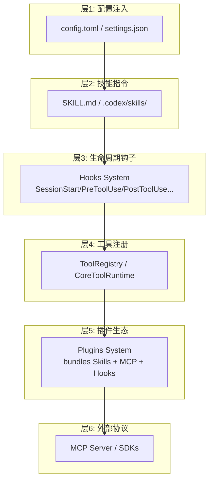

# Codex Extension Points 维度知识提取

> 来源: DeepWiki 预解析内容 (`dw_codex_content.md`)
> 日期: 2026-06-13

---

## 概述

Codex 提供了多层级的扩展体系，从最轻量的配置注入到重量级的进程外 MCP 协议集成。扩展点按照介入深度和耦合程度分为六个层次：**配置注入** -> **技能指令** -> **生命周期钩子** -> **工具注册** -> **插件生态** -> **MCP 协议 / SDK**。

---

## 1. 插件系统 (Plugins System)

插件系统是 Codex 最高层的扩展入口，将技能、MCP 服务器、应用连接器和钩子打包为统一的分发单元。^[codex-rs/core-plugins/src/remote.rs:167-173] ^[codex-rs/core-plugins/src/loader.rs:58-62]

### 1.1 核心架构

- **`LoadedPlugin`**：从磁盘验证并加载的插件实体，包含 skills、MCP servers、hooks 的完整映射。^[codex-rs/core-plugins/src/lib.rs:23]
- **`PluginsManager`**：插件生命周期的主协调器，负责列出、安装、加载跨本地和远程来源的插件。^[codex-rs/core-plugins/src/manager.rs:42]
- **`PluginStore`**：管理插件缓存目录中的物理文件和版本控制。^[codex-rs/core-plugins/src/store.rs:48]
- **`RemotePluginDetail`**：远程托管插件的详细元数据，包含 bundle 下载 URL。^[codex-rs/core-plugins/src/remote.rs:162-174]

### 1.2 插件分发渠道：Marketplace

插件通过 Marketplace 分发，由 `marketplace.json` 清单文件定义。^[codex-rs/app-server/tests/suite/v2/plugin_list.rs:78-80]

- **本地 Marketplace**：仓库中的 `.agents/plugins/` 或 `.claude-plugin/` 目录。^[codex-rs/app-server/tests/suite/v2/plugin_list.rs:43-44]
- **远程 Marketplace**：通过 ChatGPT 后端管理的远程目录，支持同步和共享。^[codex-rs/core-plugins/src/remote.rs:53-59]

远程 Marketplace 类型：`openai-curated-remote`、`workspace-directory`、`workspace-shared-with-me`。^[codex-rs/core-plugins/src/remote.rs:53-59]

### 1.3 插件安装与存储

插件采用版本化管理，存储在本地缓存中：

- **缓存根路径**：`plugins/cache/`。^[codex-rs/core-plugins/src/store.rs:1]
- **目录结构**：`plugins/cache/{marketplace}/{plugin_name}/{version}/`。^[codex-rs/app-server/tests/suite/v2/plugin_install.rs:198-200]
- **清单文件**：每个插件必须包含 `.codex-plugin/plugin.json`。^[codex-rs/core-plugins/src/manager_tests.rs:78-82]

安装流程：
1. 请求触发：`plugin/install` with `marketplacePath` 或 `remoteMarketplaceName`。^[codex-rs/app-server/tests/suite/v2/plugin_install.rs:106-111]
2. 校验：确保单源且 plugin ID 合法。^[codex-rs/core-plugins/src/manager.rs:17-18]
3. 下载/物化：远程插件下载 `.tar.gz`、验证签名、解压。^[codex-rs/app-server/tests/suite/v2/plugin_install.rs:208-213]
4. 注册：写入用户 `config.toml` 的 `[plugins]` 表，后续会话自动启用。^[codex-rs/core-plugins/src/manager_tests.rs:131-138]

### 1.4 插件共享

用户可以将本地插件上传到远程目录进行共享：

- **可见性**：`Public`、`Unlisted`、`Private` 三种级别。^[codex-rs/core-plugins/src/remote.rs:148]
- **权限角色**：`Reader` 或 `Editor`。^[codex-rs/core-plugins/src/remote.rs:38-40]
- **持久化**：`save_remote_plugin_share` 负责在远程服务上注册共享。^[codex-rs/core-plugins/src/remote.rs:50]

### 1.5 会话注入与实体映射

插件在会话初始化时注入到各个子系统：

- **工具推荐**：`list_tool_suggest_discoverable_plugins` 基于用户已安装应用推荐未安装插件（如 `slack@openai-curated`）。^[codex-rs/core/src/plugins/discoverable.rs:9-38] ^[codex-rs/core/src/plugins/discoverable_tests.rs:84-102]
- **技能注入**：`load_plugin_skills` 从插件的 `skills/` 目录提取自然语言能力。^[codex-rs/core-plugins/src/loader.rs:18] ^[codex-rs/core-plugins/src/manager_tests.rs:83]
- **钩子分发**：`load_plugin_hooks` 识别插件中 `hooks/hooks.json` 定义的自动触发器（如 `SessionStart`）。^[codex-rs/core-plugins/src/loader.rs:9] ^[codex-rs/core-plugins/src/loader.rs:51]

---

## 2. 钩子系统 (Hooks System)

钩子系统是 Claude 风格的生命周期拦截引擎，用于在关键边界执行自定义逻辑。^[codex-rs/hooks/src/engine/mod.rs:107-206] 它工作在 `codex-hooks` crate 中，与 Core Agent 的工具执行和会话生命周期集成。

### 2.1 核心能力

- **拦截 (Interception)**：在操作执行前检查，如 `run_pre_tool_use` 在工具分发前运行。^[codex-rs/hooks/src/engine/mod.rs:183-189]
- **增强 (Augmentation)**：返回 `additional_contexts` 记录到会话历史中。^[codex-rs/hooks/src/engine/mod.rs:177-179]
- **决策 (Decision Making)**：可以阻止操作（`PreToolUseOutcome` 可发出 block 信号）或提供特定权限决策。^[codex-rs/hooks/src/engine/mod.rs:11-12] ^[codex-rs/hooks/src/engine/mod.rs:193-198]
- **发现 (Discovery)**：自动从本地配置、项目级 `.codex` 文件夹和已安装插件中查找钩子。^[codex-rs/hooks/src/engine/discovery.rs:62-67]

### 2.2 钩子事件类型

共定义了 10 种事件类型 ^[codex-rs/hooks/src/lib.rs:19-30]：

| 事件类型 | 触发时机 | 用途 |
|----------|----------|------|
| `SessionStart` | 新会话/线程初始化 | 注入初始上下文、环境信息 ^[codex-rs/hooks/src/lib.rs:25] |
| `UserPromptSubmit` | 用户提交提示后、模型处理前 | 预处理/改写用户输入 ^[codex-rs/hooks/src/lib.rs:26] |
| `PreToolUse` | 工具执行前 | 阻止执行或改写输入参数 ^[codex-rs/hooks/src/lib.rs:20] |
| `PostToolUse` | 工具执行完成后 | 审计日志、结果增强 ^[codex-rs/hooks/src/lib.rs:22] |
| `PermissionRequest` | 工具需要显式用户/系统批准时 | 自定义权限决策 ^[codex-rs/hooks/src/lib.rs:21] |
| `Stop` | Agent 完成轮次或被中断 | 清理、通知外部系统 ^[codex-rs/hooks/src/lib.rs:29] |
| `PreCompact` / `PostCompact` | 对话历史压缩前后 | 保留关键上下文 ^[codex-rs/hooks/src/lib.rs:23-24] |
| `SubagentStart` / `SubagentStop` | 子 Agent 创建/销毁 | 子任务追踪 ^[codex-rs/hooks/src/lib.rs:27-28] |

### 2.3 发现与配置

**ClaudeHooksEngine** 是中央调度器，通过 `HooksConfig` 初始化（包含 feature flags、config layers、plugin sources）。^[codex-rs/hooks/src/registry.rs:30-39] ^[codex-rs/hooks/src/engine/mod.rs:100-105]

发现管道 `discovery::discover_handlers` 扫描配置栈（User、Project、System 层）和插件源，生成 `ConfiguredHandler` 实例，包含命令、超时和正则匹配器。^[codex-rs/hooks/src/engine/discovery.rs:62-82] ^[codex-rs/hooks/src/engine/mod.rs:42-52]

钩子在 `config.toml` 或 `hooks.json` 中定义，每个处理器可指定 `matcher`（正则）来限定执行范围。^[codex-rs/hooks/src/engine/mod.rs:44]

匹配器逻辑 (`matches_matcher`) ^[codex-rs/hooks/src/events/common.rs:129-144]：
- **精确匹配**：`Bash` 仅匹配 Bash 工具。^[codex-rs/hooks/src/events/common.rs:206]
- **管道可选**：`Edit|Write` 匹配任一工具。^[codex-rs/hooks/src/events/common.rs:197-202]
- **正则**：`^mcp__.*` 匹配所有 MCP 工具。^[codex-rs/hooks/src/events/common.rs:220]

### 2.4 信任体系

钩子必须被"信任"才能执行，除非启用了 `bypass_hook_trust`。^[codex-rs/hooks/src/engine/mod.rs:110]

- **托管钩子 (Managed Hooks)**：通过系统级需求或 MDM 下发的钩子自动受信任，若在 `managed_hooks` 中配置。^[codex-rs/hooks/src/engine/discovery.rs:178-200]
- **用户钩子 (User Hooks)**：需要配置中的显式信任标记。^[codex-rs/hooks/src/engine/discovery.rs:114]
- **策略强制**：托管钩子可强制 `allow_managed_hooks_only` 策略。^[codex-rs/hooks/src/engine/discovery.rs:73-82]

### 2.5 输出处理

每个钩子事件有对应的 Outcome 结构，聚合：
- **Decision**：阻止/允许/继续。^[codex-rs/hooks/src/engine/mod.rs:15-22]
- **Additional Contexts**：注入到 Agent 提示中的文本片段。^[codex-rs/hooks/src/engine/mod.rs:177-180]
- **Input Rewriting**：`PreToolUse` 钩子可返回 `updated_input` 修改工具参数；多钩子中以最后完成者为准。^[codex-rs/hooks/src/events/pre_tool_use.rs:43] ^[codex-rs/hooks/src/events/pre_tool_use.rs:148-162]
- **Output Spilling**：大文本自动溢出到临时文件，避免内存膨胀。^[codex-rs/hooks/src/engine/mod.rs:104] ^[codex-rs/hooks/src/engine/mod.rs:177-179]

### 2.6 运行时集成

`hook_runtime.rs` 连接 Core Agent 和钩子引擎 ^[codex-rs/core/src/hook_runtime.rs:102-205]：
- **Session Start**：`run_pending_session_start_hooks` 在线程初始化或子 Agent 生成时执行。^[codex-rs/core/src/hook_runtime.rs:102-155]
- **Pre-Tool Use**：`run_pre_tool_use_hooks` 在每次工具执行前调用；若被阻止则返回 block 原因给模型。^[codex-rs/core/src/hook_runtime.rs:162-205]

---

## 3. 技能系统 (Skills System)

技能系统用于发现、加载和注入高级指令、工具集和钩子配置。技能是包含自然语言指令（Markdown）和可选元数据的管理包。^[codex-rs/core-plugins/src/loader.rs:50-53]

### 3.1 技能发现层级

技能聚合自多个来源 ^[codex-rs/core-plugins/src/loader.rs:50-53]：

- **项目根**：当前工作区内的 `.codex/skills` 或 `.agents/skills` 目录。^[codex-rs/core-plugins/src/loader.rs:50-53]
- **插件缓存**：已安装插件的 `skills/` 目录。^[codex-rs/core-plugins/src/manager_tests.rs:178-183]
- **核心技能**：`codex-core-skills` crate 提供的内建技能。^[codex-rs/core-plugins/src/manager.rs:56-58]

**SKILL.md** 是技能入口文件，提供模型可读的自然语言指令。^[codex-rs/core-plugins/src/loader.rs:12-13]

### 3.2 技能配置规则

`SkillConfigRules` 从 `ConfigLayerStack` 解析，决定特定会话中哪些技能处于活跃状态 ^[codex-rs/core-plugins/src/loader.rs:19-21] ^[codex-rs/core-plugins/src/loader.rs:135-136]：
- **产品门控**：通过 `restriction_product` 检查限制某些技能仅用于特定产品（如 `Product::Claude`）。^[codex-rs/core-plugins/src/loader.rs:132-134]
- **Marketplace 策略**：`MarketplacePluginInstallPolicy`（如 `INSTALLED_BY_DEFAULT`）决定用户的初始技能集。^[codex-rs/core-plugins/src/marketplace.rs:91-100]

### 3.3 与钩子和目录服务的集成

- 插件可定义 `PreToolUse` / `PostToolUse` 钩子，在特定技能或工具触发时执行。^[codex-rs/app-server/tests/suite/v2/hooks_list.rs:190-211]
- `CatalogRequestProcessor` 提供 `hooks_list` 和 `skills_list` RPC 端点，供前端（如 TUI）展示可用能力。^[codex-rs/app-server/src/request_processors/catalog_processor.rs:120-136]

---

## 4. 工具系统 (Tool System)

工具系统管理模型可调用的工具的注册、配置、编排和执行，是扩展能力的最直接方式。

### 4.1 工具注册与路由

核心接口与组件：

- **`ToolRouter`**：工具分发的主入口，由 `ToolRouterParams` 构造（基于会话参数、MCP 工具、动态工具决定可用性）。^[codex-rs/core/src/tools/router.rs:39-45]
- **`ToolRegistry`**：存储 `ToolName` 到 `CoreToolRuntime` 执行器的映射。^[codex-rs/core/src/tools/registry.rs:48-51]
- **`CoreToolRuntime` Trait**：所有工具执行器必须实现的接口。^[codex-rs/core/src/tools/registry.rs:48-51]
- **`ToolSpec`**：使用 `JsonSchema` 描述工具参数，暴露给模型。^[codex-rs/tools/src/lib.rs:105-106]

### 4.2 动态工具与工具发现

- **`DynamicToolHandler`**：支持动态加载的工具，由插件或 MCP 在运行时提供。^[codex-rs/core/src/tools/spec_plan.rs:10]
- **`ToolSearchHandler`**：`TOOL_SEARCH_TOOL_NAME` 允许模型从大型注册表中搜索相关工具。^[codex-rs/tools/src/lib.rs:91] ^[codex-rs/core/src/tools/handlers/tool_search.rs:23-27]
- **工具命名空间**：MCP 工具使用 `mcp__{server_name}__toolname` 前缀格式。^[codex-rs/codex-mcp/src/mcp/mod.rs:44-46]

### 4.3 扩展工具处理器

`extension_tools` 处理器专门处理来自扩展系统的工具调用。^[codex-rs/core/src/tools/handlers/extension_tools.rs] 包含 `REQUEST_PLUGIN_INSTALL_TOOL_NAME` 和 `LIST_AVAILABLE_PLUGINS_TO_INSTALL_TOOL_NAME`。^[codex-rs/tools/src/lib.rs:86-88]

### 4.4 并行执行

工具系统支持并行调用：`ToolRouter` 通过 `tool_supports_parallel` 检查工具是否支持并行，由 `ToolCallRuntime` 使用 `RwLock` 协调并行与串行的调度。^[codex-rs/core/src/tools/router.rs:83-87] ^[codex-rs/core/src/tools/parallel.rs:115-119]

### 4.5 工具编排与审批

`ToolOrchestrator` 处理工具执行前的审批检查、沙箱选择、拒绝后重试等复杂流程。^[codex-rs/core/src/unified_exec/mod.rs:5-10] `Approvable` trait 允许运行时（如 `ShellRuntime`、`UnifiedExecRuntime`）定义 `ApprovalKey` 并触发异步审批请求。^[codex-rs/core/src/tools/runtimes/shell.rs:123-149]

---

## 5. 模型上下文协议 (MCP)

MCP 是 Codex 集成外部工具服务器的最重量级扩展通道，遵循 [Model Context Protocol 开放标准](https://modelcontextprotocol.io)。

### 5.1 MCP 客户端集成（消费外部工具）

**`McpConnectionManager`** 是核心管理器，管理所有 MCP 连接的生命周期：
- 维护 `clients: HashMap<String, AsyncManagedClient>` 映射。^[codex-rs/codex-mcp/src/connection_manager.rs:40-45]
- 将所有服务器的工具聚合为统一 `ToolInfo` 映射，按模型可见的限定名索引。^[codex-rs/codex-mcp/src/connection_manager.rs:1-15]

**传输方式**：
- **Stdio**：通过命令行启动子进程，管理 stdin/stdout 管道。^[codex-rs/rmcp-client/src/rmcp_client.rs:88-90]
- **HTTP (SSE + JSON-RPC)**：连接到远程 HTTP 端点，支持 OAuth。^[codex-rs/rmcp-client/src/rmcp_client.rs:91-97] ^[codex-rs/rmcp-client/src/lib.rs:14-17]

**配置位置**：全局 `~/.codex/config.toml` 或项目 `.codex/config.toml` 的 `[mcp_servers]` 表。^[codex-rs/codex-mcp/src/mcp/mod.rs:107-147]

**McpServerConfig 核心字段** ^[codex-rs/codex-mcp/src/mcp/mod.rs:107-147] ^[codex-rs/codex-mcp/src/connection_manager.rs:138-143] ^[codex-rs/core/src/mcp_tool_call_tests.rs:17-18]：

| 字段 | 类型 | 说明 |
|------|------|------|
| `transport` | `McpServerTransportConfig` | Stdio 或 HTTP |
| `enabled` | `bool` | 是否激活（默认 true） |
| `required` | `bool` | 若 true，启动失败则会话初始化失败 |
| `supports_parallel_tool_calls` | `bool` | 支持并行执行 |
| `default_tools_approval_mode` | `AppToolApproval` | auto / prompt / approve |
| `tools` | `HashMap` | 逐工具覆盖（enabled, approval_mode） |
| `oauth` | `McpOAuthLoginConfig` | OAuth 认证配置 |
| `startup_timeout_sec` | `Option<f64>` | 启动超时（默认 60s） |

**OAuth 认证**：通过 `McpOAuthLoginSupport` 管理 ^[codex-rs/rmcp-client/src/perform_oauth_login.rs:80-91]，凭证存储支持 Keyring 或本地文件（`OAuthCredentialsStoreMode`）。^[codex-rs/rmcp-client/src/rmcp_client.rs:94-97]

### 5.2 审批与过滤

- **自动审批逻辑** `mcp_permission_prompt_is_auto_approved`：tool_approval_mode 为 `Approve` 时自动通过；`AskForApproval::Never` 且 PermissionProfile 有完整磁盘写权限时也自动通过。^[codex-rs/codex-mcp/src/mcp/mod.rs:71-90]
- **工具可见性过滤** `tool_is_model_visible`：仅包含元数据中显式包含 `model` 可见性标记的工具。^[codex-rs/codex-mcp/src/connection_manager.rs:87-103]
- **工具名称规范化**：通过 `normalize_tools_for_model_with_prefix` 添加 `mcp__` 前缀。^[codex-rs/codex-mcp/src/connection_manager.rs:37]

### 5.3 Elicitation（用户信息征求）

MCP 服务器可通过 Elicitation 请求向用户征求输入（如认证信息）。^[codex-rs/core/src/session/mcp.rs:85-90]
- 自动拒绝检测：若 `elicitations_auto_deny()` 为 true，直接拒绝。^[codex-rs/core/src/session/mcp.rs:91-96]
- Guardian 审查：`GuardianMcpElicitationReviewer` 确保请求符合安全策略。^[codex-rs/core/src/session/mcp.rs:61-74]
- 暂停机制：`ElicitationPauseState` 管理活动征求期间的超时，使用 watch channel 暂停后台超时。^[codex-rs/rmcp-client/src/rmcp_client.rs:139-142]

### 5.4 启动加速与缓存

- `codex_apps` 服务器使用磁盘缓存：`load_startup_cached_codex_apps_tools_snapshot` 提供即时工具快照，后台完成完整初始化。^[codex-rs/codex-mcp/src/rmcp_client.rs:153-157]
- 60 秒默认启动超时。^[codex-rs/codex-mcp/src/connection_manager.rs:25]

---

## 6. MCP 服务器实现（Codex 作为工具提供者）

`codex-mcp-server` crate 将 Codex 本身暴露为 MCP 工具，允许外部 MCP 客户端（如 Claude Desktop、Zed Editor）通过 stdio JSON-RPC 调用 Codex。^[codex-rs/mcp-server/src/lib.rs:1-13]

### 6.1 入口与传输

- **CLI 入口**：`codex mcp-server` 子命令。^[codex-rs/mcp-server/src/main.rs:6-16]
- **传输协议**：stdio JSON-RPC（行分隔 JSON 消息）。^[codex-rs/mcp-server/src/lib.rs:132-142] ^[codex-rs/mcp-server/src/lib.rs:175-186]
- **暴露工具**：`codex`（通过 `CodexToolCallParam`）和 `codex_reply`（通过 `CodexToolCallReplyParam`）。^[codex-rs/mcp-server/src/codex_tool_config.rs:108-126] ^[codex-rs/mcp-server/src/message_processor.rs:34-37]

### 6.2 `codex` 工具参数

| 字段 | 类型 | 必填 | 说明 |
|------|------|------|------|
| `prompt` | string | 是 | 初始用户提示 ^[codex-rs/mcp-server/src/codex_tool_config.rs:27] |
| `model` | string | 否 | 模型名覆盖 |
| `cwd` | string | 否 | 工作目录 |
| `approval-policy` | enum | 否 | untrusted / on-failure / on-request / never |
| `sandbox` | enum | 否 | read-only / workspace-write / danger-full-access |
| `config` | object | 否 | 覆盖 config.toml 的单个设置 |
| `base-instructions` | string | 否 | 自定义系统提示 |
| `developer-instructions` | string | 否 | 作为 developer 角色消息注入的指令 |
| `compact-prompt` | string | 否 | 压缩对话时使用的提示 |

### 6.3 事件流与会话复用

- **事件转换**：Codex `Event` 类型翻译为 `codex/event` 通知。^[codex-rs/mcp-server/src/outgoing_message.rs:102-125]
- **会话复用**：多个线程共享单个 MCP 连接，通过通知 `_meta` 字段中的 `threadId` 区分。^[codex-rs/mcp-server/src/outgoing_message.rs:195-204]
- **审批流**：命令执行或文件补丁的交互式审批请求（elicitation 协议）。^[codex-rs/mcp-server/src/lib.rs:45-48]

### 6.4 任务编排

`run_main` 函数设置三个主要异步任务管理 stdio 生命周期 ^[codex-rs/mcp-server/src/lib.rs:59-189]：
1. **Stdin Reader Task**：读取行分隔 JSON，反序列化后发送到 processor channel。^[codex-rs/mcp-server/src/lib.rs:126-146]
2. **Processor Task**：接收消息并调用 `MessageProcessor` 方法。^[codex-rs/mcp-server/src/lib.rs:149-172]
3. **Stdout Writer Task**：接收 `OutgoingMessage`，序列化为 JSON 写入 stdout。^[codex-rs/mcp-server/src/lib.rs:175-195]

---

## 7. SDK 与外部集成

### 7.1 TypeScript SDK (`@openai/codex-sdk`)

为 Node.js 环境提供 promise-based 高级接口，通过包装 `codex` CLI 并以 JSONL 事件在标准 I/O 上交换结构化数据。^[sdk/typescript/README.md:1-13]

- **`Codex` 类**：入口点，处理全局配置（API keys、base URLs、环境变量覆盖）。^[sdk/typescript/src/codex.ts:14-22]
- **`Thread` 类**：管理特定会话，追踪 `_id` 并提供 turn 执行方法。^[sdk/typescript/src/thread.ts:41-63]
- **`CodexExec`**：管理底层二进制的 spawn 逻辑，序列化配置为 CLI 标志（`--config`、`--experimental-json`）。^[sdk/typescript/src/exec.ts:63-87]

**执行模式**：
- `thread.run()`：缓冲所有事件，返回完整 Turn 对象。^[sdk/typescript/src/thread.ts:115-138]
- `thread.runStreamed()`：返回 `AsyncGenerator<ThreadEvent>`，支持实时 UI 更新。^[sdk/typescript/src/thread.ts:66-112]

### 7.2 Python SDK (`openai-codex`)

通过 App Server 的 JSON-RPC 协议交互，使用 Pydantic 模型提供类型安全接口。^[sdk/python/README.md:1-9]

- **`Codex` / `AsyncCodex`**：同步/异步客户端，管理线程生命周期和 turn 提交。^[sdk/python/src/openai_codex/api.py:76-118]
- **Pydantic Wire Models**：将服务端告警和条目映射为 Python 对象。^[sdk/python/src/openai_codex/types.py:1-102]
- **线程管理**：`thread_start`、`thread_resume`、`thread_fork` 高级方法。^[sdk/python/src/openai_codex/api.py:129-210]
- **运行时打包**：SDK 构建锁定精确的 `openai-codex-cli-bin` 运行时依赖。^[sdk/python/README.md:10-13]

### 7.3 Shell Tool MCP Package (`@openai/codex-shell-tool-mcp`)

NPM 分发的 MCP 工具，使 MCP 能与本地 Shell 环境交互：
- **补丁版 Shell**：包含编译了 `EXEC_WRAPPER` 的特殊 Bash/Zsh 版本，允许安全执行命令。
- **沙箱状态同步**：实现 `codex/sandbox-state/update` 能力，将 Agent 当前权限级别（如 ReadOnly vs WorkspaceWrite）同步到 Shell 环境。
- **规则执行**：自动尊重工作目录中的 `.rules` 文件。

---

## 8. 配置系统（基于配置的扩展注入）

配置系统提供 7 级优先级的多层配置模型，是钩子、插件、MCP 服务器等所有扩展点的注册入口。^[codex-rs/core/src/config/mod.rs:11-18]

| 优先级 | 层级 | 来源 | 说明 |
|--------|------|------|------|
| 1 | Runtime/CLI | `--config` 标志、UI 模型选择器 | 每次调用 ^[codex-rs/core/src/config/mod.rs:145-149] |
| 2 | Repo | `$(git root)/.codex/config.toml` | 仓库级 |
| 3 | Tree | 父目录搜索 `.codex/config.toml` | 目录树级 |
| 4 | CWD | `${PWD}/config.toml` | 本地 |
| 5 | User | `${CODEX_HOME}/config.toml` | 用户全局 |
| 6 | System | `/etc/codex/config.toml` | 机器级 |
| 7 | Admin | 托管偏好（macOS profiles） | 管理层 |

### 8.1 配置约束与要求

`CloudConfigBundleLoader` 从云获取企业约束（`requirements.toml`），验证合并后的配置，确保工作区管理策略被强制执行，可限制沙箱模式、审批策略和特性标志。^[codex-rs/config/src/config_requirements.rs:144-165] ^[codex-rs/core/src/config/mod.rs:10-15]

### 8.2 配置配置文件

通过 `[profiles]` 表分组相关设置，可使用 `default_profile` 指定默认配置文件。^[codex-rs/core/src/config/mod.rs:145-149]

---

## 9. Code Mode / JavaScript REPL（脚本级扩展）

Code Mode 提供 JavaScript **yielding execution model**，允许脚本在 V8 isolate 中运行、将控制权交回模型、并在多个 turn 间保持执行状态。^[codex-rs/core/src/tools/code_mode/mod.rs:60-74]

### 9.1 核心机制

- **`exec` 工具**：`CodeModeExecuteHandler`，在 V8 isolate 中执行 JS。^[codex-rs/core/src/tools/code_mode/execute_handler.rs:41-41]
- **`wait` 工具**：`CodeModeWaitHandler`，通过 `cell_id` 恢复或轮询已 yield 的 cell。^[codex-rs/core/src/tools/code_mode/wait_handler.rs:43-43]
- **Cell 管理**：`CodeModeService` 管理执行 cell 的生命周期（execute、wait、terminate）。^[codex-rs/core/src/tools/code_mode/mod.rs:60-63] ^[codex-rs/core/src/tools/code_mode/mod.rs:76-95]
- **匿名函数级并行** (IIFE 并行)：见 [Anonymous Function-Level Parallelism with IIFEs](#9.3)。

### 9.2 嵌套工具调用

`CodeModeDispatchBroker` 作为 V8 isolate 与 Codex 工具注册表之间的桥梁 ^[codex-rs/core/src/tools/code_mode/delegate.rs:62-63]：
1. JS 脚本执行工具时，请求通过 `CodeModeDispatchWorker` 路由。^[codex-rs/core/src/tools/code_mode/delegate.rs:40-40]
2. `ExecContext` 持有 `Session` 和 `TurnContext` 引用，解析工具权限和状态。^[codex-rs/core/src/tools/code_mode/mod.rs:55-58]
3. 作用域限制：嵌套调用通常在每次 `exec` 调用内创建独立的子作用域——变量与定义跨 `exec` 调用在顶层持久化，但外部作用域不可变嵌套工具调用的执行上下文。每个 `exec` 调用的工具响应通过 Cell 级事件跟踪聚合，不污染主会话的事件流。

### 9.3 匿名函数级并行与 IIFE

JavaScript 允许通过立即执行函数表达式 (IIFEs) 实现匿名函数级的并行执行。多个 IIFE 可在同一 V8 isolate 内并发启动，共享相同的执行上下文和模块解析状态。每个 IIFE 隐式获得对 `tools` 和 `storage` 全局对象的访问，无需显式声明。访问遵循 Code Mode 的委托模型：IIFE 内的工具调用通过 `CodeModeDispatchBroker` 路由，结果通过 Promise 链收集，聚合到 Cell 的输出中，然后由模型接收。

### 9.4 多会话状态保持

`CodeModeSession` 允许 JS 环境在不同 `exec` 调用间持久化变量或存储，实现类似 REPL 的体验。^[codex-rs/core/src/tools/code_mode/mod.rs:61-61]

---

## 10. Goal Extension（目标扩展与生命周期钩子）

`GoalExtension` 通过实现 `ThreadLifecycleContributor` 和 `TurnLifecycleContributor` traits，注入到 Core Agent 的执行循环中。^[codex-rs/ext/goal/src/extension.rs:98-176]

### 10.1 生命周期注入点

1. **线程初始化**（`on_thread_start`）：初始化 `GoalAccountingState` 并注册 `GoalRuntimeHandle`。^[codex-rs/ext/goal/src/extension.rs:113-135]
2. **轮次开始**（`on_turn_start`）：捕获基线 token 使用量，标记 turn ID。^[codex-rs/ext/goal/src/extension.rs:197-210]
3. **导向注入**（Steering Injection）：若目标活跃，注入 `continuation_steering_item` 或 `objective_updated_steering_item`。^[codex-rs/ext/goal/src/steering.rs:37-47]
4. **预算执行**：当预算到达时，目标状态转为 `BudgetLimited`，注入 `budget_limit_steering_item`。^[codex-rs/ext/goal/src/steering.rs:80-99]

### 10.2 目标工具

- `create_goal`：初始化新的线程目标和预算。^[codex-rs/ext/goal/tests/goal_extension_backend.rs:54-62]
- `update_goal`：修改当前目标或状态（如标记为 complete）。^[codex-rs/ext/goal/src/extension.rs:44]

### 10.3 扩展 Traits 协议

`ThreadLifecycleContributor` 和 `TurnLifecycleContributor` 是官方扩展协议，任何 crate 都可实现这些 traits 来注入生命周期行为。^[codex-rs/ext/goal/src/extension.rs:98-176]

---

## 11. 权限请求系统（动态权限扩展）

权限请求系统允许 Agent 在执行过程中动态请求额外的沙箱权限，通过显式用户批准实现受控的权限升级。^[codex-rs/core/src/tools/handlers/request_permissions.rs:20-20]

### 11.1 两种权限请求机制

1. **独立的 `request_permissions` 工具**：通过 `RequestPermissionsHandler` 在执行前显式请求。^[codex-rs/core/src/tools/handlers/request_permissions.rs:20]
2. **内联 `additional_permissions` 字段**：伴随工具调用（如 `shell_command`、`exec_command`）传递，通过 `AdditionalPermissionProfile`。^[codex-rs/core/src/tools/handlers/unified_exec/exec_command.rs:170]

### 11.2 Sticky Permissions

授予的权限可指定作用域：
- **Turn**：仅当前操作有效。
- **Session**：会话剩余时间持续有效。

"粘性"行为通过会话级审批缓存和 `ExecPolicy` 修正实现。批准后系统可通过 `ExecPolicyAmendment` 追加规则（如允许特定命令前缀）。^[codex-rs/core/src/exec_policy.rs:20-21] 后续调用通过 `is_policy_match` 检查，匹配到 `PrefixRuleMatch` 则直接允许。^[codex-rs/core/src/exec_policy.rs:161-166]

### 11.3 网络权限集成

通过 `NetworkPermissionAmendment` 扩展网络沙箱策略，支持按协议（HTTP/HTTPS/SOCKS5）和主机/端口的细粒度规则。^[codex-rs/core/tests/suite/approvals.rs:10-18] ^[codex-rs/core/src/tools/runtimes/shell/unix_escalation.rs:159-160]

---

## 扩展难度梯度

| 难度 | 扩展方式 | 知识门槛 | 典型场景 |
|------|----------|----------|----------|
| **最低** | 配置注入 | 编辑 TOML/JSON | 添加 MCP 服务器、启用特性、设置权限 |
| **低** | 技能编写 | 编写 Markdown | 为 Agent 添加领域知识或工作流指令 |
| **中** | 钩子脚本 | 编写任意可执行脚本 + JSON schema | 自定义审批逻辑、审计日志、外部通知和告警 |
| **中** | Code Mode JS | JavaScript + V8 API | 复杂编排逻辑、数据转换、自定义工具组合 |
| **高** | 插件开发 | Rust + 插件 manifest + marketplace | 打包技能+MCP+钩子为可分发的单元 |
| **高** | Goal Extension | 实现 Rust traits | 注入自定义生命周期行为（预算、导向） |
| **最高** | MCP 服务器开发 | MCP 协议规范 + 传输层 | 提供跨平台的工具/资源/提示服务 |
| **最高** | SDK 集成 | TypeScript/Python + 进程管理 | 将 Codex 嵌入外部应用 |

---

## 关键关联

1. **插件是多个扩展点的聚合体**：一个插件可同时包含 Skills、MCP Servers、Hooks，通过统一的 `PluginManifest` 描述。加载后，Skills 注入到 SkillsManager，MCP Servers 注入到 McpConnectionManager，Hooks 注入到 Hooks System。^[codex-rs/core-plugins/src/loader.rs:128-147]

2. **钩子系统与工具系统正交**：`PreToolUse`/`PostToolUse` 钩子可拦截任何工具（含 MCP 工具），通过 `matcher` 正则精确控制范围。^[codex-rs/hooks/src/engine/mod.rs:183-198]

3. **MCP 的双向性**：Codex 既是 MCP Client（消费外部工具），也是 MCP Server（对外提供 `codex` 工具）。两者独立配置，通过不同的 crate 实现。^[codex-rs/codex-mcp/src/connection_manager.rs:40-45] ^[codex-rs/mcp-server/src/lib.rs:1-13]

4. **配置系统是所有扩展的注册入口**：钩子、MCP 服务器、插件、权限策略均通过 `config.toml` 的层层合并机制配置，并受企业级 `requirements.toml` 约束。^[codex-rs/core/src/config/mod.rs:11-159]

5. **Goal Extension 演示了 Rust trait 扩展协议**：`ThreadLifecycleContributor` 和 `TurnLifecycleContributor` 是 Codex 内部扩展的标准协议，任何 crate 可通过实现这些 traits 注入生命周期行为。^[codex-rs/ext/goal/src/extension.rs:98-176]

6. **SDK 桥接 CLI 和 App Server**：TypeScript SDK 通过 spawn + JSONL 桥接 CLI，Python SDK 通过 JSON-RPC 桥接 App Server。两者均将 Codex 的会话管理、turn 执行和事件流暴露为编程接口。^[sdk/typescript/src/exec.ts:63-87] ^[sdk/python/README.md:3-9]
