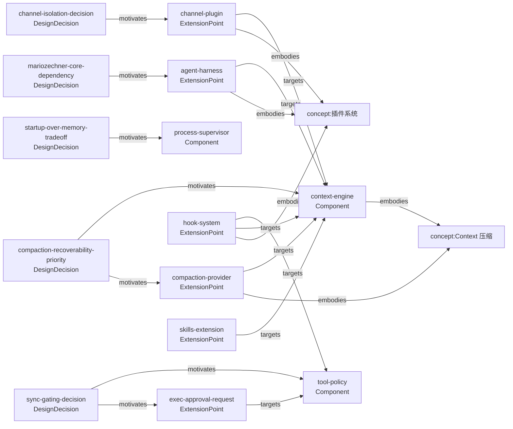

# OpenClaw — 概览

**OpenClaw** 是一个自托管的个人 AI 助手运行时，TypeScript monorepo，MIT 开源。核心理念：Gateway 是纯控制平面，产品是助手本身——你在自己的设备上运行，通过你已在用的 IM 平台与它对话。

## 架构形状

九大子系统垂直集成：Entry/Process Supervisor → Gateway（控制平面）→ Channel Plugin 系统（20+ IM 平台）→ Tool Policy/权限管理 → Agent Harness（LLM 抽象）→ Context Engine（上下文生命周期）→ Memory 系统 → Tasks/Cron 调度 → OTel 可观测性。数据流单向，Cron 是唯一的无消息触发入口。

详见：[[openclaw/dimensions/openclaw-architecture]]

## 扩展方式

三层扩展体系：`definePluginEntry` / `defineBundledChannelEntry` 入口文件 + `OpenClawPluginApi`（25 个注册方法）+ 28 个生命周期 hook。Skills Markdown 文件是最轻量的第三层，无需代码即可定制 agent 行为。

详见：[[openclaw/dimensions/openclaw-extension-points]]

## 性能取舍

启动时间：Node.js Compile Cache + lazy module + channel 按需加载。Token 成本：system prompt cache boundary（stable prefix / dynamic suffix）+ Anthropic `cache_control: ephemeral` + context compaction。牺牲的是内存（多个运行时缓存）和架构复杂度。

详见：[[openclaw/dimensions/openclaw-performance-tradeoffs]]

## 依赖态度

核心走 Node.js stdlib（3125 处 import），AI 引擎深度依赖 `@mariozechner/*`（442 处，精确锁定 `0.66.1`，替换成本极高），channel SDK 各自独立（monorepo 隔离）。70 个 runtime deps 中 29 个精确锁定，主要针对协议 SDK、native addon 包和核心 AI 引擎。

详见：[[openclaw/dimensions/openclaw-dependency-strategy]]

## 测试策略

2671 个单元测试文件 + 90+ 个独立 vitest 配置 + 五类测试（单元/契约/e2e/live/Docker）。契约测试自动覆盖所有 channel/plugin 接口，无需手写。启动性能有专用 fixture 基线和 CI 预算检查。20+ 专项 lint 脚本将架构边界约束变成可执行代码。

详见：[[openclaw/dimensions/openclaw-testing-philosophy]]

<!-- generated-mermaid -->
## 决策链

<!-- /generated-mermaid -->
